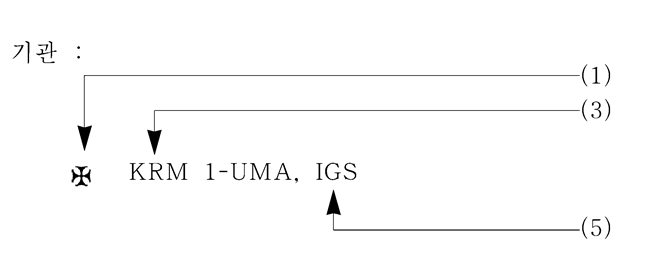

# 제1편 선급등록 및 검사

> 선급 및 강선규칙/적용지침 / RA-01-K / 2025 / KO / Rules

## 제 1 장 선급등록

### 제 1 절 일반사항

#### 101. 용어의 정의 (2020)

별도의 명문규정이 없는 한 **1장**, **2장** 및 **3장**에서 사용하는 용어의 정의는 다음과 같다.

- **1.** **선급등록(classification)**이라 함은 우리 선급기술규칙에 따라 등록검사를 받고 합격한 선박을 선급위원회의 승인 후 선명록(전산등록)에 등재하는 것을 말한다.
- **2.** **선명록(register of ships)**이라 함은 우리선급에 등록된 모든 선박들의 선명과 주요요목을 수록한 문서를 말한다.
- **3.** **선급기술규칙(Classification Technical Rules)**이라 함은 규칙 및 지침을 포함한다. *(2021)*
  - **(1)** **규칙(Rules)**이라 함은 우리 선급에서 선박, 해양구조물 및 관련기기 등에 대한 선급등록 및 검사를 시행하기 위하여 제정/개정된 제 규칙을 말한다.
  - **(2)** **지침(Guidances)**이라 함은 규칙에 대한 적용지침, 기타 지침 및 기준을 말한다.
- **4.** **선급부호(class notations)**란 선박의 특성을 선종을 포함한 문자나 번호 등으로 나타낸 표기법으로서 특정규칙요건 을 만족함을 의미하며, 이는 해당선종에 한정되거나 또는 이에 추가하여 표준선급요건을 초과하는 부가적인 자발적 인 요건을 만족하고 있음을 나타낸다. 선급부호는 등록부호, 선체/기관부호, 의장부호, 선종, 특기사항, 추가특기사항 및 추가설비부호로 구성된다.
- **5.** **건조계약일(the date of contract for construction)** ***(2022)***
  - **(1)** 건조계약일은 예정된 선박소유자와 선박제조자가 건조계약서에 서명한 일자를 의미하며, 검사신청자는 검사신청 시 선급에 건조계약일 및 계약서에 포함된 모든 선박의 건조번호(즉, 선번)를 통보하여야 한다.
  - **(2)** 최종적으로 이루어진 특정 옵션 계약선박(optional vessel)을 포함한 시리즈선의 건조계약일은 예정된 선박소유자와 선박제조자가 시리즈선의 건조계약서에 서명한 일자를 의미한다.
  - **(3)** (2)호에서 건조를 위한 단일계약 하에 선급등록을 목적으로 동일한 내용으로 승인된 도면에 따라 건조되는 선박인 경우 시리즈선으로 본다. 다만, 시리즈선에서는 다음을 조건으로 본래설계로부터 설계변경이 있을 수 있다.
    - **(가)** 이러한 변경이 선급관련사항에 영향을 주지 아니하거나 또는
    - **(나)** 선급요건에 적용을 받아야 하는 경우 이러한 변경은 예정된 선박소유자와 선박제조자가 변경을 계약한 일자에 유효한 선급요건에 적합하여야 하며, 변경계약이 없는 경우에는 그 변경이 승인을 위하여 우리 선급에 제출된 일자에 유효한 선급요건에 적합하여야 한다. 옵션계약선박의 경우 시리즈선의 건조계약일 이후 1년 이내에 최종계약이 이루어져야 시리즈선으로 간주한다.
  - **(4)** 다만, 건조계약서에 선박을 추가하거나 추가 옵션선박에 대한 수정계약을 하는 경우 건조계약일은 수정계약일이 된다. 이러한 계약의 변경은 1항부터 3항의 적용에 있어서 새로운 계약으로 취급한다.
  - **(5)** 만일 건조계약이 선종을 변경하기 위하여 개정되는 경우 선종이 변경된 이 선박의 건조계약일은 선박소유자와 선박제조자가 개정된 건조계약서 또는 새로운 건조계약서에 서명한 일자를 의미한다.
- **6.** **동형선(sister ship)**이라 함은 동일한 내용으로 승인된 도면에 따라 동일 건조자가 건조하는 선박으로서 우리 선급이 동일 또는 유사하다고 인정하는 선박을 말한다. *(2022)*
- **7.** **제조중등록검사(classification survey during construction)**라 함은 우리선급에 등록을 목적으로 최초 건조단계부터 선급기술규칙에 따라 건조되는 신조선에 대한 검사를 말한다.
- **8.** **중복선급선(double class vessel)**이라 함은 두 개의 선급에 등록된 선박으로서 각 선급이 마치 그 선박의 유일한 선급인 것처럼 모든 검사를 각 선급의 요건과 일정에 따라서 시행하는 선박을 말한다. *(2025)*
- **9.** **공동선급선(dual class vessel)**이라 함은 두 개의 선급에 등록된 선박을 말한다. 이들 선급은 업무 계획 및 절차를 포함한 업무 분담을 설명하는 문서화된 양자간 협정을 체결하고, 신조선의 경우에는 조선소와 문서화된 삼자 협정을 체결한다. *(2025)*
- **10.** **양자 협정(bilateral agreement)**이라 함은 공동선급선에 대하여 두 선급이 채택한 협정을 말한다. *(2025)*
- **11.** **삼자 협정(trilateral agreement)**이라 함은 제조중등록검사 시 공동선급선과 관련하여 두 선급 간의 책임을 기술하기 위해 조선소와 두 선급(첫 번째 선급과 두 번째 선급)이 채택한 협정을 말한다. *(2025)*
- **12.** **첫 번째 선급(first Society)**이라 함은 선주의 요청에 따라, 다른 선급과 중복선급 또는 공동선급 협정을 체결하고자 할 때 현재 선박이 등록되어있는 선급을 말한다. *(2025)*
- **13.** **두 번째 선급(second Society)**이라 함은 이미 다른 선급에 등록된 또는 등록 예정인 선박에 대하여 중복선급 또는 공동선급 협정에 따라 등록할 것을 선주로부터 요청받은 선급을 말한다. *(2025)*
- **14.** **선박소유자(the Owner)**라 함은 선박임차인, 선박소유자의 대리인 또는 선박임차인의 대리인 및 선장을 포함한다.
- **15.** **정기적(인) 검사(periodical survey)**라 함은 정기검사, 중간검사 및 연차검사를 말한다.
- **16.** **검증(verification)**이라 함은 특정 요구 사항이 충족되었다는 객관적인 증거(분석, 관찰, 측정, 테스트 또는 기록 또는 기타 증거)를 제공함으로써 확인하는 서비스.
- **17.** **지적사항(Condition(s) of Class)**이라 함은 선급을 유지하기 위하여 제한된 특정기간 내에 수행해야 하는 특정 조치, 수리 및 검사가 요구되는 사항을 말한다.
- **18.** **대체설계(alternatives)**라 함은 선급기술규칙의 규정에 적합하지 않은 설계를 말한다.
- **19.** **신기술(novel features)**이라 함은 사용하고자 하는 환경에서 사용 경험이 없는 기술로서 선급기술규칙을 직접적으로 적용할 수 없는 설계원칙 또는 특징에 기초한 기술을 말한다.
- **20.** **불가항력(force majeure)**이라 함은 선박의 손상, 사람의 접근이나 이동의 권리에 대한 정부의 제한 등으로 인하여 예상치 못하게 우리 선급이 본선에 입회할 수 없는 경우, 예상치 못하게 항구에서의 지연 또는 비정상적인 장기간의 악천후, 노동쟁의 또는 시민항쟁으로 인하여 양하를 할 수 없는 경우, 전쟁 또는 기타의 불가항력(예, 감염병 대 확산 등(Pandemic))을 말한다. *(2021)*
- **21.** **수/유밀(water/oil-tight)**이라 함은 어떤 구조가 지탱하여야 하는 최대수두에 상응하는 압력 하에서 적당한 저항 여유를 갖고 그 구조의 어느 방향으로도 물이 통과되는 것을 방지할 수 있음을 말한다. *(2022)*
- **22.** **풍우밀(weathertight)**이라 함은 어떠한 해상상태에서도 물이 선내에 침입하지 않는 것을 말한다. *(2022)*
- **23.** **기밀(air/gas-tight)이**라 함은 인접 구역(또는 경계)간의 공기나 가스가 통과되지 않는 것을 말한다. *(2022)*
- **24.** **구조시험 또는 압력시험(structural testing or tank testing)**이라 함은 일반적으로 탱크의 구조적합성 및 탱크 경계의 밀폐성을 검증하기 위한 시험을 말한다. *(2022)*
- **25.** **화물구역(cargo space)이**라 함은 화물을 위하여 사용되는 장소, 화물유탱크, 기타 액체화물 탱크 및 그 장소에 이르는 트렁크를 말한다. *(2022)*
- **26.** **해양사고(sea casualty)**라 함은 우리선급 등록선의 충돌, 좌초, 화재, 기관과 의장품의 고장 및 해양오염 등의 사고를 말한다. *(2022)*
- **27.** **27**. **코퍼댐(Cofferdam)**이라 함은 양측의 구획이 공통경계를 갖지 아니 하도록 배치된 빈 공간을 말한다. *(2024)*
- **28.** **보이드 스페이스 또는 공소(Void space or Void)**라 함은 선박에서 폐위된 빈 공간을 말한다. *(2021)*
- **29.** **탱크(tank)**라 함은 해수, 청수, 기름, 액체화물, FO(Fuel Oil), DO(Diesel Oil) 등과 같은 액체를 운송하기 위한 구역에 대한 일반적인 용어를 말한다. *(2023)*

#### 102. 등록 및 선급의 유지 (2021)

- **1.** 우리 선급의 규칙 또는 이와 동등하다고 인정되는 기준에 따라서 건조되고 검사를 받은 선박은 선급을 부여하고 선명록에 등록한다.
- **2.** 우리 선급기술규칙에 규정된 시험 및 검사는 특별히 규정된 경우를 제외하고는 검사원의 입회하에 시행하여야 한다. *(2021)*
- **3.** 우리 선급에 등록된 선박이 계속 선급을 유지하기 위해서는 우리 선급 규칙에 정하는 바에 따라 선급검사를 받고 유효한 상태로 유지되어야 한다.
- **4.** 우리 선급에 등록된 선박이 선박의 성능에 영향을 주는 개조를 하고자 할 때는 공사 착수 전에 설계도면을 제출하여 승인을 얻어야 하며 개조공사 중에는 우리 선급 검사원의 검사를 받아야 한다.

#### 103. 규칙의 표준

- **1.** 우리 선급의 규칙은 선박이 적당하게 적하되고 취급되며, 선급부호에 명시되지 않는 한. 특수하게 분포되거나 집중된 하중을 받지 않는다는 것을 전제로 한다.
- **2.** 특수한 상태 또는 모양의 선박으로 설계된 선박에 대하여는 우리 선급의 승인을 얻어야 한다.

#### 104. 제외사항

우리 선급은 트림(trim), 선체진동 또는 규칙에 명시되지 않은 기타 기술적인 특성에 대하여는 책임을 지지 아니한다. 다만, 위의 사항에 대하여 신청이 있을 때는 자문에 응할 수 있다.

#### 105. 동등효력 (2023)

이 규칙에 만족하지 않거나 적용할 수 없는 대체설계 및 신기술이 “이 규칙과 동등하다고 우리 선급이 인정하는 경우”, 이에 대한 허용을 고려할 수 있다.

### 제 2 절 선급부호

#### 201. 선급부호 【지침 참조】

우리 선급에 등록된 선박에 부여하는 선급부호는 다음에 따른다. *(2020)*

- **1.** 선급부호는 신청자(선박소유자 또는 건조자)의 신청에 따라 관련규정의 적합여부를 검토하고 만족하는 경우에 부여하며, 아래 (7)호 및 (8)호에 추가하여 신청자가 특정화물이나 용도 등에 대하여 특기사항을 신청하고 우리 선급이 적절하다고 인정하는 경우에도 이를 특기사항으로 부기할 수 있다.
- **2.** 우리 선급은 이미 부여된 선급부호가 의도한 서비스(선종 및 용도), 항해 및/또는 그 외의 요구된 규칙 등에 적합하지 않다는 것을 인지한 경우, 신청자와 협의해서 언제든지 선급부호를 변경하거나 최신화 할 수 있다.

  |  |
  | --- |
  |  |
  - **(1)** 등록부호
    등록검사의 구분에 따라 부여하는 부호로서 다음에 따른다.
    ✠ : 우리 선급의 제조중등록검사를 받고 등록하는 선박
    무부호 : 상기 이외의 경우로서 우리 선급의 제조후등록검사를 받고 등록하는 선박
  - **(2)** 선체부호
    선체구조 및 강도가 다음의 조건으로 우리 선급 규칙에 적합한 선박에 부여하는 부호
    KRS 1 : 항해구역에 제한을 받지 않는 선박
    KRS 0 : 항해구역에 제한을 받는 선박
  - **(3)** 기관부호 (주 추진기관을 갖는 선박에만 적용한다) *(2021)*
    기관장치 및 전기설비가 다음의 조건으로 우리 선급 규칙에 적합한 선박에 부여하는 부호
    KRM 1 : 항해구역에 제한을 받지 않는 선박
    KRM 0 : 항해구역에 제한을 받는 선박
  - **(4)** 의장부호
    선체 또는 기관의장이 다음의 조건으로 우리 선급 규칙에 적합한 선박에 부여하는 부호
    무부호 : 항해구역에 제한을 받지 않는 선박
    C : 연해구역을 조건으로 하는 선박
    S : 평수구역을 조건으로 하는 선박
  - **(5)** 추가설비부호
    - **(가)** 추가설비에 대한 부기부호로서 LI, LG, HMS, HMS1 등과 같은 선체사항은 선체부호 다음에, CMA, UMA, DPS, NBS, IGS, COW, STCM, RMC 등과 같은 기관사항은 기관부호 다음에 부기한다. *(2018)*
    - **(나)** 이러한 부호는 선박제조자 또는 선박소유자의 신청이 있는 경우, 관련 요건에 만족함을 확인 후 부여할 수 있다. 다만, 선원 및 선박의 안전에 영향을 미치는 설비는 관련 요건을 만족함을 확인 후 해당부호를 부여하여야 한다. *(2021)*
  - **(6)** 선종부호
    선박의 종류에 대한 부기부호로서 Oil Tanker 'ESP'(FBC), Bulk Carrier 'ESP', Cargo Ship, Passenger Ship, Tug Boat, Barge 등을 부기한다.
  - **(7)** 특기사항 *(2020)*
    해당 선종부호에 적용 가능한 경우 부여되며 화물의 종류 또는 화물특성에 따른 선박의 구조, 탱크의 형식, 적재조건, 설계온도, 압력 및 화물의 겉보기 비중 등을 표시하는 부기부호로서 선종부호 아래에 부기하며. 또한 선박의 특정한 항해구역 또는 항해조건에 대하여도 특기사항으로 부기할 수 있다.
  - **(8)** 추가특기사항 *(2020)*
    특정 선종에 관계없이 요건에 적합하면 부여되며, 구조강도평가, 피로강도평가, 선체건조감시, 대빙구조, 수중검사, 산적화물선의 침수상태 종강도/허용적재하중/파형횡격벽 등을 표시하는 부기부호로서 특기사항 다음의 위치에 부기한다.
  - **(9)** 선급부호의 선종, 특기사항, 추가설비부호의 부기상세는 **지침 부록 1-1**에 따른다. *(2021)*

#### 202. 대형요트의 선급부호

우리 선급에 등록된 대형요트의 선급부호는 **201.**의 규정에 관계없이 **대형요트 지침 1편 1장 103.**의 규정에 따른다.

#### 203. 해양레저선박의 선급부호

우리 선급에 등록된 해양레저선박의 선급부호는 **201.**의 규정에 관계없이 **해양레저선박 지침 1장 103.**의 규정에 따른다.

### 제 3 절 제조중등록검사 (2022)

#### 301. 제조중등록검사 (2021)

제조중등록검사를 받고자 하는 선박은 선체, 기관, 의장 및 비품의 구조, 재료, 치수 및 공작 등에 관하여 제조과정 시에 규정에 정하는 바에 따라 정밀한 검사를 받아야 하며 해당 규정에 적합하여야 한다.

#### 302. 도면승인 【지침 참조】

제조중등록검사를 받고자 하는 선박은 공사 착수 전에 해당 규정에 정하는 바에 따라 선체, 기관, 의장 및 비품의 구조, 치수, 재질 및 요목을 명기한 도면 및 서류 3부를 우리 선급에 제출하여 승인을 받아야 한다. 승인된 도면 또는 서류를 변경하고자 할 때에도 또한 같다.

#### 303. 재료 및 의장품

제조중등록검사를 받고자 하는 선박에 사용하는 모든 재료는 승인된 제조법 또는 이와 동등하다고 인정되는 과정에 의하여 제조된 것으로서 해당 규정에 적합한 것이어야 한다. 사용된 의장품 또는 재료의 확인을 위하여 우리 선급은 재료 또는 의장품증서 등 필요한 자료를 요구할 수 있다.

#### 304. 기관장치 등 【지침 참조】

우리 선급에 등록하고자 하는 선박에 설치할 주기관, 축계, 보일러, 압력용기, 전기설비, 중요한 용도에 사용되는 보기 및 관장치는 제조검사를 받아야 한다. 제작 완성 후에는 선박에 설치되는 조건 또는 가능한 한 그와 가까운 상태 하에서 육상시운전을 하여야 한다. 또한 자동(또는 원격)제어장치 및 계측장치 중 우리 선급이 필요하다고 인정하는 것에 대하여는 제조공장에서 별도의 시험을 요구할 수 있다.

#### 305. 공작

제조중등록검사에 있어서는 선박건조의 착수 시부터 완성될 때까지, 그리고 기계의 운전상태에 있어서의 최종시험이 끝날 때까지 재료, 공작 및 배치에 대하여 우리 선급 검사원의 입회하에 검사를 받아야 한다. 규칙 또는 승인된 도면에 부적합한 사항이 발견되거나 재료, 공작 및 배치에 불만족한 점이 발견될 경우에는 이를 교정하여야 한다.

#### 306. 제반시험 【지침 참조】

제조중등록검사에 있어서는 해당 규정에 정하는 바에 따라 수압시험, 수밀시험 및 효력시험을 한다. 또한 제어장치 및 계측장치는 선내에 설치한 후 우리 선급이 필요하다고 인정하는 시험을 하여야 한다. 이에 추가하여 케이블 수밀 관통부 검사 및 여객선의 수밀격벽 또는 갑판의 배관 관통부 검사는 다음에 따른다. *(2024)*

- **1.** 케이블 수밀 관통부 검사 *(2021)*
  - **(1)** 케이블 수밀 관통부는 제조자의 요건 및 관련 형식승인 요건에 따라 설치 및 정비되어야 한다.
  - **(2)** 케이블 관통부 밀봉시스템 기록부
    여기에는 선박에서 최종 검사 후 설치된 상태를 문서화하는 마크/식별 시스템, 설치된 각 케이블 관통부 형식에 대한 제조자 매뉴얼을 참조하는 문서, 관통부 형식에 대한 형식승인 증서, 적용 가능한 설치 도면 및 조선소에서 최종 설치 및 검사가 완료된 상태의 각 관통부에 대한 기록을 포함한다. 추가하여 검사, 변경, 수리 및 정비를 기록하기 위한 조항이 포함되어야 한다.
    - **(가)** 선박에 장착된 모든 케이블 수밀 관통부에 대해 조선소측에서 케이블 관통부 밀봉시스템 기록부를 제공해야 한다. 기록부의 예는 **부록 1-12-5** “케이블 관통부 밀봉시스템 기록부 작성 예"를 참조한다. 기록부는 인쇄물 또는 전자파일 형태로 제공할 수 있다.
    - **(나)** 검사원은 기록부를 검토하여 케이블 수밀 관통부 목록, 적용된 케이블 관통부 정보 및 운항 중 정비 및 검사 기록을 유지하기 위한 조항이 포함되어 있는지 확인해야 한다.
    - **(다)** 유인 선박의 경우, 기록부는 선박의 선내에 보관하고, 무인 선박의 경우, 선내에 적당한 보관 장소가 없는 경우에는 육상에 보관할 수 있다. 기록부는 검사원이 쉽게 이용할 수 있어야 한다.
  - **(3)** 케이블 수밀 관통부의 설치 및 정비 시 다음을 확인해야 한다.
    - **(가)** 케이블 관통부가 설치되거나 수리 후 다시 복구된 경우, 제조자의 요건 및 형식승인의 요건에 따라야 한다.
    - **(나)** 특별히 언급된 경우, 적절한 전문 공구를 사용하여야 한다.
- **2.** 여객선의 수밀격벽 또는 갑판의 배관 관통부 검사 *(2024)*
  - **(1)** 해상인명안전협약(SOLAS) 제2-1장, 13.2.3규칙에 따라 여객선의 수밀격벽 또는 갑판에 열에 의해서 급격히 그 기능이 상실될 수 있는 재료(PVC, FRP, 알루미늄합금, 납동합금 등)로된 배관시스템이 통과하는 모든 배관 관통부는**제조법 및 형식승인 등에 관한 지침 3장 26절 표 3.26.3** “배관 및 덕트 관통부”에 따른 화재시험 형식승인 및 추가해서 동 **지침 3장 41절**의 수밀시험 형식승인 요건에 따라 설치 및 정비되어야 한다.
    추가하여, 배관 관통부가 두께 3mm 이상 및 길이 900mm 이상(가능한 한 구획의 양측으로 450mm)으로서 개구가 없는 강재 또는 이와 동등한 재료로된 경우, 화재시험 및 수밀시험관련 형식시험은 요구되지 않는다. 그러한 관통부는 해당 구획과 동등한 수준의 방열재를 연장하여 적절하게 방열되어야 한다. (SOLAS 제2-2장 9.3.1규칙 참조)
    그러나 관통부는 해상인명안전협약(SOLAS) 제2-1장 2.17규칙에 정의된 “수밀보전성” 요건에도 적합하여야 한다.
  - **(2)** 해상인명안전협약(SOLAS) 제2-1장, 13.2.3규칙은 열에 의해서 급격히 그 기능이 상실될 수 있는 배관시스템에 적용되며 수밀격벽 및 갑판의 케이블 관통부에는 적용되지 않는다.
  - **(3)** 상기 관통부가 설치되거나 수리 후 다시 복구된 경우, 제조자의 요건 및 형식승인의 요건에 따라야 한다.

#### 307. 복원성 (2023)

- **1.** 여객선 및 여객선 이외의 길이 24 $\mathrm{m}$ 이상인 선박에 대하여는 복원성시험을 실시하고 그 결과에 근거하여 운항하고자 하는 항해구역에 적합한 완성 복원성자료를 작성하여 우리 선급의 승인을 받은 후 선장에게 제공하여야 한다. 다만, 일정기간에 한하여 우리 선급의 승인을 받은 임시 복원성자료로 대체 제공할 수 있다.
  비고 : *(2023)*
  1) 상기 **1**항을 적용함에 있어서 국제항해에 종사하지 아니하는 선박으로서 선박 길이가 24m 미만인 다음 각호에 해당되는 선박은 적용을 제외한다.
  - **(1)** 예인, 해난구조, 준설 또는 측량에 사용되는 선박
  - **(2)** 부선
  - **(3)** 여객선이 아니거나 카페리선이 아닌 선박으로서 호수, 하천, 항만 안에서만 항해하는 선박
  - **(4)** 기름 또는 폐기물 등을 산적하여 저장하는 해상구조물
  - **(5)** 위험물을 산적하여 저장하는 해상구조물
    2) 복원성시험이라 함은 경사시험과 동요시험을 말한다. 다만, 2008 IS Code Part A에 규정된 계산식에 의하여 선박의 횡요주기를 산출할 수 있는 경우에는 특별히 요구되는 경우를 제외하고 동요시험을 생략할 수 있다.
- **2.** **1**항의 복원성자료의 작성 및 승인은 이들 선박의 비손상복원성이 의도하는 운항에 적절한지를 증명하는 것이다. 비손상 복원성이 적절하다고 함은 선박의 크기 및 종류에 따르는 해당 기국의 기준 또는 우리 선급의 기준에 적합하다는 것을 말한다. 길이 24 $\mathrm{m}$ 이상인 선박에 대한 비손상 복원성의 수준은 고려하는 선박의 종류에 따라 국제해사기구결의 (MSC.319(89), MSC.398(95), MSC.413(97), MSC.414(97), MSC.415(97), MSC.443(99) 및 MSC.444(99)에 의하여 개정된 Part A of IMO Res.MSC.267(85) Adoption of the international code on intact stability, 2008)에서 제시하는 기준보다 낮아서는 아니 된다.
  해당 기국이 다른 기준을 인정한 경우 이 기준을 선급등록의 목적으로 사용할 수 있다. 해당 기국의 승인에 관한 증거는 선급등록의 목적으로 인정될 수 있다. *(2025)*
- **3.** **1**항에 의한 복원성자료의 보조수단으로서 복원성 계산기능을 갖는 복원성 적하지침기기가 설치되는 경우 대표적인 운항상태에 대한 계산결과를 제출하여 승인을 받아야 하며, 동 복원성 적하지침기기는 비손상, 손상 및 곡류적재복원성 등 해당 선박에 적용되는 모든 복원성 관련규정을 계산할 수 있어야 한다.
  다만, 복원성자료가 그 선박에서 발생할 수 있는 충분한 적하상태를 반영하고 있는 경우 일부 기능을 생략할 수 있다. 또한 본선 설치 후에는 승인된 계산결과에 따라 우리 선급 검사원 입회하에 확인을 받아야 한다. 이와 관련하여 복원성 적하지침기기를 설치하는 경우, 승인절차는 **지침 부록 1-10**에 따른다. *(2021)*

#### 308. 시운전

선박을 완성한 후에는 선박의 모든 설비, 기계 및 전기설비에 대하여 운전상태 하에서 시운전을 실시하고 그 성능을 확인한다. 해상시운전에 있어서는 속력시험, 후진시험, 조타시험, 비상조타시험, 선회력시험 및 기관의 작동상태와 운전 중에 있어서의 선박의 상태를 검사한다.

#### 309. 공동선급선의 경우 (2025)【지침 참조】

- **1.** 각 선급은 두 선급과 조선소가 채택한 삼자 협정에 따라 다른 선급을 대신하여 행동한다. 이 협정에는 도면 제출, 적용될 규칙, 선급간 도면승인 지적사항의 조율 및 결정 등 세부 원칙이 명확하게 정해져야 한다. 삼자 협정의 최소 내용과 관련된 서식은 국제선급연합회(IACS) 절차요건(PR) 중 1B, Annex 5에 따른다. *(2025)*
- **2.** 조선소는 선급 요건에서 요구하는 도면과 서류를 각 선급에 제출해야 한다. *(2025)*
- **3.** 조선소는 첫 번째 선급이 완전히 승인한 한 세트의 도면 및 서류를 두 번째 선급에게 제공하여야 하며, 각 선급은 자체 선급기술규칙에 따라 도면의 검토 및 승인을 수행해야 한다. 두 번째 선급은 최소한 **지침 1장 309.**에 나열된 도면을 승인하여 해당 선급기술규칙의 준수 여부를 확인해야 한다. 두 번째 선급은 상기 언급된 도면이 자체 선급기술규칙 또는 자체 선급기술규칙에서 허용하는 다른 요건을 준수하여 승인되었음을 증명하는 서면 증거를 기록해야 한다. *(2025)***【지침 참조】**
- **4.** 각 선급은 자체 선급기술규칙과 삼자 협정에 명시된 선급간 업무 및/또는 두 선급이 채택한 양자 협정(있는 경우)에 따라 선박의 제작, 건조 및 시험 중 검사를 수행해야 한다.
- **5.** 각 선급은 규정에 따라 검사를 수행하고 관련 요건에 적합한지 검증하기 위해 지적사항의 후속 조치 및 종결을 포함한 도면승인, 검사(입회, 시험 등) 등 제조중등록검사와 관련된 정보와 기록을 다른 선급에 제공해야 한다. *(2025)*
- **6.** 각 선급은 제조중등록검사 및 전체기록이 적합하게 검증되면 선박에 대한 단기선급증서를 발급해야한다. *(2025)*
- **7.** 상기 항들과 관련된 기록을 유지하여, 선급에서 제공하는 서비스의 대상이 되는 항목의 요구사항 충족 및 품질 시스템의 효과적인 운영을 입증한다. 그리고 *(2025)*
- **8.** 삼자 협정의 종료는 모든 관련 당사자가 문서에 서명하여 공식화해야 한다. 첫 번째 선급이 더 이상 연관되지 않는 경우, 두 번째 선급이 선박의 선급에 대한 전적인 책임을 부담하며 국제선급연합회(IACS)의 절차요건(PR) 42 (Procedure for Assigning Class for a New Building project when the design is already approved by an Initial Society (Based on the Classification Rules and a Memorandum of Understanding (MoU) Between a Class Society, a Shipyard and, if applicable, a Ship Owner)에 따라 조선소와 MoU를 체결해야 한다.
  조선소가 삼자 협정에서 일부 선박을 제외하고자 하는 경우에도 동일하게 적용된다. *(2025)*

#### 310. 타선급이 승인한 설계에 대한 인정 (2023)

- **1.** 국제선급연합회(IACS)의 QSCS(Quality System Certification Scheme)에 적합함이 검증된 선급에 의해 이미 승인된 설계를 가지는 선박에 대하여, 우리 선급은 국제선급연합회의 절차요건(PR) 42 (Procedure for Assigning Class for a New Building project when the design is already approved by an Initial Society (Based on the Classification Rules and a Memorandum of Understanding (MoU) Between a Class Society, a Shipyard and, if applicable, a Ship Owner)에 따른다. *(2025)*

### 제 4 절 제조후등록검사

#### 401. 제조후등록검사 【지침 참조】

- **1.** 제조후등록검사에 있어서는 등록하고자 하는 선박의 선령에 따라 그 선령에 해당하는 “정기검사와 동등한 정도”로 선체, 기관, 의장 및 비품의 구조, 재료, 공사 및 현상을 검사하고 필요에 따라 주요부분의 현재치수를 실측한다. *(2023)*
  비고 : 여기서 “정기검사와 동등한 정도”라 함은 선박의 선령 및 선종에 따라 두께계측을 포함한 선체 및 기관에 대한 정기검사, 입거검사, 프로펠러축 및 선미관축 등의 검사와 보일러검사의 해당 검사를 시행하는 것을 말한다.
- **2.** 우리 선급은 재료시험, 비파괴시험, 수압시험 및 해상시운전 등을 포함한 추가적인 검사, 시험 및 측정을 요구할 수 있다. 다만 대한민국 선박안전법을 적용받는 여객선의 경우, 우리 선급이 별도로 정하는 바에 따라 해상시운전을 실시하여야 한다. *(2023)*

#### 402. 도면의 제출 【지침 참조】

제조후등록검사에 있어서는 제조중등록검사에 준한 주요도면 및 서류를 제출하여야 한다. 만약 도면의 제출이 불가능할 때는 우리 선급 검사원이 선박에서 필요한 사항을 얻을 수 있도록 모든 편의를 제공하여야 한다.

#### 403. 타선급선의 등록검사 또는 선급이전(TOC(Transfer of Classification)) (2017) 【지침 참조】

국제선급연합회(IACS)의 QSCS(Quality System Certification Scheme)에 적합함이 검증된 선급에 등록되어 있는 선박을 우리 선급에 등록하고자 하는 경우 제출하여야 할 도면의 종류 및 검사사항 등은 우리 선급이 별도로 정하는 지침에 따른다.

#### 404. 복원성 (2023)

여객선 및 길이 24 $\mathrm{m}$ 이상의 선박에 대하여는 복원성시험을 실시하고 그 결과에 근거하여 운항하고자 하는 항해구역에 적합한 완성 복원성자료를 작성하여 우리 선급의 승인을 받은 후 선장에게 제공하여야 한다.

### 제 5 절 증서 및 보고서

#### 501. 선급증서

- **1.** 제조중등록검사를 받고 합격한 선박 및 제조후등록검사를 받고 합격한 선박은 선급위원회의 승인을 받은 후에 우리 선급의 선명록에 등록하고 선급증서를 발급한다.
- **2.** 정기검사를 받고 합격한 선박에 대하여는 새로운 선급증서를 발급한다.

#### 502. 단기선급증서 (2020)

제조중등록검사 또는 제조후등록검사를 받고 이에 합격한 때는 선급증서 발행하기 전까지 유효한 단기선급증서를 발급한다.

#### 503. 조건부 선급증서 (2020)

- **1.** 수리/검사장소/또 다른 계선장소 또는 폐선장소까지의 단일직항 등을 허용하는 경우 선급증서를 대신하여 조건부 선급증서를 발행한다. 여기서, 단일직항 등을 허용하는 경우라 함은 **901. 5**항 및 **7**항의 요건에 해당되는 경우를 말한다.
- **2.** 그 외 우리 선급이 필요하다고 인정하는 경우로서, 이는 우리 선급이 별도로 정하는 바에 따라 조건부 선급증서를 발행한다.

#### 504. 제조검사증서

선급등록을 목적으로 하지 아니하는 선박의 제조중검사 또는 선박용 기관, 보일러, 기타 보기 및 기자재의 제조중검사를 받고 합격한 것에 대하여는 제조검사증서를 발급한다.

#### 505. 검사보고서

선박의 등록검사와 선급유지를 위한 지정된 검사를 받은 선박에 대하여는 선박검사보고서를 발급한다. 선박검사보고서에는 선박의 요목, 검사결과, 차기검사의 종류 및 시기 등을 기재한다.

#### 506. 증서 및 보고서의 보관 (2020)

선급증서(단기선급증서 또는 조건부 선급증서 포함), 건명서 및 검사보고서 등은 선장이 항시 선내에 보관하고 우리 선급 검사원이 요구할 경우에는 이를 제시하여야 한다.

#### 507. 증서상의 기재

- **1.** 우리 선급 검사원은 선급에 등록된 선박에 대하여 연차, 중간 또는 정기검사를 시행하고 합격한 경우, 검사기준일이 변경된 경우 또는 증서의 효력을 연장시킨 경우에는 선급증서의 부록 또는 단기선급증서의 이면에 기록 서명한다.
- **2.** **건 조일의 지정**
  - **(1)** 제조중등록검사가 완료된 년도, 월 및 일을 “건조일”로서 명시한다. 제조중등록검사 완료 후 선박의 운항개시가 상당히 지연되는 경우 운항개시일도 명시할 수 있다.
  - **(2)** 선박이 개조되는 경우 선박에 지정된 건조일은 그대로 유지하고 개조부분에 대하여는 **2장 12절**에 따른다.

#### 508. 증서의 재발행 및 반환 (2020)

- **1.** 선급증서(단기선급증서 또는 조건부 선급증서 포함), 건명서 및 검사보고서를 분실 또는 손상하였거나 기재사항에 변경이 생겼을 경우에는 즉시 재발행 신청을 하여야 한다.
- **2.** 단기선급증서 또는 조건부 선급증서를 가진 선박이 선급증서를 받은 때, 증서가 분실된 때를 제외하고 증서재교부를 받은 때 또는 등록이 취소된 때는 선급증서, 구선급증서(단기선급증서 또는 조건부 선급증서 포함)를 즉시 우리 선급에 반환하여야 한다.

#### 509. 관련설비의 증명서

우리 선급은 신청에 따라 선박에 관련되는 원동기, 축계, 보일러, 압력용기, 보조기계, 전기장치 및 기타의 기계설비에 대하여 검사를 하고, 이에 합격한 때는 해당증명서를 발급할 수 있다.

#### 510. 선급유지증명서 (2023)

우리 선급은 선박소유자 또는 선박소유자의 동의를 얻은 자가 신청할 경우, 등록된 선박이 규칙에 따라 선급을 유효한 상태로 유지하고 있음을 확인한 후 선급유지증명서를 발급한다.

### 제 6 절 검사신청

#### 601. 등록검사 (2021)

제조중등록검사를 받고자 하는 선박에 있어서는 선박제조자가, 제조후등록검사를 받고자 하는 선박에 있어서는 선박소유자가 검사신청을 하여야 한다. 검사신청은 문서로 우리 선급에 접수되어야 한다. 다만, 등록검사 대상 선박은 우리 선급이 별도로 정하는 바에 따르며, 다음의 경우 우리 선급은 검사신청을 거절하거나 취소 할 수 있다. *(2025)*

- **1.** 우리 선급은 검사신청서가 접수된 후 신청된 검사가 계속하여 진행되지 않는 등 수검의사가 불명확한 경우
- **2.** 검사수수료가 지불되지 아니한 경우
- **3.** 본선이 우리 선급의 요건에 맞지 아니한 경우 등 우리 선급이 필요하다고 인정하는 경우

#### 602. 등록 후 검사 (2021)

선급유지를 위하여 행하는 선박의 검사는 선박소유자가 검사신청을 하여야 한다. 검사신청은 문서로 우리 선급에 접수 되어야 한다. 다만, 다음의 경우 우리 선급은 검사신청을 거절할 수 있다.

- **1.** 우리 선급은 검사신청서가 접수된 후 신청된 검사가 계속하여 진행되지 않는 등 수검의사가 불명확한 경우
- **2.** 검사수수료가 지불되지 아니한 경우
- **3.** **규칙 9절**의 선급정지/탈급절차에 따라야 하는 경우 등 기타 우리 선급이 필요하다고 인정하는 경우

#### 603. 증서의 재교부 (2020)

선급증서(단기선급증서 또는 조건부 선급증서 포함), 건명서 및 검사보고서의 재교부 신청과 반환은 선박소유자가 조치하여야 한다.

### 제 7 절 선박소유자의 책임 및 협력의무

#### 701. 일반 (2020)

- **1.** 선박소유자는 등록된 선박이 환경, 적재, 운항 및 그 외 선급규칙을 기본으로 한 요건에 따라 능력이 있고 자격을 갖춘 선원 또는 운항관리자에 의해 적합하게 선적, 운항 및 유지되도록 하여야 한다.
- **2.** 선박소유자는 등록된 선박에 적용되는 모든 협약증서의 유효성의 보장을 포함하여 국제만재흘수선협약, 해상인명안전협약 및 기타 관련 협약 등이나 그 외 정부의 관계 제 규정이 준수되는 적절한 상태로 항상 유지되도록 해야 한다.
- **3.** 선박소유자는 등록된 선박에 대한 선급증서의 유효성 보장을 포함하여 선급규칙에 요구되는 차기 검사 시까지 등록된 선박의 적절한 유지관리를 보장할 책임이 있다.

#### 702. 보고사항

선급에 등록된 선박에 대하여 다음의 경우가 발생한 경우에는 지체 없이 우리 선급에 보고하여야 한다.

#### 703. 검사협력

- **1.** 선급의 등록검사 또는 선급유지를 위한 검사를 받고자 할 때는 규칙에 정하는 바에 따라 검사 신청자는 검사준비를 하여야 한다. 이러한 검사준비는 안전하고 효과적인 검사를 위한 적합한 조명, 환기 및 접근설비의 업무환경과 안전조치를 포함하여야 한다.
- **2.** 검사를 받을 때는 검사사항에 따라 선박의 소유자, 선장, 기관장 또는 그 대리인이 검사에 입회하고 필요한 지원을 하여야 한다.
- **3.** 검사를 받고자 하는 경우 신청자는 미리 우리 선급의 검사원에게 정확한 수검 장소와 수검사항을 통보하여야 한다.
- **4.** 선박검사에 전문공급자를 사용하고자 하는 경우 원칙적으로 우리 선급의 승인을 받은 전문공급자를 사용하여야 하고, 승인절차 및 항목에 대하여는 **전문공급자 승인 지침**에 따른다. *(2021)*
- **5.** 검사신청자는 신청서에 기재한 사항과 우리 선급에 고지한 사항 및 제출한 자료 등에 일체의 허위가 없음을 보증한다.

#### 704. 협력의무

#### 806.의 규정에 따라 고객에 대하여 우리 선급이 갖는 기밀유지의 일반적인 의무에도 불구하고, 우리 선급의 고객은 각 선급이 관련선급(사고와 관련된 선박과 유사한 선박 또는 동형선을 등록하고 있는 선급)에게 조기경보제도(국제선급연합회(IACS)의 절차요건(PR) No.2A Procedure for Hull Failure Incident Reporting과 No.2B Procedure for Early Warning of Serious Hull Failure Incidents - “Early Warning Scheme - EWS” 참조)에 정의된 중대한 선체구조 및 기관장치결함에 관한 관련기술정보(다른 기관의 특정 자산일 수 있는 선박의 도면은 제외)를 제공하도록 요구하는 조기경보제도에 우리 선급이 참여하는 것을 허용하여야 한다. 이는 이러한 유용한 정보가 공유 및 활용되어 조기경보제도가 제대로 가동될 수 있도록 하기 위함이다.

우리 선급은 관련선급에게 제공된 정보의 상세를 고객에게 서면으로 제공되어야 한다.

### 제 8 절 검사원의 권한과 의무 및 선급의 책임과 업무 범위 (2021)

#### 801. 검사원의 권한 【지침 참조】

- **1.** 우리 선급 검사원은 검사신청이 접수된 경우, 합리적인 시간에 임검할 수 있다. *(2021)*
- **2.** 우리 선급 검사원은 선급기술규칙에 정하는 검사준비를 하지 아니할 때 또는 입회자가 없을 때는 검사를 중지할 수 있다. *(2021)*
- **3.** 우리 선급 검사원이 선박의 상태에 따라 필요하다고 인정할 때는 해당 검사 종류에 따라 필요한 사항 이외의 사항에 대하여도 검사를 요구할 수 있다.
- **4.** 우리 선급 검사원은 선박의 선체, 기관, 기타 설비가 우리 선급기술규칙의 규정에 저촉되거나, 손상 또는 마모되었을 때는 수리 또는 새 것으로 교환할 것을 검사 신청자에게 통고하고, 신청자는 이에 대한 검사를 받아야 한다. *(2021)*

#### 802. 검사원의 의무

- **1.** 우리 선급 검사원은 선급 등록검사 또는 등록된 선박, 재료, 의장품 및 기관장치 등에 대한 검사신청이 있을 때는 관련 검사에 임하여야 한다. *(2021)*
- **2.** 우리 선급 검사원은 검사 집행에 있어서 선박소유자의 편의를 위하여 불필요하고 이중으로 되는 검사 또는 공사를 피하여야 한다.

#### 803. 선급의 책임

- **1.** (선급의 책임) 우리 선급의 과실로 인하여 선박소유자가 입은 손해 또는 손실에 대하여 우리 선급은 손해배상을 한다. 이때 손해배상액은 해당 검사수수료의 10배 또는 미화 100만 달러 중에서 큰 것으로 제한한다.
- **2.** **1**항의 손해배상액의 제한은 고의 또는 손해가 발생할 염려가 있음을 인식하면서 무모하게 행한 작위 또는 부작위로 인한 경우에는 적용하지 아니한다.
- **3.** (시효) 우리 선급이 제공한 검사 또는 용역 기타 관련업무로 발생한 손해에 대한 손해배상 청구권은 그 손해를 안 날로부터 6개월이 지나면 소멸한다.
- **4.** (전속관할 및 준거법) 우리 선급이 제공한 검사 또는 용역 기타 관련업무로 인하여 발생한 다툼은 대한민국의 법원이 전속적인 관할을 가지고 대한민국의 법률을 준거법으로 한다.

#### 804. 선급의 범위 (2021)

- **1.** 우리 선급은 선박과 그 선박에 설치된 의장품이나 기관장치 등의 무결성이나 안전을 보증하는 보증인이 아니다. 증서, 보고서, 도면 또는 문서의 검토나 승인에 대한 유효성, 적용 및 해석은 전적으로 우리 선급기술규칙에 따라 결정되며, 이에 대한 유일한 판단 권한은 우리선급이 가진다.
- **2.** 우리 선급기술규칙의 적용 및 해석은 우리 선급이 한다. 우리선급을 배제한 상태에서 규칙에 대한 어떠한 언급도 유효하지 않다.
- **3.** 우리 선급은 우리 선급이 제공하지 아니한 서비스 또는 관련된 정보의 사용에 대한 책임을 지지 아니한다.

#### 805. 선급의 독립성

우리 선급 또는 우리 선급의 임직원은 그 서비스에 속한 항목의 설계자, 제조자, 공급자, 설치자, 구매자, 소유자, 사용자, 정비관리자 및 기타 어떠한 사람으로부터 영향을 받지 않고 독립된 입장에서 고객에게 제공하는 업무를 공정하게 수행하여야 한다.

#### 806. 기밀유지

우리 선급 또는 우리 선급의 임직원은 기록의 취급 과정에서 인지한 기밀 사항을 해당 고객의 동의 없이 제3자에게 열람, 인도 또는 누설하여서는 아니 된다. 다만, 정부, 수사기관 또는 법원 등의 요청이 있는 경우에는 예외로 할 수 있다.

#### 807. 선박정보의 활용

우리 선급은 선급 및 정부대행 증서발급의 상태와 관련된 특정 정보를 공개할 수 있다. 이 정보는 우리 선급의 웹사이트 또는 다른 미디어에 발표될 수 있으며, 선박의 선급, 우리 선급이 시행한 모든 검사의 종류, 일자 및 장소, 우리 선급이 발행한 모든 선급 및 정부대행증서의 만료일자, 검사지정일, 선급이전, 선급정지, 탈급, 회복에 관련된 정보를 포함할 수 있다.

#### 808. 제출된 도면 및 서류의 제공

우리 선급에 제출된 도면 및 서류는 선박소유자의 사본교부 신청이 있고 선박의 유지 관리에 필요하다고 우리 선급이 인정하는 경우 제공할 수 있다.

### 제 9 절 선급정지, 탈급 및 재등록

#### 901. 선급정지 및 회복

- **1.** 다음의 경우 자동적으로 선급이 정지된다.
  - **(1)** 지정일까지 또는 **2장 401.**의 **1**항에 따라 허용된 연장의 만료일까지 정기검사를 완료하지 아니한 경우. 다만, 운항을 재개하기 전에 정기검사를 완료하기 위하여 지정일까지 또는 **2장 401.**의 **1**항에 따라 허용된 연장의 만료일까지 검사원의 입회하에 있는 경우에는 그러하지 아니하다.
  - **(2)** 해당 검사기간의 만료시점까지 연차검사 또는 중간검사를 완료하지 아니한 경우. 다만, 연차검사 또는 중간검사를 완료하기 위하여 해당 검사기간의 만료시점까지 검사원의 입회하에 있는 경우에는 그러하지 아니하다.
    상기 지정된 검사를 만족하게 완료한 경우 선급은 회복된다. 이러한 검사의 차기 지정일은 원래 지정일로부터 산정한다. 다만 선급이 정지된 일자부터 회복된 일자까지 그 선박의 선급은 정지된 것으로 인정한다. 선급을 회복하기 위하여 시행하여야 하는 정기검사는 그 검사를 시행하는 시기의 선령에 기초하는 것이 아니라 기한이 지난 원래 검사지정일의 검사요건에 기초하여야 한다. *(2021)*
- **2.** 다음의 경우 우리 선급의 선급정지절차에 따라 선급이 정지될 수 있다. *(2020)*
  선급정지사유가 해소된 경우 또는 기한이 지난 검사가 만족하게 조치되었다고 확인한 경우 선급은 회복된다. 우리 선급이 결정한 선급정지는 선급정지사유가 발생한 일자부터 발효되며 지정된 항목 및/또는 검사가 조치되어 선급이 회복될 때까지는 유효하다.
  - **(1)** 선급부호에 포함되지 아니한 용도나 조건 또는 지정된 항해구역을 넘어선 운항 등 규칙 요건에 적합하게 운항되지 아니한 경우
  - **(2)** 우리 선급 규칙에서 정한 기준에 미달된다고 인정한 때
  - **(3)** 선급유지에 영향을 주는 손상을 입고 우리 선급의 규정에 적합하게 수리하지 아니하거나 또는 선박을 우리 선급의 승인 없이 개조한 때
  - **(4)** 지정된 만재흘수선 이상으로 적하하여 운항하거나 또는 건현표시를 지정된 것보다 높이 표기한 때
  - **(5)** 연차검사, 중간검사 및 정기검사를 제외하고 선급유지를 위한 지정된 검사를 지정일까지 받지 아니하거나 또는 지정일까지 합의에 의하여 연기되지 아니한 경우
  - **(6)** 연차검사 시 지정된 또는 기한이 지난 계속검사항목이 검사되지 아니하거나 또는 합의에 의하여 연기되지 아니한 경우
  - **(7)** **1장**, **702.** 선박소유자의 책임 및 협력의무 중 “보고사항”에 언급된 항목에 대하여 지체 없이 우리 선급에 보고하지 않은 경우 *(2020)*
  - **(8)** 항만국통제(PSC) 검사에서 심각한 결함사항으로 인하여 출항정지된 선박 *(2021)*
  - **(9)** 기국으로부터 협약증서가 회수된 선박 또는 특별한 사유 없이 무국적 상태로 운항하는 선박 *(2021)*
  - **(10)** 한 국가, 초국가적 또는 국제적 정부기구가 부과하는 제재, 금지조항, 제한조치 등을 위반하거나 위반하는 것으로 의심되는 선박 *(2022)*
  - **(11)** 선박 또는 선박소유자로 인하여 우리 선급이 사회적으로 신뢰성을 상실하거나 기타 부정적인 상황에 노출될 수 있다고 판단되는 경우 *(2022)*
  - **(12)** 검사 수수료를 지불하지 아니한 경우 *(2020)*
- **3.** 검사의 기한을 넘기기 전에 우리 선급의 규정에 따라서 계선된 선박인 경우 검사를 받지 않아 기한이 지났을지라도 선급이 정지되지는 아니한다. 그러나 검사를 받지 아니하여 선급이 정지된 후에 계선된 선박인 경우 기한이 지난 검사를 완료하기 전까지는 선급이 정지된 상태로 유지된다.
- **4.** 공동선급선으로서 상대선급의 선급이 기술적인 이유로 정지됨을 통보받은 경우 이러한 선급정지가 적합하지 아니하다고 문서화하지 않는 한 우리 선급도 이 선박에 대하여 선급정지절차에 따라 선급을 정지시킨다.
- **5.** 정기적 검사의 기한을 넘긴 선박이 폐선을 위한 항해를 하고자 하는 경우 선박에 대한 선급정지는 보류될 수 있고 계선 또는 최종양하항에서 폐선장소까지 단일직항의 평형수항해를 허용할 수 있다. 이 경우 선박이 의도하는 항해에 만족한 상태임을 검사원이 인정하는 조건으로 관련 항해조건이 명시된 조건부 선급증서를 발행할 수 있다.
- **6.** 불가항력(force majeure) *(2020)*
  선박소유자 또는 우리 선급의 통제한계를 정당하게 넘어서는 불가항력의 상황으로 인하여 선박이 허용된 기간의 만료시점에 기한이 지난 검사를 완료할 수 있는 항구에 있지 아니한 경우 우리 선급은 다음의 조건으로 합의된 양하항까지의 직항을 선급유지상태로 허용할 수 있다. 또한 필요한 경우 검사를 완료할 수 있는 합의된 항구까지의 평형수항해를 허용할 수 있다.
  - **(1)** 선박기록의 검토
  - **(2)** 현재 항구에서 예상치 못하게 검사원이 본선에 입회할 수 없는 경우 첫 번째 도착항에서 지정된 검사 및/또는 기한이 지난 검사 그리고 지적사항에 대한 검사 *(2020)*
  - **(3)** 선박이 양하항까지의 단일항해 및 필요시 수리시설까지의 연이은 평형수항해를 할 수 있는 상태인지에 대한 우리 선급의 만족(현재 항구에서 예상치 못하게 검사원이 본선에 입회할 수 없는 경우 선장은 선박이 가장 가까운 도착항까지의 항해를 할 수 있는 상태인지를 확인하여야 한다.)
  - **(4)** 감염병 대 확산(Pandemic)과 같은 불가항력의 상황으로 인하여 선박이 허용된 기간의 만료시점에 검사를 완료할 수 없는 경우, 우리 선급은 다음의 모든 조건으로 합의된 기한까지 선급유지상태를 허용할 수 있다. *(2023)*
    이때 시행하여야 하는 검사는 그 검사를 시행하는 시기의 선령에 기초하는 것이 아니라 기한이 지난 원래 검사지정일의 검사요건에 기초하여야 하며 이후 차기 검사지정일자는 원래의 지정일로부터 산정한다. *(2021)*
    만일 이러한 불가항력으로 이미 선급이 자동적으로 정지된 경우 상기조건으로 선급이 회복될 수 있다.
    - **(가)** 기국의 승인(해당되는 경우)
    - **(나)** 선박기록의 검토
    - **(다)** 검사원이 정당하게 참석할 수 있는 이용 가능한 시설을 갖춘 첫 번째 도착항에서 지정된 검사 및/또는 기한이 지난 검사 그리고 지적사항에 대한 검사
    - **(라)** 선박의 합의된 연기 기간 동안 만족스럽게 선급을 유지할 수 있는 상태임을 확인하는 선박소유자가 제출한 증거에 대한 검토(여기서, 우리 선급은 원격검사나 수용 가능한 사진, 비디오 또는 기타 구조물/장비 상태에 대한 증거의 제출을 요구할 수 있다)
    - **(마)** 선박이 합의된 기간 동안 우리 선급의 규칙 및 규정을 준수하고, 만족스럽게 서비스를 계속할 수 있는 상태임을 알리는 선장의 진술서
- **7.** 계선 중인 선박이 기한을 지난 정기적 검사가 있는 상태에서 계선위치로부터 수리/검사/또 다른 계선장소까지 항해를 하고자 하는 경우 선박에 대한 선급정지는 보류될 수 있고, 우리 선급이 기한이 지난 검사 및 계선기간을 고려한 범위에 대하여 검사를 하고 만족한 상태에 있다는 조건으로, 계선위치로부터 수리/검사/또 다른 계선장소까지 단일직항의 평형수항해를 허용할 수 있다. 이 경우 의도하는 항해에 대한 조건이 명시된 조건부 선급증서를 발행할 수 있다. 이 요건은 계선되기 전에 이미 선급이 정지된 선박에는 적용할 수 없다. *(2020)*
- **8.** 선택적 부기부호와 관련된 요구사항을 만족시키지 못하는 경우, 해당 부기부호에 한해서만 정지 또는 철회시킬 수 있으며, 이 경우 선급은 계속 유지된다. *(2018)*

#### 902. 탈급 (2021)

- **1.** 다음의 경우 선급위원회의 승인을 거쳐 해당선박을 탈급시킬 수 있다.
  - **(1)** 6개월 동안 선급이 정지된 경우. 다만, 계선, 해양사고에 따른 처분대기 또는 선급회복을 위한 입회 등의 경우와 같이 선박이 운항을 하지 아니하는 경우, 보다 긴 선급정지 기간을 인정할 수 있다.
  - **(2)** 선박이 전손된 것으로 보고된 경우
  - **(3)** 선박이 행방불명된 경우
  - **(4)** 선박이 폐선된 것으로 보고된 경우
  - **(5)** **2장 103.**에 규정된 선급유지를 위한 지정된 검사 시 우리 선급의 규칙에 적합하지 아니하다고 검사원이 보고한 경우
  - **(6)** 항만국통제(PSC) 검사에서 심각한 결함사항으로 인하여 출항정지된 선박
  - **(7)** 기국으로부터 협약증서가 회수된 선박 또는 특별한 사유 없이 무국적 상태로 운항하는 선박
  - **(8)** 한 국가, 초국가적 또는 국제적 정부기구가 부과하는 제재, 금지조항, 제한조치 등을 위반하거나 위반하는 것으로 의심되는 선박 *(2022)*
  - **(9)** 선박 또는 선박소유자로 인하여 우리 선급이 사회적으로 신뢰성을 상실하거나 기타 부정적인 상황에 노출될 수 있다고 판단되는 경우 *(2022)*
- **2.** **1**항의 규정에도 불구하고, 선박소유자의 신청이 있는 경우 우리 선급은 해당선박을 탈급시킬 수 있다.

#### 903. 탈급 유예 (Deferment for Class Withdrawal) (2021)

- **1.** **1**. 장기간 조업 중인 어선의 경우, 검사계획서 및 조업 중임을 증명할 수 있는 서류 등을 제출할 시, 선급위원회의 승인을 거쳐 해당선박의 탈급을 유예할 수 있다.

#### 904. 재등록

선급의 등록을 받은 선박이 탈급하였다가 재차 등록하고자 할 경우에는 선령, 선박의 현상 및 기타 사정을 고려하여 등록검사에 준한 검사를 하고 우리 선급이 합격을 인정한 때는 재등록 할 수 있다.

### 제 10 절 수수료

#### 1001. 검사 수수료

- **1.** 우리 선급의 검사원이 검사나 시험에 입회한 때는 별도로 정하는 수수료 규정에 따라 모든 검사와 재료시험 및 증서발급에 대한 검사 수수료를 받는다.
- **2.** 검사를 위하여 출장한 때는 여비, 검사로 인한 통신료 등 모든 경비를 받는다.
- **3.** 정상 근무시간외 및 휴일에 검사를 한 때는 시간외 수당을 받는다.

#### 1002. 도면심사 수수료

설계도면 및 기타 서류의 심사를 한 경우에는 별도로 정하는 수수료 규정에 따라 도면심사 수수료를 받는다.

### 제 11 절 불복신청

#### 1101. 불복신청

우리 선급이 행한 검사에 대하여 선박소유자 및 조선소와 검사원간에 규정의 적용, 재료, 공작, 수리범위 등의 불복이 있을 때는 이의를 신청할 수 있다.

#### 1102. 재검사

검사에 대한 불복이 있을 때는 우리 선급은 재검사를 실시하여야 한다.

#### 1103. 재검사료

재검사를 한 경우의 검사 수수료는 불복신청을 한 측에서 부담한다.

### 제 12 절 정부규정 및 국제협약 등 요건과 검사 (2022)

#### 1201. 정부규정 (2022)

우리 선급기술규칙에 규정되어 있지 아니한 사항에 대하여 정부의 관계 제 규정의 적용을 요구할 수 있다.

#### 1202. 국제협약 등

- **1.** 대한민국 및 기타 정부에 등록된 선박으로서 우리 선급에 등록된 선박 또는 등록하고자 하는 선박 중 다음의 선박은 국제만재흘수선협약, 해상인명안전협약 및 기타 관련 협약 등의 규정에 따라야 하며 우리 선급은 해당 정부의 권한의 위임에 따라 관련증서를 발행한다.
  - **(1)** 대한민국 국적선으로서 위 협약의 적용을 받는 선박
  - **(2)** 우리 선급이 위 협약에 의한 증서발급의 권한을 부여받은 나라의 국적을 가진 선박으로서 위 협약의 적용을 받는 선박에 대하여 협약증서 발급의 신청이 있는 경우
- **2.** 별도의 명문규정이 없는 한 해상인명안전협약, 국제만재흘수선협약, 해양오염방지협약 및 이들 협약의 강제적인 코드에 규정된 거리는 형치수를 사용하여 계측되어야 한다.

#### 1203. 국제선급연합회(IACS)의 통일해석(UI)

- **1.** 우리 선급에 등록된 선박은 우리 선급이 기국을 대신하도록 위임된 인정기관인 경우 기국으로부터 다른 해석을 적용하여야 한다는 서면지시가 없는 한 국제선급연합회(IACS)의 통일해석(UI)에 명시된 시행일자 및 규정에 따라서 해당 선박, 기관 및 의장에 적용되는 국제선급연합회(IACS)의 통일해석(UI)에 적합하여야 한다.
- **2.** **1**항에 규정된 요건은 국제선급연합회(IACS)의 통일해석(UI)이 명백히 소급적용을 요구하는 경우 이외에는 소급하여 적용하지 아니한다.

### 제 13 절 기타의 장치 또는 설비의 등록

#### 1301. 등록 (2021)

우리 선급은 신청에 따라 선박 이외에 이동식 해양굴착구조물, 이동식 해양구조물, 고정식 해양구조물, 준설선, 플로팅․독 및 기타의 장치 또는 설비에 대하여 검사를 하고 이에 합격하면 선명록에 등록하고 선급증서를 발급할 수 있다. 이 경우 표시하는 선급부호는 **지침 부록 1-1**에 따른다.

#### 1302. 증서 및 보고서

#### 1301.의 규정에 따라 제조중 또는 제조후등록검사를 받고 합격한 장치 또는 설비에 대한 증서 및 보고서는 5절의 규정을 준용한다.

#### 1303. 제조 및 검사 (2023)

이 절의 규정에 따라 우리 선급에 등록하고자 하는 장치 또는 설비에 대한 제조 및 검사에 관한 규정은 **“**별도로 정하는 바**”**에 따른다.

#### 1304. 등록의 유지 (2023)

이미 우리 선급에 등록된 장치 또는 설비가 우리 선급의 등록을 계속 유지하기 위하여 **“**별도로 정하는 규정”에 따라 선급유지를 위한 지정된 검사를 받아야 한다. 이때의 검사신청은 장치 또는 설비의 소유자나 이의 관리책임자로서 소유자를 대신할 수 있는 사람이 하여야 한다.

#### 1305. 관련규정

이 절에 따른 장치 또는 설비에 대하여는 **6절**부터 **11절**의 규정을 준용한다.

### 제 14 절 외부감사

#### 1401. 외부감사

- **1.** 기국 등 외부기관의 감사자는 우리 선급이 수행하는 선급업무가 해당 감사요건에 적합한지 여부를 평가하기 위한 감사를 할 수 있다.
- **2.** **1**항의 감사자는 감사와 관련된 선박, 조선소 또는 제조공장에의 출입을 요구할 수 있으며 이러한 경우 우리 선급은 해당 장소에 대한 감사자의 출입허가 및 필요한 지원을 요청할 수 있다.

### 제 15 절 기타

#### 1501. 석면을 함유한 재료의 새로운 설치

- **1.** 이 규정은 구조, 기계류, 전기장치 및 설비에 사용되는 재료에 적용한다.
- **2.** 모든 선박에 대하여 석면을 함유한 재료의 새로운 설치는 금지되어야 한다. 
