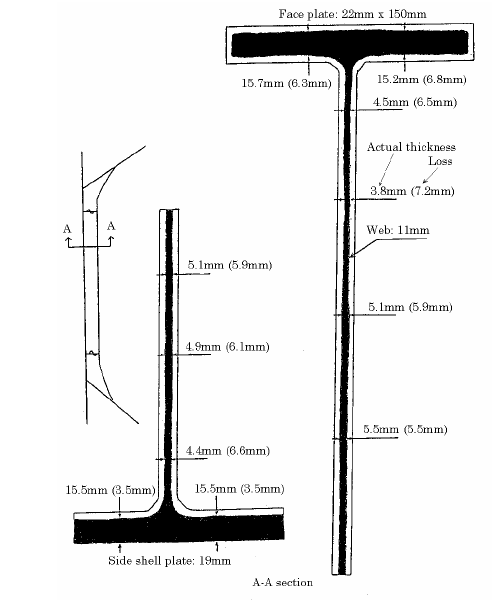
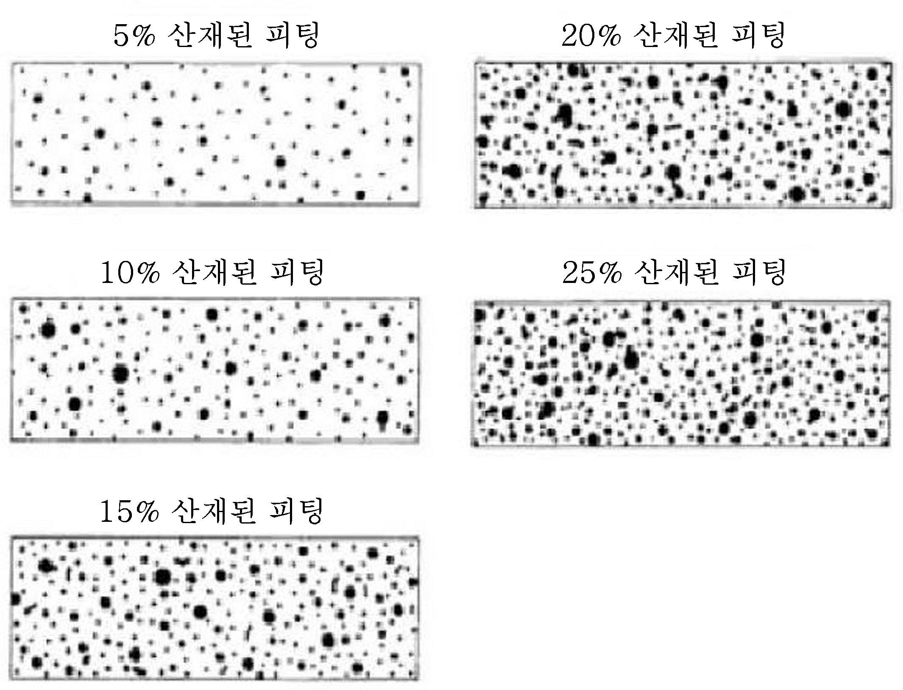
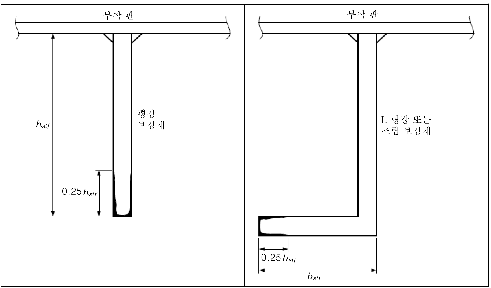
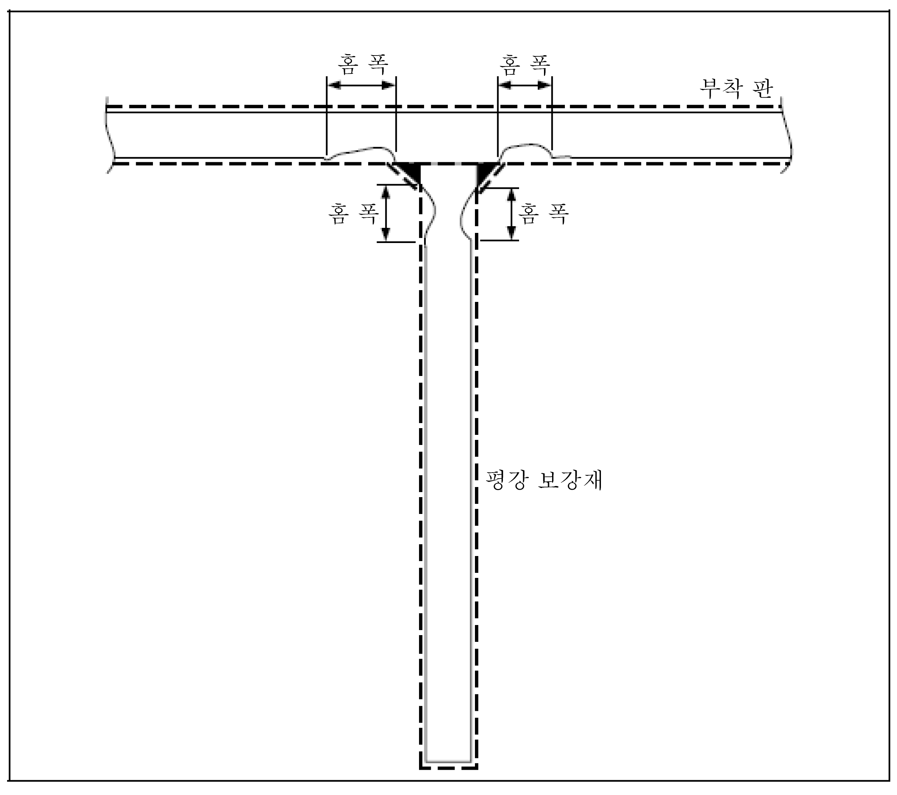
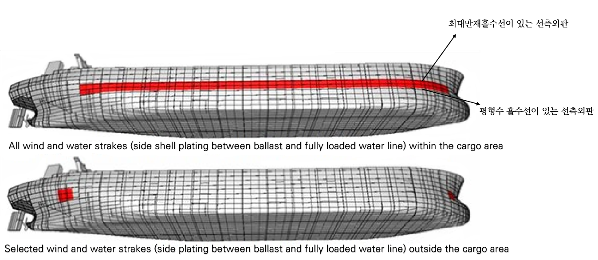
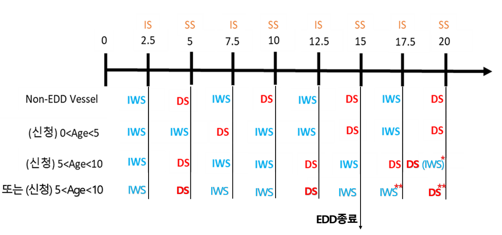

# 제1편 선급등록 및 검사

> 선급 및 강선규칙/적용지침 / RA-01-K / 2025 / KO / Rules

## 제 2 장 선급검사

### 제 1 절 일반사항

#### 101. 적용 (2023)

별도의 명문규정이 없는 한 **2장** 및 **3장**은 모든 자항 선박에 적용한다.

#### 102. 용어의 정의

별도의 명문규정이 없는 한 **2장** 및 **3장**에서 사용하는 용어의 정의는 다음과 같다.

- **1.** **검 사기준일(anniversary date)**이라 함은 등록검사 또는 정기검사 완료일로부터 차기 정기검사 지정일까지의 기간 중에서 차기 정기검사를 받아야 할 날짜에 해당되는 매년의 월․일을 말한다.
- **2-1.** **산적화물선(bulk carrier)**이라 함은 일반적으로 화물구역 내에 단일갑판, 이중저, 톱사이드탱크 및 호퍼사이드탱크를 가지는 구조로서 주로 건화물을 산적하여 운송하는 선박을 말하며 겸용선(combination carrier)을 포함한다. *(2020)*
- **2-2.** **이중선체 산적화물선(double skin bulk carrier)**이라 함은 일반적으로 화물구역 내에 단일갑판, 이중저, 톱사이드탱크 및 호퍼사이드탱크를 가지는 구조로, 화물창은 윙탱크의 너비에 관계없이 이중선측으로 이루어지고 주로 건화물을 산적하여 운송하는 선박을 말하며 광석운반선(ore carrier) 및 겸용선(combination carrier)과 같은 형태의 선박을 포함한다. *(2020)*
  단일선체/이중선체 겸용선의 경우 **3장 3절** 또는 **3장 5절**의 규정에도 따라야 한다. 광석운반선 및 겸용선은 산적화물 선에 대한 국제선급연합회(IACS)의 공통구조규칙(규칙 11편) 적용대상에는 포함되지 않는다.
  다음의 선박은 산적화물선 및 유조선에 대한 국제선급연합회(IACS)의 공통구조규칙(규칙 13편) 적용대상에는 포함되 지 않는다.
  - 광석운반선
  - 겸용선
  - 우드칩운반선
  - 10톤 이상의 그랩, 동력삽(power shovel) 또는 화물창구조에 손상을 줄 수 있는 다른 수단에 의하여 하역을 하지 않는 시멘트운반선, 비산회(fly ash)운반선 및 설탕운반선
  - 자체 하역기능을 가진 내저판구조의 선박 *(2020)*
- **2-3.** **자가 하역 산적화물선(self-unloading bulk carrier)**이라 함은 일반적으로 화물구역 내에 단일갑판, 이중저, 톱사이드탱크, 호퍼사이드탱크 및 단일 또는 이중선측구조를 가지고 건화물을 산적하여 운송하고 화물의 하역을 위하여 본선에 컨베이어시스템을 갖추고 **규칙 7편 3장**의 요건을 만족하는 선박을 말한다. *(2021)*
- **3-1.** **유조선(oil tanker)**이라 함은 주로 기름을 선체구조의 일부를 구성하는 화물탱크에 산적하여 운송하기 위하여 건조된 선박을 말하며 광석 등과 기름을 겸용하여 운송하는 선박도 포함된다. 그러나 아스팔트 운반선과 같이 선체구조의 일부를 구성하지 아니하는 독립형탱크에 기름을 운반하는 선박은 검사강화제도 적용대상 선박에서 제외된다. *(2024)*
- **3-2.** **이중선체 유조선(double hull oil tanker**)이라 함은 주로 기름을 선체구조의 일부를 구성하는 화물탱크에 산적하여 운송하기 위하여 건조된 선박으로 화물탱크가 화물지역의 전 길이에 걸쳐 보이드 스페이스용 또는 평형수용의 이중선측 및 이중저로 구성된 이중선체에 의하여 보호되는 선박을 말한다. *(2024)*
- **4.** **기름(Oil)**이라 함은 원유, 연료유, 슬러지, 폐유 및 정제유를 포함한 모든 형태의 석유를 말하며 **7편 6장 17절**에 규정된 석유화학물질은 제외한다. *(2020)*
- **5.** **위험화학품 산적운반선**(chemical tanker)라 함은 **7편 6장 17절**에 규정된 액체화물을 산적하여 운송하는 선박을 말한다. *(2022)*
- **6.** **탱커(**tanker)라 함은 인화성이 있는 액체화물을 산적하여 운송하는 선박을 말하며, 유조선, 광석 등과 기름을 겸용하여 운송하는 겸용선, 위험화학품 산적운반선 및 액화가스 산적운반선이 이 범주에 포함된다. *(2022)*
- **7.** **일반건화물선(general dry cargo ship)**이라 함은 고체화물을 운송하는 총톤수 500톤 이상의 모든 일반건화물선으로서, 대상선박은 **제15절 1501. 1.** (1)항의 “적용”에 따른다. *(2022)*
- **8.** **액화가스 산적운반선(liquefied gas carrier)**이라 함은 **7편 5장 19절**에 규정된 액체화물을 산적하여 운송하는 선박을 말한다.
- **9.** **평 형수탱크(ballast tank)**라 함은 주로 해수평형수용으로 사용하는 탱크를 말한다.
  **3장 2절** 및 **6절**의 적용을 받는 산적화물선 및 이중선체 산적화물선의 경우, 평형수탱크라 함은 주로 해수평형수용으로 사용하는 탱크를 말하며 평형수겸용 화물창에 과도한 부식이 있는 경우 평형수겸용 화물창도 평형수탱크로 취급한다. 이중선측탱크는 톱사이드탱크 또는 호퍼사이드탱크와 연결되어 있을지라도 별개의 탱크로 간주한다.
  또한 **3장 3절, 4절** 및 **5절**의 적용을 받는 유조선, 위험화학품 산적운반선 및 이중선체 유조선의 경우, 평형수탱크라 함은 주로 해수평형수용으로 사용하는 탱크를 말한다. *(2023)*
- **10.** **구 역(space)**이라 함은 화물창, 탱크를 포함한 각각의 독립된 구획(compartment)을 말한다.
  **3장 2절** 및 **6절**의 적용을 받는 산적화물선 및 이중선체 산적화물선의 경우, **구역(Space)**이라 함은 화물창, 탱크, 화물창에 인접하는 코퍼댐 및 보이드 스페이스, 갑판 및 선체외부를 포함한 각각의 독립된 구획(compartment)을 말한다. *(2020)*
- **11.** **횡 단면(transverse section)**에는 갑판, 선측외판, 선저외판, 내저판, 호퍼경사판, 톱사이드 경사판, 및 종격벽과 이들판에 붙어있는 종늑골 및 거더 등 종강도에 기여하는 모든 종통부재를 포함한다.
  횡식 늑골구조의 선박인 경우 횡단면은 횡단면을 따라 인접한 늑골 및 그 단부 브래킷을 포함한다.
  화물창의 대표적인 횡단면의 예는 **그림 1.2.1**과 같다. *(2020)*
  
  **그림 1.2.1 화물창의 대표적인 횡단면 (from IACS Rec. 76)**
- **12.** **대 표적인 구역/탱크(representative space/tank)**라 함은 유사한 형식과 용도를 가지며, 유사한 부식방지시스템을 하고 있는 다른 구역/탱크의 상태를 반영할 수 있는 대표적인 구역/탱크를 말한다. 대표적인 구역/탱크를 선정할 때에는 본선의 운항 및 수리기록과 식별된 구조적으로 취약한 지역 및/또는 의심지역을 고려하여 선정한다. *(2019)*
- **13.** **의 심지역(suspect area)**이라 함은 과도한 부식이 있는 지역이나 “급격한 부식을 일으킬 가능성이 있다고 검사원이 인정하는 지역”을 말한다. *(2023)*
  비고 : “급격한 부식을 일으킬 가능성이 있는 지역”이라 함은 **지침 부록 1-5**의 **표 2**의 내용 중 다음 중 어느 하나에 해당되는 경우를 말한다.
  - **(1)** 빌지가 고이기 쉬운 곳
  - **(2)** 가열하는 연료유 탱크에 접하는 벽면
- **14.** **과 도한 부식(substantial corrosion)**이라 함은 두께계측에 따른 부식의 유형을 평가한 결과 부식의 정도가 우리 선급이 정한 쇠모한도 이내에 있으나 쇠모한도의 75%를 초과하여 부식된 상태를 말한다.
  국제선급연합회(IACS)의 공통구조규칙(**규칙 11편, 12편** 또는 **13편**)에 의하여 건조된 선박인 경우 과도한 부식이라 함은 두께계측에 따른 부식의 유형을 평가한 결과 계측된 두께가 $t_ren$+ 0.5 $\mathrm{mm}$와 $t_ren$ 사이에 있는 부식된 상태를 말한다.
  신환두께($t_{ ren}$)라 함은 신환되어야 하는 구조부재의 최소허용두께($\mathrm{mm}$)를 말한다.
- **15.** **쇠모한도를 초과한 부식(excessive corrosion)**이라 함은 두께계측에 따른 부식의 유형을 평가한 결과 부식의 정도가 우리 선급이 정한 쇠모한도를 넘어서 부식된 상태를 말하며 해당 강재는 신환되어야 한다. *(2020)*
- **16.** **광범위한 부식(extensive corrosion)**이라 함은 고려하는 부위 중 강재 표면의 70% 이상이 피팅부식을 포함하여 심한부식(hard scale)이나 느슨한 스케일의 부식으로 얇아지는 증거를 수반한 부식된 영역을 말한다. *(2020)*
- **17.** **현 상검사(overall survey)**라 함은 선체구조의 일반적인 현상을 파악하기 위한 검사이며, 검사결과에 따라 정밀검사의 범위를 확대할 수 있다.
- **18.** **정 밀검사(close-up survey)**라 함은 통상 검사원의 손이 닿을 수 있는 거리에서 선체 구조부재의 상태를 육안검사에 의하여 시행하는 세밀한 검사를 말한다.
- **19.** **부 식방지시스템(corrosion prevention system)**이라 함은 통상 전경화보호도장(full hard protective coating)을 말한다. 경화보호도장(hard protective coating)은 통상 에폭시(epoxy)도장 또는 이와 동등한 것을 말한다.
  다른 도장시스템(연화도장이나 반경화도장을 말하는 것은 아님)은 제조자의 사양에 적합하게 적용되고 유지, 보수할 경우 인정할 수 있다.
  여기서 연화도장이라 함은 통상 (식물성이나 석유)기름 또는 라놀린(lanolin : sheep wool grease)에 기초한 것으로서 접촉되거나 작은 기계적 충격에도 쉽게 벗겨지는 연질의 도장을 말하며, 반경화도장이라 함은 비록 접촉되거나 도장 위를 걸어 다닐 수 있을 정도로 충분히 단단하지만 건조되거나 고화된 후에도 계속하여 유연성을 가지는 도장을 말한다. *(2019)*
- **20.** **도 장상태(coating condition)**^1) 에 대한 구분은 다음과 같다. *(2020)*
  - **(1)** 양호(good) : 점식(spot rusting)이 없거나 작은 점식만 있는 상태
  - **(2)** 보통(fair) : 휨보강재의 가장자리와 용접 결합부에 대하여 국부적인 도막의 탈락이 있거나 또는 고려하는 부위 중 20 % 이상에 대하여 가벼운 부식(light rusting)이 있는 상태로 불량에서 정의한 것을 제외한 상태
  - **(3)** 불량(poor) : 고려하는 부위 중 20 % 이상에 대하여 도막의 탈락이 있거나 10% 이상에 심한 부식(hard scale)이 있는 상태
    (비고) ^1) 국제선급연합회(IACS)의 권고사항 Rec. 87(Guidelines for Coating Maintenance & Repairs for Ballast Tanks and Combined Cargo/Ballast Tanks on Oil Tanker) 참조. *(2020)*
- **21.** **신 속하고 완전한 수리(prompt and thorough repair)**라 함은 해당 검사 시 완료하는 영구수리로서, 검사원이 만족하고 수리와 관련하여 어떠한 지적사항도 남기지 않는 수리를 말한다. *(2020)*
- **22.** **검 사강화제도(enhanced survey programme)**라 함은 **2장**의 규정에 추가하여 화물지역 내에 있는 화물창/탱크, 펌프실, 코퍼댐, 파이프터널 및 보이드 스페이스와 모든 평형수탱크에 대한 선체구조 및 배관장치에 대하여 **3장**의 규정에 따라 강화된 검사방법을 적용하는 제도를 말한다.
  또한, 해당 제도는 **3장**의 선종 중 화물지역 내에 일체형탱크를 가지는 선박에만 적용되며 **3장 102. 1**에 따라 검사를 시작하기에 앞서 선박소유자는 우리 선급과 협의하여 상세한 검사계획서(Survey Programme)를 작성하여야 한다.
  추가하여 대한민국 선박안전법을 적용받는 선박의 경우 **19절 1901.**의 요건도 만족해야 한다. *(2021)*
- **23.** **구 조적으로 취약한 지역(critical structural area)**이라 함은 계산으로부터 감시가 요구되는, 또는 본선이나 이용가능한 경우 유사한 선박 또는 동형선의 운항기록으로부터 선박의 구조적 보전성을 해칠 수 있는 균열, 좌굴, 변형 또는 부식에 민감하다고 식별된 위치를 말한다.
- **24.** **특 별고려(special consideration or specially considered)**라 함은 (정밀검사 및 두께계측과 관련하여) 도장하부구조의 실제평균상태를 확인하기 위하여 충분한 정밀검사 및 두께계측을 시행하는 것을 말한다.
- **25.** **공기관헤드(air pipe head)**
  노출갑판 상에 설치된 공기관헤드라 함은 건현갑판 또는 선루갑판 상부로 연장된 공기관헤드를 말한다.
- **26-1.** **건 화물을 운반하는 선박의 화물지역 (Cargo length area, ship carrying dry cargo)**이라 함은 모든 화물창과 화물창에 인접하는 연료유탱크, 코퍼댐, 평형수탱크, 파이프터널, 및 보이드 스페이스를 포함한 선박의 부분을 말한다. *(2020)*
- **26-2.** **액체를 산적하여 운반하는 선박의 화물지역(Cargo area, ship carrying liquid cargo in bulk)**이라 함은 화물탱크, 슬롭탱크 및 화물탱크에 인접하는 화물/평형수 펌프실, 압축기실, 코퍼댐, 평형수탱크 및 보이드 스페이스 그리고 이들 장소가 있는 갑판구역을 포함한 선박의 부분을 말한다. *(2020)*
- **27.** **일반부식(general corrosion or overall corrosion or uniform corrosion)**이라 함은 코팅되지 않은 탱크 내부 표면 또는 코팅이 완전히 열화된 탱크 표면에서 균일하게 발생할 수 있는 비보호 녹으로 나타난다. 녹의 스케일은 끊어짐으로써 신선한 금속이 부식에 노출되지만 과도한 손실이 발생할 때까지 두께를 육안으로 판단 할 수 없다. 일반부식은 **그림 1.2.2**과 같다. *(2020)*
  
  **그림 1.2.2 일반부식 (from IACS Rec. 76)**
- **28.** **피 팅부식(pitting corrosion)**은 주위의 일반부식보다 많이 국부적으로 쇠모된 산재한 부식점 및/또는 부식된 부분을 말한다. 피팅강도는 **그림 1.2.3**과 같다. *(2020)*
  
  **그림 1.2.3 피팅강도**
- **29.** **단 부부식(edge corrosion)**은 판, 보강재 및 1차 지지부재의 자유변과 개구 주위의 국부적인 부식을 말한다. 단부부식의 예는 **그림 1.2.4**와 같다. *(2020)*
  
  **그림 1.2.4 단부부식**
- **30.** **홈 부식(grooving corrosion)**은 보강재나 판의 버트(butt)나 심(seam)에 있거나 인접한 보강재와의 용접연결부 주위에 있는 전형적인 국부쇠모를 말한다. 홈부식의 예는 **그림 1.2.5**과 같다. *(2020)*
  
  **그림 1.2.5 홈부식**
- **31.** **선 박의 길이(L)**라 함은 만재흘수선 상에서 선수재의 전단으로 부터 타주가 있는 선박은 타주의 후단까지, 타주가 없는 선박에서는 타두재의 중심까지의 거리($\mathrm{m}$)를 말한다. L은 만재흘수선상 최대 길이의 96% 미만이어서는 아니 되며 97%를 넘을 필요는 없다.(**규칙 3편 1장 1절 102.** 참조) *(2017)*
- **32.** **원 격검사기술(Remote Inspection Techniques, RIT)** *(2019)*
  원격검사기술이라 함은 검사원의 직접적이고 물리적인 접근 없이 구조물의 모든 부분을 검사할 수 있는 기술을 말한다.(국제선급연합회(IACS)의 권고사항 Rec.42 참조)
- **33.** **원격검사(Remote Survey)**라 함은 선박 또는 선박의 기기가 선급기술규칙에 따라 적합하게 유지되고 있는지를 검증하는데 있어서 검증의 전부 또는 일부를 검사원의 승선 없이 실시하는 검사를 말한다. *(2023)*
- **34.** **평 형수겸용 화물탱크(combined cargo /ballast tank)**라 함은 선박운항의 일상적인 부분으로서 화물 또는 평형수의 운송에 사용되는 탱크를 말하며 평형수탱크로 취급한다. 해양오염방지협약(MARPOL) 부속서 I 제4장 18.3규칙에 따라서 예외적인 경우에 한하여 평형수를 운송할 수 있는 화물탱크는 화물탱크로 취급한다. *(2020)*
- **35.** **일 체형탱크(integral tank or tank of integral(structural) type)**라 함은 선체구조의 일부를 구성하고, 인접하는 선체구조에 응력을 주는 하중에 의하여 인접하는 구조와 같은 영향을 받는 탱크를 말한다. *(2020)*
- **36.** **독 립형탱크(independent tank)**라 함은 자기지지형 탱크로서 선체구조를 구성하지 아니하고 또한 선체강도상 필요로 하지 않는 것을 말한다. *(2020)*
- **37.** **멤 브레인탱크(membrane tank)**라 함은 인접하는 선체구조에 의하여 단열재를 통하여 지지된 얇은 막으로 구성되는 비자기지지형의 탱크를 말한다. *(2020)*
- **38.** **세 미멤브레인탱크(semi-membrane tank)**라 함은 적재상태에 있어서 비자기지지형의 탱크로서 인접하는 선체구조에 의하여 단열재를 통하여 지지되는 부분과 하나의 막으로 구성되는 탱크를 말한다. *(2020)*
- **39.** **강력갑판(strength deck)**이라 함은 선박의 길이의 어느 곳에서나 외판이 달하는 최상층의 갑판을 말한다.
  다만, 저선수미루를 제외하고는 길이가 0.15L이하인 선루가 있는 곳에서는 선루갑판 바로 아래의 갑판을 그 곳의 강 력갑판으로 간주한다. 설계상의 형편에 따라서 길이가 0.15L을 넘는 선루가 있는 곳에서도 선루갑판의 바로 아래의 갑판을 강력갑판으로 간주할 수 있다. *(2020)*
- **40.** **건현갑판(freeboard deck)**라 함은 일반적으로 최상층 전통갑판을 말한다.
  다만, 최상층 전통갑판의 노출부에 상설폐쇄장치를 갖지 아니한 개구가 있는 경우에는 그 갑판 바로 아래의 전통갑판을 말한다. 일반적이지 않은 형상의 건현갑판에 대하여는 **규칙 3편 1장 114.**를 참조한다. *(2020)*
- **41.** **현측후판(sheer Strake)**이라 함은 선측외판의 최상부판을 말한다. *(2020)*
- **42.** **선루(superstructure)**라 함은 건현갑판 상에 설치되고 상부에 갑판을 갖는 구조물로서 선측으로부터 선측까지 이르거나 또는 선측외판으로부터 0.04 *B_f* 넘지 아니하는 위치에 그 측판을 가지고 있는 것을 말하며 저선미루는 선루로 간주한다. *(2020)*
- **43.** **갑판실(deck house)**이라 함은 건현갑판 또는 선루갑판에 상에 설치된 상부에 갑판을 가지고 있는 구조물로서 선루의 정의에 맞지 않는 구조를 말하다. *(2020)*
- **44.** **스트레이크(Strake)**라 함은 종/횡 방향으로 이어진 외판, 갑판, 격벽 등의 단위 판을 말한다. *(2021)*
- **45.** **바람 및 물막이 스트레이크 (Wind and Water Strakes)**라 함은 평형수 흘수선과 최대만재흘수선 사이에 있는 선측외판의 스트레이크로서 통상 만재 흘수선(load waterline) 부근에 위치한 2개의 스트레이크 이며, 선박의 트림으로 인해서 스트레이크는 선박 길이에 따라 다를 수 있다.
  바람 및 물박이 스트레이크의 예는 **그림 1.2.6**와 같다. *(2020)*
  
  **그림 1.2.6 바람 및 물막이 스트레이크(from the IACS Rec. 96)**
- **46.** **터릿계류(turret mooring)**라 함은 선박이 바람 및 파도의 방향에 따라 터릿을 중심으로 회전운동을 할 수 있는
  계류방식이다. 펼침방식의 계류장치(spread mooring system)에 의해 해저에 정박된다. *(2020)*
- **47.** **터릿구획(turret compartments)**이라 함은 분리 가능한 터릿계류장치의 회수 및 분리를 위한 설비와 기기, 고압용 유압조작장치, 화재방화설비 및 화물이송용 밸브를 포함하는 구역 및 트렁크를 말한다. *(2020)*

#### 103. 검사구분

선급에 등록한 후 선급을 계속 유지하기 위하여 다음의 검사를 받는 것을 조건으로 한다.

#### 104. 검사의 중복

정기적인 검사를 받아야 하는 경우 해당검사 종류보다 상위의 검사를 해당검사의 검사시기 또는 그 전에 받을 때는 해당검사는 하지 아니한다.

#### 105. 상위의 검사 (2023)

정기적인 검사에 있어서 특히 **“**검사원이 필요하다고 인정하는 사항**”** 또는 선박소유자의 신청이 있는 사항에 대하여는 상위의 검사에 준한 검사를 할 수 있다.

#### 106. 계선 (2018)

- **1.** 등록된 선박을 계선을 하고 우리 선급에 통보를 하는 경우, 계선기간 동안 선급유지를 위한 통상의(normal) 정기적 검사는 하지 아니한다.
- **2.** 계선을 시작할 때에는 **지침 부록 1-17**에 따라 계선 검사를 받아야 한다. *(2021)*
- **3.** 계선하였던 선박을 다시 운항하고자 할 때에는 **지침 부록 1-17**에 따라 재운항 검사를 받아야 한다. *(2021)*
- **4.** 만약 선박소유자가 선박이 계선상태임 통지하지 않거나 이 조의 검사를 받지 않을 경우, **1장 9절 901.**의 요건에 따라서 지정일까지 지정된 검사를 받지 않을 경우 선급 정지 또는 탈급될 수 있다.
- **5.** 선주의 요청이 있는 경우, **지침 부록 1-17**에 따라 승인된 계선유지 프로그램에 따른 검사를 시행하고 계선증명서를 발급할 수 있다. *(2021)*

#### 107. 시험

- **1.** **1**. 정기적인 검사에 있어서 선박의 속력 또는 안전에 관한 사항에 영향을 주는 수리 또는 변경이 생겼을 때는 속력시험 및 경사시험을 한다.
- **2.** 주기 및 보기 또는 조타장치에 대하여 “중대한 수리”를 하였을 때는 검사원이 해상시운전을 요구할 수 있다. *(2021)*
  비고 : “중대한 수리”라 함은 주기관 또는 보조기관의 교체, 주기관 또는 보조기관 출력의 10% 이상 변경, 프로펠러의 형상 또는 주요치수 변경 및 조타장치 교체 또는 조타능력 변경 등과 같이 선속 또는 조타성능에 영향을 줄 수 있는 수리를 말한다.
- **3.** **2**항에서 명시한 중대한 수리가 추진장치의 응답특성에 영향을 미친다고 우리 선급이 판단한 경우, 해상 시운전의 범위는 장비 또는 장치가 신조선에 설치되는 경우에 요구되는 것에 기반한 후진 응답특성에 대한 시험계획을 포함하여야 한다. 후진 시험요건은 **규칙 5편 1장 103.**의 **5**항을 적용한다. 시험은 최소한 추진장치의 조종 범위에 걸쳐 그리고 모든 제어위치로부터 전진 및 후진 방향에 대하여 실제 운전조건에서의 장비 또는 장치에 대해 만족스러운 운전을 검증하여야 한다. 수리의 실제 범위에 따라서 선급은 시험 계획의 감소를 인정할 수 있다. *(2018)*

#### 108. 수리

- **1.** 검사원이 검사결과 수리의 필요를 지적할 때는 검사원은 신청자에게 그 사유를 통고하며, 이 통지를 받은 신청자는 수리 중 검사원의 임검을 받아야 한다.
- **2.** 허용한도를 넘어선 쇠모에 의해서 좌굴, 홈, 이탈 또는 파괴 등의 손상이 있는 경우 또는 광범위한 지역(areas)의 쇠모가 허용한도를 초과하여 “선체구조, 수밀 또는 풍우밀의 보전성에 영향을 주거나 영향을 줄 수 있다고 검사원이 판단하는 경우”에는 신속하고 완전한 수리를 하여야 한다.
  이 경우 고려하여야 하는 지역(areas)은 다음을 포함하여야 하며, 보다 구체적인 지역(areas)은 **부록 1-18**을 참조한다. *(2021)*
  - **(1)** 선측외판 늑골, 그 단부고착부재 및 인접외판
  - **(2)** 갑판구조와 갑판
  - **(3)** 선저구조와 선저외판
  - **(4)** 수밀 또는 유밀격벽
  - **(5)** 창구덮개 및 창구코밍
  - **(6)** **202.**의 **1**항 (1)호 (바), (사) 및 (6)호에 규정된 항목
  - **(7)** 산적화물선 및 이중선체 산적화물선인 경우;
    - 선저구조와 선저외판
    - 선측구조와 선측외판
    - 갑판구조와 갑판
    - 내저판구조와 내저판
    - 내측구조와 내측판
    - 수밀 또는 유밀격벽
    - 창구덮개 및 창구코밍
    - 통풍통을 포함하여 연료유 및 통풍관장치
  - **(8)** 유조선, 위험화학품 산적운반선 및 이중선체 유조선인 경우;
    - 선저구조와 선저외판
    - 선측구조와 선측외판
    - 갑판구조와 갑판
    - 수밀 또는 유밀격벽
    - 창구덮개 및 창구코밍, 있는 경우
    비고 : “선체구조, 수밀 또는 풍우밀의 보전성에 영향을 주거나 영향을 줄 수 있다고 검사원이 판단하는 경우”라 함은 선체구조에 좌굴, 홈, 이탈 또는 파괴 등의 손상이 발생하거나 수밀 또는 풍우밀 보전성을 상실하여 본선이 의도하는 항해나 운용을 안전하게 수행할 수 없다고 검사원이 판단하는 경우를 말한다.
    .
- **3.** 적절한 수리 시설이 없는 지역인 경우 수리 항까지의 항해를 허용할 수 있다. 이러한 경우에 화물의 양하 또는 이러한 항해를 위한 임시수리를 요구할 수도 있다.
- **4.** 또한 검사 결과 구조적 결함 또는 부식이 발견되어 **“**검사원이 판단하기에 이러한 결함이 본선의 항행적합성을 저해한다고 인정되는 경우**”** 본선의 운항 전에 보수조치가 수행되어야 한다. *(2021)*
  비고 : “검사원이 판단하기에 이러한 결함이 본선의 항행적합성을 저해한다고 인정되는 경우”라 함은 검사결과 발견된 결함 및/또는 부식으로 인하여 본선이 의도하는 항해나 운용을 안전하게 수행할 수 없다고 검사원이 판단하는 경우를 말한다.
- **5.** **2**항에 명시된 선체구조에서 발견된 손상이 격리된 것이고 선체구조의 보전성에 영향을 미치지 아니하는 국부적인 것인 경우(예를 들면, 크로스데크스트립 내의 작은 구멍), 검사원은 주위구조에 대하여 평가를 한 후 국제선급연합회(IACS)의 절차요건(PR) No.35(Procedure for Imposing and Clearing Condition of Class)에 따라 풍우밀 또는 수밀보전성을 다시 확보하기에 적합한 임시수리를 하고 이후 영구수리를 완료하고 선급을 계속 유지할 수 있도록 기한을 정하여 이와 관련된 지적사항을 지정할 수 있다. *(2020)*
- **6.** 항해 중 수리
  - **(1)** 선급유지에 영향을 주거나 줄 수 있는 선체, 기관장치 또는 설비 등에 대한 수리를 선원이 항해 중에 실시하고자 할 경우에는 사전에 계획되어야 하고 수리의 범위 및 검사원의 입회 등을 포함한 수리절차를 우리 선급에 제출하여 승인을 받아야 하며, 수리절차에 대하여는 우리 선급에서 별도로 정하는 바에 따른다.
    다만, “긴급을 요하는 위급상황”인 경우 즉시 비상수리를 하여야 한다. 이러한 수리는 본선의 항해일지에 기록되어야 하고 추가 검사여부를 판단하기 위하여 우리 선급에 제출되어야 한다. *(2021)*
    비고 : “긴급을 요하는 위급상황”이라 함은 선박의 조종, 생존, 해양오염 및 화물의 보호에 직접적인 영향을 주거나 줄 수 있는 경우를 말한다.
  - **(2)** 선급의 승인을 요구하지 아니하는 선체, 기관 및 의장에 대하여 제조자의 권고절차 및 해운관례에 따라서 정비보수 또는 개방을 하는 경우에는 그러하지 아니하다. 그러나 이러한 정비보수 또는 개방에 따른 수리가 선급유지에 영향을 주거나 줄 수 있는 경우 본선의 항해일지에 기록되어야 하고 추가검사여부를 판단하기 위하여 입회 검사원에게 제출되어야 한다.

#### 109. 부재의 쇠모한도

선체 각 부재의 두께나 의장품의 치수 등이 쇠모한도를 넘는 경우에는 그 부재의 건조 당시의 치수 또는 “우리 선급이 적절하다고 인정하는 치수”의 새 것으로 교체하여야 한다.

#### 110. 검사계획회의 및 안전회의 (2018)

- **1.** 검사 전 및 검사 중 본선에서의 검사원과 선박소유자간의 긴밀한 협조 및 적절한 준비는 안전하고 효과적인 검사를 위하여 기본적인 사항이다. 본선에서 검사를 하는 동안 안전회의를 정기적으로 개최하여야 한다.
- **2.** 안전하고 효과적인 검사를 위하여 정기, 중간 또는 연차검사를 시작하기에 앞서 검사원, 선박소유자, 해당되는 경우 두께계측요원/그 외의 전문공급자 및 선장 또는 선장이나 회사에 의하여 지명되고 “적절히 자격을 갖춘 대리인”은 검사계획서(ESP 선박만 해당됨) 또는 해당 검사와 관련하여 계획된 모든 준비가 제대로인지 확인하기 위하여 검사계획회의를 개최하여야 한다. *(2021)*
  비고 : “적절히 자격을 갖춘 대리인”이라 함은 본선의 사관을 말한다.
- **3.** 검사계획회의에서 다루어야 하는 항목은 다음과 같다.
  - **(1)** 본선일정(예를 들면, 출항, 입거 및 하거, 접안기간, 하역 및 평형수작업, 등)
  - **(2)** 검사 범위 및 내용, 검사종류에 따른 본선 준비사항 등 확인
  - **(3)** 본선 책임자로부터 선체, 기관, 의장 전반에 대한 이상 유무 등 검사 참고사항 청취
  - **(4)** 검사의 진행 순서, 검사 요구사항 및 필요시 단계별 검사입회 항목 협의
  - **(5)** 두께계측 관련(해당되는 경우)
    - **(가)** 두께계측을 위한 설비 및 준비(예를 들면, 접근, 청소/녹제거, 조명, 환기, 개인안전)
    - **(나)** 두께계측범위
    - **(다)** 허용쇠모한도
    - **(라)** 도장상태 및 의심지역/과도한 부식지역을 고려한 정밀검사 및 두께계측 범위
    - **(마)** 두께계측의 시행
    - **(바)** 전반적 및 비균일 부식/피팅이 발견된 경우 대표적인 계측값의 선정 *(2022)*
    - **(사)** 과도한 부식지역의 도해
    - **(아)** 발견사항과 관련하여 검사원, 두께계측요원 및 선박소유자 사이의 연락
  - **(6)** 그 외 필요한 항목

#### 111. 두께계측 절차 (2021)

- **1.** 우리 선급이 자체적으로 두께계측을 하지 않는 경우 검사원이 승선하여 계측과정을 통제하기 위하여 필요한 범위까지 입회하여야 한다. 이 경우 두께계측과정의 통제방법에 대하여는 **지침 부록 1-5**에 따른다.
- **2.** 두께계측은 통상적으로 초음파 계측기를 이용하여 시행하며, 검사원이 요구하는 경우 장비의 정확성이 입증되어야 한다. 두께계측은 검사강화제도 적용대상이 아닌 총톤수 500톤 미만의 선박 및 모든 어선에 대한 두께계측을 제외하고 **전문공급자 승인 지침**에 따라 우리 선급의 승인을 받은 두께계측업자에 의하여 시행되어야 한다. *(2019)*
- **3.** 두께계측 및 정밀검사
  모든 종류의 검사, 즉 정기, 중간, 연차 또는 이와 같은 검사사항을 가지는 기타검사에서 정밀검사가 요구되는 지역의 구조에 대한 두께계측은, **표 1.2.9, 표 1.2.11, 표 1.3.2, 표 1.3.5, 표 1.3.8, 표 1.3.11** 및 **표 1.3.14**에서 요구되는 경우, 정밀검사와 동시에 시행하여야 한다. *(2019)*
  검사원은 정밀검사의 대체수단으로 원격검사기술(RIT)을 고려할 수 있다. 원격검사기술을 이용하여 실시된 검사결과는 규칙에서 요구하는 요건에 만족하여야 한다. *(2017)*
  정밀검사의 대체수단으로 원격검사기술을 이용 시 요구되는 두께계측을 실시할 수 없을 경우, **표 1.2.9, 표 1.2.11, 표 1.3.2, 표 1.3.5, 표 1.3.8, 표 1.3.11** 및 **표 1.3.14**에서 요구하는 두께계측을 위한 임시접근수단이 제공되어야 한다. *(2019)*
  우리 선급은 강 이외의 재료인 FRP, Aluminum Alloy, 스테인리스강(다만, 클래드강판은 제외) 등과 같은 내식성 재료로 건조된 선체구조 부재 및 파이프에 대하여는 두께계측을 생략할 수 있다. *(2022)*
- **4.** 모든 경우에 있어서 두께계측의 범위는 실제평균상태를 나타내기에 충분해야 한다.
- **5.** 두께계측기록을 제출하여야 한다. 두께계측기록에는 계측위치, 해당 계측점의 원래두께 및 계측된 두께가 포함되어야한다. 또한 계측일자와 계측장비의 형식, 계측자의 이름 및 자격, 계측자의 서명이 있어야 한다. 두께계측기록은 **지침 부록1-5**의 규정에 따라야 한다.
- **6.** 검사원은 최종두께계측기록을 검토하고 해당페이지에 서명하여야 한다.

#### 112. 두께계측에 대한 허용기준 (2024)

두께계측의 허용기준은 **지침 부록 1-5**의 표 1 및/또는 별도의 요건이 있는 경우 해당 요건(예를 들면, 국제선급연합회(IACS)의 통일규칙(UR) S21(UR S21 Rev.6 applies for ships contracted for construction on or after 1 July 2024) 또는 S21A(Evaluation of Scantlings of Hatch Covers and Hatch Coamings and Closing Arrangements of Cargo Holds of Ships, S21A applies for ships contracted for construction on or after 1 July 2012, Rev.1 of UR S21A applies for ships contracted for construction on or after 1 July 2016. UR S21A was withdrawn from 1 July 2024 and replaced by UR S21 Rev.6)에 따른다.

#### 113. 원격검사기술 (Remote Inspection Techniques, RIT) (2019)

- **1.** 원격검사기술(RIT)은 일반적으로 정밀검사에서 얻을 수 있는 정보를 제공하여야 한다. 원격검사기술에 의한 검사는 아래의 요건을 포함하여 국제선급연합회(IACS)의 권고사항 Rec42(Guidelines for Use of Remote Inspection Techniques for surveys) 및 **원격검사기술 지침**의 요건에 따라 수행되어야 한다.
  이러한 요건들은 검사에 앞서 제출되어야 하는 원격검사기술의 검사계획서에 포함되어야 하며 이 계획서는 선급에 의하여 승인되어야 한다. *(2021)*
- **2.** 원격검사기술과 관련된 검사를 관찰하고 보고하는 장비와 절차는 원격검사기술의 검사에 앞서 관련 당사자들과 논의하고 합의해야 하며, 모든 장비가 설정, 교정 및 점검될 수 있도록 적절한 시간이 허용되어야 한다.
- **3.** 원격검사기술을 정밀검사의 대체수단으로 이용 시, 우리 선급이 자체적으로 원격검사기술을 실시하지 않는 경우 **전문공급자 승인 지침**에 따라 우리선급의 승인을 받은 원격검사기술에 종사하는 전문공급자에 의하여 시행되어야 하며 담당검사원이 입회하여야 한다.
- **4.** 원격검사기술에 의하여 검사할 선체구조는 실질적인 검사가 되도록 충분히 깨끗해야 하며, 시야(Visibility) 또한 실질적인 검사가 되기에 충분해야 한다. 구조에 대한 방향설정 방법은 검사원이 양호하다고 인정해야 한다.
- **5.** 그림 표현을 포함한 자료제시 방법 또한 검사원이 양호하다고 인정해야 하며 검사원과 원격검사기술 작업자 사이에 양호한 양방향 통신수단이 제공되어야 한다.
- **6.** 만약 원격검사기술에 의한 검사 시 주의를 요하는 손상이나 결함이 식별되는 경우, 담당검사원은 원격검사기술이 아닌 전통적인 검사방법을 요구할 수 있다.

#### 114. 공동선급선의 경우 (2021)

- **1.** 각 선급은 공동선급간에 채택된 양자 협정에 따라 다른 선급을 대신한다. 이 협정에는 각 선급의 업무 범위가 명확하게 정해져야 한다. *(2021)*
- **2.** 각 선급은 협정대로 다른 선급이 대신하여 수행한 업무가 완료되었는지 검토해야 한다. *(2021)*
- **3.** 공동선급선의 유지(정기적 검사 등)시 업무절차는 별도로 정하는 지침에 따른다.
- **4.** 공동선급선이라고 할지라도 문서화된 협정이 없는 선박은 중복선급선으로 취급한다. *(2021)*

#### 115. 검사준비 (2019)

- **1.** 검사조건(Conditions for survey)
  - **(1)** 선박소유자는 검사 시 안전을 위하여 필요한 설비를 제공하여야 한다.
  - **(2)** 탱크 및 구역들은 가스를 제거하고 환기 및 조명을 하여 출입에 안전하도록 하여야 한다.
  - **(3)** 검사 및 두께계측을 위한 그리고 상세한 시험을 위한 검사준비에 있어서 모든 구역은 표면의 모든 부식침전물제거를 포함하여 청소되어야 한다. 구역들은 부식, 변형, 파괴, 손상 또는 기타 구조적 결함 등이 노출되도록 물, 녹, 오물, 기름잔류물 등을 충분히 제거하여야 한다. 그러나 이미 선박소유자가 신환하기로 결정한 구조지역은 신환 부위결정에 필요한 범위만 청소하고 부식을 제거할 수 있다.
  - **(4)** 검사 시 부식, 변형, 파괴, 손상 또는 기타 구조적 결함 등이 잘 보이도록 충분한 조명설비를 하여야 한다.
  - **(5)** 연화도장 또는 반경화도장을 적용한 곳에는 검사원이 도장의 유효성을 검증할 수 있도록 또한 도장의 탈락(spot removal)을 포함한 내부구조의 현상을 파악하기 위한 안전한 접근설비를 제공하여야 한다. 만일 안전한 접근설비를 제공할 수 없다면 연화도장 또는 반경화도장은 제거되어야 한다.
  - **(6)** 케이싱, 내장판 또는 라이닝 및 헐거워진 방열재가 있는 경우 판 및 늑골을 검사하기 위하여 검사원이 요구하는 만큼 떼어내야 한다. 갑판콤퍼지션은 두드려서 검사하여야 하고 판에 만족스럽게 접착되어있다면 떼어낼 필요는 없다. *(2023)*
    비고 : 검사원은 케이싱, 내장판이나 라이닝 및/또는 방열재를 떼어낼 것을 요구하는 경우 다음 사항 등을 고려하 여야 한다.
    - **(가)** 비정상적인 열화의 기록이나 징후 등 이상 상태가 감지된 경우
    - **(나)** 과도한 부식, 심각한 변형, 파괴, 손상 또는 기타 구조적 결함이 있거나 의심되는 경우
    - **(다)** 쇠모된 또는 쇠모된 것으로 의심되는 경우
    - **(라)** 쇠모의 진행이 현저하다고 판단되는 경우
  - **(7)** 냉장화물구역의 대표적인 위치에서 방열재 뒤의 도장상태를 검사하여야 한다. 이 검사는 보호도장의 유효성 및 육안으로 구조적 결함이 없음을 확인하는 것으로 축소할 수 있다. 도장이 불량한 상태인 경우 “검사원이 필요하다고 인정하는 범위”까지 검사를 확대하여야 한다.
    도장의 상태는 보고되어야 한다. 만일 검사 도중 변형, 스크래치 등이 외판의 바깥쪽으로부터 발견된 경우 판 및 인접한 늑골까지 검사를 확대하기 위하여 검사원이 요구하는 만큼 그 부위의 방열재를 떼어내야 한다. *(2023)*
    비고 : 1) “검사원이 필요하다고 인정하는 범위”라 함은 방열재 뒤 불량한 상태인 도장의 범위를 결정하기 위하여 필요한 방열재의 범위를 말한다.
    2) 검사원은 방열재를 떼어낼 것을 요구하는 경우 다음 사항 등을 고려하여야 한다.
    - **(가)** 비정상적인 열화의 기록이나 징후 등 이상 상태가 감지된 경우
    - **(나)** 과도한 부식, 심각한 변형, 파괴, 손상 또는 기타 구조적 결함이 있거나 의심되는 경우
    - **(다)** 쇠모된 또는 쇠모된 것으로 의심되는 경우
    - **(라)** 쇠모의 진행이 현저하다고 판단되는 경우
- **2.** 선체구조부재로의 접근(Access to structures)
  - **(1)** 검사 시 검사원이 안전하고 실질적인 방법으로 선체구조에 대한 검사를 할 수 있는 수단을 제공하여야 한다.
  - **(2)** 화물창 및 평형수탱크의 검사를 위하여 다음 중 한 가지 이상의 검사원이 적합하다고 인정하는 접근설비를 제공하여야 한다.
    - **(가)** 영구적으로 설치한 발판 및 통로
    - **(나)** 임시발판 및 통로
    - **(다)** 전통적인 체리피커와 같은 유압승강장치, 승강기 및 이동식 플랫폼
    - **(라)** 보트 또는 뗏목
    - **(마)** 기타 동등한 장비
  - **(3)** 검사가 원격검사기술에 의하여 실행될 경우, 검사원이 승인한 다음의 하나 또는 그 이상의 접근을 위한 장비가 제공되어야 한다. *(2017)*
    - **(가)** 무인 로봇 팔(Unmanned robot arm)
    - **(나)** 무인잠수정(Remote Operated Vehicles, ROV)
    - **(다)** 무인비행장치(Unmanned Aerial Vehicles) / 드론(Drones)
    - **(라)** 그 외 선급에서 인정하는 장비
- **3.** 검사장비 *(2023)*
  - **(1)** “검사원이 필요하다고 인정하는 경우” 결함 부위를 찾아낼 수 있도록 다음 중 한 가지 이상의 방법에 대한 검사준비를 요구할 수 있다.
    비고 : “검사원이 필요하다고 인정하는 경우”라 함은 **지침 1장 801.**의 **2**항에 해당되는 경우를 말한다.
    - **(가)** 방사선투과시험
    - **(나)** 초음파탐상시험
    - **(다)** 자분탐상시험
    - **(라)** 액체침투탐상시험
- **4.** 해상 부양상태에서의 **검사^1)** ***(2020)***
  - **(1)** 검사원이 선내에 있는 사람으로부터 필요한 지원을 받을 수 있는 경우 해상 부양상태에서의 검사를 인정할 수 있다. 검사를 시행하는 데 필요한 주의 및 절차는 **1**항, **2**항 및 **3**항에 따른다.
  - **(2)** 검사 시 탱크 또는 구역 내에 있는 검사원과 갑판상의 책임사관 사이에 서로 연락할 수 있는 통신장비를 준비하여야 한다. 보트와 뗏목을 이용하여 검사하는 경우 평형수펌프 취급자와도 연락할 수 있는 통신장비가 있어야 한다.
  - **(3)** 검사 시 보트 또는 뗏목을 사용할 경우에는 검사에 직접 관련되는 모든 인원에게 구명동의를 제공하여야 한다. 보트와 뗏목은 한쪽의 공기실이 파손된 경우에도 충분한 여유 부력과 복원성을 가지는 것으로서 안전 점검표에 따라 점검이 된 것이어야 한다.
  - **(4)** 보트 또는 뗏목을 이용한 탱크검사는 일기예보와 예상되는 해상상태에 따른 선체운동을 감안하고 안전장비 등을 고려하여 **“**검사원이 충분히 안전하다고 인정하는 경우”^2)에 한하여 실시할 수 있다. *(2023)*
    비고 : 1) 국제선급연합회(IACS)의 권고사항 Rec. 39(Safe Use of Rafts or Boats for Survey) 참조. (2020)
    2) “검사원이 충분히 안전하다고 인정하는 경우”라 함은 **3장 102.**의 **6**항 (3)호에 해당되는 경우를 말한다. *(2023)*

#### 116. 군용상선에 대한 특별고려 (2019)

정부가 소유 또는 임차하여 군사작전 또는 병역의 지원에 사용되는 상선에 대하여는 이 장의 관련 조항을 적용함에 있어서 특별고려를 할 수 있다.

#### 117. 반경화도장이 적용된 평형수탱크에 대한 내부검사 (2019)

반경화도장과 관련된 요건에 있어서 평형수탱크에 반경화도장이 이미 적용된 경우 2010년 7월 1일 이후 시행되는 정기검사 또는 중간검사 중 빠른 검사 시부터는 이러한 평형수탱크에 대하여 매년 시행하여야 하는 내부검사를 면제하는 것을 허용하지 아니한다.

### 제 2 절 연차검사

#### 201. 검사시기

- **1.** 연차검사는 매 검사기준일의 전후 3개월 이내에 시행한다.
- **2.** 선박소유자의 요청에 따라 연차검사를 검사기준일로부터 3개월 보다 앞당겨 받은 경우에는 해당검사 완료일로부터 3개월이 되는 날을 새로운 검사기준일로 설정하고 새로운 검사기준일에 의거 차기 검사일을 지정한다.
- **3.** 검사계획회의는 검사를 시작하기에 앞서 개최하여야 한다. *(2018)*

#### 202. 선체, 의장 및 소방설비

- **1.** 검사는 가능한 범위까지 선체, 창구덮개, 창구코밍, 폐쇄장치, 의장 및 관련 배관장치 등이 해당 규칙요건에 따라 유지된다는 것을 검증하기 위한 검사로 이루어진다. *(2022)*
  - **(1)** 노천갑판, 수선상부 선측외판, 창구덮개 및 코밍의 검사
    - **(가)** 전회 검사 이후 창구덮개, 창구코밍, 고박설비 및 폐쇄장치에 대하여 변경사항이 있는지의 여부
    - **(나)** 기계식 강재 창구덮개가 설치된 경우 다음 해당항목에 대하여 만족한 상태인지의 점검
      - **(a)** 창구덮개
      - **(b)** 폐쇄장치(개스킷, 개스킷립, 압축봉, 배수로 등)
      - **(c)** 클램핑장치, 지지대, 클리트, 체인 또는 로프풀리
      - **(d)** 가이드, 가이드레일 및 트랙휠, 스토퍼 등
      - **(e)** 와이어, 체인, 집시(gypsy), 장력장치
      - **(f)** 폐쇄 및 고박에 필요한 유압장치
      - **(g)** 안전 잠금장치 및 지지장치
    - **(다)** 이동식 창구덮개, 목재 창구덮개 또는 강재 폰툰덮개가 설치된 경우 다음 해당항목에 대하여 만족한 상태인지의 점검
      - **(a)** 목재 창구덮개 및 이동식 보, 이동식 보의 해치빔받침(carrier) 또는 소켓 및 그 고박장치
      - **(b)** 강재 폰툰, 타폴린
      - **(c)** 클리트, 배튼 및 웨지
      - **(d)** 창구덮개 고정 바(bar)와 고박장치
      - **(e)** 로딩패드 및 바(bar), 측판 모서리
      - **(f)** 가이드플레이트 및 촉(chock)
      - **(g)** 압축봉, 배수로 및 배수관(있는 경우)
    - **(라)** 해당되는 경우 창구코밍판 및 보강재의 상태
    - **(마)** 다음을 포함하여 기계식 창구덮개는 임의로 선택하여 작동검사
      - **(a)** 개방상태에서의 적재 및 고박상태
      - **(b)** 폐쇄상태에서의 고정 및 폐쇄상태의 유효성
      - **(c)** 와이어, 체인, 연결장치, 유압 및 동력장치의 작동검사
    - **(바)** 공기관과 갑판사이 용접연결에 대한 검사
    - **(사)** 노출갑판 상에 설치된 모든 공기관헤드에 대한 외관검사
    - **(아)** 모든 연료유탱크 공기관 개구단의 플레임스크린에 대한 검사
  - **(2)** 선체 또는 선루가 만재흘수선 위치에 영향을 주는 변경된 사항이 있는지 여부에 대한 점검
  - **(3)** 갑판선 및 만재흘수선의 표시위치를 점검하고, 필요한 경우 재 표시 또는 페인트칠을 한다.
  - **(4)** 건현갑판이나 선루갑판에 있는 화물창구를 비롯한 각종 창구 및 개구부의 풍우밀 폐쇄장치에 대한 검사
  - **(5)** 건현갑판 하방의 선체외판에 있는 개구의 폐쇄장치의 수밀 보전성에 대한 검사
  - **(6)** 코밍과 폐쇄장치를 포함하여 통풍통, 공기관에 대한 검사
  - **(7)** 배수구, 흡입구, 배출구에 대한 검사
  - **(8)** 쓰레기배출구에 대한 검사
  - **(9)** 스플링관 및 체인로커를 통하여 해수가 유입되는 것을 최소화하기 위한 장치에 대한 검사
  - **(10)** 현창 및 데드라이트의 검사
  - **(11)** 불워크, 방수구, 방수구에 부착된 셔터 등에 대한 검사
  - **(12)** 선원의 보호 및 선원의 거주구와 업무구역 출입을 위해 설치된 보호난간, 갱웨이, 워크웨이 및 기타 장치에 대한 검사
  - **(13)** 갑판에 목재 화물을 적재하는 경우 그 장치들에 대한 검사
  - **(14)**
    - **(가)** 건현갑판 상에 있는 폐위된 화물구역으로부터 배수가 잘 되는지 확인
    - **(나)** 폐위된 차량구역, 로로구역 및 특수분류구역에 대하여 고정식 가압수분무장치가 사용되는 경우, 배수장치에 막힘이나 기타 손상이 있는지 육안검사 그리고 배수장치의 막힘을 방지하기 위한 수단이 마련되어 있는지 확인 (SOLAS 08, Reg.II-2/20.6.1.5)
  - **(15)** 기관실 노출 주위 벽과 여기에 설치된 출입문, 기관실 천창, 통풍통구 및 그 폐쇄장치를 포함하여 기관실 및 보일러실에 대한 검사
  - **(16)** 평갑판구 및 맨홀과 덮개에 대한 검사
  - **(17)** 흘수선 상부의 선체에 대한 외부검사(노출갑판을 포함한다), 배수, 계류, 양묘의 각 장치(주위의 선체구조를 포함한다) 및 이들의 속구의 현상을 가능한 범위 내에서 검사한다.
    2007년 1월 1일 이후 건조된 해상인명안전협약(SOLAS) 적용대상선박인 경우 예인 및 계류장치에 안전작동과 관련된 제한사항이 명백하고 적절히 표시되었는지 확인한다.
  - **(18)** 선루단 격벽에 대하여 검사하고 선수격벽 및 나머지 수밀격벽에 대하여는 가능한 범위 내에서 검사한다.
  - **(19)** 수밀격벽에 있는 모든 수밀문에 대한 검사 및 시험(기계측 및 원격)
  - **(20)** 수밀격벽에 있는 각종 관통부와 밸브 및 선루단 격벽에 있는 개구의 폐쇄장치에 대한 검사, 또한 “검사원이 필요하다고 인정하는 경우” 선루단 격벽에 있는 개구의 폐쇄장치에 대한 효력시험 *(2023)*
    비고 : “검사원이 필요하다고 인정하는 경우”라 함은 **지침 1장 801.**의 **6**항에 해당되는 경우를 말한다.
  - **(21)** 해당되는 경우 감소된 건현으로 항해하는 것이 허용된 선박의 특별요건에 대한 검사
  - **(22)** 연료유 탱크에 평형수를 적재 할 수 있는 선박에 대해 연료유 탱크에 설치된 평형수 배출장치를 확인한다. (SOLAS 74/06/17 Reg.II-1/20) *(2023)*
  - **(23)** 각 빌지펌프에 대한 검사 및 각 수밀구획의 빌지펌핑장치가 만족한지의 확인
  - **(24)** 유조선 및 산적화물선의 내부구역에 대한 검사를 하는 경우 적절하고 가능한 범위 내에서 화물 및 기타 구역으로의 접근설비가 양호한 상태로 유지되는지의 확인 (SOLAS 74/00/02, Reg.II-1/3-6)
  - **(25)** 모든 화물창 및 컨베이어터널의 빌지웰경보 기능에 대한 시험 (SOLAS 74/97/04, Reg.XII/9)
  - **(26)** 산적화물선인 경우 화물창, 평형수탱크 및 건조구역의 수위감지기와 이들의 가시가청경보에 대한 검사
    (SOLAS 74/02, Reg.XII/12)
  - **(27)** 산적화물선인 경우 선수격벽 전방의 배수 및 펌핑시스템의 가용성을 위한 배치에 대한 점검
    (SOLAS 74/02, Reg.XII/13)
  - **(28)** **7편 4장 1003.**의 컨테이너 고박설비를 갖춘 선박의 컨테이너 고박설비
    - **(가)** 고박설비에 대한 일반적인 현상검사
    - **(나)** 고박설비에 대한 선내기록부 조사
  - **(29)** **지침 7편 부록 7-2**에 따라 우리 선급에 의하여 승인된 고박강도계산 프로그램 및 계산기기를 비치하고 특기사항으로 "CL"이 부여된 컨테이너 선박은 그 기기 및 프로그램에 대한 비치 상태의 확인 및 효력시험. *(2023)*
  - **(30)** **3편 3장 104.**에 규정된 종강도 적하지침기기가 선내에 비치된 경우, 그 기기에 대한 시험은 다음에 따른다. *(2025)*
    - **(가)** 승인된 적하지침서가 본선에서 사용 가능한지 확인되어야 한다.
    - **(나)** 선장은 정기적인 간격으로 시험 적재상태를 적용하여 적하지침기기의 정확도를 확인하여야 한다.
  - **(31)** **1장 307**에 규정된 복원성 적하지침기기가 선내에 비치된 경우, 그 기기에 대한 시험은 다음에 따른다. *(2025)*
    - **(가)** 최소한 1개의 승인된 test condition을 이용하여 연차검사 시 복원성 계산을 위해 본선에 설치된 컴퓨터의 정확성을 점검하는 것은 본선 선장의 책임이다. 현장 검사원이 본선 컴퓨터 시험에 참석하지 않을 경우, 컴퓨터 시험으로부터 얻은 test condition 결과의 사본은 현장 검사원의 검증을 위한 충분한 test 문서로서 본선에 보관되어야 한다.
    - **(나)** 시험절차는 **부록 1-10** 복원성 적하지침기기, 3항 (9)호에 따라 수행되어야 한다.
  - **(32)** 우리 선급이 승인한 복원성자료 등 선내에 비치하여야 할 자료의 비치상태의 확인
  - **(33)** 화물구역, 차량구역, 로로구역에서 방화구조를 검사 하고, 압축 수소 또는 천연가스를 자주용 연료탱크에 보유한 차량을 화물로서 운송하는 차량운반선에 대해서는 화재안전장치가 **규칙 8편 13장 6절**에 적합한지 검사하여야 한다. 또한 실행 가능하고 적합한 경우 여러 개구를 폐쇄하는 제어수단의 작동을 확인한다. *(2020)*
  - **(34)** 의심지역 *(2017)*
    전회 검사 시 식별된 의심지역은 검사를 하여야 한다. 과도한 부식지역에 대하여는 두께계측을 시행하여야 하고 과도한 부식지역의 범위를 결정하기 위하여 두께계측의 범위를 증가시켜야 한다. 이러한 추가 두께계측은 **표 1.2.5**에 따를 수 있다. 이 증가된 두께계측은 연차검사가 완료되기 전에 시행되어야 한다.
    다만, 국제선급연합회(IACS)의 공통구조규칙(**규칙 11편** 또는 **13편**)에 따라 건조된 산적화물선에서 식별된 과도한 부식지역은 단일선측 산적화물선인 경우에는 **3장 202.**의 **5**항, **203.**의 **4**항 (다), **204.**의 **5**항 (2)에 따르고 이중선체 산적화물선인 경우에는 **3장 602.**의 **5**항, **603.**의 **4**항 (다), **604.**의 **5**항 (2)에 따른다.
    비고 : 이 규정은 **3장 3절, 4절** 및 **5절**에 따라 검사되는 유조선, 위험화학품 산적운반선 및 이중선체 유조선의 화물탱크에는 적용하지 아니한다.
  - **(35)** 평형수탱크 검사 *(2023)*
    정기검사 및 중간검사의 결과에 따라 요구되는 경우 평형수탱크 검사를 시행하여야 한다. “검사원이 필요하다고 인정하는 경우” 또는 광범위한 부식이 있는 경우 두께계측을 시행하여야 한다.
    만일 이러한 두께계측 결과 과도한 부식이 있는 경우 과도한 부식지역의 범위를 결정하기 위하여 두께계측의 범위를 증가시켜야 한다. 이러한 추가 두께계측은 **표 1.2.5**에 따를 수 있다. 이 증가된 두께계측은 연차검사가 완료되기 전에 시행되어야 한다.
    비고 : **“**검사원이 필요하다고 인정하는 경우”라 함은 **지침 1장 801.**의 **3**항에 해당되는 경우를 말한다.
  - **(36)** 길이 150 $\mathrm{m}$이상인 산적화물선에 대하여, 해당되는 경우, 선박건조철에 특별한 주의가 필요하다고 식별된 부분을 고려한 선체구조에 대한 검사 및 해당되는 경우, 선박건조철의 최신화 여부 검증 (SOLAS 10, Reg.II-1/3-10 and MSC.287(87)) *(2024)*
  - **(37)** 케이블 수밀 관통부 검사 *(2021)*
    - **(가)** 케이블 수밀 관통부는 제조자의 요건 및 관련 형식승인 요건에 따라 설치 및 정비되어야 한다.
    - **(나)** 선박소유자는 케이블 관통부에 대한 수리, 변경 또는 개폐 시 또는 새로운 케이블 관통부의 설치 시 기록하여 기록부를 유지해야 한다.
    - **(다)** 케이블 관통부가 설치되거나 수리 후 다시 복구된 경우, 제조자의 요건 및 형식승인의 요건에 따라야 한다.
    - **(라)** 특별히 언급된 경우, 적절한 전문 공구를 사용하여야 한다.
    - **(마)** 기록부가 잘 유지되고 있는지를 확인하기 위하여 기록부를 검토하고, 가능한 한 관통부가 만족스러운 상태인지 확인하기 위하여 검사한다.
    - **(바)** 마지막 연차검사 이후 케이블 관통부에 어떤 문제점이나 새로운 케이블 관통부 설치가 기록부에 기록된 경우, 해당 관통부가 만족스러운 상태인지 여부가 기록부 검토를 통해 확인되어야 하며, 필요하다고 판단되는 경우, 검사를 통해 확인되어야 한다. 이러한 각각의 케이블 관통부에 대한 검사 결과는 기록부에 기록되어야 한다.
  - **(38)** 여객선의 수밀격벽 또는 갑판에 열에 의해서 급격히 그 기능이 상실될 수 있는 재질로 된 배관시스템이 통과하는 관통부 검사 *(2024)*
    - **(가)** 배관 수밀 관통부는 제조자의 요건 및 관련 형식승인 요건에 따라 설치 및 정비되어야 한다.
    - **(나)** 배관 수밀 관통부가 설치되거나 수리 후 다시 복구된 경우, 제조자의 요건 및 형식승인의 요건에 따라야 한다.
  - **(39)** **4편 10장 101.**의 **7**항에 규정된 일점계류용 계류장치를 설치하고 추가설비부호 "EQ-SPM"을 갖는 선박인 경우 일점계류용 계류장치 및 선체지지구조에 대하여 일반적인 작동 및 변형상태를 점검한다. *(2017)*
- **2.** 소방설비에 대한 검사는 우리 선급이 별도로 정하는 지침에 따른다. **【지침 참조】**
- **3.** 산적화물선, 유조선 및 위험화학품 산적운반선 등 검사강화제도 적용대상선박은 **1**항부터 **2**항에 추가하여 **3장**의 규정에도 적합하여야 한다. 다만, 중복되는 검사사항이 있는 경우 이를 이중으로 적용하지 아니한다.
- **4.** 단일화물창 화물선에 설치된 수위감지기에 적용하는 추가요건에 대하여는 **15절**에 따른다.
- **5.** **1**항부터 **2**항에 추가하여 일반건화물선인 경우에는 **15절,** 액화가스 산적운반선인 경우에는 **16절**의 규정에도 적합하여야 한다. 다만, 중복되는 검사사항이 있는 경우 이를 이중으로 적용하지 아니한다.
- **6.** **1**항부터 **2**항에 추가하여 로로선의 현측문 및 내측문 등에 대하여는 **17절**의 규정에도 적합하여야 한다. 다만, 중복되는 검사사항이 있는 경우 이를 이중으로 적용하지 아니한다.
- **7.** **1**항부터 **2**항에 추가하여 해당되는 경우 **18절** 및/또는 **19절**의 관련규정에도 적합하여야 한다.

#### 203. 기관, 전기 및 추가설비

- **1.** 가동부분, 고온표면, 기타위험을 감안하여 기관, 보일러, 기타 압력용기, 관련 배관 및 부착품이 사람에게 어떠한 위험도 최소화하도록 보호 및 설치되었는지 확인한다.
- **2.** 중요보기 중 한 개가 작동이 불가능하더라도 추진기관이 통상 운전을 유지 또는 복귀될 수 있는지 확인한다.
- **3.** 데드쉽상태에서 외부 도움 없이 기관장치가 작동할 수 있도록 수단을 갖추고 있는지 확인한다.
- **4.** 기관, 보일러, 압력용기, 관련 배관장치 및 부착품 그리고 증기, 유압, 공기압, 기타장치 및 부착품이 적합하게 유지되고 있는지 일반적인 검사를 행하며 특히 화재와 폭발위험에 대하여 유의한다.
- **5.** 주, 보조조타장치 및 관련설비와 제어장치의 작동검사 및 시험을 행한다.
- **6.** 선교와 조타기실사이 통신수단과 조타기의 각도를 표시하는 수단이 만족하게 작동하는지 확인한다.
- **7.** 비상조타장소가 있는 선박에서 선수방위정보의 전달수단이 있고 적합할 경우 비상조타장소에서 볼 수 있는 콤파스가 있는지 확인한다.
- **8.** 유압작동식, 전기식, 전자유압식의 조타기에서 요구하는 여러 경보가 만족하게 작동하고 유압작동식 조타기의 재충전배치가 유지되고 있는지 확인한다.
- **9.** 선박의 안전과 추진에 필요한 주기관 및 보조기관의 작동수단에 대하여 검사한다. 또한 해당되는 경우 선교로부터 추진기관을 원격조정하기 위한 수단(제어, 감시, 보고, 경보 및 안전조치 포함)과 기관제어실로부터 주․보조기관을 작동하기 위한 장치를 검사한다.
- **10.** 기관구역 통풍의 작동을 확인한다.
- **11.** 기관실 텔레그래프, 선교와 기관구역의 2차 통신수단 그리고 기관을 운전하는 기타 장소사이에 통신수단이 만족하게 작동하는지 확인한다.
- **12.** 기관사의 거주실에서 기관사 경보가 명확히 가청되는지 확인한다.
- **13.** 실행가능한 한 주전원 및 조명장치를 포함하여 전기설비의 육안검사와 작동검사를 한다.
- **14.** 실행가능한 한 시동장치를 포함한 비상전원의 작동과 급전장치를 확인하고 적합할 경우 자동작동을 확인한다.
- **15.** 일반적으로 전기적 원인으로 생기는 충격, 화재, 기타 위험에 대한 예방조치의 유지 여부를 검사한다.
- **16.** 기관장치, 전기설비 또는 화재안전장치에 대하여 대체 설계 및 배치가 적용된 경우, 관련 승인문서에 명시된 시험, 검사 및 정비요건이 있다면 이에 따라서 검사한다.
- **17.** 실행가능한 한 방화구조의 변경이 없는지 확인하고, 수동 및 자동 방화문을 검사하고 그 작동을 확인한다. 모든 통풍장치의 주요 흡입 및 배출구의 폐쇄수단을 시험하고 통풍되는 구역의 외부로부터 동력통풍장치를 정지하는 수단을 시험한다.
- **18.** 거주구역, 기관 및 기타 장소로부터 탈출수단이 만족하는지 확인한다.
- **19.** 선내 가스연료장치를 검사한다.
- **20.** 해수관장치에서 모든 팽창 연결부의 상태에 대한 육안검사를 한다.
- **21.** 보일러 및 열매체유가열기의 외관검사, 안전 및 보호장치의 작동검사 및 분출장치(relieving gear)를 사용한 안전밸브의 작동검사를 하여야 한다. 배기가스 이코노마이저인 경우 연차검사 시기 이내에 기관장이 해상에서 안전밸브를 시험하여야 한다. 이 시험내용을 항해일지에 기록하여 연차검사를 완료하기 전에 입회검사원이 확인하도록 한다.
  **2 2. 5 편 6장 12절**에서 정하는 냉동장치의 압력도출장치를 검사한다. 다만, 본선 측의 시험결과 등을 검토하여 검사원이 만족하는 경우 이 시험을 생략할 수 있다. **【지침 참조】**
- **23.** 워터제트 추진장치 및 선회식 추진장치(azimuth or rotatable thruster)에 대한 검사는 **지침 부록 1-9**에 따른다. *(2021)*
- **24.** 추가설비(냉장설비, 하역설비, 자동화설비, 자동위치제어설비, 항해선교설비, 선체감시장치, 잠수설비, 고전압 선외수전설비, 화물증기 배출제어장치 및 평형수관리 등)에 대한 검사는 **9편** 등의 각 해당 규정에 따른다.
- **25.** 액화가스 산적운반선 및 압축천연가스(CNG) 산적운반선 이외에 가스를 연료로 사용하는 선박은 이 절의 요건에 추가하여 **저인화점연료선박 규칙 4장 301.**의 요건에도 만족하여야 한다.
- **26.** 검사원이 필요하다고 인정하는 경우 상기 항목의 개방검사를 요구할 수 있다. **【지침 참조】**
- **27.** 선내 배전시스템의 주모선에 고조파필터가 설치되는 선박의 경우, 주모선에 가해지는 고조파 왜곡 수준에 대한 계측기록을 확인한다. 다만, 펌프용 전동기와 같이 단일 용도의 주파수 드라이브에 설치되는 고조파필터는 제외한다. *(2020)* **【지침 참조】**
- **28.** 배기가스 배출 저감장치(SCR, EGR 및 EGCS)에 대한 검사는 **선박의 환경 보호 설비에 관한 지침**의 각 해당 규정에 따른다. *(2022)*
- **29.** **1**항부터 **28**항에 추가하여 해당되는 경우 **19절**의 관련규정에도 적합하여야 한다. *(2021)*
- **30.** **7 편 9장 8절**에서 규정하는 예인 윈치의 비상풀림장치에 대해서는 다음과 같은 검사를 한다. *(2021)*
  - **(1)** 제조자가 제공하는 문서화된 검사지침서를 참고하여 예인 윈치의 비상풀림장치의 작동을 확인하여야 한다. 무부하 상태에서 비상풀림장치의 작동을 확인하여야 한다. 실행 가능한 경우, 윈치 브레이크를 관찰함으로서 비상풀림장치의 작동을 확인 할 수 있다.
  - **(2)** 실행가능하고 합리적인 한, 비상풀림장치와 관련된 경보의 기능을 확인하여야 한다.
  - **(3)** 비상풀림장치의 상태를 육안으로 검사하여 만족스러운 상태를 확인하여야 한다.
  - **(4)** 블랙아웃 시에 예인삭을 비상으로 풀 수 있는 장치를 검사하여야 한다. 이러한 장치에 추가의 동력원이 사용된다면 이러한 에너지원을 육안으로 검사하고 작동시험을 하여야 한다.
  - **(5)** 비상풀림장치의 성능 및 운전 지침은 문서화되어야 하며 윈치가 설치된 선박에 비치되어 있음을 확인하여야 한다.

#### 204. 선종별 추가요건 (2023)

- **1.** **유조선(탱커 포함) :**
  추가로 다음과 같이 가능한 범위에서 전반적인 현상을 검사하여야 한다. 다만, “검사원이 필요하다고 인정하는 경우” 효력시험 및 개방검사를 요구할 수 있다. *(2023)*
  비고 : “검사원이 필요하다고 인정하는 경우”라 함은 **지침 1장 801.**의 **6**항에 해당되는 경우를 말한다.
  - **(1)** 갑판포말장치 및 포말용액 공급장치를 점검하고 시스템이 작동하는 상태에서 소화전에서 요구되는 압력으로 최소 요구 개수의 물분사가 가능한지 시험한다.
  - **(2)** 불활성가스장치 검사 특히,
    비고 : **1**항 (2)호 (아)에서 “필요시”라 함은 **지침 1장 801.**의 **6**항에 해당되는 경우를 말한다.
    - **(가)** 가스 또는 액의 누설 흔적이 있는지 외관검사한다.
    - **(나)** 양쪽 불활성가스송풍기의 적합한 작동상태를 확인한다.
    - **(다)** 가스세정기실의 통풍장치 작동을 관찰한다.
    - **(라)** 역류방지장치에 대해서는 다음을 검사한다. *(2020)*
      - **(a)** 데크 씰(deck seal) 및 역류방지밸브의 외관을 검사한다. 또한, 데크 씰의 자동공급 및 배출을 점검하고 결빙을 방지하기 위한 장치를 점검한다.
      - **(b)** 이중차단 배출밸브가 설치된 경우에는 이중차단 배출밸브 및 역류방지밸브의 외관을 검사한다. 또한, 동력상실 시 자동작동을 포함한 이중차단 배출밸브의 작동을 점검하고, 역류방지밸브의 작동을 점검한다.
      - **(c)** 역류방지장치로서 직렬로 된 2개의 차단 밸브 및 그 중간에 벤트 밸브를 설치하는 경우, 벤트밸브의 자동작동 및 밸브의 오작동에 대한 경보를 점검한다.
    - **(마)** 모든 원격작동 또는 자동조절밸브 특히 연도가스차단밸브의 동작을 검사한다.
    - **(바)** 그을음 송풍기의 연동안전장치 시험을 관찰한다.
    - **(사)** 불활성가스송풍기의 사용을 마칠 때 가스압력조절밸브가 자동으로 닫히는지 관찰한다.
    - **(아)** 실행가능한 한 불활성가스장치의 다음 경보와 안전장치를 점검하고 **“**필요시**”**에는 모의시험을 한다. *(2023)*
      - **(a)** 불활성가스주관의 산소 고농도
      - **(b)** 불활성가스주관의 가스저압
      - **(c)** 데크 씰로 공급 저압 *(2019)*
      - **(d)** 불활성가스주관의 가스 고온
      - **(e)** 공급수 저압 또는 저유량
      - **(f)** 교정용 가스에 의한 휴대식 또는 고정식 산소측정기의 정확성
      - **(g)** 세정기의 고수위
      - **(h)** 불활성가스송풍기의 실패
      - **(i)** 가스조절밸브의 자동제어장치에 전원공급실패 그리고 불활성가스주관에서 압력과 산소농도의 연속적인 표시와 기록을 하는 측정기기에 전원공급실패
      - **(j)** 불활성가스주관의 가스 고압
    - **(자)** 불활성 가스주관으로부터 불활성화 되지 않는 화물탱크를 분리하는 수단을 점검한다. *(2020)*
    - **(차)** 불활성 가스장치가 설치된 구역 내에 위치한 2개의 산소검지기의 경보 기능을 점검한다. *(2020)*
  - **(3)** 실행가능한 한 상기에 열거된 점검 완료시 불활성가스의 적합한 동작을 점검한다. 이때 불활성가스장치로써 배기가스를 이용하는 방식이외에 저장탄산가스 사용방식이나 연료유 연소방식 등인 경우에도 검사하여 작동상태가 양호한지 확인한다.
  - **(4)** 화물펌프실의 고정식 소화장치를 검사하고 실행가능한 한 여러 가지 개구의 원격폐쇄수단의 작동을 확인한다.
  - **(5)** 적어도 하나의 휴대식 산소농도측정기 및 하나의 휴대식 가연성증기 농도측정기를 비치하였는지 확인하여야 한다. 측정기는 충분한 예비품을 갖추어야 하고 교정을 위한 적절한 수단을 갖추어야 한다. (SOLAS 10 Reg.II-2/4.5.7.1)
  - **(6)** 이중선측구역 및 이중저구역의 가스측정을 위한 장치(해당되는 경우, 영구적인 가스시료채취관을 포함)를 검사하여야 한다. (SOLAS 10 Reg.II-2/4.5.7.2)
  - **(7)** 가능한 한 이중선측구역 및 이중저구역의 고정식 탄화수소가스 탐지장치의 검사 및 시험을 하여야 한다.
    (SOLAS 10 Reg. II-2/4.5.7.3 and FSSC Ch.16)
  - **(8)** 화물펌프실의 보호상태를 점검한다. 특히,
    - **(가)** 격벽글랜드의 온도감지장치와 경보를 점검한다.
    - **(나)** 조명장치와 통풍사이의 인터록을 점검한다.
    - **(다)** 가스탐지장치를 점검한다.
    - **(라)** 빌지수위 감시장치와 경보를 점검한다.
  - **(9)** 단일고장이 발생할 경우 조타능력을 회복할 수 있는 필수적인 장치가 유지되고 있는지 확인한다.
  - **(10)** 화물탱크의 개구(개스킷, 덮개, 코밍, 스크린 포함)를 검사한다.
  - **(11)** 화물탱크의 압력/진공 밸브 및 화염의 통과를 방지하기 위한 장치를 검사한다.
  - **(12)** 가능한 한 모든 연료유, 기름기가 덮인 평형수(oily-ballast) 및 슬롭 탱크와 보이드 스페이스의 공기관에 설치된 화염침입방지장치를 검사한다. *(2024)*
  - **(13)** 화물탱크의 벤트장치, 퍼지, 가스프리 및 기타 통풍장치를 검사한다.
  - **(14)** 갑판상 및 화물펌프실에서 화물유, 원유세정(COW), 평형수와 스트리핑장치를 검사하고 갑판상에서 연료유수급장치 검사한다.
  - **(15)** 위험구역 내에 있는 모든 전기설비가 상태 양호하고 적절하게 유지되고 있는지 확인한다.
  - **(16)** 화물펌프실 내 또는 근처에서 하역장구(loose gear), 가연성 물질 등과 같이 잠재적 발화원이 없는지 확인하고, 예기치 못한 누설 흔적이 없으며, 접근 사다리의 상태가 양호한지 확인한다.
  - **(17)** 펌프실 격벽에서 누유, 균열 흔적에 대한 검사를 하며, 특히 화물펌프실 격벽의 모든 관통부 밀봉장치를 검사한다.
  - **(18)** 실행가능한 한 화물유, 빌지, 평형수 및 스트리핑펌프의 글랜드시일에서 예기치 못한 누설을 검사한다. 화물펌프실 빌지장치의 작동과 전기적, 기계적 원격조작 및 차단장치의 작동을 점검하고, 펌프 거치부에 손상이 없는지 점검한다.
    (19 펌프실 통풍장치가 작동하고, 덕트에 손상이 없으며, 댐퍼가 작동하고, 스크린이 깨끗한지 확인한다.
  - **(20)** 화물유 배출라인에 설치된 압력게이지와 액면지시장치가 작동하는지 점검한다.
  - **(21)** 선수로 접근설비를 검사한다.
  - **(22)** 재화중량 2만톤 이상인 탱커의 경우 예인장치를 검사한다.
  - **(23)** 2002년 7월 1일 이후에 건조된 탱커의 화물펌프실에 있는 비상등을 검사한다.
  - **(24)** **7편 1장 1104.**에 규정된 화물유 탱크, 처리설비 및 관장치가 전기적으로 본딩되어 선체까지 접속되었는지 육안검사를 통해 확인한다. *(2024)*
  - **(25)** 가능한 한 전용 평형수탱크에 설치된 부식방지시스템이 유지되는지 확인한다. (SOLAS 74/00 Reg.II-1/3-2)
  - **(26)** 해당되는 경우, 원유운반선 화물탱크의 도장시스템이 유지되고 운항 중 유지 및 보수작업이 도장기술파일에 기록되는지를 확인한다.
  - **(27)** 길이 150 $\mathrm{m}$이상인 유조선에 대하여, 해당되는 경우, 선박건조철에 특별한 주의가 필요하다고 식별된 부분을 고려하여 선체구조에 대한 검사 및 해당되는 경우, 선박건조철의 최신화 여부 검증 (SOLAS 10, Reg.II-1/3-10 and MSC.287(87)) *(2024)*
- **2.** **위험화학품 산적운반선** ***(2023)*** :
  추가로 다음과 같이 전반적인 현상을 검사하여야 한다. 다만, **“**검사원이 필요하다고 인정하는 경우**”** 효력시험 및 개방검사를 요구할 수 있다.
  비고 : “검사원이 필요하다고 인정하는 경우”라 함은 **지침 1장 801.**의 **6**항에 해당되는 경우를 말한다.
  - **(1)** 단일고장이 발생할 경우 조타능력을 회복할 수 있는 필수적인 장치가 유지되고 있는지 확인한다.
  - **(2)** 화물탱크의 개구(개스킷, 덮개, 코밍, 스크린 포함)를 검사한다.
  - **(3)** 화물탱크의 압력/진공 밸브 및 화염의 통과를 방지하기 위한 장치를 검사한다.
  - **(4)** 가능한 한 모든 연료유, 기름기가 덮인 평형수(oily-ballast) 및 슬롭 탱크와 보이드 스페이스의 공기관에 설치된 화염침입방지장치를 검사한다. *(2024)*
  - **(5)** 화물탱크의 벤트장치, 퍼지, 가스프리 및 기타 통풍장치를 검사한다.
  - **(6)** 갑판상 및 화물펌프실에서 화물, 탱크 세정, 평형수와 스트리핑장치를 검사하고 갑판상에서 연료유수급장치 검사한다.
  - **(7)** 실행가능한 한 화물, 빌지, 평형수 및 스트리핑 펌프의 글랜드시일에서 비정상적인 누설을 검사한다. 화물펌프실 빌지장치의 작동과 전기적/기계적 원격조작 및 차단장치의 작동을 점검하고, 펌프 거치부에 손상이 없는지 점검한다.
  - **(8)** 펌프실 통풍장치가 작동하고 덕트에 손상이 없으며, 댐퍼가 작동하고 스크린이 깨끗한지 확인한다.
  - **(9)** 화물 배출라인에 설치된 압력게이지와 액면지시장치가 작동하는지 점검한다.
  - **(10)** 화물지역에 인접하는 선교문과 창문, 선루와 갑판실의 현창과 창문이 만족한 상태인지 확인한다.
  - **(11)** 화물펌프실 내 또는 근처에서 하역장구(loose gear), 가연성 물질 등과 같이 잠재적 발화원이 없는지 확인하고, 예기치 못한 누설 흔적이 없으며, 접근 사다리의 상태가 양호한지 확인한다.
  - **(12)** 펌프실에서 화물 분리용으로 필요시 떼어낼 수 있는 배관이나 기타 설비를 이용할 수 있고 만족한 상태인지 확인한다.
  - **(13)** 펌프실의 격벽에서 화물누설이나 균열 흔적을 검사하고 특히 펌프실 격벽의 모든 관통부 밀봉장치를 검사한다.
  - **(14)** 화물펌프실 빌지장치의 원격작동이 만족하는지 확인한다.
  - **(15)** 빌지 및 평형수장치를 검사하고 펌프와 배관이 식별되는지 확인한다.
  - **(16)** 적용되는 경우 선수미하역장치가 양호한지 확인하고 통신수단과 화물펌프의 원격차단을 시험한다.
  - **(17)** 화물 이송장치를 검사하고 모든 호스가 의도하는 목적에 적합하고 적절히 형식승인되거나 시험일자가 표시되어 있는지 확인한다.
  - **(18)** 적용되는 경우 샘플링장치를 포함하여 화물 가열 및 냉각장치를 검사하고 온도측정장치 및 관련경보가 만족하게 동작하는지 확인한다.
  - **(19)** 실행가능한 한 과부압 방지를 위한 압력/부압 밸브 및 2차수단과 프레임스크린을 포함하여 화물탱크 벤트장치를 검사한다. 또한 적용되는 경우, 불활성가스로 화물탱크를 퍼징하는 장치를 검사한다. *(2020)*
  - **(20)** 넘침제어와 관련된 계측장치, 고액면 경보장치 및 밸브를 검사한다.
  - **(21)** 통상의 손실을 보상하기 위해 충분한 가스를 저장하거나 생산하기 위한 장치 및 얼리지 공간을 감시하는 수단이 양호한지 확인한다.
  - **(22)** 건조매체가 화물탱크의 공기입구에 사용되는 경우 충분한 매체를 저장할 수 있는 장치가 되어 있는지 확인한다.
  - **(23)** 위험구역에서 전기설비가 적합하게 설치되고 양호한 상태이며 적절히 유지되고 있는지 확인한다.
  - **(24)** 화물펌프실의 고정식소화장치와 화물지역의 갑판포말장치를 검사하고 그 작동수단이 명확히 표시되어 있는지 확인한다.
  - **(25)** 화물지역에서 운송되는 화물용도의 휴대식 소화장치 상태가 양호한지 확인한다.
  - **(26)** 실행가능한 한 화물을 취급하는 동안 통상 출입하는 구역과 화물지역의 기타구역의 통풍장치를 검사하고 작동이 양호한지 확인한다.
  - **(27)** 실행가능한 한 모든 위험장소에서 측정, 감시, 제어와 통신목적으로 사용하는 본질안전형 장치와 회로가 적절히 유지되고 있는지 확인한다.
  - **(28)** 인신보호장구. 특히 아래 사항을 검사하여야 한다.
    - **(가)** 적양하 작업에 종사하는 선원의 보호복과 보관상태가 양호하여야 한다.
    - **(나)** 안전장구와 관련 호흡구 및 관련 공기공급 그리고 비상탈출호흡구와 눈보호구의 상태가 양호하게 보관되어야 한다.
    - **(다)** 들것 및 산소소생기를 포함한 응급의료기구가 만족한 상태이어야 한다.
    - **(라)** 본선에 실제로 운송하는 화물의 해독제를 갖추어야 한다.
    - **(마)** 세척장치 및 세안기가 작동하여야 한다.
    - **(바)** 가스탐지지침을 본선에 갖추고 적합한 증기 탐지관을 공급하기 위한 장치가 갖추어져 있어야 한다.
    - **(사)** 화물시료의 보관 장치가 만족하여야 한다.
  - **(29)** 가연성 증기의 농도를 연속적으로 감시하기 위한 장치가 양호한지 확인한다. 또한 잠재적으로 위험한 누설을 쉽게 탐지하기 위하여 시료 채취구 또는 탐지단이 적절한 위치에 배치되어 있는지 확인한다. *(2024)*
  - **(30)** 펌핑, 배관장치 및 스트리핑장치 그리고 관련된 설비가 승인된 상태로 있는지 외관검사하고 확인한다.
  - **(31)** 탱크세정 관을 외관검사하고 탱크세정기의 형식, 용량, 개수 및 배치가 승인된 상태인지 확인한다.
  - **(32)** 세정수 가열장치를 외관검사한다.
  - **(33)** 수면하배출장치를 실행가능한 한 외관검사한다.
  - **(34)** 잔류물 배출율 제어수단이 승인된 상태인지 확인한다.
  - **(35)** 유량지시장치가 작동하는지 확인한다.
  - **(36)** 잔류물제거를 위한 통풍장치가 승인된 상태인지 확인한다.
  - **(37)** 고형화 및 고점성물질의 가열장치를 접근가능한 한 외관검사한다.
  - **(38)** 모든 화물탱크의 고액면경보가 작동하는지 확인한다.
  - **(39)** 관련 증서에 등재된 화물의 운송에 대한 모든 추가요건을 확인한다.
  - **(40)** 선수로 접근설비를 검사한다.
  - **(41)** 재화중량 2만톤 이상인 탱커의 경우 예인장치를 검사한다.
  - **(42)** 2002년 7월 1일 이후에 건조된 탱커의 화물펌프실에 있는 비상등을 검사한다.
  - **(43)** **7편 1장 1104.**에 규정된 화물유 탱크, 처리설비 및 관장치가 전기적으로 본딩되어 선체까지 접속되었는지 육안검사를 통해 확인한다. *(2024)*
  - **(44)** 가능한 한 전용 평형수탱크에 설치된 부식방지시스템이 유지되는지 확인한다. (SOLAS 74/00 Reg.II-1/3-2)
- **3.** 액화가스 산적운반선 *(2023)* :
  추가로 화물적재 또는 배출하는 동안 다음과 같이 전반적인 현상을 검사한다. 화물탱크 및 불활성 화물창 구역에 대하여 특별히 요구하지 않는 한 검사할 필요 없다. 다만, “검사원이 필요하다고 인정하는 경우” 효력시험 및 개방검사를 요구할 수 있다.
  비고 : “검사원이 필요하다고 인정하는 경우”라 함은 **지침 1장 801.**의 **6**항에 해당되는 경우를 말한다.
  - **(1)** 단일고장이 발생할 경우 조타능력을 회복할 수 있는 필수적인 장치가 유지되고 있는지 확인한다.
  - **(2)** 화물탱크의 개구(개스킷, 덮개, 코밍, 스크린 포함)를 검사한다.
  - **(3)** 가능한 한 모든 연료유, 기름기가 덮인 평형수 탱크와 보이드 스페이스의 공기관에 설치된 화염침입방지장치를 검사한다. *(2024)*
  - **(4)** 화물탱크의 벤트장치, 퍼지, 가스프리 및 기타 통풍장치를 검사한다.
  - **(5)** 갑판상 및 화물압축기실에서 화물관, 평형수 및 스트리핑 장치를 검사하고 갑판상에서 연료유수급장치를 검사한다. *(2024)*
  - **(6)** 위험구역 내에 있는 모든 전기설비가 상태 양호하고 적절하게 유지되고 있는지 확인한다.
  - **(7)** 화물압축기실 내 또는 근처에서 하역장구(loose gear), 가연성 물질 등과 같이 잠재적 발화원이 없는지 확인하고, 비정상적인 누설 흔적이 없으며 접근 사다리의 상태가 양호한지 확인한다. *(2022)*
  - **(8)** 화물압축기실 격벽에서 누유, 균열 흔적에 대한 검사를 하며 특히 화물압축기실 격벽의 모든 관통부 밀봉장치를 검사한다.
  - **(9)** 압축기실, 전기모터실의 통풍장치가 올바른 방향으로 작동하고 덕트에 손상이 없으며, 댐퍼가 작동하고 스크린이 깨끗한지 확인한다. *(2018)*
  - **(10)** 화물 배출라인에 설치된 압력게이지와 액면지시장치가 작동하는지 점검한다.
  - **(11)** 손상시 생존 요건에 대한 특별한 배치가 양호한지 확인한다.
  - **(12)** 화물지역의 격리에 대하여 대체설계 및 배치가 적용된 경우, 관련 승인문서에 명시된 시험, 검사 및 정비요건이 있다면 이에 따라서 검사한다. *(2020)*
  - **(13)** 화물지역에 있는 선교문과 창문, 선루와 갑판실의 현창과 창문이 만족한 상태인지 확인한다.
  - **(14)** 탈출로를 포함하여 화물기기구역 및 터렛구획(turret compartment)을 검사한다. *(2020)*
  - **(15)** 화물펌프와 압축기의 수동 비상차단 및 자동차단장치가 양호한지 확인한다.
  - **(16)** 화물제어실을 검사한다.
  - **(17)** 화물제어실의 가스탐지장치를 검사하고 그러한 구역이 위험구역으로 분류된 경우 점화원을 배제하는 조치가 되어 있는지 검사한다. *(2024)*
  - **(18)** 에어록장치가 적절히 유지하고 있는지 확인한다.
  - **(19)** 실행가능한 경우 빌지, 평형수, 연료유장치를 검사한다.
  - **(20)** 적용되는 경우 선수미하역장치, 특히 전기설비, 소화장치 그리고 화물제어실과 육상과 통신수단을 검사한다.
  - **(21)** 가스돔에서 밀폐장치가 양호한지 확인한다.
  - **(22)** 가스누설용도의 이동식이나 고정식 드립트레이(drip-tray) 또는 갑판방열이 양호한지 확인한다.
  - **(23)** 팽창장치, 선체구조방열, 압력도출 및 드레인장치를 포함하는 화물 및 프로세스배관과 적절한 수막보호장치를 검사한다. *(2024)*
  - **(24)** 화물탱크와 방벽간구역의 압력과 도출밸브 그리고 안전장치와 경보가 양호한지 확인한다.
  - **(25)** 모든 액체와 증기의 호스가 그 목적에 적합하고 적절히 형식승인되거나 또는 시험일자가 표시되어 있는지 확인한다.
  - **(26)** 화물 압력/온도 제어와 설치된 연소시스템과 냉각장치를 검사하고 안전장치 및 관련경보가 양호한지 확인한다. *(2024)*
  - **(27)** 실행 가능한 한 화물, 연료유, 평형수 및 벤트 관장치와 압력/진공 도출밸브, 벤트마스트 및 보호망을 검사한다. 압력도출밸브가 형식승인을 받았거나 시험 일자가 표기되어 있는지 확인하여야 한다. *(2021)*
  - **(28)** 통상의 손실을 보상하기 위해서 충분한 불활성가스를 저장하기 위한 장치가 되어 있는지 확인하고 불활성화된 구역을 감시하는 수단을 갖추고 있는지 확인한다.
  - **(29)** 불활성가스 사용기록 점검을 통하여 불활성가스의 사용량이 통상의 손실을 보상하기 위하여 필요한 양보다 증가하지 않았는지 확인한다.
  - **(30)** 건조공기장치와 방벽간 구역 및 화물구역을 퍼징하는 불활성가스장치가 양호한지 확인한다.
  - **(31)** 위험구역 및 영역에 있는 전기설비가 안전한 상태이고 적절히 유지되는지 확인한다.
  - **(32)** 방화 및 소화장치를 검사하고 한 개의 주 소화펌프를 원격시동으로 시험하여야 한다.
  - **(33)** 위험지역 내의 폐위된 화물기기구역 및 화물전동기실의 고정식 소화장치를 검사하고 그 작동수단을 명확히 표시하고 있는지 확인한다. *(2024)*
  - **(34)** 냉각, 소방, 선원보호를 위해 물분무장치를 검사하고, 그 작동수단을 명확히 표시하고 있는지 확인한다.
  - **(35)** 화물지역의 드라이케미컬 분말소화장치를 검사하고 그 작동 수단을 명확히 표시하고 있는지 확인한다.
  - **(36)** 한정된 종류의 화물을 전용으로 운송하는 선박의 폐위된 화물기기구역에 대한 적절한 소화 시스템과 터렛구획(turret compartment)의 내부 물분무장치를 검사하고 작동수단이 명확히 표시되어 있는지 확인한다. *(2023)*
  - **(37)** 실행가능한 경우 화물을 취급하는 동안 통상 사람이 출입하는 화물지역에서 동력 통풍장치가 양호하게 작동하는지 확인하고 검사한다. *(2024)*
  - **(38)** (37)호에 포함되지 아니하고 통상 사람이 출입하는 구역에서 기계적 통풍장치가 양호하게 작동하는지 확인하고 검사한다. *(2024)*
  - **(39)** 실행가능한 경우, 화물탱크의 액위지시기, 넘침제어, 압력게이지, 고압(적용될 경우 저압) 경보장치, 온도지시장치를 검사하고 적절히 시험한다. *(2018)*
  - **(40)** 가스탐지장치를 검사하고 적절히 시험한다.
  - **(41)** 운송화물에 적합한 휴대식 가스탐지기 2조와 산소측정기구를 갖추고 있는지 확인한다.
  - **(42)** 인신보호장구 특히 아래 사항을 조사한다.
    - **(가)** 사람이 가스가 있는 구역에 들어가서 작업할 수 있도록 안전장구 2조를 갖추고 적절히 보관한다.
    - **(나)** 필수적인 압축공기가 공급되고 적용가능한 모든 특별공기압축기장치와 저압공기관계통를 검사한다.
    - **(다)** 응급의료기구와 들것 그리고 산소소생기, 적용상 운송하는 화물의 해독제를 공급한다.
    - **(라)** 비상탈출 목적에 적합한 호흡구 및 눈보호구를 갖추어야 한다.
    - **(마)** 적용가능한 경우 거주구역내 특별히 적합하게 계획하여 설치된 구역에서 중요한 화물방출로부터 사람을 보호하기 위한 장치를 검사한다.
    - **(바)** 화물을 연료로 사용하기 위한 배치와 시험이 적용가능한 경우 만약 배기통풍이 정확히 작동하지 아니한다면, 기관구역으로 가는 가스공급을 차단하고 기관구역내에서 주가스연료밸브를 원격차단할 수 있는지 검사한다.
  - **(43)** 화물격납설비와 화물취급시스템의 정확한 기능에 대하여 항해일지를 검사하여야 한다. 재액화장치 또는 보일오프 비율의 일일 사용시간을 고려하여야 한다.
  - **(44)** 가스밀축의 밀봉장치를 포함하여 모든 접근가능한 가스밀 격벽 관통부를 육안검사하여야 한다. *(2018)*
  - **(45)** 선교문과 창문의 가스밀을 형성하는 수단을 시험하여야 한다. 고정식(비개폐식)을 요구하는 장소내에 있는 모든 창문과 현창에 대하여 가스밀 시험을 하여야 한다. 거주구역, 업무구역, 기관구역, 제어장소로 통하는 모든 공기흡입구와 개구의 잠금장치, 그리고 화물구역 또는 선수미하역장치와 인접하는 선루 및 갑판에서 승인된 개구의 잠금장치를 시험하여야 한다.
  - **(46)** 화물취급시스템
    화물취급배관 및 기관 예를 들면, 화물 및 프로세스배관, 화물열교환기, 증발기, 펌프, 압축기, 화물호스들은 일반적으로 가능한 한 작동 중에 육안검사를 하여야 한다.
  - **(47)** 화물격납설비의 벤트장치
    화물탱크, 방벽간 구역, 화물창구역에 대한 벤트장치의 외부를 육안 검사를 하여야 한다. 보호스크린이 있는 경우 이를 포함한다. 화물탱크도출밸브의 봉인상태와 도출밸브의 열림/닫힘에 관한 증서가 본선이 있는지 확인하여야 한다.
  - **(48)** 화물측정기기와 안전장치
    - 외관 육안검사
    - 다른 지시값과 비교
    - 실제화물 또는 실제 조건에서 판독
    - 화물플랜트 측정기기의 관리메뉴얼에 대한 관리기록을 검사
    - 측정장비의 교정상태 검증
    - **(가)** 압력, 온도, 액위에 관한 화물측정기기의 양호한 상태를 다음 중 한 개 이상의 방법으로 확인하여야 한다.
    - **(나)** 항해일지에서 비상차단장치 시험이 실시되었는지 확인하여야 한다. *(2018)*
  - **(49)** 화물격납설비의 환경제어
    - **(가)** 화물증기가 가스안전구역으로 역류하는 것을 방지하는 수단을 포함하여 불활성가스/건조공기 장치가 만족한 작동상태임을 확인하여야 한다. *(2018)*
    - **(나)** 멤브레인 격납설비에 대해서 검사원은 방열 및 방벽간 구역용 질소제어장치가 정상작동상태임을 선장으로부터 확인하여야 한다.
  - **(50)** 기타사항
    - **(가)** **7편 1장 1104.**에 규정된 화물유 탱크, 처리설비 및 관장치가 전기적으로 본딩되어 선체까지 접속되었는지 육안검사를 통해 확인한다. *(2024)*
    - **(나)** 실행가능한 한 연소용 메탄 보일오프의 장치를 육안검사를 하여야 한다. 측정기기와 안전장치는 전 (48)호 (가)에 따라 작동상태가 양호한지 확인하여야 한다.
    - **(다)** 화물취급계획, 적재제한정보, 냉각절차등과 같이 관련된 지침과 정보자료가 본선에 있는지 확인하여야 한다.
    - **(라)** 가스위험구역의 기계적 통풍팬을 육안 검사하여야 한다.
  - **(51)** 선수로 접근하기 위한 설비를 검사한다.
  - **(52)** 재화중량 2만톤 이상인 탱커의 경우 예인장치를 검사한다.
  - **(53)** 2002년 7월 1일 이후에 건조된 탱커의 화물펌프실에 있는 비상등을 검사한다.
  - **(54)** 가능한 한 전용 평형수탱크에 설치된 부식방지시스템이 유지되는지 확인한다. (SOLAS 74/00 Reg.II-1/3-2)
  - **(55)** 화물탱크의 압력/진공 밸브 및 적절한 보호망/화염침입방지장치를 검사한다. *(2024)* **【지침 참조】**
  - **(56)** 실행가능한 경우, 화물, 빌지, 평형수 및 스트리핑펌프의 글랜드실(Gland seal)에서 예기치 못한 누설을 검사한다. 화물압축기실 빌지장치의 작동과 전기적, 기계적 원격조작 및 차단장치의 작동을 점검하고, 펌프 거치부에 손상이 없는지 점검한다. *(2024)*
- **4.** 압항·예부선(pushers and integrated pusher barges) :
  추가로 압항예선(pusher)과 압항부선(integrated pusher barge)의 결합장치에 대하여 다음 사항을 검사한다.
  - **(1)** 결합장치 작동절차에 따른 작동상태 확인
  - **(2)** 결합된 상태에서 결합장치 지지구조에 대한 검사 및 결합상태 유지여부에 대한 검사
  - **(3)** 유압장치의 누설여부 및 작동상태에 대한 검사(설치된 경우)
  - **(4)** 힌지암 및 연결핀 상태에 대한 검사(설치된 경우)
  - **(5)** 기계식 잠금 및 풀림장치의 상태 및 작동상태 검사(설치된 경우)

### 제 3 절 중간검사

#### 301. 검사시기

- **1.** 중간검사는 등록검사 또는 전회 정기검사 완료일로부터 2번째 또는 3번째 검사기준일의 전후 3개월 이내에 시행한다.
  다만, 여객선, 잠수선, 원자력선, 고속선*****, 및 여객용 수면비행선박은 매 검사기준일 전후 3개월 이내에 중간검사를 시행한다. *(2022)*
  ***** 비고 : 여기서 고속선이란 HSC Code 적용선박이나 대한민국 선박안전법 대상 선박 중 고속선 기준 대상선박을 말한다.
- **2.** 선박소유자의 요청에 따라 중간검사를 검사기준일로부터 3개월 보다 앞당겨 받은 경우에는 해당검사 완료일로부터 3개월이 되는 날을 새로운 검사기준일로 설정하고, 새로운 검사기준일에 의거 차기 검사일을 지정한다.
- **3.** 연차검사의 요건에 추가된 “중간검사 사항의 일부” 항목은 2번째 또는 3번째 연차검사 시기 또는 그 사이에 검사를 할 수 있다. 다만, 1항에서 정하는 매년 중간검사를 받아야 하는 선박은 제외한다. *(2021)*
  비고 : “중간검사 사항의 일부”라 함은 중간검사에서 요구하는 검사사항 중 다음의 검사를 말한다.
  1) 구획검사 사항(다만, 매 정기적 검사 시 마다 검사를 시행하여야 하는 구획은 제외한다)
  2) 두께계측
  3) 중간검사사항의 일부로서의 입거검사 (다만, 매 정기적 검사 시 마다 입거검사를 시행하여야 하는 선박은 제외한다)
  4) 기관장치 개방검사(다만, CMS 또는 PMS 대상선박은 제외한다)
- **4.** 검사계획회의는 검사를 시작하기에 앞서 개최하여야 한다.
- **5.** 구역에 대한 검사 및 두께계측을 중간검사 및 정기검사로서 양쪽에 동시에 인정하는 것은 허용되지 아니한다.

#### 302. 선체, 의장 및 소방설비

중간검사는 연차검사에서 요구하는 사항에 추가하여 다음 사항에 대하여 검사한다.

- **1.** 평형수탱크 및 화물구역에 대한 내부검사는 **표 1.2.1**에 따른다.

  |   | 5년 < 선령 ≤ 10년 | 10년 < 선령 ≤ 15년 | 15년 < 선령 |
  | --- | --- | --- | --- |
  | 평형수탱크 | 대표적인 평형수탱크1), 2), 3), 4) | 모든 평형수탱크2), 3), 4) | 모든 평형수탱크2), 3), 4) |
  | 화물창 | - | 1. 원목을 적재하는 선박 : 선수와 선미단에서 각 1개의 화물창을 임의로 선정 | 1. 원목을 적재하는 선박 : 선수와 선미단에서 각 1개의 화물창을 임의로 선정 2. 건화물을 적재하는 선박^5) : 화물창을 임의로 선정 |
  | 화물탱크^6) | - | 화물탱크를 임의로 선정 | 화물탱크를 임의로 선정 |
  | (비고) 1) 경화보호도장을 하지 않았거나, 연화도장 또는 반경화도장을 한 경우, 또는 도장상태가 불량한 경우 추가로 같은 형식의 다른 평형수탱크까지 확대하여 검사한다. 2) 내부검사 시 육안으로 구조적 결함이 발견되지 않을 경우 부식방지시스템 유효성을 확인하는 것으로 검사의 범위를 축소할 수 있다. *(2019)* 3) 이중저 평형수탱크를 제외하고 평형수탱크에 대하여 경화보호도장을 하지 않았거나, 연화도장 또는 반경화도장을 한 경우, 또는 도장이 불량한 상태이나 재도장을 하지 않은 경우 해당탱크는 매년 내부검사를 하여야 한다. *(2020)* 4) 이중저 평형수탱크에서 3)과 같은 상태가 발견되는 경우 해당탱크는 매년 내부검사를 할 수 있다. *(2020)* 5) **15절**의 적용을 받는 일반건화물선 또는, **3장 2절** 또는 **6절**의 적용을 받는 산적화물선 또는 이중선체 산적화물선은 제외하고 각 해당규정에 따른다. 6) **16절**의 적용을 받는 액화가스 산적운반선 또는, **3장 3절, 4절** 또는 **5절**의 적용을 받는 유조선, 위험화학품 산적운반선 또는 이중선체 유조선은 제외하고 각 해당규정에 따른다. |   |   |   |
- **2.** 소방설비에 대한 검사는 “우리 선급이 별도로 정하는 지침”에 따른다. *(2023)*
  비고 : “우리 선급이 별도로 정하는 지침”이라 함은 **지침 202.**를 말한다. 또한 이 경우 포말소화장치에 대하여는 원액 을 포말제조자 또는 인정된 시험소에서 시험하고 그 성적서를 제출하여야 한다.
- **3.** 산적화물선, 유조선 및 위험화학품 산적운반선 등 검사강화제도 적용대상선박은 **1**항부터 **2**항에 추가하여 **3장**의 규정에도 적합하여야 한다. 다만, 중복되는 검사사항이 있는 경우 이를 이중으로 적용하지 아니한다.
- **4.** **1**항부터 **2**항에 추가하여 일반건화물선인 경우에는 **15절**, 액화가스 산적운반선인 경우에는 **16절**의 규정에도 적합하여야 한다. 다만, 중복되는 검사사항이 있는 경우 이를 이중으로 적용하지 아니한다.
- **5.** **1**항부터 **2**항에 추가하여 해당되는 경우 **18절** 및/또는 **19절**의 관련규정에도 적합하여야 한다.

#### 303. 기관, 전기 및 추가설비

연차검사에서 요구하는 사항에 추가하여 다음 사항에 대하여 검사를 한다.

- **1.** 주기관용 증기터빈
  - **(1)** 터빈 케이싱의 상반 및 로터축 베어링의 상반을 떼어내고 로터를 회전하여 검사한다. 다만, 검사원이 지장이 없다고 인정하는 경우 로터의 검사를 생략할 수 있다. **【지침 참조】**
  - **(2)** 클러치 커플링을 검사한다.
- **2.** 주기관용 내연기관
  - **(1)** 일반적으로 한 개의 실린더분에 대하여 부분개방검사(partial open-up)를 다음과 같이 행하여야 한다. 다만, 검사원이 필요하다고 인정하는 경우 그 범위를 확대할 수 있다. **【지침 참조】**
    - **(가)** 실린더의 내부 및 실린더커버의 연소실측을 검사한다. 다만, 검사원이 필요하다고 인정하는 경우를 제외하고는 피스톤을 떼어낼 필요는 없다.
    - **(나)** 주베어링의 상반 및 크랭크핀 베어링을 분해하고 크랭크축을 회전하여 검사하고, 또한 크랭크암(arm)의 개폐량을 측정하고 필요하다고 인정하는 경우 베어링 중심선의 조정을 한다.
  - **(2)** 특수한 구조의 고속내연기관도 (1)호의 검사를 실시하여야 하며 크랭크암 개폐량의 측정을 생략할 수 있다. 다만, 검사원이 내연기관의 운전시간기록을 확인하고 만족하는 경우 검사시기를 전회 분해검사 완료일로부터 엔진제조자가 권장하는 차기 분해검사 시간까지 (1)호의 검사를 연장할 수 있다. **【지침 참조】**
  - **(3)** 여객선에 대한 검사는 우리 선급이 별도로 정하는 지침에 따른다. **【지침 참조】**
- **3.** 주기관용 가스터빈 **【지침 참조】**
  주기관용 가스터빈의 검사는 우리 선급이 별도로 정하는 지침에 따른다. *(2018)*
- **4.** 보조기관
  발전기(비상용을 제외) 및 추진에 관계있는 보기를 구동하는 보조기관은 주기관에 준하여 검사한다.
- **5.** 기타 중요보기 **【지침 참조】**
  기타 중요보기에 대하여는 일반적인 검사를 한다. 다만, 검사원이 필요하다고 인정하는 경우 상세한 검사를 요구할 수 있다.
- **6.** 전기설비 **【지침 참조】**
  검사원이 필요하다고 인정하는 경우 전기설비의 절연저항시험을 한다.
- **7.** 워터제트 추진장치 및 선회식 추진장치(azimuth or rotatable thruster) 에 대한 검사는 **지침 부록 1-9**에 따른다. *(2021)*
- **8.** 추가설비(냉장설비, 하역설비, 자동화설비, 자동위치제어설비, 항해선교설비, 선체감시장치, 잠수설비, 고전압 선외수전설비, 화물증기 배출제어장치 및 평형수관리 등)에 대한 검사는 **9편** 등의 각 해당 규정에 따른다.
- **9.** 액화가스 산적운반선 및 압축천연가스(CNG) 산적운반선 이외에 가스를 연료로 사용하는 선박은 이 절의 요건에 추가하여 **저인화점연료선박 규칙 4장 302.**의 요건에도 만족하여야 한다.
- **10.** 배기가스 배출 저감장치(SCR, EGR 및 EGCS)에 대한 검사는 **선박의 환경 보호 설비에 관한 지침**의 각 해당 규정에 따른다. *(2022)*
- **11.** **1**항부터 **10**항에 추가하여 해당되는 경우 **19절**의 관련규정에도 적합하여야 한다. *(2021)*

#### 304. 선종별 추가요건

연차검사에서 요구하는 사항에 추가하여 다음 검사를 하여야 한다.

- **1.** 유조선(탱커 포함) : *(2020)*
  다음과 같이 가능한 범위에서 추가로 검사하여야 한다.
  - **(1)** 다양한 배관장치의 검사 시 그 상태에서 의심이 생기면 압력시험 및 측정을 요구할 수 있다. 예를 들면 이중판 용접과 같은 수리에 대하여 특히 유의한다.
  - **(2)** 위험구역(화물펌프실 및 화물탱크의 인접지역 등)에 있는 전기설비의 절연저항시험. 다만, 적절한 시험기록을 유지하고 있는 경우 최근 기록을 인정할 수 있다.
  - **(3)** **7편 1장 1104.**에 규정된 화물유 탱크, 처리설비 및 관장치가 전기적으로 본딩되어 선체까지 접속되었는지 육안검사를 통해 확인한다. *(2024)*
- **2.** 위험화학품 산적운반선 :
  추가로 다음과 같이 검사하여야 한다.
  - **(1)** 펌핑 및 스트리핑 장치로 탱크를 효과적으로 비우고 작동상태가 양호한지 화물기록부를 확인한다.
  - **(2)** 가능한 배출구가 양호한지 확인한다.
  - **(3)** 기록장치의 적합한 상태를 확인하고 실제 유통시험을 하여 ±15 % 또는 보다 나은 정확성을 검증하여야 한다.
  - **(4)** 잔류물제거를 위한 통풍장치가 양호한지 확인하고 잔류물제거용 이동식 통풍팬의 구동매체 압력은 최소 팬 능력을 낼 수 있는지 확인한다.
  - **(5)** 벤트관의 드레인장치를 검사한다.
  - **(6)** **7편 1장 1104.**에 규정된 화물유 탱크, 처리설비 및 관장치가 전기적으로 본딩되어 선체까지 접속되었는지 육안검사를 통해 확인한다. *(2024)*
  - **(7)** 일반적으로 위험구역(화물펌프실 및 화물탱크의 인접지역 등)에서 설비, 시설, 전선의 결함을 조사하기 위해 전기설비와 케이블을 검사하고 회로선의 절연저항을 측정한다. 이때 적절한 시험기록을 유지하고 있으면 최근 기록을 인정할 수 있다.
- **3.** 액화가스 산적운반선 :
  추가로 다음과 같이 검사하여야 한다. 또한 가스프리상태에서 실시하여야 하며 통상 화물적재 또는 배출시 할 수 없는 시험범위이어야 한다. 또한 화물취급설비 및 정확한 성능을 위해 자동제어, 경보, 안전장치를 포함하여야 한다.
  - **(1)** **7편 1장 1104.**에 규정된 화물유 탱크, 처리설비 및 관장치가 전기적으로 본딩되어 선체까지 접속되었는지 육안검사를 통해 확인한다. *(2024)*
  - **(2)** 일반적으로 위험지역 및 구역(화물기기구역 및 화물탱크의 인접지역 등)에서 설비, 시설, 전선의 결함을 조사하기 위해 전기설비와 케이블을 검사하고 회로선의 절연저항을 측정한다. 이때 적절한 시험기록을 유지하고 있으면 최근 기록을 인정할 수 있다. *(2024)*
  - **(3)** 해당되는 경우 강구조물의 가열장치가 만족한지 확인한다.
  - **(4)** 압력, 온도, 액위에 관한 화물 측정기기를 육안검사를 하여야 하며 적용가능한 압력, 온도, 액위를 변화시키면서 시험하여야 한다. 접근할 수 없는 감지기 또는 화물탱크나 불활성 화물창 구역 내 설치된 감지기에 대해서는 모의시험을 인정할 수 있다. 이때 경보와 안전 성능을 포함하여야 한다.
  - **(5)** 가스탐지장치 배관에 대하여 실행가능한 한 부식과 손상을 육안검사하여야 한다. 흡입점과 분석장치사이에 있는 흡입관의 보전성을 가능한 한 확인하여야 한다. 가스탐지기는 교정되거나 표본가스로 확인되어야 한다. *(2018)*
  - **(6)** 비상차단장치는 이 장치가 화물펌프와 압축기의 정지를 유발하는지 확인하기 위하여, 배관에 유동이 없는 상태에서 시험되어야 한다. *(2018)*
  - **(7)** 가스위험구역에 있는 전기설비를 검사하여야 하고 실행가능한 한 다음 사항을 특별히 검사하여야 한다.
    - **(가)** 보호 접지(스팟점검)
    - **(나)** 폐위 보전성
    - **(다)** 케이블 외장 손상
    - **(라)** 가압된 설비와 관련 경보의 성능시험
    - **(마)** 전기모터실, 화물제어실등과 같이 에어록으로 보호되는 구역에 설치된 비검사품의 안전형 전기설비에서 무통전 시스템을 시험
    - **(바)** 절연저항의 측정. 이러한 측정은 선박이 가스프리된 후에 시행하여야 한다. 적절한 기록을 유지하고 있는 경우 본선 선원에 의한 최근 기록을 인정할 수 있다.
  - **(8)** 화물 연료 연소를 위한 계측기기와 안전장치는 (5)호에 따라 검사하여야 한다. 위험구역에 설치된 전기설비는 IEC 60079-17, 제17편을 준용한다.
  - **(9)** 우리 선급이 별도로 정하는 지침에 따라 화물탱크용 압력도출밸브의 비금속 멤브레인에 대한 검사를 한다. **【지침 참조】**

### 제 4 절 정기검사(선체, 의장 및 소방설비)

#### 401. 검사시기

- **1.** 첫 번째 정기검사는 최초 등록검사 완료일로부터 5년 이내에 시행되어야 하며, 그 이후의 정기검사는 전회 정기검사 지정일의 다음날로부터 5년 이내에 시행되어야 한다.
  예외적인 경우 우리 선급은 다음 사항을 시행한 후 지적을 할 수 있도록 검사원이 본선에 입회하는 조건으로 정기검사를 완료하기 위하여 3개월 이내의 연장을 허용할 수 있다.
  여기서 ‘예외적인 경우(exceptional circumstance)’라 함은 입거시설을 이용할 수 없는 경우, 수리시설을 이용할 수 없는 경우, 필요한 자재, 장비 또는 예비품이 없는 경우 또는 악천후를 피하기 위한 조치로 인하여 지연된 경우를 말한다.
  - **(1)** 연차검사에 준하는 검사
  - **(2)** 지적사항에 대한 재확인 (2020)
  - **(3)** 시행 가능한 범위까지 정기검사의 진행
  - **(4)** 입거검사 지정일이 선급검사연장의 마지막 일자 이전에 도래하는 경우 승인된 수중검사업자에 의한 수선하부 선체에 대한 검사를 시행하여야 한다. 입거검사의 연장이 전회 입거검사 완료일로부터 36개월을 넘지 아니하는 경우 수면하부에 대한 미결된 지적사항이 선박에 없는 조건으로 승인된 수중업자에 의한 수선하부 선체에 대한 검사는 면제될 수 있다. (2020)
    이 경우 차기 정기검사의 지정일은 원래 지정된 정기검사일로부터 산정하여 지정한다.
- **2.** 선박의 항해 중에 선급증서가 만료되는 것이 예상되는 경우 증서의 만료일 이전에 이러한 연장에 대한 문서화된 합의가 있고, 첫 번째 도착항에서의 검사원입회를 위한 적극적인 조치가 취하여지고, 이러한 연장이 기술적으로 정당하다고 우리 선급이 만족하는 조건으로 정기검사완료의 연장을 허용할 수 있다.
  이러한 연장은 증서의 만료일 이후 첫 번째 도착항에 도착할 때까지만 인정된다. 그러나 ‘예외적인 경우’로 인하여 첫 번째 도착항에서 정기검사를 완료할 수 없는 경우 **1**항에 따를 수 있지만, 어떠한 경우에도 연장의 전체기간은 정기검사의 원래 지정일로부터 3개월보다 길어서는 아니 된다.
- **3.** 정기검사 지정일전 3개월 이내에 정기검사를 시행한 경우 차기 정기검사 시기는 원래의 정기검사 지정일의 다음 날로부터 산정하며, 정기검사 지정일로부터 3개월 이상 앞당겨 정기검사를 시행한 경우에는 해당 정기검사 완료일로부터 5년이 되는 날을 차기 정기검사 일로 지정한다.
  계선되었거나, 수리 또는 개조로 인하여 상당한 기간 동안 운항을 하지 아니한 선박에 대하여 선박소유자가 기한이 지난 검사만을 시행할 것을 선택한 경우, 차기 정기검사 시기는 원래의 정기검사 지정일의 다음 날로부터 산정하며, 만일 선박소유자가 차기 도래하는 정기검사를 시행할 것을 선택한 경우에는 해당 정기검사 완료일로부터 5년이 되는 날을 차기 정기검사 일로 지정한다. *(2019)*
- **4.** 정기검사는 4번째 연차검사 시기부터 입거검사, 구획검사 및 두께계측 등을 포함한 검사를 시작하여 정기검사 지정일까지 검사를 완료할 수 있도록 시행할 수 있다. *(2022)*
  비고 : 1) **4**항을 적용함에 있어서 여객선, 잠수선, 원자력선, 고속선 및 여객용 수면비행선박은 제외한다.
  2) 상기 비고 1)을 적용함에 있어서 고속선이란 HSC Code 적용 선박이나 대한민국 선박안전법 대상선박 중 고속선 기준 대상선박을 말한다.
- **5.** **“**정기검사 사항의 일부**”**를 4번째 연차검사 시기보다 앞당겨 검사를 시행하는 경우 그 시행일자로부터 15개월 이내에 해당 정기검사 사항을 모두 완료하여야 한다. *(2022)*
  비고 : 1) **5**항을 적용함에 있어서 여객선, 잠수선, 원자력선, 고속선 및 여객용 수면비행선박은 제외한다.
  2) 상기 비고 1)을 적용함에 있어서 고속선이란 HSC Code 적용 선박이나 대한민국 선박안전법 대상 선박 중 고속선 기준 대상 선박을 말한다.
  3) “정기검사 사항의 일부”라 함은 정기검사에서 요구하는 검사 사항 중 다음의 검사를 말한다.
  - **(1)** 구획검사 사항(다만, 매 정기적 검사 시 마다 검사를 시행하여야 하는 구획은 제외한다)
  - **(2)** 두께계측
  - **(3)** 입거검사(다만, 매 정기적 검사 시 마다 입거검사를 시행하여야 하는 선박은 제외한다)
  - **(4)** 기관장치 개방검사(다만, CMS 또는 PMS 대상선박은 제외한다)
  - **(5)** **규칙 403.**의 **1**항 (3)호의 검사
  - **(6)** **규칙 5-2절 3**항의 검사
- **6.** 검사계획회의는 검사를 시작하기에 앞서 개최하여야 한다.
- **7.** 구역에 대한 검사 및 두께계측을 중간검사 및 정기검사로서 양쪽에 동시에 인정하는 것은 허용되지 아니한다.
- **8.** **선체계속검사**
  **3장 검사강화제도 적용대상선박의 선체검사** 및 **15절 일반건화물선의 선체검사**의 적용을 받는 선박을 제외한 선박에 대하여,
  - **(1)** 선박소유자의 신청에 따라 우리 선급이 승인하는 경우 정기검사의 일부 선체항목에 대하여 계속검사방식으로 시행할 수 있다.
    여기서 정기검사의 일부 선체항목(즉, 선체계속검사항목)이라 함은 내부검사, 두께계측, 입거검사, 앵커/체인 배열검사, 탱크압력시험 및 창구덮개/코밍에 대한 검사를 말한다. 이 계속검사방식을 시행하는 선박이 다른 정기적 검사로부터 면제되는 것은 아니다.
  - **(2)** 이러한 방식을 채택하는 경우 해당 정기검사의 모든 선체계속검사항목은 5년의 정기검사기간 내에 완료되어야 한다.
  - **(3)** 각 검사주기 동안 모든 선체계속검사항목은 가능한 한 5년의 정기검사기간 내에 매년 균등하게 나누어서 정기적으로 순환되며 검사되어야 하고 요구되는 경우 시험되어야 한다.
    일반적으로 정기검사의 선체계속검사항목 전체 수의 약 20%를 매년 완료하여야 한다.
  - **(4)** 5년의 정기검사기간 끝에는 정기검사를 완료하기 위하여 최소한 연차검사 범위의 검사를 시행하여야 하고 검사원은 검사되어야 할 모든 항목이 만족한 결과로 빠짐없이 검사되었음을 확인하여야 한다.
    **“**검사원이 필요하다고 인정하는 경우**”** 개별적인 부분에 대하여 재검사를 시행할 수 있다. *(2023)*
    비고 : “검사원이 필요하다고 인정하는 경우”라 함은 **지침 1장 801.**의 **1**항에 해당되는 경우를 말한다.
  - **(5)** 선박소유자는 각 선체계속검사항목들에 대하여 검사를 받고자 하는 순서를 정해야 한다. 그러나 각 검사주기 내의 순서는 각 선체계속검사항목별로 검사 사이의 간격이 두 검사주기 내에서 일반적으로 5년을 넘지 아니하도록 이전의 검사와 연계되어야 한다.
    입거검사는 **6절**의 모든 규정에 적합하는 것을 조건으로 5년의 정기검사기간 내에 언제든지 시행될 수 있다.
    선령이 10년을 넘는 선박인 경우 평형수탱크에 대하여는 매 5년의 정기검사기간 내에 두 번의 내부검사를 시행하여야 한다. 즉, 한 번은 중간검사의 항목으로서 시행하고 나머지 한 번은 정기검사에 대한 선체계속검사의 항목으로서 시행하여야 한다.
  - **(6)** 검사원은 검사 시 어떠한 결함을 발견한 경우 판단에 따라 다른 항목으로 검사를 확대할 수 있다.
  - **(7)** 계속검사방식으로 시행하는 검사에 대한 승인은 우리 선급의 판단에 따라 취소될 수 있다. **【지침 참조】**

#### 402. 정기검사의 구분

제조중등록검사를 받은 선박의 최초의 정기검사를 제1차 정기검사로 하고 그 후부터 제2차, 제3차 등 차수를 순차적으로 부여한다. 제조후등록검사를 받은 선박의 정기검사는 선박의 선령에 따라 그 등록검사의 정도가 몇 차 정기검사에 해당하는가를 정하고 이를 기준으로 하여 상기 요령과 같이 순차적으로 적용한다.

#### 403. 검사사항 (2018)

- **1.** 정기검사에서는 연차검사에서 요구하는 사항에 추가하여 선체, 의장 및 (9)호에서 요구하는 관련 배관이 만족한 상태에 있으며, 본선이 적절하게 정비와 운항을 하고 정기적 검사를 정해진 기한 내에 받는 조건으로 지정되는 5년의 새로운 선급기간 동안 의도하는 목적에 적합함을 확인하기에 충분한 범위에 대하여 검사, 시험 및 점검을 하여야 한다.
  선체에 대한 검사는 선체구조의 보전성이 유효함을 확인하기 위하여 (12)호 및 (13)호에서 요구하는 두께계측 및 탱크 압력시험에 의하여 보충되어야 한다.
  검사의 목적은 존재할 수 있는 과도한 부식, 심각한 변형, 파괴, 손상 또는 기타 구조적 결함을 발견하는 것이다. 정기검사는 다음 사항을 포함한다. *(2021)* **【지침 참조】**
  - **(1)** 입거 또는 상가를 하여 **603.**에서 정하는 검사. 다만, **605.**에 규정된 “입거주기 연장제도”의 적용을 받는 선박인 경우 이 검사는 **605.**의 규정에 따라 시행할 수 있다. *(2021)* **【지침 참조】**
  - **(2)** 창구덮개 및 코밍
    창구덮개 및 코밍은 다음 사항에 대하여 검사한다.
    - **(가)** 창구덮개판 및 창구코밍판에 대한 정밀검사를 포함하여, **202.**의 **1**항 (1)호 및 (6)호의 항목에 대한 상세한 검사. 내부재로 접근할 수 없는 구조로 승인된 설계의 화물창구덮개인 경우 창구덮개구조의 접근 가능한 부분에 대하여 정밀검사를 하여야 한다.
    - **(나)** 모든 기계식 창구덮개의 작동검사 및 다음 사항 등의 검사
      - **(a)** 개방상태에서의 적재 및 고박상태
      - **(b)** 폐쇄상태에서의 고정 및 폐쇄상태의 유효성
      - **(c)** 와이어, 체인, 연결장치, 유압 및 동력장치의 작동검사
    - **(다)** 사수시험 또는 이와 동등한 방법에 의한 모든 창구덮개의 폐쇄장치의 유효성 검사
  - **(3)** 앵커 및 체인을 배열하여 검사한다. 체인로커 및 고정장치, 호저파이프 및 체인스토퍼를 검사하고, 체인로커의 펌핑장치를 시험한다.
    다만, 제2차 및 그 이후의 정기검사 시에는 앵커체인을 계측하고 계측결과 평균 지름이 규정에 의한 원래의 지름에서 12%를 초과하여 쇠모된 경우에는 교환한다. *(2023)*
    비고 : **605.**에 규정된 “입거주기 연장제도”의 적용대상 선박으로서 정기검사시 입거검사를 대신하여 수중검사를 실시하는 경우, (3)호 항목 중 가능한 범위까지 육안검사 및 작동검사를 실시하여 상태가 만족하다면, 앵커/체 인 배열 및 검사(해당되는 경우, 계측 포함), 체인로커 내부검사 및 체인로커의 펌핑장치 시험은 다음에 계획된 입거검사시에 실시할 수 있다.
  - **(4)** 선체내부검사 시 선체에 고착되어 있지 아니한 물품은 가능한 한 정리하고, 림버보드, 머드박스, 빌지흡입관의 여과기 등을 개방하여, 선체내부를 청소한 후 검사한다.
  - **(5)** 각 갑판을 검사하고 특히 강력갑판의 용접부, 구조의 불연속부 및 창구 등의 개구의 모서리를 주의해서 검사한다. 또한 갑판 피복재와 강판과의 부착상태를 검사한다.
  - **(6)** **표 1.2.2**에서 정하는 보호된 선체구조에 대하여 검사를 한다. **【지침 참조】**

    | 제1차 정기검사 | 제2차 정기검사 | 제3차 및 이후 정기검사 |
    | --- | --- | --- |
    | 1) 단저구조 부분은 선체중심선의 양측 및 만곡부에서 선저내장판을 적어도 1조씩 들어내고 기관실에서는 필요에 따라 바닥판을 들어내어 저부구조를 검사한다. 특히 선저외판 내면에 피복된 시멘트 등의 접착상태를 확인할 필요가 있다. 2) 이중저 구조부분은 검사원이 필요하다고 인정하는 곳의 내장판을 들어내고 이중저판 상면의 상태를 검사한다. | 제1차 정기검사사항에 추가하여, 1) 선수미를 통하여 단저구조 부분에서는 측내용골 부근에서 내장판 1조씩을 떼어내고, 이중저 및 디프탱크 부분에서는 선체빌지부(림버구멍 포함)와 중심선부, 필러의 하부, 격벽판의 하부, 축로부 및 기타 검사원이 필요하다고 인정하는 곳의 내장판을 떼어 내고 하부 강재를 검사한다. 2) 현창부분의 외판을 특히 주의하여 검사하고 검사원이 필요하다고 인정하는 경우 그 부분 및 기타 부식이 심한 부분에 대하여 두께를 계측한다. 3) 강갑판 상면의 목갑판 마모부분에 시험구멍을 뚫어 강갑판의 상태를 검사한다. | 제2차 정기검사사항에 추가하여, 1) 모든 내장판, 선창내장재, 목재복판, 창내 주위 벽, 기관실 바닥판을 그 하부의 강재를 검사하는데 지장이 없을 만큼 충분한 양을 떼어내고, 선체 내외부의 녹을 충분히 제거한 후 선체 각부의 강재를 검사하는 동시에 배출관, 공기관, 측심관 등을 검사한다. 2) 강갑판 상면의 목갑판, 기타 피복재료는 검사원의 지시에 따라 떼어내고 검사한다. 만곡부 및 갑판의 선측에 있는 시멘트 촉(chock)을 검사하고, 검사원이 필요하다고 인정하는 경우 그 일부를 제거해서 외판 및 인접 강재를 검사한다. 3) 검사원이 필요하다고 인정하는 경우 선실부분에서는 현창 하부의 내장판을 검사원 지시에 따라 떼어내고 외판의 상태를 검사한다. 4) 냉장을 위하여 방열장치를 시공한 부분은 림버보드 및 덮개를 들어내고 검사원이 필요하다고 인정하는 경우 방열장치를 떼어내고 해당 부분의 늑골 및 강판을 검사한다. |
  - **(7)** 구역의 내부검사 *(2020)*
    비고 : “검사원이 필요하다고 인정하는 경우”라 함은 **지침 1장 801.**의 **3**항에 해당되는 경우를 말한다.
    비고 : “검사원이 필요하다고 인정하는 경우”라 함은 **지침 1장 801.**의 **3**항에 해당되는 경우를 말한다.

    | 정기검사 구분 구역 |   | 제1차 정기검사 | 제2차 정기검사 | 제3차 정기검사 | 제4차 및 이후 정기검사 |
    | --- | --- | --- | --- | --- | --- |
    | 화물창(이중갑판이 있는 경우 이를 포함), 화물탱크 |   | ○ | ○ | ○ | ○ |
    | 이중저탱크, 디프탱크, 평형수탱크, 피크탱크 |   | ○ | ○ | ○ | ○ |
    | 펌프실, 파이프터널, 덕트킬, 기관구역, 드라이스페이스, 코퍼댐, 보이드 스페이스 |   | ○ | ○ | ○ | ○ |
    | 선박의 구조물에 통합된 해수유입 덕트, 통풍용 덕트 (설치된 경우)^3 *(2022)* |   | - | - | O | O |
    | 연료유탱크 ^△ | 기관실 | - | - | 1개 | 1개 |
    | 연료유탱크 ^△ | 화물지역 | - | 1개 | 2개 | 절반, 최소한 2개 |
    | 연료유탱크 ^△ | 기관실 및 화물지역 외(설치된 경우) | - | 1개 | 1개 | 2개 |
    | 윤활유탱크 ^△ |   | - | - | - | 1개 |
    | 청수탱크 ^△ |   | - | 1개 | ○ | ○ |
    | 빌지저장탱크 (Bilge Holding Tank) *(2022)* |   | ○ | ○ | ○ | ○ |
    | 기관실내 기타 탱크 (ex, waste-/sludge-/drain-/bilge- etc.) *(2022)* |   | - | - | 1개 | ○ |
    | (비고) 1. 적용은 탱크의 용도에 의한 분류를 우선으로 한다. ○ : 모든 구역에 대하여 내부검사를 시행한다. △ : 다음에 따른다. 1) 이 요건은 (구조적)일체형탱크에 적용한다. 2) 검사할 탱크를 선택하는 경우 순환적으로 매 정기검사 시 다른 탱크를 검사한다. 3) (모든 용도의)피크탱크는 매 정기검사 시 내부검사를 하여야 한다. 4) 제3차 및 이후 정기검사 시 설치된 경우 화물지역 내 한 개의 연료유디프탱크를 포함하여야 한다. 2. 선체의 일부를 형성하지 아니하는 연료유탱크의 경우는 **502.**의 **2**항 (9)호 (다)에 따라 검사한다. *(2020)* 3. 용어의 정의 : 선박의 구조물에 통합된 해수유입 덕트 및 통풍용 덕트 (IACS Rec. 111 참조). *(2019)* 1) **해수유입 덕트(Downflooding ducts)** SOLAS의 손상복원성 기준을 충족시키기 위해 설치되며, 설치의 목적은 침수시 물을 낮은 구획으로 옮겨서 손상 상태에서 복원성을 향상시키는 것이다. 해수유입 덕트는 일반적으로 선박의 측면에 설치되며 덕트의 경계(boundary)중 한 면은 외판(Side shell plating)으로 구성되어 선박의 구조물에 통합 된다. 2) **통풍용 덕트(Structural ventilation ducts)** 선체구조와 통합되거나 자체 지지되는 방식으로 주변이 보강된 통풍용 덕트를 말한다. 이 통풍용 덕트는 수밀격벽을 통과하게 되는 경우 또는 선박에 대한 손상 시나리오에 따른 손상 시 물로 채워질 수 있는 구역에 사용 될 수 있다. (예, 선종부호가 RoRo Ship, Passenger Ship–RoRo나 Passenger Ship-Car Ferry 등의 차량을 운송하기 위한 화물구역에 설치된 통풍용 덕트로 그 경계(boundary) 중 한 면은 외판(side shell plating)으로 구성되어 선박의 구조물에 통합) *(2021)* |   |   |   |   |   |
    - **(가)** **표 1.2.3**에서 정하는 선체 및 선루내의 모든 구역에 대하여 내부검사를 한다. *(2020)*
    - **(나)** 탱크 내부검사 시에는 판 및 늑골, 빌지웰, 측심관, 통풍관, 흡입 및 배출장치도 검사한다.
    - **(다)** 평형수탱크에 방식조치가 되어있는 경우 그 상태를 검사하여야 한다. 이중저 평형수탱크를 제외하고 평형수탱크에 대하여 경화보호도장이 불량한 상태이나 재도장을 하지 않은 경우, 연화도장 또는 반경화도장을 한 경우, 또는 건조 시부터 경화보호도장을 하지 않은 경우 해당탱크는 매년 검사를 하여야 한다. “검사원이 필요하다고 인정하는 경우” 두께계측을 시행하여야 한다. *(2023)*
    - **(라)** 이중저 평형수탱크에서 이러한 경화보호도장의 탈락이 발견되었으나 재도장을 하지 않은 경우, 연화도장 또는 반경화도장을 한 경우, 또는 건조 시부터 경화보호도장을 하지 않은 경우 해당탱크는 매년 검사를 할 수 있다. “검사원이 필요하다고 인정하는 경우” 또는 광범위한 부식이 있는 경우 두께계측을 시행하여야 한다. *(2023)*
  - **(8)** 계류장치 및 양묘장치를 검사하고 효력시험을 한다. 다만, “검사원이 지장이 없다고 인정하는 경우” 효력시험을 생략할 수 있다. (2023)
    비고 : “검사원이 지장이 없다고 인정하는 경우”라 함은 **지침 1장 801.**의 **6**항에서 정한 경우가 아닌 경우를 말한다.
  - **(9)** 수동 빌지펌프의 효력에 대하여 검사한다. 모든 빌지 및 평형수관장치에 대하여 밀폐성 및 만족한 상태로 유지되는지를 확인하기 위하여 검사를 하고 사용압력으로 작동시험을 하여 검사원이 만족하여야 한다.
  - **(10)** 방화구조 및 소방설비에 관한 사항을 검사한다. 또한 해당설비에 대하여는 작동시험을 한다. *(2018)*
  - **(11)** **7편 4장 1003.**의 컨테이너 고박설비를 갖춘 선박의 컨테이너 고박설비에 대하여는 다음의 검사를 하여야 한다. *(2018)*
    - **(가)** 셀가이드 및 고박설비에 대한 정밀 확인(용접부의 균열유무 등)
    - **(나)** 고박설비와 선내기록부의 비교 확인
  - **(12)** 두께계측 *(2023)*
    두께계측 결과 과도한 부식이 있는 경우 과도한 부식지역을 결정하기 위하여 두께계측의 범위를 증가시켜야 한다. 이러한 추가 두께계측은 **표 1.2.5**에 따를 수 있다. 이 증가된 두께계측은 검사가 완료되기 전에 시행되어야 한다.
    비고 : “검사원이 필요하다고 인정하는 경우”라 함은 **지침 1장 801.**의 **3**항에 해당되는 경우를 말한다*.*
    다만, 종강도평가를 위한 두께계측 결과는 종강도평가 시행 전 1년 이내에 계측된 것만 유효하다.

    | 제1차 정기검사 | 제2차 정기검사 | 제3차 정기검사 | 제4차 및 이후 정기검사 |
    | --- | --- | --- | --- |
    | 1. 선박 전체에 걸친 의심지역 | 1. 선박 전체에 걸친 의심지역 2. 중앙부 0.5 $L$ 내의 1개의 횡단면(해당되는 경우, 화물구역)에 대한 갑판의 각 판 | 1. 선박 전체에 걸친 의심지역 2. 중앙부 0.5 $L$ 내의 2개의 횡단면(해당되는 경우, 2개의 화물구역 4), 5), 6), 7) 3. 모든 화물창의 창구덮개 및 코밍(판 및 보강재)^9) 4. 선수 및 선미피크 평형수탱크 내부재 *(2020)* 5. 모든 화물탱크 내의 모든 횡격벽^8) 6. 모든 평형수탱크 내의 모든 횡격벽^8) | 1. 선박 전체에 걸친 의심지역 2. 중앙부 0.5 $L$ 내의 최소한 3개의 횡단면(해당되는 경우, 화물구역)5), 6), 7) 3. 모든 화물창의 창구덮개 및 코밍(판 및 보강재)^9) 4. 선수 및 선미피크평형수탱크 내부재 *(2020)* 5. 선박의 전 길이에 대한 노출된 상갑판의 각 판 6. 대표적인 노출된 선루갑판(선미루, 선교루 및 선수루)의 각 판 7. 관련 내부재와 함께 화물구역 내 모든 횡격벽의 최하부판 및 이중갑판과 접하는 횡격벽판 8. 선박의 전 길이에 대한 모든 바람 및 물막이 스트레이크 *(2024)* 9. 선박의 전 길이에 대한 평판용골, 코퍼댐 및 기관실의 선저외판과 모든 탱크 후단부의 선저외판 10. 해수흡입구의 판 및 검사원이 필요하다고 인정하는 경우 선외배출관 주위의 선체외판 11. 모든 화물탱크 내의 모든 횡격벽 및 각 1개의 웨브프레임링^8) 12. 모든 평형수탱크 내의 모든 횡격벽 및 모든 웨브프레임링^8) |
    | (비고) 1) 이 표의 적용상 일반선박*****이라 함은 **표 1.2.4**의 **2.**의 기타선박을 제외한 선박을 말한다. *(2022)* (***** : 해당 선급기술규칙에 별도의 두께계측 요건이 있는 경우, 관련 선급기술규칙을 적용한다.) 2) 두께계측 위치는 화물 및 평형수 사용기록과 보호도장 상태를 고려하여 가장 부식이 심하다고 간주되는 대표적인 부위를 선정한다. 3) 내부재에 대한 두께계측의 범위는 경화보호도장의 상태가 양호하다고 검사원이 인정하는 경우 도장하부구조의 실제평균상태를 확인하기에 충분한 정도로 감소시켜 시행할 수 있다. *(2019)* 4) 길이 100 $\mathrm{m}$를 넘는 선박인 경우 제3차 정기검사에서 중앙부 0.5 $L$ 이내 노출갑판의 두께계측을 요구할 수 있다. 5) 길이 100 $\mathrm{m}$ 미만인 선박은 제3차 정기검사에서 요구하는 횡단면의 개수는 1개, 제4차 및 이후 정기검사에서 요구하는 횡단면의 개수는 2개로 할 수 있다. 6) 자동차전용운반선의 경우 횡단면 계측은 노출갑판, 선측외판, 선저외판, 내저판 및 내저판 하방에 있는 종통부재를 계측하는 것으로 할 수 있다. 7) 종강도평가 대상선박인 경우 해당 위치에서의 모든 종통부재를 포함하여 계측하여야 한다. 8) 이 규정은 액체화물을 운송하는 선박(강재부선 포함)에 대하여만 적용한다. 9) 내부재로 접근할 수 없는 구조로 승인된 설계의 화물창구덮개인 경우 창구덮개구조의 접근 가능한 부분에 대하여 두께계측을 하여야 한다. |   |   |   |

    | 제1차 정기검사 | 제2차 정기검사 | 제3차 정기검사 | 제4차 및 이후 정기검사 |
    | --- | --- | --- | --- |
    | 1. 선박 전체에 걸친 의심지역 | 1. 선박 전체에 걸친 의심지역 2. 중앙부 0.5 $L$ 내의 1개의 횡단면에서, 노출된 상갑판^5), 선측외판 및 선저외판의 각 판 | 1. 선박 전체에 걸친 의심지역 2. 중앙부 0.5 $L$ 내의 2개의 횡단면에서, 노출된 상갑판^5), 선측외판 및 선저외판의 각 판 3. 선수 및 선미피크 평형수탱크 내부재 *(2020)* | 1. 선박 전체에 걸친 의심지역 2. 중앙부 0.5 $L$ 내의 2개의 횡단면에서 선측외판의 각 판 3. 선박의 전 길이에 대하여, 1) 노출된 상갑판의 각 판^5) 2) 대표적인 노출된 선루갑판(선미루, 선교루 및 선수루)의 각 판 3) 선택된 바람 및 물막이 스트레이크 *(2024)* 4) 선저외판 5) 평판용골 4. 선수 및 선미피크 평형수탱크 내부재 *(2020)* |
    | (비고) 1) 이 표의 적용상 기타선박***** 이라 함은 다음 선종을 말한다. 다만, 폐기물운반선은 제외한다. *(2022)* **지침 부록 1-1, 1.1**의 선종 중 - **12, 13**의 선종 - **15, 16, 17, 19, 20** 및 **26**부터 **30** 및 **31**부터 **32**의 선종 중 총톤수 500톤 미만이고 국제항해를 하지 아니 하는 선박 (***** : 해당 선급기술규칙에 별도의 두께계측 요건이 있는 경우에는 관련 선급기술규칙에 따른다.) 2) 두께계측 위치는 가장 부식이 심하다고 간주되는 대표적인 부위를 선정한다. 3) 내부 구조부재의 두께계측 범위는 경화보호도장의 상태가 양호하다고 검사원이 인정하는 경우 도장하부구조의 실제평균상태를 확인하기에 충분한 정도로 감소시켜 시행할 수 있다. *(2019)* 4) 종강도평가 대상선박인 경우 해당위치에서의 모든 종통부재를 포함하여 계측하여야 한다. 5) 어선의 경우 갑판의 두께계측은 갑판외부에 목갑판이 설치되어 있고 이 사이에 콜타르가 시공되어 해수의 침입이 방지된다고 검사원이 인정하는 경우 갑판 폭의 양쪽 끝단부 거터배수로와 창구코밍 주위에 대하여만 계측하는 것으로 할 수 있다. |   |   |   |

    | 구조부재 | 계측범위 | 계측점의 수 |
    | --- | --- | --- |
    | 판재 | 의심지역 및 인접하는 판 | 판의 1 $\mathrm{m} ^{2}$ 마다 5점 |
    | 보강재 | 의심지역 | 웨브 : 각 3점 면재 : 각 3점 |
    - **(가)** **표 1.2.4**에서 정하는 위치에 대하여 두께를 계측한다. **“**검사원이 필요하다고 인정하는 경우**”** 두께계측을 확대할 수 있다.
    - **(나)** (가)호에 따른 두께계측 후 우리 선급이 별도로 정하는 선박에 대하여는 종강도평가를 시행하여야 한다.
  - **(13)** 탱크 압력시험 *(2018)*

    | 정기검사 구분 탱크 | 제1차 정기검사 | 제2차 정기검사 | 제3차 정기검사 | 제4차 및 이후 정기검사 |
    | --- | --- | --- | --- | --- |
    | 모든 물탱크(평형수 겸용 화물창 포함 및 청수탱크 제외) 및 모든 화물탱크 *(2018)* | ○ | ○ | ○ | ○ |
    | 연료유탱크, 윤활유탱크, 청수탱크, 빌지저장탱크(Bilge Holding Tank), 기관실 내 기타 탱크(ex, waste-/sludge-/drain-/ bilge- etc.) *(2022)* | △ | △ | △ | △ |
    | (비고) 1. 적용은 탱크의 용도에 의한 분류를 우선으로 한다. 2. 탱크의 주위 벽은 공기관상단 또는 평형수겸용 화물창인 경우 창구상단 근처까지의 수두로 시험하여야 한다. 연료유탱크, 윤활유탱크 및 청수탱크의 주위 벽은 사용상태에서 일어날 수 있는 최고액면의 수두로 시험하여야 한다. 3. ○ : 모든 탱크의 주위 벽에 대하여 압력시험을 시행한다. △ : *(2020)* 1) 이 요건은 일체형 탱크에 대하여 적용한다. 2) 연료유탱크, 윤활유탱크 및 청수탱크 등의 압력시험은 탱크경계에 대한 외부검사가 만족스럽고, 선장으로부터 압력시험이 규정에 따라 만족한 결과로 시행되어 왔다는 것이 확인되는 경우 특별히 고려할 수 있다. *(2022)* 3) 선체의 일부를 형성하지 아니하는 연료유탱크는 **502.**의 **2**항 (9)호 (다)에 따라 검사한다. 4. 화물탱크(액화가스 산적운반선의 화물탱크 제외)의 경우 내부 및 외부 검사를 하고 검사원이 양호하다고 인정하는 경우 생략할 수 있다. 5. **“**검사원이 필요하다고 인정하는 경우**”** 탱크 압력시험을 확대할 수 있다. 여기서 “검사원이 필요하다고 인정하는 경우”라 함은 **지침 1장 801.**의 **4**항에 해당되는 경우를 말한다. *(2023)* |   |   |   |   |
    - **(가)** **표 1.2.6**에서 정하는 탱크에 대하여 압력시험을 한다.
    - **(나)** 부양상태에서 선저부의 내부검사를 한 탱크는 압력시험을 부양상태에서 하여도 좋다.
  - **(14)** **“**검사원이 필요하다고 인정하는 경우**”** 외판, 수밀격벽, 축로 및 수밀문과 선루단 격벽에 있는 개구의 폐쇄장치에 대하여 유효성을 확인한다. *(2023)*
    비고 : “검사원이 필요하다고 인정하는 경우”라 함은 **지침 1장 801.**의 **6**항에 해당되는 경우를 말한다.
  - **(15)** 기관실의 선체구조에 대하여 검사한다. 특히 탱크정판, 탱크정판 주위의 선체외판, 선측늑골과 탱크 정판을 연결하는 브래킷, 탱크정판 및 빌지웰 주위의 기관실격벽에 대하여 주의하여 검사한다.
    또한 해수흡입구, 해수냉각관과 선외배출관밸브 및 이들과 선체외판의 연결 상태에 대하여 주의하여 검사 한다.
    쇠모된 또는 쇠모된 것으로 의심이 되는 경우 두께계측을 시행하고 쇠모한도를 초과한 경우 수리 또는 새 것으로교체하여야 한다. *(2018)*
  - **(16)** 모든 선박의 자동공기관헤드에 대하여 **표 1.2.7**과 같이 외관 및 내부검사를 하여야 한다. *(2025)*
    외부에서 내부를 적절히 검사할 수 없는 구조인 경우에는 공기관헤드를 개방하여야 하며, 아연도금이 된 헤드인 경우 도금의 상태에 특히 주의하여야 한다. *(2018)*
  - **(17)** **3편 3장 104.**에 규정된 종강도 적하지침기기가 선내에 비치된 경우, 시험 적재상태를 적용한 적하지침기기의 정확도 확인은 검사원의 입회하에 시행되어야 한다. *(2025)*
  - **(18)** **1장 307.**에 규정된 복원성 적하지침기기가 선내에 비치된 경우, 그 기기에 대한 시험은 다음에 따른다. *(2025)*

    | 제1차 정기검사1), 2) | 제2차 정기검사1), 2) | 제3차 및 이후 정기검사^3) |
    | --- | --- | --- |
    | ․ 선수 0.25 $L$ 전방의 노출갑판상에 위치한 각 현에서 1개씩 2개의 공기관헤드(가능한 한 평형수탱크용) ․ 선수 0.25 $L$ 후방구역의 노출갑판상에 위치한 각 현에서 1개씩 2개의 공기관헤드(가능한 한 평형수탱크용) | ․ 선수 0.25 $L$ 전방의 노출갑판상에 위치한 모든 공기관헤드 ․ 선수 0.25 $L$ 후방구역의 노출갑판상에 위치한 최소한 20%의 공기관헤드 (가능한 한 평형수탱크용) | ․ 노출갑판상에 위치한 모든 공기관헤드 |
    | (비고) 1) 검사대상 공기관헤드의 선정은 검사원이 한다. 2) 검사원은 검사결과에 따라 노출갑판상에 위치한 다른 헤드의 검사를 요구할 수 있다. 3) 최근 정기검사 이후 신환되었다는 확실한 증거가 있는 공기관헤드에 대하여는 생략할 수 있다. |   |   |
    - **(가)** 승인된 모든 test loading condition에 대한 검증은 현장 검사원의 입회하에 실시해야 한다.
    - **(나)** 시험절차는 **부록 1-10** 복원성 적하지침기기, **3**항 (9)호에 따라 수행되어야 한다.
  - **(19)** 케이블 수밀 관통부 검사 *(2021)*
    - **(가)** 정기검사 요건은 검사원 또는 **전문공급자 승인 지침**에 따른 전문공급자에 의해서 수행될 수 있다.
    - **(나)** 모든 관통부는 만족스러운 상태를 확인하기 위해 검사되어야 하고, 관통부가 잘 정비되고 있는지를 확인하기 위하여 기록부를 검토한다. 정기검사의 결과는 기록부에 기록되어야 하며, 한 번의 기록으로 모든 관통부에 대한 검사의 기록으로 간주할 수 있다.
    - **(다)** 마지막 정기검사 이후 케이블 관통부에 어떤 문제점(any disruption)이나 새로운 케이블 관통부 설치가 기록부에 기록된 경우(이전의 연차검사에서 검토 및 검사된 경우는 제외), 관통부가 만족스러운 상태인지 여부가 기록부 검토 및 관통부 검사를 통해 검사원에 의해 확인되어야 하며, 이러한 각각의 케이블 관통부에 대한 검사 결과는 기록부에 기록되어야 한다.
    - **(라)** 승인된 전문공급자에 의해 케이블 관통부가 검사된 경우, 검사원은 기록부를 검토하여 소유자에 의해 적절히 정비되고 전문공급자에 의해 올바르게 이서 되었는지 확인해야 한다.
  - **(20)** **4편 10장 101.**의 **7**에 규정된 일점계류용 계류장치를 설치하고 추가설비부호 "EQ-SPM"을 갖는 선박인 경우 일점계류용 계류장치 및 선체지지구조에 대하여 작동 및 변형상태를 정밀하게 점검하고, 만족한 상태로 유지하고 있는지를 확인하여야 한다. **“**필요시**”** 비파괴 검사를 요구할 수 있다. *(2023)*
    비고 : “필요시”라 함은 **지침 1장 801.**의 **2**항에 해당되는 경우를 말한다.
- **2.** **1**항에 추가하여 산적화물선, 유조선 및 위험화학품 산적운반선 등 검사강화제도 적용대상선박은 **3장**의 규정에도 적합하여야 한다. 다만, 중복되는 검사사항이 있는 경우 이를 이중으로 적용하지 아니한다.
- **3.** 단일화물창 화물선에 설치된 수위감지기에 적용하는 추가요건에 대하여는 **15절**에 따른다.
- **4.** **1**항에 추가하여 일반건화물선인 경우에는 **15절**, 액화가스 산적운반선인 경우에는 **16절**의 규정에도 적합하여야 한다. 다만, 중복되는 검사사항이 있는 경우 이를 이중으로 적용하지 아니한다.
- **5.** **1**항에 추가하여 로로선의 현측문 및 내측문 등에 대하여는 **17절**의 규정에도 적합하여야 한다. 다만, 중복되는 검사사항이 있는 경우 이를 이중으로 적용하지 아니한다.
- **6.** **1**항에 추가하여 해당되는 경우 **18절** 및/또는 **19절**의 관련규정에도 적합하여야 한다.

#### 404. 소방설비 (2023)

소방설비에 대한 검사는 **302. 2**항에 따른다.

### 제 5-1 절 정기검사(기관, 전기 및 추가설비)

#### 501. 검사시기

정기검사(기관, 전기 및 추가설비)의 시기에 관하여는 **401.**의 규정을 준용한다.

#### 502. 검사사항

정기검사(기관, 전기 및 추가설비)는 중간검사에서 요구하는 사항에 추가하여 다음 사항에 대하여 검사를 한다.

- **1.** 주기관 및 보조기관의 검사사항
  - **(1)** 주기관은 그 종류에 따라 다음 사항을 검사하며 검사원이 필요하다고 인정하는 경우 조종장치, 조속장치 및 안전장치에 대하여 작동시험을 한다. **【지침 참조】**
    - **(가)** 내연기관에 대하여는 실린더, 실린더커버, 피스톤, 피스톤로드, 연접봉, 크로스헤드(핀, 베어링 및 가이드 포함), 크랭크 축 및 모든 베어링, 탄성커플링, 캠축 및 구동장치, 밸브 및 밸브장치, 연료펌프 및 연료분사관, 소기펌프, 소기송풍기, 과급기, 공기냉각기, 여과기 또는 기름분리기와 안전장치, 클러치, 역전장치, 부속펌프, 냉각장치, 크랭크실 및 폭발안전장치를 개방하여 검사하고 크랭크암의 개폐량을 측정한다. 또한 진동감쇠장치의 유효성을 확인하고 밸런서에 대하여도 검사한다. 다만, 전회 분해검사 이후 운전시간이 제조자의 분해 권고시간에 미치지 못하는 내연기관에 대하여는 우리 선급이 별도로 정하는 지침에 따른다. **【지침 참조】**
    - **(나)** 검사를 하기 위해서 기관 전부를 분해하여야 하는 특수한 구조의 고속내연기관에 대한 검사는 우리 선급이 별도로 정하는 지침에 따른다**. 【지침 참조】**
    - **(다)** 추진증기터빈이 잘 알려진 형식이며, 증기공급의 적절한 위치에서 증기압 측정장치는 물론 승인된 로터위치표시기와 진동표시기를 갖추고 비상운전 시 쉽게 전환할 수 있는 경우 제1차 정기검사 시 로터베어링, 추력베어링, 플렉시블커플링만을 검사할 수 있다. 다만, 그 검사 이후 작동기록과 시운전출력으로부터 그 터빈 상태가 양호함을 검사원이 만족하여야 한다. 터빈케이싱은 그 다음 제2차 및 이후 정기검사부터 개방하여야 한다.
    - **(라)** 주기관용 가스터빈의 검사는 우리 선급이 별도로 정하는 지침에 따른다. *(2018)* **【지침 참조】**
  - **(2)** 보조기관에 대하여는 주기관에 준하여 검사한다.
- **2.** 주기관 및 보조기관 이외의 기관장치 검사사항 *(2018)*
  - **(1)** 프로펠러축을 제외한 모든 축과 스러스트 블록, 축베어링 및 커플링을 검사한다. 다만, 축의 중심선과 마모상태가 양호할 경우에는 하부베어링은 개방하지 않아도 좋다.
  - **(2)** 감속장치를 검사한다. 또한 검사원이 필요하다고 인정하는 경우 개방하여 기어휠, 피니온, 축 및 베어링을 검사한다. **【지침 참조】**
  - **(3)** 중간냉각기, 여과기, 기름분리기 및 안전장치를 포함한 공기압축기와 중요한 용도에 사용되는 모든 펌프를 검사한다. 또한 검사원이 필요하다고 인정하는 경우 개방하여 검사한다. **【지침 참조】**
  - **(4)** 조타기의 작동상태를 검사한다. 또한 검사원이 필요하다고 인정하는 경우 주요부를 개방하여 검사한다. **【지침 참조】**
  - **(5)** 윈들러스, 무어링윈치 및 하역윈치의 작동상태를 검사한다. 또한 검사원이 필요하다고 인정하는 경우 주요부를 개방하여 검사한다. **【지침 참조】**
  - **(6)** 증발기를 개방하여 검사한다. 또한 안전밸브의 작동상태를 점검한다.
  - **(7)** 주기관, 보조기관, 기어케이싱, 스러스트블록의 설치 볼트와 촉(chock) 및 탄성지지를 검사한다.
  - **(8)** 중요 용도에 사용되는 공기탱크 및 기타 압력용기와 그 부착품 및 안전장치를 개방하여 내․외부를 검사한다. 다만, 내부검사를 할 수 없는 경우에는 승인된 사용압력의 1.5배의 압력으로 수압시험을 한다. 또한 검사원이 필요하다고 인정하는 경우 이들의 안전밸브에 대하여 효력시험을 한다**. 【지침 참조】**
  - **(9)** 펌프 및 관장치
    - **(가)** 비상 빌지흡입밸브를 포함하여 빌지계통의 밸브, 콕 및 여과기를 검사하고 검사원이 필요하다고 인정하는 경우 개방검사를 하거나 빌지계통의 효력시험을 한다. **【지침 참조】**
    - **(나)** 연료유, 급수 및 윤활유 계통, 평형수겸용 화물창의 평형수관 연결 및 차단장치 그리고 중요한 용도에 사용되는 모든 여과기, 가열기, 냉각기 및 복수기를 개방하여 검사하고 검사원이 필요하다고 인정하는 경우 압력시험을 한다. 또한 이들의 안전장치를 검사한다. **【지침 참조】**
    - **(다)** 선체의 일부를 형성하지 아니하는 연료유탱크는 내․외부를 검사하고 검사원이 필요하다고 인정하는 경우 압력시험 및 원격폐쇄장치의 작동시험을 한다. 제1차 정기검사 시에는 외부검사 결과 양호하다고 인정되면 내부검사를 생략할 수 있다. 또한 모든 부착품과 원격제어장치를 가능한 한 검사한다. **【지침 참조】**
  - **(10)** 검사원이 필요하다고 인정하는 경우 각종 압력계, 회전계, 온도계의 효력시험을 한다. **【지침 참조】**
  - **(11)** 중요기기에 자동 및 원격제어장치가 설치되었을 경우에는 이들의 작동상태를 점검한다.
  - **(12)** 주 증기관은 검사원이 필요하다고 인정하는 경우 검사원이 지정하는 부분의 래깅을 떼어내어 검사한다. 또한 필요할 경우에는 관의 두께를 계측한다. **【지침 참조】**
  - **(13)** **5편 6장 1201.**의 **1**항에 규정하는 냉동장치에 대하여는 다음 사항에 대하여 안전검사를 한다.
    - **(가)** 기기를 운전상태에서 검사하는 동시에 냉매의 누설유무를 시험한다.
    - **(나)** 코일형 콘덴서와 증발기의 코일 및 셀 튜브형 콘덴서 및 리시버의 동체를 적어도 승인된 사용압력의 90 %의 압력으로 압력시험을 한다. 다만, 이 기기에 부착된 도출밸브가 상기의 승인된 사용압력보다 낮은 압력으로 작동하도록 조정되어 있을 때는 시험압력을 도출밸브 조종압력의 90 %까지 낮출 수 있다. 또한 암모니아 및 염화메틸을 냉매로 사용하는 것을 제외하고는 상기 압력시험을 생략할 수 있다.
  - **(14)** **7편 9장 8절**에서 규정하는 예인 윈치의 비상풀림장치에 대해서는 다음과 같은 검사를 한다. *(2021)*
    - **(가)** 정기검사에 대한 제조자의 추가적인 지침을 적절히 따르면서 연차검사에서 요구하는 검사를 하여야 한다.
    - **(나)** 비상풀림장치의 최대 성능을 시험하여야 한다. 시험은 볼라드 풀(bollard pull) 시험 중에 시행하거나 또는 예인선 갑판의 보강된 부분 또는 육상에 적절한 하중으로 증명된 예인하중을 가함으로서 시행될 수 있다.
    - **(다)** 비상풀림장치는 최대 설계 하중의 30% 미만의 하중 또는 정상 전원 상태 및 블랙아웃 시의 전원상태 모두에서 볼라드 풀(bollard pull) 하중의 80% 중 적은 것으로, 검사원이 만족할 수 있게 예인 하중을 시험하여야 한다.
  - **(15)** 배기가스 배출 저감장치(SCR, EGR 및 EGCS)에 대한 검사는 **선박의 환경 보호 설비에 관한 지침**의 각 해당 규정에 따른다. *(2022)*
- **3.** 전기설비
  전기설비에 대하여는 다음 사항에 대하여 검사한다.
  - **(1)** 주배전반과 비상배전반, 구전반, 분전반을 검사하고 각 회로에 대하여 적절한 보호가 되어 있는가를 확인하기 위하여 과전류 보호장치와 퓨즈를 검사한다.
  - **(2)** 발전기를 부하상태에서 단독 또는 병렬로 운전하여 조속기, 스위치, 회로차단기의 효력시험을 한다.
  - **(3)** 발전기, 배전반, 전동기, 케이블 및 기타 전기기계에 대하여 절연저항시험을 하고 그 값이 **6편 1장 1701.**의 **1**항에 만족하지 않은 경우에는 조정하여야 한다. 다만, 적절한 계측기록이 있고 그 값이 **6편 1장 1701.**의 **1**항에 만족하다고 인정되는 경우에는 이 시험을 생략할 수 있다.
  - **(4)** 검사원이 필요하다고 인정하는 경우 조명장치, 선내통신 및 신호설비, 기계 통풍장치, 기타 전기기계 및 기구에 대하여 효력시험을 한다. **【지침 참조】**
- **4.** 워터제트 추진장치 및 선회식 추진장치(azimuth or rotatable thruster)에 대한 검사는 **지침 부록 1-9**에 따른다. *(2021)*
- **5.** 추가설비(냉장설비, 하역설비, 자동화설비, 자동위치제어설비, 항해선교설비, 선체감시장치, 잠수설비, 고전압 선외수전설비, 화물증기 배출제어장치 및 평형수관리 등)에 대한 검사는 **9편** 등의 각 해당 규정에 따른다.
- **6.** 액화가스 산적운반선 및 압축천연가스(CNG) 산적운반선 이외에 가스를 연료로 사용하는 선박은 이 절의 요건에 추가하여 **저인화점연료선박 규칙 4장 303.**의 요건에도 만족하여야 한다.
- **7.** **9 절**에 규정된 기관계속검사(CMS)를 적용하는 경우 CMS항목 이외의 기관사항을 포함하여 각종 안전장치의 효력시험에 대해서 검사하여야 한다.
- **8.** 주기 및 보기의 만족할 만한 운전상태를 확인하기 위하여 검사원 입회 하에 안벽시운전을 하여야 한다.
- **9.** **1**항부터 **8**항에 추가하여 해당되는 경우 **19절**의 관련규정에도 적합하여야 한다.

### 제 6 절 입거검사

#### 601. 검사시기 (2022) 【지침 참조】

- **1.** 선박은 5년의 정기검사기간 이내에 적어도 2회의 입거검사를 시행하여야 한다. 한 번의 입거검사는 정기검사와 연계하여 시행하여야 하며, 모든 경우에 있어서 두 입거검사 사이의 간격은 36개월을 넘어서는 아니 된다.
- **2.** **1**항에도 불구하고 여객선, 잠수선, 원자력선, 고속선* 및 여객용 수면비행선박에 대한 입거검사는 정기적 검사의 일부로 시행되어야 한다. 다만, 우리 선급이 별도로 정하는 경우는 이에 따른다. *(2022)*
  * 비고 : 여기서 고속선이란 HSC Code 적용 선박이나 대한민국 선박안전법 대상 선박 중 고속선 기준 대상 선박을 말한다.
- **3.** **1**항부터 **2**항에 추가하여 해당되는 경우 **19절**의 관련규정에도 적합하여야 한다.

#### 602. 검사시기의 연장

입거검사는 선박소유자의 신청이 있는 경우 다음과 같이 연장할 수 있다.

- **1.** **4 01.**의 **1**항 및 **2**항에 의거 정기검사가 연장되는 경우 입거검사 시기의 연장은 **401.**의 **1**항 (4)호에 따른다.
- **2.** **4 01.**의 **1**항에 정의된 예외적인 경우 입거검사는 우리 선급의 승인을 받아 지정일로부터 3개월 이내의 범위에서 연장할 수 있다.

#### 603. 검사사항

- **1.** 선박을 입거 또는 상가하여 선저외판, 선측외판, 선수외판, 선미골재, 타, 해수흡입구 및 밸브, 프로펠러 등을 검사할 수 있도록 충분한 높이에 있어야 하고 또한 필요한 경우 접근설비를 마련하여야 한다.
- **2.** 외판에 대하여는 과도한 부식, 결함이나 좌초 시 접촉으로 인한 결함, 변형 및 좌굴 등을 검사한다. 빌지킬은 “특히 주의”해서 검사한다. *(2021)*
  비고 : “특히 주의”라 함은 빌지외판과 빌지킬의 연결부에 대하여 주의하여 검사하는 것을 말한다.
- **3.** 타, 타 핀틀, 타두재, 커플링, 선미 골재 등을 검사한다. “검사원이 필요하다고 인정하는 경우 타는 들어 올리거나 또는 검사용 판을 떼어내어 핀틀을 검사한다.” 타 베어링의 틈새간격을 계측하여 다음의 허용틈새 이상인 경우에는 베어링을 조정하여야 한다. 또한 **“**검사원이 필요하다고 인정하는 경우 타의 압력시험을 요구할 수 있다.” *(2023)*
  비고 :
  1) “검사원이 필요하다고 인정하는 경우 타를 들어 올리거나 또는 검사용판을 떼어내어 핀들을 검사한다.” 중에서 “검사원이 필요하다고 인정하는 경우”라 함은 **지침 1장 801.**의 **1**항에 해당되는 경우를 말한다“
  2) ”검사원이 필요하다고 인정하는 경우 타에 대한 압력시험을 요구할 수 있다.”중에서 “필요한 경우”라 함은 타의 기밀에 영향을 주는 수리를 한 경우 및/또는 **지침 1장 801.**의 **1**항에 해당되는 경우를 말한다.

  | 핀틀 (핀틀 지름 : $d _{p}$) | 허용틈새 |
  | --- | --- |
  | $d _{p}$ ≤ 50 $\mathrm{mm}$ | 3.0 $\mathrm{mm}$ |
  | 50 $\mathrm{mm}$ 〈 $d _{p}$ ≤ 100 $\mathrm{mm}$ | 5.0 $\mathrm{mm}$ |
  | 100 $\mathrm{mm}$ 〈 $d _{p}$ | 0.01 $d _{p}$ + 4.0 $\mathrm{mm}$ |
  | 넥 베어링 (타두재 지름 : $d _{s}$) | 0.01 $d _{s}$ + 2.0 $\mathrm{mm}$ |
- **4.** 해수흡입구 및 격자, 선외로 통하는 모든 개구, 해수 흡입밸브, 선외 배출밸브 및 콕, 선체 또는 해수흡입구와의 결합부 등을 검사한다. 밸브와 콕은 “검사원이 필요하다고 인정하는 경우”를 제외하고는 5년의 정기검사 기간 내에 한번만 개방하여도 좋다. *(2025)*
  비고 : “검사원이 필요하다고 인정하는 경우”라 함은 **지침 1장 801.**의 **6**항에 해당되는 경우를 말한다.
- **5.** 프로펠러를 검사하고 또한 밀봉장치(설치된 경우)의 상태를 확인하고 선미관 베어링틈새 또는 마모량을 계측한다.
  또한 가변피치 프로펠러 및 기타 특수한 구조를 가진 프로펠러장치에 대하여는 밀봉장치의 조임과 수밀 상태를 검사하고 변절기구가 있는 경우에는 작동상태를 확인한다. 다만, **“**검사원이 필요하다고 인정하는 경우**”** 분해하여 검사한다. *(2023)*
  비고 : “검사원이 필요하다고 인정하는 경우”라 함은 **지침 1장 801.**의 **6**항에 해당되는 경우를 말한다.
- **6.** 사이드스러스터 및 횡요감쇠장치는 육안으로 보이는 부분에 대하여 검사한다.
  (워터제트 추진장치, 선회식 추진장치, 수직축 프로펠러와 같이) 조종특성을 갖는 기타의 추진장치에 대하여 기어하우징, 프로펠러날개, 볼트잠김 및 기타 조임장치의 상태에 주목하여 외관검사를 하고 프로펠러날개, 프로펠러축 및 조타컬럼(steering column)의 밀봉장치를 검증하여야 한다. 또한 **지침 부록 1-9**에 따라 검사하여야 한다. *(2021)*
- **7.** 해수윤활방식의 선미관에 대하여는 선미관 후단 및 축브래킷이 있는 경우 축브래킷 후단의 베어링부와 슬리브를 포함한 프로펠러축과의 틈새를 측정하여 다음의 허용틈새 이상인 경우에는 베어링을 교체하거나 수리하여야 하며 선미관축이 있는 경우에도 이에 따른다.

  | 프로펠러축 지름 $D _{p}$ | 허용틈새 |
  | --- | --- |
  | $D _{p}$ ≤ 230 $\mathrm{mm}$ | 6.0 $\mathrm{mm}$ |
  | 230 $\mathrm{mm}$ 〈 $D _{p}$ ≤ 305 $\mathrm{mm}$ | 8.0 $\mathrm{mm}$ |
  | 305 $\mathrm{mm}$ 〈 $D _{p}$ | 9.5 $\mathrm{mm}$ |
- **8.** IWS 부호를 가진 선박인 경우 **604.**의 **3**항 (8)호에 규정된 IWS 부호를 부기하기 위한 요건에 대하여 계속하여 만족한지 확인하여야 한다.
- **9.** EDD 부호를 가진 선박인 경우 **605.**의 **2**항에 규정된 EDD 부호를 부기하기 위한 요건에 대하여 계속하여 만족한지 확인하여야 한다. *(2023)*
  비고 : **9**항에 추가하여 입거주기 연장제도 적용대상 선박으로서 이전의 정기검사시 입거검사를 대신하여 수중검사를
  실시한 선박의 경우, **403.**의 **1**항 (3)호에 따른 검사를 하여야 한다.

#### 604. 수중검사

- **1.** 선령 15년 미만인 선박의 경우에는 5년의 정기검사 기간 이내의 2회의 입거검사 중 정기검사 사이의 중간에 해당되는 입거검사를 우리 선급이 적절하다고 인정하는 수중검사로 대신할 수 있다.
  선령 15년 이상인 선박에 대하여 이러한 수중검사를 받고자 하는 경우에는 사전에 우리 선급으로부터 “별도의 승인”을 받아야 한다.
  선령이 15년 이상인 검사강화제도(ESP) 부호를 갖는 선박인 경우에는 이러한 수중검사를 허용하지 아니한다. *(2021)*
  비고 : “별도의 승인”을 하는 경우 검사현황, 전회 입거검사 보고서 및 두께계측기록 등을 고려하여야 한다.
- **2.** 수중검사는 수선하의 외판, 타, 프로펠러, 프로펠러축, 해수흡입밸브 또는 선외배출밸브에 대하여 비정상적인 열화의 기록이나 징후, 미결된 수리지적사항 또는 손상이 있는 경우에는 우리 선급의 판단에 따라 제한될 수 있다.
- **3.** 입거검사를 수중검사로 대신하는 경우에는 다음에 따른다.
  - **(1)** 도면 및 자료
    다음의 도면 및 자료를 검사원 및 잠수부에게 제공하여야 한다.
    - **(가)** 이중판이나 덧판이 있는 경우 그 위치를 포함하여 수선하에 있는 외판개구의 위치 및 크기, 선저플러그의 위치, 부가물의 위치, 항해계기의 계측부의 위치, 빌지킬의 위치, 격벽의 위치 및 용접선(seam 및 butt)의 위치가 표시된 도면.
    - **(나)** (2)호의 내용이 포함된 각종구조, 장치 등의 상세도면.
  - **(2)** 구조 및 배치 등
    입거검사를 대신하는 방법으로서 수중검사를 하는 선박은 다음의 구조 및 배치가 되어 있어야 한다.
    - **(가)** 타의 베어링틈새를 쉽게 확인하고 계측을 할 수 있는 구조이어야 한다.
    - **(나)** 로프가드는 프로펠러 부착부와 선미재 보스 사이의 프로펠러축을 검사할 수 있는 구조이어야 한다.
    - **(다)** 해수윤활방식의 선미관 베어링에 대하여는 프로펠러축과 베어링 사이의 틈새를 확인하고 계측을 할 수 있는 구조이어야 한다.
    - **(라)** 기름윤활방식의 선미관 베어링에 대하여는 선미관 밀봉장치의 성능을 확인할 수 있는 적절한 수단이 구비되어 있어야 한다. *(2022)*
  - **(3)** 검사조건
    - **(가)** 가능한 한 경하상태일 것.
    - **(나)** 수선하의 선체외판 및 선저의 상태를 확인할 수 있을 것.
    - **(다)** 해상상태(조류, 해류, 파고 등)가 평온하고 해수중의 시계 및 수선하 선체의 청결상태는 검사원 및 “선박 및 이동식해양구조물에 대한 수중검사를 잠수부 또는 무인잠수정(ROV)에 의하여 시행하는 회사”가 외판, 부가물 및 용접의 상태를 판단할 수 있을 만큼 충분히 깨끗하여 실질적인 검사가 되도록 할 것. *(2019)*
    - **(라)** 선저와 해저의 간격은 충분한 상태일 것.
    - **(마)** 수중검사는 우리 선급의 승인을 받은 “선박 및 이동식해양구조물에 대한 수중검사를 잠수부 또는 무인잠수정(ROV)에 의하여 시행하는 회사”에 의하여 시행할 것. *(2019)*
  - **(4)** 검사사항
    타의 베어링 틈새 및 기름윤활방식 선미관의 베어링 마모량 계측은 운항기록, 본선시험 및 선미관 윤활유 샘플기록을 검토하여 확인하는 것으로 특별히 고려할 수 있다. 이러한 고려는 검사의 시행에 앞서 제출되어야 하는 수중검사신청에 포함되어 우리 선급이 만족하는 협의가 이루어질 수 있도록 하여야 한다.
    - **(가)** 수중검사결과 입거검사를 통하여 통상적으로 얻을 수 있는 정보를 얻을 수 있어야 한다.
    - **(나)** 해수흡입밸브와 선외배출밸브에 대한 현상검사를 선내에서 시행한다.
  - **(5)** 수중검사 요령
    - **(가)** 수중검사는 검사원 입회하에 시행하고 선박소유자도 참여하여야 한다.
    - **(나)** 수중검사에 대한 모든 검사준비는 선박소유자가 하여야 한다.
    - **(다)** 검사원은 검사준비 및 사용 장비에 대한 작동상태를 확인하여야 한다.
    - **(라)** 검사원은 본선에 대한 상황을 사전에 청취하고 잠수부가 잠수하기 전에 확인하여야 할 사항 및 계측사항 등 검사사항에 대하여 지시하여야 한다.
    - **(마)** 검사원과 잠수부 사이에는 서로 통신을 할 수 있는 통신수단을 갖추고 검사원은 필요한 사항을 지시하여야 한다.
    - **(바)** 검사사항은 수중사진촬영, 수중비디오촬영 또는 모니터 등에 의하여 확인한다.
    - **(사)** 검사결과는 현장에서 선박소유자에게 알리고 잠수부 보고서에는 선박소유자 및 잠수부가 서명한다.
  - **(6)** 잠수부 보고서
    잠수부 보고서에 기재하여야 할 사항은 다음과 같다.
    - **(가)** “선박 및 이동식해양구조물에 대한 수중검사를 잠수부 또는 무인잠수정(ROV)에 의하여 시행하는 회사” 명칭 *(2019)*
    - **(나)** 잠수부의 성명 및 자격증 또는 교육수료증 번호
    - **(다)** 검사일자 및 장소
    - **(라)** 사용한 수중검사장비의 명칭
    - **(마)** 선명, 선급번호, 총톤수, 선적항, 선박소유자
    - **(바)** 흘수(선수미)
    - **(사)** 검사내용 및 결과(손상여부 및 상태 등)
  - **(7)** 수중검사 결과
    비고 : “필요하다고 인정하는 경우”라 함은 내부 구조부재의 손상이 있거나 의심되는 경우, **지침 1장 801.**의 **3**항 및/또는 **6**항에 해당되는 경우를 말한다.
    - **(가)** 수중검사 결과 **“**필요하다고 인정하는 경우**”** 검사원은 내부검사, 두께계측 등 추가의 시험을 요구할 수 있다. *(2023)*
    - **(나)** 수중검사 결과 수리를 요하는 손상 또는 결함이 있는 경우 검사원은 선박을 입거하도록 하여 상세한 검사 및 수리를 요구할 수 있다.
  - **(8)** 선급부호의 추가특기사항 중 IWS 부호를 갖고자 하는 선박은 상기의 규정에 추가하여 다음의 구조 및 배치가 되어 있어야 한다. *(2023)*
    이러한 표시는 용접비드나 중심펀치, 그리고 대비되는 색상의 도장으로 할 수 있다. “우리 선급이 적절하다고 인정하는 경우” 이와 다른 적절한 장치나 수단도 동등한 것으로 고려할 수 있다. *(2021)*
    비고 : “우리 선급이 적절하다고 인정하는 경우”라 함은 잠수부가 선박에 대한 자신의 위치를 올바르게 알 수 있도록 하는 명판, 신호장치 및/또는 위치정보장치 등이 제공되는 경우를 말한다.
    - **(가)** (1)호의 도면 및 자료와 (나)호부터 (다)호의 내용이 포함된 도면을 제출하여 승인을 받은 후 본선에 비치하여야 한다.
    - **(나)** 만재흘수선 아래의 외판에는 횡격벽의 위치를 쉽게 식별할 수 있는 표시를 하여야 한다.
    - **(다)** 2011년 7월 1일 이후 건조계약되는 선박 또는 새로이 IWS 부호를 갖고자 하는 선박인 경우에는 다음의 요건을 추가로 만족하여야 한다.
      - **(a)** 프로펠러 각 날개의 위치 및 번호를 확인할 수 있는 적절한 수단이 제공되어야 한다.
      - **(b)** 해수흡입구에는 잠수부가 개방 및 폐쇄하기 용이한 구조의 힌지식 격자를 설치하여야 한다.
      - **(c)** 잠수부가 선박에 대한 자신의 위치를 올바르게 알 수 있도록 만재흘수선 아래의 외판에는 종격벽과 횡격벽의 위치 및 내부구역, 해수흡입 및 선외배출용 개구의 명칭을 나타내는 표시를 하여야 한다.

#### 605. 입거주기 연장제도

- **1.** 일반
  - **(1)** “입거주기 연장제도”는 어떠한 경우이든 관련된 기국의 승인을 받아야 한다. 다만, 관련된 기국이 이 규칙을 승인 또는 인정한 것이 해당 선박에 대한 입거주기 연장제도의 적용을 승인한 것은 아니며, 입거주기 연장제도의 적용에 대하여는 별도로 개별 기국의 승인을 받아야 한다.
  - **(2)** “입거주기 연장제도”는 다음의 선종에 적용한다. *(2019)*
    - **(가)** Liquefied Gas Carrier,
    - **(나)** RoRo Ship,
    - **(다)** Container Ship,
    - **(라)** Cargo Ship(**2장 15절**에 규정된 일반건화물선 포함)
    - **(마)** Barge
  - **(3)** **601.**의 **1**항을 적용함에 있어서 선박소유자의 신청에 따라 검사기록, 손상기록 및 도장상태 등을 고려하여 **“**우리 선급이 적절하다고 인정하는 경우**”** 선령 15년까지 제조중등록검사 완료일 또는 전회 입거검사 완료일로부터 첫 번째 및 두 번째 도래하는 입거검사를 수중검사로 시행하고, 세 번째 도래하는 입거검사는 제조중등록검사 완료일 또는 전회 입거검사 완료일로부터 7.5년 이내에 반드시 입거 또는 상가를 하여 시행하도록 할 수 있다. *(2023)*
    비고 : “우리 선급이 적절하다고 인정하는 경우”라 함은 **규칙 605.**의 모든 요건에 만족하는 경우를 말한다.
  - **(4)** 선박소유자는 선령이 10년을 넘기 전까지 “입거주기 연장제도”에 따를 것을 신청할 수 있다.
    제1차 정기검사 이후에 “입거주기 연장제도”에 따를 것을 신청하여 선령 10년부터 15년 사이에 지정된 입거검사를 입거 또는 상가하여 시행한 경우 3차 정기검사는 수중검사로 시행할 수 있으며, 이후 첫 번째 중간 입거검사 및 매 정기 입거 검사는 원칙적으로 입거 또는 상가하여 시행하여야 한다. 단, **적용지침 2장 403.**의 **3**항 규정을 만족하는 경우에는 정기 입거검사는 수중검사로 대체할 수 있다.

#### 605.의 1항 (3)호에도 불구하고 제1차 정기검사 이후에 "입거주기 연장제도"가 적용된 경우, 선박소유자의 신청에 따라 사전에 우리 선급으로 부터 "별도의 승인"을 받는 경우 선령 20년까지 "입거주기 연장제도"를 적용할 수 있다. (2024) (아래 그림 참조)

- **1.** 여기서 IS는 중간검사, SS는 정기검사, IWS는 수중검사 및 DS는 입거검사를 의미한다.
- **2.** "별도의 승인"을 하는 경우, 검사현황 및 검사 보고서를 포함한 검사 기록 등을 검토하여

#### 605.의 1항 (1)호 및 605.의 2항의 모든 요건을 만족함을 확인하여야 한다.

***** 수중검사는 적용지침 **2**장 **403.**의 **3**항 규정에 따라야 한다.

- **2.** 필수요건
  “입거주기 연장제도”를 이행하기 위한 필수요건은 다음과 같다.
  - **(1)** **지침 부록 1-13**에 따른 선박소유자 선체 점검 및 정비 프로그램의 적용을 받을 것
  - **(2)** 2011년 7월 1일 이후 건조계약되어 제조중등록검사를 받고 등록되는 선박은 **604.**의 **3**항 (8)호에 따른 IWS 부호를 가질 것. 그 외의 선박은 **604.**의 **2**항 및 **3**항에 따라 수중검사를 시행할 수 있을 것
  - **(3)** STCM(Stern tube condition monitoring) 부호를 가질 것. STCM 부호가 없는 선박인 경우 승인된 설계의 축베어링 및 밀봉장치를 설치하고 정기적인 감시절차를 시행할 것
  - **(4)** 2011년 7월 1일 이후 건조 계약되는 선박인 경우 방오도료를 제외하고 만재흘수선 아래 외판에 대한 도장시스템의 건도막 두께(DFT)는 300 $\mu m$ 이상이고 그 외의 선박은 250 $\mu m$ 이상일 것. 이에 추가하여 아노드(anode) 및/또는 외부전원식음극방식장치(impressed current cathodic protection system)가 설치되고 유지될 것
  - **(5)** (4)호를 대신하여 적용된 도장시스템이 7.5년간 지속되도록 설계된 것임을 도장제조자가 관련자료를 제출하여 입증하는 경우 우리 선급은 다른 도장시스템을 인정할 수 있다.
  - **(6)** 평형수탱크는 부식방지시스템이 되어있고 양호한 도장상태를 유지할 것 *(2019)*
  - **(7)** 만재흘수선 아래의 선체에 대하여 지적사항이 없을 것 *(2022)* **【지침 참조】**
- **3.** 승인 및 검사
  - **(1)** 제출문서 및 승인
    “입거주기 연장제도”의 시행을 위해서는 다음의 문서를 우리 선급에 제출하여야 한다. 우리 선급은 제출된 문서를 검토 후 “입거주기 연장제도”에 대한 승인문서를 발급한다. 이 승인문서는 본선에 비치되어야 한다.
    - **(가)** “입거주기 연장제도” 신청서
    - **(나)** “입거주기 연장제도”를 위한 회사 내의 조직도를 포함한 설명서
    - **(다)** 다음을 포함하여 선박이 **2**항에 규정된 “입거주기 연장제도”를 위한 필수요건에 만족함을 나타내는 도면 및/또는 자료
      - **(a)** **지침 부록 1-13**에 따른 선박소유자 선체 점검 및 정비 매뉴얼
      - **(b)** 수중검사절차
      - **(c)** 선미관상태감시절차
      - **(d)** 만재흘수선 아래 외판에 대한 도장시스템
    - **(라)** 기타 우리 선급이 필요하다고 인정하는 문서
  - **(2)** 확인검사
    - **지침 부록 1-13**에 따른 선박소유자 선체 점검 및 정비 프로그램이 만족하게 운용되었는지에 대한 점검
    - 선미관상태감시에 대한 점검
    - 설치된 경우 외부전원식음극방식장치(impressed current cathodic protection system)에 대한 점검
    - **(가)** (1)호에 따른 승인에 추가하여 “입거주기 연장제도”가 승인문서에 따라서 시행되는지를 검증하기 위하여 “입거주기 연장제도”가 승인된 날로부터 1년 이내에 확인검사를 시행하여야 한다.
    - **(나)** 입회검사원은 확인검사 중 다음사항을 점검한다.
      - **(a)** “입거주기 연장제도”에 대한 승인문서
      - **(b)** **3**항 (1)호 (나)부터 (라)에 규정된 문서
      - **(c)** 선장이 “입거검사 연장제도”에 익숙한지의 여부
      - **(d)** 다음을 포함하여 **2**항에 규정된 필수요건의 이행에 대한 임의의 점검
  - **(3)** 연차심사
    - **지침 부록 1-13**에 따른 선박소유자 선체 점검 및 정비 프로그램이 만족하게 운용되었는지에 대한 점검 및 임의의 구획에 대한 확인
    - 선미관상태감시에 대한 점검
    - 설치된 경우 외부전원식음극방식장치(impressed current cathodic protection system)에 대한 점검
    - **(가)** 정기적 검사 시 “입거주기 연장제도”의 운영을 점검하기 위하여 연차심사를 시행하여야 한다.
    - **(나)** 입회검사원은 연차심사 시 다음사항을 점검한다.
      - **(a)** “입거주기 연장제도”에 대한 승인문서
      - **(b)** **3**항 (1)호 (나)부터 (라)에 규정된 문서
      - **(c)** 선장이 “입거검사 연장제도”에 익숙한지의 여부
      - **(d)** 다음을 포함하여 **2**항에 규정된 필수요건의 이행에 대한 점검

### 제 7 절 프로펠러축 및 선미관축 등의 검사

#### 701. 일반 【지침 참조】

- **1.** 프로펠러축의 상태를 확인할 수 있는 대체수단이 없는 한, 이 절의 요건은 프로펠러가 부착된 전통적 방식의 축이 설치된 모든 선박에 적용한다. *(2018)*
- **2.** 워터제트 추진장치 및 선회식 추진장치(azimuth or rotatable thruster)에 대한 검사는 **지침 부록 1-9**에 따른다. *(2021)*
- **3.** 용어의 정의
  - **(1)** **축(shaft)**이라 함은 프로펠러축 및 선미관축을 말하며 선내 설치된 추진축계의 일부로 고려되는 중간축은 포함하지 않는다.
  - **(2)** **프로펠러축(propeller shaft)**이라 함은 프로펠러가 부착된 축을 말한다.
  - **(3)** **선미관축(stern tube shaft)**이라 함은 중간축과 프로펠러축사이에 있는 축을 말하며 통상 선미관내에 위치하거나 해수(또는 담수)에 노출되어 있다.
  - **(4)** **선미관(stern tube)**이라 함은 선박의 수선하부 선미 외판에 설치되어 선미관축 또는 프로펠러축의 끝단부가 통과하는 관을 말한다.
  - **(5)** **기름윤활베어링(oil lubricated bearing)**이라 함은 베어링의 윤활을 위해 기름을 사용하고 적절한 밀봉장치에 의해 해수 등의 환경으로부터 밀폐된 윤활방식의 베어링을 말한다.
  - **(6)** **물윤활베어링(water lubricated bearing)**이라 함은 물(청수 또는 해수)에 의해 냉각 및 윤활되는 베어링을 말한다.
  - **(7)** **폐회로형 청수윤활베어링(closed loop system fresh water lubricated bearing)**이라 함은 베어링의 윤활을 위해 청수를 사용하고 적절한 밀봉장치에 의해 해수 등의 환경으로부터 밀폐된 윤활방식의 베어링을 말한다.
  - **(8)** **개방형 물윤활베어링(open system water lubricated bearing)**이라 함은 베어링의 윤활을 위해 해수 또는 담수를 사용하여 해수 등의 환경에 노출된 윤활방식의 베어링을 말한다.
  - **(9)** **부식으로 부터의 보호를 위한 적절한 수단(adequate means for protection against corrosion)**이라 함은 우리 선급이 형식승인한 방식 수단을 말한다.
  - **(10)** **내식성 축(corrosion resistant shaft)**이라 함은 승인된 내식성 재료를 사용하는 축을 말한다.
  - **(11)** **선미관축 밀봉장치(stern tube sealing system)**라 함은 윤활시스템의 밀폐를 위하여 설치된 장치를 말하며 다음의 선내밀봉장치와 선외밀봉장치로 구성된다.
    - **(가)** 선내밀봉장치는 선미관의 선수쪽에 설치되어 윤활유체의 선내로의 누설을 막는 장치이다.
    - **(나)** 선외밀봉장치는 선미관의 선미쪽에 설치되어 해수의 유입 및 윤활유체의 누설을 막는 장치이다.
  - **(12)** **운전기록(service record)**이라 함은 축의 운전상태를 나타내는 정보를 주기적으로 기록한 것을 말한다. 기름윤활방식의 베어링에서는 윤활유 온도, 베어링온도 및 윤활유 소모량을 포함하고, 폐회로형 청수윤활방식의 베어링에서는 물의 흐름, 물의 온도, 염도(salinity), 산화도(pH value), 보충수 및 수압을 포함한다.
  - **(13)** **기름시료검사(oil sample examination)**라 함은 검사원의 입회하에 채취한 선미관 윤활유 시료에 대한 육안 검사를 말하며 물의 함유 여부를 확인한다.
  - **(14)** **윤활유분석(lubricating oil analysis)**이라 함은 국제선급연합회(IACS)의 권고사항 Rec.36(Recommended procedure for the determination of contents of materials and other contaminants in stern tube lubrication oil)을 고려하여 6개월을 초과하지 않는 간격으로 윤활유를 분석하는 것을 말한다. 윤활유분석자료는 선내에 비치하여야 하고 분석에 사용되는 시료는 운전상태에서 채취하여야 한다.
  - **(15)** **청수시료시험(fresh water sample test)**이라 함은 다음에 따른 시험을 말한다.
    - **(가)** 청수시료시험은 6개월을 초과하지 않는 간격으로 시행하여야 한다.
    - **(나)** 시료는 운전상태에서 채취하여야 하고, 선미관을 순환하는 물의 표본이어야 한다.
    - **(다)** 분석결과를 선내에 비치하여야 하고 검사원이 확인할 수 있어야 한다.
    - **(라)** 검사 시의 시험을 위한 시료는 검사원의 입회하에 채취하여야 한다.
    - **(마)** 시료시험은 다음 항목을 포함하여야 한다.
      - **(a)** 염화물 함량
      - **(b)** 산화도(pH value)
      - **(c)** 베어링 마모입자 또는 기타 불순입자의 존재여부(실험실에서 분석하는 경우에만 요구되고 검사원의 입회 하에 시행되는 시험에서는 요구되지 않는다)
  - **(16)** **키없는 연결(keyless connection)**이라 함은 축과 프로펠러를 키를 사용하지 않고 프로펠러보스를 축 테이퍼 끝단부에 강제로 압입하여 연결하는 방법을 말한다.
  - **(17)** **키 연결(keyed connection)**이라 함은 축과 프로펠러를 키와 키홈을 이용하여 프로펠러보스를 축 테이퍼 끝단부에 강제로 압입하여 연결하는 방법을 말한다.
  - **(18)** **플랜지 연결(flanged connection)**이라 함은 프로펠러보스를 축 끝단부에 부착된 플랜지와 볼트로 체결하여 축과 프로펠러를 연결하는 방법을 말한다.
  - **(19)** **대체수단(Alternative means)**이라 함은 프로펠러축, 베어링, 밀봉장치 및 선미관 윤활장치를 감시하고 평가하기 위한 승인된 상태감시계획 또는 신뢰할 수 있는 기타의 승인된 수단을 말한다. 이 수단은 이 절의 검사방법과 동등한 수준의 안전성을 확보할 수 있도록 프로펠러 축 장치의 상태를 확인할 수 있어야 한다. *(2017)* **【지침 참조】**

#### 702. 기름윤활 축 또는 폐회로형 청수윤활 축

- **1.** 축검사 방법 **【지침 참조】**
  - **(1)** 방법1
    - **(가)** 축을 발출하여 전체 축, 밀봉장치 및 베어링을 검사한다.
    - **(나)** 키연결 및 키없는 연결에 대해서는 프로펠러를 분리한 후, 키홈을 포함한 테이퍼부의 전단부 근처의 축의 모든 둘레에 대하여 승인된 표면결함 탐상법으로 검사하여야 한다. 라이너가 부착된 축에 대하여는 라이너의 후부 끝단까지 비파괴검사를 하여야 한다. 키없는 연결의 경우, 프로펠러를 압입 시 압입량에 대하여는 우리 선급이 별도로 정하는 지침에 따른다.
    - **(다)** 플랜지연결에 대하여는 다음의 경우 마다 부착볼트 및 플랜지 반경부(flange radius)를 승인된 표면결함 탐상법으로 검사하여야 한다.
      - **(a)** 분해 또는 수리와 관련하여 플랜지가 부착된 축의 부착볼트를 제거하거나 플랜지 반경부에 접근 가능해 질 때 마다
      - **(b)** 검사원이 필요하다고 인정하는 경우
    - **(라)** 베어링 틈새를 점검하고 기록하여야 한다.
    - **(마)** 프로펠러에 프로펠러의 불균형(out of balance)을 야기하는 손상이 없음을 확인하여야 한다.
    - **(바)** 축 및 프로펠러를 다시 설치하는 동안, 선내밀봉장치 및 선외밀봉장치의 상태가 양호한지 확인하여야 한다.
    - **(사)** 재설치 후에는 베어링 마모량을 기록하여야 한다.
  - **(2)** 방법2
    - **(가)** 키연결 및 키없는 연결에 대해서는 프로펠러를 분리한 후, 키홈을 포함한 테이퍼부의 전단부 근처의 축의 모든 둘레에 대하여 승인된 표면결함 탐상법으로 검사하여야 한다. 키없는 연결의 경우, 프로펠러를 압입 시 압입량에 대하여는 우리 선급이 별도로 정하는 지침에 따른다.
    - **(나)** 플랜지연결에 대하여는 다음의 경우 마다 부착볼트 및 플랜지 반경부(flange radius)를 승인된 표면결함 탑상법으로 검사하여야 한다.
      - **(a)** 분해 또는 수리와 관련하여 플랜지가 부착된 축의 부착볼트를 제거하거나 플랜지 반경부에 접근 가능해 질 때 마다
      - **(b)** 검사원이 필요하다고 인정하는 경우
    - **(다)** 베어링 마모량을 점검하고 기록하여야 한다.
    - **(라)** 축계장치의 접근 가능한 모든 부분을 육안으로 검사한다.
    - **(마)** 프로펠러에 프로펠러의 불균형(out of balance)을 야기하는 손상이 없음을 확인하여야 한다.
    - **(바)** 밀봉라이너의 상태가 양호한지 확인하여야 한다.
    - **(사)** 선내 및 선외밀봉장치의 상태를 포함하여 프로펠러의 재설치 상태가 양호한지 확인하여야 한다.
    - **(아)** 방법2를 적용하기 위한 조건으로 다음이 양호함을 확인하여야 한다.
      - **(a)** 운전기록의 검토
      - **(b)** 다음 시험기록의 검토
      - **(i)** 윤활유분석(기름윤활 축) 또는
        - **(ii)** 청수시료시험(폐회로형 청수윤활 축)
      - **(c)** 기름시료검사(기름윤활 축), 또는 청수시료시험(폐회로형 청수윤활 축)
      - **(d)** 축 및 프로펠러에 대하여 보고된 그라인딩보수 또는 용접보수가 없음을 확인
  - **(3)** 방법3
    - **(가)** 베어링 마모량을 점검하고 기록하여야 한다.
    - **(나)** 축계장치의 접근 가능한 모든 부분을 육안으로 검사한다.
    - **(다)** 프로펠러에 프로펠러의 불균형(out of balance)을 야기하는 손상이 없음을 확인하여야 한다.
    - **(라)** 밀봉라이너의 상태가 양호한지 확인하여야 한다.
    - **(마)** 선내 및 선외밀봉장치의 상태가 양호한지 확인하여야 한다.
    - **(바)** 방법3을 적용하기 위한 조건으로 다음이 양호함을 확인하여야 한다.
      - **(a)** 운전기록의 검토
      - **(b)** 다음 시험기록의 검토
      - **(i)** 윤활유분석(기름윤활 축) 또는
        - **(ii)** 청수시료시험(폐회로형 청수윤활 축)
      - **(c)** 기름시료검사(기름윤활 축), 또는 청수시료시험(폐회로형 청수윤활 축)
      - **(d)** 축 및 프로펠러에 대하여 보고된 그라인딩보수 또는 용접보수가 없음을 확인
- **2.** 축검사의 연장
  - **(1)** **1**항에서 요구하는 검사 대신에 다음 사항을 검사한 후 2.5년의 범위 내에서 검사기간을 연장할 수 있다.
    - **(가)** 실행 가능한, 베어링 마모량을 점검하고 기록하여야 한다.
    - **(나)** 축계장치의 접근 가능한 모든 부분을 육안으로 검사한다.
    - **(다)** 프로펠러에 프로펠러의 불균형(out of balance)을 야기하는 손상이 없음을 확인하여야 한다.
    - **(라)** 선내 및 선외밀봉장치의 유효성을 확인하여야 한다.
    - **(마)** 2.5년 연장을 위한 조건으로 다음이 양호함을 확인하여야 한다.
      - **(a)** 운전기록의 검토
      - **(b)** 다음 시험기록의 검토
      - **(i)** 윤활유분석(기름윤활 축) 또는
        - **(ii)** 청수시료시험(폐회로형 청수윤활 축)
      - **(c)** 기름 시료검사(기름윤활 축), 또는 청수 시료시험(폐회로형 청수윤활 축)
      - **(d)** 축 및 프로펠러에 대하여 보고된 그라인딩보수 또는 용접보수가 없음을 확인
      - **(e)** 축계장치의 운전상태가 양호함을 기관장이 확인
  - **(2)** **1**항에서 요구하는 검사 대신에 다음 사항을 검사한 후 1년의 범위 내에서 검사기간을 연장할 수 있다.
    - **(가)** 축계장치의 접근 가능한 모든 부분을 육안으로 검사한다.
    - **(나)** 프로펠러에 프로펠러의 불균형(out of balance)을 야기하는 손상이 없음을 확인하여야 한다.
    - **(다)** 선내 및 선외밀봉장치의 유효성을 확인하여야 한다.
    - **(라)** 1년 연장을 위한 조건으로 다음이 양호함을 확인하여야 한다.
      - **(a)** 마모 및 틈새에 대한 이전 기록의 검토
      - **(b)** 운전기록의 검토
      - **(c)** 다음 시험기록의 검토
      - **(i)** 윤활유분석(기름윤활 축) 또는
        - **(ii)** 청수시료시험(폐회로형 청수윤활 축)
      - **(d)** 기름시료검사(기름윤활 축의 경우), 또는 청수시료시험(폐회로형 청수윤활 축)
      - **(e)** 축 및 프로펠러에 대하여 보고된 그라인딩보수 또는 용접보수가 없음을 확인
      - **(f)** 축계장치의 운전상태가 양호함을 기관장이 확인
  - **(3)** **1**항에서 요구하는 검사 대신에 다음 사항을 검사한 후 3개월의 범위 내에서 검사기간을 연장할 수 있다.
    - **(가)** 축계장치의 접근 가능한 모든 부분을 육안으로 검사한다.
    - **(나)** 선내밀봉장치의 유효성을 확인하여야 한다.
    - **(다)** 3개월 연장을 위한 조건으로 다음이 양호함을 확인하여야 한다.
      - **(a)** 마모 및 틈새에 대한 이전 기록의 검토
      - **(b)** 운전기록의 검토
      - **(c)** 다음 시험기록을 검토
      - **(i)** 윤활유분석(기름윤활 축) 또는
        - **(ii)** 청수시료시험(폐회로형 청수윤활 축)
      - **(d)** 기름시료검사(기름윤활 축), 또는 청수시료시험(폐회로형 청수윤활 축)
      - **(e)** 축 및 프로펠러에 대하여 보고된 그라인딩보수 또는 용접보수가 없음을 확인
      - **(f)** 축계장치의 운전상태가 양호함을 기관장이 확인
- **3.** 기름윤활 축
  - **(1)** 검사시기
    - **(가)** 축검사 지정일전 3개월 내에 완료된 검사에 대하여 차기 검사시기는 축검사 지정일로부터 계산된다.
    - **(나)** 프로펠러의 연결방식에 따른 검사방법 및 검사시기는 다음과 같다.
      - **(a)** 플랜지 연결방식인 경우 방법1, 방법2 또는 방법3에 따라 검사할 수 있으며 각 방법에 따른 검사주기는 5년으로 한다.
      - **(b)** 키없는 연결방식인 경우 방법1, 방법2 또는 방법3에 따라 검사할 수 있으며 각 방법에 따른 검사주기는 5년으로 한다. 다만, 방법3은 연속 2회를 초과할 수 없으며, 방법1 또는 방법2에 따라 시행되는 두 검사의 최대 간격은 15년을 초과할 수 없다. 다만 3개월 이하 연장은 1회에 한하여 허용할 수 있다. *(2018)*
      - **(c)** 키 연결방식인 경우 방법1, 방법2에 따라 검사할 수 있으며 각 방법에 따른 검사주기는 5년으로 한다.
  - **(2)** 검사의 연장
    - **(가)** 모든 프로펠러 연결방식에 대하여 **2**항에 규정된 축검사의 연장은 다음에 따른다.
      - **(a)** **2**항 (1)호에 따른 연장(2.5년 연장)은 1회만 허용되며, **2**항 (2)호 및 (3)호에 따른 추가의 연장은 허용되지 않는다.
      - **(b)** **2**항 (2)호에 따른 연장(1년 연장)은 연속으로 2회까지만 허용되며, 추가적인 연장을 위해서는 **2**항 (1)호에 따른 검사가 시행되어야 한다. 이 경우 축검사 지정일은 이전의 연장기간을 포함해서 2.5년의 범위 내에서 연장될 수 있다. *(2017)*
      - **(c)** **2**항 (3)호에 따른 연장(3개월 연장)은 1회만 허용되며, 추가적인 연장을 위해서는 **2**항 (2)호 또는 (1)호에 따른 검사가 시행되어야 한다. 이 경우, 축검사 지정일은 이전의 연장기간을 포함해서 1년 또는 2.5년의 범위 내에서 연장될 수 있다. *(2017)*
    - **(나)** 연장된 검사의 시기
      - **(a)** 연장검사는 통상 축검사 지정일전 1개월 이내에 시행하며, 이 경우 연장기간은 축검사 지정일로 부터 계산된다.
      - **(b)** 연장검사를 축검사 지정일로 부터 1개월 이상 앞당겨 시행한 경우, 연장기간은 연장검사의 완료일로부터 계산된다.
- **4.** 폐회로형 청수윤활 축
  - **(1)** 검사시기
    - **(가)** 축검사 지정일전 3개월 내에 완료된 검사에 대하여 차기 검사시기는 축검사 지정일로부터 계산된다.
    - **(나)** 프로펠러의 연결방식에 따른 검사방법 및 검사시기는 다음과 같다.
      - **(a)** 플랜지 연결은 방법1, 방법2 또는 방법3에 따라 검사할 수 있으며 각 방법에 따른 검사주기는 5년으로 한다.
      - **(b)** 키없는 연결은 방법1, 방법2 또는 방법3에 따라 검사할 수 있으며 각 방법에 따른 검사주기는 5년으로 한다.
      - **(c)** 키 연결은 방법1, 방법2에 따라 검사할 수 있으며 각 방법에 따른 검사주기는 5년으로 한다.
  - **(2)** 검사의 연장
    - **(가)** 모든 프로펠러 연결방식에 대하여 **2**항에 규정된 축검사의 연장은 다음에 따른다.
      - **(a)** **2**항 (1)호에 따른 연장(2.5년 연장)은 1회만 허용되며**, 2**항 (2)호 및 (3)호에 따른 추가의 연장은 허용되지 않는다.
      - **(b)** **2**항 (2)호에 따른 연장(1년 연장)은 연속으로 2회까지만 허용되며, 추가적인 연장을 위해서는 **2**항 (1)호에 따른 검사가 시행되어야 한다. 이 경우 축검사 지정일은 이전의 연장기간을 포함해서 2.5년의 범위 내에서 연장될 수 있다. *(2017)*
      - **(c)** **2**항 (3)호에 따른 연장(3개월 연장)은 1회만 허용되며, 추가적인 연장을 위해서는 **2**항 (2)호 또는 (1)호에 따른 검사가 시행되어야 한다. 이 경우, 축검사 지정일은 이전의 연장기간을 포함해서 1년 또는 2.5년의 범위 내에서 연장될 수 있다. *(2017)*
    - **(나)** 연장된 검사의 시기
      - **(a)** 연장검사를 축검사 지정일전 1개월 이내에 시행한 경우, 연장기간은 축검사 지정일로 부터 계산된다.
      - **(b)** 연장검사를 축검사 지정일로 부터 1개월 이상 앞당겨 시행한 경우, 연장기간은 연장검사의 완료일로부터 계산된다.
  - **(3)** (1)호 및 (2)호의 적용에 있어서 방법1에 따라 시행된 두 검사사이의 최대 간격은 15년을 초과해서는 안 된다. 다만, 3개월을 넘지 않는 1회의 연장은 허용할 수 있다.
- **5.** **1**항부터 **4**항에서 규정한 기름윤활 축 또는 폐회로형 청수윤활 축의 검사시기 및 검사방법을 요약하면 다음과 같다.

  **기름윤활 축 *(2017)***

  | 프로펠러 연결방식 검사시기 | 플랜지 연결 | 키없는 연결 | 키 연결^(b) |
  | --- | --- | --- | --- |
  | 5년 마다^(a) | 방법1, 방법2 또는 방법3 | 방법1, 방법2 또는 방법3^(c) | 방법1 또는 방법2 |
  | 2.5년 연장 | 가능^(d) | 가능^(d) | 가능^(d) |
  | 1년 연장 | 가능^(e) | 가능^(e) | 가능^(e) |
  | 3개월 연장 | 가능^(f) | 가능^(f) | 가능^(f) |
  | 폐회로형 청수윤활 축 |   |   |   |
  | 프로펠러 연결방식 검사시기 | 플랜지 연결 | 키없는 연결 | 키 연결^(b) |
  | 5년 마다^(a) | 방법1^(g), 방법2 또는 방법3 | 방법1^(g), 방법2 또는 방법3 | 방법1^(g) 또는 방법2 |
  | 2.5년 연장 | 가능^(d) | 가능^(d) | 가능^(d) |
  | 1년 연장 | 가능^(e) | 가능^(e) | 가능^(e) |
  | 3개월 연장 | 가능^(f) | 가능^(f) | 가능^(f) |
  | (비고) (1) 축검사 지정일전 3개월 내에 완료된 검사(방법1, 방법2 또는 방법3)에 대하여 차기 검사시기는 축검사 지정일로부터 계산된다. (2) 연장검사를 축검사 지정일전 1개월 이내에 시행한 경우, 연장기간은 축검사 지정일로 부터 계산된다. 연장검사를 축검사 지정일로 부터 1개월 이상 앞당겨 시행한 경우, 연장기간은 연장검사의 완료일로부터 계산된다. (주석) (a) 검사의 연장(2.5년 연장, 1년 연장 또는 3개월 연장)을 하지 않는 경우 (b) 방법3은 허용되지 않는다. (c) 방법1 또는 방법2에 따라 시행된 두 검사 사이의 최대간격은 15년을 넘어서는 안 된다. 다만 3개월 이하의 1회 연장은 허용된다. (d) 2.5년 연장은 1회만 허용되며, 다른 방식의 연장은 허용되지 않는다. (e) 1년 연장은 연속으로 2회까지만 허용되며, 추가적인 연장을 위해서는 2.5년 연장에 따른 검사가 시행되어야 한다. 이 경우 축검사 지정일은 이전의 연장기간을 포함해서 2.5년의 범위 내에서 연장될 수 있다. (f) 3개월 연장은 1회만 허용되며, 추가적인 연장을 위해서는 1년 또는 2.5년 연장에 따른 검사가 시행되어야 한다. 이 경우, 축검사 지정일은 이전의 연장기간을 포함해서 1년 또는 2.5년의 범위 내에서 연장될 수 있다. (g) 방법1에 따라 시행된 두 검사사이의 최대간격은 15년을 초과해서는 안 된다. |   |   |   |

#### 703. 개방형 물윤활 축

- **1.** 축검사방법
  - **(1)** 방법4 **【지침 참조】**
    - **(가)** 축을 발출하여 전체 축(설치되는 경우 라이너, 부식방지장치 및 응력감소장치 포함), 선내밀봉장치 및 베어링에 대한 검사
    - **(나)** 키연결 및 키없는 연결에 대해서는 프로펠러를 분리한 후, 키홈을 포함한 테이퍼부의 전단부 근처의 축의 모든 둘레에 대하여 승인된 표면결함 탐상법으로 검사하여야 한다. 라이너가 부착된 축에 대하여는 라이너의 후부 끝단까지 비파괴검사를 하여야 한다. 키없는 연결의 경우, 프로펠러를 압입 시 압입량에 대하여는 우리 선급이 별도로 정하는 지침에 따른다.
    - **(다)** 플랜지연결에 대하여는 다음의 경우 마다 부착볼트 및 플랜지 반경부(flange radius)를 승인된 표면결함 탐상법으로 검사하여야 한다.
      - **(a)** 분해 또는 수리와 관련하여 플랜지가 부착된 축의 부착볼트를 제거하거나 플랜지 반경부에 접근 가능해 질 때 마다.
      - **(b)** 검사원이 필요하다고 인정하는 경우
    - **(라)** 베어링 틈새를 점검하고 기록하여야 한다.
    - **(마)** 프로펠러에 프로펠러의 불균형(out of balance)을 야기하는 손상이 없음을 확인하여야 한다.
    - **(바)** 축 및 프로펠러를 다시 설치하는 동안, 선내밀봉장치의 상태가 양호한지 확인하여야 한다.
- **2.** 축검사의 연장
  - **(1)** **1**항에서 요구하는 검사 대신에 다음 사항을 검사한 후 1년의 범위 내에서 검사기간을 연장할 수 있다.
    - **(가)** 축계장치의 접근 가능한 모든 부분을 육안으로 검사한다.
    - **(나)** 프로펠러에 프로펠러의 불균형(out of balance)을 야기하는 손상이 없음을 확인하여야 한다.
    - **(다)** 베어링 틈새를 점검하고 기록하여야 한다. *(2017)*
    - **(라)** 선내밀봉장치의 유효성을 확인하여야 한다.
    - **(마)** 1년 연장을 위한 조건으로 다음이 양호함을 확인하여야 한다.
      - **(a)** 틈새에 대한 이전 기록의 검토 *(2017)*
      - **(b)** 운전기록의 검토
      - **(c)** 축 및 프로펠러에 대하여 보고된 그라인딩보수 또는 용접보수가 없음을 확인
      - **(d)** 축계장치의 운전상태가 양호함을 기관장이 확인
    - **(바)** 1년 연장은 1회만 허용되며, (2)호에 따른 추가의 연장은 허용되지 않는다.
  - **(2)** 다음 사항을 검사한 후 3개월의 범위 내에서 **1**항에서 요구하는 검사의 검사기간을 연장할 수 있다.
    - **(가)** 축계장치의 접근 가능한 모든 부분을 육안으로 검사한다.
    - **(나)** 프로펠러에 프로펠러의 불균형(out of balance)을 야기하는 손상이 없음을 확인하여야 한다.
    - **(다)** 선내밀봉장치의 유효성을 확인하여야 한다.
    - **(라)** 3개월 연장을 위한 조건으로 다음이 양호함을 확인하여야 한다.
      - **(a)** 틈새에 대한 이전 기록의 검토 *(2017)*
      - **(b)** 운전기록의 검토
      - **(c)** 축 및 프로펠러에 대하여 보고된 그라인딩보수 또는 용접보수가 없음을 확인
      - **(d)** 축계장치의 운전상태가 양호함을 기관장이 확인
    - **(마)** 3개월 연장은 1회만 허용되며, 추가적인 연장을 위해서는 (1)호에 따른 검사가 시행되어야 한다. 이 경우, 축검사 지정일은 이전의 연장기간을 포함해서 1년의 범위 내에서 연장될 수 있다.
  - **(3)** 연장된 검사의 시기
    - **(가)** 연장검사를 축검사 지정일전 1개월 이내에 시행한 경우, 연장기간은 축검사 지정일로 부터 계산된다.
    - **(나)** 연장검사를 축검사 지정일로 부터 1개월 이상 앞당겨 시행한 경우, 연장기간은 연장검사의 완료일로부터 계산된다.
- **3.** 검사시기
  방법4에 따른 축검사의 시기는 다음에 따른다.
  - **(1)** 축검사 지정일전 3개월 내에 완료된 검사에 대하여 차기 검사시기는 축검사 지정일로부터 계산된다.
  - **(2)** 키없는 연결에 대하여, 프로펠러를 분리하여 시행하는 축 테이퍼부에 대한 비파괴검사의 최대 간격은 15년을 초과해서는 안 된다.
  - **(3)** 다음 어느 하나의 경우에는 검사주기를 5년으로 한다.
    - **(가)** 담수에서만 운전하는 축
    - **(나)** 우리 선급이 형식승인한 방식 조치를 한 축 또는 승인된 내식성 재료를 사용한 축
    - **(다)** 모든 종류의 다축 배치(multiple shaft arrangements)
  - **(4)** 상기 (3)호에 해당되지 않는 배치의 축검사는 검사주기를 3년으로 한다.
- **4.** **1**항부터 **3**항에서 규정한 개방형 물윤활 축의 검사시기 및 검사방법을 요약하면 다음과 같다.

  | - 담수에서만 운전하는 축 - 우리 선급이 형식승인한 방식 조치를 한 축 또는 승인된 내식성 재료를 사용한 축 - 모든 종류의 다축 배치(multiple shaft arrangements) |   | 이외의 축 배치 |   |
  | --- | --- | --- | --- |
  | 모든 프로펠러 연결방식^(d) |   | 모든 프로펠러 연결방식^(d) |   |
  | 5년마다^(a) | 방법4 | 3년마다^(a) | 방법4 |
  | 1년 연장 | 가능^(b) | 1년 연장 | 가능^(b) |
  | 3개월 연장 | 가능^(c) | 3개월 연장 | 가능^(c) |
  | (비고) (1) 축검사 지정일전 3개월 내에 완료된 검사(방법4)에 대하여 차기 검사시기는 축검사 지정일로부터 계산된다. (2) 연장검사를 축검사 지정일전 1개월 이내에 시행한 경우, 연장기간은 축검사 지정일로 부터 계산된다. 연장검사를 축검사 지정일로 부터 1개월 이상 앞당겨 시행한 경우, 연장기간은 연장검사의 완료일로부터 계산된다. (주석) (a) 검사의 연장(1년 연장 또는 3개월 연장)을 하지 않는 경우 (b) 1년 연장은 1회만 허용되며, 다른 방식의 추가 연장은 허용되지 않는다. (c) 3개월 연장은 1회만 허용되며, 추가적인 연장을 위해서는 1년 연장에 따른 검사가 시행되어야 한다. 이 경우, 축검사 지정일은 이전의 연장기간을 포함해서 1년의 범위 내에서 연장될 수 있다. (d) 키없는 연결에 대하여, 프로펠러를 분리하여 시행하는 축 테이퍼부에 대한 비파괴검사의 최대 간격은 15년을 초과해서는 안 된다. |   |   |   |

### 제 8 절 보일러검사

#### 801. 검사시기

- **1.** 다음의 보일러(열매체유가열기 포함)는 5년의 정기검사기간 이내에 적어도 2회의 내부검사를 시행하여야 한다. 모든 경우에 있어서 두 검사 사이의 간격은 36개월을 넘어서는 아니 된다. 예외적인 경우, 보일러 내부검사는 **802.**의 **2**항의 검사를 시행하는 조건으로 지정된 날짜보다 3개월까지 연장할 수 있다. 여기서 “예외적인 경우”라 함은 수리시설을 이용할 수 없는 경우, 필요한 자재, 장비 또는 예비품이 없는 경우 또는 악천후를 피하기 위한 조치로 인하여 지연된 경우를 말한다.
  - **(1)** 주추진장치 용도로 사용하는 수관식 보일러(재열 보일러 포함)
  - **(2)** 모든 형식의 중요보조보일러
  - **(3)** 사용압력이 3.5 bar를 초과하고 전열면적이 4.5 $\mathrm{m} ^{2}$를 초과하는 기타 용도의 보일러
- **2.** 연관식 주보일러 또는 1대의 수관식 주보일러만 갖춘 선박으로서 제조 후 7.5년을 초과 시 매 1년마다 전후 3개월 범위 내에서 검사를 받아야 한다.

#### 802. 검사사항

- **1.** 보일러는 다음 사항에 대하여 검사하여야 한다. 필요시 래깅을 떼어내고 검사하며 검사원이 필요하다고 인정하는 경우 검사를 추가할 수 있다. **【지침 참조】**
  - **(1)** 매 검사 시 보일러, 과열기 및 이코노마이저의 물-증기측과 화염측을 내부 검사하여야 한다. 보일러부착품과 안전밸브를 검사하여야 하며 검사원이 필요하다고 인정하는 경우 개방하여야 한다. 소형 보일러 또는 작은 내부 공간을 가지는 보일러에 대하여 내부공간의 제한된 크기로 인하여 보일러의 내부를 육안으로 직접 검사하기가 불가능한 경우, 수압시험 또는 우리선급이 인정하는 대체방법으로 대신할 수 있다. *(2017)* **【지침 참조】**
  - **(2)** 각 보일러의 내부검사 시 마다 안전밸브의 조정을 확인하여야 한다. 보일러 안전밸브와 분출장치를 검사하고 만족하게 작동하는지 확인 시험하여야 한다. 다만, 만약 배기가스 이코노마이저로서 항내에서 증기를 상승시킬 수 없을 경우에는 해상에서 기관장이 그 안전밸브를 조정할 수 있으며 검사원이 검토할 수 있도록 그 결과를 항해일지에 기록하여야 한다.
  - **(3)** 이전 보일러 검사 이후 다음 기록의 검토사항을 검사의 일부로 실시하여야 한다.
    - **(가)** 작동상태
    - **(나)** 유지관리
    - **(다)** 수리내역
    - **(라)** 급수화학처리
- **2.** **8 01.**의 **1**항에 따른 검사의 연장을 하기 위해서는 다음 검사를 시행하여야 한다.
  - **(1)** 보일러 외관검사
  - **(2)** 보일러 안전밸브 분출장치의 검사 및 작동시험
  - **(3)** 보일러 안전장치의 작동시험
  - **(4)** 이전 보일러 검사 이후 다음 기록검토
    - **(가)** 작동상태
    - **(나)** 유지관리
    - **(다)** 수리내역
    - **(라)** 급수화학처리
- **3.** **1**항의 내부검사 요건에 추가하여 원통형 배기가스 이코노마이저인 경우 접근이 가능한 모든 용접부위의 결함을 육안으로 검사하여야 한다. 또한 필요한 경우 검사원은 비파괴검사를 요구할 수 있다. **【지침 참조】**
- **4.** 열매체유가열기는 다음 사항에 대하여 검사하며, 검사원은 필요하다고 인정하는 검사 사항을 요구할 수 있다. **【지침 참조】**
  - **(1)** 플랜지연결부, 밸브 및 펌프패킹에 대한 동 설비의 조임 상태
  - **(2)** 노통 내 코일의 외관검사
  - **(3)** 조절 및 안전장치를 포함한 동 설비기구의 시험 및 검사
  - **(4)** 도출밸브를 검사하고, 분출압력의 조정
  - **(5)** 배기가스에 의한 열매체유가열기의 관에 대하여는 설계압력에 의한 압력시험
  - **(6)** 연료유설비의 검사

#### 803. 보일러 상태감시가 되는 선박의 검사 【지침 참조】

지침에서 규정하는 요건에 따라서 BCM 부호를 부여받은 선박에 대해서는 **801.**의 **1**항에 규정된 2회의 검사 중 1회에 한하여 일부 검사를 본선 기관장이 수행할 수 있으나 연속으로 적용할 수는 없다. *(2021)*

### 제 9 절 기관장치의 계속검사

#### 901. 검사시기

- **1.** 선박소유자의 신청에 의거하여 우리 선급이 승인하는 경우 정기검사 시 검사하여야 할 기관장치 항목에 대하여 계속검사(이하 “CMS”라 한다)를 실시할 수 있다. 이를 채택할 경우 정기검사의 모든 항목을 5년 내에 나누어서 검사 완료되도록 한다.
- **2.** CMS는 정기적 검사 시에 시행하여야 한다. 다만, 선박소유자의 요청에 따라 임시검사를 시행할 수 있다.

#### 902. 검사사항 【지침 참조】

- **1.** CMS의 검사절차는 **지침 부록 1-7**에 따른다. *(2021)*
- **2.** **지 침 부록 1-7**에 따라 기관장치를 개방하여 자격이 인정된 기관장이 확인 점검한 경우에는 그 개방검사를 CMS로 인정할 수 있다. 다만, 대한민국 선박안전법 적용 대상 선박에 대해서는 기관장점검 대상 중 주내연기관의 각 부품 및 주발전기 구동용 내연기관에 대하여 2순회 중 최소 1회는 우리 선급 검사원에 의한 개방검사를 실시하여야 한다. *(2022)*
- **3.** 만약 CMS 검사항목 중 어떠한 결함이 발견되어 검사원이 필요하다고 인정하는 경우 그 개방검사를 확대 실시하여야 한다.
- **4.** 여객선에 대해서는 우리 선급이 별도로 정하는 지침에 따른다.
- **5.** CMS 수검 시작은 우리 선급이 별도로 정하는 지침에 따라 우리 선급으로 등록한 이후부터 실시하여야 한다.
- **6.** CMS를 취소하는 경우에는 우리 선급이 별도로 정하는 지침에 따른다.

#### 903. 예방정비제도

- **1.** 선박소유자의 신청에 따라 **지침 부록 1-8**에 따라 적절하다고 인정하는 경우 CMS 대신에 예방정비제도(이하 “PMS”라 한다)를 적용할 수 있다. 그러나 여객선은 PMS를 적용하지 아니하며, 선령이 15년을 넘는 선박에 대하여 본선 현상에 따라 PMS 검사를 특별히 적용할 수 있다. 다만, 검사원이 필요하다고 인정하는 경우 그 개방 검사를 요구할 수 있다. *(2021)* **【지침 참조】**
- **2.** PMS 승인증서를 발급하여야 하고, 자격 인정된 기관장이 PMS 점검을 실시하여야 한다. 또한 우리 선급이 별도로 정하는 지침에 따라 확인검사 및 연차심사를 하여야 한다**. 【지침 참조】**
- **3.** PMS를 승인받은 선박으로 승인한 상태감시장치(이하 “CM”이라 한다)를 설치한 경우 및 상태 기반 정비(이하 “CBM”이라 한다)를 시행하는 경우, **지침 부록 1-8**에 따른다. *(2021)*
- **4.** PMS의 손상 및 수리에 대해서는 우리 선급이 별도로 정하는 지침에 따른다. **【지침 참조】**
- **5.** PMS를 취소하는 경우에는 우리 선급이 별도로 정하는 지침에 따른다. **【지침 참조】**
- **6.** 선박소유자 또는 선박관리자의 변경이 있는 경우 기승인 된 PMS를 재검토하여야 한다.

### 제 10 절 임시검사

#### 1001. 임시검사 【 지침 참조】

임시검사는 우리 선급에 등록된 선박이 정기적 검사를 받을 시기 이외에 다음에 해당하는 검사를 받고자 하는 경우에 실시한다. *(2022)*

#### 1002. 검사사항

임시검사에서는 **1001.**의 규정에 따라 필요한 사항을 검사하거나 시험한다. *(2022)*

### 제 11 절 원격검사 (2019)

#### 1101. 원격검사

### 제 12 절 개조검사

#### 1201. 개조검사

선급의 등록을 받은 선박이 선체, 기관 또는 설비를 개조하고자 할 때는 우리 선급의 개조검사를 받아야 한다.

#### 1202. 도면승인

개조검사를 받고자 할 때는 공사 착수 전에 제조중등록검사에 준하여 도면 또는 기타 서류를 미리 우리 선급에 제출하여 승인을 받아야 한다.

#### 1203. 검사사항

- **1.** 개조검사에 있어서는 개조부분에 대하여 제조중등록검사에 준한 사항을 검사한다.
- **2.** **“**개조 시 선체주요부분이 전면교체 또는 추가되는 경우**”** 이러한 새로운 구조에 대하여 별도의 검사주기를 갖기로 선박소유자와 우리 선급이 합의하였다면 선급증서에 지정되어있는 원래의 선박 건조일에 추가하여 개조된 각 선체주요부분과 그 건조일(즉, 개조검사가 완료된 년도, 월 및 일)을 명시하고, 개조된 각 선체주요부분에 대한 검사요건은 이 건조일에 기초하여야 한다. 우리 선급의 판단에 따라 이러한 검사지정일을 선박의 검사지정일과 일치시킬 수 있다. *(2023)*
  비고 :
  “개조 시 선체주요부분이 전면교체 또는 추가되는 경우”라 함은 하나 이상의 구획 전체가 전면교체 또는 추가된 경우를 말하며, 그 구획에 대하여 적용한다. *(2023)*
  예를 들면, 선체주요부분에는 선수나 선미부분 전체, 주화물창부분 전체(화물선의 화물창/화물탱크 전체가 포함될 수 있다), 여객선에 있어서 하나의 갑판구조블록 전체 또는 단일선체로부터 이중선체 선박으로의 구조변경이 포함될 수 있다.

### 제 13 절 위험물 및 기타 특수화물을 적재하는 선박 (2023)

#### 1301. 검사기준 (2023)

위험물 및 기타 특수화물을 적재하는 선박에 대하여는 이 규칙의 해당규정 이외에 대한민국 선박안전법, 관련 국제협약 및 **“**우리 선급이 필요하다고 인정하는 기타의 규정**”**에 따라 검사한다.

### 제 14 절 추가설비검사

#### 1401. 검사기준

추가설비(냉장설비, 하역설비, 자동화설비, 자동위치제어설비, 항해선교설비, 선체감시장치, 잠수설비, 고전압 선외수전설비, 화물증기 배출제어장치 및 평형수관리 등)에 대한 검사는 **9편** 등의 각 해당 규정에 따른다.

### 제 15 절 일반건화물선의 선체검사

#### 1501. 일반

- **1.** 적용
  - **(1)** 이 규정은 **2장**의 다른 규정에 추가하여 자항으로 고체화물을 운송하는 총톤수 500톤 이상의 모든 일반건화물선에 대하여 적용한다. 다만, 다음 선박은 적용을 제외한다.
    - 검사강화제도 적용대상 산적화물선 및 이중선체 산적화물선
    - 컨테이너전용운반선
    - 로로운반선
    - 냉동운반선
    - 우드칩전용운반선
    - 시멘트전용운반선
    - 가축운반선
    - 갑판화물선(갑판 상부에만 화물을 적재하도록 설계된 선박)
    - 상갑판(이중선측 구조를 갖는 선박임에도 불구하고 최전방 화물창의 선수단에서 여러 프레임의 단일선체를 갖는 선박에 대하여는 특히 주의하여 검사를 해야 한다.)까지 화물창의 높이 및 화물지역의 길이에 걸쳐 연장된 이중선측을 가지는 이중선측 구조의 일반건화물선 *(2020)*
    그러나 이 규정의 적용으로부터 제외되는 상기 나열된 선박의 경우라 할지라도 단일화물창 화물선에 대하여는 **1502.**의 **7**항 및 **1504.**의 **7**항의 요건을 적용한다. *(2019)*
    일반건화물선의 선체검사와 관련하여, 단일선측 화물창 및 이중선측 화물창이 혼합된(hybrid) 화물창 배치를 가지는 일반건화물선의 경우, 단일선측 화물창 구역에만 이 규정을 적용한다. *(2019)*
  - **(2)** 이 규정은 다음 사항에 대한 선체구조 및 배관장치의 검사에 적용한다.
    - **(가)** 화물지역 내에 있는 화물창, 코퍼댐, 파이프터널, 보이드 스페이스 및 연료유탱크
    - **(나)** 모든 평형수탱크
  - **(3)** 이 규정은 검사, 두께계측 및 탱크시험에 대한 최소한의 범위를 포함하고 있다. 과도한 부식 또는 구조적 결함이 발견되면 검사 범위를 확대할 수 있고, “검사원이 필요하다고 인정하는 경우” 정밀검사를 추가할 수 있다. *(2023)*
    비고 : “검사원이 필요하다고 인정하는 경우”라 함은 **지침 1장 801.**의 **5**항에 해당되는 경우를 말한다.
- **2.** 용어의 정의
  - **(1)** **2장 1절 102.** 용어의 정의를 참조한다. *(2020)*
- **3.** 두께계측 절차
  - **(1)** **2장 1절 111.** 두께계측 절차에 따른다*. (2018)*

#### 1502. 연차검사

- **1.** 일반
  - **(1)** 연차검사 시기는 **201.**에 따른다.
  - **(2)** 검사는 가능한 범위까지 선체, 창구덮개, 코밍 및 배관장치 등이 해당 규칙요건에 따라 유지된다는 것을 검증하기 위한 검사로 이루어진다. *(2022)*
  - **(3)** 검사계획회의는 검사를 시작하기에 앞서 개최하여야 한다. *(2018)*
- **2.** 선체검사
  - **(1)** 볼 수 있는 한 선체의 판과 그 폐쇄장치를 검사한다.
  - **(2)** 실행가능한 한 수밀 관통부를 검사한다.
- **3.** 노천갑판, 창구덮개 및 코밍의 검사
  - **(1)** 전회 검사 이후 창구덮개, 창구코밍, 고박설비 및 폐쇄장치에 대하여 변경사항이 있는지 여부를 확인한다.
  - **(2)** 기계식 강재 창구덮개가 설치된 경우 다음 해당항목에 대하여 만족한 상태인지의 점검
    - **(가)** 창구덮개(덮개 판에 대한 정밀검사 포함)
    - **(나)** 폐쇄장치(개스킷, 개스킷립, 압축봉, 배수로 등)
    - **(다)** 클램핑장치, 지지대, 클리크, 체인 또는 로프풀리
    - **(라)** 가이드, 가이드레일 및 트랙휠, 스토퍼 등
    - **(마)** 와이어, 체인, 집시(gypsy), 장력장치
    - **(바)** 폐쇄 및 고박에 필요한 유압장치
    - **(사)** 안전 잠금장치 및 지지장치
  - **(3)** 이동식 창구덮개, 목재 창구덮개 또는 강재 폰툰덮개가 설치된 경우 다음 해당항목에 대하여 만족한 상태인지의 점검
    - **(가)** 목재 창구덮개 및 이동식 보, 이동식 보의 해치빔받침(carrier) 또는 소켓 및 그 고박장치
    - **(나)** 강재 폰툰
    - **(다)** 타폴린
    - **(라)** 클리트, 배튼 및 웨지
    - **(마)** 창구덮개 고정 바(bar)와 고박장치
    - **(바)** 로딩패드 및 바(bar), 측판 모서리
    - **(사)** 가이드플레이트 및 촉(chock)
    - **(아)** 압축봉, 배수로 및 배수관(있는 경우)
  - **(4)** 창구코밍판 및 보강재에 대한 정밀검사
  - **(5)** 다음을 포함하여 기계식 창구덮개는 임의로 선택하여 작동검사
    비고 : 공기관, 공기관 개구단의 플레임스크린 및 통풍통의 검사는 **202.**의 **1**항 (1)호 (바)부터 (아) 및 (6)호에 따른다.
    - **(가)** 개방상태에서의 적재 및 고박상태
    - **(나)** 폐쇄상태에서의 고정 및 폐쇄상태의 유효성
    - **(다)** 와이어, 체인, 연결장치, 유압 및 동력장치의 작동검사
- **4.** 의심지역
  전회 검사 시에 식별된 의심지역은 검사를 하여야 한다. 과도한 부식지역에 대하여는 두께계측을 시행하여야 하고 과도한 부식지역의 범위를 결정하기 위하여 두께계측의 범위를 증가시켜야 한다.
  이러한 추가 두께계측은 **표 1.2.5**에 따를 수 있다. 이 증가된 두께계측은 연차검사가 완료되기 전에 시행되어야 한다.
- **5.** 화물창 검사
  연차검사 시기의 화물창에 대한 현상검사 및 정밀검사는 다음에 따른다.

  |   | 10년＜선령≤15년^3) | 15년＜선령1), 2), 3) |
  | --- | --- | --- |
  | 현상검사 | ․ 1개의 선수부 화물창 (이중갑판이 있는 경우 이를 포함) ․ 1개의 선미부 화물창 (이중갑판이 있는 경우 이를 포함) | 모든 화물창(이중갑판이 있는 경우 이를 포함) |
  | 정밀검사 | - | 1. 화물창 : ․ 1개의 선수부 하부 화물창 ․ 1개의 다른 하부 화물창 2. 범위 : ․ 선측늑골 중 충분한 범위(최소한 늑골 25% 이상)에 대하여, 인접한 외판 및 하부 브래킷을 포함하여 늑골 하부로부터 1/3까지의 범위 |
  | 기타 | - | 선외배출관을 포함한 화물창 내의 모든 관장치 및 관통부를 검사한다. |
  | (비고) 1) 화물창내의 경화보호도장이 양호한 상태인 경우 정밀검사 범위를 도장하부구조의 실제평균상태를 확인하기에 충분한 정도로 감소시켜 시행할 수 있다. *(2019)* 2) 정밀검사 결과 상태가 불량하여 수리를 요하는 경우에는 해당 화물창(이중갑판이 있는 경우 이를 포함)의 인접외판을 포함한 모든 선측늑골과 나머지 모든 화물창(이중갑판이 있는 경우 이를 포함)에 대한 충분한 범위까지 정밀검사를 확대하여야 한다. 3) **“**검사원이 필요하다고 인정하는 경우**”** 또는 광범위한 부식이 있는 경우 두께계측을 시행하여야 한다. 만일 이러한 두께계측 결과 과도한 부식이 있는 경우 과도한 부식지역의 범위를 결정하기 위하여 두께계측의 범위를 증가시켜야 한다. 이러한 추가 두께계측은 **표 1.2.5**에 따를 수 있다. 이 증가된 두께계측은 연차검사가 완료되기 전에 시행하여야 한다. 여기서 “검사원이 필요하다고 인정하는 경우”라 함은 **지침 1장 801.**의 **3**항에 해당되는 경우를 말한다. *(2023)* |   |   |
- **6.** 평형수탱크 검사 *(2023)*
  전회 정기검사 및 중간검사 결과에 따라 “검사가 필요하다고 인정되는 평형수탱크”^1)에 대한 검사를 한다. “검사원이 필요하다고 인정하는 경우”^2) 또는 광범위한 부식이 있는 경우 두께계측을 시행하여야 한다.
  만일 이러한 두께계측 결과 과도한 부식이 있는 경우 과도한 부식지역의 범위를 결정하기 위하여 두께계측의 범위를 증가시켜야 한다.
  이러한 추가 두께계측은 **표 1.2.5**에 따를 수 있다. 이 증가된 두께계측은 연차검사가 완료되기 전에 시행하여야 한다.
  비고 : 1) “검사가 필요하다고 인정되는 평형수탱크”라 함은 중간검사 또는 정기검사 결과 매년 내부검사를 하도록 지정된 평형수탱크를 말한다.
  2) “검사원이 필요하다고 인정하는 경우”라 함은 **지침 1장 801.**의 **3**항에 해당되는 경우를 말한다.
- **7.** 해상인명안전협약(SOLAS) 제2-1장 25규칙에 만족한 후의 단일화물창 화물선에 대한 추가 연차검사요건 (1501.의 1항 (1)호 참조) *(2020)*
  화물창의 수위감지기에 대한 해상인명안전협약(SOLAS) 제2-1장 25규칙의 요건에 적합한 선박**^1)**의 경우, 연차검사는 임의의 수위감지장치 및 그 경보에 대한 검사 및 시험을 포함하여야 한다.
  비고
  **^1)** 산적화물선 이외의 화물선으로서 건현갑판 아래에 단일의 화물창을 가지는 선박 또는 건현갑판 아래에 여러 개의 화물창이 있지만 건현갑판까지 달하는 최소한 1개 이상의 수밀격벽에 의하여 구분되지 아니하는 화물창을 가지는 선박(이하「단일화물창의 화물선」이라 한다)으로서 다음에 해당되는 선박은 **규칙 7편 3장 14절 1403.**의 **3**항에서 정하는 요건에 따라 관련 장치를 설치하여야 한다.
  - **(1)** 1998년 7월 1일 이후 건조된 길이 80미터 미만의 선박
  - **(2)** 1998년 7월 1일 전에 건조된 길이 100미터 미만의 선박
    다만, 화물창 양쪽에 내저판에서 건현갑판에 달하는 적당한 폭을 가진 수직의 수밀구획을 가진 선박은 규칙 **7편 3장 14절 1403.**의 **3**항에서 요구되는 수위감지기를 설치하지 아니할 수 있다.

#### 1503. 중간검사

- **1.** 일반
  - **(1)** 중간검사 시기는 **301.**에 따른다.
  - **(2)** 중간검사는 연차검사에서 요구하는 사항에 추가하여 다음 사항을 검사한다. 연차검사의 요건에 추가된 항목은 2번째 또는 3번째 연차검사 시기 또는 그 사이에 검사를 할 수 있다.
  - **(3)** 검사계획회의는 검사를 시작하기에 앞서 개최하여야 한다.
  - **(4)** 선령이 15년을 넘는 선박은 다음에 따른다.
    그러나 **1504.**의 **6**항에 규정된 탱크압력시험, 자동공기관헤드의 검사(**1504.**의 **1**항 (6)호 및 **1504.**의 **4**항 (4)호의 비고 참조) 및 연료유탱크, 윤활유탱크 및 청수탱크의 “내부검사”(**1504.**의 **4**항 (1)호 참조)는 검사원이 필요하다고 인정하지 않는 한 요구되지 아니한다. *(2023)*
    비고 : (가)를 적용함에 있어서 검사원은 내부검사를 요구하고자 하는 경우, **지침 1장 801.**의 **6**항의 경우를 고 려하여야 한다.
    - **(가)** 중간검사의 요건은 **표 1.2.9**의 제4차 및 이후 정기검사 란의 2. 3) 항목을 제외하고, **1504.**에서 요구하는 전회 정기검사와 동일한 범위로 한다. (주의 : 이 경우 **1504.**에서 별도로 요구하지 않는 한 **403.**의 요건을 적용하는 것은 아니다)
    - **(나)** (가)를 적용함에 있어서, **401.**의 **4**항 및 **5**항의 적용을 대신하여 중간검사는 2번째 연차검사 시기부터 시작하여 3번째 연차검사 시기까지 완료할 수 있도록 진행할 수 있다.
    - **(다)** **1504.**의 **1**항 (7)호의 규정을 대신하여 **604.**의 **1**항에 따르는 수중검사를 동등한 것으로 고려할 수 있다.
- **2.** 평형수탱크 검사
  중간검사 시기의 평형수탱크에 대한 검사는 다음에 따른다.

  | 5년 < 선령 ≤ 10년1), 2), 3) | 10년 < 선령 ≤ 15년1), 3) | 15년 < 선령 |
  | --- | --- | --- |
  | ․ 대표적인 평형수탱크를 선정하여 현상검사 ․ 전회 검사 시에 식별된 의심지역에 대하여 **1502.**의 **4**항에 따른 검사 | ․ 모든 평형수탱크에 대하여 현상검사 ․ 전회 검사 시에 식별된 의심지역에 대하여 **1502.**의 **4**항에 따른 검사 | **1503.**의 **1**항 (4)호에 따른다. |
  | (비고) 1) 현상검사 시 육안으로 구조적 결함이 발견되지 않았을 경우 부식방지시스템의 유효성을 확인하는 것으로 검사의 범위를 축소할 수 있다. *(2019)* 2) 평형수탱크의 도장이 불량한 상태, 연화도장 또는 반경화도장, 부식이나 기타 결함이 발견된 경우, 또는 건조 시부터 경화보호도장을 하지 아니한 경우 추가로 같은 형식의 다른 평형수탱크까지 확대하여 검사한다. 3) 이중저 평형수탱크를 제외하고, 평형수탱크의 경화보호도장이 불량한 상태이나 재도장을 하지 않은 경우, 연화도장 또는 반경화도장을 한 경우, 또는 건조 시부터 경화보호도장을 하지 않은 경우 해당탱크는 매년 검사를 하여야 하고 “필요시” 두께계측을 시행하여야 한다. 이중저 평형수탱크에서 이러한 경화보호도장의 탈락이 발견되는 경우, 연화도장 또는 반경화도장을 한 경우, 또는 경화보호도장을 하지 않은 경우 해당탱크는 매년 검사를 할 수 있다. “검사원이 필요하다고 인정하는 경우” 또는 광범위한 부식이 있는 경우 두께계측을 시행하여야 한다. 여기서 “필요시” 및 “검사원이 필요하다고 인정하는 경우”라 함은 **지침 1장 801**.의 **3**항에 해당되는 경우를 말한다. *(2023)* |   |   |
- **3.** 화물창 검사
  중간검사 시기의 화물창에 대한 검사는 다음에 따른다.

  | 5년 < 선령 ≤ 10년 | 10년 < 선령 ≤ 15년^1) | 15년 <선령 |
  | --- | --- | --- |
  | ․ 1개의 선수부 화물창 및 1개의 선미부 화물창에 대하여 현상검사 (이중갑판이 있는 경우 이를 포함) ․ 전회 검사 시에 식별된 의심지역에 대하여 **1502.**의 **4**항에 따른 검사 | ․ 모든 화물창에 대하여 현상검사 (이중갑판이 있는 경우 이를 포함) ․ 전회 검사 시에 식별된 의심지역에 대하여 **1502.**의 **4**항에 따른 검사 | **1503.**의 **1**항 (4)호에 따른다. |
  | (비고) 1) **“**검사원이 필요하다고 인정하는 경우**”** 또는 광범위한 부식이 있는 경우 두께계측을 시행하여야 한다. 만일 이러한 두께계측 결과 과도한 부식이 있는 경우 과도한 부식지역의 범위를 결정하기 위하여 두께계측의 범위를 증가시켜야 한다. 이러한 추가 두께계측은 **표 1.2.5**에 따를 수 있다. 이 증가된 두께계측은 검사가 완료되기 전에 시행되어야 한다. 여기서 “검사원이 필요하다고 인정하는 경우”라 함은 **지침 1장 801.**의 **3**항에 해당되는 경우를 말한다. *(2023)* |   |   |

#### 1504. 정기검사

- **1.** 일반
  - **(1)** 정기검사 시기는 **401.**에 따른다.
  - **(2)** 검사계획회의는 검사를 시작하기에 앞서 개최하여야 한다.
  - **(3)** 정기검사는 연차검사에 추가하여 선체 및 (5)호에서 요구하는 관련 배관이 만족한 상태에 있으며, 본선이 적절하게 정비와 운항을 하고 정기적 검사를 정해진 기간 내에 받는 조건으로 지정되는 5년의 새로운 선급기간 동안 의도하는 목적에 적합함을 확인하기에 충분한 범위에 대하여 검사, 시험 및 점검을 하여야 한다.
  - **(4)** 모든 화물창, 평형수탱크(이중저탱크 포함), 파이프터널, 화물창에 인접하는 코퍼댐 및 보이드 스페이스, 갑판 및 선체외부를 검사하고, 선체구조의 보전성이 유효함을 확인하기 위하여 **5**항 및 **6**항에서 요구하는 두께계측 및 시험에 의하여 보충되어야 한다.
    검사의 목적은 존재할 수 있는 과도한 부식, 심각한 변형, 파괴, 손상 또는 기타 구조적 결함을 발견하는 것이다.
  - **(5)** (4)호에서 정하는 구역 내의 모든 관장치에 대하여 밀폐성 및 만족한 상태로 유지되는지를 확인하기 위하여 검사를 하고 사용압력으로 작동시험을 하여 검사원이 만족하여야 한다.
  - **(6)** 보이드 스페이스로 개조된 평형수탱크의 정밀검사 및 두께계측은 평형수탱크 요건에 따라 검사한다. 구역 내의 경화보호도장이 양호한 상태인 경우 정밀검사 및 두께계측의 범위를 도장하부구조의 실제평균상태를 확인하기에 충분한 정도로 감소시켜 시행할 수 있다. *(2019)*
    비고 : 자동공기관헤드의 검사에 대하여는 **403.**의 **1**항 (17)호를 참조.
  - **(7)** 입거검사는 정기검사의 일부로서 시행하여야 한다. 화물창 및 평형수탱크의 하부에 대한 현상검사, 정밀검사 및 두께계측을 아직 시행하지 않았을 경우 정기검사의 해당요건에 따라서 시행하여야 한다.
    비고 : 화물창 및 평형수탱크의 하부라 함은 경하평형수흘수선 하방의 부분을 말한다.
    다만, **605.**에 규정된 “입거주기 연장제도”의 적용을 받는 선박인 경우 이 입거검사는 **605.**의 규정에 따라 시행할 수 있다.
- **2.** 탱크 보호(tank protection)
  - **(1)** 평형수탱크에 부식방지시스템이 되어있는 경우 그 상태를 검사하여야 한다.
    이중저 평형수탱크를 제외하고 평형수탱크에 대하여 경화보호도장이 불량한 상태이나 재도장을 하지 않은 경우, 연화도장 또는 반경화도장을 한 경우, 또는 건조 시부터 경화보호도장을 하지 않은 경우 해당탱크는 매년 검사를 하여야 한다. **“**검사원이 필요하다고 인정하는 경우**”** 두께계측을 시행하여야 한다. *(2023)*
    비고 : “검사원이 필요하다고 인정하는 경우”라 함은 **지침 1장 801.**의 **3**항에 해당되는 경우를 말한다.
  - **(2)** 이중저 평형수탱크에서 이러한 경화보호도장의 탈락이 발견되었으나 재도장을 하지 않은 경우, 연화도장 또는 반경화도장을 한 경우, 또는 건조 시부터 경화보호도장을 하지 않은 경우 해당탱크는 매년 검사를 할 수 있다. **“**검사원이 필요하다고 인정하는 경우**”** 또는 광범위한 부식이 있는 경우 두께계측을 시행하여야 한다. *(2023)*
    비고 : “검사원이 필요하다고 인정하는 경우”라 함은 **지침 1장 801.**의 **3**항에 해당되는 경우를 말한다.
  - **(3)** 탱크내의 경화보호도장이 양호한 상태인 경우 정밀검사 및 두께계측의 범위를 도장하부구조의 실제평균상태를 확인하기에 충분한 정도로 감소시켜 시행할 수 있다. *(2020)*
- **3.** 창구덮개 및 코밍

#### 1502.의 3항에서 요구하는 연차검사 사항에 추가하여 다음 사항을 검사한다.

***** 내부재로 접근할 수 없는 구조로 승인된 설계의 화물창구덮개인 경우 창구덮개구조의 접근 가능한 부분에 대하여 정밀검사/두께계측을 하여야 한다.

- **4.** 현상검사 및 정밀검사 범위
  - **(1)** 각 정기검사 시에는 연료유탱크, 윤활유탱크 및 청수탱크를 제외한 모든 구역에 대하여 현상검사를 하여야 한다. *(2020)*
    비고 : 연료유탱크, 윤활유탱크 및 청수탱크에 대하여는 **표 1.2.3**을 참조.
  - **(2)** 정기검사 시 정밀검사 최소범위는 **표 1.2.8**과 같다.
  - **(3)** 검사대상구역의 정비, 부식방지시스템의 상태 및 이용가능한 정보에 따라 유사한 구역이나 유사한 선박에 결함이 있는 구조적 배치 또는 상세를 가지는 경우를 고려하여 검사원이 필요하다고 인정하는 경우 정밀검사의 범위를 확대할 수 있다. *(2019)*
  - **(4)** 경화보호도장이 양호한 상태인 구역 내의 지역인 경우 **표 1.2.8**에 따른 정밀검사의 범위를 도장하부구조의 실제평균상태를 확인하기에 충분한 정도로 감소시켜 시행할 수 있다. *(2019)*
    비고 : 자동공기관헤드의 검사에 대하여는 **표 1.2.7**을 참조.
- **5.** 두께 계측의 범위 *(2017)*
  - **(1)** 각 정기검사 시에 시행하는 두께계측의 최소범위는 **표 1.2.9**와 같다.
  - **(2)** **“**검사원이 필요하다고 인정하는 경우**”** 두께계측의 범위를 확대할 수 있다. 과도한 부식이 있는 경우 과도한 부식지역의 범위를 결정하기 위하여 두께계측의 범위를 증가시켜야 한다. 이러한 추가 두께계측은 **표 1.2.5**에 따를 수 있다. *(2023)*
    비고 : “검사원이 필요하다고 인정하는 경우”라 함은 **지침 1장 801.**의 **3**항에 해당되는 경우를 말한다.
  - **(3)** 경화보호도장이 양호한 상태인 구역은 **표 1.2.9**에 따른 두께계측의 범위를 도장하부구조의 실제평균상태를 확인하기에 충분한 정도로 감소시켜 시행할 수 있다. *(2019)*
  - **(4)** 횡단면의 위치는 부식이 심하게 발생할 의심이 되는 부위 또는 갑판의 판 계측결과 부식이 심하게 발생된 부위를 선정한다*. (2017)*
- **6.** 탱크 압력시험 범위
  - **(1)** 화물지역 내의 평형수탱크 및 평형수용 디프탱크의 모든 주위 벽에 대하여 압력시험을 하여야 하며, 화물지역 내의 연료유탱크인 경우 대표적인 탱크에 대하여 압력시험을 한다.
  - **(2)** **“**검사원이 필요하다고 인정하는 경우**”** 압력시험을 확대할 수 있다. *(2023)*
    비고 : “검사원이 필요하다고 인정하는 경우”라 함은 **지침 1장 801.**의 **4**항에 해당되는 경우를 말한다.
  - **(3)** 연료유탱크는 사용상태에서 일어날 수 있는 최고액면의 수두로 시험하여야 한다. 연료유탱크의 압력시험은 탱크 주위 벽에 대한 외부검사가 만족스럽고, 선장으로부터 압력시험이 규정에 따라 만족한 결과로 시행되어 왔다는 것이 확인되는 경우 특별히 고려할 수 있다.
- **7.** 해상인명안전협약(SOLAS) 제2-1장 25규칙에 만족한 후의 단일화물창 화물선에 대한 추가 연차검사요건
  (**1501.**의 **1**항 (1)호 참조) *(2020)*
  화물창의 수위감지기에 대한 해상인명안전협약(SOLAS) 제2-1장 25규칙의 요건에 적합한 선박(**1502. 7**항 참조)의 경우, 정기검사는 모든 수위감지장치 및 그 경보에 대한 검사 및 시험을 포함하여야 한다.

  | 제1차 정기검사 | 제2차 정기검사 | 제3차 정기검사 | 제4차 및 이후 정기검사 |
  | --- | --- | --- | --- |
  | 1. 1개의 선수부 및 1개의 선미부 화물창(이중갑판이 있는 경우 이를 포함) 내의 선택된 선측늑골 (^*1) 2. 선택된 화물창 내의 1개의 횡격벽 (^*2) 3. 모든 화물창의 창구덮개 및 코밍(판 및 휨보강재 포함) (^*4) | 1. 모든 화물창(이중갑판이 있는 경우 이를 포함) 내의 선택된 선측늑골 (^*1) 2. 모든 화물창 내의 1개의 횡격벽 (^*2) 3. 1개의 선측 평형수탱크 내의 전후부 횡격벽 (휨보강재 포함) (^*2) 4. 각 탱크 형식(예 : 톱사이드, 호퍼사이드, 선측탱크 또는 이중저탱크)마다 2개의 대표적인 평형수탱크 내의 1개의 트랜스버스웨브(판 및 늑골 포함) (^*3) 5. 모든 화물창의 창구덮개 및 코밍(판 및 휨보강재 포함) (^*4) 6. 화물창구 사이 화물창구 측선 내에 있는 모든 갑판 및 갑판하구조의 선택된 부분 (^*5) 7. 내저판의 선택된 부분 (^*6) | 1. 선수부 하부 화물창 내의 모든 선측늑골 및 나머지 화물창(이중갑판이 있는 경우 이를 포함) 내의 선측늑골 중 25%(상․하부의 단부 브래킷 및 인접외판 포함) (^*1) 2. 모든 화물창 횡격벽 (^*2) 3. 평형수탱크 내의 모든 횡격벽(휨보강재 포함) (^*2) 4. 각 평형수탱크 내의 모든 트랜스버스웨브(판 및 늑골 포함) (^*3) 5. 모든 화물창의 창구덮개 및 코밍(판 및 휨보강재 포함) (^*4) 6. 화물창구 사이 화물창구 측선 내에 있는 모든 갑판 및 갑판하구조 (^*5) 7. 내저판의 모든 부분 (^*6) | 1. 모든 화물창(이중갑판이 있는 경우 이를 포함) 내의 모든 선측늑골(상․하부의 단부 브래킷 및 인접외판 포함) (^*1) 2. 모든 화물창 횡격벽 (^*2) 3. 평형수탱크 내의 모든 횡격벽(휨보강재 포함) (^*2) 4. 각 평형수탱크 내의 모든 트랜스버스웨브(판 및 늑골 포함) (^*3) 5. 모든 화물창의 창구덮개 및 코밍(판 및 휨보강재 포함) (^*4) 6. 화물창구 사이 화물창구 측선 내에 있는 모든 갑판 및 갑판하구조 (^*5) 7. 내저판의 모든 부분 (^*6) |
  | (비고) 1) 상기 표에서 정밀검사 최소범위인 (^*1)부터 (^*6)은 **지침 부록 1-6, 1**항 (1)호에 개략적인 그림으로 표시되어 있다. *(2021)* (^*1) 화물창 횡늑골 (^*2) 화물창 횡격벽의 격벽판, 휨보강재 및 거더 (^*3) 평형수탱크 내의 트랜스버스웨브 또는 수밀횡격벽 (^*4) 화물창구덮개 및 코밍. 내부재로 접근할 수 없는 구조로 승인된 설계의 화물창구덮개인 경우 창구덮개구조의 접근 가능한 부분에 대하여 정밀검사/두께계측을 하여야 한다. (^*5) 화물창구 사이 화물창구 측선 내에 있는 갑판의 판 및 갑판하구조 (^*6) 내저판의 판 2) 화물창 횡격벽의 정밀검사는 다음의 위치에 대하여 시행하여야 한다. ․ 내저판 직상부 및 이중갑판이 있는 경우 이중갑판의 직상부 ․ 이중갑판이 없는 화물창 횡격벽의 중간높이 부분 ․ 상갑판 직하부 및 이중갑판이 있는 경우 이중갑판의 직하부 |   |   |   |

  | 제1차 정기검사 | 제2차 정기검사 | 제3차 정기검사 | 제4차 및 이후 정기검사 |
  | --- | --- | --- | --- |
  | 1. 의심지역 | 1. 의심지역 2. 중앙부 0.5 $L$ 내의 화물지역에 있어서 1개의 횡단면에 대한 갑판의 각 판 3. **표 1.2.8**의 정밀검사 대상부재(구조부재의 쇠모상태 및 그 경향을 파악하기 위하여 계측한다) | 1. 의심지역 2. 중앙부 0.5 $L$ 내의 화물지역에 있어서 2개의 횡단면(서로 다른 화물지역에서 1개씩 취한다)^2) 3. **표 1.2.8**의 정밀검사 대상부재(구조부재의 쇠모상태 및 그 경향을 파악하기 위하여 계측한다) 4. 화물지역 내에서 화물창구 측선 밖에 있는 갑판의 각 판 5. 화물지역 내에 있는 모든 바람 및 물막이 스트레이크 *(2024)* 6. 화물지역 밖에 있는 선택된 바람 및 물막이 스트레이크 *(2024)* | 1. 의심지역 2. 화물지역 내에서 : 1) 중앙부 0.5 $L$ 내의 최소한 3개의 횡단면^2) 2) 화물창구 측선 밖에 있는 갑판의 각 판 3) 선저외판의 각 판(빌지플레이트의 하부 포함) 4) 덕트킬 또는 파이프터널의 판 및 내부재 3. **표 1.2.8**의 정밀검사 대상부재(구조부재의 쇠모상태 및 그 경향을 파악하기 위하여 계측한다) 4. 선박의 전 길이에 대한 모든 바람 및 물막이 스트레이크 *(2024)* |
  | (비고) 1) 두께계측의 위치는 화물 및 평형수 기록과 보호도장의 상태를 고려하여 가장 부식이 심하게 발생할 것 같은 가장 대표적인 부위를 선정한다. 2) 길이 100 $\mathrm{m}$ 미만의 선박은 제3차 정기검사에서 요구하는 횡단면의 개수는 1개, 제4차 및 이후 정기검사에서 요구하는 횡단면의 개수는 2개로 할 수 있다. |   |   |   |

### 제 16 절 액화가스 산적운반선의 선체검사

#### 1601. 일반

- **1.** 적용
  - **(1)** 이 규정은 **2장**의 다른 규정에 추가하여 자항으로 액화가스를 산적하여 운송하는 선박에 적용한다.
  - **(2)** 이 규정은 **204.**의 **3**항, **304.**의 **3**항 및 **5-2절**의 **3**항에 규정된 관을 제외하고, 다음 사항에 대한 선체구조 및 배관장치의 검사에 적용한다.
    화물운반 및 이송설비에 대한 정기적 검사는 **204.**의 **3**항, **304.**의 **3**항 및 **5-2절**의 **3**항의 규정에 따른다.
    - **(가)** 화물지역 내에 있는 펌프실, 압축기실, 코퍼댐, 파이프터널, 보이드 스페이스 및 연료유탱크
    - **(나)** 모든 평형수탱크
  - **(3)** 이 규정은 검사, 두께계측 및 탱크시험에 대한 최소한의 범위를 포함하고 있다. 과도한 부식 또는 구조적 결함이 발견되면 검사 범위를 확대할 수 있고, **“**검사원이 필요하다고 인정하는 경우**”** 정밀검사를 추가할 수 있다. *(2023)*
    비고 : “검사원이 필요하다고 인정하는 경우”라 함은 **지침 1장 801.**의 **5**항에 해당되는 경우를 말한다.
- **2.** 용어의 정의
  - **(1)** **2장 1절 102.** 용어의 정의를 참조한다. *(2020)*
- **3.** 두께계측 절차
  - **(1)** **2장 1절 111.** 두께계측 절차에 따른다. *(2018)*

#### 1602. 연차검사

- **1.** 일반
  - **(1)** 연차검사 시기는 **201.**에 따른다.
  - **(2)** 검사는 가능한 범위까지 선체 및 배관장치 등이 해당 규칙요건에 따라 유지된다는 것을 검증하기 위한 검사로 이루어진다. *(2022)*
  - **(3)** 검사계획회의는 검사를 시작하기에 앞서 개최하여야 한다. *(2018)*
- **2.** 선체검사
  - **(1)** 볼 수 있는 한 선체의 판과 그 폐쇄장치를 검사한다.
  - **(2)** 실행가능한 한 수밀 관통부를 검사한다.
- **3.** 노천갑판의 검사 *(2022)*
  - **(1)** 모든 연료유탱크에 있는 공기관 개구단의 플레임스크린에 대한 검사
  - **(2)** 연료유 및 벤트의 관장치에 대한 검사
- **4.** 화물펌프실과 압축기실 및 실행가능한 한 파이프터널(설치된 경우)의 검사
  - **(1)** 펌프실 및 압축기실 내의 모든 격벽에 있어서 누출 및 균열의 흔적에 대한 검사와 특히 모든 관통부의 밀폐에 대한 상태검사
  - **(2)** **204.**의 **3**항, **304.**의 **3**항 및 **5-2절**의 **3**항에 규정된 것을 제외한, 모든 관장치에 대한 상태검사
    비고 : 공기관, 공기관 개구단의 플레임스크린 및 통풍통의 검사는 **202.**의 **1**항 (1)호 (바)부터 (아) 및 (6)호에 따른다.
- **5.** 의심지역
  전회 검사 시에 식별된 의심지역은 검사를 하여야 한다.
  과도한 부식지역에 대하여는 두께계측을 시행하여야 하고 과도한 부식지역의 범위를 결정하기 위하여 두께계측의 범위를 증가시켜야 한다. 이러한 추가 두께계측은 **표 1.2.5**에 따를 수 있다. 이 증가된 두께계측은 연차검사가 완료되기 전에 시행되어야 한다.
- **6.** 평형수탱크 검사 *(2023)*
  전회 정기검사 및 중간검사 결과에 따라 **“**검사가 필요하다고 인정되는 평형수탱크**”**에 대한 검사를 한다. **“**검사원이 필요하다고 인정하는 경우**”** 또는 광범위한 부식이 있는 경우 두께계측을 시행하여야 한다.
  만일 이러한 두께계측 결과 과도한 부식이 있는 경우 과도한 부식지역의 범위를 결정하기 위하여 두께계측의 범위를 증가시켜야 한다. 이러한 추가 두께계측은 **표 1.2.5**에 따를 수 있다. 이 증가된 두께계측은 연차검사가 완료되기 전에 시행하여야 한다.
  비고 : 1) “검사가 필요하다고 인정되는 평형수탱크”라 함은 중간검사 또는 정기검사 결과 매년 내부검사를 하도록
  지정된 평형수탱크를 말한다.
  2) “검사원이 필요하다고 인정하는 경우”라 함은 **지침 1장 801.**의 **3**항에 해당되는 경우를 말한다 *(2023)*

#### 1603. 중간검사

- **1.** 일반
  - **(1)** 중간검사 시기는 **301.**에 따른다.
  - **(2)** 중간검사는 연차검사에서 요구하는 사항에 추가하여 다음 사항을 검사한다. 연차검사의 요건에 추가된 항목은 2번째 또는 3번째 연차검사 시기 또는 그 사이에 검사를 할 수 있다.
  - **(3)** 검사계획회의는 검사를 시작하기에 앞서 개최하여야 한다.
- **2.** 평형수탱크 검사
  - **(1)** 중간검사 시기의 평형수탱크에 대한 현상검사는 다음에 따른다.

    | 5년 < 선령 ≤ 10년1), 2), 3) | 10년 < 선령 1), 3) |
    | --- | --- |
    | 대표적인 평형수탱크를 선정하여 현상검사 | 모든 평형수탱크에 대하여 현상검사 |
    | (비고) 1) 현상검사 시 육안으로 구조적 결함이 발견되지 않았을 경우 부식방지시스템의 유효성을 확인하는 것으로 검사의 범위를 축소할 수 있다. *(2019)* 2) 경화보호도장을 하지 않았거나, 연화도장 또는 반경화도장을 한 경우, 또는 도장상태가 불량한 경우 추가로 같은 형식의 다른 평형수탱크까지 확대하여 검사한다. 3) 이중저 평형수탱크를 제외하고 평형수탱크에 대하여 경화보호도장을 하지 않았거나, 연화도장 또는 반경화도장을 한 경우, 또는 도장이 불량한 상태이나 재도장을 하지 않은 경우 해당탱크는 매년 내부검사를 하여야 한다. 4) 이중저 평형수탱크에서 3)과 같은 상태가 발견되는 경우 해당탱크는 매년 검사를 할 수 있다. |   |
  - **(2)** 중간검사 시기의 평형수탱크에 대한 정밀검사 최소범위는 다음에 따른다.

    | 10년 < 선령 ≤ 15년 | 15년 <선령 |
    | --- | --- |
    | 다음에 대한 정밀검사: 1. 1개의 대표적인 평형수탱크 내 모든 웨브프레임 및 양측 횡격벽 (^*1) 및 (^*2) 2. **1**항 이외의 다른 1개의 대표적인 평형수탱크 내 1개의 웨브프레임 상부 3. **1**항 이외의 다른 1개의 대표적인 평형수탱크 내 1개의 횡격벽 (^*2) | 다음에 대한 정밀검사: 1. 2개의 대표적인 평형수탱크 내 모든 웨브프레임 및 양측 횡격벽 (^*1) 및 (^*2) |
    | (비고) 1) 상기 표에서 (^*1) 및 (^*2)는 다음을 의미한다. (^*1) : 인접하는 구조부재를 포함한 트랜스버스 웨브프레임 전체 (^*2) : 거더와 인접하는 구조부재 및 인접하는 종격벽구조를 포함한 횡격벽 전체 2) 평형수탱크는 톱사이드, 이중선측, 이중저, 호퍼사이드 또는 이들이 연결된 구조 및 피크탱크(있는 경우)를 포함한다. 3) 경화보호도장이 양호한 상태인 탱크 내의 지역인 경우 우리 선급은 정밀검사의 범위를 도장하부구조의 실제평균상태를 확인하기에 충분한 정도로 감소시켜 시행할 수 있다. *(2019)* 4) 중앙횡단면이 일반적인 화물선과 유사하고 독립형탱크 형식C를 갖는 선박인 경우 우리 선급은 정밀검사의 범위를 도장하부구조의 실제평균상태를 확인하기에 충분한 정도로 감소시켜 시행할 수 있다. *(2019)* 5) 검사대상탱크의 정비, 부식방지시스템의 상태 및 다음의 경우를 고려하여 검사원이 필요하다고 인정하는 경우 정밀검사의 범위를 확대할 수 있다. *(2019)* - 특히 이용가능한 정보에 따라 유사한 탱크나 유사한 선박에 결함이 있는 구조적 배치 또는 상세를 가지는 탱크 - 치수를 경감하여 승인받은 구조를 가지는 탱크 |   |

#### 1604. 정기검사

- **1.** 일반
  - **(1)** 정기검사 시기는 **401.**에 따른다.
  - **(2)** 검사계획회의는 검사를 시작하기에 앞서 개최하여야 한다.
  - **(3)** 정기검사는 연차검사에 추가하여 선체 및 (5)호에서 요구하는 관련 배관이 만족한 상태에 있으며, 본선이 적절하게 정비와 운항을 하고 정기적 검사를 정해진 기간 내에 받는 조건으로 지정되는 5년의 새로운 선급기간 동안 의도하는 목적에 적합함을 확인하기에 충분한 범위에 대하여 검사, 시험 및 점검을 하여야 한다.
  - **(4)** 평형수탱크(이중저탱크 포함), 펌프실, 압축기실, 파이프터널, 화물탱크에 인접하는 코퍼댐 및 보이드 스페이스, 갑판 및 선체외부를 검사하고, 선체구조의 보전성이 유효함을 확인하기 위하여 **4**항 및 **5**항에서 요구하는 두께계측 및 시험에 의하여 보충되어야 한다.
    검사의 목적은 존재할 수 있는 과도한 부식, 심각한 변형, 파괴, 손상 또는 기타 구조적 결함을 발견하는 것이다.
  - **(5)** **204.**의 **3**항, **304.**의 **3**항 및 **5-2절**의 **3**항에 규정된 것을 제외하고, (4)호에서 정하는 구역 내의 모든 관장치에 대하여 밀폐성 및 만족한 상태로 유지되는지를 확인하기 위하여 검사를 하고 사용압력으로 작동시험을 하여 검사원이 만족하여야 한다.
  - **(6)** 보이드 스페이스로 개조된 평형수탱크의 정밀검사 및 두께계측은 평형수탱크 요건에 따라 검사한다.
    구역 내의 경화보호도장이 양호한 상태인 경우 정밀검사 및 두께계측의 범위를 도장하부구조의 실제평균상태를 확인하기에 충분한 정도로 감소시켜 시행할 수 있다. *(2019)*
    비고 : 자동공기관헤드의 검사에 대하여는 **403.**의 **1**항 (17)호를 참조.
  - **(7)** 입거검사는 정기검사의 일부로서 시행하여야 한다. 평형수탱크의 하부에 대한 현상검사, 정밀검사 및 두께계측을 아직 시행하지 않았을 경우 정기검사의 해당요건에 따라서 시행하여야 한다.
    비고 : 평형수탱크의 하부라 함은 경하평형수흘수선 하방의 부분을 말한다.
    다만, **605.**에 규정된 “입거주기 연장제도”의 적용을 받는 선박인 경우, 이 입거검사는 **605.**의 규정에 따라 시행할 수 있다. *(2024)*
- **2.** 탱크 보호(tank protection)
  - **(1)** 평형수탱크에 부식방지시스템이 되어있는 경우 그 상태를 검사하여야 한다.
    이중저 평형수탱크를 제외하고 평형수탱크에 대하여 경화보호도장이 불량한 상태이나 재도장을 하지 않은 경우, 연화도장 또는 반경화도장을 한 경우, 또는 건조 시부터 경화보호도장을 하지 않은 경우 해당탱크는 매년 검사를 하여야 한다. **“**검사원이 필요하다고 인정하는 경우**”** 두께계측을 시행하여야 한다. *(2023)*
    비고 : “검사원이 필요하다고 인정하는 경우”라 함은 **지침 1장 801.**의 **3**항에 해당되는 경우를 말한다.
  - **(2)** 이중저 평형수탱크에서 이러한 경화보호도장의 탈락이 발견되었으나 재도장을 하지 않은 경우, 연화도장 또는 반경화도장을 한 경우, 또는 건조 시부터 경화보호도장을 하지 않은 경우 해당탱크는 매년 검사를 할 수 있다. **“**검사원이 필요하다고 인정하는 경우**”** 또는 광범위한 부식이 있는 경우 두께계측을 시행하여야 한다. *(2023)*
    비고 : “검사원이 필요하다고 인정하는 경우”라 함은 **지침 1장 801.**의 **3**항에 해당되는 경우를 말한다.
  - **(3)** 평형수탱크 내의 경화보호도장이 양호한 상태인 경우 정밀검사 및 두께계측의 범위를 도장하부구조의 실제평균상태를 확인하기에 충분한 정도로 감소시켜 시행할 수 있다. *(2019)*
- **3.** 현상검사 및 정밀검사 범위
  - **(1)** 각 정기검사 시에는 연료유탱크, 윤활유탱크 및 청수탱크를 제외한 모든 구역에 대하여 현상검사를 하여야 한다. *(2020)*
    비고 : 연료유탱크, 윤활유탱크 및 청수탱크에 대하여는 **표 1.2.3**을 참조.
  - **(2)** 정기검사 시 정밀검사 최소범위는 **표 1.2.10**과 같다.
  - **(3)** 검사대상탱크의 정비, 방식조치의 상태 및 이용가능한 정보에 따라 유사한 구역이나 유사한 선박에 결함이 있는 구조적 배치 또는 상세를 가지는 경우를 고려하여 검사원이 필요하다고 인정하는 경우 정밀검사의 범위를 확대할 수 있다.
  - **(4)** 경화보호도장이 양호한 상태인 탱크 내의 지역인 경우 **표 1.2.10**에 따른 정밀검사의 범위를 도장하부구조의 실제평균상태를 확인하기에 충분한 정도로 감소시켜 시행할 수 있다. *(2019)*
    비고 : 자동공기관헤드의 검사에 대하여는 **표 1.2.7**을 참조.
- **4.** 두께계측 범위
  - **(1)** 각 정기검사 시에 시행하는 두께계측의 최소범위는 **표 1.2.11**과 같다.
  - **(2)** **“**검사원이 필요하다고 인정하는 경우**”** 두께계측의 범위를 확대할 수 있다.
    과도한 부식이 있는 경우 과도한 부식지역의 범위를 결정하기 위하여 두께계측의 범위를 증가시켜야 한다. 이러한 추가 두께계측은 **표 1.2.5**에 따를 수 있다. *(2023)*
    비고 : “검사원이 필요하다고 인정하는 경우”라 함은 **지침 1장 801.**의 **3**항에 해당되는 경우를 말한다.
  - **(3)** 경화보호도장이 양호한 상태인 탱크 내의 지역인 경우 **표 1.2.11**에 따른 두께계측의 범위를 도장하부구조의 실제평균상태를 확인하기에 충분한 정도로 감소시켜 시행할 수 있다. *(2019)*
  - **(4)** 횡단면의 위치는 부식이 심하게 발생할 의심이 되는 부위 또는 갑판의 판 계측결과 부식이 심하게 발생된 부위를 선정한다.
- **5.** 탱크 압력시험 범위
  - **(1)** 화물지역 내의 평형수탱크 및 평형수용 디프탱크의 모든 주위 벽에 대하여 압력시험을 하여야 하며, 화물지역 내의 연료유탱크인 경우 대표적인 탱크에 대하여 압력시험을 한다.
  - **(2)** **“**검사원이 필요하다고 인정하는 경우**”** 압력시험을 확대할 수 있다. *(2023)*
    비고 : “검사원이 필요하다고 인정하는 경우”라 함은 **지침 1장 801.**의 **4**항에 해당되는 경우를 말한다.
  - **(3)** 연료유탱크는 사용상태에서 일어날 수 있는 최고액면의 수두로 시험하여야 한다.
    연료유탱크의 압력시험은 탱크 주위 벽에 대한 외부검사가 만족스럽고, 선장으로부터 압력시험이 규정에 따라 만족한 결과로 시행되어 왔다는 것이 확인되는 경우 특별히 고려할 수 있다.

    | 제1차 정기검사 | 제2차 정기검사 | 제3차 및 이후 정기검사 |
    | --- | --- | --- |
    | 1. 톱사이드, 호퍼사이드 및 이중선측형식마다 1개의 대표적인 평형수탱크 내 1개의 웨브프레임 (^*1) 2. 1개의 평형수탱크 내 1개의 횡격벽 (^*3) | 1. 1개의 평형수탱크(이중선측탱크 또는 톱사이드탱크) 내 모든 웨브프레임. 이러한 탱크가 없는 경우 다른 평형수탱크를 선택한다. (^*1) 2. **1**항 이외의 나머지 평형수탱크 내 각 1개의 웨브프레임 (^*1) 3. 각 평형수탱크 내 1개의 횡격벽 (^*2) | 1. 모든 평형수탱크 내 모든 웨브프레임 (^*1) 2. 모든 평형수탱크 내 모든 횡격벽 (^*2) |
    | (비고) 1) 상기 표에서 (^*1)부터 (^*3)은 다음을 의미하고, 액화가스 산적운반선의 전형적인 중앙횡단면은 **지침 부록 1-6**에 그림으로 표시되어 있다. (^*1) : 인접하는 구조부재를 포함한 트랜스버스 웨브프레임 전체 (^*2) : 거더와 인접하는 구조부재 및 인접하는 종격벽구조를 포함한 횡격벽 전체 (^*3) : 거더와 인접하는 구조부재를 포함한 횡격벽 하부 2) 평형수탱크는 톱사이드, 이중선측, 이중저, 호퍼사이드 또는 이들이 연결된 구조 및 피크탱크(있는 경우)를 포함한다. 3) 경화보호도장이 양호한 상태인 탱크 내의 지역인 경우 우리 선급은 정밀검사의 범위를 도장하부구조의 실제평균상태를 확인하기에 충분한 정도로 감소시켜 시행할 수 있다. *(2019)* 4) 중앙횡단면이 일반적인 화물선과 유사하고 독립형탱크 형식C를 갖는 선박인 경우 우리 선급은 정밀검사의 범위를 도장하부구조의 실제평균상태를 확인하기에 충분한 정도로 감소시켜 시행할 수 있다. *(2019)* 5) 검사대상탱크의 정비, 부식방지시스템의 상태 및 다음의 경우를 고려하여 검사원이 필요하다고 인정하는 경우 정밀검사의 범위를 확대할 수 있다. *(2019)* - 특히 이용가능한 정보에 따라 유사한 탱크나 유사한 선박에 결함이 있는 구조적 배치 또는 상세를 가지는 탱크 - 치수를 경감하여 승인받은 구조를 가지는 탱크 |   |   |

    | 제1차 정기검사 | 제2차 정기검사 | 제3차 정기검사 | 제4차 및 이후 정기검사 |
    | --- | --- | --- | --- |
    | 1. 의심지역 2. 중앙부 0.5 $L$ 내에 있는 1개의 평형수탱크(있는 경우)의 위치에 있어서, 선박의 전폭에 걸친 1개의 횡단면에 대한 갑판의 각 판 3. **표 1.2.10**의 정밀검사 대상부재(구조부재의 쇠모상태 및 그 경향을 파악하기 위하여 계측한다) | 1. 의심지역 2. 화물지역 내에서 : 1) 갑판의 각 판 2) 중앙부 0.5 $L$ 내에 있는 1개의 평형수탱크(있는 경우)의 위치에 있어서, 1개의 횡단면 3. 화물지역 밖에 있는 선택된 바람 및 물막이 스트레이크 *(2024)* 4. **표 1.2.10**의 정밀검사 대상부재(구조부재의 쇠모상태 및 그 경향을 파악하기 위하여 계측한다) | 1. 의심지역 2. 화물지역 내에서 : 1) ~ 2) <현행과 동일> 3) 모든 바람 및 물막이 스트레이크 *(2024)* 3. 화물지역 밖에 있는 선택된 바람 및 물막이 스트레이크 *(2024)* 4. **표 1.2.10**의 정밀검사 대상부재(구조부재의 쇠모상태 및 그 경향을 파악하기 위하여 계측한다) | 1. 의심지역 2. 화물지역 내에서 : 1) 갑판의 각 판 2) 3개의 횡단면^1) 3) 선저외판의 각 판 4) 덕트킬의 판 및 내부재 3. 선박의 전 길이에 대하여 모든 바람 및 물막이 스트레이크 *(2024)* 4. **표 1.2.10**의 정밀검사 대상부재(구조부재의 쇠모상태 및 그 경향을 파악하기 위하여 계측한다) |
    | (비고) 1) 최소한 1개의 횡단면은 중앙부 0.5 $L$ 내의 평형수탱크(있는 경우)를 포함하여야 한다. 2) 중앙횡단면이 일반적인 화물선과 유사하고 독립형탱크 형식C를 갖는 선박인 경우 검사원의 판단에 따라 탱크정판을 포함하는 것 까지 두께계측의 범위를 확대할 수 있다. 여기서 검사원은 두께계측의 확대를 요구하고자 하는 경우 **지침 1장 801.**의 **3**항의 경우를 고려하여야 한다. *(2023)* 3) 경화보호도장이 양호한 상태인 구역 내의 지역인 경우 우리 선급은 두께계측의 범위를 도장하부구조의 실제평균상태를 확인하기에 충분한 정도로 감소시켜 시행할 수 있다. *(2019)* 4) **“**검사원이 필요하다고 인정하는 경우**”** 두께계측의 범위를 확대할 수 있다. 과도한 부식이 있는 경우 검사원이 만족하는 범위까지 두께계측의 범위를 증가시켜야 한다. 여기서 “검사원이 필요하다고 인정하는 경우”라 함은 **지침 1장 801.**의 **3**항에 해당되는 경우를 말한다. *(2023)* |   |   |   |

### 제 17 절 로로선의 현측문 및 내측문 등에 대한 검사요건

#### 1701. 일반

- **1.** 적용
  이 규정은 **2장**의 다른 규정에 추가하여 로로여객선 및 로로화물선의 선수문, 내측문, 현측문 및 선미문의 검사에 대하여 각 선박의 배치 및 장치에 적합한 범위까지 적용한다.
- **2.** 용어의 정의
  - **(1)** **로로선(RoRo ship)**이라 함은 바퀴가 있는 차량이 선박에 화물을 싣고 내릴 수 있도록 하역램프를 사용하는 선박을 말한다.
  - **(2)** **로로여객선(RoRo passenger ship)(Ro-Pax)**이라 함은 로로구역 또는 특수분류구역을 가지는 여객선을 말한다.
  - **(3)** **로로구역(RoRo space)**이라 함은 통상 여하한 방법으로도 구획됨이 없이 선박의 상당한 길이 또는 전장에 걸쳐 연장되어 있고 자주용 연료를 탱크에 보유한 자동차 및/또는 화물(도로 또는 철도 차량, 자동차(도로 또는 철도 유조차량을 포함한다), 트레일러, 컨테이너, 팔레트, 떼어낼 수 있는 탱크, 유사한 보관장치 또는 다른 용기 속에 넣거나 위에 적재된 포장된 화물 또는 산적화물)이 통상 수평방향으로 적양하될 수 있는 장소를 말한다.
  - **(4)** **특수분류구역(Special category space)**이라 함은 격벽갑판의 상방 또는 하방의 폐위된 장소로서 자동차를 운전해서 출입할 수 있으며 여객이 출입할 수 있는 구역을 말한다. 특수분류구역은 자동차를 위한 전체 통과 높이가 10 $\mathrm{m}$를 넘지 않는 것을 조건으로 한 층 이상의 갑판으로 구성될 수 있다.
  - **(5)** **잠금장치(Securing device)**라 함은 힌지에 대하여 문의 회전을 방지하여 문을 폐쇄한 상태로 유지하는 장치를 말한다.
  - **(6)** **지지장치(Supporting device)**라 함은 문에 작용하는 외부하중 또는 내부하중을 문으로부터 잠금장치로, 또한 잠금장치로부터 선체구조로 전달하는 장치를 말하며 문으로부터 선체구조로 하중을 전달하는 것 중 잠금장치가 아닌 힌지, 스토퍼 등을 포함한다.
  - **(7)** **고정장치(Locking device)**라 함은 문을 폐쇄한 상태에서 잠금장치를 고정하는 장치를 말한다.
- **3.** 전형적인 선수문, 내측문, 현측문 및 선미문의 예는 **지침 부록 1-14**에 그림으로 표시되어 있다.

#### 1702. 연차검사

- **1.** 검사는 선수문, 내측문, 현측문 및 선미문이 만족한 상태로 유지되고 있음을 실행가능한 한 검증하기 위한 시험으로 이루어져야 한다.
- **2.** 전회 검사 이후 선수문, 내측문, 현측문 및 선미문에 대하여 승인되지 않은 변경사항이 있었는지의 여부를 확인하여야 한다.
- **3.** 문서
  작동 및 정비지침서가 요구되는 경우, 승인된 사본이 본선에 비치되어있고 모든 변경 사항이 반영되어 있음을 검증하여야 한다. 문의 폐쇄 및 잠금을 위한 작동절차가 문서화되어 본선에 비치되어 있고 적합한 위치에 게시되어 있음을 검증하여야 한다. 검사원은 검사를 위한 기초로서 점검기록 및 그 내용에 대하여 특별히 주의하여 작동 및 정비지침서를 확인하여야 한다.
- **4.** 구조에 대한 시험
  선수문, 내측문, 현측문 및 선미문은 다음에 특히 주의하여 검사하여야 한다.
  - **(1)** 판, 2차 보강재, 1차 구조부재, 힌지암 및 용접을 포함한 문의 구조적 배치
  - **(2)** 문의 개구 주위를 이루는 외판구조와 외판, 2차 보강재, 1차 구조부재 및 용접을 포함한 잠금장치, 지지장치 및 고정장치
  - **(3)** 힌지 및 베어링, 추력베어링
  - **(4)** 잠금장치, 지지장치 및 고정장치를 위한 선체와 문 측의 지지구조
  - **(5)** 용접을 포함한 잠금장치, 지지장치 및 고정장치에 대한 정밀검사, **표 1.2.12** 참조
    균열이 발견된 경우 그 주위에 대하여 비파괴시험을 하여야 하고, **“**검사원이 필요하다고 인정하는 유사한 부분**”**에 대하여도 비파괴시험을 하여야 한다. *(2021)*
    비고 : “검사원이 필요하다고 인정하는 유사한 부분”이라 함은 균열이 발견된 부위와 유사한 구조 또는 배치를 가지고 있어서 유사한 균열이 의심되는 부분을 말한다.
- **5.** 틈새계측 *(2021)*
  힌지, 베어링 및 추력베어링의 틈새를 계측하여야 한다. 다만, 작동 및 정비지침서 또는 제조자의 권고에 틈새계측을 위하여 힌지, 베어링 및 추력베어링의 분해가 필요하다면 틈새의 계측은 하지 않아도 된다.
  기능시험이 만족스럽지 못한 경우 틈새계측을 위하여 분해할 것이 요구될 수 있다. 만일 분해된 경우라면 힌지핀 및 베어링에 대한 육안검사 및 힌지핀에 대한 비파괴시험을 하여야 한다. 작동 및 정비지침서에 표시된 경우 잠금장치, 지지장치 및 고정장치의 틈새를 계측하여야 한다.
- **6.** 밀봉장치
  용접을 포함한 패킹재료/고무개스킷과 잠금바(retaining bar) 또는 홈(channel)을 검사하여야 한다.
- **7.** 배수장치
  설치된 경우 빌지웰 및 배수관을 포함한 배수장치에 대하여 검사하여야 한다. 내측문과 외측문 사이의 빌지장치에 대하여 시험을 하여야 한다.
- **8.** 문에 대한 기능시험
  완전한 개방 및 폐쇄 작동을 하는 동안에 선수문, 내측문, 현측문 및 선미문의 작동이 만족스러운지 해당되는 경우 다음을 포함하여 점검하여야 한다.
  - **(1)** 힌지암 및 힌지의 올바른 작동
  - **(2)** 추력베어링의 올바른 맞물림
  - **(3)** 개방위치에서 문을 고정시키는 장치
  - **(4)** 잠금장치, 지지장치 및 고정장치
  - **(5)** 개방/폐쇄장치와 잠금 및 고정장치 사이 연동안전장치의 올바른 연동
  - **(6)** 잠금장치의 기계적 고정
  - **(7)** 유압이 상실된 경우 작동 및 정비지침서의 절차에 따른 유압잠금장치의 올바른 고정
  - **(8)** 항해선교 및 다른 제어위치에서 문의 개방/폐쇄위치 및 잠금/고정장치에 대한 정확한 표시
  - **(9)** 다른 유압장치로부터 유압 잠금/고정장치의 차단
  - **(10)** 작동반은 허가되지 않은 사람이 접근할 수 없음에 대한 확인
  - **(11)** 출항 전에 모든 잠금장치가 폐쇄되고 고정되어야 한다는 취지의 지침을 주는 지시판이 각 작동반에 위치하고 경고표시등으로 보충되는지의 검증
  - **(12)** 문을 개방, 폐쇄하고 잠그기 위한 전기설비에 대한 검사
- **9.** 표시장치에 대한 기능시험
  설치된 경우 표시장치의 작동이 만족스러운지 해당되는 경우 다음을 포함하여 점검하여야 한다.
  - **(1)** “항내/항해”의 선택된 기능에 따라 항해선교의 제어반 및 작동반 상에 올바른 표시 및 가청경보
  - **(2)** 항해선교의 제어반 및 작동반 상의 램프시험기능
  - **(3)** 항해선교의 제어반 및 작동반 상의 표시등은 끌 수 없음을 검증
  - **(4)** 작동 및 정비지침서의 절차에 따라 고장대비성능에 대한 검증
  - **(5)** 표시장치를 위한 전력은 비상전원 또는 별도로 확보된 전원으로부터 급전되고 문의 작동을 위한 전원과는 독립되어 있음을 확인
  - **(6)** 센서의 올바른 상태와 파도, 결빙 및 기계적 손상으로부터의 보호
- **10.** 누수탐지장치에 대한 시험
  설치된 경우 항해선교 제어반 및 기관제어실 제어반 상의 올바른 가청경보를 포함하여 작동 및 정비지침서의 절차에 따라 누수탐지장치에 대하여 시험하여야 한다.
- **11.** 텔레비전 감시장치에 대한 시험
  설치된 경우 항해선교 모니터 및 기관제어실 모니터 상의 올바른 표시를 포함하여 텔레비전 감시장치에 대하여 시험하여야 한다.
- **12.** 밀폐성시험 *(2023)*
  사수시험 또는 이와 동등한 시험을 하여야 한다. 만일 육안검사 및 기능시험 결과가 만족스러운 경우 로로화물선의 현측문에 대한 밀폐성시험은 입회검사원이 필요하다고 인정하지 않는 한 시행할 필요가 없다.
  비고 : 검사원은 밀폐성시험을 요구하고자 하는 경우, **지침 1장 801.**의 **1**항의 경우를 고려하여야 한다.
- **13.** 비파괴시험 및 두께계측 *(2023)*
  **“**검사원이 필요하다고 인정하는 경우**”** 육안검사 및 기능시험 후에 비파괴시험 및 두께계측이 요구될 수 있다.
  비고 : “검사원이 필요하다고 인정하는 경우”라 함은 **지침 1장 801.**의 **2**항 및/또는 **3**항에 해당되는 경우를 말한다.

  | 실린더 잠금핀, 지지브래킷, 백업브래킷(설치된 경우) 및 이들의 용접연결부 |
  | --- |
  | 힌지핀, 지지브래킷, 백업브래킷(설치된 경우) 및 이들의 용접연결부 |
  | 로킹훅, 잠금핀, 지지브래킷, 백업브래킷(설치된 경우) 및 이들의 용접연결부 |
  | 로킹핀, 지지브래킷, 백업브래킷(설치된 경우) 및 이들의 용접연결부 |
  | 격납장치, 멈춤장치 및 이들의 용접연결부 |

#### 1703. 정기검사

- **1.** 정기검사는 **1702.**에서 요구하는 연차검사에 추가하여, 선수문, 내측문, 현측문 및 선미문이 만족한 상태에 있으며, 정비 및 작동지침서 또는 제조자의 권고에 따라 적절하게 정비와 작동을 하고 다음 정기검사까지 5년의 기간 동안 정기적 검사를 정해진 기간 내에 받는 조건으로 해당 요건에 적합하게 유지될 수 있음을 확인하기에 충분한 범위에 대하여 시험 및 점검을 하여야 한다.
- **2.** 문에 대한 검사는 해당 요건에 적합함을 확인하기 위하여 두께계측 및 시험에 의하여 보충되어 구조적 보전성 및 풍우밀 보전성이 유효하게 유지되도록 하여야 한다.
  검사의 목적은 존재할 수 있는 부식, 심각한 변형, 파괴, 손상 또는 기타 구조적 결함을 식별하는 것이다.
- **3.** 선수문, 내측문, 현측문 및 선미문에 대하여 다음 사항을 검사하여야 한다.
  - **(1)** 용접과 잠금장치, 지지장치 및 고정장치에 대한 정밀검사를 포함하여 **1702.**의 **4**항에 나열된 항목에 대한 검사를 한다. **표 1.2.12** 참조
  - **(2)** 용접을 포함하여 잠금장치, 지지장치 및 고정장치에 대하여 “검사원이 필요하다고 인정하는 범위”^1)까지 비파괴시험 및 두께계측을 하여야 한다.
    균열이 발견된 경우 그 주위에 대하여 비파괴시험을 하여야 하고, “검사원이 필요하다고 인정하는 유사한 부분”^2)에 대하여도 비파괴시험을 하여야 한다. *(2021)*
    비고 : 1) “검사원이 필요하다고 인정하는 범위”라 함은 정밀검사 결과 과도한 부식, 심각한 변형, 파괴, 손상 또는 기타 구조적 결함이 있거나 의심되는 잠금장치, 지지장치 및 고정장치를 말한다.
    2) “검사원이 필요하다고 인정하는 유사한 부분”이라 함은 균열이 발견된 부위와 유사한 구조 또는 배치를 가지고 있어서 유사한 균열이 의심되는 부분을 말한다.
  - **(3)** 힌지암, 잠금장치, 지지장치 및 고정장치의 최대쇠모한도는 우리 선급이 1차 구조부재에 대하여 정하는 바에 따른다. 그러나 건조두께의 15% 또는 “우리 선급이 별도로 정하는 최대쇠모한도” 중 적은 것을 초과할 수 없다.
    우리 선급은 특정 설계에 대하여 특별히 고려할 수 있다. *(2021)*
    비고 : “우리 선급이 별도로 정하는 최대쇠모한도”는 제조자의 요건에 따른다.
  - **(4)** 사수시험 또는 이와 동등한 시험으로 밀봉장치의 유효성에 대하여 점검하여야 한다.
  - **(5)** 힌지, 베어링 및 추력베어링의 틈새를 계측하여야 한다. 작동 및 정비지침서 또는 제조자의 권고에 별도로 명시되지 않는 한, 로로화물선에 대한 틈새계측은 틈새를 계측하기 위하여 분해하여야 하는 경우 대표적인 베어링에 국한될 수 있다. 만일 분해된 경우라면 힌지핀 및 베어링에 대한 육안검사 및 힌지핀에 대한 비파괴시험을 하여야 한다.
  - **(6)** 배수장치의 체크밸브를 분해하고 검사하여야 한다.

### 제 18 절 추가요건

#### 1801. 선수갑판 작은 창구, 설비 및 의장품의 강도 및 잠금장치

- **1.** **4 편 9장 101.**의 **1**항에 규정된 2004년 1월 1일 이후 건조계약된 선박은 인도시기까지 **4편 9장**의 규정에 적합하여야 한다.
- **2.** **4 편 9장 101.**의 **2**항에 규정된 2004년 1월 1일 전에 건조계약된 선박은 다음 기간 내에 **4편 9장**의 규정에 적합하여야 한다.
  - **(1)** 2004년 1월 1일을 기준으로 선령이 15년 이상인 선박의 경우 2004년 1월 1일 이후 지정된 첫 번째 중간검사 또는 정기검사의 지정일
  - **(2)** 2004년 1월 1일을 기준으로 선령이 10년 이상인 선박의 경우 2004년 1월 1일 이후 지정된 첫 번째 정기검사 지정일
  - **(3)** 2004년 1월 1일을 기준으로 선령이 10년 미만인 경우 선령이 10년이 되는 날.
- **3.** **4 편 9장 101.**에 규정된 선박이 2007년 7월 1일 전에 건조계약된 경우에는 **1**항 또는 **2**항에 규정된 해당 적용일자, 또는 2007년 7월 1일 이후 지정된 첫 번째 정기검사 지정일 중 늦은 시기까지 **지침 4편 9장 201.**의 규정에도 적합하여야 한다. 이 규정의 적용을 연기하기 위하여 2007년 7월 1일 이후에 지정된 정기검사를 2007년 7월 1일 전에 완료하는 것은 허용되지 아니한다.

#### 1802. 산적화물선 이외의 단일화물창 화물선의 수위감지기

**7편 3장 1402.**의 **2**항의 규정을 적용받는 선박 중 2007년 1월 1일 전에 건조된 선박은 2007년 1월 1일 이후 도래하는 첫 번째 중간검사 또는 정기검사 중 빠른 검사 시까지, 그러나 늦어도 2009년 12월 31일까지 **7편 3장 1403.**의 **3**항에 적합하여야 한다.

### 제 19 절 대한민국 선박안전법 또는 어선법 적용대상선박에 대한 특별규정

#### 1901. 대한민국 선박안전법 적용대상 선박에 대한 특별규정 【지침 참조】

- **1.** **2 02.**의 **2**항(연차검사 시의 소방설비), **302.**의 **2**항(중간검사 시의 소방설비) 및 **404.**(정기검사 시의 소방설비)의 적용에 있어, 소방설비는 선박안전법의 관련규정에 따른다.
- **2.** **2 03.**(연차검사 시의 기관, 전기 및 추가설비)의 적용에 있어 전기설비의 절연저항시험 및 효력시험을 한다. 절연저항에 대한 적절한 계측기록이 있고 그 값이 **6편 1장 1701.**의 **1**항에 만족한다고 인정되는 경우에는 이 시험을 생략할 수 있다. 다만, 국내항해에만 종사하는 여객선은 절연저항시험 및 효력시험을 생략할 수 없다. *(2017)*
- **3.** **301.**(중간검사 시기)의 적용에 있어 선령 30년(산정은 진수일로 부터 기산) 이상의 선박으로서 길이 24 m 이상인 선박은 매 검사 기준일 전후 3개월 이내에 3절(중간검사)에 따른 중간검사 및 입거검사(수중검사 불가)를 시행한다. *(2020)*
- **4.** **3**항의 규정에 따른 중간검사 시 다음 각 호의 해당 규정은 **301.**(중간검사 시기)에 따라 전회 정기검사 완료일로부터 2번째 또는 3번째 검사기준일의 전후 3개월 이내에 시행하는 중간검사 시에만 적용한다. *(2020)*
  - **(1)** **1503.** (일반건화물선의 선체 중간검사)
  - **(2)** **1603.** (액화가스 산적운반선의 선체 중간검사)
  - **(3)** **3장 201**.의 **1**항 (3)호, (4)호, (6)호 및 **203.** (산적화물선의 일반 및 선체 중간검사)
  - **(4)** **3장 303.** (유조선의 선체 중간검사)
  - **(5)** **3장 403.** (위험화학품 산적운반선의 선체 중간검사)
  - **(6)** **3장 503.** (이중선체 유조선의 선체 중간검사)
  - **(7)** **3장 603.** (이중선체 산적화물선의 선체 중간검사)
- **5.** **3**항의 규정에 따른 중간검사 시 **303.**(중간검사 시의 기관, 전기 및 추가설비)의 **1**항부터 **4**항의 검사는 **301.**에 따라전회 정기검사 완료일로부터 2번째 또는 3번째 검사기준일의 전후 3개월 이내에 시행하는 중간검사 시에만 적용한다.
  **6. 303. 2.** (2)호 및 **502. 1.** (1)호를 적용함에 있어서, 국내항해에만 종사하는 선박에 설치된 내연기관의 개방검사 시기는 선박안전법의 관련규정에 따른다. *(2022)*
- **7.** 선령 15년 이상의 선박은 중간검사시 입거(또는 상가)검사를 수중검사로 대체할 수 없다. *(2021)*
- **8.** **303.**(중간검사 시의 기관, 전기 및 추가설비)의 적용에 있어 선박의 예비품 등을 검사한다.
- **9.** 아스팔트 운반선 등 화물탱크가 일체형탱크가 아닌 독립형탱크에 기름을 운송하는 유조선의 경우, 선급기술규칙상 검사강화제도(ESP) 적용 대상은 아니지만 「선박안전법」 적용대상선박은 「강화검사 등에 관한 기준」이 적용되므로 이 선박은 유조선으로 분류되어 강화검사(Enhanced Survey)를 실시해야 한다. *(2021)*
- **10.** **3 장 1절 101. 2**항(특정 검사강화제도 적용대상선박의 선체검사에 대한 절차요건)의 적용에 있어, 재화중량이 100,000톤 이상인 유조선 및 이중선체 산적화물선으로 선령 10년과 15년 사이에 시행하는 중간검사시 과도한 부식 또는 구조적 결함이 발견된 경우 최소한 2명의 정검사원에 의하여 시행하여야 한다. *(2019)*
- **11.** **9편 2장**(하역설비)의 적용에 있어 1톤 이상의 하역설비를 포함한다. 다만, 하역램프는 제외한다. *(2019)*

#### 1902. 대한민국 어선법 적용대상선박에 대한 특별규정

- **1.** 대한민국 어선법 적용 대상선박은 관련 법규를 적용해야 한다. 또한 다음의 **2**항에서 **9**항까지의 사항이 적용되어야 한다. *(2020)*
- **2.** 대한민국 국적으로 원양어업의 허가를 받은 원양어선(가공 또는 운반선 제외)의 경우 연차검사 또는 중간검사 시기에 해외수역에서의 조업으로 인하여 검사를 받을 수 있는 장소에 있지 아니한 경우에는 해당 검사기준일로부터 12개월의 범위 내에서 우리 선급이 별도로 정하는 바에 따라 우리 선급의 승인을 거쳐 그 검사시기를 연기할 수 있다.
- **3.** 진수일로부터 선령 5년 미만이고 길이 24미터 이상인 어선에 대하여는 대한민국 정부대행 제2종 중간검사를 생략할 수 있다. *(2021)*
- **4.** 대한민국 어선법 적용대상 선박의 두께계측 범위, 두께계측 방법, 쇠모한도, 두께계측 결과의 조치 및 기록 등은 어선법 시행규칙 제 55조 제 2항, 3항 및 별표 14에 따라서 실시한다. *(2019)*
- **5.** 진수일로부터 선령 30년 이상이고 길이 24미터 이상인 어선에 대하여 중간검사 시의 두께계측 요건은 전회 정기검사와 동일한 범위로 하여야 한다.
- **6.** **2 03., 303.** 및 **502.**(연차검사, 중간검사 및 정기검사 시의 기관, 전기 및 추가설비)의 적용에 있어 전기설비의 절연저항시험 및 효력시험을 한다.
- **7.** 선령 15년 이상의 선박은 중간검사 시 입거(또는 상가)검사를 수중검사로 대체할 수 없다. *(2021)*
- **8.** **3 03.**(중간검사 시의 기관, 전기 및 추가설비)의 적용에 있어 **303.**의 **2**항 및 **3**항의 기관에 대하여는 경보장치 및 안전장치의 작동시험을 한다. 다만, 본선에 거치된 지 5년 미만의 기관에 대하여는 이 시험을 생략할 수 있다.
- **9.** **9 편 2장**(하역설비)의 적용에 있어, 총톤수 300톤 이상 선박에 설치된 1톤 이상의 하역설비를 포함한다. *(2019)* 
