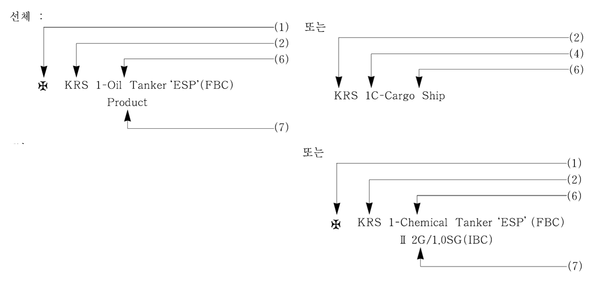

# 제1편 선급등록 및 검사

> 선급 및 강선규칙/적용지침 / RA-01-K / 2025 / KO / Guidance

## 제 1 장 선급등록

### 제 2 절 선급부호

#### 201. 선급부호 (2021) 【규칙 참조】

- **1.** **규칙 201.**의 (2)호부터 (4)호의 규정 중 연해구역 및 평수구역에 대한 구분은 다음에 따른다. 다만, 각 기국정부에서 명시된 정의가 있을 경우에는 기국정부의 정의에 따른다.
- **2.** **규칙 201.**의 (2)호부터 (4)호의 규정 중 항해구역에 제한을 받는 선박의 선체부호, 기관부호 및 의장부호에 적용하는 규정은 다음에 따른다.
  - **(1)** 선체부호
    KRS 0 : 다음의 규정에 따라 선체구조 및 강도를 경감하여 항해구역에 제한(연해구역 또는 평수구역)을 받는 선박.
    - **(가)** **지침 3편 1장 201.**의 (1)호
    - **(나)** **강재부선 규칙 23장 202.** 또는 **302.**
    - **(다)** **지침 10편 1장 201.**의 **1**항 (1)호부터 (3)호 및 **2**항 (1)호부터 (3)호
  - **(2)** 기관부호
    KRM 0 : 다음의 규정에 따라 기관장치 및 전기설비를 경감하여 항해구역에 제한을 받는 선박
    - **(가)** **지침 5편 3장 203.** 및 **204.**의 **2**항
    - **(나)** **지침 6편 1장 101.**의 **1**항 (4)호 및 (5)호
  - **(3)** 의장부호
    다음의 규정에 따라 선체의장 또는 기관의장을 경감한 선박에 대하여는 선체부호 및 기관부호에 C 또는 S를 부기한다.
    - **(가)** C : 연해구역을 조건으로 하는 선박에 부여한다.
      - **(a)** 선체의장:
      - **(i)** **지침 3편 1장 201.**의 (2)호 및 (3)호
        - **(ii)** **지침 10편 1장 201.**의 **1**항 (4)호 및 (5)호
        - **(iii)** **강재부선 규칙 23장 203.**
      - **(b)** 기관의장:
      - **(i)** **지침 5편 1장 401.**의 **1**항, **지침 8편 부록 8-3**의 **1**항 (3)호 (다) (b), **지침 5편 6장 702.**의 **2**항 (2)호, **802.**의 **1**항 (2)호, **804.**의 **1**항 (2)호 및 **2**항 (1)호, **903.**의 **1**항 (1)호 및 (3)호, **지침 5편 7장 204.**의 **1**항 (2)호, **206.**의 **1**항 (2)호, **207.**의 **2**항 (2)호, **209.**의 **2**항 (2)호, **301.**의 **6**항 (2)호 및 **지침 5편 8장 101.**의 **1**항 (1)호
    - **(나)** S : 평수구역을 조건으로 하는 선박에 부여한다.
      - **(a)** 선체의장:
      - **(i)** **지침 3편 1장 201.**의 (2), (3)호 및 **지침 4편 8장 101.**의 **1**항
        - **(ii)** **지침 10편 1장 201.**의 **2**항 (4)호부터 (7)호
        - **(iii)** **강재부선 규칙 23장 303., 304., 305.** 및 **306.**
      - **(b)** 기관의장:
      - **(i)** **지침 5편 1장 401.**의 **1**항, **지침 5편 6장 702.**의 **2**항 (1)호, **802.**의 **1**항 (1)호, **901.**의 **5**항 (2)호, **903.**의 **1**항 (1)호, **지침 5편 7장 201.**의 **1**항, **409.** 및 **지침 5편 8장 101.**의 **1**항 (1)호
        - **(ii)** **강재부선 규칙 23장 307.**

### 제 3 절 제조중등록검사 (2023)

#### 302. 도면승인 【규칙 참조】

- **1.** 선체관계의 승인신청 도면에는 다음의 사항도 명시하여야 한다.
  - **(1)** 중앙횡단면도
    - **(가)** 강도상의 흘수(scantling draft : ds), 또는 ds - d(**3편 1장 111.**에 정의된 만재흘수) > 300mm의 경우는 ds에 대응하는 선박의 길이(L)(기타 주요도면에도 명시한다) *(2017)*
    - **(나)** 건현의 종류(기타 건현의 지정조건에 관계가 있는 도면에도 명시한다)
    - **(다)** 다층 갑판선에서는 건현 갑판의 위치
    - **(라)** 목재 만재흘수선을 표시하는 선박에서는 그것에 대응하는 흘수
    - **(마)** 갑판상에 특수한 화물(목재를 포함)을 적재하는 선박에서는 그 갑판하중($\mathrm{kN}/m ^{2}$)
    - **(바)** 산적화물선에는 그 적재조건(화물의 비중 등)
    - **(사)** **규칙 1편 2장 101.**에서 정하는 선박의 길이(L) *(2017)*
  - **(2)** 강재배치도
    Lf(**3편 1장 103.**에 정의된 건현용 길이) 및 Lf의 전후단점 또는 Lf의 최단점에서 1/4 Lf의 점 *(2017)*
  - **(3)** 외판전개도
    표준 현호와 노출갑판의 웰 부의 현호와의 비교표
  - **(4)** 배수관 장치도
    - **(가)** 계획 만재흘수선상 0.01 $L _{f}$ 및 0.02 $L _{f}$의 선
    - **(나)** 계획 만재흘수선상 600 $\mathrm{mm}$의 선
    - **(다)** 건현 갑판 하 450 $\mathrm{mm}$의 선
- **2.** 제출도면의 생략 및 추가
  - **(1)** 동형선을 건조하는 경우 제출도면을 생략할 때에는 승인도면 생략 신청서와 다음의 도면을 각 3부 제출하여야 한다. (*2022)*
    - **(가)** 일반배치도
    - **(나)** 중앙횡단면도
    - **(다)** 강재배치도
    - **(라)** 외판전개도
    - **(마)** 기관실 전체장치도
    - **(바)** 축계장치도
    - **(사)** 기관실 배관계통도
    - **(아)** 동력계통도
    - **(자)** 원도면과 개정이 있는 부분의 개정도
    - **(차)** 승인도면에 대한 적용규칙이 변경되었을 경우에는 그 변경에 관한 도면
  - **(2)** (1)호의 도면 중 (자) 및 (차)에 대하여는 계산서 등의 참고자료도 제출하여야 한다. 또한 제출도면의 일부 생략이 승인된 경우에 생략된 도면은 최종적으로 승인된 원도면과 동일한 것으로 취급한다.
  - **(3)** (1)호 이외의 경우에도 우리 선급으로부터 이미 승인된 도면으로 건조하고자 하는 경우에는 (1)호 및 (2)호에 따라 제출도면을 생략할 수 있다.
  - **(4)** 검사원의 입회가 두 개 이상의 지역에서 이루어져야 할 것이 예상되는 경우에는 추가부수의 도면제출을 요구할 수 있다.
- **3.** 건현을 변경하는 경우의 도면 재조사
  도면 승인을 끝낸 선박으로 건현 계산을 시행한 결과, 형상건현에 여유가 있기 때문에 $d$에 대응하는 건현보다 작은 건현지정을 희망할 경우에는 다음의 서류에 희망하는 흘수($d _{f}$)와 $d _{f}$에 대한 선체 각 부재 및 종강도계산서를 첨부하여 미리 신청하여야 한다.
  - **(1)** $d _{f } - d \leq$ 300 $\mathrm{mm}$경우
    흘수 증가를 위한 도면 재조사 신청서
    다만, $d _{s} \geq d _{f}$ 인 경우에는 제외한다.
  - **(2)** $d _{f} - d>$ 300 $\mathrm{mm}$경우
    계획 변경에 따른 도면 재조사 신청서
  - **(3)** 계획 변경에 따른 도면 재조사 신청서에는 $d _{f}$ 에 대응하는 선박의 길이를 기재하고, 선체 주요치수를 정정한 주요도면을 제출한다.
  - **(4)** 의장수 및 의장품에 대하여는 **지침 4편 8장**에 따른다.
- **4.** 검사 및 시험방안서 *(2020)*
  조선소는 다음을 포함한 검사 및 시험을 받고자 하는 항목에 대한 방안서를 해당 검사 및 시험에 앞서 검사원에게 승인용 또는 참고용으로 제출하여야 한다.
  - **(1)** 승인용
    - **(가)** 검사 및 시험 방안서(ITP : Inspection and Test Plan)
    - **(나)** 용접 전 조립검사 방안 (필요한 경우)
    - **(다)** 모든 수밀 및 풍우밀 폐쇄장치를 포함한 구조시험(누설 및 사수시험 포함) 방안서
    - **(라)** 비파괴 검사방안
    - **(마)** 복원성시험 방안서
    - **(바)** 시운전 방안서
    - **(사)** 도장시공 사양서 및 품질관리방안(PSPC 부기부호를 갖는 선박인 경우 표면처리에 대한 검사 및 도장절차 포함)
    - **(아)** 하역설비 검사 방안서 (해당되는 경우)
    - **(자)** 선상검사 방안서(Onboard Test Procedure)
    - **(차)** 선체건조감시 계획서 (해당되는 경우)
    - **(카)** 특정 선박형식 또는 정부대행요건에 대한 기타 방안 (해당되는 경우)
  - **(2)** 참고용
    - **(가)** 완결된 강재작업의 검사를 위한 방안 - 일반적으로 블록분할도를 말하며 선행탑재 및 탑재 또는 기타 관련단계에서 블록 상호간의 연결에 대한 상세를 포함

#### 304. 기관장치 【규칙 참조】

**규칙 304.**에서 “우리 선급이 필요하다고 인정하는 시험”이라 함은 **규칙 6편 2장 301.**의 **1**항 및 **2**항(**규칙 9편**에서 정의하는 CMA선 또는 UMA선에 대하여는 **규칙 9편 3장 203.**)의 시험을 말한다.

#### 306. 제반시험 (2021) 【규칙 참조】

**규칙 306.**에서 “우리 선급이 필요하다고 인정하는 시험”이라 함은 **규칙 6편 2장 302.** 및 **303.**(**규칙 9편**에서 정의하는 CMA선 또는 UMA선에 대하여는 **규칙 9편 3장 204.** 및 **205.**)의 시험을 말한다.

#### 309. 공동선급선의 경우 (2025) 【규칙 참조】

- **1.** **두 번째 선급에서 검토해야 할 도면 목록**
  - **(1)** 선체 :
    (파) 구획시험 방안서
    - **(가)** 일반배치도
    - **(나)** 용적도
    - **(다)** 배수량등곡선도
    - **(라)** 적하지침서 (해당 선박에 한함)
    - **(마)** 손상복원성자료 (해당 선박에 한함)
    - **(바)** 중앙횡단면도
    - **(사)** 강재배치도
    - **(아)** 외판전개도
    - **(자)** 횡격벽 구조도
    - **(차)** 타 및 타두재 구조도
    - **(카)** 창구덮개 구조도
    - **(타)** 국제선급연합회(IACS)의 공통구조규칙(**13편**)에 따라 건조된 선박인 경우, 이들 도면은 각 구조요소에 대한 건조두께, 신환두께 및 자발적 추가두께 포함
  - **(2)** 기관 :
    (파) 윤활유관 장치도
    (거) 해수, 청수 공급 장치도
    (너) 전력조사표
    (더) 선박 자동제어시스템 일반 사양
    (러) 주요보기 시스템 상세 사양
    (머) 자동화 회로장치의 부품 목록 (제조자, 형식, 등.)
    (버) 원격 통신을 이용한 모니터링 및 제어시스템 일반 장치도
    (서) 주전력 및 자동제어 시스템 계통도
    (어) 알람, 모니터링 시스템 목록 (파라메타 포함)
    (저) 압축공기관 장치도
    - **(가)** 기관실 전체 장치도
    - **(나)** 축계장치도
    - **(다)** 프로펠러
    - **(라)** 커플링 및 축 정렬 계산서
    - **(마)** 주기관, 추진용 기어 및 클러치장치(또는 제조자 사양, 형식 및 출력에 대한 자료)
    - **(바)** 증기터빈선인 경우 주보일러, 과열기 및 이코노마이저(또는 제조자 사양, 형식 및 출력에 대한 자료) 및 증기관장치도
    - **(사)** 제관장치도
    - **(아)** 전로계통도
    - **(자)** 조타장치 배관 및 배치도와 조타장치 제조자 사양 및 형식에 대한 자료
    - **(차)** 공기관, 측심관, 넘침관 장치도
    - **(카)** 냉각수관 장치도 (해수,청수)
    - **(타)** 연료유관 장치도
    - **(하)** 기관실 내 주요보기 유압관 장치도
  - **(3)** 주축계 비틀림 진동계산서
  - **(4)** 대빙구조 부기부호를 가진 선박인 경우, 신축이음 및/또는 추진계통 축의 비틀림 제한장치에 대한 도면(또는 제조자의 사양, 형식 및 출력에 대한 자료)
  - **(5)** 유조선인 경우, 선수미단의 펌핑장치도 및 코퍼댐과 펌프실의 배수장치도
  - **(6)** 무인자동화 설비선박에 대한 추가자료
    - 설비 및 경보목록
    - 화재경보장치
    - 자동안전장치 (예를 들면, 감속, 비상차단 등)의 목록
    - 작동시험방안서
  - **(7)** 대체설계 및 배치의 승인을 위하여 요구되는 추가 문서
    - **(가)** 대체설계 및 배치에 대한 승인문서가 있는 경우
  - **(8)** 도면 목록 추가
    그 외 선박의 특성 및 용도에 따라 우리 선급이 필요하다고 인정하는 도면 목록 추가
- **2.** 자체 선급기술규칙에서 허용하는 다른 요건은 별도의 지침에 따른다.

### 제 4 절 제조후등록검사 (2023)

#### 401. 제조후등록검사 (2023) 【규칙 참조】

- **1.** 우리 선급에 등록하고자 하는 선박이 우리 선급에서 정하는 사전검사 대상선박인 경우에는 등록검사를 착수하기 전에 사전검사를 실시하고 그 결과에 따라 등록검사 여부를 결정한다. 검사사항에 대하여는 우리 선급이 별도로 정하는 바에 따른다.
- **2.** **규 칙 401.**에서 선체, 기관 및 의장 등에 대하여 필요에 따라 현재치수를 실측하는 주요부분은 등록 자료를 검토하여 건명서의 기재에 필요한 사항을 말한다.
- **3.** 선급이전(TOC)되는 여객선 및 어선의 경우, 검사항목은 규칙 **401.** 및 상기 **1**항 및 **2**항을 적용한다.
  단, 국제선급연합회(IACS)의 QSCS(Quality System Certification Scheme)에 적합함이 검증된 선급으로부터 개조나 변경이 없이 선급이전(TOC)되는 선령 5년 미만의 여객선의 경우 아래의 검사를 적용할 수 있다. *(2022)*
  - **(1)** 입거검사
    선령, 운항기록, 선박 수리 기록 등을 검토 후 수중검사로 대신할 수 있다.
  - **(2)** 주기관 및 보조기관 개방검사
    전회 개방검사 이후 제조자가 권고하는 개방시기를 넘지 않는 경우 **규칙 2장 303.**의 **1~4**항에 따라 검사하여야 한다.
  - **(3)** 프로펠러 축 및 선미관 축검사
    - **(가)** 기름윤활 방식 축이나 페회로형 청수윤활 축인 경우 **규칙 2장 702.**의 **2**항 (2) 호에 따라 검사하여야 한다.
    - **(나)** 개방형 물윤활 방식의 축인 경우 **규칙 2장 703.**의 **2**항 (2)호에 따라 검사하여야 한다.
  - **(4)** 보일러검사
    **규칙 2장 802.**의 **2**항에 따라 검사하여야 한다.
- **4.** 등록신청을 하기 전 5년의 어느 일부 기간 동안에 선박이, 우리선급 또는 국제선급연합희(IACS)의 품질시스템 인증체계(QSCS)의 적합함이 검증된 선급에 등록되었었고 탈급 후 개조나 변경이 없을 경우, 검사요건은 특별히 고려 할 수 있으나 다음에서 요구하는 것 보다 작아서는 아니 된다. *(2019)*
  - **(1)** 우리선급에 등록되었던 선박의 경우, 기한이 지난 모든 검사 및 기한이 지난 지적사항
  - **(2)** 국제선급연합회(IACS)의 품질시스템 인증체계(QSCS)의 적합함이 검증된 선급에 등록되었던 선박의 경우, 적용지침 **403.**(선급이전) 요건과 동일한 검사

#### 402. 도면의 제출 【규칙 참조】

- **1.** 제조후등록검사 시에는 다음의 (1) ~ (5)의 도면 및 자료((1)의 (자) 및 (타) 는 제외)를 승인용으로 제출하여야 하며, 아래 (1)의 (자), (타) 및 (6)은 참고용으로 제출하여야 한다. 또한 선박의 특성 및 용도에 따라 우리 선급이 필요하다고 인정하는 도면 및 자료의 목록을 추가로 선박소유자에게 통보하여 제출받아야 한다. *(2020)*
  - **(1)** 선체관계 : 각 3부씩 제출(다만, (자), (차), (타), (하) 및 (거)는 2부 제출)
    (파) 목재 적재 장치도 (목재 만재흘수선의 지정을 희망하는 경우)
    (거) 손상복원성자료 (해당 선박에 한함)
    - **(가)** 일반배치도
    - **(나)** 중앙횡단면도
    - **(다)** 강재배치도
    - **(라)** 외판전개도
    - **(마)** 횡격벽 구조도
    - **(바)** 타 및 타두재 구조도
    - **(사)** 선미재 구조도
    - **(아)** 창구덮개 구조도 (해당 선박에 한함)
    - **(자)** 용적도 – 참고용 *(2020)*
    - **(차)** 적하지침서 (해당 선박에 한함)
    - **(카)** 적하지침기기 시험성적서 (해당 선박에 한함)
    - **(타)** 선체선도 또는 이와 동등한 자료 (해당선박에 한함) - 참고용 *(2020)*
    - **(하)** 복원성자료 (배수량등곡선도 또는 표 포함)
  - **(2)** 기관관계 : 각 3부씩 제출
    - 설비 및 경보목록
    - 화재경보장치
    - 자동안전장치 (예를 들면, 감속, 비상차단 등)의 목록
    - 작동시험방안서
    - **(가)** 기관실 전체 장치도
    - **(나)** 축계장치도
    - **(다)** 전로계통도
    - **(라)** 동력전달장치, 중간축, 추력축 및 프로펠러축의 도면
    - **(마)** 프로펠러 도면
    - **(바)** 제관장치도
    - **(사)** 주기관, 추진용 기어 및 클러치장치(또는 제조자 사양, 형식 및 출력에 대한 자료)
    - **(아)** 조타장치 배관 및 배치도와 조타장치 제조자 사양 및 형식에 대한 자료
    - **(자)** 증기터빈선인 경우 주보일러, 과열기 및 이코노마이저(또는 제조자 사양, 형식 및 출력에 대한 자료) 및 증기관장치도
    - **(차)** 선령 2년 미만의 선박에 대하여 주축계 비틀림 진동계산서
    - **(카)** 무인자동화 설비선박에 대한 추가자료
  - **(3)** 대빙구조 부기부호를 가진 선박인 경우 신축이음 및/또는 추진계통 축의 비틀림 제한장치에 대한 도면(또는 제조자의 사양, 형식 및 출력에 대한 자료)을 제출하여야 한다.
  - **(4)** 유조선인 경우 선수미단의 펌핑장치도 및 코퍼댐과 펌프실의 배수장치도
  - **(5)** 기국정부 또는 협약에서 요구하는 도면 (해당 선박에 한함) : 3부
  - **(6)** 기타
    - **(가)** 검사보고서(건명서 및 최초기록부 포함)의 사본 : 1부
    - **(나)** 본선이 보유하는 선급, 검사, 협약 등에 관한 증서의 사본 : 1부
    - **(다)** 필요한 경우 본선의 경력, 현상을 구체적으로 표시하는 자료 : 1부
- **2.** **1**항에 규정된 도면 및 자료에 상응하는 도면 또는 자료가 제출되는 경우 이를 해당도면 또는 자료로서 인정할 수 있다.
- **3.** 도면, 자료 등의 심사 결과의 통지
  우리 선급은 **1**항에 정하는 도면 및 자료를 심사한 후 그 결과를 신청자에게 통지한다. 다만, 이들의 자료로서 심사가 곤란한 경우에는 본선에 대하여 현상조사를 할 수 있다.

#### 403. 타선급선의 등록검사 또는 선급이전(TOC(Transfer of Classification)) (2020) 【규칙 참조】

국제선급연합회(IACS)의 QSCS(Quality System Certification Scheme)에 적합함이 검증된 선급에 등록되어 있는 선박을 우리 선급에 등록하고자 할 경우에 제출하여야 할 도면의 종류 및 검사사항은 다음과 같으며, 선박의 특성 및 용도에 따라 우리 선급이 필요하다고 인정하는 도면 및 자료의 목록을 추가로 선박소유자에게 통보하여 참고용으로 제출받아야 한다.

- **1.** 제출도면 및 자료 ***(2020)***
  - **(1)** 선체관계 : 각 1부씩 제출
    (파) 국제선급연합회(IACS)의 공통구조규칙(규칙 11편, 12편 또는 13편)에 따라 건조된 선박인 경우 각 구조요소에 대한 건조두께, 신환두께 및 모든 자발적인 추가두께를 나타내는 도면
    - **(가)** 일반배치도
    - **(나)** 중앙횡단면도
    - **(다)** 강재배치도
    - **(라)** 외판전개도
    - **(마)** 횡격벽 구조도
    - **(바)** 타 및 타두재 구조도
    - **(사)** 창구덮개 구조도 (해당 선박에 한함)
    - **(아)** 용적도
    - **(자)** 적하지침서 (해당 선박에 한함)
    - **(차)** 목재 적재 장치도(목재 만재흘수선의 지정을 희망하는 경우)
    - **(카)** 복원성자료(배수량등곡선도 또는 표 포함)
    - **(타)** 손상복원성자료 (해당 선박에 한함)
  - **(2)** 기관관계 : 각 1부씩 제출
    - 설비 및 경보목록
    - 화재경보장치
    - 자동안전장치(예들 들면, 감속, 비상차단, 등)의 목록
    - 작동시험방안서
    - **(가)** 기관실 전체 장치도
    - **(나)** 축계장치도
    - **(다)** 전로계통도
    - **(라)** 동력전달장치, 중간축, 추력축 및 프로펠러축의 도면
    - **(마)** 프로펠러도면
    - **(바)** 제관장치도
    - **(사)** 주기관, 추진용 기어 및 클러치장치(또는 제조자 사양, 형식 및 출력에 대한 자료)
    - **(아)** 조타장치 배관 및 배치도와 조타장치 제조자 사양 및 형식에 대한 자료
    - **(자)** 증기터빈선인 경우 주보일러, 과열기 및 이코노마이저(또는 제조자 사양, 형식 및 출력에 대한 자료) 및 증기관장치도
    - **(차)** 선령 2년 미만의 선박에 대하여 주축계 비틀림 진동계산서
    - **(카)** 무인자동화 설비선박에 대한 추가자료
  - **(3)** 대빙구조 부기부호를 가진 선박인 경우 신축이음 및/또는 추진계통 축의 비틀림 제한장치에 대한 도면 (또는 제조자의 사양, 형식 및 출력에 대한 자료)을 제출하여야 한다.
  - **(4)** 유조선인 경우 선수미단의 펌핑장치도 및 코퍼댐과 펌프실의 배수장치도
  - **(5)** 기국정부 또는 협약에서 요구하는 도면 (해당선박에 한함) : 각 1부씩 제출
  - **(6)** 타선급선의 선급이전 (TOC) 업무협정에 따라 타선급의 Survey Status 및 자료를 입수하는데 선박소유자가 동의한다는 공문형식의 선박소유자 동의서. 선박소유자 동의서는 우리 선급에 등록신청한 선박소유자가 작성하여도 된다.
  - **(7)** 기타
    - **(가)** 검사보고서(건명서 및 최초기록부 포함)의 사본 : 1부
    - **(나)** 본선이 보유하는 선급, 검사, 협약 등에 관한 증서의 사본 : 1부
    - **(다)** 필요한 경우 본선의 경력, 현상을 구체적으로 표시하는 자료 : 1부
    - **(라)** 선체검사요약서 (해당선박에 한함) : 1부
  - **(8)** 대체설계 및 배치의 승인을 위하여 요구되는 추가 문서
    **2 . 1**항에 규정된 도면 및 자료에 상응하는 도면 또는 자료가 제출되는 경우 이를 해당도면 또는 자료로서 인정할 수 있다.
    - **(가)** 대체설계 및 배치에 대한 승인문서가 있는 경우 제출하여야 한다.
- **3.** 타선급선의 등록검사 시 다음 각 호에 해당되는 경우 관련도면에 대하여는 **402.**에 따른다. *(2018)*
  - **(1)** 상위 항해구역으로 변경되는 경우
  - **(2)** 개조사항이 있는 경우
  - **(3)** 선박의 용도가 변경되는 경우
  - **(4)** 국적이 변경되어 추가의 규정이 적용되는 경우
- **4.** 등록검사
  등록검사는, 선급유지를 위한 정기적 검사로 시행하도록 요구되는 것은 아니지만, 선급유지를 위한 정기적 검사로서 시행할 수 있다.
  선급유지를 위한 특정 정기적 검사 시까지 적합하여야 하는 지적사항은 등록검사를 선급유지를 위한 특정 정기적 검사로 시행하지 아니하는 이상, 또는 지적사항이 기한이 지나지 아니하는 이상 등록검사 시에 시행/적합할 필요는 없다. *(2020)*
  - **(1)** 선급이전으로 우리 선급에 등록하는 경우
    (ⅰ) 선령 5년 미만의 선박은 연차검사와 동등한 정도로 검사한다.
    (ⅱ) 선령 5년 이상 10년 미만의 선박은 연차검사 항목 및 “대표적인 평형수탱크”*****에 대하여 검사한다.
    (ⅲ) 선령 10년 이상 20년 미만의 선박은 다음을 제외하고 연차검사 항목, “대표적인 평형수탱크”***** 및 대표적인 화물구역에 대하여 검사한다. *(2019)*
    ① 가스운반선인 경우, 화물구역에 대한 내부검사를 대신하여 다음에 따른다.
    - 가능한 범위까지 독립형 화물탱크와 관련지지 구조에 대한 외부검사를 포함하여, 주위의 평형수 탱크 및 보이드스페이스에 대한 검사
    - 화물격납설비가 올바르게 작동하는지를 검증하기 위하여 화물일지 및 작업기록에 대한 검토
    ➁ 선령이 10년 이상 15년 미만의 유조선 및 위험화학품 산적운반선의 경우, 내부 보강재와 늑골이 없는 화물탱크의 내부검사를 대신하여 주위의 평형수탱크, 보이드스페이스 및 갑판구조에 대하여 검사한다. *(2024)*
    * Note : “대표적인 평형수탱크”는 평형수탱크의 총수와 형식을 고려하여 선수미 피크탱크 및 일부의 기타탱크를 포함하여야 한다. *(2023)*
    (ⅳ) 선령 15년 이상 20년 미만인 산적화물선, 유조선 및 케미컬탱커 등 검사강화제도(ESP) 적용대상선박은 차기검사 중 먼저 도래하는 정기검사 또는 중간검사 항목을 검사한다.
    (ⅴ) 선령 20년 이상인 모든 선박은 정기검사 항목을 검사한다. 이 요건은 선체계속검사를 시행하는 선박에도 적용한다.
    ➀ 선령 5년 미만의 선박은 연차검사 항목을 검사를 한다.
    ➁ 선령 5년 이상 10년 미만의 선박은 연차검사 항목 및 평형수탱크 중 20 %에 대하여 검사한다.
    ➂ 선령 10년 이상 20년 미만의 선박은 연차검사 항목, 평형수탱크 중 20 % 및 화물구역 중 20%에 대하여 검사한다.
    ➃ 선령 20년 이상의 선박은 정기검사 항목을 검사한다.
    ➀ 개조 후 20년이 경과될 때 까지는 연차검사 항목, 평형수탱크 중 20% 및 화물구역 중 20%에 대하여 검사한다.
    ➁ 개조 후 20년이 경과된 후에는 정기검사 항목을 검사한다.
    만일, 등록검사를 선급유지를 위한 정기적 검사로 시행하는 경우 탈급선급에 의해 시행된 앵커와 앵커체인의 배열 및 계측이 해당 정기적 검사의 검사기한 내에 시행되었다는 것을 조건으로 우리 선급은 탈급선박에 의해 시행된 앵커와 앵커체인의 배열 및 계측을 인정하는 것에 대하여 고려할 수 있다.
    ① 등록검사를 선급유지를 위한 정기적 검사로서 시행하는 경우 탈급선급의 두께계측은 해당 정기적 검사의 검사기한 내에 계측된 것이어야 한다.
    ② 등록검사를 선급유지를 위한 정기적 검사로서 시행하지 아니하는 경우 탈급선급의 두께계측은 다음의 기한 내에 계측된 것이어야 한다.
    - 정기검사 항목을 시행하는 등록검사를 시행하는 경우 등록검사 완료 전 15개월 이내
    - 중간검사 항목을 시행하는 등록검사를 시행하는 경우 등록검사 완료 전 18개월 이내
    상기 ① 및 ②의 두 경우에 있어서, 탈급선급의 두께계측은 해당 검사요건에 적합함이 우리 선급에 의하여 검토되어야 하며, 우리 선급이 만족하는 “확인계측”*****을 시행하여야 한다.
    ***** Note : 만일 우리 선급에서 요구하는 계측의 범위가 탈급선급에서 계측한 범위와 상이한 경우, 그 차이만큼 추가의 두께계측을 확인계측과 함께 시행하여야 한다. *(2023)*
    (xi) (iii)부터 (viii)를 적용함에 있어서, 선령이 15년을 넘는 선박에 대한 탱크 압력시험은 등록검사를 선급유지를 위한 정기적 검사로 시행하지 아니하는 이상 등록검사의 일부로서 시행될 것이 요구되지 아니한다.
    만일, 등록검사를 선급유지를 위한 정기적 검사로 시행하는 경우 탈급선급에 의해 시행된 압력시험이 해당 정기적 검사의 검사기한 내에 시행되었다는 것을 조건으로 우리 선급은 탈급선급에 의해 시행된 압력시험을 인정하는 것에 대하여 고려할 수 있다.
    (xii) (i)부터 (viii)를 적용함에 있어서, 해당되는 경우 (S26(Strength and Securing of Small Hatches on the Exposed Fore Deck) 및 S27(Strength Requirements for Fore Deck Fittings and Equipment)과 같이) 이후 도래하는 정기적 검사 시에 만족할 것을 요구하는 국제선급연합회(IACS)의 통일규칙(UR)은 등록검사를 선급유지를 위한 정기적 검사로 시행하지 아니하는 이상 등록검사의 일부로서 시행/완료될 것이 요구되지 아니한다.
    모든 주요 기관장치에 대하여 전반적인 검사를 시행하여야 하며 이 검사는 다음의 사항을 포함하는 것이어야 한다.
    (ⅰ) 모든 보일러, 이코노마이저 및 증기 발생장치의 안전밸브 조정을 확인하고 연료 연소장치는 실제 작동상태에서 검사하여야 한다.
    (ⅱ) 모든 압력용기는 제출된 도면 또는 증서로서 확인하여야 한다.
    (ⅲ) 절연저항, 발전기 보호용 차단기, 우선차단 장치, 발전기 원동기의 조속기를 시험하고 병렬 및 부하분담이 확인되어야 한다.
    (ⅳ) 모든 경우에 있어서 항해등 및 지시기는 그 작동상태를 확인하여야 하고 비상전원의 급전 상태를 확인하여야 한다.
    (ⅴ) 빌지 배출장치 및 연료유 연소장치들은 연료유밸브, 연료유펌프, 윤활유펌프 및 강제 환풍장치에 대한 폐쇄장치 및 비상소화펌프를 포함하여 작동상태에서 검사 및 시험을 하여야 한다.
    (ⅵ) 재순환 및 결빙 제거장치가 해당 규칙의 요건에 적합한지 확인하여야 한다.(대빙구조에 대한 선급부호를 요구한 경우)
    (ⅶ) 주요제어 및 조타장치를 포함하여 선박이 해상에서 운항하는데 필요한 주 및 모든 보조기관장치를 작동상태에서 시험하여야 하며 보조 조타장치를 시험하여야 한다. 만일 선박이 장기간 계선하고 있었다면 검사원의 판단에 따라 짧은 해상 시운전을 시행하여야 한다.
    (ⅷ) 시동장치를 확인하여야 한다.
    (ⅸ) 유조선의 경우 화물유 장치 및 위험구역내의 전기장치에 대하여 해당규칙의 요건에 적합한지 확인하여야 한다. 방폭형 전기설비가 설치되어 있는 경우 검사원은 이 장치들이 인정된 기관 에 의해 승인된 것인지 확인하여야 한다. 불활성가스장치의 안전장치, 경보장치 및 기타 주요장치들에 대하여 검사하고 이 장치가 선박에 위험을 초래하지 아니하는 것을 확인하기 위하여 전반적인 검사를 시행하여야 한다.
    비고 : 타선급의 제조중등록검사를 받은 후 선박의 인도 시 선급이전으로 또는 중복선급선이나 공동선급선으로 우리 선급에 등록하는 경우 (iii) 및 (ix)항목은 선박의 기록을 검토하는 것으로 검증될 수 있다.
    선령이 15년 이상인 선박의 경우 (가)에 규정된 모든 해당검사를 만족하게 완료하기 전까지, 그리고 기한이 지난 모든 검사 및 기한이 지난 모든 지적사항을 탈급선급이 완료 및 시정하기 전까지는 단기선급증서 또는 화물을 운송할 수 있게 하는 다른 문서를 발급하여서는 아니 된다.
    검사를 시행하는 첫 번째 항구에서 시설을 이용할 수 없는 경우 (가)에서 요구하는 검사의 완료를 위하여 시설을 이용할 수 있는 항구까지의 직항을 허용하는 단기선급증서를 발급할 수 있다. 이러한 경우 (가)에 규정된 검사는 검사를 시행하는 첫 번째 항구에서 시행가능한 최대한의 범위까지 시행하되, 어떠한 경우에도 연차검사 선체항목 및 (가) (b)에서 요구하는 기관 검사항목보다 작아서는 아니 된다. *(2020)*
    - **(가)** 모든 검사가 최신화되었다는 기록에도 불구하고, 다음과 같이 선령 및 탈급선급의 선급현황에 기초하여 범위가 정해져야 하는 등록검사를 최소 기술요건으로써 시행하여야 한다. 다만, 우리 선급은 선박의 상태에 따라 필요하다고 인정할 때에는 다음에서 요구하는 것보다 더 엄격한 범위의 검사를 요구할 수 있다.
      - **(a)** 선체 등록검사
        - **(vi)** (i)부터 (v)의 요건을 대신하여 특정지역에서 운용될 목적으로 건조된 부유식 생산 및/또는 저장 선박은 다음에 따른다.
        - **(vii)** 특정지역에서 운용될 목적으로 건조된 부유식 생산 및/또는 저장 선박 중 다른 선종으로부터 개조된 경우는 다음에 따른다.

#### (viii)

(iv) 및 (v)를 적용함에 있어서, 타선급선의 등록검사를 시행하는 시점이 선박의 입거검사 시기가 아닌 경우 입거검사(선체검사항목)를 대신하여 승인된 수중검사업자에 의한 수선하부 선체에 대한 검사를 시행할 수 있다. *(2018)*

        - **(ix)** (iv) 및 (v)를 적용함에 있어서, 선령이 15년을 넘는 선박에 대한 앵커와 앵커체인의 배열 및 계측은 등록검사를 선급유지를 위한 정기적 검사로 시행하지 않는 이상 등록검사의 일부로서 시행될 것이 요구되지 않는다.
      - **(x)** (i)부터 (viii)를 적용함에 있어서, 해당되는 경우 우리 선급은 탈급선급에 의해 시행된 두께계측을 인정하는 것에 대하여 다음과 같이 고려할 수 있다.
      - **(b)** 기관 등록검사
    - **(나)** 선령이 15년 미만인 선박의 경우 (가)에 규정된 모든 해당검사를 만족하게 완료하기 전까지, 그리고 기한이 지난 모든 검사 및 기한이 지난 모든 지적사항을 선박소유자에게 탈급선급이 명시한 바대로 완료 및 시정하기 전까지는 단기선급증서 또는 화물을 운송할 수 있게 하는 다른 문서를 발급하여서는 아니 된다.
    - **(다)** 단기선급증서 및 선급증서의 유효성은 탈급선급이 지정한 날짜 및 명시한 바대로 완료하여야 하는 미결된 모든 지적사항에 따라 제약을 받는다. 미결된 모든 지적사항은 그 검사지정일과 함께 다음에 명시되어야한다. *(2020)*
      - **(a)** 단기선급증서 및/또는 선급검사보고서 및
      - **(b)** 선급증서가 발급되는 경우 검사현황
    - **(라)** 탈급선급으로부터 추가의 미결된 검사 또는 지적사항이 접수되는 경우에도 해당되는 경우 (나) 및 (다)에 따라야 한다. 만일 이러한 추가의 정보가 단기선급증서를 발급한 후에 접수되는 경우 기한이 지난 모든 검사 또는 지적사항에 대하여 첫 번째 도착항에서 다음에 따라 처리되어야 한다. *(2020)*
      - **(a)** 선령이 15년 미만인 경우 우리 선급에 의하여 또는
      - **(b)** 선령이 15년 이상인 경우 탈급 선급에 의하여
  - **(2)** 중복선급선으로 우리 선급에 등록하는 경우 *(2020)*
    - **(가)** 첫 번째 선급에 의하여 제공된 선급현황의 지적사항을 고려하여 (1) (가)의 요건에 따라서 등록검사를 시행한다.
  - **(3)** 공동선급선으로 우리 선급에 등록하는 경우 *(2020)*
    - **(가)** 최소한 연차검사 수준의 등록검사를 시행한다.
  - **(4)** 타선급의 제조중등록검사를 받은 후 선박의 인도 시 중복선급선 또는 공동선급선으로 우리 선급에 등록하는 경우 (1) (가)에 규정된 모든 해당 검사를 시행하고 만족하게 완료하여야 한다.
- **5.** 우리 선급의 중복선급선으로서 상대선급에서 탈급하는 경우 *(2020)*
  - **(1)** 선령이 15년 미만인 선박의 경우 상대선급의 기한이 지난 모든 지적사항에 대하여 검사가 가능한 첫 번째 도착항에서 완료하고 상대선급의 미결된 모든 지적사항에 대하여는 상대선급의 지정일까지 완료하여야 한다.
    선령이 15년 이상인 선박의 경우 상대선급의 기한이 지난 모든 지적사항은 상대선급에 의하여 완료되어야 하고 상대선급의 미결된 모든 지적사항에 대하여는 상대선급의 지정일까지 완료하여야 한다.
  - **(2)** 선급증서의 유효성은 상대선급이 지정한 날짜 및 명시한 바대로 완료하여야 하는 미결된 모든 지적사항에 따라 제약을 받는다. 미결된 모든 지적사항은 그 검사지정일과 함께 다음에 명시되어야 한다.
  - **(3)** 상대선급으로부터 추가의 지적사항이 접수되는 경우에도 해당되는 경우 (1) 및 (2)에 따라야 한다.
    만일 이러한 추가의 지적사항이 단기선급증서를 발급한 후 또는 선급증서에 이서한 후에 접수되는 경우 기한이 지난 모든 지적사항에 대하여 검사가 가능한 첫 번째 도착항에서 선박의 선령에 따른 해당선급에 의하여 처리되어야 한다.
  - **(4)** 검사를 시행하는 첫 번째 항구에서 시설을 이용할 수 없는 경우 상대선급이 기한이 지난 지적사항에 대한 검사를 완료하기 위하여 시설을 이용할 수 있는 항구까지의 직항을 허용할 수 있다.

### 제 8 절 검사원의 권한 및 의무

#### 801. 검사원의 권한 【규칙 참조】

- **1.** 추가검사의 요구
  검사원은 다음 사항 등을 고려하여 필요하다고 인정하는 경우 해당 검사종류에 따른 검사항목 이외의 사항에 대하여도 추가의 검사를 요구하거나 해당 검사범위를 확대할 수 있다.
  - **(1)** 해당 검사종류에 따른 검사항목에 대한 검사결과 이상상태가 감지된 경우
  - **(2)** 비정상적인 열화의 기록이나 징후 등 이상상태가 감지된 경우
  - **(3)** 과도한 부식, 심각한 변형, 파괴, 손상 또는 기타 결함이 있거나 의심되는 경우
  - **(4)** 운항, 운전, 정비, 계측기록 등의 정보 및 본선(승무원, 선원)이나 제조자로부터 입수한 정보
  - **(5)** 이용가능한 정보에 따라 유사한 선박이나 유사한 검사대상으로부터의 결함에 대한 관련기술정보
- **2.** 비파괴시험의 요구
  검사원은 다음 사항 등을 고려하여 필요하다고 인정하는 경우 비파괴시험을 요구하거나 확대할 수 있다.
  - **(1)** 재료, 용접 또는 보수한 결함 등의 표면 및/또는 내부에 유해한 결함이 있거나 의심되는 경우
  - **(2)** 제작품질이 의심되는 부위, 새로운 제작법/용접법을 채용한 부위, 결함이 발생하기 쉬운 부위 및 접근성과 같은 작업조건이 나쁜 부위 등
  - **(3)** 전 **1**항 (1)호부터 (5)호에 규정된 사항
- **3.** 두께계측의 요구
  검사원은 다음 사항 등을 고려하여 필요하다고 인정하는 경우 두께계측을 요구하거나 확대할 수 있다.
  - **(1)** 쇠모된 또는 쇠모된 것으로 의심되는 경우
  - **(2)** 쇠모의 진행이 현저하다고 판단되는 경우
  - **(3)** 경화보호도장을 하지 아니하였거나 도막의 탈락 등 경화보호도장 상태에 이상이 있거나 의심되는 경우 *(2019)*
  - **(4)** 전 **1**항 (1)호부터 (5)호에 규정된 사항
- **4.** 압력시험의 요구
  검사원은 다음 사항 등을 고려하여 필요하다고 인정하는 경우 압력시험을 요구하거나 확대할 수 있다.
  - **(1)** 외부검사 결과 이상상태가 감지된 경우
  - **(2)** 압력시험을 대신하여 시행하는 누설시험에 대하여 검사신청자가 충분한 자체검사를 하지 않은 경우
  - **(3)** 전 **1**항 (1)호부터 (5)호에 규정된 사항
- **5.** 정밀검사의 요구
  검사원은 다음 사항 등을 고려하여 필요하다고 인정하는 경우 정밀검사를 요구하거나 확대할 수 있다.
  - **(1)** 현상검사 결과 과도한 부식 또는 구조적 결함 등 이상상태가 감지된 경우
  - **(2)** 해당구역의 정비 및 부식방지시스템의 상태 *(2019)*
  - **(3)** 전 **1**항 (1)호부터 (5)호에 규정된 사항
- **6.** 개방검사, 내부검사 및/또는 효력시험의 요구
  검사원은 다음 사항 등을 고려하여 필요하다고 인정하는 경우 개방검사, 내부시험 및/또는 효력시험을 요구하거나 확대할 수 있다.
  - **(1)** 외부검사 및/또는 작동검사 결과 이상상태가 감지된 경우
  - **(2)** 전 **1**항 (1)호부터 (5)호에 규정된 사항
- **7.** 우리 선급 검사원은 업무환경이 안전하지 않거나 검사원의 안전을 저해할 수 있는 경우, 안전한 검사를 시행할 수 있을 때 까지 즉시 검사를 중지하거나 거절할 수 있다. 
