# 제1편 선급등록 및 검사

> 선급 및 강선규칙/적용지침 / RA-01-K / 2025 / KO / Guidance

## 부록 1-5 선체구조부재의 두께계측 방법

### 1. 일반

#### (1) 두께계측의 목적 (2022)

- **(가)** 선체구조부재의 부식, 쇠모가 심하게 진행되면 그 부재의 강도가 열화에 의한 중대한 손상을 일으켜 선체, 화물은 물론 인명 등의 안전을 위협하게 된다. 그러므로 두께계측의 목적은 이와 같은 사고를 미연에 방지하기 위하여, 정기적 검사시 주요 선체구조부재의 두께계측을 실시하여 선박의 종강도 및 국부강도의 저하정도를 알기 위한 자료를 얻는 데 있다. 한편, 이 자료로부터 얻은 결과에 따라 필요한 경우, 부재를 신환하게 된다. 이와 같은 두께계측 자료는 선체강도에 대한 안정성의 확인을 정량적으로 평가할 수 있을 뿐만 아니라, 선박소유자가 선박의 보수관리를 계획적으로 수행하는데 유효하게 이용할 수 있으므로 신중히 취급하는 것이 바람직하다. *(2024)*

#### (2) 두께계측 범위

규칙을 만족하기 위한 표준 두께계측의 범위는 **표 4**부터 **표 13**에 따른다. 다만, 도장상태 및 부식상태에 따라 두께계측 범위를 증감할 수 있다.

#### (3) 두께계측 기록 (2024)

- **(가)** 두께계측 기록은 아래와 같은 양식에 기록하여 제출하여야 한다.
  - **(a)** **표 19**와 같은 일반요목 및
  - **(b)** Non-CSR 선박의 경우, **표 20-1**과 같은 계측위치, 계측위치를 나타내는 상세스케치, 원래 두께, 최대허용 쇠모량, 현재의 쇠모량 및 쇠모율 등 포함.
  - **(c)** 국제선급연합회(IACS)의 공통구조규칙(**규칙 11편, 규칙 12편** 또는 **규칙 13편**)에 따라 건조된 선박인 경우, **표 20-2**과 같은 계측위치, 계측위치를 나타내는 상세 스케치, 건조두께, 자발적 추가 두께, 신환 두께, 계측 된 두께, 잔여 부식 추가 등 포함.

### 2. 쇠모한도

#### (1) 일반

- **(가)** 이 부록은 쇠모된 선체 주요 구조부재나 의장품의 보수 여부를 판단할 때의 쇠모한도 기준치를 나타내는 것이며, 쇠모한도 또는 허용 쇠모량이라 함은 허용되는 쇠모 한계치를 나타낸다. *(2024)*
- **(나)** 두께계측 결과 구조부재나 의장품이 쇠모한도를 초과하는 경우, 처리절차는 **규칙 2장 109.**에 따른다. *(2024)*
- **(다)** 이 부록에 규정되어 있지 않은 선체 구조부재에 관한 쇠모한도는 검사원이 적절하다고 인정하는 바에 따른다.

#### (2) 선체 주요 구조부재의 쇠모한도

- **(가)** 선체 구조부재에 대한 쇠모한도는 **표 1**에 따른다. 다만, 국제선급연합회(IACS)의 공통구조규칙(**규칙 11편, 규칙 12편** 또는 **규칙 13편**)에 따라 건조된 선박인 경우 **규칙 3장 105.**의 **2**항에 따른다.
- **(나)** 쇠모한도의 값은 부재의 균등 쇠모시의 한계치를 표시한다.
- **(다)** 응력 집중부(브래킷 끝부분 등)에 국부적인 부식이 있을 때는 **표 1**과 관계없이 부분적인 신환 또는 보강을 하여야 한다.

  **표 1 부재별 쇠모한도**

  | 국부 쇠모 한도 | 부재명칭 | 쇠모한도 |   |   |
  | --- | --- | --- | --- | --- |
  | 국부 쇠모 한도 | 부재명칭 | 분류 Ⅰ^1) | 분류 Ⅱ^1) | 분류 Ⅲ^1) |
  | 국부 쇠모 한도 | 강력갑판과 현측후판 및 이들 부재에 붙어있는 종통부재, 외판, 선저외판, 디프탱크^3)의 격벽판, 톱사이드 경사판, 호퍼사이드 경사판, 내저판 *(2025)* | 원래두께^4)의 20 % *(2025)* | (원래두께의 20%) + 1 $\mathrm{mm}$ | 1 $\mathrm{mm}$ |
  | 국부 쇠모 한도 | 이중저의 늑판 및 거더, 1차 지지부재의 웨브 및 면재 | 원래두께의 20 % | 원래두께의 25 % | 1 $\mathrm{mm}$ |
  | 국부 쇠모 한도 | 유효갑판^5), 선루갑판, 화물창구 측선 내의 갑판, 디프탱크의 격벽판 이외의 수밀격벽판, 창구덮개(휨보강재 포함), 창구코밍(휨보강재 포함), 2차 보강재^6)의 웨브, 면재 및 브래킷 *(2025)* | 원래두께의 25 % | 원래두께의 30 % | 1 $\mathrm{mm}$ |
  | 국부 쇠모 한도 | 화물창/탱크 늑골의 웨브, 면재 및 브래킷 | 원래두께의 20 % 또는 1.5 $\mathrm{mm}$ 중 큰 값 | 원래두께의 25 % 또는 2.5 $\mathrm{mm}$ 중 큰 값 | 1 $\mathrm{mm}$ |
  | 국부 쇠모 한도 | 피팅 등의 국부적인 부식 *(2022)* | 원래두께의 30 % | 원래두께의 35 % | 1 $\mathrm{mm}$ |
  | 국부 쇠모 한도 | (비고) 1) 제조중등록선박인 경우 : 분류Ⅰ, 분류Ⅱ 및 분류Ⅲ에 대한 적용구분은 다음과 같다. (가) 분류Ⅰ: 다음사항 중 어느 하나에 해당되는 선박을 말한다. (a) 선박의 길이가 90 $\mathrm{m}$ 이상인 선박으로서 1998년 7월 1일 이후의 규칙에 의하여 제조중등록검사를 받고 등록된 선박 (b) 액체화물을 운송하는 모든 선박으로서 1998년 7월 1일 이후의 규칙에 의하여 제조중등록검사를 받고 등록된 선박 (나) 분류Ⅱ : 분류Ⅰ 및 분류Ⅲ에 속하지 않는 선박 (다) 분류Ⅲ : **고속경구조선규칙** 및 **고속경구조선규칙 적용지침**을 적용한 선박 중에서 강재로 되어 있는 선박 2) 제조후등록선박인 경우 우리 선급이 별도로 정하는 바에 따른다. 3) 디프탱크의 정의는 **규칙 3편 15장 101.**에 따른다. 4) 원래두께라 함은 도면상의 두께를 말한다. 단, 각각의 부재에 대하여 규칙에서 요구하는 두께가 별도로 지정된 경우, 그에 따른다. *(2025)* 5) 유효갑판의 정의는 **규칙 3편 5장 103.**에 따른다. 6) 2차 보강재라 함은 1차 지지부재에 의하여 지지되는 보강재를 말하며 다른 보강재를 지지하지 않는 부재를 말한다 |   |   |   |
  | 전단강도관련 쇠모 | 우리 선급이 별도로 정하는 종강도평가를 위한 두께계측 시 다음 중 하나에 해당되는 경우 전단강도평가를 시행하여야 한다. 1) 유조선(위험화학품 산적운반선 포함)에 대하여 선체외판 및 종격벽판 중 어느 한 판의 평균쇠모가 다음을 초과하는 경우 분류 I 선박 : 2.0 $\mathrm{mm}$ 분류 II 선박 : 3.0 $\mathrm{mm}$ 2) 액화가스 산적운반선에 대하여 선체외판 중 어느 한 판의 평균쇠모가 다음을 초과하는 경우 또는 분류 I 선박 : 1.5 $\mathrm{mm}$ 분류 II 선박 : 2.5 $\mathrm{mm}$ 3) 격창적하를 하는 산적화물선(광석운반선 포함)에 대하여 선체외판 및 종격벽판 중 어느 한 판의 평균쇠모가 다음을 초과하는 경우 분류 I 선박 : 1.5 $\mathrm{mm}$ 분류 II 선박 : 2.5 $\mathrm{mm}$ |   |   |   |

#### (3) 1998년 7월 1일 이후 2004년 1월 1일 전에 건조계약된 산적화물선으로서 규칙 4편 2장에 따라 설계된 화물창의 창구덮개에 대한 쇠모한도 적용요령은 다음에 따른다.

- **(가)** 단판 창구덮개와 폰툰형 창구덮개판
  - **(a)** 계측된 판의 두께가 원래두께로부터 1.5 $\mathrm{mm}$ 이상 쇠모된 경우($t _{ n e t} +0.5 \mathrm{mm}$ 미만인 경우)에 대하여는 강재신환을 하여야 한다. 여기에서 $t _{n e t}$ 는 부식여유두께를 제외한 강도요구두께를 말한다.
  - **(b)** 계측된 판의 두께가 원래두께로부터 1.0 $\mathrm{mm}$이상 1.5 $\mathrm{mm}$ 내에서 쇠모된($t _{n e t} +0.5 \mathrm{mm}$ 부터 $t _{n e t} +1.0 \mathrm{mm}$ 내에 있는) 경우에는 강재신환을 하거나 강재신환을 하지 않을 경우 도료제조자의 요건에 따른 도장을 한 후 방식도장의 유효성을 매 정기적 검사 시 확인하여야 한다. 방식도장을 하지 않는 경우 매 정기적 검사 시 두께계측을 하여야 한다.
- **(나)** 폰툰형 창구덮개판의 내부부재
- **(가)** 에 따라 폰툰형 창구덮개판이 신환되거나 판의 부식 및 변형에 따라 판의 신환이 필요하다고 인정하는 경우 내부부재에 대한 두께계측을 하여야 하며, 두께계측 결과 원래두께로부터 1.5 $\mathrm{mm}$ 이상 쇠모된($t _{n e t}$ 미만인) 내부부재는 신환하여야 한다.

#### (4) 2004년 1월 1일 이후 2024년 7월 1일 전에 건조계약된 모든 산적화물선, 광석운반선 및 겸용선으로서 규칙 7편 3장 9절에 따라 설계된 화물창의 창구덮개 및 창구코밍에 대한 쇠모한도 적용요령은 다음에 따른다.

- **(가)** 단판 창구덮개와 복판 창구덮개의 판
  - **(a)** 계측된 판의 두께가 원래두께로부터 1.5 $\mathrm{mm}$ 이상 쇠모된 경우($t _{ n e t} +0.5 \mathrm{mm}$ 미만인 경우)에 대하여는 강재신환을 하여야 한다.
  - **(b)** 계측된 판의 두께가 원래두께로부터 1.0 $\mathrm{mm}$이상 1.5 $\mathrm{mm}$내에서 쇠모된($t _{n e t} +0.5 \mathrm{mm}$ 부터 $t _{n e t} +1.0 \mathrm{mm}$ 내에 있는) 경우에는 도료제조자의 요건에 따른 도장을 하거나 매 정기적 검사 시 두께계측을 하여야 한다. 도장은 **규칙 2장 102.**의 “도장상태”에 정의된 “양호(good)” 상태를 유지하여야 한다. *(2024)*
- **(나)** 복판 창구덮개의 내부부재
- **(가)** 에 따라 복판 창구덮개의 판이 신환되거나 판의 부식 및 변형에 따라 판의 신환이 필요하다고 인정하는 경우 내부부재에 대한 두께계측을 하여야 하며, 두께계측 결과 원래두께로부터 1.5 $\mathrm{mm}$ 이상 쇠모된($t _{n e t}$ 미만인) 내부부재는 신환하여야 한다.
- **(다)** 창구코밍
  - **(a)** 계측된 판의 두께가 원래두께로부터 1.0 $\mathrm{mm}$ 이상 쇠모된 경우($t _{ n e t} +0.5 \mathrm{mm}$ 미만인 경우)에 대하여는 강재신환을 하여야 한다.
  - **(b)** 계측된 판의 두께가 원래두께로부터 0.5 $\mathrm{mm}$이상 1.0 $\mathrm{mm}$내에서 쇠모된($t _{n e t} +0.5 \mathrm{mm}$ 부터 $t _{n e t} +1.0 \mathrm{mm}$ 내에 있는) 경우에는 도료제조자의 요건에 따른 도장을 하거나 매 정기적 검사 시 두께계측을 하여야 한다.
    도장은 **규칙 2장 102.**의 “도장상태”에 정의된 “양호(good)” 상태를 유지하여야 한다. *(2024)*

#### (5) 2005년 1월 1일 이후 용골거치되고 2024년 7월 1일 전에 건조계약된 산적화물선 이외의 선박으로서, 규칙 4편 2장의 적용을 받는 노출갑판상 위치 I 및 II에 있는 창구덮개, 창구전방 및 측면의 코밍에 대한 신환두께(_s2)는 다음에 따른다.

(**규칙 4편 2장 107.**의 **2**항 참조)

#### (6) 규칙 13편을 적용받는 산적화물선을 제외한 2024년 7월 1일 이후 건조계약된 선박으로서 창구덮개 및 코밍에 대한 신환두께(_s2) 및 강재 교체는 다음에 따른다. (규칙 4편 2장 107.의 2항 및 3항 참조) (2025)

- **(가)** 신환두께
  $t _{renewal} =t _{as-built} -t _{c} +0.5$($\mathrm{mm}$)
  $t _{c}$ : 표 2에 따른 부식추가. 다만 $t _{c}$ 가 1.0 $\mathrm{mm}$인 경우에는 $t _{renewal} =t _{as-built} -t _{c}$($\mathrm{mm}$)로 한다.

  | 선박의 종류 | 구조물 | $t _{c}$ [$\mathrm{mm}$] |
  | --- | --- | --- |
  | 컨테이너선, 자동차운반선, 종이 운반선(Paper Carrier), 여객선 | 창구덮개 | 1.0 |
  | 컨테이너선, 자동차운반선, 종이 운반선(Paper Carrier), 여객선 | 창구코밍 | 1.5 |
  | 산적화물선, 자가 하역 산적화물선(Self-Unloading Bulk Carrier), 광석운반선 및 겸용선 | 단판 창구덮개 | 2.0 |
  | 산적화물선, 자가 하역 산적화물선(Self-Unloading Bulk Carrier), 광석운반선 및 겸용선 | 이중 창구덮개의 정판 및 바닥판 | 2.0 |
  | 산적화물선, 자가 하역 산적화물선(Self-Unloading Bulk Carrier), 광석운반선 및 겸용선 | 이중 창구덮개의 내부재 | 1.5 |
  | 산적화물선, 자가 하역 산적화물선(Self-Unloading Bulk Carrier), 광석운반선 및 겸용선 | 창구 코밍과 코밍 스테이 | 1.5 |
  | 상기 이외의 선박 | 단판 창구덮개 | 2.0 |
  | 상기 이외의 선박 | 이중 창구덮개의 정판 및 바닥판 | 1.5 |
  | 상기 이외의 선박 | 이중 창구덮개의 내부재 및 폐위된 박스거더 | 1.0 |
  | 상기 이외의 선박 | 스테이 및 보강재를 포함한 창구 코밍 | 1.5 |
- **(나)** 강재 교체
  - **(a)** 계측된 두께 $t _{g}$에 따른 처리 방법은 **표 3**에 따른다.

    | 처리방법 | $t _{c} \geq 1.5 mm$ 인 경우 | $t _{c} =1.0 mm$ 인 경우 |
    | --- | --- | --- |
    | 강재 교체 | $t _{g} \(t _{g} \leq t _{n et}$ |   |
    | 보호도장 시공 또는 연차검사 시 두께계측 | \(t _{n et it} +0.5 \(t _{n et it} |   |
  - **(b)** 보호도장을 시공하는 경우 도장은 도료 제조업자의 요건에 따라야 한다. 도장은 **1편 2장 102.**의 도장상태에 정의된 “양호(GOOD)" 상태를 유지하여야 한다.
  - **(c)** 이중 창구덮개의 내부재의 경우, 정판 또는 저판의 강재가 교체되거나 검사원이 필요하다고 인정하는 경우 두께계측이 요구된다. 이때, 계측된 두께가 $t _{n et}$ 미만인 경우, 내부재의 강재를 교체하여야 한다.

#### (7) 1998년 7월 1일 이후 건조계약되고 규칙 7편 3장 1201.의 적용을 받는 산적화물선의 수직파형 횡수밀격벽에 대한 쇠모한도 적용요령은 다음에 따른다.

- **(가)** 계측된 판의 두께가 원래 두께로부터 3.0 $\mathrm{mm}$이상 쇠모한 경우($t _{n e t} +0.5 \mathrm{mm}$ 미만인 경우)에 대하여는 강재신환을 하여야 한다.
- **(나)** 계측된 판의 두께가 원래두께로부터 2.5 $\mathrm{mm}$ 이상 3.0 $\mathrm{mm}$ 내에서 쇠모된($t _{n e t} +0.5 \mathrm{mm}$ 부터 $t _{n e t} +1.0 \mathrm{mm}$ 내에 있는) 경우에는 강재신환을 하거나 강재신환을 하지 않을 경우 도료제조자의 요건에 따른 도장을 한 후 방식도장의 유효성을 매 정기적 검사 시 확인하여야 한다. 방식도장을 하지 않는 경우 매 정기적 검사 시 두께계측을 하여야 한다.

#### (8) 지침 7편 부록 7-5의 1항 (1)호 (가)의 적용을 받는 산적화물선의 1번과 2번 화물창 사이의 수직파형 횡수밀격벽에 대한 쇠모한도 적용요령은 지침 7편 부록 7-5의 1항 (6)호에 따른다.

#### (9) 2007년 1월 1일 이후 용골거치된 선박으로서, 규칙 4편 10장의 적용을 받는 예인 및 계류관련 선체지지구조의 쇠모허용치는 규칙 4편 10장 204. 부식추가 및 205. 쇠모한도에 따른다. (2024)

### 3. 두께계측 위치

#### (1) 의심지역의 두께계측

검사원은 각 구역의 정밀검사 시 부식이 현저하거나 또는 쇠모의 진행이 현저하다고 판단되는 지역에 대하여 두께계측을 요구할 수 있으며, 이들의 예는 **표 2**와 같다. *(2024)*

#### (2) 계측위치 및 계측점의 수

두께계측 시 계측위치 및 계측점의 수에 대한 표준은 **표 3**과 같다. 이 그림들은 산적운반선과 유조선 등의 전형적인 선박 형태를 나타낸 것으로 이를 그림이 없는 다른 종류의 선박에 대한 지침으로 사용할 수 있다. 이 부록에 별도로 명시되지 아니한 기타 선체구조부재에 대한 두께계측위치 및 계측점의 수는 선령 및 선체구조 등을 고려하여 검사원이 적절하다고 인정하는 바에 따른다.

#### (3) 정기검사 시의 두께계측

각 정기검사 시의 계측 위치는 **표 4**부터 **표 13**에 따른다.

### 5. 검사강화제도 적용대상 유조선 또는 이중선체 유조선의 종강도평가를 위한 두께계측의 샘플링방법 및 수리방법

#### (1) 종강도평가의 범위

탱크를 포함하는 선체거더길이의 범위에 대하여 중앙부 0.4L 이내, 중앙부 0.4L을 넘어서 연장될 수 있는 인접한 탱크에 대하여는 중앙부 0.5L 이내에서 종강도가 평가되어야 한다. 이때 탱크는 평형수탱크 및 화물탱크를 말한다.

#### (2) 두께계측의 샘플링방법

- **(가)** **규칙 3장 304.**의 **4**항 또는 **504.**의 **4**항의 해당규정에 따라서, 히팅코일이 설치된 화물탱크와 공통 경계면을 가지는 평형수탱크, 해수로 채워지는 것이 허용된 화물탱크 및 기타탱크와 같이 부식환경에 놓여있는 가능한 많은 다른 탱크에 대하여 두께계측을 할 수 있도록 횡단면이 선정되어야 한다. 히팅코일이 설치된 화물탱크와 공통 경계면을 가지는 평형수탱크 및 해수로 채워지는 것이 허용된 화물탱크가 있는 경우에는 이들 탱크가 선정되어야 한다.
- **(나)** 선정되어야 하는 횡단면의 최소수는 **규칙 3장 표 1.3.5** 또는 **표 1.3.11**의 해당규정에 따라야 한다. 횡단면은 부식이 가장 심하게 발생할 의심이 되는 부위 또는 (다)에 규정된 갑판 및 선저외판의 판 계측결과 부식이 가장 심하게 발생된 부위를 선정하여야 하고, 국부 신환 또는 보강된 부위와 떨어져 있어야 한다.
- **(다)** **규칙 3장 표 1.3.5** 또는 **표 1.3.11**의 해당규정에 따라서 계측되어야 하는 화물지역 내의 각 갑판 및/또는 선저외판에 대하여 최소한 2점이 계측되어야 한다.
- **(라)** **규칙 3장 표 1.3.5** 또는 **표 1.3.11**의 해당규정에 따라서 계측되어야 하는 각 횡단면에서 갑판 및 선저외판의 0.1 $D$(여기서 $D$는 선박의 형깊이를 말한다) 이내의 모든 종통재 및 거더의 웨브 및 면재가 계측되어야 하고, 모든 판은 종통재 사이에서 1점이 계측되어야 한다.
- **(마)** **규칙 3장 표 1.3.5** 또는 **표 1.3.11**의 해당규정에 따라서 각 횡단면에서 계측되어야 하는 (라)에 규정된 것 이외의 종통재인 경우 모든 종통재 및 거더의 웨브 및 면재가 계측되어야 하고, 모든 판은 판당 최소한 1점이 계측되어야 한다.
- **(바)** 각 부재의 두께는 그 횡단면의 각 부재에 대하여 계측된 모든 계측값을 평균함으로써 결정되어야 한다.

#### (3) 종강도가 부족한 경우의 추가계측

- **(가)** 한 개 또는 그 이상의 횡단면이 종강도 요건 상 부족한 경우 두께계측을 위한 횡단면의 수는 중앙부 0.5 $L$ 이내의 각 탱크가 선정되도록 증가시켜야 한다. 그 일부가 중앙부 0.5 $L$ 이내에 있으나 이를 넘어서 연장된 탱크구역도 선정되어야 한다.
- **(나)** 수리된 단면의 경계부분도 규칙에 적합함을 확인하기 위하여 각 수리지역의 전방에 한 개 및 후방에 한 개의 횡단면에 대하여 필요한 범위까지 추가두께계측을 시행하여야 한다.

#### (4) 유효한 수리방법

- **(가)** 규칙에 적합하기 위하여 시행된 신환 또는 보강의 범위는 (나)에 따라야 한다.
- **(나)** 신환 또는 보강된 구조부재의 최소연속길이는 인접한 일차부재간격의 두 배보다 적어서는 아니 된다. 추가하여, 교체된 부재(판, 보강재, 거더 웨브 및 플랜지, 등)의 전방 및 후방의 각 연결부재의 맞대기이음에 대한 두께감소는 과도한 부식범위(각 특정부재와 관련하여 허용쇠모량의 75%) 내에 있어서는 아니 된다.
  맞대기이음의 두께차가 얇은 두께의 15%를 초과하는 경우 테이퍼를 주어야 한다.
- **(다)** 스트랩 설치를 포함한 대체수리방법 또는 구조부재 변경은 특별히 고려되어야 한다. 스트랩의 설치는 다음 경우로 제한되어야 한다.
  - **(a)** 종강도 복구 및/또는 증가를 위하여
  - **(b)** 보강되어야 하는 갑판 또는 선저외판의 두께감소는 과도한 부식범위(갑판에 대한 허용쇠모량의 75%) 내에 있어서는 아니 된다.
  - **(c)** 스트랩의 끝을 포함하여 얼라인먼트 및 배치는 우리 선급이 별도로 정하는 바에 따라야 한다.
  - **(d)** 스트랩은 중앙부 0.5 $L$ 길이의 전체에 걸쳐 연속되어야 한다.
  - **(e)** 맞대기이음 및 스트랩의 폭에 따라서 슬롯용접에는 연속필렛용접 및 완전용입용접을 사용하여야 한다. 적용하는 용접법은 우리 선급이 인정하는 것이어야 한다.
- **(라)** 신환부위에 인접한 기존의 구조 및 설치된 스트랩 등에 연결된 기존의 구조는 좌굴저항 및 종통부재와 선체외판 사이의 용접상태를 고려하여 작용하는 하중에 견딜 수 있어야 한다.

  **표 2 의심지역의 두께계측**

  | 구분 | 계측위치 |   |
  | --- | --- | --- |
  | 갑판 및 상부구조 | 강력갑판의 선수부(중앙부 0.5 $L$ 사이보다 전방의 부분)와 다음에 명시하는 장소에 쇠모가 발생하기 쉽다. 특히 빌지가 고이기 쉬운 곳은 쇠모의 진행이 빠르다. 또한 원래 두께가 얇은 부재는 쇠모에 의한 영향이 크므로 주의를 요한다. |   |
  | 갑판 및 상부구조 | 선수루, 선미루, 갑판실 | 선루전후단벽, 갑판실 주위 벽의 하단부, 파이프 관통부 주변, 드레인 플러그 부근, 선루갑판, 갑판실 정판의 빌지통로 부근, 갑판기계(윈치, 윈들러스 등), 페어리더 및 볼라드의 하부 |
  | 갑판 및 상부구조 | 창구측선내, 선루내 및 갑판실내의 상갑판 | 창구측선내, 선루내 및 갑판실내의 상갑판 창구측선내 갑판, 선루 전후단벽 부근 및 갑판실 주위 벽 주변 및 통로 부근 |
  | 갑판 및 상부구조 | 창구코밍 및 창구코밍 스테이 | 상갑판과 만나는 부분. 특히 증기 파이프가 근접하는 장소 |
  | 갑판 및 상부구조 | 불워크판 및 불워크 스테이 | 상갑판과 만나는 부분. 특히 선루와 갑판실 전단 및 방수구 주변 |
  | 갑판 및 상부구조 | 윈치 받침대 | 특히 증기 윈치의 받침대 주위 |
  | 갑판 및 상부구조 | 강재 창구덮개 | 폰툰창구덮개(클리트 등을 포함) |
  | 외판 | 바람 및 물막이 스트레이크 *(2024)* | 특히 선수미부에 원래 두께가 얇은 위치 |
  | 외판 | 외측브래킷 부근의 외판 | 특히 림버보드 및 시멘트촉(chock)를 떼어내고 선박의 내측에서 정밀검사를 할 필요가 있음 |
  | 외판 | 창내 늑골에서 그 부근의 외판 | 특히 그루빙(grooving)발생 유무 확인 |
  | 외판 | 체인로커의 외판 | - |
  | 외판 | 내부부재와 관련하여 하드스폿 (hard spot)된 외판 | 특히 평형수탱크 내의 위치 |
  | 내부부재 | 다음 위치에 쇠모가 심하며 특히 습기가 차고 공기의 유통이 나쁜 위치와 빌지가 고이기 쉬운 위치에는 쇠모의 진행이 빠르다 |   |
  | 내부부재 | 창내늑골과 외측브래킷이 접하는 부분 | 노령선에서 제일 문제가 되는 위치이기 때문에 반드시 림버보드를 떼어내고 응력부식에 의한 이상 쇠모와 결손의 유무를 확인 요함 |
  | 내부부재 | 횡격벽과 내저판이 만나는 부분 | 여기도 창내늑골과 같이 문제가 되는 위치이므로 반드시 내장재를 들어내어 검사를 요함 |
  | 내부부재 | 평형수탱크로서 사용하는 이중저탱크 및 디프탱크의 정판 | - |
  | 내부부재 | 창내늑골과 외판의 용접선 부분 | 특히 단속 용접된 늑골은 주의를 요함 |
  | 내부부재 | 빌지웰 | 특히 기관실 내의 빌지웰 및 빌지웰 내에 파이프가 배치된 경우에는 주의를 요함 |
  | 내부부재 | 내저판과 필러가 접하는 부분 | - |
  | 내부부재 | 기관실 내 해수펌프 부근의 부재 | - |
  | 내부부재 | 기관실 내 해수흡입구 부근 | - |
  | 내부부재 | 샤프트터널과 내저판이 만나는 부분 | - |
  | 내부부재 | 갑판사이의 늑골 또는 갑판사이의 횡격벽과 하층갑판과의 접하는 부분 | 노령선에서 문제가 되는 위치이므로 정밀검사를 요함 |

  **표 2 의심지역의 두께계측** (계속)

  | 구분 | 계측위치 |   |
  | --- | --- | --- |
  | 내부부재 | 선수격벽의 하단부와 체인로커 바닥판 | - |
  | 내부부재 | 팬팅스트링거와 선측스트링거의 전후단, 늑골과 접합부 및 슬롯 주변 | - |
  | 탱크내부 | 다음 위치에 쇠모가 심하고 특히 평형수탱크 및 연료유와의 겸용 탱크는 쇠모의 진행이 빠르다 |   |
  | 탱크내부 | 기관실 전방의 평형수탱크 전반 | 특히 외판, 갑판을 겸용하지 않는 탱크정판, 저판 및 격벽 등의 정밀검사 필요. 또한 내부재에는 늑골과 브래킷과 만나는 부분, 거더의 양단 브래킷부와 경감구멍 및 슬롯 주변에 주의 요함 |
  | 탱크내부 | 이중저의 평형수탱크와 샤프트터널, 양현 평형수탱크 | 특히 격벽 하의 저판, 늑판 뒷면에 연한 정판, 늑판과 거더의 경감구멍과 슬롯 주변에 주의 요함 |
  | 탱크내부 | 고온의 벽면 | 기관실에 접하는 벽면과 가열하는 연료유탱크에 접하는 벽면에 주의 |
  | 탱크내부 | 측심관 하부 | 특히 기관실 내 빌지탱크에 주의 |
  | 탱크내부 | 선수탱크 내 체인로커 | 체인로커 바닥판 및 주위 벽에 주의 요함 |

  **표 3-1 두께계측 시 계측위치 및 계측점의 수 - Non-CSR 선박** **표 3-1**은 국제선급연합회(IACS)의 공통구조규칙(**규칙 11편, 규칙 12편** 또는 **규칙 13편**)에 따라 건조되지 아니한 선박 (즉, Non-CSR 선박)에 적용한다.

  | 항목 | 계측위치 및 계측점의 수 |
  | --- | --- |
  | 횡단면 | 1. 검사강화제도 적용대상 유조선, 위험화학품 산적운반선 또는 이중선체 유조선인 경우 (**그림 1** 및 **그림 2** 참조) (1) 각 횡단면에서 갑판 및 선저외판의 0.1D(여기서 D는 선박의 형깊이를 말한다) 이내의 모든 판은 종통부재 사이에서 1점을 계측하고 그 외의 모든 판은 각 판마다 최소한 1점을 계측한다. (2) 횡단면 계측이 모든 종통부재를 포함해야 하는 경우에는 모든 종늑골의 웨브와 면재에 대해서도 각각 1점을 계측한다. 2. 단일선체 산적화물선, 이중선체 산적화물선 또는 일반건화물선인 경우 (**그림 3** 및 **그림 4** 참조) (1) 각 횡단면에서 갑판 및 내저판의 모든 판은 종통부재 사이에서 1점을 계측하고 그 외의 모든 판은 각 판마다 최소한 1점을 계측한다. (2) 횡단면 계측이 모든 종통부재를 포함해야 하는 경우에는 모든 종늑골의 웨브와 면재에 대해서도 각각 1점을 계측한다. 3. **1**항 및 **2**항 이외의 일반선박인 경우 (**그림 5** 참조) (1) 각 횡단면에서 각 판마다 최소한 2점을 계측한다. (2) 횡단면 계측이 모든 종통부재를 포함해야 하는 경우에는 모든 종늑골의 웨브와 면재에 대해서도 각각 1점을 계측한다. 4. 횡식 늑골구조의 선박인 경우 횡단면은 횡단면을 따라 인접한 늑골 및 그 단부브래킷을 포함한다. (검사강화제도 적용대상 유조선, 위험화학품 산적운반선 또는 이중선체 유조선인 경우 **그림 1** 및 **그림 2** 참조, 단일선체 또는 이중선체 산적화물선인 경우 **그림 6** 및 **그림 8** 참조, 이외의 선박인 경우 **그림 7** 참조) |
  | 횡단면에 대한 갑판, 선측외판 및 선저외판 | 고려하는 횡단면 내의 각 판(판의 각 1/4 끝단 또는 평균부식을 대표하는 지역)에서 최소한 2점을 계측한다. |
  | 선택된 판: 갑판(화물창구 측선 안쪽에 있는 갑판 포함), 탱크정판, 선저외판, 내저판 등의 판 및 바람 및 물막이 스트레이크 중 선택된 판 *(2024)* | 평균부식을 대표하는 지역에서 각 판에 대하여 최소한 2점을 계측한다. 판 길이가 6 $\mathrm{m}$를 초과하는 경우에는 6 $\mathrm{m}$ 또는 그 단수마다 2점을 추가한다. 계측하여야 하는 판이 평형수탱크와 화물탱크 또는 화물창의 경계에 걸쳐있는 경우에는 각 구획에 대해 별도의 계측을 시행하여야 한다. 선측외판의 계측은 정기검사의 종류에 따라 1개나 2개의 바람 및 물막이 스트레이크 계측을 한다. 계측장소의 선택에 대하여는 각 판의 쇠모상태에 따라 검사원이 적절하다고 인정하는 스트레이크를 계측한다. |
  | 모든 판: 갑판(화물창구 측선 안쪽에 있는 갑판 포함), 탱크정판, 선저외판, 내저판 등의 판 및 바람 및 물막이 스트레이크의 모든 판 *(2024)* | 각 판(판의 각 1/4 끝단 또는 평균부식을 대표하는 지역)에서 최소한 2점을 계측한다. 판 길이가 6 $\mathrm{m}$를 초과하는 경우에는 6 $\mathrm{m}$ 또는 그 단수마다 2점을 추가한다. 계측하여야 하는 판이 평형수탱크와 화물탱크 또는 화물창의 경계에 걸쳐있는 경우에는 각 구획에 대해 별도의 계측을 시행하여야 한다. |
  | 선택된 내부재: 늑판, 종늑골, 횡늑골, 웨브프레임, 갑판보, 거더 등과 같은 선택된 내부재 | 내부검사를 하는 각 구역에서 계측되는 내부구조부재는 1. 화물지역 밖에서 최소한 10%, 2. 화물지역 내에서 최소한 20%를 계측한다. (검사강화제도 적용대상 유조선, 케미컬탱커 또는 이중선체 유조선인 경우 **그림 1** 및 **그림 2** 참조, 단일선체 또는 이중선체 산적화물선인 경우 **그림 6** 참조, 이외의 선박인 경우 **그림 7** 참조) |

  **표 3-1 두께계측 시 계측위치 및 계측점의 수 - Non-CSR 선박** (계속)

  | 항목 | 계측위치 및 계측점의 수 |
  | --- | --- |
  | 단일선체 산적화물선 또는 일반건화물선의 화물창 내 선측늑골 | 1. 선측늑골, 상하부 단부브래킷 및 인접한 선측외판을 포함 2. 늑골 25% : 각 현에서 화물창 길이에 걸쳐 4개 중 1개의 늑골 3. 늑골 50% : 각 현에서 화물창 길이에 걸쳐 2개 중 1개의 늑골 4. “선택된 늑골”이라 함은 화물창 각 현에서 적어도 3개의 늑골 (단일선체 산적화물선인 경우 **그림 6** 참조, 일반건화물선인 경우 **그림 7** 참조) |
  | 단일선체 산적화물선, 이중선체 산적화물선 또는 일반건화물선의 평형수탱크의 트랜스버스웨브 | 선수부에서 각 종류(즉, 톱사이드 또는 호퍼 또는 선측탱크)마다 대표적인 탱크 하나를 선정 (단일선체 또는 이중선체 산적화물선인 경우 **그림 6** 참조, 일반건화물선인 경우 **그림 7** 참조) |
  | 이중선체 산적화물선의 이중선측탱크의 횡늑골 | 횡늑골 25% : 이중선측탱크 길이에 걸쳐 4개 중 1개의 횡늑골 (**그림 8** 참조) |
  | 횡격벽 | 1. 검사강화제도 적용대상 유조선, 위험화학품 산적운반선 또는 이중선체 유조선인 경우: **그림 1** 및 **그림 2** 참조 2. 단일선체 산적화물선, 이중선체 산적화물선 또는 일반건화물선인 경우 (**그림 9**부터 **그림 11** 참조) (1) 화물창의 횡격벽 - 상하부스툴이 있는 경우 그 내부재를 포함하여 격벽판, 보강재 및 거더를 포함 - 두 개의 선택된 격벽 : 최전방 두 개의 화물창 사이 격벽과 다른 위치에서 선택된 격벽 (2) 각 화물창에서 한 개의 횡격벽 - 정밀검사 및 관련두께계측은 양측에 대한 전반적인 현상검사결과에 따라 선택된 한쪽 격벽에 대하여 실시한다. 검사원이 필요하다고 인정하는 경우 다른 쪽도(부분적으로) 정밀검사 및 관련두께계측을 실시한다. (3) 1 개의 평형수탱크 내의 횡격벽 - 평형수적재이력에 따라 최악의 상태인 평형수탱크를 선정한다. |
  | 화물창 창구덮개 및 코밍 | **그림 12** 참조 |
  | 화물창구 사이 화물창구 측선안쪽에 있는 모든 갑판하부구조 | 각 짧은 종거더에 대하여 웨브에서 3점(선수/중앙/선미), 면재에서 1점 그리고 인접한 갑판보의 웨브에서 1점, 면재에서 1점. 각 갑판보의 끝단에 대하여 웨브에서 1점, 면재에서 1점 (**그림 13** 참조) |
  | (비고) 1. 표시는 계측위치를 나타낸다. 2. ×, ˅ 표시는 계측점을 나타낸다. |   |

  | **표 3-1 두께계측 시 계측위치 및 계측점의 수 - Non-CSR 선박** (계속) |
  | --- |
  |  **그림 1 유조선 및 위험화학품 산적운반선의 계측위치** **그림 1 유조선 및 위험화학품 산적운반선의 계측위치** |

  | **표 3-1 두께계측 시 계측위치 및 계측점의 수 - Non-CSR 선박** (계속) |
  | --- |
  | 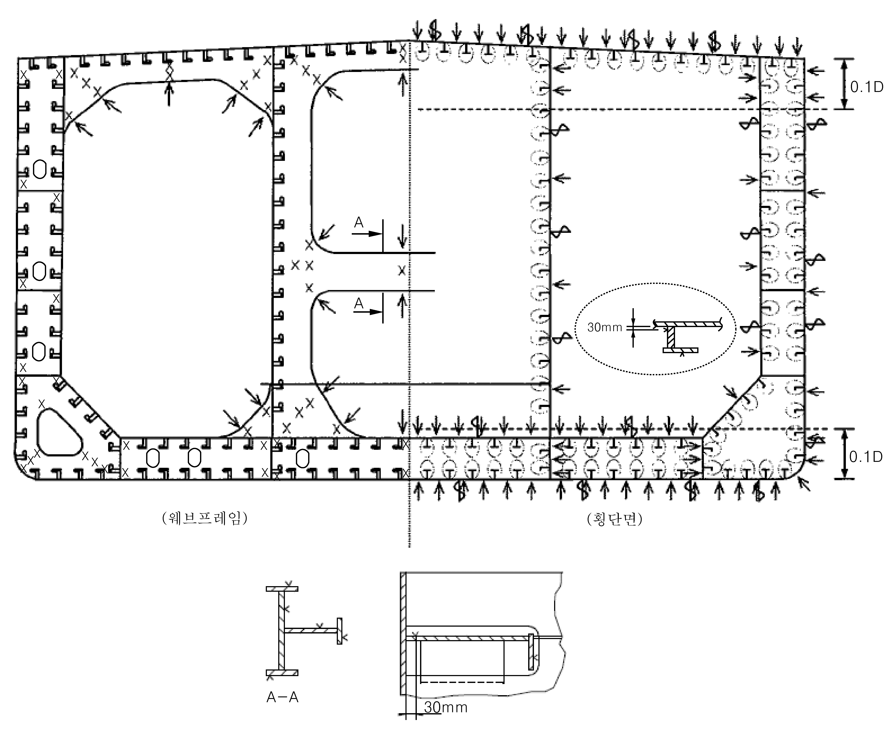 **그림 2 이중선체 유조선의 계측위치** **그림 2 이중선체 유조선의 계측위치**  **그림 3 단일선체 또는 이중선체 산적화물선의 횡단면에 대한 계측위치** **그림 3 단일선체 또는 이중선체 산적화물선의 횡단면에 대한 계측위치** |

  | **표 3-1 두께계측 시 계측위치 및 계측점의 수 - Non-CSR 선박** (계속) |
  | --- |
  |  **그림 4 일반건화물선의 횡단면에 대한 계측위치** **그림 4 일반건화물선의 횡단면에 대한 계측위치** 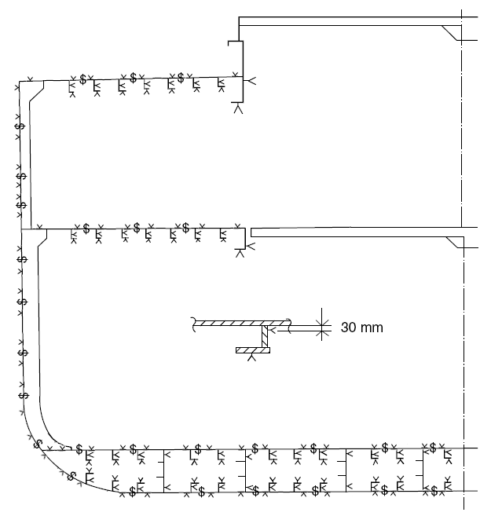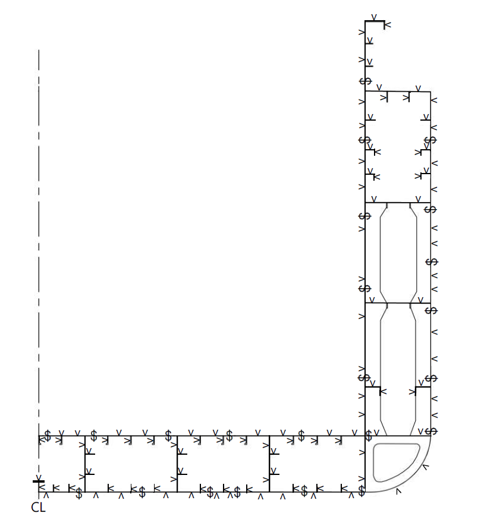 (비고) 다른 형태의 횡단면에도 적용할 수 있다. 또한 컨테이너 선박과 같이 hatch coaming이 종강도 부재에 포함되는 경우, 오른쪽 횡단면을 적용한다. **그림 5 일반선박의 횅단면에 대한 계측위치** ***(2024)*** |

  | **표 3-1 두께계측 시 계측위치 및 계측점의 수 - Non-CSR 선박** (계속) |
  | --- |
  | 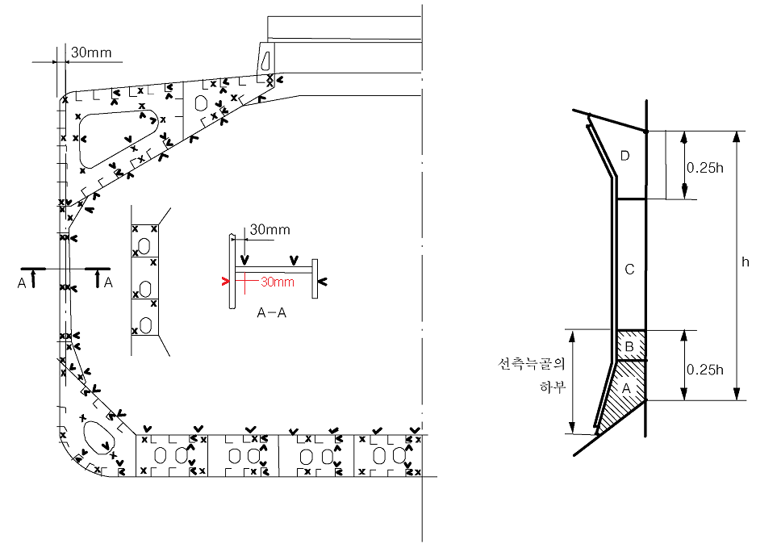 산적화물선 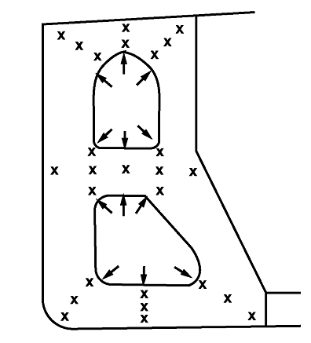 광석운반선 (비고) 웨브판에 대한 계측은 A, C 및 D지역에서 3점씩, B지역에서는 2점씩이어야 한다(그림 참조). 계측기록에는 평균값을 반영하여야 한다. 평균값은 허용두께와 비교하여야 한다. 웨브에 전반적인 부식이 있는 경우 계측점 을 5점씩으로 증가시켜야 한다. **그림 6 단일선체 또는 이중선체 산적화물선의 화물창 및 평형수탱크의 구조부재에 대한 계측위치** |

  | **표 3-1 두께계측 시 계측위치 및 계측점의 수 - Non-CSR 선박** (계속) |
  | --- |
  | 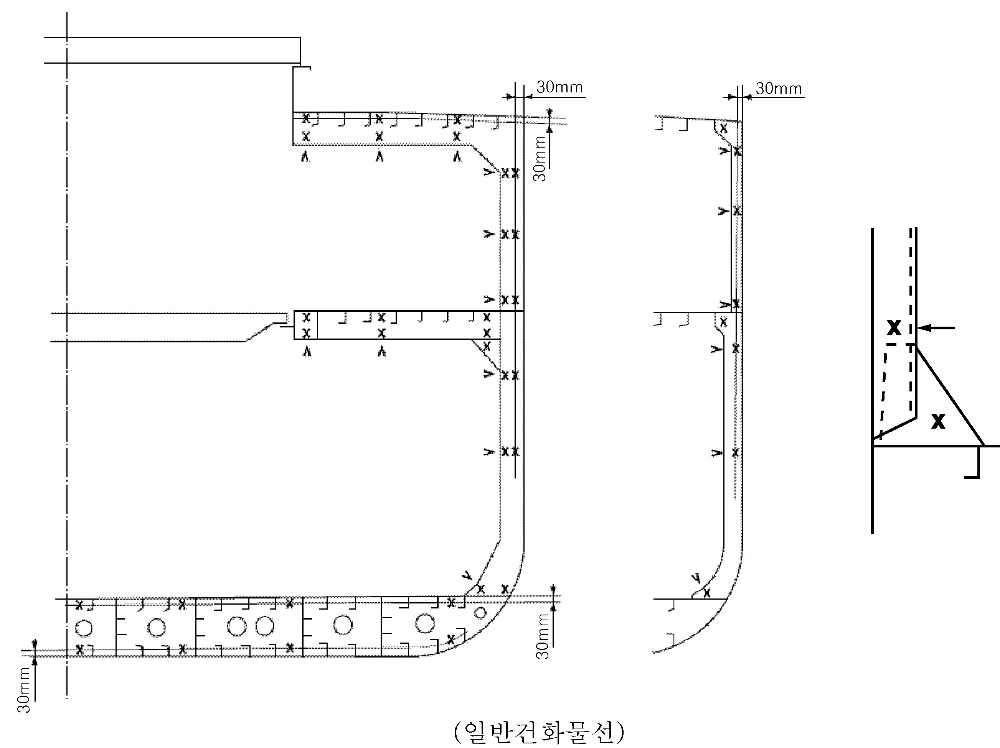 (비고) 다른 종류의 선박에도 적용할 수 있다. 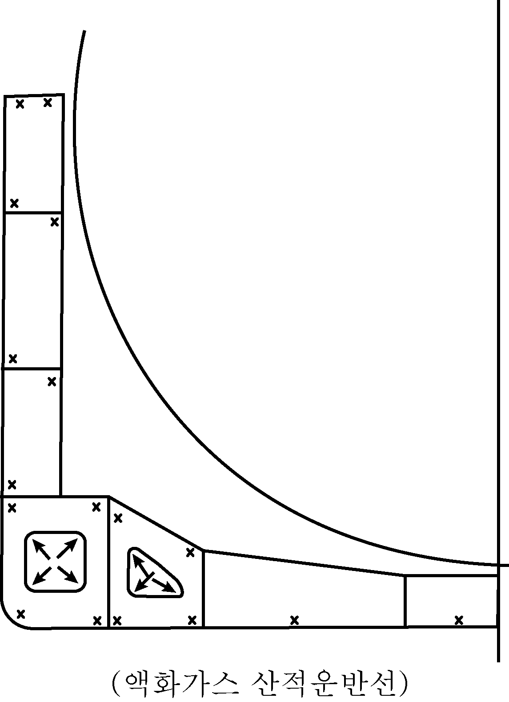 **그림 7 선택된 내부재에 대한 계측위치** 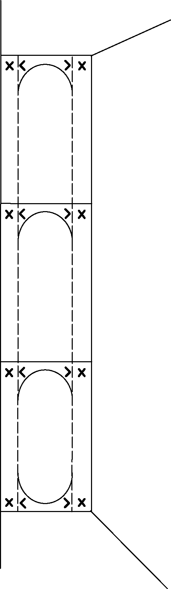 **그림 8 이중선체 산적화물선의 이중선측탱크 횡늑골에 대한 계측위치** |

  | **표 3-1 두께계측 시 계측위치 및 계측점의 수 - Non-CSR 선박** (계속) |
  | --- |
  | 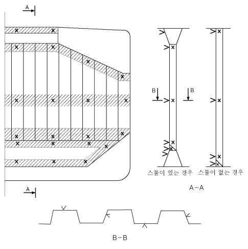 **단일선체 산적화물선** 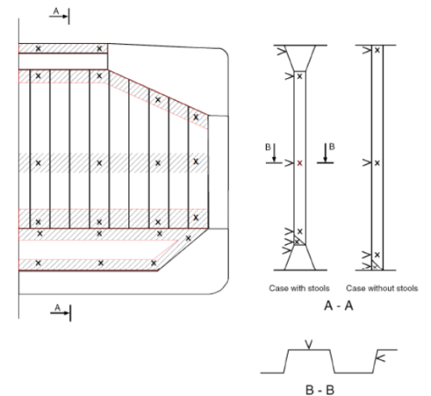 **이중선체 산적화물선** (비고) 단면 A-A와 B-B에서 각 빗금 친 구역에 대하여 계측하여야 한다. 상부 및 하부스툴의 내부구조에 대하여 추가로 계측하여야 한다. 예들 들면, 단면 A-A에 표시된 바와 같이 상부스툴에 2점 및 하부스툴에 2점. **그림 9 단일선체 또는 이중선체 산적화물선의 화물창 횡격벽에 대한 계측위치** |

  | **표 3-1 두께계측 시 계측위치 및 계측점의 수 - Non-CSR 선박** (계속) |
  | --- |
  |  (비고) 1. 화물창 횡격벽/수밀늑판에 대하여 그림과 같이 계측한다. 2. 매 보강재 3개 중 1개에 대하여 A-A와 같이 계측한다. 3. 다른 종류의 선박에도 적용할 수 있다. **그림 10 일반건화물선의 횡격벽에 대한 계측위치** |

  | **표 3-1 두께계측 시 계측위치 및 계측점의 수 - Non-CSR 선박** (계속) |
  | --- |
  | 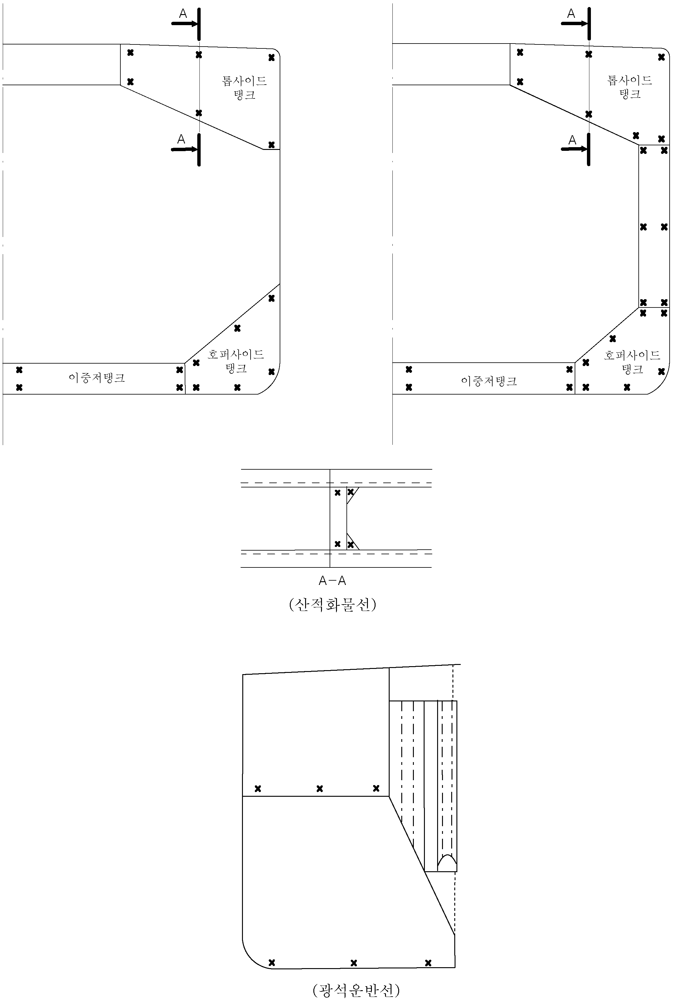 (비고) 단면 A-A처럼 각 수직단면에 대하여 계측한다. **그림 11 단일선체 또는 이중선체 산적화물선의 톱사이드, 호퍼, 이중선체 및 이중저 평형수탱크 횡격벽에 대한 계측위치** |

  | **표 3-1 두께계측 시 계측위치 및 계측점의 수 - Non-CSR 선박** (계속) |
  | --- |
  | 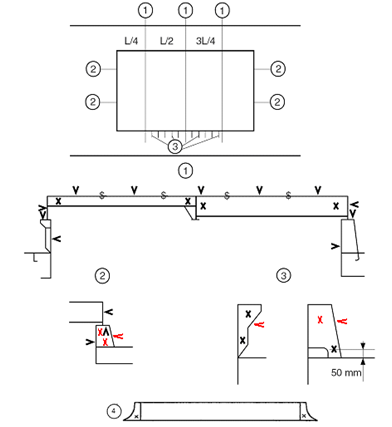 (비고) ➀ 각 창구덮개에 대하여 다음을 포함한 창구덮개길이의 L/4, L/2과 3L/4에서 3개의 횡단면: - 각 창구덮개판 및 측판에 대하여 1점 - 인접한 보 또는 거더(보강재 포함)에 대하여 계측 - 양측의 코밍판 및 코밍상판에 대하여 1점 ➁ 각 창구덮개에 대하여 창구덮개 측판, 코밍판 및 코밍상판에 대하여 선수미 양단에서 각 1점 ➂ 양현과 선수미 양단에서 창구코밍브래킷 및 바(bar) 3개중 1개에 대하여 1점 ➃ 모든 창구코밍 단부브래킷에 대하여 각 1점 **그림 12 화물창 창구덮개 및 코밍에 대한 계측위치** |

  | **표 3-1 두께계측 시 계측위치 및 계측점의 수 - Non-CSR 선박** (계속) |
  | --- |
  |  **그림 13 갑판하부구조에 대한 계측위치** **그림 13 갑판하부구조에 대한 계측위치** |

  **표 3-2 두께계측 시 계측위치 및 계측점의 수 - CSR 선박** **표 3-2**는 국제선급연합회(IACS)의 공통구조규칙(**규칙 11편, 규칙 12편** 또는 **규칙 13편**)에 따라 건조된 선박(즉, CSR 선박)에 적용한다. 1) CSR 산적화물선

  | 항목 | 계측위치 및 계측점의 수 | 그림 참조 |
  | --- | --- | --- |
  | 갑판, 탱크정판, 선저외판, 내저판 및 바람 및 물막이 스트레이크 중 선택된 판 *(2024)* | “선택된”이라 함은 평균부식을 대표하는 지역에서 판 3장중 1장에서 적어도 1점 |   |
  | 갑판, 탱크정판, 선저외판 및 바람 및 물막이 스트레이크의 모든 판 *(2024)* | 각 판(판의 각 1/4 끝단 또는 평균부식을 대표하는 지역)에서 적어도 2점 |   |
  | 횡단면 | - 단일선체 산적화물선: 횡단면에는 갑판, 선측외판, 선저외판, 내저판 및 호퍼사이드판, 종격벽 및 톱윙탱크의 하부판에 있는 판, 종늑골, 거더 등과 같은 모든 종통부재를 포함한다. - 이중선체 산적화물선: 횡단면에는 갑판, 선측외판, 선저외판, 내저판 및 호퍼사이드판, 내측판 및 톱윙내측판에 있는 판, 종늑골, 거더 등과 같은 모든 종통부재를 포함한다. | **그림 1** |
  | 모든 화물창 창구덮개 및 코밍 | 판 및 보강재를 포함 | 계측점의 위치는 **그림 2** |
  | 화물창구 측선밖에 있는 갑판의 횡단면 | 고려하는 횡단면 내의 선측과 창구코밍사이의 각 갑판(판의 각 1/4 끝단 또는 평균부식을 대표하는 지역)에서 2점 |   |
  | 화물창구 사이 화물창구 측선안쪽에 있는 모든 갑판 및 갑판하부구조 | “모든 갑판”이라 함은 각 판(판의 각 1/4 끝단 또는 평균부식을 대표하는 지역)에서 적어도 2점 “갑판하부구조”: 각 짧은 종거더에 대하여 웨브에서 3점(선수/중앙/선미), 면재에서 1점 그리고 인접한 갑판보의 웨브에서 1점, 면재에서 1점. 각 갑판보의 끝단에 대하여 웨브에서 1점, 면재에서 1점 | 지역의 범위는 지침 **부록 1-6**의 **1**항 (2)호 또는 (6)호 계측점의 위치는 **그림 6** |

  **표 3-2 두께계측 시 계측위치 및 계측점의 수 - CSR 선박 (계속)**

  | 항목 | 계측위치 및 계측점의 수 | 그림 참조 |
  | --- | --- | --- |
  | 단일선체 산적화물선: 화물창 내 선측늑골 | 선측늑골, 상하부 단부브래킷 및 인접한 선측외판을 포함 늑골 25 %: 각 현에서 화물창 길이에 걸쳐 4개 중 1개의 늑골 늑골 50 %: 각 현에서 화물창 길이에 걸쳐 2개 중 1개의 늑골 “선택된 늑골”이라 함은 화물창 각 현에서 적어도 3개의 늑골 | 지역의 범위는 지침 **부록 1-6**의 **1**항 (2)호 *(2019)* 계측점의 위치는 **그림 3** |
  | 이중선체 산적화물선: 이중선측탱크 내 횡늑골 |   | 지역의 범위는 지침 **부록 1-6**의 **1**항 (6)호 *(2019)* 계측점의 위치는 **그림 3** *(2019)* |
  | 화물창의 횡격벽 | 상하부스툴이 있는 경우 그 내부재를 포함하여 격벽판, 보강재 및 거더를 포함 두개의 선택된 격벽: 최전방 두 개의 화물창 사이 격벽과 다른 위치에서 선택된 격벽 | 계측지역은 지침 **부록 1-6**의 **1**항 (2)호 또는 (6)호 계측점의 위치는 **그림 4** |
  | 각 화물창에서 한 개의 횡격벽 | 정밀검사 및 관련두께계측은 양측에 대한 전반적인 현상검사결과에 따라 선택된 한쪽 격벽에 대하여 실시한다. 검사원이 필요하다고 인정하는 경우, 다른 쪽도(부분적으로) 정밀검사 및 관련두께계측을 실시한다. | 계측지역은 지침 **부록 1-6**의 **1**항 (2)호 또는 (6)호 계측점의 위치는 **그림 4** |
  | 톱사이드, 호퍼 및 이중저 평형수탱크 내의 횡격벽 | 격벽 및 보강재를 포함 평형수적재이력에 따라 최악의 상태인 평형수탱크를 선정한다. | 계측점의 위치는 **그림 5** |
  | 평형수탱크의 트랜스버스 웨브 | 웨브, 면재, 보강재 및 인접한 판과 종통부재를 포함 선수부에서 각 종류(즉, 톱사이드 또는 호퍼 또는 선측탱크) 마다 대표적인 탱크중의 하나를 선정 | 계측지역은 지침 **부록 1-6**의 **1**항 (2)호 또는 (6)호 계측점의 위치는 **그림 3** |
  | (비고) 1. 표시는 계측위치를 나타낸다. 2. ×, ˅ 표시는 계측점을 나타낸다. |   |   |

  | **표 3-2 두께계측 시 계측위치 및 계측점의 수 - CSR 선박 (계속)** |
  | --- |
  | 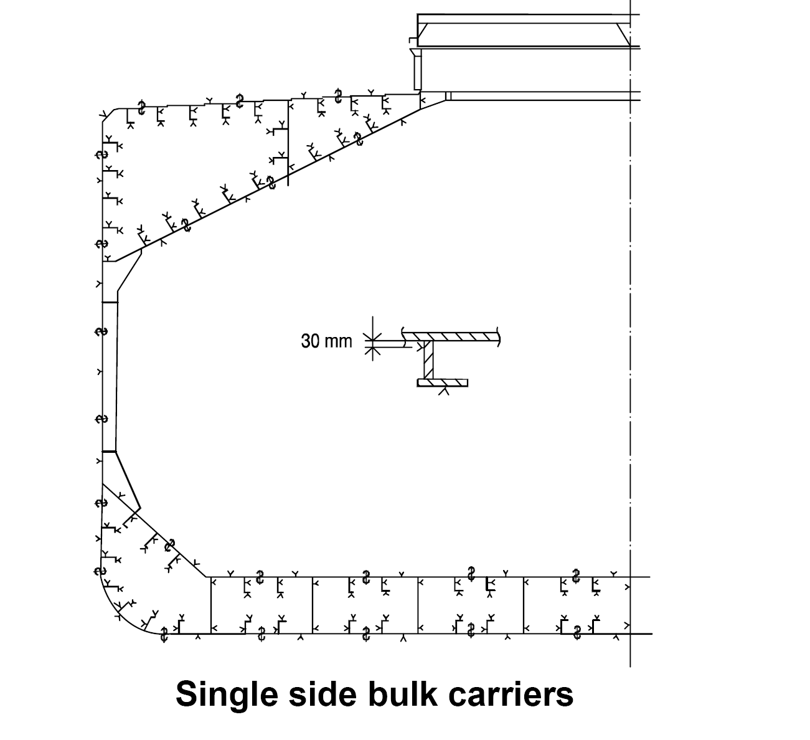 **단일선체 산적화물선** |
  |  |
  | **이중선체 산적화물선** |
  | (비고) 계측은 선택된 횡단면 양현에 대하여 시행하여야 한다. **그림 1 단일선체 또는 이중선체 산적화물선의 횡단면에 대한 계측위치** |

  | **표 3-2 두께계측 시 계측위치 및 계측점의 수 - CSR 선박 (계속)** |
  | --- |
  | 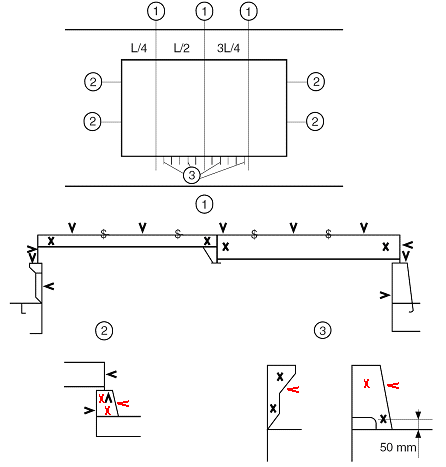 (비고) 1. 다음을 포함한 창구덮개길이의 L/4, L/2과 3L/4에서 3개의 횡단면 • 각 창구덮개판 및 측판에 대하여 1점 • 인접한 보와 보강재에 대하여 계측 • 양측의 코밍판 및 코밍상판에 대하여 1점 2. 창구덮개 측판, 코밍판 및 코밍상판의 양단에 대하여 계측 3. 양현과 선수미 양단에서 창구코밍브래킷 및 바(bar) 3개 중 1개에 대하여 1점(웨브에서 2점 및 면재에서 1점) **그림 2 화물창 창구덮개 및 코밍에 대한 계측위치** |

  | **표 3-2 두께계측 시 계측위치 및 계측점의 수 - CSR 선박 (계속)** |
  | --- |
  | 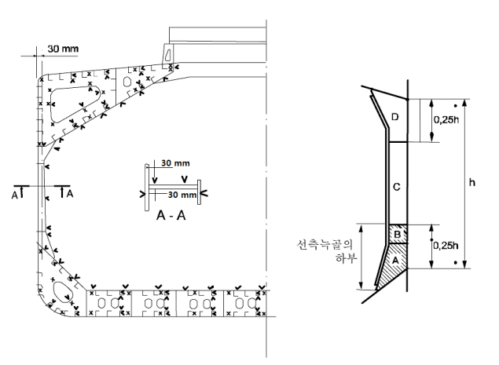 (비고) 웨브판에 대한 계측은 A, C 및 D지역에서 3점씩, B지역에서는 2점씩이어야 한다(그림 참조). 계측기록에는 평균값을 반영하여야 한다. 평균값은 허용두께와 비교하여야 한다. 웨브에 전반적인 부식이 있는 경우, 계측점을 5점씩으로 증가시켜야 한다. **단일선체 산적화물선** 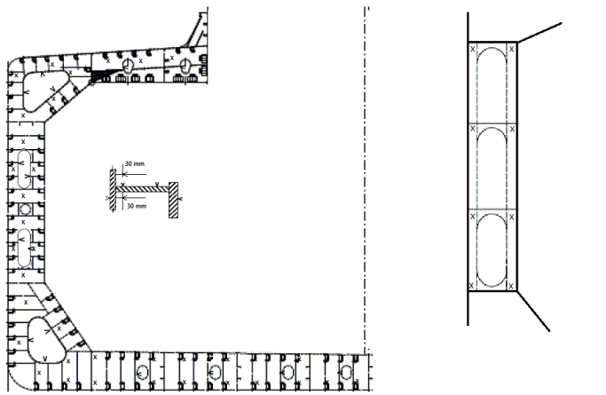 **이중선체 산적화물선** **그림 3 단일선체 산적화물선의 화물창 및 평형수탱크의 구조부재와** **이중선체 산적화물선의 평형수탱크(톱사이드 또는 호퍼 또는 선측탱크)의 구조부재에 대한 계측위치** |

  | **표 3-2 두께계측 시 계측위치 및 계측점의 수 - CSR 선박 (계속)** |
  | --- |
  | 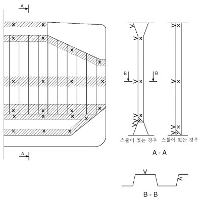  **단일선체 산적화물선 이중선체 산적화물선** (비고) 단면 A-A와 B-B에서 각 빗금 친 구역에 대하여 계측하여야 한다. 상부 및 하부스툴의 내부구조에 대하여 추가로 계측하여야 한다. 예들 들면, 단면 A-A에 표시된 바와 같이 상부스툴에 2점 및 하부스툴에 2점. **그림 4 단일선체 또는 이중선체 산적화물선의 화물창 횡격벽에 대한 계측위치** |

  | **표 3-2 두께계측 시 계측위치 및 계측점의 수 - CSR 선박 (계속)** |
  | --- |
  | 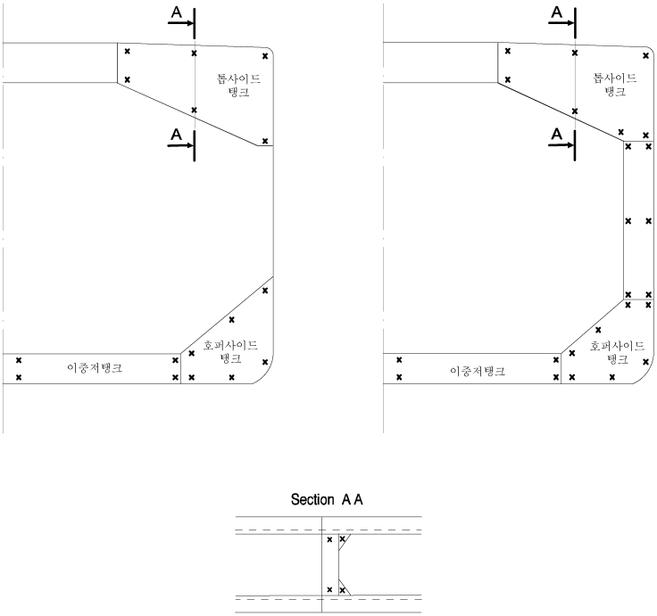 (비고) 단면 A-A처럼 각 수직단면에 대하여 계측하여야 한다. 이중저탱크의 내부구조에 대하여 중간스팬에서 추가로 2점씩 계측하여야 한다. **그림 5 단일선체 또는 이중선체 산적화물선의 톱사이드, 호퍼, 이중선체 및 이중저 평형수탱크 횡격벽에 대한 계측위치** |

  | **표 3-2 두께계측 시 계측위치 및 계측점의 수 - CSR 선박 (계속)** |
  | --- |
  |  **그림 6 갑판하부구조에 대한 계측위치** **그림 6 갑판하부구조에 대한 계측위치** |

  **표 3-2 두께계측 시 계측위치 및 계측점의 수 - CSR 선박 (계속)** 2) CSR 이중선체 유조선

  | 항목 | 계측위치 및 계측점의 수 | 그림 참조 |
  | --- | --- | --- |
  | 선택된 판 | “선택된”이라 함은 평균부식을 대표하는 지역에서 판 3장중 1장에서 적어도 1점 |   |
  | 갑판, 선저외판 및 바람 및 물막이 스트레이크의 모든 판 *(2024)* | 각 판(판의 각 1/4 끝단 또는 평균부식을 대표하는 지역)에서 적어도 2점 |   |
  | 횡단면 | 갑판, 선측외판, 선저외판, 종격벽, 내저판 및 호퍼판에 있는 판, 종늑골 및 거더 등과 같은 모든 종통부재를 계측한다. 각 판에 대하여 1점을 계측한다. 종늑골의 웨브와 면재에 대해서도 계측한다. 선령이 10년을 넘는 유조선인 경우; 각 횡단면에서 갑판 및 선저외판의 0.1D(여기서 D는 선박의 형깊이를 말한다) 이내의 모든 종늑골 및 거더의 웨브와 면재를 계측하고 모든 판은 종통부재 사이에서 1점을 계측한다. | **그림 1** |
  | 화물탱크 및 평형수탱크의 트랜스버스링 | 각 판에 대하여 서로 엇갈리는 방식으로 적어도 2점 및 인접한 면재에서 2점. 갑판 아래 첫 번째 판에서는 적어도 4점. 굽은 부분에서는 추가로 계측. 스트링거/종거더 사이 보강재 2개마다 적어도 1점 | **그림 2** |

  **표 3-2 두께계측 시 계측위치 및 계측점의 수 - CSR 선박 (계속)**

  | 항목 | 계측위치 및 계측점의 수 | 그림 참조 |
  | --- | --- | --- |
  | 화물탱크의 횡격벽 | 각 판에서 적어도 2점. 주갑판 아래 첫 번째 판에서는 적어도 4점 각 스트링거 사이 보강재 3개마다 적어도 1점 스트링거 및 거더의 각 판에서 적어도 2점 및 인접한 면재에서 2점. 굽은 부분에서는 추가로 계측 설치된 경우 스툴의 각 칸막이판(diaphragm plate)에서 2점 | **그림 3** |
  | 평형수탱크의 횡격벽 | 스트링거/종거더 사이 판에서 또는 스트링거/종거더가 설치되지 않은 경우 각 판에서 적어도 4점 스트링거 및 거더의 각 판에서 적어도 2점 및 인접한 면재에서 2점. 굽은 부분에서는 추가로 계측 각 스트링거/종거더 사이 보강재 2개마다 적어도 1점 | **그림 4** |
  | 인접한 구조부재 | 인접한 구조부재에 대하여 판에서 1점 및 보강재/종늑골 3개마다 1점 |   |
  | (비고) 1. 표시는 계측위치를 나타낸다. 2. ×, ˅ 표시는 계측점을 나타낸다. 3. 트랜스버스링이라 함은 선박의 횡단면을 형성하는 이중저늑판, 수직웨브 및 갑판트랜스버스와 같은 모든 횡부재를 말한다.(이중선체 유조선에 대한 국제선급연합회(IACS)의 공통구조규칙(**규칙 12편** 또는 **규칙 13편**)의 정의) |   |   |

  | **표 3-2 두께계측 시 계측위치 및 계측점의 수 - CSR 선박 (계속)** |
  | --- |
  | 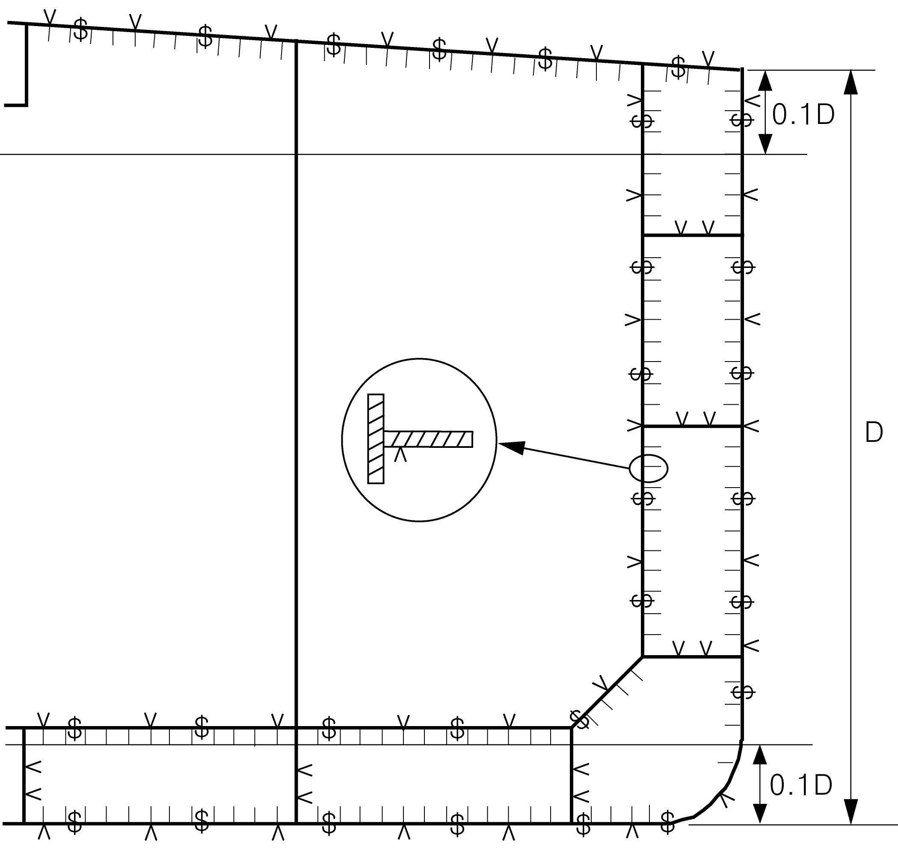 **그림 1 이중선체 유조선의 횡단면에 대한 계측위치**  **그림 2 이중선체 유조선의 화물탱크 및 평형수탱크의 트랜스버스링에 대한 계측위치** |

  | **표 3-2 두께계측 시 계측위치 및 계측점의 수 - CSR 선박 (계속)** |
  | --- |
  | 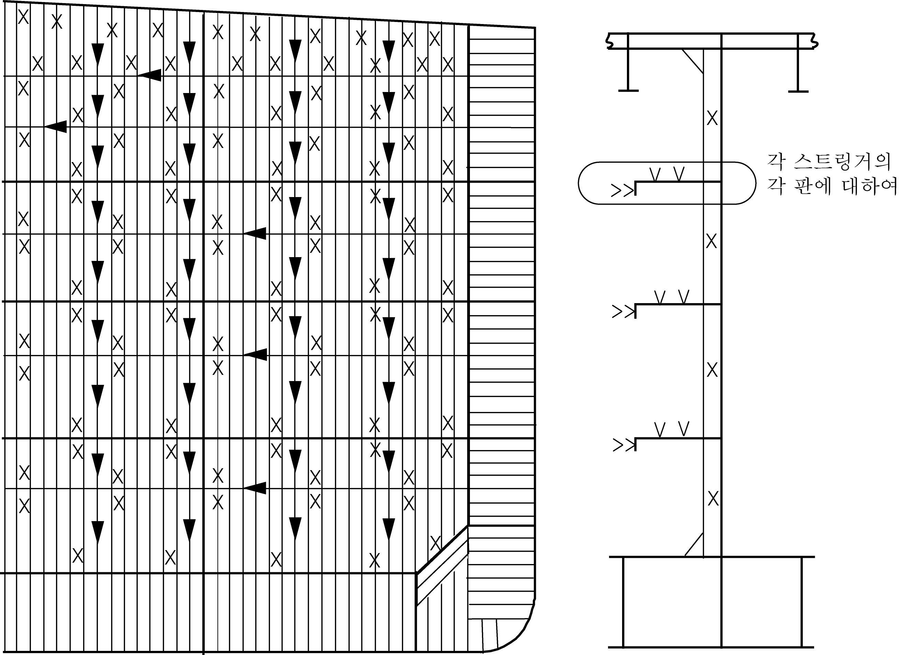 **그림 3 이중선체 유조선의 화물탱크의 횡격벽에 대한 계측위치**  **그림 4 이중선체 유조선의 평형수탱크의 횡격벽에 대한 계측위치** |

  **표 4 정기검사 시의 두께계측 - 일반선박**

  | 정기검사 | 계측범위 및 위치 |
  | --- | --- |
  | 제1차 | (1) 선박 전체에 걸친 의심지역 |
  | 제2차 | 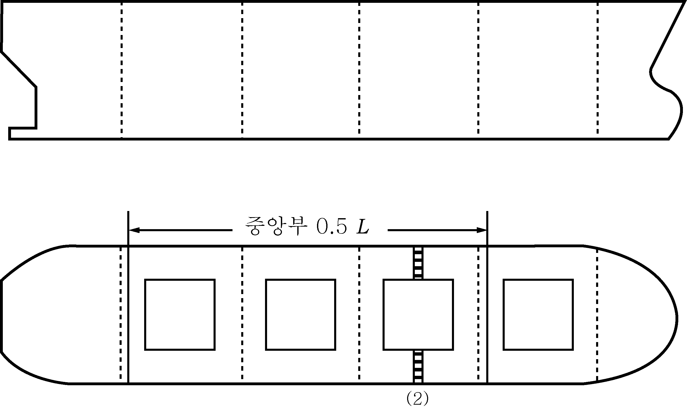 (1) 선박 전체에 걸친 의심지역 (2) 중앙부 0.5 *L* 내의 1개의 횡단면(해당되는 경우, 화물구역)에 대한 갑판의 각 판 *(2023)* |
  | 제3차 | 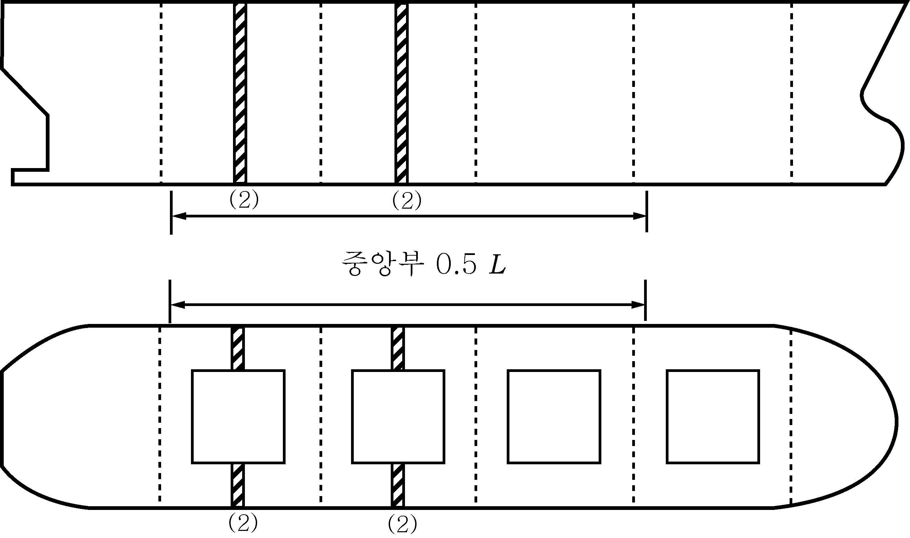 (1) 선박 전체에 걸친 의심지역 (2) 중앙부 0.5 $L$ 내의 2개의 횡단면(해당되는 경우, 2개의 화물구역)4), 5), 6), 7) *(2023)* (3) 모든 화물창의 창구덮개 및 코밍(판 및 보강재)^9) (4) 선수 및 선미피크탱크 내부재 (5) 모든 화물탱크 내의 모든 횡격벽^8) (6) 모든 평형수탱크 내의 모든 횡격벽^8) |

  **표 4 정기검사 시의 두께계측 - 일반선박** (계속)

  | 정기검사 | 계측범위 및 위치 |
  | --- | --- |
  | 제4차 및 이후 *(2024)* | 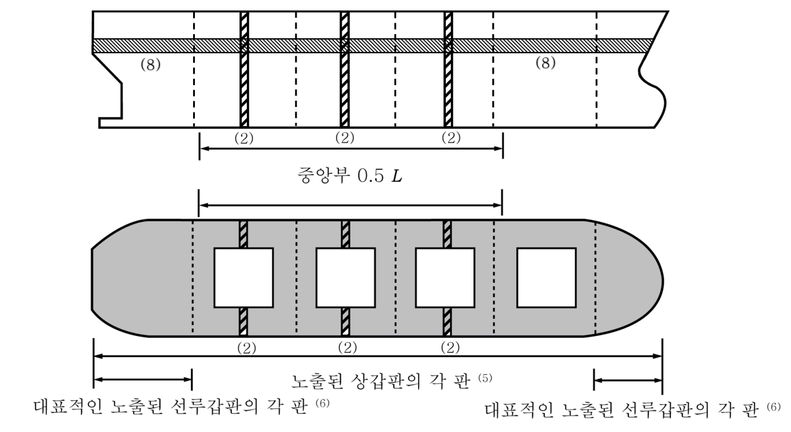 (1) 선박 전체에 걸친 의심지역 (2) 중앙부 0.5 $L$ 내의 최소한 3개의 횡단면(해당되는 경우, 화물구역)5), 6), 7) *(2023)* (3) 모든 화물창의 창구덮개 및 코밍(판 및 보강재)^9) (4) 선수 및 선미피크탱크 내부재 (5) 선박의 전 길이에 대한 노출된 상갑판의 각 판 (6) 대표적인 노출된 선루갑판(선미루, 선교루 및 선수루)의 각 판 (7) 관련 내부재와 함께 화물구역의 모든 횡격벽의 최하부판 및 이중갑판과 접하는 횡격벽판 (8) 선박의 전 길이에 대한 모든 바람 및 물막이 스트레이크 *(2024)* (9) 선박의 전 길이에 대한 평판용골, 코퍼댐 및 기관실의 선저외판과 모든 탱크 후단부의 선저외판 (10) 해수흡입구의 판 및 검사원이 필요하다고 인정하는 경우 선외배출관 주위의 선체외판 (11) 모든 화물탱크 내의 모든 횡격벽 및 각 1개의 웨브프레임링^8) (12) 모든 평형수탱크 내의 모든 횡격벽 및 모든 웨브프레임링^8) |
  | (비고) 갑판의 계측 선측외판의 계측 횡단면 계측(판에 대해서만 계측) 횡단면 계측(종통부재 포함, 횡식 늑골구조의 선박인 경우 인접한 늑골 및 그 단부 브래킷을 포함) 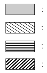 1) 이 표의 적용상 일반선박이라 함은 **규칙 표 1.2.4**의 **2.**의 기타선박을 제외한 선박을 말한다. 2) 두께계측 위치는 화물 및 평형수 사용기록과 보호도장 상태를 고려하여 가장 부식이 심하다고 간주되는 대표적인 부위를 선정한다. 3) 내부 구조부재의 두께계측의 범위는 경화보호도장의 상태가 양호하다고 검사원이 인정하는 경우 도장하부구조의 실제평균상태를 확인하기에 충분한 정도로 감소시켜서 시행 할 수 있다. *(2019)* 4) 길이 100 $\mathrm{m}$를 넘는 선박인 경우 제3차 정기검사에서 중앙부 0.5$L$ 이내 노출갑판의 두께계측을 요구할 수 있다. 5) 길이 100 $\mathrm{m}$ 미만인 선박은 제3차 정기검사에서 요구하는 횡단면의 개수는 1개, 제4차 및 이후 정기검사에서 요구하는 횡단면 개수는 2개로 할 수 있다. 6) 자동차전용운반선의 경우 횡단면 계측은 노출갑판, 선측외판, 선저외판, 내저판 및 내저판 하방에 있는 종통부재를 계측하는 것으로 할 수 있다. 7) 종강도평가 대상선박인 경우 해당 위치에서의 모든 종통부재를 포함하여 계측하여야 한다. 8) 이 규정은 액체화물을 운송하는 선박(강재부선 포함)에 대하여만 적용한다. 9) 내부재로 접근할 수 없는 구조로 승인된 설계의 화물창구덮개인 경우 창구덮개구조의 접근 가능한 부분에 대하여 두께계측을 하여야 한다. |   |

  **표 5 정기검사 시의 두께계측 - 기타선박**

  | 정기검사 | 계측범위 및 위치 |
  | --- | --- |
  | 제1차 | (1) 선박 전체에 걸친 의심지역 |
  | 제2차 | 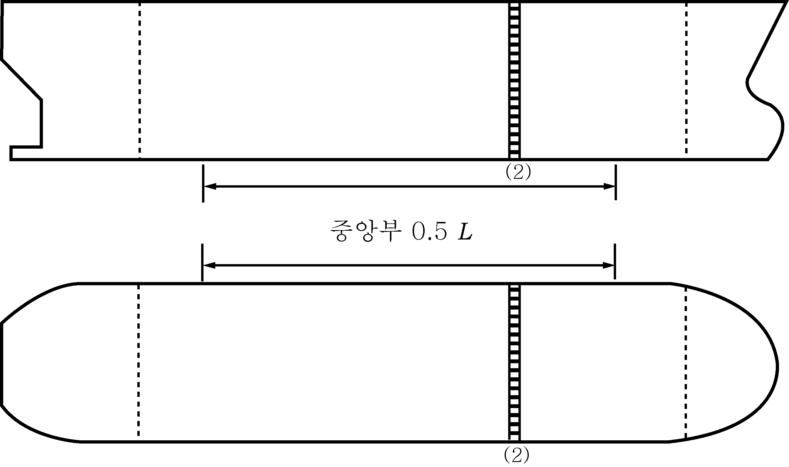 (1) 선박 전체에 걸친 의심지역 (2) 중앙부 0.5 $L$ 내의 1개의 횡단면에서, 노출된 상갑판^5), 선측외판 및 선저외판의 각 판 |
  | 제3차 | 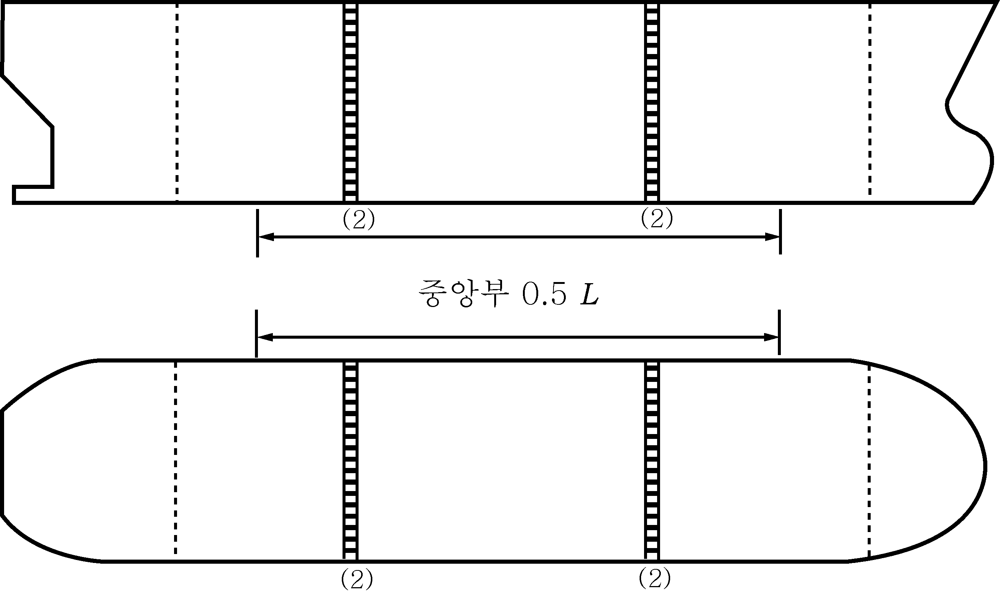 (1) 선박 전체에 걸친 의심지역 (2) 중앙부 0.5 $L$내의 2개 횡단면에서 노출된 상갑판^5), 선측외판 및 선저외판의 각 판 (3) 선수 및 선미피크탱크 내부재 |

  **표 5 정기검사 시의 두께계측 - 기타선박** (계속)

  | 정기검사 | 계측범위 및 위치 |
  | --- | --- |
  | 제4차 및 이후 *(2024)* | 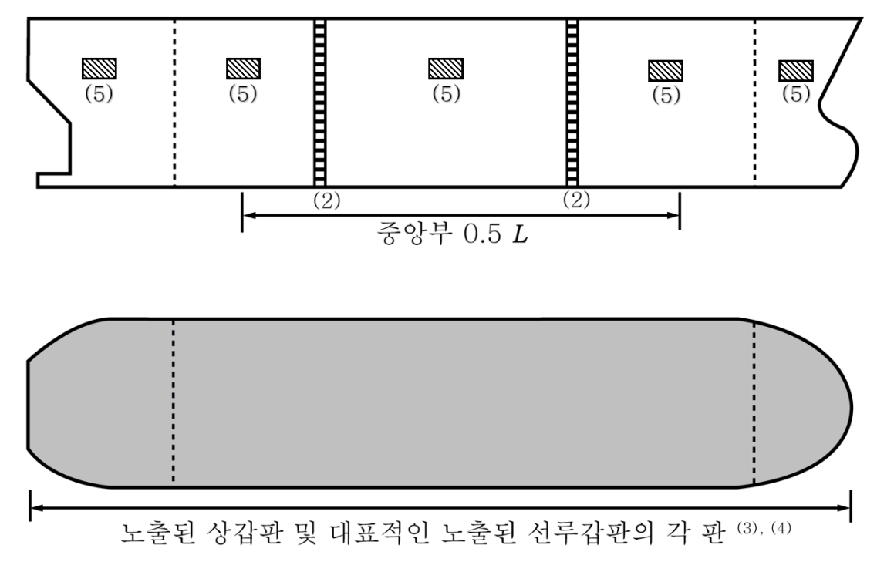 (1) 선박 전체에 걸친 의심지역 (2) 중앙부 0.5 $L$ 내의 2개의 횡단면에서 선측외판의 각 판 (3) 선박의 전 길이에 대하여, 노출된 상갑판의 각 판^5) (4) 선박의 전 길이에 대하여, 대표적인 노출된 선루갑판(선미루, 선교루 및 선수루)의 각 판 (5) 선박의 전 길이에 대하여, 선택된 바람 및 물막이 스트레이크 *(2024)* (6) 선박의 전 길이에 대하여, 선저외판 및 평판용골 (7) 선수 및 선미피크탱크 내부재 |
  | 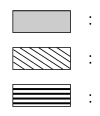(비고) 갑판의 계측 선측외판의 계측 횡단면 계측(판에 대해서만 계측) 1) 이 표의 적용상 기타선박이라 함은 다음 선박을 말한다. 다만, 폐기물운반선은 제외한다. **지침 부록 1-1, 1.1**의 선종 중 - **12, 13**의 선박 - **15, 16, 17, 19, 20** 및 **26**부터 **30**의 선박 중 총톤수 500톤 미만이고 국제항해를 하지 아니하는 선박 2) 두께계측 위치는 가장 부식이 심하다고 간주되는 대표적인 부위를 선정한다. 3) 내부 구조부재의 두께계측은 경화보호도장의 상태가 양호하다고 검사원이 인정하는 경우 특별히 고려할 수 있다. 4) 종강도평가 대상선박인 경우 해당위치에서의 모든 종통부재를 포함하여 계측하여야 한다. 5) 어선의 경우 갑판의 두께계측은 갑판외부에 목갑판이 설치되어 있고 이 사이에 콜타르가 시공되어 해수의 침입이 방지된다고 인정하는 경우 갑판 폭의 양쪽 끝단부 거터배수로와 창구코밍 주위에 대하여만 계측하는 것으로 할 수 있다. |   |

  | 정기검사 | 계측범위 및 위치 |
  | --- | --- |
  | 제1차 | (1) 의심지역 |
  | 제2차 | 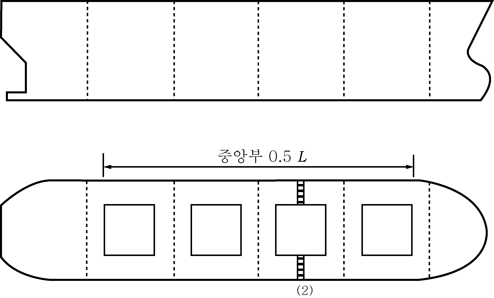 (1) 의심지역 (2) 중앙부 0.5 $L$ 내의 화물지역에 있어서 1개의 횡단면에 대한 갑판의 각 판 (3) 정밀검사 대상부재(구조부재의 쇠모상태 및 그 경향을 파악하기 위하여 계측) |
  | 제3차 *(2024)* | 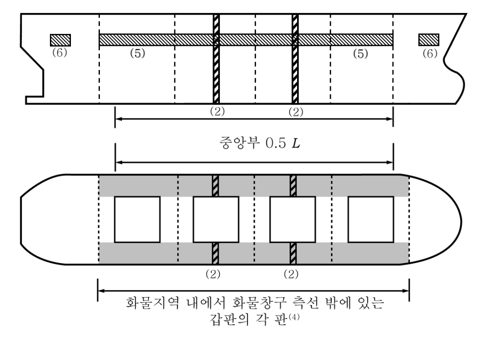 (1) 의심지역 (2) 중앙부 0.5 $L$ 내의 화물지역에 있어서 2개의 횡단면(서로 다른 화물지역에서 1개씩 취한다)^2) (3) 정밀검사 대상부재(구조부재의 쇠모상태 및 그 경향을 파악하기 위하여 계측) (4) 화물지역 내에서 화물창구 측선 밖에 있는 갑판의 각 판 (5) 화물지역 내에 있는 모든 바람 및 물막이 스트레이크 *(2024)* (6) 화물지역 밖에 있는 선택된 바람 및 물막이 스트레이크 *(2024)* |

  | 정기검사 | 계측범위 및 위치 |
  | --- | --- |
  | 제4차 및 이후 *(2024)* | 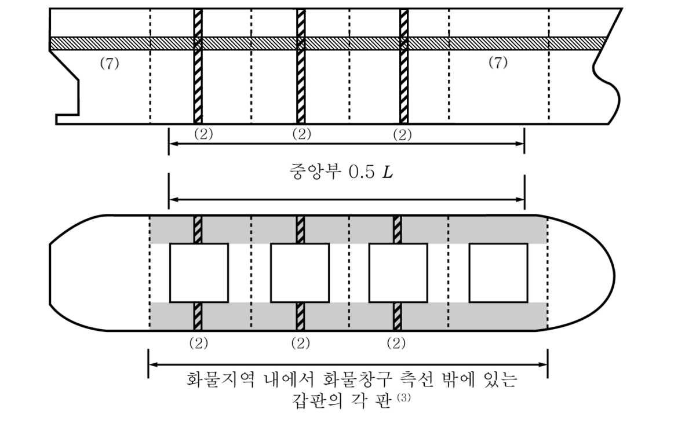 (1) 의심지역 (2) 화물지역 내에서 중앙부 0.5 $L$ 내의 최소한 3개의 횡단면^2) (3) 화물지역 내에서 화물창구 측선 밖에 있는 갑판의 각 판 (4) 화물지역 내에서 선저외판의 각 판(빌지플레이트의 하부 포함) (5) 화물지역 내에서 덕트킬 또는 파이프터널의 판 및 내부재 (6) 정밀검사 대상부재(구조부재의 쇠모상태 및 그 경향을 파악하기 위하여 계측) (7) 선박의 전 길이에 대한 모든 바람 및 물막이 스트레이크 *(2024)* |
  | (비고) 갑판의 계측 선측외판의 계측 횡단면 계측(판에 대해서만 계측) 횡단면 계측(종통부재 포함, 횡식 늑골구조의 선박인 경우 인접한 늑골 및 그 단부 브래킷을 포함)  1) 두께계측의 위치는 화물 및 평형수 기록과 보호도장의 상태를 고려하여 가장 부식이 심하게 발생할 것 같은 가장 대표적인 부위를 선정한다. 2) 길이 100 $\mathrm{m}$ 미만의 선박은 제3차 정기검사에서 요구하는 횡단면의 개수는 1개, 제4차 및 이후 정기검사에서 요구하는 횡단면의 개수는 2개로 할 수 있다. |   |

  | 정기검사 | 계측범위 및 위치 |
  | --- | --- |
  | 제1차 | 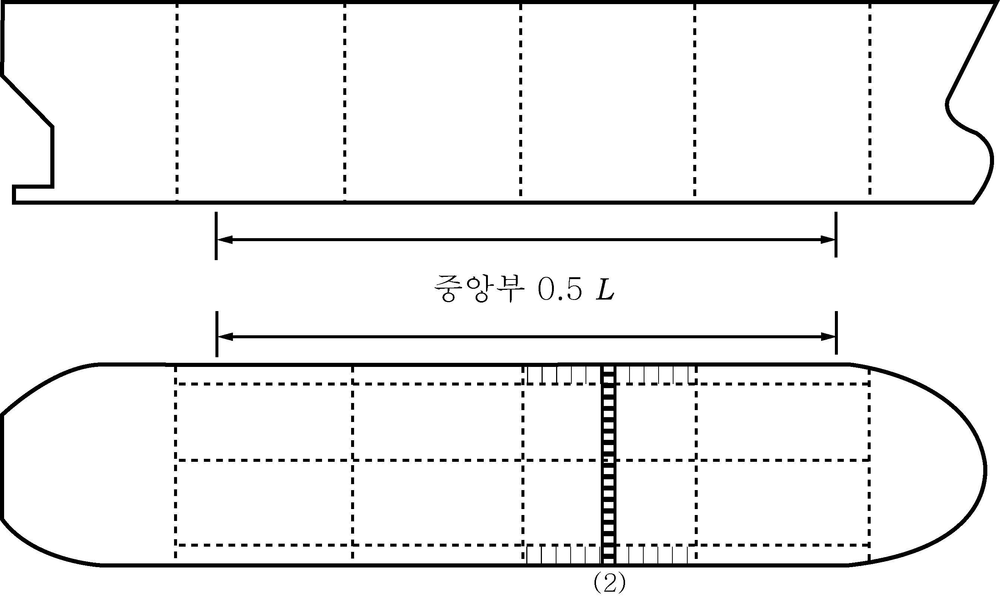 (1) 의심지역 (2) 중앙부 0.5 $L$ 내에 있는 1개의 평형수탱크(있는 경우)의 위치에 있어서, 선박의 전폭에 걸친 1개의 횡단면에 대한 갑판의 각 판 (3) 정밀검사 대상부재(구조부재의 쇠모상태 및 그 경향을 파악하기 위하여 계측) |
  | 제2차 *(2024)* | 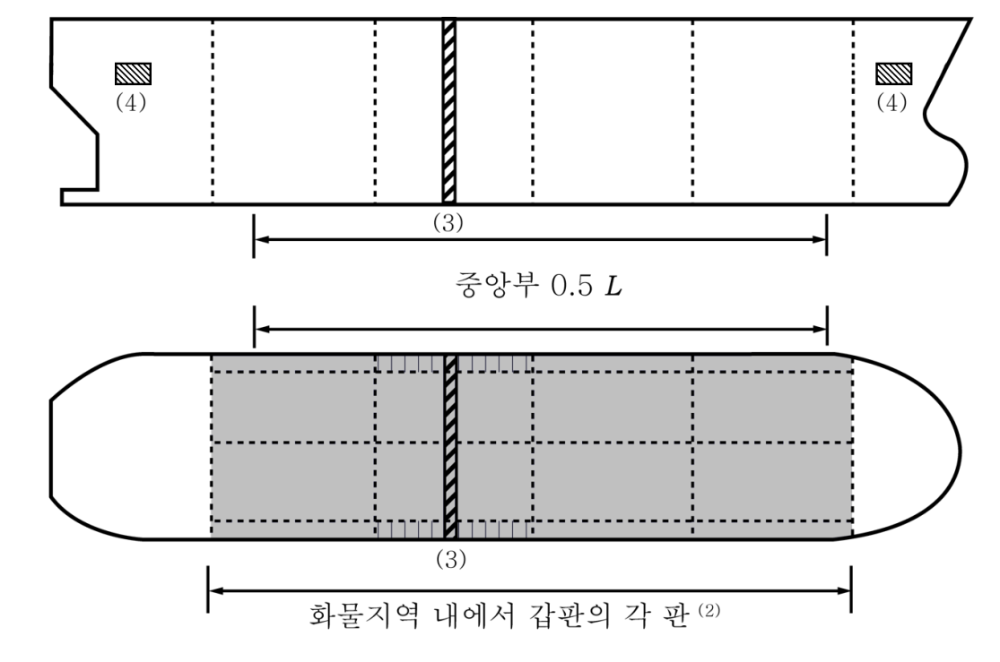 (1) 의심지역 (2) 화물지역 내에서 갑판의 각 판 (3) 화물지역 내에서 중앙부 0.5 $L$ 내에 있는 1개의 평형수탱크(있는 경우)의 위치에 있어서, 1개의 횡단면 (4) 화물지역 밖에 있는 선택된 바람 및 물막이 스트레이크 *(2024)* (5) 정밀검사 대상부재(구조부재의 쇠모상태 및 그 경향을 파악하기 위하여 계측) |

  | 정기검사 | 계측범위 및 위치 |
  | --- | --- |
  | 제3차 *(2024)* | 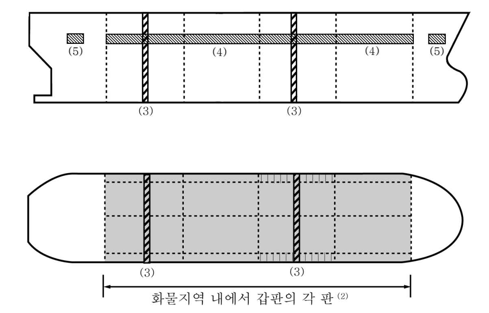 (1) 의심지역 (2) 화물지역 내에서 갑판의 각 판 (3) 화물지역 내에서 2개의 횡단면^1) (4) 화물지역 내에서 모든 바람 및 물막이 스트레이크 *(2024)* (5) 화물지역 밖에 있는 선택된 바람 및 물막이 스트레이크 *(2024)* (6) 정밀검사 대상부재(구조부재의 쇠모상태 및 그 경향을 파악하기 위하여 계측) |
  | 제4차 및 이후 *(2024)* | 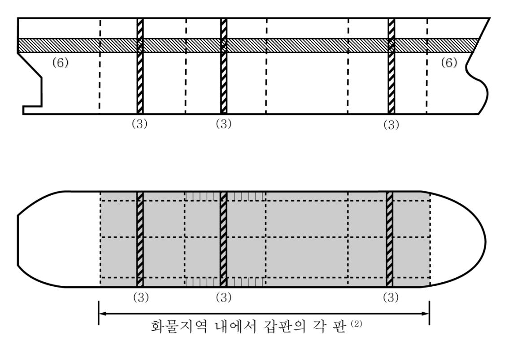 (1) 의심지역 (2) 화물지역 내에서 갑판의 각 판 (3) 화물지역 내에서 3개의 횡단면^1) (4) 화물지역 내에서 선저외판의 각 판 (5) 화물지역 내에서 덕트킬의 판 및 내부재 (6) 선박의 전 길이에 대하여 모든 바람 및 물막이 스트레이크 *(2024)* (7) 정밀검사 대상부재(구조부재의 쇠모상태 및 그 경향을 파악하기 위하여 계측) |

  | (비고) 갑판의 계측 선측외판의 계측 횡단면 계측(판에 대해서만 계측) 횡단면 계측(종통부재 포함, 횡식 늑골구조의 선박인 경우 인접한 늑골 및 그 단부 브래킷을 포함)  1) 최소한 1개의 횡단면은 중앙부 0.5 $L$ 내의 평형수탱크(있는 경우)를 포함하여야 한다. 2) 중앙횡단면이 일반적인 화물선과 유사하고 독립형탱크 형식C를 갖는 선박인 경우 검사원의 판단에 따라 탱크정판을 포함하는 것 까지 두께계측의 범위를 확대할 수 있다. 3) 경화보호도장이 양호한 상태인 구역 내의 지역인 경우 두께계측의 범위를 도장하부구조의 실제평균상태를 확인하기에 충분한 정도로 감소시켜 시행할 수 있다. *(2019)* 4) 검사원이 필요하다고 인정하는 경우 두께계측의 범위를 확대할 수 있다. 과도한 부식이 있는 경우 검사원이 만족하는 범위까지 두께계측의 범위를 증가시켜야 한다. |
  | --- |

  **표 8 정기검사 시의 두께계측 - ESP 부호를 갖는 산적화물선**

  | 정기검사 | 계측범위 및 위치 |
  | --- | --- |
  | 제1차 | (1) 의심지역 |
  | 제2차 *(2024)* | 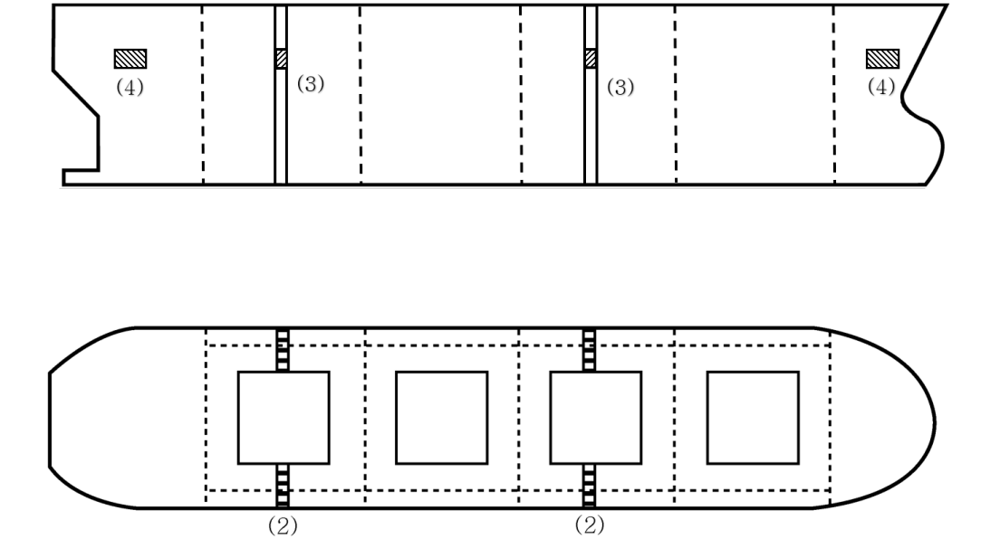 (1) 의심지역 (2) 화물지역 내에서 화물창구 측선 밖에 있는 갑판에 있어서 2개의 횡단면에 대한 갑판의 각 판 (3) (2)에서 규정된 횡단면에 해당하는 바람 및 물막이 스트레이크 *(2024)* (4) 화물지역 밖에 있는 선택된 바람 및 물막이 스트레이크 *(2024)* (5) 정밀검사 대상부재(구조부재의 쇠모상태 및 그 경향을 파악하기 위하여 계측) (6) 국제선급연합회(IACS)의 통일규칙(UR) S31 적용대상선박의 선측늑골 및 브래킷에 대한 추가 두께계측에 대하여는 **규칙 201.**의 **1**항 (4)호, **규칙 7편 3장 17절** 및 우리 선급이 별도로 정하는 바에 따른다. |
  | 제3차 *(2024)* | 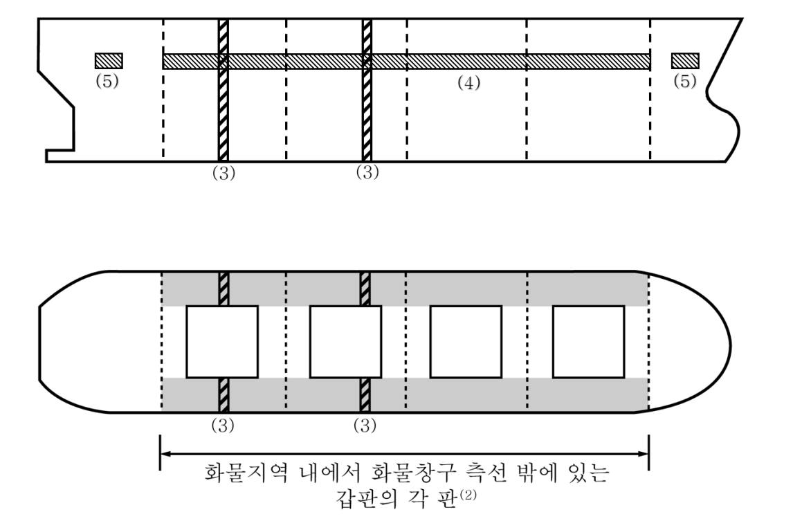 (1) 의심지역 (2) 화물지역 내에서 화물창구 측선 밖에 있는 갑판의 각 판 (3) 화물지역 내에서 화물창구 측선 밖에 있는 2개의 횡단면(그 중 1개는 선체의 중앙부에 있는 횡단면으로 한다) (4) 화물지역 내에서 모든 바람 및 물막이 스트레이크 *(2024)* (5) 화물지역 밖에 있는 선택된 바람 및 물막이 스트레이크 *(2024)* (6) 정밀검사 대상부재(구조부재의 쇠모상태 및 그 경향을 파악하기 위하여 계측) (7) 국제선급연합회(IACS)의 통일규칙(UR) S19 및 S23 적용대상선박의 제1번과 제2번 화물창 사이의 수직파형 횡수밀격벽에 대한 추가 두께계측에 대하여는 **규칙 3장 201.**의 **1**항 (3)호 및 **지침 부록 1-5**의 **표 9**에 따른다. (8) 국제선급연합회(IACS)의 통일규칙(UR) S31 적용대상선박의 선측늑골 및 브래킷에 대한 추가 두께계측에 대하여는 **규칙 3장 201.**의 **1**항 (4)호, **규칙 7편 3장 17절** 및 우리 선급이 별도로 정하는 바에 따른다. |

  **표 8 정기검사 시의 두께계측 - ESP 부호를 갖는 산적화물선** (계속)

  | 정기검사 | 계측범위 및 위치 |
  | --- | --- |
  | 제4차 및 이후 *(2024)* | 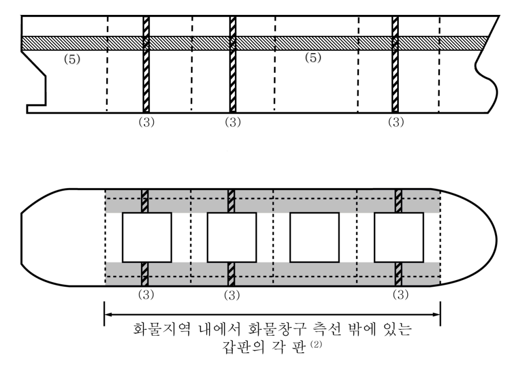 (1) 의심지역 (2) 화물지역 내에서 화물창구 측선 밖에 있는 갑판의 각 판 (3) 화물지역 내에서 화물창구 측선 밖에 있는 3개의 횡단면(그 중 1개는 선체의 중앙부에 있는 횡단면으로 한다) (4) 화물지역 내에서 선저외판의 각 판 (5) 선박의 전 길이에 대하여 모든 바람 및 물막이 스트레이크 *(2024)* (6) 정밀검사 대상부재(구조부재의 쇠모상태 및 그 경향을 파악하기 위하여 계측) (7) 국제선급연합회(IACS)의 통일규칙(UR) S19 및 S23 적용대상선박의 제1번과 제2번 화물창 사이의 수직파형 횡수밀격벽에 대한 추가 두께계측에 대하여는 **규칙 3장 201.**의 **1**항 (3)호 및 **지침 부록 1-5**의 **표 9**에 따른다. (8) 국제선급연합회(IACS)의 통일규칙(UR) S31 적용대상선박의 선측늑골 및 브래킷에 대한 추가 두께계측에 대하여는 **규칙 3장 201.**의 **1**항 (4)호, **규칙 7편 3장 17절** 및 우리 선급이 별도로 정하는 바에 따른다. |
  | (비고) 갑판의 계측 선측외판의 계측 횡단면 계측(판에 대해서만 계측) 횡단면 계측(종통부재 포함, 횡식 늑골구조의 선박인 경우 인접한 늑골 및 그 단부 브래킷을 포함)  |   |

  **표 9 제1번과 제2번 화물창 사이의 수직파형 횡수밀격벽에 대한 추가 두께계측 (IACS UR S19 적용대상 선박에만 해당)** ***(2022)***

  | 계측범위 | 제1번과 제2번 화물창 사이의 수직파형 횡수밀격벽 |
  | --- | --- |
  | 계측위치 | 1. 두께계측 위치는 다음과 같다. 정확한 두께 계측을 위하여 두께 계측위치에 있는 면재, 웨브, 쉐더판 및 거싯판 등 모든 구조부재를 계측해야 한다. (1) A구역 : 하부스툴이 없는 경우(**그림 1** 참조) (가) 쉐더판 상방 200 $\mathrm{mm}$에서 면재의 횡방향 범위 부위 (나) 설치되어 있는 경우 면제사이의 거싯판 중간 부위 (다) 쉐더판의 중간 부위 (라) 쉐더판 상방 200 $\mathrm{mm}$에서 웨브의 횡방향 범위 부위 (2) B구역 : 하부스툴이 있는 경우(**그림 2** 참조) (가) 쉐더판 상방 200 $\mathrm{mm}$에서 면재의 횡방향 범위 부위 (나) 설치되어 있는 경우 면재 사이의 거싯판 중간 부위 (다) 쉐더판의 중간 부위 (라) 쉐더판 상방 200 $\mathrm{mm}$에서 웨브의 횡방향 범위 부위 (3) C구역 : 모든 경우(**그림 1** 및 **그림 2** 참조) (가) 격벽의 중간부위에서 면재, 웨브의 횡방향 범위 부위 2. 수평방향으로 두께가 일정하지 않는 경우는 더 얇은 판을 계측해야 한다. |
  | 정기검사 ; 계측범위 및 위치 제1차 ; (1) 의심지역 제2차 *(2024)* ; 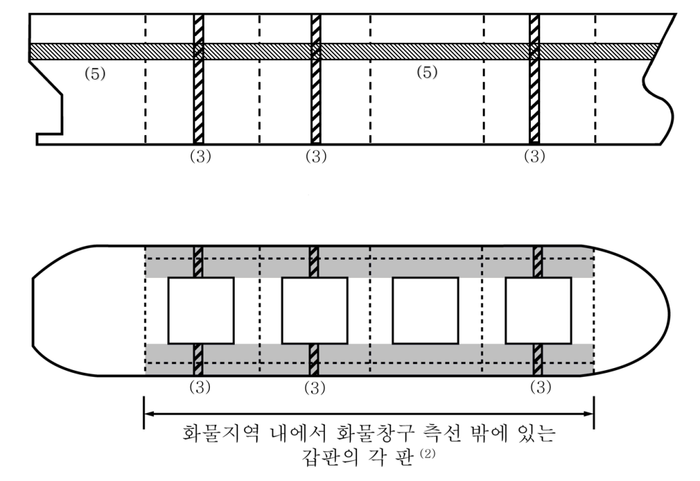 (1) 의심지역 (2) 화물지역 내에서 화물창구 측선 밖에 있는 갑판에 있어서 2개의 횡단면에 대한 갑판의 각 판 (3) (2)에 규정된 횡단면에 해당하는 바람 및 물막이 스트레이크 *(2024)* (4) 화물지역 밖에 있는 선택된 바람 및 물막이 스트레이크 *(2024)* (5) 정밀검사 대상부재(구조부재의 쇠모상태 및 그 경향을 파악하기 위하여 계측) 제3차 *(2024)* ;  (1) 의심지역 (2) 화물지역 내에서 화물창구 측선 밖에 있는 갑판의 각 판 (3) 화물지역 내에서 화물창구 측선 밖에 있는 2개의 횡단면(그 중 1개는 선체의 중앙부에 있는 횡단면으로 한다) (4) 화물지역 내에서 모든 바람 및 물막이 스트레이크 *(2024)* (5) 화물지역 밖에 있는 선택된 바람 및 물막이 스트레이크 *(2024)* (6) 정밀검사 대상부재(구조부재의 쇠모상태 및 그 경향을 파악하기 위하여 계측) 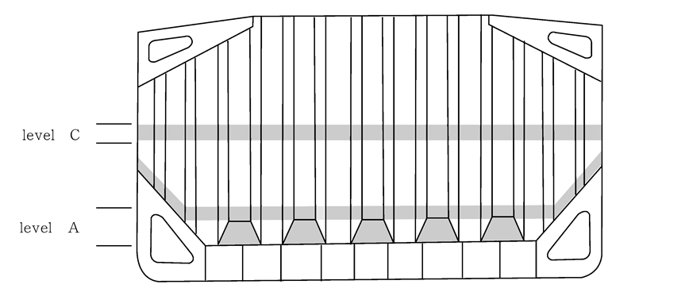 그림 1 하부스툴이 없는 경우 그림 1 하부스툴이 없는 경우 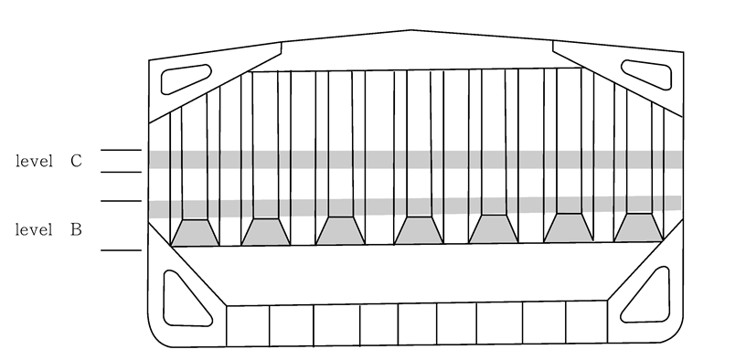 그림 2 하부스툴이 있는 경우 그림 2 하부스툴이 있는 경우 |   |
  | 정기검사 | 계측범위 및 위치 |
  | 제1차 | (1) 의심지역 |
  | 제2차 *(2024)* |  (1) 의심지역 (2) 화물지역 내에서 화물창구 측선 밖에 있는 갑판에 있어서 2개의 횡단면에 대한 갑판의 각 판 (3) (2)에 규정된 횡단면에 해당하는 바람 및 물막이 스트레이크 *(2024)* (4) 화물지역 밖에 있는 선택된 바람 및 물막이 스트레이크 *(2024)* (5) 정밀검사 대상부재(구조부재의 쇠모상태 및 그 경향을 파악하기 위하여 계측) |
  | 제3차 *(2024)* |  (1) 의심지역 (2) 화물지역 내에서 화물창구 측선 밖에 있는 갑판의 각 판 (3) 화물지역 내에서 화물창구 측선 밖에 있는 2개의 횡단면(그 중 1개는 선체의 중앙부에 있는 횡단면으로 한다) (4) 화물지역 내에서 모든 바람 및 물막이 스트레이크 *(2024)* (5) 화물지역 밖에 있는 선택된 바람 및 물막이 스트레이크 *(2024)* (6) 정밀검사 대상부재(구조부재의 쇠모상태 및 그 경향을 파악하기 위하여 계측) |

  **표 10 정기검사 시의 두께계측 - ESP 부호를 갖는 유조선**

  | 정기 검사 | 계측범위 및 위치 |
  | --- | --- |
  | 제1차 | 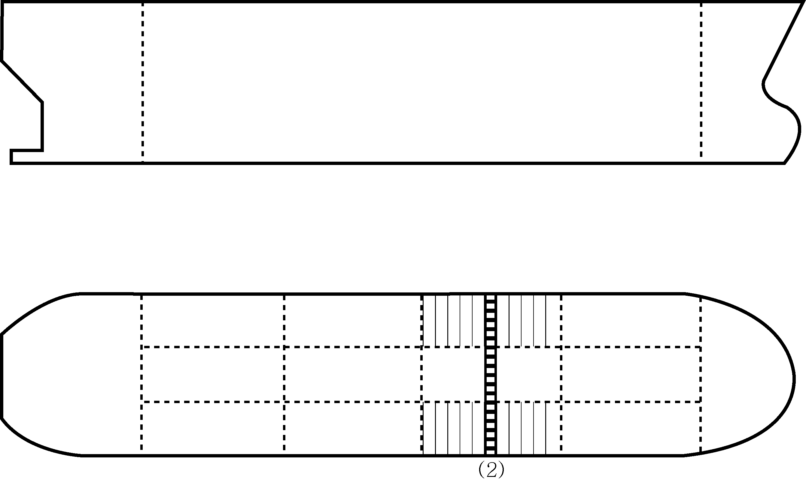 (1) 의심지역 (2) 화물지역 내에 있는 1개의 평형수탱크(평형수탱크가 없는 경우에는 평형수겸용 화물유탱크)의 위치에 있어서, 선박의 전 폭에 걸친 1개의 횡단면에 대한 갑판의 각 판 (3) 정밀검사 대상부재(구조부재의 쇠모상태 및 그 경향을 파악하기 위하여 계측) |
  | 제2차 *(2024)* | 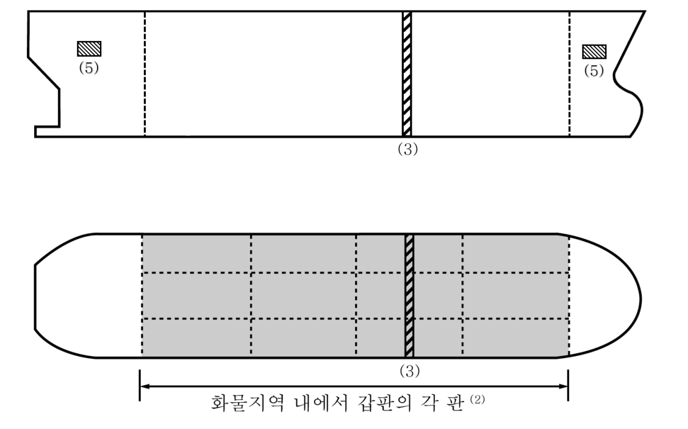 (1) 의심지역 (2) 화물지역 내에서 갑판의 각 판 (3) 화물지역 내에서 1개 횡단면 (4) 정밀검사 대상부재(구조부재의 쇠모상태 및 그 경향을 파악하기 위하여 계측) (5) 화물지역 밖에 있는 선택된 바람 및 물막이 스트레이크 *(2024)* |

  **표 10 정기검사 시의 두께계측 - ESP 부호를 갖는 유조선** (계속)

  | 정기검사 | 계측범위 및 위치 |
  | --- | --- |
  | 제3차 *(2024)* | 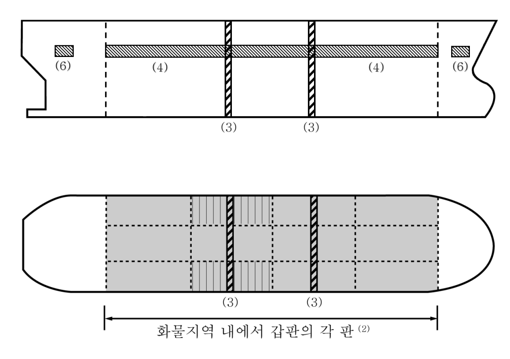 (1) 의심지역 (2) 화물지역 내에서 갑판의 각 판 (3) 화물지역 내에서 2개의 횡단면^1) (4) 화물지역 내에서 모든 바람 및 물막이 스트레이크 *(2024)* (5) 정밀검사 대상부재(구조부재의 쇠모상태 및 그 경향을 파악하기 위하여 계측) (6) 화물지역 밖에 있는 선택된 바람 및 물막이 스트레이크 *(2024)* |
  | 제4차 및 이후 *(2024)* | 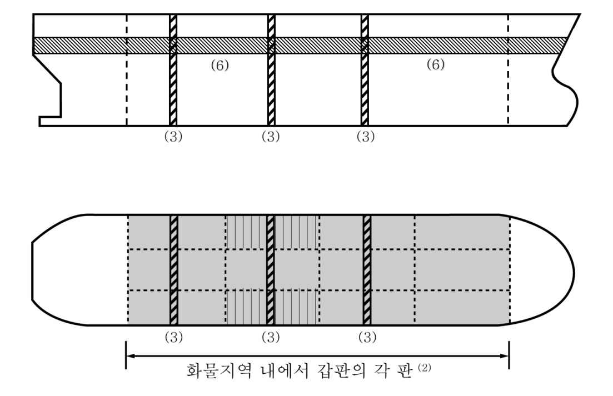 (1) 의심지역 (2) 화물지역 내에서 갑판의 각 판 (3) 화물지역 내에서 3개의 횡단면^1) (4) 화물지역 내에서 선저외판의 각 판 (5) 정밀검사 대상부재(구조부재의 쇠모상태 및 그 경향을 파악하기 위하여 계측) (6) 선박의 전 길이에 대하여 모든 바람 및 물막이 스트레이크 *(2024)* |
  | (비고) 갑판의 계측 선측외판의 계측 횡단면 계측(판에 대해서만 계측) 횡단면 계측(종통부재 포함, 횡식 늑골구조의 선박인 경우 인접한 늑골 및 그 단부 브래킷을 포함) 평형수탱크 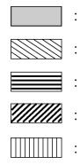 1) 최소한 1개의 횡단면은 중앙부 0.5 $L$ 내의 평형수탱크를 포함하여야 한다. |   |

  **표 11 정기검사 시의 두께계측 - ESP 부호를 갖는 위험화학품 산적운반선**

  | 정기검사 | 계측범위 및 위치 |
  | --- | --- |
  | 제1차 *(2023)* | (1) 의심지역 |
  | 제2차 *(2024)* | 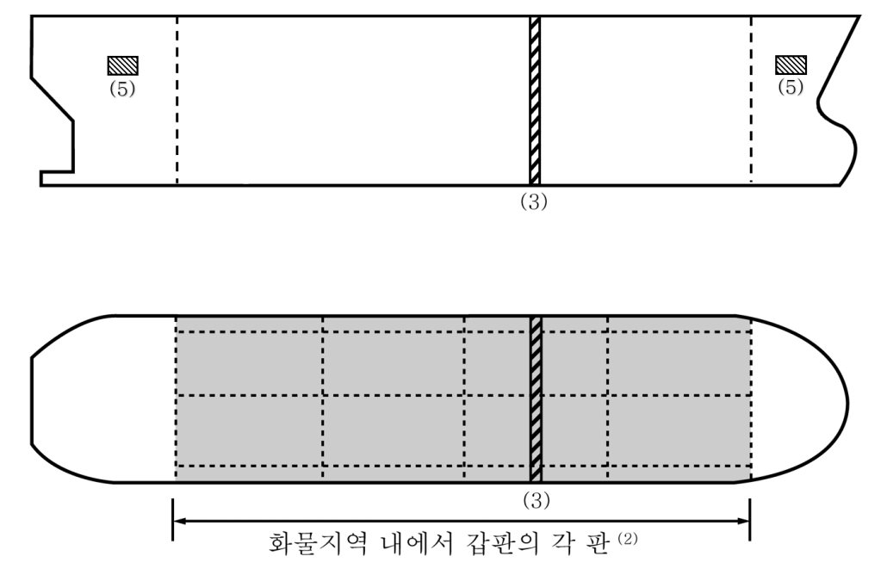 (1) 의심지역 (2) 화물지역 내에서 갑판의 각 판 (3) 화물지역 내에서 1개 횡단면 (4) 정밀검사 대상부재(구조부재의 쇠모상태 및 그 경향을 파악하기 위하여 계측) (5) 화물지역 밖에 있는 선택된 바람 및 물막이 스트레이크 *(2024)* |
  | 제3차 *(2024)* | 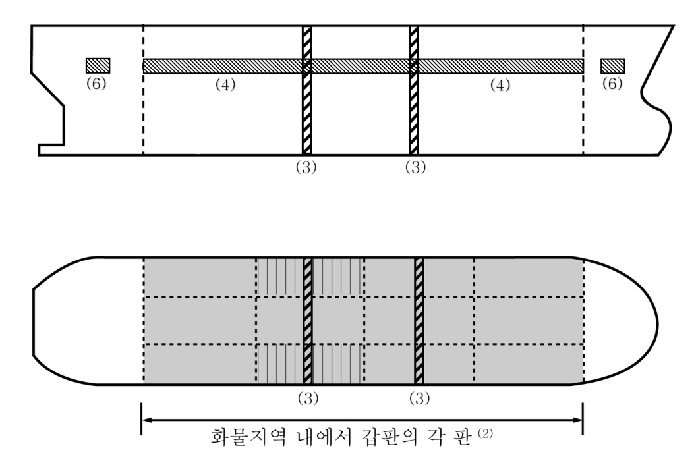 (1) 의심지역 (2) 화물지역 내에서 갑판의 각 판 (3) 화물지역 내에서 2개의 횡단면^1) (4) 화물지역 내에서 모든 바람 및 물막이 스트레이크 *(2024)* (5) 정밀검사 대상부재(구조부재의 쇠모상태 및 그 경향을 파악하기 위하여 계측) (6) 화물지역 밖에 있는 선택된 바람 및 물막이 스트레이크 *(2024)* |

  **표 11 정기검사 시의 두께계측 - ESP 부호를 갖는 위험화학품 산적운반선** (계속)

  | 정기검사 | 계측범위 및 위치 |
  | --- | --- |
  | 제4차 및 이후 *(2024)* | 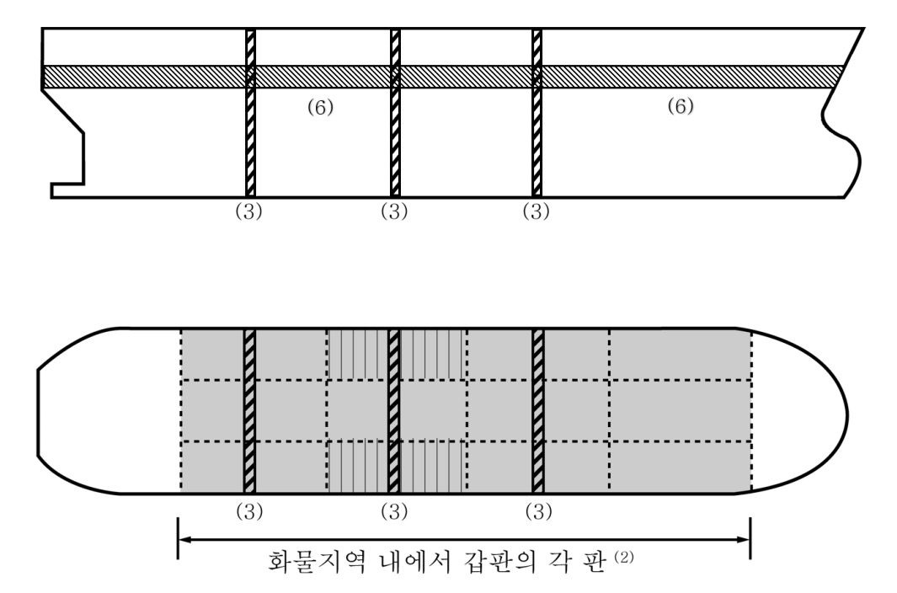 (1) 의심지역 (2) 화물지역 내에서 갑판의 각 판 (3) 화물지역 내에서 3개의 횡단면^1) (4) 화물지역 내에서 선저외판의 각 판 (5) 정밀검사 대상부재(구조부재의 쇠모상태 및 그 경향을 파악하기 위하여 계측) (6) 선박의 전 길이에 대하여 모든 바람 및 물막이 스트레이크 *(2024)* |
  | (비고) 갑판의 계측 선측외판의 계측 횡단면 계측(판에 대해서만 계측) 횡단면 계측(종통부재 포함, 횡식 늑골구조의 선박인 경우 인접한 늑골 및 그 단부 브래킷을 포함) 평형수탱크  1) 최소한 1개의 횡단면은 중앙부 0.5 $L$ 내의 평형수탱크를 포함하여야 한다. |   |

  | 정기검사 | 계측범위 및 위치 |
  | --- | --- |
  | 제1차 *(2023)* | (1) 의심지역 |
  | 제2차 *(2024)* | 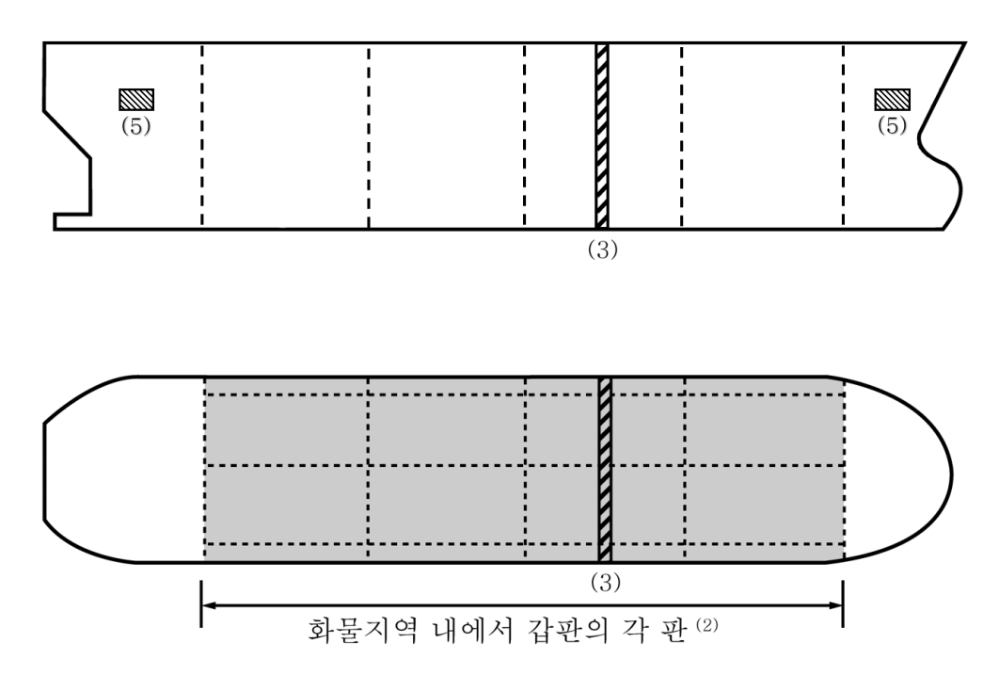 (1) 의심지역 (2) 화물지역 내에서 갑판의 각 판 (3) 화물지역 내에서 1개의 횡단면 (4) 정밀검사 대상부재(구조부재의 쇠모상태 및 그 경향을 파악하기 위하여 계측) (5) 화물지역 밖에 있는 선택된 바람 및 물막이 스트레이크 *(2024)* |
  | 제3차 *(2024)* | 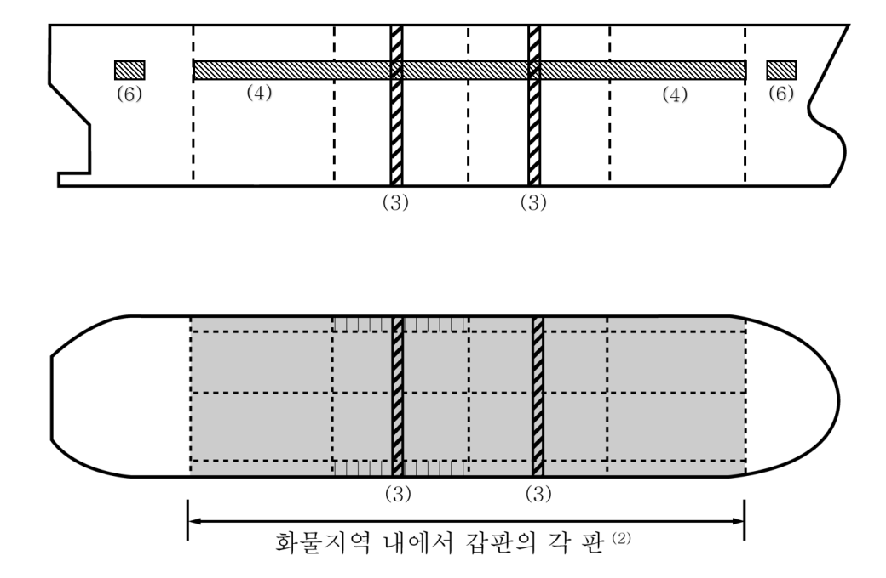 (1) 의심지역 (2) 화물지역 내에서 갑판의 각 판 (3) 화물지역 내에서 2개의 횡단면^1) (4) 화물지역 내에서 모든 바람 및 물막이 스트레이크 *(2024)* (5) 정밀검사 대상부재(구조부재의 쇠모상태 및 그 경향을 파악하기 위하여 계측) (6) 화물지역 밖에 있는 선택된 바람 및 물막이 스트레이크 *(2024)* |

  | 정기검사 | 계측범위 및 위치 |
  | --- | --- |
  | 제4차 및 이후 *(2024)* | 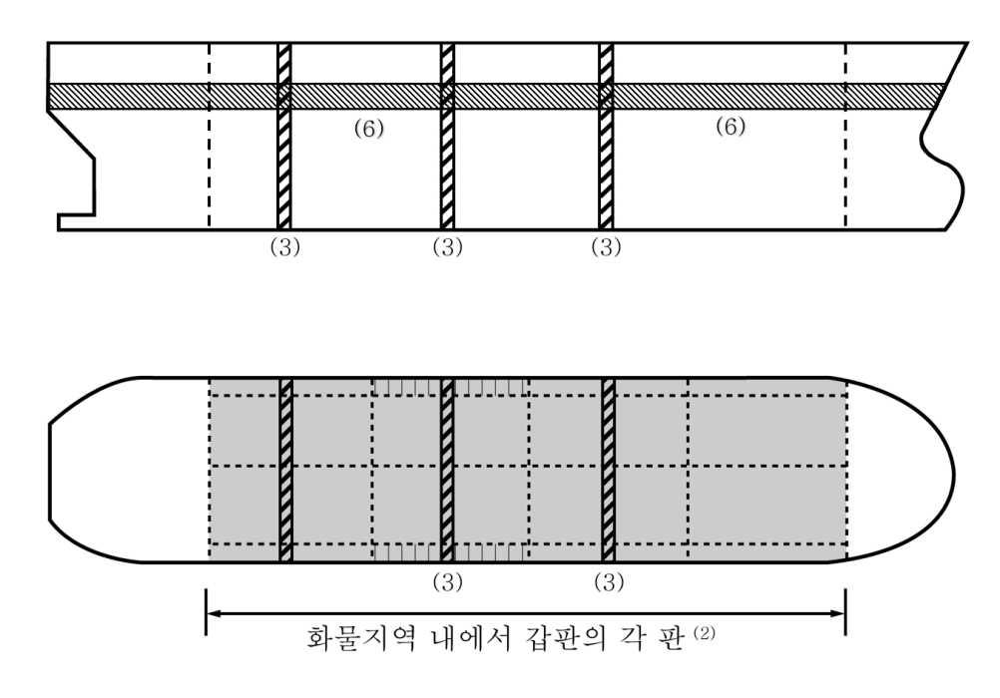 (1) 의심지역 (2) 화물지역 내에서 갑판의 각 판 (3) 화물지역 내에서 3개의 횡단면^1) (4) 화물지역 내에서 선저외판의 각 판 (5) 정밀검사 대상부재(구조부재의 쇠모상태 및 그 경향을 파악하기 위하여 계측) (6) 선박의 전 길이에 대하여 모든 바람 및 물막이 스트레이크 *(2024)* |
  | (비고) 갑판의 계측 선측외판의 계측 횡단면 계측(판에 대해서만 계측) 횡단면 계측(종통부재 포함, 횡식 늑골구조의 선박인 경우 인접한 늑골 및 그 단부 브래킷을 포함) 평형수탱크  1) 최소한 1개의 횡단면은 중앙부 0.5 $L$ 내의 평형수탱크를 포함하여야 한다. |   |

  | 정기검사 | 계측범위 및 위치 |
  | --- | --- |
  | 제1차 | (1) 의심지역 |
  | 제2차 *(2024)* |  (1) 의심지역 (2) 화물지역 내에서 화물창구 측선 밖에 있는 갑판에 있어서 2개의 횡단면에 대한 갑판의 각 판 (3) (2)에 규정된 횡단면에 해당하는 바람 및 물막이 스트레이크 *(2024)* (4) 화물지역 밖에 있는 선택된 바람 및 물막이 스트레이크 *(2024)* (5) 정밀검사 대상부재(구조부재의 쇠모상태 및 그 경향을 파악하기 위하여 계측) |
  | 제3차 *(2024)* | 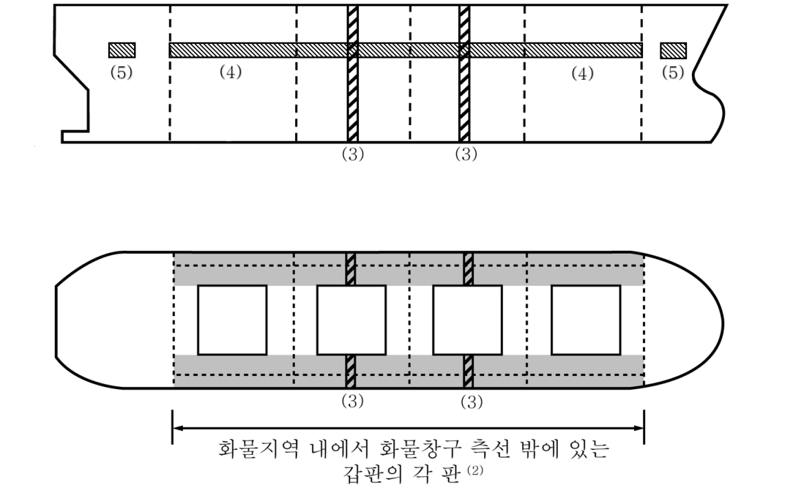 (1) 의심지역 (2) 화물지역 내에서 화물창구 측선 밖에 있는 갑판의 각 판 (3) 화물지역 내에서 화물창구 측선 밖에 있는 2개의 횡단면(그 중 1개는 선체의 중앙부에 있는 횡단면으로 한다) (4) 화물지역 내에서 모든 바람 및 물막이 스트레이크 *(2024)* (5) 화물지역 밖에 있는 선택된 바람 및 물막이 스트레이크 *(2024)* (6) 정밀검사 대상부재(구조부재의 쇠모상태 및 그 경향을 파악하기 위하여 계측) |

  | 정기검사 | 계측범위 및 위치 |
  | --- | --- |
  | 제4차 및 이후 *(2024)* |  (1) 의심지역 (2) 화물지역 내에서 화물창구 측선 밖에 있는 갑판의 각 판 (3) 화물지역 내에서 화물창구 측선 밖에 있는 3개의 횡단면(그 중 1개는 선체의 중앙부에 있는 횡단면으로 한다) (4) 화물지역 내에서 선저외판의 각 판 (5) 선박의 전 길이에 대하여 모든 바람 및 물막이 스트레이크 *(2024)* (6) 정밀검사 대상부재(구조부재의 쇠모상태 및 그 경향을 파악하기 위하여 계측) |
  | (비고) |   |
  |  | 갑판의 계측 선측외판의 계측 횡단면 계측(판에 대해서만 계측) 횡단면 계측(종통부재 포함, 횡식 늑골구조의 선박인 경우 인접한 늑골 및 그 단부 브래킷을 포함) |

  **표 16 과도한 부식이 있는 지역에 대한 추가 두께계측 요건 - ESP 부호를 갖는 위험화학품 산적운반선**
  1) 선저외판, 내저판 및 호퍼구조

  | 구조부재 | 계측범위 | 계측점의 수 |
  | --- | --- | --- |
  | 1. 선저외판, 내저판 및 호퍼구조의 판 | 해당 탱크에 있어서 가장 선미 쪽에 있는 1개의 베이(bay)를 포함하여 최소한 3개의 베이(bay)(모든 벨마우스의 주위 및 하부에 대하여 계측) | 종늑골 및 늑판 사이의 각 판에서 5점 |
  | 2. 선저외판, 내저판 및 호퍼구조의 종늑골 | 선저외판이 계측되는 각 베이(bay)마다 최소한 3개의 종늑골 | ․ 웨브 : 수직웨브에서 각 3점 ․ 면재 : 동일단면 내 각 3점 |
  | 3. 선저거더(수밀선저거더 포함) | 전․후단 수밀늑판 및 탱크의 중앙 | 거더판에서 수직으로 각 보강재 사이마다 각 1점 또는 최소한 3점 면재(있는 경우) : 각 2점 |
  | 4. 선저늑판(수밀선저늑판 포함) | 선저외판이 계측되는 베이(bay)에서 3개의 늑판(계측위치는 해당 늑판의 양단 및 중앙부로 한다) | 판면적 2 $\mathrm{m} ^{2}$ 마다 5점 |
  | 5. 호퍼구조 웨브프레임링 | 선저외판이 계측되는 베이(bay)에서 3개의 늑판 | 웨브 : 판면적 1 $\mathrm{m} ^{2}$ 마다 5점 면재 : 각 1점 |
  | 6. 호퍼구조 횡수밀격벽 또는 제수격벽 | ․격벽 하부 1/3 | ․ 판면적 1 $\mathrm{m} ^{2}$ 마다 5점 |
  | 6. 호퍼구조 횡수밀격벽 또는 제수격벽 | ․격벽 상부 2/3 | ․ 판면적 2 $\mathrm{m} ^{2}$ 마다 5점 |
  | 6. 호퍼구조 횡수밀격벽 또는 제수격벽 | ․보강재(최소한 3개) | ․ 웨브 : 스팬마다 각 5점(각 끝단에서 2점 및 중앙에서 1점) ․ 면재 : 스팬의 끝단 및 중앙에서 각 1점 |
  | 7. 판의 보강재 | 보강재가 있는 경우 | 각 1점 |

  2) 갑판구조

  | 구조부재 | 계측범위 | 계측점의 수 |
  | --- | --- | --- |
  | 1. 갑판 | 해당 탱크에 있어서 2개의 횡방향 밴드(band) | 각 밴드(band)의 각 판마다 최소한 3점 |
  | 2. 갑판종늑골 | 각 2개의 밴드(band)에서 매 3번째 종늑골(최소한 1개의 종늑골) | 웨브 : 깊이방향으로 각 3점 면재(있는 경우) : 각 2점 |
  | 3. 갑판거더 및 브래킷 | 전․후단, 횡격벽, 브래킷의 끝단 및 탱크의 중앙 | 웨브 : 수직으로 각 보강재 사이마다 각 1점 또는 최소한 3점 면재 : 각 2점 거더/격벽 브래킷 : 각 5점 |
  | 4. 갑판 트랜스버스웨브 | 최소한 2개의 웨브(계측위치는 양단 및 스팬의 중앙부로 한다) | 웨브 : 판면적 1 $\mathrm{m} ^{2}$ 마다 5점 면재 : 각 1점 |
  | 5. 이중선체인 경우 윙 평형수탱크 내의 수직웨브 및 횡격벽(갑판으로부터 2 $\mathrm{m}$) | 최소한 2개의 웨브 및 양단의 횡격벽 | 판면적 1 $\mathrm{m} ^{2}$ 마다 5점 |
  | 6. 판의 보강재 | 보강재가 있는 경우 | 각 1점 |

  **표 16 과도한 부식이 있는 지역에 대한 추가 두께계측 요건 - ESP 부호를 갖는 위험화학품 산적운반선** (계속)
  3) 선측외판 및 종격벽

  | 구조부재 | 계측범위 | 계측점의 수 |
  | --- | --- | --- |
  | 1. 선측외판 및 종격벽판 ․ 상단 및 하단의 각 판, 수평거더 주위의 판 ․ 기타 모든 판 | ․ 최소한 3개의 베이(bay)에서 각 종늑골 사이의 판(해당 탱크 내) ․ 동일한 3개의 베이(bay)에서 매 3번째 종늑골 사이의 판 | ․ 각 1점 ․ 각 1점 |
  | 2. 다음 위치에서 선측외판 및 종격벽의 종늑골 : ․ 상단 및 하단의 판 ․ 기타 모든 판 | ․ 동일한 3개의 베이(bay)에서 각 종늑골 ․ 동일한 3개의 베이(bay)에서 매 3번째 종늑골 | ․ 웨브 : 각 3점, 면재 : 각 1점 ․ 웨브 : 각 3점, 면재 : 각 1점 |
  | 3. 종늑골에 부착된 브래킷 | 동일한 3개의 베이(bay)에서 탱크 상단, 중앙 및 하단에서 최소한 3개 | 각 브래킷 마다 5점 |
  | 4. 이중선측탱크의 수직웨브 및 횡격벽(상단부위는 제외): ․ 수평거더 주위의 판 ․ 기타의 판 | ․ 최소한 2개의 웨브 및 양단의 횡격벽 ․ 최소한 2개의 웨브 및 양단의 횡격벽 | ․ 판면적 약 2 $\mathrm{m} ^{2}$ 마다 5점 ․ 각 수직보강재 사이마다 2점 |
  | 5. 이중선측탱크 이외의 탱크내의 웨브프레임 및 크로스타이 | 3개의 웨브(각 웨브 당 최소한 3개소, 크로스타이 연결부 및 하부 끝단브래킷 포함) | 웨브 : 판면적 약 2 $\mathrm{m} ^{2}$ 마다 5점 면재 : 웨브프레임 및 크로스타이의 각 면재마다 각 1점 |
  | 6. 수평거더 | 최소한 3개의 베이(bay)에서 각 거더의 판 | 각 종거더보강재 사이마다 2점 |
  | 7. 판의 보강재 | 보강재가 있는 경우 | 각 1점 |

  4) 횡수밀격벽 및 제수격벽

  | 구조부재 | 계측범위 | 계측점의 수 |
  | --- | --- | --- |
  | 1. 상부 및 하부스툴 (있는 경우) | ․ 내저판/갑판과 용접된 부위로부터 25 $\mathrm{mm}$범위 내의 횡방향 밴드(band) ․ 스툴정판과 용접된 부위로부터 25 $\mathrm{mm}$ 범위 내에서 횡방향 밴드(band) | 보강재 사이에서 1 $\mathrm{m}$ 마다 5점 |
  | 2. 상단 및 하단의 각 판, 수평스트링거 주위의 판 | 해당 탱크의 횡방향으로 약 1/4, 1/2 및 3/4의 3개소에서 보강재 사이의 판 | 보강재 사이에서 1 $\mathrm{m}$ 마다 5점 |
  | 3. 기타 모든 판 | 중앙부에서 보강재 사이의 판 | 각 1점 |
  | 4. 파형격벽의 판 | 판의 중앙부 및 조립연결부의 플랜지에서 판의 두께가 다른 각 판 | 판면적 약 1 $\mathrm{m} ^{2}$ 마다 5점 |
  | 5. 보강재 | 최소한 3개의 대표적인 보강재 | 웨브 : 브래킷 사이의 각 스팬마다 5점 (브래킷 양쪽 연결부에서 각 2점, 스팬의 중앙에서 1점) 면재 : 각 브래킷의 끝단 및 스팬의 중앙부에서 각 1점 |
  | 6. 브래킷 | 해당 탱크의 상단, 하단 및 중앙에서 최소한 3개소 | 각 브래킷마다 5점 |
  | 7. 수평스트링거 | 모든 스트링거(계측위치는 양단 및 중앙부로 한다) | 면적 1 $\mathrm{m} ^{2}$ 마다 5점, 브래킷의 끝단 주위 및 면재에서 각 1점 |
  | 8. 디프웨브 및 거더 | 브래킷 끝단 및 스팬의 중앙에서 계측 | 웨브 : 웨브 면적 1 $\mathrm{m} ^{2}$ 마다 5점 면재 : 각 3점 |

  **표 17 과도한 부식이 있는 지역에 대한 추가 두께계측 요건 - ESP 부호를 갖는 이중선체 유조선**
  1) 선저외판, 내저판 및 호퍼구조

  | 구조부재 | 계측범위 | 계측점의 수 |
  | --- | --- | --- |
  | 1. 선저외판, 내저판 및 호퍼구조의 판 | 이중저탱크에 있어서 가장 선미 쪽에 있는 1개의 베이(bay)을 포함하여 최소한 3개의 베이(bay)(모든 벨마우스의 주위 및 하부에 대하여 계측) | 종늑골 및 늑판 사이의 각 판에서 5점 |
  | 2. 선저외판, 내저판 및 호퍼구조의 종늑골 | 선저외판이 계측되는 각 베이(bay)마다 최소한 3개의 종늑골 | 웨브 : 수직웨브에서 각 3점 면재 : 동일단면 내 각 3점 |
  | 3. 선저거더(수밀선저거더 포함) | 전․후단 수밀늑판 및 탱크의 중앙 | 거더판에서 수직으로 각 보강재 사이마다 각 1점 또는 최소한 3점 |
  | 4. 선저늑판(수밀선저늑판 포함) | 선저외판이 계측되는 베이(bay)에서 3개의 늑판(계측위치는 해당 늑판의 양단 및 중앙부로 한다) | 판면적 2 $\mathrm{m} ^{2}$ 마다 5점 |
  | 5. 호퍼구조 웨브프레임링 | 선저외판이 계측되는 베이(bay)에서 3개의 늑판 | 웨브 : 판면적 1 $\mathrm{m} ^{2}$ 마다 5점 면재 : 각 1점 |
  | 6. 호퍼구조 횡수밀격벽 또는 제수격벽 | ․격벽 하부 1/3 | ․판면적 1 $\mathrm{m} ^{2}$ 마다 5점 |
  | 6. 호퍼구조 횡수밀격벽 또는 제수격벽 | ․격벽 상부 2/3 | ․판면적 2 $\mathrm{m} ^{2}$ 마다 5점 |
  | 6. 호퍼구조 횡수밀격벽 또는 제수격벽 | ․보강재(최소한 3개) | ․웨브 : 스팬마다 각 5점(각 끝단에서 2점 및 중앙에서 1점) ․면재 : 스팬의 끝단 및 중앙에서 각 1점 |
  | 7. 판의 보강재 | 보강재가 있는 경우 | 각 1점 |

  2) 갑판구조

  | 구조부재 | 계측범위 | 계측점의 수 |
  | --- | --- | --- |
  | 1. 갑판 | 해당 탱크에 있어서 2개의 횡방향 밴드(band) | 각 밴드(band)의 각 판마다 최소한 3점 |
  | 2. 갑판 종늑골 | 각 2개의 밴드(band)에서 매 3번째 종늑골(최소한 1개의 종늑골) | 웨브 : 깊이방향으로 각 3점 면재(있는 경우) : 각 2점 |
  | 3. 갑판 거더 및 브래킷 (일반적으로 화물탱크 내에서만 계측) | 전․후단, 횡격벽, 브래킷의 끝단 및 탱크의 중앙 | 웨브 : 수직으로 각 보강재 사이마다 각 1점 또는 최소한 3점 면재 : 각 2점 거더/격벽 브래킷 : 각 5점 |
  | 4. 갑판 트랜스버스웨브 | 최소한 2개의 웨브(계측위치는 양단 및 스팬의 중앙부로 한다) | 웨브 : 판면적 1 $\mathrm{m} ^{2}$ 마다 5점 면재 : 각 1점 |
  | 5. 윙 평형수탱크 내의 수직웨브 및 횡격벽(갑판으로부터 2 $\mathrm{m}$) | 최소한 2개의 웨브 및 양단의 횡격벽 | 판면적 1 $\mathrm{m} ^{2}$ 마다 5점 |
  | 6. 판의 보강재 | 보강재가 있는 경우 | 각 1점 |

  **표 17 과도한 부식이 있는 지역에 대한 추가 두께계측 요건 - ESP 부호를 갖는 이중선체 유조선** (계속)
  3) 윙 평형수탱크구조

  | 구조부재 | 계측범위 | 계측점의 수 |
  | --- | --- | --- |
  | 1. 선측외판 및 종격벽판 ․ 상단의 각 판 및 수평거더 주위의 판 ․ 기타 모든 판 | ․ 최소한 3개의 베이(bay)에서 각 종늑골 사이 의 판(해당 탱크 내) ․ 동일한 3개의 베이(bay)에서 매 3번째 종늑골 사이의 판 | ․ 각 1점 ․ 각 1점 |
  | 2. 다음 위치에서 선측외판 및 종격벽의 종늑골 : ․ 상단의 판 ․ 기타 모든 판 | ․ 동일한 3개의 베이(bay)에서 각 종늑골 ․ 동일한 3개의 베이(bay)에서 매 3번째 종늑골 | ․ 웨브 : 각 3점, 면재 : 각 1점 ․ 웨브 : 각 3점, 면재 : 각 1점 |
  | 3. 종늑골에 부착된 브래킷 | 동일한 3개의 베이(bay)에서 탱크 상단, 중앙 및 하단에서 최소한 3개 | 각 브래킷 마다 5점 |
  | 4. 수직웨브 및 횡격벽 (상단부위는 제외) : ․ 수평거더 주위의 판 ․ 기타 모든 판 | ․ 최소한 2개의 웨브 및 양단의 횡격벽 ․ 최소한 2개의 웨브 및 양단의 횡격벽 | ․ 판면적 약 2 $\mathrm{m} ^{2}$ 마다 5점 ․ 각 수직보강재 사이마다 2점 |
  | 5. 수평거더 | 최소한 3개의 베이(bay)에서 각 거더의 판 | 각 종거더보강재 사이마다 2점 |
  | 6. 판의 보강재 | 보강재가 있는 경우 | 각 1점 |

  4) 화물탱크 내의 종격벽

  | 구조부재 | 계측범위 | 계측점의 수 |
  | --- | --- | --- |
  | 1. 상단 및 하단의 각 판, 횡격벽의 수평스트링거 주위의 판 | 최소한 3개의 베이(bay)에서 각 종늑골 사이의 판 | 각 1점 |
  | 2. 기타 모든 판 | 동일한 3개의 베이(bay)에서 매 3번째 종늑골 사이의 판 | 각 1점 |
  | 3. 상단 및 하단의 판에 부착된 종늑골 | 동일한 3개의 베이(bay)에서 각 종늑골 | 웨브 : 각 3점 면재 : 각 1점 |
  | 4. 기타 모든 종늑골 | 동일한 3개의 베이(bay)에서 매 3번째 종늑골 | 웨브 : 각 3점 면재 : 각 1점 |
  | 5. 종늑골에 부착된 브래킷 | 동일한 3개의 베이(bay) 내 탱크 상단, 중앙 및 하단에서 최소한 3개 | 각 브래킷 마다 5점 |
  | 6. 웨브프레임 및 크로스타이 | 3개의 웨브(각 웨브 당 3개소, 크로스타이의 연결부 포함) | 웨브 : 판면적 약 2 $\mathrm{m} ^{2}$ 마다 5점 면재 : 웨브프레임 및 크로스타이의 각 면재마다 각 1점 |
  | 7. 최하단 브래킷 (웨브프레임의 반대편) | 최소한 3개의 브래킷 | 브래킷면적 약 2 $\mathrm{m} ^{2}$ 마다 5점, 브래킷의 면재에서 각 1점 |

  **표 17 과도한 부식이 있는 지역에 대한 추가 두께계측 요건 - ESP 부호를 갖는 이중선체 유조선** (계속)
  5) 화물탱크 내의 횡수밀격벽 및 제수격벽

  | 구조부재 | 계측범위 | 계측점의 수 |
  | --- | --- | --- |
  | 1. 상부 및 하부스툴 (있는 경우) | ․ 내저판/갑판과 용접된 부위로부터 25 $\mathrm{mm}$범위 내에서 횡방향 밴드(band) ․ 스툴정판과 용접된 부위로부터 25 $\mathrm{mm}$ 범위 내에서 횡방향 밴드(band) | 보강재 사이에서 1 $\mathrm{m}$ 마다 5점 |
  | 2. 상단 및 하단의 각 판, 수평스트링거 주위의 판 | 해당 탱크의 횡방향으로 약 1/4, 1/2 및 3/4의 3개소에서 보강재 사이의 판 | 보강재 사이에서 1 $\mathrm{m}$ 마다 5점 |
  | 3. 기타 모든 판 | 중앙부에서 보강재 사이의 판 | 각 1점 |
  | 4. 파형격벽의 판 | 판의 중앙부 및 조립연결부의 플랜지에서 판의 두께가 다른 각 판 | 판면적 약 1 $\mathrm{m} ^{2}$ 마다 5점 |
  | 5. 보강재 | 최소한 3개의 대표적인 보강재 | 웨브 : 브래킷 사이의 각 스팬마다 5점 (브래킷 양쪽 연결부에서 각 2점, 스팬의 중앙에서 1점) 면재 : 각 브래킷의 끝단 및 스팬의 중앙부에서 각 1점 |
  | 6. 브래킷 | 해당 탱크의 상단, 하단 및 중앙에서 최소한 3개소 | 각 브래킷마다 5점 |
  | 7. 수평스트링거 | 모든 스트링거(계측위치는 양단 및 중앙부로 한다) | 면적 1 $\mathrm{m} ^{2}$ 마다 5점, 브래킷의 끝단 주위 및 면재에서 각 1점 |

  **표 18 과도한 부식이 있는 지역에 대한 추가 두께계측 요건 - ESP 부호를 갖는 이중선체 산적화물선**
  1) 선저외판, 내저판 및 호퍼구조

  | 구조부재 | 계측범위 | 계측점의 수 |
  | --- | --- | --- |
  | 1. 선저외판, 내저판 및 호퍼구조의 판 | 이중저탱크에 있어서 가장 선미 쪽에 있는 1개의 베이(bay)를 포함하여 최소한 3개의 베이(bay)(모든 벨마우스의 주위 및 하부에 대하여 계측) | 종늑골 및 늑판 사이의 각 판에 대하여 5점 |
  | 2. 선저외판, 이중저 및 호퍼구조의 종늑골 | 선저외판이 계측되는 각 베이(bay)마다 최소한 3개의 종늑골 | ․ 웨브 : 수직웨브에서 각 3점 ․ 면재 : 동일단면 내 각 3점 |
  | 3. 선저거더 (수밀선저거더 포함) | 전․후단 수밀늑판 및 탱크의 중앙 | 거더판에서 수직으로 각 보강재 사이마다 각 1점 또는 최소한 3점 |
  | 4. 선저늑판 (수밀선저늑판 포함) | 선저외판이 계측되는 베이(bay)에서 3개의 늑판(계측위치는 해당 늑판의 양단 및 중앙부로 한다) | 판면적 2 $\mathrm{m} ^{2}$ 마다 5점 |
  | 5. 호퍼구조 웨브프레임링 | 선저외판이 계측되는 베이(bay)에서 3개의 늑판 | ․ 웨브 : 판면적 1 $\mathrm{m} ^{2}$ 마다 5점 ․ 면재 : 각 1점 |
  | 6. 호퍼구조 횡수밀격벽 또는 제수격벽 | ․ 격벽 하부 1/3 | ․ 판면적 1 $\mathrm{m} ^{2}$ 마다 5점 |
  | 6. 호퍼구조 횡수밀격벽 또는 제수격벽 | ․ 격벽 상부 2/3 | ․ 판면적 2 $\mathrm{m} ^{2}$ 마다 5점 |
  | 6. 호퍼구조 횡수밀격벽 또는 제수격벽 | ․ 보강재(최소한 3개) | ․ 웨브 : 스팬마다 각 5점 (양단에서 2점 및 스팬의 중앙에서 1점) ․ 면재 : 양단 및 스팬의 중앙에서 각 1점 |
  | 7. 판의 보강재 | 보강재가 있는 경우 | 각 1점 |

  **표 18 과도한 부식이 있는 지역에 대한 추가 두께계측 요건 - ESP 부호를 갖는 이중선체 산적화물선** (계속)
  2) 갑판구조(크로스데크, 화물창구, 창구덮개, 코밍 및 톱사이드탱크 포함)

  | 구조부재 | 계측범위 | 계측점의 수 |
  | --- | --- | --- |
  | 1. 크로스데크 | 의심되는 크로스데크 | 갑판하 보강재 사이에서 1 $\mathrm{m}$ 마다 5점 |
  | 2. 갑판하 보강재 | 1) 횡부재 2) 종부재 | 1) 양단 및 스팬의 중앙에서 5점 2) 웨브 : 각 5점 면재 : 각 5점 |
  | 3. 창구덮개 | 1) 전․후 및 양측의 측벽에 있어서 각 3개소 2) 양단 및 중앙부에 있어서 종통하는 각 1조의 판 | 1) 각 위치에 있어서 5점 2) 각 조의 판에 있어서 5점 |
  | 4. 창구코밍 | 코밍의 전․후 및 양측에서 각각 하부 1/3 및 상부 2/3 | 각 위치에 있어서 5점 |
  | 5. 톱사이드 평형수탱크 | 1) 수밀횡격벽 a) 격벽의 하부 1/3 b) 격벽의 상부 2/3 c) 보강재 2) 2개의 대표적인 제수격벽 a) 격벽의 하부 1/3 b) 격벽의 상부 2/3 c) 보강재 3) 경사판에서 대표적인 3 베이(bay) a) 탱크의 하부 1/3 b) 탱크의 상부 2/3 4) 의심되는 종보강재 및 인접하는 종보강재 | 1) a) 판의 1 $\mathrm{m} ^{2}$ 마다 5점 b) 판의 1 $\mathrm{m} ^{2}$ 마다 5점 c) 1 $\mathrm{m}$ 마다 5점 2) a) 판의 1 $\mathrm{m} ^{2}$ 마다 5점 b) 판의 1 $\mathrm{m} ^{2}$ 마다 5점 c) 1 $\mathrm{m}$ 마다 5점 3) a) 판의 1 $\mathrm{m} ^{2}$ 마다 5점 b) 판의 1 $\mathrm{m} ^{2}$ 마다 5점 4) 웨브 : 1 $\mathrm{m}$ 마다 5점 면재 : 1 $\mathrm{m}$ 마다 5점 |
  | 6. 갑판 | 의심되는 판 및 인접하는 4조의 판 | 판의 1 $\mathrm{m} ^{2}$ 마다 5점 |
  | 7. 갑판 종늑골 | 의심되는 판 | 웨브 : 1 $\mathrm{m}$ 마다 5점 면재 : 1 $\mathrm{m}$ 마다 5점 |
  | 8. 특설늑골/트랜스버스 | 의심되는 판 | 판의 1 $\mathrm{m} ^{2}$ 마다 5점 |

  **표 18 과도한 부식이 있는 지역에 대한 추가 두께계측 요건 - ESP 부호를 갖는 이중선체 산적화물선** (계속)
  3) 이중선측구역(광석운반선의 윙 보이드 스페이스 포함)

  | 구조부재 | 계측범위 | 계측점의 수 |
  | --- | --- | --- |
  | 1. 선측외판 및 내측판 : ․ 상단의 각 판 및 수평거더 주위의 판 ․ 기타 모든 판 | ․ 최소한 3개의 베이(bay)에서 각 횡늑골/종늑골 사이의 판(해당 탱크 내) ․ 동일한 3개의 베이(bay)에서 매 3번째 종늑골 사이의 판 | ․ 각 1점 ․ 각 1점 |
  | 2. 다음 위치에서 선측외판 및 이중선측 횡늑골/종늑골 ․ 상단의 판 ․ 기타 모든 판 | ․ 동일한 3개의 베이(bay)에서 각 횡늑골/종늑골 ․ 동일한 3개의 베이(bay)에서 매 3번째 횡늑골/종늑골 | ․ 웨브 : 각 3점, 면재 : 각 1점 ․ 웨브 : 각 3점, 면재 : 각 1점 |
  | 3. 횡늑골/종늑골에 부착된 브래킷 | 동일한 베이(bay) 내 탱크 상단, 중앙 및 하단에서 최소한 3개 | 각 브래킷마다 5점 |
  | 4. 수직웨브 및 횡격벽 : ․ 수평거더 주위의 판 ․ 기타 모든 판 | ․ 최소한 2개의 웨브 및 양단의 횡격벽 ․ 최소한 2개의 웨브 및 양단의 횡격벽 | ․ 판면적 약 2 $\mathrm{m} ^{2}$ 마다 5점 ․ 각 수직보강재 사이마다 2점 |
  | 5. 수평거더 | 최소한 3개의 베이(bay)에서 각 거더의 판 | 각 종거더보강재 사이마다 2점 |
  | 6. 판의 보강재 | 보강재가 있는 경우 | 각 1점 |

  4) 화물창 내의 횡격벽

  | 구조부재 | 계측범위 | 계측점의 수 |
  | --- | --- | --- |
  | 1. 하부스툴 | ․ 내저판과 용접된 부위로부터 25 $\mathrm{mm}$ 범위 내에서 횡방향 밴드(band) ․ 하부스툴정판과 용접된 부위로부터 25 $\mathrm{mm}$ 범위 내에서 횡방향 밴드(band) | ․ 보강재 사이에서 1 $\mathrm{m}$ 마다 5점 ․ 보강재 사이에서 1 $\mathrm{m}$ 마다 5점 |
  | 2. 횡격벽 | ․ 중간높이 정도에서 전폭에 걸친 횡방향 밴드(band) ․ 상갑판 또는 상부스툴하단판(상부스툴이 있는 경우)에 인접하는 격벽판의 전폭에 걸친 횡방향 밴드(band) | ․ 판의 1 $\mathrm{m} ^{2}$ 마다 5점 ․ 판의 1 $\mathrm{m} ^{2}$ 마다 5점 |

  **표 20-1 두께계측 기록표 - Non-CSR 선박** **표 20-1**은 국제선급연합회(IACS)의 공통구조규칙(**규칙 11편, 규칙 12편** 또는 **규칙 13편**)에 따라 건조되지 아니한 선박(즉, Non-CSR 선박)에 사용한다. **TM1-T/DHT/BC/DSBC/GE*** Report on THICKNESS MEASUREMENT of ALL DECK PLATING / ALL BOTTOM SHELL PLATING / ALL SIDE SHELL PLATING^* Ship's Name : Class Identity No. : Report No. :

  | STRAKE POSITION |   |   |   |   |   |   |   |   |   |   |   |   |   |   |   |   |   |
  | --- | --- | --- | --- | --- | --- | --- | --- | --- | --- | --- | --- | --- | --- | --- | --- | --- | --- |
  | PLATE POSITION | No. or Letter | Org. Thk. *mm* | Forward Reading |   |   |   |   |   | Aft Reading |   |   |   |   |   | Mean Diminution % |   | M.A.D |
  | PLATE POSITION | No. or Letter | Org. Thk. *mm* | Gauged |   | Diminution P |   | Diminution S |   | Gauged |   | Diminution P |   | Diminution S |   | Mean Diminution % |   | M.A.D |
  | PLATE POSITION | No. or Letter | Org. Thk. *mm* | P | S | *mm* | *%* | *mm* | *%* | P | S | *mm* | *%* | *mm* | *%* | P | S | *mm* |
  | 15th forward |   |   |   |   |   |   |   |   |   |   |   |   |   |   |   |   |   |
  | 14th |   |   |   |   |   |   |   |   |   |   |   |   |   |   |   |   |   |
  | 13th |   |   |   |   |   |   |   |   |   |   |   |   |   |   |   |   |   |
  | 12th |   |   |   |   |   |   |   |   |   |   |   |   |   |   |   |   |   |
  | 11th |   |   |   |   |   |   |   |   |   |   |   |   |   |   |   |   |   |
  | 10th |   |   |   |   |   |   |   |   |   |   |   |   |   |   |   |   |   |
  | 9th |   |   |   |   |   |   |   |   |   |   |   |   |   |   |   |   |   |
  | 8th |   |   |   |   |   |   |   |   |   |   |   |   |   |   |   |   |   |
  | 7th |   |   |   |   |   |   |   |   |   |   |   |   |   |   |   |   |   |
  | 6th |   |   |   |   |   |   |   |   |   |   |   |   |   |   |   |   |   |
  | 5th |   |   |   |   |   |   |   |   |   |   |   |   |   |   |   |   |   |
  | 4th |   |   |   |   |   |   |   |   |   |   |   |   |   |   |   |   |   |
  | 3rd |   |   |   |   |   |   |   |   |   |   |   |   |   |   |   |   |   |
  | 2nd |   |   |   |   |   |   |   |   |   |   |   |   |   |   |   |   |   |
  | 1st |   |   |   |   |   |   |   |   |   |   |   |   |   |   |   |   |   |
  | Amidships |   |   |   |   |   |   |   |   |   |   |   |   |   |   |   |   |   |
  | 1st aft |   |   |   |   |   |   |   |   |   |   |   |   |   |   |   |   |   |
  | 2nd |   |   |   |   |   |   |   |   |   |   |   |   |   |   |   |   |   |
  | 3rd |   |   |   |   |   |   |   |   |   |   |   |   |   |   |   |   |   |
  | 4th |   |   |   |   |   |   |   |   |   |   |   |   |   |   |   |   |   |
  | 5th |   |   |   |   |   |   |   |   |   |   |   |   |   |   |   |   |   |
  | 6th |   |   |   |   |   |   |   |   |   |   |   |   |   |   |   |   |   |
  | 7th |   |   |   |   |   |   |   |   |   |   |   |   |   |   |   |   |   |
  | 8th |   |   |   |   |   |   |   |   |   |   |   |   |   |   |   |   |   |
  | 9th |   |   |   |   |   |   |   |   |   |   |   |   |   |   |   |   |   |
  | 10th |   |   |   |   |   |   |   |   |   |   |   |   |   |   |   |   |   |
  | 11th |   |   |   |   |   |   |   |   |   |   |   |   |   |   |   |   |   |
  | 12th |   |   |   |   |   |   |   |   |   |   |   |   |   |   |   |   |   |
  | 13th |   |   |   |   |   |   |   |   |   |   |   |   |   |   |   |   |   |
  | 14th |   |   |   |   |   |   |   |   |   |   |   |   |   |   |   |   |   |
  | 15th |   |   |   |   |   |   |   |   |   |   |   |   |   |   |   |   |   |
  | Operators Signature : (NOTES) 1. This report form is to be used for recording the thickness measurement of : All strength deck plating within the cargo (length) area All keel, bottom shell plating and bilge plating within the cargo (length) area Side shell plating including selected wind and water strakes outside cargo (length) area All wind and water strakes within cargo (length) area 2. The strake position is to be clearly indicated as follow : 2.1 For strength deck indicate the number of the strake of plating inboard from the stringer plate. 2.2 For bottom plating indicate the number of the strake of plating outboard from the keel plate. 2.3 For side shell plating give number of the strake of plating below sheerstrake and letter as shown on shell expansion. 3. For the ships which have no wide cargo openings i.e oil tankers all deck plating strakes are to be recorded, for the ships which have wide cargo openings i.e ore/oil ships and bulk carriers only the deck plating strakes outside line of openings are to be recorded. 4. Measurements are to be taken at the forward and aft areas of all plates and where plates cross ballast and cargo tank /hold boundaries separate measurements for the area of plating in way of each type of tank/hold are to be recorded. 5. The single measurements recorded are to represent the average of multiple measurements. 6. The maximum allowable diminution could be stated in an attached document. * : delete as appropriate T : Oil Tankers and Chemical Tankers with ESP notation DHT : Double Hull Oil Tankers with ESP notation BC : Bulk Carriers with ESP notation DSBC : Double Skin Bulk Carriers with ESP notation GE : Others M.A.D : Maximum Allowable Diminution |   |   |   |   |   |   |   |   |   |   |   |   |   |   |   |   |   |

  **표 20-1 두께계측 기록표 - Non-CSR 선박 (계속)** **TM2-T/DHT/BC/DSBC/GE(i)*** Report on THICKNESS MEASUREMENT OF SHEERSTRAKE AND DECK PLATING AT TRANSVERSE SECTIONS (one, two or three transverse sections) Ship's Name : Class Identity No. : Report No. :

  | STRENGTH DECK AND SHEERSTRAKE PLATING |   |   |   |   |   |   |   |   |   |   |   |   |   |   |   |   |   |   |   |   |   |   |   |   |   |   |   |
  | --- | --- | --- | --- | --- | --- | --- | --- | --- | --- | --- | --- | --- | --- | --- | --- | --- | --- | --- | --- | --- | --- | --- | --- | --- | --- | --- | --- |
  |   | FIRST TRANSVERSE SECTION AT FRAME NUMBER : |   |   |   |   |   |   |   |   | SECOND TRANSVERSE SECTION AT FRAME NUMBER : |   |   |   |   |   |   |   |   | THIRD TRANSVERSE SECTION AT FRAME NUMBER : |   |   |   |   |   |   |   |   |
  | STRAKE POSITION | No. or Letter | Org. Thk. | M.A.D | Gauged |   | Diminution P |   | Diminution S |   | No. or Letter | Org. Thk. | M.A.D | Gauged |   | Diminution P |   | Diminution S |   | No. or Letter | Org. Thk. | M.A.D | Gauged |   | Diminution P |   | Diminution S |   |
  | STRAKE POSITION | No. or Letter | *mm* | *mm* | P | S | *mm* | *%* | *mm* | *%* | No. or Letter | *mm* | *mm* | P | S | *mm* | *%* | *mm* | *%* | No. or Letter | *mm* | *mm* | P | S | *mm* | *%* | *mm* | *%* |
  | Stringer Plate |   |   |   |   |   |   |   |   |   |   |   |   |   |   |   |   |   |   |   |   |   |   |   |   |   |   |   |
  | 1st strake inboard |   |   |   |   |   |   |   |   |   |   |   |   |   |   |   |   |   |   |   |   |   |   |   |   |   |   |   |
  | 2nd |   |   |   |   |   |   |   |   |   |   |   |   |   |   |   |   |   |   |   |   |   |   |   |   |   |   |   |
  | 3rd |   |   |   |   |   |   |   |   |   |   |   |   |   |   |   |   |   |   |   |   |   |   |   |   |   |   |   |
  | 4th |   |   |   |   |   |   |   |   |   |   |   |   |   |   |   |   |   |   |   |   |   |   |   |   |   |   |   |
  | 5th |   |   |   |   |   |   |   |   |   |   |   |   |   |   |   |   |   |   |   |   |   |   |   |   |   |   |   |
  | 6th |   |   |   |   |   |   |   |   |   |   |   |   |   |   |   |   |   |   |   |   |   |   |   |   |   |   |   |
  | 7th |   |   |   |   |   |   |   |   |   |   |   |   |   |   |   |   |   |   |   |   |   |   |   |   |   |   |   |
  | 8th |   |   |   |   |   |   |   |   |   |   |   |   |   |   |   |   |   |   |   |   |   |   |   |   |   |   |   |
  | 9th |   |   |   |   |   |   |   |   |   |   |   |   |   |   |   |   |   |   |   |   |   |   |   |   |   |   |   |
  | 10th |   |   |   |   |   |   |   |   |   |   |   |   |   |   |   |   |   |   |   |   |   |   |   |   |   |   |   |
  | 11th |   |   |   |   |   |   |   |   |   |   |   |   |   |   |   |   |   |   |   |   |   |   |   |   |   |   |   |
  | 12th |   |   |   |   |   |   |   |   |   |   |   |   |   |   |   |   |   |   |   |   |   |   |   |   |   |   |   |
  | 13th |   |   |   |   |   |   |   |   |   |   |   |   |   |   |   |   |   |   |   |   |   |   |   |   |   |   |   |
  | 14th |   |   |   |   |   |   |   |   |   |   |   |   |   |   |   |   |   |   |   |   |   |   |   |   |   |   |   |
  | centre strake |   |   |   |   |   |   |   |   |   |   |   |   |   |   |   |   |   |   |   |   |   |   |   |   |   |   |   |
  | sheer strake |   |   |   |   |   |   |   |   |   |   |   |   |   |   |   |   |   |   |   |   |   |   |   |   |   |   |   |
  | TOPSIDE TOTAL |   |   |   |   |   |   |   |   |   |   |   |   |   |   |   |   |   |   |   |   |   |   |   |   |   |   |   |
  | Operators Signature : (NOTES) 1. This report form is to be used for recording the thickness measurements of : - Strength deck plating and sheerstrake plating transverse sections : One, two or three sections within the cargo (length) area comprising of the following structural items : (1) Strength deck plating (2) Stringer plate (3) Sheerstrake 2. For the ships which have no wide cargo openings i.e oil tankers all deck plating strakes are to be recorded, for the ships which have wide cargo openings i.e ore/oil ships and bulk carriers only the deck plating strakes outside line of openings are to be recorded. 3. The topside area comprises deck plating, stringer plate and sheerstrake (including rounded gunwales) 4. The exact frame station of measurement is to be stated. 5. The single measurements recorded are to represent the average of multiple measurements. 6. The maximum allowable diminution could be stated in an attached document. * : delete as appropriate |   |   |   |   |   |   |   |   |   |   |   |   |   |   |   |   |   |   |   |   |   |   |   |   |   |   |   |

  **표 20-1 두께계측 기록표 - Non-CSR 선박 (계속)** **TM2-T/DHT/BC/DSBC/GE(ii)*** Report on THICKNESS MEASUREMENT OF SHELL AND BOTTOM PLATING AT TRANSVERSE SECTIONS (one, two or three transverse sections) Ship's Name : Class Identity No. : Report No. :

  | SHELL AND BOTTOM PLATING |   |   |   |   |   |   |   |   |   |   |   |   |   |   |   |   |   |   |   |   |   |   |   |   |   |   |   |
  | --- | --- | --- | --- | --- | --- | --- | --- | --- | --- | --- | --- | --- | --- | --- | --- | --- | --- | --- | --- | --- | --- | --- | --- | --- | --- | --- | --- |
  |   | FIRST TRANSVERSE SECTION AT FRAME NUMBER : |   |   |   |   |   |   |   |   | SECOND TRANSVERSE SECTION AT FRAME NUMBER : |   |   |   |   |   |   |   |   | THIRD TRANSVERSE SECTION AT FRAME NUMBER : |   |   |   |   |   |   |   |   |
  | STRAKE POSITION | No. or Letter | Org. Thk. | M.A.D | Gauged |   | Diminution P |   | Diminution S |   | No. or Letter | Org. Thk. | M.A.D | Gauged |   | Diminution P |   | Diminution S |   | No. or Letter | Org. Thk. | M.A.D | Gauged |   | Diminution P |   | Diminution S |   |
  | STRAKE POSITION | No. or Letter | *mm* | *mm* | P | S | *mm* | *%* | *mm* | *%* | No. or Letter | *mm* | *mm* | P | S | *mm* | *%* | *mm* | *%* | No. or Letter | *mm* | *mm* | P | S | *mm* | *%* | *mm* | *%* |
  | 1st below sheer strake |   |   |   |   |   |   |   |   |   |   |   |   |   |   |   |   |   |   |   |   |   |   |   |   |   |   |   |
  | 2nd |   |   |   |   |   |   |   |   |   |   |   |   |   |   |   |   |   |   |   |   |   |   |   |   |   |   |   |
  | 3rd |   |   |   |   |   |   |   |   |   |   |   |   |   |   |   |   |   |   |   |   |   |   |   |   |   |   |   |
  | 4th |   |   |   |   |   |   |   |   |   |   |   |   |   |   |   |   |   |   |   |   |   |   |   |   |   |   |   |
  | 5th |   |   |   |   |   |   |   |   |   |   |   |   |   |   |   |   |   |   |   |   |   |   |   |   |   |   |   |
  | 6th |   |   |   |   |   |   |   |   |   |   |   |   |   |   |   |   |   |   |   |   |   |   |   |   |   |   |   |
  | 7th |   |   |   |   |   |   |   |   |   |   |   |   |   |   |   |   |   |   |   |   |   |   |   |   |   |   |   |
  | 8th |   |   |   |   |   |   |   |   |   |   |   |   |   |   |   |   |   |   |   |   |   |   |   |   |   |   |   |
  | 9th |   |   |   |   |   |   |   |   |   |   |   |   |   |   |   |   |   |   |   |   |   |   |   |   |   |   |   |
  | 10th |   |   |   |   |   |   |   |   |   |   |   |   |   |   |   |   |   |   |   |   |   |   |   |   |   |   |   |
  | 11th |   |   |   |   |   |   |   |   |   |   |   |   |   |   |   |   |   |   |   |   |   |   |   |   |   |   |   |
  | 12th |   |   |   |   |   |   |   |   |   |   |   |   |   |   |   |   |   |   |   |   |   |   |   |   |   |   |   |
  | 13th |   |   |   |   |   |   |   |   |   |   |   |   |   |   |   |   |   |   |   |   |   |   |   |   |   |   |   |
  | 14th |   |   |   |   |   |   |   |   |   |   |   |   |   |   |   |   |   |   |   |   |   |   |   |   |   |   |   |
  | 15th |   |   |   |   |   |   |   |   |   |   |   |   |   |   |   |   |   |   |   |   |   |   |   |   |   |   |   |
  | 16th |   |   |   |   |   |   |   |   |   |   |   |   |   |   |   |   |   |   |   |   |   |   |   |   |   |   |   |
  | 17th |   |   |   |   |   |   |   |   |   |   |   |   |   |   |   |   |   |   |   |   |   |   |   |   |   |   |   |
  | 18th |   |   |   |   |   |   |   |   |   |   |   |   |   |   |   |   |   |   |   |   |   |   |   |   |   |   |   |
  | 19th |   |   |   |   |   |   |   |   |   |   |   |   |   |   |   |   |   |   |   |   |   |   |   |   |   |   |   |
  | 20th |   |   |   |   |   |   |   |   |   |   |   |   |   |   |   |   |   |   |   |   |   |   |   |   |   |   |   |
  | keel strake |   |   |   |   |   |   |   |   |   |   |   |   |   |   |   |   |   |   |   |   |   |   |   |   |   |   |   |
  | BOTTOM TOTAL |   |   |   |   |   |   |   |   |   |   |   |   |   |   |   |   |   |   |   |   |   |   |   |   |   |   |   |
  | Operators Signature : (NOTES) 1. This report form is to be used for recording the thickness measurements of : - Shell and bottom plating transverse sections : One, two or three sections within the cargo (length) area comprising of the following structural items : (1) Side shell plating (2) Bilge plating (3) Bottom shell plating (4) Keel plate 2. The bottom area comprises keel, bottom and bilge plating. 3. The exact frame station of measurement is to be stated. 4. The single measurements recorded are to represent the average of multiple measurements. 5. The maximum allowable diminution could be stated in an attached document. * : delete as appropriate |   |   |   |   |   |   |   |   |   |   |   |   |   |   |   |   |   |   |   |   |   |   |   |   |   |   |   |

  **표 20-1 두께계측 기록표 - Non-CSR 선박 (계속)** **TM3-T/DHT/BC/DSBC/GE*** Report on THICKNESS MEASUREMENT OF LONGITUDINAL MEMBERS AT TRANSVERSE SECTIONS (one, two or three transverse sections) Ship's Name : Class Identity No. : Report No. :

  |   | FIRST TRANSVERSE SECTION AT FRAME NUMBER : |   |   |   |   |   |   |   |   | SECOND TRANSVERSE SECTION AT FRAME NUMBER : |   |   |   |   |   |   |   |   | THIRD TRANSVERSE SECTION AT FRAME NUMBER : |   |   |   |   |   |   |   |   |
  | --- | --- | --- | --- | --- | --- | --- | --- | --- | --- | --- | --- | --- | --- | --- | --- | --- | --- | --- | --- | --- | --- | --- | --- | --- | --- | --- | --- |
  | STRUCTURE MEMBER | Item No. | Org. Thk. | M.A.D | Gauged |   | Diminution P |   | Diminution S |   | Item No. | Org. Thk. | M.A.D | Gauged |   | Diminution P |   | Diminution S |   | Item No. | Org. Thk. | M.A.D | Gauged |   | Diminution P |   | Diminution S |   |
  | STRUCTURE MEMBER | Item No. | *mm* | *mm* | P | S | *mm* | % | *mm* | % | Item No. | *mm* | *mm* | P | S | *mm* | % | *mm* | % | Item No. | *mm* | *mm* | P | S | *mm* | % | *mm* | % |
  |   |   |   |   |   |   |   |   |   |   |   |   |   |   |   |   |   |   |   |   |   |   |   |   |   |   |   |   |
  |   |   |   |   |   |   |   |   |   |   |   |   |   |   |   |   |   |   |   |   |   |   |   |   |   |   |   |   |
  |   |   |   |   |   |   |   |   |   |   |   |   |   |   |   |   |   |   |   |   |   |   |   |   |   |   |   |   |
  |   |   |   |   |   |   |   |   |   |   |   |   |   |   |   |   |   |   |   |   |   |   |   |   |   |   |   |   |
  |   |   |   |   |   |   |   |   |   |   |   |   |   |   |   |   |   |   |   |   |   |   |   |   |   |   |   |   |
  |   |   |   |   |   |   |   |   |   |   |   |   |   |   |   |   |   |   |   |   |   |   |   |   |   |   |   |   |
  |   |   |   |   |   |   |   |   |   |   |   |   |   |   |   |   |   |   |   |   |   |   |   |   |   |   |   |   |
  |   |   |   |   |   |   |   |   |   |   |   |   |   |   |   |   |   |   |   |   |   |   |   |   |   |   |   |   |
  |   |   |   |   |   |   |   |   |   |   |   |   |   |   |   |   |   |   |   |   |   |   |   |   |   |   |   |   |
  |   |   |   |   |   |   |   |   |   |   |   |   |   |   |   |   |   |   |   |   |   |   |   |   |   |   |   |   |
  |   |   |   |   |   |   |   |   |   |   |   |   |   |   |   |   |   |   |   |   |   |   |   |   |   |   |   |   |
  |   |   |   |   |   |   |   |   |   |   |   |   |   |   |   |   |   |   |   |   |   |   |   |   |   |   |   |   |
  |   |   |   |   |   |   |   |   |   |   |   |   |   |   |   |   |   |   |   |   |   |   |   |   |   |   |   |   |
  |   |   |   |   |   |   |   |   |   |   |   |   |   |   |   |   |   |   |   |   |   |   |   |   |   |   |   |   |
  |   |   |   |   |   |   |   |   |   |   |   |   |   |   |   |   |   |   |   |   |   |   |   |   |   |   |   |   |
  |   |   |   |   |   |   |   |   |   |   |   |   |   |   |   |   |   |   |   |   |   |   |   |   |   |   |   |   |
  |   |   |   |   |   |   |   |   |   |   |   |   |   |   |   |   |   |   |   |   |   |   |   |   |   |   |   |   |
  |   |   |   |   |   |   |   |   |   |   |   |   |   |   |   |   |   |   |   |   |   |   |   |   |   |   |   |   |
  |   |   |   |   |   |   |   |   |   |   |   |   |   |   |   |   |   |   |   |   |   |   |   |   |   |   |   |   |
  |   |   |   |   |   |   |   |   |   |   |   |   |   |   |   |   |   |   |   |   |   |   |   |   |   |   |   |   |
  |   |   |   |   |   |   |   |   |   |   |   |   |   |   |   |   |   |   |   |   |   |   |   |   |   |   |   |   |
  |   |   |   |   |   |   |   |   |   |   |   |   |   |   |   |   |   |   |   |   |   |   |   |   |   |   |   |   |
  | Operators Signature : (NOTES) 1. This report form is to be used for recording the thickness measurements of : - Longitudinal members at transverse sections : One, two or three sections within the cargo (length) area comprising of the following structural items : (1) Deck longitudinals (2) Deck girders (3) Sheerstrake longitudinals (4) Longitudinal bulkhead top strake (5) Bottom longitudinals (6) Bottom girders (7) Bilge longitudinals (8) Longitudinal bulkhead lower strake (9) Side shell longitudinals (10) Longitudinal bulkhead plating (remainder) (11) Longitudinal bulkhead longitudinals (12) Inner bottom plating (13) Inner bottom longitudinals (14) Topside tank sloping plating (15) Topside tank sloping plating longitudinals (16) Hopper side plating (17) Hopper side longitudinals (18) 2nd deck plating (including all lower decks) (19) 2nd deck plating longitudinals (including all lower decks) (20) 2nd deck girders (including all lower decks) (21) Horizontal girders in wing ballast tanks (22) Inner side plating (23) Inner side longitudinals 2. The exact frame station of measurement is to be stated. 3. The single measurements recorded are to represent the average of multiple measurements. 4. The maximum allowable diminution could be stated in an attached document. * : delete as appropriate |   |   |   |   |   |   |   |   |   |   |   |   |   |   |   |   |   |   |   |   |   |   |   |   |   |   |   |

  **표 20-1 두께계측 기록표 - Non-CSR 선박 (계속)** **TM4-T/DHT/BC/DSBC/GE*** Report on THICKNESS MEASUREMENT OF TRANSVERSE STRUCTURAL MEMBERS in the cargo oil and ballast tanks within the cargo tank #underline{l}ength / in the double bottom, hopper side and topside ballast tanks^* Ship's Name : Class Identity No. : Report No. :

  | TANK DESCRIPTION : |   |   |   |   |   |   |   |   |   |
  | --- | --- | --- | --- | --- | --- | --- | --- | --- | --- |
  | LOCATION OF STRUCTURE : |   |   |   |   |   |   |   |   |   |
  | STRUCTURAL MEMBER | ITEM | Org. Thk. (*mm*) | M.A.D (*mm*) | Gauged |   | Diminution P |   | Diminution S |   |
  | STRUCTURAL MEMBER | ITEM | Org. Thk. (*mm*) | M.A.D (*mm*) | P | S | *mm* | % | *mm* | % |
  |   |   |   |   |   |   |   |   |   |   |
  |   |   |   |   |   |   |   |   |   |   |
  |   |   |   |   |   |   |   |   |   |   |
  |   |   |   |   |   |   |   |   |   |   |
  |   |   |   |   |   |   |   |   |   |   |
  |   |   |   |   |   |   |   |   |   |   |
  |   |   |   |   |   |   |   |   |   |   |
  |   |   |   |   |   |   |   |   |   |   |
  |   |   |   |   |   |   |   |   |   |   |
  |   |   |   |   |   |   |   |   |   |   |
  |   |   |   |   |   |   |   |   |   |   |
  |   |   |   |   |   |   |   |   |   |   |
  |   |   |   |   |   |   |   |   |   |   |
  |   |   |   |   |   |   |   |   |   |   |
  |   |   |   |   |   |   |   |   |   |   |
  |   |   |   |   |   |   |   |   |   |   |
  |   |   |   |   |   |   |   |   |   |   |
  | Operators Signature : (NOTES) 1. This report form is to be used for recording the thickness measurements of transverse structural members comprising of the following structural items : (1) Deck transverses centre tank (2) Bottom transverses centre tank (3) Deck transverses wing tank (4) Side shell vertical webs (5) Longitudinal bulkhead vertical webs (6) Bottom transverses wing tank (7) Struts (8) Transverse web face plates (9) Doble bottom tank floors (10) Topside tank transverses (11) Hopper side tank transverses (12) Vertical web in wing ballast tank (13) Longitudinal bulkhead vertical web (14) Cross ties 2. The single measurements recorded are to represent the average of multiple measurements. 3. The maximum allowable diminution could be stated in an attached document. * : delete as appropriate |   |   |   |   |   |   |   |   |   |

  **표 20-1 두께계측 기록표 - Non-CSR 선박 (계속)** **TM5-T/DHT/BC/DSBC/GE*** Report on THICKNESS MEASUREMENT OF W.T/O.T TRANSVERSE BULKHEADS within the cargo tanks/holds and ballast tanks Ship's Name : Class Identity No. : Report No. :

  | TANK/HOLD DESCRIPTION : |   |   |   |   |   |   |   |   |
  | --- | --- | --- | --- | --- | --- | --- | --- | --- |
  | LOCATION OF STRUCTURE : FRAME NO: |   |   |   |   |   |   |   |   |
  | STRUCTURAL COMPONENT (PLATING/STIFFENER) | Org. Thk. (*mm*) | M.A.D (*mm*) | Gauged |   | Diminution P |   | Diminution S |   |
  | STRUCTURAL COMPONENT (PLATING/STIFFENER) | Org. Thk. (*mm*) | M.A.D (*mm*) | P | S | *mm* | % | *mm* | % |
  |   |   |   |   |   |   |   |   |   |
  |   |   |   |   |   |   |   |   |   |
  |   |   |   |   |   |   |   |   |   |
  |   |   |   |   |   |   |   |   |   |
  |   |   |   |   |   |   |   |   |   |
  |   |   |   |   |   |   |   |   |   |
  |   |   |   |   |   |   |   |   |   |
  |   |   |   |   |   |   |   |   |   |
  |   |   |   |   |   |   |   |   |   |
  |   |   |   |   |   |   |   |   |   |
  |   |   |   |   |   |   |   |   |   |
  |   |   |   |   |   |   |   |   |   |
  |   |   |   |   |   |   |   |   |   |
  |   |   |   |   |   |   |   |   |   |
  |   |   |   |   |   |   |   |   |   |
  |   |   |   |   |   |   |   |   |   |
  |   |   |   |   |   |   |   |   |   |
  | Operators Signature : (NOTES) 1. This report form is to be used for recording the thickness measurement of W.T / O.T transverse bulkheads or cargo hold transverse bulkheads including bulkhead stiffeners and internal stiffeners of upper and lower stools. 2. The single measurements recorded are represent the average of multiple measurements. 3. The maximum allowable diminution could be stated in an attached document. * : delete as appropriate |   |   |   |   |   |   |   |   |

  **표 20-1 두께계측 기록표 - Non-CSR 선박 (계속)** **TM6-T/DHT/BC/DSBC/GE*** Report on THICKNESS MEASUREMENT OF MISCELLANEOUS STRUCTURAL MEMBERS Ship's Name : Class Identity No. : Report No. :

  | STRUCTURAL MEMBER : |   |   |   |   |   |   |   |   | SKETCH |
  | --- | --- | --- | --- | --- | --- | --- | --- | --- | --- |
  | LOCATION OF STRUCTURE : |   |   |   |   |   |   |   |   |   |
  | Description | Org. Thk. (*mm*) | M.A.D (*mm*) | Gauged |   | Diminution P |   | Diminution S |   |   |
  | Description | Org. Thk. (*mm*) | M.A.D (*mm*) | P | S | *mm* | % | *mm* | % |   |
  |   |   |   |   |   |   |   |   |   |   |
  |   |   |   |   |   |   |   |   |   |   |
  |   |   |   |   |   |   |   |   |   |   |
  |   |   |   |   |   |   |   |   |   |   |
  |   |   |   |   |   |   |   |   |   |   |
  |   |   |   |   |   |   |   |   |   |   |
  |   |   |   |   |   |   |   |   |   |   |
  |   |   |   |   |   |   |   |   |   |   |
  |   |   |   |   |   |   |   |   |   |   |
  |   |   |   |   |   |   |   |   |   |   |
  |   |   |   |   |   |   |   |   |   |   |
  |   |   |   |   |   |   |   |   |   |   |
  |   |   |   |   |   |   |   |   |   |   |
  |   |   |   |   |   |   |   |   |   |   |
  |   |   |   |   |   |   |   |   |   |   |
  |   |   |   |   |   |   |   |   |   |   |
  |   |   |   |   |   |   |   |   |   |   |
  |   |   |   |   |   |   |   |   |   |   |
  |   |   |   |   |   |   |   |   |   |   |
  |   |   |   |   |   |   |   |   |   |   |
  | Operators Signature : (NOTES) 1. This report form is to be used for recording the thickness measurement of miscellaneous structural members including the following structural items : (1) Hatch coamings (including stiffeners) (2) Deck plating between hatches (3) Hatch covers (including stiffeners) (4) Inner bulkhead plating (5) Superstructure deck plating (6) Forepeak tank internal members (7) Aftpeak tank internal members 2. The single measurements recorded are to represent the average of multiple measurements. 3. The maximum allowable diminution could be stated in an attached document. * : delete as appropriate |   |   |   |   |   |   |   |   |   |

  **표 20-1 두께계측 기록표 - Non-CSR 선박 (계속)** **TM7-BC/GE*** Report on THICKNESS MEASUREMENT OF CARGO HOLD TRANSVERSE FRAMES Ship's Name : Class Identity No. : Report No. :

  | CARGO HOLD NO. : |   |   |   |   |   |   |   |   |   |   |   |   |   |   |   |   |   |   |   |   |   |   |   |   |
  | --- | --- | --- | --- | --- | --- | --- | --- | --- | --- | --- | --- | --- | --- | --- | --- | --- | --- | --- | --- | --- | --- | --- | --- | --- |
  |   | UPPER PART |   |   |   |   |   |   |   | MID PART |   |   |   |   |   |   |   | LOWER PART |   |   |   |   |   |   |   |
  | FRAME NUMBER | Org. Thk. | M.A.D | Gauged |   | Diminution P |   | Diminution S |   | Org. Thk. | M.A.D | Gauged |   | Diminution P |   | Diminution S |   | Org. Thk. | M.A.D | Gauged |   | Diminution P |   | Diminution S |   |
  | FRAME NUMBER | *mm* | *mm* | P | S | *mm* | % | *mm* | % | *mm* | *mm* | P | S | *mm* | % | *mm* | % | *mm* | *mm* | P | S | *mm* | % | *mm* | % |
  |   |   |   |   |   |   |   |   |   |   |   |   |   |   |   |   |   |   |   |   |   |   |   |   |   |
  |   |   |   |   |   |   |   |   |   |   |   |   |   |   |   |   |   |   |   |   |   |   |   |   |   |
  |   |   |   |   |   |   |   |   |   |   |   |   |   |   |   |   |   |   |   |   |   |   |   |   |   |
  |   |   |   |   |   |   |   |   |   |   |   |   |   |   |   |   |   |   |   |   |   |   |   |   |   |
  |   |   |   |   |   |   |   |   |   |   |   |   |   |   |   |   |   |   |   |   |   |   |   |   |   |
  |   |   |   |   |   |   |   |   |   |   |   |   |   |   |   |   |   |   |   |   |   |   |   |   |   |
  |   |   |   |   |   |   |   |   |   |   |   |   |   |   |   |   |   |   |   |   |   |   |   |   |   |
  |   |   |   |   |   |   |   |   |   |   |   |   |   |   |   |   |   |   |   |   |   |   |   |   |   |
  |   |   |   |   |   |   |   |   |   |   |   |   |   |   |   |   |   |   |   |   |   |   |   |   |   |
  |   |   |   |   |   |   |   |   |   |   |   |   |   |   |   |   |   |   |   |   |   |   |   |   |   |
  |   |   |   |   |   |   |   |   |   |   |   |   |   |   |   |   |   |   |   |   |   |   |   |   |   |
  |   |   |   |   |   |   |   |   |   |   |   |   |   |   |   |   |   |   |   |   |   |   |   |   |   |
  |   |   |   |   |   |   |   |   |   |   |   |   |   |   |   |   |   |   |   |   |   |   |   |   |   |
  |   |   |   |   |   |   |   |   |   |   |   |   |   |   |   |   |   |   |   |   |   |   |   |   |   |
  |   |   |   |   |   |   |   |   |   |   |   |   |   |   |   |   |   |   |   |   |   |   |   |   |   |
  |   |   |   |   |   |   |   |   |   |   |   |   |   |   |   |   |   |   |   |   |   |   |   |   |   |
  | Operators Signature : (NOTES) 1. This report form is to be used for recording the thickness measurement of : Cargo hold transverse frames or diaphragms 2. The location and pattern of measurements is to be indicated on the sketches of hold frames shown below.  3. The single measurements recorded are to represent the average of multiple measurements. 4. The maximum allowable diminution could be stated in an attached document. * : delete as appropriate |   |   |   |   |   |   |   |   |   |   |   |   |   |   |   |   |   |   |   |   |   |   |   |   |

  **표 20-1 두께계측 기록표 - Non-CSR 선박 (계속)** **TM8-BC/S31** Report on THICKNESS MEASUREMENT OF CARGO HOLD SIDE SHELL FRAMES Ship's Name : Class Identity No. : Report No. :

  | CARGO HOLD NO. : |   |   |   |   |   |   |   |   |   |   |   |   |   |   |   |   |   |   |   |   |   |   |   |   |
  | --- | --- | --- | --- | --- | --- | --- | --- | --- | --- | --- | --- | --- | --- | --- | --- | --- | --- | --- | --- | --- | --- | --- | --- | --- |
  |   | ZONE A |   |   |   |   |   | ZONE B |   |   |   |   |   | ZONE C |   |   |   |   |   | ZONE D |   |   |   |   |   |
  | Frame No. | Org. Thk. | t_REN | t_COAT | t_M | Diminution |   | Org. Thk. | t_REN | t_COAT | t_M | Diminution |   | Org. Thk. | t_REN | t_COAT | t_M | Diminution |   | Org. Thk. | t_REN | t_COAT | t_M | Diminution |   |
  | Frame No. | *mm* | *mm* | *mm* | *mm* | *mm* | % | *mm* | *mm* | *mm* | *mm* | *mm* | % | *mm* | *mm* | *mm* | *mm* | *mm* | % | *mm* | *mm* | *mm* | *mm* | *mm* | % |
  |   |   |   |   |   |   |   |   |   |   |   |   |   |   |   |   |   |   |   |   |   |   |   |   |   |
  |   |   |   |   |   |   |   |   |   |   |   |   |   |   |   |   |   |   |   |   |   |   |   |   |   |
  |   |   |   |   |   |   |   |   |   |   |   |   |   |   |   |   |   |   |   |   |   |   |   |   |   |
  |   |   |   |   |   |   |   |   |   |   |   |   |   |   |   |   |   |   |   |   |   |   |   |   |   |
  |   |   |   |   |   |   |   |   |   |   |   |   |   |   |   |   |   |   |   |   |   |   |   |   |   |
  |   |   |   |   |   |   |   |   |   |   |   |   |   |   |   |   |   |   |   |   |   |   |   |   |   |
  |   |   |   |   |   |   |   |   |   |   |   |   |   |   |   |   |   |   |   |   |   |   |   |   |   |
  |   |   |   |   |   |   |   |   |   |   |   |   |   |   |   |   |   |   |   |   |   |   |   |   |   |
  |   |   |   |   |   |   |   |   |   |   |   |   |   |   |   |   |   |   |   |   |   |   |   |   |   |
  |   |   |   |   |   |   |   |   |   |   |   |   |   |   |   |   |   |   |   |   |   |   |   |   |   |
  |   |   |   |   |   |   |   |   |   |   |   |   |   |   |   |   |   |   |   |   |   |   |   |   |   |
  |   |   |   |   |   |   |   |   |   |   |   |   |   |   |   |   |   |   |   |   |   |   |   |   |   |
  |   |   |   |   |   |   |   |   |   |   |   |   |   |   |   |   |   |   |   |   |   |   |   |   |   |
  |   |   |   |   |   |   |   |   |   |   |   |   |   |   |   |   |   |   |   |   |   |   |   |   |   |
  | Operators Signature : (NOTES) 1. This report is to be used for recording the thickness measurement of Cargo Hold Transverse Frames for application of UR S31 2. The gauging pattern for zones A, B & D are to be a five point pattern and for zone C may be measured by taking 3 reading over the length of zone C. If the web plating of zone C has general corrosion then it should be expanded to a five pattern. The gauging pattern is to be over the depth web and the same area vertically. The gauging report is to reflect the average reading. h 0.25h 0.25h X X X X X X X X A Zone B Zone C Zone D Zone X X X X X side shell face plate Typical 5 point pattern Zone Typical Transverse Frame Non - Typical Transverse Frame |   |   |   |   |   |   |   |   |   |   |   |   |   |   |   |   |   |   |   |   |   |   |   |   |

  **표 20-2 두께계측 기록표 - CSR 선박** **표 20-2**는 국제선급연합회(IACS)의 공통구조규칙(**규칙 11편, 규칙 12편** 또는 **규칙 13편**)에 따라 건조된 선박(즉, CSR 선박)에 사용한다. **TM1-DHT/BC/DSBC*(CSR)** Report on THICKNESS MEASUREMENT of ALL DECK PLATING / ALL BOTTOM PLATING / ALL SIDE SHELL PLATING^* Ship's Name : Class Identity No. : Report No. :

  | STRAKE POSITION |   |   |   |   |   |   |   |   |   |   |   |   |   |   |   |   |   |   |
  | --- | --- | --- | --- | --- | --- | --- | --- | --- | --- | --- | --- | --- | --- | --- | --- | --- | --- | --- |
  | PLATE POSITION | No. or Letter | As Built Thk. mm | Voluntary Thickness Addition mm | Renewal Thickness mm (a) | Forward Reading |   |   |   |   |   | Aft Reading |   |   |   |   |   | Mean Remaining Corr. Addition, mm [(c1)+(c2)]/2 |   |
  | PLATE POSITION | No. or Letter | As Built Thk. mm | Voluntary Thickness Addition mm | Renewal Thickness mm (a) | Gauged Thk. mm (b1) |   | Remaining Corr. Addition, mm (c1)=(b1)-(a) |   |   |   | Gauged Thk. mm (b2) |   | Remaining Corr. Addition, mm (c2)=(b2)-(a) |   |   |   | Mean Remaining Corr. Addition, mm [(c1)+(c2)]/2 |   |
  | PLATE POSITION | No. or Letter | As Built Thk. mm | Voluntary Thickness Addition mm | Renewal Thickness mm (a) | P | S | P |   | S |   | P | S | P |   | S |   | P | S |
  | 15th forward |   |   |   |   |   |   |   |   |   |   |   |   |   |   |   |   |   |   |
  | 14th |   |   |   |   |   |   |   |   |   |   |   |   |   |   |   |   |   |   |
  | 13th |   |   |   |   |   |   |   |   |   |   |   |   |   |   |   |   |   |   |
  | 12th |   |   |   |   |   |   |   |   |   |   |   |   |   |   |   |   |   |   |
  | 11th |   |   |   |   |   |   |   |   |   |   |   |   |   |   |   |   |   |   |
  | 10th |   |   |   |   |   |   |   |   |   |   |   |   |   |   |   |   |   |   |
  | 9th |   |   |   |   |   |   |   |   |   |   |   |   |   |   |   |   |   |   |
  | 8th |   |   |   |   |   |   |   |   |   |   |   |   |   |   |   |   |   |   |
  | 7th |   |   |   |   |   |   |   |   |   |   |   |   |   |   |   |   |   |   |
  | 6th |   |   |   |   |   |   |   |   |   |   |   |   |   |   |   |   |   |   |
  | 5th |   |   |   |   |   |   |   |   |   |   |   |   |   |   |   |   |   |   |
  | 4th |   |   |   |   |   |   |   |   |   |   |   |   |   |   |   |   |   |   |
  | 3rd |   |   |   |   |   |   |   |   |   |   |   |   |   |   |   |   |   |   |
  | 2nd |   |   |   |   |   |   |   |   |   |   |   |   |   |   |   |   |   |   |
  | 1st |   |   |   |   |   |   |   |   |   |   |   |   |   |   |   |   |   |   |
  | Amidships |   |   |   |   |   |   |   |   |   |   |   |   |   |   |   |   |   |   |
  | 1st aft |   |   |   |   |   |   |   |   |   |   |   |   |   |   |   |   |   |   |
  | 2nd |   |   |   |   |   |   |   |   |   |   |   |   |   |   |   |   |   |   |
  | 3rd |   |   |   |   |   |   |   |   |   |   |   |   |   |   |   |   |   |   |
  | 4th |   |   |   |   |   |   |   |   |   |   |   |   |   |   |   |   |   |   |
  | 5th |   |   |   |   |   |   |   |   |   |   |   |   |   |   |   |   |   |   |
  | 6th |   |   |   |   |   |   |   |   |   |   |   |   |   |   |   |   |   |   |
  | 7th |   |   |   |   |   |   |   |   |   |   |   |   |   |   |   |   |   |   |
  | 8th |   |   |   |   |   |   |   |   |   |   |   |   |   |   |   |   |   |   |
  | 9th |   |   |   |   |   |   |   |   |   |   |   |   |   |   |   |   |   |   |
  | 10th |   |   |   |   |   |   |   |   |   |   |   |   |   |   |   |   |   |   |
  | 11th |   |   |   |   |   |   |   |   |   |   |   |   |   |   |   |   |   |   |
  | 12th |   |   |   |   |   |   |   |   |   |   |   |   |   |   |   |   |   |   |
  | 13th |   |   |   |   |   |   |   |   |   |   |   |   |   |   |   |   |   |   |
  | 14th |   |   |   |   |   |   |   |   |   |   |   |   |   |   |   |   |   |   |
  | 15th |   |   |   |   |   |   |   |   |   |   |   |   |   |   |   |   |   |   |
  | Operators Signature : (NOTES) 1. This report form is to be used for recording the thickness measurement of : All strength deck plating within the cargo (length) area All keel, bottom shell plating and bilge plating within the cargo (length) area Side shell plating including selected wind and water strakes outside cargo (length) area All wind and water strakes within cargo (length) area 2. The strake position is to be clearly indicated as follow : 2.1 For strength deck indicate the number of the strake of plating inboard from the stringer plate. 2.2 For bottom plating indicate the number of the strake of plating outboard from the keel plate. 2.3 For side shell plating give number of the strake of plating below sheerstrake and letter as shown on shell expansion. 3. For BC/DSBC(CSR), only the deck plating strakes outside line of openings are to be recorded. 4. Measurements are to be taken at the forward and aft areas of all plates and where plates cross ballast and cargo tank /hold boundaries separate measurements for the area of plating in way of each type of tank/hold are to be recorded. 5. The single measurements recorded are to represent the average of multiple measurements. 6. The remaining corrosion addition is to be recorded with result of gauged thickness minus renewal thickness. If the result is negative, the structure in way shall be renewed, and the mark "R" is to be indicated in the right-hand column. If the result is between 0 and 0.5 mm (0 included), the structure in way shall be additional gauged, and the mark "S" is to be indicated in the right-hand column. * : delete as appropriate DHT : Double Hull Oil Tankers with ESP notation BC : Bulk Carriers with ESP notation DSBC : Double Skin Bulk Carriers with ESP notation |   |   |   |   |   |   |   |   |   |   |   |   |   |   |   |   |   |   |

  **표 20-2 두께계측 기록표 - CSR 선박 (계속)** **TM2-DHT/BC/DSBC*(CSR)(i)** Report on THICKNESS MEASUREMENT OF SHEERSTRAKE AND DECK PLATING AT TRANSVERSE SECTIONS (one, two or three transverse sections) Ship's Name : Class Identity No. : Report No. :

  | STRENGTH DECK AND SHEERSTRAKE PLATING |   |   |   |   |   |   |   |   |   |   |   |   |   |   |   |   |   |   |   |   |   |   |   |   |   |   |   |   |   |   |
  | --- | --- | --- | --- | --- | --- | --- | --- | --- | --- | --- | --- | --- | --- | --- | --- | --- | --- | --- | --- | --- | --- | --- | --- | --- | --- | --- | --- | --- | --- | --- |
  |   | FIRST TRANSVERSE SECTION AT FRAME NUMBER : |   |   |   |   |   |   |   |   |   | SECOND TRANSVERSE SECTION AT FRAME NUMBER : |   |   |   |   |   |   |   |   |   | THIRD TRANSVERSE SECTION AT FRAME NUMBER : |   |   |   |   |   |   |   |   |   |
  | STRAKE POSITION | No. or Letter | As Built Thk. mm | Vol. Thk. Add. mm | Ren. Thk. mm (a) | Gauged Thk. mm (b) |   | Remaining Corr. Addition, mm (b)-(a) |   |   |   | No. or Letter | As Built Thk. mm | Vol. Thk. Add. mm | Ren. Thk. mm (a) | Gauged Thk. mm (b) |   | Remaining Corr. Addition, mm (b)-(a) |   |   |   | No. or Letter | As Built Thk. mm | Vol. Thk. Add. mm | Ren. Thk. mm (a) | Gauged Thk. mm (b) |   | Remaining Corr. Addition, mm (b)-(a) |   |   |   |
  | STRAKE POSITION | No. or Letter | As Built Thk. mm | Vol. Thk. Add. mm | Ren. Thk. mm (a) | P | S | P |   | S |   | No. or Letter | As Built Thk. mm | Vol. Thk. Add. mm | Ren. Thk. mm (a) | P | S | P |   | S |   | No. or Letter | As Built Thk. mm | Vol. Thk. Add. mm | Ren. Thk. mm (a) | P | S | P |   | S |   |
  | Stringer Plate |   |   |   |   |   |   |   |   |   |   |   |   |   |   |   |   |   |   |   |   |   |   |   |   |   |   |   |   |   |   |
  | 1st strake inboard |   |   |   |   |   |   |   |   |   |   |   |   |   |   |   |   |   |   |   |   |   |   |   |   |   |   |   |   |   |   |
  | 2nd |   |   |   |   |   |   |   |   |   |   |   |   |   |   |   |   |   |   |   |   |   |   |   |   |   |   |   |   |   |   |
  | 3rd |   |   |   |   |   |   |   |   |   |   |   |   |   |   |   |   |   |   |   |   |   |   |   |   |   |   |   |   |   |   |
  | 4th |   |   |   |   |   |   |   |   |   |   |   |   |   |   |   |   |   |   |   |   |   |   |   |   |   |   |   |   |   |   |
  | 5th |   |   |   |   |   |   |   |   |   |   |   |   |   |   |   |   |   |   |   |   |   |   |   |   |   |   |   |   |   |   |
  | 6th |   |   |   |   |   |   |   |   |   |   |   |   |   |   |   |   |   |   |   |   |   |   |   |   |   |   |   |   |   |   |
  | 7th |   |   |   |   |   |   |   |   |   |   |   |   |   |   |   |   |   |   |   |   |   |   |   |   |   |   |   |   |   |   |
  | 8th |   |   |   |   |   |   |   |   |   |   |   |   |   |   |   |   |   |   |   |   |   |   |   |   |   |   |   |   |   |   |
  | 9th |   |   |   |   |   |   |   |   |   |   |   |   |   |   |   |   |   |   |   |   |   |   |   |   |   |   |   |   |   |   |
  | 10th |   |   |   |   |   |   |   |   |   |   |   |   |   |   |   |   |   |   |   |   |   |   |   |   |   |   |   |   |   |   |
  | 11th |   |   |   |   |   |   |   |   |   |   |   |   |   |   |   |   |   |   |   |   |   |   |   |   |   |   |   |   |   |   |
  | 12th |   |   |   |   |   |   |   |   |   |   |   |   |   |   |   |   |   |   |   |   |   |   |   |   |   |   |   |   |   |   |
  | 13th |   |   |   |   |   |   |   |   |   |   |   |   |   |   |   |   |   |   |   |   |   |   |   |   |   |   |   |   |   |   |
  | 14th |   |   |   |   |   |   |   |   |   |   |   |   |   |   |   |   |   |   |   |   |   |   |   |   |   |   |   |   |   |   |
  | centre strake |   |   |   |   |   |   |   |   |   |   |   |   |   |   |   |   |   |   |   |   |   |   |   |   |   |   |   |   |   |   |
  | sheer strake |   |   |   |   |   |   |   |   |   |   |   |   |   |   |   |   |   |   |   |   |   |   |   |   |   |   |   |   |   |   |
  | TOPSIDE TOTAL |   |   |   |   |   |   |   |   |   |   |   |   |   |   |   |   |   |   |   |   |   |   |   |   |   |   |   |   |   |   |
  | Operators Signature : (NOTES) 1. This report form is to be used for recording the thickness measurements of : - Strength deck plating and sheerstrake plating transverse sections : One, two or three sections within the cargo (length) area comprising of the following structural items : (1) Strength deck plating (2) Stringer plate (3) Sheerstrake 2. For BC/DSBC(CSR), only the deck plating strakes outside line of openings are to be recorded. 3. The topside area comprises deck plating, stringer plate and sheerstrake (including rounded gunwales) 4. The exact frame station of measurement is to be stated. 5. The single measurements recorded are to represent the average of multiple measurements. 6. The remaining corrosion addition is to be recorded with result of gauged thickness minus renewal thickness. If the result is negative, the structure in way shall be renewed, and the mark "R" is to be indicated in the right-hand column. If the result is between 0 and 0.5 mm (0 included), the structure in way shall be additional gauged, and the mark "S" is to be indicated in the right-hand column. * : delete as appropriate |   |   |   |   |   |   |   |   |   |   |   |   |   |   |   |   |   |   |   |   |   |   |   |   |   |   |   |   |   |   |

  **표 20-2 두께계측 기록표 - CSR 선박 (계속)** **TM2-DHT/BC/DSBC*(CSR)(ii)** Report on THICKNESS MEASUREMENT OF SHELL AND BOTTOM PLATING AT TRANSVERSE SECTIONS (one, two or three transverse sections) Ship's Name : Class Identity No. : Report No. :

  | SHELL AND BOTTOM PLATING |   |   |   |   |   |   |   |   |   |   |   |   |   |   |   |   |   |   |   |   |   |   |   |   |   |   |   |   |   |   |
  | --- | --- | --- | --- | --- | --- | --- | --- | --- | --- | --- | --- | --- | --- | --- | --- | --- | --- | --- | --- | --- | --- | --- | --- | --- | --- | --- | --- | --- | --- | --- |
  |   | FIRST TRANSVERSE SECTION AT FRAME NUMBER : |   |   |   |   |   |   |   |   |   | SECOND TRANSVERSE SECTION AT FRAME NUMBER : |   |   |   |   |   |   |   |   |   | THIRD TRANSVERSE SECTION AT FRAME NUMBER : |   |   |   |   |   |   |   |   |   |
  | STRAKE POSITION | No. or Letter | As Built Thk. mm | Vol. Thk. Add. mm | Ren. Thk. mm (a) | Gauged Thk. mm (b) |   | Remaining Corr. Addition, mm (b)-(a) |   |   |   | No. or Letter | As Built Thk. mm | Vol. Thk. Add. mm | Ren. Thk. mm (a) | Gauged Thk. mm (b) |   | Remaining Corr. Addition, mm (b)-(a) |   |   |   | No. or Letter | As Built Thk. mm | Vol. Thk. Add. mm | Ren. Thk. mm (a) | Gauged Thk. mm (b) |   | Remaining Corr. Addition, mm (b)-(a) |   |   |   |
  | STRAKE POSITION | No. or Letter | As Built Thk. mm | Vol. Thk. Add. mm | Ren. Thk. mm (a) | P | S | P |   | S |   | No. or Letter | As Built Thk. mm | Vol. Thk. Add. mm | Ren. Thk. mm (a) | P | S | P |   | S |   | No. or Letter | As Built Thk. mm | Vol. Thk. Add. mm | Ren. Thk. mm (a) | P | S | P |   | S |   |
  | 1st below sheer strake |   |   |   |   |   |   |   |   |   |   |   |   |   |   |   |   |   |   |   |   |   |   |   |   |   |   |   |   |   |   |
  | 2nd |   |   |   |   |   |   |   |   |   |   |   |   |   |   |   |   |   |   |   |   |   |   |   |   |   |   |   |   |   |   |
  | 3rd |   |   |   |   |   |   |   |   |   |   |   |   |   |   |   |   |   |   |   |   |   |   |   |   |   |   |   |   |   |   |
  | 4th |   |   |   |   |   |   |   |   |   |   |   |   |   |   |   |   |   |   |   |   |   |   |   |   |   |   |   |   |   |   |
  | 5th |   |   |   |   |   |   |   |   |   |   |   |   |   |   |   |   |   |   |   |   |   |   |   |   |   |   |   |   |   |   |
  | 6th |   |   |   |   |   |   |   |   |   |   |   |   |   |   |   |   |   |   |   |   |   |   |   |   |   |   |   |   |   |   |
  | 7th |   |   |   |   |   |   |   |   |   |   |   |   |   |   |   |   |   |   |   |   |   |   |   |   |   |   |   |   |   |   |
  | 8th |   |   |   |   |   |   |   |   |   |   |   |   |   |   |   |   |   |   |   |   |   |   |   |   |   |   |   |   |   |   |
  | 9th |   |   |   |   |   |   |   |   |   |   |   |   |   |   |   |   |   |   |   |   |   |   |   |   |   |   |   |   |   |   |
  | 10th |   |   |   |   |   |   |   |   |   |   |   |   |   |   |   |   |   |   |   |   |   |   |   |   |   |   |   |   |   |   |
  | 11th |   |   |   |   |   |   |   |   |   |   |   |   |   |   |   |   |   |   |   |   |   |   |   |   |   |   |   |   |   |   |
  | 12th |   |   |   |   |   |   |   |   |   |   |   |   |   |   |   |   |   |   |   |   |   |   |   |   |   |   |   |   |   |   |
  | 13th |   |   |   |   |   |   |   |   |   |   |   |   |   |   |   |   |   |   |   |   |   |   |   |   |   |   |   |   |   |   |
  | 14th |   |   |   |   |   |   |   |   |   |   |   |   |   |   |   |   |   |   |   |   |   |   |   |   |   |   |   |   |   |   |
  | 15th |   |   |   |   |   |   |   |   |   |   |   |   |   |   |   |   |   |   |   |   |   |   |   |   |   |   |   |   |   |   |
  | 16th |   |   |   |   |   |   |   |   |   |   |   |   |   |   |   |   |   |   |   |   |   |   |   |   |   |   |   |   |   |   |
  | 17th |   |   |   |   |   |   |   |   |   |   |   |   |   |   |   |   |   |   |   |   |   |   |   |   |   |   |   |   |   |   |
  | 18th |   |   |   |   |   |   |   |   |   |   |   |   |   |   |   |   |   |   |   |   |   |   |   |   |   |   |   |   |   |   |
  | 19th |   |   |   |   |   |   |   |   |   |   |   |   |   |   |   |   |   |   |   |   |   |   |   |   |   |   |   |   |   |   |
  | 20th |   |   |   |   |   |   |   |   |   |   |   |   |   |   |   |   |   |   |   |   |   |   |   |   |   |   |   |   |   |   |
  | keel strake |   |   |   |   |   |   |   |   |   |   |   |   |   |   |   |   |   |   |   |   |   |   |   |   |   |   |   |   |   |   |
  | BOTTOM TOTAL |   |   |   |   |   |   |   |   |   |   |   |   |   |   |   |   |   |   |   |   |   |   |   |   |   |   |   |   |   |   |
  | Operators Signature : (NOTES) 1. This report form is to be used for recording the thickness measurements of : - Shell and bottom plating transverse sections : One, two or three sections within the cargo (length) area comprising of the following structural items : (1) Side shell plating (2) Bilge plating (3) Bottom shell plating (4) Keel plate 2. The bottom area comprises keel, bottom and bilge plating. 3. The exact frame station of measurement is to be stated. 4. The single measurements recorded are to represent the average of multiple measurements. 5. The remaining corrosion addition is to be recorded with result of gauged thickness minus renewal thickness. If the result is negative, the structure in way shall be renewed, and the mark "R" is to be indicated in the right-hand column. If the result is between 0 and 0.5 mm (0 included), the structure in way shall be additional gauged, and the mark "S" is to be indicated in the right-hand column. * : delete as appropriate |   |   |   |   |   |   |   |   |   |   |   |   |   |   |   |   |   |   |   |   |   |   |   |   |   |   |   |   |   |   |

  **표 20-2 두께계측 기록표 - CSR 선박 (계속)** **TM3-DHT/BC/DSBC*(CSR)** Report on THICKNESS MEASUREMENT OF LONGITUDINAL MEMBERS AT TRANSVERSE SECTIONS (one, two or three transverse sections) Ship's Name : Class Identity No. : Report No. :

  |   | FIRST TRANSVERSE SECTION AT FRAME NUMBER : |   |   |   |   |   |   |   |   |   | SECOND TRANSVERSE SECTION AT FRAME NUMBER : |   |   |   |   |   |   |   |   |   | THIRD TRANSVERSE SECTION AT FRAME NUMBER : |   |   |   |   |   |   |   |   |   |
  | --- | --- | --- | --- | --- | --- | --- | --- | --- | --- | --- | --- | --- | --- | --- | --- | --- | --- | --- | --- | --- | --- | --- | --- | --- | --- | --- | --- | --- | --- | --- |
  | STRUCTURAL MEMBER | No. or Letter | As Built Thk. mm | Vol. Thk. Add. mm | Ren. Thk. mm (a) | Gauged Thk. mm (b) |   | Remaining Corr. Addition, mm (b)-(a) |   |   |   | No. or Letter | As Built Thk. mm | Vol. Thk. Add. mm | Ren. Thk. mm (a) | Gauged Thk. mm (b) |   | Remaining Corr. Addition, mm (b)-(a) |   |   |   | No. or Letter | As Built Thk. mm | Vol. Thk. Add. mm | Ren. Thk. mm (a) | Gauged Thk. mm (b) |   | Remaining Corr. Addition, mm (b)-(a) |   |   |   |
  | STRUCTURAL MEMBER | No. or Letter | As Built Thk. mm | Vol. Thk. Add. mm | Ren. Thk. mm (a) | P | S | P |   | S |   | No. or Letter | As Built Thk. mm | Vol. Thk. Add. mm | Ren. Thk. mm (a) | P | S | P |   | S |   | No. or Letter | As Built Thk. mm | Vol. Thk. Add. mm | Ren. Thk. mm (a) | P | S | P |   | S |   |
  |   |   |   |   |   |   |   |   |   |   |   |   |   |   |   |   |   |   |   |   |   |   |   |   |   |   |   |   |   |   |   |
  |   |   |   |   |   |   |   |   |   |   |   |   |   |   |   |   |   |   |   |   |   |   |   |   |   |   |   |   |   |   |   |
  |   |   |   |   |   |   |   |   |   |   |   |   |   |   |   |   |   |   |   |   |   |   |   |   |   |   |   |   |   |   |   |
  |   |   |   |   |   |   |   |   |   |   |   |   |   |   |   |   |   |   |   |   |   |   |   |   |   |   |   |   |   |   |   |
  |   |   |   |   |   |   |   |   |   |   |   |   |   |   |   |   |   |   |   |   |   |   |   |   |   |   |   |   |   |   |   |
  |   |   |   |   |   |   |   |   |   |   |   |   |   |   |   |   |   |   |   |   |   |   |   |   |   |   |   |   |   |   |   |
  |   |   |   |   |   |   |   |   |   |   |   |   |   |   |   |   |   |   |   |   |   |   |   |   |   |   |   |   |   |   |   |
  |   |   |   |   |   |   |   |   |   |   |   |   |   |   |   |   |   |   |   |   |   |   |   |   |   |   |   |   |   |   |   |
  |   |   |   |   |   |   |   |   |   |   |   |   |   |   |   |   |   |   |   |   |   |   |   |   |   |   |   |   |   |   |   |
  |   |   |   |   |   |   |   |   |   |   |   |   |   |   |   |   |   |   |   |   |   |   |   |   |   |   |   |   |   |   |   |
  |   |   |   |   |   |   |   |   |   |   |   |   |   |   |   |   |   |   |   |   |   |   |   |   |   |   |   |   |   |   |   |
  |   |   |   |   |   |   |   |   |   |   |   |   |   |   |   |   |   |   |   |   |   |   |   |   |   |   |   |   |   |   |   |
  |   |   |   |   |   |   |   |   |   |   |   |   |   |   |   |   |   |   |   |   |   |   |   |   |   |   |   |   |   |   |   |
  |   |   |   |   |   |   |   |   |   |   |   |   |   |   |   |   |   |   |   |   |   |   |   |   |   |   |   |   |   |   |   |
  |   |   |   |   |   |   |   |   |   |   |   |   |   |   |   |   |   |   |   |   |   |   |   |   |   |   |   |   |   |   |   |
  |   |   |   |   |   |   |   |   |   |   |   |   |   |   |   |   |   |   |   |   |   |   |   |   |   |   |   |   |   |   |   |
  |   |   |   |   |   |   |   |   |   |   |   |   |   |   |   |   |   |   |   |   |   |   |   |   |   |   |   |   |   |   |   |
  |   |   |   |   |   |   |   |   |   |   |   |   |   |   |   |   |   |   |   |   |   |   |   |   |   |   |   |   |   |   |   |
  |   |   |   |   |   |   |   |   |   |   |   |   |   |   |   |   |   |   |   |   |   |   |   |   |   |   |   |   |   |   |   |
  |   |   |   |   |   |   |   |   |   |   |   |   |   |   |   |   |   |   |   |   |   |   |   |   |   |   |   |   |   |   |   |
  |   |   |   |   |   |   |   |   |   |   |   |   |   |   |   |   |   |   |   |   |   |   |   |   |   |   |   |   |   |   |   |
  | Operators Signature : (NOTES) 1. This report form is to be used for recording the thickness measurements of : - Longitudinal members at transverse sections : One, two or three sections within the cargo (length) area comprising of the following structural items : For DHT(CSR) For BC/DSBC(CSR) (1) Deck longitudinals (1) Deck longitudinals (2) Sheerstrake longitudinals (2) Deck girders (3) Side shell longitudinals (3) Sheerstrake longitudinals (4) Bilge longitudinals (4) Topside tank sloping plate (5) Bottom longitudinals (5) Topside tank sloping plate longitudinals (6) Deck girders (6) Bottom longitudinals (7) Horizontal girders in wing ballast tanks (7) Bottom girders (8) Bottom girders (8) Bilge longitudinals (9) Longitudinal bulkhead top strake (9) Side shell longitudinals, if any (10) Longitudinal bulkhead bottom strake (10) Inner bottom plating (11) Longitudinal bulkhead plating (remainder) (11) Inner bottom longitudinals (12) Longitudinal bulkhead longitudinals (12) Hopper plating (13) Inner side plating (13) Hopper longitudinals (14) Inner side longitudinals (14) Inner side plating (15) Hopper plating Inner side longitudinals, if any (16) Hopper longitudinals Horizontal girders in wing ballast tanks (17) Inner bottom plating (18) Inner bottom longitudinals (19) Topside tank plating (20) Topside tank longitudinals 2. The exact frame station of measurement is to be stated. 3. The single measurements recorded are to represent the average of multiple measurements. 4. The remaining corrosion addition is to be recorded with result of gauged thickness minus renewal thickness. If the result is negative, the structure in way shall be renewed, and the mark "R" is to be indicated in the right-hand column. If the result is between 0 and 0.5 mm (0 included), the structure in way shall be additional gauged, and the mark "S" is to be indicated in the right-hand column. * : delete as appropriate |   |   |   |   |   |   |   |   |   |   |   |   |   |   |   |   |   |   |   |   |   |   |   |   |   |   |   |   |   |   |

  **표 20-2 두께계측 기록표 - CSR 선박 (계속)** **TM4-DHT/BC/DSBC*(CSR)** Report on THICKNESS MEASUREMENT OF TRANSVERSE STRUCTURAL MEMBERS in the cargo oil and ballast tanks within the cargo tank length / in the double bottom, hopper side and topside ballast tanks^* Ship's Name : Class Identity No. : Report No. :

  | TANK DESCRIPTION : |   |   |   |   |   |   |   |   |   |   |
  | --- | --- | --- | --- | --- | --- | --- | --- | --- | --- | --- |
  | LOCATION OF STRUCTURE : |   |   |   |   |   |   |   |   |   |   |
  | STRUCTURAL MEMBER | ITEM | As Built Thickness mm | Voluntary Thickness Addition mm | Renewal Thickness mm (a) | Gauged Thickness mm (b) |   | Remaining Corr. Addition mm (b)-(a) |   |   |   |
  | STRUCTURAL MEMBER | ITEM | As Built Thickness mm | Voluntary Thickness Addition mm | Renewal Thickness mm (a) | P | S | P |   | S |   |
  |   |   |   |   |   |   |   |   |   |   |   |
  |   |   |   |   |   |   |   |   |   |   |   |
  |   |   |   |   |   |   |   |   |   |   |   |
  |   |   |   |   |   |   |   |   |   |   |   |
  |   |   |   |   |   |   |   |   |   |   |   |
  |   |   |   |   |   |   |   |   |   |   |   |
  |   |   |   |   |   |   |   |   |   |   |   |
  |   |   |   |   |   |   |   |   |   |   |   |
  |   |   |   |   |   |   |   |   |   |   |   |
  |   |   |   |   |   |   |   |   |   |   |   |
  |   |   |   |   |   |   |   |   |   |   |   |
  |   |   |   |   |   |   |   |   |   |   |   |
  |   |   |   |   |   |   |   |   |   |   |   |
  |   |   |   |   |   |   |   |   |   |   |   |
  |   |   |   |   |   |   |   |   |   |   |   |
  |   |   |   |   |   |   |   |   |   |   |   |
  |   |   |   |   |   |   |   |   |   |   |   |
  | Operators Signature : (NOTES) 1. This report form is to be used for recording the thickness measurements of transverse structural members comprising of the following structural items : For DHT(CSR) For BC/DSBC(CSR) (1) Deck transverses - centre tank (1) Doble bottom tank floors (2) Deck transverses - wing tank (2) Topside tank transverses (3) Vertical web in wing ballast tank (3) Hopper side tank transverses (4) Doble bottom floors - wing tank (4) Transverse web frame (5) Doble bottom floors - centre tank Ordinary transverse frame in double skin tank (6) Longitudinal bulkhead vertical webs (7) Cross ties 2. The single measurements recorded are to represent the average of multiple measurements. 3. The remaining corrosion addition is to be recorded with result of gauged thickness minus renewal thickness. If the result is negative, the structure in way shall be renewed, and the mark "R" is to be indicated in the right-hand column. If the result is between 0 and 0.5 mm (0 included), the structure in way shall be additional gauged, and the mark "S" is to be indicated in the right-hand column. * : delete as appropriate |   |   |   |   |   |   |   |   |   |   |

  **표 20-2 두께계측 기록표 - CSR 선박 (계속)** **TM5-DHT/BC/DSBC*(CSR)** Report on THICKNESS MEASUREMENT OF W.T/O.T TRANSVERSE BULKHEADS within the cargo tanks/holds and ballast tanks Ship's Name : Class Identity No. : Report No. :

  | TANK/HOLD DESCRIPTION : |   |   |   |   |   |   |   |   |   |
  | --- | --- | --- | --- | --- | --- | --- | --- | --- | --- |
  | LOCATION OF STRUCTURE : FRAME NO: |   |   |   |   |   |   |   |   |   |
  | STRUCTURAL COMPONENT (PLATING/STIFFENER) | As Built Thickness mm | Voluntary Thickness Addition mm | Renewal Thickness mm (a) | Gauged Thickness mm (b) |   | Remaining Corr. Addition mm (b)-(a) |   |   |   |
  | STRUCTURAL COMPONENT (PLATING/STIFFENER) | As Built Thickness mm | Voluntary Thickness Addition mm | Renewal Thickness mm (a) | P | S | P |   | S |   |
  |   |   |   |   |   |   |   |   |   |   |
  |   |   |   |   |   |   |   |   |   |   |
  |   |   |   |   |   |   |   |   |   |   |
  |   |   |   |   |   |   |   |   |   |   |
  |   |   |   |   |   |   |   |   |   |   |
  |   |   |   |   |   |   |   |   |   |   |
  |   |   |   |   |   |   |   |   |   |   |
  |   |   |   |   |   |   |   |   |   |   |
  |   |   |   |   |   |   |   |   |   |   |
  |   |   |   |   |   |   |   |   |   |   |
  |   |   |   |   |   |   |   |   |   |   |
  |   |   |   |   |   |   |   |   |   |   |
  |   |   |   |   |   |   |   |   |   |   |
  |   |   |   |   |   |   |   |   |   |   |
  |   |   |   |   |   |   |   |   |   |   |
  |   |   |   |   |   |   |   |   |   |   |
  |   |   |   |   |   |   |   |   |   |   |
  | Operators Signature : (NOTES) 1. This report form is to be used for recording the thickness measurement of W.T / O.T transverse bulkheads within the cargo tanks/holds and ballast tanks including bulkhead stiffeners and internal stiffeners of upper and lower stools. 2. The single measurements recorded are represent the average of multiple measurements. 3. The remaining corrosion addition is to be recorded with result of gauged thickness minus renewal thickness. If the result is negative, the structure in way shall be renewed, and the mark "R" is to be indicated in the right-hand column. If the result is between 0 and 0.5 mm (0 included), the structure in way shall be additional gauged, and the mark "S" is to be indicated in the right-hand column. * : delete as appropriate |   |   |   |   |   |   |   |   |   |

  **표 20-2 두께계측 기록표 - CSR 선박 (계속)** **TM6-DHT/BC/DSBC*(CSR)** Report on THICKNESS MEASUREMENT OF MISCELLANEOUS STRUCTURAL MEMBERS Ship's Name : Class Identity No. : Report No. :

  | STRUCTURAL MEMBER : |   |   |   |   |   |   |   |   |   | SKETCH |
  | --- | --- | --- | --- | --- | --- | --- | --- | --- | --- | --- |
  | LOCATION OF STRUCTURE : |   |   |   |   |   |   |   |   |   |   |
  | Description | As Built Thk. mm | Voluntary Thickness Addition mm | Renewal Thickness mm (a) | Gauged Thickness mm (b) |   | Remaining Corr. Addition mm (b)-(a) |   |   |   |   |
  | Description | As Built Thk. mm | Voluntary Thickness Addition mm | Renewal Thickness mm (a) | P | S | P |   | S |   |   |
  |   |   |   |   |   |   |   |   |   |   |   |
  |   |   |   |   |   |   |   |   |   |   |   |
  |   |   |   |   |   |   |   |   |   |   |   |
  |   |   |   |   |   |   |   |   |   |   |   |
  |   |   |   |   |   |   |   |   |   |   |   |
  |   |   |   |   |   |   |   |   |   |   |   |
  |   |   |   |   |   |   |   |   |   |   |   |
  |   |   |   |   |   |   |   |   |   |   |   |
  |   |   |   |   |   |   |   |   |   |   |   |
  |   |   |   |   |   |   |   |   |   |   |   |
  |   |   |   |   |   |   |   |   |   |   |   |
  |   |   |   |   |   |   |   |   |   |   |   |
  |   |   |   |   |   |   |   |   |   |   |   |
  |   |   |   |   |   |   |   |   |   |   |   |
  |   |   |   |   |   |   |   |   |   |   |   |
  |   |   |   |   |   |   |   |   |   |   |   |
  |   |   |   |   |   |   |   |   |   |   |   |
  |   |   |   |   |   |   |   |   |   |   |   |
  |   |   |   |   |   |   |   |   |   |   |   |
  |   |   |   |   |   |   |   |   |   |   |   |
  | Operators Signature : (NOTES) 1. This report form is to be used for recording the thickness measurement of miscellaneous structural members including the following structural items : (1) Hatch coamings (including stiffeners) (2) Deck plating between hatches (3) Hatch covers (including stiffeners) (4) Inner bulkhead plating (5) Superstructure deck plating (6) Forepeak tank internal members (7) Aftpeak tank internal members 2. The single measurements recorded are to represent the average of multiple measurements. 3. The remaining corrosion addition is to be recorded with result of gauged thickness minus renewal thickness. If the result is negative, the structure in way shall be renewed, and the mark "R" is to be indicated in the right-hand column. If the result is between 0 and 0.5 mm (0 included), the structure in way shall be additional gauged, and the mark "S" is to be indicated in the right-hand column. * : delete as appropriate |   |   |   |   |   |   |   |   |   |   |

  **표 20-2 두께계측 기록표 - CSR 선박 (계속)** **TM7-BC(CSR)** Report on THICKNESS MEASUREMENT OF CARGO HOLD TRANSVERSE FRAMES Ship's Name : Class Identity No. : Report No. :

  | CARGO HOLD NO. : |   |   |   |   |   |   |   |   |   |   |   |   |   |   |   |   |   |   |   |   |   |   |   |   |   |   |   |
  | --- | --- | --- | --- | --- | --- | --- | --- | --- | --- | --- | --- | --- | --- | --- | --- | --- | --- | --- | --- | --- | --- | --- | --- | --- | --- | --- | --- |
  |   | UPPER PART |   |   |   |   |   |   |   |   | MID PART |   |   |   |   |   |   |   |   | LOWER PART |   |   |   |   |   |   |   |   |
  | FRAME NUMBER | As Built Thk. mm | Vol. Thk. Add. mm | Ren. Thk. mm (a) | Gauged Thk. mm (b) |   | Remaining Corr. Addition, mm (b)-(a) |   |   |   | As Built Thk. mm | Vol. Thk. Add. mm | Ren. Thk. mm (a) | Gauged Thk. mm (b) |   | Remaining Corr. Addition, mm (b)-(a) |   |   |   | As Built Thk. mm | Vol. Thk. Add. mm | Ren. Thk. mm (a) | Gauged Thk. mm (b) |   | Remaining Corr. Addition, mm (b)-(a) |   |   |   |
  | FRAME NUMBER | As Built Thk. mm | Vol. Thk. Add. mm | Ren. Thk. mm (a) | P | S | P |   | S |   | As Built Thk. mm | Vol. Thk. Add. mm | Ren. Thk. mm (a) | P | S | P |   | S |   | As Built Thk. mm | Vol. Thk. Add. mm | Ren. Thk. mm (a) | P | S | P |   | S |   |
  |   |   |   |   |   |   |   |   |   |   |   |   |   |   |   |   |   |   |   |   |   |   |   |   |   |   |   |   |
  |   |   |   |   |   |   |   |   |   |   |   |   |   |   |   |   |   |   |   |   |   |   |   |   |   |   |   |   |
  |   |   |   |   |   |   |   |   |   |   |   |   |   |   |   |   |   |   |   |   |   |   |   |   |   |   |   |   |
  |   |   |   |   |   |   |   |   |   |   |   |   |   |   |   |   |   |   |   |   |   |   |   |   |   |   |   |   |
  |   |   |   |   |   |   |   |   |   |   |   |   |   |   |   |   |   |   |   |   |   |   |   |   |   |   |   |   |
  |   |   |   |   |   |   |   |   |   |   |   |   |   |   |   |   |   |   |   |   |   |   |   |   |   |   |   |   |
  |   |   |   |   |   |   |   |   |   |   |   |   |   |   |   |   |   |   |   |   |   |   |   |   |   |   |   |   |
  |   |   |   |   |   |   |   |   |   |   |   |   |   |   |   |   |   |   |   |   |   |   |   |   |   |   |   |   |
  |   |   |   |   |   |   |   |   |   |   |   |   |   |   |   |   |   |   |   |   |   |   |   |   |   |   |   |   |
  |   |   |   |   |   |   |   |   |   |   |   |   |   |   |   |   |   |   |   |   |   |   |   |   |   |   |   |   |
  |   |   |   |   |   |   |   |   |   |   |   |   |   |   |   |   |   |   |   |   |   |   |   |   |   |   |   |   |
  |   |   |   |   |   |   |   |   |   |   |   |   |   |   |   |   |   |   |   |   |   |   |   |   |   |   |   |   |
  |   |   |   |   |   |   |   |   |   |   |   |   |   |   |   |   |   |   |   |   |   |   |   |   |   |   |   |   |
  |   |   |   |   |   |   |   |   |   |   |   |   |   |   |   |   |   |   |   |   |   |   |   |   |   |   |   |   |
  |   |   |   |   |   |   |   |   |   |   |   |   |   |   |   |   |   |   |   |   |   |   |   |   |   |   |   |   |
  |   |   |   |   |   |   |   |   |   |   |   |   |   |   |   |   |   |   |   |   |   |   |   |   |   |   |   |   |
  | Operators Signature : (NOTES) 1. This report form is to be used for recording the thickness measurement of : Cargo hold transverse frames or diaphragms 2. The location and pattern of measurements is to be indicated on the sketches of hold frames shown below. 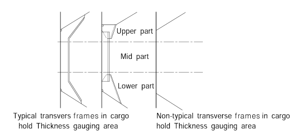 3. The single measurements recorded are to represent the average of multiple measurements. 4. The remaining corrosion addition is to be recorded with result of gauged thickness minus renewal thickness. If the result is negative, the structure in way shall be renewed, and the mark "R" is to be indicated in the right-hand column. If the result is between 0 and 0.5 mm (0 included), the structure in way shall be additional gauged, and the mark "S" is to be indicated in the right-hand column. * : delete as appropriate  |   |   |   |   |   |   |   |   |   |   |   |   |   |   |   |   |   |   |   |   |   |   |   |   |   |   |   |
