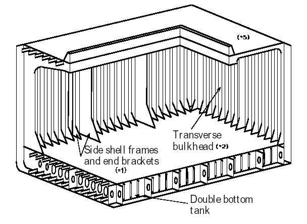
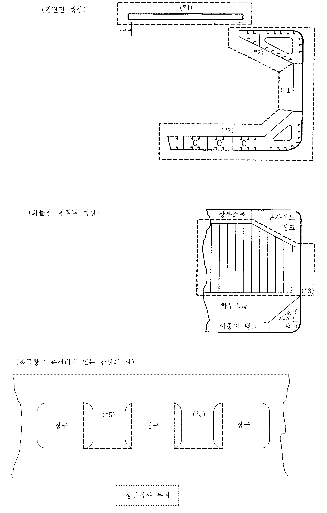
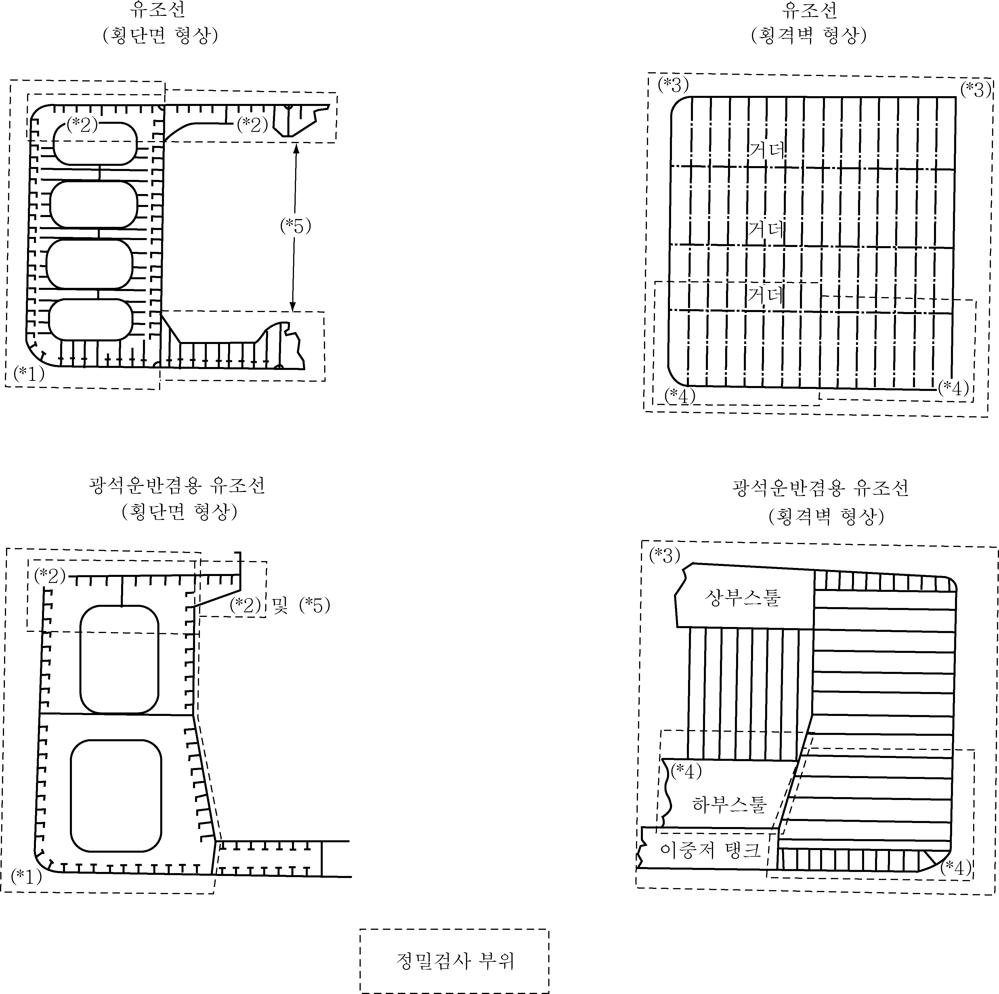
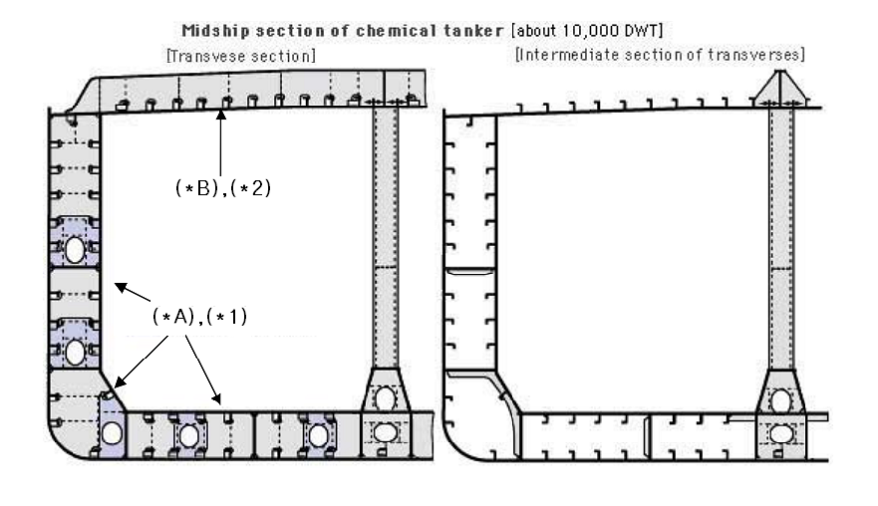
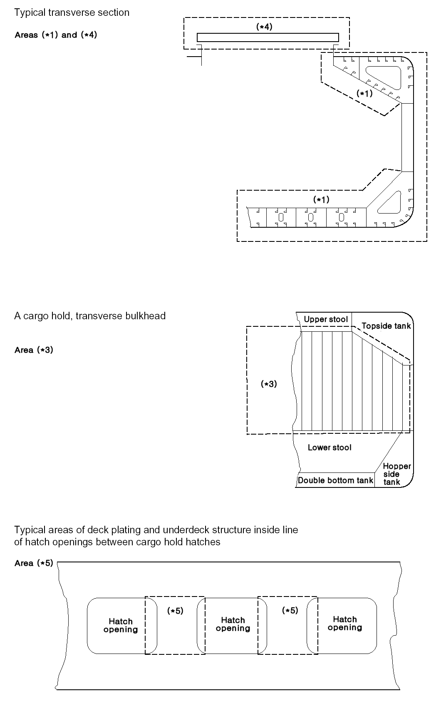

# 제1편 선급등록 및 검사

> 선급 및 강선규칙/적용지침 / RA-01-K / 2025 / KO / Guidance

## 부록 1-6 정밀검사 대상부위

### 1. 규칙 표 1.2.8, 표 1.3.1, 표 1.3.4, 표 1.3.7, 표 1.3.10 및 표 1.3.13에서 정하는 일반건화물선, 산적화물선, 유조선, 위험화학품 산적운반선, 이중선체 유조선 및 이중선체 산적화물선의 정밀검사 부위를 개략적인 그림으로 나타내면 다음과 같다.

#### (1) 일반건화물선의 정밀검사 대상부위

#### (2) ESP 부호를 갖는 산적화물선의 정밀검사 대상부위

#### (3) ESP 부호를 갖는 유조선의 정밀검사 대상부위

#### (4) ESP 부호를 갖는 케미컬탱커의 정밀검사 대상부위

#### (6) ESP 부호를 갖는 이중선체 산적화물선의 정밀검사 대상부위

