# 제1편 선급등록 및 검사

> 선급 및 강선규칙/적용지침 / RA-01-K / 2025 / KO / Guidance

## 부록 1-12-5 케이블 관통부 밀봉시스템 기록부 작성 예 (2021)

### 부록 1-12-1 조선소 검토 기록

| 조선소명 | 일자 |
| --- | --- |
|   |   |

#### 1. 경영시스템의 상세(Details of any management systems)

| 취득한 승인 | 승인기관 | 만료일자 | 비고(범위, 등) |
| --- | --- | --- | --- |
| ISO-9001 |   |   |   |
| ISO 14001 |   |   |   |
| ISO 45001 |   |   |   |
| 기타: |   |   |   |

#### 2. 건조시설(Construction Equipment): (이 항을 작성하는 대신 조선소의 브로슈어와 같은 문서를 첨부할 수 있다)

#### 2.1 선대 (B) 또는 독 (D) * 선대인 경우, 깊이는 해당 없음.

| B / D | 명칭 | 길이 ($\mathrm{m}$) | 폭 ($\mathrm{m}$) | 깊이**^*** ($\mathrm{m}$) | 건조 능력 (Gross Tonnage) | 크레인 (톤 x 개수) |
| --- | --- | --- | --- | --- | --- | --- |
|   |   |   |   |   |   |   |
|   |   |   |   |   |   |   |
|   |   |   |   |   |   |   |
|   |   |   |   |   |   |   |
|   |   |   |   |   |   |   |
|   |   |   |   |   |   |   |

#### 2.2 의장안벽(Outfitting Quays)

| 명칭 | 길이 ($\mathrm{m}$) | 폭 ($\mathrm{m}$) | 깊이 ($\mathrm{m}$) | 접안 능력 (Gross Tonnage) | 크레인 (톤 x 개수) |
| --- | --- | --- | --- | --- | --- |
|   |   |   |   |   |   |
|   |   |   |   |   |   |
|   |   |   |   |   |   |
|   |   |   |   |   |   |
|   |   |   |   |   |   |
|   |   |   |   |   |   |

#### 2.3 주요 제조 및 탑재시설(Main Fabrication and Erection Facilities)

| (1) 강판의 표시 및 절단(내부재 포함) - 표시방법 ( Manual, Photo x , EPM x , NC x others ) - NC 절단기계 ( Gas x , Plasma x , Laser x ) NC 관리절차 ( On-line, other ) - 절단설비 ( Edge planer x , Roll-shear x ) |
| --- |
| (2) 형강(section bar)의 표시 및 절단 - 표시방법 ( Manual, NC ) - 참조곡선의 표시 ( Manual, NC ) - 절단방법 ( Manual, NC ) - NC의 경우 ( Gas x , Plasma x ) |
| (3) 일면 자동용접기 ( Yes, No ) - 용접기의 형식 ( Flax Backing x , Flux and Copper Backing x other ) - 판 용접을 위한 특수표면판의 유무 ( Yes, No ) |
| (4) 필릿용접기 ( Gravity, Automatic ) 중력식을 제외한 자동화 비율 : 약 % - 선 용접기 ( No, Yes: submerged arc x heads, CO_2 x heads ) - 소형 자동필릿용접기 ( No, Yes: 명칭: x ) - 용접로봇 ( No, Yes: Portal x , Rectangular x , Articulated x ) |
| (5) 도장설비 - 판 숏블라스팅/프라이머 도장기계 ( No, Yes: 최대폭 $\mathrm{m}$, 길이 $\mathrm{m}$ ) - 형강 숏블라스팅/프라이머 도장기계 ( No, Yes: 최대길이 $\mathrm{m}$ ) - 특수도장 공장 ( No, Yes: $\mathrm{m}$ x $\mathrm{m}$ x sections ) |
| (6) 수직자동용접기 ( No, Yes: EG x , SEG x , ES x ) EG: Electrogas SEG: Simplified Electrogas ES: Electroslag |
| (7) 기타 주요제조시설 |

#### 3. 유자격 용접사에 대한 조선소의 관리(Shipyard control of Qualified Welders)

- **(1)** 일반강재(Normal steel)

  |   |   | 증서 | 추적성 | 감독 | 기량자격의 유지 |
  | --- | --- | --- | --- | --- | --- |
  | 조선소 작업자 | confirm system in place | Yes/No | Yes/No | Yes/No | Yes/No |
  | 외주 작업자 | confirm system in place | Yes/No | Yes/No | Yes/No | Yes/No |

#### 4. 건조절차의 특징(Feature of Construction Procedure)

| (1) 선체블록의 외주(중량) - 조립부재 ( No, Yes: 외주작업비율 %, 외주업체 수 ) - 블록 ( No, Yes: 외주작업비율 %, 외주업체 수 ) |
| --- |
| (2) 판블록 조립방법 - 연결된 패널 상에 종통재 및 트랜스버스웨브를 조립하고 용접하는 방법 - 트랜스버스웨브의 조립 및 용접 전에 연결된 패널 상에 종통재를 용접하는 방법 - 연결된 패널 상에 종통재 및 트랜스버스웨브로 구성된 프레임을 조립하고 용접하는 방법 - 트랜스버스웨브를 조립하고 용접하기 전에 선행 조립된 종통재와 함께 패널을 용접으로 연결하는 방법 - 기타(상세는 아래 (5)에 명기할 것) |
| (3) - 선행의장 시행 그랜드블록/메가블록 채택 선대/독에서 탑재하는 방법 - 탑재블록의 최대 무게 : 톤 - 선대/독/육상(land) 내 건조방법 ( 1척, 1.5척: Semi-tandem, dual entrance ) - 블록탑재절차 ( single starting block, multi starting blocks, inserting block : No, Yes ) |
| (4) 최종입거 ( No, Yes: In-house, Other place of the same company, Use other company ) |
| (5) 건조절차의 기타특징 |

#### 5. 품질관리체계(Quality Control System): (사용가능한 경우, 품질매뉴얼 참조)

| 항목 및 설명 | 결과 | 비고 |
| --- | --- | --- |
| (1) 설계, 구매, 생산 및 품질보증부서를 포함한 조직도의 유무 - 조직의 기능, 책임 및 권한이 명확한가? |   |   |
| (2) 품질관리조직 - 품질관리조직의 유무 - 이 조직의 인원수 - 시험 및 검사와 관련된 절차 또는 방안서의 유무 | 부서장을 포함한 인원수 명 |   |
| (3) 조선소의 자체검사체계 - 선급검사 전에 자체검사가 시행되는가? - 자체검사자가 지명되었는가? (목록 점검) - 자체검사자의 수 (선체관련 전담) - 검사결과가 검사대상에 표시 및/또는 점검표에 기록되는가? | 명 |   |
| (4) 검사 및 시험의 기록 - 기록이 적절히 작성되고 유지되는가? - 책임자가 기록을 검증하는가? - 발생된 부적합사항에 대하여 필요한 시정조치를 취하는 것이 점검되는가? |   |   |
| (5) 검사원 입회검사 시의 상태 - 검사계획이 자주 변경되는가? - 자체검사, 조선소검사 및 수리가 미리 종결되는가? - 발판, 조명, 청소 등 검사를 위한 충분한 준비가 이루어지는가? |   |   |
| (비고) (3) 및 (4)는 외주된 항목에 대한 검사에도 적용한다. |   |   |

#### 6. 안전 및 위생조치(Measures for Safety and Health)

| 항목 및 설명 | 결과 | 비고 |
| --- | --- | --- |
| (1) 발판, 안전망, 안전벨트, 조명 및 환기상태가 양호한가? |   |   |
| (2) 방사선투과시험 및 체리피커운행에 충분한 주의가 기울여지는가? |   |   |
| (비고) |   |   |

#### 7. 비파과검사의 관리체계(Control System of Non-Destructive Testing(NDT) )

| 항목 및 설명 | 결과 | 비고 |
| --- | --- | --- |
| (1) 조선소의 NDT 감독자 수(판정결과 책임자 포함) | 명 |   |
| (2) 외주된 NDT 작업 의존도 - 조선소 작업자의 수 - 외주 작업자의 수 | 명 명 |   |
| (3) NDT 외주업체 명칭 및 공식기술자격 | 명칭 (승인기관) 명칭 (승인기관) |   |
| (4) 조선소 NDT 요원의 공식기술자격 등급 및 수 방사선투과시험 전문 초음파탐상시험 전문 표면탐상시험 전문 | 등급 명 등급 명 등급 명 |   |
| (5) 만일 비파괴시험이 외주된다면, 공식기술자격요원의 등급 및 수 방사선투과시험 전문 초음파탐상시험 전문 표면탐상시험 전문 | 등급 명 등급 명 등급 명 |   |
| (6) 비파괴시험장비(조선소 보유) - 방사선투과시험 장비의 수 - 초음파탐상시험 장비의 수 |   |   |
| (비고) 모든 작업이 외주된 경우에도, 작업을 검증할 수 있는 자격요원을 배정할 것을 권고한다. |   |   |

#### 8. 생산라인의 품질관리(Quality Control on Production Line)

| 항목 및 설명 | 결과 | 비고 |
| --- | --- | --- |
| **8.1 잘못된 재료사용에 대한 방지책** |   |   |
| (1) 주문강판과 입고강판의 대조 및 재료시험성적서 검토의 감독관 및 담당자의 직책 | 감독관의 직책: 담당자의 직책: |   |
| (2) 높은 등급의 강으로 넘겨지는 재료의 등급을 확인하는 방법이 규정되었는가? |   |   |
| (3) 고장력강 및 저온용강의 재료등급을 확인하는 규정이 명시되었는가? 고장력강의 표면에 고장력강임을 표시하는 규정 및 저온용강에 특정 표시를 하는 규정이 있는가? |   |   |
| (4) 절단하고 남은 연강의 재사용을 위한 절차가 규정되었는가? |   |   |
| (5) 절단하고 남은 고장력강의 재사용을 위한 절차가 규정되었는가? |   |   |
| (6) (4) 및 (5)의 경우, 연강과 대조를 할 수 있는가? |   |   |
| (7) 절단하고 남은 강재의 목록을 관리하는 부서는? | 부서명: |   |
| (비고) - 고장력강의 경우, 다른 등급을 식별하는 방법은? - (3) 및 (4)의 경우, 타선급에 의하여 승인된 재료도 유사하게 관리되는가? |   |   |
| **8.2 숏블라스팅/프라이머 도장** |   |   |
| (1) 표면처리기준의 유무 |   |   |
| (2) 도장두께관리기준의 유무 - 두께계측기록의 유무 |   |   |
| (비고) - 기준에는 숏블라스팅 및 프라이머 도장 이후의 추적성과 관련된 설명이 포함되어야 한다. |   |   |

### 부록 1-12-2해상인명안전협약(SOLAS) 제2-1장 A-1편 3-10규칙(산적화물선 및 유조선에 대한 목표기반 선박건조기준) 적용대상 유조선 및 산적화물선에 대한 요건

#### 1. 신조활동에 대한 검사 및 시험방안서

- **1.1** 조선소는 선박의 종류 및 설계를 고려하여 우리 선급의 규칙에 따라 검사 및 시험을 받고자 하는 항목에 대하여 검사계획서로 알려져 있는 문서화된 계획을 제공하여야 한다. 이 검사계획서는 시작회의에서 검토되어야 하며 다음을 포함하여야 한다.
  - **1.1.1** 강제적으로 따라야 하는 선박건조기준에 적합하게 건조됨을 확실히 하기 위하여, 건조 중 검사의 범위와 항목의 명시 및 검사 동안에 특별한 주의가 필요한 부분의 식별을 포함한 일련의 요건
    .1 위치, 재료, 용접, 주조, 도장 등에 따른 검사의 종류(육안검사, 비파괴검사 등).
    .2 시작회의부터 모든 주요건조단계를 걸쳐 인도까지의 모든 조립단계에 대한 건조 중 검사일정의 설정
    .3 설계도면을 승인하는 동안에 식별된 취약지역에 대한 조항을 포함한 시험/검사 계획
    .4 검사합격에 대한 판정기준
    .5 검사결과에 대한 통보 및 문서화를 포함한 조선소와의 상호교류
    .6 건조결함을 고치기 위한 수정절차
    .7 일정이나 공식적인 검사를 요구하는 항목에 대한 목록
    .8 결정하는데 사용되는 판정기준을 포함하여, 선박의 일생동안 특별한 주의가 필요한 부분에 대한 결정 및 문서화
  - **1.1.2** 시험 판정기준을 포함하여, 검사 동안의 모든 종류의 시험을 위한 요건에 대한 설명.

#### 2. 설계투명성

- **2.1** 국제해사기구결의 IMO Res. MSC.287(87)(Adoption of the international goal-based ship construction standards for bulk carriers and oil tankers), IMO Res.MSC.290(87)(Adoption of amendments to the international convention for the safety of life at sea, 1974, as amended), IMO Res. MSC.454(100) (Revised guidelines for verification of conformity with goal-based ship construction standards for bulk carriers and oil tankers) 및 IMO MSC.1/Circ.1343(Guidelines for the information to be included in a ship construction file)에 적합하여야 하는 선박인 경우, 즉시 사용할 수 있어야 하는 문서에는 주요 목적기반 변수 및 선박의 운항을 제한할 수 있는 모든 관련 설계변수를 포함하여야 한다.

#### 3. 선박건조철(SCF)

- **3.1** 산적화물선 및 유조선에 대한 목표기반 선박건조기준의 기능적 요건이 선박설계 및 건조에 어떻게 적용되었는지에 대한 구체적인 정보가 포함된 선박건조철(SCF)은 신조선의 인도 시에 제공되어야 하며, 선박이 운항하는 동안 선박 및/또는 육상에 보관되고 적절히 최신화되어야 한다. 선박건조철의 내용은 다음 요건에 적합하여야 한다.
  - **3.1.1** 다음의 설계특정정보가 선박건조철(SCF)에 포함되어야 한다:
    .1 선박의 일생동안 특별한 주의가 필요한 부위.(구조적으로 취약한 지역 포함)
    .2 선박의 운항을 제한하는 모든 설계변수.
    .3 구조상세 및 계산서를 포함하여 규칙을 대체한 방안.
    .4 치수상세, 재료상세, 버트와 시임의 위치, 횡단면상세 및 모든 부분/완전 용입용접위치를 포함하고 건조공정 중에 인정기관 또는 기국에 의하여 승인된 모든 개조가 포함되었음이 검증된 완성도 및 정보.
    .5 모든 구조요소부분에 대한 순(신환)치수, 건조치수 및 자발적인 추가두께.
    .6 중립축구역의 신환치수, 갑판구역 및 선저구역의 면적 값과 같은 횡단면 상세를 포함하여 선박의 일생동안 유지되어야 하는 선박의 길이에 걸친 최소 선체거더 단면계수.
    .7 선체구조의 건조에 사용된 재료의 목록 및 선박운항의 일생동안 상기 사항의 변경을 문서화하기 위한 조항.
    .8 선체에 용접된 단강품 및 주조품 증서사본(국제선급연합회(IACS)의 통일규칙 (UR) W7(Hull and Machinery Steel Forging) 및 W8(Hull and Machinery Steel Casting)).
    .9 선박의 수밀 및 풍우밀보전성의 일부를 형성하는 설비의 상세.
- **9.1** 케이블 수밀 관통부 밀봉시스템 기록부는 조선소측에서 준비해야 하며 인쇄물 또는 전자파일의 형태로 제공 될 수 있다. 기록부의 예는 부록 1-12-5 “케이블 관통부 밀봉시스템 기록부 작성 예”를 참조한다.
  여기에는 선박에서 최종 검사 후 설치된 상태를 문서화하는 마크/식별 시스템, 설치된 각 케이블 관통부 형식에 대한 제조자 매뉴얼을 참조하는 문서, 관통부 형식에 대한 형식승인 증서, 적용 가능한 설치 도면 및 조선소에서 최종 설치 및 검사가 왼료된 상태의 각 관통부에 대한 기록을 포함한다.
  추가하여 기록부에는 검사, 변경, 수리 및 정비를 기록하기 위한 조항이 포함 되어야 한다. *(2021)*
  .10 시험요건의 상세를 포함한 탱크시험방안서(국제선급연합회 (IACS)의 통일규칙 (UR) S14 (Testing Procedures of Watertight Compartments)).
  .11 해당되는 경우 수중검사를 위한 상세, 잠수부를 위한 정보, 틈새계측지침 등, 탱크/구획경계.
  .12 입거검사계획서 및 입거 시 통상적으로 시험되는 모든 관통부의 상세.
  .13 국제해사기구(IMO)의 보호도장 성능기준(Performance Standard for Protective Coatings: PSPC2)) 적용대상선박인 경우 도장기술파일(Coating Technical File).
  - **3.1.2** 이에 추가하여 포함되어야 하는 정보의 상세는 이 부록의 **표 A**에 따른다. 이 정보는 안전운항, 정비, 검사, 수리 및 비상조치를 원활하게 하기 위하여 선박의 일생동안 선박 및/또는 육상에 보관되고 적절히 최신화 되어야 한다.
  - **3.1.3** 선박건조철 내용의 일부는 여러 등급으로 접근에 제한을 받을 수 있으므로 이러한 문서는 적절히 육상에 보관될 수 있다.
  - **3.1.4** 선박건조철에는 선박건조철을 구성하는 문서 및 선박의 안전운항, 정비, 검사, 수리와 비상상황을 위하여 요구되는 이 부록의 **표 A**에 나열된 모든 정보의 목록이 포함되어야 한다. 안전에 특별히 영향을 미치지 않는다고 여겨지는 특정 정보의 상세는 직접적으로 포함되거나 또는 다른 문서를 참조하도록 하여 포함될 수 있다.
  - **3.1.5** 선박건조철을 개발할 때는 모든 필요한 정보가 제공되었는지 확인하기 위하여 이 부록 **표 A**의 모든 칸에 대하여 검토되어야 한다.
  - **3.1.6** 둘 이상의 Tier II**^1)** 기능적 요건에 대하여 이 부록에 나열된 정보는 선박건조철 내에서 하나의 항목으로서 제공될 수 있다. 예를 들어, 보호도장 성능기준(PSPC**^2)**) 에서 요구하는 도장기술파일은 “도장수명” 및 “건조중 검사”의 양쪽에 해당된다.
  - **3.1.7** 선박건조철은 선박의 일생동안 본선에 보관되어야 하고, 이에 추가하여 우리 선급 및 기국에서 사용가능하여야 한다. 본선에 보관될 필요가 없다고 여겨지는 정보가 육상에 보관되는 경우, 이러한 정보에 접근하기 위한 절차가 본선의 선박건조철에 명시되어야 한다. 선박건조철의 범위 안에서 지적소유권에 대한 규정은 정히 적용되어야 한다.
  - **3.1.8** 선박건조철은 선박의 일생동안 대폭적인 수리나 개조에 국한되지는 않지만 이를 포함하여 주요 사건 또는 선체구조에 대한 변경이 있는 경우 최신화되어야 한다.
- **3.2** 선박건조철은 신조시 3.1.1 및 3.1.2의 요구사항에 따라 검토^3) 되어야 하며 통상의 보관장소는 식별되어져야 한다. *(2018)*
  - **3.2.1** 본선에 비치된 선박건조철의 경우, 검사원은 선박건조 완료시 해당정보가 본선에 비치된 선박건조철 내에 포함되어 있는지 검증하여야 한다.
  - **3.2.2** 선박건조철 육상보관소에 비치된 선박건조철의 경우, 검사원은 또한 선박건조 완료시 육상보관소의 선박건조철 정보목록을 검사하여 해당정보가 포함되어 있는지 검증하여야 한다.
    (비고)
    **^1)** Tier II 항목이라 함은 국제해사기구결의(IMO Res. MSC.287(87))로 채택된 산적화물선 및 유조선에 대한 목표기반 선박건조기준(GBS)에 포함된 기능적 요건을 말한다.
    **^2)** 국제해사기구결의(IMO Res.MSC.215(82))로 채택된 모든 형식의 선박의 전용 해수평형수탱크 및 산적화물선의 이중선측구역의 보호도장에 대한 성능기준 및 국제해사기구결의(IMO Res.MSC.288(87))로 채택된 원유탱커 화물유탱크의 보호도장에 대한 성능기준
    **^3) 검토**란 신조검사의 마지막 절차로 다음의 항목을 확인하기 위하여 검사원이 실시하는 선박건조철의 검사를 의미한다.
    - 이 부록 3.항 “선박건조철(SCF)”에서 요구하는 도면 과 서류 및
    - 선박건조철의 도면/문서 목록에 따라 조선소가 본선 및 선박건조철 육상보관소에 사본의 형태로 추가 제 공한 도면 및 서류
    검토는 적용되는 규칙이나 규정이 적합한지를 검증하기 위하여 도면/문서를 평가하는 것은 아니다. *(2018)*

#### 4. 검사원의 수에 대한 결정

우리 선급은 신조업무에 대하여 검사계획에서 합의된 검사 및 시험의 적절한 범위에 대응하기 위하여 각 선박의 건조절차에 따라서 적절한 수의 유자격 검사원을 선정한다.

### 부록 1-12-3 선박건조철 양식 예

Ship Construction File

| M / V | " " |
| --- | --- |
| IMO No.: |   |
| Hull No.: |   |

Shipbuilder :
The shipbuilder is to deliver documents for the Ship Construction File. In the event that items have been provided by another party such as the shipowner and where separate arrangements have been made for document delivery which excludes the shipbuilder, that party has the responsibility.
It is recognized that the purpose of documents held in the Ship Construction File on board the ship, is to facilitate inspection(survey) and repair and maintenance, and therefore, is to include but not to limited to:
* : requirements for tankers and bulk carriers subject to SOLAS Ch II-1 Pt A-1 Reg.3-10(Goal-based ship construction standards for bulk carriers and oil tankers) only

#### 1. Final Drawings:

As-built structural drawings including scantling details, material details, and, as applicable, wastage allowances, location of butts and seams, cross section details and locations of all partial and full penetration welds, areas identified for close attention(for general dry cargo ships, liquefied gas carriers and ships subject to the enhanced survey programme) and rudders

- **(1)** Approved plans of critical areas if applicable
- **(2)** Hatch cover structural drawings and details if applicable
- **(3)** Rudder structural drawings and details
- **(4)** Freeboard marks and draft marks details
- **(5)** Principal dimensions details
- **(6)** Areas requiring special attention throughout the ship's life(including critical structural areas)*
- **(7)** All design parameters limiting the operation of a ship*
- **(8)** Any alternatives to the Rules, including structural details and equivalency calculations*
- **(9)** Plan showing highly stressed area(e.g. critical structural area) prone to yielding, buckling, fatigue and/or excessive corrosion*
- **(10)** Dangerous area plan*
- **(11)** Non-destructive testing plan*
  List of Final Drawings

  | Serial No. | DWG No. | Title of DWG | DWG Box No. |
  | --- | --- | --- | --- |
  |   |   |   |   |
  |   |   |   |   |
  |   |   |   |   |

#### 2. Manuals required for classification and statutory requirements, e.g. loading and stability, bow doors and inner doors and side shell doors and stern doors – operations and maintenance manuals(IACS UR S8(Bow Doors and Inner Doors) and S9(Side Shell Doors and Stern Doors)), including ship structures access manual, as applicable.

List of Manuals

#### 3. Copies of certificates of forgings and castings welded into the hull(IACS UR W7(Hull and Machinery Steel Forging) and W8(Hull and Machinery Steel Casting))

List of Copies of Certificates

#### 4. Details of equipment forming part of the watertight and weather tight integrity of the ship(e.g. overboard discharges, air pipes, ventilators, cable transit sealing systems) (2021)

1) List of Drawings or Copies of Certificates

#### 5. Tank testing plan including details of the test requirements(IACS UR S14 (Testing Procedures of Watertight Compartments))

#### 6. Corrosion prevention specifications(IACS UR Z8(Corrosion Protection Coating for Salt Water Ballast Spaces) and Z9(Corrosion Protection Coatings for Cargo Hold Spaces on Bulk Carriers))

#### 7. Details for the in-water survey, if applicable, information for divers, clearances measurements instructions etc., tank and compartment boundaries.

#### 8. Docking plan and details of all penetrations normally examined at drydocking.

#### 9. Coating Technical File, for ships subject to compliance with the IMO Performance Standard for Protective Coatings(PSPC)

#### 10. Lines plan or equivalent(hull form data stored within an onboard computer necessary for trim and stability and longitudinal strength calculations)*

#### 11. Intellectual property provisions*

#### 12. Summary, location and access procedure for part of Ship Construction File (SCF) information on shore*

#### 13. Documents required by Table A in Annex 1-12 of KR Guidance Relating to the Rules for the Classification of Steel Ships, Pt 1 as "SCF-specific" (see, NOTE 1 of the Table A)*

*

### 부록 1-12-4 선종별 대표적인 취약한 지역 (2018)

#### 1. 지침 1-12 표 1에서 언급하는 산적화물선, 광석운반선, 유조선/케미컬 탱커, 초대형 유조선 및 액화가스 산적운반선, 자동차운반선 및 컨테이너선의 대표적인 취약한 부위의 예를 개략적인 그림으로 나타내면 다음과 같다.

- **(1)** 산적화물선
  
- **(2)** 광석운반선

  | **1. Critical Web Section** |
  | --- |
  | 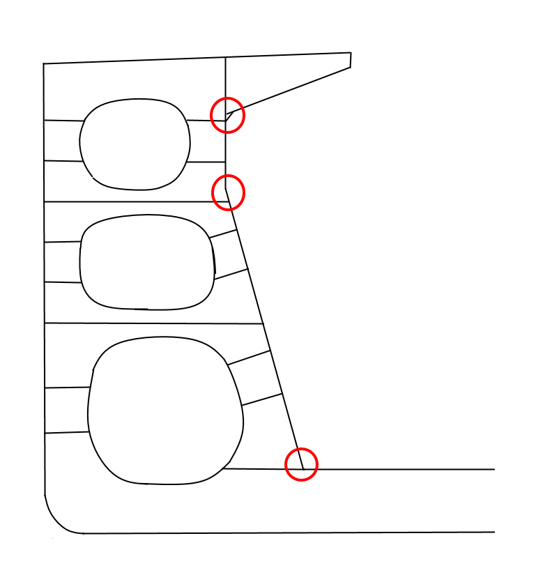 |
  | **2. Stringer** |
  | 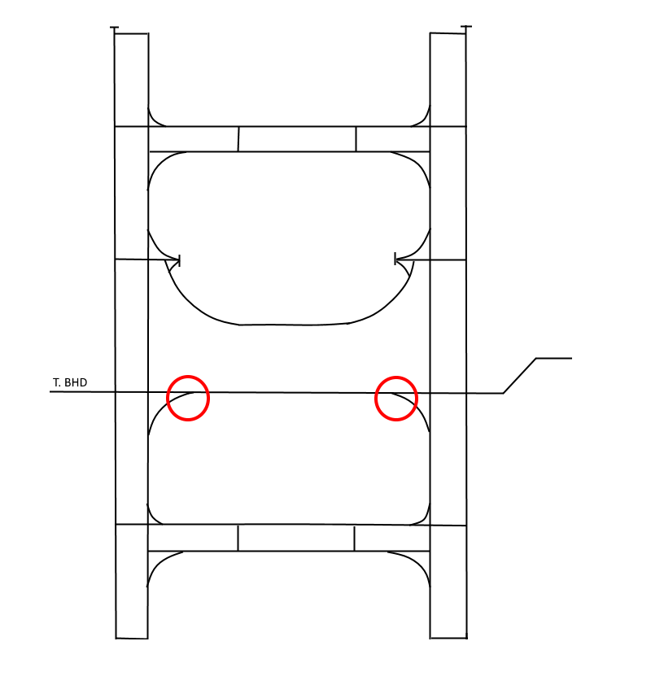 |

  | **3. Hatch Coming, Upper Stool and Lower Stool** |
  | --- |
  | 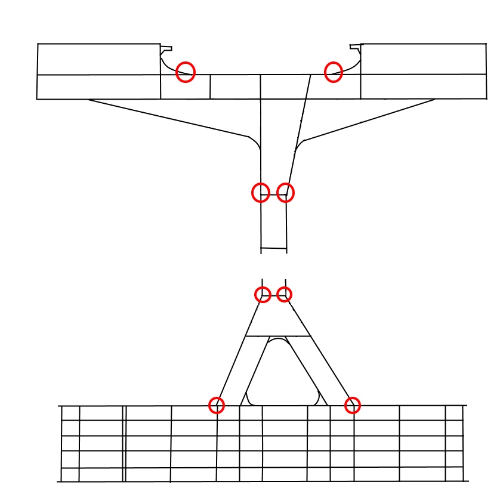 |
  | **4. Typical Girder Elevation** |
  | 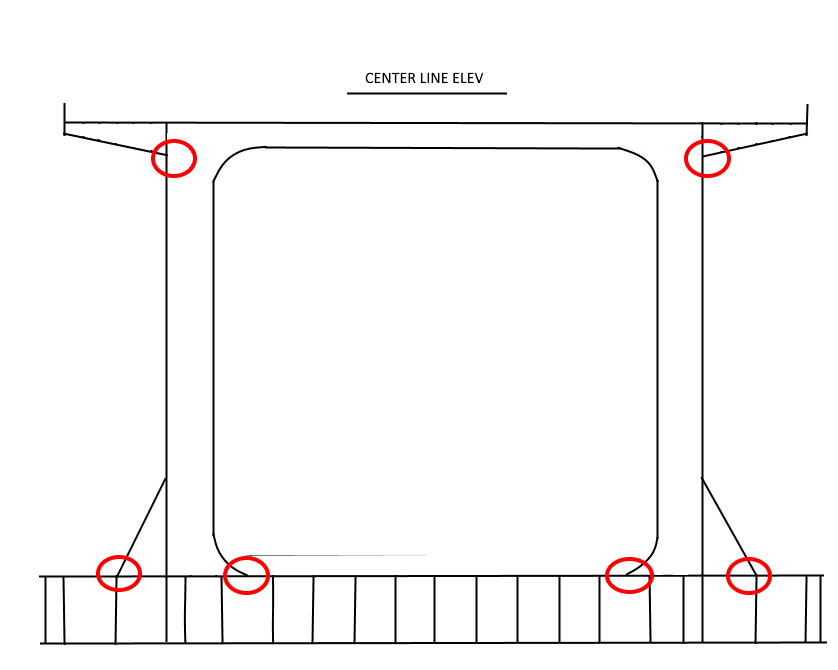 |

  | (3-1) 유조선/케미컬탱커 | (3-2) 초대형 유조선(VLCC) |
  | --- | --- |
  |  | 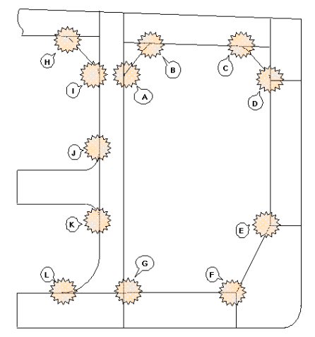 |
  | (4) 액화가스 산적운반선 |   |
  |  |   |

  **(5) 자동차 운반선**

  | **1. Typical Web Section** |   |
  | --- | --- |
  | 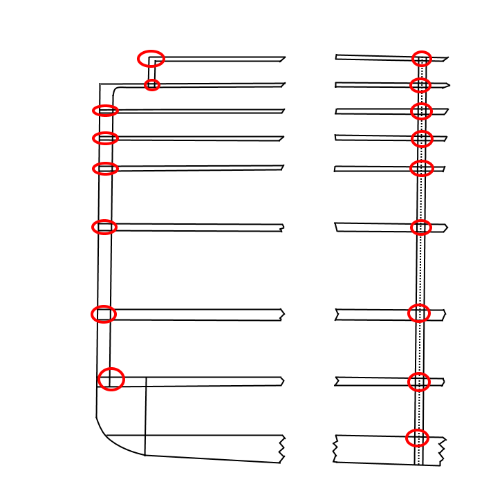 |   |
  | **2. Side Girder Elevation** | **3. Web Section in Engine Room Area** |
  | 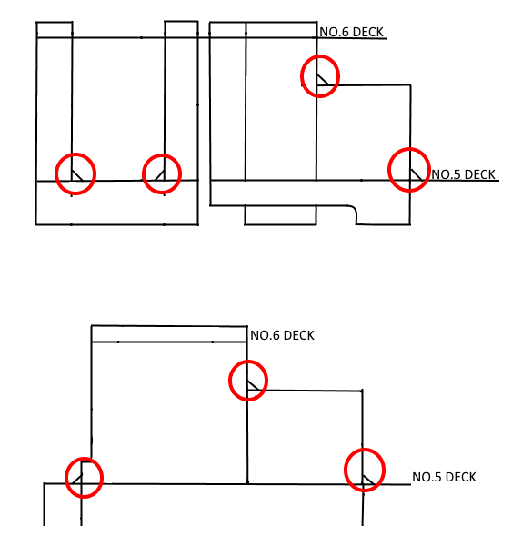 | 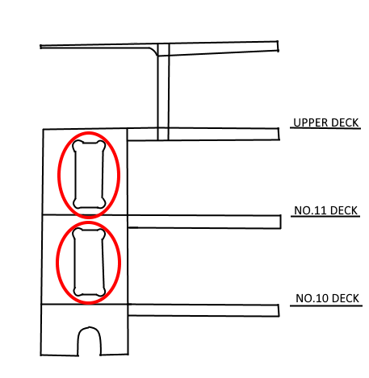 |

  **(6) 컨테이너선**

  | **1. Hatch Coaming** |   |
  | --- | --- |
  | Continuous both side welding area of extremely thick steel plates |  |
  | Hatch Coaming Extension Bracket Area |  |
  | Hatch Coaming Drain Hole |  |

  **2. Trans Web Section**

  | Joint between Inner Bottom and Hopper or Joint between Longi. BHD and Bench Deck |  |
  | --- | --- |
  | Bench구조 이면의 Web보강 Bracket (Web Reinforcement Bracket Behind Bench Structure) |  |
  | **3. Bracket + Bulkhead** |   |
  | Bracket provided between Longi. BHD and Transverse BHD |  |
  | Bracket provided between Longi. BHD and Transverse BHD |  |

  **4. Double Bottom Girder & Vertical Web (W. T. BHD)**

  | Double Bottom Girder + Vertical Web (W. T. BHD) |  |
  | --- | --- |
  | **5. W. T. BHD + Double Bottom Floor** |   |
  | Support Bulkhead |  |

  **6. Upper Deck + Hatch End Coaming (Cargo Hatch Corners)**

  | Cargo Hatch Corners | 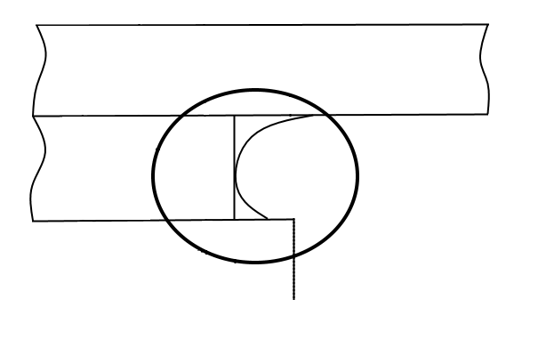 |
  | --- | --- |
  | **7. Upper Deck + Cross Deck** |   |
  | Upper Deck + Cross Deck | 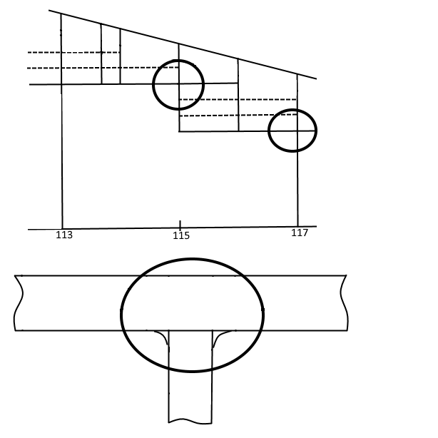 |
  | **8. Side shell Longitudinal + Transverse Web** |   |
  | Side Shell Longitudinal + Transverse Web | 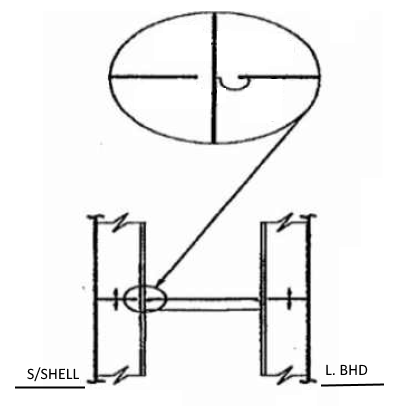 |

  |   | **부록 1-12-5 케이블 관통부 밀봉시스템 기록부 작성 예** ***(2021)*** |   |   |   |   |   |   |   |   |   |   |   |   |   |   |   |
  | --- | --- | --- | --- | --- | --- | --- | --- | --- | --- | --- | --- | --- | --- | --- | --- | --- |
  |   | **부록 1-12-5 케이블 관통부 밀봉시스템 기록부 작성 예** ***(2021)*** |   |   |   |   |   |   |   |   |   |   |   |   |   |   |   |
  |   |   |   |   |   |   |   |   |   |   |   |   |   |   |   |   |   |
  |   |   |   |   |   |   |   |   |   |   |   |   |   |   |   |   |   |
  |   | **Name of Ship:** | Sample |   |   |   |   |   |   |   |   |   |   |   |   |   |   |
  |   | **IMO No:** | 12345 |   |   |   |   |   |   |   |   |   |   |   |   |   |   |
  |   | **Place:** | Hamburg |   |   |   |   |   |   |   |   |   |   |   |   |   |   |
  |   | **Date:** | XX/XX/2017 |   |   |   |   |   |   |   |   |   |   |   |   |   |   |
  |   |   |   |   |   |   |   |   |   |   |   |   |   |   |   |   |   |
  |   | **Inspected by:** | Smith |   |   |   |   |   |   |   |   |   |   |   |   |   |   |
  |   |   |   |   |   |   | Transits | 4 |   |   |   |   |   |   |   |   |   |
  |   |   |   |   | Total Openings |   |   | 4 |   |   |   |   |   |   |   |   |   |
  | TRANSIT **1 편 선급등록 및 검사** **부록 1-12-5 케이블 관통부 밀봉시스템 기록부 작성 예 1 편 부록 1-12-5** |   |   | Inspected side |   | BRAND | FRAME |   | Type Approved | CONDITION(G,F,P) | INSPECTED | REPAIRED | MODIFIED | MAINTAINED |  | Checked by | DATE |
  | Drawing number | ID | Location |   |   | BRAND | Type | Opening number | Type Approved | CONDITION(G,F,P) | INSPECTED | REPAIRED | MODIFIED | MAINTAINED |   | Checked by | DATE |
  |   |   |   | F | B |   |   |   |   |   |   |   |   |   |   |   |   |
  | GIA-07-1047-000-883 | TT-MCT-011 |   |   |   | C | d= 50 | x |   |   |   |   |   |   | NVD | PTO | 2015-02-26 |
  | GIA-07-1047-000-883 | TT-MCT-012 |   |   |   | C | 450x200 | x |   |   |   |   |   |   | NVD | PTO | 2015-02-26 |
  | GIA-07-1047-000-883 | TT-MCT-013 |   |   |   | C | 550x200 | x |   |   |   |   |   |   | NVD | PTO | 2015-02-26 |
  | GIA-07-1047-000-883 | TT-MCT-014 |   |   |   | C | 750x200 | x |   |   |   |   |   |   | Open, drilled hole not closed | PTO | 2015-02-26 |
  |   |   |   |   |   |   |   |   |   |   |   |   |   |   |   |   |   |
  |   |   |   |   |   |   |   |   |   |   |   |   |   |   |   |   |   |
