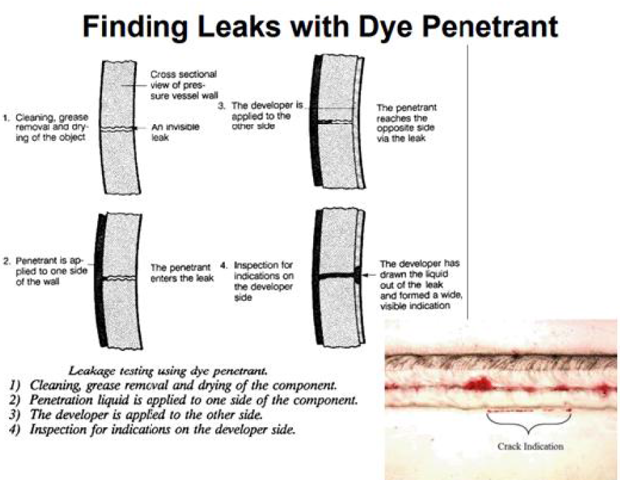

# 제1편 선급등록 및 검사

> 선급 및 강선규칙/적용지침 / RA-01-K / 2025 / KO / Guidance

## 부록 1-16 탱크 및 밀폐경계에 대한 시험절차 (2018)

### 1. 일반사항

#### (1) 탱크 및 밀폐경계에 대한 시험절차는 아래와 같이 A편, B편 및 C편으로 구분한다. (2024)

- **(가)** **A편** – 해상인명안전협약(SOLAS) 적용대상선박(산적화물선 및 유조선에 대한 국제선급연합회(IACS) 공통구조규칙(규칙 13편) 포함)
- **(나)** **B편** – 해상인명안전협약(SOLAS) 면제 또는 동등물 규정이 적용되는 선박. *(2024)*
- **(다)** **C편** - 해상인명안전협약(SOLAS) 비 적용대상선박 *(2024)*

#### (2) 해상인명안전협약(SOLAS) 적용대상선박(산적화물선 및 유조선에 대한 국제선급연합회(IACS) 공통구조규칙(규칙 13편) 포함))에 대한 수밀구획(watertight compartments)의 시험절차는 다음의 경우를 제외하고는 A편에 따른다. (2021)

- **(가)** 선주가 기국에 해상인명안전협약(SOLAS) 제2-1장, 11 규칙 적용의 면제를 기국으로 요청하는 것에 동의하거나 또는 B편의 내용이 해상인명 안전협약(SOLAS) 제2-1장, 11 규칙과 동등하다는 것에 대하여 기국으로 동등물의 인정을 요청하는 것에 관한 선주동의서를 조선소가 제출하고
- **(나)** 위에서 언급한 면제 또는 동등물 규정과 관련하여 기국이 승인한 경우

#### (3) 아래의 조건에 포함되는 해상인명안전협약(SOLAS) 적용대상선박(산적화물선 및 유조선에 대한 국제선급연합회(IACS) 공통구조규칙(규칙 13편 포함)은 B편에 따라 수밀구획(watertight compartments)의 시험절차가 시행되어야 한다. (2024)

- **(가)** 선주가 기국에 해상인명안전협약(SOLAS) 제2-1장, 11규칙 적용의 면제를 기국으로 요청하는 것에 동의하거나 또는 B편의 내용이 해상인명 안전협약(SOLAS) 제2-1장, 11규칙과 동등하다는 것에 대하여 기국으로 동등물의 인정을 요청하는 것에 관한 선주동의서를 조선소가 제출하고
- **(나)** 위에서 언급한 면제 또는 동등물 규정과 관련하여 기국이 승인한 경우

#### (4) 해상인명안전협약(SOLAS) 비 적용대상선박의 경우, 탱크 및 밀폐경계에 대한 시험절차는 C편에 따라 시행되어야 한다. (해상인명안전협약(SOLAS) 제1장, 제1규칙 및 제3규칙 참조.) (2024)

A편 - 해상인명안전협약(SOLAS) 적용대상선박

### 1. 일반사항

#### (1) 이 시험절차의 목적은 탱크와 수밀경계의 수밀성 및 선박의 수밀구획(watertight subdivisions, 여기서 수밀구획(watertight subdivision)은 SOLAS 제2-1장의 구획요건에 만족하기 위하여 요구되어지는 주 횡격벽과 종격벽을 의미한다.)의 일부를 구성하는 탱크의 구조적 적합성을 확인하기 위함이다. 이 시험 절차는 구조 및 갑판의장의 풍우밀성을 검증하는데도 적용될 수 있다. (2024)

신조선 및 주요 개조 또는 주요 수리(구조건전성에 영향을 주는 수리)에 해당하는 선박의 모든 탱크와 수밀경계의 밀폐성은 선박의 인도전에 이 시험절차에 따라 확인되어야 한다. *(2021)*

#### (2) 해상인명안전협약(SOLAS) 적용대상선박(산적화물선 및 유조선 에 대한 국제선급연합회(IACS) 공통구조규칙(규칙 13편) 포함)에 대한 수밀구획(watertight compartments)의 시험절차는 다음의 경우를 제외하고는 A편에 따른다. (2021)

- **(가)** 선주가 기국에 해상인명안전협약(SOLAS) 제2-1장, 11규칙 적용의 면제를 기국으로 요청하는 것에 동의하거나 또는 B편의 내용이 해상인명 안전협약(SOLAS) 제2-1장, 11규칙과 동등하다는 것에 대하여 기국으로 동등물의 인정을 요청하는 것에 관한 선주동의서를 조선소가 제출하고
- **(나)** 위에서 언급한 면제 또는 동등물 규정과 관련하여 기국이 승인한 경우

### 2. 적용

#### (1) 모든 중력식 탱크(70 kPa을 넘지 않는 증기압을 받는 탱크)와 수밀 또는 풍우밀이 요구되는 경계는 이 절차에 따라 시험되어야 하고, 다음의 밀폐성과 구조적합성이 확인되어야 한다.

⋅중력식 탱크에 대한 밀폐성 및 구조적합성

#### (2) 액화가스 산적운반선의 화물격납설비의 시험은 7편 5장 420.에서 426.의 시험요건에 따른다.

#### (3) 표 1 또는 표 2에 명시되지 않은 구조의 시험은 특별히 고려되어야 한다.

### 3. 시험의 종류 및 정의

#### (1) 시험 유형

- **(가)** 구조시험 : 탱크의 구조적합성을 검증하기 위한 시험이며 수압시험 또는 수압-공기압시험(상황이 보증되는 경우) 으로 할 수 있다.
- **(나)** 누설시험 : 경계의 밀폐성을 검증하기 위한 시험으로 특정시험이 지정되지 않은 경우, 수압시험, 수압-공기압시험 또는 공기압시험으로 할 수 있다. 사수시험은 **표 1**의 비고 (3)에 규정된 바와 같이, 특정 경계에 대한 누설시험의 허용 가능한 형식으로 고려 될 수 있다.

#### (2) 각 시험의 정의는 다음에 따른다.

| 시험방법 | 시험유형 | 정의 |
| --- | --- | --- |
| 수압시험 (hydrostatic) | 누설 및 구조 | 구역에 특정 수두(water head)까지 액체를 채우는 시험 |
| 수압-공기압시험 (hydropneumatic) | 누설 및 구조 | 구역에 부분적으로 액체를 채우고 공기압을 부가하는, 수압시험과 공기압시험을 조합한 시험 |
| 사수시험(hose) | 누설 | 물분사하는 반대편에서 용접이음부를 육안으로 확인하여 용접이음부의 밀폐성을 검증하기 위한 시험 |
| 공기압시험(air) | 누설 | 공기압 차이와 누설 탐지 용액을 사용하여 밀폐성을 검증하는 시험으로 탱크 공기압시험 및 용접이음부 공기압시험 (압축공기압 필릿용접부 시험과 진공상자시험)을 포함한다. |
| 압축공기압 필릿용접부 시험 (compressed air fillet weld) | 누설 | 필릿용접부상에 누설 탐지 용액을 적용하는 필릿용접 이음부의 공기압시험 |
| 진공상자시험 (vacuum box) | 누설 | 용접부에 누설 탐지 용액을 도포하고 용접이음부를 상자로 덮는 시험. 누설을 탐지하기 위하여 상자 내부는 진공을 형성한다. |
| 초음파시험 (ultrasonic) | 누설 | 초음파 탐지기술을 이용하여 창구덮개와 같은 폐쇄장치의 밀폐를 검증하는 시험 |
| 침투시험 (penetration) | 누설 | 저 표면장력 유체(low surface tension liquids)를 사용하여 구획의 경계에 존재하는 연속적인 누설을 액체침투지시가 없음을 육안으로 확인하여 검증하는 시험(즉, 액체침투탐상검사) |

#### (3) “넘침의 정부(top of the overflow)”는 탱크의 과 주입을 방지하는 데 사용되는 넘침시스템의 정부로 정의된다.

이러한 시스템은 넘침관, 공기관, 중간탱크가 될 수 있다. 중력탱크 (예: 펌프를 통해 채워지지 않은 분뇨(sewage), 중수(grey water) 및 유사 탱크)의 경우, 넘침의 정부는 주입관의 가장 높은 지점으로 한다.

### 4. 시험절차

#### (1) 일반

시험은 모든 창구, 문, 창문 등이 설치되고 관의 연결부를 포함한 모든 관통부가 설치되어 작업이 거의 완료된 단계에서, 그리고 용접이음부 위로 어떠한 내장(ceiling) 및 시멘트 작업이 적용되기 전에 검사원이 현장에 입회하여 진행되어야 한다. 특정 시험 요건은 (4)호 및 **표 1**에 따른다. 도장 적용 시기와 용접이음부로의 안전한 접근설비의 준비에 대하여는 (5)호, (6)호 및 **표 3**을 참조한다.

#### (2) 구조시험 절차

- **(가)** 시험의 유형 및 시기
  - **(a)** **표 1** 또는 **표 2**에 구조시험이 명시되어있는 경우, (4)호 (가)에 따른 수압시험을 할 수 있다. 실제적인 제한( 선대의 강도, 액체의 밀도 등)으로 수압시험의 시행이 어려운 경우, (4)호 (나)에 따른 수압-공기압시험으로 대신 할 수 있다.
  - **(b)** 선박이 진수되기 전에 누설시험이 만족스러운 것으로 확인된 경우, 구조적합성을 확인하기 위한 수압시험 또는 수압-공기압시험은 선박이 진수된 상태에서 수행할 수 있다.
  - **(c)** 복합재료 제조업체의 권고사항에 따라 유리 강화플라스틱(GRP) 및 섬유 강화플라스틱(FRP)과 같은 복합재료로 제작된 탱크는 대체할 수 있는 동등한 탱크시험 절차를 고려할 수 있다. *(2024)*
  - **(d)** 다음의 규칙에 따라 코퍼댐이 면제된 경우, 1 m 증가된 시험 압력으로 구조시험이 실시되어야 한다. *(2025)*
    - **규칙 3편 15장 3절 304.**
    - **규칙 10편 15장 3절 304.**
    - **규칙 13편 1부 2장 3절 1.2.4**
    - **규칙 14편 2장 3절 1.2.4**
    - **규칙 15편 2장 3절 1.2.4**
- **(나)** 신조선 또는 주요 구조개조에 대한 시험일정
  - **(a)** 액체를 넣을 것을 목적으로 하는 탱크로서 선박의 수밀구획(watertight subdivision)의 일부를 형성하는 것은 수밀 및 구조강도의 확인을 위하여 **표 1** 및 **표 2**에 따른 시험을 실시해야 한다. *(2021)*
  - **(b)** 탱크경계는 최소한 한쪽면을 시험하여야 한다. 구조시험에서는 예상되는 인장과 압축에 대하여 대표적인 구조부재가 모두 시험될 수 있도록 탱크를 선택하여야 한다.
  - **(c)** 탱크가 아닌 구역의 수밀경계의 경우 구조시험은 면제될 수 있으며, 면제된 구역의 경계에 대하여는 누설시험 및 검사로써 수밀성이 검증되어야 한다. 평형수화물창, 체인로커 및 항내에서 평형수를 적재하도록 지정된 화물창 중에서 하나의 화물창은 구조시험이 면제되지 않으며 (a)에서 (b)까지의 탱크 구조시험 요건을 적용하여야 한다.
  - **(d)** 수밀구획(watertight subdivision)의 일부를 형성하지 않는 탱크의 경우, 면제된 구역의 수밀경계면을 누설시험과 검사로 확인이 되었다면 구조시험은 면제될 수도 있다. *(2021)*

#### (3) 누설시험 절차

- **(가)** **표 1**에 명시된 누설시험의 경우, (4)호 (라)부터 (바)까지에 따른 탱크 공기압시험, 압축공기압 필릿용접부 시험, 진공상자시험 또는 이 시험들의 조합이 적용 가능하다. 수압시험 또는 수압-공기압시험이 (5)호, (6)호 및 (7)호를 따르는 경우, 누설시험으로 적용가능하다. **표 1**에서 비고 (3)이 부기된 위치의 경우 (4)호 (다)에 따른 사수시험도 가능하다. 각 형상별 용접이음부에 대한 누설시험의 적용에 대하여는 **표 3**에 명시되어 있다.
- **(나)** 용접이음부의 밀폐성에 영향을 미칠 수 있는 블록에 대한 모든 작업이 시험 이전에 완결된다면, 용접이음부의 공기압시험은 블록 단계에서 시행할 수 있다.(최종 도장 적용에 관하여는 (5)호 (가), 용접이음부로의 안전한 접근설비에 관하여는 (6)호, 그리고 **표 3**의 요약 참조)

#### (4) 시험방법

- **(가)** 수압시험
  - **(a)** 승인된 다른 액체가 없는 한, 수압시험은 시험구역에 적절한 청수 또는 해수를 **표 1** 또는 **표 2**에 규정한 수위까지 채워서 시행한다. 또한 **4.** (7) “수압 또는 수압-공기압 밀폐성 시험”을 참조한다.
  - **(b)** 해수보다 더 큰 화물밀도를 가지는 탱크로 설계된 경우, 청수 또는 해수로서 시험을 하여야 하며, 시험 압력 높이는 가능한 한 큰 화물밀도에 대한 실제 하중에 가깝게 시험을 한다. 그러나 시험압력은 탱크 정부에서 최대설계 내압을 초과하지 않아야 한다. *(2024)*
  - **(c)** 시험구역의 모든 외부표면은 구조적인 변형, 팽창, 좌굴, 기타의 관련된 손상 및 누출의 유무를 확인 하여야 한다.
- **(나)** 수압-공기압시험
  - **(a)** 수압-공기압시험은 승인된 액체의 수두에 공기압을 추가한 시험 조건이 실행 가능한 한 실제 하중을 나타낼 수 있어야 한다. (라)의 규정은 수압-공기압 시험에도 적용한다. 또한 **4.** (7) “수압 또는 수압-공기압 밀폐성 시험”을 참조한다.
  - **(b)** 시험구역의 모든 외부표면은 구조적인 변형, 팽창, 좌굴, 기타의 관련된 손상 및 누출의 유무를 확인 하여야 한다.
- **(다)** 사수시험
  - **(a)** 사수시험은 시험 동안에 호스 노즐압력을 최소한 0.2 MPa로 유지하여야 한다. 노즐은 내부 지름이 최소 12 $\mathrm{mm}$이어야 하며 용접이음부와의 수직거리는 1.5 $\mathrm{m}$를 넘지 않아야 한다. 물분사는 용접부에 직접 사수하여야 한다.
  - **(b)** 기 설치된 기관, 전기설비 절연재 또는 의장품에 손상을 주지 않고 사수시험을 할 수 없는 경우, 용접 연결부에 대한 주의 깊은 육안검사로 대체 할 수 있다. 필요한 경우 침투탐상시험 또는 초음파 누설시험 이나 동등한 시험을 요구할 수 있다.
- **(라)** 탱크 공기압 시험
  - **(a)** 모든 경계의 용접부, 탑재용접이음부 및 관의 연결부를 포함한 관통부는 승인된 절차에 따르며, 대기압과의 차이가 +15 kPa 이상의 안정된 압력 하에 비눗물/세제 또는 전용제품과 같은 누설탐지용액을 도포하여 검사하여야 한다.
  - **(b)** 시험압력에 해당하는 수두를 유지하기 위하여 충분한 높이의 U자관을 설치하여야 한다. U자관의 횡단면적은 탱크에 공기를 공급하는 관의 횡단면적보다 커야한다. U자관 대신에 두 개의 압력게이지를 사용하는 경우, 요구되는 시험압력을 검증하기 위해 두 개의 교정된 압력게이지의 배치는 국제선급연합회(IACS)의 권고사항 Rec. No.140(Recommendation for Safe Precautions during Survey and Testing of Pressurized Systems)의 조항 F5.1과 F7.4를 고려해서 인정할 수 있다. *(2020)*
  - **(c)** 시험 용접부는 이중검사를 실시하여야 한다. 첫 번째 검사는 누설탐지용액을 도포하는 즉시 실시하며, 두 번째 검사는 나타나는데 시간이 걸릴 수 있는 작은 누설을 검출하기 위하여 약 4∼5분 후에 실시하여야 한다.
- **(마)** 압축공기압 필릿용접부 시험
  이 공기압 시험에서, 압축공기를 필릿 용접이음부의 한쪽 끝단에서 주입하며. 용접이음부의 다른 쪽 끝단에서 압력게이지로서 검증한다. 압력게이지는 시험되는 부분내의 모든 공기통로의 각 끝단에서의 공기압이 최소 15 kPa 이상인지를 검증할 수 있도록 배치되어야 한다.
  (비고) 누설시험이 부분용입용접부에 요구되고 루트면이 큰(6∼8 $\mathrm{mm}$) 경우, 압축공기압 시험이 필릿용접부에서와 동일한 방식으로 적용되어야 한다.
- **(바)** 진공상자시험
  공기연결부, 게이지와 검사창을 가진 상자(진공 시험상자)를 누설탐지액을 도포한 용접이음부 위에 설치한다. 배출기로 상자 내부의 공기를 제거하여 상자 내부를 20 kPa ~ 26 kPa의 진공상태로 만들어야 한다.
- **(사)** 초음파시험
  초음파 반향 전달장치(ultrasonic echo transmitter)는 구획의 내부에, 수신장치는 외부에 배치되어야 한다. 구획의 수밀/풍우밀 경계는 초음파 누설 결함지시를 찾아내기 위하여 수신장치로 탐상하여야 한다. 수신장치에 의하여 음향이 탐지된 위치는 구획의 밀폐에 누설이 있음을 나타낸다.
- **(아)** 침투시험
  맞대기 용접부 또는 기타 용접이음부의 시험은 저 표면장력 유체를 구획 경계 또는 구조배치의 한쪽에 도포하는 방법을 사용한다. 규정된 시간 이후에 경계의 반대쪽에서 액체가 발견되지 않는 경우, 구획 경계의 밀폐성이 검증된 것으로 본다. 특정한 경우, 누설검출을 돕기 위하여 반대쪽에 현상액을 칠하거나 뿌릴 수 있다.
  (**그림 1** 참조) *(2020)*

  |  |
  | --- |
  | **그림 1 침투시험 방법 (from IACS Hull Panel)** |
- **(자)** 기타 시험 *(2020)*
  - **(a)** 시험 시작 전에 상세 명세서를 제출하면, 우리 선급은 그 외 기타의 시험방법을 고려할 수 있다.

#### (5) 도장의 적용

- **(가)** 최종도장
  - **(a)** 자동용접에 의한 맞대기 용접이음부 및 FCAW(flux cored arc welding) 반자동 맞대기 용접부(완전용입)의 경우, 검사원이 육안으로 주의 깊게 검사한 용접이음부로 구획된 구역에 대한 최종도장은 누설시험 완료 이전에도 가능하다.
  - **(b)** 검사원은 자동 탑재 맞대기 용접부의 최종도장 적용 이전에 누설시험을 요구할 수 있다.
  - **(c)** 다른 모든 용접이음부의 경우, 최종도장은 용접이음부의 누설시험이 완료된 이후에 적용되어야 한다.
    (**표 3** 참조)
- **(나)** 임시도장
  결함이나 누설을 감출 수 있는 모든 임시도장은 최종도장으로 지정된 시점에 적용되어야 한다.((가) 참조) 숍프라이머에는 이 요건을 적용하지 않는다.

#### (6) 용접이음부로의 안전한 접근설비

누설시험의 경우, 시험되는 모든 용접이음부로의 안전한 접근설비가 제공되어야 한다. (**표 3** 참조)

#### (7) 수압 또는 수압-공기압 밀폐성 시험

특정한 누설시험 대신에 수압 또는 수압-공기압 시험을 실시한 경우, 작은 누설을 확인하기 위하여 검사 경계는 물기가 없어야 한다.

### 1. 일반사항

#### (1) 이 시험절차의 목적은 탱크와 수밀경계의 수밀성 및 선박의 수밀구획(watertight subdivisions, 여기서 수밀구획(watertight subdivision)은 해상인명안전협약(SOLAS) 제2-1장의 구획요건에 만족하기 위하여 요구되어지는 주 횡구획과 종구획을 의미한다)의 일부를 구성하는 탱크의 구조적 적합성을 확인하기 위함이다. 이 시험 절차는 구조 및 갑판의장의 풍우밀성을 검증하는데도 적용할 수 있다. 신조선 및 주요 개조 또는 주요 수리(구조건전성에 영향을 주는 수리)에 해당하는 선박의 모든 탱크와 수밀경계의 밀폐성은 선박을 인도하기 전에 이 시험절차에 따라 확인되어야 한다. (2024)

#### (2) 아래의 조건에 포함되는 해상인명안전협약(SOLAS) 선박(산적화물선 및 유조선에 대한 국제선급연합회(IACS) 공통구조규칙(규칙 13편) 포함)은 B편에 따라 시행되어야 한다. (2024)

- **(가)** 선주가 기국에 해상인명안전협약(SOLAS) 제2-1장, 11규칙 적용의 면제를 기국으로 요청하는 것에 동의하거나 또는 B편의 내용이 해상인명 안전협약 (SOLAS) 제2-1장, 11규칙과 동등하다는 것에 대하여 기국으로 동등물의 인정을 요청하는 것에 관한 선주동의서를 조선소가 제출하고
- **(나)** 위에서 언급한 면제 또는 동등물 규정과 관련하여 기국이 승인한 경우

### 2. 적용

#### (1) 시험절차는 A편 4. (2) (나)의 “신조선 또는 주요 구조개조에 대한 시험일정”에 대한 다음의 대체절차와 관련한 A편의 요건에 따라 수행되어야 한다. (2024)

#### (2) 탱크경계는 최소한 한쪽면을 시험하여야 한다. 구조시험에서는 예상되는 인장과 압축에 대하여 대표적인 구조부재가 모두 시험될 수 있도록 탱크를 선택하여야 한다.

#### (3) 각 선박에서 구조적 유사성(즉, 동일 설계조건, 입회 검사원이 인정하는 소규모의 국부적인 차이가 있는 구조적 배치)을 가지는 탱크 그룹 중 적어도 하나의 탱크에 대하여는 구조시험을 시행하여야 하며, 이 경우 나머지 모든 탱크는 공기압시험으로 누설을 확인하여야 한다.

다음의 경계에 대하여는 구조시험 대신에 공기압시험에 의한 누설시험은 허용되지 않는다.

- **(가)** 탱커와 겸용선에 있어서, 다른 구획과 접하는 화물구역 경계
- **(나)** 기타 다른 형식의 선박에 있어서, 분리화물탱크 또는 오염화물탱크의 경계

#### (4) 첫 번째 탱크에 대한 구조시험에서 필요성이 발견된 경우, 추가 탱크에 대하여 구조시험을 요구할 수 있다.

#### (5) 용량이 2m^3 미만인 탱크의 경우, 구조시험은 누설시험으로 대체될 수 있다. (2024)

#### (6) 어느 한 선박의 탱크와 구역의 구조적합성이 A편이나 B편 2. (3)에서 요구하는 구조시험으로 검증되었다면, 시리즈선박의 후속호선(즉, 동일 조선소에서 동일 도면으로 건조되는 동형선)은 다음에 적합한 경우 탱크의 구조시험이 면제될 수 있다: (2024)

- **(가)** 모든 탱크와 구역 경계의 수밀성이 누설시험에 의해 검증되고 상세한 검사가 시행되어야 한다.
- **(나)** 동형선의 모든 탱크나 구역에 대하여 “각 탱크 형식” 중 최소한 하나의 탱크/구역에 대한 구조시험을 시행하여야 한다.
  비고 : “각 탱크 형식(tank of each type)”이라 함은 **표 1**의 각 시험대상 중 시험유형으로 구조시험이 요구되는 탱크를 말한다.
- **(다)** 첫 번째 탱크에 대한 구조시험에서 필요성이 발견된 경우 또는 입회 검사원이 필요하다고 인정한 경우, 추가 탱크와 구역에 대하여 구조시험을 요구할 수 있다.
  탱커와 겸용선에서의 다른 구획과 접하는 화물구역경계 또는 다른 형식의 선박에서의 분리화물 또는 오염화물탱크 경계의 경우, 각 선박에서 구조적 유사성(즉, 동일 설계 조건, 입회검사원이 인정하는 소규모의 국부적 차이가 있는 구조적 배치)을 가지는 탱크 그룹 중 적어도 하나의 탱크에 대해 구조시험을 시행하여야 하며, 이 경우 나머지 모든 탱크는 공기압시험으로 누설시험을 확인하여야 한다.

#### (7) 시리즈의 마지막 선박이 인도되고 2년 이후에 건조되는(즉, 용골거치) 동형선은 B편의 2. (6)에 따라 시험을 할 수 있으며, 다음을 시행하여야 한다: (2024)

- **(가)** 제작품질이 유지되고 있어야 한다. (즉, 선박건조의 중단 또는 조선소의 건조공법이나 기술에 현저한 변화가 없어야 하며, 조선소 건조자는 적합한 자격과 제작품질이 적절한 수준임을 증명하여야 한다.)
- **(나)** 구조시험을 받지 않는 탱크에 대하여는 비파괴검사방안이 시행되어져야 하며 우리선급에 의하여 평가되어져야 한다. 제조중등록검사 중 선체구조에 대한 건조품질기준은 시작회의(Kick-off meeting)시 검토되고 합의되어야 한다. 이는 우리 선급 규칙에 따라서 건조되고 우리 선급의 검사를 받아야 한다. *(2024)*
  C편 – 해상인명안전협약(SOLAS) 비 적용대상선박 *(2024)*

### 1. 일반

#### (1) 이 시험절차의 목적은 탱크와 수밀경계의 수밀성 및 선박의 수밀구획(watertight subdivisions, 여기서 수밀구획(watertight subdivision)은 주 횡구획과 종구획을 의미한다)의 일부를 구성하는 탱크의 구조적 적합성을 확인하기 위함이다. 이 시험절차는 구조 및 갑판의장의 풍우밀성을 검증하는데도 적용할 수 있다.

신조선 및 주요 개조 또는 주요 수리(구조건전성에 영향을 주는 수리)에 해당하는 선박의 모든 탱크와 수밀경계의 밀폐성은 선박을 인도하기 전에 이 시험절차에 따라 확인되어야 한다.

#### (2) 해상인명안전협약(SOLAS) 비 적용대상선박의 경우, 탱크 및 밀폐경계에 대한 시험절차는 C편에 따라 시행되어야 한다. (해상인명안전협약(SOLAS) 제1장, 제1규칙 및 제3규칙 참조).

### 2. 적용

#### (1) 시험절차는 A편 4. (2) (나)의 "신조선 또는 주요 구조개조에 대한 시험일정"에 대한 다음의 대체절차와 관련한 A편의 요건에 따라 수행되어야 한다.

#### (2) 탱크경계는 최소한 한쪽면을 시험하여야 한다. 구조시험에서는 예상되는 인장과 압축에 대하여 대표적인 구조부재가 모두 시험될 수 있도록 탱크를 선택하여야 한다.

#### (3) A편, 표 1에서 주어진 요구사항인 탱크정부에서 상방 2.4m까지 탱크를 구조적으로 시험하는 것은 적용하지 않는다. 대신에 구조시험을 위한 최소시험압력은 창구를 제외하고 탱크정부을 형성하는 갑판인 탱크정부에서 0.3D + 0.76 m로 한다. 여기서 D는 선박의 깊이를 말한다. 최소시험압력은 탱크정부에서 상방 2.4m 이상일 필요는 없다.

#### (4) 각 선박에서 구조적 유사성(즉, 동일 설계조건, 입회 검사원이 인정하는 소규모의 국부적 차이가 있는 구조적 배치)을 가지는 탱크 그룹 중 적어도 하나의 탱크에 대해 구조시험을 시행하여야 하며, 이 경우 나머지 모든 탱크는 공기압시험으로 누설시험을 확인하여야 한다.

다음의 경계에 대하여는 구조시험 대신에 공기압시험에 의한 누설시험은 허용되지 않는다.

- **(가)** 탱커와 겸용선에 있어서, 다른 구획과 접하는 화물구역 경계
- **(나)** 기타 다른 형식의 선박에 있어서, 분리화물탱크 또는 오염화물탱크의 경계

#### (5) 첫 번째 탱크에 대한 구조시험에서 필요성이 발견된 경우, 추가 탱크에 대하여 구조시험을 요구할 수 있다.

#### (6) 용량이 2m^3 미만인 탱크의 경우, 구조시험을 누설시험으로 대체할 수 있다.

#### (7) 어느 한 선박의 탱크와 구역의 구조적합성이 A편이나 C편 2. (4)에서 요구하는 구조시험으로 검증되었다면, 시리즈선박의 후속호선(즉, 동일 조선소에서 동일 도면으로 건조되는 동형선)은 다음에 적합한 경우 탱크의 구조시험이 면제될 수 있다:

- **(가)** 모든 탱크와 구역 경계의 수밀성이 누설시험에 의해 검증되고 상세한 검사가 시행되어야 한다.
- **(나)** 동형선의 모든 탱크와 구역 중에서 최소한 하나의 탱크나 구역에 대한 구조시험을 시행하여야 한다.
- **(다)** 첫 번째 탱크에 대한 구조시험에서 필요성이 발견된 경우 또는 입회 검사원이 필요하다고 인정한 경우, 추가 탱크와 구역에 대하여 구조시험을 요구할 수 있다.
  탱커와 겸용선에서의 다른 구획과 접하는 화물구역경계 또는 다른 형식의 선박에서의 분리화물 또는 오염화물탱크 경계의 경우, 각 선박에서 구조적 유사성(즉, 동일 설계조건, 입회 검사원이 인정하는 소규모의 국부적 차이가 있는 구조적 배치)을 가지는 탱크 그룹 중 적어도 하나의 탱크에 대하여는 구조시험을 시행하여야 하며, 이 경우 나머지 모든 탱크는 공기압시험으로 누설시험을 확인하여야 한다.

#### (8) 시리즈의 마지막 선박이 인도되고 2년 이후에 건조되는(즉, 용골거치) 동형선은 C편의 2. (7)에 따라 시험을 할 수 있으며, 다음을 시행하여야 한다:

- **(가)** 제작품질이 유지되고 있어야 한다. (즉, 선박건조의 중단 또는 조선소의 건조공법이나 기술에 현저한 변화가 없어야 하며, 조선소 건조자는 적합한 자격과 제작품질이 적절한 수준임을 증명하여야 한다.)
- **(나)** 구조시험을 받지 않는 탱크에 대하여는 비파괴검사방안이 시행되어져야 하며 우리선급에 의하여 평가되어져야 한다. 제조중등록검사 중 선체구조에 대한 건조품질기준은 시작회의(Kick-off meeting)시 검토되고 합의되어야 한다. 이는 우리선급 규칙에 따라서 건조되고 우리선급의 검사를 받아야 한다.
