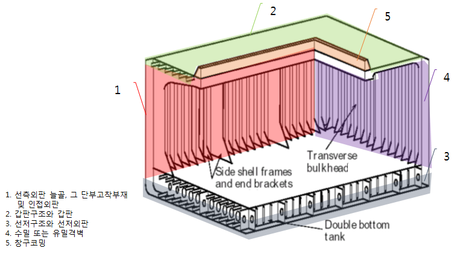
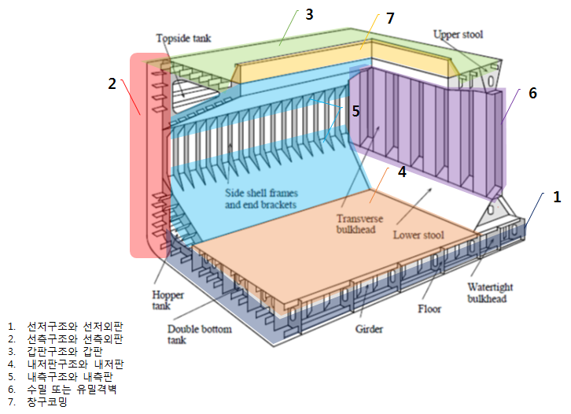
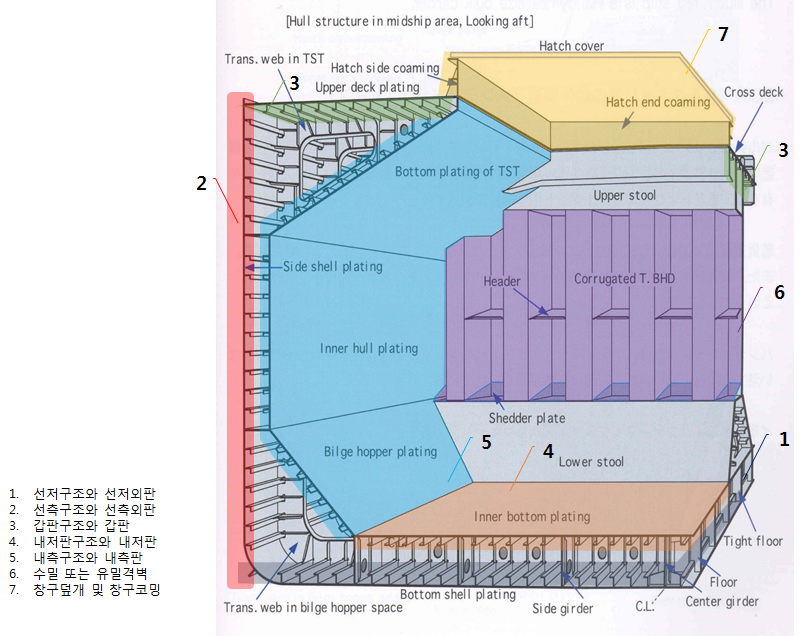
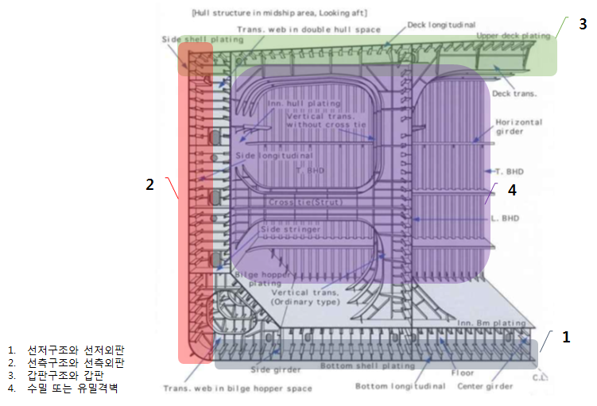

# 제1편 선급등록 및 검사

> 선급 및 강선규칙/적용지침 / RA-01-K / 2025 / KO / Guidance

## 부록 1-18 신속하고 완전한 수리의 경우 고려하여야 하는 지역(구조부재) (2019)

### 1. 규칙 2장 107.의 2항에서 언급하는 일반선박, 산적화물선, 이중선체 산적화물선 및 이중선체 유조선의 대표적인 신속하고 완전한 수리의 경우 고려하여야 하는 지역, 구조부재 등의 예를 개략적인 그림 또는 사진으로 나타내면 다음과 같다.

#### (1) 일반선박

#### (2) 산적화물선

#### (3) 이중선체 산적화물선

#### (4) 이중 선체 유조선

