# 제2편 재료 및 용접

> 선급 및 강선규칙/적용지침 / RA-02-K / 2025 / KO / Rules

## 제 1 장 재료

### 제 1 절 일반사항

#### 101. 적용 【지침 참조】

- **1.** 이 장의 규정은 선체구조, 의장품 및 기관장치 등의 각 편에서 규정하는 재료에 대하여 적용한다.
- **2.** 이 장에 규정한 규격과 다른 재료는 설계와 관련하여 특별히 승인한 경우에 한하여 사용할 수 있다. 이 경우에는 해당재료의 제조법, 화학성분 및 기계적 성질 등에 대한 상세한 자료를 제출하여 우리 선급의 승인을 받아야 한다.
- **3.** FRP선 및 복합용기 등의 제조 또는 수리에 사용되는 강화플라스틱 재료 등에 대하여는 우리 선급이 별도로 정하는 지침에 따른다. *(2017)*

#### 102. 제조법 승인 및 제조관리

- **1.** **제조법 승인**
  - **(1)** 이 장에 규정하는 철강재료는 특별히 규정한 것을 제외하고 우리 선급의 승인을 받은 제조공장에서 평로, 전기로, 순산소전로 또는 기타 제조법에 따라 제조한 것이어야 한다. 이 경우, 철강재료의 제조법(제강, 조괴, 압연, 주조, 단조, 열처리 등)에 대하여는 우리 선급이 별도로 정한 지침에 따라 승인을 받아야 한다.
  - **(2)** 선체구조용 압연강재의 압연 또는 단조 등에 사용되는 강괴, 슬래브, 블룸 및 빌릿 등 반제품의 제조법에 대하여는 우리 선급이 별도로 정한 지침에 따라 제조법승인을 받아야 한다.
  - **(3)** 다른 제조공장으로부터 강괴 등 반제품을 공급받아 압연을 하는 압연공장 또는 열연코일을 공급받아 가공하는 가공공장의 경우에는 (1)호의 규정을 준용한다.
  - **(4)** 이 장에 규정하는 비철재료에 대하여는 전 각 호의 규정을 준용한다.
- **2.** **제조관리**
  - **(1)** 제조자는 제품의 제조사양을 준수하고 제조공정에 대한 관리가 유효함을 보장하여야 할 책임이 있다.
  - **(2)** 제조자는 제조공정관리의 불안정으로 제품의 품질이 저하할 가능성이 있는 경우 그에 대한 원인을 조사하고 재발방지 대책을 수립하여야 한다. 또한, 관련 조사 보고서를 검사원에게 제출하여야 한다. **【지침 참조】**
  - **(3)** (2)호에 의해 영향을 받은 제품을 사용하고자 하는 경우에는 추가적인 시험을 하고 검사원이 만족하여야 한다. 또한 우리 선급이 필요하다고 인정하는 경우 후속제품에 대하여 시험의 빈도를 증가시킬 수 있다. **【지침 참조】**
  - **(4)** 강재가 그것을 압연한 제조공장이 아닌 다른 제조공장에서 최종 생산되는 경우, 압연공장에서는 제조공정, 그것을 공급한 제조자의 명칭, 주조 식별번호 또는 기호 및 화학성분(레이들분석치)을 기재한 제조증명서를 검사원에게 제출하여야 한다.

#### 103. 화학성분

- **1.** 화학성분의 분석은 적절한 설비와 숙련된 기술자를 갖춘 제조자의 실험실에서 원칙적으로 각 용탕에 대한 레이들마다 하고 이 장에 규정하는 화학성분에 관한 규격에 적합하여야 한다. **【지침 참조】**
- **2.** 제조자가 발행한 레이들 화학성분 분석보고서는 인정이 가능하다. 다만, 우리 선급이 필요하다고 인정하는 경우에는 주기적인 확인 점검을 요구할 수 있다. **【지침 참조】**
- **3.** 최종 제품의 화학성분이 레이들의 화학성분과 상이한 경우와 같이 우리 선급이 필요하다고 인정하는 경우에는 제품분석 시험을 요구할 수 있다. **【지침 참조】**

#### 104. 시험 및 검사

- **1.** 이 장에 규정한 재료는 특별히 규정한 것을 제외하고, 이 장의 규정에 따라 우리 선급 검사원의 입회하에 시험 및 검사를 하고 이에 합격하여야 한다.
- **2.** 이 장에 규정한 규격과 다른 재료의 시험 및 검사는 **101.**의 **2**항에 따라 우리 선급이 승인한 시험규격에 따라야 한다.
- **3.** 우리 선급이 적절하다고 인정하는 시험증명서를 가진 재료에 대하여는 해당 재료의 재료시험을 생략할 수 있다.
- **4.** 우리 선급이 별도로 정하는 품질보증제도의 승인을 받고 제조한 재료에 대하여는 우리 선급 검사원의 입회하에 실시하는 시험 및 검사의 일부 또는 전부를 제조자에게 위임할 수 있다. **【지침 참조】**

#### 105. 시험 및 검사의 시행

- **1.** 제조자는 검사원이 제조공장에서 승인을 받은 제조법을 제조자가 준수하고 있는지의 여부를 확인할 수 있도록 모든 편의를 제공함과 동시에 이 장의 규정에 따라 요청되는 시험재의 선정, 시험의 입회 및 시험기의 정밀도 등의 확인을 위해 공장 내의 필요하다고 생각되는 곳에 출입하는 것을 인정하여야 한다.
- **2.** 재료의 시험 및 검사는 그 제조공장에서 재료의 발송전에 하여야 한다. 시험편 및 시험방법은 이 장 **2절**에 따르고, 별도로 규정하는 경우와 특히 우리 선급이 승인한 경우를 제외하고, 검사원이 부호를 각인하기 전에 시험재를 모재로부터 떼어 내어서는 안 된다.
- **3.** 제조자는 주문자의 특별한 요구사항이 있는 경우에는 재료의 시험 및 검사에 앞서 이를 검사원에게 제시하여야 한다.
- **4.** 별도로 규정하는 경우를 제외하고, 재료의 표면검사 및 치수의 확인은 제조자의 책임하에 하는 것을 원칙으로 한다. 검사원에 의한 승인이 이러한 제조자의 책임을 면제하는 것은 아니다.

#### 106. 재료의 확인

- **1.** 제조자는 재료에 적절한 번호 또는 기호를 붙이고 제품의 용해, 압연, 열처리 등의 관련사항을 명백히 하는 조치를 취하여야 한다.
- **2.** 제조자는 모든 최종 제품에 대하여 최초 레이들 용강(또는 용탕)을 추적할 수 있는 식별시스템을 적용하여야 한다. 검사원이 요구하는 경우 재료를 추적하기 위한 모든 정보 및 기회가 제공되어야 한다.
- **3.** 소형 주철품과 같이 다량으로 생산되는 경우, 우리 선급의 승인을 받아 수정된 재료의 확인 방법이 사용될 수 있다.

#### 107. 시험증명서 등 (2017) 【지침 참조】

- **1.** 이 장의 규정에 따라 우리 선급은 시험 및 검사를 받아 합격한 재료에 대하여는 재료검사증서를 발급한다.
- **2.** 전항의 규정에도 불구하고 압연강재 등과 같이 대량 생산되는 제품의 경우, 시험에 합격한 재료에 대하여는 그 재료기호별로 시험증명서(mill sheets)를 제출받아 검사원이 서명함으로서 **1**항의 재료검사증서 발급을 생략할 수 있다. 이 경우 제조자는 시험증명서에 제조자의 명칭 또는 기호 및 그 강재가 승인된 방법에 따라 제조되고 각 규정의 시험에 합격한 것을 나타내는 아래의 내용을 국문 또는 영문으로 기재하여야 하며 또한, 제조공장의 품질보증 또는 검사 책임자가 이 시험증명서에 서명하여야 한다.
  「**이 재료는 승인된 방법으로 제조되고 시험결과가 사단법인 한국선급의 규칙에 적합하다는 것을 증명한다**.」
- **3.** 제조자가 발행하는 시험증명서에는 적어도 다음의 사항을 기재하여야 한다.
  - **(1)** 시험증명서번호
  - **(2)** 발주자의 명칭
  - **(3)** 발주번호
  - **(4)** 재료가 사용될 선박명 혹은 공사명(확정된 경우)
  - **(5)** 제조자의 명칭 및 주소
  - **(6)** 재료 기호
  - **(7)** 제품의 치수 및 수량
  - **(8)** 용해 또는 용강까지 추적할 수 있는 식별번호
  - **(9)** 화학성분(잔류원소를 포함한 규정된 모든 성분 및 의도적으로 첨가된 성분)
  - **(10)** 기계적 성질
  - **(11)** 열처리 상태 또는 조건(해당되는 경우)
  - **(12)** 기타 관련 표준에서 요구하는 정보
- **4.** 제조자는 시험증명서의 식별, 관리 등을 고려하여 공급일로부터 10년 이상 보관하여야 한다. *(2019)*

#### 108. 품질 및 결함의 보수

- **1.** 재료는 품질이 균일하고 사용에 유해한 표면 또는 내부결함이 없는 것이어야 한다. 또한 표면 마무리 상태는 사용목적에 적합해야 한다.
- **2.** 시험 및 검사에 합격한 재료라도 후속의 가공공정이나 시험중에 재료에 기인한 결함을 발견하였을 때에는 이전의 시험결과나 증서의 발급 여부에 관계없이 검사원의 재량에 따라 불합격으로 할 수 있다.
- **3.** 결함을 보수할 목적으로 용접 및 기타의 가공을 할 경우에는 보수개소, 보수방법(용접법 및 열처리 등 포함)에 대하여 검사원의 승인을 받아야 한다. 특히 검사원의 동의를 얻은 경우를 제외하고 이 보수공사는 검사원의 입회하에 하여야 한다.
- **4.** 그라인딩으로 보수를 하는 경우, 그라인딩후의 잔존 두께는 치수허용차 범위 내에 있어야 한다.

#### 109. 재시험

- **1.** **충격시험 이외의 기계시험** 시험성적의 일부가 규격에 합격하지 아니하더라도 기타의 성적이 양호할 경우에는 그 시험편을 채취한 시험재로부터 규격에 합격하지 못한 시험마다 소정의 시험편수의 2배수의 시험편을 채취하여 다시 시험을 할 수 있다. 이 경우의 성적이 모두 규격에 합격하였을 때에는 합격으로 한다.
- **2.** **충격시험**
  - **(1)** 충격시험 결과가 규격에 합격하지 아니한 경우에는 다음 (가) 또는 (나)의 경우를 제외하고 그 시험편을 채취한 시험재로부터 다시 1조의 시험편을 채취하여 재시험을 할 수 있다.
    - **(가)** 시험편 3개 모두가 규정의 평균흡수에너지값에 미치지 못한 경우
    - **(나)** 시험편 중 2개 이상이 규정의 평균흡수에너지값의 70 $\%$ 미만인 경우
  - **(2)** 재시험은 최초 불합격한 시험편의 값을 포함하여 합계 6개의 시험편의 흡수에너지 평균치가 규정의 평균흡수에너지값 이상이고, 동시에 해당시험편 중 규정의 평균흡수에너지값보다 작은 시험편의 수가 2개 이하이고 규정의 평균흡수에너지값의 70 $\%$ 미만인 시험편의 수가 1개 이하이면 동일 로트에 속한 재료는 전부 합격으로 한다.
- **3.** 열처리를 한 시험재의 성적이 불량할 경우에는 그 재료에 2회(최초 포함 3회)까지를 한도로 열처리 및 재시험을 할 수 있다. 이 경우에는 기계시험의 전부를 최초 시험과 동일한 시험편 수로 다시 하여야 한다. *(2018)*
- **4.** 인장시험의 경우 시험편이 표점사이의 중앙으로부터 양단 방향으로 각각 표점거리의 1/4을 초과하는 곳에서 절단되고 연신율에 대한 성적이 규정에 합격하지 아니하였을 경우에는 그 시험을 무효로 하고 최초의 시험편을 채취한 시험재에서 소정의 시험편을 채취하여 다시 시험을 할 수 있다. **【지침 참조】**

#### 110. 합격재의 표시

- **1.** 규정의 시험 및 검사에 합격한 모든 재료에는 제품마다 우리 선급 소정의 합격인  및 재료기호를 각인하고, 또한 다음의 사항을 제조자가 명확히 표시하여야 한다.
  - **(1)** 제조자의 명칭 또는 그 기호
  - **(2)** 식별번호 또는 그 기호
  - **(3)** 발주자의 명칭 또는 그 기호(발주자가 요구할 경우)
- **2.** 전 **101.**의 **2**항에 따라 특별히 승인된 재료에 대하여는 재료기호 뒤에 “*S”*를 각인 또는 적절히 표시하여야 한다.
- **3.** 각인하기에 적당하지 아니한 재료에 대하여는 재료의 종류에 따라 소인(燒印), 압인(押印) 등 적절한 방법으로 표시를 하여도 좋다.
- **4.** 최종제품에 양각되는 제조자의 명칭 또는 등록상표를 제외한 각인 및 표시내용들은 페인트로 외곽선을 둘러싸거나 다른 방법으로 표시하여 쉽게 확인할 수 있도록 해야 한다.
- **5.** 치수가 작기 때문에 전 각 항의 규정과 같이 표시할 수 없는 재료는 일괄하여 적절히 표시를 하여도 좋다.
- **6.** 무게가 가벼운 다수의 재료들을 한 개의 번들로 견고하게 묶을 경우, 제조자는 우리 선급의 승인을 받아, 각 번들의 최상위 판에만 합격표시를 하거나 또는 각각의 번들에 합격표시가 된 라벨을 견고하게 부착할 수 있다.
- **7.** 우리 선급의 합격표시가 부착된 어떠한 재료가 **108.**의 **2**항에 따라 불합격된 경우, 제조자는 합격표시를 빠짐없이 제거하여야 한다.

### 제 2 절 시험편 및 시험방법

#### 201. 일반사항

- **1.** **적용**
  - **(1)** 이 장에 규정하는 재료에 대한 시험편 및 시험방법에 대하여는 각 절에서 별도로 규정한 경우를 제외하고 이 절의 규정에 따른다.
  - **(2)** 이 장에서 규정하지 않는 시험편 또는 시험방법을 적용할 경우에는 우리 선급의 승인을 받아야 한다. **【지침 참조】**
- **2.** **시험기**
  - **(1)** 이 장에 따라서 시험에 사용하는 모든 시험기는 숙련된 기술자에 의해 취급되어야 한다.
  - **(2)** 인장/압축시험기는 **ISO 7500-1:2018** 또는 우리 선급이 인정하는 기준에 따라 교정되어야 한다. *(2023)* **【지침 참조】**
  - **(3)** 충격시험기는 **ISO 148-2:2016** 또는 우리 선급이 인정하는 기준에 따라 교정되어야 한다. *(2023)* **【지침 참조】**
  - **(4)** 인장시험기의 하중 정밀도는 ±1% 이내이어야 한다.
- **3.** **시험편의 채취**
  - **(1)** 이 장에 규정하는 재료에 대한 시험편의 채취방법은 각 절의 규정에 따른다.
  - **(2)** 별도로 규정하는 경우와 특히 우리 선급이 승인한 경우를 제외하고, 검사원이 부호를 각인하기 전에 시험재를 모재로부터 떼어 내어서는 안 된다. **【지침 참조】**
  - **(3)** 시험재를 가스가공 또는 전단가공으로 모재에서 절단할 경우에는 충분한 가공여유를 주어야 한다.
  - **(4)** 시험편의 가공은 과도한 냉간변형 또는 가열을 하여서는 안 된다.
  - **(5)** 시험편의 가공이 불량하든지 또는 재질에 관계가 없다고 인정되는 결함이 있을 때에는 시험 전에 이것을 폐기하고 다른 시험편으로 바꾸든지 또는 그 재료에서 시험재를 다시 채취할 수 있다.

#### 202. 시험편의 모양 및 치수

- **1.** **인장시험편**
  - **(1)** 인장시험편은 그 모양 및 치수에 따라 다음 **표 2.1.1**과 같이 비례시험편 및 정형시험편으로 분류한다.

    **표 2.1.1 시험편의 종류**

    | 시험편의 모양 | 판 모 양 | 봉 모 양 | 관 모 양 |
    | --- | --- | --- | --- |
    | 비례시험편 | *R*14*B*호 | *R*14*A*호 | *R*14*B*호, *R*14*C*호 |
    | 정형시험편 | *R*1*A*호, *R*1*B*호 *R*5호, *R*13*B*호 | *R*4호, *R*8*C*호 *R*10호 | - |
  - **(2)** 인장시험편은 재료의 종류에 따라 **그림 2.1.1**의 모양 및 치수로 가공하여야 한다. **【지침 참조】**

    | 구분 | 종류 | 기호 | 시험편의 모양(1) | 시험편의 치수(2) | 적용재료 |
    | --- | --- | --- | --- | --- | --- |
    | 판모양(3) | 비례 시험편 | *R*14*B* |  | $a$ *=* $t$ $W$ *=* 25 mm $L$ = $5.65 \sqrt {A}$(4) $P$ ≅ $L+2 \sqrt {A}$ $R$ = 25 mm | 두께 3mm 이상의 압연강재 |
    | 판모양(3) | 정형 시험편 | *R*1*A* |   | $a$ *=* $t$ $W$ *=* 40 mm $L$ = 200 mm $P$ ≅ 220 mm $R$ = 25 mm | 보일러용 압연강판 압력용기용 압연강판 |
    | 판모양(3) | 정형 시험편 | *R*1*B* |   | $a$ *=* $t$ $W$ *=* 25 mm $L$ = 200 mm $P$ ≅ 212.5 mm $R$ = 25 mm | 두께 3mm 이상의 압연강재 |

    | 구분 | 종류 | 기호 | 시험편의 모양 | 시험편의 치수 | 적용재료 |
    | --- | --- | --- | --- | --- | --- |
    | 판모양(3) |   | *R*5 |  | $a$ *=* $t$ $W$ *=* 25 mm $L$ = 50 mm $P$ ≅ 60 mm $R$ = 15 mm | 압력용기용 압연강판 두께 12.5mm 이하의 알루미늄 합금 |
    | 판모양(3) |   | *R*13*B* |   | $a$ *=* $t$ $W$ *=* 12.5 mm $L$ = 50 mm $P$ ≅ 60 mm $R$ = 25 mm | 두께 3 mm 미만의 압연강재 두께 12.5mm 이하의 알루미늄 합금 |
    | 봉모양 | 비례 시험편 | *R*14*A* |  | $L$ = 5 $d$(5) $P$ ≅ $L+0.5d$ $R$ = 10 mm(6) | 압연강재, 주강품, 단강품, 구상흑연주철품, 동합금, 두께 12.5mm를 넘는알루미늄합금 |
    | 봉모양 | 정형 시험편 | *R*4 |  | $d$ = 14 mm $L$ = 50 mm $P$ ≅ 60 mm $R$ = 15 mm | 압력용기용 압연강판 두께 12.5mm 이하의 알루미늄 합금 |
    | 봉모양 | 정형 시험편 | *R*10 |   | $d$ = 12.5 mm $L$ = 50 mm $P$ ≅ 60 mm $R$ = 15 mm | 보일러용 압연강판 두께 12.5mm 이하의 알루미늄 합금 |
    | 봉모양 | 정형 시험편 | *R*8*C* |  | $d$ = 20 mm $R$ = 25 mm | 회주철품 |
    | 관모양 |   | *R*14*B* |  | $a$ *= t* $W$ *≥ 12* mm $L$ = $5.65 \sqrt {A}$ $P$ ≅ $L$ + 2$W$ $R$ = 25 mm | 강관, 동관 |
    | 관모양 |   | *R*14*C* |  | $L$ = $5.65 \sqrt {A}$ $P$ ≅ $L$ + $0.5D$ 이때 $P$는 처크 사이의 거리로 한다. | 강관, 동관 |
    | (비고) (1) 그림의 기호는 다음에 따른다. $d$ : 지름, $A$ : 단면적, $a$ : 시험편의 두께, $R$ : 어깨의 반지름, $W$ : 너비, $D$ : 관의 바깥지름 $L$ : 표점거리, $t$ : 원재료의 두께, $P$ : 평행부의 길이 (2) 시험편의 양단은 시험기에 따라서 적합한 모양으로 가공할 수 있다. (3) 원재료의 두께가 시험기의 용량을 초과할 경우에는 한쪽면만을 가공하여 그 두께를 경감할 수 있다. (4) 표점거리 $L$은 20 mm보다 커야 한다. (5) 지름 $d$는 10 mm 이상, 20 mm 미만의 범위로 하고, 14 mm를 원칙으로 한다. (6) 구상흑연주철 및 규정된 연신율이 10 % 이하인 재료에 대하여는 *R*을 1.5 $d$ 이상으로 한다. |   |   |   |   |   |
  - **(3)** 전호에서 산출된 표점거리 $L$은 5 mm 단위의 정수값으로 할 수 있다. 이 경우 정수값과 *L*과의 차는 0.1 $L$ 이상이어서는 안 된다.
  - **(4)** 제조자는 우리 선급의 승인을 받아 (2)호의 시험편 이외에 임의의 시험편을 사용할 수 있다. 이 경우 연신율 $n$에 대하여는 다음 식에 따라서 보정하여야 한다. **【지침 참조】**
    $n=a ․E ․ \left( \frac{\sqrt {A}}{L} \right) ^{b}$
    $n$ : 임의의 시험편을 사용할 경우의 연신율.
    $E$ : (1)호에 규정한 비례치수 시험편을 사용할 경우의 상당 연신율.
    $A$ : 임의의 시험편의 단면적.
    $L$ : 임의의 시험편의 표점거리.
    $a$ 및 $b$ : 재료에 따른 계수로서 다음에 따른다.

    | 계수 재료 | $a$ | $b$ |
    | --- | --- | --- |
    | 재료 1 | 2.0 | 0.40 |
    | 재료 2 | 2.6 | 0.55 |
    | (비고) (1) 재료 1은 인장강도 590 $\mathrm{N}/mm ^{2}$ 이하의 탄소강 및 저합금강으로 열간 압연한 것 또는 어닐링, 노멀라이징 또는 노멀라이징 후 템퍼링을 하는 것으로 한다. (2) 재료 2는 탄소강 및 저합금강으로서 담금질 후 템퍼링을 하는 것으로 한다. (3) 재료 1 및 재료 2에 해당되지 아니하는 재료에 대한 $a$ 및 $b$의 값은 우리 선급이 적절하다고 인정하는 바에 따른다. |   |   |
  - **(5)** 기계가공을 한 평행부는 전체 길이에 걸쳐 균일하여야 하며, 허용편차(최대와 최소값의 차이)는 **표 2.1.2**에 따른다.

    **표 2.1.2 평행부의 허용편차** (단위 : mm)

    | 원형단면시험편 |   | 두께 6 이상의 직사각형 단면시험편 |   |   |   | 두께 6 미만의 직사각형 단면시험편 |   |   |   |
    | --- | --- | --- | --- | --- | --- | --- | --- | --- | --- |
    | 호칭지름 | 허용편차 | 호칭두께 | 허용편차 | 호칭너비 | 허용편차 | 호칭두께 | 허용편차 | 호칭너비 | 허용편차 |
    | 10이상 12미만 | 0.025 | 6이상 12미만 | 0.02 | 25이상 40미만 | 0.05 | 0.6이상 1.2미만 | 0.002 | 12.5이상 25미만 | 0.02 |
    | 12이상 16미만 | 0.03 | 12이상 20미만 | 0.04 | 40이상 | 0.10 | 1.2이상 2.5미만 | 0.004 | 25이상 | 0.04 |
    | 16이상 | 0.04 | 20이상 | 0.05 |   |   | 2.5이상 6미만 | 0.01 |   |   |
- **2.** **굽힘시험편** 굽힘시험편은 **그림 2.1.2**에 규정하는 모양 및 치수로 가공하여야 한다.
- **3.** **충격시험편**
  - **(1)** 충격시험편은 1조를 3개로 하며 제품의 단면두께(section thickness)가 12 mm보다 작지 않는 한 **그림 2.1.3** 및 **표 2.1.3**에 표시한 모양 및 치수로 가공하여야 한다.
  - **(2)** 충격시험편은 노치(notch) 길이가 재료의 종류에 따라 압연면, 단조면 또는 주조면에 수직이 되도록 시험편의 면에서 잘라낸다. 노치의 위치는 가스절단면 또는 전단면에서 25 mm 이상 떨어져야 한다.
  - **(3)** (1)호에서 규정한 치수의 충격시험편을 채취할 수 없는 압연강재 및 강관의 경우에는 시험편의 너비 *W*를 **표 2.1.4**에 규정한 서브사이즈 시험편의 너비로 하여도 좋다. 이 경우의 압연강재 및 강관의 흡수에너지는 규정의 흡수에너지에 시험편의 너비에 따라 각각 **표 2.1.4**에 정한 값을 곱한 것(소수점 2째 자리 이하는 반올림) 이상으로 한다. **【지침 참조】**
    
    **그림 2.1.2 굽힘시험편의 모양 및 치수** (단위 : mm)
    
    **그림 2.1.3 충격시험편의 모양**
    **표 2.1.3 충격시험편의 치수**

    | 종류 치수 |   | 샤르피 V-노치 시험편 |
    | --- | --- | --- |
    | 길 이 | $L$ | 55 ± 0.6 |
    | 너 비 | $W$ | 10 ± 0.11 |
    | 두 께 | $T$ | 10 ± 0.06 |
    | 노치의 각도(deg) | $\theta$ | 45 ± 2 |
    | 노치 아래 단면두께 | $D$ | 8 ± 0.06 |
    | 노치 밑부분의 반지름 | $R$ | 0.25 ± 0.025 |
    | 시험편 한쪽 끝에서 노치 중심까지 거리 | $S$ | 27.5 ± 0.42 |
    | 노치부의 대칭평면과 시험편의 길이방향 중심축선과의 각도(deg) |   | 90 ± 2 |

    **표 2.1.4 규정의 흡수에너지에 곱하는 값**

    | 서브사이즈 시험편의 두께와 너비 $T$ × *W* (mm) | 흡수에너지의 곱수 |
    | --- | --- |
    | 서브사이즈 시험편의 두께와 너비 $T$ × *W* (mm) | 평균흡수 에너지 값 |
    | 10 × 5 ± 0.06 | 2/3 |
    | 10 × 7.5 ± 0.11 | 5/6 |
  - **(4)** 시험재의 두께가 6 mm 미만인 경우와 강관의 용접부에서 **표 2.1.4**에 규정된 서브사이즈 시험편을 채취할 수 없는 경우에는 충격시험을 생략할 수 있다.
  - **(5)** 어떠한 경우라도 재료두께에 대하여 가능한 한 가장 큰 크기의 충격시험편을 채취 및 가공하여야 한다. **【지침 참조】**
- **4.** **시험편 치수의 확인** 시험편의 모양 및 치수는 시험을 하기 전에 적절한 방법으로 검사하고 확인하여야 한다.

#### 203. 시험방법 【지침 참조】

- **1.** **인장시험**
  - **(1)** 항복현상이 명료하게 나타나는 경우의 항복강도(항복응력)는 상항복점으로 하고, 항복현상이 명료하게 나타나지 아니하는 경우의 항복강도(내력)는 0.2 $\%$ 영구 변형시의 강도(*Rp*0.2)로 한다. 다만, 오스테나이트계 스테인리스강 및 듀플렉스 스테인리스강의 경우 우리 선급의 승인을 받아 0.2% 내력(*Rp*0.2) 대신 1% 내력(*Rp*1)을 적용할 수 있다.
  - **(2)** 항복점 또는 항복강도를 측정할 경우의 응력증가율은 다음에 따른다.

    | 재료의 탄성율(*E*) *(*$\mathrm{N}/mm ^{2}$*)* | 응력증가율 ($\mathrm{N}/mm ^{2} .s ^{-1}$*)* |   |
    | --- | --- | --- |
    | 재료의 탄성율(*E*) *(*$\mathrm{N}/mm ^{2}$*)* | 최소 | 최대 |
    | ＜150,000 | 2 | 20 |
    | ≥150,000 | 6 | 60 |
  - **(3)** 항복점 또는 항복강도에 도달한 이후 연성재료의 인장강도를 측정할 경우 인장속도는 변형증가율이 0.008s^-1이하에 상당하는 속도로 하여야 한다. 다만, 주철 등과 같이 연성이 없는 재료인 경우에는 응력증가율이 초당(per second) 10 $\mathrm{N}/mm ^{2}$ 이하로 하여야 한다.
  - **(4)** 별도 규정하는 경우를 제외하고, 시험은 10 ℃에서 35 ℃ 사이의 상온에서 실시한다. 해당 시험 온도 범위를 벗어난 시험실 환경의 경우, 그러한 환경에서 작동되는 시험기로 생성된 시험 및/또는 교정 데이터에 대한 영향 평가는 시험실의 책임이다. 10 ℃에서 35 ℃ 의 온도 범위를 벗어난 경우에는 온도가 기록되어야 한다. *(2025)*
- **2.** **충격시험** 충격시험은 용량이 150 J 이상인 샤르피 충격시험기를 사용하고 충격속도는 4.5∼6 m/sec로 하며, 규정된 온도의 ± 2℃로 조절된 온도에서 하여야 한다.

### 제 3 절 압연강재

#### 301. 선체 구조용 압연강재

- **1.** **적용**
  - **(1)** 이 규정은 선체구조에 사용하는 두께 100 mm 이하의 선체 구조용 압연강재(이하 강재라고 한다)에 대하여 적용한다.
  - **(2)** 또한 이 규정은 SOLAS 협약 II-1장, A-1부, 제3-11규칙(원유운반선의 화물유탱크의 방식)의 성능기준 MSC.289(87)에 규정된, 화물유탱크에 대한 방식 대체방법으로서 연강 및 고장력강 내식강(이하 “내식강”이라 한다)이 사용되는 두께 50mm까지의 강판 및 평강, 형강에 적용한다. 이 규정 내에 정의되는 내식강은 선체구조용 강재, 구조강도 및 건조에 대한 기타 관련 요건에 추가하여 화물유탱크 저부 및 상부에서 그 내식성능이 MSC.289(87)의 요건에 만족스럽게 시험 및 승인된 강을 의미한다.
  - **(3)** 내식강을 SOLAS 협약 II-1장, A-1부, 제3-11규칙의 성능기준 MSC.289(87)에 규정된 이외의 선박의 다른 영역에 적용하고자 하는 경우에는 우리 선급의 별도 승인을 받아야 한다.
  - **(4)** **표 2.1.5**에 규정된 적용두께를 넘는 강재에 대하여는 우리 선급이 적절하다고 인정하는 바에 따른다. **【지침 참조】**
  - **(5)** 사용용도에 따라 특별히 두께방향의 기계적 성질을 요구하는 두께 15 mm 이상의 강재(이하 두께방향특성 강재라고 한다)에 대하여는 **301.**의 규정에 따르는 이외에 **310.**에 규정한 두께방향특성시험에도 합격하여야 한다.
  - **(6)** 취성균열 정지특성을 가지는 취성균열 정지강은 추가로 **312.**의 요건을 만족해야 한다. *(2021)*
  - **(7)** **301.**에 규정하지 아니한 강재에 대하여는 **101.**의 **2**항에 따른다.
- **2.** **종류** 강재의 종류는 **표 2.1.5**에 따른다.

  **표 2.1.5 강재의 종류**

  | 종 류 |   | 재 료 기 호 | 적용두께 *t*(mm) |
  | --- | --- | --- | --- |
  | 연강 (1) | 강판(3) | *A, B, D, E* | $t$ ≤ 100 |
  | 연강 (1) | 형강 및 봉강 | *A, B, D, E* | $t$ ≤ 50 |
  | 고장력강 (2) | 강판(3) | *AH* 32, *DH* 32, *EH* 32, *FH* 32 *AH* 36, *DH* 36, *EH* 36, *FH* 36 *AH* 40, *DH* 40, *EH* 40, *FH* 40 | $t$ ≤100 |
  | 고장력강 (2) | 형강 및 봉강 | *AH* 32, *DH* 32, *EH* 32, *FH* 32 *AH* 36, *DH* 36, *EH* 36, *FH* 36 *AH* 40, *DH* 40, *EH* 40, *FH* 40 | $t$ ≤ 50 |
  | (비고) (1) 충격시험 여부 및 충격시험 온도규정에 따라 *A, B, D, E*의 4종류로 구분한다. (2) 항복강도에 따라 3등급(315, 355, 390 $\mathrm{N}/mm ^{2}$)으로 구분하며, 동일 강도내에서도 충격시험 온도규정에 따라 4개의 종류(예 : *AH* 32, *DH* 32, *EH* 32, *FH* 32)로 구분한다. (3) 강판에는 너비 600 mm 이상의 평강을 포함한다. |   |   |   |
- **3.** **제조법**
  - **(1)** 별도 승인 받지 않는 한, 강재의 압연비는 3:1 이상이어야 한다. *(2024)*
  - **(2)** 강재의 탈산방법 및 화학성분은 **표 2.1.6**에 따른다. 다만, 두께가 50 mm를 넘는 강판(너비 600 mm 이상의 평강을 포함)과 열처리가 열가공제어법(이하 *TMCP* 라고 한다)인 경우의 화학성분은 우리 선급의 승인을 받아 **표 2.1.6**의 규격과 다르게 할 수 있다. **【지침 참조】**
- **4.** **열처리** 강재의 열처리는 **표 2.1.8** 및 **표 2.1.9**에 따른다. **【지침 참조】**
- **5.** **기계적 성질** 강재의 기계적 성질은 **표 2.1.7**에 따른다.
- **6.** **시험재의 채취**
  - **(1)** 시험재는 동일한 주조의 것이고 또한 동일한 열처리를 한 강판, 평강, 형강 등과 같이 동일한 제품형상이어야 하며, 열처리가 완료되기 전까지는 채취되어서는 안 된다.
  - **(2)** 인장시험편을 채취하는 시험재는 특히 우리 선급이 승인한 경우를 제외하고 50 톤을 넘지 않는 강재(동일 용강에 속하고 제조공정이 같은 것으로서 두께 또는 지름의 차이가 10 mm 이내의 것)를 1로트로 하고 로트마다 1개씩 채취한다.

    **표 2.1.6 탈산방법 및 화학성분(%)** ***(2021)***

    | 종류 | 재료기호 | 두께 $t$ (mm) | 탈산 방법 | 화학성분($\%$) (5) |   |   |   |   |   |   |   |   |   |   |   |   |   |
    | --- | --- | --- | --- | --- | --- | --- | --- | --- | --- | --- | --- | --- | --- | --- | --- | --- | --- |
    | 종류 | 재료기호 | 두께 $t$ (mm) | 탈산 방법 | $C$ | $Si$ | $Mn$ | $P$ | $S$ | $Cu$ | $Cr$ | $N i$ | $Mo$ | $A1$(8) | $Nb$ | $V$ | $Ti$ | $N$ |
    | 연 강 (1) | *A* | $t$≤50 | 킬드 및 세미킬드 (1) | 0.21 이하 (3)(4) | 0.50 이하 | 2.5×C이상(4) | 0.035 이하 | 0.035 이하 | - | - | - | - | - | - | - | - | - |
    | 연 강 (1) | *A* | $t$*>*50 | 킬드 | 0.21 이하 (3)(4) | 0.50 이하 | 2.5×C이상(4) | 0.035 이하 | 0.035 이하 | - | - | - | - | - | - | - | - | - |
    | 연 강 (1) | *B* | $t$≤50 | 킬드 및 세미킬드 | 0.21 이하 (4) | 0.35 이하 | 0.8이상(4)(6) | 0.035 이하 | 0.035 이하 | - | - | - | - | - | - | - | - | - |
    | 연 강 (1) | *B* | $t$*>*50 | 킬드 | 0.21 이하 (4) | 0.35 이하 | 0.8이상(4)(6) | 0.035 이하 | 0.035 이하 | - | - | - | - | - | - | - | - | - |
    | 연 강 (1) | *D* | $t$≤25 | 킬드 | 0.21 이하 (4) | 0.35 이하 | 0.6이상(4) | 0.035 이하 | 0.035 이하 | - | - | - | - | - | - | - | - | - |
    | 연 강 (1) | *D* | $t$>25 | 세립킬드 (2) | 0.21 이하 (4) | 0.35 이하 | 0.6이상(4) | 0.035 이하 | 0.035 이하 | - | - | - | - | 0.015 이상 (2)(9) | - | - | - | - |
    | 연 강 (1) | *E* | $t$≤100 | 킬드 및 세립킬드 | 0.18 이하 (4) | 0.35 이하 | 0.7이상(4) | 0.035 이하 | 0.035 이하 | - | - | - | - | 0.015 이상(9) | - | - | - | - |
    | 고 장 력 강 (13) | *AH* 32 | $t$≤100 | 킬드 및 세립킬드 | 0.18이하 | 0.50이하 | 0.90∼ 1.60(7) | 0.035이하 | 0.035이하 | 0.35이하 | 0.20이하 | 0.40이하 | 0.08이하 | 0.015 이상 (10) | 0.02∼0.05 (10)(11) | 0.05∼0.10 (10)(11) | 0.02 이하 (11) | - |
    | 고 장 력 강 (13) | *DH*32 | $t$≤100 | 킬드 및 세립킬드 | 0.18이하 | 0.50이하 | 0.90∼ 1.60(7) | 0.035이하 | 0.035이하 | 0.35이하 | 0.20이하 | 0.40이하 | 0.08이하 | 0.015 이상 (10) | 0.02∼0.05 (10)(11) | 0.05∼0.10 (10)(11) | 0.02 이하 (11) | - |
    | 고 장 력 강 (13) | *EH* 32 | $t$≤100 | 킬드 및 세립킬드 | 0.18이하 | 0.50이하 | 0.90∼ 1.60(7) | 0.035이하 | 0.035이하 | 0.35이하 | 0.20이하 | 0.40이하 | 0.08이하 | 0.015 이상 (10) | 0.02∼0.05 (10)(11) | 0.05∼0.10 (10)(11) | 0.02 이하 (11) | - |
    | 고 장 력 강 (13) | *AH* 36 | $t$≤100 | 킬드 및 세립킬드 | 0.18이하 | 0.50이하 | 0.90∼ 1.60(7) | 0.035이하 | 0.035이하 | 0.35이하 | 0.20이하 | 0.40이하 | 0.08이하 | 0.015 이상 (10) | 0.02∼0.05 (10)(11) | 0.05∼0.10 (10)(11) | 0.02 이하 (11) | - |
    | 고 장 력 강 (13) | *DH*36 | $t$≤100 | 킬드 및 세립킬드 | 0.18이하 | 0.50이하 | 0.90∼ 1.60(7) | 0.035이하 | 0.035이하 | 0.35이하 | 0.20이하 | 0.40이하 | 0.08이하 | 0.015 이상 (10) | 0.02∼0.05 (10)(11) | 0.05∼0.10 (10)(11) | 0.02 이하 (11) | - |
    | 고 장 력 강 (13) | *EH* 36 | $t$≤100 | 킬드 및 세립킬드 | 0.18이하 | 0.50이하 | 0.90∼ 1.60(7) | 0.035이하 | 0.035이하 | 0.35이하 | 0.20이하 | 0.40이하 | 0.08이하 | 0.015 이상 (10) | 0.02∼0.05 (10)(11) | 0.05∼0.10 (10)(11) | 0.02 이하 (11) | - |
    | 고 장 력 강 (13) | *AH* 40 | $t$≤100 | 킬드 및 세립킬드 | 0.18이하 | 0.50이하 | 0.90∼ 1.60(7) | 0.035이하 | 0.035이하 | 0.35이하 | 0.20이하 | 0.40이하 | 0.08이하 | 0.015 이상 (10) | 0.02∼0.05 (10)(11) | 0.05∼0.10 (10)(11) | 0.02 이하 (11) | - |
    | 고 장 력 강 (13) | *DH*40 | $t$≤100 | 킬드 및 세립킬드 | 0.18이하 | 0.50이하 | 0.90∼ 1.60(7) | 0.035이하 | 0.035이하 | 0.35이하 | 0.20이하 | 0.40이하 | 0.08이하 | 0.015 이상 (10) | 0.02∼0.05 (10)(11) | 0.05∼0.10 (10)(11) | 0.02 이하 (11) | - |
    | 고 장 력 강 (13) | *EH* 40 | $t$≤100 | 킬드 및 세립킬드 | 0.18이하 | 0.50이하 | 0.90∼ 1.60(7) | 0.035이하 | 0.035이하 | 0.35이하 | 0.20이하 | 0.40이하 | 0.08이하 | 0.015 이상 (10) | 0.02∼0.05 (10)(11) | 0.05∼0.10 (10)(11) | 0.02 이하 (11) | - |
    | 고 장 력 강 (13) | *FH* 32 | $t$≤100 | 킬드 및 세립킬드 | 0.16이하 | 0.50이하 | 0.90∼ 1.60 | 0.025이하 | 0.025이하 | 0.35이하 | 0.20이하 | 0.80이하 | 0.08이하 | 0.015 이상 (10) | 0.02∼0.05 (10)(11) | 0.05∼0.10 (10)(11) | 0.02 이하 (11) | 0.009이하 (12) |
    | 고 장 력 강 (13) | *FH* 36 | $t$≤100 | 킬드 및 세립킬드 | 0.16이하 | 0.50이하 | 0.90∼ 1.60 | 0.025이하 | 0.025이하 | 0.35이하 | 0.20이하 | 0.80이하 | 0.08이하 | 0.015 이상 (10) | 0.02∼0.05 (10)(11) | 0.05∼0.10 (10)(11) | 0.02 이하 (11) | 0.009이하 (12) |
    | 고 장 력 강 (13) | *FH* 40 | $t$≤100 | 킬드 및 세립킬드 | 0.16이하 | 0.50이하 | 0.90∼ 1.60 | 0.025이하 | 0.025이하 | 0.35이하 | 0.20이하 | 0.80이하 | 0.08이하 | 0.015 이상 (10) | 0.02∼0.05 (10)(11) | 0.05∼0.10 (10)(11) | 0.02 이하 (11) | 0.009이하 (12) |
    | (비고) (1) 두께가 12.5 mm 이하인 형강에 대하여는 우리 선급의 승인을 받아 림드강으로 할 수 있다. (2) 두께가 25 mm를 넘을 경우에는 알루미늄 처리에 따른 세립킬드강으로 한다. 다만, 두께 50 mm까지는 우리 선급의 승인을 받아 킬드강으로 할 수 있다. (3) 형강의 경우 탄소의 함유량은 0.23 $\%$ 이하로 할 수 있다. (4) *C*+*Mn*/6의 함유량은 0.40 $\%$를 넘어서는 안 된다. (5) 기타의 원소가 제강과정에서 첨가되는 경우 함량을 표시하여야 한다. (6) 킬드강으로서 충격시험을 하는 경우 $Mn$의 최소함유량을 0.60 $\%$까지 감소시켜도 좋다. (7) 두께가 12.5 mm 이하인 강재에 대하여는 $Mn$의 최소함유량을 0.70 $\%$까지 감소시켜도 좋다. (8) *Al*의 함유량은 산에 용해되는 *Al*의 양으로 하지만 전 함유량으로 하여도 좋다. 다만, 이 경우에는 *Al*의 전 함유량은 0.020 $\%$ 이상이어야 한다. (9) 우리 선급의 승인을 받아 기타의 세립화원소를 사용할 수 있다. (10) 강재에는 *Al*, *Nb, V* 또는 기타의 세립화 원소를 단독 또는 조합으로 함유시켜야 한다. 다만, 단독으로 함유시키는 경우에는 세립화 원소성분의 하한 규정을 적용하지만 조합하여 함유시키는 경우에는 각각의 세립화 원소성분의 하한 규정은 적용하지 아니한다. (11) *Nb, V* 및 *Ti*의 합계 함유량은 0.12 $\%$ 이하이어야 한다. (12) 알루미늄 처리에 따른 세립킬드강은 0.012 $\%$ 이하로 할 수 있다. (13) 고장력강이 *TMCP*로 제조되는 경우의 각 강재에 대한 탄소당량(Ceq.) 또는 균열감수성지수(Pcm)는 우리 선급이 적절하다고 인정하는 지침에 따른다. **【지침 참조】** |   |   |   |   |   |   |   |   |   |   |   |   |   |   |   |   |   |

    **표 2.1.7 기계적 성질** ***(2021)***

    | 재료 기호 | 인 장 시 험 |   |   | 충 격 시 험 |   |   |   |   |   |   |
    | --- | --- | --- | --- | --- | --- | --- | --- | --- | --- | --- |
    | 재료 기호 | 항복강도 ($\mathrm{N}/mm ^{2}$) | 인장강도 ($\mathrm{N}/mm ^{2}$) | 연신율(6) ($L=5.65 \sqrt {A}$) ($\%$) | 시험 온도 (℃) | 평균흡수에너지(1)(J) |   |   |   |   |   |
    | 재료 기호 | 항복강도 ($\mathrm{N}/mm ^{2}$) | 인장강도 ($\mathrm{N}/mm ^{2}$) | 연신율(6) ($L=5.65 \sqrt {A}$) ($\%$) | 시험 온도 (℃) | 두께, $t$ (mm) |   |   |   |   |   |
    | 재료 기호 | 항복강도 ($\mathrm{N}/mm ^{2}$) | 인장강도 ($\mathrm{N}/mm ^{2}$) | 연신율(6) ($L=5.65 \sqrt {A}$) ($\%$) | 시험 온도 (℃) | $t$ ≤ 50 |   | 50 < $t$ ≤ 70 |   | 70 < $t$ ≤ 100 |   |
    | 재료 기호 | 항복강도 ($\mathrm{N}/mm ^{2}$) | 인장강도 ($\mathrm{N}/mm ^{2}$) | 연신율(6) ($L=5.65 \sqrt {A}$) ($\%$) | 시험 온도 (℃) | $L$(2) | $T$(2) | $L$(2) | $T$(2) | $L$(2) | $T$(2) |
    | *A* | 235이상 | 400∼520(3) | 22이상 | +20 | - | - | (4) | (4) | (4) | (4) |
    | *B* | 235이상 | 400∼520(3) | 22이상 | 0(5) | 27이상 | 20이상 | 34이상 | 24이상 | 41이상 | 27이상 |
    | *D* | 235이상 | 400∼520(3) | 22이상 | -20 | 27이상 | 20이상 | 34이상 | 24이상 | 41이상 | 27이상 |
    | *E* | 235이상 | 400∼520(3) | 22이상 | -40 | 27이상 | 20이상 | 34이상 | 24이상 | 41이상 | 27이상 |
    | *AH* 32 | 315이상 | 440∼570 | 22이상 | 0 | 31이상 | 22이상 | 38이상 | 26이상 | 46이상 | 31이상 |
    | *DH* 32 | 315이상 | 440∼570 | 22이상 | -20 | 31이상 | 22이상 | 38이상 | 26이상 | 46이상 | 31이상 |
    | *EH* 32 | 315이상 | 440∼570 | 22이상 | -40 | 31이상 | 22이상 | 38이상 | 26이상 | 46이상 | 31이상 |
    | *FH* 32 | 315이상 | 440∼570 | 22이상 | -60 | 31이상 | 22이상 | 38이상 | 26이상 | 46이상 | 31이상 |
    | *AH* 36 | 355이상 | 490∼630 | 21이상 | 0 | 34이상 | 24이상 | 41이상 | 27이상 | 50이상 | 34이상 |
    | *DH* 36 | 355이상 | 490∼630 | 21이상 | -20 | 34이상 | 24이상 | 41이상 | 27이상 | 50이상 | 34이상 |
    | *EH* 36 | 355이상 | 490∼630 | 21이상 | -40 | 34이상 | 24이상 | 41이상 | 27이상 | 50이상 | 34이상 |
    | *FH* 36 | 355이상 | 490∼630 | 21이상 | -60 | 34이상 | 24이상 | 41이상 | 27이상 | 50이상 | 34이상 |
    | *AH* 40 | 390이상 | 510∼660 | 20이상 | 0 | 39이상 | 26이상 | 46이상 | 31이상 | 55이상 | 37이상 |
    | *DH* 40 | 390이상 | 510∼660 | 20이상 | -20 | 39이상 | 26이상 | 46이상 | 31이상 | 55이상 | 37이상 |
    | *EH* 40 | 390이상 | 510∼660 | 20이상 | -40 | 39이상 | 26이상 | 46이상 | 31이상 | 55이상 | 37이상 |
    | *FH* 40 | 390이상 | 510∼660 | 20이상 | -60 | 39이상 | 26이상 | 46이상 | 31이상 | 55이상 | 37이상 |
    | (비고) (1) 1조의 시험편 중에서 2 개 이상이 규정의 평균흡수에너지값 미만이거나 어느 하나라도 규정의 평균흡수에너지값의 70 % 미만인 경우는 불합격으로 한다. (2) $L$ 및 $T$는 시험편의 길이 방향이 압연방향과 평행 또는 직각인 경우를 나타낸다. (3) *A*급 형강에 대한 인장강도는 규격상한치를 넘어도 좋다. (4) 열처리가 *ARS* 또는 *CRS이고,* 두께가 50 mm를 넘는 *A*급 연강에 대하여는 충격시험을 하여야 한다. 이 경우 평균흡수에너지값은 *B*급 연강의 기준과 동일하게 적용한다. (5) 두께가 25 mm 이하인 *B*급 연강의 경우에는 충격시험을 생략하여도 좋다. (6) *R*1*B*호 시험편(*L*=200mm)에 대한 연신율의 최소값은 다음에 따른다. 두께 $t$ (mm) 재료기호 ; 3≤$t$≤5 ; 5<$t$≤10 ; 10<$t$≤15 ; 15<$t$≤20 ; 20<$t$≤25 ; 25<$t$≤30 ; 30<$t$≤40 ; 40<$t$≤50 *A*, *B*, *D*, *E* *AH* 32, *DH* 32, *EH* 32, *FH* 32 ; 14 ; 16 ; 17 ; 18 ; 19 ; 20 ; 21 ; 22 *AH* 36, *DH* 36, *EH* 36, *FH* 36 ; 13 ; 15 ; 16 ; 17 ; 18 ; 19 ; 20 ; 21 *AH* 40, *DH* 40, *EH* 40, *FH* 40 ; 12 ; 14 ; 15 ; 16 ; 17 ; 18 ; 19 ; 20 두께 $t$ (mm) 재료기호 3≤$t$≤5 5<$t$≤10 10<$t$≤15 15<$t$≤20 20<$t$≤25 25<$t$≤30 30<$t$≤40 40<$t$≤50 *A*, *B*, *D*, *E* *AH* 32, *DH* 32, *EH* 32, *FH* 32 14 16 17 18 19 20 21 22 *AH* 36, *DH* 36, *EH* 36, *FH* 36 13 15 16 17 18 19 20 21 *AH* 40, *DH* 40, *EH* 40, *FH* 40 12 14 15 16 17 18 19 20 |   |   |   |   |   |   |   |   |   |   |
    | 두께 $t$ (mm) 재료기호 | 3≤$t$≤5 | 5<$t$≤10 | 10<$t$≤15 | 15<$t$≤20 | 20<$t$≤25 | 25<$t$≤30 | 30<$t$≤40 | 40<$t$≤50 |   |   |
    | *A*, *B*, *D*, *E* *AH* 32, *DH* 32, *EH* 32, *FH* 32 | 14 | 16 | 17 | 18 | 19 | 20 | 21 | 22 |   |   |
    | *AH* 36, *DH* 36, *EH* 36, *FH* 36 | 13 | 15 | 16 | 17 | 18 | 19 | 20 | 21 |   |   |
    | *AH* 40, *DH* 40, *EH* 40, *FH* 40 | 12 | 14 | 15 | 16 | 17 | 18 | 19 | 20 |   |   |

    **표 2.1.8 연강의 열처리 및 충격시험의 로트**

    | 재료기호 | 탈산방법 | 제품(4) | 열처리 및 충격시험의 로트(1)(2)(3) |   |   |   |   |
    | --- | --- | --- | --- | --- | --- | --- | --- |
    | 재료기호 | 탈산방법 | 제품(4) | 두께(mm) 0 12.5 25 35 50 100 |   |   |   |   |
    | 재료기호 | 탈산방법 | 제품(4) |   |   |   |   |   |
    | *A* | 림드(5) | 형강 | *AR* <-> |   |   |   |   |
    | *A* | 세미킬드 | 전제품 | *AR* <-> |   |   |   |   |
    | *A* | 킬드 | 강판 | *AR* <-> |   |   |   | *N*<-> *TMCP* <-> *CRS*<50>(6) *ARS*<50>(6) |
    | *A* | 킬드 | 형강 및 봉강 | *AR* <-> |   |   |   |   |
    | *B* | 세미킬드 | 전제품 | *AR* <-> |   | *AR* <50> |   |   |
    | *B* | 킬드 | 강판 | *AR* <-> |   | *AR* <50> |   | *N*<50> *TMCP* <50> *CRS*<25> *ARS*<25> |
    | *B* | 킬드 | 형강 및 봉강 | *AR* <-> |   | *AR* <50> |   |   |
    | *D* | 킬드 | 전제품 | *AR* <50> |   | *TMCP* <50> *N*<50> *CR* <50> |   |   |
    | *D* | 세립킬드 | 강판 | *AR* <50> |   |   | *TMCP* <50> *N*<50> *CR* <50> | *TMCP* <50> *N*<50> *CRS*<25> |
    | *D* | 세립킬드 | 형강 및 봉강 | *AR* <50> |   |   | *TMCP* <50> *N*<50> *CR* <50> *ARS*<25> |   |
    | *E* | 킬드 및 세립킬드 | 강판 | *TMCP*  *N* |   |   |   |   |
    | *E* | 킬드 및 세립킬드 | 형강 및 봉강 | *TMCP* <25> *N*<25> *CRS*<15> *ARS*<15> |   |   |   |   |
    | (비고) (1) 열처리 표시기호는 다음에 따른다. (이하 동일하다) *AR* : 압연 그대로 *CR* : 온도제어압연 *N* : 노멀라이징 *TMCP* : 열가공제어법 *ARS* : 우리 선급에 의해 특별히 승인된 압연 그대로 *CRS* : 우리 선급에 의해 특별히 승인된 온도제어압연 (2) 표 중 열처리 기호 다음의 부호는 로트의 크기를 나타내는 것으로 < > 표시 안의 숫자는 각각 50 $t$, 25 $t$ 및 15 $t$을 넘지 아니하는 강재(동일용강에 속하고 열처리 및 제조공정이 같은 것)를 1 로트로, <*P*>는 1 피스(piece)를 1 로트로 하는 것을 표시하며 <­>는 충격시험이 요구되지 않는 것을 표시한다. 피스라 함은 1개의 강편(slab), 1개의 빌릿 또는 1개의 강괴로부터 직접 압연된 그대로의 강판, 형강 또는 봉강 전체를 말한다. (3) *AR* 대신에 *TMCP*, *N* 또는 *CR*을 적용할 수 있으며 이들 강재에 대한 로트는 *AR*과 동일한 것으로 한다. (4) 강판에는 너비 600 mm 이상의 평강을 포함한다. (5) 두께가 12.5 mm 이하의 형강에 대하여는 우리 선급의 승인을 받아 림드강으로 할 수 있다. (6) **표 2.1.7**의 비고 (4) 참조 |   |   |   |   |   |   |   |

    **표 2.1.9 고장력강의 열처리 및 충격시험 로트**

    | 재료 기호 | 탈산방법 및 세립화 원소 |   | 제품(4) | 열처리 및 충격시험의 로트(1)(2)(3) |   |   |   |   |   |   |   |
    | --- | --- | --- | --- | --- | --- | --- | --- | --- | --- | --- | --- |
    | 재료 기호 | 탈산방법 및 세립화 원소 |   | 제품(4) | 두께 (mm) 0 12.5 20 25 35 50 100 |   |   |   |   |   |   |   |
    | 재료 기호 | 탈산방법 및 세립화 원소 |   | 제품(4) |   |   |   |   |   |   |   |   |
    | *AH* 32 *AH* 36 | 킬드 및 세립킬드 | *Nb* 및/또는 *V*처리^(5^) | 강판 | *AR*<50> | *TMCP* <50> *N*<50> *CR* <50> |   |   |   |   |   | *TMCP* <50> N<50> *CR* <25> |
    | *AH* 32 *AH* 36 | 킬드 및 세립킬드 | *Nb* 및/또는 *V*처리^(5^) | 형강 및 봉강 | *AR*<50> | *TMCP* <50> *N*<50> *CR* <50> *ARS* <25> |   |   |   |   |   |   |
    | *AH* 32 *AH* 36 | 킬드 및 세립킬드 | *Al* 또는 *Al+ Ti* 처리 | 강판 | *AR*<50> |   |   | *ARS* <50> |   |   |   |   |
    | *AH* 32 *AH* 36 | 킬드 및 세립킬드 | *Al* 또는 *Al+ Ti* 처리 | 강판 | *AR*<50> |   |   | *TMCP* <50> N<50> *CR* <50> |   |   |   | *TMCP* <50> *N*<50> *CR* <25> |
    | *AH* 32 *AH* 36 | 킬드 및 세립킬드 | *Al* 또는 *Al+ Ti* 처리 | 형강 및 봉강 | *AR*<50> |   |   | *TMCP* <50> N<50> *CR* <50> *ARS* <25> |   |   |   |   |
    | *DH* 32 *DH* 36 | 킬드 및 세립킬드 | *Nb* 및/또는 *V*처리^(5^) | 강판 | *AR*<50> | *TMCP* <50> *N* <50> *CR* <50> |   |   |   |   |   | *TMCP* <50> *N* <50> *CR* <25> |
    | *DH* 32 *DH* 36 | 킬드 및 세립킬드 | *Nb* 및/또는 *V*처리^(5^) | 형강 및 봉강 | *AR*<50> | *TMCP* <50> *N* <50> *CR* <50> *ARS* <25> |   |   |   |   |   |   |
    | *DH* 32 *DH* 36 | 킬드 및 세립킬드 | *Al* 또는 *Al+ Ti* 처리 | 강판 | *AR* <50> |   | *ARS*<25> |   |   |   |   |   |
    | *DH* 32 *DH* 36 | 킬드 및 세립킬드 | *Al* 또는 *Al+ Ti* 처리 | 강판 | *AR* <50> |   | *TMCP* <50> *N*<50> *CR* <50> |   |   |   |   | *TMCP* <50> *N*<50> *CRS*<25> |
    | *DH* 32 *DH* 36 | 킬드 및 세립킬드 | *Al* 또는 *Al+ Ti* 처리 | 형강 및 봉강 | *AR* <50> |   | *TMCP <50> N<50> CR <50> ARS<25>* |   |   |   |   |   |
    | *EH* 32 *EH* 36 | 킬드 및 세립킬드 | 모든 세립화 원소 | 강판 | *TMCP*  *N* |   |   |   |   |   |   |   |
    | *EH* 32 *EH* 36 | 킬드 및 세립킬드 | 모든 세립화 원소 | 형강 및 봉강 | *TMCP*<25> *N*<25> *CR* <15> *ARS*<15> |   |   |   |   |   |   |   |
    | *FH* 32 *FH* 36 | 킬드 및 세립킬드 | 모든 세립화 원소 | 강판 | *TMCP* *N* *QT* |   |   |   |   |   |   |   |
    | *FH* 32 *FH* 36 | 킬드 및 세립킬드 | 모든 세립화 원소 | 형강 및 봉강 | *TMCP* <25> *N*<25> *QT*<25> *ARS*<15> |   |   |   |   |   |   |   |
    | *AH* 40 | 킬드 및 세립킬드 | 모든 세립화 원소 | 강판 | *AR*<50> | *TMCP*<50> *N*<50> *CR* <50> |   |   |   |   |   | *TMCP*<50> *N*<50> *QT* |
    | *AH* 40 | 킬드 및 세립킬드 | 모든 세립화 원소 | 형강 및 봉강 | *AR*<50> | *TMCP*<50> *N*<50> *CR* <50> |   |   |   |   |   |   |
    | *DH* 40 | 킬드 및 세립킬드 | 모든 세립화 원소 | 강판 | *TMCP*<50> *N*<50> *CR*<50> |   |   |   |   |   |   | *TMCP*<50> *N*<50> *QT* |
    | *DH* 40 | 킬드 및 세립킬드 | 모든 세립화 원소 | 형강 및 봉강 | *TMCP*<50> *N*<50> *CR*<50> |   |   |   |   |   |   |   |
    | *EH* 40 | 킬드 및 세립킬드 | 모든 세립화 원소 | 강판 | *TMCP* *N* *QT* |   |   |   |   |   |   |   |
    | *EH* 40 | 킬드 및 세립킬드 | 모든 세립화 원소 | 형강 및 봉강 | *TMCP*<25> *N*<25> *QT*<25> |   |   |   |   |   |   |   |
    | *FH* 40 | 킬드 및 세립킬드 | 모든 세립화 원소 | 강판 | *TMCP* *N* *QT* |   |   |   |   |   |   |   |
    | *FH* 40 | 킬드 및 세립킬드 | 모든 세립화 원소 | 형강 및 봉강 | *TMCP*<25> *N*<25> *QT*<25> |   |   |   |   |   |   |   |
    | (비고) (1) 열처리 표시기호는 다음에 따른다. (이하 동일하다) **【지침 참조】** *AR* : 압연 그대로 *CR* : 온도제어압연 *N* : 노멀라이징 *TMCP* : 열가공제어법 *QT* : 담금질 후 템퍼링 *ARS* : 우리 선급에 의해 특별히 승인된 압연 그대로 *CRS* : 우리 선급에 의해 특별히 승인된 온도제어압연 (2) 표 중 열처리 기호 다음의 부호는 로트의 크기를 나타내는 것으로 < > 표시 안의 숫자는 각각 50 $t$, 25 $t$ 및 15 $t$을 넘지 아니하는 강재(동일용강에 속하고 열처리 및 제조공정이 같은 것)를 1 로트로, <*P*>는 1 피스(piece)를 1 로트로 하는 것을 표시하며 <­>는 충격시험이 요구되지 않는 것을 표시한다. 피스라 함은 1개의 강편(slab), 1개의 빌릿 또는 1개의 강괴로부터 직접 압연된 그대로의 강판, 형강 또는 봉강 전체를 말한다. (3) *AR* 대신에 *TMCP , N* 또는 *CR*을 적용할 수 있으며 이들 강재에 대한 로트는 *AR*과 동일한 것으로 한다. (4) 강판에는 너비 600 mm 이상의 평강을 포함한다. (5) 세립화를 위해 단독 또는 조합으로 *Nb* 및/또는 *V*를 첨가하는 것을 말한다. *(2025)* |   |   |   |   |   |   |   |   |   |   |   |
  - **(3)** 별도로 규정하는 경우와 특히 우리 선급이 승인한 경우를 제외하고 충격시험편을 채취하는 시험재는 탈산방법, 제품의 종류 및 열처리 방법에 따라 **표 2.1.8** 및 **표 2.1.9**에 규정하는 로트마다 해당 로트의 최대 두께의 것에서 1개를 채취한다. **【지침 참조】**
  - **(4)** 별도로 규정하는 경우를 제외하고 시험재는 다음 (가)부터 (다)까지의 규정에 따라 **그림 2.1.4**와 같이 채취한다.
    
    **그림 2.1.4 시험재의 채취위치**
    - **(가)** **강판 및 너비 600 mm 이상의 평강** : 모서리로부터 너비의 대략 1/4의 위치로 한다.
    - **(나)** **형강 및 너비 600 mm 미만의 평강** : 플랜지 모서리로부터 플랜지 너비의 대략 1/3(*H*형강의 경우 1/6)의 위치로 한다. 다만, ㄷ형강, 구평형강 및 *H*형강에 대하여는 웨브의 중심선으로부터 웨브깊이의 대략 1/4의 위치로 할 수 있다.
    - **(다)** **봉강** : 시험편의 중심선이 가능한 한 다음에 규정하는 위치가 되도록 시험재를 채취한다. 다만, 단면치수가 작아서 해당 로트 중 최대지름의 제품에서 적당한 길이로 절단한 것을 그대로 인장시험편으로 하는 경우에는 제외한다.
      - **(i)** 단면이 원형이 아닌 것에 대하여는 외면으로부터 장지름선상의 해당 길이의 대략 1/6의 위치로 한다.
        - **(ii)** 단면이 원형인 것에 대하여는 외면으로부터 지름의 대략 1/6의 위치로 한다.
- **7.** **시험편의 채취**
  - **(1)** 시험편은 본체와 별도로 열처리를 하여서는 안 된다.
  - **(2)** 인장시험편은 다음 (가)부터 (다)까지에 따라 채취한다.
    - **(가)** 1개의 시험재로부터 1개를 채취한다.
    - **(나)** 시험편의 길이방향을 압연방향에 직각 (*T*방향)으로 채취한다. 다만, 형강, 봉강, 너비가 600 mm 미만인 평강 및 우리 선급이 특별히 승인한 경우에는 길이방향을 압연방향에 평행(*L*방향)으로 채취할 수 있다.
    - **(다)** 시험편은 일반적으로 판모양의 인장시험편을 사용하지만, 봉강 또는 두께 40 mm를 넘는 강판 및 형강에 대하여는 봉모양의 인장시험편을 사용할 수 있다. 강판 및 형강으로부터 봉모양 인장시험편을 채취하는 경우, 채취위치는 표면으로부터 두께의 대략 1/4에 위치하도록 한다.
  - **(3)** 충격시험편은 다음 (가)부터 (다)까지에 따라 채취한다.
    - **(가)** 1개의 시험재로부터 1조(3개)를 채취한다.
    - **(나)** 시험편의 길이방향을 압연 방향에 평행(*L*방향)으로 채취한다. 다만, 우리 선급이 필요하다고 인정하는 경우에는 그 길이방향을 압연방향에 직각(*T*방향)으로 채취한다.
    - **(다)** 시험편은 강재의 두께가 40 mm 이하의 경우에는 강재의 표면과 시험편의 표면과의 간격이 2 mm 이하가 되도록 채취하고, 강재의 두께가 40 mm를 넘는 경우에는 강재의 표면으로부터 두께의 대략 1/4의 위치와 시험편의 중심선이 일치하도록 채취한다. 다만, 봉강의 경우에는 외면으로부터 지름의 대략 1/6의 위치와 시험편의 중심선이 일치하도록 한다.
- **8.** **치수허용차 【지침 참조】**
  - **(1)** 일반사항
    - **(가)** **8항**의 규정은 두께 5mm 이상의 강판(너비 600mm 이상의 평강 포함)의 두께 허용차에 대하여 적용한다. 두께 5mm 미만의 강판의 두께 허용차는 **ISO 7452:2013**의 B등급 또는 이와 동등한 국가 또는 국제표준에 따르며, 음의 허용차는 0.3 mm를 넘을 수 없다. 너비 600mm 미만의 평강은 주문자와 제조자간의 협의에 따를 수 있다. *(2019) (2023)*
    - **(나)** 강판(평강 포함)의 두께 허용차에 대하여 **ISO 7452:2013**의 C등급 또는 이와 동등한 국가 또는 국제표준을 적용하는 경우에는 (4)호 및 (5)호의 요건을 적용하지 않을 수 있다. *(2019)*
    - **(다)** 두께 이외의 길이, 너비 및 편평도에 대한 치수허용차에 대하여는 우리 선급이 적절하다고 인정하는 규격에 따른다.
    - **(라)** 강판(평강 포함)이외의 강재의 두께 허용차에 대하여는 우리 선급이 적절하다고 인정하는 바에 따른다.
  - **(2)** 책임
    - **(가)** 제조자는 강판(평강 포함)의 치수를 허용차 이내에서 유지하고 검증할 책임이 있다. 검사원은 필요한 경우 확인을 요구할 수 있다.
    - **(나)** 조선소(사용자)는 입고된 강판(평강 포함)의 표면상태를 제작에 사용하기 전까지 적합한 수준으로 유지하고 보관할 책임이 있다.
  - **(3)** 두께 허용차
    ① 음의 허용차는 호칭두께 미만의 허용 하한을 말한다.
    ② 양의 허용차는 호칭두께를 넘는 허용 상한을 말한다.
    - **(가)** 두께 허용차와 관련한 용어의 정의는 다음에 따른다. 다만 호칭두께는 발주시 구매자에 의해 결정되는 두께이다.
    - **(나)** 강판(평강 포함)의 개별 측정값의 호칭두께에 대한 음의 허용차는 호칭두께에 관계없이 0.3 mm로 한다.
    - **(다)** 우리 선급 또는 구매자가 특별히 요구하는 규격이 없다면, 강판(평강 포함)의 호칭두께에 대한 양의 허용차는 국가 또는 국제표준에 따른다. *(2019)*
    - **(라)** 우리 선급 또는 구매자가 특별히 요구하는 규격이 없다면, 그라인더로 보수한 부위에 대하여는 두께허용차를 적용하지 않고 **301. 9**항 (2)호에 따른다. *(2019)*
  - **(4)** 평균두께
    - **(가)** 강판(평강 포함) 또는 피스의 평균두께는 (5)호에 따라 측정된 값의 산술평균으로 정의된다.
    - **(나)** 강판(평강 포함) 또는 피스의 평균두께는 호칭두께보다 작아서는 안된다.
  - **(5)** 두께측정
    
    **그림 2.1.4-1 두께 측정 위치**

    |  |  |
    | --- | --- |
    |  |   |

    **그림 2.1.4-2 추후 절단될 강판의 두께측정위치**
    - **(가)** 두께는 **그림 2.1.4-1**에 규정한 위치에서 적어도 2열 이상 그리고 각 열에 대하여 3점 이상 선정하여 자동 또는 수동으로 측정하여야 한다.
    - **(나)** 가장자리로부터의 두께측정 위치는 자동측정의 경우 모서리로부터 10mm이상 300mm미만, 수동측정의 경우 모서리로부터 10mm이상 100mm미만 떨어진 위치이어야 한다.
    - **(다)** 각 열에 대하여 3점 이상 측정한 경우에는 나머지 열에서도 동일한 수량만큼 측정하여야 한다.
    - **(라)** **그림 2.1.4-2**와 같이 강판(평강 포함)이 추후 절단되어 공급되는 경우에도, 두께 측정위치는 (가)부터 (다)까지와 같이 한다.
    - **(마)** 제조자는 검사원이 요청하는 경우, 측정절차 및 기록을 제공하여야 한다.
- **9.** **품질 및 결함의 보수** ***(2018)***
  - **(1)** 강재의 품질에 대하여는 **108.**의 **1**항, **2**항 및 다음에 따른다.
    피팅, 흑피, 자국, 압연 자국, 스크래치 및 홈과 같이 제조과정에서 발생할 수 있고 강재의 사용 목적에 유해하지 않는 불완전부는 개수와 상관없이 **EN 10163-2**의 **A**등급 또는 우리 선급이 동등하다고 인정하는 국제/국가 표준의 최대 허용치를 초과해서는 안 된다. 그리고 강판(평강 포함) 두께의 음의 허용차 및 평균두께는 **8**항에 따른다. 불완전부를 포함하는 면적은 해당 강판의 전체 면적의 15 %를 초과해서는 안 된다.
    **EN 10163-2**의 **A**등급 또는 우리 선급이 동등하다고 인정하는 국제/국가 표준의 최대 허용치를 초과하는 깊이의 불완전부는 개수와 상관없이 보수되어야 한다. 강판의 표면 및/또는 모서리에 육안으로 발견되는 균열, 유해한 표면 결점, 껍질(비금속 개재물을 동반한 오버랩), 샌드패치(sand patches), 층상흠(lamination) 및 날카로운 솔기(가늘고 긴 결함)를 결함으로 간주하며, 그 크기와 개수에 상관없이 불합격 또는 보수해야 한다.
    - **(가)** 강재는 선박 건조에 유해한 표면 결함이 없어야 한다. **9**항에서 별도로 규정하는 요구조건을 제외하고 최종 제품은 **EN 10163**의 **1,2** 및 **3편(PART)**또는 우리 선급이 이와 동등하다고 인정하는 국제/국가표준에 따른 표면 품질을 만족해야 한다.
    - **(나)** 강재의 최종 표면 품질에 대한 책임은 제조자에게 있으며, 제조자는 제조과정에서 필요한 예방조치를 취하고 인도 전에 검사해야 한다. 그러나 강재의 인도 전 검사 과정에서 압연 또는 열처리에 따른 흑피 등으로 표면의 불연속부 및 결함이 확인되지 않을 수도 있다. 따라서 흑피 제거 공정 등 후속 공정에서 강재의 결함이 발견된다면, 우리 선급은 그 강재의 불합격 또는 보수를 요구할 수 있다.
    - **(다)** 표면검사 방법은 우리 선급이 인정하고 주문자와 제조자 간에 협의된 국제 또는 국가 표준에 따라 실시해야 한다.
    - **(라)** 주문자와 제조자의 협의에 따라 이러한 요구조건을 상회하는 표면 품질로 발주될 수 있다.
    - **(마)** 표면결함의 판정기준
      - **(a)** 불완전부
      - **(b)** 결함
  - **(2)** 표면결함의 보수
    표면결함을 그라인더로 부분적으로 제거할 수 있으며, 다음에 따른다.
    전 (가)호의 보수로써 제거할 수 없는 결함은 우리 선급 검사원의 승인을 받고 다음에 따라 결함을 제거한 후에 용접으로 보수할 수 있다. 허용되지 않는 불완전부, 균열, 껍질(shells) 또는 돌기(seams)와 같은 결함의 보수 후에 자분탐상검사 또는 액체침투탐상검사를 실시한다.
    ① 용접보수 넓이의 총 합계는 형강 표면적의 2%를 넘어서는 안 된다.
    ② 용접전의 상태에 있어서 결함을 제거한 깊이는 호칭두께의 30% 또는 12.5 mm를 넘어서는 안 된다.
    - **(가)** 그라인딩 보수
      - **(a)** 보수의 깊이는 어떠한 장소에도 결함을 제거한 후의 강재의 두께가 호칭두께의 93 % 이하이어서는 아니 되며 또한 어떠한 경우에도 보수의 깊이가 3 mm를 넘어서는 아니 된다.
      - **(b)** 결함을 제거한 후의 개개의 보수 넓이는 0.25 ㎡ 이하이어야 하며, 보수 넓이의 총 합계는 강판 표면적의 2 %를 넘어서는 안 된다.
      - **(c)** 그라인더로 보수한 두 지역 간의 거리가 평균 너비보다 작은 경우에는 하나의 보수지역으로 간주한다.
      - **(d)** 강판 양면의 서로 반대쪽에 위치한 표면결함을 그라인더로 보수하는 경우, 양면의 결함을 제거 한 후의 잔여두께는 전 (a)에 규정하는 값 이상으로 판두께를 감소시켜서는 안 된다.
      - **(e)** 결함의 완전한 제거를 확인하기 위하여 제조자는 자분탐상검사 또는 액체침투탐상검사를 해야 한다. *(2020)*
      - **(f)** 결함을 그라인딩으로 완전히 제거하고 남은 강판(평강 포함)의 두께는 **8항**에 따른 평균두께를 만족해야 한다. 그라인더로 보수한 영역은 주위 표면과 매끄럽게 연결되어야 한다.
    - **(나)** 용접 보수
      - **(a)** 어느 한 용접보수의 넓이는 0.125 ㎡ 이하이어야 하며, 용접보수 넓이의 총 합계는 강판 표면적의 2%를 넘어서는 안된다. 또한 두 용접보수 사이의 거리는 그들의 평균 너비보다 작아서는 안된다.
      - **(b)** 용접전의 상태에 있어서 결함을 제거한 깊이가 호칭두께의 20 %를 넘어서는 안 된다. 20 %를 넘는 경우에는 검사원이 적절하다고 인정하는 바에 따른다.
      - **(c)** 용접보수 깊이가 3 mm를 초과하는 경우에는 우리 선급이 초음파탐상검사를 요구할 수 있다. 초음파탐상검사는 승인된 절차에 따라 실시한다.
      - **(d)** 용접은 알맞은 강재등급으로 미리 승인된 방법에 따라서 우리 선급이 승인한 기량자격을 가진 용접사가 승인된 용접봉으로 하여야 한다. 용접봉은 저수소계의 적절히 건조된 것으로 용접 전 및 용접 중에 흡습되지 않도록 보호하여야 한다.
    - **(다)** 형강에서의 결함의 보수는 다음에 따른다.
      - **(a)** 두께 9.5 mm 미만의 경우, 보수깊이가 0.8 mm 이하인 표면결함은 그라인더로 부분적으로 제거할 수 있다.
      - **(b)** 두께 9.5 mm 이상의 경우, 보수깊이가 1.6 mm 이하인 표면결함은 그라인더로 부분적으로 제거할 수 있다.
      - **(c)** 전 (a) 또는 (b)의 보수로써 제거할 수 없는 결함은 우리 선급 검사원의 승인을 받고 다음에 따라 결함을 제거한 후 용접으로 보수할 수 있다. 이 보수는 특별히 우리 선급의 승인을 받은 경우를 제외하고는 검사원의 입회하에 하여야 한다.
    - **(라)** 전 (나)호 또는 (다)호 (c)의 규정에 따라 용접보수를 하기 전에, 제조자는 다음의 자료를 제출하고 그 보수방법에 대하여 우리 선급의 승인을 받아야 한다. *(2020)*
      - **(a)** 보수대상 결함의 종류, 제거방법 및 용접방법 등을 포함하는 용접보수절차서
      - **(b)** 전 (a)호의 절차서에 기재된 용접보수 방법에 따라 시험재에 보수를 하고 그 부분에 대한 인장시험, 굽힘시험, 충격시험, 매크로시험 및 경도시험의 성적서 *(2020)*
  - **(3)** 내부결함
    - **(가)** 강재에 대하여 초음파탐상검사를 하도록 발주된 경우 또는 우리 선급이 요구하는 경우, 초음파탐상검사 방법 및 판정기준에 대하여는 우리 선급이 적당하다고 인정하는 바에 따른다. 다만, 탐촉자의 주파수는 일반적으로 4 MHz를 사용한다. **【지침 참조】**
    - **(나)** 강재의 내부 건전성을 보증할 책임은 제조자에게 있다. 검사원에 의한 합격 결과가 제조자의 이러한 책임을 면제하는 것은 아니다.
- **10.** **재시험**
  - **(1)** 인장시험 결과가 규격에 합격하지 아니한 경우에는 그 시험편을 채취한 피스에서 다시 2개의 시험편을 채취하여 재시험을 할 수 있다. 이 경우에 시험성적이 모두 규격에 합격하였을 때에는 동일 로트에 속한 피스는 전부 합격으로 한다.
  - **(2)** 전 호의 시험에서 2개 중 1개 이상이 불합격된 경우에는 시험편을 채취한 피스는 불합격으로 하지만 남은 피스에 대하여는 다시 2개의 피스를 선정하여 각각 1개의 시험편을 채취하여 재시험을 할 수 있다. 이 경우의 성적이 모두 규격에 합격하였을 때에는 동일 로트에 속하는 나머지 피스는 합격으로 한다.
  - **(3)** (가) 충격시험 결과가 규격에 합격하지 아니한 경우에는 다음 (i) 또는 (ii)의 경우를 제외하고 그 시험편을 채취한 피스로부터 다시 1조의 시험편을 채취하여 재시험을 할 수 있다.
    - **(나)** 재시험은 최초 불합격한 시험편의 값을 포함하여 합계 6개의 시험편의 흡수에너지 평균치가 규정의 평균흡수에너지값 이상이고, 동시에 해당시험편 중 규정의 평균흡수에너지값보다 작은 시험편의 수가 2개 이하이고 규정의 평균흡수에너지값의 70 $\%$ 미만인 시험편의 수가 1개 이하이면 동일 로트에 속한 피스는 전부 합격으로 한다.
  - **(4)** (3)호의 시험에서 불합격한 경우에는 시험편을 채취한 피스는 불합격으로 하지만 동일 로트에 속하는 두께가 최대인 2개의 피스로부터 다시 2조의 시험편을 채취하여 재시험을 할 수 있으며 각조에 대한 시험결과가 모두 규격을 만족할 때는 동일 로트에 속하는 나머지 피스에 대하여는 합격으로 한다. 다만, 2조 중 어느 1조라도 불합격일 때에는 그 로트에 속하는 피스는 불합격으로 한다.
  - **(5)** 시험이 시험편 가공의 잘못이나 눈에 보이는 결함 또는 인장시험의 경우에서와 같이 시험편이 표점사이의 중앙으로부터 양단 방향으로 각각 표점거리의 1/4을 초과하는 곳에서 절단되고 연신율에 대한 성적이 규정에 합격하지 아니하였을 경우에는 그 시험을 무효로 하고 동일 로트에 속하는 피스로부터 소정의 시험편을 채취하여 다시 시험을 할 수 있다.
  - **(6)** 전 각호의 재시험에도 불합격한 경우에는 그 시험편을 채취한 피스는 불합격으로 하나 주문자와 제조자의 협의에 따라 대표된 로트의 각 피스에 대하여 피스마다 따로 규정된 모든 시험을 하고 그 성적이 규격에 합격하였을 경우에는 그 피스에 한해서 합격으로 할 수 있다.
  - **(7)** 주문자와 제조자의 협의에 따라 불합격된 피스를 열처리하거나 또는 재열처리를 하고 시험을 다시 하든지 또는 낮은 등급으로 사용하고자 하는 경우 그 성적이 규격에 적합하면 그 피스를 합격으로 할 수 있다.
- **11.** **표시**
  - **(1)** 규정의 시험에 합격한 강재의 표시는 **110.**에 따른다.
  - **(2)** 열처리가 TMCP인 경우에는 재료기호의 뒤에 󰡒*TM*󰡓을 부기한다.(예 : *EH* 40 *TM*)
  - **(3)** 내식강의 강판에는 재료기호의 뒤에 내식성능에 관한 표시기호(이하 “내식기호”라 한다)를 부기하여야 한다. 또한 화물유탱크에서 승인이 요구되는 내식강의 적용 영역에 따라서 다음과 같이 내식기호를 부여한다.(예 : AH32 TM RCU Z35)
    - **(가)** 강력 갑판 하부 및 주위 구조 : RCU
    - **(나)** 내저판의 상부 및 주위 구조 : RCB
    - **(다)** 강력 갑판과 내저판의 양쪽 모두 : RCW
- **12.** **가공** 선체구조용 압연강재의 냉간 가공 한계에 대하여는 우리 선급이 별도로 정하는 기준에 따른다. **【지침 참조】**
- **13.** **시험증명서** 제조자는 모든 시험에 합격한 재료의 시험증명서를 검사원에게 제출해야 한다. 우리 선급은 각 재료기호별로 시험증명서를 요구할 수 있다. 시험증명서에는 재료의 치수 이외에 적어도 다음의 사항을 기재하여야 한다. *(2017)*
  - **(1)** 발주자의 명칭 또는 구매번호 및 재료가 사용될 선박명 또는 그 공사번호(확정된 경우)
  - **(2)** 주조 및 압연 식별번호 또는 기호
  - **(3)** 제조자의 명칭 또는 그 기호
  - **(4)** 재료 기호
  - **(5)** 화학성분(규정된 성분의 레이들분석치)
  - **(6)** 내식강의 경우, 내식성 향상을 위하여 첨가되거나 의도적으로 제어되는 각 합금원소의 중량비
  - **(7)** 기계적 성질
  - **(8)** 열처리 상태(예, 노멀라이징, 온도제어압연 등. 다만, 압연 그대로인 경우는 제외한다.)
  - **(9)** 탈산방법(림드강인 경우에만 표시)
  - **(10)** **310.**에 따른 두께방향 특성(해당되는 경우)

#### 302. 보일러용 압연강판

- **1.** **적용**
  - **(1)** 이 규정은 보일러용 및 고온에서 사용하는 압력용기용 압연강판(이하 **강판**이라 한다)에 대하여 적용한다.
  - **(2)** **302.**에 규정하지 아니한 강판에 대하여는 **101.**의 **2**항에 따른다.
- **2.** **종류** 강판의 종류는 **표 2.1.10**에 따른다.

  **표 2.1.10 강판의 종류** ***(2019)***

  | 재료기호 | 적용두께 (mm) |
  | --- | --- |
  | *RSP* 24 | 6∼200 |
  | *RSP* 30 | 6∼200 |
  | *RSP* 32 | 6∼200 |
  | *RSP* 30*A* | 6∼150 |
  | *RSP* 32*A* | 6∼150 |
- **3.** **열처리**
  - **(1)** 두께 50 mm 이하의 *RSP* 24, *RSP* 30 및 *RSP* 32 강판과 두께 38 mm 이하인 *RSP* 30*A* 및 *RSP* 32*A* 강판은 압연 그대로 한다. 다만, 필요에 따라 노멀라이징 또는 응력제거 어닐링의 열처리를 하여도 좋다. *(2019)*
  - **(2)** 두께 50 mm를 넘는 *RSP* 24, *RSP* 30 및 *RSP* 32 강판과 두께 38 mm를 넘는 *RSP* 30*A* 및 *RSP* 32*A* 강판은 정상적인 결정립도를 얻을 수 있는 노멀라이징을 하든가 또는 열간성형 가공시에 노멀라이징과 같은 효과를 얻을 수 있는 온도로 균일한 가열을 하여야 한다. 이 경우 노멀라이징은 원칙적으로 제조자가 하는 것으로 한다. *(2019)*
- **4.** **화학성분** 강판의 화학성분은 표 **2.1.11**에 따른다.

  **표 2.1.11 화학성분** ***(2019)***

  | 재료 기호 | 화학성분(%) |   |   |   |   |   |   |
  | --- | --- | --- | --- | --- | --- | --- | --- |
  | 재료 기호 | 두께 $t$ (mm) | *C* | *Si* | *Mn* | *P* | *S* | *Mo* |
  | *RSP* 24 | $t$ ≤ 25 25 <$t$ ≤ 50 50 < $t$ ≤ 200 | 0.24 이하 0.27 이하 0.30 이하 | 0.15 ∼ 0.40 | 0.90 이하 | 0.030 이하 | 0.030 이하 | - |
  | *RSP* 30 | $t$ ≤ 25 25 < $t$ ≤ 50 50 < $t$ ≤ 200 | 0.28 이하 0.31 이하 0.33 이하 | 0.15 ∼ 0.40 | 0.90 이하 | 0.030 이하 | 0.030 이하 | - |
  | *RSP* 32 | $t$ ≤ 25 25 < $t$ ≤ 50 50 < $t$ ≤ 200 | 0.31 이하 0.33 이하 0.35 이하 | 0.15 ∼ 0.40 | 1.20 이하 | 0.025 이하 | 0.025 이하 | - |
  | *RSP* 30*A* | $t$ ≤ 25 25 < $t$ ≤ 50 50 < $t$ ≤ 100 100 < $t$ ≤ 150 | 0.18 이하 0.21 이하 0.23 이하 0.25 이하 | 0.15 ∼ 0.40 | 0.90 이하 | 0.020 이하 | 0.020 이하 | 0.45 ∼ 0.60 |
  | *RSP* 32*A* | $t$ ≤ 25 25 < $t$ ≤ 50 50 < $t$ ≤ 100 100 < $t$ ≤ 150 | 0.20 이하 0.23 이하 0.25 이하 0.27 이하 | 0.15 ∼ 0.40 | 0.90 이하 | 0.020 이하 | 0.020 이하 | 0.45 ∼ 0.60 |
  | (비고) (1) *RSP* 30 (두께 25 mm 이하는 제외)은 *C*를 0.30 $\%$이하, *Mn*을 1.00 % 이하로 할 수 있다. |   |   |   |   |   |   |   |
- **5.** **기계적 성질** 강판의 기계적 성질은 **표 2.1.12**에 따른다.

  **표 2.1.12 기계적 성질** ***(2019)***

  | 재료기호 | 항복강도 ($\mathrm{N}/mm ^{2}$) | 인장강도 ($\mathrm{N}/mm ^{2}$) | 연신율($\%$) |   |
  | --- | --- | --- | --- | --- |
  | 재료기호 | 항복강도 ($\mathrm{N}/mm ^{2}$) | 인장강도 ($\mathrm{N}/mm ^{2}$) | *R*1*A*호 | *R*10호 |
  | *RSP* 24 *RSP* 30 *RSP* 32 | 235이상 295이상 315이상 | 410∼550 450∼590 490∼620 | 21이상 19이상 17이상 | 25이상 23이상 21이상 |
  | *RSP* 30*A* *RSP* 32*A* | 295이상 315이상 | 450∼590 490∼620 | 19이상 17이상 | 23이상 21이상 |
  | (비고) (1) 인장시험편은 두께 50mm 이하의 강판의 경우는 *R*1*A*호 시험편, 두께 50mm를 넘는 강판의 경우는 *R*10호 시험편을 사용한다. 다만, 두께 40mm를 넘는 것은 *R*10호 시험편을 사용할 수 있다. (2) 두께 8mm 미만의 강판의 연신율은 두께 1mm 또는 그 단수를 감할 때마다 이 표의 연신율 값에서 1%를 감소시킬 수 있다. (3) 두께가 90 mm를 넘는 강판의 연신율은 90 mm를 초과하는 두께 12.5 mm 또는 그 단수마다 이 표의 연신율 값에서 0.5 $\%$를 감소시킬 수 있다. 다만, 감소한도는 3 $\%$로 한다. (4) 두께 6 mm 초과 20 mm 미만의 *RSP* 30*A* 및 *RSP* 32*A* 강판의 연신율이 이 표의 연신율 값에서 3 % 이내로 부족한 경우, 파단부를 포함하는 표점거리 50 mm의 연신율 값이 25% 이상이면 합격으로 간주할 수 있다. |   |   |   |   |
- **6.** **시험재의 채취 【지침 참조】**
  - **(1)** 열처리를 하지 아니한 강판에 대하여는 1개의 강편 또는 강괴로부터 직접 압연된 그대로의 강판마다 1개의 시험재를 채취한다.
  - **(2)** 열처리를 한 강판에 대하여는 1개의 강편 또는 강괴로부터 직접 압연되고 또한 동일한 열처리를 한 강판마다 1개의 시험재를 채취한다.
  - **(3)** 주문자가 용접 후 또는 가공 과정에서 응력제거 어닐링을 하는 경우, 제조자는 전 각호에 따라 채취한 시험재에 대하여 주문자의 지시(주문자는 주문서에 응력제거 어닐링 상세를 명시하여야 한다)에 따라 해당 응력제거 어닐링에 대응하는 열처리를 하여야 한다. 다만, 주문자로부터 응력제거 어닐링 방법에 대한 지시가 없는 경우에는 시험재를 600℃∼650℃로 서서히 가열하고 두께 25 mm 마다 1시간 이상의 비율로 온도를 유지시킨 다음 300℃까지 노중에서 냉각시킨 후 대기 중에서 냉각한다.
  - **(4)** 시험재는 강판의 모서리로부터 너비의 대략 1/4의 위치에서 채취한다.
- **7.** **시험편의 채취** 인장시험편은 다음 (1)부터 (3)까지에 따른다.
  - **(1)** 1개의 시험재로부터 1개를 채취한다.
  - **(2)** 시험편의 길이방향을 압연방향에 직각(*T*방향)으로 채취한다.
  - **(3)** 봉모양 인장시험편을 채취하는 경우에는 시험편의 축을 표면으로부터 두께의 대략 1/4에 위치하도록 한다.
- **8.** **치수허용차** 치수허용차에 대하여는 **301.**의 **8**항에 따른다. 다만, 강판의 호칭두께에 대한 음의 허용차는 0.25 mm로 한다.
- **9.** **재시험** 인장시험 결과가 규격에 합격하지 아니한 경우에는 **109.**에 따라 재시험을 할 수 있다.
- **10.** **표시**
  - **(1)** 규정의 시험에 합격한 강판의 표시는 **110.**에 따르는 이외에 다음 (2)호에 규정하는 열처리에 관한 표시기호를 재료기호의 뒤에 부기하여야 한다.
  - **(2)** 열처리에 관한 표시기호는 다음에 따른다. *(2019)*
    - **(가)** 강판에 노멀라이징을 한 경우 : *N* (예 : *RSP* 30*N*)
    - **(나)** 시험편에만 노멀라이징을 한 경우 : *TN* (예 : *RSP* 30*TN*)
    - **(다)** 시험편에 용접후열처리에 상당하는 열처리를 한 경우 : *SR* (예 : *RSP* 30*N-SR*, *RSP* 30*TN-SR*)

#### 303. 압력용기용 압연강판

- **1.** **적용**
  - **(1)** 이 규정은 주로 상온에서 사용하는 압력용기용 압연강판(이하 **강판**이라 한다)에 대하여 적용한다.
  - **(2)** **303.**에 규정하지 아니한 강판에 대하여는 **101.**의 **2**항에 따른다.
- **2.** **종류** 강판의 종류는 **표 2.1.13**과 같이 6종류로 한다.

  **표 2.1.13 강판의 종류**

  | 재료기호 | 적용두께 (mm) |
  | --- | --- |
  | *RPV* 24 | 6∼200 |
  | *RPV* 32, *RPV* 36, *RPV* 42, *RPV* 46, *RPV* 50 | 6∼150 |
- **3.** **열처리**
  - **(1)** *RPV* 24 강판은 압연 그대로 한다. 다만, 필요에 따라 노멀라이징을 할 수 있다.
  - **(2)** *RPV* 32 및 *RPV* 36 강판은 압연 그대로 하거나 필요에 따라 노멀라이징을 할 수 있다. 다만, 우리 선급의 승인을 받아 *TMCP* 또는 담금질 후 템퍼링을 할 수 있다.
  - **(3)** *RPV* 42 강판은 *TMCP*로 한다. 다만, 또한 우리 선급의 승인을 받아 노멀라이징 또는 담금질 후 템퍼링을 할 수 있다.
  - **(4)** *RPV* 46 및 *RPV* 50 강판은 담금질 후 템퍼링을 하는 것으로 한다. 다만, 우리 선급의 승인을 받아 TMCP로 할 수 있다.
- **4.** **화학성분**
  - **(1)** 강판의 화학성분은 **표 2.1.14**에 따른다.
  - **(2)** 강판의 열처리에 따른 탄소당량(Ceq) 및 용접균열감수성(Pcm)은 **표 2.1.14-1**에 따른다.

    **표 2.1.14 화학성분**

    | 재료기호 | 화학성분 ($\%$) |   |   |   |   |   |
    | --- | --- | --- | --- | --- | --- | --- |
    | 재료기호 | $C$ |   | $Si$ | $Mn$ | $P$ | $S$ |
    | *RPV* 24 | $t$ ≤100 mm | 0.18 이하 | 0.35 이하 | 1.40 이하 | 0.030 이하 | 0.030 이하 |
    | *RPV* 24 | $t$> 100 mm | 0.20 이하 | 0.35 이하 | 1.40 이하 | 0.030 이하 | 0.030 이하 |
    | *RPV* 32 | 0.18 이하 |   | 0.55 이하 | 1.60 이하 | 0.030 이하 | 0.030 이하 |
    | *RPV* 36 | 0.20 이하 |   | 0.55 이하 | 1.60 이하 | 0.030 이하 | 0.030 이하 |
    | *RPV* 42 | 0.18 이하 |   | 0.75 이하 | 1.60 이하 | 0.030 이하 | 0.030 이하 |
    | *RPV* 46 | 0.18 이하 |   | 0.75 이하 | 1.60 이하 | 0.030 이하 | 0.030 이하 |
    | *RPV* 50 | 0.18 이하 |   | 0.75 이하 | 1.60 이하 | 0.030 이하 | 0.030 이하 |
    | (비고) (1) 필요에 따라 이 표에 규정한 것 이외의 원소를 첨가할 수 있다. 이 경우에는 이것을 시험성적서에 기재하여야 한다. (2) 담금질 후 템퍼링 열처리를 하지 않는 *RPV* 46 및 *RPV* 50 강판의 화학성분은 우리 선급의 승인을 받아 이 표와 다르게 할 수 있다. |   |   |   |   |   |   |

    **표 2.1.14-1 탄소당량(Ceq) 및 용접균열감수성(Pcm)**

    | 재료기호 | 열처리 | 탄소당량(%) |   |   |   |   | 용접균열감수성(%) |   |   |   |
    | --- | --- | --- | --- | --- | --- | --- | --- | --- | --- | --- |
    | 재료기호 | 열처리 | $t$≤ 50 (mm) | 50 < $t$ ≤ 75 (mm) | 75 < $t$ ≤ 100 (mm) | 100 < $t$ ≤125 (mm) | 125 < $t$ ≤ 150 (mm) | $t$≤ 50 (mm) | 50 < $t$ ≤ 75 (mm) | 75 < $t$ ≤ 100 (mm) | 100 < $t$ ≤ 150 (mm) |
    | *RPV* 32 | TMCP(1) | 0.39 이하 | 0.41 이하 |   | 0.43 이하 |   | 0.24 이하 | 0.26 이하 |   | 0.28 이하 |
    | *RPV* 36 | TMCP(1) | 0.40 이하 | 0.42 이하 |   | 0.44 이하 |   | 0.26 이하 | 0.27 이하 |   | 0.29 이하 |
    | *RPV* 42 | TMCP(1) | 0.43 이하 | 0.45 이하 |   | - |   | 0.27 이하 | 0.28 이하 | 0.29 이하 | - |
    | *RPV* 46 | 담금질 후 템퍼링(2) | 0.44 이하 | 0.46 이하 | 0.49 이하 | 0.52 이하 | 0.54 이하 | 0.28 이하 | 0.30 이하 |   |   |
    | *RPV* 50 | 담금질 후 템퍼링(2) | 0.45 이하 | 0.47 이하 | 0.50 이하 | 0.53 이하 | 0.55 이하 | 0.28 이하 | 0.30 이하 |   |   |
    | (비고) (1) 담금질 후 템퍼링 열처리를 한 *RPV* 32, *RPV* 36 및 *RPV* 42 강판의 탄소당량 및 용접균열감수성은 우리 선급이 적절하다고 인정하는 바에 따른다. **【지침 참조】** (2) 담금질 후 템퍼링 열처리를 하지 않는 *RPV* 46 및 *RPV* 50 강판의 탄소당량 및 용접균열감수성은 우리 선급이 적절하다고 인정하는 바에 따른다. **【지침 참조】** |   |   |   |   |   |   |   |   |   |   |
- **5.** **기계적 성질** 강판의 기계적 성질은 **표 2.1.15**에 따른다.

  **표 2.1.15 기계적 성질**

  | 재료 기호 | 인장시험 |   |   |   |   |   |   | 충격시험 |   |   |
  | --- | --- | --- | --- | --- | --- | --- | --- | --- | --- | --- |
  | 재료 기호 | 항복강도 ($\mathrm{N}/mm ^{2}$) |   |   | 인장강도 ($\mathrm{N}/mm ^{2}$) | 연신율($\%$) |   |   | 시험 온도 (℃) | 평균흡수 에너지 (J) | 개개의 흡수 에너지 (J) |
  | 재료 기호 | 강판의 두께 $t$ (mm) |   |   | 인장강도 ($\mathrm{N}/mm ^{2}$) | 강판의 두께 $t$ (mm) |   |   | 시험 온도 (℃) | 평균흡수 에너지 (J) | 개개의 흡수 에너지 (J) |
  | 재료 기호 | $t$ ≤ 50 | 50<$t$≤100 | 100<$t$≤200 | 인장강도 ($\mathrm{N}/mm ^{2}$) | $t$≤16(2) | 16<$t$≤40(2) | 40<$t$(3) | 시험 온도 (℃) | 평균흡수 에너지 (J) | 개개의 흡수 에너지 (J) |
  | *RPV* 24 | 235이상 | 215이상 | 195이상 | 400∼510 | 17이상 | 21이상 | 24이상 | 0 | 47이상 | 27이상 |
  | *RPV* 32 | 315이상 | 290이상 | 275이상(1) | 490∼610 | 16이상 | 20이상 | 23이상 | 0 | 47이상 | 27이상 |
  | *RPV* 36 | 355이상 | 335이상 | 315이상(1) | 520∼640 | 14이상 | 18이상 | 21이상 | 0 | 47이상 | 27이상 |
  | *RPV* 42 | 410이상 | 390이상 | 370이상(1) | 550∼670 | 12이상 | 16이상 | 18이상 | -10 | 47이상 | 27이상 |
  | *RPV* 46 | 450이상 | 430이상 | 410이상(1) | 570∼700 | 19이상(4) | 26이상(4) | 20이상 | -10 | 47이상 | 27이상 |
  | *RPV* 50 | 490이상 | 470이상 | 450이상(1) | 610∼740 | 18이상(4) | 25이상(4) | 19이상 | -10 | 47이상 | 27이상 |
  | (비고) (1) 두께 150 mm 이하에 적용한다. (2) *R1A*호 시험편으로 시험한다. (3) *R1A*호 시험편으로 한다. 재료의 두께가 시험기의 용량을 초과할 경우 *R4*호 시험편으로 시험할 수 있다. (4) *R5*호 시험편으로 시험한다. (5) *TMCP로 제조된 RPV* 32, *RPV* 36 및 *RPV* 42 강판은 시험온도를 -20 ℃로 한다. |   |   |   |   |   |   |   |   |   |   |
- **6.** **시험재의 채취 【지침 참조】**
  - **(1)** 열처리를 하지 않은 강판에 대하여는 1개의 강편 또는 강괴로부터 직접 압연된 그대로의 강판마다 1개의 시험재를 채취한다.
  - **(2)** 열처리를 한 강판에 대하여는 1개의 강편 또는 강괴로부터 직접 압연되고 또한 동일한 열처리를 한 강판마다 1개의 시험재를 채취한다.
  - **(3)** 주문자가 용접후 또는 가공 과정에서 응력제거 어닐링을 하는 경우의 시험재에 대한 열처리는 **302.**의 **6**항 (3)호에 따른다.
  - **(4)** 시험재는 강판의 모서리로부터 너비의 대략 1/4의 위치에서 채취한다.
- **7.** **시험편의 채취**
  - **(1)** 인장시험편은 다음 (가)부터 (다)까지에 따른다.
    - **(가)** 1개의 시험재로부터 1개를 채취한다.
    - **(나)** 시험편의 길이방향을 압연방향에 직각(*T*방향)으로 채취한다.
    - **(다)** 봉모양 인장시험편을 채취하는 경우에는 시험편의 축을 표면으로부터 두께의 대략 1/4에 위치하도록 한다.
  - **(2)** 충격시험편은 다음 (가)부터 (다)까지에 따른다. **【지침 참조】**
    - **(가)** 1개의 시험재로부터 1조(3개)를 채취한다.
    - **(나)** 시험편의 길이방향을 압연방향에 평행(*L*방향)으로 채취한다. 다만, 우리 선급이 필요하다고 인정하는 경우에는 그 길이방향을 압연방향에 직각(*T*방향)으로 채취한다.
    - **(다)** 시험편은 표면으로부터 두께의 대략 1/4의 위치와 시험편의 중심선이 일치하도록 채취한다.
- **8.** **치수허용차** 치수허용차에 대하여는 **301.**의 **8**항에 따른다. 다만, 강판의 호칭두께에 대한 음의 허용차는 0.25 mm로 한다.
- **9.** **재시험** 인장 및 충격시험 결과가 규격에 합격하지 아니한 경우에는 **109.**에 따라 재시험을 할 수 있다.
- **10.** **표시**
  - **(1)** 규정의 시험에 합격한 강재의 표시는 **110.**에 따르는 이외에 다음 (2)호에 규정하는 열처리에 관한 표시기호를 재료기호의 뒤에 부기하여야 한다.
  - **(2)** 열처리에 관한 표시기호는 다음에 따른다.
    - **(가)** 강판에 노멀라이징을 한 경우 : *N* (예 : *RPV*32*N*)
    - **(나)** 강판에 담금질후 템퍼링을 한 경우 : *QT* (예 : *RPV*46*QT*)
    - **(다)** 강판을 *TMCP*로 제조한 경우 : *TM* (예 : *RPV*36*TM*)
    - **(라)** 강판을 압연한 그대로 하고 시험편에만 노멀라이징을 한 경우 : *TN* (예 : *RPV*32*TN*)
    - **(마)** 강판에 노멀라이징을 하고 시험편에 응력제거 어닐링에 대응하는 열처리를 한 경우 : *NSR* (예 : *RPV*32*NSR*)
- **11.** **동등 규격재**
  - **(1)** 전 **301.**에 규정한 선체용 압연강재 중 *D*, *E*급 연강판 및 고장력 강판으로서 **6**항 및 **7**항의 규정에 따라서 시험편을 채취하여 **301.**에 규정한 시험을 하고 합격한 것은 **303.**에 규정하는 강판과 동등한 것으로 간주한다. 이 경우 재료의 종류를 나타내는 표시기호는 **301.**에 규정하는 재료기호의 뒤에 [­*PV*]를 부기한다.
  - **(2)** (1)호에 규정한 강판의 열처리 방법은 우리 선급이 적절하다고 인정하는 바에 따른다.

#### 304. 저온용 압연강재

- **1.** **적용**
  - **(1)** 이 규정은 액화가스 산적운반선의 탱크, 탱크 주위 선체구조 및 냉동운반선 등의 저온에 노출되는 장소에 사용하는 두께가 50 mm 이하인 저온용 압연강재(이하 **강재**라 한다)에 대하여 적용한다. *(2023)*
  - **(2)** 두께가 50 mm를 넘는 강재에 대하여는 우리 선급이 적절하다고 인정하는 바에 따른다. *(2023)* **【지침 참조】**
  - **(3)** **304.**에 규정하지 아니한 사항에 대하여는 **301.**에 따른다.
  - **(4)** **304.**에 규정하지 아니한 강재에 대하여는 **101.**의 **2**항에 따른다.
- **2.** **종류** 강재의 종류는 **표 2.1.16**에 따른다.

  **표 2.1.16 종류 및 화학성분** ***(2017) (2023)***

  | 종류 | 재료기호 | 탈산 방법 | 화학성분($\%$) |   |   |   |   |   |   |   |   |   |   |   |   |
  | --- | --- | --- | --- | --- | --- | --- | --- | --- | --- | --- | --- | --- | --- | --- | --- |
  | 종류 | 재료기호 | 탈산 방법 | $C$ | $Si$ | $Mn$ | $P$ | $S$ | $N i$ | $Cr$ | $Cu$ | $Mo$ | $A1$(3) | $Nb$ | $V$ | $Ti$ |
  | 탄소강 | *RL* 235*A* | 세립 킬드 (Al처리) | 0.15 이하 | 0.10 ∼0.30 | 0.70 ∼1.50 | 0.030 이하 | 0.030 이하 | 0.8 이하 | (1) |   |   | 0.02 이상 | - |   |   |
  | 탄소강 | *RL* 235*B* | 세립 킬드 (Al처리) | 0.15 이하 | 0.10 ∼0.30 | 0.70 ∼1.50 | 0.030 이하 | 0.030 이하 | 0.8 이하 | (1) |   |   | 0.02 이상 | - |   |   |
  | 탄소강 | *RL* 325*A* | 세립 킬드 (Al처리) | 0.16 이하 | 0.10 ∼0.55 | 0.80 ∼1.60 | 0.025 이하 | 0.025 이하 | 0.8 이하 | (1) |   |   | 0.02 이상 | - |   |   |
  | 탄소강 | *RL* 325*B* | 세립 킬드 (Al처리) | 0.16 이하 | 0.10 ∼0.55 | 0.80 ∼1.60 | 0.025 이하 | 0.025 이하 | 0.8 이하 | (1) |   |   | 0.02 이상 | - |   |   |
  | 탄소강 | *RL* 355 | 세립 킬드 (Al처리) | 0.16이하 | 0.10 ∼0.55 | 0.80 ∼1.60 | 0.025 이하 | 0.025 이하 | 0.8 이하 | (1) |   |   | 0.02 이상 | - |   |   |
  | 니 켈 합금강 | *RL* 1*N*355 | 세립 킬드 | 0.18 이하 | 0.35 이하 | 0.80 ~1.50 | 0.025 이하 | 0.010 이하 | 1.30 ~1.70 | (2) |   |   | - | - | 0.05 이하 | - |
  | 니 켈 합금강 | *RL* 2*N*255 | 세립 킬드 | 0.17 이하 | 0.30 이하 | 0.70 이하 | 0.025 이하 | 0.020 이하 | 2.10 ∼2.50 | 0.30 이하 | 0.40 이하 | 0.12 이하 | - | 0.02 이하 | 0.05 이하 | 0.03 이하 |
  | 니 켈 합금강 | *RL* 3*N*355 | 세립 킬드 | 0.15 이하 | 0.35 이하 | 0.30 ~0.80 | 0.020이하 | 0.005 이하 | 3.25 ~3.75 | (2) |   |   | - | - | 0.05 이하 | - |
  | 니 켈 합금강 | *RL* 5*N*390 | 세립 킬드 | 0.15 이하 | 0.35 이하 | 0.30 ~0.80 | 0.020이하 | 0.005 이하 | 4.75 ~5.25 | (2) |   |   | - | - | 0.05 이하 | - |
  | 니 켈 합금강 | *RL* 9*N*490 | 세립 킬드 | 0.10 이하 | 0.35 이하 | 0.30 ~0.80 | 0.020이하 | 0.005 이하 | 8.50 ∼10.00 | (2) |   |   | - | - | 0.05 이하 | - |
  | (비고) (1) 소량을 첨가할 수 있으며, 첨가된 화학성분은 성적서에 기재해야 한다. (2) *Cr*+*Cu*+*Mo*의 함유량은 0.50 %를 넘을 수 없으며, *RL* 9*N*490의 *Mo* 함유량은 0.10 %를 넘을 수 없다. (3) *Al* 함유량은 전함유량으로 한다. 다만, 산에 용해되는 *Al* 함유량일 때는 최소 0.015 %로 한다. |   |   |   |   |   |   |   |   |   |   |   |   |   |   |   |
- **3.** **열처리** 강재의 열처리는 **표 2.1.17**에 따른다.

  **표 2.1.17 강재의 열처리** ***(2017) (2023)***

  | 종류 | 재료기호 | 열처리 |
  | --- | --- | --- |
  | 탄소강 | *RL* 235*A* | 노멀라이징 또는 *TMCP* |
  | 탄소강 | *RL* 235*B* | 노멀라이징 또는 *TMCP* |
  | 탄소강 | *RL* 325*A* | 노멀라이징 또는 *TMCP* |
  | 탄소강 | *RL* 325*B* | 담금질 후 탬퍼링 또는 *TMCP* (1) |
  | 탄소강 | *RL* 355 | 담금질 후 탬퍼링 또는 *TMCP* (1) |
  | 니켈 합금강 | *RL* 1*N*355 | 노멀라이징 또는 노멀라이징 후 템퍼링 또는 담금질 후 템퍼링(2) |
  | 니켈 합금강 | *RL* 2*N*255 | 노멀라이징 또는 노멀라이징 후 템퍼링(2) |
  | 니켈 합금강 | *RL* 3*N*355 | 노멀라이징 또는 노멀라이징 후 템퍼링 또는 담금질 후 템퍼링(2) |
  | 니켈 합금강 | *RL* 5*N*390 | 노멀라이징 또는 노멀라이징 후 템퍼링 또는 담금질 후 템퍼링(2) |
  | 니켈 합금강 | *RL* 9*N*490 | 2회 노멀라이징 후 템퍼링 또는 담금질 후 템퍼링(2) |
  | (비고) (1) 우리 선급의 승인을 받아 노멀라이징으로 할 수 있다. *(2018)* (2) 우리 선급의 승인을 받아 *TMCP*로 할 수 있다. |   |   |
- **4.** **탈산방법 및 화학성분**
  - **(1)** 강재의 탈산방법 및 화학성분은 **표 2.1.16**에 따른다. 다만, 필요에 따라 **표 2.1.16**에 규정한 이외의 원소를 첨가할 수 있다.
  - **(2)** 열처리를 *TMCP*로 하는 경우의 화학성분은 우리 선급의 승인을 받아 **표 2.1.16**의 규격과 다르게 할 수 있다.
- **5.** **기계적 성질**
  - **(1)** 강재의 기계적 성질은 **표 2.1.18**에 따른다.
  - **(2)** 우리 선급이 필요하다고 인정하는 경우에는 노치인성을 확인하기 위한 시험을 요구할 수 있다.
  - **(3)** **규칙 7편 5장 17절 1712.**(암모니아 특별규정)를 적용받는 강재의 경우, 우리 선급의 승인 후에 최대 항복강도를 제한할 수 있다. *(2023)*

    **표 2.1.18 기계적 성질** ***(2017) (2023)***

    | 종류 | 재료기호 | 인장시험 |   |   |   |   |   | 충격시험(5)(6) |   |   |
    | --- | --- | --- | --- | --- | --- | --- | --- | --- | --- | --- |
    | 종류 | 재료기호 | 항복강도 ($\mathrm{N}/mm ^{2}$) |   | 인장강도 ($\mathrm{N}/mm ^{2}$) | 연신율($\%$)(4) ($L=5.65 \sqrt {A}$) |   |   | 시험온도(7) (℃) | 평균흡수 에너지(J) |   |
    | 종류 | 재료기호 | 강판의 두께 $t$ (mm) |   | 인장강도 ($\mathrm{N}/mm ^{2}$) | 강판의 두께 $t$ (mm) |   |   | 시험온도(7) (℃) | 평균흡수 에너지(J) |   |
    | 종류 | 재료기호 | 6<$t$≤30 | 30<$t$ | 인장강도 ($\mathrm{N}/mm ^{2}$) | 6<$t$≤16(2) | 16<$t$≤40(2) | 40<$t$(3) | 시험온도(7) (℃) | 평균흡수 에너지(J) |   |
    | 종류 | 재료기호 | 6<$t$≤30 | 30<$t$ | 인장강도 ($\mathrm{N}/mm ^{2}$) | 6<$t$≤16(2) | 16<$t$≤40(2) | 40<$t$(3) | 시험온도(7) (℃) | $L$ | $T$ |
    | 탄소강 | *RL* 235*A* | 235 이상(1) |   | 400∼510 | 18 이상 | 22 이상 | 24 이상 | -40 | 41 이 상 | 27 이 상 |
    | 탄소강 | *RL* 235*B* | 235 이상(1) |   | 400∼510 | 18 이상 | 22 이상 | 24 이상 | -50 | 41 이 상 | 27 이 상 |
    | 탄소강 | *RL* 325*A* | 325 이상 |   | 440∼560 | 22 이상 | 30 이상 | 22 이상 | -50 | 41 이 상 | 27 이 상 |
    | 탄소강 | *RL* 325*B* | 325 이상 |   | 440∼560 | 22 이상 | 30 이상 | 22 이상 | -60 | 41 이 상 | 27 이 상 |
    | 탄소강 | *RL* 355 | 355 이상 |   | 490∼610 | 20 이상 | 28 이상 | 20 이상 | -60 | 41 이 상 | 27 이 상 |
    | 니 켈 합금강 | *RL* 1*N*355 | 355 이상 | 345 이상 | 490∼640 | 22 이상 |   |   | -80 | 41 이 상 | 27 이 상 |
    | 니 켈 합금강 | *RL* 2*N*255 | 255 이상 |   | 450∼590 | 21 이상 |   |   | -70 | 41 이 상 | 27 이 상 |
    | 니 켈 합금강 | *RL* 3*N*355 | 355 이상 | 345 이상 | 490~640 | 22 이상 |   |   | -100 | 41 이 상 | 27 이 상 |
    | 니 켈 합금강 | *RL* 5*N*390 | 390 이상 | 380 이상 | 530~710 | 20 이상 |   |   | -120 | 41 이 상 | 27 이 상 |
    | 니 켈 합금강 | *RL* 9*N*490 | 490 이상 | 480 이상 | 640~840 | 18 이상 |   |   | -196 | 41 이 상 | 27 이 상 |
    | (비고) (1) 두께가 40 mm를 넘는 경우에는 215 $\mathrm{N}/mm ^{2}$ 이상으로 한다. (2) 탄소강은 *R*5호 시험편으로 시험한다. 다만, *RL* 235*A* 및 *RL* 235*B* 강재의 경우에는 *R*1*A*호 시험편으로 시험한다. (3) 탄소강은 *R*4호 시험편으로 시험한다. (4) 탄소강의 경우, 시험편의 형식을 이 표에서 요구하는 것과 다르게 하여 **ISO 2566-1:2021**에 따른 보정된 연신율 값을 요구할 수 있다. (5) *L* 및 *T*는 시험편의 길이방향이 압연방향과 각각 평행 또는 직각인 경우를 나타낸다. (6) 1조의 시험편 중에서 2개 이상이 규정의 평균흡수에너지값 미만이거나 어느 한 개라도 규정의 평균 흡수에너지값의 70 % 미만인 경우는 불합격으로 한다. (7) **규칙 7편 5장**의 규정이 적용되는 강재의 충격시험 온도는 **표 2.1.18-1**에 따른다. |   |   |   |   |   |   |   |   |   |   |

    **표 2.1.18-1 규칙 7편 5장의 규정이 적용되는 강재의 충격시험온도** ***(2017) (2023)***

    | 재료기호 | 두께 $t$ (mm) | 시험온도 (℃)(1) |
    | --- | --- | --- |
    | *RL* 235*A* *RL* 235*B* *RL* 325*A* *RL* 325*B* *RL* 355 | $t$≤25 | ­20 또는 (*Td* ­ 5) (2) |
    | *RL* 235*A* *RL* 235*B* *RL* 325*A* *RL* 325*B* *RL* 355 | 25＜$t$≤30 | ­20 또는 (*Td* ­ 10) (2) |
    | *RL* 235*A* *RL* 235*B* *RL* 325*A* *RL* 325*B* *RL* 355 | 30＜$t$≤35 | ­20 또는 (*Td* ­ 15) (2) |
    | *RL* 235*A* *RL* 235*B* *RL* 325*A* *RL* 325*B* *RL* 355 | 35＜$t$≤40 | (*Td* ­ 20) |
    | *RL* 235*A* *RL* 235*B* *RL* 325*A* *RL* 325*B* *RL* 355 | 40＜$t$≤50 | ­20 또는 (*Td* ­ 5) (2)(3) |
    | *RL* 235*A* *RL* 235*B* *RL* 325*A* *RL* 325*B* *RL* 355 | 40＜$t$≤45 | (*Td* ­ 25)(4) |
    | *RL* 235*A* *RL* 235*B* *RL* 325*A* *RL* 325*B* *RL* 355 | 45＜$t$≤50 | (*Td* ­ 30)(4) |
    | *RL* 235*A* *RL* 235*B* *RL* 325*A* *RL* 325*B* *RL* 355 | 50＜$t$ | (5) |
    | *RL* 1*N*355 | $t$≤25 | ­65 |
    | *RL* 1*N*355 | 25＜$t$≤30 | ­65 또는 (*Td* ­ 10) (2) |
    | *RL* 1*N*355 | 30＜$t$≤35 | ­65 또는 (*Td* ­ 15) (2) |
    | *RL* 1*N*355 | 35＜$t$≤40 | ­65 또는 (*Td* ­ 20) (2) |
    | *RL* 1*N*355 | 40＜$t$≤45 | (*Td* ­ 25)(6) |
    | *RL* 1*N*355 | 45＜$t$≤50 | (*Td* ­ 30)(6) |
    | *RL* 2*N*255 | $t$≤25 | ­70 |
    | *RL* 2*N*255 | 25＜$t$≤30 | ­70 또는 (*Td* ­ 10) (2) |
    | *RL* 2*N*255 | 30＜$t$≤35 | ­70 또는 (*Td* ­ 15) (2) |
    | *RL* 2*N*255 | 35＜$t$≤40 | ­70 또는 (*Td* ­ 20) (2) |
    | *RL* 2*N*255 | 40＜$t$≤45 | (*Td* ­ 25)(6) |
    | *RL* 2*N*255 | 45＜$t$≤50 | (*Td* ­ 30)(6) |
    | *RL* 3*N*355 | $t$≤25 | ­95 |
    | *RL* 3*N*355 | 25＜$t$≤30 | ­95 또는 (*Td* ­ 10) (2) |
    | *RL* 3*N*355 | 30＜$t$≤35 | ­95 또는 (*Td* ­ 15) (2) |
    | *RL* 3*N*355 | 35＜$t$≤40 | ­95 또는 (*Td* ­ 20) (2) |
    | *RL* 3*N*355 | 40＜$t$≤45 | (*Td* ­ 25)(6) |
    | *RL* 3*N*355 | 45＜$t$≤50 | (*Td* ­ 30)(6) |
    | *RL* 5*N*390 | $t$≤25 | ­110 |
    | *RL* 5*N*390 | 25＜$t$≤30 | ­110 또는 (*Td* ­ 10) (2) |
    | *RL* 5*N*390 | 30＜$t$≤35 | ­110 또는 (*Td* ­ 15) (2) |
    | *RL* 5*N*390 | 35＜$t$≤40 | ­110 또는 (*Td* ­ 20) (2) |
    | *RL* 5*N*390 | 40＜$t$≤45 | (*Td* ­ 25)(6) |
    | *RL* 5*N*390 | 45＜$t$≤50 | (*Td* ­ 30)(6) |
    | *RL* 9*N*490 | $t$≤50 | ­196(6) |
    | (비고) (1) Td는 설계온도(℃)를 표시한다. (2) 낮은 쪽을 시험온도로 한다. (3) 용접후열처리를 실시해야 한다. 용접후열처리를 대신하여 대체 방법(예: Engineering critical assessment)을 사용하는 경우에 우리 선급의 승인을 받거나 인정하는 기준을 따라야 한다. (4) 독립형탱크 형식 C 이외의 화물/연료 탱크에 적용한다. (5) 우리 선급의 승인을 받아 사용할 수 있으며, 시험온도는 우리 선급이 적절하다고 인정하는 바에 따른다. (6) 두께가 40＜$t$≤50인 경우, 두께 중간 지점에서 충격시험편 1조를 추가로 채취한다. |   |   |
- **6.** **시험재의 채취**
  - **(1)** 강판에 대하여는 1개의 강편 및 강괴로부터 직접 압연된 강판마다 1개의 시험재를 채취한다.
  - **(2)** 강판 이외의 강재에 대하여는 10톤을 넘지 않는 강재(동일 용강에 속하고 제조공정을 같이 하는 것으로 단면치수가 동일한 것)를 1로트로 하고 로트마다 1개의 시험재를 채취한다.
  - **(3)** 시험재의 채취위치는 **301.**의 **6**항 (4)호에 따른다.
- **7.** **시험편의 채취**
  - **(1)** 인장시험편은 **301.**의 **7**항 (2)호에 따라 채취한다.
  - **(2)** 충격시험편은 다음 (가) 및 (나)에 따라 채취한다.
    - **(가)** **301.**의 **7**항 (3)호에 따른다.
    - **(나)** 강판에 대하여는 시험편의 길이방향을 압연방향과 직각(*T*방향)으로, 강판 이외의 강재에 대하여는 시험편의 길이방향을 압연방향과 평행(*L*방향)으로 채취한다.
- **8.** **치수허용차** 치수허용차에 대하여는 **301.**의 **8**항에 따른다. 다만, 강판의 호칭두께에 대한 음의 허용차는 0.25 mm로 한다.
- **9.** **재시험** 인장시험 및 충격시험 결과가 규격에 합격하지 아니한 경우에는 **109.**에 따라 재시험을 할 수 있다.
- **10.** **표시**
  - **(1)** 규정의 시험에 합격한 강재의 표시는 **110.**에 따른다.
  - **(2)** **표 2.1.17**의 비고 (2) 및 **표 2.1.18**의 비고(7)을 적용한 강재에는 재료기호의 뒤에 각각 “*TM*” 및 “충격시험 온도 *T*”를 부기한다.(예 : *RL*325*ATM*­50 *T*)
  - **(3)** **5항** (3)호를 적용한 강재의 경우, 최대 항복강도값을 “A”와 함께 부기한다. (예 : RL325A­440A) *(2023)*

#### 305. 압연 스테인리스 강재

- **1.** **적용**
  - **(1)** 이 규정은 액화가스 산적운반선의 탱크 또는 내식성을 필요로 하는 탱크에 사용하는 압연 스테인리스 강재(이하 **강재**라 한다)에 대하여 적용한다.
  - **(2)** 판두께 75 mm 이하의 오스테나이트-페라이트계 스테인리스강(이하 듀플렉스 스테인리스강이라 한다)에 대하여는 우리 선급이 별도로 정하는 지침에 따른다. **【지침 참조】**
  - **(3)** **305.**에 규정하지 아니한 사항에 대하여는 **301.**에 따른다.
  - **(4)** **305.**에 규정하지 아니한 강재에 대하여는 **101.**의 **2**항에 따른다.
- **2.** **종류** 강재의 종류는 **표 2.1.19**에 따른다.
- **3.** **열처리** 강재는 원칙적으로 고용화열처리를 하여야 한다.
- **4.** **화학성분** 강재의 화학성분은 **표 2.1.19**에 따른다.

  **표 2.1.19 종류 및 화학성분** ***(2020) (2021)***

  | 재료기호 | 화학성분($\%$) |   |   |   |   |   |   |   |   |   |
  | --- | --- | --- | --- | --- | --- | --- | --- | --- | --- | --- |
  | 재료기호 | $C$ | $Si$ | $Mn$ | $P$ | $S$ | $N i$ | $Cr$ | $Mo$ | $N$ | 기타 |
  | *RSTS* 304 | 0.08 이하 | 1.00 이하 | 2.00 이하 | 0.040 이하 | 0.030 이하 | 8.00∼10.50 | 18.00∼20.00 | - | - | - |
  | *RSTS* 304*L* | 0.030이하 | 1.00 이하 | 2.00 이하 | 0.040 이하 | 0.030 이하 | 8.00∼13.00 | 18.00∼20.00 | - | - | - |
  | *RSTS* 304*N*1 | 0.08 이하 | 1.00 이하 | 2.50 이하 | 0.040 이하 | 0.030 이하 | 7.00∼10.50 | 18.00∼20.00 | - | 0.10∼0.25 | - |
  | *RSTS* 304*N*2 | 0.08 이하 | 1.00 이하 | 2.50 이하 | 0.040 이하 | 0.030 이하 | 7.50∼10.50 | 18.00∼20.00 | - | 0.15∼0.30 | Nb≤0.15 |
  | *RSTS* 304*LN* | 0.030이하 | 1.00 이하 | 2.00 이하 | 0.040 이하 | 0.030 이하 | 8.50∼11.50 | 17.00∼19.00 | - | 0.12∼0.22 | - |
  | *RSTS* 309*S* | 0.08 이하 | 1.00 이하 | 2.00 이하 | 0.040 이하 | 0.030 이하 | 12.00∼15.00 | 22.00∼24.00 | - | - | - |
  | *RSTS* 310*S* | 0.08 이하 | 1.50 이하 | 2.00 이하 | 0.040 이하 | 0.030 이하 | 19.00∼22.00 | 24.00∼26.00 | - | - | - |
  | *RSTS* 316 | 0.08 이하 | 1.00 이하 | 2.00 이하 | 0.040 이하 | 0.030 이하 | 10.00∼14.00 | 16.00∼18.00 | 2.00∼3.00 | - | - |
  | *RSTS* 316*L* | 0.030이하 | 1.00 이하 | 2.00 이하 | 0.040 이하 | 0.030 이하 | 10.00∼15.00 | 16.00∼18.00 | 2.00∼3.00 | - | - |
  | *RSTS* 316*N* | 0.08 이하 | 1.00 이하 | 2.00 이하 | 0.040 이하 | 0.030 이하 | 10.00∼14.00 | 16.00∼18.00 | 2.00∼3.00 | 0.10∼0.22 | - |
  | *RSTS* 316*LN* | 0.030이하 | 1.00 이하 | 2.00 이하 | 0.040 이하 | 0.030 이하 | 10.50∼14.50 | 16.50∼18.50 | 2.00∼3.00 | 0.12∼0.22 | - |
  | *RSTS* 317 | 0.08 이하 | 1.00 이하 | 2.00 이하 | 0.040 이하 | 0.030 이하 | 11.00∼15.00 | 18.00∼20.00 | 3.00∼4.00 | - | - |
  | *RSTS* 317*L* | 0.030이하 | 1.00 이하 | 2.00 이하 | 0.040 이하 | 0.030 이하 | 11.00∼15.00 | 18.00∼20.00 | 3.00∼4.00 | - | - |
  | *RSTS* 317*LN* | 0.030이하 | 1.00 이하 | 2.00 이하 | 0.040 이하 | 0.030 이하 | 11.00∼15.00 | 18.00∼20.00 | 3.00∼4.00 | 0.10∼0.20 | - |
  | *RSTS* 321 | 0.08 이하 | 1.00 이하 | 2.00 이하 | 0.040 이하 | 0.030 이하 | 9.00∼13.00 | 17.00∼19.00 | - | - | Ti≥5×C |
  | *RSTS* 347 | 0.08 이하 | 1.00 이하 | 2.00 이하 | 0.040 이하 | 0.030 이하 | 9.00∼13.00 | 17.00∼19.00 | - | - | Nb≥10×C |
- **5.** **기계적 성질**
  - **(1)** 강재의 기계적 성질은 **표 2.1.20**에 따른다.
  - **(2)** 우리 선급의 승인을 받아 최소 항복강도를 **표 2.1.20**에서 정하는 값보다 크게 할 수 있다. 이 경우 재료기호 뒤에 최소항복강도 및 **301.**의 **4**항에 따른 열처리기호를 부기하여야 한다. (예 : RSTS 316LN – 400TM) *(2019)*
  - **(3)** 경도시험의 결과는 그 시험방법에 따라 **표 2.1.20**에 따른다.
  - **(4)** 우리 선급이 필요하다고 인정하는 경우에는 강재의 용도에 따라 내식성시험 및 충격시험을 요구할 수 있다. **【지침 참조】**
- **6.** **시험재의 채취**
  - **(1)** 시험재는 1개의 강편, 빌릿 또는 강괴로부터 직접 압연되고 또한 동일한 열처리를 한 강재마다 1개의 시험재를 채취한다.
  - **(2)** 시험재의 채취 위치는 **301.**의 **6**항 (4)호에 따른다.

    **표 2.1.20 기계적 성질**

    | 재료기호 | 인장시험 |   |   | 경도시험 |   |   |
    | --- | --- | --- | --- | --- | --- | --- |
    | 재료기호 | 항복강도 *(*$\mathrm{N}/mm ^{2}$) | 인장강도 ($\mathrm{N}/mm ^{2}$) | 연신율($\%$) ($L=5.65 \sqrt {A}$) | 브리넬 $H _{BW}$ | 로크웰 $H _{RB}$ | 비커스 $H _{V}$ |
    | *RSTS* 304 | 205이상 | 520이상 | 40이상 | 187이하 | 90이하 | 200이하 |
    | *RSTS* 304*L* | 175이상 | 480이상 | 40이상 | 187이하 | 90이하 | 200이하 |
    | *RSTS* 304*N*1 | 275이상 | 550이상 | 35이상 | 217이하 | 95이하 | 220이하 |
    | *RSTS* 304*N*2 | 345이상 | 690이상 | 35이상 | 248이하 | 100이하 | 260이하 |
    | *RSTS* 304*LN* | 245이상 | 550이상 | 40이상 | 217이하 | 95이하 | 220이하 |
    | *RSTS* 309*S* | 205이상 | 520이상 | 40이상 | 187이하 | 90이하 | 200이하 |
    | *RSTS* 310*S* | 205이상 | 520이상 | 40이상 | 187이하 | 90이하 | 200이하 |
    | *RSTS* 316 | 205이상 | 520이상 | 40이상 | 187이하 | 90이하 | 200이하 |
    | *RSTS* 316*L* | 175이상 | 480이상 | 40이상 | 187이하 | 90이하 | 200이하 |
    | *RSTS* 316*N* | 275이상 | 550이상 | 35이상 | 217이하 | 95이하 | 220이하 |
    | *RSTS* 316*LN* | 245이상 | 550이상 | 40이상 | 217이하 | 95이하 | 220이하 |
    | *RSTS* 317 | 205이상 | 520이상 | 40이상 | 187이하 | 90이하 | 200이하 |
    | *RSTS* 317*L* | 175이상 | 480이상 | 40이상 | 187이하 | 90이하 | 200이하 |
    | *RSTS* 317*LN* | 245이상 | 550이상 | 40이상 | 217이하 | 95이하 | 220이하 |
    | *RSTS* 321 | 205이상 | 520이상 | 40이상 | 187이하 | 90이하 | 200이하 |
    | *RSTS* 347 | 205이상 | 520이상 | 40이상 | 187이하 | 90이하 | 200이하 |
- **7.** **시험편의 채취**
  - **(1)** 인장시험편은 **301.**의 **7**항 (2)호에 따라 채취한다.
  - **(2)** 경도시험편은 인장시험편의 일부로서 대신할 수 있다.
- **8.** **치수허용차** 치수허용차에 대하여는 **301.**의 **8**항에 따른다. 다만, 강판의 호칭두께에 대한 음의 허용차는 0.25 mm로 한다.
- **9.** **표시** 규정의 시험에 합격한 강재의 표시는 **110.**에 따른다.
- **10.** **가공** 압연 스테인리스 강재의 냉간 가공 한계에 대하여는 우리 선급이 별도로 정하는 기준에 따른다. **【지침 참조】**

#### 306. 체인용 봉강

- **1.** **적용**
  - **(1)** 이 규정은 **4편 8장 4절**에 규정하는 체인의 제조에 사용하는 압연봉강(이하 **봉강**이라 한다)에 대하여 적용한다.
  - **(2)** 해양구조물용 체인의 제조에 사용하는 봉강에 대하여는 우리 선급이 별도로 정하는 지침에 따른다. **【지침 참조】**
  - **(3)** **306.**에 규정하지 아니한 사항에 대하여는 **301.**에 따른다.
  - **(4)** **306.**에 규정하지 아니한 봉강에 대하여는 **101.**의 **2**항에 따른다.
- **2.** **종류** 체인용 봉강의 종류는 **표 2.1.21**에 따른다.

  **표 2.1.21 종류**

  | 종류 | 재료기호 | 적용 | 용도 |
  | --- | --- | --- | --- |
  | 제 1 종 체인용 봉강 | *RSBC* 31 | 스터드가 없는 체인 제 1 종 체인 | 선박용 체인 |
  | 제 2 종 체인용 봉강 | *RSBC* 50 | 제 2 종 체인 | 선박용 체인 |
  | 제 3 종 체인용 봉강 | *RSBC* 70 | 제 3 종 체인 | 선박용 체인 |
- **3.** **탈산방법 및 화학성분** 탈산방법 및 화학성분은 **표 2.1.22**에 따른다. 다만, 우리 선급의 승인을 받아 **표 2.1.22**에 규정한 이외의 원소를 첨가할 수 있다.

  **표 2.1.22 탈산방법 및 화학성분** ($\%$)

  | 재료기호 | 탈산방법 | $C$ | $Si$ | $Mn$ | $P$ | $S$ | *Al* (1) |
  | --- | --- | --- | --- | --- | --- | --- | --- |
  | *RSBC* 31 | 킬드 | 0.20 이하 | 0.15∼0.35 | 0.40 이상 | 0.040 이하 | 0.040 이하 | ­ |
  | *RSBC* 50(2) | 세립킬드 | 0.24 이하 | 0.15∼0.55 | 1.60 이하 | 0.035 이하 | 0.035 이하 | 0.020 이상 |
  | *RSBC* 70(2) | 세립킬드 | 0.36 이하 | 0.15∼0.55 | 1.00∼1.90 | 0.035 이하 | 0.035 이하 | 0.020 이상 |
  | (비고) (1) *Al*의 함유량은 전 함유량으로 하며 일부를 기타의 세립화 원소로 치환할 수 있다. (2) 우리 선급의 승인을 받은 경우, 합금원소를 추가로 첨가할 수 있다. |   |   |   |   |   |   |   |
- **4.** **열처리** 봉강은 압연한 그대로 한다.
- **5.** **기계적 성질**
  봉강의 기계적 성질은 **표 2.1.23**에 따른다.

  **표 2.1.23 기계적 성질**

  | 재료기호 | 인장시험 |   |   |   | 충격시험(1) |   |
  | --- | --- | --- | --- | --- | --- | --- |
  | 재료기호 | 항복강도 ($\mathrm{N}/mm ^{2}$)(3) | 인장강도 ($\mathrm{N}/mm ^{2}$)(3) | 연신율($\%$) ($L=5d$) | 단면수축률 ($\%$) | 시험온도(℃) | 평균흡수에너지(J) |
  | *RSBC* 31 | ­ | 370∼490(4) | 25 이상 | ­ | ­ | ­ |
  | *RSBC* 50 | 295이상 | 490∼690 | 22 이상 | ­ | 0 | 27 이상(2) |
  | *RSBC* 70 | 410 이상 | 690 이상 | 17 이상 | 40 이상 | 0(4) | 60 이상(4) |
  | (비고) (1) 1조의 시험편 중에서 2개 이상이 규정의 평균흡수에너지값 미만이거나 어느 한 개라도 규정의 평균흡수에너지값의 70 $\%$ 미만인 경우는 불합격으로 한다. (2) **규칙 4편 8장 406.**에 따라 열처리를 한 *RSBC* 50에 대하여는 충격시험을 생략할 수 있다. (3) *RSBC 7*0의 경우 우리 선급의 승인을 받아 -20℃에서 충격시험을 실시할 수 있다. 이 경우 평균 흡수에너지는 35 J 이상이어야 한다. (4) *RSBC* 31은 우리 선급의 승인을 받아 인장강도의 하한값을 300 $\mathrm{N}/mm ^{2}$ 이상으로 할 수 있다. |   |   |   |   |   |   |
- **6.** **시험재의 채취**
  - **(1)** 시험재는 50 톤을 넘지 않는 봉강(동일 용강에 속하고 제조공정을 같이하는 것)을 1로트로 하고 로트마다 최대지름의 봉강에서 1개씩 채취한다.
  - **(2)** 제조자는 (1)호에 따라 채취한 시험재에 대하여 주문자의 지시(주문자는 주문서에 시험재의 열처리 상세를 명시하여야 한다)에 따라 체인과 동일한 열처리를 하여야 한다. 다만, 주문자로부터 열처리방법에 대한 지시가 없는 경우에는 **규칙 4편 8장 406.**에 따라 시험재를 열처리 하여야 한다.
- **7.** **시험편의 채취**
  - **(1)** 시험편의 채취는 **표 2.1.24**에 따른다.

    **표 2.1.24 시험편의 수**

    | 재료기호 | 인장시험편의 수 | 충격시험편의 수 |
    | --- | --- | --- |
    | *RSBC* 31 | 1개 | - |
    | *RSBC* 50 | 1개 | 1조(3개)(1) |
    | *RSBC* 70 | 1개 | 1조(3개) |
    | (비고) (1) **표 2.1.23**의 비고 (2)를 적용하는 경우는 제외 |   |   |
  - **(2)** 시험편의 길이방향을 압연방향에 평행(*L*방향)으로 채취한다.
  - **(3)** 시험편은 **그림 2.1.5**와 같이 시험재의 외면으로부터 지름의 대략 1/6의 위치에서 채취한다.
  - **(4)** 충격시험편의 노치는 봉강의 반지름 방향과 대략 일치시킨다.
    
    **그림 2.1.5 시험편의 채취위치**
- **8.** **표면검사 및 치수 허용차**
  - **(1)** 모든 봉강에 대하여는 표면검사를 실시하여야 하며 유해한 결함이 없어야 한다.
  - **(2)** 봉강의 치수 허용차는 **표 2.1.25**에 따른다.
- **9.** **재시험**
  - **(1)** 인장시험 또는 충격시험의 결과가 규격에 합격하지 아니한 경우에는 **109.**에 따라 재시험을 할 수 있다.
  - **(2)** 시험재에 대한 부적절한 열처리 때문에 인장시험 또는 충격시험의 결과가 규격에 합격하지 아니한 경우에는 동일 로트에 속하는 봉강에서 새로운 시험재를 채취하여 열처리를 한 후 모든 시험을 다시 할 수 있다.
- **10.** **표시** 규정의 시험에 합격한 봉강의 표시는 **110.**에 따른다.

  **표 2.1.25 치수 허용차**

  | 호칭치수 (mm)(1) | 지름에 대한 허용차 (mm) | 진원도($d _{\max} -d _{\min}$) (mm)(2) |
  | --- | --- | --- |
  | 25미만 | -0, +1.0 | 0.6이하 |
  | 25이상 35이하 | -0, +1.2 | 0.8이하 |
  | 36이상 50이하 | -0, +1.6 | 1.1이하 |
  | 51이상 80이하 | -0, +2.0 | 1.50이하 |
  | 81이상 100이하 | -0, +2.6 | 1.95이하 |
  | 101이상 120이하 | -0, +3.0 | 2.25이하 |
  | 121이상 160이하 | -0, +4.0 | 3.00이하 |
  | (비고) (1) 호칭치수 161 mm 이상인 경우는 우리 선급이 적절하다고 인정하는 바에 따른다. (2) $d_{ \max}$및 $d_{ \min}$은 봉강의 최대 및 최소 지름이다. |   |   |

#### 307. 보일러용 압연봉강

- **1.** **적용**
  - **(1)** 이 규정은 보일러용 스테이볼트에 사용하는 열간압연봉강(이하 **봉강**이라 한다)에 대하여 적용한다.
  - **(2)** **307.**에 규정하지 아니한 봉강에 대하여는 **101.**의 **2**항에 따른다.
- **2.** **종류** 봉강의 종류는 **표 2.1.26**에 따른다.
- **3.** **열처리** 봉강의 열처리는 우리 선급이 적절하다고 인정하는 바에 따른다. **【지침 참조】**
- **4.** **화학성분** 봉강의 화학성분은 **표 2.1.26**에 따른다.

  **표 2.1.26 종류 및 화학성분**

  | 재료기호 | 화학성분($\%$) |   |   |
  | --- | --- | --- | --- |
  | 재료기호 | $C$ | $S$ | $P$ |
  | *RSB* 42 | 0.30 이하 | 0.04 이하 | 0.05 이하 |
  | *RSB* 46 | 0.33 이하 | 0.04 이하 | 0.05 이하 |
- **5.** **기계적 성질** 봉강의 기계적 성질은 다음에 따른다.
  - **(1)** 인장시험 규격치는 **표 2.1.27**에 따른다.

    **표 2.1.27 인장시험**

    | 재료기호 | 항복강도 ($\mathrm{N}/mm ^{2}$) | 인장강도 ($\mathrm{N}/mm ^{2}$) | 연신율($\%$) ($L=5.65 \sqrt {A}$) |
    | --- | --- | --- | --- |
    | *RSB* 42 | 225 이상 | 410∼490 | 24 이상 |
    | *RSB* 46 | 245 이상 | 450∼540 | 22 이상 |
    | (비고) 지름이 100 mm를 넘는 봉강의 항복강도 규격치는 상기 표에 관계없이 *RSB* 42에 대하여는 205 $\mathrm{N}/mm ^{2}$이상, *RSB* 46에 대하여는 225 $\mathrm{N}/mm ^{2}$이상으로 할 수 있다. |   |   |   |
  - **(2)** 굽힘시험은 시험편을 상온에서 **표 2.1.28**에 정하는 안쪽 반지름으로 180° 굽혀도 바깥쪽에 홈 또는 균열이 생겨서는 안 된다.

    **표 2.1.28 굽힘 안쪽 반지름의 시험편 지름에 대한 비율**

    | 봉강의 지름 $d$(mm) | 굽힘 안쪽 반지름의 시험편 지름에 대한 비율 |   |
    | --- | --- | --- |
    | 봉강의 지름 $d$(mm) | *RSB* 42 | *RSB* 46 |
    | $d$≤25 | 0.75 | 1 |
    | 25＜$d$≤50 | 1 | 1.25 |
    | 50＜$d$≤75 | 1.25 | 1.25 |
    | 75＜$d$ | 1.25 | 1.5 |
- **6.** **시험재의 채취** 시험재는 동일 용강에 속하고 제조공정을 같이 하는 것으로서 지름의 차이가 10 mm 미만인 것을 1로트로 하고 해당로트의 크기에 따라 **표 2.1.29**와 같이 채취한다.

  **표 2.1.29 시험재의 수**

  | 1로트의 중량(ton) | 시험재의 수 |
  | --- | --- |
  | 25이하 | 각 1 개 |
  | 25를 넘고 30이하 | 각 2 개 |
  | 30을 넘는 것 | 각 2개+초과분 10톤 또는 그 단수마다 각1개 |
- **7.** **시험편의 채취**
  - **(1)** 1개의 시험재에서 인장시험편 및 굽힘시험편을 각각 1개씩 채취한다.
  - **(2)** 시험편의 길이방향을 압연방향에 평행(*L*방향)으로 채취한다.
  - **(3)** 인장시험편은 **그림 2.1.5**와 같이 시험재의 외면으로부터 지름의 대략 1/6의 위치에서 채취한다.
- **8.** **치수의 허용차** 봉강의 지름의 허용차는 **표 2.1.30**에 따른다.

  **표 2.1.30 치수의 허용차**

  | 봉강의 지름 $d$(mm) | 허 용 차 |
  | --- | --- |
  | $d$ ＜ 16 | ± 0.4 mm |
  | 16 ≤ $d$ ＜ 28 | ± 0.5 mm |
  | 28 ≤ $d$ | ± 1.8 % |
- **9.** **표시** 규정의 시험에 합격한 봉강의 표시는 **110.**에 따른다.

#### 308. 용접구조용 초고장력 압연강재 (2017)

- **1.** **적용**
  - **(1)** 이 규정은 해양구조물, 액화가스산적운반선의 탱크 및 프로세스용 압력용기 등에 사용하는 열간압연 및 세립화 처리된 용접구조용 초고장력 압연강재(이하 **강재**라 한다)에 대하여 적용한다.
  - **(2)** 두께가 **표 2.1.32**의 최대 두께를 넘는 강재에 대하여는 우리 선급이 적절하다고 인정하는 바에 따른다. **【지침 참조】**
  - **(3)** 이음매 없는 관과 같이 압연강재 이외의 제품의 경우에도 이 요건을 적용할 수 있다.
  - **(4)** **308.**에 규정하지 아니한 사항에 대하여는 **301.**에 따른다.
  - **(5)** **308.**에 규정하지 아니한 강재는 **101.**의 **2**항에 따른다.
- **2.** **종류** 강재의 종류는 **표 2.1.31**에 따른다.

  **표 2.1.31 강재의 종류**

  | 종 류 |   | 재 료 기 호 |
  | --- | --- | --- |
  | 용접구조용 초고장력강 | 강판, 평강, 형강, 봉강 및 이음매 없는 관 | *AH* 43, *AH* 47, *AH* 51, *AH* 56, *AH* 63, *AH* 70, *AH* 90, *AH* 97 *DH* 43, *DH* 47, *DH* 51, *DH* 56, *DH* 63, *DH* 70, *DH* 90, *DH* 97 *EH* 43, *EH* 47, *EH* 51, *EH* 56, *EH* 63, *EH* 70, *EH* 90, *EH* 97 *FH* 43, *FH* 47, *FH* 51, *FH* 56, *FH* 63, *FH* 70 |
- **3.** **제조법**
  - **(1)** 연속주조로 제조하는 슬래브(slab), 빌릿 혹은 블룸의 최대 두께는 제조자가 정하는 바에 따른다. 슬래브(slab), 빌릿, 블룸 혹은 강괴(ingot)를 압연한 강재의 압연비는 별도 승인을 받지 않는 한 3:1 이상이어야 한다. *(2024)*
  - **(2)** 열처리 및 강재 종류에 따른 최대 두께는 **표 2.1.32**에 따른다.
  - **(3)** 두께방향 특성이 요구되는 강재 및 규격 최소항복강도 690 $\mathrm{N}/mm ^{2}$, 890 $\mathrm{N}/mm ^{2}$ 및 960 $\mathrm{N}/mm ^{2}$ 강재는 진공탈가스법으로 제조하여야 한다.
  - **(4)** 강재는 세립화 처리 및 세립 결정구조를 가져야 한다. 세립화 방법은 승인된 제조사양에 따라야 한다. **【지침 참조】**
  - **(5)** 질소 결합원소의 상세는 강재의 승인된 제조사양에 따라야 하며, **표 2.1.33**의 비고 (4)를 참조한다.
  - **(6)** 가공 및 제작에 필요한 열처리의 제조법 승인을 받은 강재는 취성파괴의 위험 감소, 피로수명 향상 및 가공 시 치수 안정성을 위해 냉간 가공 후에 실시되는 응력제거열처리 및 용접후열처리 등에 적합해야 한다. **【지침 참조】**

    **표 2.1.32 열처리 및 강재 종류에 따른 최대 두께**

    | 열처리(1) | 최대두께(mm) |   |   |   |
    | --- | --- | --- | --- | --- |
    | 열처리(1) | 강판 | 형강 | 봉강 | 관 |
    | *N* | 250(3) | 50 | 250 | 65 |
    | *CR* | 150 | (2) |   |   |
    | *TMCP* | 150 | 50 | - | - |
    | *QT* | 150(3) | 50 | - | 50 |
    | (비고) (1) 열처리 표시기호의 정의는 **301.**의 **표 2.1.9** 비고 (1)에 따른다. (2) *CR*로 제조되는 형강, 봉강 및 관의 최대두께는 노멀라이징으로 제조되는 각 제품의 최대두께보다 작아야 하며, 우리 선급이 인정하는 바에 따른다. (3) 두께가 250 mm 보다 큰 노멀라이징 강판 및 두께가 150 mm 보다 큰 *QT* 강판의 승인은 우리 선급이 적절하다고 인정하는 바에 따른다. |   |   |   |   |
- **4.** **탈산방법 및 화학성분**
  - **(1)** 강재의 탈산방법 및 화학성분은 **표 2.1.33**에 따른다. 다만, 필요에 따라 **표 2.1.33**에 규정한 이외의 원소를 첨가할 수 있다. 합금, 질소결합 및 세립화로 사용된 화학성분들과 잔류원소들은 우리 선급에 승인된 제조사양에 따라 첨가되어야 한다.
  - **(2)** 탄소당량(*Ceq* 또는 *CET*) 및 용접균열감수성(*Pcm*)의 최대값은 **표 2.1.34**에 따른다.
- **5.** **열처리** 강재는 **표 2.1.33**에 따라 우리 선급의 승인을 받은 다음의 열처리에 따라 제조해야 한다.
  - **(1)** 노멀라이징(*N*)
  - **(2)** 온도제어압연(*CR*)
  - **(3)** 열가공제어(*TMCP*)
    - **(가)** 열가공압연(*TM*)
    - **(나)** 열가공압연 후 가속냉각(*TM*+*AcC*)
    - **(다)** 열가공압연 후 직접소입 및 템퍼링(*TM*+*DQ*+*T*)
  - **(4)** 퀜칭 후 템퍼링(*QT*)

    **표 2.1.33 열처리, 탈산방법 및 화학성분**

    | 열 처 리 (1) | 재료기호 | 탈 산 방 법 | 화학성분(2)(8) |   |   |   |   |   |   |   |   |   |   |   |   |   |   |
    | --- | --- | --- | --- | --- | --- | --- | --- | --- | --- | --- | --- | --- | --- | --- | --- | --- | --- |
    | 열 처 리 (1) | 재료기호 | 탈 산 방 법 | $C$ ($\%$) | $Si$ ($\%$) | $Mn$ ($\%$) | $P$(3) ($\%$) | $S$(3) ($\%$) | $Cu$ ($\%$) | $Cr$ (5) ($\%$) | $N i$ (6) ($\%$) | $Mo$(5) ($\%$) | $A1$ 전함유량(4) ($\%$) | $Nb$ (5) ($\%$) | $V$ (5) ($\%$) | $Ti$ (5) ($\%$) | $N$ ($\%$) | $O$ (7) *(ppm)* |
    | *N*, *CR* | *AH* 43 , *AH* 47, *DH* 43, *DH* 47 | 세 립 킬 드 | 0.20 이하 | 0.6 이하 | 1.0∼ 1.70 | 0.03이하 | 0.025 이하 | 0.55이하 | 0.30 이하 | 0.80 이하 | 0.10 이하 | 0.02 이상 | 0.05이하 | 0.20 이하 | 0.05이하 | 0.025 이하 | - |
    | *N*, *CR* | *EH* 43, *EH* 47 | 세 립 킬 드 | 0.18 이하 | 0.6 이하 | 1.0∼ 1.70 | 0.025 이하 | 0.02 이하 | 0.55이하 | 0.30 이하 | 0.80 이하 | 0.10 이하 | 0.02 이상 | 0.05이하 | 0.20 이하 | 0.05이하 | 0.025 이하 | - |
    | *TMCP* | *AH* 43 , *AH* 47, *AH* 51, *AH* 56, *AH* 63, *AH* 70, *AH* 90, *DH* 43, *DH* 47, *DH* 51, *DH* 56, *DH* 63, *DH* 70 | 세 립 킬 드 | 0.16이하 | 0.60 이하 | 1.0∼ 1.70 | 0.025이하 | 0.015이하 | 0.55이하 | 0.50 이하 | 2.0 이하 | 0.50 이하 | 0.02 이상 | 0.05이하 | 0.12이하 | 0.05이하 | 0.025이하 | - |
    | *TMCP* | *DH* 90, *EH* 43, *EH* 47, *EH* 51, *EH* 56, *EH* 63, *EH* 70, *EH* 90, *FH* 43, *FH* 47, *FH* 51, *FH* 56, *FH* 63, *FH* 70 | 세 립 킬 드 | 0.14이하 | 0.60 이하 | 1.0∼ 1.70 | 0.02이하 | 0.01이하 | 0.55이하 | 0.50 이하 | 2.0 이하 | 0.50 이하 | 0.02 이상 | 0.05이하 | 0.12이하 | 0.05이하 | 0.025이하 | 50 이하 |
    | *QT* | *AH* 43 , *AH* 47, *AH* 51, *AH* 56, *AH* 63, *AH* 70, *AH* 90, *AH* 97, *DH* 43, *DH* 47, *DH* 51, *DH* 56, *DH* 63, *DH* 70 | 세 립 킬 드 | 0.18이하 | 0.80 이하 | 1.70 이하 | 0.025이하 | 0.015이하 | 0.50 이하 | 1.50 이하 | 2.0 이하 | 0.70 이하 | 0.018이상 | 0.06 이하 | 0.12이하 | 0.05이하 | 0.015이하 | - |
    | *QT* | *DH* 90, *DH* 97, *EH* 43, *EH* 47, *EH* 51, *EH* 56, *EH* 63, *EH* 70, *EH* 90, *EH* 97, *FH* 43, *FH* 47, *FH* 51, *FH* 56, *FH* 63, *FH* 70 | 세 립 킬 드 | 0.18이하 | 0.80 이하 | 1.70 이하 | 0.02이하 | 0.01이하 | 0.50 이하 | 1.50 이하 | 2.0 이하 | 0.70 이하 | 0.018이상 | 0.06 이하 | 0.12이하 | 0.05이하 | 0.015이하 | 30 이하 |
    | (비고) (1) 열처리 표시기호의 정의는 **301.**의 **표 2.1.9** 비고 (1)에 따른다. (2) 화학성분은 레이들분석값이며, 승인된 제조사양의 범위에 적합해야 한다. (3) 형강의 경우, *P*와 *S* 의 최대 함유량은 이 표의 값보다 0.005% 높게 적용할 수 있다. (4) *Al* 전함유량과 *N* 함유량의 비율은 2:1 이상이어야 한다. *N*결합원소가 첨가되는 경우에는 *Al* 최소값과 *Al*/*N* 비율 요건은 적용하지 않는다. (5) *Nb*+*V*+*Ti* ≤ 0.26% 및 *Mo*+*Cr* ≤ 0.65%이어야 한다. 단, *QT*강재는 제외한다. (6) 우리 선급의 승인을 받아 Ni함유량을 증가시킬 수 있다. (7) 최대 산소량 요건은 *DH*90, *EH*90, *DH*97 및 *EH*97 에만 적용한다. (8) 붕소(*B*)를 강재의 경화능 향상을 위해 첨가한 경우에는 붕소(*B*)의 최대 함유량이 0.005%이어야 하며 분석 결과는 기재되어야 한다. |   |   |   |   |   |   |   |   |   |   |   |   |   |   |   |   |   |

    **표 2.1.34 탄소당량(***Ceq* **또는** *CET***) 및 용접균열감수성(***Pcm***)**

    | 재료기호 | 열처리 | 탄소당량(%) |   |   |   |   |   |   | 용접균열감수성 (%) |
    | --- | --- | --- | --- | --- | --- | --- | --- | --- | --- |
    | 재료기호 | 열처리 | *Ceq*(1) |   |   |   |   |   | *CET*(1)(2) | *Pcm*(1)(3) |
    | 재료기호 | 열처리 | 강판 |   |   | 형강 | 봉강 | 관 | 전 종류 | 전 종류 |
    | 재료기호 | 열처리 | $t$≤ 50 (mm) | 50 < $t$ ≤ 100 (mm) | 100 < $t$ ≤ 250 (mm) | $t$ ≤50 (mm) | $t$ ≤ 250 (mm) | $t$≤ 65 (mm) | 전 두께 | 전 두께 |
    | *AH* 43, *DH* 43, *EH* 43, *FH* 43 | *N, CR* | 0.46 이하 | 0.48 이하 | 0.52 이하 | 0.47 이하 | 0.53 이하 | 0.47 이하 | - | - |
    | *AH* 43, *DH* 43, *EH* 43, *FH* 43 | *TMCP* | 0.43 이하 | 0.45 이하 | 0.47 이하 | 0.44 이하 | - | - | - | - |
    | *AH* 43, *DH* 43, *EH* 43, *FH* 43 | *QT* | 0.45 이하 | 0.47 이하 | 0.49 이하 | - | - | 0.46 이하 | - | - |
    | *AH* 47, *DH* 47, *EH* 47, *FH* 47 | *N, CR* | 0.50 이하 | 0.52 이하 | 0.54 이하 | 0.51 이하 | 0.55 이하 | 0.51 이하 | 0.25 이하 | - |
    | *AH* 47, *DH* 47, *EH* 47, *FH* 47 | *TMCP* | 0.45 이하 | 0.47 이하 | 0.48 이하 | 0.46 이하 | - | - | 0.30 이하 | 0.23 이하 |
    | *AH* 47, *DH* 47, *EH* 47, *FH* 47 | *QT* | 0.47 이하 | 0.48 이하 | 0.50 이하 | - | - | 0.48 이하 | 0.32 이하 | 0.24 이하 |
    | *AH* 51, *DH* 51, *EH* 51, *FH* 51 | *TMCP* | 0.46 이하 | 0.48 이하 | 0.50 이하 | - | - | - | 0.32 이하 | 0.24 이하 |
    | *AH* 51, *DH* 51, *EH* 51, *FH* 51 | *QT* | 0.48 이하 | 0.50 이하 | 0.54 이하 | - | - | 0.50 이하 | 0.34 이하 | 0.25 이하 |
    | *AH* 56, *DH* 56, *EH* 56, *FH* 56 | *TMCP* | 0.48 이하 | 0.50 이하 | 0.54 이하 | - | - | - | 0.34 이하 | 0.25 이하 |
    | *AH* 56, *DH* 56, *EH* 56, *FH* 56 | *QT* | 0.56 이하 | 0.60 이하 | 0.64 이하 | - | - | 0.56 이하 | 0.36 이하 | 0.28 이하 |
    | *AH* 63, *DH* 63, *EH* 63, *FH* 63 | *TMCP* | 0.50 이하 | 0.52 이하 | - | - | - | - | 0.34 이하 | 0.26 이하 |
    | *AH* 63, *DH* 63, *EH* 63, *FH* 63 | *QT* | 0.56 이하 | 0.60 이하 | 0.64 이하 | - | - | 0.58 이하 | 0.38 이하 | 0.30 이하 |
    | *AH* 70, *DH* 70, *EH* 70, *FH* 70 | *TMCP* | 0.56 이하 | - | - | - | - | - | 0.36 이하 | 0.30 이하 |
    | *AH* 70, *DH* 70, *EH* 70, *FH* 70 | *QT* | 0.64 이하 | 0.66 이하 | 0.70 이하 | - | - | 0.68 이하 | 0.40 이하 | 0.33 이하 |
    | *AH* 90, *DH* 90, *EH* 90 | *TMCP* | 0.60 이하 | - | - | - | - | - | 0.38 이하 | 0.28 이하 |
    | *AH* 90, *DH* 90, *EH* 90 | *QT* | 0.68 이하 | 0.75 이하 | - | - | - | - | 0.40 이하 | - |
    | *AH* 97, *DH* 97, *EH* 97 | *QT* | 0.75 이하 | - | - | - | - | - | 0.40 이하 | - |
    | (비고) (1) *Ceq*, *CET 및 Pcm*은 각각 다음 식에 따라 계산한다. $Ceq=C+ \frac{Mn}{6} + \frac{Cr+Mo+V}{5} + \frac{N i +Cu}{15} \left( \% \right)$, $CET=C+ \frac{(Mn+Mo)}{10} + \frac{(Cr+Cu)}{20} + \frac{N i}{40} \left( \% \right)$, $Pcm = C + \frac{Si}{30} + \frac{Mn}{20} + \frac{Cu}{20} + \frac{N i}{60} + \frac{Cr}{20} + \frac{Mo}{15} + \frac{V}{10} +5B$ (2) 규격 최소항복강도 460 $\mathrm{N}/mm ^{2}$이상의 강재는 제조자가 필요하다고 인정하는 경우에 *Ceq*를 대신하여 *CET*를 사용할 수 있다. (3) 탄소 함유량이 0.12 % 이하인 *TMCP* 및 *QT* 강재는 제조자가 필요하다고 인정하는 경우에 탄소당량(*Ceq* 혹은 *CET*) 대신에 용접성을 평가하기 위한 *Pcm*을 사용할 수 있다. |   |   |   |   |   |   |   |   |   |
- **6.** **기계적 성질**
  - **(1)** 강재의 기계적 성질은 **표 2.1.35**에 따른다.
  - **(2)** 우리 선급이 필요하다고 인정하는 경우에는 **표 2.1.35**의 시험 이외에 용접성 또는 노치인성을 확인하기 위한 시험을 요구할 수 있다. **【지침 참조】**
- **7.** **시험재의 채취**
  - **(1)** 인장시험편을 채취하는 시험재는 25톤을 넘지 않는 강재(동일 용강에 속하고 제조공정이 같은 것으로서 동일 두께의 것)를 1로트로 하고 로트마다 임의로 선정된 강재에서 채취한다. **【지침 참조】**
  - **(2)** 충격시험편을 채취하는 시험재는 아래에 따라 채취한다.
    - **(가)** *N/CR* 혹은 *TMCP*로 열처리된 강판은 각 피스마다 시험재를 채취한다.
    - **(나)** *QT*로 열처리된 강재는 개별 열처리 단위마다 시험재를 채취한다.
    - **(다)** 형강, 봉강 및 관은 25톤마다 혹은 그 단수마다 시험재를 채취한다. **【지침 참조】**
  - **(3)** 시험재의 채취위치는 **301.**의 **6**항 (4)호에 따른다.
- **8.** **시험편의 채취**
  - **(1)** 인장시험편은 다음에 따른다.
    - **(가)** 시험편의 길이방향은 압연방향에 직각(T방향)으로 채취한다. 형강, 봉강, 관 및 너비 600 mm 이하의 평강은 시험편을 압연방향(L방향)에 평행하게 채취한다.
    - **(나)** 시험편은 일반적으로 전체 두께를 가지는 판 모양의 인장시험편을 적어도 한쪽면에 압연 스케일을 유지하는 방식으로 가공한다.
    - **(다)** 시험편의 두께가 시험기의 용량을 초과하는 경우, 압연된 한쪽면을 남겨두고 전체 두께 혹은 제품 두께의 반을 대표하는 서브사이즈 판모양의 인장시험편을 사용해야 한다. 이 경우에 봉모양의 인장시험편도 사용 가능하며, 채취위치는 표면으로부터 두께의 대략 1/4에 위치하도록 하고 두께가 100 mm가 넘는다면 표면으로부터 두께의 대략 1/2에 위치하는 시험편을 추가로 채취한다.
  - **(2)** 충격시험편은 다음에 따른다.
    - **(가)** 강판 및 너비가 600 mm가 넘는 평강의 샤르피 V-노치 시험편은 최종 압연방향과 직각(T방향)으로 채취하고, 그 외 제품들의 샤르피 V-노치 시험편은 최종 압연방향과 평행(L방향)하게 채취한다.
    - **(나)** 충격시험편은 강재의 표면과 시험편의 표면과의 간격이 2 mm 이하가 되도록 채취하며, 두께 50 mm가 넘는 제품은 표면으로부터 두께의 1/4 위치 및 1/2 위치에 충격시험편 중심선이 각각 일치하도록 채취한다.
    - **(다)** 호칭두께가 6 mm 미만인 제품은 충격시험을 생략한다.
- **9.** **시험 및 검사**
  - **(1)** 강판(평강 포함)의 치수 허용차에 대하여는 **301.**의 **8**항에 따른다.
  - **(2)** 우리 선급이 요구하는 경우, 제조자는 승인된 표준에 따라 초음파탐상검사를 하여야 하고 **301.**의 **9**항 (2)호에 따라 판정해야 한다.
  - **(3)** 두께방향 특성이 요구되는 강재는 두께방향 인장시험을 **310.**에 따라 하여야 한다. 이 때 우리 선급이 필요하다고 인정하는 경우에 두께방향 인장강도는 요구되는 최소 인장강도의 80%를 최소값으로 요구할 수 있다.
- **10.** **재시험**
  - **(1)** 인장시험 결과가 규격에 합격하지 아니한 경우의 재시험에 대하여는 **109.**의 **1**항에 따른다.
  - **(2)** 충격시험 결과가 규격에 합격하지 아니한 경우의 재시험에 대하여는 **109.**의 **2**항에 따른다.

    **표 2.1.35 기계적 성질**

    | 재료 기호 | 열 처 리 | 인장시험(1) |   |   |   |   |   |   | 충격시험(1)(2)(4) |   |   |
    | --- | --- | --- | --- | --- | --- | --- | --- | --- | --- | --- | --- |
    | 재료 기호 | 열 처 리 | 항복강도 *(*$\mathrm{N}/mm ^{2}$) |   |   | 인장강도 ($\mathrm{N}/mm ^{2}$) |   | 연신율($\%$)(3) ($L=5.65 \sqrt {A}$) |   | 시험 온도 (℃) | 평균흡수 에너지 (J) |   |
    | 재료 기호 | 열 처 리 | 호칭두께 t(mm)(5) |   |   | 호칭두께 t(mm)(5) |   | 연신율($\%$)(3) ($L=5.65 \sqrt {A}$) |   | 시험 온도 (℃) | 평균흡수 에너지 (J) |   |
    | 재료 기호 | 열 처 리 | 3≤t≤50 | 50 100 3≤t≤100 100 $L$ $T$(6) $L$ $T$ |   |   |   |   |   |   |   |   |
    | *AH* 43 | *N,* *CR, TMCP, QT* | 420이상 | 390이상 | 365이상 | 520∼680 | 470∼650 | 21이상 | 19이상 | 0 | 42이상 | 28이상 |
    | *DH* 43 | *N,* *CR, TMCP, QT* | 420이상 | 390이상 | 365이상 | 520∼680 | 470∼650 | 21이상 | 19이상 | ­20 | 42이상 | 28이상 |
    | *EH* 43 | *N,* *CR, TMCP, QT* | 420이상 | 390이상 | 365이상 | 520∼680 | 470∼650 | 21이상 | 19이상 | ­40 | 42이상 | 28이상 |
    | *FH* 43 | *N,* *CR, TMCP, QT* | 420이상 | 390이상 | 365이상 | 520∼680 | 470∼650 | 21이상 | 19이상 | ­60 | 42이상 | 28이상 |
    | *AH* 47 | *N,* *CR, TMCP, QT* | 460이상 | 430이상 | 390이상 | 540∼720 | 500∼710 | 19이상 | 17이상 | 0 | 46이상 | 31이상 |
    | *DH* 47 | *N,* *CR, TMCP, QT* | 460이상 | 430이상 | 390이상 | 540∼720 | 500∼710 | 19이상 | 17이상 | ­20 | 46이상 | 31이상 |
    | *EH* 47 | *N,* *CR, TMCP, QT* | 460이상 | 430이상 | 390이상 | 540∼720 | 500∼710 | 19이상 | 17이상 | ­40 | 46이상 | 31이상 |
    | *FH* 47 | *N,* *CR, TMCP, QT* | 460이상 | 430이상 | 390이상 | 540∼720 | 500∼710 | 19이상 | 17이상 | ­60 | 46이상 | 31이상 |
    | *AH* 51 | *TMCP, QT* | 500이상 | 480이상 | 440이상 | 590∼770 | 540∼720 | 19이상 | 17이상 | 0 | 50이상 | 33이상 |
    | *DH* 51 | *TMCP, QT* | 500이상 | 480이상 | 440이상 | 590∼770 | 540∼720 | 19이상 | 17이상 | ­20 | 50이상 | 33이상 |
    | *EH* 51 | *TMCP, QT* | 500이상 | 480이상 | 440이상 | 590∼770 | 540∼720 | 19이상 | 17이상 | ­40 | 50이상 | 33이상 |
    | *FH* 51 | *TMCP, QT* | 500이상 | 480이상 | 440이상 | 590∼770 | 540∼720 | 19이상 | 17이상 | ­60 | 50이상 | 33이상 |
    | *AH* 56 | *TMCP, QT* | 550이상 | 530이상 | 490이상 | 640∼820 | 590∼770 | 18이상 | 16이상 | 0 | 55이상 | 37이상 |
    | *DH* 56 | *TMCP, QT* | 550이상 | 530이상 | 490이상 | 640∼820 | 590∼770 | 18이상 | 16이상 | ­20 | 55이상 | 37이상 |
    | *EH* 56 | *TMCP, QT* | 550이상 | 530이상 | 490이상 | 640∼820 | 590∼770 | 18이상 | 16이상 | ­40 | 55이상 | 37이상 |
    | *FH* 56 | *TMCP, QT* | 550이상 | 530이상 | 490이상 | 640∼820 | 590∼770 | 18이상 | 16이상 | ­60 | 55이상 | 37이상 |
    | *AH* 63 | *TMCP, QT* | 620이상 | 580이상 | 560이상 | 700∼890 | 650∼830 | 17이상 | 15이상 | 0 | 62이상 | 41이상 |
    | *DH* 63 | *TMCP, QT* | 620이상 | 580이상 | 560이상 | 700∼890 | 650∼830 | 17이상 | 15이상 | ­20 | 62이상 | 41이상 |
    | *EH* 63 | *TMCP, QT* | 620이상 | 580이상 | 560이상 | 700∼890 | 650∼830 | 17이상 | 15이상 | ­40 | 62이상 | 41이상 |
    | *FH* 63 | *TMCP, QT* | 620이상 | 580이상 | 560이상 | 700∼890 | 650∼830 | 17이상 | 15이상 | ­60 | 62이상 | 41이상 |
    | *AH* 70 | *TMCP, QT* | 690이상 | 650이상 | 630이상 | 770∼940 | 710∼900 | 16이상 | 14이상 | 0 | 69이상 | 46이상 |
    | *DH* 70 | *TMCP, QT* | 690이상 | 650이상 | 630이상 | 770∼940 | 710∼900 | 16이상 | 14이상 | ­20 | 69이상 | 46이상 |
    | *EH* 70 | *TMCP, QT* | 690이상 | 650이상 | 630이상 | 770∼940 | 710∼900 | 16이상 | 14이상 | ­40 | 69이상 | 46이상 |
    | *FH* 70 | *TMCP, QT* | 690이상 | 650이상 | 630이상 | 770∼940 | 710∼900 | 16이상 | 14이상 | ­60 | 69이상 | 46이상 |
    | *AH* 90 | *TMCP, QT* | 890이상 | 830이상 | - | 940∼1100 | - | 13이상 | 11이상 | 0 | 69이상 | 46이상 |
    | *DH* 90 | *TMCP, QT* | 890이상 | 830이상 | - | 940∼1100 | - | 13이상 | 11이상 | ­20 | 69이상 | 46이상 |
    | *EH* 90 | *TMCP, QT* | 890이상 | 830이상 | - | 940∼1100 | - | 13이상 | 11이상 | ­40 | 69이상 | 46이상 |
    | *AH* 97 | *QT* | 960이상 | - | - | 980∼1150 | - | 12이상 | 10이상 | 0 | 69이상 | 46이상 |
    | *DH* 97 | *QT* | 960이상 | - | - | 980∼1150 | - | 12이상 | 10이상 | ­20 | 69이상 | 46이상 |
    | *EH* 97 | *QT* | 960이상 | - | - | 980∼1150 | - | 12이상 | 10이상 | ­40 | 69이상 | 46이상 |
    | (비고) (1) *L* 및 *T*는 시험편의 길이방향이 압연방향과 각각 평행 및 직각인 경우를 나타낸다. (2) 1조의 시험편 중에서 2개 이상이 규정의 평균흡수에너지값 미만이거나 어느 한 개라도 규정의 평균흡수에너지값의 70 $\%$ 미만인 경우는 불합격으로 한다. (3) *R*1*B*호 시험편(*L*=200mm)을 사용하는 경우의 연신율 최소값은 **표 2.1.36**에 따른다. (4) **규칙 7편 5장** 및 **저인화점연료선박 규칙**의 규정을 적용하는 강재의 충격시험은 적용하는 해당 규정을 각각 따른다. *(2025)* (5) 해양 플랫폼의 랙(rack) 등과 같이 설계에서 두께방향 인장특성을 요구하는 강판 및 형강의 경우, 두께 증가에 따른 최소항복강도 및 최소인장강도의 감소는 허용하지 않는다. (6) 강판 및 평강을 제외하고, 인장시험편을 압연방향에 평행(*L*방향)하게 채취하는 제품의 경우, 연신율 값은 *T*방향 값보다 2% 더 큰 값이어야 한다. |   |   |   |   |   |   |   |   |   |   |   |

    **표 2.1.36** *R***1***B***호 시험편(***L***=200 mm)의 최소 연신율**(1)

    | 재료기호 | 두께 t(mm) |   |   |   |   |   |   |
    | --- | --- | --- | --- | --- | --- | --- | --- |
    | 재료기호 | $t$≤10 | 10<$t$≤15 | 15<$t$≤20 | 20<$t$≤25 | 25<$t$≤40 | 40<$t$≤50 | 50<$t$≤70 |
    | *AH*43, *DH* 43, *EH* 43, *FH* 43 | 11 | 13 | 14 | 15 | 16 | 17 | 18 |
    | *AH*47, *DH* 47, *EH* 47, *FH* 47 | 11 | 12 | 13 | 14 | 15 | 16 | 17 |
    | *AH*51, *DH* 51, *EH 5*1, *FH* 51 | 10 | 11 | 12 | 13 | 14 | 15 | 16 |
    | *AH*56, *DH* 56, *EH* 56, *FH* 56 | 10 | 11 | 12 | 13 | 14 | 15 | 16 |
    | *AH*63, *DH* 63, *EH* 63, *FH* 63 | 9 | 11 | 12 | 12 | 13 | 14 | 15 |
    | *AH*70, *DH* 70, *EH* 70, *FH* 70 | 9(2) | 10(2) | 11(2) | 11 | 12 | 13 | 14 |
    | (비고) (1) 이 표의 최소 연신율은 강재의 압연방향과 직각(T)방향인 인장시험편에 사용한다. 규격 최소항복강도 890 $\mathrm{N}/mm ^{2}$, 960 $\mathrm{N}/mm ^{2}$ 강재 및 이 표에 없는 강재 등급의 인장시험편은 $L=5.65 \sqrt {A}$의 비례시험편을 사용한다. (2) 두께 20 mm 이하의 규격 최소항복강도 690 $\mathrm{N}/mm ^{2}$ 강재는 판모양의 인장시험편 대신에 봉모양인 *R*14*A*의 비례시험편을 사용할 수 있다. 이때에 압연방향과 직각(T)방향인 인장시험편을 사용하여 연신율이 14% 이상이어야 한다. |   |   |   |   |   |   |   |
- **11.** **표시** 규정의 시험에 합격한 강재의 표시는 **110.**에 따른다. 또한, **표 2.1.35**의 비고 (4)를 적용한 강재에는 재료기호 뒤에󰡒충격시험온도 *T*󰡓를 부기한다.(예 : *DH* 63­30*T*)
- **12.** **시험증명서** 제조자는 합격재의 시험증명서 2부를 검사원에게 제출해야 한다. 시험증명서에는 재료의 치수 이외에 적어도 다음의 사항을 기재하여야 한다.
  - **(1)** 구매번호
  - **(2)** 주조 및 강재 식별번호 또는 기호
  - **(3)** 제조자 명칭 또는 기호
  - **(4)** 재료기호
  - **(5)** 화학성분
  - **(6)** 탄소당량(*Ceq* 혹은 *CET*) 혹은 용접균열감수성(*Pcm)*
  - **(7)** 열처리 상태 또는 조건
  - **(8)** 시험편 번호 및 시험결과
  - **(9)** 표면품질의 검사결과
  - **(10)** 초음파탐상검사 결과(해당되는 경우)
  - **(11)** **310.**에 따른 두께방향 특성(해당되는 경우)

#### 309. 스테인리스강 클래드 강판

- **1.** **적용**
  - **(1)** 이 규정은 위험화학품 산적운반선의 탱크 및 탱크주위 선체구조와 내식성을 필요로 하는 탱크 등에 사용하는 두께 50 mm 이하의 스테인리스강 클래드 강판(이하 **강판**이라 한다)에 대하여 적용한다.
  - **(2)** **309.**에 규정하지 아니한 사항에 대하여는 **301.**에 따른다.
  - **(3)** 두께가 50 mm를 초과하는 강판 및 **309.**에 규정하지 아니한 강판에 대하여는 **101.**의 **2**항에 따른다.
- **2.** **제조방법**
  - **(1)** 강판의 제조방법은 다음 (가)부터 (마)까지에 따른다.
    - **(가)** 압연법
    - **(나)** 폭착압연법
    - **(다)** 육성압연법
    - **(라)** 주입압연법
    - **(마)** 폭착법
  - **(2)** 전 호에 규정한 것 이외의 제조방법에 대하여는 우리 선급이 적절하다고 인정하는 바에 따른다. **【지침 참조】**
- **3.** **구성재료**
  - **(1)** 강판의 모재 및 접합재는 각각 **301.**에 규정한 선체용 압연강재 및 **305.**에 규정하는 압연스테인리스 강재의 강판으로 한다. 다만 육성압연 및 주입압연법의 경우에는 표면으로부터의 규정 두께에 대하여 접합재에 해당하는 스테인리스 주강 및 용접재료 규격의 화학성분에 따른다. *(2023)*
  - **(2)** 강판의 기호는 모재와 접합재의 재료기호를 조합하여 나타낸다. (예 : *A* + *RSTS* 316)
- **4.** **열처리** 강판의 열처리는 모재의 규정에 따른다.
- **5.** **기계적 성질 【지침 참조】**
  - **(1)** 강판의 기계적 성질은 **표 2.1.37**에 따른다.

    **표 2.1.37 기계적 성질** ***(2023)***

    | 모재 | 인장시험(1) |   |   | 전단강도시험(3) | 충격시험 |
    | --- | --- | --- | --- | --- | --- |
    | 모재 | 항복강도($\mathrm{N}/mm ^{2}$) | 인장강도($\mathrm{N}/mm ^{2}$) | 연신율($\%$) | 전단강도($\mathrm{N}/mm ^{2}$) | 충격시험 |
    | *A, B,* *D, E* | 235이상 | $\sigma _{ B}$ *이상*(2) | 모재의 규격에 적합할 것 | 200 이상 | 모재의 규격에 적합할 것 |
    | *AH32, AH36, DH32, DH36, EH32, EH36, FH32, FH36* | $\sigma _{ \gamma }$ *이상*(2) | $\sigma _{ B}$ *이상*(2) | 모재의 규격에 적합할 것 | 200 이상 | 모재의 규격에 적합할 것 |
    | (비고) (1) 인장시험편은 *R* 1*B*호 시험편(L=200mm)으로 한다. (2) $\sigma _{ \gamma }$ 및 $\sigma _{ B}$는 다음 식에 따라 산출한다. $\sigma _{ \gamma } = \frac{t _{1} \sigma _{ \gamma 1} +t _{2} \sigma _{ \gamma 2}}{t _{1} +t _{2}}$, $\sigma _{B} = \frac{t _{1} \sigma _{1} +t _{2} \sigma _{2}}{t _{1} +t _{2}}$ $\sigma _{ \gamma }$ : 강판의 항복강도 ($\mathrm{N}/mm ^{2}$) $\sigma _{ \gamma 1}$ : 모재 항복강도의 규격최소치 ($\mathrm{N}/mm ^{2}$) $\sigma _{ \gamma 2}$ : 접합재 항복강도의 규격최소치 ($\mathrm{N}/mm ^{2}$) $\sigma _{ B}$ : 강판의 인장강도 ($\mathrm{N}/mm ^{2}$) $\sigma _{ 1}$ : 모재 인장강도의 규격최소치 ($\mathrm{N}/mm ^{2}$) $\sigma _{ 2}$ : 접합재 인장강도의 규격최소치 ($\mathrm{N}/mm ^{2}$) $t_{ 1}$ _: 모재의 두께 (mm) $t_{ 2}$ : 접합재의 두께 (mm) (3) 전단강도 시험방법은 **그림 2.1.6** 또는 우리 선급이 적절하다고 인정하는 바에 따른다. 다만, 육성압연법의 경우에는 전단강도시험을 생략할 수 있다. |   |   |   |   |   |

    |  |
    | --- |
    | (비고) 1. 지그의 치수는 변경 가능하다. 2. 접합재를 모재로부터 접합면과 평행하게 박리시킨다. 3. 전단강도는 다음 식에 따른다. $\sigma _{ S } = \frac{P}{S}$ $\sigma _{ S }$ : 클래드강의 전단강도 P : 하중 S : 겉보기 접합면적(S=W x 25, **그림 2.1.7** 참조) |
    | **그림 2.1.6 전단강도 시험방법** ***(2023)*** |
  - **(2)** 우리 선급이 필요하다고 인정하는 경우 강재의 용도에 따라 내식성 시험을 요구할 수 있다. **【지침 참조】**
- **6.** **시험재의 채취**
  - **(1)** 시험재는 동일 압연원판에 속하고 제조공정이 같은 것을 1 로트로 하고 로트마다 1개씩 채취한다. 다만, 육성압연법의 경우에는 제조공정과 동일한 조건으로 별도의 시험재를 제작할 수 있다.
  - **(2)** 시험재의 채취위치는 **301.**의 **6**항 (4)호에 따른다.
- **7.** **시험편의 채취**
  - **(1)** 인장시험편은 **301.**의 **7**항 (2)호에 따라 채취한다.
  - **(2)** 충격시험편은 **301.**의 **7**항 (3)호에 따라 접합재를 제거한 모재로부터 채취한다. 이 경우 접합재를 제거한 모재의 두께를 판두께로 한다.
  - **(3)** 전단시험편은 다음 (가)부터 (나)까지에 따라 채취한다.
    
    **그림 2.1.7 전단강도시험편의 치수 및 모양**(단위: mm*)*
    - **(가)** 1개의 시험재에서 1개를 채취한다.
    - **(나)** 시험편의 치수 및 모양은 **그림 2.1.7**에 따른다.
- **8.** **치수허용차** 강판의 호칭두께에 대한 음의 허용차는 우리 선급이 적절하다고 인정하는 바에 따른다. **【지침 참조】**
- **9.** **품질 및 결함의 보수 【지침 참조】**
  - **(1)** 강판의 접합상태를 확인하기 위하여 강판마다 초음파탐상검사를 하여야 한다. 검사방법에 대하여는 우리 선급이 적절하다고 인정하는 바에 따른다.
  - **(2)** 1개의 비접합부의 길이는 50 mm, 면적은 20 ㎠ 이하이어야 하며, 비접합부의 총 면적은 강판 표면적의 1.5 % 이내이어야 한다.
  - **(3)** (2)호의 규정을 초과하는 비접합부는 **301.**의 **9**항 (3)호에 따라 우리 선급의 승인을 받고 용접보수 할 수 있다.
- **10.** **표시 등**
  - **(1)** 시험 증명서는 **107.**에 따르는 이외에 강판의 제조방법 및 접합재의 두께를 기재하여야 한다.
  - **(2)** 규정의 시험에 합격한 강판의 표시는 **110.**에 따르는 이외에 제조방법에 관한 다음의 표시기호를 재료기호의 뒤에 부기하여야 한다. (예 : *A* + *RSTS* 316 ­ *R*)
    압연법 : [­*R*]
    폭착압연법 : [­*BR*]
    육성압연법 : [­*WR*]
    주입압연법 : [­*ER*]
    폭착법 : [­*B*]

#### 310. 두께방향 특성에 관한 특별규정

- **1.** **적용**
  - **(1)** 이 규정은 제조중 라멜라균열의 발생 가능성을 최소화하기 위하여 두께방향의 특성이 특별히 요구되는 두께 15 mm 이상의 선체용 압연강재와 용접구조용 초고장력 압연강재의 강판 및 평강 (이하 **두께방향 특성강재**라 한다)에 대하여 적용한다.
  - **(2)** 우리 선급이 적절하다고 인정하는 경우에는 (1)호 이외의 강재에 대하여도 이 규정을 적용할 수 있다. **【지침 참조】**
- **2.** 두께방향 특성 등 두께방향 특성강재는 두께방향 인장시험을 하고 등급별로 **표 2.1.38**의 규격에 적합하여야 한다.

  **표 2.1.38 두께방향 특성**

  | 두께방향 특성등급 | 적용 | 두께방향 인장시험(1) |   |
  | --- | --- | --- | --- |
  | 두께방향 특성등급 | 적용 | 3개의 단면수축률의 평균치 ($\%$) | 개개의 단면수축률 ($\%$) |
  | *Z*25 | 일반적인 사용 환경 | 25 이상 | 15 이상 |
  | *Z*35 | 가혹한 사용 환경 | 35 이상 | 25 이상 |
  | (비고) (1) 3개의 단면수축률의 평균치가 규정의 평균치 이상이고 동시에 해당시험편 중 규정의 평균치보다 작은 시험편의 수가 1개 이하이면 합격으로 한다. 다만 개개의 단면수축률 값보다 작은 것이 있어서는 안된다. |   |   |   |
- **3.** **탈산방법 및 화학성분** 두께방향 특성강재의 탈산방법 및 화학성분은 강재의 종류별로 각각 **301.** 및 **308.**에 따른다. 다만 S의 함유량은 0.008% 이하이어야 한다.
- **4.** **시험재의 채취**
  - **(1)** 두께방향인장시험편을 채취하는 시험재는 제품의 종류별로 **표2.1.39**에 정한 로트마다 1개씩 채취한다.

    **표 2.1.39 두께방향 인장시험의 로트**

    | 제품의 종류 | *S*＞0.005% | *S*≤0.005% |
    | --- | --- | --- |
    | 강판 |   | <50> |
    | 두께 25 mm 이하의 평강 | *<10>* | <50> |
    | 두께 25 mm 초과의 평강 | *<20>* | <50> |
    | (비고) (1) 표 중 < > 표시 안의 숫자는 각각 50 $t$, 20 $t$ 및 10 $t$을 넘지 아니하는 강재(동일용강에 속하고 열처리 및 두께가 같은 것)를 1 로트로, <*P*>는 1 피스(piece)를 1 로트로 하는 것을 표시한다. 피스라 함은 한 개의 강편(slab) 또는 강괴로부터 직접 압연된 그대로의 강판 제품 전체를 말한다. |   |   |
  - **(2)** 시험재는 **그림 2.1.8**과 같이 주 압연방향의 중앙단부에서 채취한다.
- **5.** **시험편의 채취**
  - **(1)** 두께방향 인장시험편은 우리 선급이 인정하는 규격에 따른 봉모양 시험편으로 하고, 1개의 시험재에서 3개를 채취한다. **【지침 참조】**
  - **(2)** 시험편의 치수는 **표 2.1.40**에 따른다.
  - **(3)** 강재의 두께에 따라 시험편의 단부(접합부)를 용접으로 접합할 수 있다. 이 경우 시험편의 평행부가 용접에 의한 영향을 받아서는 안 된다.
    
    **그림 2.1.8 시험재의 채취위치**

    **표2.1.40 두께방향 인장시험편의 치수**

    | 재료 두께 $t$ (mm) | 시험편 지름 $d$ (mm) | 평행부 길이 $P$ (mm) |
    | --- | --- | --- |
    | 15 ≤ $t$ ≤ 25 | $d$ = 6 | $P$ ≥ 2$d$ |
    | $t$ ＞ 25 | $d$ = 10 | $P$ ≥ 2$d$ |
- **6.** **재시험**
  - **(1)** 두께방향 인장시험의 합부 판정방법 및 재시험 허용기준은 **그림 2.1.9**에 따른다.
    
    **그림 2.1.9 두께방향 인장시험의 합부 판정방법 및 재시험 허용기준**
  - **(2)** 두께방향 인장시험에 불합격하였으나 **그림 2.1.8**의 재시험 허용기준을 충족하는 경우에는 시험재의 남은 부분 또는 동일 피스의 나머지 부분으로부터 다시 3개의 시험편을 채취하여 재시험을 할 수 있다. 이 경우 최초 불합격한 시험편의 값을 포함하여 합계 6개의 시험편의 단면수축률의 평균치가 규정의 평균치 이상이고, 동시에 해당시험편 중 규정의 평균치보다 작은 시험편의 수가 2개 이하이면 동일 로트에 속한 강재는 합격으로 한다.
  - **(3)** (2)호의 재시험에도 불합격된 경우에는 시험편을 채취한 피스는 불합격으로 하지만 동일 로트에 속하는 각 피스마다 시험편을 채취하여 시험을 하고 그 성적이 규격에 합격하였을 때에는 그 피스에 한해서 합격으로 할 수 있다.
  - **(4)** 시험편이 용접부나 용접열영향부에서 파단되고, 단면수축률에 대한 성적이 규정에 합격하지 아니하였을 경우에는 그 시험을 무효로 하고 동일 로트에 속하는 피스로부터 소정의 시험편을 채취하여 다시 시험을 할 수 있다.
- **7.** **초음파탐상검사 【지침 참조】**
  - **(1)** 두께방향 특성강재에 대하여는 최종 열처리 후 매 피스마다 초음파탐상검사를 실시하여야 한다.
  - **(2)** 초음파탐상검사 방법 및 판정기준에 대하여는 우리 선급이 적당하다고 인정하는 바에 따른다. 다만, 탐촉자의 주파수는 일반적으로 4 MHz를 사용한다.
- **8.** **표시** 규정의 시험에 합격한 강재의 표시는 재료기호의 뒤에 󰡒*Z25*󰡓또는 󰡒*Z35*󰡓를 부기한다.(예 : *EH*36*Z25, EH*36*Z35*)

#### 311. YP47강

- **1.** **적용**
  - **(1)** 이 규정은 컨테이너선의 상부갑판 영역의 종방향 구조부재(해치사이드 코밍, 해치코밍 정판 및 그에 연결되는 종통부재 등)에 사용되는 두께 50mm를 넘고 100mm이하인 최소 항복강도가 460 $\mathrm{N}/mm ^{2}$인 강재에 대하여 적용한다.
  - **(2)** 선체구조용 이외의 용도에 사용하거나 상기 (1)의 두께 범위를 벗어난 YP47강에 대하여는 우리 선급이 적절하다고 인정하는 바에 따른다. *(2021)*
  - **(3)** **311.**에 규정하지 아니한 사항에 대하여는 **301.**에 따른다.
  - **(4)** 취성균열 정지특성을 가지는 취성균열 정지강은 추가로 **312.**의 요건을 만족해야 한다. *(2017) (2021)*
- **2.** **종류** 강재의 종류는 표 **1.41**에 따른다.
- **3.** **열처리** 강재의 열처리는 표 **2.1.42**에 따른다.
- **4.** **화학성분** 강재의 화학성분은 **표 2.1.41**에 따른다.

  **표 2.1.41 종류 및 화학성분** ***(2021)***

  | 강종 | 탈산 방법 | 화학성분($\%$)(1)(2) |   |   |   |   |   |   |   |   |   |   |   |   |   |   |
  | --- | --- | --- | --- | --- | --- | --- | --- | --- | --- | --- | --- | --- | --- | --- | --- | --- |
  | 강종 | 탈산 방법 | $C$ | $Si$ | $Mn$ | $P$ | $S$ | $N i$ | $Cr$ | $Cu$ | $Mo$ | $A1$(3)(4) | $Nb$(4)(5) | $V$(4)(5) | $Ti$(5) | $C _{eq }$(6) | $P _{cm}$(7) |
  | EH47-H | 킬드 및 세립킬드 | 0.18이하 | 0.55 이하 | 0.90 ~ 2.00 | 0.020 이하 | 0.020 이하 | 1.0 이하 | 0.25 이하 | 0.35 이하 | 0.08 이하 | 0.015 이상 | 0.02 ~ 0.05 | 0.05 ~ 0.10 | 0.02이하 | 0.49 이하 | 0.22 이하 |
  | (비고) (1) 우리 선급의 승인을 받아 다른 화학성분을 첨가할 수 있으며, 첨가된 화학성분은 성적서에 기재해야 한다. (2) 규정된 화학성분은 우리 선급의 승인을 받아 변경할 수 있다. (3) 산에 용해되는 *Al* 함유량으로 한다. 다만, *Al* 함유량이 전함유량일 때는 최소 0.020%로 한다. (4) 강재에는 *Al*, *Nb, V* 또는 기타의 세립화 원소를 단독 또는 조합으로 함유시켜야 한다. 다만, 단독으로 함유시키는 경우에는 세립화 원소성분의 하한 규정을 적용하지만 조합하여 함유시키는 경우에는 각각의 세립화 원소성분의 하한 규정은 적용하지 아니한다. (5) *Nb, V* 및 *Ti*의 합계 함유량은 0.12 $\%$ 이하이어야 한다. (6) 탄소당량 $C _{eq }$는 레이들 분석치로 다음 식에 따라 계산한다. $C _{eq } = C+ \frac{Mn}{6} + \frac{Cr+Mo+V}{5} + \frac{N i+Cu}{15} (\%)$ (7) 저온균열 감수성 지수값 $P _{cm}$은 다음 식에 따라 계산한다. $P _{cm} = C+ \frac{S i}{30} + \frac{Mn}{20} + \frac{Cu}{20} + \frac{N i}{60} + \frac{Cr}{20} + \frac{Mo}{15} + \frac{V}{10} +5B (\%)$ |   |   |   |   |   |   |   |   |   |   |   |   |   |   |   |   |
- **5.** **기계적 성질** 강재의 기계적 성질은 표 **2.1.42**에 따른다.

  **표 2.1.42 열처리 및 기계적 성질**

  | 강종 | 기계적 성질 |   |   | 충격시험 |   |   |   | 열처리 |
  | --- | --- | --- | --- | --- | --- | --- | --- | --- |
  | 강종 | 항복 강도 ($\mathrm{N}/mm ^{2}$) | 인장 강도 ($\mathrm{N}/mm ^{2}$) | 연신율 (%) | 시험 온도 (^oC) | 평균 흡수에너지 (J) |   |   | 열처리 |
  | 강종 | 항복 강도 ($\mathrm{N}/mm ^{2}$) | 인장 강도 ($\mathrm{N}/mm ^{2}$) | 연신율 (%) | 시험 온도 (^oC) | L |   |   | 열처리 |
  | 강종 | 항복 강도 ($\mathrm{N}/mm ^{2}$) | 인장 강도 ($\mathrm{N}/mm ^{2}$) | 연신율 (%) | 시험 온도 (^oC) | 50<$t$(1)≤70 | 70<$t$(1)≤85 | 85<$t$(1)≤100 | 열처리 |
  | EH47-H | 460 이상 | 570∼720 | 17 이상 | -40 | 53 이상 | 64 이상 | 75 이상 | TMCP(2) |
  | (비고) (1) $t$ : 두께 (mm) (2) TMCP 이외의 열처리를 적용하고자 하는 경우에는 우리 선급의 승인을 받아야 한다. |   |   |   |   |   |   |   |   |

#### 312. 취성균열 정지강 (2021)

- **1.** **적용**
  - **(1)** 이 규정은 취성균열 정지특성을 추가적으로 가지는 취성균열 정지강(*EH36-BCA*, *EH40-BCA* 및 *EH47-H-BCA*)에 대하여 적용한다.
  - **(2)** **적용지침 7편 부록 7-8**에서 규정하는 컨테이너선의 상부갑판 영역인 종방향 구조부재(해치사이드 코밍, 상부갑판 등)에 사용되는 두께 50mm를 넘고 100mm이하인 취성균열 정지강에 대하여 적용한다.
- **2.** **정의**
  취성균열 정지강이란 $K_ca$(취성균열 정지인성, brittle crack arrest toughness) 또는 CAT(균열정지온도, crack arrest temperature)를 측정하여 규정된 취성균열 정지특성을 보유하는 강재를 말한다.
- **3.** **화학성분**
  취성균열 정지강의 화학성분은 **표 2.1.43**에 따른다.

  **표 2.1.43 종류 및 화학성분**

  | 강종 | 탈산 방법 | 화학성분($\%$)(1)(2)(3) |   |   |   |   |   |   |   |   |   |   |   |   |   |   |
  | --- | --- | --- | --- | --- | --- | --- | --- | --- | --- | --- | --- | --- | --- | --- | --- | --- |
  | 강종 | 탈산 방법 | $C$ | $Si$ | $Mn$ | $P$ | $S$ | $N i$ | $Cr$ | $Cu$ | $Mo$ | $A1$(4)(5) | $Nb$(5)(6) | $V$(5)(6) | $Ti$(6) | $C _{eq }$(7) | $P _{cm}$(8) |
  | *EH36-BCA* | 킬드 및 세립킬드 | 0.18이하 | 0.50 이하 | 0.90 ~ 2.00 | 0.020 이하 | 0.020 이하 | 2.0 이하 | 0.25 이하 | 0.50 이하 | 0.08 이하 | 0.015 이상 | 0.02 ~ 0.05 | 0.05 ~ 0.10 | 0.02이하 | 0.47 이하 | - |
  | *EH40-BCA* | 킬드 및 세립킬드 | 0.18이하 | 0.50 이하 | 0.90 ~ 2.00 | 0.020 이하 | 0.020 이하 | 2.0 이하 | 0.25 이하 | 0.50 이하 | 0.08 이하 | 0.015 이상 | 0.02 ~ 0.05 | 0.05 ~ 0.10 | 0.02이하 | 0.49 이하 | - |
  | *EH47-H-BCA* | 킬드 및 세립킬드 | 0.18이하 | 0.55 이하 | 0.90 ~ 2.00 | 0.020 이하 | 0.020 이하 | 2.0 이하 | 0.50 이하 | 0.50 이하 | 0.08 이하 | 0.015 이상 | 0.02 ~ 0.05 | 0.05 ~ 0.10 | 0.02이하 | 0.55이하 | 0.24이하 |
  | (비고) (1) 취성균열 정지강은 **301.** 및 **311.**의 화학성분을 배제하고 이 표의 규정을 따라야 한다. (2) 우리 선급의 승인을 받아 다른 화학성분을 첨가할 수 있으며, 첨가된 화학성분은 성적서에 기재해야 한다. (3) 규정된 화학성분은 우리 선급의 승인을 받아 변경할 수 있다. (4) 산에 용해되는 *Al* 함유량으로 한다. 다만, *Al* 함유량이 전함유량일 때는 최소 0.020 %로 한다. (5) 강재에는 *Al*, *Nb, V* 또는 기타의 세립화 원소를 단독 또는 조합으로 함유시켜야 한다. 다만, 단독으로 함유시키는 경우에는 세립화 원소성분의 하한 규정을 적용하지만 조합하여 함유시키는 경우에는 각각의 세립화 원소성분의 하한 규정은 적용하지 아니한다. (6) *Nb, V* 및 *Ti*의 합계 함유량은 0.12 $\%$ 이하이어야 한다. (7) 탄소당량 $C _{eq }$는 레이들 분석치로 다음 식에 따라 계산한다. $C _{eq } = C+ \frac{Mn}{6} + \frac{Cr+Mo+V}{5} + \frac{N i+Cu}{15} (\%)$ (8) 저온균열 감수성 지수값 $P _{cm}$은 다음 식에 따라 계산한다. $P _{cm} = C+ \frac{S i}{30} + \frac{Mn}{20} + \frac{Cu}{20} + \frac{N i}{60} + \frac{Cr}{20} + \frac{Mo}{15} + \frac{V}{10} +5B (\%)$ |   |   |   |   |   |   |   |   |   |   |   |   |   |   |   |   |
- **4.** **취성균열 정지특성**
  - **(1)** 취성균열 정지강은 **301.** 및 **311.**에서 요구하는 기계적 성질에 추가하여 **표 2.1.44**의 취성균열 정지특성을 만족해야 한다.
  - **(2)** 우리 선급이 승인한 절차에 따라 **표 2.1.44**에 명시된 강재의 취성균열 정지특성을 평가한다. 우리 선급이 별도 동의하지 않는 한, 시험편은 각 피스(piece)마다 채취한다. 이 때 피스(piece)란 슬래브(slab) 또는 강괴(ingot)로부터 바로 압연하여 만들어진 강판을 말한다.

    **표 2.1.44 추가 부기되는 재료기호 및 취성균열정지 특성**

    | 추가 부기되는 재료기호(1) | 두께 범위(mm) | 취성균열정지 특성(2)(6) |   |
    | --- | --- | --- | --- |
    | 추가 부기되는 재료기호(1) | 두께 범위(mm) | -10℃에서의 균열정지 파괴인성 $K_ca$ ($N/mm ^{3/2 }$)(3) | 균열정지온도 CAT (℃)(4) |
    | *BCA1* | 50 < $t$ ≤ 100 | 최소 6,000 | -10 이하 |
    | *BCA2* | 80 < $t$ ≤ 100 | 최소 8,000 | (5) |
    | (비고) (1) 재료기호 뒤에 추가로 부기한다. (예 *EH40-BCA1*, *EH47-H-BCA1*, *EH47-H-BCA2* 등) (2) 취성균열 정지특성은 균열정지 파괴인성 K_ca 또는 균열정지온도 CAT 로 취성균열 정지강을 검증한다. (3) $K_ca$값은 우리 선급이 별도로 정하는 지침에 따른 방법으로 구한다. **【지침 참조】** (4) CAT는 우리 선급이 별도로 정하는 지침에 따른 방법으로 구한다. **【지침 참조】** (5) $K_ca$=8,000$N/mm ^{3/2 }$에 대응하는 CAT는 우리 선급의 승인을 받아 결정한다. (6) 소형화 시험(배치(batch)별 시험)을 사용하는 경우, 시험방법은 우리 선급이 별도로 정하는 지침에 따라 승인을 받아야 한다. *(2024)* **【지침 참조】** |   |   |   |
- **5.** **표시**
  **4**항의 취성균열 정지특성을 보유한 강재의 표시는 재료기호의 뒤에 “*BCA*(Brittle Crack Arrest)”를 부기한다. (예 : *EH*47-*H*-*BCA1*)

### 제 4 절 강관

#### 401. 보일러 및 열교환기용 강관

- **1.** **적용**
  - **(1)** 이 규정은 보일러의 연관, 수관, 지주관, 과열기의 관 및 기타 고온용 열교환기의 관 등 주로 관의 내외에서 열교환을 목적으로 하는 장소에 사용하는 강관(이하 **관**이라 한다)에 대하여 적용한다.
  - **(2)** **401.**에 규정하지 아니한 관에 대하여는 **101.**의 **2**항에 따른다.
- **2.** **종류** 관의 종류는 **표 2.1.45**에 따른다.

  **표 2.1.45 관의 종류**

  | 관의 종류 | 재 료 기 호 |
  | --- | --- |
  | 보일러 및 열교환기용 탄소강 강관 | *RSTH* 35 *RSTH* 42 *RSTH 5*2 |
  | 보일러 및 열교환기용 합금강 강관 | *RSTH* 12 *RSTH* 22 *RSTH* 23 *RSTH* 24 |
- **3.** **열처리** 관의 열처리는 **표 2.1.46**에 따른다.

  **표 2.1.46 열처리 【지침 참조】**

  | 재료기호 | 이음매 없는 강관 |   | 전기저항 용접강관 |   |   |
  | --- | --- | --- | --- | --- | --- |
  | 재료기호 | 열간가공 | 냉간가공 | 열간․냉간가공 이외 | 열간가공 | 냉간가공 |
  | *RSTH* 35 | 제조한 그대로 | 저온어닐링 노멀라이징 또는 완전어닐링 | 노멀라이징 | 제조한 그대로 | 노멀라이징(1) |
  | *RSTH* 42 | 제조한 그대로 | 저온어닐링 노멀라이징 또는 완전어닐링 | 노멀라이징 | 저온어닐링 | 노멀라이징(1) |
  | *RSTH* 52 | 노멀라이징 |   |   |   | 노멀라이징(1) |
  | *RSTH* 12 | 저온어닐링, 등온어닐링, 완전 어닐링, 노멀라이징 또는 노멀라이징 후 템퍼링(2) |   |   |   |   |
  | *RSTH* 22 | 저온어닐링, 등온어닐링, 완전 어닐링 또는 노멀라이징 후 템퍼링(2) |   |   |   |   |
  | *RSTH* 23 *RSTH* 24 | 등온어닐링, 완전 어닐링 또는 노멀라이징 후 650 ℃이상의 템퍼링 |   | - |   |   |
  | (비고) (1) 냉간가공 전에 노멀라이징을 하는 것은 어닐링으로 마무리 할 수 있다. (2) 전기저항 용접강관에는 저온어닐링을 적용하지 않는다. |   |   |   |   |   |
- **4.** **화학성분** 관의 화학성분은 **표 2.1.47**에 따른다. **【지침 참조】**

  **표 2.1.47 화학성분**

  | 재료기호 | 화학성분($\%$) |   |   |   |   |   |   |
  | --- | --- | --- | --- | --- | --- | --- | --- |
  | 재료기호 | $C$ | $Si$ | $Mn$ | $P$ | $S$ | $Cr$ | $Mo$ |
  | *RSTH* 35 | 0.18 이하 | 0.10∼0.35 | 0.30∼0.60 | 0.035 이하 | 0.035 이하 | - | - |
  | *RSTH* 42 | 0.32 이하 | 0.10∼0.35 | 0.30∼0.80 | 0.035 이하 | 0.035 이하 | - | - |
  | *RSTH 52* | 0.25 이하 | 0.10∼0.35 | 1.00∼1.50 | 0.035 이하 | 0.035 이하 | - | - |
  | *RSTH* 12 | 0.10∼0.20 | 0.10∼0.50 | 0.30∼0.80 | 0.035 이하 | 0.035 이하 | - | 0.45∼0.65 |
  | *RSTH* 22 | 0.15 이하 | 0.50 이하 | 0.30∼0.60 | 0.035 이하 | 0.035 이하 | 0.80∼1.25 | 0.45∼0.65 |
  | *RSTH* 23 | 0.15 이하 | 0.50∼1.00 | 0.30∼0.60 | 0.030 이하 | 0.030 이하 | 1.00∼1.50 | 0.45∼0.65 |
  | *RSTH* 24 | 0.15 이하 | 0.50 이하 | 0.30∼0.60 | 0.030 이하 | 0.030 이하 | 1.90∼2.60 | 0.87∼1.13 |
  | (비고) *RSTH* 35 및 *RSTH* 42는 우리 선급의 승인을 받은 경우 $Si$가 0.10% 미만인 킬드강으로 할 수 있다. |   |   |   |   |   |   |   |
- **5.** **기계적 성질** 관의 기계적 성질은 다음 각 호의 규정에 따른다. **【지침 참조】**
  - **(1)** **인장시험** : 관의 인장시험 규격치는 **표 2.1.48**에 따른다.

    **표 2.1.48 인장시험**

    | 종 류 | 항복강도 ($\mathrm{N}/mm ^{2}$) | 인장강도 ($\mathrm{N}/mm ^{2}$) | 연신율($\%$) ($L=5.65 \sqrt {A}$) |
    | --- | --- | --- | --- |
    | *RSTH* 35 | 175 이상 | 340 이상 | 26(22) 이상 |
    | *RSTH* 42 | 255 이상 | 410 이상 | 21(17) 이상 |
    | *RSTH 52* | 295 이상 | 510 이상 | 21(17) 이상 |
    | *RSTH* 12 | 205 이상 | 380 이상 | 21(17) 이상 |
    | *RSTH* 22 *RSTH* 23 *RSTH* 24 | 205 이상 | 410 이상 | 21(17) 이상 |
    | (비고) (1) 연신율의 괄호내의 값은 시험편을 압연방향과 직각으로 채취한 경우에 적용한다. 이 경우 시험편을 편평하게 한 후 600℃∼650℃로 가열하여 응력제거 어닐링을 하여야 한다. (2) 전기저항 용접강관에서 관모양이 아닌 시험편을 채취할 경우에는 용접선을 포함하지 아니하는 부분에서 채취하여야 한다. |   |   |   |
  - **(2)** **편평시험** : 관의 끝에서 관모양 그대로의 시험편을 채취하여 상온에서 2개의 평판 사이에 끼워 평판의 거리가 다음 식의 값 *H*가 될 때까지 편평하게 눌러도 관의 벽에 흠 또는 균열 등이 생겨서는 아니 된다. 이 경우 시험편의 길이 *L*은 50 mm 이상으로 하나 100 mm를 넘을 필요는 없다. 또한 전기저항 용접강관의 경우에는 **그림 2.1.10 (a)**와 같이 용접선을 압축방향에 직각이 되도록 하여야 한다. 다만, 두께가 바깥지름의 15 $\%$ 이상인 관에 대하여는 **그림 2.1.10 (b)와** 같이 관모양 시험편의 원주의 일부를 절단한 C형 시험편으로 할 수 있다.
    $H= \frac{\left( 1+e \right) t}{e+ \frac{t}{D}}$
    $H$ : 2개의 평판 사이의 거리(mm)
    $t$ : 관의 두께(mm)
    $D$ : 관의 바깥지름(mm)
    $e$ : 계수로서 관의 종류에 따라 **표 2.1.49**에 정하는 값
    
    **그림 2.1.10 관의 편평시험**

    **표 2.1.49 계수** *e*

    | 재 료 기 호 | $e$ 값 |
    | --- | --- |
    | *RSTH* 35 | 0.09 |
    | *RSTH 42* *RSTH* 12 *RSTH* 22 *RSTH* 23 *RSTH* 24 | 0.08 |
    | *RSTH* 52 | 0.07 |
  - **(3)** **확관시험**
    관의 끝에서 관모양 시험편을 채취하고, 상온에서 각도가 60${}^{\circ}$인 원추형 공구로 관끝의 바깥지름이 **표 2.1.50**의 값이 될 때까지 50 mm/min을 넘지 않는 속도로 확관 시켜도 흠 또는 균열 등이 생겨서는 아니 된다. 이 경우 시험편의 길이 *L*은 1.5 $D$로 하든가 50 mm 이상이어야 한다.

    **표 2.1.50 확관후의 관 끝의 바깥지름**

    | 종 류 | 관 끝의 바깥지름 |
    | --- | --- |
    | *RSTH* 35, *RSTH* 42, *RSTH* 52 | 관의 바깥지름의 1.2배 |
    | *RSTH* 12, *RSTH* 22, *RSTH* 23, *RSTH* 24 | 관의 바깥지름의 1.14배 |
  - **(4)** **전개시험**
    관의 끝에서 길이 100 mm의 관모양 시험편을 채취하고 용접선의 반대쪽을 용접선에 평행하게 관의 길이방향으로 절단하고 시험편을 벌려서 편평하게 되도록 눌러도 용접선 내면에 흠 또는 균열 등이 생겨서는 안 된다. 또한 용접 이음의 어긋남, 용입불량 및 겹침 등의 불량이 있어서는 안 된다. 다만, 이 시험은 전기저항 용접강관에만 적용한다.
- **6.** **수압시험**
  - **(1)** 관은 제조소에서 최고 사용압력의 2배 이상의 압력으로 수압시험을 하고 이에 합격하여야 한다. 다만, 최저수압 시험압력은 7 *MPa*로 한다.
  - **(2)** (1)의 수압시험압력 *P*는 다음 식의 압력을 넘을 필요는 없다.
    $P= \frac{2.0St}{D} \left( \mathrm{MPa} \right)$
    $t$ : 관의 두께(mm)
    $D$ : 관의 바깥지름(mm)
    $S$ : 항복강도 규격치(최소값)의 60 $\%$ ($\mathrm{N}/mm ^{2}$)
  - **(3)** 제조자가 여러 개의 관을 연속하여 제조하고, 그 제조과정에서 각 관마다 수압시험을 하고 그 성적서를 제출하는 경우에는 검사원의 입회시험을 생략할 수 있다.
  - **(4)** (1)의 수압시험은 우리 선급이 적절하다고 인정하는 비파괴검사로 대신할 수 있다. **【지침 참조】**
- **7.** **시험편의 채취** 시험편은 열처리를 한 관에 대하여는 동일 가열로에서 동시에 열처리를 한 동일종류, 동일치수의 관들 중에서, 열처리를 하지 아니한 관에 대하여는 동일종류, 동일치수의 관들 중에서 각각 다음 각 호의 규정에 따라 채취한다. 동일치수라 함은 바깥지름과 두께가 동일한 것을 말한다. **【지침 참조】**
  - **(1)** **이음매 없는 강관**
    관 50개 또는 그 단수마다 1개의 비율로 시험용 관을 채취하고 각 시험용 관에서 인장시험편, 편평시험편 및 확관시험편을 1개씩 채취한다.
  - **(2)** **전기저항 용접강관**
    전기저항 용접강관은 (1)호에 규정하는 시험편 외에 관 100개 또는 그 단수마다 1개의 비율로 시험용관을 추가로 채취하고 여기에서 전개시험편 각 1개를 채취한다.
- **8.** **치수허용차** 관의 바깥지름 허용차는 **표 2.1.51**에 따르고, 두께의 허용차는 **표 2.1.52**에 따른다.
- **9.** **품질**
  - **(1)** 관마다 수압시험 또는 비파괴검사를 실시하고 누설이나 유해한 결함이 없어야 한다.
  - **(2)** 관은 다듬질이 양호하여야 한다. 특히 전기저항 용접강관의 경우, 그 용접부 바깥면의 용접돌기는 평탄하고 매끈하게 제거하여야 하며 용접부 내면의 돌기는 그 높이가 0.25 mm 이하로 가공하여야 한다.
- **10.** **재시험** 관의 인장시험, 편평시험, 확관시험 또는 전개시험의 결과가 규격에 합격하지 아니한 경우에는 **109.**에 따라 재시험을 할 수 있다.

  **표 2.1.51 관의 바깥지름 허용차**

  | 바깥지름의 구분 (mm) | 바깥지름의 허용차 (mm) |   |   |   |
  | --- | --- | --- | --- | --- |
  | 바깥지름의 구분 (mm) | 이음매 없는 강관 |   | 전기저항 용접강관 |   |
  | 바깥지름의 구분 (mm) | 열간가공 | 냉간가공 | 냉간가공 이외 | 냉간가공 |
  | *D* < 25 | +0.4 -0.8 | ±0.10 | ±0.15 | ±0.10 |
  | 25 ≤ *D* < 40 | +0.4 -0.8 | ±0.15 | ±0.20 | ±0.15 |
  | 40 ≤ *D* < 50 | +0.4 -0.8 | ±0.20 | ±0.25 | ±0.20 |
  | 50 ≤ *D* < 60 | +0.4 -0.8 | ±0.25 | ±0.30 | ±0.25 |
  | 60 ≤ *D* < 80 | +0.4 -0.8 | ±0.30 | ±0.40 | ±0.30 |
  | 80 ≤ *D* < 100 | +0.4 -0.8 | ±0.40 | +0.40, -0.60 | ±0.40 |
  | 100 ≤ *D* < 120 | +0.4 -1.2 | +0.40, -0.60 | +0.40, -0.80 | +0.40, -0.60 |
  | 120 ≤ *D* < 160 | +0.4 -1.2 | +0.40, -0.80 | +0.40, -1.00 | +0.40, -0.80 |
  | 160 ≤ *D* < 200 | +0.4 -1.6 | +0.40, -1.20 | +0.40, -1.20 | +0.40, -1.20 |
  | 200 ≤ *D* | +0.4 -1.8 | +0.40, -1.60 | +0.40, -1.60 | +0.40, -1.60 |

  **표 2.1.52 두께의 허용차**

  | 구 분 | 두께 $t$ (mm) 바깥지름 $D$ (mm) | $t$<2 | 2≤$t$<2.4 | 2.4≤$t$<3.8 | 3.8≤$t$<4.6 | 4.6≤$t$ |
  | --- | --- | --- | --- | --- | --- | --- |
  | 열간가공이음매 없는 강관 | $D$ < 100 | - | +40 % 0 % | +35 % 0 % | +33 % 0 % | +28 % 0 % |
  | 열간가공이음매 없는 강관 | $D$ ≥ 100 | - | - | +35 % 0 % | +33 % 0 % | +28 % 0 % |
  | 냉간가공 이음매 없는 강관 및 냉간가공 전기저항 용접강관 | $D$ < 40 | +0.4 mm 0 mm | +22 % 0 % |   |   |   |
  | 냉간가공 이음매 없는 강관 및 냉간가공 전기저항 용접강관 | $D$ ≥ 40 | +22 % 0 % |   |   |   |   |
  | 냉간가공 이외의 전기저항용접강관 | $D$ < 40 | +0.3 mm 0 mm | +18 % 0 % |   |   |   |
  | 냉간가공 이외의 전기저항용접강관 | $D$ ≥ 40 | +18 % 0 % |   |   |   |   |
  | (비고) 열간가공 이음매 없는 강관의 편심의 허용차는 두께의 22.8 % 이하로 한다. 다만, 두께 5.6 mm 미만의 강관에는 적용하지 아니한다. |   |   |   |   |   |   |
- **11.** **표시**
  - **(1)** 규정의 시험에 합격한 관에는 출하에 앞서 바깥지름 30 mm 이상의 관은 매 관마다, 바깥지름 30 mm미만의 관은 묶음 또는 용기마다 제조자의 명칭 또는 상표, 관의 종류 및 치수를 표시하여야 하며 다음 (2)호에 규정하는 제조방법에 관한 표시기호를 재료기호의 뒤에 부기하여야 한다. 또한, 우리 선급의 합격각인은 상기의 표시근처에 하여야 한다.
  - **(2)** 제조방법에 관한 표시기호는 다음에 따른다.
    열간가공 이음매 없는 강관 : ­*S* ­*H*
    냉간가공 이음매 없는 강관 : ­*S* ­*C*
    열간가공 및 냉간가공 이외의 전기저항 용접강관 : ­*E* ­*G*
    열간가공 전기저항 용접강관 : ­*E* ­*H*
    냉간가공 전기저항 용접강관 : ­*E* ­*C*

#### 402. 압력배관용 강관

- **1.** **적용**
  - **(1)** 이 규정은 주로 **규칙 5편 6장**에서 규정하는 배관에 사용하는 이음매 없는 강관 및 전기저항 용접강관(이하 **관**이라 한다)에 대하여 적용한다.
  - **(2)** **규칙 5편 6장 102.**의 **2**항 (4)호에 규정하는 배관용 탄소강관은 *KS D* 3507 (*SPP*) 또는 이와 동등 이상의 규격에 적합한 것이어야 한다. 다만, 검사원의 입회시험은 필요하지 아니하다.
  - **(3)** **402.**에 규정하지 아니한 관에 대하여는 **101.**의 **2**항에 따른다.
- **2.** **종류** 관의 종류는 **표 2.1.53**에 따른다.

  **표 2.1.53 관의 종류**

  | 관의 종류 | 재 료 기 호 | 적용 스케줄 |
  | --- | --- | --- |
  | 제1종 압력 배관용 탄소강관 | *RST* 138 *RST* 142 | Sch.10∼Sch.80 |
  | 제2종 고압 배관용 탄소강관 | *RST* 238 *RST* 242 *RST* 249 | Sch.40∼Sch.160 |
  | 제3종 고온 배관용 탄소강관 | *RST* 338 *RST* 342 *RST* 349 | Sch.10∼Sch.160 |
  | 제4종 배관용 합금강관 | *RST* 412 *RST* 422 *RST* 423 *RST* 424 | Sch.10∼Sch.160 |
- **3.** **열처리** 관의 열처리는 **표 2.1.54**에 따른다.

  **표 2.1.54 열처리**

  | 종류 및 재료기호 |   | 이음매 없는 강관 |   | 전기저항 용접강관 |   |   |
  | --- | --- | --- | --- | --- | --- | --- |
  | 종류 및 재료기호 |   | 열간가공 | 냉간가공 | 제조한 그대로 | 열간가공 | 냉간가공 |
  | 제1종 | *RST* 138 *RST* 142 | 제조한 그대로(1) | 어닐링 | 제조한 그대로 | 제조한 그대로 | 어닐링 |
  | 제2종 | *RST* 238 | 제조한 그대로(1) | 저온어닐링 또는 | - |   |   |
  | 제2종 | *RST* 242 | 제조한 그대로(1) | 저온어닐링 또는 | - |   |   |
  | 제2종 | *RST* 249 |   | 노멀라이징 | - |   |   |
  | 제3종 | *RST* 338 *RST* 342 | 제조한 그대로(1) | 저온어닐링 또는 노멀라이징 | 저온어닐링 또는 노멀라이징 | 제조한 그대로 | 저온어닐링 또는 노멀라이징 |
  | 제3종 | *RST* 349 | 제조한 그대로(1) | 저온어닐링 또는 노멀라이징 | - |   |   |
  | 제4종 | *RST* 412 | 저온어닐링, 등온어닐링, 완전 어닐링, 노멀라이징 또는 노멀라이징 후 템퍼링 |   | - |   |   |
  | 제4종 | *RST* 422 | 저온어닐링, 등온어닐링, 완전 어닐링 또는 노멀라이징 후 템퍼링 |   | - |   |   |
  | 제4종 | *RST* 423 *RST* 424 | 등온어닐링, 완전 어닐링 또는 노멀라이징 후 650°C 이상의 템퍼링 |   | - |   |   |
  | (비고) (1) 제2종 및 제3종의 경우, 필요에 따라 저온어닐링 또는 노멀라이징을 할 수 있다. *(2021)* |   |   |   |   |   |   |
- **4.** **화학성분** 관의 화학성분은 **표 2.1.55**에 따른다.

  **표 2.1.55 화학성분**

  | 종류 및 재료기호 |   | 화학성분 ($\%$) |   |   |   |   |   |   |
  | --- | --- | --- | --- | --- | --- | --- | --- | --- |
  | 종류 및 재료기호 |   | $C$ | $Si$ | $Mn$ | $P$ | $S$ | $Cr$ | $Mo$ |
  | 제1종 | *RST* 138 | 0.25이하 | 0.35 이하 | 0.30~0.90 | 0.040 이하 | 0.040 이하 | - | - |
  | 제1종 | *RST* 142 | 0.30이하 | 0.35 이하 | 0.30~1.00 | 0.040 이하 | 0.040 이하 | - | - |
  | 제2종 | *RST* 238 | 0.25이하 | 0.10~0.35 | 0.30~1.10 | 0.035 이하 | 0.035 이하 | - | - |
  | 제2종 | *RST* 242 | 0.30이하 | 0.10~0.35 | 0.30~1.40 | 0.035 이하 | 0.035 이하 | - | - |
  | 제2종 | *RST* 249 | 0.33이하 | 0.10~0.35 | 0.30~1.50 | 0.035 이하 | 0.035 이하 | - | - |
  | 제3종 | *RST* 338 | 0.25이하 | 0.10~0.35 | 0.30~0.90 | 0.035 이하 | 0.035 이하 | - | - |
  | 제3종 | *RST* 342 | 0.30이하 | 0.10~0.35 | 0.30~1.00 | 0.035 이하 | 0.035 이하 | - | - |
  | 제3종 | *RST* 349 | 0.33이하 | 0.10~0.35 | 0.30~1.00 | 0.035 이하 | 0.035 이하 | - | - |
  | 제4종 | *RST* 412 | 0.10~0.20 | 0.10~0.50 | 0.30~0.80 | 0.035 이하 | 0.035 이하 | - | 0.45~0.65 |
  | 제4종 | *RST* 422 | 0.15이하 | 0.50 이하 | 0.30~0.60 | 0.035 이하 | 0.035 이하 | 0.80~1.25 | 0.45~0.65 |
  | 제4종 | *RST* 423 | 0.15이하 | 0.50~1.00 | 0.30~0.60 | 0.030 이하 | 0.030 이하 | 1.00~1.50 | 0.45~0.65 |
  | 제4종 | *RST* 424 | 0.15이하 | 0.50이하 | 0.30~0.60 | 0.030 이하 | 0.030 이하 | 1.90~2.60 | 0.87~1.13 |
- **5.** **기계적 성질** 관의 기계적 성질은 다음 각 호에 따른다.
  - **(1)** **인장시험** : 관의 인장시험 규격치는 **표 2.1.56**에 따른다.

    **표 2.1.56 인장시험**

    | 종류 및 기호 |   | 항복강도($\mathrm{N}/mm ^{2}$) | 인장강도($\mathrm{N}/mm ^{2}$) | 연신율($\%$)($L=5.65 \sqrt {A}$) |
    | --- | --- | --- | --- | --- |
    | 제1종 제2종 제3종 | *RST* 138 *RST* 238 *RST* 338 | 215 이상 | 370 이상 | 24(20) 이상 |
    | 제1종 제2종 제3종 | *RST* 142 *RST* 242 *RST* 342 | 245 이상 | 410 이상 | 21(17) 이상 |
    | 제2종 제3종 | *RST* 249 *RST* 349 | 275 이상 | 480 이상 | 19(15) 이상 |
    | 제4종 | *RST* 412 | 205 이상 | 380 이상 | 21(17) 이상 |
    | 제4종 | *RST* 422 *RST* 423 *RST* 424 | 205 이상 | 410 이상 | 21(17) 이상 |
    | (비고) (1) 연신율의 괄호내의 값은 시험편을 압연방향과 직각으로 채취한 경우에 적용한다. 이 경우 시험편을 편평하게 한 후 600 ℃∼ 650 ℃로 가열하여 응력제거 어닐링을 하여야 한다. (2) 전기저항 용접강관에서 관모양이 아닌 시험편을 채취할 경우에는 용접선을 포함하지 아니하는 부분에서 채취하여야 한다. |   |   |   |   |
  - **(2)** **편평시험** :
    $H= \frac{\left( 1+e \right) t}{e+ \frac{t}{D}}$
    $H$ : 두 평판 사이의 거리(mm).
    $t$ : 관의 두께(mm).
    $D$ : 관의 바깥지름(mm).
    $e$ : 계수로서 관의 종류에 따라 **표 2.1.57**에 정하는 값.

    **표 2.1.57 계수** *e*

    | 재료기호 | *RST* 142, *RST* 242, *RST* 249, *RST* 342, *RST* 349 | *RST* 138, *RST* 238, *RST* 338, *RST* 412 *RST* 422, *RST* 423, *RST* 424 |
    | --- | --- | --- |
    | $e$ | 0.07 | 0.08 |

    
    **그림 2.1.11 제1종 전기저항 용접강관의 편평시험**
    - **(가)** 제1종 전기저항 용접강관 이외의 강관 : 관의 끝에서 관 모양 그대로의 시험편을 채취하여 상온에서 2개의 평판 사이에 끼워 평판의 거리가 다음 식의 값 *H*가 될 때까지 편평하게 눌러도 관의 벽에 흠 또는 균열이 생겨서는 안 된다. 이 경우 시험편의 길이 *L*은 **401.**의 **5**항 (2)호에 따른다. 다만, 두께가 바깥지름의 15 $\%$ 이상인 관에 대하여는 **그림 2.1.9 (b)와** 같이 상기의 관 모양 시험편의 원주의 일부를 절단한 C형 시험편으로 할 수 있다.
    - **(나)** 제1종 전기저항 용접강관의 경우에는 용접부를 압축방향에 직각으로 놓고, **그림 2.1.11**과 같이 $H= \frac{2}{3} D$ 에서 용접부를, $H= \frac{1}{3} D$ 에서는 용접부 이외의 상태를 조사한다.
  - **(3)** **굽힘시험** : 관의 바깥지름이 50 mm 이하인 관에서는 편평시험 대신에 굽힘시험으로 할 수 있다. 이 경우, 관의 끝에서 적절한 길이의 관 모양 시험편을 채취하고 상온에서 **표 2.1.58**에 정하는 값까지 굽혀도 관의 벽에 흠 또는 균열 등이 생겨서는 안 된다. 다만, 제4종의 관에 대하여는 이 시험을 하지 아니한다.

    **표 2.1.58 굽힘 각도 및 굽힘 안쪽 반지름**

    | 종 류 | 굽힘 각도 | 굽힘 안쪽 반지름 |
    | --- | --- | --- |
    | 제1종, 제2종, 제3종 | 90${}^{\circ}$ | 관의 바깥지름의 6배 |
    | (비고) 전기저항 용접강관에 대하여는 용접선이 제일 바깥에 오도록 위치시킨 후 굽혀야 한다. |   |   |
  - **(4)** **규칙 7편 5장 17절 1712.**(암모니아 특별규정)를 적용받는 강관의 경우, 우리 선급의 승인 후에 최대 항복강도를 제한할 수 있다. *(2023)*
- **6.** **수압시험**
  - **(1)** 관은 제조소에서 **표 2.1.59**에 정하는 압력으로 수압시험을 하고 이에 합격하여야 한다.

    **표 2.1.59 스케줄 및 수압시험**

    | 호칭지름 ($A$) | 바깥지름 (mm) | 호칭두께 (mm) |   |   |   |   |   |   |   |   |   |
    | --- | --- | --- | --- | --- | --- | --- | --- | --- | --- | --- | --- |
    | 호칭지름 ($A$) | 바깥지름 (mm) | Sch.10 (10S) | Sch.20 (20S) | Sch.30 | Sch.40 | Sch.60 | Sch.80 | Sch.100 | Sch.120 | Sch.140 | Sch.160 |
    | 6 | 10.5 | (1.2) | (1.5) | ­ | 1.7 | 2.2 | 2.4 | ­ | ­ | ­ | ­ |
    | 8 | 13.8 | (1.65) | (2.0) | ­ | 2.2 | 2.4 | 3.0 | ­ | ­ | ­ | ­ |
    | 10 | 17.3 | (1.65) | (2.0) | ­ | 2.3 | 2.8 | 3.2 | ­ | ­ | ­ | ­ |
    | 15 | 21.7 | (2.1) | (2.5) | ­ | 2.8 | 3.2 | 3.7 | ­ | ­ | ­ | 4.7 |
    | 20 | 27.2 | (2.1) | (2.5) | ­ | 2.9 | 3.4 | 3.9 | ­ | ­ | ­ | 5.5 |
    | 25 | 34.0 | (2.8) | (3.0) | ­ | 3.4 | 3.9 | 4.5 | ­ | ­ | ­ | 6.4 |
    | 32 | 42.7 | (2.8) | (3.0) | ­ | 3.6 | 4.5 | 4.9 | ­ | ­ | ­ | 6.4 |
    | 40 | 48.6 | (2.8) | (3.0) | ­ | 3.7 | 4.5 | 5.1 | ­ | ­ | ­ | 7.1 |
    | 50 | 60.5 | (2.8) | 3.2(3.5) | ­ | 3.9 | 4.9 | 5.5 | ­ | ­ | ­ | 8.7 |
    | 65 | 76.3 | (3.0) | 4.5(3.5) | ­ | 5.2 | 6.0 | 7.0 | ­ | ­ | ­ | 9.5 |
    | 80 | 89.1 | (3.0) | 4.5(4.0) | ­ | 5.5 | 6.6 | 7.6 | ­ | ­ | ­ | 11.1 |
    | 90 | 101.6 | (3.0) | 4.5(4.0) | ­ | 5.7 | 7.0 | 8.1 | ­ | ­ | ­ | 12.7 |
    | 100 | 114.3 | (3.0) | 4.9(4.0) | ­ | 6.0 | 7.1 | 8.6 | ­ | 11.1 | ­ | 13.5 |
    | 125 | 139.8 | (3.4) | 5.1(5.0) | ­ | 6.6 | 8.1 | 9.5 | ­ | 12.7 | ­ | 15.9 |
    | 150 | 165.2 | (3.4) | 5.5(5.0) | ­ | 7.1 | 9.3 | 11.0 | ­ | 14.3 | ­ | 18.2 |
    | 200 | 216.3 | (4.0) | 6.4(6.5) | 7.0 | 8.2 | 10.3 | 12.7 | 15.1 | 18.2 | 20.6 | 23.0 |
    | 250 | 267.5 | (4.0) | 6.4(6.5) | 7.8 | 9.3 | 12.7 | 15.1 | 18.1 | 21.4 | 25.4 | 28.6 |
    | 300 | 318.5 | (4.5) | 6.4(6.5) | 8.4 | 10.3 | 14.3 | 17.4 | 21.4 | 25.4 | 28.6 | 33.3 |
    | 350 | 355.6 | 6.4 | 7.9 | 9.5 | 11.1 | 15.1 | 19.0 | 23.8 | 27.8 | 31.8 | 35.7 |
    | 400 | 406.4 | 6.4 | 7.9 | 9.5 | 12.7 | 16.7 | 21.4 | 26.2 | 30.9 | 36.5 | 40.5 |
    | 450 | 457.2 | 6.4 | 7.9 | 11.1 | 14.3 | 19.0 | 23.8 | 29.4 | 34.9 | 39.7 | 45.2 |
    | 500 | 508.0 | 6.4 | 9.5 | 12.7 | 15.1 | 20.6 | 26.2 | 32.5 | 38.1 | 44.4 | 50.0 |
    | 550 | 558.8 | 6.4 | 9.5 | 12.7 | 15.9 | 22.2 | 28.6 | 34.9 | 41.3 | 47.6 | 54.0 |
    | 600 | 609.4 | 6.4 | 9.5 | 14.3 | 17.5 | 24.6 | 31.0 | 38.9 | 46.0 | 52.4 | 59.5 |
    | 650 | 660.4 | 7.9 | 12.7 | ­ | 18.9 | 26.4 | 34.0 | 41.6 | 49.1 | 56.6 | 64.2 |
    | 시험압력 ($\mathrm{Mpa}$) | 1종관 | 2.0 | 3.5 | 5.0 | 6.0 | 9.0 | 12.0 | ­ | ­ | ­ | ­ |
    | 시험압력 ($\mathrm{Mpa}$) | 2종관 | ­ | ­ | ­ | 6.0 | 9.0 | 12.0 | 15.0 | 18.0 | 20.0 | 20.0 |
    | 시험압력 ($\mathrm{Mpa}$) | 3종관 및 4종관 | 2.0 | 3.5 | 5.0 | 6.0 | 9.0 | 12.0 | 15.0 | 18.0 | 20.0 | 20.0 |
    | (비고) 호칭두께 난의 ( )의 값은 스테인리스 강관에만 적용한다. |   |   |   |   |   |   |   |   |   |   |   |
  - **(2)** 주문자에 의해 특히 (1)의 시험압력 이상의 압력이 지정된 2종부터 4종관까지의 경우에는 그 압력으로 시험을 한다. 다만, 다음 식에 의한 압력을 넘을 필요는 없다.
    $P= \frac{2.0St}{D} \left( \mathrm{MPa} \right)$
    $t$ : 관의 두께(mm).
    $D$ : 관의 바깥지름(mm).
    $S$ : 항복강도 규격치의 60$\%$ ($\mathrm{N}/mm ^{2}$)
  - **(3)** 제조자가 여러 개의 관을 연속하여 제조하고, 그 제조과정에서 각 관마다 수압시험을 하고 그 성적서를 제출하는 경우에는 검사원의 입회시험을 생략할 수 있다.
  - **(4)** (1)의 수압시험은 우리 선급이 적절하다고 인정하는 비파괴검사로 대신할 수 있다. **【지침 참조】**
- **7.** **시험편의 채취** 시험편은 열처리를 한 관에 대하여는 동일 가열로에서 동시에 열처리를 한 동일종류, 동일치수의 관들 중에서, 열처리를 하지 아니한 관에 대하여는 동일종류, 동일치수의 관들 중에서 각각 다음 각 호의 규정에 따라 채취한다.
  - **(1)** **제1종 관** : **표 2.1.59**에 정하는 관의 호칭지름에 따라 다음과 같이 시험용 관을 채취하고 각 시험용 관에서 인장시험편 및 편평시험편 또는 굽힘시험편을 1개씩 채취한다.
    - **(가)** 호칭지름이 50*A* 이하인 것 : 동일치수의 관 1000 개 또는 그 단수마다 1 개
    - **(나)** 호칭지름이 65*A* 이상 125*A* 이하인 것 : 동일치수의 관 500 개 또는 그 단수마다 1 개
    - **(다)** 호칭지름이 150*A* 이상 300*A* 이하인 것 : 동일치수의 관 250 개 또는 그 단수마다 1 개
    - **(라)** 호칭지름이 350*A* 이상인 것 : 동일치수의 관 150 개 또는 그 단수마다 1 개
  - **(2)** **제2종 관** : 열처리를 한 관에 대하여는 동일 가열로에서 동시에 열처리를 한 동일종류, 동일치수의 관 50개 또는 그 단수마다, 제조한 그대로의 관에 대하여는 동일종류, 동일치수의 관 50개 또는 그 단수마다 1개의 비율로 시험용 관을 채취하고 각 시험용 관에서 인장시험편 및 편평시험편 또는 굽힘시험편을 1개씩 채취한다.
  - **(3)** **제3종 관** : (2)호의 규정에 따른다.
  - **(4)** **제4종 관** : 동일 가열로에서 동시에 열처리를 한 동일종류, 동일치수의 관 50개 또는 그 단수마다 1개의 비율로 시험용 관을 채취하고 각 시험용 관에서 인장시험편 및 편평시험편을 1개씩 채취한다.
- **8.** **치수허용차** 관의 바깥지름 및 두께의 허용차는 **표 2.1.60**에 따른다.

  **표 2.1.60 치수허용차**

  | 구 분 | 관의 바깥지름 $D$ (mm) | 바깥지름의 허용차 | 두께의 허용차 |   |   |   |   |   |
  | --- | --- | --- | --- | --- | --- | --- | --- | --- |
  | 구 분 | 관의 바깥지름 $D$ (mm) | 바깥지름의 허용차 | 제1종 |   |   | 제2종, 제3종, 제4종 |   |   |
  | 열간가공이음매 없는 강판 | $D$ < 50 | ± 0.5 mm | 관 의 두 께 | 4 mm미만 | +0.6 mm -0.5 mm | 관 의 두 께 | 4 mm미만 | ± 0.5mm |
  | 열간가공이음매 없는 강판 | $D$ ≥ 50 | ± 1 $\%$ | 관 의 두 께 | 4 mm 이상 | +15 $\%$ -12.5$\%$ | 관 의 두 께 | 4 mm이상 | ± 12.5 $\%$ |
  | 냉간가공이음매 없는 강관 및 전기저항 용접강관 | $D$ < 40 | ± 0.3 mm | 관 의 두 께 | 3 mm미만 | ±0.3mm | 관 의 두 께 | 2 mm미만 | ± 0.2mm |
  | 냉간가공이음매 없는 강관 및 전기저항 용접강관 | $D$ ≥ 40 | ± 0.8 $\%$ | 관 의 두 께 | 3 mm이상 | ± 10 $\%$ | 관 의 두 께 | 2 mm이상 | ± 10$\%$ |
  | (비고) 제2종, 제3종 및 제4종의 열간가공 이음매 없는 강관에 대한 두께의 편차는 두께의 20 $\%$ 이하로 한다. 다만, 두께 5.6 mm 미만의 관에는 적용하지 아니한다. |   |   |   |   |   |   |   |   |
- **9.** **품질**
  - **(1)** 관마다 수압시험 또는 비파괴검사를 실시하고 누설이나 유해한 결함이 없어야 한다.
  - **(2)** 관은 다듬질이 양호하고 유해한 결함이 없는 것이어야 한다.
- **10.** **재시험** 관의 인장시험, 편평시험 또는 굽힘시험의 결과가 규격에 합격하지 아니한 경우에는 **109.**에 따라 재시험을 할 수 있다.
- **11.** **표시**
  - **(1)** 규정의 시험에 합격한 관에는 출하에 앞서 바깥지름 60 mm 이상의 관은 매 관마다, 바깥지름 60 mm 미만의 관은 묶음마다 제조자의 명칭 또는 상표, 관의 종류 및 치수를 표시하여야 하며 다음 (2)호에 규정하는 제조방법에 관한 표시기호를 재료기호의 뒤에 부기하여야 한다. 또한, 우리 선급의 합격각인은 상기의 표시 근처에 하여야 한다.
  - **(2)** 제조방법에 관한 표시기호는 **401.**의 **11**항 (2)호에 따른다.
  - **(3)** **5**항 (4)호를 적용한 강관의 경우, 최대 항복강도값을 “A”와 함께 부기한다. (예 : RST138­440A) *(2023)*

#### 403. 스테인리스 강관

- **1.** **적용**
  - **(1)** 이 규정은 저온용 또는 내식용의 배관에 사용하는 스테인리스 강관(이하 **관**이라 한다)에 대하여 적용한다.
  - **(2)** 듀플렉스 스테인리스 강관에 대하여는 우리 선급이 별도로 정하는 지침에 따른다. *(2018)* **【지침 참조】**
  - **(3)** **403.**에 규정하지 아니한 관에 대하여는 **101.**의 **2**항에 따른다.
- **2.** **종류** 관의 종류는 **표 2.1.61**에 따른다.
- **3.** **열처리** 관은 원칙적으로 **표 2.1.61**에 따라 고용화 열처리를 하여야 한다. 또한 *RSTS* 321*TP* 및 *RSTS* 347*TP*에 대하여는 안정화 열처리를 요구할 수 있다. 이 경우 열처리온도는 850℃～930℃로 한다.
- **4.** **화학성분** 관의 화학성분은 **표 2.1.61**에 따른다.

  **표 2.1.61 종류 및 화학성분** ***(2020) (2022)***

  | 재료기호 | 고용화열처리 (℃) | 화학성분($\%$) |   |   |   |   |   |   |   |   |
  | --- | --- | --- | --- | --- | --- | --- | --- | --- | --- | --- |
  | 재료기호 | 고용화열처리 (℃) | $C$ | $Si$ | $Mn$ | $P$ | $S$ | $N i$ | $Cr$ | $Mo$ | 기타 |
  | *RSTS* 304*TP* | 1010이상, 급랭 | 0.080이하 | 1.00이하 | 2.00 이하 | 0.040 이하 | 0.030 이하 | 8.00∼11.00 | 18.00∼20.00 | - | - |
  | *RSTS* 304*LTP* | 1010이상, 급랭 | 0.030이하 | 1.00이하 | 2.00 이하 | 0.040 이하 | 0.030 이하 | 8.00∼13.00 | 18.00∼20.00 | - | - |
  | *RSTS* 309*STP* | 1030이상, 급랭 | 0.080이하 | 1.00이하 | 2.00 이하 | 0.040 이하 | 0.030 이하 | 12.00∼15.00 | 22.00∼24.00 | - | - |
  | *RSTS* 310*STP* | 1030이상, 급랭 | 0.080이하 | 1.50이하 | 2.00 이하 | 0.040 이하 | 0.030 이하 | 19.00∼22.00 | 24.00∼26.00 | - | - |
  | *RSTS* 316*TP* | 1010이상, 급랭 | 0.080이하 | 1.00이하 | 2.00 이하 | 0.040 이하 | 0.030 이하 | 10.00∼14.00 | 16.00∼18.00 | 2.00∼3.00 | - |
  | *RSTS* 316*LTP* | 1010이상, 급랭 | 0.030이하 | 1.00이하 | 2.00 이하 | 0.040 이하 | 0.030 이하 | 10.00∼16.00 | 16.00∼18.00 | 2.00∼3.00 | - |
  | *RSTS* 317*TP* | 1010이상, 급랭 | 0.080이하 | 1.00이하 | 2.00 이하 | 0.040 이하 | 0.030 이하 | 11.00∼15.00 | 18.00∼20.00 | 3.00∼4.00 | - |
  | *RSTS* 317*LTP* | 1010이상, 급랭 | 0.030이하 | 1.00이하 | 2.00 이하 | 0.040 이하 | 0.030 이하 | 11.00∼15.00 | 18.00∼20.00 | 3.00∼4.00 | - |
  | *RSTS* 321*TP* | 920이상, 급랭 | 0.080이하 | 1.00이하 | 2.00 이하 | 0.040 이하 | 0.030 이하 | 9.00∼13.00 | 17.00∼19.00 | - | Ti≥5×C |
  | *RSTS* 347*TP* | 980이상, 급랭 | 0.080이하 | 1.00이하 | 2.00 이하 | 0.040 이하 | 0.030 이하 | 9.00∼13.00 | 17.00∼19.00 | - | Nb≥10×C |
- **5.** **기계적 성질**
  - **(1)** 관의 기계적 성질은 다음에 따른다.
    - **(가)** 인장시험 : 관의 인장시험 규격치는 **표 2.1.62**에 따른다.
    - **(나)** **편평시험** : **402.**의 **5**항 (2)호에 따른다. 다만, 이 규정을 적용함에 있어 *e*의 값은 0.09로 한다.
    - **(다)** **용접부 형굽힘시험** : 200A 이상의 용접강관은 편평시험을 대신하여 형굽힘시험을 할 수 있다. *(2019)*
  - **(2)** 우리 선급은 관의 용도에 따라 충격시험 및 내식성 시험을 요구할 수 있다.

    **표 2.1.62 인장시험**

    | 재료기호 | 항복강도*(*$\mathrm{N}/mm ^{2}$) | 인장강도($\mathrm{N}/mm ^{2}$) | 연신율($\%$)($L=5.65 \sqrt {A}$) |   |
    | --- | --- | --- | --- | --- |
    | 재료기호 | 항복강도*(*$\mathrm{N}/mm ^{2}$) | 인장강도($\mathrm{N}/mm ^{2}$) | $L$ | $T$ |
    | *RSTS* 304*TP* | 205 이상 | 520 이상 | 26 이상 | 22 이상 |
    | *RSTS* 304*LTP* | 175 이상 | 480 이상 | 26 이상 | 22 이상 |
    | *RSTS* 309*STP* | 205 이상 | 520 이상 | 26 이상 | 22 이상 |
    | *RSTS* 310*STP* | 205 이상 | 520 이상 | 26 이상 | 22 이상 |
    | *RSTS* 316*TP* | 205 이상 | 520 이상 | 26 이상 | 22 이상 |
    | *RSTS* 316*LTP* | 175 이상 | 480 이상 | 26 이상 | 22 이상 |
    | *RSTS* 317*TP* | 205 이상 | 520 이상 | 26 이상 | 22 이상 |
    | *RSTS* 317*LTP* | 175 이상 | 480 이상 | 26 이상 | 22 이상 |
    | *RSTS* 321*TP* | 205 이상 | 520 이상 | 26 이상 | 22 이상 |
    | *RSTS* 347*TP* | 205 이상 | 520 이상 | 26 이상 | 22 이상 |
    | (비고) (1) *T*는 시험편의 길이방향이 압연방향과 직각인 경우를, *L*은 시험편의 길이방향이 압연방향과 평행인 경우를 표시한다. (2) 호칭지름 200 mm 이상인 관에 대하여는 *T*방향에서 시험편을 채취할 수 있다. (3) 자동 아크용접 강관 및 전기저항 용접강관에서 관모양이 아닌 인장시험편을 채취할 경우에는 용접선을 포함하지 아니한 부분에서 채취하여야 한다. |   |   |   |   |
- **6.** **수압시험**
  - **(1)** 관은 제조소에서 **표 2.1.63**에 정하는 압력으로 수압시험을 하고 이에 합격하여야 한다.

    **표 2.1.63 수압시험압력**

    | 스케줄 번호 | Sch.10S | Sch.20S | Sch.40 | Sch.80 | Sch.120 | Sch.160 |
    | --- | --- | --- | --- | --- | --- | --- |
    | 시험압력 (*MPa*) | 2.0 | 3.5 | 6.0 | 12.0 | 18.0 | 20.0 |
  - **(2)** 주문자가 특히 (1)의 시험압력 이상의 압력으로 지정한 경우에는 그 압력으로 시험을 한다. 다만, 다음 식에 의한 압력을 넘을 필요는 없다.
    $P= \frac{2.0St}{D} \left( \mathrm{Mpa} \right)$
    $P$ : 수압시험압력
    $t$ : 관의 두께(mm)
    $D$ : 관의 바깥지름(mm)
    $S$ : 항복강도 규격치의 60 $\%$ ($\mathrm{N}/mm ^{2}$)
  - **(3)** 제조자가 여러 개의 관을 연속하여 제조하고 그 제조 과정에서 각 관마다 수압시험을 하고 그 성적서를 제출하는 경우에는 검사원의 입회시험을 생략할 수 있다.
  - **(4)** (1)의 수압시험은 우리 선급이 적절하다고 인정하는 비파괴검사로 대신할 수 있다.
- **7.** **시험편의 채취**
  시험편은 동일 용강에 속하고 동일 가열로에서 동시에 열처리를 한 동일종류, 동일치수의 관들 중에서 50개 또는 그 단수마다 1개의 시험용관을 채취하고 각 시험용 관에서 인장시험편 및 편평시험편을 1개씩 채취한다.
- **8.** **치수의 허용차** 관의 바깥지름 및 두께의 허용차는 **표 2.1.64**에 따른다.

  **표 2.1.64 치수의 허용차**

  | 구 분 | 바깥지름의 허용차 | 두께의 허용차 |
  | --- | --- | --- |
  | 열간가공 이음매 없는 강관 | 50 mm미만 : ± 0.5 mm | 4 mm미만 : ± 0.5 mm |
  | 열간가공 이음매 없는 강관 | 50 mm이상 : ± 1 $\%$ | 4 mm이상 : ± 12.5$\%$ |
  | 냉간가공 이음매 없는 강관, 자동 아크 용접강관 및 전기저항 용접강관 | 30 mm미만 : ± 0.3 mm | 2 mm미만 : ± 0.2 mm |
  | 냉간가공 이음매 없는 강관, 자동 아크 용접강관 및 전기저항 용접강관 | 30 mm이상 : ± 1 $\%$ | 2 mm이상 : ± 10 $\%$ |
  | (비고) 열간가공 이음매 없는 강관의 편심의 허용차는 두께의 20 $\%$ 이하로 한다. 다만, 두께 5.6 mm 미만의 관에는 적용하지 아니한다. |   |   |
- **9.** **품질**
  - **(1)** 관마다 수압시험 또는 비파괴검사를 실시하고 누설이나 유해한 결함이 없어야 한다.
  - **(2)** 관은 다듬질이 양호하고 유해한 결함이 없는 것이어야 한다.
- **10.** **재시험** 관의 인장시험 또는 편평시험의 결과가 규격에 합격하지 아니한 경우에는 **109.**에 따라 재시험을 할 수 있다.
- **11.** **표시** 규정의 시험에 합격한 관의 표시는 **402.**의 **10**항에 따른다. 다만, 자동 아크 용접강관의 제조방법에 관한 표시기호는 다음에 따른다.
  자동 아크 용접강관 : ­*A*
  냉간가공 자동 아크 용접강관 : ­*A -C*
  용접부 가공 다듬질 자동 아크 용접강관 : ­*A -B*

#### 404. 저온용 강관

- **1.** **적용**
  - **(1)** 이 규정은 액화가스산적운반선에 사용되는 설계온도가 0℃보다 낮은 온도에서 사용하는 강관으로서 두께가 25 mm 이하인 이음매 없는 강관 및 전기저항 용접강관(이하 **관**이라 한다)에 대하여 적용한다.
  - **(2)** 두께가 25 mm를 넘는 관에 대하여는 우리 선급이 적절하다고 인정하는 바에 따른다. **【지침 참조】**
  - **(3)** **404.**에 규정하지 아니한 관에 대하여는 **101.**의 **2**항에 따른다.
- **2.** **종류** 관의 종류는 **표 2.1.65**에 따른다.
- **3.** **탈산방법 및 화학성분** 관의 탈산방법 및 화학성분은 **표 2.1.65**에 따른다.

  **표 2.1.65 종류 및 화학성분**

  | 재료기호 | 탈산방법 | $C$ | $Si$ | $Mn$ | $P$ | $S$ | $N i$ |
  | --- | --- | --- | --- | --- | --- | --- | --- |
  | *RLPA* | 세립킬드 | 0.23 이하 | 0.35 이하 | 1.60 이하 | 0.035 이하 | 0.035 이하 | ­ |
  | *RLPB* | 세립킬드 | 0.18 이하 | 0.35 이하 | 1.60 이하 | 0.035 이하 | 0.035 이하 | ­ |
  | *RLPC* | 세립킬드 | 0.18 이하 | 0.35 이하 | 1.60 이하 | 0.035 이하 | 0.035 이하 | ­ |
  | *RLP* 2 | 세립킬드 | 0.19 이하 | 0.10∼0.35 | 0.90 이하 | 0.035 이하 | 0.035 이하 | 2.00∼2.60 |
  | *RLP* 3 | 세립킬드 | 0.16 이하 | 0.10∼0.35 | 0.90 이하 | 0.030 이하 | 0.030 이하 | 3.20∼3.80 |
  | *RLP* 9 | 세립킬드 | 0.10 이하 | 0.10∼0.35 | 0.90 이하 | 0.030 이하 | 0.030 이하 | 8.40∼9.50 |
- **4.** **열처리** 관의 열처리는 **표 2.1.66**에 따른다.
- **5.** **기계적 성질**
  - **(1)** 관의 기계적 성질은 다음 (가)부터 (라)까지의 규정에 따른다.

    **표 2.1.66 열처리 및 기계적 성질**

    | 재료기호 | 열처리 | 인장시험(1)(2)(3) |   |   |   | 굽힘시험 |   | 충격시험 |   |
    | --- | --- | --- | --- | --- | --- | --- | --- | --- | --- |
    | 재료기호 | 열처리 | 항복강도 ($\mathrm{N}/mm ^{2}$) | 인장강도 ($\mathrm{N}/mm ^{2}$) | 연신율($\%$) ($L=5.65 \sqrt {A}$) |   | 굽힘 반지름 | 굽힘 각도 (${}^{\circ}$) | 시험 온도 (℃) | 평균흡수 에너지(J)(4) |
    | 재료기호 | 열처리 | 항복강도 ($\mathrm{N}/mm ^{2}$) | 인장강도 ($\mathrm{N}/mm ^{2}$) | $L$ | $T$ | 굽힘 반지름 | 굽힘 각도 (${}^{\circ}$) | 시험 온도 (℃) | 평균흡수 에너지(J)(4) |
    | *RLPA* | 노멀라이징, 노멀라이징 후 템퍼링 또는 담금질 후 템퍼링 | 205 이상 | 380 이상 | 26 이상 | 19 이상 | 관의 바깥 지름의 6배 | 90 | -40(5) | 27 이상 |
    | *RLPB* | 노멀라이징, 노멀라이징 후 템퍼링 또는 담금질 후 템퍼링 | 205 이상 | 380 이상 | 26 이상 | 19 이상 | 관의 바깥 지름의 6배 | 90 | -50(5) | 27 이상 |
    | *RLPC* | 노멀라이징, 노멀라이징 후 템퍼링 또는 담금질 후 템퍼링 | 205 이상 | 380 이상 | 26 이상 | 19 이상 | 관의 바깥 지름의 6배 | 90 | -60(5) | 27 이상 |
    | *RLP* 2 | 노멀라이징, 노멀라이징 후 템퍼링 또는 담금질 후 템퍼링 | 245 이상 | 450 이상 | 20 이상 | 14 이상 | 관의 바깥 지름의 6배 | 90 | -70 | 34 이상 |
    | *RLP* 3 | 노멀라이징, 노멀라이징 후 템퍼링 또는 담금질 후 템퍼링 | 245 이상 | 450 이상 | 20 이상 | 14 이상 | 관의 바깥 지름의 6배 | 90 | -95 | 34 이상 |
    | *RLP* 9 | 2회 노멀라이징 후 템퍼링 또는 담금질 후 템퍼링 | 520 이상 | 690 이상 | 15 이상 | 11 이상 | 관의 바깥 지름의 6배 | 90 | -196 | 41 이상 |
    | (비고) (1) *L* 및 *T*는 각각 시험편의 길이방향이 압연방향과 평행 또는 직각인 경우를 나타낸다. (2) 호칭지름 200 mm 이상의 관에 대하여는 *T*방향에서 인장시험편을 채취할 수 있다. (3) 전기저항 용접강관에서 관모양이 아닌 인장시험편을 채취하는 경우에는 용접선을 포함하지 아니하는 부분에서 채취하여야 한다. (4) 1조의 시험편 중에서 2 개 이상이 규정의 평균흡수에너지값 미만이거나 어느 한 개라도 규정의 평균흡수에너지값의 70 $\%$ 미만인 경우는 불합격으로 한다. (5) **규칙 7편 5장**의 규정이 적용되는 관에 대한 충격시험 온도는 설계온도보다 5℃ 낮은 온도 또는 ­20℃ 중 낮은 온도로 한다. |   |   |   |   |   |   |   |   |   |
    - **(가)** **인장시험** : 관의 인장시험 규격치는 **표 2.1.66**에 따른다.
    - **(나)** **충격시험** : 관의 충격시험 규격치는 **표 2.1.66**에 따른다.
    - **(다)** **편평시험** : 편평시험은 **402.**의 **5**항 (2)호에 따른다. 다만, 이 규정을 적용함에 있어 e의 값은 0.08로 한다. 다만, 관의 바깥지름이 50 mm 이하인 관에서는 편평시험 대신에 굽힘시험으로 할 수 있다. 이 경우, 관의 끝에서 적절한 길이의 관모양 시험편을 채취하고 상온에서 **표 2.1.66**에 정하는 값까지 굽혀도 관의 벽에 흠 또는 균열 등이 생겨서는 안 된다. 또한 전기저항 용접강관에 대하여는 용접선이 제일 바깥쪽에 오도록 굽혀야 한다.
  - **(2)** 우리 선급은 관의 용도에 따라 다른 종류의 시험을 요구할 수 있다.
  - **(3)** **규칙 7편 5장 17절 1712.**(암모니아 특별규정)를 적용받는 강관의 경우, 우리 선급의 승인 후에 최대 항복강도를 제한할 수 있다. *(2023)*
- **6.** **수압시험** : 수압시험은 **402.**의 **6**항에 따라 모든 관에 대하여 한다.
- **7.** **시험편의 채취**
  - **(1)** 시험편은 동일용강에 속하고 동일 가열로에서 동시에 열처리를 한 동일종류, 동일치수의 관들 중에서 50개 또는 그 단수마다 1개의 시험용관을 채취하고 각 시험용 관에서 인장시험편 및 편평시험편을 1개씩 채취한다.
  - **(2)** 시험용관으로부터 **그림 2.1.12**와 같이 충격시험편 1조(3개)를 채취한다. 또한 전기저항 용접강관인 경우에는 추가로 **그림 2.1.13**과 같이 용접부에서 충격시험편 1조(3개)를 채취한다.
    
    **그림 2.1.12 이음매 없는 강관 및 전기저항 용접강관의 용접부 이외의 충격시험편 채취위치** 
    **그림 2.1.13 전기저항 용접강관의 용접부에서의****충격시험편 채취위치**
- **8.** **치수허용차** 관의 바깥지름 및 두께의 허용차는 **표 2.1.67**에 따른다.

  **표 2.1.67 치수 허용차**

  | 구 분 | 바깥지름 $D$ (mm) | 두께 $t$ (mm) |
  | --- | --- | --- |
  | 열간가공 이음매 없는 강관 | $D$＜50 : ± 0.5 mm 50≤$D$＜250 : ± 1 $\%$ (다만, 최대치는 2.0 mm) 250≤$D$ : ± 0.8 $\%$ | $t$＜4 : ± 0.5 mm $t$≥4 : ± 12.5$\%$ |
  | 냉간가공 이음매 없는 강관 및 전기저항 용접강관 | ± 0.8$\%$ (다만, 최대치는 0.3 mm) | $t$＜2 : ± 0.2 mm $t$≥2 : ± 10$\%$ |
  | (비고) 열간가공 이음매 없는 강관의 편심의 허용차는 두께의 20 $\%$ 이하로 한다. 다만, 두께 5.6 mm 미만의 강관에는 적용하지 아니한다. |   |   |
- **9.** **품질** 관은 다듬질이 양호하고 유해한 결함이 없는 것이어야 한다.
- **10.** **재시험**
  - **(1)** 충격시험 이외의 기계시험에 불합격한 경우에는 **109.**의 규정에 따라 재시험을 할 수 있다.
  - **(2)** 충격시험의 재시험은 **301.**의 **10**항 (3)호에 따른다.
- **11.** **표시**
  - **(1)** 규정의 시험에 합격한 관의 표시는 **402.**의 **10**항에 따른다.
  - **(2)** **표 2.1.66**의 비고 (5)를 적용한 관에는 재료기호의 뒤에 󰡒충격시험온도 *T*󰡓를 부기한다. (예 : *RLPA*­25 *T*)
  - **(3)** **5항** (3)호를 적용한 강관의 경우, 최대 항복강도값을 “A”와 함께 부기한다. (예 : RLPB­440*A*) *(2023)*

#### 405. 헤더용 재료

- **1.** **적용**
  - **(1)** 이 규정은 보일러에 사용하는 헤더용 재료(이하 **재료**라 한다)에 대하여 적용한다.
  - **(2)** **405.**에 규정하지 아니한 재료에 대하여는 **101.**의 **2**항에 따른다.
- **2.** **종류** 재료의 종류는 **표 2.1.68**에 따른다.

  **표 2.1.68 종류**

  | 종 류 | 제 1 종 | 제 2 종 | 제 3 종 | 제 4 종 | 제 5 종 | 제 6 종 |
  | --- | --- | --- | --- | --- | --- | --- |
  | 재료기호 | *RBH* 1 | *RBH* 2 | *RBH* 3 | *RBH* 4 | *RBH* 5 | *RBH* 6 |
- **3.** **열처리** 재료는 어닐링 또는 노멀라이징을 하는 것으로 한다.
- **4.** **화학성분** 재료의 화학성분은 **표 2.1.69**에 따른다.

  **표 2.1.69 화학성분**

  | 재료기호 | 화학성분 ($\%$) |   |   |   |   |   |   |
  | --- | --- | --- | --- | --- | --- | --- | --- |
  | 재료기호 | $C$ | $Si$ | $Mn$ | $P$ | $S$ | $Cr$ | $Mo$ |
  | *RBH* 1 | 0.25 이하 | 0.10∼0.35 | 0.30∼0.80 | 0.040이하 | 0.040이하 | - | - |
  | *RBH* 2 | 0.30 이하 | 0.10∼0.35 | 0.30∼0.80 | 0.040이하 | 0.040이하 | - | - |
  | *RBH* 3 | 0.10∼0.20 | 0.10∼0.50 | 0.30∼0.80 | 0.030이하 | 0.040이하 | - | 0.45∼0.65 |
  | *RBH* 4 | 0.10∼0.20 | 0.10∼0.50 | 0.30∼0.60 | 0.030이하 | 0.030이하 | 0.80∼1.20 | 0.20∼0.45 |
  | *RBH* 5 | 0.15 이하 | 0.10∼0.50 | 0.30∼0.60 | 0.030이하 | 0.030이하 | 0.80∼1.20 | 0.45∼0.65 |
  | *RBH* 6 | 0.15 이하 | 0.10∼0.50 | 0.30∼0.60 | 0.030이하 | 0.030이하 | 2.00∼2.50 | 0.90∼1.10 |
- **5.** **기계적 성질** 재료의 기계적 성질은 다음 각 호에 따른다.
  - **(1)** **인장시험** : 인장시험은 **표 2.1.70**에 따른다.

    **표 2.1.70 인장시험**

    | 재료기호 | 항복강도($\mathrm{N}/mm ^{2}$) | 인장강도($\mathrm{N}/mm ^{2}$) | 연신율($\%$)($L=5.65 \sqrt {A}$) | 단면수축률 ($\%$) |
    | --- | --- | --- | --- | --- |
    | *RBH* 1 | 205 이상 | 410 이상 | 24 이상 | 38 이상 |
    | *RBH* 2 | 225 이상 | 450 이상 | 23 이상 | 40 이상 |
    | *RBH* 3 | 205 이상 | 380 이상 | 22 이상 | 40 이상 |
    | *RBH* 4 | 205 이상 | 410 이상 | 21 이상 | 40 이상 |
    | *RBH* 5 | 205 이상 | 410 이상 | 21 이상 | 40 이상 |
    | *RBH* 6 | 205 이상 | 410 이상 | 21 이상 | 40 이상 |
    | (비고) 시험편을 압연방향과 직각으로 채취할 경우에는 항복강도 및 인장강도의 값은 표와 같이 하고 연신율의 값은 표의 값에서 5 $\%$ 감한 것으로 한다. 또한 단면수축률의 값은 단지 참고사항으로 기록한다. |   |   |   |   |
  - **(2)** **굽힘시험** : 시험편을 상온에서 안쪽 반지름 20 mm로 180${}^{\circ}$ 굽혀도 바깥쪽에 흠 또는 균열이 생겨서는 안 된다. 다만, 시험편의 두께를 20 mm로 할 수 없을 경우에는 원재료의 두께를 사용하여도 좋다. 이 경우 시험편의 너비는 두께의 1.5 배 이상으로 하고 굽힘 안쪽 반지름은 두께와 같도록 하여야 한다.
- **6.** **시험편의 채취**
  - **(1)** 인장시험편은 압연방향 또는 이와 직각방향으로, 굽힘시험편은 압연방향과 직각으로 각각 재료의 개구단에서 채취하여야 한다.
  - **(2)** 인장시험편 및 굽힘시험편은 동일 용강에 속하고 동일 가열로에서 동시에 열처리를 한 동일치수의 것 중에서 **표 2.1.71**에 따라 채취하여야 한다.

    **표2.1.71 시험편의 수**

    | 종류 | 길이 $l$ (mm) | 시험편의 수 |
    | --- | --- | --- |
    | *RBH* 1 *RBH* 2 | 3000 ≤ $l$ | 1개마다 1조 |
    | *RBH* 1 *RBH* 2 | 2000 ≤ $l$ ＜ 3000 | 3개마다 1조 |
    | *RBH* 1 *RBH* 2 | 2000 > $l$ | 5개마다 1조 |
    | *RBH* 3 *RBH* 4 *RBH* 5 *RBH* 6 | 3000 ≤$l$ | 1개마다 양끝에서 1조 |
    | *RBH* 3 *RBH* 4 *RBH* 5 *RBH* 6 | 3000 > $l$ | 1개마다 1조 |
  - **(3)** 재료의 양쪽 끝을 밀폐한 것은, 오므리기 전에 개구 끝에서 적절한 시험재를 채취할 수 있다.
  - **(4)** 원통형 재료 등에서 편평하게 할 필요가 있을 때에는 열처리 전에 시험재를 채취하여 편평하게 한 후 본체와 동일 가열로에서 동시에 열처리를 한 시험재에서 시험편을 채취하든지 또는 열처리 후에 시험재를 채취하여 상온에서 편평하게 한 후 600℃∼650℃로 가열하여 편평가공에 의한 응력을 제거한 시험재에서 소정의 시험편을 채취하여야 한다.
- **7.** **치수허용차** 두께의 허용차는 ± 12.5 $\%$로 한다. 다만, 원통형 또는 각형 재료의 밀폐부, 각형 재료의 필릿부 및 파형 재료에 대하여는 예외로 한다.
- **8.** **품질** 재료는 품질이 균일하고 유해한 결함이 없는 것이어야 한다.
- **9.** **표시** 규정의 시험에 합격한 재료의 표시는 **401.**의 **10**항에 따른다.

### 제 5 절 주조품

#### 501. 주강품

- **1.** **적용**
  - **(1)** 이 규정은 선박 및 해양구조물에서 선체구조, 의장품, 기관장치 등의 각 편에 규정된 부분에 사용하는 주강품(다만, **502, 503.** 및 **504.**에 규정한 것은 제외)에 대하여 적용한다. *(2023)*
  - **(2)** 대빙구조의 선급부호를 가지는 선박 및 보일러와 같이 저온 및 고온 환경에 사용되는 주강품은 추가적인 요구사항이 요구될 수 있다. *(2023)*
  - **(3)** 해양구조물에 사용되는 주강품은 사용 환경 및 온도에 따라 추가적인 요구사항이 요구된다. *(2023)*
  - **(4)** **501.**에 규정하지 아니한 주강품에 대하여는 **101.**의 **2**항에 따른다.
- **2.** **종류** 주강품의 종류는 **표 2.1.72**에 따른다.

  **표 2.1.72 종류 및 기계적 성질** ***(2019) (2023)***

  | 종 류 |   | 재료기호 | 항복강도 ($\mathrm{N}/mm ^{2}$) | 인장강도 ($\mathrm{N}/mm ^{2}$)(2) | 연신율($\%$) ($L=5.65 \sqrt {A}$) | 단면수축률 ($\%$) | 충격시험(3) |   |
  | --- | --- | --- | --- | --- | --- | --- | --- | --- |
  | 종 류 |   | 재료기호 | 항복강도 ($\mathrm{N}/mm ^{2}$) | 인장강도 ($\mathrm{N}/mm ^{2}$)(2) | 연신율($\%$) ($L=5.65 \sqrt {A}$) | 단면수축률 ($\%$) | 시험온도 (℃) | 평균흡수 에너지(J) |
  | 용 접 구 조 용 | 탄소강 주강품 | *RSC* 400*H* | 200 이상 | 400 이상 | 25 이상 | 40 이상 | 0 | 27 |
  | 용 접 구 조 용 | 탄소강 주강품 | *RSC* 440*H* | 220 이상 | 440 이상 | 22 이상 | 30 이상 | 0 | 27 |
  | 용 접 구 조 용 | 탄소강 주강품 | *RSC* 480*H* | 240 이상 | 480 이상 | 20 이상 | 27 이상 | 0 | 27 |
  | 용 접 구 조 용 | 탄소강 주강품 | *RSC* 520*H* | 260 이상 | 520 이상 | 18 이상 | 25 이상 | 0 | 27 |
  | 용 접 구 조 용 | 탄소강 주강품 | *RSC* 560*H* | 300 이상 | 560 이상 | 15 이상 | 20 이상 | 0 | 27 |
  | 용 접 구 조 용 | 탄소강 주강품 | *RSC* 600*H* | 320 이상 | 600 이상 | 13 이상 | 20 이상 | 0 | 27 |
  | 용 접 구 조 용 | 합금강 주강품 | *RSC* 550*HA* | 355 이상 | 550 이상 | 18 이상 | 30 이상 | 0 | 27 |
  | 용 접 구 조 용 | 합금강 주강품 | *RSC* 600*HA* | 400 이상 | 600 이상 | 16 이상 | 30 이상 | 0 | 27 |
  | 용 접 구 조 용 | 합금강 주강품 | *RSC* 650*HA* | 450 이상 | 650 이상 | 14 이상 | 30 이상 | 0 | 27 |
  | 용 접 구 조 용 | 합금강 주강품 | *RSC* 700*HA* | 540 이상 | 700 이상 | 12 이상 | 28 이상 | 0 | 27 |
  | 일 반 구 조 용 | 탄소강 주강품 | *RSC* 400*M* | 200 이상 | 400 이상 | 25 이상 | 40 이상 | AT(4) | 27 |
  | 일 반 구 조 용 | 탄소강 주강품 | *RSC* 440*M* | 220 이상 | 440 이상 | 22 이상 | 30 이상 | AT(4) | 27 |
  | 일 반 구 조 용 | 탄소강 주강품 | *RSC* 480*M* | 240 이상 | 480 이상 | 20 이상 | 27 이상 | AT(4) | 27 |
  | 일 반 구 조 용 | 탄소강 주강품 | *RSC* 520*M* | 260 이상 | 520 이상 | 18 이상 | 25 이상 | AT(4) | 27 |
  | 일 반 구 조 용 | 탄소강 주강품 | *RSC* 560*M* | 300 이상 | 560 이상 | 15 이상 | 20 이상 | AT(4) | 27 |
  | 일 반 구 조 용 | 탄소강 주강품 | *RSC* 600*M* | 320 이상 | 600 이상 | 13 이상 | 20 이상 | AT(4) | 27 |
  | 일 반 구 조 용 | 합금강 주강품 | *RSC* 550*MA* | 340 이상 | 550 이상 | 16 이상 | 35 이상 | AT(4) | 27 |
  | 일 반 구 조 용 | 합금강 주강품 | *RSC* 600*MA* | 400 이상 | 600 이상 | 16 이상 | 35 이상 | AT(4) | 27 |
  | 일 반 구 조 용 | 합금강 주강품 | *RSC* 650*MA* | 450 이상 | 650 이상 | 14 이상 | 32 이상 | AT(4) | 27 |
  | 일 반 구 조 용 | 합금강 주강품 | *RSC* 700*MA* | 540 이상 | 700 이상 | 12 이상 | 28 이상 | AT(4) | 27 |
  | (비고) (1) 이 표의 중간에 해당하는 인장강도 값에 대한 항복강도, 연신율 및 단면수축률은 보간법에 의한다. 다만, 소수점 한자리에서 반올림한다. (2) 인장강도의 상한값은 각 최소 인장강도로부터 150 $\mathrm{N}/mm ^{2}$ 범위이내일 것을 추가로 요구할 수 있다. (3) 우리 선급이 동의하는 경우, 설계 및 적용에 따라 충격시험의 대체 요건을 특별히 고려할 수 있다. (4) AT는 **ISO 148-1:2016**에서 규정된 상온(23 ℃±5 ℃)을 의미한다. |   |   |   |   |   |   |   |   |
- **3.** **제조법**
  - **(1)** 주강품의 압탕, 여유치수를 제거하기 위한 가스절단, 스카핑 또는 아크 가우징은 공인된 방법에 따라 최종 열처리 전에 하여야 한다. 주강품의 화학성분 또는 치수에 따라 필요한 경우, 예열처리를 하여야 한다. 또한, 필요하다고 인정된 경우, 영향을 받은 부분에 대하여는 기계가공 또는 그라인딩으로 매끈하게 가공하여야 한다.
  - **(2)** 주강품의 표면을 고주파담금질, 질화, 냉간롤 가공 등의 방법으로 경화 처리할 경우에는 제조방법에 대하여 우리 선급의 승인을 받아야 한다.
  - **(3)** 2개 이상의 주강품을 용접으로 조립하고자 하는 경우에는 적용하는 용접절차시방서를 우리 선급에 제출하여 승인을 받아야 하며, 용접절차 인정시험이 요구된다. 또한 용접사 기량자격시험도 요구된다. *(2023)*
  - **(4)** 용접절차 인정시험 및 용접사 기량자격시험은 **규칙 2편 2장**을 따른다. *(2023)*
  - **(5)** 리프팅, 핸들링, 스테이징 등의 작업을 위한 임시 용접은 승인된 용접절차 및 자격을 가진 용접사에 의해 실시되어야 하며, 해당 임시 용접부를 제거 및 그라인딩하여 적절한 NDT 방법으로 검사해야 한다. *(2023)*
- **4.** **화학성분 【지침 참조】**
  - **(1)** 주강품은 킬드강으로 제조하여야 하며 화학성분은 **표 2.1.73**에 따른다.
  - **(2)** 각 용강에 대한 화학성분은 제조자가 주입과정에서 적당하게 채취한 시험재를 사용하여 결정하여야 한다. 여러 개의 용강을 하나의 레이들에 합하여 제조하는 경우 레이들분석치를 적용한다.
  - **(3)** 우리 선급의 동의 또는 제조자의 재량에 따라 *Al* 등과 같은 적절한 세립화 원소를 첨가할 수 있다. *(2023)*

    **표 2.1.73 화학성분** ***(2017) (2023)***

    | 종 류 | 용 도 | 화 학 성 분 ($\%$) |   |   |   |   |   |   |   |   |   |   |
    | --- | --- | --- | --- | --- | --- | --- | --- | --- | --- | --- | --- | --- |
    | 종 류 | 용 도 | $C$ | $Si$ | $Mn$ | $S$ | $P$ | $Cu$ | $Cr$ | $N i$ | $Mo$ | $W$ | 잔류원소 합계 |
    | 탄소강 주강품 | 일반구조용 주강품 | 0.40 이하 | 0.60 이하 | 0.50~ 1.60 | 0.035 이하 | 0.035 이하 | 0.30 이하(2) | 0.30 이하(2) | 0.40 이하(2) | 0.15 이하(2) | - | 0.80 이하 |
    | 탄소강 주강품 | 용접구조용 주강품 | 0.23 이하(1) | 0.60 이하 | 0.50~ 1.60 | 0.035 이하 | 0.035 이하 | 0.30 이하(2) | 0.30 이하(2) | 0.40 이하(2) | 0.15 이하(2) | - | 0.80 이하 |
    | 합금강 주강품 | 일반구조용 주강품 | 0.45 이하 | 0.60 이하 | 0.50~ 1.60 | 0.030 이하 | 0.035 이하 | 0.30 이상(2)(3) | 0.40 이상(2)(3) | 0.40 이상(2)(3) | 0.15 이상(2)(3) | - | - |
    | 합금강 주강품 | 용접구조용 주강품 | 0.25 이하 | 0.60 이하 | 0.50~ 0.80 | 0.030 이하 | 0.030 이하 | 0.50 이하(2) | 0.3~ 1.50(3) | 0.50 이하(2) | 0.15~ 1.20(3) | 0.10 이하(2) | 1.00 이하 |
    | (비고) (1) 탄소당량(*Ceq*.)이 0.41$\%$이하인 경우 우리 선급의 승인을 받아 탄소량을 이 표의 값 이상으로 증가시킬 수 있다. **【지침 참조】** (2) 이들 성분은 잔류원소로 고려한다. (3) 최소한 한 개 이상의 원소 함량이 규정치를 만족해야 한다. |   |   |   |   |   |   |   |   |   |   |   |   |
- **5.** **열처리**
  - **(1)** 주강품의 열처리는 **표 2.1.74**에 따른다. 완전 어닐링의 경우 455℃ 이하가 될 때까지 노냉하여야 하며, 템퍼링 온도는 550 °C 이상이어야 한다. *(2022) (2023)*

    **표 2.1.74 주강품의 열처리** ***(2023)***

    | 종 류 | 열 처 리 |
    | --- | --- |
    | 탄소강 주강품 | 완전어닐링, 노멀라이징, 노멀라이징 후 템퍼링, 담금질 후 템퍼링 |
    | 합금강 주강품 | 노멀라이징, 노멀라이징 후 템퍼링, 담금질 후 템퍼링 |
  - **(2)** 열처리는 설계 및 적용 요구사항을 만족해야 하며, 요구되는 기계적 성질을 얻기 위해 적절한 열처리 방법을 선택하는 것은 제조자의 책임이다. *(2023)*
  - **(3)** 주강품을 최종 열처리 후 국부적으로 재가열 또는 교정하는 경우, 유해한 잔류 응력의 가능성을 피하기 위하여 응력 제거 열처리가 요구될 수 있다. 제조자는 주강품의 최종 열처리 및 그 결과로 인한 미세구조, 기계적 성질에 해로운 영향을 주지 않기 위해 열처리 온도를 엄격하게 제어해야 한다. *(2022) (2023)*
  - **(4)** 크랭크 축 및 기관거치대와 같이 치수의 안정성과 내부응력이 중요한 주강품에 대하여는 응력제거 열처리를 하여야 한다. 이때 가열온도 550℃ 이상이어야 하고 300℃ 이하로 될 때까지 노랭하여야 한다.
  - **(5)** 열처리는 효율적으로 유지되고 적합한 온도조절 및 기록 장치를 가진 열처리로에서 행하여야 한다. 열처리로는 주강품 전체를 필요로 하는 온도까지 균일하게 가열할 수 있는 크기의 것이어야 한다. 대형 주강품의 경우, 우리 선급의 승인을 받아 적절한 방법으로 열처리할 수 있다. 노내의 온도가 균일하다는 것을 일정한 주기로 검증할 수 없는 경우, 온도의 균일성을 확인하기 위하여 충분한 수의 열전대를 노내 주강품에 연결하여 온도를 측정 하고 기록하여야 한다.
  - **(6)** 제조자는 각 주강품에 대하여 사용한 가열로, 노내 주강품, 일자, 온도 및 가열시간을 식별할 수 있도록 열처리 기록을 유지하여야 하며, 검사원이 요구하는 경우 이를 제시하여야 한다.
- **6.** **기계적 성질**
  주강품의 기계적 성질은 **표 2.1.72**에 따른다.
- **7.** **시험재 및 시험편의 채취**
  - **(1)** 시험재는 요구되는 시험편의 수와 재시험을 감안한 충분한 크기의 것이어야 한다. *(2023) (2024) (2025)*
  - **(2)** 제품마다 또는 배치마다 최소 1개의 시험재가 제공되어야 한다. 별도 동의하지 않는 한, 이 시험재는 본체에 붙이거나 일체화하여 주조하여야 하며 또는 별도로 주조되어야 한다. *(2025)*
    대안으로 시험재 크기 및 형식의 결정은 과거 및 통계적인 시험 데이터, 대표적인 시험재 또는 구성품의 생산, 시뮬레이션 소프트웨어 또는 이러한 모든 항목의 조합을 통해 뒷받침될 수 있다.
    - **(가)** 제조자에게 실질적으로 선호되는 시험재의 배치는 본체에 붙이거나 일체화하여 두께 30 mm 이상인 시험재를 최소 1개 제공하는 것이다.
      - **(a)** 참고 : 시험 결과는 주물을 붓는 재료와 그에 따른 열처리 공정을 나타내며 반드시 제품의 특성을 나타내는 것은 아니다. 이러한 특성은 응고 조건과 열처리 중 냉각 속도에 의해 영향을 받을 수 있으며, 이는 제품 두께, 크기, 복잡성 및 모양에 의해 영향을 받는다. 시험재의 목적은 기존 열처리 공정 및 절차의 효과적인 제어를 입증하기 위한 정성적 점검을 제공하는 것이다.
    - **(나)** 특정 단면 두께에 대한 기계적 성질을 입증해야 하는 주강품의 경우에 제조자와 구매자 간 합의하여 대체 시험재 배치(크기 및 형식 측면에서)에 대한 제안을 우리 선급으로 승인을 위해 제출해야 한다.
      - **(a)** 참고 : 기계 시험을 위한 시험재의 크기는 주강품의 열처리 및 미세 구조를 대표하는 주강품의 지배부(ruling section)에 의해 결정될 수 있다.(**ISO 4885,2018**, **ISO683-1:2016** 및 **ISO 683-2:2016** 참조)
  - **(3)** 시험재는 본체와 동시에 열처리한 것이어야 하며, 최종 열처리가 끝나고 적절히 식별될 때까지 본체에서 떼어내서는 안 된다. *(2023)*
  - **(4)** **3**항 (2)호에 따라 주강품의 표면처리방법에 대하여 우리 선급의 승인을 받은 경우, 사용된 제조방법을 감안한 시험재의 수와 채취위치에 대하여 우리 선급의 승인을 받아야 한다.
  - **(5)** 시험재의 수는 **표 2.1.75**에 따른다.
  - **(6)** 각 시험재에서 1개의 인장시험편 및 1조의 충격시험편을 채취해야 한다. *(2025)*

    **표 2.1.75 시험재의 수** ***(2025)***

    | 주강품의 상태 | 시험재의 수 |
    | --- | --- |
    | 단위중량이 1톤을 넘고 10톤 이하의 주강품 | 제품마다 1개 |
    | 모양이 복잡한 주강품 또는 1개의 중량이 10톤을 넘는 주강품 | 제품마다 2개(1) |
    | 대형주강품을 1개의 레이들에서 합하지 아니하고 2개 이상의 용강으로 주입할 때 | 각 용강마다 1개(1) |
    | 동일용강에 속하고 동시에 열처리한 비슷한 모양 및 치수의 것으로 단위중량이 1톤 이하의 주강품을 여러 개 생산할 때 | 각 배치마다 1개(2) |
    | (비고) (1) 시험재는 본체에 붙이거나 일체화하여 주조하여야 하며, 그 위치는 가능한 한 서로 멀리 떨어져 있도록 하여야 한다. (2) 배치 시험 절차에 따라 시험재를 적절한 치수로 본체와 별도로 주조할 수 있다. |   |
- **8.** **육안검사 및 치수검사 【지침 참조】**
  - **(1)** 주강품은 열처리 후 및 최종 다듬질 가공 후 또는 필요하다면 중간가공 공정의 적절한 때에, 가능하다면 내면 및 구멍을 포함하여 육안검사를 하여야 한다. 검사방법 및 판정기준에 대하여는 우리 선급이 별도로 정하는 지침에 따른다.
  - **(2)** 모든 주강품에 대하여 검사 전에 산세처리(pickling), 소작세척(caustic cleaning), 와이어 브러싱, 국부적인 그라인딩, 쇼트블라스팅 또는 샌드블라스팅을 포함하는 적절한 방법으로 세정 및 검사를 위한 준비를 하여야 한다. 다만, 주강품의 표면에는 햄머링이나 피닝 또는 결함을 가릴 수 있는 방법을 적용해서는 안 된다.
  - **(3)** 특별히 규정하는 경우를 제외하고, 주강품의 치수검사는 제조자의 책임 하에 하는 것으로 한다.
- **9.** **품질**
  - **(1)** 주강품은 품질이 균일하고 사용에 유해한 표면 또는 내부결함이 없는 것이어야 한다.
  - **(2)** 주강품의 후속가공 또는 시험중에 유해한 결함이 발견된 경우에는 이전의 시험 결과에 관계없이 불합격으로 처리한다.
- **10.** **비파괴 검사**
  - **(1)** 제조자는 선미재, 타골재, 선체의 중요한 구조부재로 사용되는 주강품 및 규칙 **5편 2장 201.**의 **1**항에 규정하는 주강품에 대하여 적절한 공정에서 초음파탐상검사를 하고 그 성적서를 검사원에게 제시 또는 제출하여야 한다. 검사방법 및 판정기준에 대하여는 우리 선급이 별도로 정하는 지침에 따른다. **【지침 참조】**
  - **(2)** 다음 주강품의 중요부분에 대하여는 적절한 공정에서 자분탐상검사를 하여야 한다. 다만, 기계가공면에 대하여는 액체침투 탐상검사로 대신할 수 있다. 검사방법 및 판정기준에 대하여는 우리 선급이 별도로 정하는 바에 따른다. **【지침 참조】**
    - **(가)** 선미재, 타골재 및 선체의 중요한 구조부재에 사용하는 주강품
    - **(나)** **규칙 5편 2장 201.**의 **1**항에 규정하는 주강품
    - **(다)** 프로펠러
    - **(라)** 터빈 케이싱
  - **(3)** 우리 선급은 관련 규칙에 규정된 경우 최종 판정 전에 수압시험을 요구할 수 있다. 수압시험은 검사원의 입회하에 실시하여야 한다.
  - **(4)** 우리 선급은 전 각호의 시험방법에 관계없이 적절하다고 인정하는 비파괴검사 방법의 채용을 승인할 수 있다.
  - **(5)** 우리 선급은 (1)호 및 (2)호에 규정하는 주강품 이외에 우리 선급이 필요하다고 인정하는 주강품에 대하여 방사선투과검사, 초음파탐상검사, 자분탐상검사, 액체침투 탐상검사 등의 비파괴검사를 요구할 수 있다.
  - **(6)** 용접구조에 사용하는 주강품의 용접부에 대하여는 우리 선급이 필요하다고 인정하는 비파괴검사를 하여야 한다.
- **11.** **결함의 보수**
  - **(1)** **일반사항**
    - **(가)** 주강품을 보수하는 경우, 제조자는 치수, 열처리, 검사 및 품질 관리와 관련하여 주강품의 모든 보수 작업을 철저하게 통제해야 한다. *(2023)*
    - **(나)** 결함을 제거한 주강품을 그대로 사용하거나 또는 용접보수를 하여 사용하고자 하는 경우에는 미리 우리 선급의 승인을 받아야 한다.
    - **(다)** 결함 및 허용되지 않는 지시(indication)는 다음과 같이 보수해야 한다. *(2023)*
      - **(a)** 재료의 결함 부위는 그라인딩, 또는 칩핑 및 그라인딩, 또는 아크 에어 가우징 및 그라인딩으로 제거할 수 있다.
      - **(b)** 가열 방식으로 제거하는 경우에는 최종 열처리 전에만 허용된다.
      - **(c)** 모든 홈은 바닥의 반경이 홈 깊이의 약 3배이어야 하며, 표면이 완만하게 인근의 표면과 동일하게 마무리되어야 한다.
    - **(라)** 주강재 크랭크스로우 및 합금강 주강품의 경우, 결함의 제거 및 용접보수절차에 대하여는 우리 선급이 별도로 정하는 지침에 따른다. *(2023)* **【지침 참조】**
    - **(마)** 용접보수를 필요로 하는 부분은 그라인딩 등으로 용접보수에 적합한 모양으로 수정하여야 한다. 또한 홈을 매끈하게 그라인딩하고 자분탐상검사 또는 액체침투 탐상검사로 결함이 완전히 제거되었는가를 확인하여야 한다.
    - **(바)** 결함을 제거한 부분의 얕은 홈 또는 함몰부가 주강품의 강도 감소 및 사용 용도에 영향을 주지 않는 경우에 그대로 허용될 수 있으며, 결함 제거 깊이가 15 mm 또는 두께의 10 % 중 작은 값을 넘지 않아야 한다. 홈 또는 함몰부는 매끈하게 그라인딩하여야 하며 자분탐상검사 또는 액체침투 탐상검사로 결함이 완전히 제거되었는가를 확인하여야 한다. *(2023)*
  - **(2)** **용접보수**
  - **(1)** 호에 추가하여, 주강품을 용접보수하는 경우 다음의 규정을 따른다. *(2023)*
    주요 용접보수를 제외하고는 경미한 용접보수로 분류하고, 승인된 용접절차에 따라 용접보수를 실시한다.
    - **(가)** 탄소강 주강품의 경우, 주요 용접보수와 경미한 용접보수로 분류한다. 합금강 주강품의 경우, 우리 선급의 승인을 받아 보수한다. *(2023)*
      - **(a)** **주요 용접보수**
      - **(i)** 보수 깊이가 두께의 25 % 또는 25 mm 중 작은 값보다 큰 경우, 또는
        - **(ii)** 주강품의 총 보수용접 면적이 주강품 표면의 0.125 m^2를 넘는 경우. 다만, 보수용접부 사이의 거리가 그들의 평균너비보다 작은 경우에는 하나의 보수용접부로 간주한다.
      - **(b)** **경미한 용접보수**
    - **(나)** 주요 용접보수는 다음을 따른다. *(2023)*
      - **(a)** 주요 용접보수는 최종 열처리 전에 실시해야 한다.
      - **(b)** 주요 용접보수는 아래 (라)의 요건을 만족해야 한다.
      - **(c)** 용접을 시작하기 전에 용접보수의 범위 및 위치, 적용 용접절차, 열처리 및 그에 따른 검사절차에 대한 상세한 사항을 제출하여 승인을 받아야 한다.
    - **(다)** 경미한 용접보수는 다음을 따른다. *(2023)*
      - **(a)** 경미한 용접보수는 최종 열처리 전에 실시해야 한다.
      - **(b)** 경미한 용접보수는 아래 (라)의 요건을 만족해야 한다.
      - **(c)** 합금강 주강품을 제외하고, 아래 (d)요건 이외의 우리 선급 사전 승인이 요구되지는 않는다.
      - **(d)** 우리 선급은 취약한 부위(critical area)의 경미한 용접보수를 주요 용접보수로 간주할 수 있다.
    - **(라)** 모든(주요 및 경미한) 용접보수는 다음을 따른다. *(2023)*
      - **(a)** 모든 합금강 주강품 및 크랭크축용 주강품은 용접보수 전에 적절한 예열처리를 하여야 한다. 탄소강 주강품에 대하여도 그 화학성분, 치수 및 용접보수 부위를 고려하여 예열처리를 요구할 수 있다.
      - **(b)** 용접절차는 주강품의 열처리 조건과 일치되도록 승인되어야 한다. 용접절차의 승인은 **규칙 2편 2장 4절** 또는 우리 선급이 인정하는 표준을 따른다. *(2023)*
      - **(c)** 보수용접은 적합한 감독하에 기량자격을 가진 용접사가 외풍 및 용접에 나쁜 영향을 미치는 기후조건을 피하여 실내에서 실시하여야 한다. 가능한 한 모든 용접은 아래보기 자세로 실시하여야 한다.
      - **(d)** 용접용재료는 용착금속의 기계적 성질이 모재와 동등이상의 것을 가질 수 있는 조성을 가져야 한다. 제조자는 **5**항에 따라 열처리를 실시한 후 만족스러운 기계적 성질을 나타낼 수 있는 용접절차 인정시험을 실시하여야 한다.
      - **(e)** 용접보수가 끝난 탄소강 주강품은 **5**항 (1)호에 정한 열처리를 하든지 또는 550℃ 이상의 온도에서 응력제거 열처리를 하여야 한다. 합금강 주강품의 경우, 열처리는 우리 선급과 협의해야 한다. 열처리의 종류는 주강품의 특성에 영향을 끼치지 않도록 해야 하며, 화학성분과 결함의 치수, 위치, 및 특성 종류에 따라 정한다. *(2023)*
      - **(f)** 보수범위가 작고 주강품에 대한 기계가공이 상당히 진행된 단계에 있는 경우, 미리 우리 선급의 승인을 받아 후열처리를 생략하거나 또는 국부 응력 제거 열처리의 실시를 특별히 고려할 수 있다.
      - **(g)** 열처리가 끝난 후 용접보수부와 그 주변 모재부는 매끄럽게 그라인딩 하고 자분탐상검사 또는 액체침투 탐상검사를 하여야 한다. 또한, 최초 결함의 상태, 치수에 따라 초음파탐상검사 또는 방사선투과검사 또는 방사선투과검사/초음파탐상검사를 추가로 요구할 수 있다. 이 경우 적용된 모든 비파괴검사에 합격하여야 한다. *(2023)*
      - **(h)** 제조자는 각 주강품마다 보수 범위 및 위치, 용접절차 및 보수에 적용한 열처리 방법에 대한 상세한 기록을 유지하여야 한다. 검사원이 요구하는 경우 이를 제출하여야 한다. *(2023)*
  - **(3)** **용접 권고사항** *(2023)*
    C ≥ 0.23 또는 Ceq ≥ 0.45인 주강품의 경우, 용접절차 시방서의 용접절차 인정시험은 모재의 Ceq에 대해 허용범위가 다음과 같이 주어진다.
    : 모재의 Ceq는 용접되는 모재 Ceq의 0.02보다 낮게 할 수 없다.(예 : Ceq=0.50인 모재에 대한 WPQT는 Ceq≥0.48인 모재로 허용될 수 있다)
- **12.** **재시험**
  - **(1)** 인장시험의 결과가 규격에 합격하지 아니한 경우에는 **109.**에 따라 재시험을 할 수 있다.
  - **(2)** 재시험을 위한 시험편은 최초의 시험편을 채취한 부분과 인접한 부분에서 채취하는 것이 바람직하다. 다만, 부득이한 경우에는 우리 선급의 승인을 받아 주강품 또는 주강 로트를 대표할 수 있는 다른 위치 또는 시험재에서 채취할 수 있다.
  - **(3)** 주강품 또는 주강 로트에 대한 시험결과가 불합격인 경우, 제조자는 재열처리하여 시험을 다시 요청할 수 있다.
- **13.** **표시**
  - **(1)** 규정의 시험에 합격한 주강품에는 그 재료기호, 제조자의 명칭 또는 상표를 주조하든가 또는 각인하여야 한다. 또한, 1개당 250 kg 이상의 주강품에 대하여는 해당제품의 용해번호를 각인하여야 하며 우리 선급의 합격각인은 상기의 표시 근처에 하여야 한다.
  - **(2)** **표 2.1.73**의 비고 (1)이 적용되는 경우, 재료기호 표시는 *RSC*­(또는 *RSC*­*A*)의 ­에 요구되는 인장강도값을 기입한다. (예 : 요구되는 인장강도가 420 $\mathrm{N}/mm ^{2}$인 탄소강 주강품 : *RSC* 420)
- **14.** **시험증명서** 제조자는 모든 시험에 합격한 주강품에 대해 개별 혹은 배치별로 다음의 사항이 기재된 시험증명서를 검사원에게 제출해야 한다. *(2017)*
  - **(1)** 구매자 명칭 및 구매번호
  - **(2)** 주조 상세 및 강재 품질
  - **(3)** 식별번호
  - **(4)** 강재 제조법, 주조 번호 및 화학성분(레이들 분석치)
  - **(5)** 시험편 번호 및 시험결과
  - **(6)** 비파괴검사 결과(해당되는 경우)
  - **(7)** 열처리 상세(온도 및 유지시간 등)
  - **(8)** 시험 압력(해당되는 경우)
- **15.** **크랭크스로우(crank throw)에 대한 특별규정**
  - **(1)** 디젤기관에 사용하는 반조립형 크랭크스로우를 주강으로 제조할 때에는 제조자는 그 제조방법에 대하여 우리 선급의 승인을 받아야 한다.
  - **(2)** 크랭크스로우의 치수를 경감하기 위하여 특수한 제조방법을 택할 경우(**규칙 5편 2장 208.**)에는 미리 우리 선급이 지정하는 시험을 받아야 한다.

#### 502. 체인용 주강품

- **1.** **적용**
  - **(1)** 이 규정은 **규칙 4편 8장**에 규정하는 체인케이블 및 체인용 부품에 사용하는 주강품(이하 **주강품**이라 한다)에 대하여 적용한다.
  - **(2)** 해양구조물용 체인의 제조에 사용하는 주강품에 대하여는 우리 선급이 별도로 정하는 지침에 따른다. **【지침 참조】**
  - **(3)** **502.**에 규정하지 아니한 주강품에 대하여는 **101.**의 **2**항에 따른다.
- **2.** **종류** 주강품의 종류는 **표 2.1.76**에 따른다.

  **표 2.1.76 종류**

  | 종 류 | 재료기호 | 용 도 |
  | --- | --- | --- |
  | 제 2 종 체인용 주강품 | *RSCC* 50 | 제 2 종 체인 |
  | 제 3 종 체인용 주강품 | *RSCC* 70 | 제 3 종 체인 |
- **3.** **열처리**
  - **(1)** 주강품은 노멀라이징, 노멀라이징 후 템퍼링, 담금질 후 템퍼링 또는 우리 선급의 승인을 받은 방법에 따라 열처리를 하여야 한다.
  - **(2)** 열처리를 한 후 주강품에 국부가열 또는 냉간 중에 과도한 교정을 한 경우에는 우리 선급의 승인을 받은 방법에 따라 응력제거를 위한 처리를 하여야 한다.
  - **(3)** 주강품의 압탕, 여유두께 등을 제거하기 위한 가스가공 등은 열처리 전의 적절한 시기에 하여야 한다.
- **4.** **화학성분** 주강품의 화학성분은 우리 선급의 승인을 받아야 한다.
- **5.** **기계적 성질** 주강품의 기계적 성질은 **표 2.1.77**에 따른다.

  **표 2.1.77 기계적 성질**

  | 재료기호 | 인 장 시 험 |   |   |   | 충 격 시 험(1) |   |
  | --- | --- | --- | --- | --- | --- | --- |
  | 재료기호 | 항복강도 ($\mathrm{N}/mm ^{2}$) | 인장강도 ($\mathrm{N}/mm ^{2}$) | 연신율($\%$) ($L=5d$) | 단면수축률 ($\%$) | 시험온도 (℃) | 평균흡수 에너지(J) |
  | *RSCC* 50 | 295 이상 | 490∼690 | 22 이상 | ­ | ­ | ­ |
  | *RSCC* 70 | 410 이상 | 690 이상 | 17 이상 | 40 이상 | 0 | 60 이상 |
  | (비고) (1) 1조의 시험편 중에서 2개 이상이 규정의 평균흡수에너지값 미만이거나 어느 한 개라도 규정의 평균흡수에너지값의 70 $\%$ 미만인 경우는 불합격으로 한다. |   |   |   |   |   |   |
- **6.** **시험편의 채취**
  - **(1)** 주강품의 시험재는 동일 용강, 동일 열처리 조건의 주강품 본체 또는 본체에 부착하여 주조한 본체와 동일한 단면적 이상의 시험재에서 **그림 2.1.5**와 같이 시험재의 외주로부터 대략 지름의 1/6의 위치에서 채취한다.
  - **(2)** *RSCC 50*은 인장시험편 1개, 기타 체인용 주강품은 인장시험편 1개와 충격시험편 1조(3개)를 채취한다.
- **7.** **표면검사** 주강품은 열처리 후 표면검사를 하여야 한다.
- **8.** **품질** 주강품은 품질이 균일하고 유해한 결함이 없어야 한다.
- **9.** **비파괴 검사** 체인용 주강품은 우리 선급이 필요하다고 인정하는 경우, 초음파탐상검사와 같은 비파괴검사를 요구할 수 있다.
- **10.** **결함의 보수** 주강품의 결함 보수방법은 **501.**의 **11**항에 따른다.
- **11.** **재시험** 인장시험 또는 충격시험의 결과가 규격에 합격하지 아니한 경우에는 **306.**의 **9**항에 따라 재시험을 할 수 있다.
- **12.** **표시** 규정의 시험에 합격한 주강품의 표시는 **501.**의 **13**항 (1)호에 따른다.

#### 503. 스테인리스강 주강품

- **1.** **적용**
  - **(1)** 이 규정은 설계온도 ­165℃ 이상의 저온용 또는 내식용 관장치의 밸브, 부착품 등에 사용하는 스테인리스강 주강품(이하 **주강품**이라 한다)에 대하여 적용한다.
  - **(2)** **503.**에 규정하지 아니한 주강품에 대하여는 **101.**의 **2**항에 따른다.
- **2.** **종류** 주강품의 종류는 **표 2.1.78**에 따른다.

  **표 2.1.78 종류 및 화학성분**

  | 재료 기호 | 화 학 성 분 ($\%$) |   |   |   |   |   |   |   |   |
  | --- | --- | --- | --- | --- | --- | --- | --- | --- | --- |
  | 재료 기호 | $C$ | $Si$ | $Mn$ | $P$ | $S$ | $N i$ | $Cr$ | $Mo$ | 기타 |
  | *RSSC* 13 | 0.08 이하 | 2.00 이하 | 2.00 이하 | 0.040 이하 | 0.030 이하 | 8.00∼11.00 | 18.00∼21.00 | ─ | ─ |
  | *RSSC* 14 | 0.08 이하 | 1.50 이하 | 2.00 이하 | 0.040 이하 | 0.030 이하 | 10.00∼14.00 | 17.00∼22.00 | 2.00∼3.00 | ─ |
  | *RSSC* 16 | 0.030 이하 | 1.50 이하 | 2.00 이하 | 0.040 이하 | 0.030 이하 | 12.00∼16.00 | 17.00∼22.00 | 2.00∼3.00 | ─ |
  | *RSSC* 17 | 0.08 이하 | 2.00 이하 | 2.00 이하 | 0.040 이하 | 0.030 이하 | 12.00∼15.00 | 22.00∼26.0 | ─ | ─ |
  | *RSSC* 18 | 0.08 이하 | 2.00 이하 | 2.00 이하 | 0.040 이하 | 0.030 이하 | 19.00∼22.00 | 23.00∼27.0 | ─ | ─ |
  | *RSSC* 19 | 0.030 이하 | 2.00 이하 | 2.00 이하 | 0.040 이하 | 0.030 이하 | 8.00∼12.00 | 17.00∼21.0 | ─ | ─ |
  | *RSSC* 21 | 0.08 이하 | 2.00 이하 | 2.00 이하 | 0.040 이하 | 0.030 이하 | 9.00∼12.00 | 18.00∼21.0 | 1.35≥Nb+Ta≥10×C |   |
- **3.** **열처리** 주강품은 원칙적으로 고용화 열처리를 하여야 한다.
- **4.** **화학성분** 주강품의 화학성분은 **표 2.1.78**에 따른다.
- **5.** **기계적 성질**
  - **(1)** 주강품의 기계적 성질은 **표 2.1.79**에 따른다.
  - **(2)** 우리 선급은 주강품의 용도에 따라 충격시험 또는 내식성시험을 요구할 수 있다.

    **표 2.1.79 기계적 성질**

    | 재료기호 | 인장시험 |   |   | 경도시험 |
    | --- | --- | --- | --- | --- |
    | 재료기호 | 항복강도($\mathrm{N}/mm ^{2}$) | 인장강도($\mathrm{N}/mm ^{2}$) | 연신율($\%$)($L=5.65 \sqrt {A}$) | 브리넬 $H _{BW}$ |
    | *RSSC* 13 | 185 이상 | 440 이상 | 26 이상 | 183 이하 |
    | *RSSC* 14 | 185 이상 | 440 이상 | 26 이상 | 183 이하 |
    | *RSSC* 16 | 175 이상 | 390 이상 | 31 이상 | 183 이하 |
    | *RSSC* 17 | 205 이상 | 440 이상 | 26 이상 | 183 이하 |
    | *RSSC* 18 | 185 이상 | 440 이상 | 26 이상 | 183 이하 |
    | *RSSC* 19 | 185 이상 | 390 이상 | 31 이상 | 183 이하 |
    | *RSSC* 21 | 205 이상 | 440 이상 | 26 이상 | 183 이하 |
- **6.** **시험편의 채취**
  - **(1)** 1개의 중량이 500 kg 이상의 것은 주강품 1개마다 인장시험편 및 경도시험편을 1개씩 채취한다.
  - **(2)** 1개의 중량이 500 kg 미만으로서 비슷한 치수 및 모양의 것을 동일 용강에서 여러 개 주조하는 것은 동일 가열로에서 동시에 열처리를 한 것들에 대하여 인장시험편 및 경도시험편을 2개씩 채취한다.
  - **(3)** 경도시험편은 인장시험편의 일부로서 대용할 수 있다.
- **7.** **표시** 규정의 시험에 합격한 주강품의 표시는 **110.**에 따른다.

#### 504. 저온용 주강품

- **1.** **적용**
  - **(1)** 이 규정은 설계온도가 0℃보다 낮은 온도에서 사용하는 액화가스 탱크선의 관장치의 밸브 및 관부착품 등에 사용하는 주강품(이하 **주강품**이라 한다)에 대하여 적용한다.
  - **(2)** **504.**에 규정하지 아니한 주강품 또는 전 호 이외의 장소에 사용하는 주강품에 대하여는 **101.**의 **2**항에 따른다.
- **2.** **종류** 주강품의 종류는 **표 2.1.81**에 따른다.
- **3.** **열처리** 주강품은 노멀라이징, 노멀라이징 후 템퍼링 등의 열처리를 하여야 한다.
- **4.** **탈산방법 및 화학성분** 주강품의 탈산방법 및 화학성분은 **표 2.1.80**에 따른다.

  **표 2.1.80 종류 및 화학성분**

  | 종류 | 탈산방법 | 화 학 성 분 ($\%$) |   |   |   |   |   |   |
  | --- | --- | --- | --- | --- | --- | --- | --- | --- |
  | 종류 | 탈산방법 | $C$ | $Si$ | $Mn$ | $P$ | $S$ | $N i$ | $Mo$ |
  | *RLCA* | 세립킬드 | 0.30 이하 | 0.60 이하 | 1.00 이하 | 0.035 이하 | 0.035 이하 | - | - |
  | *RLCB* | 세립킬드 | 0.25 이하 | 0.60 이하 | 0.50∼0.80 | 0.035 이하 | 0.035 이하 | - | 0.45∼0.65 |
  | *RLC* 2 | 세립킬드 | 0.25 이하 | 0.60 이하 | 0.50∼0.80 | 0.030 이하 | 0.030 이하 | 2.00∼3.00 | - |
  | *RLC* 3 | 세립킬드 | 0.15 이하 | 0.60 이하 | 0.50∼0.80 | 0.030 이하 | 0.030 이하 | 3.00∼4.00 | - |
- **5.** **기계적 성질**
  - **(1)** 주강품의 기계적 성질은 **표 2.1.81**에 따른다.
  - **(2)** 우리 선급은 주강품의 용도에 따라 다른 시험을 요구할 수 있다.

    **표 2.1.81 기계적 성질**

    | 재료기호 | 인 장 시 험 |   |   |   | 충 격 시 험(2) |   |
    | --- | --- | --- | --- | --- | --- | --- |
    | 재료기호 | 항복강도 ($\mathrm{N}/mm ^{2}$) | 인장강도 ($\mathrm{N}/mm ^{2}$) | 연신율($\%$) $\left( L=5d \right)$ | 단면수축률 ($\%$) | 시험온도 (℃) | 평균흡수 에너지(J) |
    | *RLCA* | 245 이상 | 450 이상 | 21 이상 | 35 이상 | - 40(1) | 27 이상 |
    | *RLCB* | 245 이상 | 450 이상 | 21 이상 | 35 이상 | - 50(1) | 27 이상 |
    | *RLC* 2 | 275 이상 | 450 이상 | 21 이상 | 35 이상 | - 70 | 34 이상 |
    | *RLC* 3 | 275 이상 | 450 이상 | 21 이상 | 35 이상 | - 95 | 34 이상 |
    | (비고) (1) **규칙 7편 5장**의 규정이 적용되는 주강품에 대한 충격시험 온도는 설계온도보다 5℃ 낮은 온도 또는 ­20℃ 중 낮은 온도로 한다. (2) 1조의 시험편 중에서 2개 이상이 규정의 평균흡수에너지값 미만이거나 어느 한 개라도 규정의 평균흡수에너지값의 70$\%$ 미만인 경우는 불합격으로 한다. |   |   |   |   |   |   |
- **6.** **시험편의 채취**
  - **(1)** 1개의 중량이 500 kg 이상의 것은 주강품 1개마다 인장시험편 1개 및 충격시험편 1조를 채취한다.
  - **(2)** 1개의 중량이 500 kg 미만으로서 비슷한 치수 및 모양의 것을 동일 용강에서 여러 개 주조하는 것은 동일 가열로에서 동시에 열처리를 한 것들에 대하여 인장시험편 2개 및 충격시험편 2조를 채취한다.
- **7.** **재시험**
  - **(1)** 인장시험의 결과가 규격에 합격하지 아니한 경우에는 **109.**에 따라 재시험을 할 수 있다.
  - **(2)** 충격시험에 대하여는 **301.**의 **10**항 (3)호에 따라 재시험을 할 수 있다.
- **8.** **표시** 규정의 시험에 합격한 주강품의 표시는 **501.**의 **13**항 (1)호에 따른다. 또한 **표 2.1.81**의 비고 (1)을 적용한 주강품에는 재료기호의 뒤에 󰡒충격시험온도 *T*󰡓를 부기한다.(예 : *RLCA*­25 *T*)

#### 505. 프로펠러용 스테인리스 주강품

- **1.** **적용**
  - **(1)** 이 규정은 프로펠러, 프로펠러 블레이드 및 보스에 사용하는 스테인리스 주강품(이하 **프로펠러 주강품**이라 한다.)의 제조, 검사 및 보수 절차에 대하여 적용한다. 또한 우리 선급이 적당하다고 인정하는 경우, 사용 중 손상을 입은 프로펠러 주강품의 보수에도 적용할 수 있다. *(2021)* **【지침 참조】**
  - **(2)** **505.**에 규정하지 아니한 프로펠러 주강품에 대하여는 **101**.의 **2**항에 따른다.
- **2.** **종류** 프로펠러 주강품의 종류는 **표 2.1.82**에 따른다.
- **3.** **화학성분** *(2021)*
  - **(1)** 프로펠러 주강품의 화학성분은 다음 **표 2.1.82**에 따른다. 화학성분이 **표 2.1.82**과 다른 프로펠러 주강품은 특별히 우리 선급의 승인을 받아야 한다.
  - **(2)** 제조자는 프로펠러 주강품의 화학성분이 규정된 범위 내에 만족되는 것을 검사원이 확인할 수 있도록, 화학성분을 분석한 기록을 보관해야 한다.

    | 종류 및 재료기호 |   | 화 학 성 분 (%) |   |   |   |   |
    | --- | --- | --- | --- | --- | --- | --- |
    | 종류 및 재료기호 |   | $C$ | $Mn$ | $Cr$ | $Mo$(1) | $N i$ |
    | 12#eqnID-7321$N i$ | 마르텐사이트계 | 0.15 이하 | 2.0 이하 | 11.5 - 17.0 | 0.5 이하 | 2.0 이하 |
    | 13#eqnID-7344$N i$ | 마르텐사이트계 | 0.06 이하 | 2.0 이하 | 11.5 - 17.0 | 1.0 이하 | 3.5 - 5.0 |
    | 16#eqnID-7365$N i$ | 마르텐사이트계 | 0.06 이하 | 2.0 이하 | 15.0 - 17.5 | 1.5 이하 | 3.5 - 6.0 |
    | 19#eqnID-73811$N i$ | 오스테나이트계 | 0.12 이하 | 1.6 이하 | 16.0 - 21.0 | 4.0 이하 | 8.0 -13.0 |
    | (비고) (1) 최소값은 우리 선급의 승인을 받아 공인된 국가 또는 국제규격을 따를 수 있다. |   |   |   |   |   |   |
- **4.** **열처리** 마르텐사이트계 주강품은 담금질 후 템퍼링을 하며 오스테나이트계 주강품은 고용화 열처리를 하여야 한다.
- **5.** **기계적 성질** 프로펠러 주강품의 기계적 성질은 **표 2.1.83**에 따른다. 이 표의 값은 프로펠러 블레이드 또는 허브와 일체로 주조한 시험재로부터 채취한 시험편에 대하여 적용한다. 시험재의 두께는 우리 선급이 인정하는 표준에 따른다. *(2021)*

  | 종 류 | 인 장 시 험 |   |   |   | 충 격 시 험 |
  | --- | --- | --- | --- | --- | --- |
  | 종 류 | 항복강도 (1) ($\mathrm{N}/mm ^{2}$) | 인장강도 ($\mathrm{N}/mm ^{2}$) | 연신율 ($\%$) | 단면수축률 ($\%$) | 평균흡수에너지(J) (3) |
  | 12*Cr*1*Ni* | 440 이상 | 590 이상 | 15 이상 | 30 이상 | 20 이상 |
  | 13*Cr*4*N*i | 550 이상 | 750 이상 | 15 이상 | 35 이상 | 30 이상 |
  | 16*Cr*5*Ni* | 540 이상 | 760 이상 | 15 이상 | 35 이상 | 30 이상 |
  | 19*Cr*11*Ni* | 180 이상 (2) | 440 이상 | 30 이상 | 40 이상 | - |
  | (비고) (1) 0.2 $\%$ 내력으로 한다. (2) 1.0 $\%$ 내력인 경우에는 205 $\mathrm{N}/mm ^{2}$이상으로 한다. (3) 대빙구조의 선급부호를 가지는 선박에 대하여만 적용하며 이 경우 충격시험을 -10℃에서 실시한다. 단, 일반용도 및 가장 낮은 대빙구조 선급부호(ID등급)를 가지는 선박에는 요구되지 않는다. |   |   |   |   |   |
- **6.** **시험재 및 시험편의 채취**
  - **(1)** 시험재는 가능한 한 0.5~0.6*R*(*R*은 프로펠러의 반지름)에 위치한 블레이드에 부착하여 주조하여야 한다.
  - **(2)** 시험재는 최종 열처리가 완료된 후 프로펠러 주강품에서 분리하여야 하며 이때 열영향을 받지 않는 방법을 이용하여야 한다.
  - **(3)** 시험재를 별도로 주조하는 경우에는 사전에 우리 선급의 승인을 받아야 하며 시험재는 대표하는 프로펠러 주강품과 동일 용탕으로 주조하며 동일한 열처리를 하여야 한다.
  - **(4)** 시험재는 프로펠러 주강품마다 1개씩 채취한다. 다만. 동일 용강으로 부터 지름이 1 m 미만인 동일 크기의 소형 프로펠러를 여러 개 주조하고 동일 열처리로에서 동시에 열처리하는 경우에는 5개의 프로펠러 주강품을 1로트로 하고 로트마다 1개씩 채취한다.
- **7.** **주강품의 품질** ***(2021)***
  - **(1)** 모든 주강품은 정교하게 마무리되어야 하며, 사용상의 지장을 주는 결함이 없어야 한다.
  - **(2)** 작은 모래 및 슬래그 개재물, 작은 탕경계(cold shut) 및 스캡(scab)과 같이 기계가공 후에도 여전히 보일 수 있는 사소한 주조결함들은 **10항**에 따라 제조자에 의해 다듬어져야 한다.
  - **(3)** 주강품의 사용 중에 손상시킬 수 있는 주조 결함(예 : 주요 비금속 개재물, 수축공, 기공 및 균열)은 허용되지 않는다. 이러한 결함들은 **10항**에 따라 제거할 수 있으며, 검사 영역별 제한 범위 내에서 보수할 수 있다. 보수에 대한 전체적인 설명을 문서화하여 검사원에게 제공해야 한다.
- **8.** **육안검사 및 치수검사**
  - **(1)** 제조자는 최종 가공 후의 프로펠러 주강품에 대하여 육안으로 100% 표면검사를 하여야 한다. 검사원은 일반적인 육안검사를 실시한다. *(2021)*
  - **(2)** 프로펠러 주강품에는 균열, 고온터짐(hot tear) 또는 기타 사용상 지장을 줄 수 있을 정도의 유해한 결함이 없어야 한다.
  - **(3)** 프로펠러 주강품의 치수검사 및 치수/기하학적 형상의 허용범위 확인은 제조자의 책임으로 하되, 그 결과를 검사원에게 제출하여야 한다. 검사원은 그 결과의 확인을 위해 입회를 제조자에게 요구할 수 있다. *(2021)*
- **9.** **비파괴 검사**
  - **(1)** 프로펠러 주강품의 중요부분에 대하여는 우리 선급이 별도로 정하는 지침에 따른 액체침투 탐상검사를 실시하여야 한다. **【지침 참조】**
  - **(2)** 비파괴 검사자의 자격은 **전문공급자 승인지침**을 따른다. *(2021) (2025)*
  - **(3)** 프로펠러 주강품의 영역별 중요도에 따른 구분은 우리 선급이 별도로 정하는 지침에 따른다. **【지침 참조】**
  - **(4)** 프로펠러 주강품의 내부품질이 의심스러운 경우, 검사원은 초음파탐상검사 및/또는 방사선투과검사를 추가로 요구할 수 있다. 이 경우, 합격기준은 제조자와 우리 선급간의 협의에 따른다.
  - **(5)** 제조자는 각각의 프로펠러 주강품에 대하여 추적 가능한 검사기록을 유지하여야 하며, 이 기록은 검사원에 의해 검토되어야 한다. 또한, 제조자는 비파괴 검사 결과가 만족하였음을 확인 할 수 있는 기록을 검사원에게 제시하여야 한다.
- **10.** **결함의 보수**
  - **(1)** 프로펠러 주강품의 결함은 그라인딩, 치핑(chipping) 또는 밀링과 같은 기계적인 방법으로 제거할 수 있다. 다만, 결함의 제거 후에도 치수 요건을 만족하여야 하며 또한 그 사용 여부에 대하여 우리 선급 검사원의 승인을 받아야 한다. *(2021)*
  - **(2)** 결함을 제거한 부분은 주위의 표면과 매끄럽게 가공되어 날카로운 형상을 피해야 하며 또한 결함이 완전히 제거되었는지를 확인하기 위해 액체침투 탐상검사 또는 자분탐상검사(가능한 경우)를 하여야 한다. *(2021)*
  - **(3)** 결함 제거부의 용접보수는 필요한 경우에 한하여 우리 선급 검사원의 승인을 받은 경우에는 허용될 수 있다. 다만, 용접 보수부의 단면적이 5 $\mathrm{cm} ^{2}$ 미만인 경우는 피하여야 한다.
  - **(4)** 용접보수방법에 대하여는 우리 선급이 별도로 정하는 지침에 따라 미리 우리 선급 검사원의 승인을 받아야 한다. **【지침 참조】**
  - **(5)** 제조자는 각 주강품의 검사, 용접 및 후속 열처리에 대해 추적 가능하도록 관련 기록을 보관해야 한다. 용접 전에 보수 범위와 위치, 제안된 용접 절차, 열처리 및 후속 검사 절차에 대한 상세를 승인을 위해 우리 선급에게 제출해야 한다. *(2021)*
- **11.** **재시험** 인장시험의 결과가 규격에 합격하지 아니한 경우에는 **109.**에 따라 재시험을 할 수 있다.
- **12.** **식별 및 표시** *(2021)*
  - **(1)** 제조자는 모든 주강품을 식별하는 시스템을 적용하여 주물의 재료를 추적할 수 있어야 한다. 검사원이 주물을 추적할 수 있도록 모든 편의를 제공해야 한다.
  - **(2)** 규정의 시험에 합격한 프로펠러 주강품의 표시는 **110.**에 추가하여 다음을 표시해야 한다.
    - **(가)** 용강(heat) 번호 또는 주강품의 전체 이력을 추적할 수 있는 기호
    - **(나)** 주물의 재료기호 또는 이에 대응하는 기호
    - **(다)** 대빙구조 선급부호(적용되는 경우)
    - **(라)** 하이 스큐우(high skew) 프로펠러인 경우, 스큐우 각
    - **(마)** 최종 검사일자
- **13.** **시험증명서** 제조자는 모든 시험에 합격한 주강품마다 다음의 사항이 기재된 시험증명서를 검사원에게 제출해야 한다. *(2017)*
  - **(1)** 구매자 명칭 및 구매번호
  - **(2)** 선박명(확정된 경우)
  - **(3)** 주조 상세 및 도면 번호
  - **(4)** 치수, 블레이드 및 피치 수, 회전 방향
  - **(5)** 하이 스큐우 프로펠러의 스큐우 각
  - **(6)** 최종 중량
  - **(7)** 재료 기호, 열처리번호 및 화학성분
  - **(8)** 주조 식별번호
  - **(9)** 열처리 상세(온도 및 유지시간 등)
  - **(10)** 시험편 번호 및 시험결과
  - **(11)** 비파괴검사 결과 및 검사 절차 상세(해당되는 경우) *(2021)*

#### 506. 회주철품

- **1.** **적용**
  - **(1)** 이 규정은 프로펠러 및 기관장치의 중요부분에 사용하는 회주철품(이하 **주철품**이라 한다)에 대하여 적용한다.
  - **(2)** 우리 선급이 인정할 경우, *KS*규격 또는 이와 동등 이상의 규격을 적용할 수 있다. **【지침 참조】**
  - **(3)** 소형의 주철품을 다량으로 생산하는 경우, 제조자는 우리 선급의 승인을 받아 이 규정에서 정하는 요건과 동등한 시험 및 검사방법을 적용할 수 있다.
- **2.** **제조법**
  - **(1)** 주철품의 제조자는 적절한 제조설비와 시험설비를 갖추어야 하며, 그 제조법에 대하여 우리 선급의 승인을 받아야 한다.
  - **(2)** 주철품의 잉여(surplus) 덧살을 제거할 때에는 적절한 기계가공 방법으로 하여야 하며, 기계가공 전의 예비적인 처리 이외의 열적 절단방법을 사용해서는 안된다.
  - **(3)** 다량생산방식으로 생산되는 소형 주철품의 시험 및 검사에 대하여는 우리 선급의 승인을 받아 검사원의 입회하에 정기적인 품질확인 등으로 대체할 수 있다.
- **3.** **종류 및 기계적 성질** 주철품의 종류 및 기계적 성질은 **ISO 185**에 따른다. 다만, 최소인장강도는 200 $\mathrm{N}/mm ^{2}$ 이상이어야 한다.
- **4.** **화학성분**
  - **(1)** 주철품의 화학성분은 제조자가 정하는 바에 따른다. 다만, 제조자는 주철품의 화학성분이 당해 주철품에 대하여 규정된 기계적 성질을 얻는데 적합함을 보증하여야 한다.
  - **(2)** 제조자는 화학분석(레이들 분석) 결과를 우리 선급 검사원에게 제출하여야 한다.
- **5.** **열처리**
  - **(1)** 다음 (2)호에서 요구되는 경우를 제외하고, 주철품은 주조그대로 또는 열처리를 한 상태로 공급될 수 있다.
  - **(2)** 고온에서 사용되는 주철품 또는 치수의 안정성이 요구되는 경우에는, 적절한 템퍼링 또는 응력제거열처리가 요구될 수 있다.
- **6.** **시험편의 채취**
  - **(1)** 주철품의 각 용탕 또는 배치에 대하여 요구되는 시험과 예상되는 재시험에 충분한 시험재가 준비되어야 한다.
  - **(2)** 시험재는 본체와 별도로 주조하는 것을 원칙으로 하며, 주물 본체의 주조에 사용하는 것과 동일한 주형재료를 사용하여 동일 레이들의 탕에서 채취하여야 한다.
  - **(3)** 회주철품의 시험재는 지름 30 mm의 봉모양을 적절한 길이로 주조하여야 한다.
  - **(4)** 회주철품의 시험재를 동일 주형으로 2개 이상 동시에 주조하는 경우, 시험재의 간격은 적어도 50 mm이상이어야 한다.(**그림 2.1.14** 참조)
    
    **그림 2.1.14 회주철품 시험재의 간격**
  - **(5)** 시험재는 주입 후 온도가 500℃ 이하가 될 때까지 주형에서 빼어내어서는 안 된다.
  - **(6)** 주조품의 중량이 200 kg을 넘고 두께가 20 mm 이상인 경우로서, 구매자가 동의한 경우에는 시험재를 본체와 일체로 주조할 수 있다. 시험재의 모양과 위치는 본체와 동일한 냉각조건을 갖도록 선택되어야 한다.
  - **(7)** 시험편의 수는 다음에 따른다.
    **【지침 참조】**
    - **(가)** 다음 (라)호에 규정한 경우를 제외하고는, 각 배치에 대하여 적어도 1개의 시험재를 주조하여야 한다.
    - **(나)** 다음 (다)호에 규정한 경우를 제외하고는, 배치는 동일 레이들로부터 주조된 주철품으로 구성된다. 다만, 모양 및 치수가 비슷하여야 한다. 배치는 통상적으로 2톤을 넘어서는 안되며, 단일 주철품의 무게가 2톤 이상인 경우에는 하나의 배치로 간주한다.
    - **(다)** 동일한 등급의 주철품을 연속적으로 다량 주조하는 경우, 배치의 중량은 2시간동안 주조한 량으로 증가될 수 있다.
    - **(라)** 동일한 등급의 주철품을 다량 주조하고, 또한 생산 공정을 백선화시험(chill test), 화학성분 분석 또는 열분석과 같은 시스템적인 점검방법으로 적절하게 관리하는 경우, 시험재는 좀 더 긴 간격으로 채취될 수 있다.
  - **(8)** 모든 시험재에는 그들이 대표하는 주철품을 식별할 수 있도록 적절히 표시하여야 한다.
  - **(9)** 주조품에 대하여 열처리를 하는 경우, 시험재에 대하여도 동일한 열처리를 하여야 한다. 본체와 일체로 주조한 시험편의 경우에는 열처리를 완료한 후에 시험편을 본체로부터 분리하여야 한다.
  - **(10)** 각 시험재에서 1개의 인장시험편을 기계가공하여 채취한다. 다른 치수의 시험재가 특별히 요구되는 경우, 인장시험편은 요구되는 치수로 가공하여야 한다.
  - **(11)** 모든 인장시험은 **203.**의 **1**항에 규정된 시험방법에 따라 실시되어야 한다.
- **7.** **시험 및 검사**
  - **(1)** 모든 주철품은 청결하여야 하며, 검사를 위하여 적절히 가공되어야 한다. 모든 표면은 망치질을 하거나 피닝을 하거나 또는 결함을 가릴 수 있는 방법으로 처리되어서는 안된다.
  - **(2)** 회주철품에 대하여는 설계와 관련하여 특히 지정하는 것을 제외하고 시험 및 검사시 검사원의 입회가 필요 없다.
  - **(3)** 프로펠러용 주철품의 시험 및 검사에는 검사원이 입회하여야 한다.
  - **(4)** 관련 구조규칙에 의해 요구되는 경우, 주철품은 최종 합격 전에 압력시험이 되어야 한다.
  - **(5)** 특별히 규정하는 경우를 제외하고, 주조품의 치수검사는 제조자의 책임하에 하는 것으로 한다.
  - **(6)** 주철품에 대한 비파괴검사는 주철품의 건전성에 의문이 있는 경우를 제외하고는 일반적으로 요구되지 않는다.
- **8.** **결함의 보수**
  - **(1)** 국부적인 작은 결함은 검사원의 승인을 받아 연마기로 제거할 수 있다.
  - **(2)** 국부적인 기공(porosity)결함으로서 이 기공이 연장되어도 주철품의 강도상 문제가 없다고 인정될 경우, 검사원의 사전승인을 받아 플라스틱 충진제(plastic filler)로 충진하여 보수할 수 있다.
  - **(3)** 주철품의 용접보수는 원칙적으로 인정하지 아니한다.
- **9.** **재시험** 인장시험의 결과가 규격에 합격하지 아니한 경우에는 **109.**에 따라 재시험을 할 수 있다.
- **10.** **표시** 규정의 시험에 합격한 주철품의 표시는 **110.**에 따른다.
- **11.** **시험증명서** 제조자는 모든 시험에 합격한 주철품에 대해 개별 혹은 배치별로 다음의 사항이 기재된 시험증명서를 검사원에게 제출해야 한다. *(2017)*
  - **(1)** 구매자 명칭 및 구매번호
  - **(2)** 주조 상세 및 주철품 품질
  - **(3)** 주조 식별번호
  - **(4)** 시험편 번호 및 시험결과
  - **(5)** 열처리 상세(해당되는 경우)
  - **(6)** 화학성분(레이들 분석치)
  - **(7)** 시험 압력(해당되는 경우)

#### 507. 구상흑연주철품

- **1.** **적용**
  - **(1)** 이 규정은 프로펠러 및 기관장치의 중요부분에 사용하는 구상흑연주철품(이하 **주철품**이라 한다)에 대하여 적용한다.
  - **(2)** 이 규정은 설계 및 승인시험이 상온에서의 기계적 성질과 관련된 경우에만 적용한다. 다른 용도 특히, 저온 또는 고온에서 사용되는 주철품에 대하여는 우리 선급이 적절하다고 인정하는 바에 따른다. **【지침 참조】**
  - **(3)** 우리 선급이 인정할 경우, *KS*규격 또는 이와 동등 이상의 규격을 적용할 수 있다. **【지침 참조】**
  - **(4)** 소형의 주철품을 다량으로 생산하는 경우, 제조자는 우리 선급의 승인을 받아 이 규정에서 정하는 요건과 다른 시험 및 검사방법을 적용할 수 있다.
- **2.** **제조법**
  - **(1)** 주철품의 제조자는 적절한 제조설비와 시험설비를 갖추어야 하며, 그 제조법에 대하여 우리 선급의 승인을 받아야 한다.
  - **(2)** 주철품의 잉여(surplus) 덧살을 제거할 때에는 적절한 기계가공 방법으로 하여야 하며, 기계가공 전의 예비적인 처리 이외의 열적 절단방법을 사용해서는 안된다.
  - **(3)** 다량생산방식으로 생산되는 소형 주철품의 시험 및 검사에 대하여는 우리 선급의 승인을 받아 검사원의 입회하에 정기적인 품질확인 등으로 대체할 수 있다.
- **3.** **종류 및 기계적 성질** 주철품의 종류 및 기계적 성질은 **표 2.1.84**에 따른다. 다만, 브리넬 경도값은 참고로 한다.

  | 인장강도 ($\mathrm{N}/mm ^{2}$) |   | 항복강도 ($\mathrm{N}/mm ^{2}$) | 연신율(%) $(5.65 \sqrt {A} )$ | 브리넬 경도 | 충격시험 |   | 금속조직 |
  | --- | --- | --- | --- | --- | --- | --- | --- |
  | 인장강도 ($\mathrm{N}/mm ^{2}$) |   | 항복강도 ($\mathrm{N}/mm ^{2}$) | 연신율(%) $(5.65 \sqrt {A} )$ | 브리넬 경도 | 시험온도 (℃) | 평균흡수 에너지(2)(J) | 금속조직 |
  | 보통 품질 | 370 이상 400 이상 500 이상 600 이상 700 이상 800 이상 | 230 이상 250 이상 320 이상 370 이상 420 이상 480 이상 | 17 이상 12 이상 7 이상 3 이상 2 이상 2 이상 | 120-180 140-200 170-240 190-270 230-300 250-350 | - - - - - - | - - - - - - | 페라이트 페라이트 페라이트/펄라이트 페라이트/펄라이트 펄라이트 펄라이트 또는 템퍼드 |
  | 고급 품질 | 350 이상 400 이상 | 220 이상 250 이상 | 22 이상(3) 18 이상(3) | 110-170 140-200 | +20 +20 | 17(14) 14(11) | 페라이트 페라이트 |
  | (비고) (1) 이 표의 중간에 해당하는 인장강도 값에 대한 항복강도(0.2% 내력) 및 연신율은 보간법에 의한다. (2) 3개의 샤르피 V-노치 시험편으로 측정한 평균값. 한 개의 결과는 평균값보다 작을 수 있으나 표의 ( ) 안에 나타낸 최소값보다 작아서는 안된다. (3) 본체에 붙여 주조하는 경우, 연신율 값을 2% 낮게 할 수 있다. |   |   |   |   |   |   |   |
- **4.** **화학성분**
  - **(1)** 주철품의 화학성분은 제조자가 정하는 바에 따른다. 다만, 제조자는 주철품의 화학성분이 당해 주철품에 대하여 규정된 기계적 성질을 얻는데 적합함을 보증하여야 한다.
  - **(2)** 제조자는 화학분석(레이들 분석) 결과를 우리 선급 검사원에게 제출하여야 한다.
- **5.** **열처리**
  - **(1)** 다음 (2)호에서 요구되는 경우를 제외하고, 주철품은 주조그대로 또는 열처리를 한 상태로 공급될 수 있다.
  - **(2)** 고온에서 사용되는 주철품 또는 치수의 안정성이 요구되는 경우에는, 적절한 템퍼링 또는 응력제거열처리가 요구될 수 있다.
  - **(3)** 열처리는 입자미세화 열처리 후에 그리고 기계가공 전에 실시하여야 한다. 350 N/mm^2 및 400 N/mm^2의 공칭 인장강도를 가지고 충격시험을 해야 하는 고품질의 주철품에 대하여는 페라이트화 열처리를 하여야 한다.
  - **(4)** 국부적으로 표면경화처리를 하는 경우에는 시공 및 시험방안에 대하여 우리 선급의 승인을 받아야 한다.
- **6.** **시험편의 채취**
  - **(1)** 주철품의 각 용탕 또는 배치에 대하여 요구되는 시험과 예상되는 재시험에 충분한 시험재가 준비되어야 한다.
  - **(2)** 시험재는 일반적으로 **그림 2.1.15**부터 **그림 2.1.17**까지에 규정된 두께 25 mm의 표준시험편중의 어느 하나로 한다. 25 mm 이외의 치수를 사용하는 경우에는 **그림 2.1.15** 또는 **그림 2.1.17**에 규정된 치수로 채취하여야 한다.
    

    |   | 표준치수 | 표준치수 이외의 것을 사용하는 경우의 치수 |   |   |
    | --- | --- | --- | --- | --- |
    |   | 표준치수 | 경우 1 | 경우 2 | 경우 3 |
    | u(mm) | 25 | 12 | 50 | 75 |
    | v(mm) | 55 | 41 | 90 | 125 |
    | x(mm) | 40 | 30 | 60 | 65 |
    | y(mm) | 100 | 80 | 150 | 165 |
    | z | 시험기에 따른 적당한 길이 |   |   |   |

    
    **그림 2.1.16 Double U형 시험재**
    

    |   | 표준치수 | 표준치수 이외의 것을 사용하는 경우의 치수 |   |   |
    | --- | --- | --- | --- | --- |
    |   | 표준치수 | 경우 1 | 경우 2 | 경우 3 |
    | u(mm) | 25 | 12 | 50 | 75 |
    | v(mm) | 55 | 40 | 100 | 125 |
    | x(mm) | 40 | 25 | 50 | 65 |
    | y(mm) | 140 | 135 | 150 | 175 |
    | z | 시험기에 따른 적당한 길이 |   |   |   |
  - **(3)** 각 주철에 대하여 적어도 하나의 시험재를 채취하며, 별도로 요구하지 않는 한 시험재는 본체와 별도로 또는 본체와 일체로 주조할 수 있다. 대안으로 다른 적절한 치수의 시험재를 본체와 일체로 주조할 수 있다.
  - **(4)** 본체와 별도로 시험재를 주조하는 경우, 주물 본체의 주조에 사용하는 것과 동일한 주형재료를 사용하여 주조하여야 하며, 주조의 용탕주입 단부를 향하여 채취되어야 한다.
  - **(5)** 시험재는 주입 후 온도가 500℃ 이하가 될 때까지 주형에서 빼어내어서는 아니 된다.
  - **(6)** 대형 주철품으로 1개 이상의 레이들의 용탕을 주입할 경우, 사용된 각 레이들을 대표할 수 있도록 레이들수마다 시험재가 주조되어야 한다.
  - **(7)** (3)호의 대안으로, 단위중량이 1톤 이하인 주철품을 여러 개 생산할 경우 배치시험절차를 적용할 수 있다. 배치에 속하는 모든 주철품은 동일 레이들의 용탕으로서 모양 및 치수가 비슷하여야 한다. 배치에 속하는 주철품 2톤마다 한 개의 시험재를 본체와 별도로 주조하여야 한다.
  - **(8)** 모든 시험재에는 그들이 대표하는 주철품을 식별할 수 있도록 적절히 표시하여야 한다.
  - **(9)** 주철품에 대하여 열처리를 하는 경우, 시험재에 대하여도 동일한 열처리를 하여야 한다.
  - **(10)** 각 시험재에서 1개의 인장시험편을 기계가공하여 채취한다.
  - **(11)** 모든 인장시험은 **203.**의 **1**항에 규정된 시험방법에 따라 실시되어야 한다. 별도로 동의되지 않는 한 모든 시험은 검사원의 입회하에 실시되어야 한다.
  - **(12)** 구상흑연주철에 대하여 충격시험이 요구되는 경우에는 1조 3개의 충격시험편을 추가로 채취한다. 샤르피 V-노치 시험편이 사용되는 경우 시험편의 치수 및 시험절차는 **규칙 2편 1장 제2절**에 따른다.
- **7.** **시험 및 검사**
  - **(1)** 모든 주철품은 청결하여야 하며, 검사를 위하여 적절히 가공되어야 한다. 모든 표면은 망치질을 하거나 피닝을 하거나 또는 결함을 가릴 수 있는 방법으로 처리되어서는 안된다.
  - **(2)** 승인전에 모든 주철품에 대하여 가능하면 내부를 포함하여 외관검사를 하여야 한다. 또한 특별히 규정하는 경우를 제외하고, 주조품의 치수검사는 제조자의 책임하에 하는 것으로 한다.
  - **(3)** 관련 구조규칙에 의해 요구되는 경우, 주철품은 최종 합격 전에 압력시험이 되어야 한다.
  - **(4)** 주철품에 대한 비파괴검사는 주철품의 건전성에 의문이 있는 경우를 제외하고는 일반적으로 요구되지 않는다. 다만, 주철제 크랭크축에 대하여는 자분탐상검사를 실시하여야 한다. 균열과 같은 지시는 허용되지 않는다.
  - **(5)** 주철제 크랭크축에 대하여는 다음에 따라 조직시험을 실시하여야 한다.
    - **(가)** 조직시험이 요구되는 경우, 각 레이들 용탕을 대표하는 샘플을 준비하여야 한다. 이 샘플들은 편의를 위하여 인장시험편으로부터 채취될 수 있다. 그러나 샘플의 준비를 위한 대체 방법이 적용될 수 있다. 다만, 그 샘플들은 주조기간의 끝 무렵의 레이들로부터 채취되어야 한다.
    - **(나)** 샘플에 대한 시험은 적어도 90% 이상의 흑연이 분산된 구상으로 나타나야 한다. 전형적인 조직을 **표 2.1.84**에 나타낸다. 이는 참고 목적으로만 사용되어야 한다.
- **8.** **결함의 보수**
  - **(1)** 국부적인 작은 결함은 검사원의 승인을 받아 연마기로 제거할 수 있다.
  - **(2)** 국부적인 기공(porosity)결함으로서 이 기공이 연장되어도 주철품의 강도상 문제가 없다고 인정될 경우, 검사원의 사전승인을 받아 플라스틱 충진제(plastic filler)로 충진하여 보수할 수 있다.
  - **(3)** 주철품의 용접보수는 원칙적으로 인정하지 아니한다.
- **9.** **재시험** 인장시험의 결과가 규격에 합격하지 아니한 경우에는 **109.**에 따라 재시험을 할 수 있다.
- **10.** **표시** 규정의 시험에 합격한 주철품의 표시는 **110.**에 따른다.
- **11.** **시험증명서** 제조자는 모든 시험에 합격한 주철품에 대해 개별 혹은 배치별로 다음의 사항이 기재된 시험증명서를 검사원에게 제출해야 한다. *(2017)*
  - **(1)** 구매자 명칭 및 구매번호
  - **(2)** 주조 상세 및 주철품 품질
  - **(3)** 주조 식별번호
  - **(4)** 시험편 번호 및 시험결과
  - **(5)** 열처리 상세(해당되는 경우)
  - **(6)** 화학성분(레이들 분석치)
  - **(7)** 시험 압력(해당되는 경우)

### 제 6 절 단강품

#### 601. 단강품

- **1.** **적용**
  - **(1)** 이 규정은 선체구조, 의장품, 기관장치 등의 각 편에 규정된 부분에 사용하는 단강품(다만, **602., 603.** 및 **604.**에 규정한 것은 제외)에 대하여 적용한다. 또한, 단순한 형상의 부품에 사용되는 압연봉강 및 기타 단강품(이하 **단강품**이라 한다)에 대하여도 적용한다.
  - **(2)** **601.**에 규정하지 아니한 단강품에 대하여는 **101.**의 **2**항에 따른다.
- **2.** **종류** 단강품의 종류는 **표 2.1.88** 및 **표 2.1.89**에 따른다.
- **3.** **제조법**
  - **(1)** 단강품은 킬드강으로 제조하여야 한다.
  - **(2)** 강괴는 유해한 파이프 및 편석을 제거하기 위하여 상․하부를 적절히 제거하여야 한다.
  - **(3)** 단강품은 강괴, 강괴를 단조 또는 압연한 강재 또는 강괴를 단조와 압연을 조합하여 제조한 강재로부터 프레스, 해머 등으로서 열간가공을 하여야 한다.
  - **(4)** 열간가공은 각부가 중심까지 균일하게 가공되도록 하고 단강품의 사용응력 조건에 적합한 금속유동(metal flow)을 얻을 수 있도록 최종 모양 및 치수에 될 수 있는 한 가까워야 한다.
  - **(5)** 단강품의 단조비는 다음에 따른다.

    **표 2.1.85 단면수축률**

    | 제조방법 | 제품의 모양(1) | 단조비(2)(3) |
    | --- | --- | --- |
    | 직접 강괴로부터 또는 단조블룸(bloom)이나 단조빌릿(billet)으로부터 제조할 경우 | $L$ ＞$D$ $L$ ≤ $D$ | 3 : 1 1.5 : 1 |
    | 압연품으로부터 제조할 경우 | $L$ ＞ $D$ $L$ ≤ $D$ | 4 : 1 2 : 1 |
    | (비고) (1) $L$ 및 $D$는 각각 단강품 주요부의 길이 및 지름을 나타낸다. (2) 단조비는 강괴의 단면적에 대한 비로 계산한다. 다만, 이미 업세팅 방법으로 가공된 재료를 사용할 경우에는 업세팅 가공 후의 평균단면적을 기준으로 하여 계산한다. (3) 단순모양의 부품에 사용되는 봉강의 단조비는 6:1 이상이어야 한다. |   |   |
    - **(가)** 금속유동(metal flow)이 길이 방향인 단강품 단조비는 **표 2.1.85**에 정한 것 이상이어야 한다. **【지침 참조】**
    - **(나)** 업세팅(upsetting) 방법으로 제조하는 디스크형 단강품
      - **(i)** 디스크의 어느 부위의 두께도 단련전의 빌릿길이의 1/2 이하이어야 한다. 다만, 이 빌릿은 1.5 이상의 단조비를 가진 것이어야 한다.
        - **(ii)** 전 (i)에서 다만 강괴를 절단만을 한 재료 또는 1.5 미만의 단조비를 가진 빌릿을 사용하여 제조할 경우에는 디스크의 어느 부위의 두께도 단련전의 빌릿(또는 재료) 길이의 1/3 이하이어야 한다.
  - **(6)** 단강품을 가스절단, 스카핑 또는 아크 가우징 하는 경우, 공인된 방법에 따라 하여야 하며, 특별히 승인을 받지 않는 한 최종 열처리 전에 하여야 한다. 단강품의 화학성분 및 두께에 따라 필요하다고 인정될 때에는 예열처리를 하여야 한다. 또한 특정부품에 대하여는 가스절단부의 표면에 대하여 기계가공을 추가로 요구할 수 있다. **【지침 참조】**
  - **(7)** 2개 이상의 단강품을 용접으로 결합하고자 하는 경우에는 적용하는 용접절차시방서를 우리 선급에 제출하여 승인을 받아야 하며, 용접절차 인정시험이 요구된다. 또한 용접사 기량자격시험도 요구된다. *(2023)*
  - **(8)** 용접절차 인정시험 및 용접사 기량자격시험은 **규칙 2편 2장**을 따른다. *(2023)*
- **4.** **열처리**
  - **(1)** 단강품은, 다음 (5)호 및 (6)호에 정하는 경우를 제외하고, 모든 열간가공을 완료한 후 적절한 제조단계에서 입자미세화 및 요구되는 기계적 성질을 얻기 위하여 **표 2.1.86**과 같은 열처리를 하여야 한다. 완전어닐링의 경우 455℃ 이하가 될 때까지 노냉하여야 하며, 템퍼링 온도는 550 °C 이상이어야 한다. 기어장치(gearing)용 단강품이 표면경화 처리를 하지 않는 경우에는 더 낮은 템퍼링 온도가 허용될 수 있다. *(2023)* **【지침 참조】**
  - **(2)** 열처리는 설계 및 적용 요구사항을 만족해야 하며, 요구되는 기계적 성질을 얻기 위해 적절한 열처리 방법을 선택하는 것은 제조자의 책임이다. *(2023)*

    **표 2.1.86 단강품의 열처리** ***(2017) (2023)***

    | 종 류 | 열 처 리 |
    | --- | --- |
    | 탄소강단강품 | 완전어닐링, 노멀라이징, 노멀라이징 후 템퍼링, 담금질 후 템퍼링 |
    | 합금강단강품 | 노멀라이징, 노멀라이징 후 템퍼링, 담금질 후 템퍼링 |
  - **(3)** 단강품에 열처리를 한 후 열간가공을 한 경우에는 재열처리를 하여야 한다.
  - **(4)** 단강품을 최종 열처리 후 국부적으로 재가열 또는 교정하는 경우에는 응력제거를 위한 열처리를 고려하여야 한다. 제조자는 단강품의 최종 열처리 및 그 결과로 인한 미세구조, 기계적 성질에 해로운 영향을 주지 않기 위해 열처리 온도를 엄격하게 제어해야 한다. *(2022) (2023)*
  - **(5)** 단강품에 고주파 침탄, 질화의 표면경화처리를 할 때에는 적절한 단계에서 이에 적합한 열처리를 하여야 한다.
  - **(6)** 단강품에 침탄 처리를 할 경우, 기계가공 및 침탄처리를 위해 적절한 단계에서 적당한 조건으로 열처리(일반적으로 완전어닐링 또는 노멀라이징 후 템퍼링중 하나)를 하여야 한다.
  - **(7)** 단강품에 표면경화 처리를 하는 경우, 제조방법 및 사양에 대한 상세한 자료를 우리 선급에 제출하여 승인을 받아야 한다. 또한, 우리 선급이 필요하다고 인정하는 경우, 이 승인을 위해서 제안된 제조방법이 요구되는 경도 및 깊이를 가진 균일한 표면층을 이루며, 단강품의 특성 및 건전성에 해가 없다는 것을 나타내는 시험을 요구할 수 있다.
    **【지침 참조】**
  - **(8)** 열처리는 효율적으로 유지되고 적합한 온도조절 및 기록 장치를 가진 열처리로에서 행하여야 한다. 열처리로는 노내 단강품을 필요로 하는 온도까지 균일하게 가열할 수 있는 크기의 것이어야 한다. 대형단강품의 경우, 우리 선급의 승인을 받아 적절한 방법으로 처리할 수 있다. 노내의 온도가 균일하다는 것을 일정한 주기로 검증할 수 없는 경우, 충분한 수의 열전대를 노내 단강품에 연결하여 온도를 측정하고 기록하여 온도의 균일성을 확인하여야 한다.
  - **(9)** 각 단강품에 대하여 사용한 가열로, 노내 장입물, 온도, 일자 및 가열시간을 식별할 수 있는 열처리 기록을 유지하여야 하며, 검사원이 요구하는 경우 이를 제시하여야 한다.
- **5.** **화학성분**
  - **(1)** 단강품의 화학성분은 **표 2.1.87**에 따른다.

    | 종 류 |   | 화학성분 ($\%$) |   |   |   |   |   |   |   |   |   |
    | --- | --- | --- | --- | --- | --- | --- | --- | --- | --- | --- | --- |
    | 종 류 |   | *C* | *Si* | *Mn* | *P* | *S* | *Cr* | *Mo* | *Ni* | *Cu*(3) | 잔류원소 합계 |
    | 선체 및 일반용 단강품(4) | 탄소강 | 0.23(1)(2) 이하 | 0.45 이하 | 0.30- 1.50 | 0.035 이하 | 0.035 이하 | 0.30(3) 이하 | 0.15(3) 이하 | 0.40(3) 이하 | 0.30 이하 | 0.85 이하 |
    | 선체 및 일반용 단강품(4) | 합금강 | 0.23 이하 | 0.45 이하 | 0.30- 1.00 | 0.035 이하 | 0.035 이하 | 0.40(6) 이상 | 0.15(6) 이상 | 0.40(6) 이상 | 0.30 이하 | - |
    | 기관용 단강품 | 탄소강 | 0.23(1)(2) 이하 | 0.45 이하 | 0.30- 1.50 | 0.035 이하 | 0.035 이하 | 0.30(3) 이하 | 0.15(3) 이하 | 0.40(3) 이하 | 0.30 이하 | 0.85 이하 |
    | 기관용 단강품 | 합금강(5) | 0.45 이하 | 0.45 이하 | 0.30- 1.00 | 0.035 이하 | 0.035 이하 | 0.40(6) 이상 | 0.15(6) 이상 | 0.40(6) 이상 | 0.30 이하 | - |
    | (비고) (1) 탄소당량(*Ceq*.)이 0.41$\%$이하인 경우 탄소량을 이 표의 값 이상으로 증가시킬 수 있다. (2) 용접구조물에 사용하지 않는 탄소강 단강품의 탄소량은 0.65 $\%$이하로 할 수 있다. (3) 이들 성분은 잔류원소로 고려한다. (4) 타두재와 핀틀은 용접성이 좋은 품질이어야 한다. (5) 합금강단강품을 용접용구조물에 사용하고자 하는 경우 상세한 화학성분은 우리 선급의 승인을 받아야 한다. *(2017)* (6) 최소한 한개 이상의 원소 함량이 규정치 이상이어야 한다. |   |   |   |   |   |   |   |   |   |   |   |
  - **(2)** 각 용강에 대한 화학성분은 제조자가 제강공정에서 적당하게 채취한 시험재를 사용하여 결정하여야 한다. 여러 개의 용강을 하나의 레이들에 합하여 제조하는 경우 레이들분석치를 적용한다.
  - **(3)** 제조자는 *Al*, *Nb* 또는 *V* 등과 같은 적합한 세립화 원소를 첨가할 수 있다. 이때 이들 원소의 레이들 분석결과를 성적서에 기록하여야 한다.
- **6.** **기계적 성질**
  - **(1)** 단강품의 기계적 성질은 **표 2.1.88** 및 **2.1.89**에 따른다.

    | 종 류 | 재료기호 | 인 장 시 험 |   |   |   |   |   | 충격시험(6) |   |   |
    | --- | --- | --- | --- | --- | --- | --- | --- | --- | --- | --- |
    | 종 류 | 재료기호 | 인장강도(1)(2)(3) ($\mathrm{N}/mm ^{2}$) | 항복강도 ($\mathrm{N}/mm ^{2}$) | 연신율($\%$) ($L=5.65 \sqrt {A}$) |   | 단면수축률($\%$) |   | 시험온도 (℃) | 평균흡수 에너지(J) |   |
    | 종 류 | 재료기호 | 인장강도(1)(2)(3) ($\mathrm{N}/mm ^{2}$) | 항복강도 ($\mathrm{N}/mm ^{2}$) | *L*(4) | *T*(4) | *L*(4) | *T*(4) | 시험온도 (℃) | $L$(4) | $T$(4) |
    | 탄소강 단강품 | *RSF* 400*H* | 400 이상 | 200 이상 | 26 이상 | 19 이상 | 50 이상 | 35 이상 | 0 | 27 | 18 |
    | 탄소강 단강품 | *RSF* 440*H* | 440 이상 | 220 이상 | 24 이상 | 18 이상 | 50 이상 | 35 이상 | 0 | 27 | 18 |
    | 탄소강 단강품 | *RSF* 480*H* | 480 이상 | 240 이상 | 22 이상 | 16 이상 | 45 이상 | 30 이상 | 0 | 27 | 18 |
    | 탄소강 단강품 | *RSF* 520*H* | 520 이상 | 260 이상 | 21 이상 | 15 이상 | 45 이상 | 30 이상 | 0 | 27 | 18 |
    | 탄소강 단강품 | *RSF* 560*H* | 560 이상 | 280 이상 | 20 이상 | 14 이상 | 40 이상 | 27 이상 | 0 | 27 | 18 |
    | 탄소강 단강품 | *RSF* 600*H* | 600 이상 | 300 이상 | 18 이상 | 13 이상 | 40 이상 | 27 이상 | 0 | 27 | 18 |
    | 합금강 단강품 | *RSF* 550*AH* | 550 이상 | 350 이상 | 20 이상 | 14 이상 | 50 이상 | 35 이상 | 0 | 27 | 18 |
    | 합금강 단강품 | *RSF* 600*AH* | 600 이상 | 400 이상 | 18 이상 | 13 이상 | 50 이상 | 35 이상 | 0 | 27 | 18 |
    | 합금강 단강품 | *RSF* 650*AH* | 650 이상 | 450 이상 | 17 이상 | 12 이상 | 50 이상 | 35 이상 | 0 | 27 | 18 |
    | (비고) (1) 이 표의 중간에 해당하는 최소인장강도를 갖는 재료를 사용하고자 할 경우 그 재료의 기계적 성질은 보간법에 따른다. 다만, 소수점 이하는 소수점 한자리에서 반올림한다. (2) 인장강도의 상한값은 각 최소 인장강도로부터 다음에 정하는 범위이내일 것을 추가로 요구할 수 있다. 종 류 ; 재료기호 ; 인 장 시 험 ; 충격시험(6) 인장강도(1)(2)(3) ($\%$) ; 항복강도 ($L$) ; 연신율($T$) ($\mathrm{N}/mm ^{2}$) ; 단면수축률($\mathrm{N}/mm ^{2}$) ; 시험온도 (℃) ; 평균흡수 에너지(J) *L*(4) ; *T*(4) ; *L*(4) ; *T*(4) ; $\mathrm{N}/mm ^{2}$(4) ; $\mathrm{N}/mm ^{2}$(4) 탄소강 단강품 ; *RSF* 400*H* ; 400 이상 ; 200 이상 ; 26 이상 ; 19 이상 ; 50 이상 ; 35 이상 ; 0 ; 27 ; 18 *RSF* 440*H* ; 440 이상 ; 220 이상 ; 24 이상 ; 18 이상 ; 50 이상 ; 35 이상 *RSF* 480*H* ; 480 이상 ; 240 이상 ; 22 이상 ; 16 이상 ; 45 이상 ; 30 이상 *RSF* 520*H* ; 520 이상 ; 260 이상 ; 21 이상 ; 15 이상 ; 45 이상 ; 30 이상 *RSF* 560*H* ; 560 이상 ; 280 이상 ; 20 이상 ; 14 이상 ; 40 이상 ; 27 이상 *RSF* 600*H* ; 600 이상 ; 300 이상 ; 18 이상 ; 13 이상 ; 40 이상 ; 27 이상 합금강 단강품 ; *RSF* 550*AH* ; 550 이상 ; 350 이상 ; 20 이상 ; 14 이상 ; 50 이상 ; 35 이상 *RSF* 600*AH* ; 600 이상 ; 400 이상 ; 18 이상 ; 13 이상 ; 50 이상 ; 35 이상 *RSF* 650*AH* ; 650 이상 ; 450 이상 ; 17 이상 ; 12 이상 ; 50 이상 ; 35 이상 (비고) (1) 이 표의 중간에 해당하는 최소인장강도를 갖는 재료를 사용하고자 할 경우 그 재료의 기계적 성질은 보간법에 따른다. 다만, 소수점 이하는 소수점 한자리에서 반올림한다. (2) 인장강도의 상한값은 각 최소 인장강도로부터 다음에 정하는 범위이내일 것을 추가로 요구할 수 있다. 최소인장강도($\mathrm{N}/mm ^{2}$) ; 상한범위($\mathrm{N}/mm ^{2}$) 600 미만 ; 120 600 이상 ; 150 최소인장강도($\mathrm{N}/mm ^{2}$) 상한범위($\%$) 600 미만 120 600 이상 150 (3) 2개의 인장시험편이 요구되는 대형 단강품의 경우, 최대와 최소 인장강도의 차이는 70 $L=5.65 \sqrt {A}$를 넘어서는 안된다. (4) *L* 및 *T*는 각각 단조방향 및 접선방향을 말한다. (5) 대빙구조의 선급부호를 가지는 선박[IA Super, IA, IB, IC]에 사용하는 타두재에 대하여는 충격시험을 -10℃에서 실시하여야 하며 평균흡수 에너지는 27 J이상이어야 한다. 이 경우, 시험편의 길이방향을 단조방향에 평행하게 채취한다. (6) 우리 선급이 동의하는 경우, 설계 및 적용에 따라 충격시험의 대체 요건을 특별히 고려할 수 있다. 최소인장강도($\mathrm{N}/mm ^{2}$) ; 상한범위($\mathrm{N}/mm ^{2}$) 600 미만 ; 120 600 이상 ; 150 최소인장강도($\mathrm{N}/mm ^{2}$) 상한범위($\mathrm{N}/mm ^{2}$) 600 미만 120 600 이상 150 (3) 2개의 인장시험편이 요구되는 대형 단강품의 경우, 최대와 최소 인장강도의 차이는 70 $\mathrm{N}/mm ^{2}$를 넘어서는 안된다. (4) *L* 및 *T*는 각각 단조방향 및 접선방향을 말한다. (5) 대빙구조의 선급부호를 가지는 선박[IA Super, IA, IB, IC]에 사용하는 타두재에 대하여는 충격시험을 -10℃에서 실시하여야 하며 평균흡수 에너지는 27 J이상이어야 한다. 이 경우, 시험편의 길이방향을 단조방향에 평행하게 채취한다. (6) 우리 선급이 동의하는 경우, 설계 및 적용에 따라 충격시험의 대체 요건을 특별히 고려할 수 있다. |   |   |   |   |   |   |   |   |   |   |
    | 종 류 | 재료기호 | 인 장 시 험 |   |   |   |   |   | 충격시험(6) |   |   |
    | 종 류 | 재료기호 | 인장강도(1)(2)(3) ($\%$) | 항복강도 ($L$) | 연신율($T$) ($\mathrm{N}/mm ^{2}$) |   | 단면수축률($\mathrm{N}/mm ^{2}$) |   | 시험온도 (℃) | 평균흡수 에너지(J) |   |
    | 종 류 | 재료기호 | 인장강도(1)(2)(3) ($\%$) | 항복강도 ($L$) | *L*(4) | *T*(4) | *L*(4) | *T*(4) | 시험온도 (℃) | $\mathrm{N}/mm ^{2}$(4) | $\mathrm{N}/mm ^{2}$(4) |
    | 탄소강 단강품 | *RSF* 400*H* | 400 이상 | 200 이상 | 26 이상 | 19 이상 | 50 이상 | 35 이상 | 0 | 27 | 18 |
    | 탄소강 단강품 | *RSF* 440*H* | 440 이상 | 220 이상 | 24 이상 | 18 이상 | 50 이상 | 35 이상 | 0 | 27 | 18 |
    | 탄소강 단강품 | *RSF* 480*H* | 480 이상 | 240 이상 | 22 이상 | 16 이상 | 45 이상 | 30 이상 | 0 | 27 | 18 |
    | 탄소강 단강품 | *RSF* 520*H* | 520 이상 | 260 이상 | 21 이상 | 15 이상 | 45 이상 | 30 이상 | 0 | 27 | 18 |
    | 탄소강 단강품 | *RSF* 560*H* | 560 이상 | 280 이상 | 20 이상 | 14 이상 | 40 이상 | 27 이상 | 0 | 27 | 18 |
    | 탄소강 단강품 | *RSF* 600*H* | 600 이상 | 300 이상 | 18 이상 | 13 이상 | 40 이상 | 27 이상 | 0 | 27 | 18 |
    | 합금강 단강품 | *RSF* 550*AH* | 550 이상 | 350 이상 | 20 이상 | 14 이상 | 50 이상 | 35 이상 | 0 | 27 | 18 |
    | 합금강 단강품 | *RSF* 600*AH* | 600 이상 | 400 이상 | 18 이상 | 13 이상 | 50 이상 | 35 이상 | 0 | 27 | 18 |
    | 합금강 단강품 | *RSF* 650*AH* | 650 이상 | 450 이상 | 17 이상 | 12 이상 | 50 이상 | 35 이상 | 0 | 27 | 18 |
    | (비고) (1) 이 표의 중간에 해당하는 최소인장강도를 갖는 재료를 사용하고자 할 경우 그 재료의 기계적 성질은 보간법에 따른다. 다만, 소수점 이하는 소수점 한자리에서 반올림한다. (2) 인장강도의 상한값은 각 최소 인장강도로부터 다음에 정하는 범위이내일 것을 추가로 요구할 수 있다. 최소인장강도($\mathrm{N}/mm ^{2}$) ; 상한범위($\mathrm{N}/mm ^{2}$) 600 미만 ; 120 600 이상 ; 150 최소인장강도($\mathrm{N}/mm ^{2}$) 상한범위($\%$) 600 미만 120 600 이상 150 (3) 2개의 인장시험편이 요구되는 대형 단강품의 경우, 최대와 최소 인장강도의 차이는 70 $L=5.65 \sqrt {A}$를 넘어서는 안된다. (4) *L* 및 *T*는 각각 단조방향 및 접선방향을 말한다. (5) 대빙구조의 선급부호를 가지는 선박[IA Super, IA, IB, IC]에 사용하는 타두재에 대하여는 충격시험을 -10℃에서 실시하여야 하며 평균흡수 에너지는 27 J이상이어야 한다. 이 경우, 시험편의 길이방향을 단조방향에 평행하게 채취한다. (6) 우리 선급이 동의하는 경우, 설계 및 적용에 따라 충격시험의 대체 요건을 특별히 고려할 수 있다. |   |   |   |   |   |   |   |   |   |   |
    | 최소인장강도($\mathrm{N}/mm ^{2}$) | 상한범위($\mathrm{N}/mm ^{2}$) |   |   |   |   |   |   |   |   |   |
    | 600 미만 | 120 |   |   |   |   |   |   |   |   |   |
    | 600 이상 | 150 |   |   |   |   |   |   |   |   |   |
  - **(2)** 다음의 경우에 대하여 경도시험을 요구할 수 있다. 시험결과를 기록하여 보고하여야 하며 참고값으로서 브리넬 경도값은 **표2.1.89**에 따른다.
  - **(3)** 단강품의 표면을 고주파 담금질, 질화, 탄화 처리하는 경우에도 경도시험을 요구할 수 있다. 기어용 단강품의 경우, 최종 가공이 끝난 톱니면에 대하여 가능하다면 표면경화처리 후 경도시험을 실시하여야 한다. 시험의 결과는 승인된 기준에 만족하여야 한다.

    | 종 류 | 인 장 시 험 |   |   |   |   |   |   | 경도시험(5) | 충격시험(4)(6) |   |   |
    | --- | --- | --- | --- | --- | --- | --- | --- | --- | --- | --- | --- |
    | 종 류 | 재료기호 | 인장강도(2) ($\mathrm{N}/mm ^{2}$) | 항복강도 ($\mathrm{N}/mm ^{2}$) | 연신율($\%$) ($L=5.65 \sqrt {A}$) |   | 단면수축률($\%$) |   | 경 도 ($H _{BW}$ ) | 시험온도 (℃) | 평균흡수 에너지(J) |   |
    | 종 류 | 재료기호 | 인장강도(2) ($\mathrm{N}/mm ^{2}$) | 항복강도 ($\mathrm{N}/mm ^{2}$) | *L*(3) | *T*(3) | *L*(3) | *T*(3) | 경 도 ($H _{BW}$ ) | 시험온도 (℃) | $L$(3) | $T$(3) |
    | 탄소강 단강품 | *RSF* 400*M* | 400 이상 | 200 이상 | 26 이상 | 19 이상 | 50 이상 | 35 이상 | 110 - 150 | AT(7) | 27 | 18 |
    | 탄소강 단강품 | *RSF* 440*M* | 440 이상 | 220 이상 | 24 이상 | 18 이상 | 50 이상 | 35 이상 | 125 - 160 | AT(7) | 27 | 18 |
    | 탄소강 단강품 | *RSF* 480*M* | 480 이상 | 240 이상 | 22 이상 | 16 이상 | 45 이상 | 30 이상 | 135 - 175 | AT(7) | 27 | 18 |
    | 탄소강 단강품 | *RSF* 520*M* | 520 이상 | 260 이상 | 21 이상 | 15 이상 | 45 이상 | 30 이상 | 150 - 185 | AT(7) | 27 | 18 |
    | 탄소강 단강품 | *RSF* 560*M* | 560 이상 | 280 이상 | 20 이상 | 14 이상 | 40 이상 | 27 이상 | 160 - 200 | AT(7) | 27 | 18 |
    | 탄소강 단강품 | *RSF* 600*M* | 600 이상 | 300 이상 | 18 이상 | 13 이상 | 40 이상 | 27 이상 | 175 - 215 | AT(7) | 27 | 18 |
    | 탄소강 단강품 | *RSF* 640*M* | 640 이상 | 320 이상 | 17 이상 | 12 이상 | 35 이상 | 27 이상 | 185 - 230 | AT(7) | 27 | 18 |
    | 탄소강 단강품 | *RSF* 680*M* | 680 이상 | 340 이상 | 16 이상 | 12 이상 | 35 이상 | 24 이상 | 200 - 240 | AT(7) | 27 | 18 |
    | 탄소강 단강품 | *RSF* 720*M* | 720 이상 | 360 이상 | 15 이상 | 11 이상 | 35 이상 | 24 이상 | 210 - 250 | AT(7) | 27 | 18 |
    | 탄소강 단강품 | *RSF* 760*M* | 760 이상 | 380 이상 | 14 이상 | 10 이상 | 35 이상 | 24 이상 | 225 - 265 | AT(7) | 27 | 18 |
    | 합금강 단강품 | *RSF* 600*AM* | 600 이상 | 360 이상 | 18 이상 | 14 이상 | 50 이상 | 35 이상 | 175 - 215 | AT(7) | 27 | 18 |
    | 합금강 단강품 | *RSF* 700*AM* | 700 이상 | 420 이상 | 16 이상 | 12 이상 | 45 이상 | 30 이상 | 205 - 245 | AT(7) | 27 | 18 |
    | 합금강 단강품 | *RSF* 800*AM* | 800 이상 | 480 이상 | 14 이상 | 10 이상 | 40 이상 | 27 이상 | 235 - 275 | AT(7) | 27 | 18 |
    | 합금강 단강품 | *RSF* 900*AM* | 900 이상 | 630 이상 | 13 이상 | 9 이상 | 40 이상 | 27 이상 | 260 - 320 | AT(7) | 27 | 18 |
    | 합금강 단강품 | *RSF* 1000*AM* | 1000 이상 | 700 이상 | 12 이상 | 8 이상 | 35 이상 | 24 이상 | 290 - 365 | AT(7) | 27 | 18 |
    | 합금강 단강품 | *RSF* 1100*AM* | 1100 이상 | 770 이상 | 11 이상 | 7 이상 | 35 이상 | 24 이상 | 320 - 385 | AT(7) | 27 | 18 |
    | (비고) (1) 이 표의 중간에 해당하는 최소인장강도를 갖는 재료를 사용하고자 할 경우 그 재료의 기계적 성질은 보간법에 따른다. 다만, 소수점 이하는 소수점 한자리에서 반올림한다. (2) 인장강도의 상한값은 각 최소 인장강도로부터 다음에 정하는 범위이내일 것을 추가로 요구할 수 있다. 종 류 ; 인 장 시 험 ; 경도시험(5) ; 충격시험(4)(6) 재료기호 ; 인장강도(2) ($\%$) ; 항복강도 ($H _{BW}$) ; 연신율($L$) ($T$) ; 단면수축률($\mathrm{N}/mm ^{2}$) ; 경 도 ($\mathrm{N}/mm ^{2}$ ) ; 시험온도 (℃) ; 평균흡수 에너지(J) *L*(3) ; *T*(3) ; *L*(3) ; *T*(3) ; $\mathrm{N}/mm ^{2}$(3) ; $\mathrm{N}/mm ^{2}$(3) 탄소강 단강품 ; *RSF* 400*M* ; 400 이상 ; 200 이상 ; 26 이상 ; 19 이상 ; 50 이상 ; 35 이상 ; 110 - 150 ; AT(7) ; 27 ; 18 *RSF* 440*M* ; 440 이상 ; 220 이상 ; 24 이상 ; 18 이상 ; 50 이상 ; 35 이상 ; 125 - 160 *RSF* 480*M* ; 480 이상 ; 240 이상 ; 22 이상 ; 16 이상 ; 45 이상 ; 30 이상 ; 135 - 175 *RSF* 520*M* ; 520 이상 ; 260 이상 ; 21 이상 ; 15 이상 ; 45 이상 ; 30 이상 ; 150 - 185 *RSF* 560*M* ; 560 이상 ; 280 이상 ; 20 이상 ; 14 이상 ; 40 이상 ; 27 이상 ; 160 - 200 *RSF* 600*M* ; 600 이상 ; 300 이상 ; 18 이상 ; 13 이상 ; 40 이상 ; 27 이상 ; 175 - 215 *RSF* 640*M* ; 640 이상 ; 320 이상 ; 17 이상 ; 12 이상 ; 35 이상 ; 27 이상 ; 185 - 230 *RSF* 680*M* ; 680 이상 ; 340 이상 ; 16 이상 ; 12 이상 ; 35 이상 ; 24 이상 ; 200 - 240 *RSF* 720*M* ; 720 이상 ; 360 이상 ; 15 이상 ; 11 이상 ; 35 이상 ; 24 이상 ; 210 - 250 *RSF* 760*M* ; 760 이상 ; 380 이상 ; 14 이상 ; 10 이상 ; 35 이상 ; 24 이상 ; 225 - 265 합금강 단강품 ; *RSF* 600*AM* ; 600 이상 ; 360 이상 ; 18 이상 ; 14 이상 ; 50 이상 ; 35 이상 ; 175 - 215 *RSF* 700*AM* ; 700 이상 ; 420 이상 ; 16 이상 ; 12 이상 ; 45 이상 ; 30 이상 ; 205 - 245 *RSF* 800*AM* ; 800 이상 ; 480 이상 ; 14 이상 ; 10 이상 ; 40 이상 ; 27 이상 ; 235 - 275 *RSF* 900*AM* ; 900 이상 ; 630 이상 ; 13 이상 ; 9 이상 ; 40 이상 ; 27 이상 ; 260 - 320 *RSF* 1000*AM* ; 1000 이상 ; 700 이상 ; 12 이상 ; 8 이상 ; 35 이상 ; 24 이상 ; 290 - 365 *RSF* 1100*AM* ; 1100 이상 ; 770 이상 ; 11 이상 ; 7 이상 ; 35 이상 ; 24 이상 ; 320 - 385 (비고) (1) 이 표의 중간에 해당하는 최소인장강도를 갖는 재료를 사용하고자 할 경우 그 재료의 기계적 성질은 보간법에 따른다. 다만, 소수점 이하는 소수점 한자리에서 반올림한다. (2) 인장강도의 상한값은 각 최소 인장강도로부터 다음에 정하는 범위이내일 것을 추가로 요구할 수 있다. 최소인장강도($\mathrm{N}/mm ^{2}$) ; 상한범위($\mathrm{N}/mm ^{2}$) 900 미만 ; 150 900 이상 ; 200 최소인장강도($\mathrm{N}/mm ^{2}$) 상한범위($\mathrm{N}/mm ^{2}$) 900 미만 150 900 이상 200 (3) *L* 및 *T*는 각각 단조방향 및 접선방향을 말한다. (4) 대빙구조의 선급부호를 가지는 선박[IA Super, IA, IB, IC]에 사용하는 프로펠러축, 축 볼트(shaft bolt)와 같이 낮은 해수 온도에 노출되는 기관용 재료에 대하여는 충격시험을 –10 ℃에서 실시하여야 하며 평균흡수 에너지는 20 J 이상이어야 한다. 이 경우, 시험편의 길이방향을 단조방향에 평행하게 채취하며, 1조의 시험편 중에서 어느 한 개라도 규정의 평균흡수 에너지값의 70 % 미만인 경우는 불합격으로 한다. 또한 크랭크축, 기어용 단강품과 같은 기관용 중요부품에 대한 충격시험은 우리 선급이 별도로 정하는 지침에 따른다. **【지침 참조】** (5) 경도값은 참고로 한다. (6) 우리 선급이 동의하는 경우, 설계 및 적용에 따라 충격시험의 대체 요건을 특별히 고려할 수 있다. (7) AT는 **ISO 148-1:2016**에서 규정된 상온(23 ℃±5 ℃)을 의미한다. 최소인장강도($\mathrm{N}/mm ^{2}$) ; 상한범위($\mathrm{N}/mm ^{2}$) 900 미만 ; 150 900 이상 ; 200 최소인장강도($\mathrm{N}/mm ^{2}$) 상한범위($\mathrm{N}/mm ^{2}$) 900 미만 150 900 이상 200 (3) *L* 및 *T*는 각각 단조방향 및 접선방향을 말한다. (4) 대빙구조의 선급부호를 가지는 선박[IA Super, IA, IB, IC]에 사용하는 프로펠러축, 축 볼트(shaft bolt)와 같이 낮은 해수 온도에 노출되는 기관용 재료에 대하여는 충격시험을 –10 ℃에서 실시하여야 하며 평균흡수 에너지는 20 J 이상이어야 한다. 이 경우, 시험편의 길이방향을 단조방향에 평행하게 채취하며, 1조의 시험편 중에서 어느 한 개라도 규정의 평균흡수 에너지값의 70 % 미만인 경우는 불합격으로 한다. 또한 크랭크축, 기어용 단강품과 같은 기관용 중요부품에 대한 충격시험은 우리 선급이 별도로 정하는 지침에 따른다. **【지침 참조】** (5) 경도값은 참고로 한다. (6) 우리 선급이 동의하는 경우, 설계 및 적용에 따라 충격시험의 대체 요건을 특별히 고려할 수 있다. (7) AT는 **ISO 148-1:2016**에서 규정된 상온(23 ℃±5 ℃)을 의미한다. |   |   |   |   |   |   |   |   |   |   |   |
    | 종 류 | 인 장 시 험 |   |   |   |   |   |   | 경도시험(5) | 충격시험(4)(6) |   |   |
    | 종 류 | 재료기호 | 인장강도(2) ($\%$) | 항복강도 ($H _{BW}$) | 연신율($L$) ($T$) |   | 단면수축률($\mathrm{N}/mm ^{2}$) |   | 경 도 ($\mathrm{N}/mm ^{2}$ ) | 시험온도 (℃) | 평균흡수 에너지(J) |   |
    | 종 류 | 재료기호 | 인장강도(2) ($\%$) | 항복강도 ($H _{BW}$) | *L*(3) | *T*(3) | *L*(3) | *T*(3) | 경 도 ($\mathrm{N}/mm ^{2}$ ) | 시험온도 (℃) | $\mathrm{N}/mm ^{2}$(3) | $\mathrm{N}/mm ^{2}$(3) |
    | 탄소강 단강품 | *RSF* 400*M* | 400 이상 | 200 이상 | 26 이상 | 19 이상 | 50 이상 | 35 이상 | 110 - 150 | AT(7) | 27 | 18 |
    | 탄소강 단강품 | *RSF* 440*M* | 440 이상 | 220 이상 | 24 이상 | 18 이상 | 50 이상 | 35 이상 | 125 - 160 | AT(7) | 27 | 18 |
    | 탄소강 단강품 | *RSF* 480*M* | 480 이상 | 240 이상 | 22 이상 | 16 이상 | 45 이상 | 30 이상 | 135 - 175 | AT(7) | 27 | 18 |
    | 탄소강 단강품 | *RSF* 520*M* | 520 이상 | 260 이상 | 21 이상 | 15 이상 | 45 이상 | 30 이상 | 150 - 185 | AT(7) | 27 | 18 |
    | 탄소강 단강품 | *RSF* 560*M* | 560 이상 | 280 이상 | 20 이상 | 14 이상 | 40 이상 | 27 이상 | 160 - 200 | AT(7) | 27 | 18 |
    | 탄소강 단강품 | *RSF* 600*M* | 600 이상 | 300 이상 | 18 이상 | 13 이상 | 40 이상 | 27 이상 | 175 - 215 | AT(7) | 27 | 18 |
    | 탄소강 단강품 | *RSF* 640*M* | 640 이상 | 320 이상 | 17 이상 | 12 이상 | 35 이상 | 27 이상 | 185 - 230 | AT(7) | 27 | 18 |
    | 탄소강 단강품 | *RSF* 680*M* | 680 이상 | 340 이상 | 16 이상 | 12 이상 | 35 이상 | 24 이상 | 200 - 240 | AT(7) | 27 | 18 |
    | 탄소강 단강품 | *RSF* 720*M* | 720 이상 | 360 이상 | 15 이상 | 11 이상 | 35 이상 | 24 이상 | 210 - 250 | AT(7) | 27 | 18 |
    | 탄소강 단강품 | *RSF* 760*M* | 760 이상 | 380 이상 | 14 이상 | 10 이상 | 35 이상 | 24 이상 | 225 - 265 | AT(7) | 27 | 18 |
    | 합금강 단강품 | *RSF* 600*AM* | 600 이상 | 360 이상 | 18 이상 | 14 이상 | 50 이상 | 35 이상 | 175 - 215 | AT(7) | 27 | 18 |
    | 합금강 단강품 | *RSF* 700*AM* | 700 이상 | 420 이상 | 16 이상 | 12 이상 | 45 이상 | 30 이상 | 205 - 245 | AT(7) | 27 | 18 |
    | 합금강 단강품 | *RSF* 800*AM* | 800 이상 | 480 이상 | 14 이상 | 10 이상 | 40 이상 | 27 이상 | 235 - 275 | AT(7) | 27 | 18 |
    | 합금강 단강품 | *RSF* 900*AM* | 900 이상 | 630 이상 | 13 이상 | 9 이상 | 40 이상 | 27 이상 | 260 - 320 | AT(7) | 27 | 18 |
    | 합금강 단강품 | *RSF* 1000*AM* | 1000 이상 | 700 이상 | 12 이상 | 8 이상 | 35 이상 | 24 이상 | 290 - 365 | AT(7) | 27 | 18 |
    | 합금강 단강품 | *RSF* 1100*AM* | 1100 이상 | 770 이상 | 11 이상 | 7 이상 | 35 이상 | 24 이상 | 320 - 385 | AT(7) | 27 | 18 |
    | (비고) (1) 이 표의 중간에 해당하는 최소인장강도를 갖는 재료를 사용하고자 할 경우 그 재료의 기계적 성질은 보간법에 따른다. 다만, 소수점 이하는 소수점 한자리에서 반올림한다. (2) 인장강도의 상한값은 각 최소 인장강도로부터 다음에 정하는 범위이내일 것을 추가로 요구할 수 있다. 최소인장강도($\mathrm{N}/mm ^{2}$) ; 상한범위($\mathrm{N}/mm ^{2}$) 900 미만 ; 150 900 이상 ; 200 최소인장강도($\mathrm{N}/mm ^{2}$) 상한범위($\mathrm{N}/mm ^{2}$) 900 미만 150 900 이상 200 (3) *L* 및 *T*는 각각 단조방향 및 접선방향을 말한다. (4) 대빙구조의 선급부호를 가지는 선박[IA Super, IA, IB, IC]에 사용하는 프로펠러축, 축 볼트(shaft bolt)와 같이 낮은 해수 온도에 노출되는 기관용 재료에 대하여는 충격시험을 –10 ℃에서 실시하여야 하며 평균흡수 에너지는 20 J 이상이어야 한다. 이 경우, 시험편의 길이방향을 단조방향에 평행하게 채취하며, 1조의 시험편 중에서 어느 한 개라도 규정의 평균흡수 에너지값의 70 % 미만인 경우는 불합격으로 한다. 또한 크랭크축, 기어용 단강품과 같은 기관용 중요부품에 대한 충격시험은 우리 선급이 별도로 정하는 지침에 따른다. **【지침 참조】** (5) 경도값은 참고로 한다. (6) 우리 선급이 동의하는 경우, 설계 및 적용에 따라 충격시험의 대체 요건을 특별히 고려할 수 있다. (7) AT는 **ISO 148-1:2016**에서 규정된 상온(23 ℃±5 ℃)을 의미한다. |   |   |   |   |   |   |   |   |   |   |   |
    | 최소인장강도($\mathrm{N}/mm ^{2}$) | 상한범위($\mathrm{N}/mm ^{2}$) |   |   |   |   |   |   |   |   |   |   |
    | 900 미만 | 150 |   |   |   |   |   |   |   |   |   |   |
    | 900 이상 | 200 |   |   |   |   |   |   |   |   |   |   |
- **7.** **시험편의 채취**
  - **(1)** 단강품의 시험편은 열처리 후 다음 (10)호 및 (11)호에 규정된 것을 제외하고 본체보다 작지 아니한 단면적을 가진 연장부(prolongations) 또는 볼트구멍 관통부(through bolt hole)에서 채취하여야 한다. (10)호에 따라 로트단위로 시험하는 경우, 시험편은 제품 본제에서 또는 별도로 단조한 시험체에서 채취할 수 있다. 다만 별도로 단조한 시험체는 본체와 동일한 단조비를 가져야 한다.
  - **(2)** 1조의 시험편이란 인장시험편 1개 및 규정된 경우, 충격시험편 1조를 말한다.
  - **(3)** 시험편은 일반적으로 단조방향(*L* 방향:Longitudinal) 또는 접선방향(*T* 방향:Tangential)으로 채취하여야 한다. *(2023)*
  - **(4)** 시험편은 다음과 같이 위치하도록 한다. *(2023)*

    |  |
    | --- |
    | (비고) (1) “a”는 **7항** (4)호 (나) 및 (다)에 규정된 열처리된 표면으로부터의 시험편 거리를 의미한다. |
    | **그림 2.1.18 시험편 위치** ***(2023)*** |
    - **(가)** 단조품의 지름(D) 또는 두께(t)가 50 mm 이하인 경우, 시험편의 길이방향 축이 열처리된 표면으로부터 t/2 또는 D/2에 위치하도록 한다.
    - **(나)** 단조품의 지름(D) 또는 두께(t)가 50 mm를 넘는 경우, 시험편의 길이방향 축이 열처리된 표면으로부터 t/4 또는 D/4(중간 반경) 또는 80 mm 중 작은 쪽에 위치하도록 한다. 시험편은 **그림 2.1.18**과 같이 열처리된 표면으로부터 길이방향 축이 위치하도록 한다.
    - **(다)** 링 및 디스크형 단조품의 경우(일반적이거나 긴 형상의 단조품과는 시험편의 위치가 다를 수 있음), 접선방향 시험재를 두께t가 t ≤ 25 mm인 경우에는 t/2 위치에서 채취하고 t > 25 mm인 경우에는 표면으로부터 12.5 mm 아래의 위치에서 수직 및 수평 방향 모두 채취해야 한다. t > 25 mm인 경우, 가능한 한 **그림 2.1.18**과 같이 모든 열처리된 표면으로부터 12.5 mm보다 가까워서는 안 된다.
  - **(5)** 제조자는 제품의 요구되는 기계적 성질을 보다 대표적으로 나타낼 수 있는 시험편의 방향 또는 위치를 제시할 수 있으며, 우리 선급은 이를 동의할 수 있다. 이 경우에 열처리 방법, 제시된 시험편 위치 및 방향, 기술적 타당성을 우리 선급에 제출하여 승인을 받아야 한다. *(2023)*
  - **(6)** 다음 (11)호에 규정된 경우를 제외하고 시험편의 수 및 방향은 다음 (가)부터 (자)까지에 따른다.
    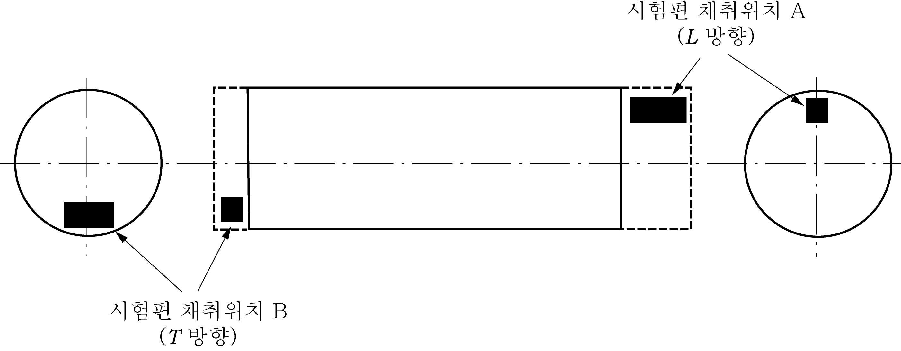
    **그림 2.1.19 평 축**
    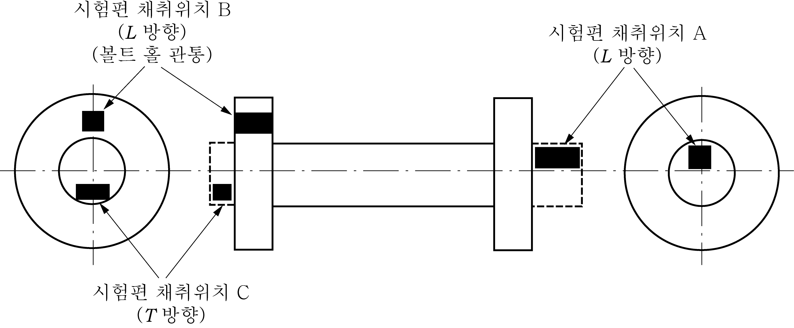
    **그림 2.1.20 플랜지 축**
    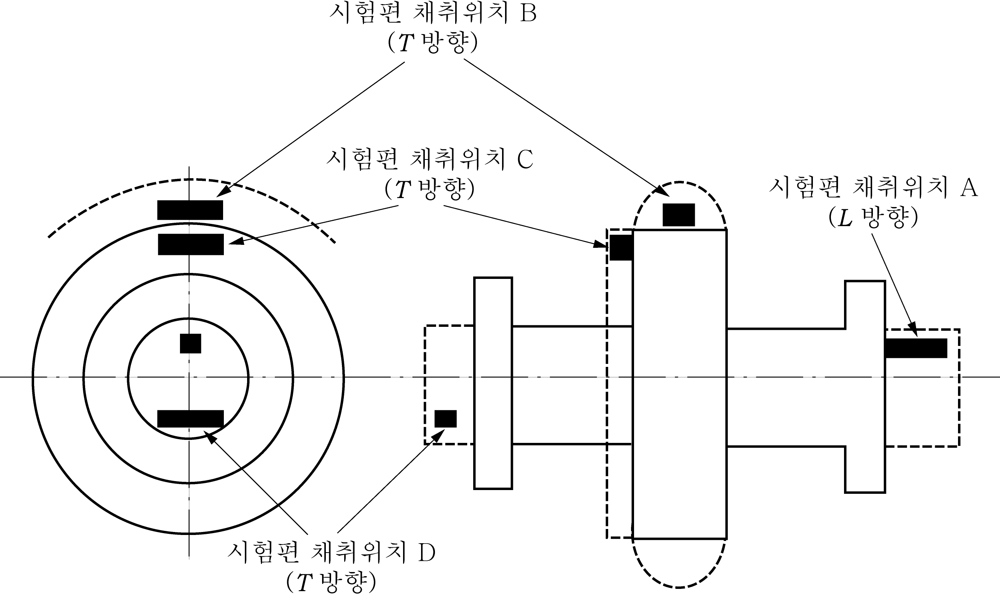
    **그림 2.1.21 칼라가 있는 플랜지 축**
    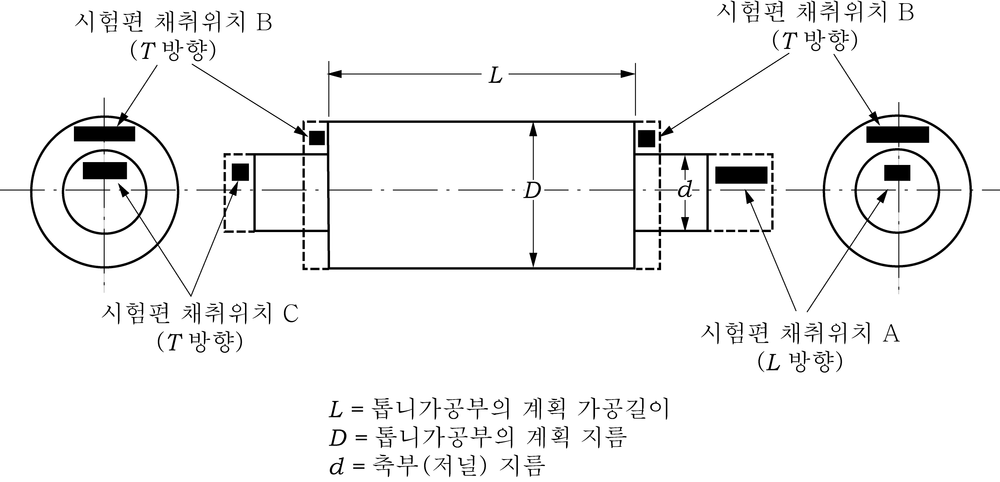
    **그림 2.1.22 피니언**
    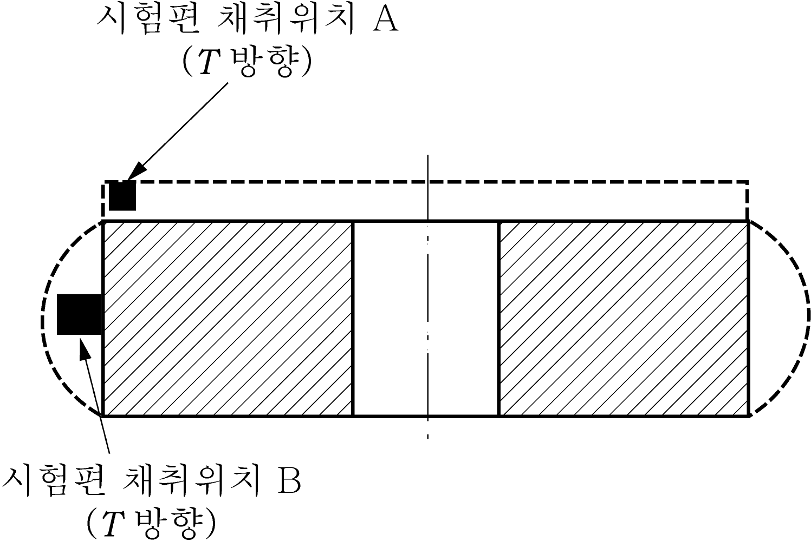
    **그림 2.1.23 기어 휠**
    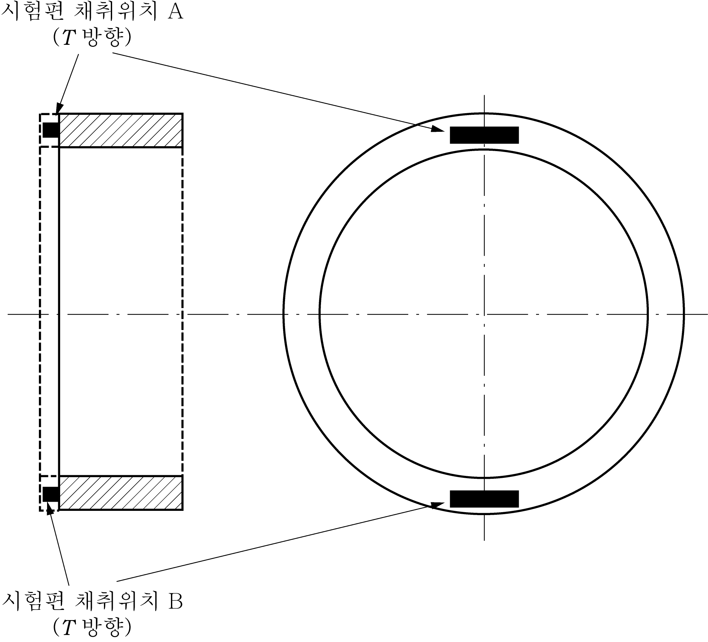
    **그림 2.1.24 기어 링**
    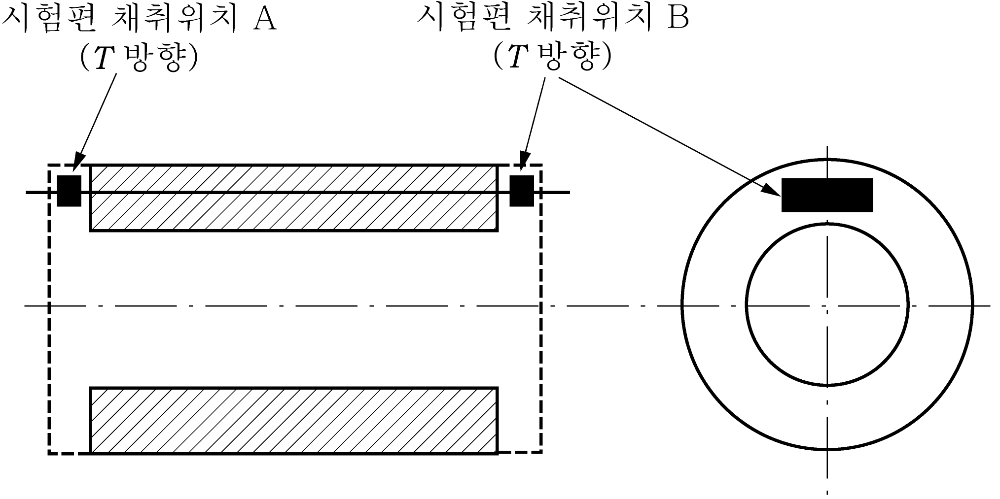
    **그림 2.1.25 피니언 슬리브**
    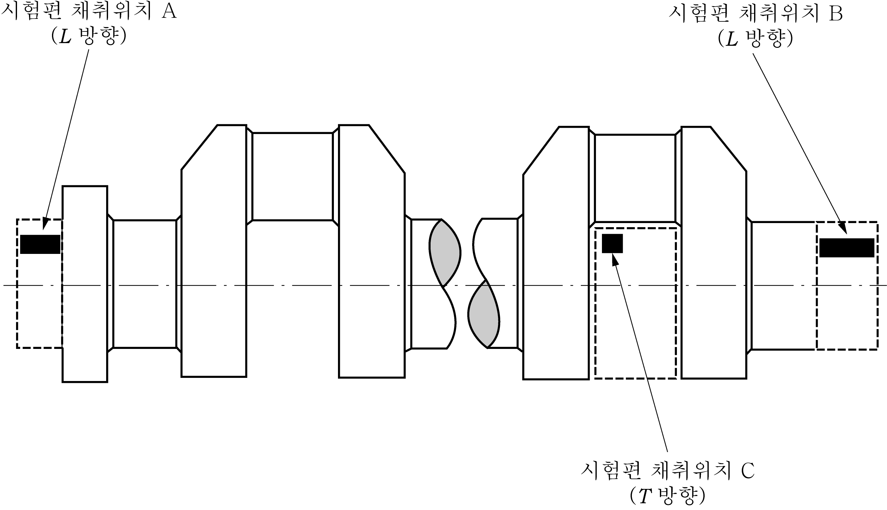
    **그림 2.1.26 자유단조 크랭크축**
    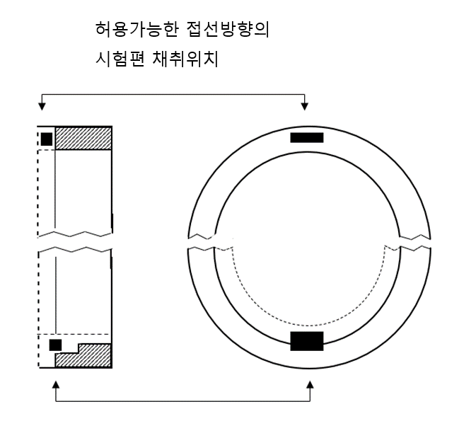
    **그림 2.1.27 단조 링** ***(2023)***
    - **(가)** **타두재, 핀틀 등의 선체부품 및 축, 연접봉 등의 일반기계부품** : 단강품의 한쪽 끝에서 1조의 시험편을 길이방향으로 채취한다. 다만, 1개의 열처리 후 본체의 중량(이하 **중량**이라 한다)이 4톤 이상이고 본체의 길이가 3 m이상인 경우에는 단강품의 양쪽 끝에서 각각 1조의 시험편을 채취하여야 한다. 또한 제조자의 요청이 있는 경우에는 **그림 2.1.19** 부터 **그림 2.1.21** 까지 등과 같이 시험편을 채취할 수 있다.
    - **(나)** **피니언** : 톱니가공부의 계획가공 지름이 200 mm를 넘는 경우에는 톱니가공부에 근접하는 위치에서 접선방향으로 1조의 시험편을 채취한다. (**그림 2.1.22** B 참조) 다만, 축부(저널)의 크기로 인하여 톱니가공부에서 시험편의 채취가 곤란할 경우에는 축의 한쪽 끝에서 접선방향으로 1조의 시험편을 채취한다. (**그림 2.1.22** C 참조) 그러나 축부의 지름이 200 mm 이하의 경우에는 축의 한쪽 끝에서 길이 방향으로 1조의 시험편을 채취한다. (**그림 2.1.24** A 참조) 계획가공 길이가 1.25 m를 넘을 때에는 양쪽 끝에서 각각 1조씩 채취한다.
    - **(다)** **소형 피니언** : 톱니가공부의 계획가공 지름이 200 mm 이하의 경우에는 기어축부에서 길이방향으로 1조의 시험편을 채취한다. (**그림 2.1.22** A 참조)
    - **(라)** **기어 휠** : 단강품의 한쪽 끝에서 1조의 시험편을 접선방향으로 채취한다. (**그림 2.1.23** A 또는 B 참조)
    - **(마)** **감속기어에 사용되는 기어림 및 디젤기관의 캠축구동장치에 사용되는 기어림**(**규칙 5편 2장 201.**의 **1**항 참조)은 다음의 규정에 따른다.
      - **(i)** 중량(시험재를 포함하여 열처리된 상태)이 3톤 또는 계획가공 지름이 2.5 m를 넘는 림은 지름방향의 반대위치에서 각각 1조의 시험편을 채취한다. (**그림 2.1.24** A 및 B 참조) 이 경우, 기계적 성질은 단조방향에 평행하게 채취한 경우의 규정을 적용한다. *(2023)*
        - **(ii)** 중량 및 계획가공 지름이 (i)에 해당되지 아니하는 경우에는 (i)의 규정 중 어느 한 위치에서 1조의 시험편을 채취한다.
    - **(바)** **피니언 슬리브** : 단강품의 한쪽 끝에서 1조의 시험편을 접선방향으로 채취한다. (**그림 2.1.25** A 또는 B 참조) 다만 계획가공 길이가 1.25 m를 넘을 때에는 양쪽 끝에서 각각 1조씩 채취한다.
    - **(사)** **크랭크 웨브** (crank web) : 단강품의 한쪽 끝에서 1조의 시험편을 접선방향으로 채취한다.
    - **(아)** **자유단조 크랭크축** (solid open die forged crankshaft) : 단강품의 회전축 쪽 끝부에서 1조의 시험편을 길이방향으로 채취한다. (**그림 2.1.26** (a) 참조) 또한 중량이 3톤을 넘는 경우에는 축의 양끝에서 축의 길이방향으로 각각 1조씩의 시험편을 채취한다. (**그림 2.1.26** A 및 B 참조) 다만, 크랭크스로우(crankthrows)를 가스절단이나 기계가공으로 제작하는 경우, 한 조의 시험편은 회전축 반대쪽 끝부의 가공으로 제거될 부분에서 접선방향으로 채취한다.(**그림 2.1.26** C 참조)
    - **(자)** **단조 링(예: 선회 링**(slewing rings)**)** : 각 단강품에서 접선방향으로 1조의 시험편을 채취한다.(**그림 2.1.27** 참조) 다만 계획가공 직경이 2.5 m를 넘거나 중량(시험재를 포함하여 열처리된 상태)이 3톤을 넘는 경우, 지름방향의 반대위치에서 2조의 시험편을 채취한다. *(2023)*
  - **(7)** 형단조 크랭크축 및 우리 선급의 승인을 받은 특별한 제조방법에 따라 제조되는 크랭크축 단강품에 대한 시험편의 수 및 채취위치는 제조방법과 관련하여 우리 선급의 별도 승인을 받아야 한다.
  - **(8)** 하나의 단조품이 후속 공정에서 여러 개의 부품으로 나누어지고, 이들 모든 부품들이 가열로에서 동시에 열처리 되는 경우에는 시험목적상 한 개의 단조품으로 `간주하고 이들 모든 부품들의 총 길이 및 합계중량에 따라 시험편의 수를 결정한다.
  - **(9)** 시험편은 최종 열처리가 끝날 때까지 본체에서 떼어내서는 아니 된다. 다만, 형단조나 표면경화처리를 하는 경우 등 검사원이 부득이하다고 인정하는 경우에는 최종열처리 전에 적절한 단계에서 떼어낼 수 있다.
  - **(10)** 단조품을 침탄처리 하는 경우에는 단조상태에서의 예비시험과 침탄처리 완료 후의 최종 시험 모두를 위하여 충분한 시험재를 준비하여야 한다. 이러한 목적으로 (5)호에 규정한 위치에서 규정된 시험편의 수의 2배를 채취한다. 다만, 단조품의 치수나 중량에 관계없이 시험편은 한 쪽 위치에서만 채취한다. 또한 일체형 저널을 가진 단조품의 경우, 시험편은 길이방향으로 채취한다. 시험재는 톱니가공부의 계획가공지름의 1/4 또는 60 mm 중 작은 수치까지 기계가공되어야 한다. 단조상태에서의 예비시험에서는 1조의 시험재를 공침탄(blank carburizing, 침탄제 대신에 중성제 또는 보호 도포제를 사용하여 침탄할 때와 같은 조작을 하는 처리) 및 단조품에 대하여 적용되는 것과 같은 열처리 사이클을 적용하여야 한다. 최종인정시험에서는 두 번째의 시험재를 공침탄 및 단조품과 함께 열처리한다. 제조자의 사정에 따라 시험재의 큰 단면부는 공침탄 또는 침탄처리를 할 수 있다. 그러나 이들 시험재는 최종 담금질 및 템퍼링 열처리 전에 요구되는 지름까지 기계가공되어야 한다. 침탄 처리되는 단조품에 대한 다른 시험방법에 대하여는 우리 선급의 특별한 승인을 받아야 한다. **【지침 참조】**
  - **(11)** 단위질량이 1000 kg 이하인 노멀라이징 처리 단조품 및 각각의 질량이 500 kg 이하인 담금질 후 템퍼링 처리 단조품에 대하여는 로트단위로 시험할 수 있다. 이 때 로트는 동일한 형상과 치수의 것으로, 동일 용강에서 만들어지고 또한 동일 가열로에서 동시에 열처리한 것으로 노멀라이징 처리 단조품의 경우는 6톤 이하, 담금질 후 템퍼링 처리 단조품의 경우에는 3톤 이하로 한다.
  - **(12)** 단순모양의 부품에 사용하는 압연봉강에 대한 로트는 다음에 따른다.
    - **(가)** 동일 슬래브에 속하고 동일 가열로에서 동시에 열처리한 것, 또는
    - **(나)** 동일 용강에 속하고 동일 지름이며, 동일 가열로에서 동시에 열처리한 것으로 총중량 2.5톤 또는 그 단수
- **8.** **육안검사 및 치수검사 【지침 참조】**
  - **(1)** 제조자는 모든 단강품을 열처리 후 및 최종다듬질 가공 후 또는 필요하면 중간가공 공정 중에서 적절한 때에 모든 접근가능한 표면을 100% 육안검사 하여야 하며, 검사원도 육안검사를 할 수 있도록 하여야 한다. 가능하다면 내면 및 구멍을 포함하여 이 육안검사를 실시하여야 한다. 검사방법 및 판정기준에 대하여는 우리 선급이 별도로 정하는 지침에 따른다. *(2023)*
  - **(2)** 특별히 규정하는 경우를 제외하고 단강품의 치수검사는 제조자의 책임 하에 하는 것으로 한다.
- **9.** **품질**
  - **(1)** 단강품은 품질이 균일하고 사용에 유해한 표면 또는 내부결함이 없는 것이어야 한다.
  - **(2)** **4**항 (7)호에 따라 단강품에 표면처리를 하는 경우, 단강품을 대표하는 시험재를 추가로 준비하여 단강품과 동시에 표면처리한 후 단면을 절단하여 국부경화역의 모양, 깊이 및 경도를 측정하고, 승인된 사양의 요건에 적합한지를 확인하여야 한다.
  - **(3)** 단강품을 후속 가공 중 또는 시험 중 유해한 결함이 발견된 경우에는 이전의 시험 결과에 관계없이 불합격으로 처리한다.
- **10.** **비파괴 검사**
  - **(1)** 제조자는 다음의 단강품에 대하여 적절한 공정에서 초음파탐상검사를 하고 그 성적서를 검사원에게 제시 또는 제출하여야 한다. 검사방법 및 판정기준에 대하여는 우리 선급이 별도로 정하는 지침에 따른다. **【지침 참조】**
    - **(가)** 타두재, 핀틀
    - **(나)** 규칙 **5편 2장 201.**의 **1**항에 규정하는 단강품
    - **(다)** 추력축, 중간축, 프로펠러축
    - **(라)** 감속기어, 감속기어축
    - **(마)** 터빈 로터, 터빈 디스크, 터빈 블레이드
  - **(2)** 다음 단강품의 중요부분에 대하여는 적절한 공정에서 자분탐상검사 또는 액체침투 탐상검사를 하여야 한다. 검사방법 및 판정기준에 대하여는 우리 선급이 별도로 정하는 지침에 따른다. **【지침 참조】**
    - **(가)** 규칙 **5편 2장 201.**의 **1**항에 규정하는 단강품
    - **(나)** 프로펠러축
    - **(다)** 감속기어
    - **(라)** 터빈 로터, 터빈 디스크, 터빈 블레이드
  - **(3)** 우리 선급은 기어의 톱니부에 상당하는 부분에 대하여 유황프린트의 채취를 요구할 수 있다.
  - **(4)** 우리 선급은 전 각호의 시험방법에 관계없이 적절하다고 인정하는 비파괴검사 방법의 채용을 승인할 수 있다. **【지침 참조】**
  - **(5)** 우리 선급은 (1)호 및 (2)호에 규정하는 단강품 이외에 우리 선급이 필요하다고 인정하는 단강품에 대하여 비파괴검사를 요구할 수 있다. **【지침 참조】**
  - **(6)** 용접구조에 사용하는 단강품의 용접부에 대하여는 우리 선급이 적절하다고 인정하는 비파괴검사를 하여야 한다. **【지침 참조】**
- **11.** **결함의 보수**
  - **(1)** 단강품의 결함은 그라인딩으로 제거할 수 있다. 다만 결함 제거 후에도 치수 요건을 만족하여야 한다.
  - **(2)** 결함 제거부는 적절한 비파괴검사 방법으로 결함이 완전히 제거되었는지를 확인하여야 한다.
  - **(3)** 결함을 제거한 부분은 그 밑면이 깊이의 대략 3배 정도의 곡률반경을 가져야 하며, 또한 주위의 표면과 매끄럽게 가공되어 날카로운 형상을 피해야 한다. 또한 그 사용 여부에 대하여 우리 선급 검사원의 승인을 받아야 한다.
  - **(4)** 비틀림 피로가 발생할 수 있는 크랭크축 및 프로펠러축 이외의 단조품에 대한 결함제거부의 용접보수는 우리 선급의 사전 승인을 받는 경우 허용될 수 있다. 이 경우 용접보수부의 위치 및 범위에 대한 상세, 용접시공방법, 열처리 및 후속의 검사방법 등에 대하여 우리 선급의 승인을 받아야 한다. *(2023)* **【지침 참조】**
  - **(5)** 제조자는 보수를 실시한 단강품에 대한 보수내용 및 후속검사결과를 기록하여 유지하여야 하며, 검사원이 요구하는 경우, 이를 제시하여야 한다.
- **12.** **재시험**
  - **(1)** 인장시험 또는 경도시험의 결과가 규격에 합격하지 아니한 경우에는 **109.**에 따라 재시험을 할 수 있다.
  - **(2)** 충격시험에 대하여는 **301.**의 **10**항 (3)호에 따라 재시험을 할 수 있다.
  - **(3)** 재시험을 위한 시험편은 최초의 시험편을 채취한 부분과 인접한 부분에서 채취하는 것이 바람직하다. 다만, 부득이한 경우에는 우리 선급의 승인을 받아 단조품 또는 단조 로트를 대표할 수 있는 다른 위치 또는 시험재에서 채취할 수 있다.
  - **(4)** 단조품 또는 로트에 대한 시험결과가 불합격인 경우, 제조자는 재열처리하여 시험을 다시 요청할 수 있다.
- **13.** **표시**
  - **(1)** 규정의 시험에 합격한 단강품의 표시는 **110.**에 따른다. 또한 다음을 포함하도록 한다. *(2023)*
    - **(가)** 적용된 경우, 시험 압력
    - **(나)** 최종 검사 날짜
  - **(2)** **표 2.1.88** 및 **2.1.89**의 비고 (1)이 적용되는 경우, 재료기호 표시는 *RSF*­(또는 *RSF*­*A*)의 ­에 요구되는 인장강도값을 기입한다. (예 : 요구되는 인장강도가 420 $\mathrm{N}/mm ^{2}$인 선체 및 일반용 탄소강 단강품 : *RSF* 420H)
  - **(3)** 용접구조에 사용하는 단강품은 재료기호 뒤에󰡒*W*󰡓를 부기한다. (예 : *RSF* 440H-*W, RSF* 440M-*W* )
  - **(4)** 압연봉강의 재료기호의 표시는 「*RSF*」 다음에󰡒*B*󰡓를 부기한다. (예 : 요구되는 인장강도가 440 $\mathrm{N}/mm ^{2}$인 기관용 압연봉강 : *RSFB* 440M)
  - **(5)** 중간축에 사용하는 단강품 중에서 **18항**에 따라 승인된 단강품의 재료기호 뒤에는󰡒*I*󰡓를 부기한다. (예 : *RSF* 900*AM*-*I*) *(2017)*
- **14.** **시험증명서** 제조자는 모든 시험에 합격한 단강품에 대해 개별 혹은 배치별로 다음의 사항이 기재된 시험증명서를 검사원에게 제출해야 한다. *(2017)*
  - **(1)** 구매자 명칭 및 구매번호
  - **(2)** 단조 상세 및 강재 품질
  - **(3)** 식별번호
  - **(4)** 강재 제조법, 단조 번호 및 화학성분(레이들 분석치)
  - **(5)** 시험편 번호 및 시험결과
  - **(6)** 비파괴검사 결과(해당되는 경우)
  - **(7)** 열처리 상세(온도 및 유지시간 등)
- **15.** **크랭크축에 대한 특별규정**
  - **(1)** 일반적인 제조방법으로 제조된 축의 계획가공 지름이 250 mm 이상인 일체형 크랭크축은 원칙적으로 크랭크부를 다듬질 모양에 가까운 상태로 가공한 후 열처리를 하여야 한다. **【지침 참조】**
  - **(2)** 일반적인 제조방법과 다른 특수한 방법으로 제조한 일체형 크랭크축 및 반조립형 크랭크축의 크랭크스로우 및 전조립형 크랭크암의 제조방법 및 시험편의 채취요령에 대하여는 미리 우리 선급이 지정하는 시험을 받아야 한다.
    **【지침 참조】**
  - **(3)** 크랭크축의 치수를 경감하기 위하여 특수한 제조방법을 적용하고자 할 경우(규칙 **5편 2장 208.** 참조)에는 미리 우리 선급이 지정하는 시험을 받아야 한다.
- **16.** **터빈 로터 등에 대한 특별규정**
  - **(1)** 터빈 로터는 다음 각 호의 규정에 따라 시험편을 채취하여야 한다.
    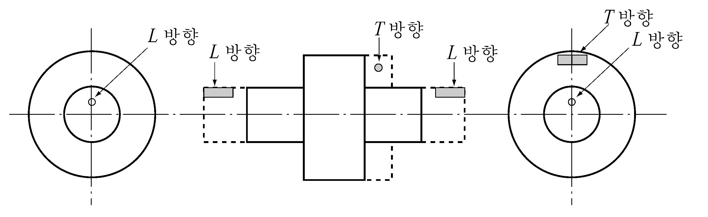
    **그림 2.1.28 터빈로터에서 시험편을 채취하는 방법**
    - **(가)** 중량이 3톤을 넘는 경우 : 축의 양끝에서 축의 길이방향 및 동체부에서 접선방향으로 각각 1조씩의 시험편을 채취한다. (**그림 2.1.28** 참조)
    - **(나)** 중량이 3톤 이하의 경우 : 축의 한쪽 끝에서 축의 길이방향 및 동체부에서 접선방향으로 각각 1조씩의 시험편을 채취한다.
  - **(2)** 터빈 디스크는 그 보스부에서 접선방향으로 1조의 시험편을 채취하여야 한다. (**그림 2.1.29** 참조)
  - **(3)** 증기의 입구온도가 400℃를 넘는 추진용 일체형 터빈 로터(용접구조를 포함)는 황삭, 열처리 후 또는 그 후의 적절한 시기에 적어도 1회의 가열계측 시험을 하여야 한다. 가열계측 시험방법에 대하여는 우리 선급의 승인을 받아야 한다.
    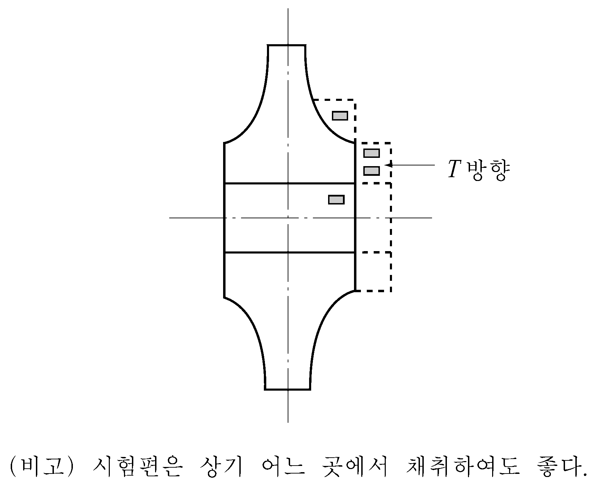
    **그림 2.1.29 터빈 디스크에서의 시험편의 채취방법**
- **17.** **터빈 블레이드에 대한 특별규정** 터빈 블레이드는 승인된 시험규격으로 시험을 하여야 한다.
- **18.** **중간축에 대한 특별규정** ***(2017)***
  - **(1)** 중간축 재료로 규격 최소인장강도가 800 $\mathrm{N}/mm ^{2}$를 넘고 950 $\mathrm{N}/mm ^{2}$ 미만인 합금강 중에서 중간축의 치수 경감 및 허용 비틀림진동 응력을 높이고자 할 경우(**규칙 5편 3장 203.** 및 **4장 202.** 참조)에는 다음을 따른다.

    **표 2.1.90 청정도 요건(ISO 4967:2013 방법 A 적용)** ***(2022)***

    | 개재물 그룹 | 계열 | 도표 그림 지수 *I* |
    | --- | --- | --- |
    | A | 얇음 | 1 이하 |
    | A | 두꺼움 | 1 이하 |
    | B | 얇음 | 1.5 이하 |
    | B | 두꺼움 | 1 이하 |
    | C | 얇음 | 1 이하 |
    | C | 두꺼움 | 1 이하 |
    | D | 얇음 | 1 이하 |
    | D | 두꺼움 | 1 이하 |
    | DS | - | 1 이하 |
    - **(가)** 미리 우리 선급이 지정하는 비틀림 피로시험을 제조법 승인 시에 실시하여 재료의 피로수명을 입증해야 한다.
    - **(나)** 청정도(cleanliness)시험을 실시하고 **표 2.1.90**의 요건을 만족해야 한다. 시험재는 단조 또는 압연 제품의 각 용강마다 채취해야 한다. 청정도 요건을 만족하기 위하여 황, 인, 산소의 국부 집중이 최소화되도록 제조하여야 한다. 화학성분도 우리 선급의 승인을 받아야 한다.

#### 602. 스테인리스강 단강품

- **1.** **적용**
  - **(1)** 이 규정은 설계온도 ­165℃ 이상의 저온용 또는 내식용의 관장치의 밸브, 부착품 등에 사용하는 스테인리스강 단강품(이하 **단강품**이라 한다)에 대하여 적용한다.
  - **(2)** **602.**에 규정하지 아니한 단강품에 대하여는 **101.**의 **2**항에 따른다.
- **2.** **종류** 단강품의 종류는 **표 2.1.91**에 따른다.
- **3.** **열처리** 단강품은 원칙적으로 고용화 열처리를 하여야 한다.
- **4.** **화학성분** 단강품의 화학성분은 **표 2.1.91**에 따른다.

  **표 2.1.91 종류 및 화학성분**

  | 종 류 | 화학성분 (%) |   |   |   |   |   |   |   |
  | --- | --- | --- | --- | --- | --- | --- | --- | --- |
  | 종 류 | *C* | *Si* | *Mn* | *P* | *S* | *Cr* | *Ni* | 기타 |
  | *RSSF* 304 | 0.08 이하 | 1.00 이하 | 2.00 이하 | 0.040 이하 | 0.030 이하 | 18.00∼20.00 | 8.00∼12.00 | - |
  | *RSSF* 304 *L* | 0.030 이하 | 1.00 이하 | 2.00 이하 | 0.040 이하 | 0.030 이하 | 18.00∼20.00 | 8.00∼12.00 | - |
  | *RSSF* 309 *S* | 0.08 이하 | 1.00 이하 | 2.00 이하 | 0.040 이하 | 0.030 이하 | 22.00∼24.00 | 12.00∼15.00 | - |
  | *RSSF* 310 *S* | 0.08 이하 | 1.00 이하 | 2.00 이하 | 0.040 이하 | 0.030 이하 | 24.00∼26.00 | 19.00∼22.00 | - |
  | *RSSF* 316 | 0.08 이하 | 1.00 이하 | 2.00 이하 | 0.040 이하 | 0.030 이하 | 16.00∼18.00 | 10.00∼14.00 | Mo 2.00∼3.00 |
  | *RSSF* 316 *L* | 0.030 이하 | 1.00 이하 | 2.00 이하 | 0.040 이하 | 0.030 이하 | 16.00∼18.00 | 10.00∼14.00 | Mo 2.00∼3.00 |
  | *RSSF* 317 | 0.08 이하 | 1.00 이하 | 2.00 이하 | 0.040 이하 | 0.030 이하 | 18.00∼20.00 | 10.00∼15.00 | Mo 3.00∼4.00 |
  | *RSSF* 321 | 0.08 이하 | 1.00 이하 | 2.00 이하 | 0.040 이하 | 0.030 이하 | 17.00∼19.00 | 9.00∼12.00 | Ti≥5×C |
  | *RSSF* 347 | 0.08 이하 | 1.00 이하 | 2.00 이하 | 0.040 이하 | 0.030 이하 | 17.00∼19.00 | 9.00∼13.00 | Nb+Ta≥10×C |
- **5.** **기계적 성질**
  - **(1)** 단강품의 기계적 성질은 **표 2.1.92**에 따른다.
  - **(2)** 우리 선급은 단강품의 용도에 따라 충격시험 또는 내식성 시험을 요구할 수 있다.

    **표 2.1.92 기계적 성질**

    | 재료기호 | 인 장 시 험 |   |   |   |
    | --- | --- | --- | --- | --- |
    | 재료기호 | 항복강도($\mathrm{N}/mm ^{2}$) | 인장강도($\mathrm{N}/mm ^{2}$) | 연신율($\%$)($L=5.65 \sqrt {A}$) | 단면수축률($\%$) |
    | *RSSF* 304 *L* | 175 이상 | 450 이상 | 37 이상 | 50 이상 |
    | *RSSF* 316 *L* | 175 이상 | 450 이상 | 37 이상 | 50 이상 |
    | 상기 이외 | 205 이상 | 520 이상 | 37 이상 | 50 이상 |
- **6.** **시험편의 채취**
  - **(1)** 인장시험편의 수는 **601.**의 **7항**에 따른다.
  - **(2)** 인장시험편은 우리 선급이 특히 지정하는 경우를 제외하고 그 길이방향을 단조방향과 평행으로 채취한다.
  - **(3)** **601.**의 **7**항 (5)호의 (다) 및 (라)의 대표제품에 대하여 시험을 할 경우 검사원은 제품마다 경도시험을 요구할 수 있다.
- **7.** **표시** 규정의 시험에 합격한 단강품의 표시는 **110.**에 따른다.

#### 603. 체인용 단강품

- **1.** **적용**
  - **(1)** 이 규정은 규칙 **4편 8장**에 규정하는 체인케이블 및 체인용 부품에 사용하는 단강품(이하 **단강품**이라 한다)에 대하여 적용한다.
  - **(2)** 해양구조물용 체인의 제조에 사용하는 단강품에 대하여는 우리 선급이 별도로 정하는 지침에 따른다. **【지침 참조】**
  - **(3)** **603.**에 규정하지 아니한 단강품에 대하여는 **101.**의 **2**항에 따른다.
  - **(4)** 본 규정 이외의 사항에 대하여는 우리 선급이 적절하다고 인정하는 바에 따른다. **【지침 참조】**
- **2.** **종류** 단강품의 종류는 **표 2.1.93**에 따른다.

  **표 2.1.93 종류**

  | 종 류 | 재료기호 | 용 도 |
  | --- | --- | --- |
  | 제 2 종 체인용 단강품 | *RSFC* 50 | 제 2 종 체인 |
  | 제 3 종 체인용 단강품 | *RSFC* 70 | 제 3 종 체인 |
- **3.** **열처리** 단강품은 노멀라이징, 노멀라이징 후 템퍼링, 담금질 후 템퍼링 또는 우리 선급의 승인을 받은 방법에 따라 열처리를 하여야 한다.
- **4.** **탈산방법 및 화학성분** 단강품의 탈산방법 및 화학성분은 **표 2.1.94**에 따른다. 다만, 우리 선급의 승인을 받아 **표 2.1.94**에 규정한 이외의 원소를 첨가할 수 있다.

  **표 2.1.94 탈산방법 및 화학성분 (%)**

  | 재료기호 | 탈산방법 | $C$ | $Si$ | $Mn$ | $P$ | $S$ | $A1$(1) |
  | --- | --- | --- | --- | --- | --- | --- | --- |
  | *RSFC* 50 | 세립킬드 | 0.24 이하 | 0.15∼0.55 | 1.60 이상 | 0.035 이하 | 0.035 이하 | 0.020 이상 |
  | *RSFC* 70 | 세립킬드 | 0.36 이하 | 0.15∼0.55 | 1.00∼1.90 | 0.035 이하 | 0.035 이하 | 0.020 이상 |
  | (비고) (1) Al의 함유량은 전함유량으로 하며 일부를 세립화 원소로 치환할 수 있다. |   |   |   |   |   |   |   |
- **5.** **기계적 성질** 단강품의 기계적 성질은 **표 2.1.95**에 따른다.

  **표 2.1.95 기계적 성질**

  | 재료기호 | 인장시험 |   |   |   | 충격시험(1) |   |
  | --- | --- | --- | --- | --- | --- | --- |
  | 재료기호 | 항복강도 ($\mathrm{N}/mm ^{2}$)(2) | 인장강도 ($\mathrm{N}/mm ^{2}$) | 연신율($\%$) ($L=5d$) | 단면수축률 ($\%$) | 시험온도 (℃) | 평균흡수에너지 (J) |
  | *RSFC* 50 | 295 이상 | 490∼690 | 22 이상 | ­ | ­ | ­ |
  | *RSFC* 70 | 410 이상 | 690 이상 | 17 이상 | 40 이상 | 0 | 60 이상 |
  | (비고) (1) 1조의 시험편 중에서 2개 이상이 규정의 평균흡수에너지값 미만이거나 어느 한 개라도 규정의 평균흡수에너지값의 70 $\%$미만인 경우는 불합격으로 한다. |   |   |   |   |   |   |
- **6.** **시험편의 채취**
  - **(1)** 단강품의 시험재는 동일 용강에 속하는 제품 25개마다 본체에서 채취하며 작은 지름을 갖는 단강품에 대하여는 우리 선급의 승인을 받아 그 수를 감할 수 있다. 다만, 우리 선급의 승인을 받은 경우에는 단조 공정 중의 적절한 시기에 채취하거나 또는 제품 본체와 같은 정도의 단조효과를 가진 것으로 할 수 있다. 이때 시험재의 열처리는 제품 본체에 한 것과 같은 조건이어야 한다.
  - **(2)** 시험편은 (1)호의 시험재로부터 단조방향으로, 제 1 종 및 제 2 종 체인용 단강품에 대하여는 인장시험편 1개, 기타 체인용 단강품에 대하여는 인장시험편 1개와 충격시험편 1조를 채취한다.
  - **(3)** 시험편은 **그림 2.1.5**와 같이 외주로부터 지름의 대략 1/6의 위치에서 채취한다.
- **7.** **표면검사** 단강품은 열처리 후 표면검사를 실시하여야 하며 유해한 결함이 없어야 한다.
- **8.** **재시험** 인장시험 또는 충격시험 결과가 규격에 합격하지 아니한 경우에는 **306.**의 **9**항에 따라 재시험을 할 수 있다.
- **9.** **표시** 규정의 시험에 합격한 단강품의 표시는 **110.**에 따른다.

#### 604. 저온용 단강품

- **1.** **적용**
  - **(1)** 이 규정은 저온용 관장치의 밸브, 부착품 등에 사용하는 단강품(이하 **단강품**이라 한다)에 대하여 적용한다.
  - **(2)** **604.**에 규정하지 아니한 단강품 또는 전호 이외의 장소에 사용되는 단강품에 대하여는 **101.**의 **2**항에 따른다.
- **2.** **종류** 단강품의 종류는 **표 2.1.96**에 따른다.
- **3.** **열처리** 단강품은 노멀라이징, 노멀라이징 후 템퍼링, 담금질 후 템퍼링 또는 2회 노멀라이징 후 템퍼링 등의 열처리를 하여야 한다.
- **4.** **탈산방법 및 화학성분** 단강품의 탈산방법 및 화학성분은 **표 2.1.96**에 따른다.

  **표 2.1.96 종류 및 화학성분**

  | 종류 | 탈산방법 | 화 학 성 분 ($\%$) |   |   |   |   |   |   |   |   |
  | --- | --- | --- | --- | --- | --- | --- | --- | --- | --- | --- |
  | 종류 | 탈산방법 | $C$ | $Si$ | $Mn$ | $P$ | $S$ | $N i$ | $Cr$ | $Cu$ | $A1$ |
  | *RLFA* | 세립킬드 | 0.23 이하 | 0.15∼0.35 | 1.10 이하 | 0.030 이하 | 0.030 이하 | - | - | - | - |
  | *RLFB* | 세립킬드 | 0.20 이하 | 0.15∼0.35 | 1.60 이하 | 0.030 이하 | 0.030 이하 | - | - | - | - |
  | *RLFC* | 세립킬드 | 0.12 이하 | 0.10∼0.35 | 0.55∼1.00 | 0.030 이하 | 0.030 이하 | 0.50∼0.95 | 0.50∼0.95 | 0.40∼0.75 | 0.04∼0.30 |
  | *RLF* 3 | 세립킬드 | 0.20 이하 | 0.15∼0.35 | 0.90 이하 | 0.030 이하 | 0.030 이하 | 3.25∼3.75 | - | - | - |
  | *RLF* 9 | 세립킬드 | 0.10 이하 | 0.10∼0.35 | 0.90 이하 | 0.030 이하 | 0.030 이하 | 8.50∼9.60 | - | - | - |
- **5.** **기계적 성질**
  - **(1)** 단강품의 기계적 성질은 **표 2.1.97**에 따른다.
  - **(2)** 우리 선급은 단강품의 용도에 따라서 기타의 시험을 요구할 수 있다.

    **표 2.1.97 기계적 성질**

    | 재료기호 | 인장시험 |   |   |   | 충격시험(2) |   |
    | --- | --- | --- | --- | --- | --- | --- |
    | 재료기호 | 항복강도 ($\mathrm{N}/mm ^{2}$) | 인장강도 ($\mathrm{N}/mm ^{2}$) | 연신율($\%$) ($L=5.65 \sqrt {A}$) | 단면수축률 ($\%$) | 시험온도 (℃) | 평균흡수에너지 (J) |
    | *RLFA* | 205 이상 | 410 이상 | 23 이상 |   | －40(1) |   |
    | *RLFB* | 275 이상 | 490 이상 | 20 이상 | 40 이상 | －50(1) | 27 이상 |
    | *RLFC* | 205 이상 | 410 이상 | 23 이상 |   | －60(1) |   |
    | *RLF* 3 | 275 이상 | 490 이상 | 23 이상 | 50 이상 | －95 | 34 이상 |
    | *RLF* 9 | 520 이상 | 680 이상 | 19 이상 | 45 이상 | －196 | 41 이상 |
    | (비고) (1) **규칙 7편 5장**의 규정이 적용되는 단강품에 대한 충격시험온도는 설계온도보다 5 ℃ 낮은 온도 또는 ­20℃ 중 낮은 온도로 한다. (2) 1조의 시험편 중에서 2개 이상이 규정의 평균흡수에너지값 미만이거나 어느 하나라도 규정의 평균흡수에너지값의 70 $\%$ 미만인 경우는 불합격으로 한다. |   |   |   |   |   |   |
- **6.** **시험편의 채취**
  - **(1)** 시험편의 수는 **601.**의 **7**항에 따른다.
  - **(2)** 인장시험편 및 충격시험편은 특별히 인정하는 경우를 제외하고 그 길이방향을 단조방향에 평행으로 채취한다.
  - **(3)** **601.**의 **7**항 (5)호의 (다) 및 (라)의 대표제품에 대하여 시험을 할 경우에는 검사원은 제품마다 경도시험을 요구할 수 있다.
- **7.** **재시험**
  - **(1)** 인장시험의 결과가 규격에 합격하지 아니한 경우에는 **109.**에 따라 재시험을 할 수 있다.
  - **(2)** 충격시험에 대하여는 **304.**의 **9**항에 따라 재시험을 할 수 있다.
- **8.** **표시** 규정의 시험에 합격한 단강품의 표시는 **601.**의 **13**항 (1)호에 따른다. 또한, **표 2.1.97**의 비고 (1)을 적용한 단강품에는 재료기호의 뒤에 󰡒충격시험온도 *T*󰡓를 부기한다. (예 : *RLFA*­25 *T*)

### 제 7 절 동 및 동합금

#### 701. 동관 및 동합금관

- **1.** **적용**
  - **(1)** 이 규정은 동관 및 동합금관에 대하여 적용한다.
  - **(2)** 동관 및 동합금관은 *KS D*5301의 규격 또는 이와 동등 이상의 규격에 적합하여야 한다.
  - **(3)** **701.**에 규정하지 아니한 동관 및 동합금관에 대하여는 **101.**의 **2**항에 따른다.
- **2.** **종류** 동관 및 동합금관의 종류는 **표 2.1.98**에 따른다.

  **표 2.1.98 종류**

  | 구 분 | 종 류 | 재 료 기 호 |
  | --- | --- | --- |
  | 동 관 | 이음매 없는 인탈산 동관 | *C* 1201, *C* 1220 |
  | 동합금관 | 이음매 없는 황동관 | *C* 2600, *C* 2700, *C* 2800 |
  | 동합금관 | 이음매 없는 복수기용 황동관 | *C* 4430, *C* 6870, *C* 6871, *C* 6872 |
  | 동합금관 | 이음매 없는 복수기용 백동관 | *C* 7060, *C* 7100, *C* 7150 |
- **3.** **기계적 성질** 동관 및 동합금관의 기계적 성질은 **표 2.1.99**에 따른다.

  **표 2.1.99 기계적 성질**

  | 종 류 | 재료기호 | 인장시험(1) |   |
  | --- | --- | --- | --- |
  | 종 류 | 재료기호 | 인장강도($\mathrm{N}/mm ^{2}$) | 연신율($\%$) |
  | 이음매 없는 인탈산 동관 | *C* 1201, *C* 1220 | 206 이상 | 40 이상 |
  | 이음매 없는 황동관 | *C* 2600 | 275 이상 | 45 이상 |
  | 이음매 없는 황동관 | *C* 2700 | 294 이상 | 40 이상 |
  | 이음매 없는 황동관 | *C* 2800 | 314 이상 | 35 이상 |
  | 이음매 없는 복수기용 황동관 | *C* 4430 | 314 이상 | 30 이상 |
  | 이음매 없는 복수기용 황동관 | *C* 6870, *C* 6871, *C* 6872 | 373 이상(2) | 40 이상 |
  | 이음매 없는 복수기용 황동관 | *C* 6870, *C* 6871, *C* 6872 | 353 이상(3) | 40 이상 |
  | 이음매 없는 복수기용 백동관 | *C* 7060 | 275 이상 | 30 이상 |
  | 이음매 없는 복수기용 백동관 | *C* 7100 | 314 이상 | 30 이상 |
  | 이음매 없는 복수기용 백동관 | *C* 7150 | 363 이상 | 30 이상 |
  | (비고) (1) 어닐링으로 열처리를 한 동관 및 동합금관의 기계적 성질 (2) 관의 바깥지름이 5∼50(mm)인 것. (3) 관의 바깥지름이 51∼200(mm)인 것. |   |   |   |
- **4.** **시험 및 검사** 시험 및 검사는 *KS D* 5301의 규정에 따른다. 다만, 최고사용압력이 1 *MPa* 이하의 것에 대하여는 검사원의 입회를 필요로 하지 아니한다.
- **5.** **표시** 규정의 시험에 합격한 동관 및 동합금관의 표시는 **110.**에 따른다.

#### 702. 동합금 주물

- **1.** **적용**
  - **(1)** 이 규정은 프로펠러, 프로펠러 블레이드 및 보스부에 사용하는 동합금주물(이하 **프로펠러 주물**이라 한다)의 제조, 검사 및 보수 절차에 대하여 적용한다. 또한, 우리 선급이 적절하다고 인정하는 경우에는 사용 중 손상을 입은 프로펠러 주물의 보수 및 검사에도 적용할 수 있다. *(2021)* **【지침 참조】**
  - **(2)** 프로펠러 이외의 중요부분에 사용하는 동합금 주물은 한국산업규격(*KS*) 또는 이와 동등 이상의 규격에 적합한 것이어야 한다. 이 경우 설계와 관련하여 특별히 지정한 것에 대하여는 검사원의 입회하에 시험 및 검사를 실시하여야 한다.
  - **(3)** **702.**에 규정하지 아니한 프로펠러 주물에 대하여는 **101.**의 **2**항에 따른다.
- **2.** **종류** 프로펠러 주물의 종류는 **표 2.1.100**에 따른다.

  **표 2.1.100 종류**

  | 종 류 | 재료기호 |
  | --- | --- |
  | 고강도 황동주물 제 1 종 | *CU* 1 |
  | 고강도 황동주물 제 2 종 | *CU* 2 |
  | 알루미늄 청동주물 제 3 종 | *CU* 3 |
  | 알루미늄 청동주물 제 4 종 | *CU* 4 |
- **3.** **제조법**
  - **(1)** 용탕은 가스가 제거된 용융 금속을 사용하여 건조된 주형에 주입되어야 한다.
  - **(2)** 용탕주입은 액체의 흐름을 교반하지 않도록 잘 제어되어야 하며, 주형내로 슬래그가 혼입되지 않도록 특별한 장치 및/또는 방법이 사용되어야 한다.
  - **(3)** 잔류응력을 감소시키기 위하여 응력완화 열처리를 할 수 있다. 이 경우 제조자는 열처리의 상세에 대하여 우리 선급의 승인을 받아야 한다. 응력완화 열처리온도 및 유지시간은 우리 선급이 별도로 정하는 지침에 따른다.
    **【지침 참조】**
- **4.** **화학성분**
  - **(1)** 프로펠러 주물의 화학성분은 **표 2.1.101**에 따른다.

    **표 2.1.101 화학성분**

    | 재료기호 | $Cu$**(%)** | $A1$**(%)** | $Mn$**(%)** | $Zn$**(%)** | $Fe$**(%)** | $Sn$**(%)** | $N i$**(%)** | $Pb$**(%)** |
    | --- | --- | --- | --- | --- | --- | --- | --- | --- |
    | *CU* 1 | 52∼62 | 0.5∼3.0 | 0.5∼4.0 | 35∼40 | 0.5∼2.5 | 1.5 이하 | 1.0 이하 | 0.5 이하 |
    | *CU* 2 | 50∼57 | 0.5∼2.0 | 1.0∼4.0 | 33∼38 | 0.5∼2.5 | 1.5 이하 | 3.0∼8.0 | 0.5 이하 |
    | *CU* 3 | 77∼82 | 7.0∼11.0 | 0.5∼4.0 | 1.0 이하 | 2.0∼6.0 | 0.1 이하 | 3.0∼6.0 | 0.03 이하 |
    | *CU* 4 | 70∼80 | 6.5∼9.0 | 8.0∼20.0 | 6.0 이하 | 2.0∼5.0 | 1.0 이하 | 1.5∼3.0 | 0.05 이하 |
  - **(2)** 제조자는 검사원이 확인할 수 있도록, 화학성분을 분석한 기록을 보관해야 한다. *(2021)*
  - **(3)** *CU* 1 및 *CU* 2에 대하여는 다음 각 호에도 적합하여야 한다.
    아연당량($\%$) = $100- \frac{100 \times Cu(\%)}{100+A}$
    이 경우
    *A* = *Sn* + 5*Al* - 0.5*Mn* - 0.1*Fe* - 2.3*Ni*($\%$)
    - **(가)** 다음에서 정하는 아연당량(%)은 45 %를 초과하여서는 아니 된다.
    - **(나)** 미세 구조를 $\alpha$상의 비율 결정에 의해 검증해야 한다. 이를 위해 적어도 하나의 시험편을 각 용강(heat)마다 채취해야 한다. $\alpha$상의 비율은 5개소의 평균값으로 결정된다. *(2021)*
    - **(다)** 각 시험봉(test bar)에 대하여 동일 단면상 5개소의 $\alpha$상을 측정하여 이로부터 평균치가 25 % 이상이어야 한다.
- **5.** **기계적 성질** 프로펠러 주물의 기계적 성질은 **표 2.1.102**에 따른다. 다만, 이 표의 값은 본체와 별도로 주조한 시험재에 대하여 적용하며 본체에 붙여 주조한 시험재의 기계적 성질에 대하여는 우리 선급이 적당하다고 인정하는 바에 따른다. **【지침 참조】**

  **표 2.1.102 기계적 성질**

  | 재료기호 | 항복강도(1) ($\mathrm{N}/mm ^{2}$) | 인장강도 ($\mathrm{N}/mm ^{2}$) | 연신율($\%$) ($L=5d$) |
  | --- | --- | --- | --- |
  | *CU* 1 | 175 이상 | 440 이상 | 20 이상 |
  | *CU* 2 | 175 이상 | 440 이상 | 20 이상 |
  | *CU* 3 | 245 이상 | 590 이상 | 16 이상 |
  | *CU* 4 | 275 이상 | 630 이상 | 18 이상 |
  | (비고) (1) 항복강도는 0.2% 내력으로 측정되며, 설계와 관련하여 우리 선급이 요구하는 경우에 대하여 적용한다. **【지침 참조】** (2) 대빙구조의 선급부호를 가지는 선박에 사용하는 프로펠러에 대하여는 *R*14*A*호 시험편에 의한 연신율이 19% 이상이어야 하며, 샤르피 V노치 충격시험편에 의한 흡수에너지는 -10℃에서 21 J이상이어야 한다. |   |   |   |
- **6.** **시험재 및 시험편의 채취**
  - **(1)** 시험재는 프로펠러 주조용 주형과 동일한 재질로 만든 주형으로, 프로펠러 주물과 별도로 주조하는 것을 원칙으로 하며, 주물 본체를 주조하는데 사용하는 레이들의 용탕을 사용하여 주조하고 동일 조건으로 냉각 및 열처리를 하여야 한다.
  - **(2)** 시험재의 형상 및 치수는 **그림 2.1.30**의 실선 또는 점선모양의 시험재로 하여도 좋다.

    | 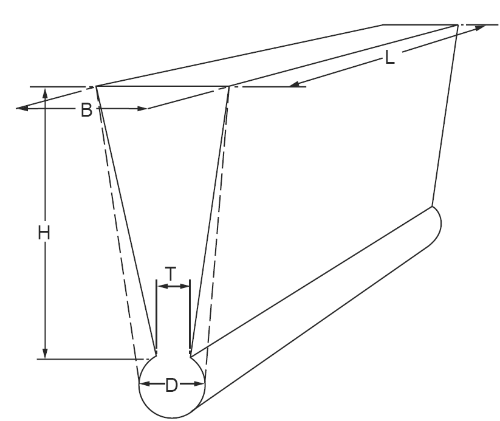 | H ≥ 100 mm B ≥ 50 mm L > 150 mm T ≥ 15 mm D ≥ 25 mm |
    | --- | --- |
    | **그림 2.1.30 시험재의 모양** ***(2025)*** |   |
  - **(3)** 인장시험편은 시험재를 본체와 일체로 주조한 경우에는 제품마다 1개 또는 별도 주입한 경우에는 각 레이들에서 채취한 시험재마다 1개를 채취하여야 한다.
  - **(4)** *CU* 1 및 *CU* 2의 $\alpha$상을 측정하기 위하여 각 레이들마다 1개의 시험봉을 채취하여야 한다. 다만, 인장시험편으로 대체할 수 있다.
  - **(5)** 시험재를 본체와 일체로 주조한 경우 시험재의 채취위치는 블레이드의 중심으로부터 0.5 ~ 0.6 *R*사이로 (*R*은 프로펠러의 반지름) 한다. 또한, 시험재를 프로펠러 주물로부터 제거하고자 하는 경우에는 열영향을 받지 않는 방법을 사용하여야 한다.
- **7.** **표면검사 및 치수검사**
  - **(1)** 제조자는 최종 가공 후의 프로펠러 주물에 대하여 육안으로 100% 표면검사를 하여야 한다. 검사원은 일반적인 육안검사를 실시한다. *(2021)*
  - **(2)** 프로펠러 주물에는 균열, 고온터짐(hot tear) 또는 기타 사용상 지장을 줄 수 있을 정도의 유해한 결함이 없어야 한다. *(2021)*
  - **(3)** 제조자는 프로펠러 주물의 치수검사를 하고, 치수검사 성적서를 검사원에게 제출하여야 한다. 검사원은 치수검사의 입회를 요구할 수 있다. 또한 교정을 하는 경우, 교정방법에 대하여는 우리 선급이 적당하다고 인정하는 지침에 따른다. **【지침 참조】**
  - **(4)** 검사원은 용접보수를 조사할 목적으로 에칭(예 : 염화철)을 요구할 수 있다.
- **8.** **품질** 프로펠러 주물은 품질이 균일하고 사용상 문제를 일으킬 수 있는 유해한 결함이 없는 것이어야 한다. 모래 및 슬래그 혼입이 적고, 탕경계(cold shut) 및 스캐브(scab)가 작은 것과 같은 기계가공 후에도 여전히 보일 수 있는 사소한 주조결함들은 **10항** (5)호에 따라 제조자에 의해 다듬어져야 한다.
- **9.** **비파괴검사**
  - **(1)** 프로펠러 주물의 중요부분에 대하여는 우리 선급이 별도로 정하는 지침에 따른 액체침투 탐상검사를 실시하여야 한다. **【지침 참조】**
  - **(2)** 비파괴 검사자의 자격은 **전문공급자 승인지침**을 따른다. *(2021) (2025)*
  - **(3)** 프로펠러 주물의 영역별 중요도에 따른 구분은 우리 선급이 별도로 정하는 지침에 따른다. **【지침 참조】**
  - **(4)** 우리 선급이 요구하거나 제조자가 필요하다고 판단한 경우, 추가 비파괴검사(예 : 방사선투과검사 및/또는 초음파 탐상검사)를 실시해야 한다. 합격기준 또는 적용되는 품질수준은 인정되는 표준(recognized Standards)에 따라 제조자와 우리 선급이 협의하여 결정한다. *(2021)*
  - **(5)** 프로펠러 주물에 용접보수를 실시하는 경우, 모든 결함에 대하여 그 위치 및 치수를 도면상에 표시하여야 한다. 또한, 제조자는 추가로 검사 절차서를 작성하여야 하며 용접보수를 실시하기 전에 이를 검사원에게 제출하여야 한다.
- **10.** **결함의 보수**
  - **(1)** 프로펠러 주물에 결함을 발견하였을 경우에는 이것을 그라인딩 등으로 제거할 수 있다. 또한, 결함을 제거한 부분은 액체침투 탐상검사로 결함이 완전히 제거되었는가를 확인하여야 한다.
  - **(2)** 결함을 제거한 부분을 그대로 사용할 경우에는 그 사용여부에 대하여, 결함을 제거한 부분에 용접보수를 할 경우에는 그 여부에 대하여 우리 선급 검사원의 승인을 받아야 한다.
  - **(3)** 용접보수부는 용접 후 응력제거를 위한 처리를 하여야 한다.
  - **(4)** 용접보수부는 액체침투 탐상검사 등의 비파괴검사 방법으로 유해한 결함이 없는가를 확인하여야 한다.
  - **(5)** 용접보수방법에 대하여는 우리 선급이 별도로 정하는 지침에 따라 미리 우리 선급 검사원의 승인을 받아야 한다. **【지침 참조】**
  - **(6)** 제조자는 각 프로펠러 주물의 검사, 용접 및 후속 열처리에 대해 추적 가능하도록 관련 기록을 보관해야 한다. 용접 전에 보수 범위와 위치, 제안된 용접 절차, 열처리 및 후속 검사 절차에 대한 상세를 승인을 위해 우리 선급에게 제출해야 한다. *(2021)*
- **11.** **재시험** 인장시험의 결과가 규격에 합격하지 아니한 경우에는 **109.**에 따라 재시험을 할 수 있다.
- **12.** **식별 및 표시**
  - **(1)** 제조자는 모든 프로펠러 주물을 식별하는 시스템을 적용하여 주물의 재료를 추적할 수 있어야 한다. 검사원이 주물을 추적할 수 있도록 모든 편의를 제공해야 한다. *(2021)*
  - **(2)** 제조자는 완성된 각 프로펠러 주물에 대하여 적어도 다음의 사항들을 표시하여야 한다.
    - **(가)** 주물 재료의 종류 또는 이에 대응하는 기호 *(2021)*
    - **(나)** 제조자의 표시
    - **(다)** 열처리번호, 주조번호 또는 제조공정을 추적할 수 있도록 해주는 기타 식별번호 *(2025)*
    - **(라)** 최종검사일
    - **(마)** 선급의 증서번호 *(2025)*
    - **(바)** 대빙구조 선급부호(적용되는 경우)
    - **(사)** 하이 스큐우(high skew) 프로펠러인 경우, 스큐우 각
- **13.** **시험증명서**
  제조자는 각 프로펠러 주물에 대하여 다음의 상세를 포함하는 성적서를 검사원에게 제출하여야 한다.
  - **(1)** 구매 또는 발주번호
  - **(2)** 알려진 경우 신조번호
  - **(3)** 도면번호와 함께 프로펠러 주물의 상세
  - **(4)** 지름, 블레이드의 수, 피치, 회전 방향
  - **(5)** 화학성분
  - **(6)** 열처리 또는 주조번호
  - **(7)** 최종 중량
  - **(8)** 해당되는 경우, 비파괴검사방법 및 결과의 상세
  - **(9)** *CU*1 및 *CU*2 합금의 경우, 알파($\alpha$)상의 비율
  - **(10)** 기계적 시험의 결과
  - **(11)** 프로펠러 주물의 식별번호
  - **(12)** 하이 스큐우 프로펠러의 경우, 스큐우 각

### 제 8 절 알루미늄 합금재

#### 801. 알루미늄 합금재

- **1.** **적용**
  - **(1)** 이 규정은 선체구조, 선루, 해상구조물 및 액화가스 산적 운반선의 탱크에 사용하는 알루미늄 합금 압연재 및 압출형재(이하 **알루미늄 합금재**라 한다)에 대하여 적용한다.
  - **(2)** **표 2.1.105** 및 **표 2.1.106**에 규정한 최대치수를 넘는 알루미늄 합금재를 제조하는 경우에는 별도로 우리 선급의 승인을 받아야 한다. **【지침 참조】**
  - **(3)** **801.**에 규정하지 아니한 알루미늄 합금재에 대하여는 **101.**의 **2**항에 따른다.
- **2.** **종류** 알루미늄 합금재의 종류는 **표 2.1.103**에 따른다.

  **표 2.1.103 종류**

  | 제 품 |   | 재료기호 | 열처리 |
  | --- | --- | --- | --- |
  | 압연재 | 5000 계열 | 5083*P*, 5086*P*, 5383*P* 5059*P*, 5754*P*, 5456*P* | *O, H*111, *H*112, *H*116, *H*321 |
  | 압출형재 | 5000 계열 | 5083*S*, 5383*S,* 5059*S*, 5086*S* | *O, H*111, *H*112 |
  | 압출형재 | 6000 계열 | 6005*AS*(1), 6061*S*(1), 6082*S* | *T*5, *T*6 |
  | (비고) (1) 희생양극이나 방식도장으로 보호되지 않는 한 해수와 직접 접촉하는 곳에 사용하여서는 안된다. |   |   |   |
- **3.** **화학성분**
  - **(1)** 알루미늄 합금재의 화학성분은 **표 2.1.104**에 따른다.
  - **(2)** 알루미늄 합금이 반제품으로 제조되는 동일한 공장에서 주조되지 않는 경우, 제조자는 열처리번호와 화학성분을 나타내는 증서를 검사원에게 제출하여야 한다.

    **표 2.1.104 화학성분**

    | 재료기호 | 화학성분($\%$) |   |   |   |   |   |   |   |   |   |   |
    | --- | --- | --- | --- | --- | --- | --- | --- | --- | --- | --- | --- |
    | 재료기호 | $Si$ | $Fe$ | $Cu$ | $Mn$ | $Mg$ | $Cr$ | $Zn$ | $Ti$ | 불순물(1) |   | Al |
    | 재료기호 | $Si$ | $Fe$ | $Cu$ | $Mn$ | $Mg$ | $Cr$ | $Zn$ | $Ti$ | 각각 | 합계 | Al |
    | 5083 *P* 5083 *S* | 0.40 이하 | 0.40 이하 | 0.10 이하 | 0.40∼1.0 | 4.0∼4.9 | 0.05∼0.25 | 0.25 이하 | 0.15 이하 | 0.05 이하 | 0.15 이하 | 나머지 |
    | 5383 *P* 5383 *S* | 0.25 이하 | 0.25 이하 | 0.20 이하 | 0.70∼1.0 | 4.0∼5.2 | 0.25 이하 | 0.40 이하 | 0.15 이하 | 0.05 이하(4) | 00.15 이하(4) | 나머지 |
    | 5059 *P* 5059 *S* | 0.45 이하 | 0.50 이하 | 0.25 이하 | 0.60∼1.2 | 5.0∼6.0 | 0.25 이하 | 0.4∼0.90 | 0.20 이하 | 0.05 이하(5) | 00.15 이하(5) | 나머지 |
    | 5086 *P* 5086 *S* | 0.40 이하 | 0.50 이하 | 0.10 이하 | 0.20∼0.7 | 3.5∼4.5 | 0.05∼0.25 | 0.25 이하 | 0.15 이하 | 0.05 이하 | 0.15 이하 | 나머지 |
    | 5754 *P*(2) | 0.40 이하 | 0.40 이하 | 0.10 이하 | 0.50 이하 | 2.6∼3.6 | 0.30 이하 | 0.20 이하 | 0.15 이하 | 0.05 이하 | 0.15 이하 | 나머지 |
    | 5456 *P* | 0.25 이하 | 0.40 이하 | 0.10 이하 | 0.50∼1.0 | 4.7∼5.5 | 0.05∼0.2 | 0.25 이하 | 0.20 이하 | 0.05 이하 | 0.15 이하 | 나머지 |
    | 6005 *AS*(3) | 0.50∼0.9 | 0.35 이하 | 0.30 이하 | 0.50 이하 | 0.40∼0.7 | 0.30 이하 | 0.20 이하 | 0.10 이하 | 0.05 이하 | 0.15 이하 | 나머지 |
    | 6061 *S* | 0.40∼0.8 | 0.7 이하 | 0.15∼ 0.40 | 0.15 이하 | 0.8∼1.2 | 0.04∼0.35 | 0.25 이하 | 0.15 이하 | 0.05 이하 | 0.15 이하 | 나머지 |
    | 6082 *S* | 0.7∼1.3 | 0.50 이하 | 0.10이하 | 0.40∼1.0 | 0.6∼1.2 | 0.25 이하 | 0.20 이하 | 0.10 이하 | 0.05 이하 | 0.15 이하 | 나머지 |
    | (비고) (1) 불순물은 Ni, Ga, V 등을 포함하며, 통상의 분석과정에서 함유된 것으로 추정되는 경우에 한하여 분석한다. (2) 0.10 ≤ $Mn$ + $Cr$ ≤ 0.60 (3) 0.12 ≤ $Mn$ + $Cr$ ≤ 0.50 (4) %Zr는 최대 0.20 %. 단, 불순물의 합계에는 포함하지 않는다. (5) %Zr는 0.05 ~ 0.250 %. 단, 불순물의 합계에는 포함하지 않는다. |   |   |   |   |   |   |   |   |   |   |   |
- **4.** **열처리** 알루미늄 합금재의 열처리는 **표 2.1.105** 및 **표 2.1.106**에 따른다.
- **5.** **기계적 성질**
  - **(1)** 알루미늄 합금재의 기계적 성질은 **표 2.1.105** 및 **표 2.1.106**에 따른다.
  - **(2)** 우리 선급은 알루미늄 합금재의 용도에 따라 다른 시험을 요구할 수 있다. **【지침 참조】**

    **표 2.1.105 압연재의 기계적 성질(1)** ***(2021) (2022)***

    | 재료기호 | 열처리(2) | 두께 $t$ (mm) | 인장시험 |   |   |   |
    | --- | --- | --- | --- | --- | --- | --- |
    | 재료기호 | 열처리(2) | 두께 $t$ (mm) | 항복강도 ($\mathrm{N}/mm ^{2}$) | 인장강도 ($\mathrm{N}/mm ^{2}$) | 연신율($\%$)(4) |   |
    | 재료기호 | 열처리(2) | 두께 $t$ (mm) | 항복강도 ($\mathrm{N}/mm ^{2}$) | 인장강도 ($\mathrm{N}/mm ^{2}$) | ($L=50$) | ($L=5d$) |
    | 5083 *P* | *O* | 3≤$t$≤50 | 125 이상 | 275∼350 | 16 이상 | 14 이상 |
    | 5083 *P* | *H* 111 | 3≤$t$≤50 | 125 이상 | 275∼350 | 16 이상 | 14 이상 |
    | 5083 *P* | *H* 112 | 3≤$t$≤50 | 125 이상 | 275 이상 | 12 이상 | 10 이상 |
    | 5083 *P* | *H* 116 | 3≤$t$≤50 | 215 이상 | 305 이상 | 10 이상 | 10 이상 |
    | 5083 *P* | *H* 321 | 3≤$t$≤50 | 215∼295 | 305∼385 | 12 이상 | 10 이상 |
    | 5383 *P* | *O* | 3≤$t$≤50 | 145 이상 | 290 이상 | - | 17 이상 |
    | 5383 *P* | *H* 111 | 3≤$t$≤50 | 145 이상 | 290 이상 | - | 17 이상 |
    | 5383 *P* | *H116 또는* *H321* | 3≤$t$≤50 | 220 이상 | 305 이상 | 10 이상 | 10 이상 |
    | 5059 *P* | *O* | 3≤$t$≤50 | 160 이상 | 330 이상 | 24 이상 | 24 이상 |
    | 5059 *P* | *H* 111 | 3≤$t$≤50 | 160 이상 | 330 이상 | 24 이상 | 24 이상 |
    | 5059 *P* | *H116 또는* *H321* | 3≤$t$≤20 | 270 이상 | 370 이상 | 10 이상 | 10 이상 |
    | 5059 *P* | *H116 또는* *H321* | 20＜$t$≤50 | 260 이상 | 360 이상 | - | 10 이상 |
    | 5086 *P* | *O* | 3≤$t$≤50 | 95 이상 | 240~305 | 16 이상 | 14 이상 |
    | 5086 *P* | *H* 111 | 3≤$t$≤50 | 95 이상 | 240~305 | 16 이상 | 14 이상 |
    | 5086 *P* | *H* 112 | 3≤$t$≤12.5 | 125 이상 | 250 이상 | 8 이상 | - |
    | 5086 *P* | *H* 112 | 12.5<$t$≤50 | 105 이상 | 240 이상 | - | 9 이상 |
    | 5086 *P* | *H* 116 | 3≤$t$≤50 | 195 이상 | 275 이상 | 10 이상(3) | 9 이상 |
    | 5754 *P* | *O* | 3≤$t$≤50 | 80 이상 | 190∼240 | 18 이상 | 17 이상 |
    | 5754 *P* | *H* 111 | 3≤$t$≤50 | 80 이상 | 190∼240 | 18 이상 | 17 이상 |
    | 5456 *P* | *O* | 3≤$t$≤6.3 | 130∼205 | 290∼365 | 16 이상 | - |
    | 5456 *P* | *O* | 6.3＜$t$≤50 | 125∼205 | 285∼360 | 16 이상 | 14 이상 |
    | 5456 *P* | *H116* | 3≤$t$≤30 | 230 이상 | 315 이상 | 10 이상 | 10 이상 |
    | 5456 *P* | *H116* | 30＜$t$≤40 | 215 이상 | 305 이상 | - | 10 이상 |
    | 5456 *P* | *H116* | 40＜$t$≤50 | 200 이상 | 285 이상 | - | 10 이상 |
    | 5456 *P* | *H321* | 3≤$t$≤12.5 | 230∼315 | 315∼405 | 12 이상 | - |
    | 5456 *P* | *H321* | 12.5＜$t$≤40 | 215∼305 | 305∼385 | - | 10 이상 |
    | 5456 *P* | *H321* | 40＜$t$≤50 | 200∼295 | 285∼370 | - | 10 이상 |
    | (비고) (1) 우리 선급의 승인을 얻은 경우 이 표와 다른 규격값을 적용할 수 있다. (2) 열처리 표시기호는 다음과 같다. **【지침 참조】** *O*: 어닐링, *H* 111, *H* 112, *H* 116 : 가공경화, *H* 321 : 가공경화 후 안정화 처리 (3) 두께 6.3 mm 이하인 경우 연신율은 8%로 한다. (4) 두께 12.5 mm 이하인 경우에는 $L=50$을 적용하고, 두께 12.5 mm를 넘는 경우에는 $L=5d$를 적용한다. |   |   |   |   |   |   |

    **표 2.1.106 압출형재의 기계적 성질(1)** ***(2022)***

    | 재료기호 | 열처리(2) | 두께 $t$ (mm) | 인장시험 |   |   |   |
    | --- | --- | --- | --- | --- | --- | --- |
    | 재료기호 | 열처리(2) | 두께 $t$ (mm) | 항복강도 ($\mathrm{N}/mm ^{2}$) | 인장강도 ($\mathrm{N}/mm ^{2}$) | 연신율($\%$)(3)(4) |   |
    | 재료기호 | 열처리(2) | 두께 $t$ (mm) | 항복강도 ($\mathrm{N}/mm ^{2}$) | 인장강도 ($\mathrm{N}/mm ^{2}$) | ($L=50$) | ($L=5d$) |
    | 5083 *S* | *O* | 3≤$t$≤50 | 110 이상 | 270∼350 | 14 이상 | 12 이상 |
    | 5083 *S* | *H* 111 | 3≤$t$≤50 | 165 이상 | 275 이상 | 12 이상 | 10 이상 |
    | 5083 *S* | *H* 112 | 3≤$t$≤50 | 110 이상 | 270 이상 | 12 이상 | 10 이상 |
    | 5383 *S* | *O/H* 111 | 3≤$t$≤50 | 145 이상 | 290 이상 | 17 이상 | 17 이상 |
    | 5383 *S* | *H* 112 | 3≤$t$≤50 | 190 이상 | 310 이상 | - | 13 이상 |
    | 5059 *S* | *H* 112 | 3≤$t$≤50 | 200 이상 | 330 이상 | - | 10 이상 |
    | 5086 *S* | *O* | 3≤$t$≤50 | 95 이상 | 240∼315 | 14 이상 | 12 이상 |
    | 5086 *S* | *H* 111 | 3≤$t$≤50 | 145 이상 | 250 이상 | 12 이상 | 10 이상 |
    | 5086 *S* | *H* 112 | 3≤$t$≤50 | 95 이상 | 240 이상 | 12 이상 | 10 이상 |
    | 6005 *AS* | *T* 5 | 3≤$t$≤50 | 215 이상 | 260 이상 | 9 이상 | 8 이상 |
    | 6005 *AS* | *T* 6 | 3≤$t$≤10 | 215 이상 | 260 이상 | 8 이상 | 6 이상 |
    | 6005 *AS* | *T* 6 | 10<$t$≤50 | 200 이상 | 250 이상 | 8 이상 | 6 이상 |
    | 6061 *S* | *T* 6 | 3≤$t$≤50 | 240 이상 | 260 이상 | 10 이상 | 8 이상 |
    | 6082 *S* | *T* 5 | 3≤$t$≤50 | 230 이상 | 270 이상 | 8 이상 | 6 이상 |
    | 6082 *S* | *T* 6 | 3≤$t$≤5 | 250 이상 | 290 이상 | 6 이상 | - |
    | 6082 *S* | *T* 6 | 5<$t$≤50 | 260 이상 | 310 이상 | 10 이상 | 8 이상 |
    | (비고) (1) 우리 선급의 승인을 얻은 경우 이 표와 다른 규격값을 적용할 수 있다. (2) 열처리 표시기호는 다음과 같다. **【지침 참조】** *O* : 어닐링, *H* 111 : 가공경화, *H* 112 : 가공경화 *T* 5 : 고온가공에서 냉각 후 인공시효경화처리, *T* 6 : 용체화처리 후 인공시효경화처리 (3) 이 값은 가로방향 및 길이방향 인장시험편에 대하여 모두 적용한다. (4) 두께 12.5 mm 이하인 경우에는 $L=50$을 적용하고, 두께 12.5 mm를 넘는 경우에는 $L=5d$를 적용한다. |   |   |   |   |   |   |
- **6.** **시험재의 채취**
  - **(1)** 압연재에 대한 시험재는 우리 선급이 특별히 지정한 경우를 제외하고 2톤을 넘지 않는 압연재(동일합금 및 용탕에 속하고, 제조공정이 같은 것으로 열처리 및 두께가 동일 한 것)를 1 로트로 하고 로트마다 1개씩을 채취한다. 단, 중량이 2톤을 넘는 단일 압연재나 단일 코일의 경우에는 개개의 제품을 1 로트로 하고 로트마다 1개씩을 채취한다.
  - **(2)** 압출형재에 대한 시험재는 우리 선급이 특별히 지정한 경우를 제외하고 단위길이당 호칭중량이 1 kg/m 미만인 경우에는 1톤을 넘지 않는 압출형재 (동일합금 및 용해에 속하고, 제조공정이 같은 것으로 열처리 및 치수가 동일 한 것)를, 단위길이당 호칭중량이 1 kg/m 이상 5 kg/m 이하인 경우에는 2톤을 넘지 않는 압출형재를, 단위길이당 호칭중량이 5 kg/m을 넘는 경우에는 3톤을 넘지 않는 압출형재를 1 로트로 하고 로트마다 1개씩을 채취한다.
  - **(3)** 시험재의 채취위치는 압연재의 경우에는 모서리로부터 너비의 대략 1/3의 위치 또한 압출형재의 경우에는 가장 두꺼운 부분의 모서리로 부터 너비의 1/3∼1/2의 위치로 한다.
  - **(4)** 시험재를 채취한 후 시험재에는 각 시험편을 표시하여 시험편의 동일성과 위치 및 방향성을 유지하도록 하여야 한다.
- **7.** **시험편의 채취**
  인장시험편의 채취는 다음 (1)부터 (4)에 따른다.
  - **(1)** 1개의 시험재로부터 1개를 채취한다.
  - **(2)** 압연재의 시험편은 시험편의 길이 방향을 압연방향과 직각으로 채취한다. 다만, 압연재의 너비가 작기 때문에 시험편을 채취할 수 없는 경우나 가공경화형 압연재의 경우에는 압연방향에 평행으로 채취할 수 있다.
  - **(3)** 압출형재의 경우 시험편의 길이 방향을 압출방향과 평행하게 채취한다.
  - **(4)** 시험편의 채취위치는 시험재의 두께가 40 mm 이하의 경우에는 표면에서 두께의 대략 1/2의 위치에서 또한 40 mm를 넘는 경우에는 표면에서 두께의 대략 1/4의 위치로 한다.
- **8.** **확관시험**
  폐위된 형상을 가지는 제품(이하 폐위형상제품이라 한다)에 대하여는 각 배치에 대하여 매크로조직시험 또는 다음 각 호에 따라 확관시험을 실시하여 프레스 용접부에 융합부족이 없음을 입증하여야 한다.
  - **(1)** 폐위형상제품에 대한 시험재의 채취를 위하여 최종 열처리 후 매 다섯 번째 제품을 선정한다. 다만, 제품의 수가 5개 이하인 경우에는 1개를 선정하고, 길이가 6m를 넘는 경우에는 매 제품마다로 한다. 최초 3∼5 제품에 대한 시험결과가 적합한 경우에는 시험의 수를 경감할 수 있다.
  - **(2)** 선정된 폐위형상제품마다 제품의 전단 및 후단부에서 시험재를 2개 채취한다.
  - **(3)** 시험편의 양 끝은 제품의 축에 수직이어야 한다. 시험편 끝의 가장자리는 줄질(filing)하여 둥글게 할 수 있다.
  - **(4)** 시험편의 길이는 **(KS B) ISO 8493:1998**에 따라 시험편 바깥지름(D)의 1.5배로 한다. 확관 후 시험편의 남아있는 원통 길이가 0.5D 이상이면 시험편의 길이는 이보다 짧아도 좋다. *(2023)*
  - **(5)** 시험은 상온에서 행하여야 하며 60˚ 이상의 원추각을 가지고 충분한 경도를 가진 원추형 심봉으로 요구되는 바깥지름에 도달할 때까지 충격 없이 시험편 내부로 밀어 넣는다.
  - **(6)** 시험편의 용접선을 따라 융합부족으로 간주되는 갈라짐이 발생한 경우 불합격으로 간주되어야 한다.
- **9.** **부식저항시험**
  - **(1)** 시험방법
    - **(가)** **표 2.1.103** 의 열처리 표시기호가 *H*116 및 *H*321 이며 재료기호가 5083, 5383, 5059, 5086 및 5456인 알루미늄합금 압연재를 해수와 직접적으로 빈번하게 접촉되는 해양구조물이나 선박에 사용하는 경우, 제조자는 부식저항시험을 실시하고 현미경조직과 부식에 대한 저항 사이의 관계를 확립하여야 한다.
    - **(나)** **ASTM B928:2015**의 **9.4.1**에 규정된 조건에 따라 500배율로 촬영한 기준 현미경사진은 열처리 및 두께범위 별로 작성되어야 한다. *(2023)*
    - **(다)** **ASTM G66:2018**(ASSET)에 따라 부식시험을 하는 경우, 기준 현미경사진은 부식에 의한 박리(exfoliation)가 없고, 점식의 등급이 **ASTM G66:2018**에서 규정하는 PB 이하인 시험재로 촬영되어야 한다. *(2023)*
    - **(라)** **ASTM G67:2018**(NAMLT)에 따라 부식시험을 하는 경우, 시험재는 입계부식으로 인한 질량 손실이 15 $\mathrm{mg}/cm ^{2}$ 보다 커서는 안 된다. *(2023)*
    - **(마)** 현미경조직과 부식에 대한 저항 사이의 관계가 만족스럽게 확립되면, 현미경 조직사진과 부식시험 결과를 우리 선급에 제출하여 승인을 받아야 한다. 기준 현미경사진의 승인 후에는 제품검사방법이 변경되어서는 안된다.
    - **(바)** 우리 선급의 인정을 받는 경우, 다른 시험방법의 적용이 가능하다.
  - **(2)** 판정기준
    시험결과가 합격으로 판정되면 그 로트는 합격으로 인정되나 그렇지 않은 경우에는 불합격으로 처리되어야 한다.
    - **(가)** **표 2.1.105**의 열처리 표시기호가 *H*116 및 *H*321인 알루미늄 합금에 대하여는 **6**항 (1)호에서 정하는 로트마다 코일의 한 끝단 또는 임의의 시트 또는 판의 너비의 중앙부에서 1개의 시험재를 채취하여 **ASTM B928:2015** 또는 우리 선급이 인정하는 방법에 따라 현미경조직시험을 실시하고, 검사원의 입회하에 기준 현미경조직사진과 비교 및 판정되어야 한다. *(2023)* **【지침 참조】**
    - **(나)** 현미경조직사진의 결정립계에 알루미늄-마그네슘 석출물의 연속적인 망(network)이 기준 현미경조직사진을 초과하는 경우 그 로트는 불합격 처리되거나 또는 검사원의 동의를 받아 박리부식 및 입계부식 시험을 하여야 한다.
    - **(다)** 부식 시험은 **ASTM G66:2018** 및 **G67:2018** 또는 우리 선급이 인정하는 방법으로 실시하고 판정기준은 다음에 따른다. *(2023)* **【지침 참조】**
      - **(i)** **ASTM G66:2018**에 따라 부식시험을 하는 경우, 시험재에는 부식에 의한 박리(exfoliation)가 없어야 하며, 점식의 등급은 **ASTM G66:2018**에서 규정하는 PB 이하이어야 한다. *(2023)*
        - **(ii)** **ASTM G67:2018**에 따라 부식시험을 하는 경우, 시험재는 입계부식으로 인한 질량 손실이 15 $\mathrm{mg}/cm ^{2}$ 보다 커서는 안 된다. *(2023)*
    - **(라)** 현미경조직시험에 대한 대안으로, 각각의 배치에 대하여 **ASTM B928:2015** 또는 동등 표준에 규정된 조건하에 **ASTM G66:2018** 및 **G67:2018**에 따라 박리 및 입계부식 저항성에 대한 시험을 실시할 수 있으며, 시험의 결과는 (다)의 판정기준을 만족하여야 한다. *(2023)*
- **10.** **표면검사 및 치수 허용차**
  - **(1)** 표면검사 및 치수검사는 원칙적으로 제조자의 책임하에 한다.
  - **(2)** 압연재의 호칭두께에 대한 음의 허용차는 **표 2.1.107**에 따른다. 다만, 압출재의 호칭두께에 대한 음의 허용차 및 그 외의 치수허용차에 대하여는 우리 선급이 적절하다고 인정하는 바에 따른다. **【지침 참조】**

    **표 2.1.107 압연재의 호칭두께에 대한 음의 허용차**

    | 호칭두께 $t$ (mm) | 호칭너비 $W$ (mm) |   |   |
    | --- | --- | --- | --- |
    | 호칭두께 $t$ (mm) | $W$ ≤ 1500 | 1500 < $W$ ≤2000 | 2000 <$W$ ≤3500 |
    | 호칭두께 $t$ (mm) | 음의 허용차 (mm) |   |   |
    | 3 ≤ $t$ < 4 | 0.10 | 0.15 | 0.15 |
    | 4 ≤ $t$ < 8 | 0.20 | 0.20 | 0.25 |
    | 8 ≤ $t$ < 12 | 0.25 | 0.25 | 0.25 |
    | 12 ≤$t$ < 20 | 0.35 | 0.40 | 0.50 |
    | 20 ≤$t$ < 50 | 0.45 | 0.50 | 0.65 |
  - **(3)** (2) 이외의 치수 허용차는 우리 선급이 적절하다고 인정하는 바에 따른다. **【지침 참조】**
- **11.** **품질**
  - **(1)** 알루미늄 합금재는 품질이 균일하고 사용상 유해하다고 생각되는 내부결함 및 표면결함이 없는 것이어야 한다.
  - **(2)** 표면결함은 연마기에 의해 부분적으로 제거하여도 좋다. 다만, 연마기에 의한 결함제거부의 깊이는 **표 2.1.106**에 규정하는 두께의 허용차 이내로 한다.
- **12.** **재시험**
  - **(1)** 인장시험 결과가 **표 2.1.105** 및 **표 2.1.106**에 합격하지 아니한 경우에는 그 시험편을 채취한 알루미늄 합금재로부터 다시 2개의 시험편을 채취하여 재시험을 할 수 있다. 이 경우에 시험 성적이 규격에 합격하였을 때에는 동일 로트에 속하는 알루미늄 합금재는 합격으로 한다.
  - **(2)** (1)호의 시험에서 2개중 1개 또는 모두 불합격된 경우에는 시험편을 채취한 알루미늄 합금재는 불합격으로 하지만 나머지의 알루미늄 합금재에 대하여는 다시 2개의 알루미늄합금재를 선정하여 각각 1개의 시험편을 채취하여 재시험을 할 수 있다. 이 경우의 성적이 모두 합격하였을 때에는 동일 로트에 속하는 나머지의 알루미늄 합금재는 합격으로 한다.
- **13.** **표시**
  - **(1)** 규정의 시험에 합격한 알루미늄 합금재의 표시는 **110.**의 **1**항에 따른다. 이 경우 재료기호의 뒤에 열처리의 표시기호를 부기 한다. (예 : 5083 *P*H 321)
  - **(2)** **9**항에 규정한 부식저항시험을 하고 이에 합격한 경우에는 (1)호의 표시기호 뒤에 [*M*]을 부기한다. (예 : 5083 *PH* 321 *M*)
- **14.** **시험증명서** 제조자는 모든 시험에 합격한 제품에 대해 각 배치마다 다음의 사항이 기재된 시험증명서를 검사원에게 제출해야 한다. *(2017)*
  - **(1)** 구매자 명칭 및 구매번호
  - **(2)** 선박명 또는 공사번호(확정된 경우)
  - **(3)** 제품 치수 및 중량, 번호
  - **(4)** 재료기호 및 열처리
  - **(5)** 화학성분
  - **(6)** 제조 배치번호 또는 식별기호
  - **(7)** 시험이력을 확인할 수 있는 기계적 성질
  - **(8)** 부식시험 결과(필요 시)

#### 802. 알루미늄/강 이종접합 이음재 (2023)

- **1.** **적용**
  - **(1)** 이 규정은 선박의 강 구조와 알루미늄 구조와의 연결부에 사용되는 알루미늄/강 이종접합 이음재에 적용한다.
  - **(2)** **802.**에 규정하지 아니한 알루미늄/강 이종접합 이음재에 대하여는 **101.**의 **2**항에 따른다.
- **2.** **제조방법**
  - **(1)** 이종접합 이음재의 제조방법은 폭착법(explosion bonding)을 주요 접합 방법으로 한다.
  - **(2)** 이종접합 이음재는 허용되는 최대 용접온도를 포함하는 승인된 제조법에 따라 승인된 제조자에 의해 제조해야 한다.
  - **(3)** 이종접합 이음재는 모재와 접합재를 이어주는 중간 접합재를 사용하여 2개의 접합재를 사용할 수 있다.
  - **(4)** 전 (1)호에 규정한 것 이외의 제조방법에 대하여는 우리 선급이 적절하다고 인정하는 바에 따른다. **【지침 참조】**
- **3.** **구성재료**
  - **(1)** 이종접합 이음재의 모재 및 접합재는 각각 **301.**에 규정한 선체용 압연강재 및 **801.**에 규정하는 알루미늄 합금재로 한다.
  - **(2)** 모재와 접합재를 이어주는 중간 접합재는 **규칙 2편**에서 규정하지 않는 재료도 허용되며, 승인된 제조법에 따른다.
  - **(3)** 이음재의 기호는 모재와 접합재의 재료기호를 조합하여 나타낸다. (예 : *A* + 5083*P*)
- **4.** **열처리** 이종접합 이음재의 열처리는 모재의 규정에 따른다.
- **5.** **기계적 성질**
  - **(1)** **인장시험**
    - **(가)** 1개의 시험재에서 2개의 시험편을 채취하여 **표 2.1.108**에 따라 실시한다.
    - **(나)** 시험편의 모양은 **그림 2.1.31**에 따른다. 시험편의 치수는 우리 선급이 인정하는 국가/국제 표준 및 규격 등에 따른다.
  - **(2)** **전단시험**
    - **(가)** 1개의 시험재에서 2개의 시험편을 채취하여 **표 2.1.108**에 따라 실시한다.
    - **(나)** 시험편의 치수 및 모양은 **309.**의 **7**항에 따른다.
  - **(3)** **굽힘시험**
    1개의 시험재에서 2개의 시험편을 채취하여 **표 2.1.108**에 따라 실시한다.

    |  |
    | --- |
    | **그림 2.1.31 램(Ram) 인장시험** |

    **표 2.1.108 기계적 성질**

    | 시험편 조건 | 인 장 시 험 |   | 전 단 시 험 |   | 굽 힘 시 험(1) |   |
    | --- | --- | --- | --- | --- | --- | --- |
    | 시험편 조건 | 시험방법 | 인장강도 ($\mathrm{N}/mm ^{2}$) | 시험방법 | 전단강도 ($\mathrm{N}/mm ^{2}$) | 시험방법 | 합격기준 |
    | 이음재 그대로 | **그림 2.1.31**에 따른 상온에서의 램인장시험(Ram tensile test)(2) | 75 이상 | **규칙 2편 1장 309.**의 **5항**을 따른다. | 60 이상 | 측면굽힘시험편 2개 (시험편 두께의 6배 직경으로 90 〬 굽힘) | 모재와 접합재의 분리 및 균열이 없어야 한다. |
    | 용접 열 고려 (15분 동안 300 ℃ 이상 유지 후) | **그림 2.1.31**에 따른 상온에서의 램인장시험(Ram tensile test)(2) | 75 이상 | **규칙 2편 1장 309.**의 **5항**을 따른다. | 60 이상 | - | - |
    | (비고) (1) 주문 시 특별히 요구되는 경우, 실시한다. (2) 시험 절차는 우리 선급이 인정하는 국가/국제 표준 및 규격에 따른다. |   |   |   |   |   |   |
- **6.** **시험재의 채취**
  - **(1)** 시험재는 동일 압연원판에 속하고 제조공정이 같은 것을 1 로트로 하고 로트마다 1개씩 채취한다.
  - **(2)** 시험재의 채취위치는 **301.**의 **6**항 (4)호에 따른다.
- **7.** **치수허용차** 이음재의 호칭두께에 대한 음의 허용차는 우리 선급이 적절하다고 인정하는 바에 따른다. **【지침 참조】**
- **8.** **품질 및 결함의 보수 【지침 참조】**
  - **(1)** 이음재의 접합상태를 확인하기 위하여 이음재마다 초음파탐상검사를 100% 하여야 한다. 검사방법에 대하여는 우리 선급이 적절하다고 인정하는 바에 따른다.
  - **(2)** 비접합부는 허용되지 않으며, 비접합부의 주변으로 25 mm까지는 사용할 수 없다.
- **9.** **표시 등**
  - **(1)** 시험 증명서는 **107.**에 따르며, 그 외에 이음재의 제조방법 및 접합재의 두께를 기재하여야 한다.
  - **(2)** 규정의 시험에 합격한 이음재의 표시는 **110.**에 따르는 이외에 제조방법에 관한 다음의 표시기호를 재료기호의 뒤에 부기하여야 한다. (예 : *A* + 5083*P* ­ *B*)
    압연법 : [­*R*]
    폭착압연법 : [­*BR*]
    육성압연법 : [­*WR*]
    주입압연법 : [­*ER*]
    폭착법 : [­*B*] 
