# 제2편 재료 및 용접

> 선급 및 강선규칙/적용지침 / RA-02-K / 2025 / KO / Rules

## 제 2 장 용접

### 제 1 절 일반사항

#### 101. 적용

- **1.** 선체구조 및 중요한 의장품에 사용되는 용접은 별도로 규정된 경우를 제외하고 이 장의 규정에 따른다.
- **2.** 보일러 및 압력용기, 주기관 및 보조기관 그리고 관장치 등의 용접에 대하여는 이 장의 규정에 따르는 이외에 각각 규칙 **5편 2장, 5장** 및 **6장**의 규정에 따른다.

#### 102. 승인사항

- **1.** 용접은 미리 승인을 받은 용접법에 따라 승인된 용접봉, 용접와이어 및 플럭스(이하 **용접용재료**라 한다) 또는 이와 동등하다고 인정되는 것을 사용하고 우리 선급의 기량자격을 가진 용접사에 의하여 실시하여야 한다.
- **2.** 이 장의 규정 대신에 우리 선급이 적당하다고 인정하는 경우에는 국가규격, 공인된 국제규격 또는 이와 동등하다고 인정하는 규격을 적용할 수 있다. **【지침 참조】**

#### 103. 특수용접

이 장에 규정하지 아니한 특수한 용접을 하거나 또는 특수한 재료에 용접을 할 때에는 용접법을 포함하는 용접절차 및 용접용재료 등에 대하여 미리 우리 선급의 승인을 받아야 한다. **【지침 참조】**

#### 104. 용어의 정의

- **1.** **수 동용접** : 수동용접이란 피복 아크 용접과 같이 용접은 손으로 하고 용접봉도 수동으로 공급하는 것을 말한다.
- **2.** **반자동용접** : 반자동용접이란 메탈아크용접 또는 플럭스 코어드 아크용접과 같이 용접은 손으로 하고 용접와이어만을 자동으로 공급하는 것을 말한다.
- **3.** **자동용접** : 자동용접이란 서브머지드 아크용접 또는 일렉트로 가스용접 등과 같이 용접과 용접용재료의 공급이 자동인 것을 말한다.

### 제 2 절 시험편 및 시험방법

#### 201. 일반사항

- **1.** 이 장에서 규정하는 용접절차 인정시험, 용접사 기량시험, 용접용재료의 승인시험과 정기검사시에 사용하는 시험편 및 시험방법은 이 절의 규정에 따른다.
- **2.** 이 절에서 규정하지 아니하는 시험편 및 시험방법을 적용하는 경우에는 우리 선급의 승인을 받아야 한다.

#### 202. 시험편의 채취

- **1.** 시험편의 채취요령은 각 절의 규정에 따른다.
- **2.** 특히 검사원의 동의를 얻은 경우를 제외하고 검사원이 각인한 후에 시험재에서 시험편을 절단하여야 한다.
- **3.** 시험재에서 시험편을 절단할 경우에는 충분한 가공여유를 갖도록 하여야 한다.
- **4.** 시험편을 가공할 때에는 과도한 냉각 또는 가열을 하여서는 안 된다.
- **5.** 시험편의 다듬질이 불량하거나 또는 용접에 관계가 없다고 인정되는 흠이 있는 경우에는 시험 전에 이들을 폐기하고 다른 시험편으로 바꾸든가 또는 그 재료에서 시험재를 다시 채취할 수 있다.

#### 203. 시험편의 모양 및 치수

- **1.** **인장시험편**
  - **(1)** 인장시험편의 모양과 치수는 **표 2.2.1**에 따른다. 이 경우 시험편의 양단은 시험기에 적합한 모양으로 가공할 수 있다.
  - **(2)** 용접이음부는 모재면까지 다듬질한다.
  - **(3)** 시험기의 용량을 초과하는 두꺼운 시험편의 경우에는 시험편의 두께방향으로, 분할된 두 개 이상의 시험편으로 시험을 실시할 수 있다. 이 경우에는 분할된 모든 시험편이 규정의 인장강도값을 만족하여야 한다.
- **2.** **굽힘시험편**
  - **(1)** 굽힘시험편의 모양과 치수는 **표 2.2.2**에 따른다.
  - **(2)** 앞면굽힘시험편, 뒷면굽힘시험편에서 시험편의 두께가 시험재의 두께와 다를 때에는 굽히는 안쪽부를 가공한다.
  - **(3)** 용접이음부는 모재면까지 다듬질한다.
- **3.** **충격시험편** 충격시험편은 **1장 202.**의 **3**항의 샤르피 V-노치 시험편으로 하고 그 모양 및 치수는 **그림 2.1.3, 표 2.1.3** 및 **표 2.1.4**에 따른다.
- **4.** **시험편 치수의 확인** 시험편의 모양 및 치수는 시험을 하기 전에 적절한 방법에 따라 확인하여야 한다.

#### 204. 시험방법

- **1.** **인장시험 및 충격시험** 인장시험 및 충격시험 방법은 **1장 203.**의 규정에 따른다.
- **2.** **굽힘시험**
  - **(1)** 특히 형굽힘시험이 요구되는 경우를 제외하고 굽힘시험은 각 절에 규정하는 굽힘반지름을 가진 플런저(plunger)와 적절히 그 스팬이 조정될 수 있는 지지롤러를 가진 롤러굽힘시험으로 한다.
  - **(2)** 형굽힘시험용 지그(Jig)는 **그림 2.2.1** 및 **그림 2.2.2**에 따른다.
  - **(3)** 롤러굽힘시험용 지그는 **그림 2.2.3**에 따른다.

    **표 2.2.1 인장시험편의 모양 및 치수**(단위 : mm)

    | 기 호 | 시험편의 모양 | 시험편의 치수 | 적 용 |
    | --- | --- | --- | --- |
    | *R* 14*A*호 | 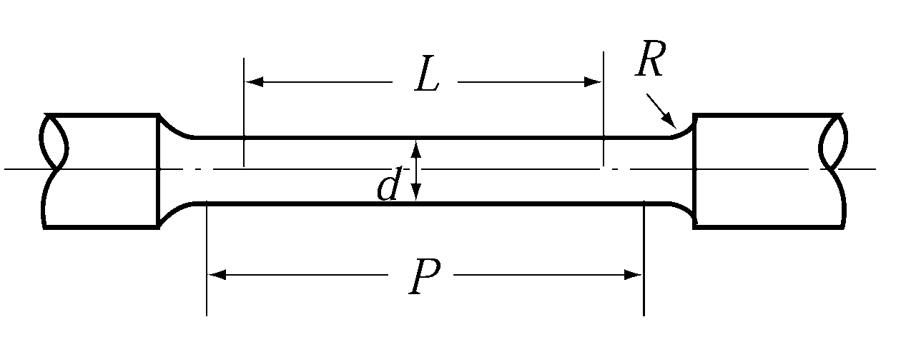 | $d$ = 10 $L$ = 50 $P$ = 55 $R$ ≥ 10 원칙적으로 상기의 시험편을 사용하나 다음과 같은 수의 시험편을 사용하여도 좋다. $L$ = 5*d* $P$ ≅ $L+0.5d$ $R$ = 10 | 용착금속인장시험 세로방향인장시험 |
    | *R* 10호 |   | $t$ = 12 $d$ = 6.0 $L$ = 24 $P$ = 32 $R$ ≅ 6 | 용착금속인장시험 (스테인리스강용 용접용재료) |
    | *R* 10호 |   | $t$ = 19∼25 $d$ = 12.5 $L$ = 50 $P$ = 60 $R$ ≅ 15 | 용착금속인장시험 (스테인리스강용 용접용재료) |
    | *R* 2*A*호 | 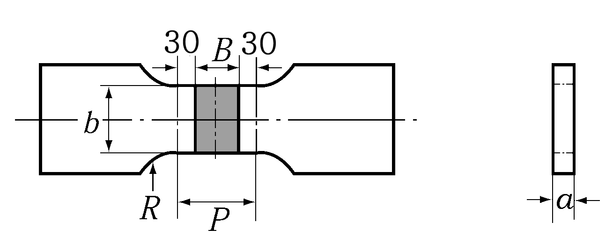 | $a$ = $t$, $b$ = 12 ($t$≤2) $b$ = 25 ($t$>2) $P$ = *B* + 60 $R$ > 25 | 판의 맞대기 용접 인장시험 |
    | *R* 2*B*호 | 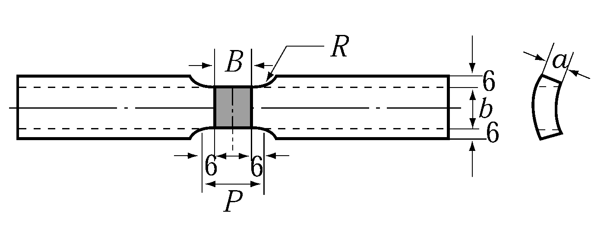 | $a$ = $t$ $b$ = 38 ( $t$ ≤ 25) $b$ = 25 ($t$ ＞ 25) $P$ = $B$ + 12 $R$ ≥ 50 | 관의 맞대기 용접 인장시험 |
    | (비고) 이 표의 기호는 다음에 따른다. $d$ : 시험편의 지름 $a$ : 시험편의 두께 $b$ : 시험편의 너비 $L$ : 표점거리 $P$ : 평행부의 거리 $B$ : 용접부의 너비 $R$ : 턱의 반지름 $t$ : 시험재의 두께 |   |   |   |

    **표 2.2.2 굽힘시험편의 모양 및 치수**(단위 : mm) ***(2023)***

    | 용 도 |   | 기호 | 시험편의 모양 | 시험편의 치수(1) | 적 용 |
    | --- | --- | --- | --- | --- | --- |
    | 용접절차 인정시험 | 앞면·뒷면굽힘시험편 | *RB* 1호 | 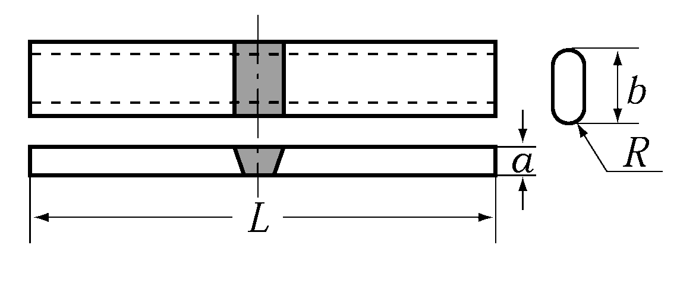 | $t$<12인 경우 $a$ = $t$ $b$ = 30 $L$ ≥ 200 $R$ = 1 ∼ 2 | 판의 맞대기 용접 굽힘시험 판의 맞대기 용접의 세로 방향 굽힘시험(2) |
    | 용접절차 인정시험 | 측면 굽힘시험편 | *RB* 2호 | 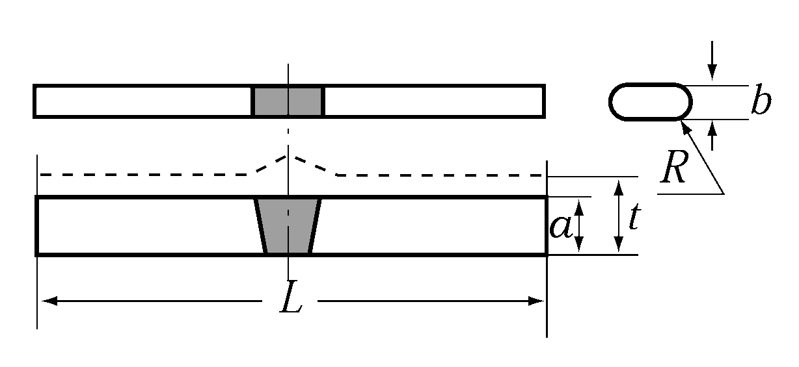 | 12≤$t$인 경우 $a$ = $t$ (3) $b$ = 10 $L$ ≥ 200 $R$ = 1 ∼ 2 | 판 및 관의 맞대기 용접 굽힘시험 |
    | 용접절차 인정시험 | 앞면·뒷면굽힘시험편 | *RB* 3호 | 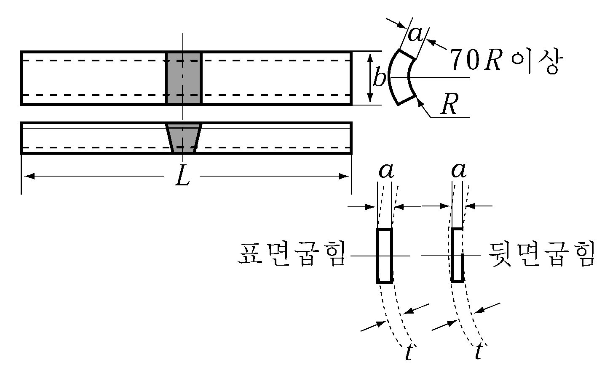 | ① 0＜$t$＜9인 경우 $a$ = $t$ $b$ = $t$ + *D*/10 $L$ ≒ 250 $R$ ≤ *a*/6 ② 9≤$t$<12인 경우 $a$ = 9 $b$ = 40 $L$ ≒ 250 $R$ ≤ 1.5 | 관의 맞대기 용접 굽힘시험 |
    | 용접용재료의 승인시험 및 정기검사 | 앞면·뒷면굽힘시험편 | *RB* 4호 | 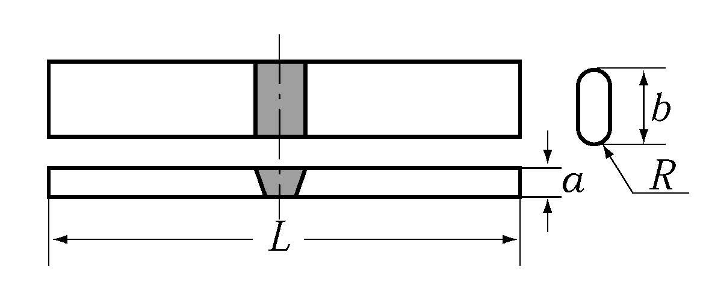 | $a$ = $t$ $b$ = 30 $L$ ≥ 200 $R$ ≤ 1.5 시험재의 두께 $t$가 25 mm를 넘는 경우에는 압축응력측을 기계가공하여 두께를 25 mm로 한다. | 맞대기 용접시험 |
    | 용접용재료의 승인시험 및 정기검사 | 측면 굽힘시험편 | *RB* 5호 | 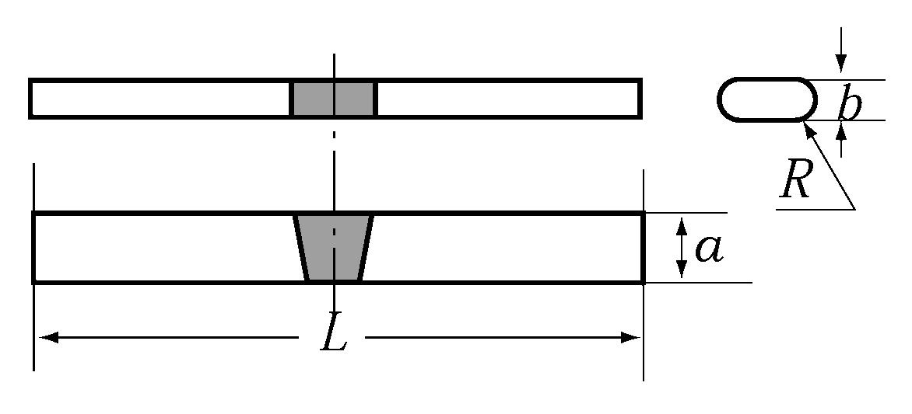 | $a$ = $t$ $b$ = 10 $L$ ≥ 200 $R$ ≤ 1.5 | 일렉트로슬래그 및 일렉트로가스 용접의 굽힘시험 |
    | 용접용재료의 승인시험 및 정기검사 | 측면 굽힘시험편 | *RB* 6호 |   | $a$ = $t$ $b$ = 9 $L$ ≥ 200 $R$ ≤ 1.5 | 맞대기 용접의 굽힘시험(알루미늄합금 용접용재료의 MIG 양면 각 1층 용접) |
    | 용접사기량시험 | 앞면·뒷면굽힘시험편 | *RB* 7호 | 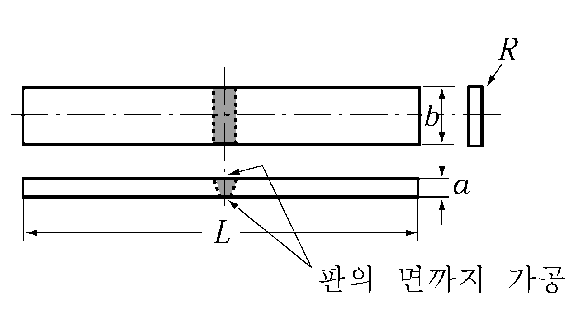 | $t$<12인 경우 $a$ = $t$ $b$ = 30 $L$ ≒ 150 $R$ ≤ 1.5 | 판의 맞대기 용접 굽힘시험 |

    **표 2.2.2 굽힘시험편의 모양 및 치수**(단위 : mm)(계속)

    | 용 도 |   | 기호 | 시험편의 모양 | 시험편의 치수(1) | 적 용 |
    | --- | --- | --- | --- | --- | --- |
    | 용접사기량시험 | 측면굽힘시험편 | *RB* 8호 | 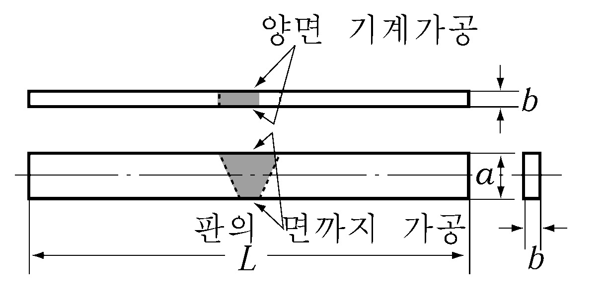 | 12≤$t$인 경우 $a$ = $t$(3) $b$ = 10 $L$ ≒ 150 $R$ ≤ 1.5 | 판의 맞대기 용접 굽힘시험 |
    | 용접사기량시험 | 앞면·뒷면굽힘시험편 | *RB* 9호 | 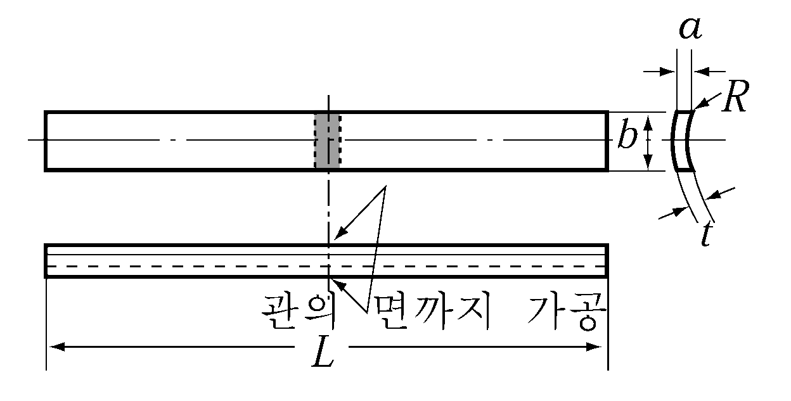 | $t$ ≤ 9.5인 경우 $a$ = $t$ $L$ ≒ 150 $R$ ≤ 1.5 $b$ = 40($D$>100) 또는 25($D$≤100) | 관의 맞대기 용접 굽힘시험 |
    | 용접사기량시험 | 앞면·뒷면굽힘시험편 | *RB* 10호 | 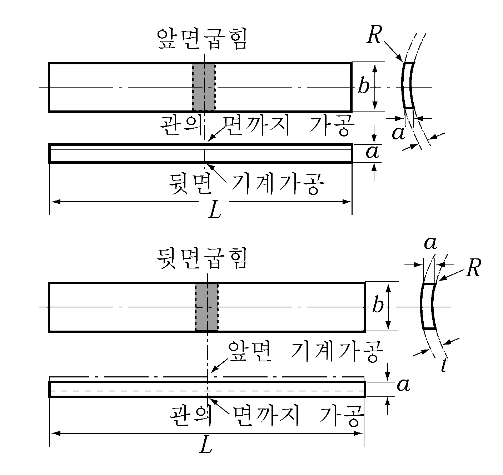 | $t$ > 9.5인 경우 $a$ = 10 $L$ ≒ 150 $R$ ≤ 1.5 $b$ = 40($D$>100) 또는 25($D$≤100) | 관의 맞대기 용접 굽힘시험 |
    | 용접사기량시험 | 측면굽힘시험편 | *RB* 11호 | 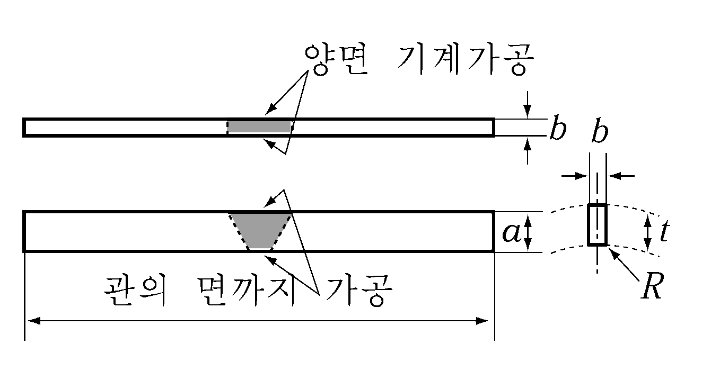 | 12≤$t$인 경우 $a$ = $t$(3) $b$ = 10 $L$ ≒ 150 $R$ ≤ 1.5 | 관의 맞대기 용접 굽힘시험 |
    | (비고) (1) 이 표의 기호는 다음에 따른다. $a$ : 시험편의 두께, $b$ : 시험편의 너비, $L$ : 시험편의 길이, $R$ : 모서리의 반지름, $t$ : 시험재의 두께, $D$ : 관의 시험재의 바깥지름 (2) 9 $\%$ *Ni*강 용접용재료의 세로방향굽힘시험에도 적용한다. 다만 용접부의 너비 $B$가 26 mm 이상인 경우에는 $b$ = *B* + 12(한쪽면 6 mm)로 한다. (3) 시험재의 두께 $t$가 40 mm를 넘는 경우에는 시험편을 최소 20 mm의 두께로 분할하고 각 시험편마다 시험을 실시할 수 있다. |   |   |   |   |   |

    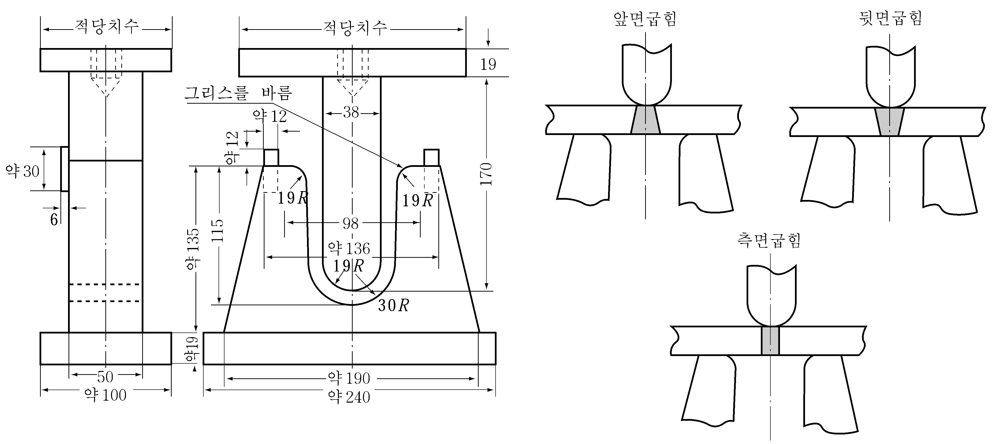
    **그림 2.2.1 형굽힘시험용 지그** (두께 9 mm의 굽힘시험편용, 단위 : mm)
    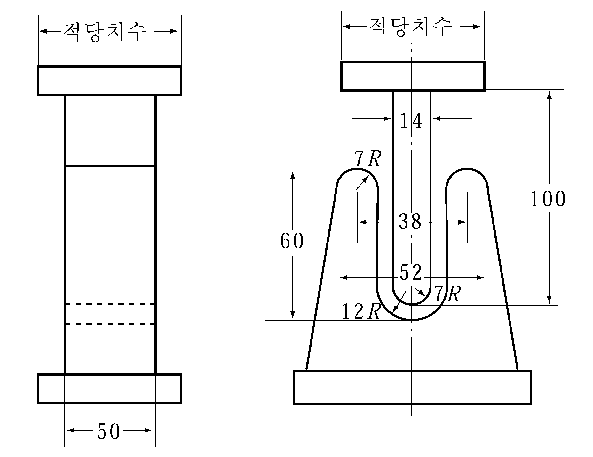
    **그림 2.2.2 형굽힘시험용 지그** (두께 3.2 mm용, 단위 : mm)
    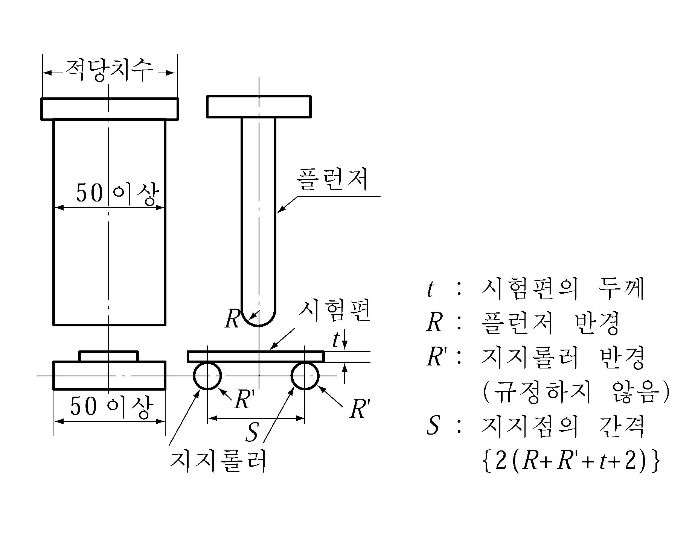
    **그림 2.2.3 롤러 굽힘시험용 지그**(단위 : mm)

### 제 3 절 용접시공 및 검사

#### 301. 이음의 상세

- **1.** **적용** 수동용접 이음의 상세는 다음의 각 항에 따라야 한다. 자동용접 등 다른 용접법에 대한 이음의 상세는 우리 선급의 승인을 받아야 한다.
- **2.** **맞대기이음**
  - **(1)** 맞대기이음의 모양 및 치수는 **그림 2.2.4**에 따르는 것을 원칙으로 한다.
  - **(2)** 판두께의 차가 4 mm를 넘는 판의 맞대기이음에 대하여는 두꺼운 판 쪽에 적절한 경사를 주어야 한다.
- **3.** **두꺼운 부재의 맞대기이음** 주강품과 같은 매우 두꺼운 부재의 홈(groove)은 **그림 2.2.5**에 따르는 것을 원칙으로 한다.
  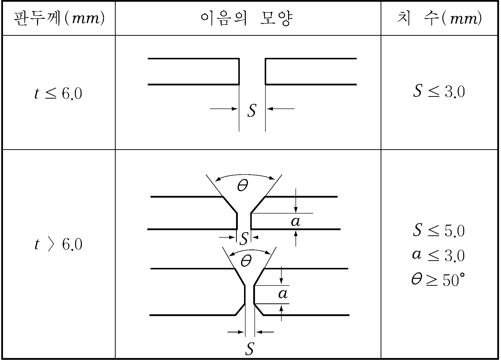
  **그림 2.2.4 이음의 모양** 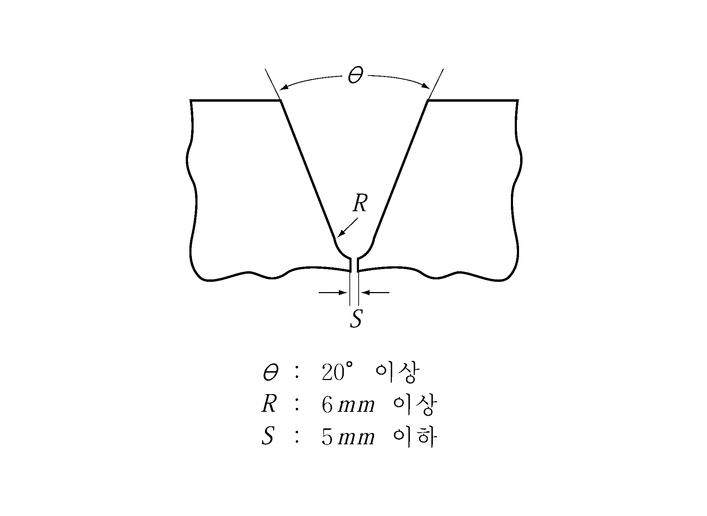
  **그림 2.2.5 두꺼운 부재의 이음**
- **4.** **겹이음**
  - **(1)** 겹이음에 있어서 굽힘을 고려하여야 할 때에는 겹쳐지는 너비 $b$는 다음 식에 의한 것 이상으로 한다. 다만, 50 mm를 넘을 필요는 없다.
    $b$ *= 2*$t$ *+ 25* (mm)
    $t$ : 판의 얇은 쪽의 두께(mm)
  - **(2)** 판을 조글링한 겹이음의 겹쳐지는 너비 $b$는 굽힘을 고려하여야 할 때에는 다음 식에 의한 것 이상으로 한다. 다만, 40 mm를 넘을 필요는 없다.
    $b$ *=* $t$ *+ 25* (mm)
    $t$ : 판의 얇은 쪽의 두께(mm)

#### 302. 용접표준(welding practice)

- **1.** 용접표준은 선체구조에 적용하는 용접작업에 대한 전반적인 사항을 상세하게 기술한 것으로서 적용 용접법, 용접용재료의 사용구분, 용접작업표준, 시공관리, 용접절차 시방서(WPS) 및 선체의 주요 구조부의 용접순서 등을 기재하고 우리 선급에 제출하여야 한다.
- **2.** 전 항에 규정하는 용접절차 시방서는 **4절**에 규정하는 용접절차 인정시험에 합격한 것이어야 한다.

#### 303. 용접용재료의 사용구분

선체구조의 용접이음에 대하여는 다음 각 호의 규정에 따라서 **6절**에 규정하는 용접용재료를 사용하여야 한다.

#### 304. 용접준비

- **1.** **홈 가공**
  - **(1)** 홈 가공은 그 모양을 도면과 같은 것으로 하고 용접부에 유해한 결함이 생길 우려가 있는 수분, 유지, 녹, 도료 또는 기타의 불순물은 제거하여야 한다.
  - **(2)** 홈 가공면은 평탄하고 균일해야 하며 노치, 층상흠(lamination) 또는 균열 등과 같은 결함이 없어야 한다.
  - **(3)** 홈 가공면에 결함이 있는 경우에는 이를 제거하여야 하며 살붙임 용접은 가능한 한 저수소계 용접용재료로 시행한 후 평탄하고 균일하게 연마하여야 한다.
- **2.** **가용접**
  - **(1)** 가용접은 우리 선급의 기량자격을 보유한 자가 시행하여야 한다.
  - **(2)** 가용접은 강력갑판, 현측후판, 외판 또는 기타 중요한 맞대기이음에 있어서는 본용접 전에 제거하든가 또는 본용접과 같은 방법으로 결함이 생기지 않게 하여야 하며 가용접에 사용되는 용접용재료는 본용접에 사용되는 용접용재료와 동급 이상의 것이어야 한다.
  - **(3)** 가용접의 용접비드 길이 및 피치는 우리 선급이 적절하다고 인정하는 바에 따른다. **【지침 참조】**
  - **(4)** 가용접부에 유해한 결함이 있을 때에는 충분히 제거하여야 하며 가용접으로 인한 홈, 형상의 변화로 본용접에 영향을 미칠 때에는 본용접에 지장이 없도록 제거되어야 한다.
  - **(5)** 고장력강, 용접구조용 초고장력강 및 잔류응력이 클 것으로 예상되는 부위에는 가용접 전에 적절히 예열하여야 한다.
- **3.** **고정구(fixture)**
  - **(1)** 용접이음의 조립에 쓰이는 고정구는 용접부에 균열 등의 결함을 남기지 아니할 정도의 구속을 주는 것으로 한다.
  - **(2)** 고정구를 붙이기 위한 것 등의 가용접은 떼고 난 후 모재에 상처를 남기지 아니하여야 한다.

#### 305. 용접순서 및 그 진행방향

- **1.** 용접순서 및 그 진행방향은 용접부에 결함이 생기지 아니하도록 하고 가능한 한 용접에 따른 변형이 적게 되도록 택하여야 한다.
- **2.** 용접에 의한 수축이 큰 이음은 가능한 한 수축이 작은 이음보다 먼저 용접하여야 한다.
- **3.** 용접은 가능한 한 자유단을 향하여 진행하도록 하여야 하며 특별한 경우를 제외하고는 수직하진용접을 하여서는 안 된다. **【지침 참조】**

#### 306. 본용접

- **1.** 용접은 그 내부에 유해하다고 인정되는 결함이 남지 아니하도록 시공하여야 한다.
- **2.** 용접은 습기, 비, 바람, 눈을 피하여 실시하고 한냉시에는 필요에 따라 예열하여야 한다. **【지침 참조】**
- **3.** 중요한 맞대기이음의 끝부분에는 붙임편(run-off tabs)을 붙이든지 또는 용접부의 길이에 여유를 두고 모든 용접이 완료된 후에는 이들을 절단하여야 한다.
- **4.** 맞대기이음은 일면용접 등 특히 승인된 것을 제외하고 원칙적으로 뒷면 다듬질을 실시하여 표면 용접부의 결함을 제거한 후 뒷면용접을 하여야 한다.
- **5.** 과대한 구속상태에서의 용접, 매우 두꺼운 강판이나 주․단강품 등의 용접에 대하여는 균열의 발생을 방지하기 위하여 필요에 따라 예열이나 저수소계 용접봉 사용 등의 특별한 고려를 하여야 한다.
- **6.** 응력집중이 현저한 부분의 필릿용접 끝부분은 용접을 돌려야 하며 기타 개소의 필릿용접의 끝부분은 크레이터를 메워 처리할 수 있다.
- **7.** 맞대기이음의 홈의 틈이 과다할 때에는 홈 면을 용접으로 살붙임(weld up)하든가, 뒷댐판(backing strip)을 붙이고 용접하든지 또는 모재를 일부 바꾸어 용접하여야 하며 그대로 용접하여 메우거나 쇳조각을 넣어서는 안 된다.
- **8.** 필릿이음으로서 모재 사이에 틈이 있을 경우, 틈의 크기가 2 mm 이하일 때에는 규정의 각장으로 용접할 수 있다. 틈이 2 mm를 넘을 때에는 필릿용접의 각장을 틈의 크기에 따라서 적절히 증가하여 용접할 수 있으나 틈이 5 mm를 넘을 때에는 적당한 라이너를 넣어 용접하든지, 뒷댐판을 대고 용접하든지 또는 모재의 일부를 바꾸어 용접하여야 한다. **【지침 참조】**
- **9.** 예열처리, 층간온도 및 후열처리는 승인된 용접법 또는 우리 선급이 적절하다고 인정하는 바에 따른다. **【지침 참조】**

#### 307. 자동용접

- **1.** 자동용접의 홈의 모양은 특히 정확하게 시공하여야 한다.
- **2.** 자동용접은 용접절차 인정시험시에 승인된 경사 내에서 실시하여야 한다.
- **3.** 두께가 16 mm를 넘고 강판이 교차하는 맞대기이음에서는 원칙적으로 한방향의 맞대기이음의 앞면 및 뒷면의 자동용접 종료 후 다른 방향의 맞대기이음의 자동용접을 실시하여야 한다.
- **4.** 림드강의 자동용접에서 균열 발생의 우려가 있는 것에 대하여는 특별한 고려를 하여야 한다.

#### 308. 고장력강의 용접

- **1.** 아크 스트라이크(arc strike)는 극력 피하여야 한다.
- **2.** 쇼트 비드(short bead), 용접보수 최소길이, 선상가열온도 등에 대하여는 우리 선급이 인정하는 용접관리기준에 따른다.

#### 309. 용접부의 품질

- **1.** 용접부의 표면은 모양이 일정하여야 하며 과대한 용접, 유해하다고 인정되는 언더컷(under-cut), 겹침(over-lap) 등의 결함이 있어서는 안 된다.
- **2.** 용접 구조부에는 용접에 의한 현저한 변형이 있어서는 안 된다.
- **3.** 용접이음에 대하여는 별도로 정하는 지침에 따라 비파괴검사를 하여야 한다. **【지침 참조】**
- **4.** 외관검사를 포함하여 적절한 비파괴검사 및 수압검사 등으로 발견된 용접결함 중 검사원이 유해하다고 인정한 것은 떼어내고 보수하여야 한다.

#### 310. 용접부의 보수

- **1.** 유해한 용접 결함의 제거는 가우징, 그라인딩, 치핑 등의 적절한 방법으로 모재에 손상을 주지 않도록 하여야 한다. 다만 용접구조용 초고장력강에는 산소가우징을 하여서는 안 된다.
- **2.** 결함제거 부위는 깨끗이 다듬질하여 보수용접에 나쁜 영향을 주지 않도록 하여야 한다. 또한 보수용접은 가능한 한 저수소계 용접봉을 사용하고 본용접에 사용한 것보다 크기가 작은 용접봉을 사용하여야 한다.
- **3.** 용접으로 인하여 변형된 부재의 수정은 기계적인 방법이나 국부가열에 의하여 수정하여야 한다. 다만, 국부가열을 하는 경우의 가열 부위의 온도는 모재의 기계적 성질을 열화시키지 않는 범위 내에서 하여야 한다.

#### 311. YP47강의 용접 (2021)

- **1.** **짧은 비드(Short bead)**
  가용접이나 용접보수 시의 용접비드 길이는 50mm 이상이어야 한다. 다만, $P _{cm}$이 0.19% 이하인 경우에는 우리 선급의 승인을 받아 용접비드의 길이를 25mm 이상으로 할 수 있다.
- **2.** **예열**
  대기온도가 5°C 이하인 경우, 50°C 이상으로 예열을 하여야 한다. 다만, $P _{cm}$이 0.19% 이하이며 대기온도가 0°C보다 높고 5°C미만인 경우에는 우리 선급의 승인을 받아 다른 예열 규정을 적용할 수 있다.
- **3.** **기타**
  - **(1)** 최종 층 용접시에는 해로운 결함이 남지 않도록 특별한 주의를 기울여야 한다.
  - **(2)** 일반적으로 장착된 지그(Jig)들은 결함 없이 완전히 제거되어야 한다. 그렇게 하지 않는 경우, 장착된 부위(mounting)의 처리에 대하여는 우리 선급의 승인을 받아야 한다.

#### 312. 취성균열정지강의 용접 (2021)

취성균열정지강의 용접사 기량자격, 짧은 비드(Short bead), 예열, 용접용재료 선택 등과 관련된 요구사항은 재료기호에 *BCA1* 또는 *BCA2*를 제외한 재료와 동일하게 적용한다.

### 제 4 절 용접절차 인정시험

#### 401. 일반사항

- **1.** **적용**
  - **(1)** 이 절의 규정은 선체구조, 기관용 재료 및 관장치에 적용하는 용접의 용접절차 인정시험에 대하여 적용한다. *(2019)*
  - **(2)** 액화가스 산적운반선의 화물탱크, 프로세스용 압력용기 및 저인화점연료탱크의 용접절차 인정시험의 요건은 **규칙 7편 5장 6절** 및 **저인화점연료선박 규칙**을 각각 따른다. *(2019)*
- **2.** **용어의 정의**
  - **(1)** **용접절차 시방서(WPS)** : 특정 용접이음부에 적용하는 용접특성, 용접방법 및 재료 등을 상세히 기술한 것을 말한다.
  - **(2)** **용접절차 인정시험(WPQT)** : 규정된 용접절차 시방서에 따라 만들어진 용접이음부가 주어진 요구조건에 만족함을 확인하기 위하여 실시되는 시험을 말한다.
  - **(3)** **인정시험 기록서(PQR)** : (2)호의 규정에 따라 승인용 시험재를 용접하는 동안 적용되는 실제 용접특성에 대한 기록과 비파괴검사 및 기계적 시험에 대한 결과를 말한다.
- **3.** **용접절차 인정시험의 요건**
  - **(1)** 제조자는 다음 (가)부터 (나)에 해당하는 경우, 용접시공을 하기 전에 해당 용접절차에 대하여 승인을 받아야 한다.
    - **(가)** 해당 용접방법이 **1**항에 규정한 장소 및 다음에 규정한 용접시공에 처음 적용되는 경우 *(2019)*
      - **(i)** 용접구조의 보일러, 제1급 및 제2급 압력용기의 용접시공
        - **(ii)** 기관 주요부품(**규칙 5편 2장 표 5.2.4** 및 **3장**에 규정된 주요부품을 말한다.) 및 관 장치의 용접시공
        - **(iii)** 특수한 재료를 사용한 용접시공
        - **(iv)** 특수한 용접법을 채용한 용접시공
    - **(나)** **402.**의 **2**항 (1)호부터 (11)호에 규정된 용접변수가 승인된 용접절차 시방서에 기재되어 있는 범위를 넘어 변경되는 경우
  - **(2)** 용접절차 승인을 위해서는 **402.**에 규정하는 예비 용접절차 시방서에 대하여 우리 선급의 검토를 받은 후 **404.** 또는 **405.**에 규정하는 용접절차 인정시험에 합격하여야 한다. 또한 승인된 용접절차 시방서에는 시험재를 용접하는 동안 적용되는 실제 용접특성에 대한 기록과 비파괴검사 및 기계적 시험에 대한 결과를 기록한 인정시험 기록서가 첨부되어야 한다.

#### 402. 용접절차 시방서

- **1.** 용접절차 인정시험을 하고자 하는 조선소 또는 제조자는 용접절차 인정시험을 실시하기 전에 용접절차 시방서를 우리 선급에 제출하여 검토를 받아야 하며, 이 시방서는 예비 용접절차 시방서로 간주된다.
- **2.** 용접절차 시방서에는 최소한 다음의 용접변수를 기재하여야 하며, 필요한 경우 용접절차 인정시험중에 수정 또는 개정될 수 있다.
  - **(1)** 모재의 종류
  - **(2)** 모재두께 및 바깥지름의 범위
  - **(3)** 용접법
  - **(4)** 용접이음의 상세(허용오차 포함)
  - **(5)** 용접자세 및 진행방향
  - **(6)** 용접용재료(종류, 봉/와이어 지름, 보호가스, 플럭스 등)
  - **(7)** 용접전기 특성(전류, 전압 및 극성 등)
  - **(8)** 용접속도 및 용접입열 범위
  - **(9)** 예열 및 최대 층간온도
  - **(10)** 후열처리 온도(필요시)
  - **(11)** 기타 해당 용접절차에 필요한 사항
- **3.** 용접절차 인정시험에 사용되는 용접용재료는 **6절**에 규정된 요건에 따라 우리 선급의 승인을 받은 것이어야 한다.
- **4.** 예비용접절차 시방서에 따라 용접한 시험재가 시험에 불합격한 경우, 조선소 또는 제조자는 예비 용접절차 시방서를 수정하여 새로운 예비 용접절차 시방서를 작성하고 그에 따라 시험을 하여야 한다.
- **5.** 용접절차 시방서는 제품용접을 위한 근거로 사용되어야 하며, 예비 용접절차 시방서에 따른 시험결과가 적합한 경우, 우리 선급은 예비 용접절차 시방서를 용접절차 시방서로 승인할 수 있다. 우리 선급이 용접절차 시방서를 승인한 경우, 승인 범위는 **407.**에 따른다.

#### 403. 용접절차 인정시험

- **1.** 용접절차 인정시험이 요구되는 경우, 시험재의 용접은 실제 시공과 동일한 환경에서 실시되어야 하며 또한, 예비 용접절차 시방서에 기재되어 있는 용접조건 내에서 실시하여야 한다.
- **2.** 용접절차 인정시험(시험재의 용접 및 시험편에 대한 시험)은 우리 선급 검사원의 입회하에 실시하여야 한다.
- **3.** 시험실 및 시험기는 용접절차 인정시험을 수행하기에 적절해야 하며 **규칙 2편 1장 201.**을 만족해야 한다. *(2019)*
- **4.** 실제 용접시공에 있어서 가용접 및/또는 용접의 멈춤 및 재시작 부위가 본용접에 포함되는 경우, 시험재의 용접에서도 이들이 포함되어야 한다.
- **5.** 스테인리스 클래드강의 용접절차 인정시험은 **404.** 및 **405.**의 규정을 준용한다. 다만, 스테인리스 클래드강의 모재에 대하여 동일한 용접시공조건으로 이미 용접절차를 승인받은 경우에는 충격시험을 생략할 수 있다.
- **6.** 이 절에 규정하지 아니한 재료에 대한 용접절차 인정시험은 우리 선급이 승인한 시험규격에 따라서 실시되어야 한다. 다만 듀플렉스 스테인리스강의 용접절차 인정시험에 대하여는 우리 선급이 별도로 정하는 지침에 따른다. **【지침 참조】**
- **7.** 재료의 사용조건을 고려하여 우리 선급이 필요하다고 인정하는 경우에는 이 절의 규정과 다른 시험조건의 시험 또는 이 절에 규정하지 아니한 시험을 요구할 수 있다.
- **8.** 취성균열 정지강(BCA강)을 50 kJ/cm가 넘는 입열량으로 용접할 때에는 별도의 용접절차 인정시험이 요구된다. 이 때 인정시험의 요구사항은 재료기호에 *BCA1* 또는 *BCA2*를 제외한 재료와 동일하게 적용한다. 다만, 경도시험은 **404.**의 **9항** 및 **405.**의 **6항**을 따른다. *(2021)*

#### 404. 맞대기용접 이음시험

- **1.** **적용** 이 규정은 수동용접, 반자동 또는 자동용접에 의한 맞대기용접 이음시험에 적용한다.
- **2.** **시험의 종류** 시험의 종류는 시험재에 따라서 **표 2.2.4** 및 **표 2.2.5**에 따른다. 또한 우리 선급이 필요하다고 인정할 때에는 이들 이외의 시험을 요구할 수 있다. **【지침 참조】**
- **3.** **시험재**
  - **(1)** 시험재는 실제 시공에 사용하는 재료와 동일하든지 또는 이와 동등한 것으로 한다.
  - **(2)** 시험재의 치수 및 모양은 **그림 2.2.6**에 따른다.
    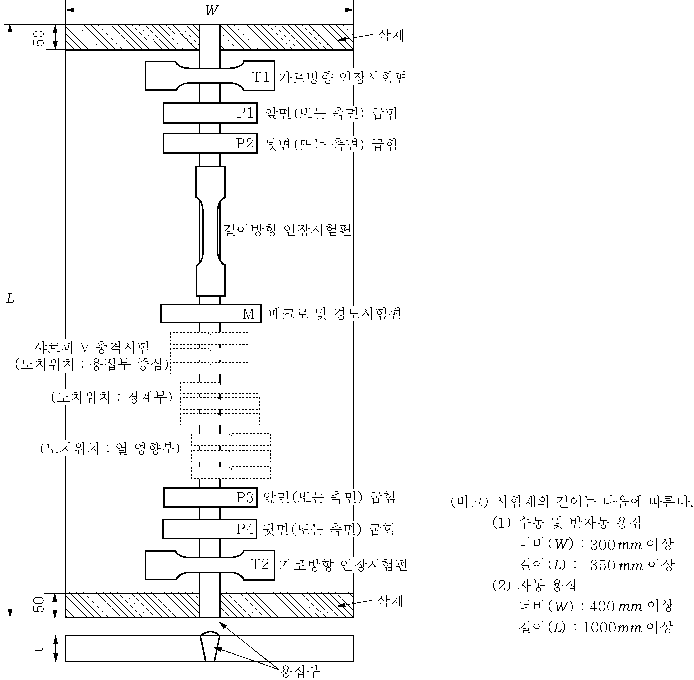
    (a) 선체구조용 압연강재, 용접구조용 초고장력 압연강재, 스테인리스강, 알루미늄 합금재, 저온용 압연강재 또는 보일러용 및 압력용기용 강판의 시험재 *(2019)***그림 2.2.6 용접절차 인정시험의 시험재의 모양 및 치수** (단위 : mm) (계속)

    | 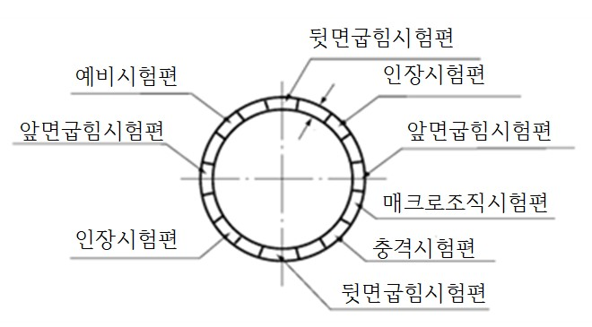 (b) 두께가 12mm 미만인 관의 시험재 | 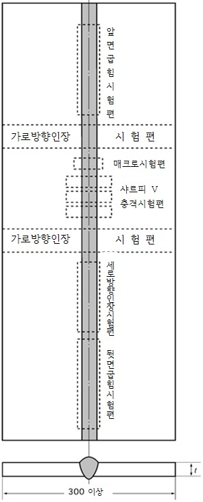 (비고) 1. 모재와 용접용재료의 강도 특성이 현저히 다르지 않다면, 세로방향 굽힘시험편을 가로방향 굽힘시험편으로 대체할 수 있다. *(2019)* (d) *RL*9*N*490의 시험재 |
    | --- | --- |
    | 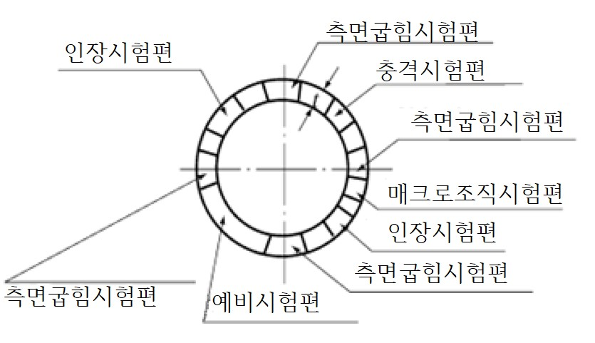 (c) 두께가 12mm 이상인 관의 시험재 |   |
  - **(3)** 시험재의 용접은 실제 공사에서 적용하는 각각의 용접자세로서 한다.
  - **(4)** 판의 용접절차 인정시험이 승인된 경우에는 바깥지름이 500 mm를 넘는 관의 용접도 허용된다. 또한 바깥지름이 25 mm를 넘는 관의 용접절차 인정시험이 승인된 경우에는 판 용접도 허용된다. *(2019)*
  - **(5)** 판의 시험재의 맞대기 용접의 경우 시험재의 압연방향에 따른 용접방향은 다음에 따른다.
    - **(가)** 모재의 충격시험시 충격시험편의 길이방향을 압연방향과 평행(*L*방향)하게 채취하도록 규정되어 있는 강재를 시험재로 사용하는 경우에는 시험재의 용접방향을 시험재의 압연방향과 직각으로 한다.
    - **(나)** 모재의 충격시험시 충격시험편의 길이방향을 압연방향과 직각(*T*방향)으로 채취하도록 규정되어 있는 강재(예:용접구조용 초고장력 강판)를 시험재로 사용하는 경우에는 시험재의 용접방향을 시험재의 압연방향과 평행하게 한다.
- **4.** **인장시험**
  - **(1)** 시험재로부터 채취하는 인장시험편의 수는 재료의 종류에 따라서 **표 2.2.4** 및 **표 2.2.5**에 따른다. *(2019)*

    **표 2.2.4 맞대기용접 이음시험의 종류** ***(2019)***

    | 시험재의 종류 및 재료기호 |   |   | 시험의 종류 및 시험편의 수(개)(1) |   |   |   |   |   |   |   |
    | --- | --- | --- | --- | --- | --- | --- | --- | --- | --- | --- |
    | 시험재의 종류 및 재료기호 |   |   | 외관 검사 | 인장 시험 | 굽힘시험 | 충격 시험 | 매크로시험 | 경도 시험 | 비파괴검사 (4) | 취성파괴시험 |
    | 선체구조용 압연강재 | 연강 | *A*, *B*, *D*, *E* | 용접부 전장 | 2 | 4(2) | (3) | 1 | - | 용접부 전장 | - |
    | 선체구조용 압연강재 | 고장력강 | *AH* 32, *DH* 32, *EH* 32, *FH* 32, *AH* 36, *DH* 36, *EH* 36, *FH* 36, *AH* 40, *DH* 40, *EH* 40, *FH* 40 | 용접부 전장 | 2 | 4(2) | (3) | 1 | 1(10) | 용접부 전장 | - |
    | 선체구조용 압연강재 | 고장력강 | *EH* 47-*H* | 용접부 전장 | 2 | 4(2) | (3) | 1 | 1(10) | 용접부 전장 | 1 (13) |
    | 저온용 압연강재 |   | *RL* 235*A*, *RL* 235*B*, *RL* 325*A*, *RL* 325*B*, *RL* 355, *RL* 1*N*355, *RL* 2*N*255, *RL* 3*N*355, *RL* 5*N*390 | 용접부 전장 | 2 | 2 | (3) | 1 | 1 | 용접부 전장 | - |
    | 저온용 압연강재 |   | *RL* 9*N490* | 용접부 전장 | 3(5) | 2 | (3) | 1 | 1 | 용접부 전장 | - |
    | 용접구조용 초고장력 압연강재 |   | *AH* 43, *DH* 43, *EH* 43, *FH* 43, *AH* 47, *DH* 47, *EH* 47, *FH* 47, *AH* 51, *DH* 51, *EH* 51, *FH* 51, *AH* 56, *DH* 56, *EH* 56, *FH* 56, *AH* 63, *DH* 63, *EH* 63, *FH* 63, *AH* 70, *DH* 70, *EH* 70, *FH* 70, *AH* 90, *DH* 90, *EH* 90, *AH* 97, *DH* 97, *EH* 97 | 용접부 전장 | 2 | 4(2) | (3) | 1 | 1 | 용접부 전장 | - |
    | 용접구조용 주강품 및 선체용 단강품 |   | *RSC* 410, *RSC* 450, *RSC* 480, *RSC* 520, *RSC* 560, *RSC* 600, *RSC* 440*A, RSC* 480*A, RSC* 550*A,* *RSF* 400*H, RSF* 440*H , RSF* 480*H , RSF* 520*H , RSF* 560*H , RSF* 600*H , RSF*550*AH, RSF*600*AH, RSF*650*AH* | 용접부 전장 | 2 | 4(2) | (3)(9) | 1 | - | 용접부 전장 | - |
    | 스테인리스 압연강재 |   | *RSTS* 304, *RSTS* 304*L*, *RSTS* 304*N*1, *RSTS* 304*N*2, *RSTS* 304*LN*, *RSTS* 309*S*, *RSTS* 310*S*, *RSTS* 316, *RSTS* 316*L*, *RSTS* 316*N*, *RSTS* 316*LN*, *RSTS* 317, *RSTS* 317*L*, *RSTS* 317*LN*, *RSTS* 321, *RSTS* 347 | 용접부 전장 | 2 | 2 | ^- | 1 | - | 용접부 전장 | - |
    | 알루미늄 합금재(6) | 5000계열 | 5083*P,* 5383*P,* 5059*P,* 5086*P,* 5754*P,* 5083*S,* 5383*S,* 5059*S,* 5086*S*(7) | 용접부 전장 | 2 | 4(2) | - | 1 | - | 용접부 전장 | - |
    | 알루미늄 합금재(6) | 6000계열 | 6005*AS,* 6061*S,* 6082*S*(8) | 용접부 전장 | 2 | 4(2) | - | 1 | - | 용접부 전장 | - |
    | 보일러용 압연강판 및 압력용기용 압연강판 | 보일러 및 제1급 압력용기(11) | *RSP* 24, *RSP* 30, *RSP* 32, *RSP* 30*A*, *RSP* 32*A*, *RPV* 24, *RPV* 32, *RPV* 36, *RPV* 42, *RPV* 46, *RPV* 50 | 용접부 전장 | 2 | 4(2) | 3조 (12) | 1 | 1 | 용접부 전장 | - |
    | 보일러용 압연강판 및 압력용기용 압연강판 | 제2급 압력용기(11) | *RSP* 24, *RSP* 30, *RSP* 32, *RSP* 30*A*, *RSP* 32*A*, *RPV* 24, *RPV* 32, *RPV* 36, *RPV* 42, *RPV* 46, *RPV* 50 | 용접부 전장 | 2 | 4(2) | - | 1 | 1 | 용접부 전장 | - |
    | 보일러용 압연강판 및 압력용기용 압연강판 | 제3급 압력용기(11) | *RSP* 24, *RSP* 30, *RSP* 32, *RSP* 30*A*, *RSP* 32*A*, *RPV* 24, *RPV* 32, *RPV* 36, *RPV* 42, *RPV* 46, *RPV* 50 | 용접법 및 모재의 종류 등을 고려하여 우리 선급이 필요하다고 인정하는 경우 외에는 생략할 수 있다. |   |   |   |   |   |   |   |
    | (비고) (1) 우리 선급이 필요하다고 인정하는 경우, 마이크로 조직시험 등 기타 다른 시험을 요구할 수 있다. **【지침 참조】** (2) 2개의 앞면굽힘시험과 2개의 뒷면굽힘시험을 한다. 두께가 12 mm 이상인 경우에는 4개의 측면굽힘시험으로 할 수 있다. 다만 보일러용 및 압력용기용 압연강판은 19mm 이상인 경우에 4개의 측면굽힘시험으로 할 수 있다. (3) 시험재로부터 채취하는 시험편의 수 및 노치의 위치는 **그림 2.2.8**에 따른다. (4) 방사선 투과검사 또는 초음파 탐상검사에 의한 내부결함 탐상과 자분탐상검사 또는 액체침투 탐상검사에 의한 표면결함 탐상검사를 실시하여야 한다. 단, 보일러용 압연강판 및 압력용기용 압연강판은 내부결함 탐상을 위해 방사선 투과검사를 실시한다. (5) 가로방향 2개와 세로방향 1개의 시험편을 채취한다.(**그림 2.2.6** 참조) (6) 알루미늄 합금재의 재료기호에는 열처리 표시기호를 포함하여야 한다. (7) 동일한 재료기호와 열처리 표시기호를 가지는 알루미늄 합금 압연재를 사용할 수 있다. (8) 인장강도가 260 $\mathrm{N}/mm ^{2}$ 이상인 6000 계열의 다른 알루미늄 합금 압연재를 사용할 수 있다. (9) 용접구조용 주강품 및 단강품에 대하여 충격치가 규정된 경우에만 적용한다. (10) 항복강도가 355 $\mathrm{N}/mm ^{2}$ 이상인 선체구조용 압연강재에 대하여는 경도(*H_V*10)시험을 하여야 한다. (11) 압력용기의 분류는 **규칙 5편 5장**을 따른다. (12) 노치의 위치는 **그림 2.2.8**의 a, b, c로 한다. (13) 디프노치시험(Deep notch test) 또는 균열선단 개구변위(CTOD)시험을 한다. 다만, 용접입열량이 200 kJ/cm 이하인 경우에는 취성파괴시험을 생략할 수 있다. |   |   |   |   |   |   |   |   |   |   |

    **표 2.2.5 관의 맞대기용접 이음시험의 종류** ***(2019)***

    | 시험재의 종류 및 재료기호 |   | 시험의 종류 및 시험편의 수 (개) (1)(2)(3) |   |   |   |   |   |   |
    | --- | --- | --- | --- | --- | --- | --- | --- | --- |
    | 시험재의 종류 및 재료기호 |   | 외관 검사 | 인장시험 | 굽힘 시험(5) | 충격 시험(6) | 매크로 조직 시험 | 경도시험 | 비파괴검사 |
    | 배관용 강관 | *RSTH* 35, *RSTH* 42, *RSTH* 52, *RSTH* 12, *RSTH* 22, *RSTH* 23, *RSTH* 24, *RST* 138, *RST* 142, *RST* 238, *RST* 242, *RST* 249, *RST* 338, *RST* 342, *RST* 349, *RST* 412, *RST* 422, *RST* 423, *RST* 424, *RBH* 1, *RBH* 2, *RBH* 3, *RBH* 4, *RBH* 5, *RBH* 6 | 용접부 전장 | 2 | 4 | ^- | 1 | 1 | 용접부 전장(9) |
    | 고온· 고압용 강관(4) | *RSTH* 35, *RSTH* 42, *RSTH* 52, *RSTH* 12, *RSTH* 22, *RSTH* 23, *RSTH* 24, *RST* 138, *RST* 142, *RST* 238, *RST* 242, *RST* 249, *RST* 338, *RST* 342, *RST* 349, *RST* 412, *RST* 422, *RST* 423, *RST* 424, *RBH* 1, *RBH* 2, *RBH* 3, *RBH* 4, *RBH* 5, *RBH* 6 | 용접부 전장 | 2 | 4 | (7) | 1 | 1 | 용접부 전장(9) |
    | 저온용 강관 | *RLPA*, *RLPB*, *RLPC*, *RLP* 2, *RLP* 3, *RLP* 9 | 용접부 전장 | 2 | 4 | (8) | 1 | 1 | 용접부 전장(10) |
    | 스테인리스 강관 | *RSTS* 304*TP*, *RSTS* 304*LTP*, *RSTS* 309*STP*, *RSTS* 310*STP*, *RSTS* 316*TP*, *RSTS* 316*LTP*, *RSTS* 317*TP*, *RSTS* 317*LTP*, *RSTS* 321*TP*, *RSTS* 347*TP* | 용접부 전장 | 2 | 4 | ^- | 1 | - | 용접부 전장(10) |
    | (비고) (1) 우리 선급이 필요하다고 인정하는 경우, 마이크로 조직시험 등 기타 다른 시험을 요구할 수 있다. **【지침 참조】** (2) 바깥지름 50 mm 미만의 관의 경우에는 2개의 시험재를 제작하여 상기의 시험 종류에 관계없이 1개에 대해서는 인장시험을 하고 또 다른 1개에 대해서는 매크로 및 경도시험을 할 수 있다. (3) 고온에서 사용되는 재료에 대하여는 크리프 시험 또는 고온인장시험을 요구할 수 있다. (4) 설계압력이 30 $\mathrm{kgf}/cm ^{2}$ 이상으로 설계온도가 400 ℃ 를 넘는 장소에 사용되는 증기관과 플랜지의 용접에 적용한다. (5) 2개의 앞면굽힘시험과 2개의 뒷면굽힘시험을 한다. 두께가 12 mm 이상인 경우에는 4개의 측면굽힘시험으로 할 수 있다. 관지름에 따라 상기 시험편의 채취가 어려운 경우, 두께 12 mm 이하의 것에 대해서는 앞면굽힘시험편 및 뒷면굽힘시험편 각 1개를, 또한 두께 12 mm를 넘는 것에 대해서는 측면굽힘시험편 2개를 경감할 수 있다. *(2022) (2023)* (6) 충격치의 규격이 없는 모재를 용접하는 경우 또는 관의 치수에 따라 충격시험편의 채취가 불가능한 경우에는 우리 선급의 승인을 얻어 충격시험을 생략할 수 있다. (7) 노치의 위치는 **그림 2.2.8**의 a로 한다. (8) 시험재로부터 채취하는 시험편의 수 및 노치의 위치는 **그림 2.2.8**에 따른다. (9) 바깥지름이 130 mm 이상이고 설계압력이 30 $\mathrm{kgf}/cm ^{2}$이상으로서 설계온도가 400 ℃ 를 넘는 관에 대하여 방사선투과검사를 실시한다. 단, 바깥지름이 130 mm 미만의 관이라도 사용재료, 사용조건에 따라서는 방사선투과검사를 요구할 수 있다. (10) 방사선 투과검사 또는 초음파 탐상검사에 의한 내부결함 탐상과 자분탐상검사 또는 액체침투 탐상검사에 의한 표면결함 탐상검사를 실시하여야 한다. |   |   |   |   |   |   |   |   |
  - **(2)** 시험편의 모양은 **표 2.2.1**에 따른다. 인장강도는 **표 2.2.6**에 규정하는 이외의 것에 대하여는 모재에 규정하는 인장강도의 최소값 이상이어야 한다. 다만, 강도가 다른 강재 상호간의 맞대기용접이음에서의 인장강도는 강도가 낮은 강재에 대한 것을 사용할 수 있다. 이때󰡒강도가 낮은 강재󰡓라 함은 **그림 2.2.7** (2)의 경우 *E급* 연강재를 말한다. *(2019)*

    **표 2.2.6 맞대기용접 인장시험 규격치**

    | 시험재의 종류 | 재료기호 | 인장강도 ($\mathrm{N}/mm ^{2}$) | 항복강도 ($\mathrm{N}/mm ^{2}$) |
    | --- | --- | --- | --- |
    | 저온용 강재 | *RL* 9*N*490 | 590 이상(1) | 315 이상 |
    | 저온용 강재 | *RL* 9*N*490 | 630 이상(2) | - |
    | 저온용 강관 | *RLP* 9 | 630 이상 | - |
    | 알루미늄 합금재 | 5754 | 190 이상 | - |
    | 알루미늄 합금재 | 5086 | 240 이상 | - |
    | 알루미늄 합금재 | 5083 | 275 이상 | - |
    | 알루미늄 합금재 | 5383 | 290 이상 | - |
    | 알루미늄 합금재 | 5059 | 330 이상 | - |
    | 알루미늄 합금재 | 6005A, 6061, 6082(3) | 170 이상 | - |
    | (비고) (1) 세로방향 인장시험편 (2) 가로방향 인장시험편 (3) **표 2.2.4**의 비고 (8) 참조. |   |   |   |

    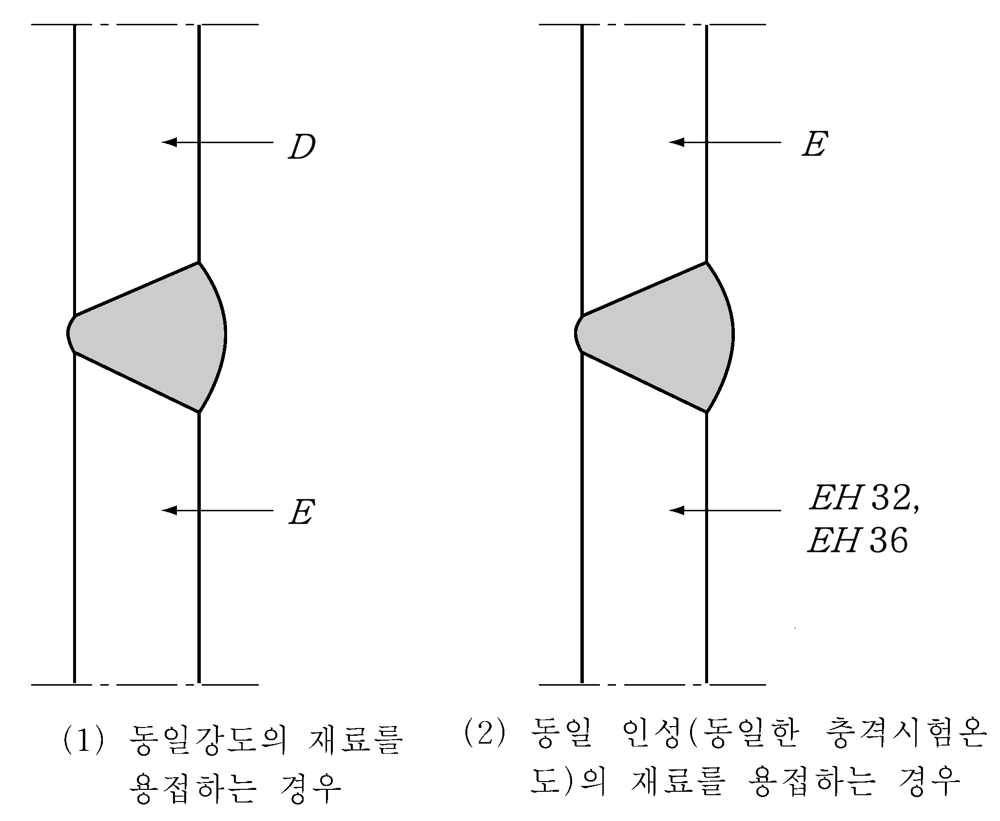
    **그림 2.2.7 이종금속간의 맞대기 용접** ***(2019)***
  - **(3)** 아래의 경우와 같이 부득이하게 우리 선급의 승인을 받지 못한 용접용재료에 대하여는 용접부에서 **표 2.2.1**의 *R* 14*A*호 세로방향 인장시험편 1개를 추가로 채취하고, 기계적성질은 사용된 용접용재료에 대하여 규정하는 최소값 이상이어야 한다. *(2019)*
    해당 용접용재료가 우리 선급의 승인을 받지 않는 한. 승인된 용접절차 시방서는 사용된 용접용재료의 로트(lot)에 한해서 유효한 것으로 간주되며, 해당 로트를 용접절차 시방서에 기재해야 한다.
    - **(가)** 공정이 긴박한 경우
    - **(나)** 향후 적용 빈도가 희박할 것으로 예상되는 소규모 용접용재료인 경우
  - **(4)** 시험재의 용접에 두 개 이상의 용접법 또는 용접용재료를 사용하는 경우에는 시험편을 각각의 용접부마다 채취하여야 한다. 다만, 첫 번째 층의 용접 또는 이면 루트부에 사용된 용접법 또는 용접용재료의 경우에는 시험편 채취를 생략한다. *(2017)*
- **5.** **굽힘시험**
  - **(1)** 시험재로부터 채취하는 시험편의 수는 재료의 종류에 따라 **표 2.2.4** 및 **표 2.2.5**에 따르고 시험편의 채취위치는 **그림 2.2.6**에 따른다.
  - **(2)** 앞면굽힘시험편 및 뒷면굽힘시험편 또는 측면굽힘시험편의 모양과 치수는 **표 2.2.2**의 *RB* 1호, *RB* 2호 및 *RB* 3호에 따른다. 굽힘시험방법 및 안쪽 지름은 **표 2.2.7**에 따른다. 시험편을 굽힌 후 표면에는 어떠한 방향으로도 길이 3 mm 초과의 균열 또는 기타의 결함이 생겨서는 안 된다. *(2018)*
  - **(3)** 서로 종류가 다른 모재들을 맞대기용접하는 경우, 가로방향 굽힘시험편 대신에 길이방향의 앞면 및 뒷면굽힘시험편을 사용할 수 있다.

    **표 2.2.7 굽힘시험의 안쪽지름** ***(2018)***

    | 시험재의 종류 | 재료기호 | 안쪽지름 (mm)(1) | 굽힘 각도 |
    | --- | --- | --- | --- |
    | 저온용 강관 | *RLP* 9 | $\frac{20}{3} t$ | 180° |
    | 용접구조용 초고장력강 | *AH* 43, *DH* 43, *EH* 43, *FH* 43, *AH* 47, *DH* 47, *EH* 47, *FH* 47, *AH* 51, *DH* 51, *EH* 51, *FH* 51 | $5 t$ | 180° |
    | 용접구조용 초고장력강 | *AH* 56, *DH* 56, *EH* 56, *FH* 56, *AH* 63, *DH* 63, *EH* 63, *FH* 63, *AH* 70, *DH* 70, *EH* 70, *FH* 70 | $6 t$ | 180° |
    | 알루미늄 합금재 | 5754, 5086, 5083, 5383, 5059, 6005*A*, 6061, 6082(2) | (3) | 180° |
    | 상기 이외의 재료 |   | $4t$ | 180° |
    | (비고) (1) *t*는 시험편의 두께 (2) **표 2.2.4**의 비고 (9) 참조. (3) 알루미늄합금재에 대한 굽힘시험편은 아래의 식으로 주어지는 최대 지름을 가지는 맨드렐로 굽혀야 한다. $d= \frac{100 \times t _{s}}{A} -t _{s}$ $d$ : 최대 굽힘지름 $t_{ s}$ : 굽힘시험편의 두께(측면굽힘을 포함) $A$ : 알루미늄합금의 종류, 열처리조건 및 두께에 의해 요구되는 최소 인장 연신율(서로 종류가 다른 알루미늄합금들의 경우에는 가장 값이 낮은 것을 사용한다) |   |   |   |
- **6.** **충격시험**
  - **(1)** **선체구조용 압연강재**

    | 입열량 | 두께 | 노치의 위치(3) |
    | --- | --- | --- |
    | 통상의 용접입열 ≤50 kJ/cm | t ≤ 50mm(1) | 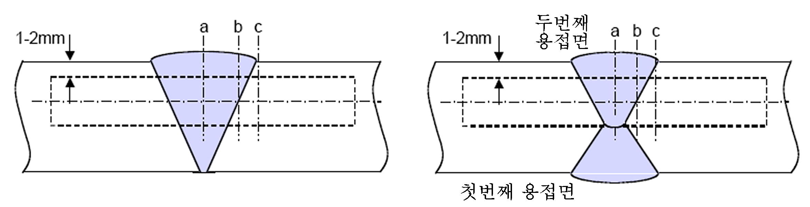 |
    | 통상의 용접입열 ≤50 kJ/cm | t > 50mm | 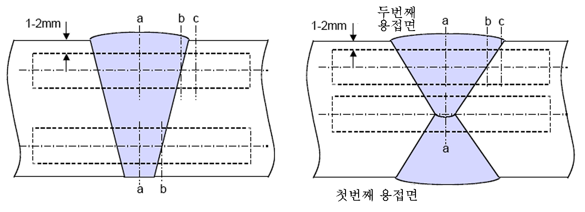 |
    | 대입열 >50 kJ/cm | t ≤ 50mm(2) | 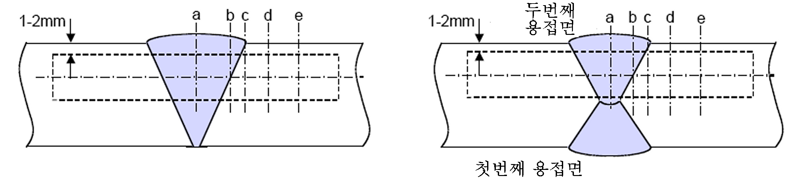 |
    | 대입열 >50 kJ/cm | t > 50mm | 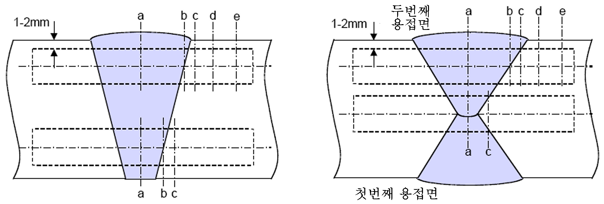 |
    | (비고) (1) 두께 20 mm를 넘는 일면 일층용접의 경우에는 이면측에 대하여도 “a" 노치 위치를 추가하여야 한다. (2) 두께 20 mm를 넘는 일면 용접의 경우에는 이면측에 대하여도 “a", ”b" 및 “c" 노치 위치를 추가하여야 한다. (3) 노치위치: a : 용접부 중심 "WM" b : 용융선상 "FL" c : 용융선으로부터 2 mm의 용접열영향부 d : 용융선으로부터 5 mm의 용접열영향부 e : 용접입열이 200 kJ/cm를 넘는 경우, 용융선으로부터 10 mm의 용접열영향부 |   |   |

    **표 2.2.8 맞대기용접 이음의 충격시험 합격기준 (t≤50mm)**${} ^{(1)(2)}$ ***(2019)***

    | 강재의 종류 | 시험온도 (℃) | 평균흡수에너지 (J) (4) |   |   |
    | --- | --- | --- | --- | --- |
    | 강재의 종류 | 시험온도 (℃) | 수동 및 반자동 용접이음 |   | 자동용접 이음 |
    | 강재의 종류 | 시험온도 (℃) | 아래보기, 수평 | 수직상진, 수직하진 | 자동용접 이음 |
    | *A*${} ^{(3)}$ | 20 | 47 이상 | 34 이상 | 34 이상 |
    | *B*${} ^{(3)}$, *D* | 0 | 47 이상 | 34 이상 | 34 이상 |
    | *E* | -20 | 47 이상 | 34 이상 | 34 이상 |
    | *AH* 32, *AH* 36 | 20 | 47 이상 | 34 이상 | 34 이상 |
    | *DH* 32, *DH*36 | 0 | 47 이상 | 34 이상 | 34 이상 |
    | *EH* 32, *EH* 36 | -20 | 47 이상 | 34 이상 | 34 이상 |
    | *FH* 32, *FH* 36 | -40 | 47 이상 | 34 이상 | 34 이상 |
    | *AH* 40 | 20 | 47 이상 | 39 이상 | 39 이상 |
    | *DH* 40 | 0 | 47 이상 | 39 이상 | 39 이상 |
    | *EH* 40 | -20 | 47 이상 | 39 이상 | 39 이상 |
    | *FH* 40 | -40 | 47 이상 | 39 이상 | 39 이상 |
    | *EH* 47-*H* *(50mm* | -20 | 64 이상 |   |   |
    | (비고) (1) 모재의 두께가 50 mm 초과인 경우(*EH-47*-*H* 제외), 우리 선급이 적절하다고 인정하는 바에 따른다. **【지침 참조】** (2) 이 규격은 시험재의 맞대기용접이 판의 압연방향과 직각인 경우에 적용한다. (3) 용융선 및 열영향부에서의 충격시험의 평균흡수에너지값은 27 J 이상으로 한다. (4) 1조의 시험편 중에서 2개 이상이 규정의 평균흡수에너지값 미만이거나 어느 한 개의 시험편이라도 규정의 평균흡수에너지값의 70 $\%$ 미만인 경우는 불합격으로 한다. |   |   |   |   |
    - **(가)** 충격시험편은 **1장 표 2.1.3**의 샤르피 V-노치 시험편으로 하고 그 채취위치는 **그림 2.2.6**에 따른다.
    - **(나)** 시험재로부터 채취하는 시험편의 수 및 노치의 위치는 **그림 2.2.8**에 따른다.
    - **(다)** 충격시험편은 모재의 표면으로부터 1~2 mm 아래에서 용접부에 직각으로, 그리고 측면이 용접 최종층을 포함하도록 채취한다.
    - **(라)** 시험온도 및 평균흡수에너지값은 **표 2.2.8**에 따른다.
    - **(마)** 서로 종류가 다른 강판들을 맞대기 용접하는 경우, 시험편은 인성이 낮은 강의 이음부 측에서 채취하여야 한다. 시험온도 및 평균흡수에너지값은 인성이 낮은 강에 대한 규격값에 따른다. 이 때,󰡒인성이 낮은 강재󰡓라 함은 **그림 2.2.7**의 (1)의 경우 *D*급 연강재를 말한다. (2019)
    - **(바)** 시험재의 용접에 두 개 이상의 용접법 또는 용접용재료를 사용하는 경우, 시험편은 각각을 대표하는 위치에서 각각 채취하여야 한다. 다만, 첫 번째 층의 용접 또는 이면 루트부에 사용된 용접법 또는 용접용재료의 경우에는 시험편 채취를 생략한다. (2017)
    - **(사)** 용착금속부의 크기나 형상 때문에 표준 샤르피 V-노치 충격시험편을 채취할 수 없는 경우에는 **1장 202.**의 **3**항을 준용한다.
  - **(2)** **용접구조용 초고장력 압연강재**
    - **(가)** 충격시험편, 채취위치, 시험편의 수 및 노치의 위치는 (1)호에 따른다.
    - **(나)** 시험온도 및 평균흡수에너지값은 모재의 규정에 따른다.
  - **(3)** **용접구조용 주강품 및 선체용 단강품**
    용접구조용 주강품 및 선체용 단강품에 대하여 충격치가 규정된 경우, 시험온도 및 평균흡수에너지값은 모재의 규정에 따른다.
  - **(4)** **저온용 압연강재 및 저온용 강관**
    - **(가)** 충격시험편은 **1장 표 2.1.3**의 샤르피 V-노치 시험편으로 하고 그 채취위치는 **그림 2.2.8**에 따른다.
    - **(나)** 시험재로부터 채취하는 시험편의 수, 노치의 위치, 시험온도 및 평균흡수에너지값은 **표 2.2.9**에 따른다.
  - **(5)** **보일러 및 제1급 압력용기용 압연강판** ***(2019)***
    - **(가)** 충격시험편, 채취위치, 시험편의 수는 (1)호에 따른다. 노치의 위치는 **그림 2.2.8**의 a,b,c로 한다.
    - **(나)** 시험온도 및 평균흡수에너지값은 모재의 규정에 따른다.
  - **(6)** **고온·고압용 강관** ***(2019)***

    **표 2.2.9 맞대기용접 이음의 충격시험** (저온용강) ***(2019)***

    | 재료기호 | 시험온도 (℃) | $A$(1) | $B$*,* $C$*,* $D$*,* $E$(1) |   |
    | --- | --- | --- | --- | --- |
    | 재료기호 | 시험온도 (℃) | 평균흡수에너지 (J)(3) | 평균흡수에너지 (J)(3) |   |
    | 재료기호 | 시험온도 (℃) | 평균흡수에너지 (J)(3) | $L$(2) | $T$(2) |
    | *RL* 235*A* | －40 | 27 이상 | 41 이상 | 27 이상 |
    | *RL* 235*B* | －50 | 27 이상 | 41 이상 | 27 이상 |
    | *RL* 325*A* | －50 | 27 이상 | 41 이상 | 27 이상 |
    | *RL* 325*B* | －60 | 27 이상 | 41 이상 | 27 이상 |
    | *RL* 355 | －60 | 27 이상 | 41 이상 | 27 이상 |
    | *RL* 1*N*355 | －80 | 27 이상 | 41 이상 | 27 이상 |
    | *RL* 2*N*255 | －70 | 27 이상 | 41 이상 | 27 이상 |
    | *RL* 3*N*355 | －100 | 27 이상 | 41 이상 | 27 이상 |
    | *RL* 5*N*390 | －120 | 27 이상 | 41 이상 | 27 이상 |
    | *RL* 9*N*490 | －196 | 27 이상 | 41 이상 | 27 이상 |
    | *RLPA* | －40 | 27 이상 | 27 이상 | - |
    | *RLPB* | －50 | 27 이상 | 27 이상 | - |
    | *RLPC* | －60 | 27 이상 | 27 이상 | - |
    | *RLP* 2 | －70 | 27 이상 | 34 이상 | - |
    | *RLP* 3 | －95 | 27 이상 | 34 이상 | - |
    | *RLP* 9 | －196 | 27 이상 | 41 이상 | - |
    | (비고) (1) **그림 2.2.8**에 표시한 시험편의 노치의 위치 (2) *L*은 시험재의 압연방향이 용접방향과 직각인 경우, *T*는 시험재의 압연방향이 용접방향과 평행인 경우를 표시한다. (3) 1조의 시험편 중에서 2개 이상이 규정의 평균흡수에너지값 미만이거나 어느 한 개의 시험편이라도 규정의 평균흡수에너지값의 70 $\%$ 미만인 경우는 불합격으로 한다. |   |   |   |   |
    - **(가)** 충격시험편, 채취위치, 시험편의 수는 (1)호에 따른다. 노치의 위치는 **그림 2.2.8**의 a로 한다.
    - **(나)** 시험온도 및 평균흡수에너지값은 모재의 규정에 따른다.
- **7.** **매크로조직 시험**
  - **(1)** 시험편은 용접금속, 용융선 및 열영향부가 분명히 나타나도록 용접부의 횡단면을 부식시킨다. 또한 용접열영향을 받지 않은 모재부의 약 10 mm를 포함하여야 한다.
  - **(2)** 시험은 모재와 용접층간의 용융 형상을 드러내어야 하며, 균열, 용입불량, 융합(融合)불량 또는 기타 유해하다고 인정되는 결함이 있어서는 안 된다.
- **8.** **외관검사 및 비파괴검사** ***(2019)***
  - **(1)** 시험편을 채취하기 전에 시험재 용접부의 전 길이(**그림 2.2.6**의 시험재의 제거부분 제외)에 대하여 외관검사 및 비파괴검사를 하여야 한다. 외관검사 및 비파괴검사는 어떠한 요구되는 후열처리, 자연 또는 인공시효 후에, 그리고 시험편을 절단하기 전에 실시하여야 한다.
  - **(2)** 항복강도 420 $\mathrm{N}/mm ^{2}$ 이상의 용접구조용 초고장력강의 경우에는 열처리를 하지 않는 한 용접완료 후 최소한 48시간 후에 외관검사 및 비파괴검사를 하여야 한다.
  - **(3)** 비파괴검사 방법에 대하여는 우리 선급의 승인을 받아야 한다. 용접부의 전 길이에 대한 외관검사 및 비파괴 검사 결과 균열 또는 기타의 유해한 결함이 없어야 한다.
  - **(4)** 판정기준은 아래 각 규칙의 관련 규정에 따른다. 다만, 우리 선급이 인정하는 경우에는 **(KS B) ISO 5817**을 적용할 수 있으며, 판정기준은 B등급으로 한다. 이 경우, 과잉용접(excess weld metal), 과잉용입(excess penetration)은 C등급으로 평가한다.
    - **(가)** 선체용 압연강재 - **부록 2-7**
    - **(나)** 용접구조용 초고장력강재 - **부록 2-7** 또는 **규칙 7편 5장**
    - **(다)** 저온용 강재 - **규칙 7편 5장**
    - **(라)** 기관용(보일러, 압력용기 및 관장치)재료 - **규칙 5편 5장** 또는 **6장**
  - **(5)** 알루미늄 합금의 경우, 외관 검사 및 비파괴검사에서 검출된 불완전부는 **ISO 10042:2018**의 B등급에 따라 평가하며, 과잉용접(excess weld metal), 과잉용입(excess penetration)은 C등급으로 평가한다. *(2022) (2023)*
- **9.** **경도시험** ***(2019)***
  - **(1)** **그림 2.2.9**에 가리키는 부위에서 경도분포를 측정한다.
    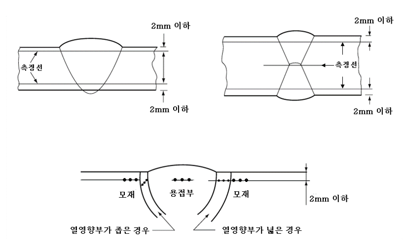
    (비고)1. 측정하중은 비커스 10 kg, 측정간격은 1 mm로 한다.2. *EH*47-*H* 및 취성균열정지강(BCA강)은 두께 중앙부를 추가해야 한다. *(2021)***그림 2.2.9 맞대기용접부의 경도시험**
  - **(2)** 경도 값은 **표 2.2.10**에 따른다.

    **표 2.2.10 맞대기용접 이음의 경도시험 합격기준** ***(2019) (2021)***

    | 시험재의 종류 | 재료기호 | 경도 (*Hv*10) |
    | --- | --- | --- |
    | 선체구조용 압연강재 | *AH* 36, *DH* 36, *EH* 36, *FH* 36, *AH* 40, *DH* 40, *EH* 40, *FH* 40, *EH*47-*H* | 350 이하 |
    | 선체구조용 압연강재 | *EH*47-*H-BCA1/2* | 380 이하 |
    | 용접구조용 초고장력강 | *AH* 43 ~ *FH* 70 | 420 이하 |
    | 용접구조용 초고장력강 | *AH* 90, *DH* 90, *EH* 90, *AH* 97, *DH* 97, *EH* 97 | 450 이하 |
    | 저온용 압연강재 및 저온용 강관 | *RL* 235*A*, *RL* 235*B*, *RL* 325*A*, *RL* 325*B, RLPA*, *RLPB*, *RLPC* | 380 이하 |
    | 저온용 압연강재 및 저온용 강관 | *RL* 355 | 450 이하 |
    | 저온용 압연강재 및 저온용 강관 | *RL* 1*N*355, *RL* 2*N*255, *RLP* 2 | 350 이하 |
    | 저온용 압연강재 및 저온용 강관 | *RL* 3*N*355, *RL* 5*N*390, *RLP* 3 | 450 이하 |
    | 저온용 압연강재 및 저온용 강관 | *RL* 9*N*490, *RLP* 9 | 450 이하 |
    | 보일러용 압연강판, 압력용기용 압연강판, 배관용 강관, 고온· 고압용 강관 |   | 380 이하 |
- **10.** **취성파괴시험(***EH***47-***H***)** ***(2019)***
  - **(1)** 시험재는 가장 입열이 큰 용접자세와 가장 입열이 작은 용접자세에서 각각 용접되어야 하며, 이들 시험재로 모든 시험을 하여야 한다.
  - **(2)** **시험방법 및 결과**
    - **(가)** 디프노치시험(Deep notch test) 또는 균열선단 개구변위(CTOD)시험 후, 그 결과는 기록되어야 한다.
    - **(나)** 균열선단 개구변위(CTOD) 시험은 **ISO 15653** 또는 이와 동등한 방법에 따른다.
    - **(다)** 디프노치시험(Deep notch test)를 하는 경우, 제조자는 시험절차를 우리 선급에 제출해야 한다.
    - **(라)** 제조자는 시험편의 치수, 시험조건 등에 대하여 우리 선급과 미리 협의해야 한다.

#### 405. 필릿용접 이음시험

- **1.** **적용** 이 절의 규정은 수동용접, 반자동용접 또는 자동용접 등에 의한 각 용접자세의 필릿 용접이음부 시험에 적용한다.
- **2.** **시험의 종류** 시험의 종류는 **표 2.2.11** 및 **표 2.2.12**를 따른다. 또한 우리 선급이 필요하다고 인정할 때에는 이들 이외의 시험을 요구할 수 있다. *(2023)* **【지침 참조】**

  **표 2.2.11 필릿용접 이음시험의 종류**(1) ***(2023)***

  | 시험의 종류 및 시험편의 수 (개) |   |   |   |   |
  | --- | --- | --- | --- | --- |
  | 외관검사 | 표면균열 검출시험 | 매크로 조직시험 | 경도시험(2) | 파면검사 |
  | 용접부 전장 | 용접부 전장 :표면 비파괴검사 (MT 또는 PT) | 2(3) | 1 | 2 |
  | (비고) (1) 기관용 재료의 필릿용접 이음시험은 **표 2.2.12**를 따른다. (2) **표 2.2.4**에서 경도시험을 요구하는 재료에 대해 실시한다. (3) 선체구조용 압연강재, 용접구조용 초고장력강 및 알루미늄 합금재 외의 모재인 경우에는 1개의 매크로 조직시험편을 채취한다. |   |   |   |   |

  **표 2.2.12 기관용 재료의 시험 종류 및 시험편의 수** ***(2019) (2023)***

  | 구 분 |   | 시험의 종류 및 시험편의 수 (개) (1)(2) |   |   |   |   |
  | --- | --- | --- | --- | --- | --- | --- |
  | 구 분 |   | 매크로 조직시험 | 외관검사 | 표면균열 검출시험 | 경도시험 | 파면검사 |
  | 보일러 및 압력용기의 용접 | 보일러 및 제1급 압력용기 | 1 | 용접부 전장 | 용접부 전장 :표면 비파괴검사 (MT 또는 PT) | - | 2 |
  | 보일러 및 압력용기의 용접 | 제2급 압력용기 | 1 | 용접부 전장 | 용접부 전장 :표면 비파괴검사 (MT 또는 PT) | - | 2 |
  | 보일러 및 압력용기의 용접 | 제3급 압력용기 | 우리 선급이 특히 필요하다고 인정하는 경우 이외에는 생략할 수 있다. |   |   |   |   |
  | 관의 용접 | 저온용 강관 | 2 | 용접부 전장 | 용접부 전장 :표면 비파괴검사 (MT 또는 PT) | 1 | 2 |
  | 관의 용접 | 스테인리스 강관 | 2 | 용접부 전장 | 용접부 전장 :표면 비파괴검사 (MT 또는 PT) | - | 2 |
  | 관의 용접 | 배관용 강관 | 2 | 용접부 전장 | 용접부 전장 :표면 비파괴검사 (MT 또는 PT) | - | 2 |
  | 관의 용접 | 고온· 고압용 강관(3) | 2 | 용접부 전장 | 용접부 전장 :표면 비파괴검사 (MT 또는 PT) | - | 2 |
  | (비고) (1) 특수한 재료 또는 용접법이 적용되는 경우 또는, 우리 선급이 필요하다고 인정하는 경우에는 이 절의 규정과 다른 시험조건의 시험 또는, 이 절에 규정하지 아니한 시험을 요구할 수 있다. (2) 고온에서 사용되는 재료에 대하여는 크리프 시험 또는 고온인장시험을 요구할 수 있다. (3) 설계압력이 30 $\mathrm{kgf}/cm ^{2}$ 이상으로 설계온도가 400℃ 를 넘는 장소에 사용되는 증기관과 플랜지의 용접에 적용한다. |   |   |   |   |   |   |
- **3.** **시험재 및 용접**
  - **(1)** 시험재는 실제시공에 사용되는 재료와 동일하든지 또는 이와 동등한 것으로 한다.
  - **(2)** 시험재의 모양 및 치수는 **그림 2.2.10** 및 **그림 2.2.11**에 따른다.
    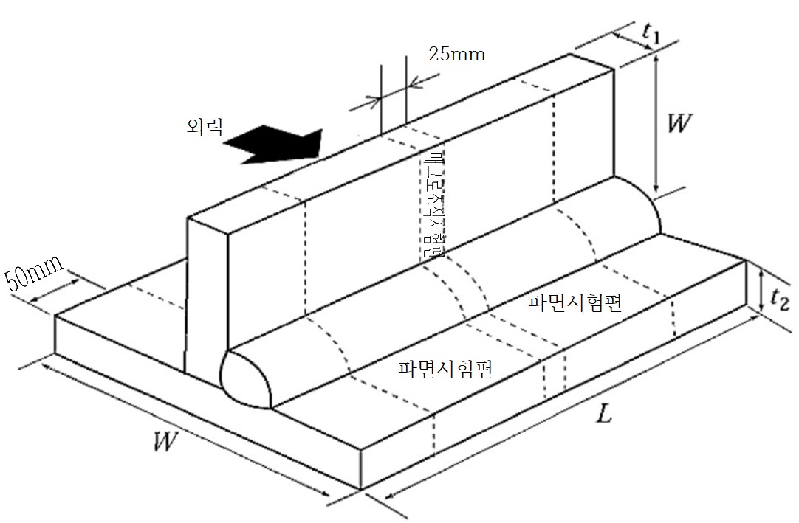
    (비 고)
- **1.** 시험재의 길이는 다음에 따른다
  - **(1)** 수동 및 반자동 용접의 경우: 너비(*W*) : 3×*t*. 단 150 $\mathrm{mm}$이상
    길이($L$) : 6×*t*. 단 350 $\mathrm{mm}$이상
  - **(2)** 자동용접의 경우: 너비(*W*) : 3×*t*. 단 150 $\mathrm{mm}$이상
    길이($L$) : 1000 $\mathrm{mm}$이상
- **2.** 시험재의 웨브 및 플랜지의 판두께 *t*_1 및 *t*_2는 실제공사에 사용되는 보통의 판두께의 것으로 한다.
- **3.** 시험재에는 가용접을 하여도 좋다.
- **4.** 필릿의 각장은 실제공사에서 사용되는 보통의 것으로 한다.
  **그림 2.2.10 판의 필릿용접이음 시험재** (단위 : mm ) *(2023)*

  |  | 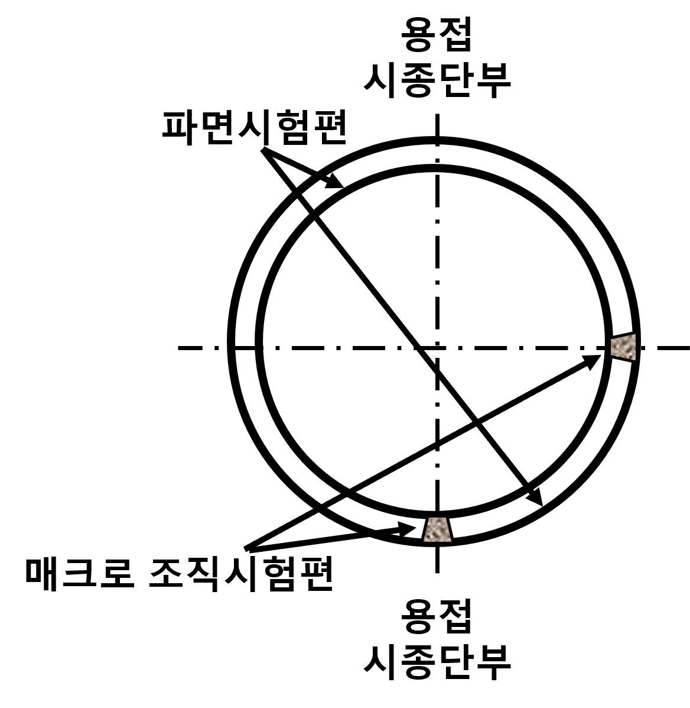 |  |
  | --- | --- | --- |
  | **그림 2.2.11 관의 필릿용접이음 시험재** ***(2023)*** |   |   |
  - **(3)** 용접은 실제시공에서 적용하는 각각의 용접자세에 따라서 한다.
  - **(4)** 시험재는 검사원이 필요하다고 인정하는 경우를 제외하고 한쪽면 만을 용접한다.
  - **(5)** 일층 수동용접 및 반자동 용접의 경우 시험재 길이의 중앙부에 용접의 멈춤 및 재시작 부위를 만들어야 하며, 다음 시험을 위하여 그 위치를 분명히 표시하여야 한다.
- **4.** **외관검사 및 비파괴 검사** ***(2019)***
  - **(1)** 시험편을 채취하기 전에 시험재 용접부의 전 길이에 대하여 표면균열 검출을 위한 외관검사 및 비파괴검사(액체침투탐상 또는 자분탐상검사)를 하여야 한다. 후열처리가 요구되거나 규정된 경우, 외관검사 및 비파괴검사는 열처리 후에 하여야 한다.
  - **(2)** 항복강도 420 $\mathrm{N}/mm ^{2}$ 이상의 용접구조용 초고장력강의 경우에는 열처리를 하지 않는 한 용접완료 후 최소한 48시간 후에 외관검사 및 비파괴검사를 하여야 한다.
  - **(3)** 비파괴검사 방법에 대하여는 우리 선급의 승인을 받아야 한다. 용접부의 전 길이에 대한 외관검사 및 비파괴 검사 결과 균열 또는 기타의 유해한 결함이 없어야 한다.
  - **(4)** 판정기준은 **(KS B) ISO 5817**의 B등급을 적용한다(알루미늄 합금의 경우, **ISO 10042:2018**의 B등급). 이 경우, 과잉 용접비드(excessive convexity), 과잉 목두께(excessive throat thickness)는 C등급을 적용한다. *(2022) (2023)*
- **5.** **매크로 조직시험**
  - **(1)** 매크로 조직시험편의 채취위치는 **그림 2.2.10** 및 **그림 2.2.11**에 따른다. 다만, 선체구조용 압연강재, 용접구조용 초고장력강 및 알루미늄 합금재의 경우에는 2개의 매크로 조직시험편을 채취한다. 또한, 수동용접 및 반자동 용접의 경우 매크로 조직시험편 중 한 개는 용접의 멈춤 및 재시작 부위에서 채취하여야 한다.
  - **(2)** 시험편은 용접금속, 용융선 및 열영향부가 분명히 나타나도록 용접부의 횡단면을 부식시킨다. 또한 용접열영향을 받지 않은 모재부의 약 10 mm를 포함하여야 한다.
  - **(3)** 시험은 모재와 용접층간의 용융 형상을 드러내어야 하며, 균열, 용입불량, 융합(融合)불량 또는 기타 유해하다고 인정되는 결함이 있어서는 안 된다.
- **6.** **경도시험** ***(2019)***
  - **(1)** **그림 2.2.12**에 가리키는 부위에서 경도분포를 측정한다.
    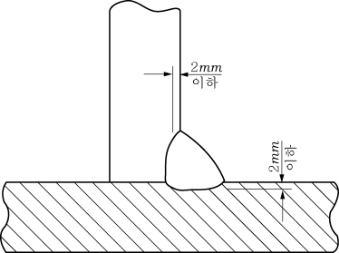 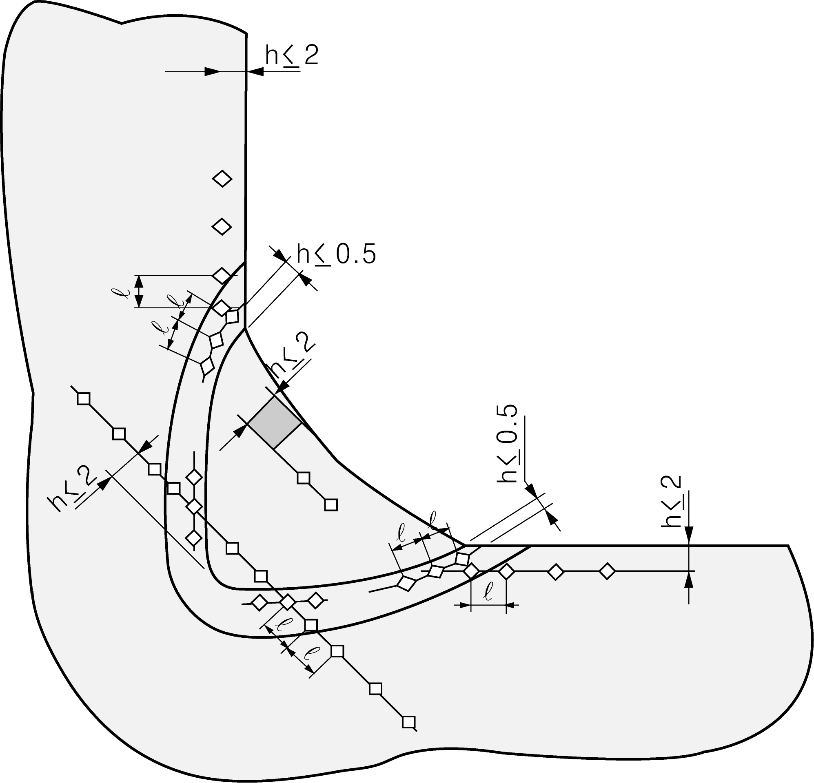
    (비고)
- **1.** 측정하중은 비커스 10 kg, 측정간격은 1 mm로 한다.
  **그림 2.2.12 필릿용접부의 경도시험**
  - **(2)** 경도 값은 **표 2.2.10**을 따른다.
- **7.** **파면시험** 매크로 조직시험편을 채취한 후 나머지 시험재를 **그림 2.2.10** 및 **그림 2.2.11**에 표시한 방향으로 외력을 가해 파단하고 파면에 균열, 기공(blow hole), 용입불량 등의 유해하다고 인정되는 결함을 평가한다. 다만, 평가기준은 **(KS B) ISO 5817**의 품질등급 B 기준을 따른다(알루미늄 합금의 경우, **ISO 10042:2018**의 B등급). *(2022) (2023)*

#### 406. 재시험 및 인정시험 기록서

- **1.** **재시험**
  - **(1)** 외관검사 또는 비파괴검사에 불합격한 경우에는 동일 용접조건으로 새로이 용접된 시험재에 대하여 재시험을 실시하고 이에 합격하여야 한다. 재시험에도 불합격한 경우, 예비 용접절차 시방서는 수정을 하지 않는 한 이 규칙의 요건에 부적합한 것으로 간주한다.
  - **(2)** 인장시험 또는 굽힘시험에 불합격한 경우 그 해당 시험에 대하여 2배수의 시험편을 채취하여 재시험을 하고 모든 시험편이 시험에 합격할 경우에 합격으로 한다.
  - **(3)** 허용 최대 경도값을 초과하는 부위가 1개소인 경우에는 시험편의 반대쪽 또는 시험면을 충분히 연마한 후 재시험을 할 수 있다. 재시험 결과 측정된 경도값들은 요구되는 최대경도값을 초과해서는 안된다.
  - **(4)** (가) 충격시험 결과가 규격에 합격하지 아니한 경우에는 다음 (i) 또는 (ii)의 경우를 제외하고 그 시험편을 채취한 시험재로부터 다시 1조의 시험편을 채취하여 재시험을 할 수 있다.
    - **(나)** 재시험은 최초 불합격된 시험편의 값을 포함하여 합계 6개의 시험편의 흡수에너지 평균치가 규정의 평균흡수에너지값 이상이고, 동시에 해당시험편 중 규정의 평균 흡수에너지 값보다 작은 시험편의 수가 2개 이하이고 규정의 평균흡수에너지값의 70 $\%$ 미만인 시험편의 수가 1개 이하이면 합격으로 한다.
  - **(5)** 남은 시험재에서 재시험용 시험편을 채취할 수 없는 경우에는 새로운 시험재를 동일 용접조건으로 용접하여 재시험용 시험편을 채취하여야 한다.
  - **(6)** 재시험에도 불합격한 경우에는 용접조건을 변경하여 다시 시험을 받을 수 있다. 이때에는 그 시험재에 대하여 모든 시험을 하고 이에 합격할 경우에 합격으로 한다.
- **2.** **인정시험기록서**
  - **(1)** 시험재에 대한 용접조건 및 시험의 결과를 종합한 인정시험 기록서 3부를 우리 선급에 제출하여야 한다. 용접절차 인정시험 기록서의 서식은 우리 선급이 적절하다고 인정하는 바에 따른다. **【지침 참조】**
  - **(2)** 각 용접절차 인정시험에 대하여 재시험을 포함하는 각 시험재를 평가한 결과가 기록되어야 한다. 이 절에서 용접절차 시방서에 대하여 규정한 항목도 포함되어야 한다.
  - **(3)** 시험재가 예비용접절차서에 따라 용접되었다는 기록은 입회한 검사원에 의해 서명되어야 하며, 우리 선급의 승인표시가 되어야 한다.

#### 407. 승인된 용접절차 시방서의 허용범위

- **1.** **일반**
  - **(1)** 제조자에 대하여 승인된 용접절차 시방서는 동일한 용접기술과 품질관리를 적용받는 제조자의 다른 공장에도 적용할 수 있다.
  - **(2)** 승인된 용접절차 시방서에 기재되어 있는 용접변수는 실제 용접시공시 허용된 범위 내에서 적용되어야 한다. 이미 승인된 용접절차 시방서의 내용 중 다음 **2**항에 정한 한 개 이상의 용접 필수변수가 규정된 허용범위를 넘어 변경되는 경우에는 용접절차 인정시험을 다시 실시하고 용접절차 시방서를 재승인 받아야 한다.
  - **(3)** 숍프라이머는 필릿용접의 품질에 영향을 미칠 수 있으므로 고려되어야 한다. 숍프라이머를 한 강재에 대한 용접절차 승인은 숍프라이머를 하지 않은 강재에 대하여도 승인한 것으로 본다. 그러나 그 반대는 허용되지 않는다.
- **2.** 용접절차 시방서의 재승인이 필요한 용접변수의 허용범위는 다음의 규정에 따른다. 단 국제적으로 공인된 규격(*AWS, ASME, ISO, EN* 등)에 따른 사항일 경우 이를 동등하게 인정할 수 있다.
  - **(1)** **모재** 모재의 종류 및 허용범위는 다음에 따른다. 다만, 여기에 규정되지 아니한 재료에 대하여는 우리 선급이 적절하다고 인정하는 바에 따른다. **【지침 참조】**
    승인된 용접절차는 그보다 규격 강도 및 합금성분이 동등하거나 낮은 오스테나이트계 스테인리스강에 대하여 적용할 수 있다.
    (ⅲ) **그룹 C** : *Al-Mg-Si*계 합금(6005*A*, 6061 및 6082 합금)
    승인된 용접절차는 그보다 규격 강도가 같거나 낮은 보일러용 압연강판에 대하여 적용할 수 있다.
    - **(가)** 선체구조용 압연강재
      - **(i)** 연강(*A, B, D* 및 *E*) 또는 이와 동등한 인장강도 400 ~ 520 $\mathrm{N}/mm ^{2}$에 상당하는 구조용 강재
        - **(ii)** 고장력강, YP47강 및 취성균열정지강(*AH* 32, *DH* 32, *EH* 32, *FH* 32, *AH* 36, *DH* 36, *EH* 36, *FH* 36, *AH* 40, *DH* 40, *EH* 40, *FH* 40, *EH*47-*H*, *EH* 36-*BCA*1, *EH* 40-*BCA*1/2 및 *EH*47-*H*-*BCA*1/2) 또는 이와 동등한 최소 항복강도 315~460 $\mathrm{N}/mm ^{2}$에 상당하는 구조용 강재 *(2018) (2021)*
      - **(a)** 각 강도그룹에 대하여 승인된 용접절차는 그보다 인성이 같거나 낮은 강에 대하여 적용할 수 있다.
      - **(b)** 각 인성 그룹에 대하여 승인된 용접절차는 그보다 강도가 같거나 두 단계 낮은 강에 대하여 적용할 수 있다.
      - **(c)** (a) 및 (b)의 규정을 자동 또는 반자동 2층 용접법, 일렉트로 슬래그 및 일렉트로 가스용접과 같이 50 $\mathrm{kJ}/cm$을 넘는 대입열용접에 적용하는 경우, 승인된 용접절차는 인성이 같고 또한 강도레벨이 한 단계 낮은 강에 대하여 적용할 수 있다.
      - **(d)** *EH*47-*H*로 승인된 용접절차는 그보다 강도가 같거나 한 단계 낮은 강(규격 최소항복강도 390 $\mathrm{N}/mm ^{2}$) 및 그보다 인성이 같거나 낮은 강에 대하여 적용할 수 있다. (적용 예시 : *AH* 40, *DH* 40, *EH* 40) *(2019)*
      - **(e)** 취성균열정지강(BCA강)을 50 kJ/cm가 넘지 않는 입열량으로 용접하는 경우, non-BCA강(재료기호에 *BCA1* 또는 *BCA2*를 제외한 강재)에 대하여 승인된 용접절차는 해당 재료기호의 BCA강에 적용할 수 있다. *(2021)*
    - **(나)** 용접구조용 초고장력 압연강재 (**규칙 2편 1장 308.**의 용접구조용 초고장력강재 또는 이와 동등한 최소 항복강도 365~960 $\mathrm{N}/mm ^{2}$에 상당하는 구조용 강재)
      - **(a)** 각 강도그룹에 대하여 승인된 용접절차는 그보다 인성이 같거나 낮은 강에 대하여 적용할 수 있다.
      - **(b)** 각 인성레벨에 대하여 승인된 용접절차는 그보다 강도가 같거나 한 단계 낮은 강에 대하여 적용할 수 있다.
      - **(c)** (a) 및 (b)의 규정을 자동 또는 반자동 2층 용접법, 일렉트로 슬래그 및 일렉트로 가스용접과 같이 50 $\mathrm{kJ}/cm$을 넘는 대입열용접에 적용하는 경우, 승인된 용접절차는 인성이 같고 또한 강도레벨이 한 단계 낮은 강에 대하여 적용할 수 있다.
      - **(d)** QT강재의 승인은 TMCP강재에 적용할 수 없으며, 그 반대도 역시 같다. *(2017) (2023)*
    - **(다)** C 및 C-Mn계 용접구조용 주강품
      - **(a)** 승인된 용접절차는 그보다 규격 강도가 같거나 낮은 주강품에 대하여 적용할 수 있다.
      - **(b)** 조질처리한 용접구조용 주강품에 대한 승인은 다른 열처리의 용접구조용 주강품에 대하여 적용할 수 없으며, 반대도 역시 같다.
    - **(라)** C 및 C-Mn계 선체 및 일반용 단강품
      - **(a)** 승인된 용접절차는 그보다 규격 강도가 같거나 낮은 단강품에 대하여 적용할 수 있다.
      - **(b)** 조질처리한 선체 및 일반용 단강품에 대한 승인은 다른 열처리의 선체 및 일반용 단강품에 대하여 적용할 수 없으며, 반대도 역시 같다.
    - **(마)** 저온용 압연강재 및 강관 (2019)
      - **(a)** 탄소강의 승인된 용접절차는 그보다 규격 강도 및 인성이 같거나 낮은 탄소강에 대하여 적용할 수 있다.
      - **(b)** 니켈합금강의 승인된 용접절차는 그보다 규격 강도 및 인성이 같거나 낮은 니켈합금강에 대하여 적용할 수 있다.
    - **(바)** 오스테나이트계 스테인리스 압연강재 및 강관 (2019)
    - **(사)** 알루미늄 합금재 (2019)
      - **(i)** **그룹 A** : *Mg* 합금의 함유량이 3.5%인 *Al-Mg*계 합금(5754 합금)
        - **(ii)** **그룹 B** : *Mg* 합금의 함유량이 4% 이상, 5.6% 이하인 *Al-Mg*계 합금(5059, 5083, 5086, 5383 및 5456 합금)
      - **(a)** 각각의 그룹에 있어서, 한 합금에 대하여 승인된 용접절차는 동일 그룹 내의 그보다 강도가 같거나 낮은 합금에 대하여 적용할 수 있다.
      - **(b)** **그룹 B**에 대하여 승인된 용접절차는 **그룹 A**에 대하여 적용할 수 있다.
    - **(아)** 보일러용 압연강판(*RSP* 24, *RSP* 30, *RSP* 32, *RSP* 30*A*, *RSP* 32*A)* (2019)
    - **(자)** 압력용기용 압연강판(*RPV* 24, *RPV* 32, *RPV* 36, *RPV* 42, *RPV* 46, *RPV* 50) *(2019)*
      - **(a)** 승인된 용접절차는 그보다 규격 강도 및 인성이 같거나 낮은 압력용기용 압연강판에 대하여 적용할 수 있다.
      - **(b)** QT로 열처리된 강판의 승인된 용접절차는 다른 열처리의 강판에 적용할 수 없으며, 그 반대도 마찬가지이다.
  - **(2)** **모재두께 및 바깥지름**

    **표 2.2.13 관 및 판의 맞대기용접 이음, T-이음 및 필릿용접이음의 모재두께 승인범위** ***(2019)***

    | 시험재의 두께, *t*(mm) (1) | 승인 두께범위, *t*(mm)(2) |   |
    | --- | --- | --- |
    | 시험재의 두께, *t*(mm) (1) | 맞대기 용접이음 및 T-이음의 일층용접 또는 양면 일층용접 | 맞대기 용접이음 및 T-이음의 다층용접 및 필릿용접이음 |
    | *t* ≤ 3 | 0.7 *t* ∼ 1.1 *t* | 0.7 *t* ∼ 2 *t*까지 |
    | 3 < *t* ≤ 12 | 0.7 *t* ∼ 1.1 *t* | 3 ∼ 2 *t*까지 |
    | 12 < *t ≤* 100 | 0.7 *t* ∼ 1.1 *t*(3) | 0.5 *t* ∼ 2 *t* (최대 150) |
    | 100 < *t* | 0.7 *t* ∼ 1.1 *t*(3) | 0.5 *t* ∼ 2 *t* |
    | (비고) (1) 여러 용접법을 사용하는 용접절차의 경우, 각 용접법에 대하여 기록된 두께를 기초로 각 용접법에 대한 승인두께범위를 정한다. (2) 수직하진 용접에서 승인범위의 상한은 시험재의 두께 “*t”*로 한다. (3) 50 $\mathrm{kJ}/cm$를 넘는 대입열용접의 경우, 승인두께범위의 상한은 1.0 *t* 로 한다. |   |   |

    **표 2.2.14 알루미늄 합금재의 모재두께 승인범위** ***(2019)***

    | 시험재의 두께 *t*(mm) | 승인 두께 범위 |
    | --- | --- |
    | *t* ≤ 3 | 0.5*t* ∼ 2*t* |
    | 3 < *t* ≤ 20 | 3 ∼ 2*t* |
    | *t* > 20 | ≥ 0.8*t* |

    두께가 얇은 모재를 기준으로 한다.
    개선 가공을 실시한 모재를 기준으로 한다.
    양쪽 모재를 모두 기준으로 한다. 단, 알루미늄 합금재는 두께가 두꺼운 모재를 기준으로 한다.

    **표 2.2.15 필릿용접의 목두께 허용 범위** ***(2019)***

    | 구분($a$=시험재의 목두께) |   | 승인 범위(mm) |
    | --- | --- | --- |
    | 알루미늄 합금재 이외의 모재 | 일층용접 | 0.75$a$∼1.5$a$ |
    | 알루미늄 합금재 이외의 모재 | 다층용접 | 다층용접의 맞대기 용접이음과 같이 한다 (즉 $a$=*t*) |
    | 알루미늄 합금재(1) | $a$ < 10 | 0.75$a$ ∼ 1.5$a$ |
    | 알루미늄 합금재(1) | $a$ ≥ 10 | ≥ 7.5 |
    | (비고) (1) 맞대기용접 시험으로 필릿용접이 인정된 경우, 목두께의 허용범위는 용착금속의 두께를 기준으로 한다. |   |   |

    **표 2.2.16 관의 바깥지름 승인범위** ***(2019)***

    | 시험재의 바깥지름 *D* (mm) | 승인 범위 (mm)(1) |
    | --- | --- |
    | *D* ≤ 25 | 0.5*D*∼2*D* |
    | *D* 〉25 | ≥ 0.5D (최소 25 mm) |
    | (비고) (1) 바깥지름이 500 mm가 넘는 관의 용접은 판 용접의 승인으로 허용된다. |   |
    - **(가)** 두께 *t*의 판 및 관의 시험재에 대하여 수행한 용접절차 시방서에 대한 허용 두께 범위는 **표 2.2.13** 및 **표 2.2.14**에 따른다.
    - **(나)** 승인 범위를 정하는 모재 두께 *t*의 기준은 다음을 따른다. *(2019)*
      - **(a)** 맞대기 용접
      - **(b)** T-이음 완전 용입 용접
      - **(c)** 필릿 용접 및 T-이음 부분 용입 용접
    - **(다)** **표 2.2.13** 및 **표 2.2.14**의 요건에 추가하여 필릿용접의 목두께($a$)에 대한 승인의 범위는 **표 2.2.15**에 따른다.
    - **(라)** 관의 시험재에 대하여 수행한 용접절차 시방서에 대한 허용 바깥지름 범위는 **표 2.2.16**에 따른다.
    - **(마)** 위의 규정에도 불구하고, 열영향부에서의 3개의 경도값이 **404.**의 **9**항 (2)호 및 **405.**의 **6**항 (2)호에 규정한 허용최대값의 25 Hv 이내인 경우(예, 허용최대값 : 350 Hv, 결과 : 325~350 Hv), 승인최대두께는 시험재의 두께로 제한한다. *(2017) (2019)*
  - **(3)** **용접자세**

    | 시험 자세 | 인정되는 용접자세 |
    | --- | --- |
    | PA(아래보기) | PA |
    | PC(수평) | PA, PC |
    | PE(위보기) | PA, PC, PE |
    | PF(수직상진) | PA, PC, PF |
    | (비고) (1) 맞대기 용접에 대하여 승인된 용접자세는 전 (2)호 (가)에 규정된 모재두께 승인범위 내에서 필릿용접에 대하여도 승인된 것으로 간주한다. 그러나 그 반대는 허용되지 않는다. |   |

    | 맞대기 용접 자세 | 필릿 및 T-이음(완전용입 및 부분용입) |
    | --- | --- |
    | PA(아래보기) | PA(아래보기), PB(수평수직) |
    | PC(수평) | PB(수평수직), PC(수평) |
    | PE(위보기) | PD(수평위보기), PE(위보기) |
    | PF(수직상진) | PF(수직상진) |
    | PG(수직하진) | PG(수직하진) |
    - **(가)** 어떠한 자세로 용접된 시험에 대한 승인은 당해 자세로 한정된다. (**규칙 표 2.2.23-2** 및 **표 2.2.23-3** 참조) 다만 알루미늄 합금재의 승인 범위는 **표 2.2.17**에 따른다. *(2019)*
    - **(나)** 여러 자세를 승인받기 위해서는 시험재는 가장 입열이 큰 용접자세와 가장 입열이 작은 용접자세에서 각각 용접되어야 하며, 또한 각 자세로 용접된 시험재에 대하여 모든 시험을 하여야 한다. 완전용입되는 판의 맞대기용접에서는 일반적으로 가장 입열이 큰 용접자세로 수직상진을 선택하고, 가장 입열이 작은 용접자세로 수평을 선택한다. 또한 완전용입되는 관의 맞대기용접에서의 경사원주상진(PH-45)으로 승인된 용접절차 시방서는 여러 자세를 허용한다. 다만 수직하진(PG), 원주하진(PJ) 및 경사원주하진(PJ-45) 용접자세는 별도의 시험이 요구된다. *(2019)*
    - **(다)** 맞대기 용접으로 승인된 용접자세는 **표 2.2.18**에 따라 필릿, T-이음(완전 용입 및 부분 용입)의 용접자세에 대해 승인된 것으로 한다. *(2019)*
  - **(4)** **용접법**
    - **(가)** 승인은 용접절차 인정시험에 사용된 용접법에 대하여만 유효하다. 다층용접법에서 일층용접법으로의 변경은 인정되지 않는다.
    - **(나)** 둘 이상의 용접법을 사용하는 경우, 용접절차 승인은 각 용접법에 대하여 별도의 용접절차 인정시험을 하여야 한다. 둘 이상의 용접법을 사용하여 용접절차 인정시험을 할 수 있으나, 승인은 용접절차 인정시험동안 행해진 용접순서를 유지하는 경우에 한해 유효하다.
  - **(5)** **용접용재료**
    - **(가)** 시험된 용접재료와 관련하여 **6절**에 규정된 모든 부기기호를 포함하는 동일 용접재료기호의 우리 선급의 승인을 받은 다른 용접용재료에 대하여 인정이 가능하다. 50 $\mathrm{kJ}/cm$를 넘는 대입열용접의 경우, 용접절차 인정시험에 사용된 용접재료의 재료기호 및 상표의 변경은 허용되지 않는다. 다만 선체구조용 및 용접구조용 용접절차 인정시험이 아닌 경우, 용접용재료의 승인범위는 우리 선급이 적절하다고 인정하는 바에 따른다. *(2019)*
    - **(나)** **표 2.2.3** 용접용재료의 사용구분에 규정된 용접용재료 외의 변경은 인정되지 않는다. *(2017)*
    - **(다)** **603.**의 **3**항 (4)호에 규정하는 이외의 보호가스의 변경은 인정되지 않는다.
  - **(6)** **용접조건**
    - **(가)** 전류의 종류(교류, 직류, 펄스) 변경 및 극성의 변경은 새로운 용접절차 인정시험이 요구된다. *(2019)*
    - **(나)** 최저 예열온도는 인정시험에 사용된 온도로 하며, 최대 층간온도는 인정시험에 사용된 온도로 한다. *(2019)*
    - **(다)** 인정시험에 사용된 후열처리는 제조동안에도 유지되어야 한다. 유지시간은 두께에 따라 적절히 조정되어야 한다. 6000계열 알루미늄 합금재의 인정시험에서 승인된 인공시효는 장시간의 상온(자연)시효를 허용한다. *(2019)*
  - **(7)** **용접입열량**
    - **(가)** 승인된 입열량의 상한은 시험재의 용접에 사용된 것보다 25% 큰 값 또는 55 $\mathrm{kJ}/cm$ 중 작은 값으로 한다. 다만 50 $\mathrm{kJ}/cm$을 넘는 대입열용접의 경우에는 상한값을 10% 큰 값으로 한다.
    - **(나)** 승인된 입열량의 하한은 시험재의 용접에 사용된 것보다 25% 작은 값으로 한다.
  - **(8)** **이음의 형태**

    **표 2.2.19 용접이음의 형태에 따른 승인의 범위**

    | 시험재의 용접이음의 형태 |   |   |   | 승인의 범위 |
    | --- | --- | --- | --- | --- |
    | 맞대기용접 | 일면용접 | 뒷댐판이 있는 경우 | A | A, C |
    | 맞대기용접 | 일면용접 | 뒷댐판이 없는 경우 | B | A, B, C, D |
    | 맞대기용접 | 양면용접 | 뒷면 다듬질을 하는 경우 | C | C |
    | 맞대기용접 | 양면용접 | 뒷면 다듬질을 하지 않는 경우 | D | C, D(1) |
    | (비고) (1) 알루미늄 합금재의 경우에는 A를 승인의 범위에 포함한다. *(2019)* |   |   |   |   |

    **【지침 참조】**
    - **(가)** 시험재의 용접이음의 형태에 따른 승인의 범위는 **표 2.2.19**에 따른다.
    - **(나)** 맞대기용접에 대하여 승인된 용접절차는 (2)호 (가)에 규정된 승인두께 범위 내에서 필릿용접, T-이음 완전용입/부분용입 용접에 대하여도 승인된 것으로 간주한다. 그러나 그 반대는 허용되지 않는다. *(2019)*
    - **(다)** 용접부의 용입 및 용융 등에 중대한 영향을 미칠 수 있는 용접 홈 및 개선형상의 변경은 허용되지 않는다. 다만, 홈 개선각도, 루트 간격 및 루트면에 대한 허용오차는 우리 선급이 적절하다고 인정하는 바에 따른다.
  - **(9)** **기타**
  - **(1)** 부터 (8)호에 규정되지 아니한 필수 용접변수에 대한 용접 허용범위는 공인된 국제, 국가규격(*AWS, ASME, ISO, EN* 등)에 따를 수 있다.
- **3.** **2**항 이외의 사항이 변경되는 경우에는 용접절차 인정시험을 생략할 수 있으며, 이 경우 관련 인정시험기록서가 첨부된 용접절차 시방서를 재승인 받아야 한다.

### 제 5 절 용접사 기량자격제도 (2018)

#### 501. 일반사항

- **1.** 선박 건조 및 보수에 종사하는 용접사는 적용하는 용접방법 및 재료에 대하여 각각 정하여진 기량자격시험에 합격하고 그 기량자격을 가진 자이어야 한다.
- **2.** 가용접에 종사하는 가용접사(tack welder)는 이 절의 규정에 따라 기량자격시험에 합격하고 그 기량자격을 가진 자이어야 한다. 다만 맞대기용접 또는 필릿 용접의 기량자격을 가진 자는 그 승인범위에 대응되는 가용접에 대해서도 기량자격을 가진 것으로 인정한다.
- **3.** 서브머지드 아크(submerged arc) 용접, 그래비티(gravity) 용접, 일렉트로가스(electro-gas) 용접 및 자동 이송장치(auto-carriage)를 탑재한 *MAG* 용접 등과 같이 완전 기계화 및 자동화 장치를 작동하거나 조정에 책임이 있는 자동 용접사는 장치의 작동과 관련된 기량자격을 가진 자이어야 한다. 다만, 장치의 작동이나 조정에 책임이 없는 자동 용접사는 기량자격을 보유할 필요는 없지만 종사하는 작업에 대하여 숙련된 자이어야 하며, 생산된 용접부가 요구되는 품질을 만족해야 한다.
- **4.** 이 절에 규정되지 아니하는 특수한 재료 및/또는 용접에 종사하는 용접사의 기량자격시험에 대하여는 우리 선급이 적절하다고 인정하는 바에 따른다.
- **5.** 용접사의 교육, 훈련, 자격관리 및 기량 유지에 관한 책임은 해당 용접사를 고용한 회사에게 있다. 검사원은 용접사의 자격이 적절한지를 확인하고 판정해야 한다.
- **6.** 국가 또는 국제 표준에 따른 용접사 기량자격을 보유한 용접사는 해당 표준이 검사, 승인 범위, 기량자격시험 요건을 포함하는 기술적인 관점에서 이 절과 동등하다고 우리 선급이 인정한 경우에는 기량자격시험을 생략하고 용접 공사에 종사할 수 있다. 표준에 규정된 요건이 적용되더라도 용접사 기량자격의 갱신 요건은 **504.**의 **2**항을 따른다. 또한 대체되는 용접 표준 또는 규격의 전체가 자격 인정에 적용되어야 하며, 교차/혼합 적용은 허용되지 않는다. *(2022)*

#### 502. 기량자격의 구분 및 승인범위

- **1.** 용접사는 모재, 용접법, 용접용재료, 용접이음의 형태, 모재두께 및 용접자세별로 기량자격이 인정되어야 한다.
- **2.** **용접법의 종류**
  - **(1)** 용접사 기량자격을 위한 용접법의 종류는 **표 2.2.20**에 따른다.

    **표 2.2.20 용접사 기량자격을 위한 용접법의 종류** ***(2019) (2022)***

    | 기호 | 실제 용접공사에서의 용접법(1)(2) |   | **ISO 4063:2009** |
    | --- | --- | --- | --- |
    | M | 수동용접 | 피복아크용접(*SMAW*) | 111 |
    | G | 가스용접 | 가스용접(*GA*) | 31 |
    | S | 반자동용접 | (1) 메탈불활성가스용접(*MIG*) (2) 메탈활성가스용접(*MAG*) (3) 플럭스코어드 아크용접(*FCAW*) | 131 135(solid wire), 138(metal cored wire) 136 |
    | T | TIG용접 | 텅스텐 불활성가스용접(*GTAW*) | 141 |
    | A | 자동용접 | (1) 서브머지드 아크용접(*SAW*) (2) 그래비티 용접(*GRW*) (3) 일렉트로가스용접(*EGW*) (4) 일렉트로슬래그용접(*ESW*) | 12 112 73 72 |
    | (비고) (1) 승인된 용접법의 승인범위는 기량자격시험에서 사용한 용접법만을 인정한다. 단, 반자동용접 및 TIG용접으로 승인된 기량자격은 해당 용접법에 자동 이송장치(auto-carriage)를 탑재한 자동용접도 인정할 수 있다. (2) 다수의 용접법을 사용하는 경우, 용접사는 다수의 용접법을 적용한 한 번의 기량자격시험 또는 각 용접법별로 별개의 기량자격시험에 의해 승인될 수 있다. 다만 시험재에 적용한 용접법의 순서가 변경될 수 없다. |   |   |   |
- **3.** **용접용재료**
  - **(1)** 용접용재료의 승인범위는 **5항**에 따라 인정되는 재료그룹과 알맞은 용접용재료로 한다.
  - **(2)** 피복아크용접의 기량자격시험에는 베이직계(basic), 엑시드계(acid) 및 루틸계(rutile)의 피복 용접봉이 사용되어야 한다.
  - **(3)** 용가재를 사용한 용접의 자격이 부여되면 용가재 없이 용접하는 것이 허용되지만 그 반대의 경우는 허용되지 않는다.
- **4.** **용접이음의 형태**
  - **(1)** 용접사 기량자격을 위한 용접이음의 형태는 **표 2.2.21**에 따른다.

    **표 2.2.21 용접기량자격을 위한 용접이음의 형태**

    | 기량자격시험을 위한 시험재에 사용되는 용접이음의 형태 |   |   |   | 인정되는 용접이음의 형태 |
    | --- | --- | --- | --- | --- |
    | 맞대기용접 | 일면용접 (SS) | 뒷댐판이 있는 경우 | SS MB | SS MB, DS MB, SL, ML |
    | 맞대기용접 | 일면용접 (SS) | 뒷댐판 대신 가스를 사용하는 경우 | SS GB | SS MB, SS GB, DS MB, SL, ML |
    | 맞대기용접 | 일면용접 (SS) | 뒷댐판이 없는 경우 | SS NB | SS MB, SS NB, SS GB, DS MB, DS NB, SL, ML |
    | 맞대기용접 | 양면용접 (DS) | 가우징을 하는 경우 | DS MB | SS MB, DS MB, SL, ML |
    | 맞대기용접 | 양면용접 (DS) | 가우징을 하지 않는 경우 | DS NB | SS MB, DS MB, DS NB, SL, ML |
    | 필릿용접 | 단층용접 | - | SL | SL |
    | 필릿용접 | 다층용접 | - | ML | SL, ML |
  - **(2)** T자 이음형태의 용접에서 완전용입/부분용입으로 용접하는 용접사는 해당 용접법 및 용접자세의 맞대기용접 자격을 보유해야 한다.
  - **(3)** 맞대기용접으로 승인된 가용접사는 필릿용접이 허용되지만 그 반대는 허용되지 않는다. *(2019)*
- **5.** **모재**
  - **(1)** 용접사 기량자격 인정을 위한 재료그룹은 **표 2.2.22**에 따른다.

    **표 2.2.22 용접기량자격을 위한 재료그룹**

    | 기량자격시험을 위한 시험재에 사용되는 재료(1) |   |   |   | 인정되는 재료그룹(1)(2) |
    | --- | --- | --- | --- | --- |
    | 탄소강(1) | 선체구조용 압연강재 보일러용 압연강판 압력용기용 압연강판 저온용 압연강재(니켈합금강 제외) 체인용 봉강 보일러용 압연봉강 용접구조용 초고장력 압연강재 YP47강판 보일러 및 열교환기용 강관 압력배관용 강관 저온용 강관(니켈합금강 제외) 탄소강 주강품 저합금강 주강품 체인용 주강품 저온용 주강품(*RLC*2 및 *RLC*3 제외) 탄소강 단강품 합금강 단강품 체인용 단강품 저온용 단강품(*RLF*3 및 *RLF*9 제외) | *A* ~ *FH* 40 *RSP* 42 ~ *RSP* 49*A* *RPV* 24 ~ *RPV* 50 *RL* 235*A* ~ *RL* 355 *RSBC* 31 ~ *RSBC* 70 *RSB* 42 ~ *RSB* 46 *AH* 43 ~ *FH* 70 *EH*47-*H* *RSTH* 12 ~ *RSTH* 52 *RST* 138 ~ *RST* 424 *RLPA* ~ *RLPC* *RSC* 410 ~ *RSC* 600 *RSC* 440*A* ~ *RSC* 550*A* *RSCC* 50, *RSCC* 70 *RLCA*, *RLCB* *RSF* 400 ~ *RSF* 760(*H*/*M*) *RSF* 550*AM* ~ *RSF* 1100*AM* *RSFC* 50, *RSFC* 70 *RLFA* ~ *RLFC* | CS | CS |
    | 스테인리스강 | 스테인리스 압연강재 스테인리스 강관 스테인리스강 주강품 프로펠러용 스테인리스 주강품 스테인리스강 단강품 듀플렉스 스테인리스강 | *RSTS* 304 ~ *RSTS* 347 *RSTS* 304*TP* ~ *RSTS* 347*TP* *RSSC* 13 ~ *RSSC* 21 12*Cr*1*Ni*, 19*Cr*11*Ni* *RSSF* 304 ~ *RSSF* 347 *S*31803, *S*32750 | STS | STS |
    | 니켈합금강 | 저온용 압연강재(탄소강 제외) 저온용 강관(탄소강 제외) 저온용 주강품(*RLCA* 및 *RLCB* 제외) 저온용 단강품(*RLFA* ~ *RLFC* 제외) | *RL* 1*N*355 ~ *RL* 9*N*490 *RLP* 2 ~ *RLP* 9 *RLC* 2, *RLC* 3 *RLF* 3, *RLF* 9 | NI | NI |
    | 동 및 동합금 | 동관 및 동합금관 동합금 주물 | *C* 1201 ~ *C* 7150 *CU* 1 ~ *CU* 4 | CU | CU |
    | 알루미늄 합금 | 알루미늄 합금재 | 5083 ~ 6082 (*P*/*S*) | AL | AL |
    | (비고) (1) 선체구조용으로 사용되며 규격 최소항복강도 460 N/mm^2을 초과하는 재료에 대해서는 이 표의 재료그룹과 다른 그룹으로 간주되어 새로운 용접사 기량자격을 보유해야 한다. (2) 2개의 서로 다른 재료그룹에 속하는 재료를 용접하는 경우에는 별개의 그룹으로 자격인정을 요구할 수 있다. |   |   |   |   |
- **6.** **모재두께 및 바깥지름**
  - **(1)** 모재두께 T의 판 및 관의 시험재에 대하여 수행한 기량자격시험에 대한 허용두께 범위는 **표 2.2.22-1**에 따른다. 가용접의 모재두께 승인범위는 3 mm 이상으로 한다.

    **표 2.2.22-1 판 및 관의 모재두께 승인 범위** ***(2020)***

    | 구분 | 시험재의 두께 T(mm) | 승인두께범위 t(mm) |
    | --- | --- | --- |
    | 판의 맞대기/필릿 용접, 관의 맞대기 용접 | T < 3 | T ≤ t ≤ 2T |
    | 판의 맞대기/필릿 용접, 관의 맞대기 용접 | 3 ≤ T < 12 | 3 ≤ t ≤ 2T |
    | 판의 맞대기/필릿 용접, 관의 맞대기 용접 | 12 ≤T | 3 ≤ t |
    | 관의 필릿 용접 | T < 3 | T ≤ t ≤ 2T 또는 3mm 중 큰값 |
    | 관의 필릿 용접 | 3≤T | 3 ≤ t |
  - **(2)** 관의 시험재에 대하여 수행한 기량자격시험에 대한 허용 바깥지름 범위는 **표 2.2.22-2**에 따른다.

    **표 2.2.22-2 관의 바깥지름 승인 범위**

    | 시험재의 바깥지름 D(mm)(1)(2) | 승인 범위 d(mm) |
    | --- | --- |
    | D ≤ 25 | D ≤ d ≤ 2D |
    | 25 < D | 0.5D ≤ d(최소 25 mm) |
    | (비고) (1) 관의 바깥지름이 500 mm 이상일 때의 기량자격 시험재는 강판에 대한 시험재로 할 수 있다. 단, 관의 가용접은 관의 바깥지름과 상관없이 강판에 대한 시험재로 할 수 있다. *(2022) (2023)* (2) 비원형 단면인 경우에 바깥지름의 측정은 가장 짧은 거리를 선택하여 측정한다. |   |
- **7.** **용접자세**
  기량자격시의 시험자세와 실제 용접공사 시의 인정자세는 **표 2.2.23-1**에 따른다.

  **표 2.2.23-1 용접기량자격의 자세**

  | 시험자세(1)(2) |   |   |   | 실제 용접시공에 인정되는 용접자세(1)(2) |   |   |   |   |   |   |   |   |   |   |   |   |   |   |   |   |   |   |   |   |   |   |   |   |
  | --- | --- | --- | --- | --- | --- | --- | --- | --- | --- | --- | --- | --- | --- | --- | --- | --- | --- | --- | --- | --- | --- | --- | --- | --- | --- | --- | --- | --- |
  | 시험자세(1)(2) |   |   |   | 판의 용접(3) |   |   |   |   |   |   |   |   |   |   |   | 관의 용접(4) |   |   |   |   |   |   |   |   |   |   |   |   |
  | 시험자세(1)(2) |   |   |   | 맞대기이음 |   |   |   |   | 필릿이음 |   |   |   |   |   |   | 맞대기이음 |   |   |   |   |   | 필릿이음 |   |   |   |   |   |   |
  | 시험자세(1)(2) |   |   |   | **PA** | **PC** | **PE** | **PF** | **PG** | **PA** | **PB** | **PC** | **PD** | **PE** | **PF** | **PG** | **PA** | **PC** | **PH** | **PJ** | **PH** **-45** | **PJ** **-45** | **PA** | **PB** | **PD** | **PH** | **PJ** | **PH** **-45** | **PJ** **-45** |
  | 판 의 용 접 (4) | 맞 대 기 이 음 | **아래보기** | **PA** | ◉ |   |   |   |   | ◉ | ◉ |   |   |   |   |   | ◉ |   |   |   |   |   | ◉ | ◉ |   |   |   |   |   |
  | 판 의 용 접 (4) | 맞 대 기 이 음 | **수평** | **PC** | ◉ | ◉ |   |   |   | ◉ | ◉ | ◉ |   |   |   |   | ◉ | ◉ |   |   |   |   | ◉ | ◉ |   |   |   |   |   |
  | 판 의 용 접 (4) | 맞 대 기 이 음 | **위보기** | **PE** | ◉ | ◉ | ◉ |   |   | ◉ | ◉ | ◉ | ◉ | ◉ |   |   | ◉ | ◉ |   |   |   |   | ◉ | ◉ | ◉ |   |   |   |   |
  | 판 의 용 접 (4) | 맞 대 기 이 음 | **수직상진** | **PF** | ◉ |   |   | ◉ |   | ◉ | ◉ |   |   |   | ◉ |   | ◉ |   |   |   |   |   | ◉ | ◉ |   |   |   |   |   |
  | 판 의 용 접 (4) | 맞 대 기 이 음 | **수직하진** | **PG** |   |   |   |   | ◉ |   |   |   |   |   |   | ◉ |   |   |   |   |   |   |   |   |   |   |   |   |   |
  | 판 의 용 접 (4) | 필 릿 이 음 | **아래보기** | **PA** |   |   |   |   |   | ◉ |   |   |   |   |   |   |   |   |   |   |   |   | ◉ |   |   |   |   |   |   |
  | 판 의 용 접 (4) | 필 릿 이 음 | **수평수직** | **PB** |   |   |   |   |   | ◉ | ◉ |   |   |   |   |   |   |   |   |   |   |   | ◉ | ◉ |   |   |   |   |   |
  | 판 의 용 접 (4) | 필 릿 이 음 | **수평** | **PC** |   |   |   |   |   | ◉ | ◉ | ◉ |   |   |   |   |   |   |   |   |   |   | ◉ | ◉ |   |   |   |   |   |
  | 판 의 용 접 (4) | 필 릿 이 음 | **수평위보기** | **PD** |   |   |   |   |   | ◉ | ◉ | ◉ | ◉ | ◉ |   |   |   |   |   |   |   |   | ◉ | ◉ | ◉ |   |   |   |   |
  | 판 의 용 접 (4) | 필 릿 이 음 | **위보기** | **PE** |   |   |   |   |   | ◉ | ◉ | ◉ | ◉ | ◉ |   |   |   |   |   |   |   |   | ◉ | ◉ | ◉ |   |   |   |   |
  | 판 의 용 접 (4) | 필 릿 이 음 | **수직상진** | **PF** |   |   |   |   |   | ◉ | ◉ |   |   |   | ◉ |   |   |   |   |   |   |   | ◉ | ◉ |   |   |   |   |   |
  | 판 의 용 접 (4) | 필 릿 이 음 | **수직하진** | **PG** |   |   |   |   |   |   |   |   |   |   |   | ◉ |   |   |   |   |   |   |   |   |   |   |   |   |   |
  | 관 의 용 접 (3) | 맞 대 기 이 음 | **아래보기** | **PA** | ◉ |   |   |   |   | ◉ | ◉ |   |   |   |   |   | ◉ |   |   |   |   |   | ◉ | ◉ |   |   |   |   |   |
  | 관 의 용 접 (3) | 맞 대 기 이 음 | **수평** | **PC** | ◉ | ◉ |   |   |   | ◉ | ◉ | ◉ |   |   |   |   | ◉ | ◉ |   |   |   |   | ◉ | ◉ |   |   |   |   |   |
  | 관 의 용 접 (3) | 맞 대 기 이 음 | **원주상진** | **PH** | ◉ |   | ◉ | ◉ |   | ◉ | ◉ |   | ◉ | ◉ | ◉ |   | ◉ |   | ◉ |   |   |   | ◉ | ◉ | ◉ | ◉ |   |   |   |
  | 관 의 용 접 (3) | 맞 대 기 이 음 | **원주하진** | **PJ** | ◉ |   | ◉ |   | ◉ | ◉ | ◉ |   | ◉ | ◉ |   | ◉ | ◉ |   |   | ◉ |   |   | ◉ | ◉ | ◉ |   | ◉ |   |   |
  | 관 의 용 접 (3) | 맞 대 기 이 음 | **경사** **원주상진** | **PH** **-45** | ◉ | ◉ | ◉ | ◉ |   | ◉ | ◉ | ◉ | ◉ | ◉ | ◉ |   | ◉ | ◉ | ◉ |   | ◉ |   | ◉ | ◉ | ◉ | ◉ |   | ◉ |   |
  | 관 의 용 접 (3) | 맞 대 기 이 음 | **경사** **원주하진** | **PJ** **-45** | ◉ | ◉ | ◉ |   | ◉ | ◉ | ◉ | ◉ | ◉ | ◉ |   | ◉ | ◉ | ◉ |   | ◉ |   | ◉ | ◉ | ◉ | ◉ |   | ◉ |   | ◉ |
  | 관 의 용 접 (3) | 필 릿 이 음 | **아래보기** | **PA** |   |   |   |   |   | ◉ |   |   |   |   |   |   |   |   |   |   |   |   | ◉ |   |   |   |   |   |   |
  | 관 의 용 접 (3) | 필 릿 이 음 | **수평수직** | **PB** |   |   |   |   |   | ◉ | ◉ |   |   |   |   |   |   |   |   |   |   |   | ◉ | ◉ |   |   |   |   |   |
  | 관 의 용 접 (3) | 필 릿 이 음 | **수평위보기** | **PD** |   |   |   |   |   | ◉ | ◉ | ◉ | ◉ | ◉ |   |   |   |   |   |   |   |   | ◉ | ◉ | ◉ |   |   |   |   |
  | 관 의 용 접 (3) | 필 릿 이 음 | **원주상진** | **PH** |   |   |   |   |   | ◉ | ◉ |   | ◉ | ◉ | ◉ |   |   |   |   |   |   |   | ◉ | ◉ | ◉ | ◉ |   |   |   |
  | 관 의 용 접 (3) | 필 릿 이 음 | **원주하진** | **PJ** |   |   |   |   |   | ◉ | ◉ |   | ◉ | ◉ |   | ◉ |   |   |   |   |   |   | ◉ | ◉ | ◉ |   | ◉ |   |   |
  | 관 의 용 접 (3) | 필 릿 이 음 | **경사** **원주상진** | **PH** **-45** |   |   |   |   |   | ◉ | ◉ | ◉ | ◉ | ◉ | ◉ |   |   |   |   |   |   |   | ◉ | ◉ | ◉ | ◉ |   | ◉ |   |
  | 관 의 용 접 (3) | 필 릿 이 음 | **경사** **원주하진** | **PJ** **-45** |   |   |   |   |   | ◉ | ◉ | ◉ | ◉ | ◉ |   | ◉ |   |   |   |   |   |   | ◉ | ◉ | ◉ |   | ◉ |   | ◉ |
  | \(비고) (1) ◉는 실제 용접시공에 인정되는 용접자세를 나타낸다. (2) **표 2.2.23-2** 및 **표 2.2.23-3**에 따른다. (3) 바깥지름이 25 mm를 넘는 관의 용접으로 합격한 용접기량자격의 경우에 판의 용접을 인정한다. (4) 판의 용접기량자격으로 인정되는 관의 용접 범위는 관의 바깥지름이 500 mm 이상인 경우에 인정한다. 단, 관의 가용접은 관의 바깥지름과 상관없이 판의 용접기량자격으로 인정된다. *(2022)* |   |   |   |   |   |   |   |   |   |   |   |   |   |   |   |   |   |   |   |   |   |   |   |   |   |   |   |   |

  **표 2.2.23-2 판용접의 자세**

  | 용접자세 |   | 판용접의 자세상세 |   |
  | --- | --- | --- | --- |
  | 용접자세 |   | 맞대기이음 | 필릿이음 |
  | 아래보기 | PA | 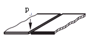 | 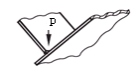 |
  | 수평수직 | PB | - | 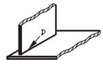 |
  | 수평 | PC | 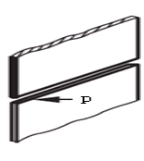 | 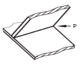 |
  | 수평위보기 | PD | - | 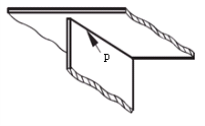 |
  | 위보기 | PE | 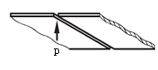 | 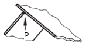 |
  | 수직상진 | PF | 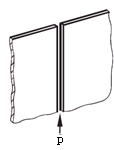 | 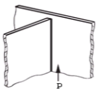 |
  | 수직하진 | PG | 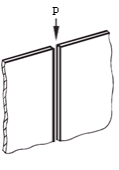 | 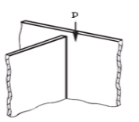 |
  | 원주상진 | PH | - | - |
  | 원주하진 | PJ | - | - |
  | 경사원주상진 | PH-45 | - | - |
  | 경사원주하진 | PJ-45 | - | - |

  **표 2.2.23-3 관용접의 자세**

  | 용접자세 |   | 관용접의 자세상세 |   |   |
  | --- | --- | --- | --- | --- |
  | 용접자세 |   | 맞대기이음 | 필릿이음 |   |
  | 아래보기 | PA | 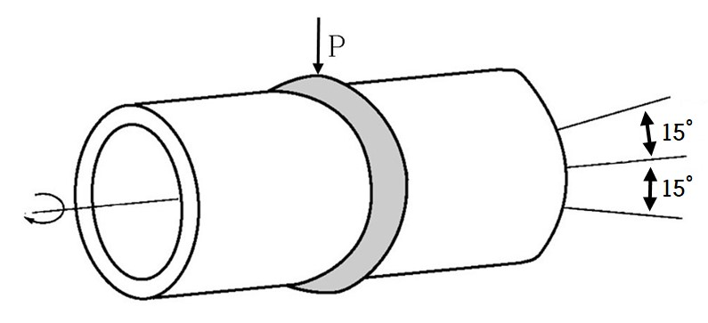 회전관 | 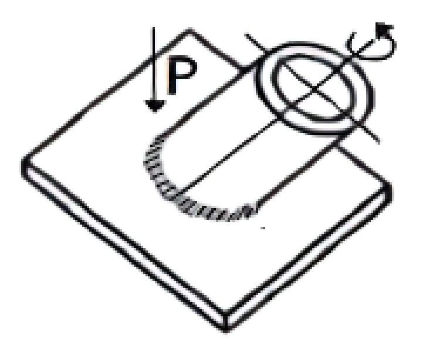 회전관 |   |
  | 수평수직 | PB | - | 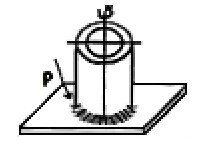 회전관 또는 고정관 | 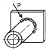 회전관 |
  | 수평 | PC |  회전관 또는 고정관 | - |   |
  | 수평위보기 | PD | - |  회전관 또는 고정관 |   |
  | 위보기 | PE | - | - |   |
  | 수직상진 | PF | - | - |   |
  | 수직하진 | PG | - | - |   |
  | 원주상진 | PH | 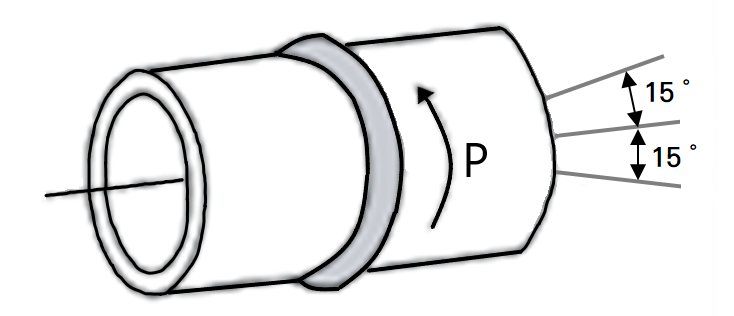 고정관 | 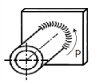 고정관 |   |
  | 원주하진 | PJ | 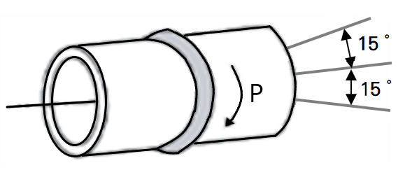 고정관 | 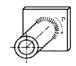 고정관 |   |
  | 경사원주상진 | PH-45 | 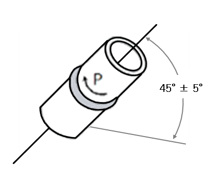 고정관 | 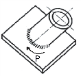 고정관 |   |
  | 경사원주하진 | PJ-45 |  고정관 | 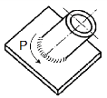 고정관 |   |

#### 503. 기량자격시험

- **1.** **일반사항**
  - **(1)** 용접을 시작하여 완료할 때까지 시험재의 상하좌우의 방향을 바꾸어서는 안 된다.
  - **(2)** 시험재는 모든 용접의 전후를 통하여 열처리, 피닝(peening) 등을 하여서는 안 된다.
  - **(3)** 시험재에 사용하는 뒷댐판으로는 관련 용접절차 시방서 또는 예비 용접절차 시방서에 사용된 것과 동일한 강판, 동판, 세라믹 또는 충분한 용입을 얻을 수 있는 유사한 재료 또는 뒷댐판용 가스를 사용할 수 있다.
  - **(4)** 검사원은 시험재의 용접 및 시험편의 시험에 입회하여야 한다.
- **2.** **시험재**
  - **(1)** 각 기량자격시험에서 맞대기 및 필릿용접 시험재는 **그림 2.2.13** 부터 **그림 2.2.20** 까지에 따라 준비되어야 한다.

    | 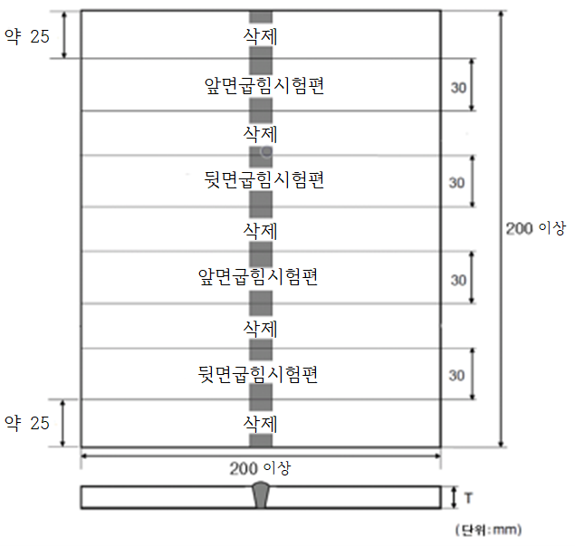 | 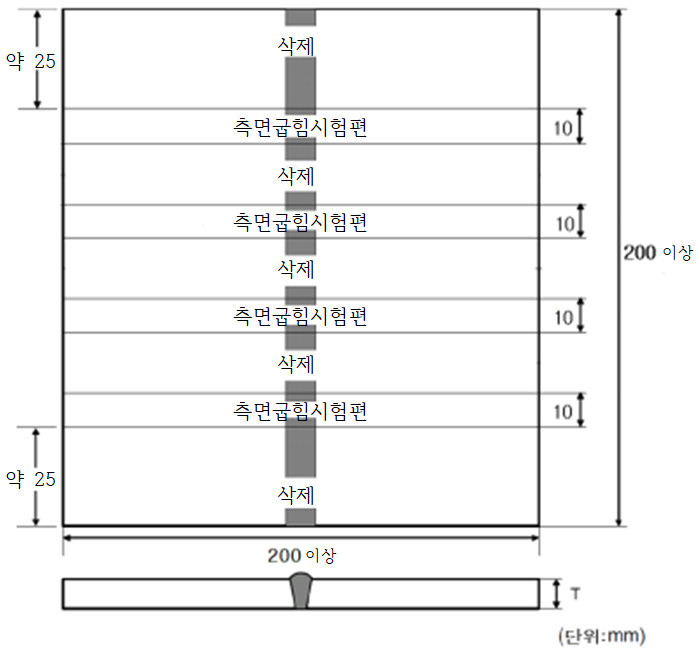 |
    | --- | --- |
    | **그림 2.2.13 판의 맞대기 용접시험재의 치수 및 형상** ***(2023)*** | **그림 2.2.14 판의 맞대기 용접시험재의 치수 및 형상(T≧12mm)** |
    | 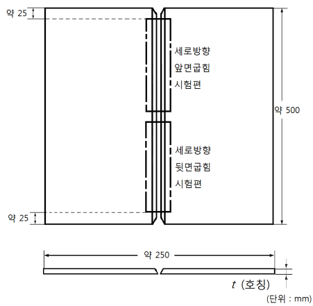 | 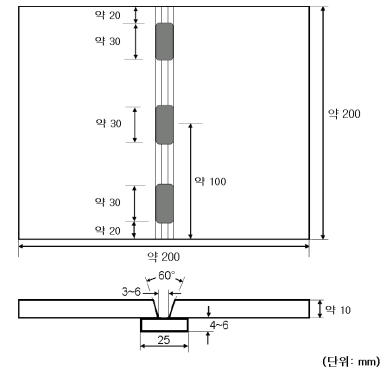 |
    | **그림 2.2.15 판의 맞대기 용접시험재의 치수 및 형상 (9%니켈합금강)** | **그림 2.2.16 판의 맞대기 가용접시험재의 치수 및 형상** |
    | 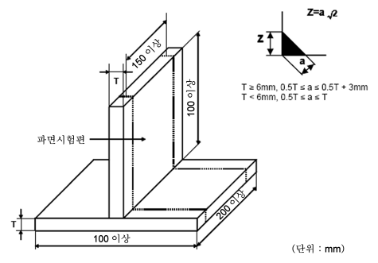 | 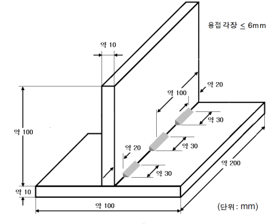 |
    | **그림 2.2.17 판의 필릿 용접시험재의 치수 및 형상** | **그림 2.2.18 판의 필릿 가용접시험재의 치수 및 형상** |
    | 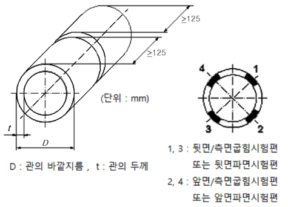 | 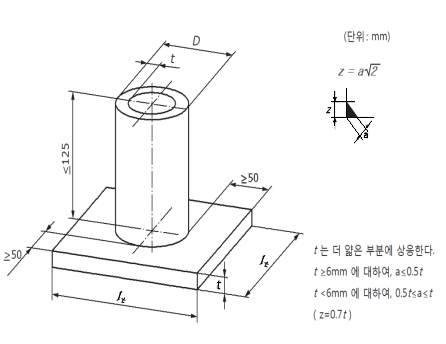 |
    | **그림 2.2.19 관의 맞대기 용접시험재의 치수 및 형상** | **그림 2.2.20 관의 필릿 용접시험재의 치수 및 형상** |
  - **(2)** 강재는 **502.**의 **5**항에 규정하는 재료이거나 또는 우리선급이 동등하다고 인정하는 등급의 것이어야 한다.
  - **(3)** 용접이음부의 개선형상 및 치수는 실제 용접공사에 적용하는 용접절차 시방서 또는 예비 용접절차 시방서에 따라 준비되어야 한다.
  - **(4)** 시험에 사용하는 용접용재료는 우리 선급의 승인을 받은 것 또는 우리 선급이 이와 동등하다고 인정하는 것이어야 한다.
  - **(5)** 수동 및 반자동용접 시험재의 루트 용접부 및 표면 마지막 용접부는 각각 최소 한 번씩 용접을 멈추고 다시 시작하여야 한다. 용접사들은 용접 재시작 전에 용접이 멈췄던 부위의 작은 결함에 대해서만 그라인딩으로 제거할 수 있다. *(2019)*
  - **(6)** 자동용접의 시험재는 **404.**의 **3**항 및 **405.**의 **3**항에 따른다. 다만, 판의 맞대기용접 시험재의 너비는 최소 300 mm 이상, 길이는 최소 400 mm 이상으로 하고 판의 필릿용접 시험재의 너비는 최소 150 mm 이상, 길이는 최소 400 mm 이상으로 할 수 있다.
  - **(7)** 가스용접 기량자격시험의 시험재는 뒷댐판을 사용하지 않으며, 가스용접봉은 **KS D 7005**(연강용 가스 용접봉) 또는 **EN 12536**에 따른 것 또는 우리 선급이 적절하다고 인정하는 것으로 한다.
- **3.** **시험 및 검사**
  - **(1)** 시험재의 시험 및 검사는 **표 2.2.24**에 따른다.

    **표 2.2.24 시험 및 검사항목** ***(2022)***

    | 구분 | 시험 및 검사(6) |
    | --- | --- |
    | 맞대기용접 | 외관검사, 굽힘시험(1)(2)(3)(4) |
    | 필릿용접 | 외관검사, 파면시험(5) |
    | 가용접 | 외관검사, 파면시험 |
    | (비 고) (1) 아래표의 용접법을 제외하고 굽힘시험을 대신하여 방사선투과검사 또는 파면시험을 실시할 수 있다. 재료 ; 용접법(규칙 표 2.2.20 참조) 탄소강, 스테인리스강 ; 131, 135, 138, 311(산소아세틸렌 용접) 니켈합금강 ; 131, 135 알루미늄 합금 ; 131 동 및 동합금 ; 모든 용접법 재료 용접법(규칙 표 2.2.20 참조) 탄소강, 스테인리스강 131, 135, 138, 311(산소아세틸렌 용접) 니켈합금강 131, 135 알루미늄 합금 131 동 및 동합금 모든 용접법 또한 두께 8 mm 이상인 페라이트강(탄소강 등)에 대해서는 방사선투과검사를 대신하여 초음파탐상검사로 실시할 수 있다. (2) 9%니켈합금강의 판용접에서는 **그림 2.2.15**와 같이 세로방향앞면굽힘시험 및 세로방향뒷면굽힘시험을 할 수 있다. (3) 상기 (1)에도 불구하고 니켈합금강의 관용접에서는 굽힘시험을 대신하여 방사선투과검사 또는 파면시험을 할 수 있다. (4) 관의 바깥지름이 25 mm 이하인 경우에는 굽힘시험 또는 파면시험을 대신하여 노치인장시험을 **그림 2.2.21**과 같이 실시할 수 있다. (5) 파면시험 대신에 2개의 매크로 단면시험을 할 수 있다. (6) 우리 선급이 필요하다고 인정하는 경우 추가의 시험을 요구할 수 있다. **【지침 참조】** |   |
    | 재료 | 용접법(규칙 표 2.2.20 참조) |
    | 탄소강, 스테인리스강 | 131, 135, 138, 311(산소아세틸렌 용접) |
    | 니켈합금강 | 131, 135 |
    | 알루미늄 합금 | 131 |
    | 동 및 동합금 | 모든 용접법 |

    | 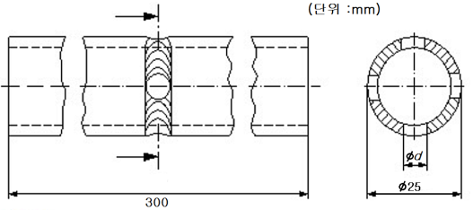 |
    | --- |
    | (비고) 1. *d* 의 크기는 다음을 따른다. (1) t ≥ 1.8 mm인 경우, *d* = 4.5 mm (2) t < 1.8 mm인 경우, *d* = 3.5 mm *d* : 용접부의 홀 직경 (홀들은 용접부 멈춤 및 재시작 부위에 위치해선 안 된다) 2. **ISO 9017**의 s 및 q 형상 노치도 허용된다. |
    | **그림 2.2.21 바깥지름이 25 mm 이하인 관의 노치인장시험편의 치수 및 형상** |
  - **(2)** **외관검사**
    - **(가)** 굽힘시험을 위하여 시험편을 절단하기 전에 외관검사를 하여야 한다.
    - **(나)** 용접부에는 균열이나 기타 심각한 결함이 없어야 하며, 검출된 결함은 **(KS B) ISO 5817:2014**의 품질등급 B에 따라 평가되어야 한다(알루미늄 합금의 경우, **ISO 10042:2018**의 품질등급 B). 다만, 과잉용접(excess weld metal), 과잉용입(excess penetration), 과잉용접비드(excessive convexity) 및 과잉 목두께(excessive throat thickness)에 대하여는 품질등급 C를 적용한다. *(2022) (2023)*
  - **(3)** **굽힘시험**
    - **(가)** 최초 기량자격시험은 판 또는 관의 시험재에서 앞면굽힘시험편과 뒷면굽힘시험편을 각각 2개씩 채취하여 굽힘시험을 한다. 다만, 두께가 12 mm 이상인 경우에는 너비 10 mm를 가지는 4개의 측면굽힘시험편으로 시험할 수 있다.
    - **(나)** 기량자격의 갱신을 위해서는 판 또는 관의 시험재에서 앞면굽힘시험편과 뒷면굽힘시험편을 각각 1개씩 채취하여 굽힘시험을 한다. 다만, 두께가 12 mm 이상인 경우에는 너비 10 mm를 가지는 2개의 측면굽힘시험편으로 시험할 수 있다.
    - **(다)** 최소한 굽힘시험편 한 개는 루트부 또는 표면 마지막 용접부의 멈춤 및 재시작 부위를 포함해야 한다.
    - **(라)** 굽힘시험편의 모양과 치수는 **표 2.2.2**에 따른다.
    - **(마)** 두께에 대한 맨드릴 지름의 비(D/t)는 **규칙 2편 2장 6절**의 각 조에서 규정하는 값 +1로 한다. 다만, 알루미늄합금의 경우에는 **규칙 2편 2장 608.**의 **표 2.2.74**에 따른다.
    - **(바)** 시험편을 180°로 굽힌 후 시험편의 표면에는 어떠한 방향으로든 길이 3 mm를 넘는 균열 또는 현저한 결함이 있어서는 안된다. 시험중에 시험편의 모서리에 나타나는 결함은 사안별로 조사 및 우리 선급이 적절하다고 인정하는 바에 따른다. **【지침 참조】**
    - **(사)** 가스용접 시험편의 굽힘시험은 롤러 굽힘시험용 지그를 사용하며, 플런저(plunger) 및 지지롤러의 반지름은 10 mm로 하고, 지지롤러의 간격은 53 mm로 한다.
  - **(4)** **비파괴검사**
    - **(가)** 맞대기용접에 대하여 굽힘시험 대신 방사선투과검사 또는 초음파탐상검사를 적용하는 경우, 판정기준은 **(KS B) ISO 5817:2014**의 품질등급 B를 따른다(알루미늄 합금의 경우, **ISO 10042:2018**의 품질등급 B). *(2022) (2023)*
    - **(나)** 용접 후 외관검사 시 용접입열량이 많다고 인정될 때에는 방사선 투과검사와는 별도로 굽힘시험을 할 수 있다.
  - **(5)** **파면시험**
    - **(가)** 맞대기용접의 파면시험은 **ISO 9017:2017** 및 **ISO 9606-1:2012,9606-2/3/4**에 따라 실시하며 전길이 시험편을 사용한다. 판정기준은 **(KS B) ISO 5817:2014**의 품질등급 B를 따른다(알루미늄 합금의 경우, **ISO 10042:2018**의 품질등급 B). *(2022) (2023)*
    - **(나)** 필릿용접의 파면시험에 대하여는 **규칙 2편 2장 405.**의 **7**항을 준용한다. 파면에서 검출된 균열, 기공, 개재물, 융합부족 및 용입불량 등의 결함은 **(KS B) ISO 5817:2014**의 품질등급 B에 따라 평가되어야 한다(알루미늄 합금의 경우, **ISO 10042:2018**의 품질등급 B). *(2022) (2023)*
  - **(6)** **매크로시험**
    필릿용접에 대하여 파면시험대신 매크로시험을 적용하는 경우, 검사방법 및 판정기준은 다음에 따른다.
    - **(가)** 2 개의 매크로시험편들을 서로 다른 부위에서 채취해야 하며, 최소한 1 개의 시험편은 루트부 또는 표면 마지막 용접의 멈춤 및 재시작이 된 부위에서 채취해야 한다.
    - **(나)** 시험편은 용접금속, 용융선, 루트용입 및 열영향부를 분명히 드러낼 수 있도록 한 쪽에서 가공 및 부식시켜야 한다.
    - **(다)** 매크로 단면은 열영향을 받지 않은 모재부 10 mm를 포함하여야 한다.
    - **(라)** 용접부 횡단면의 매크로 조직을 표시하는 시험편에는 과대한 상하 각 장의 차이, 용입불량 및 균열, 기타 유해한 결함이 있어서는 안 된다.
- **4.** **재시험**
  - **(1)** 용접사가 기량자격시험에 불합격한 경우 다음에 따른다.
    - **(가)** 시험의 일부에 불합격한 용접사는 불합격한 용접이음 및 자세와 동일한 조건으로 다른 시험재를 바로 용접한 후에 재시험을 할 수 있다. 이 경우에 2배수의 시험편을 채취하여 시험해야 한다. 모든 재시험용 시험편들은 관련 요건을 모두 만족해야 한다.
    - **(나)** 최초 시험의 전부 또는 (가)호의 재시험에 불합격한 용접사는 재훈련되어야 한다.
    - **(다)** 용접사의 기량이 의심되는 명확한 증거가 발견되거나 자격의 효력이 만료된 경우에 해당 용접사는 재시험이 아닌 자격을 재취득해야 한다.
  - **(2)** 시험편이 가공 부적합으로 치수 요건에 부적합한 경우, 다른 시험재로 다시 용접하고 시험하여야 한다.
- **5.** **기량자격증서**
  - **(1)** 용접사가 이 규정에 따라 기량자격시험이 합격한 경우, 용접사의 기량자격증명서는 발급된다. 각 조선소 또는 제조자는 용접사 기량자격의 승인 범위 및 자격 유효성을 관리할 책임이 있다. *(2022)*
  - **(2)** 기량자격증명서에는 다음의 항목이 규정되어야 한다:
    - **(가)** 재료, 용접법, 용접용재료, 용접이음부 형식, 판두께 및 용접자세에 대한 승인 범위
    - **(나)** 기량자격증명서 발급일 및 만료일
    - **(다)** 용접사의 성명, 생년월일, 식별번호 및 사진
    - **(라)** 조선소 또는 제조자 명
  - **(3)** 기량자격증명서를 발급할 때에는 기량자격시험 및 갱신시험과 관련된 보고서/기록서를 증명서의 사본과 함께 보관해야 한다.

#### 504. 기량자격의 유지 및 취소

- **1.** **최초 승인의 효력 및 유지**
  - **(1)** 용접사기량자격 승인의 효력은 요구되는 모든 기량자격시험들을 합격한 후에 기량자격증명서가 발급된 날로부터 시작된다.
  - **(2)** 용접사가 해당직종에서 6개월을 넘겨 종사하지 아니한 경우 그 기량자격이 상실된다. 따라서 기량자격의 유지를 위해서는 다음의 모든 조건을 충족해야 하며, 하나라도 충족되지 않는다면 우리 선급으로 통보해야 하며 해당 증명서는 취소된다.
    - **(가)** 용접사는 승인된 범위 내에서 용접작업에 연속적으로 종사해야 하며, 용접사의 작업은 원칙적으로 승인시험이 수행된 기술적인 조건에 따른 것이어야 한다.
    - **(나)** 조선소/제조자의 품질책임자는 용접사의 기량자격 유지상황을 6개월 간격으로 확인하고 기량자격증명서에 서명해야 한다.
    - **(다)** 검사원이 요청하는 경우 조선소/제조자는 개별 용접기량자격에 대한 승인 상황을 제출하여야 한다.
    - **(라)** 용접사의 기량과 지식에 의문을 제기할 특별한 이유가 없어야 한다.
  - **(3)** 용접사가 다음과 같이 우리 선급기준에 미달한다고 우리 선급이 인정하는 경우에는 그 용접사의 기량자격은 정지된다.
    - **(가)** 용접사가 기량자격을 취득한 회사에서 이직하였을 때
    - **(나)** 기량자격자의 용접능력에 의문이 생겼을 때
  - **(4)** 다만 전 (3)호 (가)의 경우에 이직한 용접사의 기량자격 유효성은 다음 각 호의 모든 조건을 만족할 때 계속 유지되며, 새로운 조선소 또는 제조자 명으로 기량자격증명서를 재발급할 수 있다.
    - **(가)** 용접사는 이직 전의 회사에서 기량자격을 보유하고 있었음을 입증할 것
    - **(나)** 용접조건은 이직 전 회사에서 종사했던 용접 분야에서의 조건과 유사해야 하며 기 보유한 용접자격에 대응하는 분야의 용접에 종사함을 입증할 것
    - **(다)** 이직 전 6개월간 계속해서 동 자격분야의 용접에 종사한 경력을 입증할 수 있을 것
- **2.** **자격의 갱신**
  - **(1)** 기량자격의 갱신은 우리 선급이 실시한다. 이를 위해 용접사의 기량자격은 다음 (가) ~ (다) 중 한 가지를 선택하여 정기적으로 갱신되어야 한다. 선택된 자격 갱신 방법은 기량자격증명서 발급 시에 명시되어야 한다. *(2022)*
    - **(가)** 용접사는 3년마다 용접사 기량자격시험을 재실시해야 한다. 용접사는 유효기간인 3년의 마지막 6개월 이내에 갱신을 위한 용접사 기량자격시험을 실시해야 한다. 이 시험을 합격하면 만료일로부터 3년을 더 연장할 수 있다.
    - **(나)** 매 2년마다 유효기간인 2년의 마지막 6개월 이내에 두 개의 용접부에 방사선투과검사 또는 초음파탐상검사 또는 파괴시험을 실시하고 기록하여 검사원에게 제출하여야 한다. 해당 용접부는 두께 및 바깥지름 조건을 제외하고 최초 승인시험의 조건에 따라 용접되어야 한다. 이러한 시험을 통해 용접사의 기량자격은 만료일로부터 2년을 더 연장할 수 있다. *(2022)*
    - **(다)** 모든 기량자격증명서의 용접사 기량자격은 아래 (a) ~ (c) 조건이 모두 충족된다는 것에 대해 상기 1항 (2)호에 따라 서명하는 한 유지된다. 모든 조건의 충족은 우리 선급에 의해 확인되어야 한다. 우리 선급의 확인 주기는 3년 이내로 하며, 우리 선급과 조선소/제조자 간에 합의해야 한다. 이는 우리 선급이 인정하는 방법으로 대체될 수 있다. *(2022)* **【지침 참조】**
      - **(a)** 용접사는 기량자격증명서에 기재되어 있는 생산 용접 품질에 책임 있는 동일한 조선소/제조자를 위해 종사해야 한다.
      - **(b)** 우리 선급은 최소한 다음 조건을 포함하는 용접사 품질 관리 시스템을 확인해야 한다.
      - **(i)** 용접사 품질 관리 시스템의 조정(coordination)에 책임 있고 해당 업무에 임명된 사람
        - **(ii)** 조선소/제조자의 용접사 및 용접 감독자 명단
        - **(iii)** 해당되는 경우, 협력업체 용접사 명단
        - **(iv)** 용접사 기량자격증명서 및 관련 관리 시스템에 대한 설명
      - **(v)** 용접사 자격 프로그램을 위한 교육 요구사항
        - **(vi)** 용접에 적용되는 WPS 및 용접사 식별 시스템
        - **(vii)** 재시험 없이 용접사 기량자격 유지를 허용하는 기준을 포함하여, 용접 검사 기록(예: 보수율 등)의 결과를 기반으로 각 용접사 기량을 모니터링하기 위한 시스템 절차
      - **(c)** 조선소/제조자는 용접사가 기량자격증명서의 자격 범위 내의 용접 자세, 용접 종류 및 뒷댐판(backing) 조건으로 합격품질의 용접을 시공품질표준 및 우리 선급의 요구 사항에 따라 생산했음을 적어도 연 1회 문서화해야 한다. 요구되는 문서 및 증빙 문서화 방법은 우리 선급과 조선소/제조자 간에 합의해야 한다.
    - **(라)** 전 (가)부터 (다)에도 불구하고 만료일 이후 1개월 이내에 기량자격의 갱신을 완료한다면, 만료일로부터 갱신을 완료할 때까지의 기간에 한해 승인을 유지하고 있는 것으로 간주할 수 있다. 갱신이 완료되면 기량자격의 유효기간은 전 (가)부터 (다)에 따른다.
  - **(2)** 검사원은 전 (1)호의 준수 여부를 확인하고 자격 유지의 확인을 위해 용접사 기량자격증명서에 서명한다.
  - **(3)** 선체구조용 용접(판, 단강품, 주강품 용접 포함)에 종사하지 않는 용접사는 자격의 갱신을 생략할 수 있다. 이 때 조선소/제조자는 선체구조용 용접(판, 단강품, 주강품 용접 포함)에 종사하는 용접사와 그 외 용접사를 구별하여 관리해야 한다. *(2019) (2022) (2023)*

### 제 6 절 용접용재료

#### 601. 일반사항

- **1.** **적용**
  - **(1)** 이 절에서 규정하는 각종 구조물의 용접에 사용되는 수동 및 그래비티 용접용 피복용접봉, 가스실드(gas shield) 아크 용접용재료(용접와이어/보호가스), 이층 또는 다층 서브머지드(submerged) 아크 용접용재료(용접와이어/플럭스), 플럭스코어드(flux cored) 아크 용접용재료(플럭스코어드 와이어), 일렉트로슬래그(electro slag) 및 일렉트로가스(electro gas) 용접용재료는 이 절에서 규정하는 승인된 용접용재료이어야 한다.
  - **(2)** 전 호에 규정하는 이외의 용접법에 사용하는 용접용재료 또는 전 호의 규정을 적용하는 것이 적절하지 아니하다고 생각되는 특수한 용접용재료는 우리 선급의 승인을 받은 것이어야 한다.
  - **(3)** 이 절에서 규정하지 아니한 용접용재료에 대한 승인시험은 우리 선급이 적절하다고 인정하는 바에 따른다.
    **【지침 참조】**
- **2.** **제조법** 승인용접용재료는 우리 선급의 승인을 받은 제조공장에서 승인을 받은 방법으로 제조자의 책임하에서 품질이 균일하게 제조되는 것이어야 한다.
- **3.** **시험재**
  - **(1)** 시험재의 준비 및 모든 시험은 검사원의 입회하에 하여야 한다.
  - **(2)** 용접이음이 수행되는 경우, 판의 가장자리는 기계적인 가공이나 또는 산소절단의 어느 한 가지 방법으로 개선가공되어야 한다. 산소절단의 경우에는 개선면에 대하여 스케일 제거처리를 할 필요가 있다.
  - **(3)** 용접전류, 용접전압 및 용접속도 등 용접조건은 제조자가 지정하는 범위내로 한다. 또한 교류 및 직류겸용인 것에 대하여는 교류를 사용한다.
- **4.** **승인시험**
  - **(1)** 용접용재료의 승인시험에 대하여는 **602.** 부터 **609.**의 규정에 따라 승인시험을 하고 이에 합격하여야 한다.
  - **(2)** 용접용재료는 각각의 제품에 대하여 각 제조공장마다 승인을 받아야 한다. 다만, 다음 (가) 부터 (나)까지의 경우로서, 사용되는 재료와 제조공정이 승인을 받은 용접용재료에 대한 것과 동일함을 입증할 수 있는 경우, 우리 선급의 승인을 받아 정기검사와 동등한 수준으로 시험을 경감할 수 있다. 그러나 어떠한 의문이라도 있는 경우에는 전체적인 시험이 요구될 수 있다.
    - **(가)** 승인을 받은 용접용재료의 제조자가 다른 제조공장에서 해당 용접용재료를 제조하는 경우
    - **(나)** 승인을 받은 용접용재료의 제조자와 기술제휴에 의하여 해당 용접용재료를 제조하는 경우
  - **(3)** 서브머지드 아크 용접용재료의 경우로서, 동일한 회사에 속하는 여러 공장에서 공급된 다른 용접와이어들과 한 종류의 플럭스를 조합해서 사용하는 경우, 우리 선급의 승인을 받아 하나의 용접와이어-플럭스 조합에 대해서만 시험할 수 있다. 다만, 서로 다른 용접와이어들은 동일한 기술사양에 적합한 것이어야 한다.
  - **(4)** 우리 선급이 필요하다고 인정하는 경우에는 규정의 시험검사 이외에 또 다른 시험검사를 요구할 수 있다.
- **5.** **정기검사** 용접용재료의 제조자는 매년 우리 선급 검사원 입회하에 각 용접용재료마다 정해진 시험 및 검사를 받아야 한다.
- **6.** **승인내용의 변경**
  - **(1)** 승인내용의 변경에 대하여 그 종류, 용접자세, 용접봉 또는 와이어의 최대지름 및 가스의 종류 등 승인증서에 기재된 사항을 변경한 경우에 제조자는 형식승인 변경신청을 하여야 한다. 이때 우리 선급은 변경내용에 따라 추가의 승인시험을 요구할 수 있다.
  - **(2)** 승인용접용 재료에 대하여 와이어, 플럭스 등의 성분변경, 제조공정의 변경 및 제조공장이 이전된 경우에 제조자는 형식승인 변경신청을 하여야 한다. 이때 우리 선급은 변경 내용에 따라 필요한 공장조사 및 확인시험을 요구할 수 있다.
  - **(3)** 제조자의 요청이 있는 경우, 이미 승인을 받은 용접용재료에 대하여 강도나 인성 또는 수소함량에 관한 종류를 변경할 수 있다. 다만, 변경 시기는 원칙적으로 정기검사 시에 한다. 강도 또는 인성에 관한 종류 변경 시에는 일반적으로 통상적인 정기검사에 추가하여 맞대기 용접이음에 대한 시험이 추가로 요구된다. 수소함량을 변경 시에는 일반적으로 통상적인 정기검사에 추가하여 수소시험이 추가로 요구된다. *(2017)*
- **7.** **재시험**
  - **(1)** **인장 및 굽힘시험**
    - **(가)** 인장시험 또는 굽힘시험에 불합격한 경우 그 해당 시험에 대하여 2배수의 시험편을 채취하여 재시험을 하고 모든 시험편이 시험에 합격하였을 때에는 합격으로 한다.
    - **(나)** 최초의 용접시험재로부터 시험편 채취가 어려운 경우에는 동일 배치의 용접용재료를 사용하여 새로운 시험재를 준비하여야 한다.
    - **(다)** 새로운 시험재가 최초의 시험재와 동일한 방법(특히 용접층수)으로 용접된 경우, 그 해당 시험에 대하여만 2배수의 시험편을 채취하여 재시험을 한다. 그렇지 않은 경우에는 모든 시험에 대하여 재시험을 하여야 한다.
  - **(2)** **충격시험**
    - **(가)** 충격시험 결과가 규격에 합격하지 아니한 경우에는 다음 (i) 또는 (ii)의 경우를 제외하고 그 시험편을 채취한 시험재로부터 다시 1조의 시험편을 채취하여 재시험을 할 수 있다.
      - **(i)** 시험편 3개 모두가 규정의 평균흡수에너지값에 미치지 못한 경우
        - **(ii)** 시험편 중 2개 이상이 규정의 평균흡수에너지값의 70 $\%$ 미만인 경우
    - **(나)** 재시험은 최초 불합격된 시험편의 값을 포함하여 합계 6개의 시험편의 흡수에너지 평균치가 규정의 평균흡수에너지값 이상이고, 동시에 해당시험편 중 규정의 평균흡수에너지값보다 작은 시험편의 수가 2개 이하이고 규정의 평균흡수에너지값의 70 $\%$ 미만인 시험편의 수가 1개 이하이면 합격으로 한다.
  - **(3)** 재시험에서도 불합격이 되는 경우에는 용접조건을 변경하고 다시 시험을 받을 수 있다. 이때에는 그 시험재에 관한 모든 시험을 하고 이것에 합격하였을 때에 합격으로 한다.
- **8.** **승인의 취소** 승인받은 용접용재료가 다음 각 호의 어느 것에 해당할 때에는 제조자에 통지하고 승인을 취소할 수 있다.
  - **(1)** 품질이 승인할 때보다 현저하게 저하 또는 균일하지 아니하다고 인정될 때
  - **(2)** 소정의 정기검사에 합격하지 아니하였을 때
  - **(3)** 소정의 정기검사를 받지 아니하였을 때
- **9.** **자료** 우리 선급이 필요할 때에는 용접용재료의 특성에 관한 자료의 제출을 요구할 수 있다.
- **10.** **승인용접용재료의 포장 및 표시**
  - **(1)** 용접용재료는 수송 및 저장에 대하여 품질을 보장할 수 있도록 적절히 포장되어야 한다.
  - **(2)** 포장에는 다음의 사항을 표시하여야 한다. *(2019)*
    - **(가)** 상표
    - **(나)** 등급(specification and classification)
    - **(다)** 제조자 또는 공급자 *(2024)*
    - **(라)** 제조번호(lot, control or heat number) *(2024)*
    - **(마)** 특별히 주의를 요하는 사항

#### 602. 연강, 고장력강 및 저온용강의 피복아크 용접봉

- **1.** **적용**
  - **(1)** 다음 (가) 및 (나)의 연강, 고장력강 및 저온용강용 피복아크 용접봉(이하 **용접봉**이라 한다)에 대한 승인시험 및 정기검사는 **602.**의 규정에 따른다.
    - **(가)** 수동용접봉
      - **(i)** 맞대기용접 전용
        - **(ii)** 필릿용접 전용
        - **(iii)** 맞대기용접 및 필릿용접 겸용
    - **(나)** 그래비티 또는 이와 유사한 용접 기구를 사용하는 경우의 용접봉
      - **(i)** 필릿용접 전용
        - **(ii)** 맞대기용접 및 필릿용접 겸용
  - **(2)** 이파 용접봉에 대하여는 우리 선급이 적절하다고 인정하는 바에 따른다. **【지침 참조】**
- **2.** **종류 및 기호**
  - **(1)** 용접봉의 종류 및 기호는 **표 2.2.25**에 따른다.
  - **(2)** 저수소계 용접봉으로서 **6**항에 규정하는 수소시험에 합격한 것에는 해당 용접봉의 기호 뒤에 **표 2.2.32**의 표시기호를 부기한다. (예 : 2*Y H5*)

    **표 2.2.25 종류 및 기호** ***(2017) (2021)***

    | 연강용 | 고장력강용 | 저온용강용 |
    | --- | --- | --- |
    | 1, 2, 3 | 2*Y*, 3*Y*, 4*Y*, 5*Y*, 2*Y*40, 3*Y*40, 4*Y*40, 5*Y*40, 3*Y*47 | *L* 1, *L* 2, *L* 3, *L* 51, *L* 91 |
- **3.** **시험일반**
  - **(1)** **1**항 (1)호 (가)의 (i) 및 (iii)의 용접봉에 대한 시험의 종류, 시험재의 개수, 판두께, 모양 및 치수, 시험재의 용접에 사용하는 용접봉의 지름, 용접자세 그리고 각 시험재로부터 채취하는 시험편의 종류와 갯수는 **표 2.2.26**에 따른다. 다만, 우리 선급이 필요하다고 인정하는 경우에는 이 표에 규정하는 시험 외에 우리 선급이 적절하다고 인정하는 고온균열시험을 요구할 수 있다. **【지침 참조】**
  - **(2)** **1**항 (1)호 (가) (ii)의 용접봉에 대한 시험의 종류, 시험재의 개수, 판두께, 모양 및 치수, 시험재의 용접에 사용하는 용접봉의 지름, 용접자세 그리고 각 시험재로부터 채취하는 시험편의 종류와 개수는 **표 2.2.27**에 따른다.
  - **(3)** **1**항 (1)호 (나)의 용접봉에 대한 시험은 다음 (가) 및 (나)의 규정에 따른다.
    - **(가)** **1**항 (1)호 (나) (i)의 용접봉에 대하여는 (2)호에 규정하는 **표 2.2.27**의 시험을 한다.
    - **(나)** **1**항 (1)호 (나) (ii)의 용접봉에 대하여는 (가)의 시험 및 (1)호에 규정하는 **표 2.2.26**의 맞대기용접 시험을 한다.
  - **(4)** **1**항 (1)호 (가) 및 (나)에 대하여 겸용 승인을 받고자 하는 경우에는 각각에 규정하는 모든 시험을 하여야 한다. 다만, **1**항 (1)호 (나)의 용접봉에 대한 용착금속시험은 생략할 수 있다.
  - **(5)** 시험재로 사용되는 강판은 용접봉의 종류에 따라서 **표 2.2.28**에 따른다.
  - **(6)** 용접전류, 용접전압 및 용접속도 등 용접조건은 제조자가 지정하는 범위내로 한다. 또한 교류 및 직류겸용인 것에 대하여는 교류를 사용한다.
  - **(7)** 용접봉의 승인시험은 품목마다 (1)호 부터 (4)호까지에 규정하는 시험을 하고 이에 합격하여야 한다.
  - **(8)** 용접후 시험재에는 어떠한 열처리도 하여서는 안 된다.
  - **(9)** 용접된 시험재는 시험을 하기 전에 용접부에 결함이 없는 것을 확인하기 위하여 용접선의 전반에 걸쳐 방사선투과검사를 할 수 있다.

    **표 2.2.26 피복아크 용접봉의 시험의 종류**

    | 시험의 종류 | 시 험 재 |   |   |   |   | 각 시험재로부터 채취하는 시험편의 종류 및 개수 |
    | --- | --- | --- | --- | --- | --- | --- |
    | 시험의 종류 | 용접자세 | 봉의 지름 (mm) | 개수 | 모양 및 치수 | 판두께 (mm) | 각 시험재로부터 채취하는 시험편의 종류 및 개수 |
    | 용착금속 시험 | 아래보기 | 4 | 1(1) | **그림 2.2.22** | 20 | 인장시험편 : 1개 충격시험편 : 1조(3개) |
    | 용착금속 시험 | 아래보기 | 최대지름 | 1(1) | **그림 2.2.22** | 20 | 인장시험편 : 1개 충격시험편 : 1조(3개) |
    | 맞대기 용접시험 | 아래보기 | 최초의 층 : 4 최종 2개 층 : 최대지름 나머지 층 : 5이상 | 1 | **그림 2.2.24** | 15∼20 | 인장시험편 : 1개 앞면굽힘시험편 : 1개 뒷면굽힘시험편 : 1개 충격시험편 : 1조(3개)(5) |
    | 맞대기 용접시험 | 아래보기 | 최초의 층 : 4 두번째 층 : 5 또는 6 나머지 층 : 최대지름 | 1(2) | **그림 2.2.24** | 15∼20 | 인장시험편 : 1개 앞면굽힘시험편 : 1개 뒷면굽힘시험편 : 1개 충격시험편 : 1조(3개)(5) |
    | 맞대기 용접시험 | 수 평(4) | 최초의 층 : 4 또는 5 나머지 층 : 5 | 1 | **그림 2.2.24** | 15∼20 | 인장시험편 : 1개 앞면굽힘시험편 : 1개 뒷면굽힘시험편 : 1개 충격시험편 : 1조(3개)(5) |
    | 맞대기 용접시험 | 수직상진 | 최초의 층 : 3.2 나머지 층 : 4 또는 5 | 1 | **그림 2.2.24** | 15∼20 | 인장시험편 : 1개 앞면굽힘시험편 : 1개 뒷면굽힘시험편 : 1개 충격시험편 : 1조(3개)(5) |
    | 맞대기 용접시험 | 수직하진 | (3) | 1 | **그림 2.2.24** | 15∼20 | 인장시험편 : 1개 앞면굽힘시험편 : 1개 뒷면굽힘시험편 : 1개 충격시험편 : 1조(3개)(5) |
    | 맞대기 용접시험 | 위보기 | 최초의 층 : 3.2 나머지 층 : 4 또는 5 | 1 | **그림 2.2.24** | 15∼20 | 인장시험편 : 1개 앞면굽힘시험편 : 1개 뒷면굽힘시험편 : 1개 충격시험편 : 1조(3개)(5) |
    | 필릿용접 시험(6) | 수 평 | 편 측 : 최대지름 반대측 : 최소지름 | 1 | **그림 2.2.25** | 20 | 매크로조직시험편 : 3개(8) 경도시험편 : 3개(8) 파면시험편 : 2개 |
    | 수소시험(7) | 아래보기 | 4 | 4 | (9) | 12 | 수소시험편 : 1개 |
    | (비고) (1) 제조하는 봉의 지름이 1종류뿐인 경우의 시험재는 1개로 한다. 제조하는 최대 지름이 4 mm인 경우에는 4 mm 외의 최대 지름을 포함하여 2개의 시험재가 요구된다. *(2019)* (2) 아래보기 용접자세에만 대하여 시험을 하는 경우에는 이 종류의 시험재를 추가한다. (3) 제조자가 지정하는 봉지름의 용접봉을 사용한다. (4) 아래보기 및 수직상진의 맞대기 용접시험에 합격한 용접봉은 우리 선급의 승인을 받아 수평자세의 시험을 생략할 수 있다. (5) 위보기용접에 대하여는 충격시험을 생략한다. (6) 맞대기용접 및 필릿용접 겸용의 용접봉에만 이 시험을 추가한다. (7) 저수소계 용접봉의 경우에만 이 시험을 한다. (8) 매크로조직시험 및 경도시험에 사용하는 시험편은 동일한 것으로 한다. (9) 모양 및 치수는 **602.**의 **6**항에 따른다. |   |   |   |   |   |   |

    **표 2.2.27 필릿용접용 용접봉의 시험의 종류**

    | 시험의 종류 | 시험재 |   |   |   |   | 각 시험재로부터 채취하는 시험편의 종류 및 개수 |
    | --- | --- | --- | --- | --- | --- | --- |
    | 시험의 종류 | 용접자세 | 봉의 지름 (mm) | 갯수 | 모양 및 치수 | 판두께 (mm) | 각 시험재로부터 채취하는 시험편의 종류 및 개수 |
    | 용착금속 시험 | 아래보기 | 4 | 1 | **그림 2.2.22** | 20 | 인장시험편 : 1개 충격시험편 : 1조(3개) |
    | 용착금속 시험 | 아래보기 | 최대지름 | 1 | **그림 2.2.22** | 20 | 인장시험편 : 1개 충격시험편 : 1조(3개) |
    | 필릿용접 시험 | 아래보기 | 편측 : 최대지름 반대측 : 최소지름 | 1 | **그림 2.2.25** | 20 | 매크로조직시험편 : 3개(1) 경도시험편 : 3개(1) 파면시험편 : 2개 |
    | 필릿용접 시험 | 수 평 | 편측 : 최대지름 반대측 : 최소지름 | 1 | **그림 2.2.25** | 20 | 매크로조직시험편 : 3개(1) 경도시험편 : 3개(1) 파면시험편 : 2개 |
    | 필릿용접 시험 | 수직상진 | 편측 : 최대지름 반대측 : 최소지름 | 1 | **그림 2.2.25** | 20 | 매크로조직시험편 : 3개(1) 경도시험편 : 3개(1) 파면시험편 : 2개 |
    | 필릿용접 시험 | 수직하진 | 편측 : 최대지름 반대측 : 최소지름 | 1 | **그림 2.2.25** | 20 | 매크로조직시험편 : 3개(1) 경도시험편 : 3개(1) 파면시험편 : 2개 |
    | 필릿용접 시험 | 위보기 | 편측 : 최대지름 반대측 : 최소지름 | 1 | **그림 2.2.25** | 20 | 매크로조직시험편 : 3개(1) 경도시험편 : 3개(1) 파면시험편 : 2개 |
    | 수소시험(2) | 아래보기 | 4 | 4 | (3) | 12 | 수소시험편 : 1개 |
    | (비고) (1) 매크로시험 및 경도시험은 동일 시험편으로 한다. (2) 저수소계 용접봉의 경우에만 이 시험을 한다. (3) 모양 및 치수는 **602.**의 **6**항에 따른다. |   |   |   |   |   |   |

    **표 2.2.28 시험재로 사용되는 강판의 종류** ***(2017) (2021)***

    | *용접봉의 종류* | *시험재로 사용되는 강판의 종류(1)(2)* |
    | --- | --- |
    | *1* | *A* |
    | *2* | *A , B 또는 D* |
    | *3* | *A , B , D 또는 E* |
    | *2Y* | *AH 32, AH 36, DH 32 또는 DH 36* |
    | *3Y* | *AH 32, AH 36, DH 32, DH 36, EH 32 또는 EH 36* |
    | *4Y* | *AH 32, AH 36, DH 32, DH 36, EH 32, EH 36, FH 32 또는 FH 36* |
    | *5Y* | *AH 32, AH 36, DH 32, DH 36, EH 32, EH 36, FH 32 또는 FH 36* |
    | *2 Y 40* | *AH 40 또는 DH 40* |
    | *3 Y 40* | *AH 40, DH 40 또는 EH 40* |
    | *4 Y 40* | *AH 40, DH 40, EH 40 또는 FH 40* |
    | *5Y40* | *AH 40, DH 40, EH 40 또는 FH 40* |
    | *3 Y 47* | *EH 47-H* |
    | *L 1* | *E 또는 RL 235 A* |
    | *L 2* | *E , RL 235 A , RL 235 B , RL 325 A 또는 RL 325 B* |
    | *L 3* | *RL 325 A , RL 325 B 또는 RL 355* |
    | *L 51* | *RL 5 N 390* |
    | *L 91* | *RL 9 N 490* |
    | (비고) (1) 용착금속 시험재에는 이 표의 규정에 관계없이 연강 또는 고장력강을 사용할 수 있다. 이 경우 *L* 91 의 시험재에 대하여는 적절한 버터링을 한 것이어야 한다. (2) 맞대기용접 시험재로 사용되는 *AH* 32, *DH* 32, *EH* 32 및 *FH* 32 고장력강의 인장강도는 490 $\mathrm{N}/mm ^{2}$ 이상이어야 한다. |   |
- **4.** **용착금속 시험**
  - **(1)** **용착금속 시험재의 용접**
    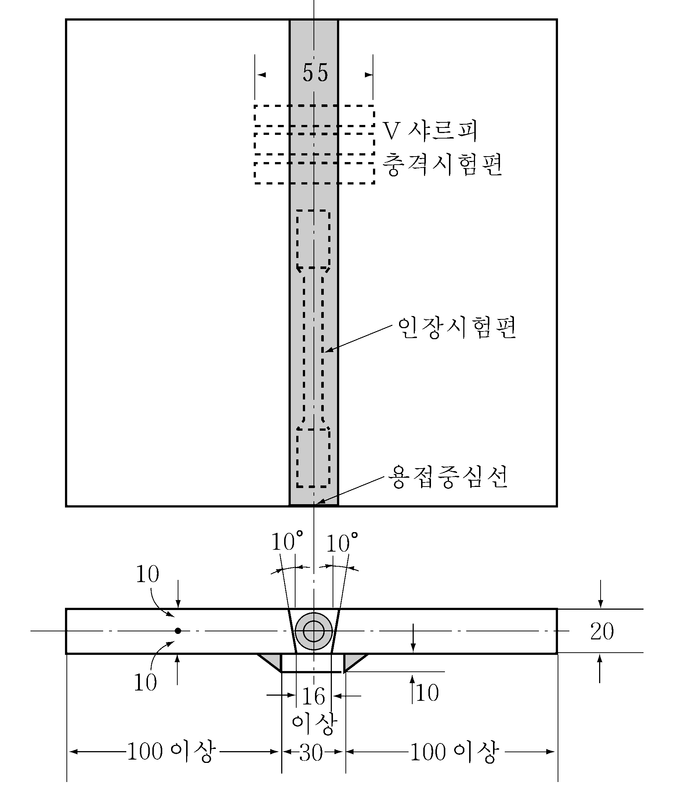
    **그림 2.2.22 피복아크 용접의 용착금속 시험재** (단위:mm)
    - **(가)** 시험재의 치수는 **그림 2.2.22**에 따르며 아래보기 용접자세에서 보통의 방법으로 용접한다.
    - **(나)** 각 층은 1패스 또는 여러 패스 중 어느 방법으로 용접하여도 좋으나 각 층의 용접진행방향은 시험재의 끝에서 층마다 서로 바꾸어야 한다. 또한 각 층의 두께는 2 mm 이상으로 하고 4 mm를 넘어서는 안 된다.
    - **(다)** 시험재는 각 패스마다 용접선 중앙의 이음 표면에서 계측한 온도가 100℃ 이상 250 ℃ 이하가 될 때까지 대기중에서 냉각한다.
  - **(2)** **화학성분** 제조자는 각 시험재에 대하여 용착금속의 화학성분을 분석하고 그 결과를 우리 선급에 제출하여야 한다. 또한 화학성분에는 주요 합금원소를 포함하여야 한다.
  - **(3)** **용착금속 인장시험**
    - **(가)** 각 시험재로부터 **표 2.2.1**의 *R* 14A호 인장시험편 1개를 채취한다. 시험편의 다듬질은 기계다듬질로 하고 시험편의 세로축 중심선이 시험재의 용접중심선과 판두께의 중심에 일치하여야 한다.
    - **(나)** 인장시험편은 수소제거를 위하여 시험을 하기 전에 16시간을 초과하지 않는 범위내에서 250℃를 넘지 않게 가열하여도 좋다.
    - **(다)** 각 시험편의 인장강도, 항복강도 및 연신율은 **표 2.2.29**에 따른다. 다만, 인장강도가 규격치의 상한을 넘는 것에 대하여는 기타의 기계적성질 및 용착금속의 화학성분을 고려하여 합격으로 할 수 있다.
  - **(4)** **용착금속 충격시험**
    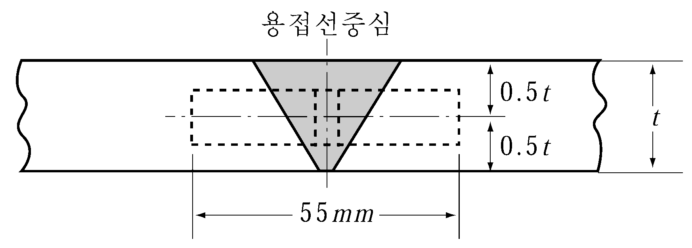
    **그림 2.2.23 이음부의 충격시험편 채취위치** ($t$ : 판두께)

    **표 2.2.29 용착금속 인장시험 및 충격시험의 규격치** ***(2021)***

    | 용접봉의 종류 | 인장강도 ($\mathrm{N}/mm ^{2}$) | 항복강도 ($\mathrm{N}/mm ^{2}$) | 연신율 ($\%$) | 충격시험 |   |
    | --- | --- | --- | --- | --- | --- |
    | 용접봉의 종류 | 인장강도 ($\mathrm{N}/mm ^{2}$) | 항복강도 ($\mathrm{N}/mm ^{2}$) | 연신율 ($\%$) | 시험온도(℃) | 평균흡수에너지(J) |
    | 1 | 400 ∼ 560 | 305 이상 | 22 이상 | 20 | 47 이상 |
    | 2 | 400 ∼ 560 | 305 이상 | 22 이상 | 0 | 47 이상 |
    | 3 | 400 ∼ 560 | 305 이상 | 22 이상 | -20 | 47 이상 |
    | 2*Y* | 490 ∼ 660 | 375 이상 | 22 이상 | 0 | 47 이상 |
    | 3*Y* | 490 ∼ 660 | 375 이상 | 22 이상 | -20 | 47 이상 |
    | 4*Y* | 490 ∼ 660 | 375 이상 | 22 이상 | -40 | 47 이상 |
    | *5Y* | 490 ∼ 660 | 375 이상 | 22 이상 | -60 | 47 이상 |
    | 2*Y*40 | 510 ∼ 690 | 400 이상 | 22 이상 | 0 | 47 이상 |
    | 3*Y*40 | 510 ∼ 690 | 400 이상 | 22 이상 | -20 | 47 이상 |
    | 4*Y*40 | 510 ∼ 690 | 400 이상 | 22 이상 | -40 | 47 이상 |
    | *5Y*40 | 510 ∼ 690 | 400 이상 | 22 이상 | -60 | 47 이상 |
    | 3*Y*47 | 570 ∼ 720 | 460 이상 | 19 이상 | -20 | 64 이상 |
    | *L* 1 | 400 ∼ 560 | 305 이상 | 22 이상 | -40 | 34 이상 |
    | *L* 2 | 440 ∼ 610 | 345 이상 | 22 이상 | -60 | 34 이상 |
    | *L* 3 | 490 ∼ 660 | 375 이상 | 21 이상 | -60 | 34 이상 |
    | *L* 51 | 530 이상 | 375 이상(1) | 25 이상 | -120 | 27 이상 |
    | *L* 91 | 590 이상 | 375 이상(1) | 25 이상 | -196 | 27 이상 |
    | (비고) (1) 0.2 $\%$ 항복강도로 한다. |   |   |   |   |   |
    - **(가)** 각 시험재로부터 **표 2.1.3**의 샤르피 V-노치 충격시험편 1조(3개)를 기계절단으로 채취한다. 또한 시험편의 길이방향을 용접선에 직각으로 하고 **그림 2.2.23**에 따라 시험재 두께의 1/2 위치와 시험편의 중심선이 일치하도록 한다.
    - **(나)** 시험편의 노치는 용접선의 중심과 일치시키고 노치의 길이방향을 시험재의 표면에 수직으로 한다.
    - **(다)** 시험온도 및 평균흡수에너지값은 **표 2.2.29**에 따른다.
    - **(라)** 1조의 시험편 중에서 2개 이상이 규정의 평균흡수에너지값 미만이거나 어느 한 개라도 규정의 평균흡수에너지값의 70 $\%$ 미만인 경우는 불합격으로 한다.
- **5.** **맞대기용접 시험**
  - **(1)** **맞대기용접 시험재의 용접**
    - **(가)** 시험재의 치수는 **그림 2.2.24**에 따르고 제조자가 지정하는 각 용접자세(아래보기, 수평, 수직상진, 수직하진 및 위보기)에서 보통의 방법으로 용접한다.
    - **(나)** 시험재는 각 패스마다 용접선 중앙의 이음 표면에서 계측한 온도가 100℃ 이상 250℃ 이하가 될 때까지 대기중에서 냉각한다.
    - **(다)** 모든 시험재는 루트부에 건전한 용접금속이 확보되도록 뒷면다듬질을 한 후 지름 4 mm의 용접봉으로 그 시험재에 대응한 용접자세로 뒷면용접을 한다. 아래보기 용접에만 사용하는 용접봉인 경우에는 시험재를 뒤집어서 뒷면용접을 할 수 있다.
  - **(2)** **맞대기 용접의 인장시험**

    **표 2.2.30 맞대기용접 인장시험 및 충격시험의 규격치** ***(2017) (2021)***

    | 용접봉의 종류 | 인장강도 ($\mathrm{N}/mm ^{2}$) | 충격시험 |   |   |
    | --- | --- | --- | --- | --- |
    | 용접봉의 종류 | 인장강도 ($\mathrm{N}/mm ^{2}$) | 시험온도 (℃) | 평균흡수에너지 (J) |   |
    | 용접봉의 종류 | 인장강도 ($\mathrm{N}/mm ^{2}$) | 시험온도 (℃) | 아래보기, 수평, 위보기 | 수직상진, 수직하진 |
    | 1 | 400 이상 | 20 | 47 이상 | 34 이상 |
    | 2 | 400 이상 | 0 | 47 이상 | 34 이상 |
    | 3 | 400 이상 | －20 | 47 이상 | 34 이상 |
    | 2*Y* | 490 이상 | 0 | 47 이상 | 34 이상 |
    | 3*Y* | 490 이상 | －20 | 47 이상 | 34 이상 |
    | 4*Y* | 490 이상 | －40 | 47 이상 | 34 이상 |
    | *5Y* | 490 이상 | -60 | 47 이상 | 34 이상 |
    | 2*Y*40 | 510 이상 | 0 | 47 이상 | 39 이상 |
    | 3*Y*40 | 510 이상 | －20 | 47 이상 | 39 이상 |
    | 4*Y*40 | 510 이상 | －40 | 47 이상 | 39 이상 |
    | *5Y*40 | 510 이상 | -60 | 47 이상 | 39 이상 |
    | 3*Y*47 | 570 이상 | －20 | 64 이상 | 64 이상 |
    | *L* 1 | 400 이상 | －40 | 27 이상 | 27 이상 |
    | *L* 2 | 440 이상 | －60 | 27 이상 | 27 이상 |
    | *L* 3 | 490 이상 | －60 | 27 이상 | 27 이상 |
    | *L* 51 | 530 이상 | -120 | 27 이상 | 27 이상 |
    | *L* 91 | 630 이상 | －196 | 27 이상 | 27 이상 |
    - **(가)** 각 시험재로부터 **표 2.2.1**의 *R* 2*A*호 인장시험편 1개를 채취한다.
    - **(나)** 용접부는 모재면까지 다듬질한다.
    - **(다)** 시험편의 인장강도는 **표 2.2.30**에 따른다. 또한 인장강도는 파단위치와 함께 기록하여야 한다.
  - **(3)** **맞대기용접 굽힘시험**
    - **(가)** 각 시험재로부터 **표 2.2.2**의 *RB* 4호 앞면굽힘 및 뒷면굽힘 시험편 각 1개를 채취한다. 다만, *L* 91에 대하여는 **표 2.2.2**의 *RB* 1호 앞면굽힘 및 뒷면굽힘시험편 각 1개를 세로방향으로 채취한다. (2017)
    - **(나)** 용접부는 모재면까지 편평하게 다듬질한다. 또한 시험편의 모서리는 반경이 2 mm를 넘지 않도록 곡면가공한다.
    - **(다)** 시험편은 판두께의 1.5배(3*Y*47은 2배)에 상당하는 안쪽반지름을 갖는 플런저로 앞면굽힘 및 뒷면굽힘을 하고 굽힘각도가 120${}^{\circ}$ 이상에 도달하여도 시험편의 표면에 3 mm를 넘는 균열 또는 기타의 결함이 생겨서는 안 된다. 다만, *L* 91에 대한 굽힘의 안쪽반지름은 판두께의 2배로 하고 굽힘각도는 180${}^{\circ}$로 한다. *(2017) (2021)*
  - **(4)** **맞대기용접 충격시험**
    - **(가)** 각 시험재로부터 **표 2.1.3**의 샤르피 V-노치 충격시험편 1조(3개)를 기계절단으로 채취한다.
    - **(나)** 시험편의 채취위치는 **그림 2.2.23**에 따르고 그 모양, 치수, 노치의 위치 및 방향은 **4**항 (4)호의 용착금속 충격시험의 규정에 따른다.
    - **(다)** 시험온도 및 평균흡수에너지값은 **표 2.2.30**에 따른다.
    - **(라)** 1조의 시험편 중에서 2개 이상이 규정의 평균흡수에너지값 미만이거나 어느 한 개라도 규정의 평균흡수에너지값의 70 $\%$ 미만인 경우는 불합격으로 한다.
- **6.** **수소시험**
  수소시험은 수은법 또는 열전도도검출기법(thermal conductivity detector method)으로 할 수 있으며 시험방법은 다음에 따른다. 다만, 우리 선급이 인정하는 경우에는 글리세린치환법을 사용할 수 있다. *(2017)*
  - **(1)** **수은법** 수은법에 대하여는 **ISO 3690:2018**의 규정에 따른다. *(2017) (2023)*
  - **(2)** **열전도도 검출기법** 열전도도검출기법의 시험방법은 **ISO 3690:2018**의 규정에 따른다. 이때 4개의 용접 시험편을 **표 2.2.31**의 시험 온도 및 유지시간별로 각각 준비해야 한다. *(2017) (2023)*

    **표 2.2.31 열전도도 검출기법의 시험온도 및 유지시간** ***(2017)***

    | 측정방법 |   | 시험온도 | 최소 유지시간 |
    | --- | --- | --- | --- |
    | 열전도도 검출기법(1) | 가스크로마토그라프 장치 사용 | 45 ℃ | 72 시간 |
    | 열전도도 검출기법(1) | 가스크로마토그라프 장치 사용 | 150 ℃ | 6 시간 |
    | (비고) (1) 고온전달가스검출법(hot carrier gas extraction method)은 모든 확산수소가 방출되기까지 포집 및 측정이 원활히 이루어지는 것이 증명되는 경우에 한하여 특별히 고려될 수 있다. |   |   |   |
  - **(3)** **글리세린 치환법**
    - **(가)** **시험재**
      - **(a)** 시험재는 원칙적으로 연강 또는 고장력강으로 하며, 두께 12 mm, 너비 25 mm, 길이 125 mm의 것을 4개로 하고 용접하기 전에 0.1 g의 정도(精度)로서 그 질량을 측정한다. 너비 25 mm의 시험편의 표면상에 지름 4 mm의 용접봉을 약 150 mm 용융하여 길이 100 mm의 비드를 만든다. 용접은 아크 길이를 가능한 한 짧게 하고 약 150 *A*의 전류로써 용접한다.
      - **(b)** 용접봉은 용접 전에 제조자가 지정하는 보통의 방법으로 건조(dry)할 수 있다.
    - **(나)** (가)에 따라 제작된 각 시험편은 비드 용착 완료 후 30초 이내에 슬래그를 제거하여 약 20 ℃의 물로서 급냉한다. 다시 30초 후에 세척하여 치환법에 의한 수소 포집기 중에 봉입한다. 글리세린은 시험을 하는 중에는 약 45 ℃를 유지한다. 4개의 전 시험편을 용접하여 수소 포집기 중에 봉입될 때까지 요하는 시간은 30분 이내로 한다. 시험편은 글리세린에 48시간 담근 후 물과 알코올로 세척하고, 건조 후 0.1 g의 정도(精度)에서 그 질량을 측정하여 용착금속의 질량을 구한다. 포집된 수소가스의 양은 0.05 $\mathrm{cm} ^{3}$의 정도(精度)에서 측정하고, 온도 20℃ 및 대기압(760 mmHg)으로 하여 그 양을 환산한다.
  - **(4)** 4개의 시험편의 용착금속에서 얻어진 수소량의 평균치는 전 각 호에서 규정하는 시험방법 및 기호의 종류에 따라 **표 2.2.32**의 규격에 합격하여야 한다.

    **표 2.2.32 수소량의 규격치 (**$ml/100g$**)** ***(2017)***

    | 표시기호 | 수은법 | 열전도도검출기법 | 글리세린 치환법 |
    | --- | --- | --- | --- |
    | *H15* | 15 이하 | 15 이하 | 10 이하 |
    | *H10* | 10 이하 | 10 이하 | 5 이하 |
    | *H5* | 5 이하 | 5 이하 | - |
- **7.** **필릿용접 시험**
  - **(1)** **필릿용접 시험재**
    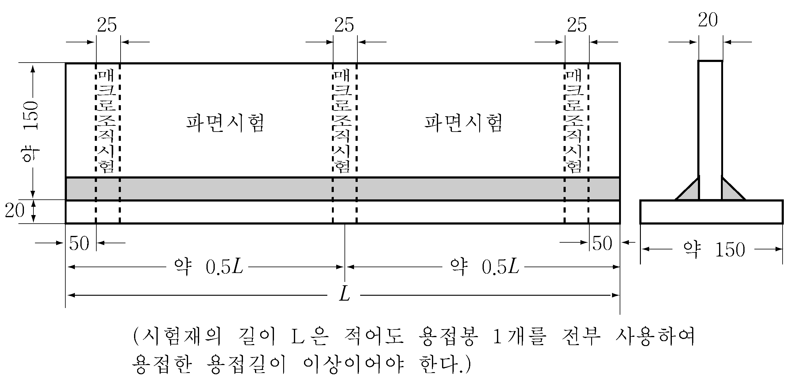
    **그림 2.2.25 필릿용접 시험재 (단위 : mm)**
    - **(가)** 시험재의 치수는 **그림 2.2.25**에 따르고 제조자가 지정하는 각 용접자세(아래보기, 수평, 수직상진, 수직하진 및 위보기)에 대하여 각 1개씩 용접한다.
    - **(나)** 최초의 필릿용접은 최대지름의 용접봉을 반대편 필릿용접에는 최소지름의 용접봉을 사용한다.
    - **(다)** 각 장의 크기는 용접봉의 지름과 시험중에 사용되는 용접전류에 따라 적절히 한다.
    - **(라)** 그래비티 또는 이와 유사한 용접 기구를 사용하는 경우의 필릿용접은 신청된 용접법에 따라 최대길이의 용접봉을 사용하여야 한다. 또한 연강 및 고장력강 겸용의 용접봉으로 신청된 경우, 시험재는 고장력강으로 한다.
  - **(2)** **필릿용접의 매크로조직시험**
    - **(가)** 매크로조직시험편은 **그림 2.2.22**와 같이 3곳에서 너비 25 mm의 것을 채취한다.
    - **(나)** 용접부 횡단면의 매크로 조직을 표시하는 시험편에는 과대한 상하 각 장의 차이, 용입불량 및 균열, 기타 유해한 결함이 있어서는 안 된다.
  - **(3)** **필릿용접의 경도시험** 경도는 (2)호에 규정하는 매크로시험을 한 각 시험편의 용접금속, 열영향부 및 모재에 대하여 **그림 2.2.26**과 같이 측정하고 각각의 경도는 우리 선급이 적절하다고 인정하는 바에 따른다. **【지침 참조】**
    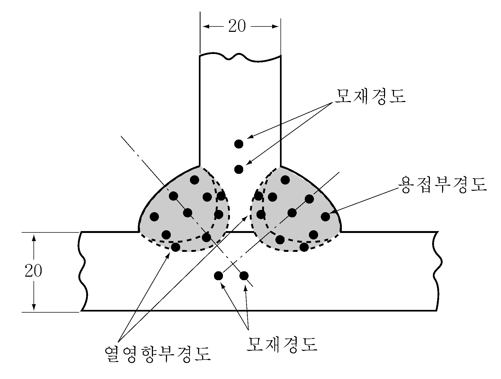
    **그림 2.2.26 경도시험** (단위 : mm) 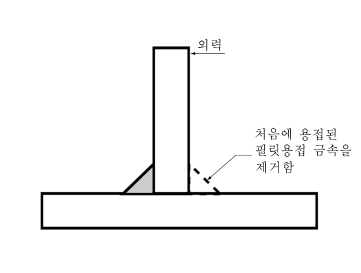
    **그림 2.2.27 파면시험**
  - **(4)** **필릿용접의 파면시험**
    - **(가)** 매크로조직시험편을 채취한 나머지의 시험재 중 하나에 대하여는 필릿용접의 파단을 쉽게 하기 위하여 처음에 용접된 필릿용접금속을 제거하고 **그림 2.2.27**과 같이 필릿용접의 루트부에 인장이 걸리도록 반대쪽에 힘을 가하여 파단시킨 후 파단면을 검사한다. 다른 또 하나의 시험재에 대하여는 나중에 용접된 필릿용접 금속을 제거하고 동일하게 파면시험을 한다.
    - **(나)** 파단면에는 불완전 용입 및 기타 유해한 결함이 있어서는 안 된다.
- **8.** **정기검사**
  - **(1)** 정기검사는 승인된 품목마다 다음 (2)호 및 (3)호에 규정하는 시험을 하고 이에 합격하여야 한다.
  - **(2)** 수동용접봉에 대한 정기검사의 시험 종류 등은 **표 2.2.33**에 따른다.

    **표 2.2.33 시험의 종류** ***(2019)***

    | 시험의 종류(2) | 시 험 재 |   |   |   |   | 각 시험재로부터 채취하는 시험편의 종류 및 개수 |
    | --- | --- | --- | --- | --- | --- | --- |
    | 시험의 종류(2) | 용접자세 | 봉의지름(mm) | 개수 | 모양 및 치수 | 판두께(mm) | 각 시험재로부터 채취하는 시험편의 종류 및 개수 |
    | 용착금속시험 | 아래보기 | 4(1) | 1 | **그림 2.2.22** | 20 | 인장시험편 : 1개 충격시험편 : 1조(3개) |
    | 용착금속시험 | 아래보기 | 최대지름(1) | 1 | **그림 2.2.22** | 20 | 인장시험편 : 1개 충격시험편 : 1조(3개) |
    | (비고) (1) 제조하는 봉의 지름이 1종류뿐인 경우의 시험재는 1개로 한다. 제조하는 최대 지름이 4 mm인 경우에는 4 mm 외의 최대 지름을 포함하여 2개의 시험재가 요구된다. (2) 우리 선급이 필요하다고 인정하는 경우 저수소계 용접봉에 대하여는 수소시험을 요구할 수 있다. |   |   |   |   |   |   |
  - **(3)** 그래비티 또는 이와 유사한 용접 기구를 사용하는 경우의 용접봉에 대한 정기검사의 시험 종류 등은 **표 2.2.34**에 따른다.

    **표 2.2.34 시험의 종류**

    | 시험의 종류 | 시 험 재 |   |   |   |   | 각 시험재로부터 채취하는 시험편의 종류 및 개수 |
    | --- | --- | --- | --- | --- | --- | --- |
    | 시험의 종류 | 용접자세 | 봉의지름(mm) | 개수 | 모양 및 치수 | 판두께(mm) | 각 시험재로부터 채취하는 시험편의 종류 및 개수 |
    | 용착금속 시험 | 아래보기 | 4이상 | 1 | **그림 2.2.22** | 20 | 인장시험편 : 1개 충격시험편 : 1조(3개) |
  - **(4)** (2)호 및 (3)호에서 규정하는 시험의 시험재에 대한 용접방법 및 규격은 **4**항에 따른다.
- **9.** **종류의 변경**
  - **(1)** 승인된 용접봉의 강도나 인성 또는 수소함량에 관한 종류의 변경을 하는 경우에는 **601.**의 **6**항 (3)호의 규정에 따라 다음 각 호의 규정하는 시험을 하고 이에 합격하여야 한다. (2017)
  - **(2)** 강도에 관한 종류의 변경에 대하여는 **8**항의 정기검사 및 **3**항 (1)호에 규정하는 맞대기용접 시험을 한다.
  - **(3)** 인성에 관한 종류의 변경에 대하여는 **8**항의 정기검사 및 **3**항 (1)호에 규정하는 맞대기용접 시험 중 충격시험만을 한다.
  - **(4)** 수소함량에 관한 종류의 변경에 대하여는 **8**항의 정기검사 및 **3**항 (1)호에 규정하는 수소시험을 한다. (2017)

#### 603. 연강, 고장력강 및 저온용강의 자동용접용재료

- **1.** **적용**
  - **(1)** 다음 (가)부터 (다)까지의 연강, 고장력강 및 저온용강용 자동용접용 재료(이하 **자동용접용재료**라 한다)에 대한 승인시험 및 정기검사는 **603.**의 규정에 따른다.
    - **(가)** 서브머지드 아크 자동용접용 재료(와이어-플럭스 조합)
    - **(나)** 가스실드아크 자동용접용 재료(가스를 사용하는 플럭스코어드 와이어 또는 솔리드 와이어 자동용접용 재료)
    - **(다)** 셀프실드아크 자동용접용 재료(가스를 사용하지 않는 플럭스코어드 와이어 또는 플럭스피복 와이어 자동용접용 재료)
  - **(2)** 2전극 이상의 자동용접용재료는 별도의 승인시험을 받아야 한다. 일반적으로 **603.**의 규정에 따라 시험하여야 한다.
  - **(3)** 우리 선급이 인정하는 경우에는 **604.**에 따라 반자동 다층용접용으로 승인된 가스실드 아크용접용 재료 또는 셀프실드 아크용접용 재료는 추가적인 시험 없이 자동 다층용접용으로 승인될 수 있다. 다만, 용접전류 및 입열조건이 동일하여야 한다.
- **2.** **종류 및 기호**
  - **(1)** 자동용접용재료의 종류 및 기호는 **표 2.2.35**에 따른다.

    **표 2.2.35 종류 및 기호** ***(2017) (2021)***

    | 연강용 | 고장력강용 | 저온용강용 |
    | --- | --- | --- |
    | 1, 2, 3 | 2*Y*, 3*Y,* 4*Y,* 5*Y,* 2*Y*40, 3*Y*40, 4*Y*40, 5*Y*40, 3*Y*47 | *L* 1, *L* 2, *L* 3, *L* 51, *L* 91 |
  - **(2)** **표 2.2.39**의 각 용접법의 시험에 합격한 자동용접용재료에는 그 기호의 뒤에 **표 2.2.36**의 표시기호를 부기한다.

    **표 2.2.36 표시기호**

    | 용 접 법 | 표 시 기 호 |
    | --- | --- |
    | 다층용접법(1) | *M* |
    | 양면 일층용접법(2) | *T* |
    | 다층 및 양면일층 겸용 용접법 | *TM* |
    | (비고) (1) 다층용접법이란 용접봉의 패스를 여러 번에 걸쳐 완성하는 용접방법을 말한다. (2) 양면 일층용접법이란 용접봉의 패스를 양쪽에서 각각 한 번씩 하는 용접방법을 말한다. |   |
  - **(3)** 가스실드아크 자동용접용 재료에는 (2)호의 표시기호 뒤에 *G*를, 셀프실드아크 자동용접용 재료에는 *N*을 부기한다. 또한 사용하는 보호가스의 종류는 **표 2.2.37**에 따르고 구분기호는 표시기호 *G* 다음에 부기한다. (예 : 3*YTMG*(*M*1))
- **3.** **시험일반**
  - **(1)** 시험재로 사용되는 강판은 용접용재료의 종류에 따라서 **표 2.2.38**에 따른다.
  - **(2)** 자동용접용재료에 대한 시험의 종류, 시험재의 개수, 판두께, 모양 및 치수 그리고 각 시험재로부터 채취하는 시험편의 종류와 개수는 **표 2.2.39**에 따른다.
  - **(3)** 자동용접용재료의 승인시험은 품목마다 (2)호에 규정하는 시험을 하고 이에 합격하여야 한다.
  - **(4)** 가스실드아크 자동용접용 재료는 **표 2.2.37**의 가스 종류 중에서 제조자가 지정하는 것마다 (3)호의 시험을 한다. 다만, 제조자가 **표 2.2.37**의 구분기호 *M* 1, *M* 2 또는 *M* 3 또는 *C*에 포함되는 가스를 지정한 경우에는 어느 한 종류의 가스에 대하여 (3)호의 시험을 하고 이에 만족하면 동일 구분내 다른 종류의 가스에 대하여는 우리 선급의 승인을 받아 시험을 생략할 수 있다.
  - **(5)** 최초 승인시험시 사용된 것과 다른 보호가스를 사용하고자 하는 경우, (4)호에 따라 우리 선급이 인정하지 않는 한 (3)호의 시험을 하여야 한다.

    **표 2.2.37 보호가스의 종류**

    | 구분기호 | 종류 | 성 분 |   |   |   |
    | --- | --- | --- | --- | --- | --- |
    | 구분기호 | 종류 | $CO _{ 2}$ | $O_{ 2}$ | $H_{ 2}$ | $Ar$(1)(2) |
    | *M* 1 | *M* 11 | 1∼5 | － | 1∼5 | 나머지 |
    | *M* 1 | *M* 12 | 1∼5 | － | － | 나머지 |
    | *M* 1 | *M* 13 | － | 1∼3 | － | 나머지 |
    | *M* 1 | *M* 14 | 1∼5 | 1∼3 | － | 나머지 |
    | *M* 2 | *M* 21 | 6∼25 | － | － | 나머지 |
    | *M* 2 | *M* 22 | － | 4∼10 | － | 나머지 |
    | *M* 2 | *M* 23 | 6∼25 | 1∼8 | － | 나머지 |
    | *M* 3 | *M* 31 | 26∼50 | － | － | 나머지 |
    | *M* 3 | *M* 32 | － | 11∼15 | － | 나머지 |
    | *M* 3 | *M* 33 | 6∼50 | 9∼15 | － | 나머지 |
    | *C* | *C* 1 | 100 | － | － | － |
    | *C* | *C* 2 | 나머지 | 1∼30 | － | － |
    | *I* | *I* 1 | － | － | － | 100 |
    | *E* | *E* 1 | 상기제외 |   |   |   |
    | (비고) 1) Ar은 Ar 함량의 95% 까지 He으로 대체될 수 있다. 2) 승인은 동등 이상의 He 함량을 가지는 혼합가스에만 적용된다. |   |   |   |   |   |

    **표 2.2.38 시험재로 사용되는 강판의 종류** ***(2017) (2021)***

    | 용접용재료의 종류 | 시험재로 사용되는 강판의 종류(1)(2) |
    | --- | --- |
    | 1 | *A* |
    | 2 | *A*, *B* 또는 *D* |
    | 3 | *A*, *B*, *D* 또는 *E* |
    | 1*Y* | *AH* 32 또는 *AH* 36 |
    | 2*Y* | *AH* 32, *AH* 36, *DH* 32 또는 *DH* 36 |
    | 3*Y* | *AH* 32, *AH* 36, *DH* 32, *DH* 36, *EH* 32 또는 *EH* 36 |
    | 4*Y* | *AH* 32, *AH* 36, *DH* 32, *DH* 36, *EH* 32, *EH* 36, *FH* 32 또는 *FH* 36 |
    | 5*Y* | *AH* 32, *AH* 36, *DH* 32, *DH* 36, *EH* 32, *EH* 36, *FH* 32 또는 *FH* 36 |
    | 2*Y*40 | *AH* 40 또는 *DH* 40 |
    | 3*Y*40 | *AH* 40, *DH* 40 또는 *EH* 40 |
    | 4*Y*40 | *AH* 40, *DH* 40, *EH* 40 또는 *FH* 40 |
    | 5*Y*40 | *AH* 40, *DH* 40, *EH* 40 또는 *FH* 40 |
    | 3*Y*47 | *EH* 47-*H* |
    | *L* 1 | *E* 또는 *RL* 235*A* |
    | *L* 2 | *E*, *RL* 235*A*, *RL* 235*B*, *RL* 325*A* 또는 *RL* 325*B* |
    | *L* 3 | *RL* 325*A*, *RL* 325*B* 또는 *RL* 355 |
    | *L* 51 | *RL* 5*N*390 |
    | *L* 91 | *RL* 9*N*490 |
    | (비고) (1) 용착금속 시험재에는 이 표의 규정에 관계없이 연강 또는 고장력강을 사용할 수 있다. 이 경우 *L* 91의 시험재에 대하여는 적절한 버터링을 한 것이어야 한다. (2) 맞대기용접 시험재로 사용되는 *AH* 32, *DH* 32, *EH* 32 및 *FH* 32 고장력강의 인장강도는 490 $\mathrm{N}/mm ^{2}$ 이상이어야 한다. |   |

    **표 2.2.39 자동용접용 재료의 시험의 종류** ***(2017)*** ***(******2021)***

    | 용접법(7) | 시험의 종류(8) |   | 용접용재료의 종류 | 시 험 재 |   |   | 각 시험재로부터 채취하는 시험편의 종류와 개수 |
    | --- | --- | --- | --- | --- | --- | --- | --- |
    | 용접법(7) | 시험의 종류(8) |   | 용접용재료의 종류 | 개수 | 모양 및 치수 | 판두께 (mm)(3) | 각 시험재로부터 채취하는 시험편의 종류와 개수 |
    | 다층 용접법 | 용착금속시험 |   | 1, 2, 3, 1*Y*, 2*Y*, 3*Y*, 4*Y*, 5*Y*, 2*Y*40, 3*Y*40, 4*Y*40, 5*Y*40, *L*1, *L* 2, *L* 3 *L* 51, *L* 91 | 1 | **그림 2.2.28** | 20 | 인장시험편 : 2개 충격시험편 : 1조(3개) |
    | 다층 용접법 | 맞대기 용접시험 |   | 1, 2, 3, 1*Y*, 2*Y*, 3*Y*, 4*Y*, 5*Y*, 2*Y*40, 3*Y*40, 4*Y*40, 5*Y*40, *L*1, *L* 2, *L* 3 *L* 51, *L* 91 | 1(4) | **그림 2.2.29** | 20∼25 | 인장시험편 : 2개(4) 앞면굽힘시험편 : 2개(4)(6) 뒷면굽힘시험편 : 2개(4)(6) 충격시험편 : 1조(3개) |
    | 양면 일층 용접법(9) | 맞대기 용접 시험 | 서브머지드 아크 자동용접 | 1, 1*Y* | 1 | **그림 2.2.30** | 12∼15 | 인장시험편 : 2개 세로방향인장시험편 : 1개(5) 앞면굽힘시험편 : 1개 뒷면굽힘시험편 : 1개 충격시험편 : 1조(3개) |
    | 양면 일층 용접법(9) | 맞대기 용접 시험 | 서브머지드 아크 자동용접 | 1, 1*Y* | 1 | **그림 2.2.30** | 20∼25 | 인장시험편 : 2개 세로방향인장시험편 : 1개(5) 앞면굽힘시험편 : 1개 뒷면굽힘시험편 : 1개 충격시험편 : 1조(3개) |
    | 양면 일층 용접법(9) | 맞대기 용접 시험 | 서브머지드 아크 자동용접 | 2, 3, 2*Y*, 3*Y*, 4*Y*, 5*Y*, 2*Y*40, 3*Y*40, 4*Y*40, 5*Y*40 | 1 | **그림 2.2.30** | 20∼25 | 인장시험편 : 2개 세로방향인장시험편 : 1개(5) 앞면굽힘시험편 : 1개 뒷면굽힘시험편 : 1개 충격시험편 : 1조(3개) |
    | 양면 일층 용접법(9) | 맞대기 용접 시험 | 서브머지드 아크 자동용접 | 2, 3, 2*Y*, 3*Y*, 4*Y*, 5*Y*, 2*Y*40, 3*Y*40, 4*Y*40, 5*Y*40 | 1 | **그림 2.2.30** | 30∼35 | 인장시험편 : 2개 세로방향인장시험편 : 1개(5) 앞면굽힘시험편 : 1개 뒷면굽힘시험편 : 1개 충격시험편 : 1조(3개) |
    | 양면 일층 용접법(9) | 맞대기 용접 시험 | 가스실드 아크 및 셀프실드 아크 자동용접 | 1, 2, 3, 1*Y*, 2*Y*, 3*Y*, 4*Y*, 5*Y*, 2*Y*40, 3*Y*40, 4*Y*40, 5*Y*40 | 1 | **그림 2.2.30** | 12∼15(1) | 인장시험편 : 2개 세로방향인장시험편 : 1개(5) 앞면굽힘시험편 : 1개 뒷면굽힘시험편 : 1개 충격시험편 : 1조(3개) |
    | 양면 일층 용접법(9) | 맞대기 용접 시험 | 가스실드 아크 및 셀프실드 아크 자동용접 | 1, 2, 3, 1*Y*, 2*Y*, 3*Y*, 4*Y*, 5*Y*, 2*Y*40, 3*Y*40, 4*Y*40, 5*Y*40 | 1 | **그림 2.2.30** | 20(2) | 인장시험편 : 2개 세로방향인장시험편 : 1개(5) 앞면굽힘시험편 : 1개 뒷면굽힘시험편 : 1개 충격시험편 : 1조(3개) |
    | 양면 일층 용접법(9) | 맞대기 용접 시험 | 가스실드 아크 및 셀프실드 아크 자동용접 | 1, 2, 3, 1*Y*, 2*Y*, 3*Y*, 4*Y*, 5*Y*, 2*Y*40, 3*Y*40, 4*Y*40, 5*Y*40 | 1 | **그림 2.2.30** | 20∼25(1) | 인장시험편 : 2개 세로방향인장시험편 : 1개(5) 앞면굽힘시험편 : 1개 뒷면굽힘시험편 : 1개 충격시험편 : 1조(3개) |
    | 양면 일층 용접법(9) | 맞대기 용접 시험 | 가스실드 아크 및 셀프실드 아크 자동용접 | 1, 2, 3, 1*Y*, 2*Y*, 3*Y*, 4*Y*, 5*Y*, 2*Y*40, 3*Y*40, 4*Y*40, 5*Y*40 | 1 | **그림 2.2.30** | 적용 최대두께(2) | 인장시험편 : 2개 세로방향인장시험편 : 1개(5) 앞면굽힘시험편 : 1개 뒷면굽힘시험편 : 1개 충격시험편 : 1조(3개) |
    | 양면 일층 용접법(9) | 맞대기 용접시험 |   | *L* 1, *L* 2, *L* 3, *L* 51, *L* 91 | 1 | **그림 2.2.30** | 12∼15 | 인장시험편 : 2개 세로방향인장시험편 : 1개(5) 앞면굽힘시험편 : 1개 뒷면굽힘시험편 : 1개 충격시험편 : 1조(3개) |
    | 양면 일층 용접법(9) | 맞대기 용접시험 |   | *L* 1, *L* 2, *L* 3, *L* 51, *L* 91 | 1 | **그림 2.2.30** | 20 또는 적용 최대두께 | 인장시험편 : 2개 세로방향인장시험편 : 1개(5) 앞면굽힘시험편 : 1개 뒷면굽힘시험편 : 1개 충격시험편 : 1조(3개) |
    | (비고) (1) 적용최대 판두께가 25 mm 이하인 경우의 시험재 두께. (2) 적용최대 판두께가 25 mm를 넘는 경우의 시험재 두께. (3) 용접법과 관련하여 용접되는 최대 판두께를 중간 정도로 제한할 필요성이 있는 경우에는 우리 선급의 승인을 받아 시험재의 두께를 변경할 수 있다. 이 경우, 시험재는 승인을 받고자 하는 등급에 관계없이 12 ~ 15 mm 및 20 ~ 25 mm 강판을 사용한다. (4) 가스실드아크 및 셀프실드아크 다층용접법에 대한 맞대기용접 시험재의 개수는 승인받고자 하는 각 용접자세마다 1개씩으로 한다. 다만, 용접자세가 두 가지 이상인 경우에는 각 용접자세의 시험재로부터 채취하는 인장시험편, 앞면굽힘시험편 및 뒷면굽힘시험편의 개수는 규정의 1/2로 할 수 있다. (5) 2개의 시험재 중 판 두께가 두꺼운 쪽의 시험재에서 채취한다. (6) *L* 91의 맞대기용접 시험재에서 채취하는 앞면 및 뒷면굽힘시험편의 개수는 각 1개를 채취한다. (7) 다층 및 양면일층용접법 겸용의 자동용접용 재료에 대하여는 다층 및 양면일층용접법의 양쪽에 대한 시험을 모두 하고 시험재의 개수, 모양 및 치수, 판두께 그리고 각 시험편의 종류와 개수는 각각의 용접법의 규정에 따른다. 다만, 다층용접법의 용착금속시험의 인장시험편은 1개로 한다. (8) 제조자의 신청에 따라 수소시험을 할 수 있다. (9) 용접용재료가 연강 및 고장력강 겸용으로 승인 신청된 경우, 고장력강을 사용하여 2개의 시험재를 준비한다. 다만, 우리 선급이 필요하다고 인정하는 경우에는 연강을 사용한 두개의 시험재를 요구할 수 있다. |   |   |   |   |   |   |   |
  - **(6)** 용접전류, 용접전압 및 용접속도 등 용접조건은 제조자가 지정하는 범위내로 한다. 또한 교류 및 직류 겸용인 것에 대하여는 교류를 사용한다.
  - **(7)** 용접 후 시험재에는 어떠한 열처리도 하여서는 안 된다.
  - **(8)** 용접된 시험재는 시험을 하기 전에 용접부에 결함이 없는 것을 확인하기 위하여 용접선의 전반에 걸쳐 방사선투과검사를 할 수 있다.
- **4.** **다층용접법의 용착금속시험**
  - **(1)** **다층 용접법의 용착금속 시험재**
    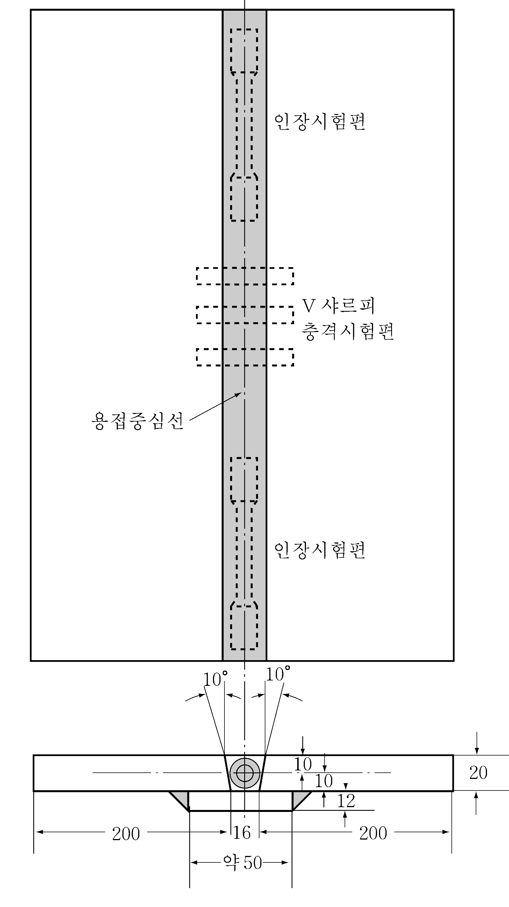
    **그림 2.2.28 다층 용접법의 용착금속 시험재 (단위 : mm)**
    - **(가)** 시험재의 치수는 **그림 2.2.28**에 따르며 보통의 방법으로 아래보기 자세에서 다층 용접을 하고 각 패스의 용접진행 방향은 층마다 서로 바꾸어야 한다. 또한 각층의 용접을 완료한 후 플럭스와 용접슬래그를 제거하여야 한다.
    - **(나)** 각 층의 두께는 서브머지드 아크 자동용접용 재료에 대하여는 와이어의 지름 또는 4 mm 중 큰 쪽 이상으로, 가스실드아크 및 셀프실드아크 자동용접용 재료에 대하여는 3 mm 이상으로 하여야 한다.
    - **(다)** 시험재는 각 패스마다 용접선 중앙의 이음표면에서 계측한 온도가 100℃ 이상 250℃ 이하가 될 때까지 대기중에서 냉각한다.
  - **(2)** **화학성분** 제조자는 각 시험재에 대하여 용착금속의 화학성분을 분석하고 그 결과를 우리 선급에 제출하여야 한다. 또한 화학성분에는 주요 합금원소를 포함하여야 한다.
  - **(3)** **다층용접법의 용착금속 인장시험**

    **표 2.2.40 용착금속 인장시험 및 충격시험의 규격치** ***(2017) (2021)***

    | 용접용재료의 종류 | 인장강도 ($\mathrm{N}/mm ^{2}$) | 항복강도 ($\mathrm{N}/mm ^{2}$) | 연 신 율 ($\%$) | 충격시험 |   |
    | --- | --- | --- | --- | --- | --- |
    | 용접용재료의 종류 | 인장강도 ($\mathrm{N}/mm ^{2}$) | 항복강도 ($\mathrm{N}/mm ^{2}$) | 연 신 율 ($\%$) | 시험온도 (℃) | 평균흡수에너지 (J) |
    | 1 | 400 ∼ 560 | 305 이상 | 22 이상 | 20 | 34 이상 |
    | 2 | 400 ∼ 560 | 305 이상 | 22 이상 | 0 | 34 이상 |
    | 3 | 400 ∼ 560 | 305 이상 | 22 이상 | －20 | 34 이상 |
    | 1*Y* | 490 ∼ 660 | 375 이상 | 22 이상 | 20 | 34 이상 |
    | 2*Y* | 490 ∼ 660 | 375 이상 | 22 이상 | 0 | 34 이상 |
    | 3*Y* | 490 ∼ 660 | 375 이상 | 22 이상 | －20 | 34 이상 |
    | 4*Y* | 490 ∼ 660 | 375 이상 | 22 이상 | －40 | 34 이상 |
    | 5*Y* | 490 ∼ 660 | 375 이상 | 22 이상 | -60 | 34 이상 |
    | 2*Y*40 | 510 ∼ 690 | 400 이상 | 22이상 | 0 | 39 이상 |
    | 3*Y*40 | 510 ∼ 690 | 400 이상 | 22이상 | －20 | 39 이상 |
    | 4*Y*40 | 510 ∼ 690 | 400 이상 | 22이상 | －40 | 39 이상 |
    | 5*Y*40 | 510 ∼ 690 | 400 이상 | 22이상 | -60 | 39 이상 |
    | 3*Y*47 | 570 ∼ 720 | 460 이상 | 19 이상 | －20 | 64 이상 |
    | *L* 1 | 400 ∼ 560 | 305 이상 | 22 이상 | －40 | 27 이상 |
    | *L* 2 | 440 ∼ 610 | 345 이상 | 22 이상 | －60 | 27 이상 |
    | *L* 3 | 490 ∼ 660 | 375 이상 | 21 이상 | －60 | 27 이상 |
    | *L* 51 | 530 이상 | 375 이상(1) | 25 이상 | －120 | 27 이상 |
    | *L* 91 | 590 이상 | 375 이상(1) | 25 이상 | －196 | 27 이상 |
    | (비 고) (1) 0.2 % 항복강도로 한다. |   |   |   |   |   |
    - **(가)** 각 시험재로부터 **표 2.2.1**의 *R* 14A호 인장시험편 2개를 채취한다. 시험편의 다듬질은 기계다듬질로 하고 시험편의 세로축 중심선이 시험재의 용접중심선과 판두께의 중심에 일치하여야 한다.
    - **(나)** 용착금속 인장시험의 규격치는 **표 2.2.40**에 따른다. 다만, 인장강도가 규격치의 상한을 넘는 것에 대하여는 기타의 기계적성질 및 용착금속의 화학성분을 고려하여 합격으로 할 수 있다.
    - **(다)** 인장시험편은 수소제거를 위하여 시험을 하기 전에 16시간을 초과하지 않는 범위 내에서 250℃를 넘지 않게 가열하여도 좋다.
  - **(4)** **다층용접법의 용착금속 충격시험**
    - **(가)** 각 시험재로부터 **표 2.1.3**의 샤르피 V-노치 충격시험편 1조(3개)를 기계절단으로 채취한다. 또한 시험편의 길이방향을 용접선에 직각으로 하고 **그림 2.2.23**에 따라 시험재 두께의 1/2 위치와 시험편의 중심선이 일치하도록 한다.
    - **(나)** 시험온도 및 평균흡수에너지값은 **표 2.2.40**에 따른다.
    - **(다)** 시험편의 노치는 용접선의 중심과 일치시키고 노치의 길이 방향을 시험재의 표면에 수직으로 한다.
    - **(라)** 1조의 시험편 중에서 2개 이상이 규정의 평균흡수에너지값 미만이거나 어느 한 개라도 규정의 평균흡수에너지값의 70 $\%$ 미만인 경우는 불합격으로 한다.
- **5.** **다층용접법의 맞대기용접시험**
  - **(1)** **다층용접법의 맞대기용접 시험재**
    - **(가)** 시험재의 치수는 **그림 2.2.29**에 따르며 아래보기 자세에서 다층 용접으로 하고 그 용접방법은 **4**항 (1)호의 규정에 따른다. 다만, 가스실드아크 및 셀프실드아크 자동용접용 재료의 경우에는 제조자가 지정하는 각 용접자세로 용접한다.
    - **(나)** 시험재는 아래보기 자세에서 앞면용접 후 뒷면용접을 한다. 또한 루트부에 건전한 용접금속이 얻어지도록 뒷면다듬질을 하여도 좋다.
  - **(2)** **다층 용접법의 맞대기용접 인장시험**
    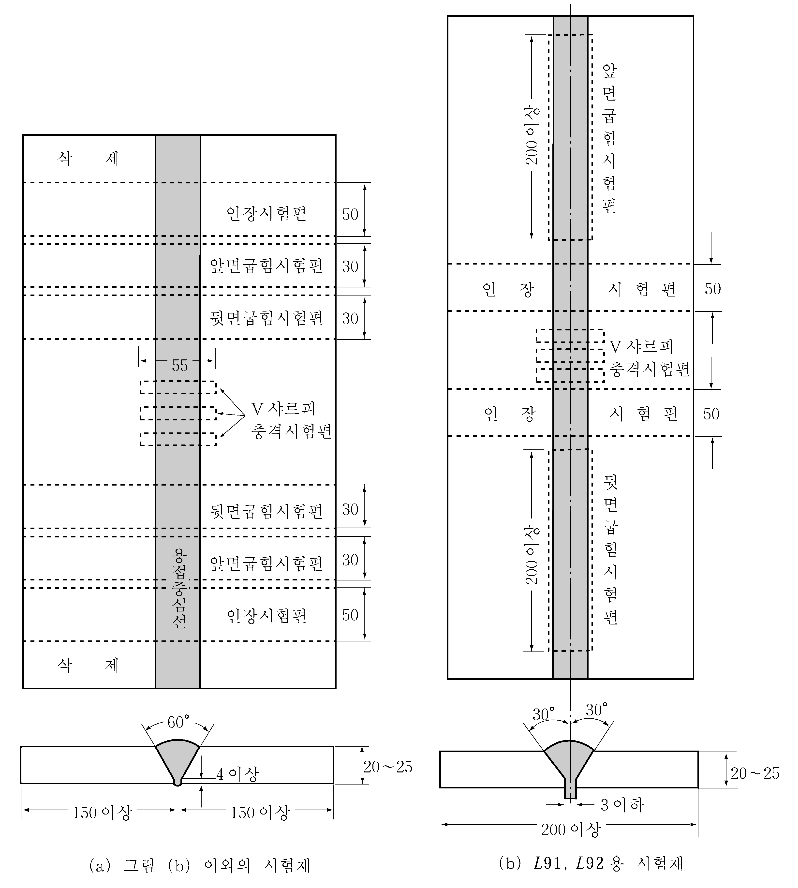
    **그림 2.2.29 다층 용접법의 맞대기용접 시험재 (자동용접, 단위 :** #eqnID-1151**)**

    **표 2.2.41 맞대기용접 인장시험 및 충격시험의 규격치** ***(2017) (2021)***

    | 용접용재료의 종류 | 인장강도 ($\mathrm{N}/mm ^{2}$) | 충격시험 |   |
    | --- | --- | --- | --- |
    | 용접용재료의 종류 | 인장강도 ($\mathrm{N}/mm ^{2}$) | 시험온도 (℃) | 평균흡수에너지 (J) |
    | 1 | 400 이상 | 20 | 34 이상 |
    | 2 | 400 이상 | 0 | 34 이상 |
    | 3 | 400 이상 | －20 | 34 이상 |
    | 1*Y* | 490 이상 | 20 | 34 이상 |
    | 2*Y* | 490 이상 | 0 | 34 이상 |
    | 3*Y* | 490 이상 | －20 | 34 이상 |
    | 4*Y* | 490 이상 | －40 | 34 이상 |
    | 5*Y* | 490 이상 | -60 | 34 이상 |
    | 2*Y*40 | 510 이상 | 0 | 39 이상 |
    | 3*Y*40 | 510 이상 | －20 | 39 이상 |
    | 4*Y*40 | 510 이상 | －40 | 39 이상 |
    | 5*Y*40 | 510 이상 | -60 | 39 이상 |
    | 3*Y*47 | 570 이상 | －20 | 64 이상 |
    | *L* 1 | 400 이상 | －40 | 27 이상 |
    | *L* 2 | 440 이상 | －60 | 27 이상 |
    | *L* 3 | 490 이상 | －60 | 27 이상 |
    | *L* 51 | 530 이상 | －120 | 27 이상 |
    | *L* 91 | 630 이상 | －196 | 27 이상 |
    - **(가)** 각 시험재로부터 **표 2.2.1**의 *R* 2*A*호 인장시험편 2개를 채취한다.
    - **(나)** 용접부는 모재면까지 다듬질한다.
    - **(다)** 시험편의 인장강도는 **표 2.2.41**에 따른다.
  - **(3)** **다층 용접법의 맞대기용접 굽힘시험**
    - **(가)** 각 시험재로부터 **표 2.2.2**의 *RB* 4호 앞면굽힘 및 뒷면굽힘시험편 각 2개를 채취한다. 다만, *L* 91에 대하여는 **표 2.2.2**의 *RB* 1호 앞면굽힘 및 뒷면굽힘시험편 각 1개를 세로방향으로 채취한다. *(2017)*
    - **(나)** 시험편은 판두께의 1.5배(3*Y*47은 2배)에 상당하는 안쪽반지름을 갖는 플런저로 앞면굽힘 또는 뒷면굽힘을 하고 굽힘각도가 120${}^{\circ}$ 이상에 도달하여도 시험편의 표면에 3 mm를 넘는 균열 또는 기타의 결함이 생겨서는 안 된다. 다만, *L* 91에 대한 굽힘의 안쪽반지름은 판두께의 2배로 하고 굽힘각도는 180°로 한다. *(2017) (2021)*
  - **(4)** **다층 용접법의 맞대기용접 충격시험**
    - **(가)** 각 시험재로부터 **표 2.1.3**의 샤르피 V-노치 충격시험편 1조(3개)를 기계절단으로 채취한다. 또한 시험편의 길이 방향을 용접선에 직각으로 하고 **그림 2.2.23**에 따라 시험재 두께의 1/2위치와 시험편의 중심선이 일치하도록 한다.
    - **(나)** 시험온도 및 평균흡수에너지값은 **표 2.2.41**에 따른다.
    - **(다)** **4**항 (4)호 (다) 및 (라)의 규정을 이 항에도 적용한다.
- **6.** **양면 일층용접법의 맞대기용접시험**
  - **(1)** **양면 일층용접법의 맞대기용접 시험재**
    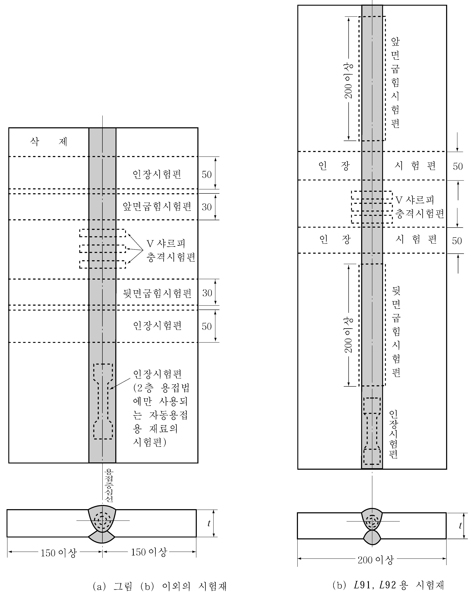
    **그림 2.2.30 양면 일층용접법의 맞대기용접 시험재 (자동용접,** *t* **: 판두께, 단위: mm)**
    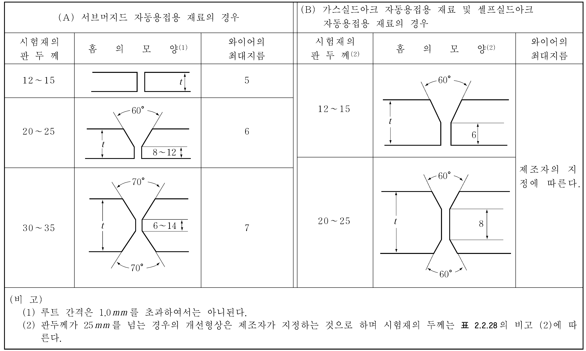
    **그림 2.2.31 양면 일층용접법의 홈의 모양 (**#eqnID-1154 **: 판두께, 단위 : mm)**
    - **(가)** 시험재의 치수는 **그림 2.2.30**에 따르고 개선형상 및 사용하는 용접와이어의 지름은 **그림 2.2.31**에 따른다. 다만, 우리 선급의 승인을 받아 이를 변경할 수 있다.
    - **(나)** 시험재의 용접은 보통의 방법으로 아래보기 자세에서 양측에서 각각 1패스씩 용접하고 첫 번째 층의 용접 종료 후 용접선의 중앙의 이음부 표면에서 계측한 온도가 100℃ 이하가 될 때까지 대기중에서 냉각한다.
  - **(2)** **화학성분** 제조자는 각 시험재에 대하여 용착금속의 화학성분을 분석하고 그 결과를 우리 선급에 제출하여야 한다. 또한 화학성분에는 주요 합금원소를 포함하여야 한다.
  - **(3)** **양면 일층용접법의 맞대기용접 인장시험**
    - **(가)** 각 시험재로부터 **표 2.2.1**의 *R* 2*A*호 인장시험편 2개를 채취한다.
    - **(나)** 용접부는 모재면까지 다듬질한다.
    - **(다)** 시험편의 인장강도는 **표 2.2.41**에 따른다.
    - **(라)** **표 2.2.38**의 2개의 시험재 중 판 두께가 두꺼운 쪽의 시험재에서 다시 **표 2.2.1**의 *R* 14A호 세로방향 인장시험편 1개를 채취한다. 또한 이 시험편의 세로축 중심선은 시험재의 용접중심선과 최종 층의 두께중심에 일치하여야 한다.
    - **(마)** (라)에 규정하는 세로방향의 인장시험편은 수소제거를 위하여 시험을 하기 전에 16시간을 초과하지 않는 범위 내에서 250℃를 넘지 않게 가열하여도 좋다.
    - **(바)** (라) 및 (마)에 규정하는 인장시험의 규격치는 **표 2.2.40**에 따른다. 다만, 인장강도가 규격치의 상한을 넘는 것에 대하여는 기타의 기계적성질 및 용착금속의 화학성분을 고려하여 합격으로 할 수 있다.
  - **(4)** **양면 일층용접법의 맞대기용접 굽힘시험**
    - **(가)** 각 시험재로부터 **표 2.2.2**의 *RB* 4 또는 *RB* 5호 앞면굽힘 및 뒷면굽힘시험편을 각각 1개씩 채취한다. 다만, *L* 91에 대하여는 **표 2.2.2**의 *RB* 1호 앞면굽힘 및 뒷면굽힘시험편 각 1개를 세로방향으로 채취한다. (2017)
    - **(나)** **5**항 (3)호 (나)의 규정을 이 항에도 적용한다.
  - **(5)** **양면 일층용접법의 맞대기용접 충격시험**
    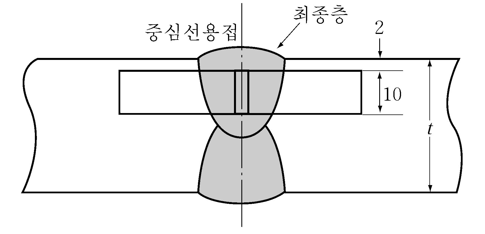
    **그림 2.2.32 양면 일층용접법의 맞대기용접 충격시험편 채취 위치** (*t* : 판두께, 단위 : $\mathrm{mm}$)
    - **(가)** 각 시험재로부터 **표 2.1.3**의 샤르피 V-노치 충격시험편 1조(3개)를 기계절단으로 채취한다. 또한 시험편의 길이방향을 용접선에 직각으로 하고 **그림 2.2.32**와 같이 시험재의 표면으로부터 2 mm 떨어진 위치와 시험편의 표면이 일치하도록 한다.
    - **(나)** 시험온도 및 평균흡수에너지값은 **표 2.2.41**에 따른다.
    - **(다)** **4**항 (4)호 (다) 및 (라)의 규정을 이 항에도 적용한다.
- **7.** **수소시험** 수소시험은 **602.**의 **6**항에 따른다.
- **8.** **정기검사**
  - **(1)** 정기검사시에는 승인된 품목마다 다음 (2)호에 규정하는 시험을 하고 이에 합격하여야 한다.
  - **(2)** 정기검사에 관한 시험의 종류 등은 **표 2.2.42**에 따른다.
  - **(3)** (2)호에서 규정하는 시험의 시험재에 대한 용접방법 및 규격은 **4**항부터 **6**항까지에 따른다.

    **표 2.2.42 시험의 종류** ***(2017)*** ***(******2021)***

    | 용접용재료의 종류 | 용접법(1) | 시험의 종류 |   | 시험재 |   |   | 각 시험재로부터 채취하는 시험편의 종류 및 개수 |
    | --- | --- | --- | --- | --- | --- | --- | --- |
    | 용접용재료의 종류 | 용접법(1) | 시험의 종류 |   | 개수 | 모양 및 치수 | 판두께(mm) | 각 시험재로부터 채취하는 시험편의 종류 및 개수 |
    | 1, 2, 3 1*Y,* 2*Y,* 3*Y,* 4*Y,* 5*Y* 2*Y*40, 3*Y*40, 4*Y*40, 5*Y*40, 3*Y*47 *L* 1, *L* 2, *L* 3 *L* 51, *L* 91 | 다층용접법 | 용착금속시험 |   | 1 | **그림 2.2.28** | 20 | 인장시험편 : 1개 충격시험편 : 1조(3개) |
    | 1, 2, 3 1*Y,* 2*Y,* 3*Y,* 4*Y,* 5*Y* 2*Y*40, 3*Y*40, 4*Y*40, 5*Y*40, 3*Y*47 *L* 1, *L* 2, *L* 3 *L* 51, *L* 91 | 양면 일층 용접법 | 맞대기 용접시험 | 서브머지드 아크 자동용접 | 1 | **그림 2.2.30** | 20 | 인장시험편 : 1개 세로방향인장시험편 : 1개 앞면굽힘시험편 : 1개 뒷면굽힘시험편 : 1개 충격시험편 : 1조(3개) |
    | 1, 2, 3 1*Y,* 2*Y,* 3*Y,* 4*Y,* 5*Y* 2*Y*40, 3*Y*40, 4*Y*40, 5*Y*40, 3*Y*47 *L* 1, *L* 2, *L* 3 *L* 51, *L* 91 | 양면 일층 용접법 | 맞대기 용접시험 | 가스실드 아크 및 셀프실드 아크 자동용접 | 1 | **그림 2.2.30** | 20∼25 | 인장시험편 : 1개 세로방향인장시험편 : 1개 앞면굽힘시험편 : 1개 뒷면굽힘시험편 : 1개 충격시험편 : 1조(3개) |
    | (비고) (1) 다층 및 양면 일층용접법 겸용의 자동용접용재료에 대하여는 다층 및 이층 용접법의 양쪽에 대한 시험을 모두 한다. 다만, 양면 일층용접법의 세로방향 인장시험은 생략한다. |   |   |   |   |   |   |   |
- **9.** **종류의 변경**
  - **(1)** 승인된 용접용재료의 강도나 인성에 관한 종류의 변경을 하는 경우에는 **601.**의 **6**항 (3)호의 규정에 따라 다름 각 호에 규정하는 시험을 하고 이에 합격하여야 한다.
  - **(2)** 다층 서브머지드 아크 용접용재료의 강도나 인성에 관한 종류의 변경에 대하여는 다음 (가) 및 (나)에 따른다.
    - **(가)** 강도에 관한 종류의 변경에 대하여는 **8**항의 정기검사 및 **3**항 (1)호에 규정하는 맞대기용접 시험을 한다.
    - **(나)** 인성에 관한 종류의 변경에 대하여는 **8**항의 정기검사 및 **3**항 (1)호에 규정하는 맞대기용접 시험 중 충격시험만을 한다.
  - **(3)** 양면 일층서브머지드 아크 용접용재료의 강도나 인성에 관한 종류의 변경에 대하여는 다음 (가) 및 (나)에 따른다.
    - **(가)** 강도에 관한 종류의 변경에 대하여는 **3**항 (1)호에 규정하는 모든 시험을 한다.
    - **(나)** 인성에 관한 종류의 변경에 대하여는 **8**항의 정기검사 및 전 (가)에 규정한 맞대기용접 시험 중 충격시험만을 한다.
  - **(4)** 다층 및 양면 일층용접 겸용의 서브머지드 아크 용접용재료의 강도나 인성에 관한 종류의 변경은 (2)호 및 (3)호의 규정에 따른다.

#### 604. 연강, 고장력강 및 저온용강의 반자동 용접용재료

- **1.** **적용**
  다음 (가) 및 (나)의 연강, 고장력강 및 저온용강용 반자동 용접용재료(이하 **반자동 용접용재료**라 한다)에 대한 승인시험 및 정기검사는 **604.**의 규정에 따른다.
- **2.** **종류 및 기호**
  - **(1)** 반자동 용접용재료의 종류 및 기호는 **표 2.2.43**에 따른다.

    **표 2.2.43 종류 및 기호** ***(2017) (2021)***

    | 연강용 | 고장력강용 | 저온용강용 |
    | --- | --- | --- |
    | 1, 2, 3 | 1*Y,* 2*Y*, 3*Y,* 4*Y,* 5*Y,* 2*Y*40, 3*Y*40, 4*Y*40, 5*Y*40, 3*Y*47 | *L* 1, *L* 2, *L* 3, *L* 51, *L* 91 |
  - **(2)** **표 2.2.37**의 시험에 합격한 반자동 용접용재료에는 승인되었음을 나타내기 위하여 그 기호의 뒤에 *S*를 부기한다. 또한 자동 및 반자동 겸용 와이어의 경우에는 각각의 기호를 조합해서 부기한다.(예 : 3*YSM*)
  - **(3)** 가스를 사용하는 가스실드 아크 용접용재료는 그 기호의 뒤에 *G*, 가스를 사용하지 아니하는 셀프실드 아크 용접용재료에는 *N*을 부기한다. 또한, 사용하는 가스의 종류는 **표 2.2.37**에 따르고 그에 속하는 구분기호를 표시기호 *G* 다음에 부기한다. (예 : 3*YSG*(*M*1))
  - **(4)** 저수소계 용접용재료로서 **602**.의 **6**항에 규정하는 수소시험에 합격한 것에는 해당 용접용재료의 기호 뒤에 **표 2.2.32**의 표시기호를 부착한다. (예 : 3*YS H5*)
- **3.** **시험일반**
  - **(1)** 맞대기용접 전용 또는 맞대기 및 필릿용접 겸용 반자동 용접용재료에 대한 시험의 종류, 시험재의 갯수, 판두께, 모양 및 치수, 시험재의 용접에 사용하는 반자동 용접용재료의 와이어지름, 용접자세 그리고 각 시험재로부터 채취하는 시험편의 종류와 개수는 **표 2.2.44**에 따른다.

    **표 2.2.44 반자동용접용재료의 시험의 종류**

    | 시험의 종류(8) | 시 험 재 |   |   |   |   | 각 시험재로부터 채취하는 시험편의 종류 및 개수 |
    | --- | --- | --- | --- | --- | --- | --- |
    | 시험의 종류(8) | 용접자세 | 용접와이어의 지름(mm) | 개수 | 모양 및 치수 | 판두께 (mm) | 각 시험재로부터 채취하는 시험편의 종류 및 개수 |
    | 용착금속 시험 | 아래보기 | 최대지름 | 1(1) | **그림 2.2.22** | 20 | 인장시험편 : 1개 충격시험편 : 1조(3개) |
    | 용착금속 시험 | 아래보기 | 최소지름 | 1(1) | **그림 2.2.22** | 20 | 인장시험편 : 1개 충격시험편 : 1조(3개) |
    | 맞대기 용접시험 | 아래보기 | 최초의 층 : 최소지름 나머지 층 : 최대지름(4) | 1(2) | **그림 2.2.24** | 15∼20 | 인장시험편 : 1개 앞면굽힘시험편 : 1개 뒷면굽힘시험편 : 1개 충격시험편 : 1조(3개)(3) |
    | 맞대기 용접시험 | 수평(5) | 최초의 층 : 최소지름 나머지 층 : 최대지름(4) | 1 | **그림 2.2.24** | 15∼20 | 인장시험편 : 1개 앞면굽힘시험편 : 1개 뒷면굽힘시험편 : 1개 충격시험편 : 1조(3개)(3) |
    | 맞대기 용접시험 | 수직상진 | 최초의 층 : 최소지름 나머지 층 : 최대지름(4) | 1 | **그림 2.2.24** | 15∼20 | 인장시험편 : 1개 앞면굽힘시험편 : 1개 뒷면굽힘시험편 : 1개 충격시험편 : 1조(3개)(3) |
    | 맞대기 용접시험 | 수직하진 | 최초의 층 : 최소지름 나머지 층 : 최대지름(4) | 1 | **그림 2.2.24** | 15∼20 | 인장시험편 : 1개 앞면굽힘시험편 : 1개 뒷면굽힘시험편 : 1개 충격시험편 : 1조(3개)(3) |
    | 맞대기 용접시험 | 위보기 | 최초의 층 : 최소지름 나머지 층 : 최대지름(4) | 1 | **그림 2.2.24** | 15∼20 | 인장시험편 : 1개 앞면굽힘시험편 : 1개 뒷면굽힘시험편 : 1개 충격시험편 : 1조(3개)(3) |
    | 필릿용접시험(6) | 수평 | 편측 : 최대지름 반대측 : 최소지름 | 1 | **그림 2.2.25** | 20 | 매크로조직시험편 : 3개(7) 경도시험편 : 3개(7) 파면시험편 : 2개 |
    | (비고) (1) 제조하는 용접와이어의 지름이 1종류뿐인 경우 시험재는 1개로 한다. (2) 아래보기 용접자세만으로 시험을 하는 경우에는 다른 지름의 용접와이어로 용접한 시험재 1개를 추가한다. 또한 제조하는 용접와이어의 지름이 1종류뿐인 경우 시험재는 1개로 한다. (3) 위보기 용접자세에 대하여는 충격시험을 생략한다. (4) 아래보기 이외의 용접자세에서의 맞대기용접시험재는 첫 번째 층은 최소지름의 용접와이어로, 나머지는 용접자세와 관련하여 제조자가 권고하는 최대지름의 용접와이어로 용접한다. (5) 아래보기 및 수직상진의 맞대기용접 시험에 합격한 반자동용접용재료는 우리 선급의 승인을 받아 수평자세의 시험을 생략할 수 있다. (6) 맞대기 및 필릿용접 겸용의 반자동용접용재료에 대해서만 이 시험을 추가한다. (7) 매크로조직시험 및 경도시험에 사용하는 시험편은 동일한 것으로 한다. (8) 저수소계 용접용재료의 경우 제조자의 신청에 따라 수소시험을 할 수 있으며 시험재는 **602.**의 **6**항 (1)호에 따른다. |   |   |   |   |   |   |
  - **(2)** 필릿용접 전용의 반자동용접용재료에 대한 시험의 종류, 시험재의 개수, 판두께, 모양 및 치수, 시험재의 용접에 사용하는 와이어의 지름, 용접자세 그리고 각 시험재로부터 채취하는 시험편의 종류와 개수는 **표 2.2.27**에 따른다.
  - **(3)** 시험재로 사용되는 강판은 반자동용접용재료의 종류에 따라서 **표 2.2.45**에 따른다.

    **표 2.2.45 시험재로 사용되는 강판의 종류** ***(2017) (2021)***

    | 용접용재료의 종류 | 시험재로 사용되는 강판의 종류(1)(2) |
    | --- | --- |
    | 1*S* | *A* |
    | 2*S* | *A*, *B* 또는 *D* |
    | 3*S* | *A*, *B*, *D* 또는 *E* |
    | 1*YS* | *AH* 32 또는 *AH* 36 |
    | 2*YS* | *AH* 32, *AH* 36, *DH* 32 또는 *DH* 36 |
    | 3*YS* | *AH* 32, *AH* 36, *DH* 32, *DH* 36, *EH* 32 또는 *EH* 36 |
    | 4*YS* | *AH* 32, *AH* 36, *DH* 32, *DH* 36, *EH* 32, *EH* 36, *FH* 32 또는 *FH* 36 |
    | 5*YS* | *AH* 32, *AH* 36, *DH* 32, *DH* 36, *EH* 32, *EH* 36, *FH* 32 또는 *FH* 36 |
    | 2*Y*40*S* | *AH* 40 또는 *DH* 40 |
    | 3*Y*40*S* | *AH* 40, *DH* 40 또는 *EH* 40 |
    | 4*Y*40*S* | *AH* 40, *DH* 40, *EH* 40 또는 *FH* 40 |
    | 5*Y*40*S* | *AH* 40, *DH* 40, *EH* 40 또는 *FH* 40 |
    | 3*Y*47*S* | *EH* 47-*H* |
    | *L* 1*S* | *E* 또는 *RL* 235*A* |
    | *L* 2*S* | *E*, *RL* 235*A*, *RL* 235*B*, *RL* 325*A* 또는 *RL*325*B* |
    | *L* 3*S* | *RL* 325*A*, *RL* 325*B* 또는 *RL* 355 |
    | *L* 51*S* | *RL* 5*N*390 |
    | *L* 91*S* | *RL* 9*N*490 |
    | (비고) (1) 용착금속 시험재에는 이 표의 규정에 관계없이 연강 또는 고장력강을 사용할 수 있다. 이 경우 *L* 91의 시험재에 대하여는 적절한 버터링을 한 것이어야 한다. (2) 맞대기용접 시험재로 사용되는 *AH* 32, *DH* 32, *EH* 32 및 *FH* 32 고장력강의 인장강도는 490 $\mathrm{N}/mm ^{2}$ 이상이어야 한다. |   |
  - **(4)** 반자동용접용재료의 승인시험은 품목마다 (1)호 및 (2)호에 규정하는 시험을 하고 이에 합격하여야 한다.
  - **(5)** 가스를 사용하는 반자동용접용재료는 **표 2.2.37**의 가스의 종류 중 제조자가 지정하는 것마다 (4)호의 시험을 한다. 다만, 제조자가 **표 2.2.37**의 구분기호 *M* 1, *M* 2, *M* 3 또는 *C*에 포함되는 가스를 지정하는 경우에는 어느 한 종류의 가스에 대하여 (4)호의 시험을 하고 이에 만족하면 동일 구분내 다른 종류의 가스에 대하여는 우리 선급의 승인을 받아 시험을 생략할 수 있다.
  - **(6)** 용접전류, 용접전압 및 용접속도 등 용접조건은 제조자가 지정하는 범위내로 한다. 또한 교류 및 직류 겸용인 것에 대하여는 교류를 사용한다.
  - **(7)** 용접 후 시험재에는 어떠한 열처리도 하여서는 안 된다.
  - **(8)** 용접된 시험재는 시험을 하기 전에 용접부에 결함이 없는 것을 확인하기 위하여 용접선의 전반에 걸쳐 방사선투과검사를 할 수 있다.
- **4.** **용착금속 시험**
  - **(1)** **용착금속 시험재**
    - **(가)** 시험재의 치수는 **그림 2.2.22**에 따르며 아래보기 용접자세에서 보통의 방법으로 용접한다.
    - **(나)** 각 층은 1패스 또는 여러 패스 중 어느 방법으로 용접하여도 좋으나 각 층의 용접진행방향은 층마다 서로 바꾸어야 한다. 또한 각 층의 두께는 2 mm 이상으로 하고 6 mm를 넘어서는 안 된다.
    - **(다)** 시험재는 각 패스마다 용접선 중앙의 이음표면에서 계측한 온도가 100℃ 이상 250℃ 이하가 될 때까지 대기중에서 냉각한다.
  - **(2)** **화학성분** 제조자는 각 시험재에 대하여 용착금속의 화학성분을 분석하고 그 결과를 우리 선급에 제출하여야 한다. 또한 화학성분에는 주요 합금원소를 포함하여야 한다.
  - **(3)** **용착금속 인장시험**

    **표 2.2.46 용착금속 인장시험 및 충격시험의 규격치** ***(2017) (2021)***

    | 용접용재료의 종류 | 인장강도 ($\mathrm{N}/mm ^{2}$) | 항복강도 ($\mathrm{N}/mm ^{2}$) | 연 신 율 ($\%$) | 충격시험 |   |
    | --- | --- | --- | --- | --- | --- |
    | 용접용재료의 종류 | 인장강도 ($\mathrm{N}/mm ^{2}$) | 항복강도 ($\mathrm{N}/mm ^{2}$) | 연 신 율 ($\%$) | 시험온도 (℃) | 평균흡수에너지 (J) |
    | 1*S* | 400 ∼ 560 | 305 이상 | 22 이상 | 20 | 47 이상 |
    | 2*S* | 400 ∼ 560 | 305 이상 | 22 이상 | 0 | 47 이상 |
    | 3*S* | 400 ∼ 560 | 305 이상 | 22 이상 | －20 | 47 이상 |
    | 1*YS* | 490 ∼ 660 | 375 이상 | 22 이상 | 20 | 47 이상 |
    | 2*YS* | 490 ∼ 660 | 375 이상 | 22 이상 | 0 | 47 이상 |
    | 3*YS* | 490 ∼ 660 | 375 이상 | 22 이상 | －20 | 47 이상 |
    | 4*YS* | 490 ∼ 660 | 375 이상 | 22 이상 | －40 | 47 이상 |
    | 5*YS* | 490 ∼ 660 | 375 이상 | 22 이상 | -60 | 47 이상 |
    | 2*Y*40*S* | 510 ∼ 690 | 400 이상 | 22이상 | 0 | 47 이상 |
    | 3*Y*40*S* | 510 ∼ 690 | 400 이상 | 22이상 | －20 | 47 이상 |
    | 4*Y*40*S* | 510 ∼ 690 | 400 이상 | 22이상 | －40 | 47 이상 |
    | 5*Y*40*S* | 510 ∼ 690 | 400 이상 | 22이상 | -60 | 47 이상 |
    | 3*Y*47*S* | 570 ∼ 720 | 460 이상 | 19 이상 | －20 | 64 이상 |
    | *L* 1*S* | 400 ∼ 560 | 305 이상 | 22 이상 | －40 | 34 이상 |
    | *L* 2*S* | 440 ∼ 610 | 345 이상 | 22 이상 | －60 | 34 이상 |
    | *L* 3*S* | 490 ∼ 660 | 375 이상 | 21 이상 | －60 | 34 이상 |
    | *L* 51*S* | 530 이상 | 375 이상(1) | 25 이상 | －120 | 27 이상 |
    | *L* 91*S* | 590 이상 | 375 이상(1) | 25 이상 | －196 | 27 이상 |
    | (비고) (1) 0.2 % 항복강도로 한다. |   |   |   |   |   |
    - **(가)** 각 시험재로부터 **표 2.2.1**의 *R* 14A호 인장시험편 1개를 채취한다. 시험편의 다듬질은 기계다듬질로 하고 시험편의 세로축 중심선이 시험재의 용접중심선과 판두께의 중심에 일치하여야 한다.
    - **(나)** 인장시험편은 수소 제거를 위하여 시험을 하기 전에 16시간을 초과하지 않는 범위내에서 250℃를 넘지 않게 가열하여도 좋다.
    - **(다)** 각 시험편의 인장강도, 항복강도 및 연신율은 **표 2.2.46**에 따른다. 다만, 인장강도가 규격치의 상한을 넘는 것에 대하여는 기타의 기계적성질 및 용착금속의 화학성분을 고려하여 합격으로 할 수 있다.
  - **(4)** **용착금속 충격시험**
    - **(가)** 각 시험재로부터 **표 2.1.3**의 샤르피 V-노치 충격시험편 1조(3개)를 기계절단으로 채취한다. 또한 시험편의 길이방향을 용접선에 직각으로 하고 **그림 2.2.23**에 따라 시험재 두께의 1/2 위치와 시험편의 중심선이 일치하도록 한다.
    - **(나)** 시험온도 및 평균흡수에너지값은 **표 2.2.46**에 따른다.
    - **(다)** 시험편의 노치는 용접선의 중심과 일치시키고 노치의 길이방향을 시험재의 표면에 수직으로 한다.
    - **(라)** 1조의 시험편 중에서 2개 이상이 규정의 평균흡수에너지값 미만이거나 어느 한 개라도 규정의 평균흡수에너지값의 70 $\%$ 미만인 경우는 불합격으로 한다.
- **5.** **맞대기용접 시험**
  - **(1)** **맞대기용접 시험재**
    - **(가)** 시험재의 치수는 **그림 2.2.24**에 따르고 제조자가 지정하는 각 용접자세(아래보기, 수평, 수직상진, 수직하진 및 위보기)로 용접한다.
    - **(나)** 시험재는 각 패스마다 용접선 중앙의 이음표면에서 계측한 온도가 100℃ 이상 250℃ 이하가 될 때까지 대기 중에서 냉각한다.
  - **(2)** **맞대기용접 인장시험**

    **표 2.2.47 맞대기용접 인장시험 및 충격시험의 규격치** ***(2017) (2021)***

    | 용접용재료의 종류 | 인장강도 ($\mathrm{N}/mm ^{2}$) | 충격시험 |   |   |
    | --- | --- | --- | --- | --- |
    | 용접용재료의 종류 | 인장강도 ($\mathrm{N}/mm ^{2}$) | 시험온도 (℃) | 평균흡수에너지 (J) |   |
    | 용접용재료의 종류 | 인장강도 ($\mathrm{N}/mm ^{2}$) | 시험온도 (℃) | 아래보기, 수평, 위보기 | 수직상진, 수직하진 |
    | 1*S* | 400 이상 | 20 | 47 이상 | 34 이상 |
    | 2*S* | 400 이상 | 0 | 47 이상 | 34 이상 |
    | 3*S* | 400 이상 | －20 | 47 이상 | 34 이상 |
    | 1*YS* | 490 이상 | 20 | 47 이상 | 34 이상 |
    | 2*YS* | 490 이상 | 0 | 47 이상 | 34 이상 |
    | 3*YS* | 490 이상 | －20 | 47 이상 | 34 이상 |
    | 4*YS* | 490 이상 | －40 | 47 이상 | 34 이상 |
    | 5*YS* | 490 이상 | -60 | 47 이상 | 34 이상 |
    | 2*Y*40*S* | 510 이상 | 0 | 47 이상 | 39 이상 |
    | 3*Y*40*S* | 510 이상 | －20 | 47 이상 | 39 이상 |
    | 4*Y*40*S* | 510 이상 | －40 | 47 이상 | 39 이상 |
    | 5*Y*40*S* | 510 이상 | -60 | 47 이상 | 39 이상 |
    | 3*Y*47*S* | 570 이상 | －20 | 64 이상 | 64 이상 |
    | *L* 1*S* | 400 이상 | －40 | 27 이상 | 27 이상 |
    | *L* 2*S* | 440 이상 | －60 | 27 이상 | 27 이상 |
    | *L* 3*S* | 490 이상 | －60 | 27 이상 | 27 이상 |
    | *L* 51*S* | 530 이상 | －120 | 27 이상 | 27 이상 |
    | *L* 91*S* | 630 이상 | －196 | 27 이상 | 27 이상 |
    - **(가)** 각 시험재로부터 **표 2.2.1**의 *R* 2*A*호 인장시험편 1개를 채취한다.
    - **(나)** 용접부는 모재면까지 다듬질한다.
    - **(다)** 시험편의 인장강도는 **표 2.2.47**에 따른다.
  - **(3)** **맞대기용접 굽힘시험**
    - **(가)** 각 시험재로부터 **표 2.2.2**의 *RB* 4호 앞면굽힘 및 뒷면굽힘 시험편 각 1개를 채취한다. 다만, *L* 91에 대하여는 **표 2.2.2**의 *RB* 1호 앞면굽힘 및 뒷면굽힘 시험편 각 1개를 세로방향으로 채취한다. *(2017)*
    - **(나)** 시험편은 판두께의 1.5배(3*Y*47은 2배)에 상당하는 안쪽반지름을 갖는 플런저로 앞면굽힘 또는 뒷면굽힘을 하고 굽힘각도가 120${}^{\circ}$ 이상에 도달하여도 시험편의 표면에 3 mm를 넘는 균열 또는 기타의 결함이 생겨서는 안 된다. 다만, *L* 91에 대한 굽힘의 안쪽반지름은 판두께의 2배로 하고 굽힘각도는 180${}^{\circ}$로 한다. *(2017) (2021)*
  - **(4)** **맞대기용접 충격시험**
    - **(가)** 각 시험재로부터 **표 2.1.3**의 샤르피 V-노치 충격시험편 1조(3개)를 기계절단으로 채취한다. 또한 시험편의 길이방향을 용접선에 직각으로 하고 **그림 2.2.23**에 따라 시험재 두께의 1/2 위치와 시험편의 중심선이 일치하도록 한다.
    - **(나)** 시험온도 및 평균흡수에너지값은 **표 2.2.47**에 따른다.
    - **(다)** **4**항 (4)호 (다) 및 (라)의 규정을 이 항에도 적용한다.
- **6.** **필릿용접 시험**
  - **(1)** **필릿용접 시험재** 시험재는 **602.**의 **7**항 (1)호의 규정을 준용한다.
  - **(2)** **필릿용접의 매크로조직시험** 매크로조직시험은 **602.**의 **7**항 (2)호의 규정을 준용한다.
  - **(3)** **필릿용접의 경도시험** 경도시험은 **602.**의 **7**항 (3)호의 규정을 준용한다.
  - **(4)** **필릿용접의 파면시험** 파면시험은 **602.**의 **7**항 (4)호의 규정을 준용한다.
- **7.** **수소시험** 용접용재료 기호 2S, 2YS, 2Y40S, 3S, 3YS, 3Y40S, 4YS 또는 4Y40S의 요건에 적합한 플럭스코어드 와이어 또는 플럭스피복 와이어는 제조자의 요청이 있는 경우, 제조자가 권고하는 용접조건을 사용해서 그리고 수동용접봉을 사용할 때 용착된 것과 유사하게 용착금속의 무게를 주기 위하여 용착속도를 조정하여 **602.**의 **6**항에 따라 수소시험을 할 수 있다.
- **8.** **정기검사**
  - **(1)** 정기검사 시에는 승인된 품목마다 다음 (2)호에 규정하는 시험을 하고 이에 합격하여야 한다.
  - **(2)** 정기검사에 관한 시험의 종류 등은 **표 2.2.48**에 따른다.

    **표 2.2.48 시험의 종류**

    | 시험의 종류 | 시 험 재 |   |   |   |   | 각 시험재로부터 채취하는 시험편의 종류 및 개수 |
    | --- | --- | --- | --- | --- | --- | --- |
    | 시험의 종류 | 용접자세 | 와이어의 지름 (mm) | 개수 | 모양 및 치수 | 판두께 (mm) | 각 시험재로부터 채취하는 시험편의 종류 및 개수 |
    | 용착금속 시험 | 아래보기 | (1) | 1 | **그림 2.2.22** | 20 | 인장시험편 : 1개 충격시험편 : 1조(3개) |
    | (비고) (1) 와이어의 지름은 제조자가 지정하는 범위내로 한다. |   |   |   |   |   |   |
  - **(3)** (2)호에서 규정하는 시험의 시험재에 대한 용접방법 및 규격은 **4**항에 따른다.
- **9.** **종류의 변경**
  - **(1)** 승인된 용접용재료의 강도나 인성 또는 수소함량에 관한 종류의 변경을 하는 경우에는 **601.**의 **6**항 (3)호의 규정에 따라 다음 각 호에 규정하는 시험을 하고 이에 합격하여야 한다. (2017)
  - **(2)** 강도에 관한 종류의 변경에 대하여는 **8**항의 정기검사 및 **3**항 (1)호에 규정하는 맞대기용접 시험을 한다.
  - **(3)** 인성에 관한 종류의 변경에 대하여는 **8**항의 정기검사 및 **3**항 (1)호에 규정하는 맞대기용접 시험중 충격시험만을 한다.
  - **(4)** 수소함량에 관한 종류의 변경에 대하여는 **8**항의 정기검사 및 **3**항 (1)호에 규정하는 수소시험을 한다. *(2017)*

#### 605. 일렉트로 슬래그 및 일렉트로 가스 용접용재료

- **1.** **적용** 연강 및 고장력강의 일렉트로 슬래그 및 일렉트로 가스 용접용재료(이하 **용접용재료**라 한다)에 대한 승인시험 및 정기검사는 **605.**의 규정에 따른다.
- **2.** **종류 및 기호** 용접용재료의 종류 및 기호는 **표 2.2.49**에 따른다.

  **표 2.2.49 종류 및 기호** ***(2021)***

  | 연강용 | 고장력강용 |
  | --- | --- |
  | 1*V*, 2*V*, 3*V* | 1*YV,* 2*YV*, 3*YV,* 4*YV,* 5*YV,* 2*Y*40*V*, 3*Y*40*V*, 4*Y*40*V*, 5*Y*40*V*, 3*Y*47*V* |
- **3.** **시험일반**
  - **(1)** 용접용재료에 대한 시험의 종류, 시험재의 갯수, 판두께, 모양 및 치수 그리고 각 시험재로부터 채취하는 시험편의 종류와 갯수는 **표 2.2.50**에 따른다.

    **표 2.2.50 일렉트로 슬래그 및 일렉트로 가스 용접용재료의 시험의 종류**

    | 시험의 종류 | 시 험 재(1) |   |   | 각 시험재로부터 채취하는 시험편의 종류 및 개수 |
    | --- | --- | --- | --- | --- |
    | 시험의 종류 | 개수 | 모양 및 치수 | 판두께(mm)(2) | 각 시험재로부터 채취하는 시험편의 종류 및 개수 |
    | 맞대기 용접시험 | 1 | **그림 2.2.33** | 20 ∼ 25 | 인장시험편 : 2개 세로방향인장시험편 : 2개 충격시험편 : 2조(6개) 측면굽힘시험편 : 2개 매크로조직시험편 : 2개 |
    | 맞대기 용접시험 | 1 | **그림 2.2.33** | 35 ∼ 40 | 인장시험편 : 2개 세로방향인장시험편 : 2개 충격시험편 : 2조(6개) 측면굽힘시험편 : 2개 매크로조직시험편 : 2개 |
    | (비고) (1) 연강 및 고장력강 겸용으로 승인 신청된 경우, 시험재는 고장력강으로 한다. 다만, 우리 선급이 적절하다고 인정하는 경우에는 연강을 사용할 수 있다. (2) 용접법과 관련하여 판두께에 제한이 있는 경우에는 우리 선급의 승인을 받아 시험재의 판두께를 변경할 수 있다. 이때에는 그 시험재의 두께를 최대두께로 한다. |   |   |   |   |
  - **(2)** 시험재로 사용되는 강판은 용접용재료의 종류에 따라서 **표 2.2.51**에 따른다.

    **표 2.2.51 시험재로 사용되는 강판의 종류** ***(2021)***

    | 용접용재료의 종류 | 시험재로 사용되는 강판의 종류(1)(2) |
    | --- | --- |
    | 1*V* | *A* |
    | 2*V* | *A*, *B* 또는 *D* |
    | 3*V* | *A*, *B*, *D* 또는 *E* |
    | 1*YV* | *AH* 32 또는 *AH* 36 |
    | 2*YV* | *AH* 32, *AH* 36, *DH* 32 또는 *DH* 36 |
    | 3*YV* | *AH* 32, *AH* 36, *DH* 32, *DH* 36, *EH* 32 또는 *EH* 36 |
    | 4*YV* | *AH* 32, *AH* 36, *DH* 32, *DH* 36, *EH* 32, *EH* 36, *FH* 32 또는 *FH* 36 |
    | 5*YV* | *AH* 32, *AH* 36, *DH* 32, *DH* 36, *EH* 32, *EH* 36, *FH* 32 또는 *FH* 36 |
    | 2*Y*40*V* | *AH* 40 또는 *DH* 40 |
    | 3*Y*40*V* | *AH* 40, *DH* 40 또는 *EH* 40 |
    | 4*Y*40*V* | *AH* 40, *DH* 40, *EH* 40 또는 *FH* 40 |
    | 5*Y*40*V* | *AH* 40, *DH* 40, *EH* 40 또는 *FH* 40 |
    | 3*Y*47*V* | *EH* 47-*H* |
    | (비고) (1) 시험재로 사용되는 *AH* 32, *DH* 32, *EH* 32 및 *FH* 32 고장력강의 인장강도는 490 $\mathrm{N}/mm ^{2}$ 이상이어야 한다. (2) 입자미세화원소의 함유량과 관련하여 특정한 고장력강에만 사용이 제한되는 경우, *Nb* 처리강이 승인시험에 사용된다. |   |
  - **(3)** 용접용재료의 승인시험은 품목마다 (1)호에 규정하는 시험을 하고 이에 합격하여야 한다.
  - **(4)** 용접전류, 용접전압 및 용접속도 등 용접조건은 제조자가 지정하는 범위내로 한다. 또한 교류 및 직류 겸용인 것에 대하여는 교류를 사용한다.
  - **(5)** 용접 후 시험재에는 어떠한 열처리도 하여서는 안 된다.
  - **(6)** 용접된 시험재는 시험을 하기 전에 용접부에 결함이 없는 것을 확인하기 위하여 용접선의 전반에 걸쳐 방사선투과검사를 할 수 있다.
- **4.** **맞대기용접 시험**
  - **(1)** **맞대기용접 시험재**
    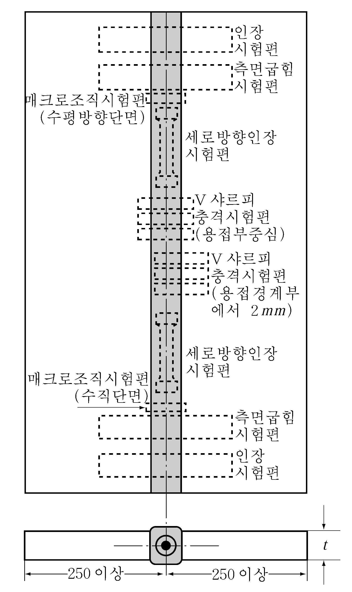
    **그림 2.2.33 일렉트로 슬래그 및 일렉트로 가스 용접용 맞대기용접 시험재 (**$t$ **: 판두께)**
    - **(가)** 시험재의 치수는 **그림 2.2.33**에 따르며 수직상진 자세에서 1패스 용접한다.
    - **(나)** 시험재의 용접조건, 홈의 모양 등은 제조자가 지정하는 범위내로 한다.
  - **(2)** **맞대기용접 인장시험**

    **표 2.2.52 맞 대기용접 인장시험 및 충격시험의 규격치** ***(2021)***

    | 용접용재료의 종류 | 가로방향 인장시험 | 세로방향 인장시험 |   |   | 충격시험 |   |
    | --- | --- | --- | --- | --- | --- | --- |
    | 용접용재료의 종류 | 인장강도 ($\mathrm{N}/mm ^{2}$) | 인장강도 ($\mathrm{N}/mm ^{2}$) | 항복강도 ($\mathrm{N}/mm ^{2}$) | 연신율 ($\%$) | 시험온도 (℃) | 평균흡수 에너지 (J) |
    | 1*V* | 400 이상 | 400 ∼ 560 | 305 이상 | 22 이상 | 20 | 34이상 |
    | 2*V* | 400 이상 | 400 ∼ 560 | 305 이상 | 22 이상 | 0 | 34이상 |
    | 3*V* | 400 이상 | 400 ∼ 560 | 305 이상 | 22 이상 | -20 | 34이상 |
    | 1*YV* | 490 이상 | 490 ∼ 660 | 375 이상 | 22 이상 | 20 | 34이상 |
    | 2*YV* | 490 이상 | 490 ∼ 660 | 375 이상 | 22 이상 | 0 | 34이상 |
    | 3*YV* | 490 이상 | 490 ∼ 660 | 375 이상 | 22 이상 | -20 | 34이상 |
    | 4*YV* | 490 이상 | 490 ∼ 660 | 375 이상 | 22 이상 | -40 | 34이상 |
    | 5*YV* | 490 이상 | 490 ∼ 660 | 375 이상 | 22 이상 | -60 | 34이상 |
    | 2*Y*40*V* | 510 이상 | 510 ∼ 690 | 400 이상 | 22 이상 | 0 | 39이상 |
    | 3*Y*40*V* | 510 이상 | 510 ∼ 690 | 400 이상 | 22 이상 | -20 | 39이상 |
    | 4*Y*40*V* | 510 이상 | 510 ∼ 690 | 400 이상 | 22 이상 | -40 | 39이상 |
    | 5*Y*40*V* | 510 이상 | 510 ∼ 690 | 400 이상 | 22 이상 | -60 | 39이상 |
    | 3*Y*47*V* | 570 이상 | 570 ∼ 720 | 460 이상 | 19 이상 | -20 | 64이상 |
    - **(가)** 각 시험재로부터 **표 2.2.1**의 *R* 2*A*호 인장시험편 2개와 *R* 14A호 세로방향 인장시험편 2개를 채취한다. 또한, 세로방향 인장시험편의 세로축 중심선이 시험재의 용접중심선과 판두께의 중심에 일치하여야 한다.
    - **(나)** 세로방향 인장시험편은 수소 제거를 위하여 시험을 하기 전에 16시간을 초과하지 않는 범위내에서 250 ℃를 넘지 않게 가열하여도 좋다.
    - **(다)** *R* 2*A*호 인장시험편의 인장강도 및 *R* 14A호 세로방향 인장시험편의 인장강도, 항복점 및 연신율은 **표 2.2.52**에 따른다. 다만, 세로방향 인장시험편의 인장강도가 규격치의 상한을 넘는 것에 대하여는 기타의 기계적성질 및 용착금속의 화학성분을 고려하여 합격으로 할 수 있다.
  - **(3)** **맞대기용접 굽힘시험**
    - **(가)** 각 시험재로부터 **표 2.2.2**의 *RB* 6호 측면굽힘시험편 2개를 채취한다.
    - **(나)** 시험편은 판두께의 2배에 상당하는 안쪽반지름을 갖는 플런저로 측면굽힘을 하고 굽힘각도가 180${}^{\circ}$ 이상에 도달하여도 시험편의 표면에 3 mm가 넘는 균열 또는 기타의 결함이 생겨서는 안 된다.
  - **(4)** **맞대기용접 충격시험**
    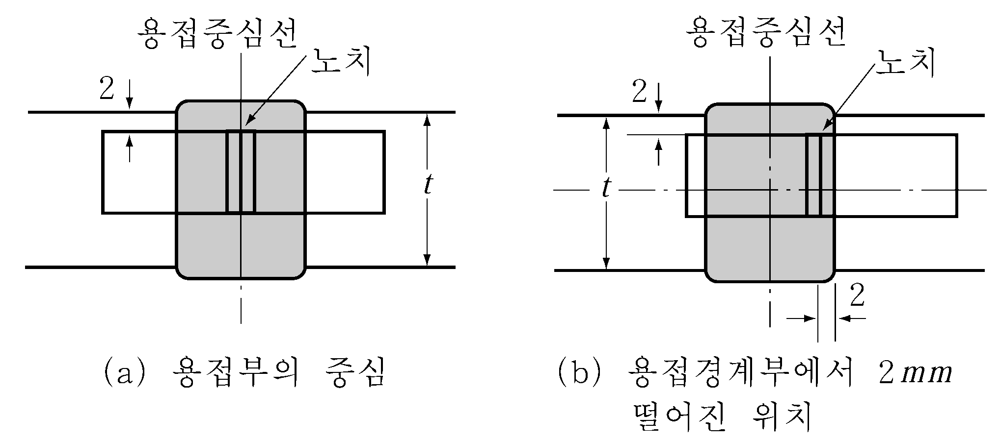
    **그림 2.2.34 충격시험편의 노치위치 (**#eqnID-1171**: 판두께, 단위:mm)**
    - **(가)** 각 시험재로부터 **표 2.1.3**의 샤르피 V-노치 충격시험편 2조(6개)를 기계절단으로 채취한다. 또한 시험편의 길이방향을 용접선에 직각으로 하고, **그림 2.2.34**에 따라 시험재 표면에서 2 mm 떨어진 위치와 시험편의 표면이 일치하도록 한다.
    - **(나)** 시험편의 노치 위치는 각 조마다 **그림 2.2.34**의 (a) 및 (b)에 따르며 노치의 길이방향을 시험재의 표면에 수직으로 한다.
    - **(다)** 시험온도 및 평균흡수에너지값은 **표 2.2.52**에 따른다.
    - **(라)** 1조의 시험편 중에서 2개 이상이 규정의 평균흡수에너지값 미만이거나 어느 한 개라도 규정의 평균흡수에너지값의 70 $\%$ 미만인 경우는 불합격으로 한다.
  - **(5)** **맞대기용접 매크로조직시험**
    - **(가)** 매크로조직시험편은 **그림 2.2.33**과 같이 2곳에서 채취한다. 2개의 매크로조직시험편 중 하나는 시험재 표면에 수직한 면, 다른 하나는 시험재 표면에 평행한 중심면을 피검면으로 한다.
    - **(나)** 용접부 및 용접경계부는 완전한 용입을 나타내고 유해한 결함이 있어서는 안 된다.
- **5.** **정기검사**
  - **(1)** 정기검사시에는 승인된 품목마다 다음 (2)호에 규정하는 시험을 하고 이에 합격하여야 한다.
  - **(2)** 정기검사에 관한 시험의 종류 등은 **표 2.2.53**에 따른다.

    **표 2.2.53 시험의 종류**

    | 시험의 종류 | 시 험 재 |   |   | 각 시험재로부터 채취하는 시험편의 종류 및 개수 |
    | --- | --- | --- | --- | --- |
    | 시험의 종류 | 개수 | 모양 및 치수 | 판두께(mm)(1) | 각 시험재로부터 채취하는 시험편의 종류 및 개수 |
    | 맞대기 용접시험 | 1 | **그림 2.2.33** | 20 ∼ 25 | 인장시험편 : 1개 세로방향인장시험편 : 1개 충격시험편 : 2조(6개)(1) 측면굽힘시험편 : 2개 |
    | (비고) (1) 우리 선급의 승인을 득한 경우 용접부 중심에서의 충격시험편 1조(3개)로 할 수 있다. |   |   |   |   |
  - **(3)** (2)호에서 규정하는 시험의 시험재에 대한 용접방법 및 규격은 전 **4**항에 따른다.
- **6.** **종류의 변경** 승인된 용접용재료의 강도나 인성에 관한 종류의 변경을 하는 경우에는 **601.**의 **6**항 (3)호의 규정에 따라 **3**항 (1)호에 규정하는 모든 시험을 하고 이에 합격하여야 한다.

#### 606. 연강, 고장력강 및 저온용강의 일면 자동용접용재료

- **1.** **적용**
  - **(1)** 다음 (가)부터 (다)까지의 연강, 고장력강 및 저온용강의 일면자동용접용재료(이하 **일면자동용접용재료**라 한다)에 대한 승인시험 및 정기검사는 **606.**의 규정에 따른다.
    - **(가)** 서브머지드 아크 일면자동용접용재료
    - **(나)** 가스실드아크 일면자동용접용재료(보호가스를 사용하는 솔리드 와이어 또는 플럭스코어드 와이어)
    - **(다)** 셀프실드아크 일면자동용접용재료(보호가스를 사용하지 않는 플럭스코어드 와이어 또는 플럭스피복 와이어)
  - **(2)** 연강, 고장력강 및 저온용강의 일면 피복아크 용접봉 및 일면 반자동용접용재료의 승인시험 및 정기검사는 우리 선급이 적절하다고 인정하는 바에 따른다. **【지침 참조】**
  - **(3)** 2전극 이상의 일면자동용접용재료의 승인시험 및 정기검사는 우리 선급이 적절하다고 인정하는 바에 따른다.
    **【지침 참조】**
- **2.** **종류 및 기호**
  - **(1)** 일면자동용접용재료의 종류 및 기호는 **603.**의 **2**항에 따른다. 다만, **표 2.2.55**의 각 용접법의 시험에 합격한 일면자동용접용재료에는 그 기호의 뒤에 **표 2.2.54**의 표시기호를 부기한다.

    **표 2.2.54 표시기호**

    | 용 접 층 수(1) | 표 시 기 호 |
    | --- | --- |
    | 일층용접법 | *SR* |
    | 다층용접법 | *MR* |
    | 일층 및 다층용접법 | *SMR* |
    | (비고) (1) 일층 용접법 또는 다층 용접법이란 전극수에 관계없이 1회 또는 2회 이상의 패스로 이루어지는 용접을 말한다. |   |
  - **(2)** 가스실드아크 일면자동용접용재료에는 (1)호의 표시기호 끝에 *G*를, 셀프실드아크 일면자동 용접용재료에는 *N*을 부기한다. 또한 사용하는 보호가스의 종류는 **표 2.2.37**에 따르고 구분기호는 표시기호 *G* 다음에 부기한다. (예 : 3*Y SMR G*(*M*1))
- **3.** **시험일반**
  - **(1)** 일면자동용접용재료에 대한 시험의 종류, 시험재의 개수, 판두께, 모양 및 치수 그리고 각 시험재로부터 채취하는 시험편의 종류 및 개수는 **표 2.2.55**에 따른다.
  - **(2)** 시험재로 사용되는 강재는 **표 2.2.56**에 따른다.
  - **(3)** 일면자동용접용재료의 승인시험은 품목마다 (1)호에 규정하는 시험을 하고 이에 합격하여야 한다.
  - **(4)** 가스실드아크 일면자동용접용재료는 **표 2.2.37**의 가스 종류 중에서 제조자가 지정하는 것마다 (3)호의 시험을 한다. 다만, 제조자가 **표 2.2.37**의 구분기호 *M* 1, *M* 2, *M* 3 또는 *C*에 포함되는 가스를 지정한 경우에는 어느 한 종류의 가스에 대하여 (3)호의 시험을 하고 이에 만족하면 동일 구분내 다른 종류의 가스에 대하여는 우리 선급의 승인을 받아 시험을 생략할 수 있다.
  - **(5)** 일면자동용접용재료의 조합은 적용하는 용접방법에 따라 **표 2.2.57**에 따른다.
  - **(6)** 용접전류, 용접전압 및 용접속도 등 용접조건은 제조자가 지정하는 범위내로 한다. 또한 교류 및 직류 겸용인 것에 대하여는 교류를 사용한다.
  - **(7)** 용접 후 시험재에는 어떠한 열처리도 하여서는 안 된다.
  - **(8)** 용접된 시험재는 시험을 하기 전에 용접부에 결함이 없는 것을 확인하기 위하여 용접선 전반에 걸쳐 방사선투과검사를 할 수 있다.

    **표 2.2.55 일면자동용접용재료의 시험종류** ***(2017) (2021)***

    | 용접용재료의 종류 | 용접법 | 시험의 종류(4) | 시 험 재 |   |   | 각 시험재로부터 채취하는 시험편의 종류 및 개수 |
    | --- | --- | --- | --- | --- | --- | --- |
    | 용접용재료의 종류 | 용접법 | 시험의 종류(4) | 개수 | 판두께(mm)(1) | 모양 및 치수 | 각 시험재로부터 채취하는 시험편의 종류 및 개수 |
    | 1, 2, 3 1*Y,* 2*Y,* 3*Y,* 4*Y,* 5*Y* 2*Y*40, 3*Y*40, 4*Y*40, 5*Y*40, 3*Y*47 *L* 1, *L* 2, *L* 3 *L* 51, *L* 91 | 일층용접법 | 맞대기 용접시험 | 1 | 12∼15 | **그림 2.2.35** | 인장시험편 : 2개 세로방향인장시험편 : 1개 앞면굽힘시험편 : 1개 뒷면굽힘시험편 : 1개 충격시험편 : 2조(6개) 매크로조직시험편 : 1개 |
    | 1, 2, 3 1*Y,* 2*Y,* 3*Y,* 4*Y,* 5*Y* 2*Y*40, 3*Y*40, 4*Y*40, 5*Y*40, 3*Y*47 *L* 1, *L* 2, *L* 3 *L* 51, *L* 91 | 일층용접법 | 맞대기 용접시험 | 1 | 적용 최대두께 | **그림 2.2.35** | 인장시험편 : 2개 세로방향인장시험편 : 1개 앞면굽힘시험편 : 1개 뒷면굽힘시험편 : 1개 충격시험편 : 2조(6개) 매크로조직시험편 : 1개 |
    | 1, 2, 3 1*Y,* 2*Y,* 3*Y,* 4*Y,* 5*Y* 2*Y*40, 3*Y*40, 4*Y*40, 5*Y*40, 3*Y*47 *L* 1, *L* 2, *L* 3 *L* 51, *L* 91 | 다층용접법 | 맞대기 용접시험 | 1 | 15∼25 | **그림 2.2.35** | 인장시험편 : 2개 세로방향인장시험편 : 1개 앞면굽힘시험편 : 1개 뒷면굽힘시험편 : 1개 충격시험편 : 2조(6개) 매크로조직시험편 : 1개 |
    | 1, 2, 3 1*Y,* 2*Y,* 3*Y,* 4*Y,* 5*Y* 2*Y*40, 3*Y*40, 4*Y*40, 5*Y*40, 3*Y*47 *L* 1, *L* 2, *L* 3 *L* 51, *L* 91 | 다층용접법 | 맞대기 용접시험 | 1 | 35 | **그림 2.2.35** | 인장시험편 : 2개 세로방향인장시험편 : 1개 앞면굽힘시험편 : 1개 뒷면굽힘시험편 : 1개 충격시험편 : 2조(6개) 매크로조직시험편 : 1개 |
    | 1, 2, 3 1*Y,* 2*Y,* 3*Y,* 4*Y,* 5*Y* 2*Y*40, 3*Y*40, 4*Y*40, 5*Y*40, 3*Y*47 *L* 1, *L* 2, *L* 3 *L* 51, *L* 91 | 일층 및 다층 겸용 용접법 | 맞대기 용접시험 | 1 | 적용최대두께(2) | **그림 2.2.35** | 인장시험편 : 2개 세로방향인장시험편 : 1개 앞면굽힘시험편 : 1개 뒷면굽힘시험편 : 1개 충격시험편 : 2조(6개) 매크로조직시험편 : 1개 |
    | 1, 2, 3 1*Y,* 2*Y,* 3*Y,* 4*Y,* 5*Y* 2*Y*40, 3*Y*40, 4*Y*40, 5*Y*40, 3*Y*47 *L* 1, *L* 2, *L* 3 *L* 51, *L* 91 | 일층 및 다층 겸용 용접법 | 맞대기 용접시험 | 1 | 35(3) | **그림 2.2.35** | 인장시험편 : 2개 세로방향인장시험편 : 1개 앞면굽힘시험편 : 1개 뒷면굽힘시험편 : 1개 충격시험편 : 2조(6개) 매크로조직시험편 : 1개 |
    | (비고) (1) 용접법과 관련하여 판두께에 제한이 있는 경우에는 우리 선급의 승인을 받아 시험재의 판두께를 변경할 수 있다. 이때에는 그 시험재의 두께를 적용최대두께로 한다. (2) 일층용접법으로 하는 시험재의 두께. (3) 다층용접법으로 하는 시험재의 두께. (4) 제조자의 신청에 따라 수소시험을 할 수 있다. |   |   |   |   |   |   |

    **표 2.2.56 시험재로 사용되는 강판의 종류** ***(2017) (2021)***

    | 용접용재료의 종류 | 시험재로 사용되는 강판의 종류(1) |
    | --- | --- |
    | 1 | *A* |
    | 2 | *A*, *B* 또는 *D* |
    | 3 | *A*, *B*, *D* 또는 *E* |
    | 1*Y* | *AH* 32 또는 *AH* 36 |
    | 2*Y* | *AH* 32, *AH* 36, *DH* 32 또는 *DH* 36 |
    | 3*Y* | *AH* 32, *AH* 36, *DH* 32, *DH* 36, *EH* 32 또는 *EH* 36 |
    | 4*Y* | *AH* 32, *AH* 36, *DH* 32, *DH* 36, *EH* 32, *EH* 36, *FH* 32 또는 *FH* 36 |
    | 5*Y* | *AH* 32, *AH* 36, *DH* 32, *DH* 36, *EH* 32, *EH* 36, *FH* 32 또는 *FH* 36 |
    | 2*Y*40 | *AH* 40 또는 *DH* 40 |
    | 3*Y*40 | *AH* 40, *DH* 40 또는 *EH* 40 |
    | 4*Y*40 | *AH* 40, *DH* 40, *EH* 40 또는 *FH* 40 |
    | 5*Y*40 | *AH* 40, *DH* 40, *EH* 40 또는 *FH* 40 |
    | 3*Y*47 | *EH* 47-*H* |
    | *L* 1 | *E* 또는 *RL* 235*A* |
    | *L* 2 | *E*, *RL* 235*A*, *RL* 235*B*, *RL* 325*A* 또는 *RL* 325*B* |
    | *L* 3 | *RL* 325*A*, *RL* 325*B* 또는 *RL* 355 |
    | *L* 51 | *RL* 5*N*390 |
    | *L* 91 | *RL* 9*N*490 |
    | (비고) (1) 맞대기용접 시험재로 사용되는 *AH* 32, *DH* 32, *EH* 32 및 *FH* 32 고장력강의 인장강도는 490 $\mathrm{N}/mm ^{2}$ 이상이어야 한다. |   |

    **표 2.2.57 일면자동용접용재료의 조합**

    | 용 접 방 법 | 용접용재료의 조합 |
    | --- | --- |
    | 서브머지드 일면자동용접 | 용접와이어+플럭스+충진제+뒷댐판재 |
    | 가스실드아크 일면자동용접 | 용접와이어+보호가스+충진제+뒷댐판재 |
    | 셀프실드아크 일면자동용접 | 용접와이어+충진제+뒷댐판재 |
    | (비고) 충진제를 사용하지 아니하는 경우에는 충진제를 제외한다. |   |
- **4.** **일층 및 다층용접법의 맞대기용접 시험**
  - **(1)** **일층 및 다층용접법의 맞대기용접 시험재**
    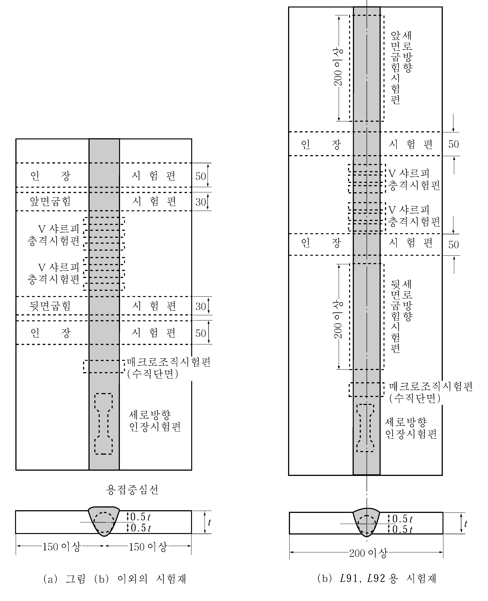
    **그림 2.2.35 일층 및 다층용접법의 맞대기용접 시험편 (**#eqnID-1174 **: 판두께, 단위 : mm)**
    - **(가)** 시험재의 치수는 **그림 2.2.35**에 따르고 개선형상 및 루트 간격과 사용하는 와이어의 지름 등은 제조자가 지정하는 범위내로 한다.
    - **(나)** 시험재는 제조자가 지정하는 방법에 따라 아래보기 용접자세로 1패스 또는 여러 패스로 일면용접을 한다. 다만, 가스실드아크 및 셀프실드아크 일면자동용접용재료의 경우에는 제조자가 지정하는 각 용접자세로 용접한다.
    - **(다)** 여러 패스 용접의 경우 시험재는 각 패스마다 용접선 중앙의 이음표면에서 계측한 온도가 100℃ 이상 250℃ 이하가 될 때까지 대기중에서 냉각한다.
  - **(2)** **일층 및 다층용접법의 맞대기용접 인장시험**
    - **(가)** 각 시험재로부터 **표 2.2.1**의 *R* 2*A*호 인장시험편 2개와 *R* 14A호 세로방향 인장시험편 1개를 채취한다. 또한 세로방향 인장시험편의 세로축 중심선이 시험재의 용접중심선과 판두께의 중심에 일치하여야 한다.
    - **(나)** 세로방향 인장시험편은 수소제거를 위하여 시험을 하기 전에 16시간을 초과하지 않는 범위내에서 250 ℃를 넘지 않게 가열하여도 좋다.
    - **(다)** 각 시험재로부터 **표 2.2.1**의 *R* 2*A*호 인장시험편의 인장강도는 **표 2.2.41**에 따르며, *R* 14A호 세로방향인장 시험편의 인장강도, 항복강도 및 연신율은 **표 2.2.40**에 따른다. 다만, 세로방향 인장시험편의 인장강도가 규격치의 상한을 넘는 것에 대하여는 기타의 기계적 성질 및 용착금속의 화학성분을 고려하여 합격으로 할 수 있다.
  - **(3)** **일층 및 다층용접법의 맞대기용접 굽힘시험** 굽힘시험은 **603.**의 **6**항 (4)호에 따른다.
  - **(4)** **일층 및 다층용접법의 맞대기용접 충격시험**
    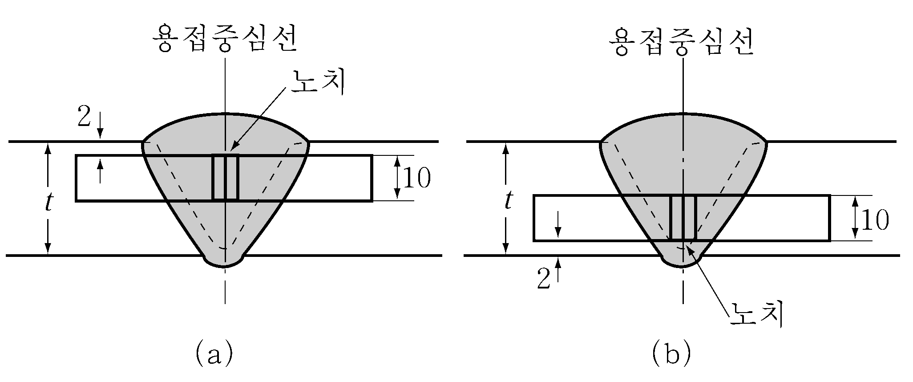
    **그림 2.2.36 일층 및 다층용접법의 맞대기용접 충격시험편의 채취위치** (#eqnID-1175 : 판두께, 단위 : mm)
    - **(가)** 각 시험재로부터 **표 2.1.3**의 샤르피 V-노치 충격시험편 2조(6개)를 기계절단으로 채취한다. 또한 시험편의 길이방향을 용접선에 직각으로 하고 **그림 2.2.36**에 따라 채취한다.
    - **(나)** 시험온도 및 평균흡수에너지값은 **표 2.2.41**에 따른다.
    - **(다)** 시험편의 노치는 용접선의 중심과 일치시키고 노치의 길이방향을 시험재의 표면에 수직으로 한다.
    - **(라)** 1조의 시험편 중에서 2개 이상이 규정의 평균흡수에너지값 미만이거나 어느 한 개라도 규정의 평균흡수에너지값의 70 $\%$ 미만인 경우는 불합격으로 한다.
  - **(5)** **일층 및 다층용접법의 맞대기용접 매크로조직시험**
    - **(가)** 매크로조직시험편은 **그림 2.2.35**에 표시하는 위치에서 피검면이 시험재 표면에 수직이 되도록 채취한다.
    - **(나)** 용접부 및 용접경계부는 완전한 용입을 나타내고 유해한 결함이 있어서는 안 된다.
- **5.** **수소시험** 수소시험은 **602.**의 **6**항에 따른다.
- **6.** **정기검사**
  - **(1)** 정기검사시에는 승인된 품목마다 다음 (2)호에 규정하는 시험을 하고 이에 합격하여야 한다.
  - **(2)** 정기검사에 관한 시험의 종류 등은 **표 2.2.58**에 따른다.
  - **(3)** (2)호에서 규정하는 시험의 시험재에 대한 용접방법 및 규격은 **4**항에 따른다.
- **7.** **종류의 변경** 승인된 용접용재료의 강도나 인성에 관한 종류의 변경을 하는 경우에는 **601.**의 **6**항 (3)호의 규정에 따라 **3**항 (1)호에 규정하는 모든 시험을 하고 이에 합격하여야 한다.

  **표 2.2.58 시험의 종류** ***(2017)*** ***(******2021)***

  | 용접용재료의 종류 | 용접법 | 시험의 종류 | 시 험 재 |   |   | 각 시험재로부터 채취하는 시험편의 종류 및 개수 |
  | --- | --- | --- | --- | --- | --- | --- |
  | 용접용재료의 종류 | 용접법 | 시험의 종류 | 개수 | 모양 및 치수 | 판두께 (mm)(1) | 각 시험재로부터 채취하는 시험편의 종류 및 개수 |
  | 1, 2, 3 1*Y,* 2*Y,* 3*Y,* 4*Y,* 5*Y* 2*Y*40, 3*Y*40, 4*Y*40 5*Y*40, 3*Y*47 *L* 1, *L* 2, *L* 3 *L* 51, *L* 91 | 일층 용접법 | 맞대기 용접시험(2) | 1 | **그림 2.2.35** | 20 | 인장시험편 : 1개 세로방향인장시험편 : 1개 앞면굽힘시험편 : 1개 뒷면굽힘시험편 : 1개 충격시험편 : 1조(3개)(3) |
  | 1, 2, 3 1*Y,* 2*Y,* 3*Y,* 4*Y,* 5*Y* 2*Y*40, 3*Y*40, 4*Y*40 5*Y*40, 3*Y*47 *L* 1, *L* 2, *L* 3 *L* 51, *L* 91 | 다층 용접법 | 맞대기 용접시험(2) | 1 | **그림 2.2.35** | 20∼25 | 인장시험편 : 1개 세로방향인장시험편 : 1개 앞면굽힘시험편 : 1개 뒷면굽힘시험편 : 1개 충격시험편 : 1조(3개)(3) |
  | 1, 2, 3 1*Y,* 2*Y,* 3*Y,* 4*Y,* 5*Y* 2*Y*40, 3*Y*40, 4*Y*40 5*Y*40, 3*Y*47 *L* 1, *L* 2, *L* 3 *L* 51, *L* 91 | 일층 및 다층 겸용 용접법 | 맞대기 용접시험(2) | 1 | **그림 2.2.35** | 20∼25 | 인장시험편 : 1개 세로방향인장시험편 : 1개 앞면굽힘시험편 : 1개 뒷면굽힘시험편 : 1개 충격시험편 : 1조(3개)(3) |
  | (비고) (1) **표 2.2.55**의 비고 (1)에 따라 시험재의 두께를 변경하여 승인된 용접용재료에 대하여는 승인시험시의 최대두께를 적용한다. (2) 일층 및 다층 겸용용접법에 대한 맞대기용접 시험은 일층용접법으로 한다. (3) 충격시험편의 노치 및 채취위치는 **그림 2.2.36**의 (b)로 한다. |   |   |   |   |   |   |

#### 607. 스테인리스강 용접용재료

- **1.** **적용**
  - **(1)** **1장 3절**에 규정된 압연 스테인리스 강재의 용접용재료(이하 용접용재료라 한다)에 대한 승인시험 및 정기검사는 **607.**의 규정에 따른다.
  - **(2)** 듀플렉스 스테인리스강 용접용재료에 대하여는 우리 선급이 별도로 정하는 지침에 따른다. **【지침 참조】**
- **2.** **종류 및 기호**
  - **(1)** 용접용재료의 종류 및 기호는 **표 2.2.59**에 따른다.

    **표 2.2.59 종류 및 기호**

    | 피복아크 용접봉 | TIG 및 MIG 용접용재료 | 플럭스코어드 와이어 반자동 용접용재료 | 서브머지드 아크자동용접용재료 |
    | --- | --- | --- | --- |
    | *RD* 308 | *RY* 308 | *RW* 308 | *RU* 308 |
    | *RD* 308L | *RY* 308*L* | *RW* 308*L* | *RU* 308*L* |
    | *RD* 309 | *RY* 309 | *RW* 309 | *RU* 309 |
    | *RD* 309L | *RY* 309*L* | *RW* 309*L* | - |
    | *RD* 309*Mo* | *RY* 309*Mo* | *RW* 309*Mo* | *RU* 309*Mo* |
    | *RD* 309*MoL* | - | *RW* 309*MoL* | - |
    | *RD* 310 | *RY* 310 | *RW* 310 | *RU* 310 |
    | - | *RY* 310*S* | - | - |
    | *RD* 310*Mo* | - | - | - |
    | *RD* 316 | *RY* 316 | *RW* 316 | *RU* 316 |
    | *RD* 316*L* | *RY* 316*L* | *RW* 316*L* | *RU* 316*L* |
    | *RD* 317 | *RY* 317 | *RW* 317 | *RU* 317 |
    | *RD* 317*L* | *RY* 317*L* | *RW* 317*L* | *RU* 317*L* |
    | - | *RY* 321 | - | - |
    | *RD* 347 | *RY* 347 | *RW* 347 | *RU* 347 |
  - **(2)** **표 2.2.61**에 규정한 각 용접법의 시험에 합격한 서브머지드 아크 자동용접용재료에는 그 기호의 뒤에 **표 2.2.60**의 표시기호를 부기한다.

    **표 2.2.60 표시기호**

    | 용 접 법 | 표 시 기 호 |
    | --- | --- |
    | 다층용접법 | *M* |
    | 양면일층 용접법 | *T* |
    | 다층 및 양면일층 겸용용접법 | *TM* |
  - **(3)** (1)호의 플럭스코어드 와이어 반자동용접용재료에 있어서 가스를 사용하는 용접용재료에는 그 기호 뒤에 *G*를, 가스를 사용하지 않는 용접용재료에는 *N*을 부기한다. 또한 사용하는 보호가스의 종류는 **표 2.2.37**에 따르고 그에 속하는 구분기호는 표시기호 *G* 다음에 부기한다. (예 : *RW* 308*G*(*C*))
- **3.** **시험일반**
  - **(1)** 용접용재료에 대한 시험의 종류, 시험재의 갯수, 판두께, 모양 및 치수, 시험재의 용접에 사용하는 용접용재료의 봉지름이나 와이어지름, 용접자세 그리고 각 시험재로부터 채취하는 시험편의 종류와 개수는 **표 2.2.61**에 따른다. 다만, 우리 선급이 필요하다고 인정하는 경우에는 그 강재의 용도에 따라 **표 2.2.61**에 규정하는 시험 외에 우리 선급이 적절하다고 인정하는 내식성시험, 충격시험 및 매크로시험 등을 요구할 수 있다. **【지침 참조】**

    **표 2.2.61 스테인리스강 용접용재료의 시험 종류**

    | 시험종류 |   |   | 시 험 재 |   |   |   |   | 각 시험재로부터 채취하는 시험편의 종류 및 개수 |
    | --- | --- | --- | --- | --- | --- | --- | --- | --- |
    | 시험종류 |   |   | 판두께 (mm) | 개수 | 용접자세 | 봉 또는 와이어의 지름(1) (mm) | 모양 및 치수 | 각 시험재로부터 채취하는 시험편의 종류 및 개수 |
    | 피복아크 용접봉 |   | 용착금속시험 | 12 | 1 | 아래보기 | 3.2 | **그림 2.2.37** | 인장시험편 : 1개 |
    | 피복아크 용접봉 |   | 용착금속시험 | 20 | 1 | 아래보기 | 4.0 | **그림 2.2.37** | 인장시험편 : 1개 |
    | 피복아크 용접봉 |   | 맞대기용접 시험 | 15∼20 | 1 | 아래보기 | 3.2 또는 4.0 | **그림 2.2.38** | 인장시험편 : 1개 앞면굽힘시험편 : 1개 뒷면굽힘시험편 : 1개 |
    | 피복아크 용접봉 |   | 맞대기용접 시험 | 15∼20 | 1 | 수평 | 3.2 또는 4.0 | **그림 2.2.38** | 인장시험편 : 1개 앞면굽힘시험편 : 1개 뒷면굽힘시험편 : 1개 |
    | 피복아크 용접봉 |   | 맞대기용접 시험 | 15∼20 | 1 | 수직상진 | 3.2 또는 4.0 | **그림 2.2.38** | 인장시험편 : 1개 앞면굽힘시험편 : 1개 뒷면굽힘시험편 : 1개 |
    | 피복아크 용접봉 |   | 맞대기용접 시험 | 15∼20 | 1 | 수직하진 | 3.2 또는 4.0 | **그림 2.2.38** | 인장시험편 : 1개 앞면굽힘시험편 : 1개 뒷면굽힘시험편 : 1개 |
    | 피복아크 용접봉 |   | 맞대기용접 시험 | 15∼20 | 1 | 위보기 | 3.2 또는 4.0 | **그림 2.2.38** | 인장시험편 : 1개 앞면굽힘시험편 : 1개 뒷면굽힘시험편 : 1개 |
    | TIG 용접용재료 |   | 용착금속시험 | 12 | 1 | 아래보기 | 2.4 | **그림 2.2.37** | 인장시험편 : 1개 |
    | TIG 용접용재료 |   | 용착금속시험 | 20 | 1 | 아래보기 | 3.2 | **그림 2.2.37** | 인장시험편 : 1개 |
    | TIG 용접용재료 |   | 맞대기용접 시험 | 15∼20 | 1 | 아래보기 | 2.0∼3.2 | **그림 2.2.38** | 인장시험편 : 1개 앞면굽힘시험편 : 1개 뒷면굽힘시험편 : 1개 |
    | TIG 용접용재료 |   | 맞대기용접 시험 | 15∼20 | 1 | 수평 | 2.0∼3.2 | **그림 2.2.38** | 인장시험편 : 1개 앞면굽힘시험편 : 1개 뒷면굽힘시험편 : 1개 |
    | TIG 용접용재료 |   | 맞대기용접 시험 | 15∼20 | 1 | 수직상진 | 2.0∼3.2 | **그림 2.2.38** | 인장시험편 : 1개 앞면굽힘시험편 : 1개 뒷면굽힘시험편 : 1개 |
    | TIG 용접용재료 |   | 맞대기용접 시험 | 15∼20 | 1 | 수직하진 | 2.0∼3.2 | **그림 2.2.38** | 인장시험편 : 1개 앞면굽힘시험편 : 1개 뒷면굽힘시험편 : 1개 |
    | TIG 용접용재료 |   | 맞대기용접 시험 | 15∼20 | 1 | 위보기 | 2.0∼3.2 | **그림 2.2.38** | 인장시험편 : 1개 앞면굽힘시험편 : 1개 뒷면굽힘시험편 : 1개 |
    | MIG 용접용재료 |   | 용착금속시험 | 12 | 1 | 아래보기 | 1.2 | **그림 2.2.37** | 인장시험편 : 1개 |
    | MIG 용접용재료 |   | 용착금속시험 | 20 | 1 | 아래보기 | 1.6 | **그림 2.2.37** | 인장시험편 : 1개 |
    | MIG 용접용재료 |   | 맞대기용접 시험 | 15∼20 | 1 | 아래보기 | 1.2∼2.0 | **그림 2.2.38** | 인장시험편 : 1개 앞면굽힘시험편 : 1개 뒷면굽힘시험편 : 1개 |
    | MIG 용접용재료 |   | 맞대기용접 시험 | 15∼20 | 1 | 수평 | 1.2∼2.0 | **그림 2.2.38** | 인장시험편 : 1개 앞면굽힘시험편 : 1개 뒷면굽힘시험편 : 1개 |
    | MIG 용접용재료 |   | 맞대기용접 시험 | 15∼20 | 1 | 수직상진 | 1.2∼2.0 | **그림 2.2.38** | 인장시험편 : 1개 앞면굽힘시험편 : 1개 뒷면굽힘시험편 : 1개 |
    | MIG 용접용재료 |   | 맞대기용접 시험 | 15∼20 | 1 | 수직하진 | 1.2∼2.0 | **그림 2.2.38** | 인장시험편 : 1개 앞면굽힘시험편 : 1개 뒷면굽힘시험편 : 1개 |
    | MIG 용접용재료 |   | 맞대기용접 시험 | 15∼20 | 1 | 위보기 | 1.2∼2.0 | **그림 2.2.38** | 인장시험편 : 1개 앞면굽힘시험편 : 1개 뒷면굽힘시험편 : 1개 |
    | 플럭스코어드 와이어 반자동 용접용재료 |   | 용착금속시험 | 12 | 1 | 아래보기 | 1.2∼2.4 | **그림 2.2.37** | 인장시험편 : 1개 |
    | 플럭스코어드 와이어 반자동 용접용재료 |   | 용착금속시험 | 20 | 1 | 아래보기 | 3.2 또는 최대지름 | **그림 2.2.37** | 인장시험편 : 1개 |
    | 플럭스코어드 와이어 반자동 용접용재료 |   | 맞대기용접 시험 | 15∼20 | 1 | 아래보기 | 1.2∼3.2 | **그림 2.2.38** | 인장시험편 : 1개 앞면굽힘시험편 : 1개 뒷면굽힘시험편 : 1개 |
    | 플럭스코어드 와이어 반자동 용접용재료 |   | 맞대기용접 시험 | 15∼20 | 1 | 수평 | 1.2∼3.2 | **그림 2.2.38** | 인장시험편 : 1개 앞면굽힘시험편 : 1개 뒷면굽힘시험편 : 1개 |
    | 플럭스코어드 와이어 반자동 용접용재료 |   | 맞대기용접 시험 | 15∼20 | 1 | 수직상진 | 1.2∼3.2 | **그림 2.2.38** | 인장시험편 : 1개 앞면굽힘시험편 : 1개 뒷면굽힘시험편 : 1개 |
    | 플럭스코어드 와이어 반자동 용접용재료 |   | 맞대기용접 시험 | 15∼20 | 1 | 수직하진 | 1.2∼3.2 | **그림 2.2.38** | 인장시험편 : 1개 앞면굽힘시험편 : 1개 뒷면굽힘시험편 : 1개 |
    | 플럭스코어드 와이어 반자동 용접용재료 |   | 맞대기용접 시험 | 15∼20 | 1 | 위보기 | 1.2∼3.2 | **그림 2.2.38** | 인장시험편 : 1개 앞면굽힘시험편 : 1개 뒷면굽힘시험편 : 1개 |
    | 서브머지드아크 자동용접용재료(2) | 다층용접 | 용착금속시험 | 19∼25 | 1 | 아래보기 | 1.2∼4.0 | **그림 2.2.34** | 인장시험편 : 1개 |
    | 서브머지드아크 자동용접용재료(2) | 다층용접 | 맞대기용접 시험 | 19 | 1 | 아래보기 | 1.2∼4.0 | **그림 2.2.39**(a) | 인장시험편 : 1개 앞면굽힘시험편 : 1개 뒷면굽힘시험편 : 1개 |
    | 서브머지드아크 자동용접용재료(2) | 양면일층용접 | 맞대기용접 시험 | 12 | 1 | 아래보기 | 1.2∼2.4 | **그림 2.2.39**(b) | 인장시험편 : 1개 앞면굽힘시험편 : 1개 뒷면굽힘시험편 : 1개 |
    | 서브머지드아크 자동용접용재료(2) | 양면일층용접 | 맞대기용접 시험 | 19 | 1 | 아래보기 | 4.0 | **그림 2.2.39**(b) | 인장시험편 : 1개 세로방향 인장시험편 : 1개 앞면굽힘시험편 : 1개 뒷면굽힘시험편 : 1개 |
    | (비고) (1) 우리 선급의 승인을 득한 경우에는 봉지름 또는 와이어지름을 변경할 수 있다. (2) 다층 및 양면일층 겸용용접용재료에 대하여는 다층 및 양면일층용접법의 양쪽에 대한 시험을 모두 하고 시험재의 갯수, 모양 및 치수, 판두께 그리고 각 시험편의 종류와 갯수는 각각의 용접법의 규정에 따른다. 다만, 양면일층 용접법의 세로방향 인장시험은 생략한다. |   |   |   |   |   |   |   |   |
  - **(2)** 시험재로 사용되는 강판은 용접용재료의 종류에 따라 **표 2.2.62**에 따르거나, 우리 선급이 인정하는 재료를 사용할 수 있다. *(2020)*

    **표 2.2.62 시험재로 사용되는 강재의 종류**

    | 용접용재료의 종류 | 적용강종(1) |
    | --- | --- |
    | *RD* 308, *RY* 308, *RW* 308, *RU* 308 | *RSTS* 304 |
    | *RD* 308L, *RY* 308*L*, *RW* 308L, *RU* 308L | *RSTS* 304*L* |
    | *RD* 309, *RY* 309, *RW* 309, *RU* 309 | *RSTS* 309*S* |
    | *RD* 309*L*, *RY* 309*L*, *RW* 309*L* | *RSTS* 309*S* |
    | *RD* 309*Mo*, *RY* 309*Mo*, *RW* 309*Mo*, *RU* 309*Mo* | *RSTS* 309*S* |
    | *RD* 309*MoL*, *RW* 309*MoL* | *RSTS* 309*S* |
    | *RD* 310, *RY* 310, *RW* 310, *RU* 310 | *RSTS* 310*S* |
    | *RY* 310*S* | *RSTS* 310*S* |
    | *RD* 310*Mo* | *RSTS* 310*S* |
    | *RD* 316, *RY* 316, *RW* 316, *RU* 316 | *RSTS* 316 |
    | *RD* 316*L*, *RY* 316*L*, *RW* 316*L*, *RU* 316*L* | *RSTS* 316*L* |
    | *RD* 317, *RY* 317, *RW* 317, *RU* 317 | *RSTS* 317 |
    | *RD* 317*L, RY* 317*L*, *RW* 317*L*, *RU* 317*L* | *RSTS* 317, *RSTS* 317*L* |
    | *RY* 321 | *RSTS* 321 |
    | *RD* 347, *RY* 347, *RW* 347, *RU* 347 | *RSTS* 321, *RSTS* 347 |
    | (비고) (1) 용착금속 시험재에는 이 표의 규정에 관계없이 연강 또는 고장력강을 사용할 수 있다. 이 경우 시험재에 대하여는 적절한 버터링을 한 것이어야 한다. |   |
  - **(3)** 용접용재료의 승인시험은 품목마다 (1)호에 규정하는 시험을 하고 이에 합격하여야 한다.
  - **(4)** 가스를 사용하는 플럭스코어드 용접와이어 반자동용접용재료는 **표 2.2.37**의 가스의 종류 중 제조자가 지정하는 것마다 (3)호의 시험을 한다. 다만, 제조자가 **표 2.2.37**의 구분기호 *M* 1, *M* 2 또는 *M* 3에 포함되는 가스를 지정하는 경우에는 어느 한 종류의 가스에 대하여 (3)호의 시험을 하고 이에 만족하면 동일구분내 다른 종류의 가스에 대하여는 우리 선급의 승인을 받아 시험을 생략할 수 있다.
  - **(5)** 용접전류, 용접전압 및 용접속도 등 용접조건은 제조자가 지정하는 범위내로 한다. 또한 교류 및 직류 겸용인 것에 대하여는 교류를 사용한다.
  - **(6)** 용접후 시험재에는 어떠한 열처리도 하여서는 안 된다.
  - **(7)** 용접된 시험재는 시험을 하기 전에 용접부에 결함이 없는 것을 확인하기 위하여 용접선 전반에 걸쳐 방사선투과검사를 할 수 있다.
- **4.** **용착금속시험**
  - **(1)** **용착금속 시험재**
    - **(가)** 시험재의 치수는 **그림 2.2.37**에 따르고 제조자가 지정하는 방법에 따라 아래보기자세로 용접한다.
    - **(나)** 시험재는 각 패스마다 용접선 중앙의 이음표면에서 계측한 온도가 15℃ 이상 150℃ 이하가 될 때까지 대기중에서 냉각한다.
  - **(2)** **화학성분**
    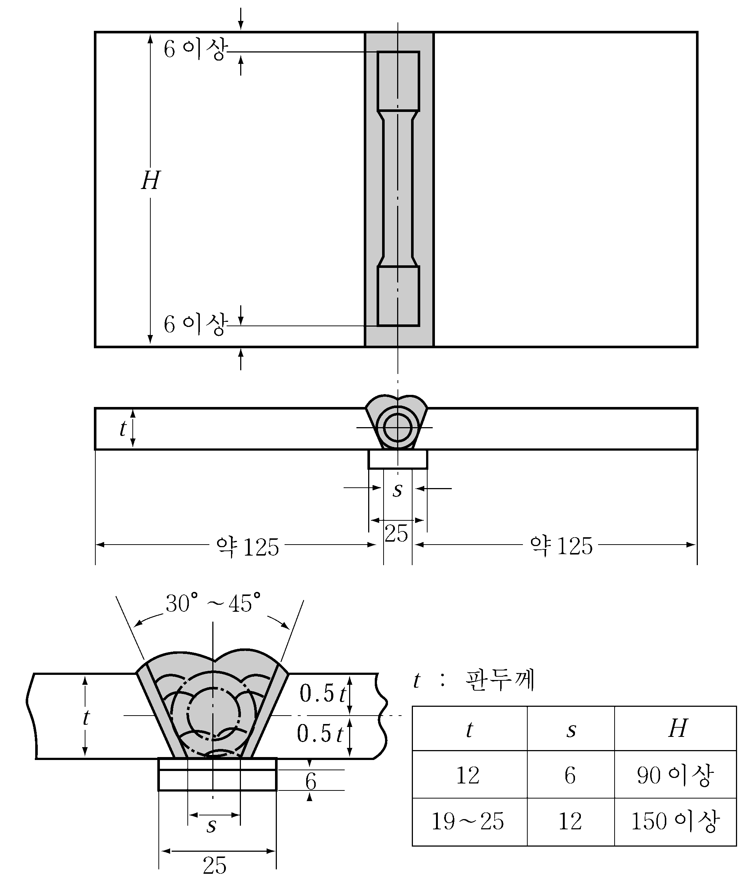
    **그림 2.2.37 스테인리스강의 용착금속 시험재 (단위 :** mm**)**

    **표 2.2.63 피복아크 용접봉의 용착금속 화학성분**

    | 종류 | 화학성분($\%$) |   |   |   |   |   |   |   |   |
    | --- | --- | --- | --- | --- | --- | --- | --- | --- | --- |
    | 종류 | $C$ | $Si$ | $Mn$ | $P$ | $S$ | $N i$ | $Cr$ | $Mo$ | 기타 |
    | *RD* 308 | 0.08이하 | 0.90이하 | 2.50이하 | 0.04이하 | 0.03이하 | 9.0∼11.0 | 18.0∼21.0 | － | － |
    | *RD* 308*L* | 0.04이하 | 0.90이하 | 2.50이하 | 0.04이하 | 0.03이하 | 9.0∼12.0 | 18.0∼21.0 | － | － |
    | *RD* 309 | 0.15이하 | 0.90이하 | 2.50이하 | 0.04이하 | 0.03이하 | 12.0∼14.0 | 22.0∼25.0 | － | － |
    | *RD* 309*L* | 0.04이하 | 0.90이하 | 2.50이하 | 0.04이하 | 0.03이하 | 12.0∼16.0 | 22.0∼25.0 | － | － |
    | *RD* 309*Mo* | 0.12이하 | 0.90이하 | 2.50이하 | 0.04이하 | 0.03이하 | 12.0∼14.0 | 22.0∼25.0 | 2.0∼3.0 | － |
    | *RD* 309*MoL* | 0.04이하 | 0.90이하 | 2.50이하 | 0.04이하 | 0.03이하 | 12.0∼14.0 | 22.0∼25.0 | 2.0∼3.0 | － |
    | *RD* 310 | 0.20이하 | 0.75이하 | 2.50이하 | 0.03이하 | 0.03이하 | 20.0∼22.0 | 25.0∼28.0 | － | － |
    | *RD* 310*Mo* | 0.12이하 | 0.75이하 | 2.50이하 | 0.03이하 | 0.03이하 | 20.0∼22.0 | 25.0∼28.0 | 2.0∼3.0 | － |
    | *RD* 316 | 0.08이하 | 0.90이하 | 2.50이하 | 0.04이하 | 0.03이하 | 11.0∼14.0 | 17.0∼20.0 | 2.0∼2.75 | － |
    | *RD* 316*L* | 0.04이하 | 0.90이하 | 2.50이하 | 0.04이하 | 0.03이하 | 11.0∼16.0 | 17.0∼20.0 | 2.0∼2.75 | － |
    | *RD* 317 | 0.08이하 | 0.90이하 | 2.50이하 | 0.04이하 | 0.03이하 | 12.0∼14.0 | 18.0∼21.0 | 3.0∼4.0 | － |
    | *RD* 317*L* | 0.04이하 | 0.90이하 | 2.50이하 | 0.04이하 | 0.03이하 | 12.0∼16.0 | 18.0∼21.0 | 3.0∼4.0 | － |
    | *RD* 347 | 0.08이하 | 0.90이하 | 2.50이하 | 0.04이하 | 0.03이하 | 9.0∼11.0 | 18.0∼21.0 | － | Nb8×C (%)∼1.0 |

    **표 2.2.64 TIG 및 MIG 용접용재료의 화학성분**

    | 종류 | 화학성분($\%$) |   |   |   |   |   |   |   |   |
    | --- | --- | --- | --- | --- | --- | --- | --- | --- | --- |
    | 종류 | $C$ | $Si$ | $Mn$ | $P$ | $S$ | $N i$ | $Cr$ | $Mo$ | 기타 |
    | *RY* 308 | 0.08이하 | 0.65이하 | 1.0∼2.5 | 0.03이하 | 0.03이하 | 9.0∼11.0 | 19.0∼22.0 | － | － |
    | *RY* 308*L* | 0.03이하 | 0.65이하 | 1.0∼2.5 | 0.03이하 | 0.03이하 | 9.0∼11.0 | 19.0∼22.0 | － | － |
    | *RY* 309 | 0.12이하 | 0.65이하 | 1.0∼2.5 | 0.03이하 | 0.03이하 | 12.0∼14.0 | 23.0∼25.0 | － | － |
    | *RY* 309*L* | 0.03이하 | 0.65이하 | 1.0∼2.5 | 0.03이하 | 0.03이하 | 12.0∼14.0 | 23.0∼25.0 | － | － |
    | *RY* 309*Mo* | 0.12이하 | 0.65이하 | 1.0∼2.5 | 0.03이하 | 0.03이하 | 12.0∼14.0 | 23.0∼25.0 | 2.0∼3.0 | － |
    | *RY* 310 | 0.15이하 | 0.65이하 | 1.0∼2.5 | 0.03이하 | 0.03이하 | 20.0∼22.5 | 25.0∼28.0 | － | － |
    | *RY* 310*S* | 0.08이하 | 0.65이하 | 1.0∼2.5 | 0.03이하 | 0.03이하 | 20.0∼22.5 | 25.0∼28.0 | － | － |
    | *RY* 316 | 0.08이하 | 0.65이하 | 1.0∼2.5 | 0.03이하 | 0.03이하 | 11.0∼14.0 | 18.0∼20.0 | 2.0∼3.0 | － |
    | *RY* 316*L* | 0.03이하 | 0.65이하 | 1.0∼2.5 | 0.03이하 | 0.03이하 | 11.0∼14.0 | 18.0∼20.0 | 2.0∼3.0 | － |
    | *RY* 317 | 0.08이하 | 0.65이하 | 1.0∼2.5 | 0.03이하 | 0.03이하 | 13.0∼15.0 | 18.5∼20.5 | 3.0∼4.0 | － |
    | *RY* 317*L* | 0.03이하 | 0.65이하 | 1.0∼2.5 | 0.03이하 | 0.03이하 | 13.0∼15.0 | 18.5∼20.5 | 3.0∼4.0 | － |
    | *RY* 321 | 0.08이하 | 0.65이하 | 1.0∼2.5 | 0.03이하 | 0.03이하 | 9.0∼10.5 | 18.5∼20.5 | － | Ti9×C(%)∼1.0 |
    | *RY* 347 | 0.08이하 | 0.65이하 | 1.0∼2.5 | 0.03이하 | 0.03이하 | 9.0∼11.0 | 19.0∼21.5 | － | Nb10×C(%)∼1.0 |

    **표 2.2.65 플럭스코어드와이어 반자동용접용재료의 용착금속 화학성분** (a) 가스를 사용하는 경우

    | 종류 | 화학성분($\%$) |   |   |   |   |   |   |   |   |
    | --- | --- | --- | --- | --- | --- | --- | --- | --- | --- |
    | 종류 | $C$ | $Si$ | $Mn$ | $P$ | $S$ | $N i$ | $Cr$ | $Mo$ | 기타 |
    | *RW* 308 | 0.08이하 | 1.0이하 | 0.5∼2.5 | 0.04이하 | 0.03이하 | 9.0∼11.0 | 18.0∼21.0 | － | － |
    | *RW* 308*L* | 0.04이하 | 1.0이하 | 0.5∼2.5 | 0.04이하 | 0.03이하 | 9.0∼12.0 | 18.0∼21.0 | － | － |
    | *RW* 309 | 0.10이하 | 1.0이하 | 0.5∼2.5 | 0.04이하 | 0.03이하 | 12.0∼14.0 | 22.0∼25.0 | － | － |
    | *RW* 309*L* | 0.04이하 | 1.0이하 | 0.5∼2.5 | 0.04이하 | 0.03이하 | 12.0∼14.0 | 22.0∼25.0 | － | － |
    | *RW* 309*Mo* | 0.12이하 | 1.0이하 | 0.5∼2.5 | 0.04이하 | 0.03이하 | 12.0∼14.0 | 22.0∼25.0 | 2.0∼3.0 | － |
    | *RW* 309*MoL* | 0.04이하 | 1.0이하 | 0.5∼2.5 | 0.04이하 | 0.03이하 | 12.0∼14.0 | 22.0∼25.0 | 2.0∼3.0 | － |
    | *RW* 310 | 0.20이하 | 1.0이하 | 0.5∼2.5 | 0.04이하 | 0.03이하 | 20.0∼22.0 | 25.0∼28.0 | － | － |
    | *RW* 316 | 0.08이하 | 1.0이하 | 0.5∼2.5 | 0.04이하 | 0.03이하 | 11.0∼14.0 | 17.0∼20.0 | 2.0∼3.0 | － |
    | *RW* 316*L* | 0.04이하 | 1.0이하 | 0.5∼2.5 | 0.04이하 | 0.03이하 | 11.0∼14.0 | 17.0∼20.0 | 2.0∼3.0 | － |
    | *RW* 317 | 0.08이하 | 1.0이하 | 0.5∼2.5 | 0.04이하 | 0.03이하 | 12.0∼14.0 | 18.0∼21.0 | 3.0∼4.0 | － |
    | *RW* 317*L* | 0.04이하 | 1.0이하 | 0.5∼2.5 | 0.04이하 | 0.03이하 | 12.0∼16.0 | 18.0∼21.0 | 3.0∼4.0 | － |
    | *RW* 347 | 0.08이하 | 1.0이하 | 0.5∼2.5 | 0.04이하 | 0.03이하 | 9.0∼11.0 | 18.0∼21.0 | － | Nb8×C (%)∼1.0 |

    **(b) 가스를 사용하지 않는 경우**

    | 종류 | 화학성분($\%$) |   |   |   |   |   |   |   |   |
    | --- | --- | --- | --- | --- | --- | --- | --- | --- | --- |
    | 종류 | $C$ | $Si$ | $Mn$ | $P$ | $S$ | $N i$ | $Cr$ | $Mo$ | 기타 |
    | *RW* 308 | 0.08이하 | 1.0이하 | 0.5∼2.5 | 0.04이하 | 0.03이하 | 9.0∼11.0 | 19.5∼22.0 | － | － |
    | *RW* 308*L* | 0.04이하 | 1.0이하 | 0.5∼2.5 | 0.04이하 | 0.03이하 | 9.0∼12.0 | 19.5∼22.0 | － | － |
    | *RW* 309 | 0.10이하 | 1.0이하 | 0.5∼2.5 | 0.04이하 | 0.03이하 | 12.0∼14.0 | 23.0∼25.5 | － | － |
    | *RW* 309*L* | 0.04이하 | 1.0이하 | 0.5∼2.5 | 0.04이하 | 0.03이하 | 12.0∼14.0 | 23.0∼25.5 | － | － |
    | *RW* 309*Mo* | 0.12이하 | 1.0이하 | 0.5∼2.5 | 0.04이하 | 0.03이하 | 12.0∼14.0 | 22.0∼25.0 | 2.0∼3.0 | － |
    | *RW* 309*MoL* | 0.04이하 | 1.0이하 | 0.5∼2.5 | 0.04이하 | 0.03이하 | 12.0∼14.0 | 22.0∼25.0 | 2.0∼3.0 | － |
    | *RW* 310 | 0.20이하 | 1.0이하 | 0.5∼2.5 | 0.04이하 | 0.03이하 | 20.0∼22.0 | 25.0∼28.0 | － | － |
    | *RW* 316 | 0.08이하 | 1.0이하 | 0.5∼2.5 | 0.04이하 | 0.03이하 | 11.0∼14.0 | 18.0∼20.5 | 2.0∼3.0 | － |
    | *RW* 316*L* | 0.04이하 | 1.0이하 | 0.5∼2.5 | 0.04이하 | 0.03이하 | 11.0∼14.0 | 18.0∼20.5 | 2.0∼3.0 | － |
    | *RW* 317 | 0.08이하 | 1.0이하 | 0.5∼2.5 | 0.04이하 | 0.03이하 | 13.0∼15.0 | 18.5∼21.0 | 3.0∼4.0 | － |
    | *RW* 317*L* | 0.04이하 | 1.0이하 | 0.5∼2.5 | 0.04이하 | 0.03이하 | 13.0∼15.0 | 18.5∼21.0 | 3.0∼4.0 | － |
    | *RW* 347 | 0.08이하 | 1.0이하 | 0.5∼2.5 | 0.04이하 | 0.03이하 | 9.0∼11.0 | 19.0∼21.5 | － | Nb8×C (%)∼1.0 |

    **표 2.2.66 서브머지드 아크 자동용접용재료의 용착금속 화학성분**

    | 종류 | 화학성분($\%$) |   |   |   |   |   |   |   |   |
    | --- | --- | --- | --- | --- | --- | --- | --- | --- | --- |
    | 종류 | $C$ | $Si$ | $Mn$ | $P$ | $S$ | $N i$ | $Cr$ | $Mo$ | 기타 |
    | *RU* 308 | 0.08이하 | 1.0이하 | 2.5이하 | 0.04이하 | 0.03이하 | 9.0∼11.0 | 18.0∼21.0 | － | － |
    | *RU* 308*L* | 0.04이하 | 1.0이하 | 2.5이하 | 0.04이하 | 0.03이하 | 9.0∼12.0 | 18.0∼21.0 | － | － |
    | *RU* 309 | 0.15이하 | 1.0이하 | 2.5이하 | 0.04이하 | 0.03이하 | 12.0∼14.0 | 22.0∼25.0 | － | － |
    | *RU* 309*Mo* | 0.12이하 | 1.0이하 | 2.5이하 | 0.04이하 | 0.03이하 | 12.0∼14.0 | 22.0∼25.0 | 2.0∼3.0 | － |
    | *RU* 310 | 0.20이하 | 1.0이하 | 2.5이하 | 0.04이하 | 0.03이하 | 20.0∼22.0 | 25.0∼28.0 | － | － |
    | *RU* 316 | 0.08이하 | 1.0이하 | 2.5이하 | 0.04이하 | 0.03이하 | 11.0∼14.0 | 17.0∼20.0 | 2.0∼2.75 | － |
    | *RU* 316*L* | 0.04이하 | 1.0이하 | 2.5이하 | 0.04이하 | 0.03이하 | 11.0∼16.0 | 17.0∼20.0 | 2.0∼2.75 | － |
    | *RU* 317 | 0.08이하 | 1.0이하 | 2.5이하 | 0.04이하 | 0.03이하 | 12.0∼14.0 | 18.0∼21.0 | 3.0∼4.0 | － |
    | *RU* 317*L* | 0.04이하 | 1.0이하 | 2.5이하 | 0.04이하 | 0.03이하 | 12.0∼16.0 | 18.0∼21.0 | 3.0∼4.0 | － |
    | *RU* 347 | 0.08이하 | 1.0이하 | 2.5이하 | 0.04이하 | 0.03이하 | 9.0∼11.0 | 18.0∼21.0 | － | Nb8×C (%)∼1.0 |
    - **(가)** 피복아크 용접봉, 플럭스코어드와이어 반자동용접용재료 및 서브머지드 아크 자동용접용 와이어의 화학성분은 용착금속의 분석치로 하고 각각 **표 2.2.63, 표 2.2.65** 및 **표 2.2.66**에 따른다.
    - **(나)** *TIG* 및 *MIG용접용재료*의 화학성분은 용강분석치로 하고 **표 2.2.64**에 따른다.
  - **(3)** **용착금속 인장시험**

    **표 2.2.67 용착금속 인장시험의 규격치**

    | 피복아크 용접봉 | TIG 및 MIG 용접용재료 | 플럭스코어드와이어반자동용접용재료 | 서브머지드아크자동용접용재료 | 인장강도 ($\mathrm{N}/mm ^{2}$) | 항복강도 ($\mathrm{N}/mm ^{2}$) | 연신율 ($\%$) |
    | --- | --- | --- | --- | --- | --- | --- |
    | *RD* 308 | *RY* 308 | *RW* 308 | *RU* 308 | 550이상 | 225이상 | 35이상 |
    | *RD* 308*L* | *RY* 308*L* | *RW* 308*L* | *RU* 308*L* | 510 이상 | 205 이상 | 35 이상 |
    | *RD* 309 | *RY* 309 | *RW* 309 | *RU* 309 | 550 이상 | 225 이상 | 30 이상 |
    | *RD* 309*L* | *RY* 309*L* | *RW* 309*L* | － | 510 이상 | 205 이상 | 30 이상 |
    | *RD* 309*Mo* | *RY* 309*Mo* | *RW* 309*Mo* | *RU* 309*Mo* | 550 이상 | 225 이상 | 30 이상 |
    | *RD* 309*MoL* | － | *RW* 309*MoL* | － | 510 이상 | 205 이상 | 30 이상(1) |
    | *RD* 310 | *RY* 310 | *RW* 310 | *RU* 310 | 550 이상 | 225 이상 | 30 이상 |
    | － | *RY* 310*S* | － | － | 550 이상 | 225 이상 | 30 이상 |
    | *RD* 310*Mo* | － | － | － | 550 이상 | 225 이상 | 30 이상 |
    | *RD* 316 | *RY* 316 | *RW* 316 | *RU* 316 | 550 이상 | 225 이상 | 30 이상 |
    | *RD* 316*L* | *RY* 316*L* | *RW* 316*L* | *RU* 316*L* | 510 이상 | 205 이상 | 35 이상 |
    | *RD* 317 | *RY* 317 | *RW* 317 | *RU* 317 | 550 이상 | 225 이상 | 30 이상 |
    | *RD* 317*L* | *RY* 317*L* | *RW* 317*L* | *RU* 317*L* | 510 이상 | 205 이상 | 30 이상 |
    | － | *RY* 321 | － | － | 550 이상 | 225 이상 | 30 이상 |
    | *RD* 347 | *RY* 347 | *RW* 347 | *RU* 347 | 550 이상 | 225 이상 | 30 이상 |
    | (비 고) (1) *RW* 309*MoL*에 대한 연신율은 20% 이상으로 한다. |   |   |   |   |   |   |
    - **(가)** 각 시험재로부터 **표 2.2.1**의 *R* 10호 인장시험편 1개를 채취한다. 다만, 우리 선급의 승인을 득한 경우에는 *R* 14A호 인장시험편 1개로 할 수 있다. 또한 시험편의 세로축 중심선은 시험재의 용접중심선과 판두께의 중심에 일치하여야 한다.
    - **(나)** 인장시험편은 수소제거를 위하여 시험을 하기 전에 16시간을 초과하지 않는 범위내에서 250 ℃를 넘지 않게 가열하여도 좋다.
    - **(다)** 용착금속 인장시험의 규격치는 **표 2.2.67**에 따른다.
- **5.** **맞대기용접시험**
  - **(1)** **맞대기용접 시험재**
    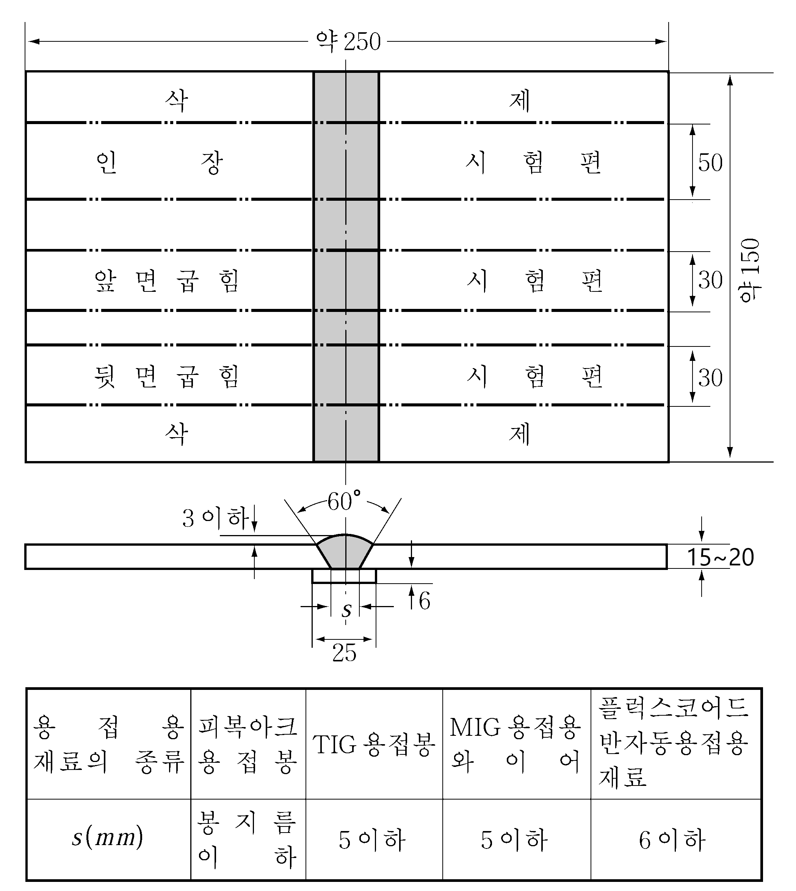
    **그림 2.2.38 스테인리스강의 맞대기용접 시험재** (단위 : mm) (서브머지드 아크 자동용접은 제외) *(2021)*
    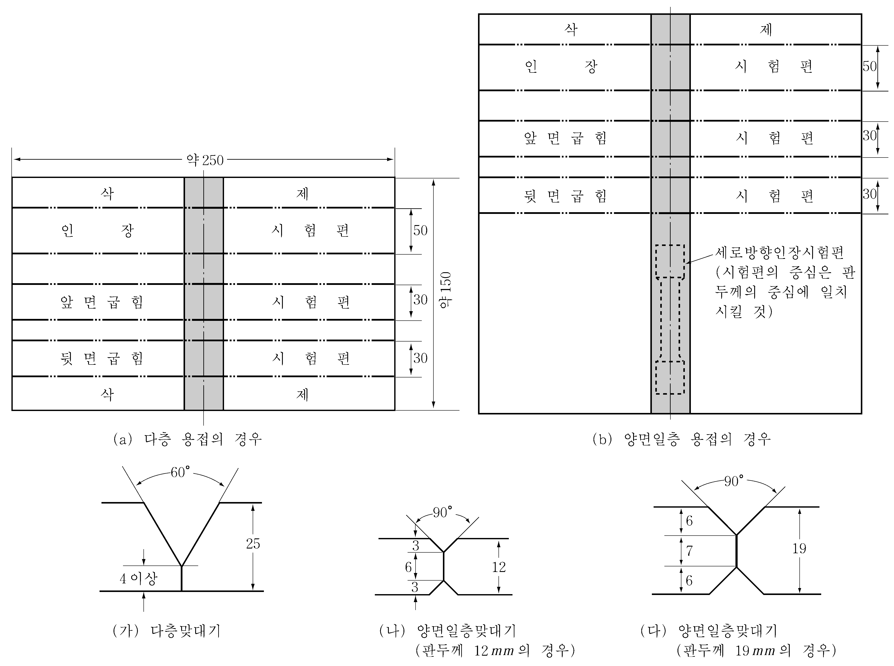
    **그림 2.2.39 스테인리스강의 서브머지드 아크 자동용접의 맞대기용접 시험재 (단위 :** #eqnID-1225**)**
    - **(가)** 시험재의 치수는 **그림 2.2.38** 및 **그림 2.2.39**에 따르고 제조자가 지정하는 각 용접자세(아래보기, 수평, 수직상진, 수직하진 및 위보기)로 용접한다.
    - **(나)** 시험재는 각 패스마다 용접선 중앙의 이음표면에서 계측한 온도가 15℃ 이상 150℃ 이하가 될 때까지 대기중에서 냉각한다.
  - **(2)** **맞대기용접 인장시험**

    **표 2.2.68 맞대기용접 인장시험의 규격치**

    | 피복아크용접봉 | TIG 및 MIG 용접용재료 | 플럭스코어드와이어반자동용접용재료 | 서브머지드아크 자동용접용재료 | 인장강도 ($\mathrm{N}/mm ^{2}$) |
    | --- | --- | --- | --- | --- |
    | *RD* 308 | *RY* 308 | *RW* 308 | *RU* 308 | 520 이상 |
    | *RD* 308*L* | *RY* 308*L* | *RW* 308*L* | *RU* 308*L* | 480 이상 |
    | *RD* 309 | *RY* 309 | *RW* 309 | *RU* 309 | 520 이상 |
    | *RD* 309*L* | *RY* 309*L* | *RW* 309*L* | － | 520 이상 |
    | *RD* 309*Mo* | *RY* 309*Mo* | *RW* 309*Mo* | *RU* 309*Mo* | 520 이상 |
    | *RD* 309*MoL* | － | *RW* 309*MoL* | － | 520 이상 |
    | *RD* 310 | *RY* 310 | *RW* 310 | *RU* 310 | 520 이상 |
    | － | *RY* 310*S* | － | － | 520 이상 |
    | *RD* 310*Mo* | － | － | － | 520 이상 |
    | *RD* 316 | *RY* 316 | *RW* 316 | *RU* 316 | 520 이상 |
    | *RD* 316*L* | *RY* 316*L* | *RW* 316*L* | *RU* 316*L* | 480 이상 |
    | *RD* 317 | *RY* 317 | *RW* 317 | *RU* 317 | 520 이상(1) |
    | *RD* 317*L* | *RY* 317*L* | *RW* 317*L* | *RU* 317*L* | 520 이상(1) |
    | － | *RY* 321 | － | － | 520 이상 |
    | *RD* 347 | *RY* 347 | *RW* 347 | *RU* 347 | 520 이상 |
    | (비고) (1) 시험재로 *RSTS* 317L을 사용한 경우에는 480 $\mathrm{N}/mm ^{2}$ 이상으로 한다. |   |   |   |   |
    - **(가)** 각 시험재로부터 **표 2.2.1**의 *R* 2*A*호 인장시험편 1개를 채취한다.
    - **(나)** 시험편의 인장강도는 **표 2.2.68**에 따른다.
    - **(다)** 서브머지드 아크 자동용접용재료로서 이층용접법에 대하여만 시험을 하는 경우에는 2개의 시험재중 판두께가 두꺼운 쪽의 시험재에서 **표 2.2.1**의 *R*14A호 세로방향 인장시험편 1개를 채취한다. 또한, 시험편의 세로축중심선은 시험재의 용접중심선과 판두께의 중심에 일치하여야 한다.
    - **(라)** (다)에 규정하는 세로방향 인장시험편은 수소제거를 위하여 시험을 하기 전에 16시간을 초과하지 않는 범위내에서 250℃를 넘지 않게 가열하여도 좋다.
    - **(마)** (다) 및 (라)에 규정하는 시험편의 인장강도, 항복점 및 연신율은 **표 2.2.60**에 따른다.
  - **(3)** **맞대기용접 굽힘시험**
    - **(가)** 각 시험재로부터 **표 2.2.2**의 *RB* 4호 앞면굽힘 및 뒷면굽힘 시험편을 1개씩 채취한다.
    - **(나)** 시험편은 판두께의 1.5배에 상당하는 안쪽반지름을 갖는 플런저로 앞면굽힘 또는 뒷면굽힘을 하고 굽힘각도가 120° 이상에 도달하여도 시험편에 3 mm를 넘는 균열, 기타의 결함이 생겨서는 아니된다.
- **6.** **정기검사**
  - **(1)** 정기검사시에는 승인된 품목마다 다음 (2)호에 규정하는 시험을 하고 이에 합격하여야 한다.
  - **(2)** 정기검사에 관한 시험의 종류 등은 **표 2.2.69**에 따른다.
  - **(3)** (2)호에서 규정하는 시험의 시험재에 대한 용접방법 및 규격은 **4**항부터 **5**항까지에 따른다.

    **표 2.2.69 시험의 종류**

    | 용접용재료의 종류 |   | 시험의 종류 | 시 험 재 |   |   |   |   | 각 시험재로부터 채취하는 시험편의 종류 및 갯수 |
    | --- | --- | --- | --- | --- | --- | --- | --- | --- |
    | 용접용재료의 종류 |   | 시험의 종류 | 용접자세 | 봉 또는 와이어 지름(mm) | 갯수 | 모양 및 치수 | 판두께 (mm) | 각 시험재로부터 채취하는 시험편의 종류 및 갯수 |
    | 피복아크용접봉 |   | 용착금속시험 | 아래보기 | 3.2∼4.0 | 1 | **그림 2.2.37** | 12∼19 | 인장시험편 : 1개 |
    | TIG 용접용재료 |   | 용착금속시험 | 아래보기 | 2.4∼3.2 | 1 | **그림 2.2.37** | 12∼19 | 인장시험편 : 1개 |
    | MIG 용접용재료 |   | 용착금속시험 | 아래보기 | 1.2∼1.6 | 1 | **그림 2.2.37** | 12∼19 | 인장시험편 : 1개 |
    | 플럭스코어드 와이어반자동 용접용재료 |   | 용착금속시험 | 아래보기 | 1.2∼3.2 | 1 | **그림 2.2.37** | 12∼19 | 인장시험편 : 1개 |
    | 서브머지드아크자동용접용재료(1) | 다층 용접법 | 용착금속시험 | 아래보기 | 1.2∼4.0 | 1 | **그림 2.2.37** | 19∼25 | 인장시험편 : 1개 |
    | 서브머지드아크자동용접용재료(1) | 양면 일층 용접법 | 맞대기 용접시험 | 아래보기 | 2.4∼4.0 | 1 | **그림 2.2.39**(b) | 12∼19 | 인장시험편 : 1개 세로방향인장시험편 : 1 개 앞면굽힘시험편 : 1개 뒷면굽힘시험편 : 1개 |
    | (비고) (1) 다층 및 양면일층 겸용용접용재료에 대하여는 다층 및 양면일층 용접법의 양쪽에 대한 시험을 모두 하고 시험재의 개수, 판두께, 모양 및 치수 그리고 각 시험편의 종류와 개수는 각각의 용접법의 규정에 따른다. 다만, 양면일층 용접법의 세로방향 인장시험편은 생략한다. |   |   |   |   |   |   |   |   |

#### 608. 알루미늄합금재의 용접용재료

- **1.** **적용**
  - **(1)** 다음 (가) 및 (나)의 알루미늄 합금재의 용접용재료(이하 **용접용재료**라 한다.)에 대한 승인시험 및 정기검사는 **608.**의 규정에 따른다.
    - **(가)** ***TIG*** 용접 또는 플라즈마 아크 용접용 용접봉
    - **(나)** ***MIG*** 용접, ***TIG***용접 또는 플라즈마 아크 용접용 와이어
  - **(2)** **608.**에서 특별히 규정되지 아니한 사항에 대하여는 **601.**부터 **605.**까지의 규정을 준용한다.
- **2.** **종류 및 기호**
  - **(1)** 용접용재료의 종류 및 기호는 **표 2.2.70**에 따른다.

    **표 2.2.70 종류 및 기호**

    | 용접용재료의 종류 | 종류 및 기호 |
    | --- | --- |
    | 용접봉 | *RA*, *RB*, *RC*, *RD* |
    | 용접와이어 | *WA*, *WB*, *WC*, *WD* |
  - **(2)** He, Ar 또는 그 혼합가스를 보호가스로 사용하는 용접용재료는 표시기호 뒤에󰡒*G*"를 부기하고 **표 2.2.71**에 따른 보호가스 구분기호를 용접용재료의 표시기호 뒤에 부기한다.(예: *RB G*(I-3)) 그 외의 가스를 보호가스로 사용하는 경우에는 표시기호 뒤에 “S" 및 가스의 성분 또는 순도를 부기한다.(예: *RB S*(CO2 100%)) 특정한 보호가스를 사용하여 승인된 용접와이어 또는 용접봉을 동일 구분기호 내의 다른 가스조성으로 적용하고자 하는 경우에는 우리 선급의 승인을 받아야 한다.

    **표 2.2.71 가스의 종류**

    | 구분기호 | 종류 | 가스조성($\%$) |   |
    | --- | --- | --- | --- |
    | 구분기호 | 종류 | He | Ar |
    | I | I-1 I-2 I-3 I-4 I-5 | - 100 > 0 - 33 > 33 - 66 > 66 - 95 | 100 - 나머지 나머지 나머지 |
    | S |   | 상기제외 |   |
- **3.** **시험일반**
  - **(1)** 용접용재료에 대한 시험의 종류, 시험재의 갯수, 판두께, 모양 및 치수 그리고 각 시험재로부터 채취하는 시험편의 종류와 개수는 **표 2.2.72**에 따른다.
  - **(2)** 시험재로 사용되는 알루미늄 합금재는 용접용재료의 종류에 따라서 **표 2.2.73**에 따른다.
  - **(3)** 용접용재료의 승인시험은 품목마다 (1)호에 규정하는 시험을 하고 이에 합격하여야 한다.
  - **(4)** 가스실드 용접용재료는 **표 2.2.71**의 가스 종류 중에서 제조자가 지정하는 것마다 (1)호의 시험을 한다. 다만, 제조자가 **표 2.2.71**의 구분기호 I에 포함되는 가스를 지정한 경우에는 어느 한 종류의 가스에 대하여 (1)호의 시험을 하고 이에 만족하면 다른 종류의 가스에 대하여는 우리 선급의 승인을 받아 시험을 생략할 수 있다.
  - **(5)** 제조자가 (4)호에 규정된 시험에 구분기호 S에 포함되는 가스를 지정한 경우에는 보호가스의 조성을 우리 선급에 제출하여야 한다.
  - **(6)** 용접후 시험재에는 어떠한 열처리 또는 피닝을 하여서는 안 된다.
  - **(7)** 용접된 시험재는 시험을 하기 전에 용접부에 결함이 없는 것을 확인하기 위하여 용접선 전반에 걸쳐 방사선투과검사를 할 수 있다.

    **표 2.2.72 용접용재료의 시험의 종류**

    | 시험의 종류 | 시 험 재 |   |   |   | 각 시험재로부터 채취하는 시험편의 종류 및 개수 |
    | --- | --- | --- | --- | --- | --- |
    | 시험의 종류 | 용접자세 | 개수 | 모양 및 치수 | 판두께(mm) | 각 시험재로부터 채취하는 시험편의 종류 및 개수 |
    | 용착금속 시험(화학성분 분석시험) | 아래보기 | 1 | **그림 2.2.40** | - | - |
    | 맞대기 용접시험 | 아래보기 | 1 | **그림 2.2.41** | 10∼12 | 인장시험편 : 2 앞면굽힘시험편 : 2 뒷면굽힘시험편 : 2 매크로조직시험편 : 1 |
    | 맞대기 용접시험 | 수평 | 1(1) | **그림 2.2.41** | 10∼12 | 인장시험편 : 2 앞면굽힘시험편 : 2 뒷면굽힘시험편 : 2 매크로조직시험편 : 1 |
    | 맞대기 용접시험 | 수직상진 | 1 | **그림 2.2.41** | 10∼12 | 인장시험편 : 2 앞면굽힘시험편 : 2 뒷면굽힘시험편 : 2 매크로조직시험편 : 1 |
    | 맞대기 용접시험 | 위보기 | 1 | **그림 2.2.41** | 10∼12 | 인장시험편 : 2 앞면굽힘시험편 : 2 뒷면굽힘시험편 : 2 매크로조직시험편 : 1 |
    | 맞대기 용접시험 | 아래보기 | 1 | **그림 2.2.42** | 20∼25 | 인장시험편 : 2 앞면굽힘시험편 : 2 뒷면굽힘시험편 : 2 매크로조직시험편 : 1 |
    | (비고) (1) 아래보기 및 수직상진의 맞대기 용접시험에 합격한 용접용재료는 우리 선급의 승인을 얻어 수평자세의 시험을 생략할 수 있다. |   |   |   |   |   |

    **표 2.2.73 시험재로 사용하는 알루미늄 합금재의 종류**

    | 용접용재료의 종류 | 시험재로 사용되는 알루미늄 합금재의 재료기호 |   |
    | --- | --- | --- |
    | *RA*, *WA* | 5000 계열 | 5754 |
    | *RB*, *WB* | 5000 계열 | 5086 |
    | *RC*, *WC* | 5000 계열 | 5083, 5383, 5456, 5059 |
    | *RD*, *WD* | 6000 계열 | 6005*A,* 6061, 6082 |
    | (비고) (1) 5000계열의 합금 중 고강도의 알루미늄합금에 대하여 승인된 용접용재료는 그보다 낮은 강도를 가지는 동일 계열의 알루미늄합금에 대하여도 승인된 것으로 간주한다. |   |   |
- **4.** **용착금속시험**
  - **(1)** **용착금속 시험재**
    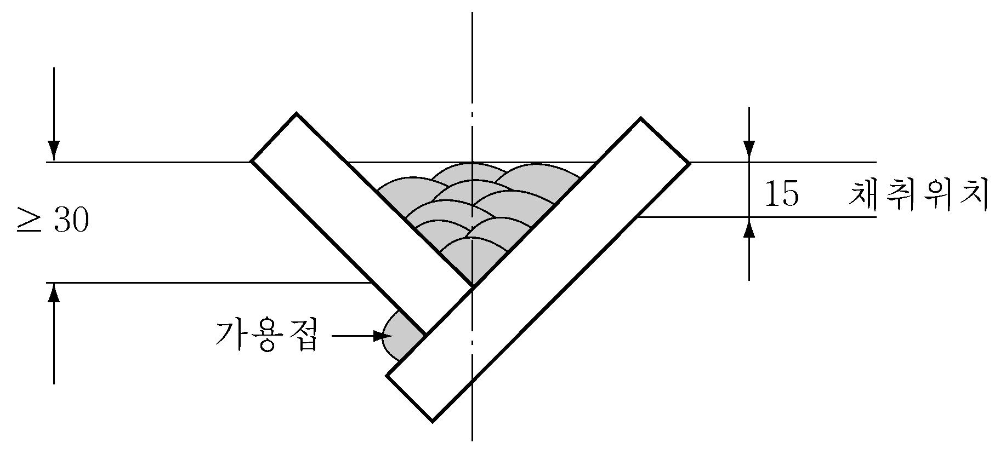
    **그림 2.2.40 용착금속 시험용 시험재** (단위: mm)
    - **(가)** 시험재의 치수는 **그림 2.2.40**에 따르며 제조자가 지정한 용접법에 따라 아래보기자세로 용접한다.
    - **(나)** 용접법과 용접용재료에 따른 화학성분 분석을 위한 충분한 크기의 시험재를 채취하여야 한다.
  - **(2)** **화학성분** 용접용재료의 화학성분은 **그림 2.2.40**에 규정된 용착금속을 분석하고 그 결과는 제조자가 규정한 값에 따른다.
- **5.** **맞대기용접시험**
  - **(1)** **맞대기 용접 시험재**
    - **(가)** 시험재의 치수는 **그림 2.2.41** 및 **그림 2.2.42**에 따르며 **그림 2.2.41**의 경우, 제조자가 지정하는 각 용접자세(아래보기, 수평, 수직상진 및 위보기)로 용접하고 **그림 2.2.42**의 경우 아래보기자세로 용접한다.
    - **(나)** 시험재는 각 패스마다 용접선 중앙의 이음 표면에서 계측한 온도가 상온이 될 때까지 대기중에서 냉각한다. 단, *RD* 및 *WD*의 시험재는 용접이 완료된 후 시험을 시작하기 전에 최소 72시간동안 자연시효를 할 수 있다.
  - **(2)** **맞대기 용접 인장시험**

    **표 2.2.74 기계적 성질**

    | 용접용재료의 기호 | 시험재의 재료기호 | 인장강도($\mathrm{N}/mm ^{2}$) | 굽힘시험 |   |
    | --- | --- | --- | --- | --- |
    | 용접용재료의 기호 | 시험재의 재료기호 | 인장강도($\mathrm{N}/mm ^{2}$) | 안쪽 지름(mm) | 굽힘각도 |
    | *RA/WA* | 5754 | 190 이상 | 3 *t*(1) | 180° |
    | *RB/WB* | 5086 | 240 이상 | 6 *t*(1) | 180° |
    | *RC/WC* | 5083 | 275 이상 | 6 *t*(1) | 180° |
    | *RC/WC* | 5383, 5456 | 290 이상 | 6 *t*(1) | 180° |
    | *RC/WC* | 5059 | 330 이상 | 6 *t*(1) | 180° |
    | *RD/WD* | 6061, 6005*A*, 6082 | 170 이상 | 6 *t*(1) | 180° |
    | (비고) (1) *t* : 시험편의 두께 |   |   |   |   |

    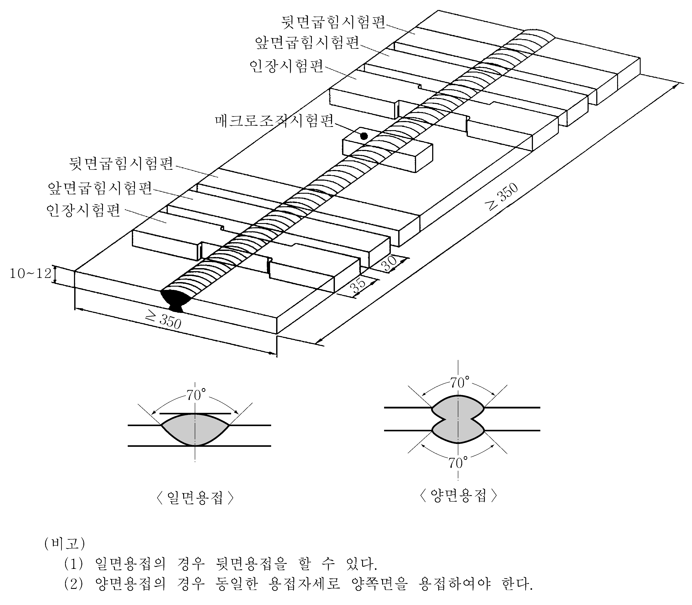
    **그림 2.2.41 알루미늄합금재의 맞대기용접 시험재** (두께 10∼12 mm의 경우, 단위 : mm)
    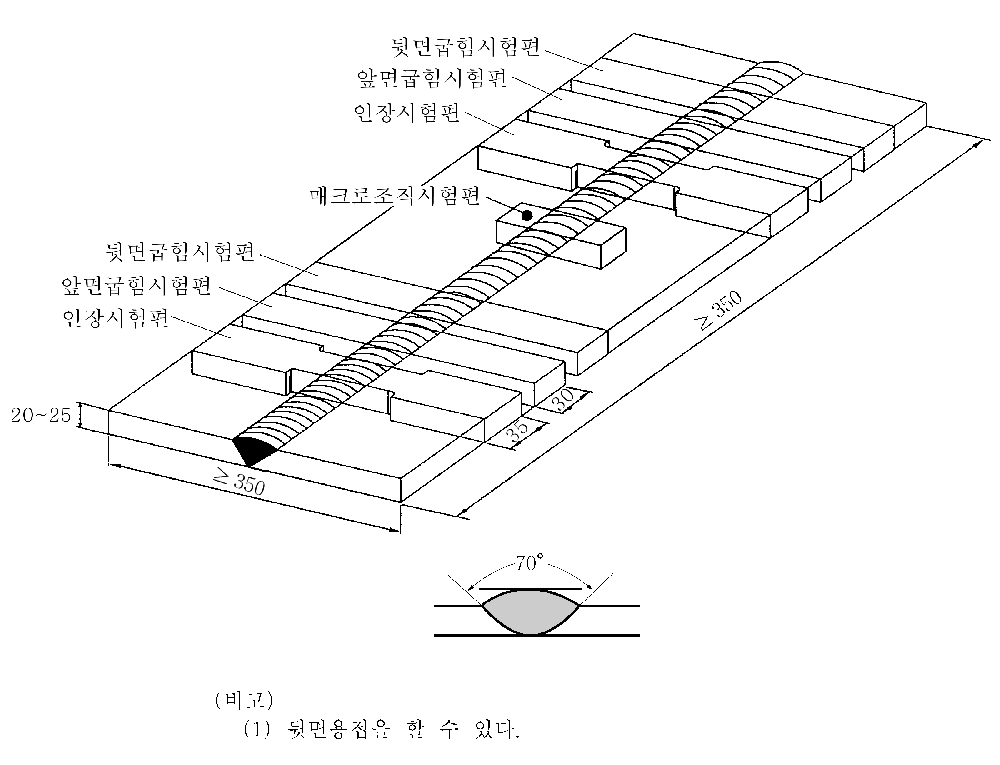
    **그림 2.2.42 알루미늄합금재의 맞대기용접 시험재** (두께 20∼25 mm의 경우, 단위 : mm)
    - **(가)** 각 시험재로부터 **표 2.2.1**의 *R* 2*A*호 인장시험편 2개를 채취한다.
    - **(나)** 시험편의 인장강도는 **표 2.2.74**에 따른다.
  - **(3)** **맞대기 용접 굽힘시험**
    - **(가)** 각 시험재로부터 **표 2.2.2**의 *RB* 4호 앞면굽힘 및 뒷면굽힘 시험편 각 2개를 채취한다.
    - **(나)** 시험편은 **표 2.2.74**에 나타낸 안쪽지름을 갖는 플런저로 앞면 및 뒷면굽힘을 하고 굽힘각도가 180${}^{\circ}$ 이상에 도달하여도 시험편의 표면에 길이가 3 mm를 넘는 어떠한 결함도 생겨서는 안 된다.
  - **(4)** **맞대기 용접 매크로 조직시험**
    - **(가)** **그림 2.2.41** 및 **그림 2.2.42**에 따라 1개의 매크로 조직시험편을 맞대기 용접 시험재로부터 채취한다.
    - **(나)** 용접부 횡단면의 매크로 조직을 표시하는 시험편에는 융합불량, 용입불량 또는 균열, 기타 유해한 결함이 있어서는 안 된다.
- **6.** **정기검사**
  - **(1)** 정기검사시에는 승인된 품목마다 다음 (2)호에 규정하는 시험을 하고 이에 합격하여야 한다.
  - **(2)** 정기검사에 관한 시험의 종류 등은 **표 2.2.75**에 따른다.
  - **(3)** (2)호에서 규정하는 시험의 시험재에 대한 용접방법 및 규격은 **4**항 및 **5**항에 따른다.

    **표 2.2.75 시험의 종류**

    | 시험의 종류 | 시 험 재 |   |   |   | 각 시험재로부터 채취하는 시험편의 종류 및 개수 |
    | --- | --- | --- | --- | --- | --- |
    | 시험의 종류 | 용접자세 | 개수 | 모양 및 치수 | 판두께 (mm) | 각 시험재로부터 채취하는 시험편의 종류 및 개수 |
    | 용착금속 시험 (화학성분 분석) | 아래보기 | 1 | **그림 2.2.40** | - | - |
    | 맞대기 용접시험 | 아래보기 | 1 | **그림 2.2.41** | 10 - 12 | 인장시험편 : 2 앞면굽힘시험편 : 2 뒷면굽힘시험편 : 2 매크로조직시험편 : 1 |

#### 609. 용접구조용 초고장력강의 용접용재료

- **1.** **적용**
  다음 (가)부터 (다)까지의 용접구조용 초고장력강의 용접용재료(이하 **609.**에서는 **용접용재료**라고 한다.)에 대한 승인시험 및 정기검사는 **609.**의 규정에 따른다.
- **2.** **종류 및 기호**
  - **(1)** 용접용재료의 종류 및 기호는 **표 2.2.77**에 따른다.
  - **(2)** 다음 **3**항 (1)호의 시험에 합격한 용접용재료에는 그 기호의 뒤에 **603.**의 **2**항 (2)호 및 (3)호 또는 **604.**의 **2**항 (2)호 및 (3)호의 규정에 준하여 표시기호를 부기한다.
  - **(3)** 저수소계 용접용재료로서 **6**항에 규정하는 수소시험에 합격한 것에는 해당 용접용재료의 기호 뒤에 **표 2.2.80**의 표시기호를 부기한다. (예 : 3*Y*46*S H*5)
- **3.** 시험일반
  - **(1)** 용접용재료에 대한 시험의 종류, 시험재의 개수, 판두께, 모양 및 치수, 시험재의 용접에 사용되는 용접봉의 지름 또는 와이어의 지름, 용접자세 및 각 시험재로부터 채취하는 시험편의 종류와 개수는 용접용재료의 종류에 따라서 **602.**의 **3**항, **603.**의 **3**항 또는 **604.**의 **3**항의 규정을 준용한다. 다만, **표 2.2.26**의 비고 (4) 및 **표 2.2.44**의 비고 (5)의 규정은 준용하지 않는다. 또한, 자동용접용재료는 원칙적으로 다층용접법에 대한 규정을 준용한다.
  - **(2)** 시험에 사용되는 강재는 용접용재료의 종류에 따라서 **표 2.2.76**에 나타낸 강판의 종류, 또는 우리 선급이 이와 동등하다고 인정하는 것으로 한다.

    **표 2.2.76 시험재로 사용하는 강판의 종류** ***(2019)***

    | 용접용재료의 종류 | 시험재로 사용하는 강판의 종류 |
    | --- | --- |
    | 2*Y*42, 2*Y*46, 2*Y*50*,* 2*Y*55*,* 2*Y*62, 2*Y*69, 2*Y*89, 2*Y*96 | *AH* 43∼*AH* 97 |
    | 3*Y*42, 3*Y*46, 3*Y*50*,* 3*Y*55*,* 3*Y*62, 3*Y*69, 3*Y*89, 3*Y*96 | *AH* 43∼*AH* 97, *DH* 43∼*DH* 97 |
    | 4*Y*42, 4*Y*46, 4*Y*50*,* 4*Y*55*,* 4*Y*62, 4*Y*69, 4*Y*89, 4*Y*96 | *AH*43∼*AH*97, *DH* 43∼*DH* 97, *EH* 43∼*EH* 97 |
    | 5*Y*42, 5*Y*46, 5*Y*50*,* 5*Y*55*,* 5*Y*62, 5*Y*69 | *AH* 43∼*AH* 70, *DH* 43∼*DH* 70, *EH* 43∼*EH* 70, *FH* 43∼*FH* 70 |
    | (비고) 용착금속의 시험재에는 본 표의 규정에 관계없이 연강 또는 다른 고장력강을 사용할 수 있지만 적절한 버터링을 한 것이어야 한다. |   |
  - **(3)** 용접용재료의 승인시험은 품목마다 **602., 603.** 또는 **604.**에 규정하는 시험을 하고 이에 합격하여야 하며, **603.**에 따른 일층 자동용접 시험 시에는 와이어 및 플럭스의 조합을 특별히 고려해야 한다. (2019)
  - **(4)** 용접 후 시험재에는 어떠한 열처리를 하여서는 안 된다.
  - **(5)** 용접된 시험재는 시험을 하기 전에 용접부에 결함이 없는 것을 확인하기 위하여 용접선 전반에 걸쳐 방사선투과검사를 할 수 있다.
- **4.** **용착금속시험**
  - **(1)** **용착금속시험재** 시험재 및 시험재의 용접방법은 용접용재료의 종류에 따라서 **602.**의 **4**항 (1)호, **603.**의 **4**항 (1)호 또는 **604.**의 **4**항 (1)호의 규정을 준용한다.
  - **(2)** **화학성분**
    - **(가)** 제조자는 각 시험재에 대하여 용착금속의 화학성분을 분석하고 그 결과를 우리 선급에 제출하여야 한다. 또한 화학성분에는 주요 합금원소를 포함하여야 한다.
    - **(나)** 화학성분을 분석한 결과는 표준 또는 제조자에 의해 규정된 제한값을 넘어서는 안 된다.
  - **(3)** **용착금속 인장시험**

    **표 2.2.77 용착금속 시험의 규격치** ***(2019)***

    | 용접용재료의 종류 | 인장시험 |   |   | 충격시험 |   |
    | --- | --- | --- | --- | --- | --- |
    | 용접용재료의 종류 | 인장강도($\mathrm{N}/mm ^{2}$)(1) | 항복강도($\mathrm{N}/mm ^{2}$) | 연신율($\%$) | 시험온도(℃) | 평균흡수에너지(J) |
    | 2*Y*42 | 520 ∼ 680 | 420 이상 | 21 이상 | 0 | 47이상 |
    | 3*Y*42 | 520 ∼ 680 | 420 이상 | 21 이상 | -20 | 47이상 |
    | 4*Y*42 | 520 ∼ 680 | 420 이상 | 21 이상 | -40 | 47이상 |
    | 5*Y*42 | 520 ∼ 680 | 420 이상 | 21 이상 | -60 | 47이상 |
    | 2*Y*46 | 540 ∼ 720 | 460 이상 | 20 이상 | 0 | 47이상 |
    | 3*Y*46 | 540 ∼ 720 | 460 이상 | 20 이상 | -20 | 47이상 |
    | 4*Y*46 | 540 ∼ 720 | 460 이상 | 20 이상 | -40 | 47이상 |
    | 5*Y*46 | 540 ∼ 720 | 460 이상 | 20 이상 | -60 | 47이상 |
    | 2*Y*50 | 590 ∼ 770 | 500 이상 | 19 이상 | 0 | 50이상 |
    | 3*Y*50 | 590 ∼ 770 | 500 이상 | 19 이상 | -20 | 50이상 |
    | 4*Y*50 | 590 ∼ 770 | 500 이상 | 19 이상 | -40 | 50이상 |
    | 5*Y*50 | 590 ∼ 770 | 500 이상 | 19 이상 | -60 | 50이상 |
    | 2*Y*55 | 640 ∼ 820 | 550 이상 | 18 이상 | 0 | 55이상 |
    | 3*Y*55 | 640 ∼ 820 | 550 이상 | 18 이상 | -20 | 55이상 |
    | 4*Y*55 | 640 ∼ 820 | 550 이상 | 18 이상 | -40 | 55이상 |
    | 5*Y*55 | 640 ∼ 820 | 550 이상 | 18 이상 | -60 | 55이상 |
    | 2*Y*62 | 700 ∼ 890 | 620 이상 | 18 이상 | 0 | 62이상 |
    | 3*Y*62 | 700 ∼ 890 | 620 이상 | 18 이상 | -20 | 62이상 |
    | 4*Y*62 | 700 ∼ 890 | 620 이상 | 18 이상 | -40 | 62이상 |
    | 5*Y*62 | 700 ∼ 890 | 620 이상 | 18 이상 | -60 | 62이상 |
    | 2*Y*69 | 770 ∼ 940 | 690 이상 | 17 이상 | 0 | 69이상 |
    | 3*Y*69 | 770 ∼ 940 | 690 이상 | 17 이상 | -20 | 69이상 |
    | 4*Y*69 | 770 ∼ 940 | 690 이상 | 17 이상 | -40 | 69이상 |
    | 5*Y*69 | 770 ∼ 940 | 690 이상 | 17 이상 | -60 | 69이상 |
    | 2*Y*89 | 940 ∼ 1100 | 890 이상 | 14 이상 | 0 | 69이상 |
    | 3*Y*89 | 940 ∼ 1100 | 890 이상 | 14 이상 | -20 | 69이상 |
    | 4*Y*89 | 940 ∼ 1100 | 890 이상 | 14 이상 | -40 | 69이상 |
    | 2*Y*96 | 980 ∼ 1150 | 960 이상 | 13 이상 | 0 | 69이상 |
    | 3*Y*96 | 980 ∼ 1150 | 960 이상 | 13 이상 | -20 | 69이상 |
    | 4*Y*96 | 980 ∼ 1150 | 960 이상 | 13 이상 | -40 | 69이상 |
    | (비고) (1) 인장강도는 우리 선급의 승인을 받아 본 표에 나타낸 규격과 다른 것으로 할 수 있다. |   |   |   |   |   |
    - **(가)** 각 시험재로부터 채취하는 인장시험편의 종류, 개수 및 채취방법 등은 용접용재료의 종류에 따라서 **602.**의 **4**항 (3)호, **603.**의 **4**항 (3)호 또는 **604.**의 **4**항 (3)호의 규정을 준용한다.
    - **(나)** 각 시험편의 인장강도, 항복강도 및 연신율은 **표 2.2.77**에 따른다.
    - **(다)** **602.**의 **4**항 (3)호 (나)의 규정을 준용한다.
  - **(4)** **용착금속 충격시험**
    - **(가)** 각 시험재로부터 채취하는 충격시험편의 종류, 개수, 채취방법 등은 용접용재료의 종류에 따라서 **602.**의 **4**항 (4)호, **603.**의 **4**항 (4)호 및 **604.**의 **4**항 (4)호의 규정을 준용한다.
    - **(나)** 시험온도 및 평균흡수에너지값은 **표 2.2.77**에 따른다.
    - **(다)** **602.**의 **4**항 (4)호 (나) 및 (라)의 규정을 준용한다.
- **5.** **맞대기용접시험**
  - **(1)** **맞대기용접시험재** 시험재 및 시험재의 용접방법은 용접용재료의 종류에 따라서 **602.**의 **5**항 (1)호, **603.**의 **5**항 (1)호 또는 **604.**의 **5**항 (1)호의 규정을 준용한다.
  - **(2)** **맞대기용접 인장시험**

    **표 2.2.78 맞대기 용접 인장시험의 규격치** ***(2019)***

    | 용접용재료의 종류 | 인장강도 ($\mathrm{N}/mm ^{2}$) |
    | --- | --- |
    | 2*Y*42, 3*Y*42, 4*Y*42, 5*Y*42 | 520 이상 |
    | 2*Y*46, 3*Y*46, 4*Y*46, 5*Y*46 | 540 이상 |
    | 2*Y*50, 3*Y*50, 4*Y*50, 5*Y*50 | 590 이상 |
    | 2*Y*55, 3*Y*55, 4*Y*55, 5*Y*55 | 640 이상 |
    | 2*Y*62, 3*Y*62, 4*Y*62, 5*Y*62 | 700 이상 |
    | 2*Y*69, 3*Y*69, 4*Y*69, 5*Y*69 | 770 이상 |
    | 2*Y*89, 3*Y*89, 4*Y*89 | 940 이상 |
    | 2*Y*96, 3*Y*96, 4*Y*96 | 980 이상 |
    - **(가)** 각 시험재로부터 채취하는 인장시험편의 종류, 갯수 등은 용접용재료의 종류에 따라서 **602.**의 **5**항 (2)호, **603.**의 **5**항 (2)호 또는 **604.**의 **5**항 (2)호의 규정을 준용한다.
    - **(나)** 시험편의 인장강도는 **표 2.2.78**에 따른다.
  - **(3)** **맞대기용접 굽힘시험**

    **표 2.2.79 맞대기 용접 굽힘시험의 굽힘 반지름** ***(2019)***

    | 용접용재료의 종류 | 안쪽 반지름 |
    | --- | --- |
    | 2*Y*42∼50, 3*Y*42∼50, 4*Y*42∼50, 5*Y*42∼50 | 2.0 $t$ |
    | 2*Y*55∼69, 3*Y*55∼69, 4*Y*55∼69, 5*Y*55∼69 | 2.5 $t$ |
    | 2*Y*89, 3*Y*89, 4*Y*89 | 3 $t$ |
    | 2*Y*96, 3*Y*96, 4*Y*96 | 3.5 $t$ |

    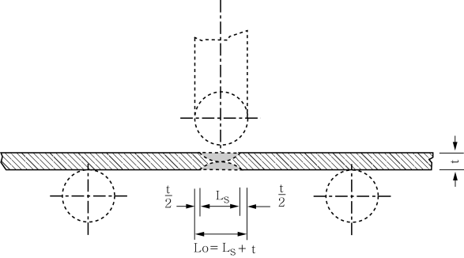
    **그림 2.2.43 굽힘 연신율의 표점거리**(*Lo*)
    - **(가)** 각 시험재로부터 채취하는 굽힘시험편의 종류, 개수 등은 용접용재료의 종류에 따라서 **602.**의 **5**항 (3)호, **603.**의 **5**항 (3)호 또는 **604.**의 **5**항 (3)호의 규정을 준용한다.
    - **(나)** 시험편은 **표 2.2.79**에 규정하는 안쪽반지름을 갖는 플런저로 앞면굽힘 및 뒷면굽힘을 하고 굽힘각도 120${}^{\circ}$이상에 도달하여도 시험편의 표면에 3 $\mathrm{mm}$를 넘는 균열, 또는 기타의 결함이 생겨서는 안 된다.
    - **(다)** 굽힘각도가 120°에 도달하지 못하는 경우 굽힘시험 후 **그림 2.2.43**에 나타낸 표점거리 *Lo*로 측정한 굽힘 연신율이 **표 2.2.67**에 규정한 연신율 값을 만족하는 경우에는 굽힘시험에 합격한 것으로 간주할 수 있다.
  - **(4)** **맞대기용접 충격시험**
    - **(가)** 각 시험재로부터 채취하는 충격 시험편의 종류, 개수, 채취방법 등은 용접용재료의 종류에 따라서 **602.**의 **5**항 (4)호, **603.**의 **5**항 (4)호 또는 **604.**의 **5**항 (4)호의 규정을 준용한다.
    - **(나)** 시험온도 및 평균흡수에너지값은 **표 2.2.77**에 따른다.
    - **(다)** **602.**의 **5**항 (4)호 (나) 및 (라)의 규정을 준용한다.
- **6.** **수소시험**
  - **(1)** 수소시험은 우리 선급이 적당하다고 인정하는 글리세린치환법, 수은법, 열전도도검출기법 또는 기타 우리 선급이 적당하다고 인정하는 바에 따른다. (2017)
  - **(2)** 수소량의 평균치는 (1)호에서 규정하는 시험방법 및 용접용재료의 종류에 따라서 **표 2.2.80**의 규격에 합격하여야 한다.

    **표 2.2.80 수소량의 규격치** ***(2017)*** ***(******2019)***

    | 용접용재료의 종류 | 표시기호 | 수소량의 규격치($\mathrm{cm} ^{3} /g$) |   |   |
    | --- | --- | --- | --- | --- |
    | 용접용재료의 종류 | 표시기호 | 글리세린 치환법 | 수소법 | 열전도도검출 기법 |
    | 2*Y*42∼50, 3*Y*42∼50, 4*Y*42∼50, 5*Y*42∼50 | *H* 10 | 0.05 이하 | 0.10 이하 | 0.10 이하 |
    | 2*Y*55∼96, 3*Y*55∼96, 4*Y*55∼96, 5*Y*55∼96 | *H* 5 | - | 0.05 이하 | 0.05 이하 |
- **7.** **필릿용접 시험**
  - **(1)** **필릿용접 시험재** 시험재는 **602.**의 **7**항 (1)호의 규정을 준용한다.
  - **(2)** **필릿용접의 매크로조직시험** 매크로조직시험은 **602.**의 **7**항 (2)호의 규정을 준용한다.
  - **(3)** **필릿 용접의 경도시험** 경도시험은 **602.**의 **7**항 (3)호의 규정을 준용한다.
  - **(4)** **필릿용접의 파면시험** 파면시험은 **602.**의 **7**항 (4)호의 규정을 준용한다.
- **8.** **정기검사**
  연차검사는 용접용재료의 종류에 따라서 **602.**의 **8**항, **603.**의 **8**항 또는 **604.**의 **8**항의 규정을 준용한다. 단, 자동용접용재료는 일반적으로 다층용접법에 대한 규정을 준용한다. 또한 *Y*89 및 *Y*96 강도 등급의 용접용재료는 수소시험을 해야 한다. (2019)
- **9.** **종류의 변경**
  승인된 용접용재료의 강도나 인성 또는 수소함량에 관한 종류를 변경하는 경우에는 용접용재료의 종류에 따라서 **602.**의 **9**항, **603.**의 **9**항 또는 **604.**의 **9**항의 규정을 준용한다. *(2017)* 
