# 제2편 재료 및 용접

> 선급 및 강선규칙/적용지침 / RA-02-K / 2025 / KO / Guidance

## 제 1 장 재료

### 제 1 절 일반사항

#### 101. 적용 【규칙 참조】

- **1.** 보일러용 이음매 없는 단조동체에 대하여는 **부록 2-1**에 따른다.
- **2.** FRP선 및 복합용기 등의 제조 또는 수리에 사용되는 강화플라스틱 재료에 대하여는 **부록 2-8**에 따른다. *(2017)*
- **3.** 피로성능을 향상시킨 선체구조용 압연강재에 대하여는 **부록 2-10**에 따른다.
- **4.** **규칙 101.**의 **2**항의 적용은 다음에 따른다. *(2019)*
  - **(1)** **규칙 2편 1장**에서 규정된 재료와 동등하다고 판단되는 재료(**ISO**, **ASTM** 등과 같이 국제/국가표준에 따른 재료)에 있어서 특별히 규정된 것을 제외하고, 화학성분, 기계적 성질 및 열처리는 해당 표준 및 규격을 따를 수 있다.
  - **(2)** 상기 (1)호에서 “동등하다고 판단되는 재료”의 제조법 승인, 시험 및 검사 등은 **규칙 2편 1장**의 규정을 준용하며, 우리 선급에 의한 승인 및 검사를 면제하는 것은 아니다.
  - **(3)** 상기 (1)호의 “특별히 규정된 것“이라 함은, 일반적으로 용도에 따른 요구사항을 의미한다.
- **5.** 액화천연가스 운반선의 화물탱크 또는 액화천연가스 연료추진선의 연료탱크의 제조에 사용되는 고망간강에 대하여는 **부록 2-11**에 따른다. *(2020)*

#### 102. 제조법 승인 및 제조관리

**1. 규칙 102. 2**항 (2)호의󰡒제조공정관리의 불안정”에는 제어압연, 노멀라이징 또는 퀜칭후 템퍼링 공정에 편차가 발생한 경우를 포함한다. **【규칙 참조】**

#### 103. 화학성분

- **1.** **규칙 103.**의 **1**항의 적용은 다음에 따른다. **【규칙 참조】**
  - **(1)** 레이들마다의 화학분석 시험은 철강재료에 적용한다.
  - **(2)** 용탕마다의 화학분석 시험은 비철재료에 적용한다.
- **2.** **규칙 103. 2**항의 “우리 선급이 필요하다고 인정하는 경우”라 함은 제조자가 발행한 레이들 화학성분 분석보고서의 신뢰성이 낮다고 판단되는 경우를 말한다. **【규칙 참조】**
- **3.** **규칙 103.**의 **3**항의 적용은 다음에 따른다. **【규칙 참조】**
  - **(1)** 분석시료 채취방법
    분석시료는 기계시험편 또는 기계시험편을 채취한 인접한 곳에서 채취한다.
  - **(2)** 강재의 제품분석 허용 변동치
    철강재료의 화학성분 허용 변동치는 *KS D*0228(강재의 제품 분석 방법 및 그 허용 변동치) 또는 우리선급이 적절하다고 인정하는 공인된 국제표준에 따른다.

#### 104. 시험 및 검사

**규칙 104.**의 **4**항의󰡒우리 선급이 별도로 정하는 품질보증제도의 승인󰡓이란 **제조법 및 형식승인 등에 관한 기준 5장**의 규정에 따라 재료 제조자의 품질보증제도를 승인한 경우를 말한다. **【규칙 참조】**

#### 107. 시험증명서 등 (2019)

재료의 화학성분 및 기계적 시험의 결과는 유효 숫자의 최하위 자릿수의 다음 자릿수까지 측정되어야한다. 그 이후에 측정된 결과값은 **ISO 80000-1**의 부속서 B에 따라 반올림하여 유효숫자와 동일한 자릿수가 되도록 표시한다. 그 외 다른 방법이 이용될 경우, 우리 선급과 미리 협의하여야 한다. **【규칙 참조】**

#### 109. 재시험

**규칙 109.**의 **4**항의 적용에 있어서,󰡒시험편이 표점사이의 중앙으로부터 양단 방향으로 각각 표점거리의 1/4을 초과하는 곳에서 절단󰡓이라 함은 **지침 그림 2.1.1**의󰡒B󰡓및󰡒C󰡓부분에서 절단되는 경우를 말한다. **【규칙 참조】**

### 제 2 절 시험편 및 시험방법

#### 201. 일반사항

- **1.** **적용 규칙 201.**의 **1**항 (2)호의 규정에서 ISO 또는 KS 규격에 따른 시험편 또는 시험방법을 적용할 경우에는 우리 선급의 승인을 받을 필요가 없다. **【규칙 참조】**
- **2.** **시험기 규칙 201.**의 **2**항 (2)호 및 (3)호의󰡒우리 선급이 인정하는 기준󰡓이라 함은 **규칙 1편 1장 105.**에 따라 인정하는 것을 말한다. **【규칙 참조】**
- **3.** **시험편의 채취 규칙 201.**의 3항 (2)호의󰡒승인된 경우󰡓라 함은 **제조법 및 형식승인 등에 관한 기준 제2장**의 규정에 따라 해당재료가 제조법 승인을 받은 경우를 말한다. **【규칙 참조】**

#### 202. 시험편의 모양 및 치수

- **1.** **인장시험편**
  - **(1)** **규칙 그림 2.1.1**에 규정하는 *R* 14*B*호 시험편은 **규칙 201.**의 **1**항 (2)호의 규정에 따라서 **지침 표 2.1.1**에 규정된 표점 거리를 가진 시험편을 사용하여도 좋다. **【규칙 참조】**

    **표 2.1.1 표점거리를 구하는 방법**

    | 시험편의 두께 $t$ (mm) | 시험편의 나비$W$ (mm) | 표점거리 $L$ (mm) |
    | --- | --- | --- |
    | 3 ≤ $t$ ≤ 4 | 25 | 50 |
    | 4 ＜ $t$ ≤ 5 | 25 | 60 |
    | 5 ＜ $t$ ≤ 7 | 25 | 70 |
    | 7 ＜ $t$ ≤ 10 | 25 | 80 |
    | 10 ＜ $t$ ≤ 15 | 25 | 100 |
    | 15 ＜ $t$ ≤ 20 | 25 | 120 |
    | 20 ＜ $t$ ≤ 30 | 25 | 140 |
    | 30 ＜ $t$ ≤ 40 | 25 | 160 |
  - **(2)** **규칙 202.**의 **1**항 (4)호의 적용은 다음에 따른다. **【규칙 참조】**
    $E=n \cdot F$
    $E$ : **규칙 그림 2.1.1**에서 규정하는 비례치수 시험편($L=5.65 \sqrt {A}$)을 사용할 경우에 상당하는 연신율.
    $n$ : 임의의 시험편을 사용할 경우의 연신율.
    $F$ : 연신율의 보정계수로서 비례치수 시험편에 대한 *F*의 값은 시험편의 표점거리에 따라 **지침 표 2.1.2**에 따른다.

    **표 2.1.2** *F***의 값**

    | 시험편의 표점거리($L$) | 재료 1 | 재료 2 |
    | --- | --- | --- |
    | 8 *D* | 1.21 | 1.29 |
    | $8 \sqrt {A}$ | 1.15 | 1.21 |
    | 4 *D* | 0.91 | 0.88 |
    | $4 \sqrt {A}$ | 0.87 | 0.82 |
    | $D$ : 시험편의 지름, $A$ : 시험편의 단면적 |   |   |
    - **(가)** 스테인리스강 및 알루미늄합금은 재료 1로 한다. 한편 동합금의 경우에는 **규칙 202.**의 **1**항 (4)호에 규정된 보정은 필요하지 아니하다.
    - **(나)** 시험편의 수가 많아서 **규칙 202.**의 **1**항 (4)호에 정하는 보정을 하기가 복잡할 경우에는 연신율 규격치를 다음 식에 따라서 보정하여도 좋다. 이때 재료시험의 성적서에는 보정한 규격치를 기재하여야 한다.
- **2.** **충격시험편**
  - **(1)** **규칙 202.**의 **3**항 (3)호의 적용에 있어서 강재의 두께에 따라 허용되는 서브사이즈 시험편은 다음에 따른다.
    **【규칙 참조】**

    | 강재의 두께 | 서브사이즈 시험편의 너비 |
    | --- | --- |
    | $6 \mathrm{mm} \leq t \prec 9 mm$ | 5 mm |
    | $9 \mathrm{mm} \leq t \prec 12 mm$ | 7.5 mm |
  - **(2)** **규칙 202.**의 **3**항 (5)호의 적용에 있어서, 충격시험기의 용량관계로 부득이하게 서브사이즈 시험편을 사용하고자 하는 경우, 서브사이즈 시험편의 충격 흡수에너지값이 10 mm 시험편에 대하여 규정된 값을 충족하는 것을 조건으로 인정할 수 있다. **【규칙 참조】**

#### 203. 시험방법 (2017) (2021)

- **1.** $K_ca$**(취성균열 정지인성) 시험방법 【규칙 참조】**
  - **(1)** 적용
    - **(가)** **규칙 203.**의 시험방법과 관련하여, 두께 50 mm가 넘고 100 mm 이하의 선체구조용 압연강판의 $K_ca$(취성균열 정지인성)을 평가하기 위한 시험방법이다.
    - **(나)** **ISO 20064:2019**는 온도 구배가 있는 넓은 강판을 사용하여 강재의 취성균열 정지인성을 결정하기 위한 시험방법을 제공한다. *(2024)*
    - **(다)** 이 항은 **ISO 20064:2019**에 명시된 특정 온도에서 파괴역학 파라미터 및 $K_ca$ 결정 방법을 사용하여 강재의 취성균열 정지 인성($K_ca$)의 시험 절차에 대해 규정한다. 또한 이 항은 시험강재의 $K_ca$ 평가방법을 규정한다. *(2024)*
  - **(2)** 시험절차 *(2024)*
    시험 장비, 시험편, 시험 방법, 정지인성의 결정, 시험결과 보고서 작성 등을 포함한 시험절차는 **ISO 20064:2019**를 따른다. 취성균열 개시방법으로써, 2차 하중 매커니즘(secondary loading mechanism)은 **ISO 20064:2019**의 Annex D에 따라 적용될 수 있다. 단, **ISO 20064:2019**의 Annex B.2.4의 첫 번째 문장은 "Obtain the value $"{"K _{ca}/[K_{0}*\exp(-c/T_{Kca})]"}"$ for each data point"으로 변경한다.
  - **(3)** 특정 온도에서의 $K_ca$ 결정 및 평가 *(2024)*
    특정 온도에서 $K_ca$를 얻기 위해 여러 시험을 수행하는 방법은 **ISO 20064:2019**의 Annex B를 따른다.
    보간법에 의한 유효한 $K_ca$ 데이터의 아레니우스표(Arrhenius plot)의 직선 근사(straight-line approximation)는 다음 (a) 또는 (b)를 따른다.
    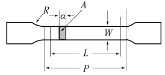
    **그림 2.1.2 –10 ℃에서의** $K_ca$ **평가 예시**
    
    **그림 2.1.3 요구되는** $K_ca$**에 대응하는 온도 평가 예시**
    - **(가)** 방법 (2024)
    - **(나)** 평가
      - **(a)** $K_ca$의 평가온도(-10 °C)는 정지온도의 상한과 하한 사이에 있어야 하며, **지침 그림 2.1.2**와 같이 평가온도에 대응하는 $K_ca$는 요구되는 $K_ca$(예 : 6,000 $N/mm^3/2$ 또는 8,000 $N/mm^3/2$)보다 낮으면 안 된다.
      - **(b)** 요구되는 $K_ca$(예 : 6,000 $N/mm^3/2$ 또는 8,000 $N/mm^3/2$)에 대응하는 온도는 정지온도의 상한과 하한 사이에 있어야 하며, **지침 그림 2.1.3**과 같이 요구되는 $K_ca$에 대응하는 온도는 평가온도(-10 °C)보다 높지 않아야 한다.
      - **(c)** 만약 (a)와 (b)를 모두 만족시키지 않는다면, 이 조건을 충족시키기 위해 추가 시험을 한다.
- **2.** **CAT(균열정지온도) 등온시험 수행을 위한 요구사항 개요**
  - **(1)** 적용
    - **(가)** 이 규정은 **규칙 2편 1장 312.**에서 정의된 범위에 따라 적용된다.
    - **(나)** 이 규정은 등온 조건에서 유효한 시험 결과를 결정하고 CAT(균열정지온도)를 수립하기 위한 등온균열정지시험을 실시할 때의 시험 절차 및 시험 조건에 대한 요구 사항을 명시한다. 이 규정은 두께가 50 mm 이상 100 mm 이하인 강재에 적용한다.
    - **(다)** 이 방법은 평가되는 시험편에서 등온 온도를 사용한다. 이 규정에서 명시되지 않은 시험 기준은 **ISO 20064:2019**를 따른다. *(2024)*
    - **(라)** **규칙 2편 1장 312.**의 **표 2.1.45**는 CAT(균열정지온도)로 설명된 취성균열 정지특성에 대한 관련 요구사항을 제공한다.
    - **(마)** 제조자는 검토용으로 우리 선급에 시험 절차를 시험 전에 제출해야 한다.
    - **(바)** 필요한 경우, (8)호 (다)에 따라 강재가 재료 물성으로써 전파하는 취성균열(결정된 CAT)을 정지시킬 수 있는 최저 온도를 결정하는 용도로 이 시험 방법이 사용될 수 있다.
  - **(2)** 기호
    **ISO 20064:2019 표 1**의 기호에 추가하여 등온시험에 대한 기호는 **지침 표 2.1.3**을 따른다. *(2024)*

    | 기호 | 단위 | 의미 |
    | --- | --- | --- |
    | t | mm | 시험편의 두께 |
    | L | mm | 시험편의 길이 |
    | W | mm | 시험편의 너비 |
    | $a_MN$ | mm | 시험편 가장자리의 가공된 노치 길이 |
    | $L_SG$ | mm | 시험편 가장자리에서 측면 홈 길이. $L_SG$는 측면 홈 끝에서 곡선부분의 깊이를 제외하고 일정한 깊이를 가진 홈 길이로 정의된다. |
    | $d_SG$ | mm | 일정한 깊이를 가진 단면의 측면 홈 깊이 |
    | $L_{EB-\min}$ | mm | 시험편 가장자리와 전자빔(electron beam) 재용융 영역 앞면 사이의 최소 길이 |
    | $L_{EB-s1, -s2}$ | mm | 시험편 가장자리와 시험편 두 측면에 있는 전자빔(eletron beam) 재용융 영역 사이의 길이 |
    | $L_{LTG}$ | mm | 취성균열 전파경로의 온도구배 영역 길이 |
    | $a_{arrest}$ | mm | 정지균열 길이 |
    | $T_{target}$ | ℃ | 목표 시험온도 |
    | $T_{test}$ | ℃ | 정의된 시험온도 |
    | $T_{arrest}$ | ℃ | 유효한 취성균열 정지 거동이 관찰되는 목표 시험 온도 |
    | σ | $N/mm^2$ | Wxt의 단면에 가해지는 시험응력 |
    | SMYS | $N/mm^2$ | 승인받고자 하는 시험강종의 규격 항복강도 |
    | CAT | ℃ | 전파하던 취성균열을 정지시키는 최저온도 $T_{arrest}$인 균열정지온도 |
  - **(3)** 시험장비
    - **(가)** 사용되는 시험장비는 승인받고자 하는 강종의 SMYS의 ⅔에 해당하는 인장하중을 가하기에 충분한 유압 용량을 보유해야 한다.
    - **(나)** 온도 제어 시스템은 시험편의 지정된 영역에 온도를 $T_{target}$의 ± 2℃ 이내로 유지할 수 있어야 한다.
    - **(다)** 취성균열을 개시하는 방법으로는 하중 낙하(drop weight) 형식, 에어건(air gun) 형식 또는 이중장력탭판(double tension tab plate) 형식을 선택할 수 있다.
    - **(라)** 시험 장비에 대한 상세 요구사항은 **ISO 20064:2019**를 따른다. *(2024)*
  - **(4)** 시험편
    
    **비고 : 시험시 취성균열 개시를 제어하기 위해 0.1mmR 및 1mmR 범위에서 톱 절단되는 노치 반경을 가공할 수 있다.**
    **그림 2.1.4 충격 형식 시험편의 치수**
    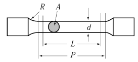
    **그림 2.1.5 측면 홈 형상 및 치수**

    | 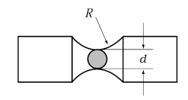 |
    | --- |
    | (a) 측면 홈이 없는 경우 (b) 측면 홈이 있는 경우 |

    탭판 및 핀척의 구성 및 크기는 **ISO 20064:2019**를 참조한다. 또한 시험편, 탭판 및 핀척으로 용접된 통합시험편의 용접 변형은 **ISO 20064:2019**의 요구사항 범위 내에 있어야 한다. *(2024)*
    - **(가)** 균열개시의 충격 형식
      - **(a)** 시험편에 대한 별도 규정하지 아니한 사항에 대해서 **ISO 20064:2019**를 따른다. *(2024)*
      - **(b)** 시험편의 치수는 **지침 그림 2.1.4**에서 나타낸다. 시험편의 너비 W는 500 mm이어야 한다. 시험편의 길이 L은 500 mm 이상이어야 한다.
      - **(c)** 취성균열 개시를 위한 V형 노치는 충격 면의 시험편 가장자리에 가공된다. 가공된 전체 노치 길이는 29 mm이어야 하며, ± 1mm의 공차 범위를 가진다.
      - **(d)** 측면 홈의 요구사항은 (라)에 따른다.
    - **(나)** 균열개시의 이중장력 형식
      - **(a)** 2차하중탭의 형상과 크기 및 취성균열 발생을 위한 2차하중 방법에 대해서는 **ISO 20064:2019**의 Annex D를 참조한다. *(2024)*
      - **(b)** 이중장력 형식 시험에서, 2차하중탭판은 취성균열 개시를 용이하도록 향상시키기 위해 추가로 냉각될 수 있다.
    - **(다)** 취성영역 설정
      - **(a)** 취성균열 전파 개시를 보증할 수 있는 취성영역이 설정되어야 한다. 취성영역을 용이하도록 하기 위해 전자빔용접(EBW) 또는 국부온도구배(LTG)가 선택될 수 있다.
      - **(b)** EBW 취성부에서, 전자빔용접은 가공된 V노치 앞의 시험편 중심선인 예상되는 초기 균열 전파 경로를 따라 실시된다.
      - **(c)** 취성영역은 시험편 두께에 걸쳐 완전용입되어야 한다. EBW는 일면 용입이 추천되지만, 일면 용입으로 완전 용입이 어려운 경우에는 양면 용입도 실시될 수 있다.
      - **(d)** EBW 취성부는 시험편의 윤곽 가공 전에 완료되는 것이 추천된다.
      - **(e)** EBW 취성부는 적절한 품질이어야 한다.
      - **(f)** EBW는 시종단부에서 불안정한 거동을 나타낸다. 따라서 안정된 EBW를 유지하기 위해 시단부에서 전력을 증가시켜 제어하거나 이동/복귀(go/return) 방식을 사용하여 취성영역 팁 측면에서부터 시험편 가장자리로 시작하는 것을 추천한다.
      - **(g)** LTG시스템에서, 가공된 노치팁과 등온 시험 영역 사이에 지정된 국부온도구배는 등온 온도 제어 후에 조절한다. 취성균열이 개시되기 직전에 LTG 온도 제어가 실시되어야 하지만, 두께에 걸쳐 안정된 온도 구배가 보장되어야 한다.
    - **(라)** 측면 홈
      - **(a)** 취성균열 전파를 직선으로 유지하기 위해 취성 영역을 따라 측면의 측면 홈을 가공 할 수 있다. 측면 홈은 이 규정에서 명시된 경우에 가공한다.
      - **(b)** EBW 취성부에서 측면 홈이 반드시 필요한 것은 아니다. EBW의 사용은 쉬어립스(shear lips)를 피할 수 있다. 그러나 파단된 시험편에 쉬어립스(shear lips)가 뚜렷한 경우(예 : 양쪽 측면에서 두께 1 mm가 넘는 쉬어립스(shear lips))에는 쉬어립스(shear lips)를 억제하기 위해 측면 홈을 가공한다.
      - **(c)** LTG 취성부에서 측면 홈은 필수이다. 형상과 크기가 같은 측면 홈을 양쪽 측면에 가공해야 한다.
      - **(d)** 측면 홈의 길이 $L_SG$는 요구되는 취성영역 길이의 합보다 짧으면 안 된다. *(2024)*
      - **(e)** 측면 홈이 사용될 때, 측면 홈 깊이, 팁 반경 및 개구 각도를 조절하면 안 되지만, 어느 한 쪽에서 두께 1 mm 이상의 쉬어립스(shear lips)가 발생하는 것을 피하기 위해서는 적절히 조절 가능하다. 측면 홈 치수의 예시는 **지침 그림 2.1.5**에서 나타낸다.
      - **(e)** 측면 홈 종단부는 홈 깊이 $d_SG$ 이상의 곡률을 가지고 점진적으로 홈 깊이를 얕게 가공해야 한다. 측면 홈 길이 $L_SG$는 측면 홈 종단부에서 깊이의 곡선부를 제외하고 일정한 깊이를 가진 홈 길이를 말한다.
    - **(마)** 취성영역의 공칭 길이
      - **(a)** 취성영역의 길이는 150 mm 이상이어야 한다. *(2024)*
      - **(b)** EBW영역 길이는 **지침 그림 2.1.6**에서처럼 시험편 가장자리와 EBW 최전선(front line) 사이의 3가지인 $L_{EB-\min}$, $L_{EB-s1}$과 $L_{EB-s2}$ 를 시험 후 파단면에서 측정하여 구한다.
      - **(c)** 시험편 가장자리와 EBW 최전선(front line) 사이의 최소 길이 $L_{EB-\min}$은 150 mm 이상이어야 한다. 그러나 $L_{EB-\min}$이 150 mm-0.2t 이상이면 허용할 수 있다(t=시험편 두께). $L_{EB-\min}$이 150mm보다 작은 경우, 온도 안전 여유치(margin)가 $T_{test}$에 고려되어야 한다((8)호 (가) (b) 참조).
      - **(d)** 또 다른 두 가지는 $L_{EB-s1}$ 및 $L_{EB-s2}$로 표시되는 것처럼 시험편 가장자리와 EBW 최전선(fron line) 사이의 길이가 양쪽 측면에 나타난다. $L_{EB-s1}$과 $L_{EB-s2}$는 모두 150 mm 이상이어야 한다.
      - **(e)** LTG 시스템에서 $L_{LTG}$는 150mm으로 한다.
    - **(바)** 탭판/핀척 상세 및 시험편과 탭판간의 용접
  - **(5)** 시험 방법
    시험시 예기치 않은 취성균열 발생을 피하기 위해 실온에서 선행 하중을 가할 수 있다. 가해진 하중 값은 시험 응력보다 크지 않아야 한다. 선행 하중은 취성균열 발생이 예상되는 온도보다 높은 온도에서 가해져야 한다. 그러나 시험편에 100℃ 이상의 온도를 가해서는 안 된다.
    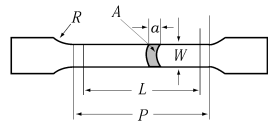
    **그림 2.1.7 온도 측정 위치**
    (ⅰ) 너비와 길이 방향으로 0.3W~0.7W 범위 내의 열전대 온도는 목표 시험온도 $T_target$의 ±2℃ 이내에서 제어되어야 한다.
    (ⅱ) 0.3W~ 0.7W범위의 모든 측정 온도가 $T_target$에 도달한 경우, 시험 하중을 가하기 전에 두께 중심부로 균일한 온도 분포를 보장하기 위해 지속적인 온도 제어가 최소 10+0.1xt[mm]분 동안 유지되어야 한다.
    (ⅲ) 가공된 노치 팁은 취성균열을 쉽게 개시하기 위해 국부적으로 냉각될 수 있다. 하지만 국부 냉각은 0.3W~0.7W 범위의 온도 제어를 방해하지 않아야 한다.
    (ⅰ) LTG 시스템에서는 **지침 그림 2.1.7**의 온도 측정 외에도 가공된 노치 팁의 추가 온도 측정부인 $A_0$ 및 $B_0$에서 온도 측정이 필요하다. LTG 영역 내의 열전대 위치는 **지침 그림 2.1.8**에서 나타낸다.
    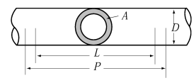
    **그림 2.1.8 LTG 영역과 추가 열전대 Ao 의 상세**
    (ⅱ) 너비와 길이 방향으로 0.3W~0.7W 범위 이내의 열전대 온도는 목표 시험 온도 $T_target$의 ±2℃ 내에서 제어되어야 한다. 그러나 0.3W($A_3$ 및 $B_3$ 위치)에서의 온도 측정은 아래 (f)에 따른다.
    (ⅲ) 0.3W~0.7W 범위의 모든 측정 온도가 $T_target$에 도달하면 두께 중심부로 균일한 온도 분포를 보장하기 위해 지속적인 온도 제어가 최소 10+0.1xt[mm]분 동안 유지되어야 한다. 이후에 시험 하중이 가해진다.
    (ⅳ) LTG는 가공된 노치 팁 주변의 국부 냉각에 의해 제어된다. LTG 프로파일(profile)은 **지침 그림 2.1.9**에 표시된 $A_0$에서 $A_3$까지의 온도 측정으로 기록되어야 한다.
    (ⅴ) LTG 영역은 영역 I, 영역 II 및 영역 III의 세 영역에서 온도 구배로 수립된다. 각 온도 구배에 허용되는 범위는 **지침 표 2.1.4**에 따른다.
    (ⅵ) $A_2$, $B_2$ 및 $A_3$, $B_3$에서의 온도 측정값들은 다음을 만족해야 한다. *(2024)*
    T at $A_3$, T at $B_3$ < $T_target$ – 2 ℃
    T at $A_2$ < T at $A_3$ – 5 ℃
    T at $B_2$ < T at $B_3$ – 5 ℃
    (ⅶ) $A_3$의 T와 $A_2$의 T가 위의 요구 사항을 만족할 때 $A_0$의 T 및 $A_1$의 T에 대한 온도 요구 사항은 없다. B면도 마찬가지이다.
    (ⅷ) $A_0$, $B_0$에서 $A_3$, $B_3$까지의 온도는 **지침 표 2.1.4**가 적용된 시험 계획 단계에서 결정되어야 하며, **지침 표 2.1.4**는 LTG 영역의 영역 I, 영역 II 및 영역 III 이 세 영역에서 권장되는 온도 구배를 제공한다.
    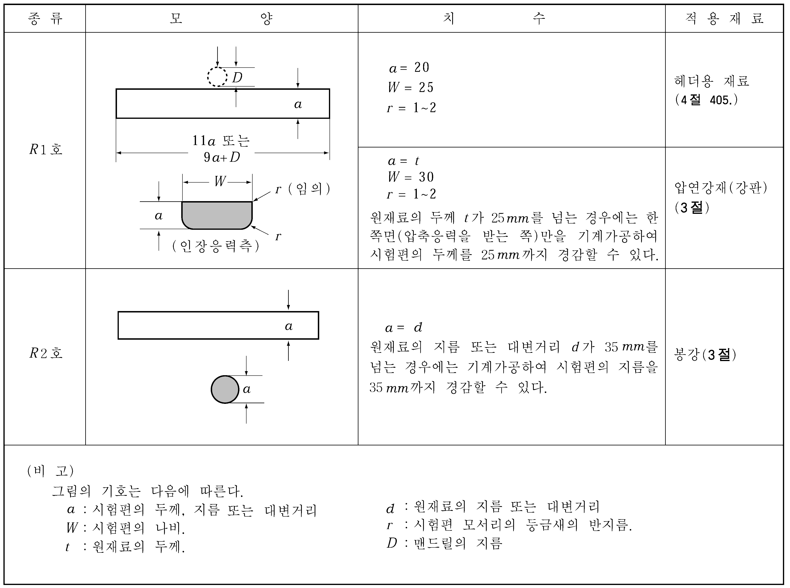
    **그림 2.1.9 LTG 영역의 도식화된 온도구배 프로파일**

    | 영역 | 가장자리로부터의 위치 | 온도구배의 허용범위 |
    | --- | --- | --- |
    | 영역 I | 29 mm~50 mm | 2.00 ℃/mm ~ 2.30 ℃/mm |
    | 영역 Ⅱ | 50 mm~100 mm | 0.25 ℃/mm ~ 0.60 ℃/mm |
    | 영역 Ⅲ(1) | 100 mm~150 mm | 0.10 ℃/mm ~ 0.20 ℃/mm |
    | (비고) (1) 영역III의 배치는 필수이다. |   |   |

    (ⅸ) 취성균열 개시 전에 두께 중심부로 균일한 온도 분포를 보장하기 위해 상기 언급된 LTG 구역의 온도 프로파일은 적어도 10+0.1xt[mm] 분 동안 유지한 후에도 보장되어야 한다.
    (ⅹ) 시험에서 LTG의 수용은 $A_0$에서 $A_3$까지 측정된 온도에 기초한 **지침 표 2.1.4**로부터 결정되어야 한다.
    정상 상태(steady state)에서의 온도 제어 및 유지 시간은 (c)에 명시된 EBW 취성부의 경우 또는 (d)에 명시된 LTG 취성부의 경우와 동일해야 한다.
    - **(가)** 선행 하중(preloading)
    - **(나)** 온도 측정 및 제어
      - **(a)** 열전대의 수와 위치를 포함하는 온도제어계획은 이 규정에 따른다.
      - **(b)** 열전대는 시험편 너비 방향으로 최대 50 mm 간격으로 양면에 부착해야 하며, 중심선으로부터 ± 100 mm 범위 내에 시험편 중심부(0.5W)에서 길이 방향으로 양면에 부착해야 한다. (**지침 그림 2.1.7** 참조)
      - **(c)** EBW 취성부
      - **(d)** LTG 취성부
      - **(e)** 이중장력 형식 균열 개시 시험편
    - **(다)** 하중 및 취성균열 개시
      - **(a)** 시험 전에 목표 시험 온도($T_target$)를 선택한다.
      - **(b)** 가해지는 응력이 시험되는 강종의 SMYS의 2/3이어야 되는 것을 제외하고, 시험 절차는 **ISO 20064:2019**를 따른다. *(2024)*
      - **(c)** 시험 하중은 균열이 개시되기 전 최소 30초 동안 시험 목표 하중 이상으로 유지되어야 한다.
      - **(d)** 모든 온도 측정 및 가해진 힘이 기록된 후에 충격 또는 2차탭판장력(secondary tab plate tension)으로 취성균열을 개시시킬 수 있다.
  - **(6)** 시험 이후 측정 및 시험 유효성 판정
    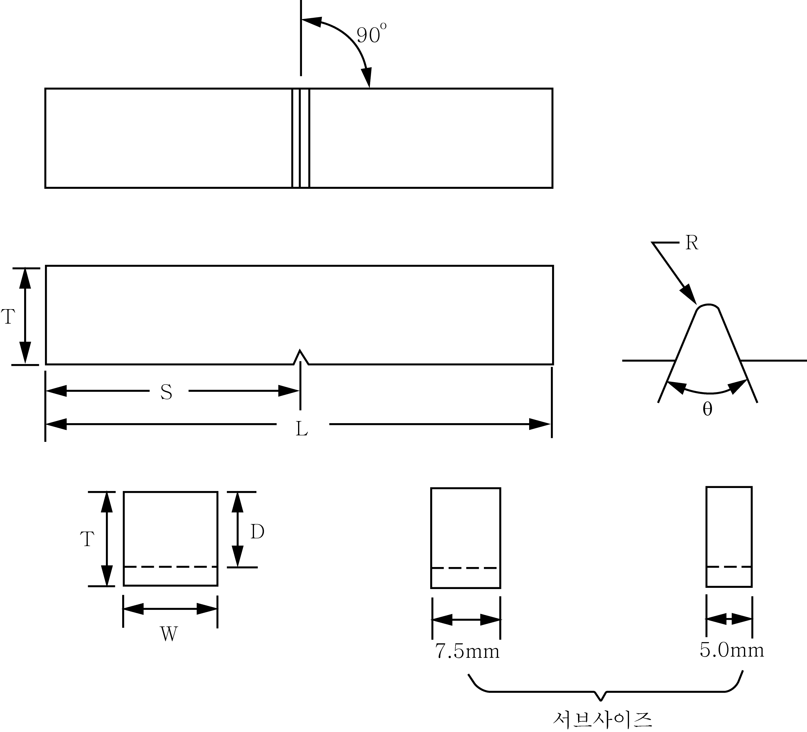
    **그림 2.1.10 주(main)균열 전파 경로의 허용 범위**
    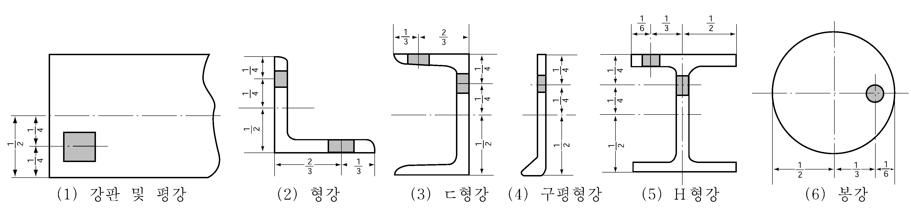
    **그림 2.1.11 결함 선 부위의 집계 절차**
    - **(가)** 취성균열 개시 및 유효성
      - **(a)** 만약 시험 힘에 도달하기 전 또는 시험 힘을 유지하는 명시된 시간을 달성하기 전에 취성균열이 자발적으로 시작되면, 시험은 무효가 된다.
      - **(b)** 만약 시험 힘에서 지정된 시간이 달성된 후에 충격 또는 2차탭장력 없이 취성균열이 자발적으로 개시된다면, 시험은 유효한 균열 개시로 간주된다. 균열 경로 및 파단 형상에 대한 유효성 판정은 다음에 이어지는 규정에 따라 검토된다.
    - **(나)** 균열 경로 검사 및 유효성
      - **(a)** 취성영역의 취성 균열 경로가 균열 변형 및/또는 균열 분기로 인해 LTG 시스템의 측면 홈 또는 EBW 선(line)에서 벗어날 경우, 시험은 유효하지 않은 것으로 간주해야 한다.
      - **(b)** 취성영역 끝단으로부터 모든 균열 경로는 **지침 그림 2.1.10**에 표시된 범위 내에 있어야 한다. 그렇지 않은 경우, 시험은 유효하지 않은 것으로 간주된다.
    - **(다)** 파단면 검사, 균열 길이 측정 및 유효성
      - **(a)** 파단면을 관찰하고 검사해야 한다. 균열 “개시"및 “전파"는 기록된 유효성 및 판정에 대해 검토되어야 한다. 균열 “정지”위치를 측정하고 기록해야 한다.
      - **(b)** V노치 팁 이외의 측면 홈 루트(root)에서 균열 개시 트리거(trigger) 포인트가 명확하게 탐지되면 시험은 유효하지 않다.
      - **(c)** EBW 취성부 설정시, EBW영역 길이는 (4)호 (마)에 정의된 $L_EB-s1$, $L_EB-s2$ 및 $L_{EB-\min}$의 3 가지 측정으로 정량화된다. $L_EB-s1$과 $L_EB-s2$ 중 하나 또는 둘 모두가 150 mm보다 작은 경우, 시험은 유효하지 않다. $L_{EB-\min}$이 150 mm-0.2t보다 작 으면 시험은 유효하지 않다.
      - **(d)** 취성 영역의 파단면 양쪽에서 두께 1 mm가 넘는 쉽어립(shear lip)이 측면 홈이 있거나 없는 시험편들과 구별되도록 시각적으로 관찰되면 시험은 무효가 된다.
      - **(e)** EBW 취성부 설정시, EBW 최전선(front line)을 넘어 취성 균열이 침투하는지 육안으로 검사해야 한다. EB 최전선(front line)으로부터 연속적인 취성파괴 형성 영역이 발견되지 않으면 시험은 유효하지 않다.
      - **(f)** EBW 취성영역의 용접 결함을 육안으로 검사해야 한다. 결함이 검출되면 정량화해야 한다. 취성균열 경로를 따라 EB 용접 영역을 통해 두께 선(line)에서 결함의 투영된 길이를 측정하고, 총 두께에 걸쳐 투영된 결함 부분의 총 점유 비율을 결함 선(line) 부위로 정의한다(**지침 그림 2.1.11** 참조). 결함 선(line) 부위가 10 %보다 크면 시험은 유효하지 않다.
      - **(g)** 양면 침투에 의한 EBW 취성부에서, 이중 용융선이 잘못 만나 유발되는 취성영역 파단면의 갭(gap)이 양면 침투의 겹친 선(line)에서 육안으로 검출되면, 시험은 유효하지 않다.
  - **(7)** “정지” 또는 “전파”의 판정
    “정지", “전파" 또는 “무효"의 최종 시험 판정은 아래 (가)~ (마)의 규정에 따른다.
    - **(가)** 취성균열이 시작되고 시험편이 두 부분으로 쪼개지지 않으면 파단면은 **ISO 20064:2019**에 명시된 절차에 따라 노출되어야 한다. *(2024)*
    - **(나)** 시험하는 동안 시험편이 두 부분으로 쪼개지지 않았을 때, 정지된 균열 길이 $a_arrest$는 파단면에서 측정되어야 한다. 충격 면의 시험편 가장자리로부터 정지된 균열 팁(가장 긴 위치)까지의 길이를 $a_arrest$로 정의한다.
    - **(다)** LTG 및 EBW의 경우, $a_arrest$는 $L_LTG$ 및 $L_{EB-s1}$, $L_{EB-s2}$ 또는 $L_{EB-\min}$보다 커야 한다. 그렇지 않은 경우, 시험은 유효하지 않은 것으로 간주된다.
    - **(라)** 시험 중 시험편이 두 부분으로 쪼개져도 취성균열 재개시가 분명하게 확인될 때 “정지"로 간주될 수 있다. 취성파괴에 의해 모든 파단면이 형성되더라도 취성영역으로부터 취성균열 표면의 일부가 얇은 연성 파열선(tear line)으로 연속적으로 둘러싸여 있을 때, 시험은 재개시 거동으로 판단될 수 있다. 그렇다면 파열선(tear line)으로 둘러싸인 부분의 최대 균열 길이를 $a_arrest$로 측정할 수 있다. 재개시가 육안으로 명백하게 확인되지 않으면, 시험은 "전파"로 판정된다.
    - **(마)** $a_arrest$값이 0.7W 이하인 경우, 시험은 “정지"로 판정된다. 그렇지 않은 경우, 시험은 “전파"로 판정된다.
  - **(8)** $T_test$, $T _{arrest}$ 및 CAT 결정
    동일한 $T_target$에 적어도 두 번의 “정지"시험이 반복되면 $T_target$에서 취성균열 정지 거동이 결정된다($T _{arrest}$=$T_target$). “전파" 시험 결과가 $T_target$와 같은 온도에서 여러 시험 결과를 포함하면 $T_target$을 $T_arrest$로써 결정할 수 없다.
    - **(가)** $T_test$ 결정
      - **(a)** 너비와 길이 방향으로 0.3W~0.7W 범위의 모든 온도 측정들이 취성균열 개시 시점에 $T_target$±2 ℃ 범위에 있다는 것이 열전대 측정 기록에서 보장되어야 한다. 그렇지 않은 경우, 시험은 유효하지 않다. 그러나 LTG 시스템에서 0.3W($A_3$ 및 $B_3$ 위치)에서의 온도 측정은 이 요건에서 제외된다.
      - **(b)** EBW 취성부에서 $L_{EB-\min}$이 150 mm이상이면, $T_test$는 $T_target$과 동일하게 정의될 수 있다. 그렇지 않으면, $T_test$는 $T_target$+5℃와 같아야 한다.
      - **(c)** LTG 취성부에서 $T_test$는 $T_target$과 동일하게 볼 수 있다.
      - **(d)** $T_test$에서의 최종 정지 판정은 “정지"로 판단되는 동일한 시험 조건에서 두 번 이상의 시험에 의해 결정된다.
    - **(나)** $T_arrest$ 결정
    - **(다)** CAT 결정
      - **(a)** CAT를 결정할 때, 2개의 “정지"시험과 1개의 “전파"시험이 필요하다. “전파”시험의 목표 시험 온도 $T_target$은 $T_arrest$보다 5℃ 낮은 온도로 선택하는 것을 추천한다. $T_arrest$의 최소 온도는 CAT로써 결정된다.
      - **(b)** “전파"시험이 없이 “정지"시험만으로는, CAT가 두 번의 “정지”시험에서의 $T_test$보다 낮다는 것만이 결정된다(즉, 결정적 CAT가 아님).
  - **(9)** 보고서
    아래의 항목들을 기재해야 한다.
    - 정상(steady) 시험 응력에서의 예비하중 응력 한계치, 유지시간 요구사항에 대한 판정
    - 등온 영역의 온도 산포 한계치(scatter limit)에 대한 판정
    - LTG 시스템을 사용하는 경우, 취성균열 트리거(trigger) 전에 국부 온도 구배 요구 사항에 대한 판정 및 일정한 국부 온도 구배 후 유지 시간 요구 사항에 대한 판정
    - 균열 경로에 대한 요구사항 판정
    - 벽개(cleavage) 트리거(trigger) 위치에 대한 판정(측면 홈 가장자리 또는 V노치인지 확인)
    - 쉬어립(shear lip) 두께 요구사항에 대한 판정
    - EBW 최전선(front line)으로부터 취성파괴 영역이 지속적인지에 대한 판정
    - EBW 결함 요구사항에 대한 판정
    - EBW 길이, $L_{EB-s1}$, $L_{EB-s2}$, $L_{EB-\min}$ 요구사항에 대한 판정
    - 쉬어립(shear lip) 두께 요구사항에 대한 판정
    (ⅰ) 취성균열 트리거(trigger) 후에 시험편이 두 부분으로 쪼개어지지 않은 경우의 정지균열 길이 $a_{arrest}$
    (ⅱ) 취성균열 트리거(trigger) 후에 시험편이 두 부분으로 쪼개어 진 경우, 취성균열 재개시 여부의 판정
    (ⅲ) 재개시된 경우, 정지균열 길이 $a_{arrest}$
    - 유효범위 내의 $a_{arrest}$ 판정(0.3W<$a_{arrest}$≤0.7W)
    - “정지”, “전파” 또는 “무효”인지에 대한 최종 판정
    - **(가)** 시험 재료 : 강종 및 두께
    - **(나)** 시험기 용량
    - **(다)** 시험편 치수 : 두께(t), 너비(W) 및 길이(L) 노치 상세 및 길이($a_MN$), 측면 홈 상세(가공된 경우)
    - **(라)** 취성영역 형식 : EBW 또는 LTG 취성부
    - **(마)** 통합시험편 : 탭판(tab plate)의 두께 및 너비, 탭판(tab plate)를 포함하는 통합시험편 길이, 하중 핀 간 거리, 각 변형 및 단차
    - **(바)** 취성균열 트리거(trigger) 정보 : 충격 형식 또는 이중장력, 충격 형식인 경우는 하중 낙하(drop weight) 형식 또는 에어건(에어 건) 형식 및 가해지는 충격에너지
    - **(사)** 시험 조건 : 가해지는 하중(예비하중 응력, 시험 응력)
    - **(아)** 시험 온도 : 측정된 온도(그림 및/또는 표) 및 목표 시험 온도를 위한 열전대 위치별 완전한 온도 이력
    - **(자)** 균열 경로 및 파단면 : 양면 및 균열 경로 측면에서 파단면을 보여주는 시험편 사진(“취성 영역 팁" 및 ”정지" 위치 표시)
    - **(차)** 취성영역 정보
      - **(a)** EBW 사용 : $L_{EB-s1}$, $L_{EB-s2}$ 및 $L_{EB-\min}$
      - **(b)** LTG 사용 : $L_{LTG}$
      - **(c)** 시험 결과 :
    - **(카)** 동적 측정 결과(요구되는 경우) : 균열 전파 속도 및 핀척에서의 변형률 변화 이력

### 제 3 절 압연강재

#### 301. 선체 구조용 압연강재

- **1.** **적용 규칙 301. 1**항 (4)호의 󰡒우리 선급이 절절하다고 인정하는 바󰡓라 함은 **규칙 1편 1장 105.**에 따라 인정하는 것을 말한다. **【규칙 참조】**
- **2.** **제조법**
  - **(1)** **규칙 301.**의 **3**항 (2)호에서 󰡒열가공제어법(TMCP)󰡓의 정의는 다음 **3**항에 따른다. **【규칙 참조】**
  - **(2)** **규칙 301.**의 **3**항, **표 2.1.6**의 비고 (13)에서 규정한 TMCP로 제조한 고장력강에 대한 탄소당량(Ceq)값은 **지침 표 2.1.5**에 따른다. **【규칙 참조】**

    **표 2.1.5 TMCP로 제조한 고장력강의 탄소당량(***Ceq***)** ***(2017)***

    | 강재의 종류 | 탄소당량(*Ceq*)(1) |   |
    | --- | --- | --- |
    | 강재의 종류 | $t$ ≤ 50 mm | 50 ＜ $t$ ≤ 100 mm |
    | *AH* 32, *DH* 32, *EH* 32, *FH* 32 | 0.36 이하 | 0.38 이하 |
    | *AH* 36, *DH* 36, *EH* 36, *FH* 36 | 0.38 이하 | 0.40 이하 |
    | *AH* 40, *DH* 40, *EH* 40, *FH* 40 | 0.40 이하 | 0.42 이하 |
    | (비고) (1) $Ceq=C+ \frac{Mn}{6} + \frac{Cr+Mo+V}{5} + \frac{N i+Cu}{15} \left( \% \right)$ |   |   |
  - **(3)** 우리 선급이 필요하다고 인정하는 경우, 전 (2)의 탄소당량 대신 아래 식에 의하여 구한 강재의 균열감수성 지수값(*Pcm*)의 제출을 요구할 수 있다.
    $P _{cm} = C + \frac{Si}{30} + \frac{Mn}{20} + \frac{Cu}{20} + \frac{N i}{60} + \frac{Cr}{20} + \frac{Mo}{15} + \frac{V}{10} +5B$
- **3.** **열처리 규칙 301.**의 **4**항 **표 2.1.8** 및 **표 2.1.9**의 비고 (1)에서 규정한 열처리의 정의는 다음에 따른다.(**지침 그림 2.1.12** 참조) **【규칙 참조】**
  - **(1)** **압연 그대로,** *AR (2018)*
    압연그대로란, 강재를 압연한 후 추가 열처리 없이 냉각시키는 압연법을 말한다. 일반적으로 압연 및 최종 압연을 노멀라이징 온도이상 및 오스테나이트 재결정 온도구역에서 실시한다. 이 공정으로 생산된 강재의 강도 및 연성은 압연 후 열처리를 실시한 강재 또는 개선된 공정으로 생산된 강재의 것보다 낮다.
  - **(2)** **노멀라이징,** *N (2018)*
    노멀라이징이란, 압연된 강재를 Ac_3 임계온도 이상의 오스테나이트 재결정 온도구역에서 규정된 시간동안 가열하고 공기 중에 냉각시키는 열처리 공정을 말한다. 이 공정으로 생산된 압연 그대로인 강재는 입자의 크기가 미세화 되고 균질화된 미세조직으로 되어 기계적 성질이 개선된다.
  - **(3)** **온도제어압연 (노멀라이징 압연),** *CR***(***NR***)** *(2018)*
    온도제어압연이란, 최종압연온도를 노멀라이징 열처리 구간내로 제어하고 그 이후에 공기 중에 냉각할 수 있는 압연법을 말하며 이 압연법으로 생산된 강재의 기계적 성질은 일반적으로 노멀라이징 열처리를 실시한 강재와 동등하다.
  - **(4)** **퀜칭 후 템퍼링 :** *QT (2018)*
    퀜칭이란 A_C3 이상의 적당한 온도로 규정된 시간동안 가열한 후 강재의 미세조직을 경화시키기 위하여 적당한 냉각제를 이용하여 냉각하는 열처리 공정을 말한다. 퀜칭 후 실시하는 템퍼링이란 강재의 미세조직을 개선하고 퀜칭으로 인한 잔류응력을 해소함으로써 인성을 회복하기 위하여 A_C1 이하의 적당한 온도로 규정된 시간 동안 유지하면서 재가열하는 열처리 공정을 말한다.
  - **(5)** **열가공압연 (열가공제어법),** *TM***(***TMCP***)**
    제어압연의 일종으로서 압연 온도뿐만 아니라 압하량을 엄격히 제어하는 것으로서 일반적으로 대부분의 압연을 오스테나이트 비재결정 구역에서 실시하고 Ar_3 근방의 온도구역(오스테나이트와 페라이트의 이상(dual-phase) 복합구간 포함)에서 압연을 종료하는 압연법을 말한다.
    열가공압연이 완료된 후 가속냉각, 직접소입법(direct quenching) 또는 템퍼링 처리는 별도로 선급의 승인을 얻은 후 적용할 수 있다.
  - **(6)** **가속냉각, AcC** *(2018)*
    가속냉각이란, 최종압연 후 Ar_3 이하의 온도구역을 냉각할 때 냉각속도를 공기 냉각보다 빠른 냉각속도로 제어하여 강재의 기계적성질을 개선하기 위한 공정을 말한다. 직접소입(Direct quenching)은 가속냉각에 해당되지 않는다.

    | 조 직 | 온 도 | 종 류 |   |   |   |   |
    | --- | --- | --- | --- | --- | --- | --- |
    | 조 직 | 온 도 | 종래의 제조법 |   |   |   | 열가공제어법 |
    | 조 직 | 온 도 | *AR* | *N* | *CR* *(NR)* | *QT* | *TM* |
    | 재결정 오스테나이트 | 슬래브 가열온도 노멀라이징 또는 담금질온도 Ar_3 또는 Ac_3 Ar_1 또는 Ac_1 템퍼링온도 | 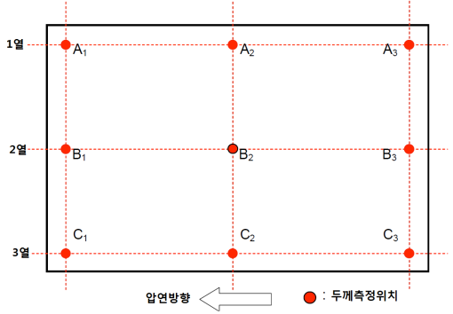 |   |   |   |   |
    | 비재결정 오스테나이트 | 슬래브 가열온도 노멀라이징 또는 담금질온도 Ar_3 또는 Ac_3 Ar_1 또는 Ac_1 템퍼링온도 |   |   |   |   |   |
    | 오스테나이트 + 페라이트 | 슬래브 가열온도 노멀라이징 또는 담금질온도 Ar_3 또는 Ac_3 Ar_1 또는 Ac_1 템퍼링온도 |   |   |   |   |   |
    | 펄라이트+페라이트 또는 페라이트+베이나이트 | 슬래브 가열온도 노멀라이징 또는 담금질온도 Ar_3 또는 Ac_3 Ar_1 또는 Ac_1 템퍼링온도 |   |   |   |   |   |
    | (비고) 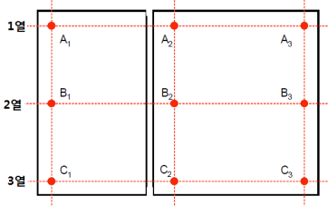 : 압연온도 시작 지점 **━** : 압연 종료 전에 냉각을 위한 대기(delay) *R* : 압연(reduction) *AR* : 압연그대로(as rolled) *N* : 노멀라이징(normalising) *CR*(*NR*) : 온도제어압연(노멀라이징 압연) : controlled rolling(normalising rolling) *AcC* : 가속냉각(accelerated cooling) *TM*(*TMC*P) : 열가공압연(thermal-mechanical rolling) (열가공제어법(thermal-mechanical controlled process)) (*) : 오스테나이트와 페라이트의 2상(dual-phase) 온도구역에서 압연을 종료하는 경우를 말한다. |   |   |   |   |   |   |
- **4.** **시험재의 채취**
  **규칙 301.**의 **6**항 (3)호의 규정에서󰡒우리 선급이 승인한 경우󰡓에 대하여는 다음에 따라도 좋다. **【규칙 참조】**
- **5.** **표면검사 및 치수허용차 규칙 301.**의 **8**항의 적용은 다음 각 호에 따른다. **【규칙 참조】**
  - **(1)** 우리 선급은 강재의 품질이 승인 당시와 동일하다는 것을 확인하기 위하여 표면검사를 할 수가 있다.
  - **(2)** 강판의 표면결함 중 기포 및 흠에 대한 표면검사기준은 *KS D*0208(강의 소지흠 육안 시험 방법)을 표준으로 한다.
  - **(3)** 강재의 치수허용차는 강판의 호칭두께에 대한 마이너스 허용차를 제외하고는 KS D3051(열간 압연 봉강 및 코일 봉강의 모양ㆍ치수 및 무게와 그 허용차), KS D3052(열간압연 평강의 모양. 치수 및 무게와 그 허용차), KS D3500(열간압연 강판 및 강대의 모양, 치수, 무게 및 그 허용차), KS D3502(열간압연 형강의 모양ㆍ치수 및 무게와 그 허용차)를 표준으로 한다.
- **6.** **품질 및 결함의 보수** ***(2018)***
  - **(1)** **규칙 301.**의 **9**항 (3)호의 초음파탐상검사방법 및 판정기준은 *EN*10160 *Level S1/E1* 또는 *ASTM A*578의 *Level C* 또는 우리 선급이 동등하다고 인정하는 기준에 따른다. **【규칙 참조】**
- **7.** **가공 규칙 301.**의 **12**항의 냉간가공 한계는 다음의 각 호에 따른다. **【규칙 참조】**
  - **(1)** 구조용 부재에 사용되는 강재에 대한 최대 소성변형률은 10 % 미만(내부 굽힘 반경이 판 두께의 4.5배 이상)이어야 한다.
  - **(2)** 소성변형률이 10 %를 초과할 경우, 우리선급이 적절하다고 인정하는 바에 따라 추가로 시험을 요구할 수 있다.
  - **(3)** 어떠한 경우에도 해머링을 하여서는 아니된다.

#### 302. 보일러용 압연강판

- **1.** **시험재의 채취 규칙 302.**의 **6**항을 적용함에 있어서 주문자가 자기 공장에서 **규칙 302.**의 **3**항 (2)호에 규정하는 노멀라이징을 하는 경우의 시험재의 채취는 다음에 따른다. **【규칙 참조】**
  - **(1)** 제조자는 주문자의 요구에 따라 시험재에 한하여 노멀라이징을 한다. 다만, 주문자의 요구가 없는 경우에는 제조자가 적절히 노멀라이징을 하여도 좋다. 이 경우에 제조자는 시공한 노멀라이징 조건을 주문자에게 통고하도록 한다.
  - **(2)** 시험재는 주문자의 공장에서 노멀라이징을 한 강판에서 채취하든가 또는 강판과 동시에 노멀라이징을 행한 것으로 한다.
  - **(3)** 전 각호의 시험편의 기계적성질은 **규칙 표 2.1.12**에 따른다.
- **2.** **표시 지침 302.**의 **1**항의 규정에 따라 시험재에 노멀라이징을 한 경우에는 재료기호 끝에󰡒TN󰡓을 부기한다.

#### 303. 압력용기용 압연강판

- **1.** **시험재의 채취 규칙 303.**의 **6**항을 적용함에 있어서 주문자가 자기 공장에서 **규칙 303.**의 **3**항 (2)호에 규정하는 노멀라이징을 하는 경우의 시험재의 채취는 다음에 따른다. **【규칙 참조】**
  - **(1)** 제조자는 주문자의 요구에 따라 시험재에 한하여 노멀라이징을 한다. 다만, 주문자의 요구가 없는 경우에는 제조자가 적절한 노멀라이징을 하여도 좋다. 이 경우에 제조자는 시공한 노멀라이징 조건을 주문자에게 통고하도록 한다.
  - **(2)** 시험재는 주문자의 공장에서 노멀라이징을 한 강판에서 채취하든가 또는 강판과 동시에 노멀라이징을 하여야 한다.
  - **(3)** 전 각호의 시험편의 기계적성질은 **규칙 표 2.1.15**에 따른다.
- **2.** **규 칙 303.**의 **7**항 (2)호에서 󰡒다만 우리 선급이 필요하다고 인정하는 경우󰡓의 적용은 다음에 따른다. **【규칙 참조】**
  - **(1)** 압력용기용 압연강판을 상온액화가스를 저장하는 구형탱크 또는 원통형탱크의 경판 등에 사용하는 경우 충격시험편은 압연방향과 직각으로 채취하여야 한다.
  - **(2)** 전 호에 따라 채취한 경우의 충격시험 규격치에 대하여는 **규칙 표 2.1.15**에 따른다.
- **3.** **표시 지침 303.**의 **1**항의 규정에 따라 시험재에 노멀라이징을 한 경우에는 재료기호 끝에 󰡒TN󰡓을 부기한다.
- **4.** **화학성분 규칙 303.**의 **4**항 **표 2.1.14-1** 비고 (1) 및 (2)의 “우리 선급이 적절하다고 인정하는 바󰡓라 함은 **규칙 1편 1장 105.**에 따라 인정하는 것을 말한다. **【규칙 참조】**

#### 304. 저온용 압연강재

**규칙 304. 1**항 (2)호의 “우리 선급이 적절하다고 인정하는 바󰡓라 함은 **규칙 1편 1장 105.**에 따라 인정하는 것을 말한다. **【규칙 참조】**

#### 305. 압연 스테인리스 강재

- **1.** **적용 규칙 305.**의 **1**항 (2)호의 적용에 있어서 판두께 75 mm 이하의 오스테나이트-페라이트계 스테인리스강(이하 듀플렉스 스테인리스강이라 한다)의 종류, 화학성분 및 기계적 성질은 다음에 따른다. **【규칙 참조】**
  - **(1)** **종류 및 화학성분** 듀플렉스 스테인리스강의 종류 및 화학성분은 **지침 표 2.1.6**에 따른다.

    **표 2.1.6 종류 및 화학성분** ***(2018)***

    | 재료기호 | 화학성분($\%$) |   |   |   |   |   |   |   |   |
    | --- | --- | --- | --- | --- | --- | --- | --- | --- | --- |
    | 재료기호 | $C$ | $Si$ | $Mn$ | $P$ | $S$ | $N i$ | $Cr$ | $Mo$ | $N$ |
    | *RSTS31803* | 0.030이하 | 1.00 이하 | 2.00 이하 | 0.035 이하 | 0.015 이하 | 4.5∼6.5 | 21.0∼23.0 | 2.5∼3.5 | 0.10∼0.22 |
    | *RSTS32750* | 0.030이하 | 1.00 이하 | 2.00 이하 | 0.035 이하 | 0.015 이하 | 6.0∼8.0 | 24.0∼26.0 | 3.0∼4.5 | 0.24∼0.35 |
  - **(2)** **기계적성질** 듀플렉스 스테인리스강의 기계적성질은 **지침 표 2.1.7**에 따른다.

    **표 2.1.7 기계적 성질** ***(2017) (2018)***

    | 재료기호 | 인장시험 |   |   | 충격시험 |   |   |
    | --- | --- | --- | --- | --- | --- | --- |
    | 재료기호 | 항복강도 ($\mathrm{N}/mm ^{2}$) | 인장강도 ($\mathrm{N}/mm ^{2}$) | 연신율($\%$) ($L=5.65 \sqrt {A}$) | 시험온도 (℃) | 평균흡수에너지(J) |   |
    | 재료기호 | 항복강도 ($\mathrm{N}/mm ^{2}$) | 인장강도 ($\mathrm{N}/mm ^{2}$) | 연신율($\%$) ($L=5.65 \sqrt {A}$) | 시험온도 (℃) | *L* | *T* |
    | *RSTS31803* | 460이상 | 640이상 | 25이상 | - 20 | 41이상 | 27이상 |
    | *RSTS32750* | 530이상 | 730이상 | 25이상 | - 20 | 41이상 | 27이상 |
- **2.** **가공 규칙 305.**의 **10**항의 냉간가공 한계는 다음의 각 호에 따른다. **【규칙 참조】**
  - **(1)** 구조용 부재에 사용되는 강재에 대한 최대 소성변형률은 20 % 미만(내부 굽힘 반경이 판 두께의 2배 이상)이어야 한다.
- **3.** **규 칙 305.**의 **5**항 (4)호의 “우리 선급이 필요하다고 인정하는 경우󰡓라 함은 사용환경의 특성에 따라 내식성 또는 저온인성을 필요로 하는 경우 등을 말한다. **【규칙 참조】**

#### 306. 체인용 봉강

해양구조물용 체인용 봉강에 대해서는 이 **지침 부록 2-9**의 **2**항에 따른다. **【규칙 참조】**

#### 307. 보일러용 압연봉강

**규칙 307. 3**항의 “우리 선급이 적절하다고 인정하는 바󰡓라 함은 **규칙 1편 1장 105.**에 따라 인정하는 것을 말한다. **【규칙 참조】**

#### 308. 용접구조용 초고장력 압연강재

- **1.** **규 칙 308. 1**항 (2)호의 “우리 선급이 적절하다고 인정하는 바󰡓라 함은 **규칙 1편 1장 105.**에 따라 인정하는 것을 말한다. **【규칙 참조】**
- **2.** **제조법** ***(2017)***
  - **(1)** **규칙 308.**의 **3**항 (4)호와 관련하여, 세립 결정구조는 **ISO 643** 또는 동등 규격에 따른 미세조직시험에서 환산지표 6 이상이어야 한다. **【규칙 참조】**
  - **(2)** **규칙 308.**의 **3**항 (6)호와 관련하여, 잘못된 용접후열처리 또는 적절하지 않은 가열온도 및 유지시간을 사용한 불꽃교정, 재압연과 같은 처리는 강재의 강도 및 인성을 악화시킬 수 있으므로 주의해야 한다. **【규칙 참조】**
- **3.** **규 칙 308. 6**항 (2)호의 “우리 선급이 필요하다고 인정하는 경우󰡓라 함은 **규칙 1편 1장 105.**에 따라 인정하는 것을 말한다. **【규칙 참조】**
- **4.** **시험재의 채취** ***(2017)*** **【규칙 참조】**
  - **(1)** **규칙 308.**의 **7**항 (1)호, (2)호의 (다)를 적용함에 있어서 만약 최종 제품의 중량이 25톤보다 크다면, 각 25톤 및/또는 그 단수마다 1조의 시험편을 채취해야 한다.(예로 화물중량이 60톤이라면 3개의 강재를 시험해야 한다)
  - **(2)** 연속 열처리 제품의 시험편 수 및 위치는 우리 선급이 적절하다고 인정하는 바에 따른다.

#### 309. 스테인리스강 클래드 강판

- **1.** **기계적성질** 전단강도 시험방법은 원칙적으로 KS D0234 (클래드강의 시험 방법)에 따른다. **【규칙 참조】**
- **2.** **품질 및 결함의 보수** 초음파 탐상검사방법은 원칙적으로 KS D3693 (스테인리스 클래드강) 및 KS D 0234에 따른다. **【규칙 참조】**
- **3.** **규 칙 309. 2**항 (2)호 및 **8**항의 “우리 선급이 적절하다고 인정하는 바󰡓라 함은 **규칙 1편 1장 105.**에 따라 인정하는 것을 말한다. **【규칙 참조】**
- **4.** **규 칙 309. 5**항 (2)호의 “우리 선급이 필요하다고 인정하는 경우󰡓라 함은 사용환경의 특성에 따라 내식성을 필요로 하는 경우 등을 말한다. **【규칙 참조】**

#### 310. 두께방향 특성에 관한 특별규정

- **1.** **적용 규칙 310. 1**항 (2)호의 “우리 선급이 적절하다고 인정하는 경우󰡓라 함은 **규칙 310. 1**항 (1)호 이외의 강재라 할지라도 두께방향의 특성이 특별히 요구되는 경우 등을 말한다. **【규칙 참조】**
- **2.** **시험편의 채취 규칙 310. 5**항 (1)호의 “우리 선급이 인정하는 규격󰡓이라 함은 **규칙 1편 1장 105.**에 따라 인정하는 규격을 말한다. **【규칙 참조】**
- **3.** **초음파탐상검사**
  - **(1)** **규칙 310.**의 **7**항 (2)호의 초음파탐상검사방법 및 판정기준은 **EN10160:1999** *Level S1/E1* 또는 **ASTM A578:2017**의 *Level C* 또는 우리 선급이 동등하다고 인정하는 기준에 따른다. *(2023)* **【규칙 참조】**

#### 312. 취성균열 정지강 (2021)

- **1.** **취성균열 정지특성**
  - **(1)** **규칙 312.**의 **표 2.1.45** (비고) (3)의 $K_ca$값은 **적용지침 2편 1장 203.**의 **1항**에 따라 취성균열정지시험을 하여 구한다. **【규칙 참조】**
  - **(2)** **규칙 312.**의 **표 2.1.45** (비고) (4)의 CAT는 **적용지침 2편 1장 203.**의 **2항**에 따라 시험을 실시하여 구한다. **【규칙 참조】**
- **2.** **취성균열 정지강의 소형화 시험 승인** ***(2024)***
  - **(1)** 적용
    - **(가)** 이 항은 **규칙 312.**의 **표 2.1.45** (비고) (6)의 취성균열 정지강의 시험(배치(batch)별 시험)에 사용되는 소형화 시험 방법의 승인에 대해 규정한다.
    - **(나)** 이 항에서 규정하지 않는 것은 **적용지침 2편 1장 203.**의 **1항** 및 **2항**에 따른다.
  - **(2)** 승인 신청
    - **(가)** 제조자는 다음의 자료를 우리 선급에 제출해야 한다.
      - **(a)** 소형화 시험 절차 상세의 승인 신청
      - **(b)** 최소한 다음 항목을 포함하는 소형화 시험 절차 상세
      - **(i)** 적용 가능한 재료 기호, 두께 범위, 탈산 방법, 열처리 등
        - **(ii)** 소형화 시험의 종류 및 방법
        - **(iii)** 시험편의 최종 압연 방향 및 강판 두께 방향에서의 시험재 위치
        - **(iv)** 시험편의 크기 및 치수
      - **(v)** 시험편의 수
        - **(vi)** 시험 온도 등의 시험 조건
        - **(vii)** 합격기준

#### (viii)

시험성적서 양식 예시

        - **(ix)** 소형화 시험 결과가 포함된 검사 증서의 예시
      - **(x)** 소형화 시험 결과가 불합격인 경우, 강재의 취급
      - **(c)** 취성균열 정지강의 취성균열 정지특성을 보유하는 메커니즘
      - **(d)** 상기 (c)에 명시된 메커니즘을 고려한 소형화 시험 방법에 의해 취성균열 정지특성을 평가할 수 있는 기술적 배경
      - **(e)** 소형화 시험 결과에 의한 취성균열 정지강의 취성균열 정지 특성 평가 절차
      - **(f)** (3)호 (다)에 주어진 최소 데이터 수에 대한 요구 사항을 만족할 수 있는 취성균열 정지강의 소형화 시험 결과와 대형 취성균열 정지시험 결과 사이의 상관 관계를 검증하는 데이터 기록
      - **(g)** 승인을 위한 시험 계획
    - **(나)** 소형화 시험 절차 상세는 (3)호에 따라 작성되어야 한다.
    - **(다)** 제조자가 승인된 소형화 시험 절차 상세의 일부 변경을 제안하는 경우, 제조자는 **2항** (2)호 (가)에 명시된 모든 항목을 포괄할 수 있는 자료를 우리 선급에 제출해야 한다.
    - **(라)** 변경 사유를 확인하는 자료는 이러한 변경이 기존 절차에 미치는 영향과 이러한 영향을 해결하기 위해 제안된 조치를 식별하기 위해 제출된다.
  - **(3)** 소형화 시험 절차 상세의 수립
    - 계획한 강판의 최대 및 최소 두께
    - 각 두께별 다른 용해의 선택
    또한, 상기 시험 강판은 **규칙 312.**의 **표 2.1.45**에 규정된 요구 사항을 준수하지 않는 취성균열 정지특성(즉, 취성균열 정지시험 결과)을 가지는 고정된 수의 강판을 포함해야 한다. 해당 강판의 수는 최소 1개이어야 하며, 모든 시험 강판 수의 1/4을 초과하지 않아야 한다. 이러한 시험 강판의 제조법은 소형화 시험방법이 적용되는 취성균열 정지강의 제조법과 다를 수 있다(또는 승인된 제조법을 의도적으로 변경할 수 있다). 이러한 시험 강판(취성균열 정지특성 관련 요구 사항을 준수하지 않는)의 강도는 취성균열 정지강의 강도와 유사할 것을 권장한다.
    제조자가 단일 두께에 대해서만 승인을 요청한 경우, 시험 강판의 두께는 단일 두께로만 가능하다. 이 경우, 두께(단일두께)와 용해(3가지 다른 용해)의 조합별로 최소 4개의 강판을 사용하여야 하며, 소형화 시험의 적용두께는 그 단일두께 조건으로 한정한다.
    ⓐ 제조자가 여러 등급의 재료에 소형화 시험 절차 상세를 적용하고 이러한 서로 다른 재료 등급의 취성균열 정지특성을 보증하기 위한 제조법 및 메커니즘이 동일한 경우
    ⓑ 하나 또는 일부 재료 등급에 대해 소형화 시험 절차 상세가 우리 선급으로부터 이미 승인되고, 제조자가 유사한 소형화 시험 절차 상세를 다른 재료 등급에 적용하고, 서로 다른 재료 등급의 취성균열 정지특성을 보증하는 제조법 및 메커니즘이 동일한 경우
    표준 편차(σ)의 계산 절차는 다음과 같다.
    $\sigma= \sqrt { 1over(n-1) \sum _{ i=1} ^{n }(y_{i}-x_{i}) ^{ 2} }$
    n: 시험 강판의 수
    $y_i$: 1개의 시험 강판에 대한 취성균열 정지시험에서 얻은 취성균열 정지특성
    $x_i$: 1개의 시험 강판에 대한 소형화 시험으로 평가된 취성균열 정지특성
    ⓐ 요구되는 온도(**그림 2.1.13** 참조)는 **규칙 312.**의 **표 2.1.45**의 취성균열 정지강 상세에서 2σ(℃)를 빼서 구한다. 즉, -10 - 2σ(℃)이며, 2σ는 (라)의 (b)에서 도출한다. **그림 2.1.13**의 $T_Kca6000$ 및 $T_Kca8000$은 강판의 $K_ca$값이 각각 $6000N/mm ^{ 3/2}$ 및 $8000N/mm ^{3/2}$가 되는 온도이다.
    ⓑ 회귀방정식(regression equation)을 통한 소형화 시험 결과로부터 예측된 온도는 –10 - 2σ(℃)의 값보다 높지 않아야 한다.

    | 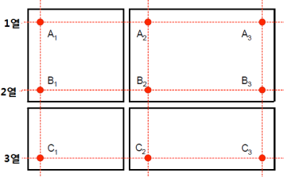 |
    | --- |
    | **그림 2.1.13 온도에 의한 상관관계에 대한 소형화 시험 합격기준 결정의 예시** **(참고: 이 도식은 도출된 실제 데이터를 나타내지 않을 수 있음)** |

    ⓐ 요구되는 $K_ca$(**그림 2.1.14** 참조)는 **규칙 312.**의 **표 2.1.45**의 취성균열 정지강 상세에서 2σ($N/mm ^{ 3/2}$)를 더하여 구한다. 즉, BCA1은 6,000 + 2σ($N/mm ^{ 3/2}$), BCA2는 8,000 + 2σ($N/mm ^{ 3/2}$)이며, 2σ는 (라)의 (b)에서 도출한다.
    ⓑ 회귀방정식(regression equation)을 통한 소형화 시험 결과로부터 예측된 $K_ca$값은 BCA1의 경우 6,000 + 2σ($N/mm ^{ 3/2}$), BCA2의 경우 8,000 + 2σ($N/mm ^{ 3/2}$)의 값보다 작지 않아야 한다.
    - **(가)** 일반사항
      - **(a)** 소형화 시험 방법은 취성균열 정지강의 취성균열 정지특성을 달성하는 것과 관련하여 제조자 고유의 기술 철학을 기반으로 결정된다. 또한, 대형화 취성균열 정지특성과 소형화 시험 결과와의 적절한 상관관계에 대한 설명이 필요하며, 소형화 시험의 합격기준은 다음을 기준으로 결정한다.
      - **(i)** 적합한 취성균열 정지특성을 달성하는 메커니즘
        - **(ii)** 시험재 위치 및 방향
        - **(iii)** 시험재의 채취 빈도
        - **(iv)** 소형화 시험 방법론(methodology)
      - **(v)** 취성균열 정지시험 결과와 소형화 시험 결과 사이의 상관 관계 입증
        - **(vi)** 통계 분석을 통한 소형화 시험 합격기준 도출
      - **(b)** 제조자는 다음 (나) ~ (마)에 따라 소형화 시험 절차 상세를 준비해야 한다.
    - **(나)** 시험의 종류 및 방법
      - **(a)** 소형화 시험의 종류, 방법, 치수, 위치, 시험편의 방향 등은 제조자가 지정하여 이 항에 따라 승인되어야 한다.
      - **(b)** 일반적으로 시험방법은 다음 시험방법과 같이 균열의 시작, 전파 및 정지 특성을 재현해야 한다.
      - **(i)** NRL 낙하 시험 및 샤르피 V 노치 충격시험과 같은 시험방법들의 조합
        - **(ii)** 압입 노치(press-notch) 샤르피 충격시험 또는 측면 낙하 시험과 같은 단일 시험방법
      - **(c)** 일반적으로 취성균열 정지강의 취성균열 정지특성은 소형화 시험 결과(예: 소형화 시험에서 얻은 천이온도)와 대형 취성균열 정지시험 결과(예: $K_ca$ 또는 특정 취성균열 정지특성에 해당하는 온도) 사이의 회귀방정식(regression equation)을 사용하여 예측해야 한다. 우리 선급의 승인을 받아 다른 접근 방식을 사용할 수도 있다.(참고: **표 2.1.8**, **표 2.1.9** 및 **표 2.1.10**은 소형화 시험 방법의 예를 제공한다.)
      - **(d)** 시험 방법을 결정하기 위해 제조자는 시험 방법의 방법론(methodology), 취성균열 정지특성을 달성하기 위한 자체 메커니즘 및 시험재의 채취 위치를 이론적으로 고려하여 취성균열 정지강에 해당 시험 방법의 적용 가능성을 확인해야 한다 ((가)의 (a) 참조). 그 다음 제조자는 (2)호의 (가)에 규정된 소형화 시험 방법 결정을 위한 기술적 배경을 우리 선급에 제출해야 한다.
    - **(다)** 시험 데이터
      - **(a)** 시험 강판의 선택
      - **(i)** (다)에 따라 취성균열 정지시험 및 소형화 시험은 취성균열 정지강의 각 재료기호(모든 부기부호 포함)에 대해 실시해야 한다.
        - **(ii)** 취성균열 정지시험 및 소형화 시험은 (iii)에 따라 최소 12개의 시험 강판에서 실시해야 하며, 이 시험 결과로 취성 균열 정지강의 취성균열 정지특성을 신뢰성 있게 평가할 수 있다.(“하나의 시험 강판"이란 “단일 강편 또는 강괴에서 직접 압연된 강판 제품"을 의미한다)
        - **(iii)** 강판의 다양한 제조 조건에서 소형화 시험 결과와 취성균열 정지특성 사이의 적절한 상관관계를 보장하기 위해, 강판은 다음을 포함하는 두께 범위 및 용해의 각 조합을 대표해야 한다.
        - **(iv)** 이러한 강재들의 제조법 승인시험(및 그 승인시험 결과)에 사용되는 취성균열 정지강은 (iii)에 규정된 시험 강판으로도 사용할 수 있다.
      - **(v)** 취성균열 정지시험과 소형화 시험의 시험편은 동일한 시험 강판에서 채취한다.
        - **(vi)** 다음 ⓐ 또는 ⓑ의 경우에 우리 선급은 지정된 시험 강판의 총 수량을 감소시킬 수 있다.
      - **(b)** 취성균열 정지시험
      - **(i)** **제조법 및 형식승인 등에 관한 지침 2장 2-8절**의 관련 규정에 따라 각 시험 강판에 대해 취성균열 정지시험을 실시한다.
        - **(ii)** $K_ca$를 평가하기 위해 취성균열 정지시험을 하는 경우에는 **지침 203.**의 **1.** (3)에 따라 특정온도에서의 $K_ca$를 구한다.
        - **(iii)** CAT 평가를 위해 취성균열 정지시험을 하는 경우, 결정론적(실제) CAT는 **지침 203.**의 **2항** (8)호 (다)에 따라 구해야 한다.
      - **(c)** 소형화 시험
      - **(i)** 소형화 시험은 각 시험 강판에 대하여 승인된 소형화 시험 절차 상세에 따라 실시해야 한다.
        - **(ii)** 일반적으로 소형화 시험의 시험편은 종축이 시험 강판의 최종 압연 방향과 평행하도록 채취해야 한다.
        - **(iii)** 소형화 시험의 시험편은 (나) (c)에 따라 시험 강판의 판두께 방향으로 지정된 위치에서 채취해야 한다.
    - **(라)** 연관성 검증
      - **(a)** 취성균열 정지시험에서 얻어진 취성균열 정지특성과 단일 또는 다중 소형화 시험 결과와의 회귀방정식(regression equation)을 수립한다. 취성균열 정지특성의 경우, 특정 온도(예: BCA1의 $T_Kca6000$, BCA2 또는 CAT의 $T_Kca8000$) 또는 -10℃에서의 $K_ca$값을 사용할 수 있다.
      - **(b)** 충분한 정확도로 취성균열 정지특성을 예측하기 위해 회귀 방정식(regression equation)의 유효성을 검사해야 한다. 소형화 시험에서 계산된 값과 취성균열 정지시험 결과 사이의 취성균열 정지특성의 상관 관계는 표준 편차의 두 배 값(2σ)을 사용하여 보증해야 한다. 취성균열 정지특성을 위해 온도를 사용하는 경우, 2σ는 20℃보다 크지 않아야 한다. 그 외의 경우(예: -10℃에서의 $K_ca$값)는 우리 선급의 동의를 얻어 2σ의 상한을 정한다.
    - **(마)** 합격기준
      - **(a)** 소형화 시험에 의한 취성균열 정지강의 합격기준은 상기 (라)의 취성균열 정지특성과의 상관관계에서 보장되는 회귀방정식(regression equation)에 기초하여 제조자에 의해 제안된다. 회귀방정식(regression equation)에 의한 예측값으로부터 취성균열 정지특성의 산포를 고려하여 회귀방정식(regression equation)이 안전측면에서 취성균열 정지특성을 예측할 수 있도록 합격기준을 결정한다.
      - **(b)** 우리 선급이 별도로 동의하지 않는 한, 소형화 시험의 합격기준은 다음 절차에 따라 결정된다.
      - **(i)** 온도에 의한 상관 관계
        - **(ii)** 취성균열 정지인성($K_ca$)에 의한 상관 관계
  - **(4)** 승인시험

    | 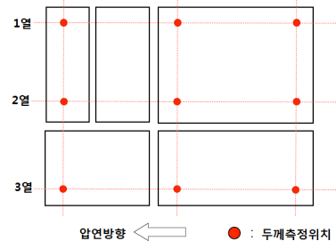 |
    | --- |
    | **그림 2.1.14 취성균열 정지인성(**$K_ca$**)에 의한 상관관계에 대한 소형화 시험 합격기준 결정의 예시** **(참고: 이 도식은 도출된 실제 데이터를 나타내지 않을 수 있음)** |

    승인시험의 범위는 제조법 승인의 승인시험 범위를 따른다.
    소형화 시험은 (3)호 (다) (c)에 따라 실시한다.
    - **(가)** 일반사항
      - **(a)** (2)호 (가)에서 규정하고 있는 제출된 기술문서의 유효성을 확인하기 위하여 승인시험을 하여야 한다.
      - **(b)** 승인시험 계획은 시험 전에 우리 선급의 승인을 받아야 한다.
      - **(c)** (2)호 (가)에서 규정하고 있는 제출된 기술문서의 내용을 검토하여 우리 선급은 다음의 경우에 추가 시험을 요구할 수 있다.
      - **(i)** 취성균열 정지시험 또는 소형화 시험의 횟수가 너무 적어서 소형화 시험 합격기준의 타당성을 충분히 확인할 수 없다고 우리 선급이 판단하는 경우((3)호 (다) (a) 참조)
        - **(ii)** 소형화 시험의 합격기준을 설정하기 위해 얻은 시험 데이터가 너무 광범위하게 변하거나((3)호 (라) (b) 참조) 데이터가 편향된 상관 곡선을 생성하는 클러스터링이라고 우리 선급이 판단하는 경우
        - **(iii)** 소형화 시험의 합격기준 설정을 위한 취성균열 정지시험 결과 또는 소형화 시험 결과의 타당성이 부족하거나 시험 중 및/또는 시험 결과에 약간의 결함이 있다고 우리 선급이 판단하는 경우((3)호 (다) (b) 및 (3)호 (다) (c) 참조)
        - **(iv)** 기타 우리 선급이 필요하다고 인정하는 사항
    - **(나)** 승인시험의 범위
    - **(다)** 시험 종류
      - **(a)** 취성균열 정지시험
      - **(i)** 취성균열 정지시험은 **제조법 및 형식승인 등에 관한 지침 2장 2-8절 3항** (1)호에 따라 실시한다.
        - **(ii)** $K_ca$를 평가하기 위하여 취성균열 정지시험을 하는 경우에는 **지침 2편 1장 203.**의 **1항** (3)호에 따라 특정온도($T_Kca6000$ 또는 $T_Kca8000$)에서의 $K_ca$를 구한다.
        - **(iii)** CAT 평가를 위해 취성균열 정지시험을 하는 경우에는 결정론적 CAT는 **지침 2편 1장 203.**의 **2항** (8)호 (다)에 따라 구해야 한다.
      - **(b)** 소형화 시험
  - **(5)** 결과
    - **(가)** 시험 항목 및 절차의 결과는 우리 선급이 승인한 시험 프로그램에 따른다.
    - **(나)** 취성균열 정지시험 결과에 대하여 제조자는 $K_ca$에 대한 **지침 2편 1장 203.**의 **1항** 및 CAT에 대한 **지침 2편 1장 203.**의 **2항**에 따라 취성균열 정지시험 보고서를 우리 선급에 제출하여야 한다.
    - **(다)** 소형화 시험 결과의 경우, 제조자는 (2)호 (가) (b)에 명시된 대로 제출된 시험보고서 형식의 예시에 따라 소형화 시험 보고서를 우리 선급에 제출하여야 한다.
  - **(6)** 승인
    검사 및 시험이 만족스럽게 완료되고 제출된 기술 문서가 만족스럽게 확인되면, 우리 선급은 소형화 시험 절차 사양에 대한 승인을 한다.

    **표 2.1.8 NRL 낙하 시험 및 샤르피 V-노치 충격시험을 이용한 소형화 시험 방법의 예(참고용)**

    | 시험 종류 | NRL 낙하 시험 및 샤르피 V-노치 충격시험 |
    | --- | --- |
    | 표준 | **ASTM E208:2020** 및 **ISO 148-1:2016** |
    | 시험편의 채취 위치 | NRL 낙하 시험 : 표면 샤르피 V-노치 충격시험 : 두께의 1/4 위치 |
    | 시험편의 길이 방향 | 시험 강판의 최종 압연 방향과 평행 |
    | 회귀방정식(Regression equation) | $T_{ Kca} = \alpha \cdot (NDTT+10)+ \beta \cdot upsilonTrs+153(t-5) ^{1/13}-170.5$ $T_{ Kca}$ : $K_ca$값이 $6000N/mm ^{ 3/2}$ 또는 $8000N/mm ^{3/2}$가 되는 온도(℃) NDTT : 무연성 천이온도(Nil-ductility transition temperature) (℃) $upsilonTrs$ : 흡수에너지의 천이온도(℃) t: 두께 $\alpha, \beta ^{ (1)}$ : 상수 |
    | (비고) (1) α 및 β는 소형화 시험 결과와 취성균열 정지시험 결과를 비교하여 결정된다. |   |

    **표 2.1.9 샤르피 압입 노치(pressed-notch) 충격시험을 이용한 소형화 시험 방법의 예(참고용)**

    | 시험 종류 | 샤르피 압입 노치(pressed-notch) 충격시험 |
    | --- | --- |
    | 표준 | 노치의 치수, 형상, 유입법(introducing method): 제조자 제안 기타 : **ISO 148-1:2016** |
    | 시험편의 채취 위치 | 두께의 1/2 위치 |
    | 시험편의 길이 방향 | 시험 강판의 최종 압연 방향과 평행 |
    | 회귀방정식(Regression equation) | $T_{ Kca} = \alpha _{ p}T _{E gammaJ }+ \beta$ $T_{ Kca}$ : $K_ca$값이 $6000N/mm ^{ 3/2}$ 또는 $8000N/mm ^{3/2}$가 되는 온도(℃) ${ p}T _{E gammaJ }$ : 흡수에너지 $\gamma$(J)에서의 시험온도(℃) $\alpha, \beta$ : 상수 $\gamma$ : 취성파면비 $\delta$(%)에서의 흡수에너지(J) |
    | (비고) (1) α, β, $\gamma$ 및 δ는 소형화 시험 결과와 취성균열 정지시험 결과를 비교하여 결정된다. |   |

    **표 2.1.10 측면 낙하시험(side-section drop weight test)을 이용한 소형화 시험 방법의 예(참고용)**

    | 시험 종류 | 측면 낙하시험(side-section drop weight test) |
    | --- | --- |
    | 표준 | 치수 : **ASTM E 208:2020**의 P-2형식 |
    | 시험편의 채취 위치 | 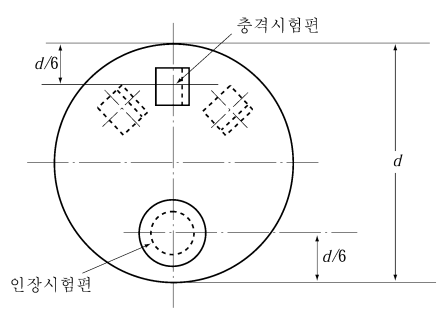두께의 1/2 및 측면(side-section) 위치 |
    | 시험편의 길이 방향 | 시험 강판의 최종 압연 방향과 평행 |
    | 회귀방정식(Regression equation) | $T_{ Kca} = \alpha+\beta \cdot T ^{ side} _{NDT}+ \gamma \cdot t ^{ 1.5}$ $T_{ Kca}$ : $K_ca$값이 $6000N/mm ^{ 3/2}$ 또는 $8000N/mm ^{3/2}$가 되는 온도(℃) $T ^{ side} _{NDT}$: 측면 낙하시험으로 구한 무연성 천이온도(Nil-ductility transition temperature) (℃) t: 두께 $\alpha, \beta , \gamma ^{ (1)}$ : 상수 |
    | (비고) (1) α, β 및 $\gamma$는 소형화 시험 결과와 취성균열 정지시험 결과를 비교하여 결정된다. |   |

### 제 4 절 강관

#### 401. 보일러 및 열교환기용 강관

- **1.** **열처리 규칙 401.**의 **3**항 **표 2.1.47**에서 규정한 열처리의 정의는 다음에 따른다. **【규칙 참조】**
  - **(1)** **저온어닐링(low temperature annealing)**
    상온가공 등에 의한 내부응력(스트레스)을 제거해서 연화시키거나 또는 담금질의 변형을 적게 하기 위한 전처리에 이용하는 어닐링. 450~600 ℃가 적당하다. 스트레스는 450 ℃ 이상으로 가열되지 않으면 제거되지 않는다.
  - **(2)** **노멀라이징(normalizing)**
    Ac_3 임계온도 이상의 오스테나이트 재결정 온도구역에서 가열한 후 공기 중에서 냉각하는 열처리. 그 목적은 앞 가공의 영향을 제거하고 결정립자를 미세화 하여 기계적성질을 개선하는 데 있다.
  - **(3)** **완전어닐링(full annealing)**
    A_3점(아공석강) 또는 A_1점(과공석강) 이상의 온도로 가열하고, 그 온도에서 충분한 시간을 유지한 다음 극히 천천히 냉각시켜 연화시키는 어닐링.
  - **(4)** **등온어닐링(isothermal annealing)**
    A_3점(아공석강) 또는 A_1점(과공석강) 이상의 온도로 가열한 후, A_1점 이하의 비교적 빠르게 펄라이트 변태가 일어나는 온도까지 급랭하고 그 온도로 유지하여 오스테나이트를 페라이트와 탄화물로 변태시켜 비교적 단시간에 연화시키는 어닐링. 사이클 어닐링(cycle annealing)이라고도 한다.
- **2.** **화학성분** RSTH33의 화학성분은 **지침 표 2.1.11**에 따른다. **【규칙 참조】**

  **표 2.1.11 화학성분**

  | 재료기호 | 화학성분($\%$) |   |   |   |   |
  | --- | --- | --- | --- | --- | --- |
  | 재료기호 | $C$ | $Si$ | $Mn$ | $P$ | $S$ |
  | *RSTH* 33 | 0.18 이하 | 0.35 이하 | 0.25∼0.60 | 0.035 이하 | 0.035 이하 |
- **3.** **열처리 및 기계적성질 【규칙 참조】**
  - **(1)** RSTH 33의 열처리는 RSTH 35와 같이 한다.
  - **(2)** RSTH 33의 기계적성질은 다음 각 호의 규정에 따른다.

    **표 2.1.12 인장시험**

    | 종 류 | 항복강도 ($\mathrm{N}/mm ^{2}$) | 인장강도 ($\mathrm{N}/mm ^{2}$) | 연신율($\%$) ($L=5.65 \sqrt {A}$) |
    | --- | --- | --- | --- |
    | *RSTH* 33 | 175 이상 | 325 이상 | 26(22) 이상 |
    | (비고) 1. 연신율의 괄호내의 값은 시험편을 압연방향과 직각으로 채취한 경우에 적용한다. 이 경우의 시험관은 편평하게 한 후 600℃∼650℃로 가열하고 응력을 제거하기 위하여 어닐링을 하여야 한다. 2. 전기저항 용접강관에서 관모양이 아닌 시험편을 채취할 경우에는 용접선을 포함하지 아니하는 부분에서 채취하여야 한다. |   |   |   |

    관의 끝에서 관모양의 시험편을 채취하고 상온에서 관축에 직각이 되도록 플랜지 모양으로 만들어 그 플랜지의 바깥지름을 **지침 표 2.1.13**의 크기로 하여도 플랜지에 흠 또는 균열 등이 생겨서는 아니 된다. 이 경우 시험편의 길이 *L*은 플랜징 후 플랜지부 이외의 길이가 0.5 *D* 이상이 되도록 하여야 한다. 다만, 이 시험은 *RSTH* 33중에서 두께가 바깥지름의 1/10 이하이고 또한 5 mm 이하의 관에 대하여만 적용한다.

    **표 2.1.13 플랜징 후의 플랜지 바깥지름**

    | 관의 바깥지름 (mm) | 플랜지의 바깥지름 (mm) |
    | --- | --- |
    | 63 미만 | 관의 바깥지름의 1.3배 |
    | 63 이상 | 관의 바깥지름 + 20 |

    검사원은 *RSTH* 33의 관에 대하여 종압축시험을 요구할 수 있다. 이 시험에서 길이 65 mm의 관 모양 시험편을 채취하고 상온에서 관의 축방향으로 압력을 가하여 **지침 표 2.1.14**에 정하는 높이까지 압축하여도 흠 또는 균열이 생겨서는 아니 된다.

    **표 2.1.14 압축후의 높이**

    | 관의 두께 $t$ (mm) | 압축후의 높이 |
    | --- | --- |
    | $t$ ≤ 3.4 | 19 mm 또는 바깥쪽의 접히는 부분이 서로 닿을 때까지 |
    | $t$ ＞ 3.4 | 32 mm |
    - **(가)** **인장시험** : RSTH 33의 인장시험 규격치는 **지침 표 2.1.12**에 따른다.
    - **(나)** **편평시험** : RSTH 33의 편평시험은 **규칙 401.**의 **5**항 (2)호에 따른다. 다만, 계수 e 값은 0.09로 한다.
    - **(다)** **플랜징 시험**
    - **(라)** **종압축시험**
    - **(마)** **전개시험** : RSTH 33의 전개시험은 **규칙 401.**의 **5**항 (4)호에 따른다.
    - **(바)** **수압시험** : RSTH 33의 수압시험은 **규칙 401.**의 **5**항 (5)호에 따른다.
  - **(3)** **규칙 401.**의 **6**항 (4)호에 규정한 󰡒우리 선급이 적절하다고 인정하는 비파괴검사󰡓라 함은 초음파 탐상검사 또는 와류탐상검사를 말한다. **【규칙 참조】**
    - **(가)** 초음파 탐상검사는 KS D0250(강관의 초음파 탐상 검사 방법)에 따라 시행하고 탐상감도 구분 UD로부터 대비시험편의 인공홈에서의 신호와 동등 이상의 신호가 검출되지 아니한 관은 합격으로 한다.
    - **(나)** 와류탐상검사는 **ISO 10893-2:2011**에 따라 시행하고, 대비시험편의 구멍은 E3H로 적용하고 노치는 E5로 적용한다. *(2025)*
- **4.** **시험편의 채취** *RSTH* 33 강관의 시험편 채취는 열처리를 한 관에 대하여는 동일 가열로에서 동시에 열처리를 한 동일종류, 동일치수의 관들 중에서, 열처리를 하지 아니한 관에 대하여는 동일종류, 동일치수의 관들 중에서 각각 다음 각 호의 규정에 따라 채취한다. **【규칙 참조】**
  - **(1)** **이음매 없는 강관** : 100개 또는 그 단수마다 1개의 비율로 시험용 관을 채취하고 각 시험용 관에서 인장시험편, 편평시험편 1개씩과 플랜징시험편 또는 확관시험편 1개를 채취한다.
  - **(2)** **전기저항 용접강관** : 전기저항 용접강관은 전 호에 규정하는 시험편 외에 100개미만은 50개 또는 그 단수마다, 100개 이상은 100개 또는 그 단수마다 1개의 비율로 시험용관을 채취하고 여기에서 전개시험편 각 1개를 채취한다.

#### 402. 압력 배관용 강관

- **1.** **기계적성질 규칙 402.**의 **6**항 (4)호에 규정한 󰡒우리 선급이 적절하다고 인정하는 비파괴시험󰡓이라 함은 **지침 401.**의 **3**항 (3)호에 따른다. **【규칙 참조】**

#### 403. 스테인리스 강관 (2018)

- **1.** **적용 규칙 403. 1**항 (2)호의 적용에 있어서 듀플렉스 스테인리스강관의 종류, 화학성분 및 기계적 성질은 다음에 따른다. **【규칙 참조】**
  - **(1)** **종류 및 화학성분** 듀플렉스 스테인리스강관의 종류 및 화학성분은 **지침 표 2.1.15**에 따른다.

    **표 2.1.15 종류 및 화학성분**

    | 재료기호 | 화학성분($\%$) |   |   |   |   |   |   |   |   |   |
    | --- | --- | --- | --- | --- | --- | --- | --- | --- | --- | --- |
    | 재료기호 | $C$ | $Si$ | $Mn$ | $P$ | $S$ | $N i$ | $Cr$ | $Mo$ | $N$ | $Cu$ |
    | *RSTS 31803TP* | 0.030이하 | 1.00 이하 | 2.00 이하 | 0.030 이하 | 0.020 이하 | 4.5∼6.5 | 21.0∼23.0 | 2.5∼3.5 | 0.08∼0.20 | - |
    | *RSTS 32750TP* | 0.030이하 | 0.80 이하 | 1.20 이하 | 0.035 이하 | 0.020 이하 | 6.0∼8.0 | 24.0∼26.0 | 3.0∼5.0 | 0.24∼0.32 | 0.5 이하 |
  - **(2)** **기계적성질** 듀플렉스 스테인리스강관의 기계적 성질은 **지침 표 2.1.16**에 따른다.

    **표 2.1.16 기계적 성질**

    | 재료기호 | 인장시험 |   |   | 경도시험 |
    | --- | --- | --- | --- | --- |
    | 재료기호 | 항복강도 ($\mathrm{N}/mm ^{2}$) | 인장강도 ($\mathrm{N}/mm ^{2}$) | 연신율($\%$) ($L=5.65 \sqrt {A}$) | 브리넬 $H _{BW}$ |
    | *RSTS 31803TP* | 450이상 | 620이상 | 25이상 | 290이하 |
    | *RSTS 32750TP* | 550이상 | 800이상 | 15이상 | 300이하 |

#### 404. 저온용 강관

- **1.** **적용 규칙 404. 1**항 (2)호의 “우리 선급이 적절하다고 인정하는 바󰡓라 함은 **규칙 1편 1장 105.**에 따라 인정하는 규격을 말한다. **【규칙 참조】**

### 제 5 절 주조품

#### 501. 주강품

- **1.** **화학성분 【규칙 참조】**
  - **(1)** **규칙 501.**의 **4**항을 적용함에 있어서 고파지력 앵커용 등과 같이 높은 인성이 요구되는 특수 주강품의 화학성분은 **지침 표 2.1.17**에 따른다. 제조자는 Al 등과 같은 적절한 세립화 원소를 첨가하여야 한다. 이때 이들 원소의 레이들 분석결과를 성적서에 기록하여야 한다.

    **표 2.1.17 화학성분**

    | 재료 | 화학성분($\%$) |   |   |   |   |   |   |
    | --- | --- | --- | --- | --- | --- | --- | --- |
    | 재료 | *C* | *Si* | *Mn* | *P* | *S* | *Al* | 기타 |
    | 특수 주강품 (탄소강 주강품) | 0.23 이하 | 0.60 이하 | 1.60 이하 | 0.035 이하 | 0.035 이하 | 0.015∼0.08 | **규칙 표 2.1.72**에 따른다. |
  - **(2)** **규칙 501.**의 **4**항 **표 2.1.74**의 비고 (1)을 적용함에 있어서 “우리 선급의 승인을 받아”는 동일한 화학성분을 가지는 용접구조용 주강품에 대하여 용접절차 인정시험에 합격한 경우를 말한다. **【규칙 참조】**
- **2.** **육안검사 및 치수검사 규칙 501.**의 **8**항을 적용함에 있어서 선미재, 타골재 및 크랭크축의 검사는 다음 각 호의 규정에 따른다. **【규칙 참조】**
  - **(1)** 선미재 및 타골재의 표면검사는 **부록 2-2**에 따른다.
  - **(2)** 주강재 크랭크축의 표면검사는 **부록 2-3**에 따른다.
- **3.** **비파괴검사 규칙 501.**의 **10**항 (1)호 및 (2)호의 규정을 적용함에 있어서 선미재, 타골재 및 크랭크축의 비파괴검사에 대하여는 다음 각 호에 따른다. **【규칙 참조】**
  - **(1)** 선미재 및 타골재의 비파괴검사는 **부록 2-2**에 따른다.
  - **(2)** 주강재 크랭크축의 비파괴검사는 **부록 2-3**에 따른다.
- **4.** **결함의 보수 규칙 501.**의 **11**항 (1)호 (라)를 적용함에 있어 주강품의 용접 보수방법은 다음에 따른다. **【규칙 참조】**
  - **(1)** 주강재 크랭크스로우의 용접보수는 **부록 2-4**에 따른다.
  - **(2)** 합금강 주강품의 용접보수는 **부록 2-4**의 **7**항(예비시험)을 준용한다.

#### 502. 체인용 주강품

해양구조물용 체인용 주강품에 대해서는 이 **지침 부록 2-9**의 **4**항에 따른다. **【규칙 참조】**

#### 505. 프로펠러용 스테인리스 주강품

- **1.** **적용 규칙 505. 1**항 (1)호의 “우리 선급이 적당하다고 인정하는 경우󰡓라 함은 프로펠러 주강품의 보수를 통해 선박의 정상적인 운항이 가능하다고 판단되는 경우 등을 포함한다. **【규칙 참조】**
- **2.** **비파괴검사**
  - **(1)** **규칙 505.**의 **9**항 (1)호의 프로펠러 주강품의 액체침투탐상검사는 **부록 2-6**에 따른다. 다만 액체침투탐상검사를 대신하여 자분탐상검사를 할 수 있다. 이 때 자분탐상검사 절차서를 우리 선급으로 제출해야 하며, **ISO 9934-1:2016** 또는 동등 표준에 따라 자분탐상검사를 실시해야 한다. 합격기준은 **부록 2-6**에 따른다. *(2021)* **【규칙 참조】**
  - **(2)** **규칙 505.**의 **9**항 (3)호의 프로펠러 주강품의 영역별 중요도에 따른 구분은 **부록 2-6**의 **그림 1** 및 **그림 2**를 적용한다. **【규칙 참조】**
- **3.** **결함의 보수**
  **규칙 505.**의 **10**항 (4)호를 적용함에 있어서, 용접보수방법은 다음에 따른다. **【규칙 참조】**
  - **(1)** 용접보수의 범위는 **부록 2-6**의 **3**항 (2)호 내지 (4)호의 규정에 따른다.
  - **(2)** **용접보수절차** 전 (1)호의 규정에 따라 용접보수를 하는 경우에는 다음에 따른다.
    - 용접부 가공, 용접자세, 용접변수, 용접용재료, 예열, 후열 및 검사방법
    - **(가)** 용접을 시작하기 전에 다음 사항을 포함한 상세한 용접절차시방서를 우리 선급에 제출하고 다음 (3)호의 규정에 따라 용접절차인정시험을 실시하여야 한다.
    - **(나)** 모든 용접보수는 검증된 절차서에 따라 실시하고, 우리 선급이 적당하다고 인정하는 표준에 따라 자격을 가진 용접사에 의하여 실시하여야 한다. 용접절차 인정시험은 (3)호에 따라 검사원 입회 하에 실시한다. *(2021)*
    - **(다)** 용접 보수해야 할 결함은 **규칙 505.**의 **10**항에 따라 그라인딩하여 제거해야 한다. *(2021)*
    - **(라)** 용접홈은 용접 초층부까지 용접융합이 잘 될 수 있도록 준비를 잘 해야 한다. *(2021)*
    - **(마)** 그리인딩 부위는 검사원 입회 하에 액체침투탐상검사를 하여 결함을 완전히 제거하였는지 확인해야 한다. *(2021)*
    - **(바)** 용접은 외풍 및 용접에 나쁜 영향을 미치는 기후조건을 피할 수 있는 조건하에서 실시하여야 한다.
    - **(사)** 보수용접에 사용되는 용접용재료는 용접절차인정시험에 사용하였던 것과 같은 것을 사용하여야 한다. 또한 용접용재료는 제조자의 권장사항에 따라 보관되고 다루어져야 한다.
    - **(아)** 마르텐사이트계 스테인리스 프로펠러 주강품은 용접보수 후에 노내 템퍼링을 실시하여야 한다. 다만, 우리 선급의 사전 승인을 받은 경우 경미한 보수부에 대하여는 국부적인 응력제거 열처리를 할 수 있다.
    - **(자)** 마르텐사이트계 주강품의 열처리가 끝난 후에는 용접보수부와 그 주변 모재부를 매끄럽게 그라인딩하고 액체침투탐상검사를 실시하여야 한다. *(2025)*
    - **(차)** 제조공장에서는 보수된 주강품의 검사, 열처리 및 용접에 대한 기록을 유지하여야 한다. 이들 기록은 검사원에 의하여 검토되어야 한다.
  - **(3)** **보수 용접절차 인정시험** ***(2021)***
    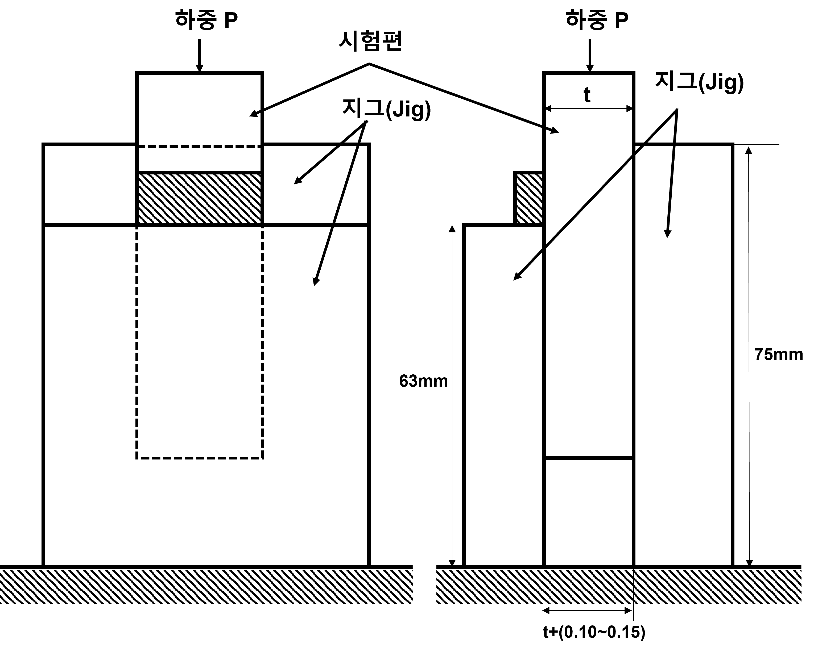
    (비고) 1 : 예비 용접절차 시방서에 기재된 이음형상 및 용접준비상태
    a : 최소 150 mm
    b : 최소 300 mm
    t : 모재 두께
    **그림 2.1.15 용접보수절차 시험재** ***(2025)***

    **표 2.1.18 시험종류 및 시험범위**

    | 시험종류 | 시험범위 |
    | --- | --- |
    | 외관검사 | (b)호에 따른 100% 실시 |
    | 액체침투 탐상검사(1) | (b)호에 따른 100% 실시 |
    | 가로방향 인장시험 | (c)호에 따른 2개의 시험편 |
    | 굽힘시험(2) | (d)호에 따른 2개의 앞면굽힘시험편 및 2개의 뒷면굽힘시험편 |
    | 매크로시험 | (e)호에 따른 3개의 시험편 |
    | 충격시험 | (f)호에 따른 2조(1조당 3개의 시험편)의 시험편 |
    | 경도시험 | (g)호에 따라 실시 |
    | 비고 (1) 마르텐사이트계 주강품은 액체침투 탐상검사를 대신하여 자분탐상검사를 실시할 수 있다. (2) 두께가 12 mm이상인 경우, 앞면/뒷면굽힘시험편을 대신하여 측면굽힘시험편 4개로 시험할 수 있다. |   |

    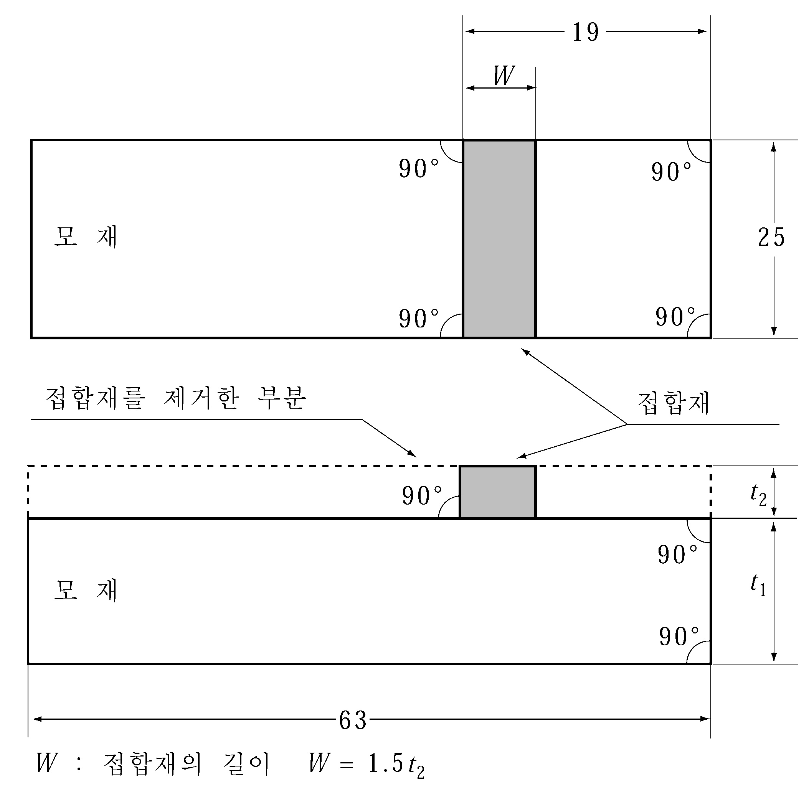
    **그림 2.1.16 용접보수절차 시험편**
    (ⅰ) 시험편을 절단하기 전에 외관검사 및 액체침투탐상검사 또는 해당되는 경우 자분탐상검사로 시험재를 검사해야 한다. 용접 후열처리가 필요하거나 명시된 경우에는 열처리 후 비파괴검사를 실시한다.
    (ⅱ) 균열은 허용되지 않는다. 액체침투탐상검사 또는 해당하는 경우 자분탐상검사로 탐상된 결함은 **부록 2-6**에 따라 평가한다.
    (ⅰ) 가로인장시험편 2개를 준비한다. 시험 절차는 **규칙 2편 1장 203.**을 따른다. 또는 우리 선급이 인정하는 표준에 따른 인장시험편을 사용할 수 있다.
    (ⅱ) 인장강도는 모재의 규격 최소인장강도를 만족해야 한다. 파단 부위가 용접부, 열영향부, 모재 중 어느 부위인지 기록해야 한다.
    (ⅰ) 맞대기 이음의 가로 굽힘시험은 **규칙 2편 2장 204.** 또는 인정되는 표준을 따른다. 맨드릴 지름은 두께의 4배로 하며, 오스테나이트계 강은 두께의 3배로 한다.
    (ⅱ) 굽힘 각도는 180 °로 한다. 시험 후, 시험편에는 3 mm보다 큰 열린 결함이 발견되지 않아야 한다. 시험 도중 시험편 모서리부에 나타나는 결함은 사례별로 조사되어야 한다.
    (ⅲ) 2개의 앞면 및 2개의 뒷면 굽힘시험편으로 시험한다. 두께가 12 mm이상인 경우에 측면굽힘시험편으로 대체할 수 있다.
    세 개의 매크로시험편을 준비하고 한면을 에칭하여 용접 금속, 용융선 및 열영향부가 명확하게 나타나야 한다. 균열 및 융합 불량(LF)은 허용되지 않는다. 슬래그 혼입과 같은 불완전부 및 3 mm보다 큰 기공도 허용되지 않는다.
    (ⅰ) 충격시험은 모재가 충격시험이 요구되는 경우에 실시한다. 샤르피V노치 시험편은 **규칙 2편 1장 202. 3**항을 따른다. 2조의 시험편을 채취하며, 한 조는 용접부 중앙에 노치가 있도록 하고 다른 한 조는 HAZ부(즉, 노치의 중간 지점은 용융선에서 1 mm ~ 2 mm 떨어진 곳)에 노치가 있도록 한다.
    (ⅱ) 시험 온도 및 요구되는 충격흡수에너지는 모재의 요구사항을 따른다.
    용접 시단부에서 채취한 매크로시험편을 사용하여 비커스경도(Hv 10) 시험을 실시한다. 압흔은 표면 아래 2 mm에서 가로방향으로 위치해야 한다. 용접 금속, HAZ(양쪽) 및 모재(양쪽)에 최소 3개의 개별 압흔을 만들어야 한다. 결과값은 기록되어야 한다.
    시험편이 요구사항을 만족하지 않는 경우에는 **규칙 2편 2장 406. 1**항에 따라 재시험을 실시한다.
    (ⅰ) 아래 명시된 모든 합격 조건은 서로 독립적으로 충족되어야 한다. 규정된 범위를 벗어난 변경은 새로운 용접절차 인정시험이 요구된다.
    (ⅱ) 제조자의 승인된 WPS는 해당 제조자와 동일한 기술 및 품질 관리 하에 있는 작업장 또는 현장에서 유효하다.
    프로펠러용 스테인리스 주강품의 모재 승인범위는 시험된 모재로 한정한다.
    두께 t의 시험재로 수행된 WPS의 두께 승인범위는 **지침 표 2.1.19**를 따른다.

    **표 2.1.19 두께의 승인범위**

    | 시험재의 두께, t(mm) | 승인범위, T(mm) |
    | --- | --- |
    | 15 < t ≤ 30 | 3 ≤ T ≤ 2t |
    | 30 < t | 0.5t ≤ T≤ 2t 또는 200 mm(둘 중 큰 것) |

    용접자세의 승인범위는 용접절차 인정시험 시의 용접자세에 한하여 허용된다.
    용접법의 승인범위는 용접절차 인정시험에 사용된 용접법에 한하여 허용된다. 다층 맞대기용접으로 시험된 경우에는 단층 용접은 허용되지 않는다.
    용가재의 승인범위는 용접절차 인정시험에 사용된 용가재에 한하여 허용된다.
    입열량의 상한은 용접절차 인정시험에 사용된 입열량보다 15 % 더 큰 것으로 한다. 입열량의 하한은 용접절차 인정시험에 사용된 입열량보다 15 % 낮은 것으로 한다.
    예열온도는 용접절차 인정시험에 사용된 온도보다 높아야 한다. 최대 층간온도는 용접절차 인정시험에 사용된 온도보다 높지 않아야 한다.
    용접절차 인정시험에 사용되는 열처리는 pWPS에 명시되어야 한다. 유지 시간은 두께에 따라 조정될 수 있다.
    - **(가)** **일반사항**
      - **(a)** 용접절차 승인을 위해 용접절차 인정시험은 만족스러운 결과가 도출되어야 한다. 인정시험은 실제 보수 작업에 적용되는 것과 동일한 용접법, 용가재, 예열 및 응력 완화 처리로 수행되어야 한다. 용접절차 시방서는 용접절차 인정시험 중에 도출된 시험 결과를 포함해야 한다.
      - **(b)** 제조자의 승인된 용접절차는 동일한 용접기술 및 품질 관리가 적용되는 작업장들에서 유효하다.
    - **(나)** **용접 시험재**
      - **(a)** 주강 시험재는 적절한 열 분포를 보장하기에 충분한 크기이어야 하고 최소 치수를 가진 **지침 그림 2.1.15**를 따른다. 용접홈의 형상 및 치수는 실제 보수작업을 대표해야 한다.
      - **(b)** 시험재의 준비 및 용접은 실제 보수용접 작업을 대표하는 일반적인 조건에 따라 수행되어야 한다.
      - **(c)** 시험재의 용접과 시험편의 시험은 검사원 입회 하에 실시해야 한다.
    - **(다)** **시험 및 검사**
      - **(a)** 시험재의 파괴 및 비파괴 시험/검사는 **지침 표 2.1.18** 및 **지침 그림 2.1.16**을 따른다.
      - **(b)** **비파괴검사**
      - **(c)** **인장시험**
      - **(d)** **굽힘시험**
      - **(e)** **매크로시험**
      - **(f)** **충격시험**
      - **(g)** **경도시험**
      - **(h)** **재시험**
    - **(라)** **시험 기록**
      - **(a)** 시험재의 용접 조건 및 시험 결과는 용접절차 인정시험 기록서에 기록되어야 한다. 용접절차 인정시험 기록서의 형식은 우리 선급이 적절하다고 인정하는 바에 따른다..
      - **(b)** 재시험을 포함하여 각 시험편을 평가한 결과는 각 용접절차 인정시험 기록서에 작성되어야 한다. WPS에 기재된 관련 항목을 포함해야 한다.
      - **(c)** 용접절차 인정시험 기록서에는 입회한 검사원의 서명과 우리 선급 표시가 있어야 한다.
    - **(마)** **승인범위**
      - **(a)** 일반사항
      - **(b)** **모재**
      - **(c)** **두께**
      - **(d)** **용접자세**
      - **(e)** **용접법**
      - **(f)** **용가재**
      - **(g)** **입열량**
      - **(h)** **예열 및 층간온도**
      - **(i)** **용접 후열처리**

#### 506. 회주철품

**1 . 적용 규칙 506.**의 **1**항 (2)호의 “우리 선급이 인정할 경우󰡓라 함은 **규칙 2편**에서 규정하지 아니하는 재료의 적용이 필요한 경우 등을 말한다. **【규칙 참조】**

- **2.** **시험편의 채취 규칙 506.**의 **6**항 (7)호 (라)의 백선화시험(chill test)은 **ASTM A367-60**(Standard test methods of chill tests of cast iron)에 따른다. **【규칙 참조】**

#### 507. 구상흑연주철품

- **1.** **적용**
  - **(1)** **규칙 507.**의 **1**항 (2)호의 “우리 선급이 적절하다고 인정하는 바󰡓라 함은 **규칙 1편 1장 105.**에 따라 인정하는 규격을 말한다. **【규칙 참조】**
  - **(2)** **규칙 507.**의 **1**항 (3)호의 “우리 선급이 인정할 경우󰡓라 함은 **규칙 2편**에서 규정하지 아니하는 재료의 적용이 필요한 경우 등을 말한다. **【규칙 참조】**

### 제 6 절 단강품

#### 601. 단강품

- **1.** **제조법**
  - **(1)** **규칙 601.**의 **3**항 (5)호 (가)의 적용은 다음에 따른다.
    - **(가)** 크랭크축에 대하여 금속유동이 사용중의 응력발생 양상과 관련하여 가장 선호하는 방향을 가지도록 요구되는 경우, 제조법은 우리 선급의 별도 승인을 받아야 한다. 이 경우, 적절한 구조와 금속유동이 획득됨을 입증하도록 시험이 요구될 수 있다. **【규칙 참조】**
  - **(2)** **규칙 601.**의 **3**항 (6)호의 적용은 다음에 따른다.
    - **(가)** 이 규정은 크랭크축의 절단부분 등 응력을 받는 중요한 부분을 가스 가공할 경우에 적용하고 가공방법(예열을 포함) 및 가공에 따른 재질변화 등에 관한 자료를 제출하여 우리 선급의 승인을 받아야 한다. **【규칙 참조】**
- **2.** **열처리**
  - **(1)** **규칙 601.**의 **4**항 (1)호의 적용은 다음에 따른다.
    - **(가)** 제품치수와 열처리 설비와의 관련으로서, 제품의 전 길이를 동일 노에서 동시에 열처리가 불가능할 경우에는 미리 검사원의 승인을 받아야 하며, 시험편은 제품의 양단부에서 각각 1조씩 채취한다. 또한 열처리가 겹치는 부분에 대하여는 초음파 탐상검사 등 우리 선급이 적절하다고 인정하는 방법으로 조직의 균일한 정도를 확인하여야 한다. **【규칙 참조】**
  - **(2)** **규칙 601. 4**항 (7)호의 “우리 선급이 필요하다고 인정하는 경우󰡓라 함은 표면경화 처리 방법이 일반적이지 않거나 제조자의 경험 부족이 고려되는 경우 등을 포함한다. **【규칙 참조】**
- **3.** **기계적성질**
  **규칙 601.**의 **6**항 **표 2.1.89**의 비고 (4)를 적용함에 있어서, 기관용 중요 부품에 사용되는 합금강 단강품 중 충격시험을 요구할 수 있는 단강품의 종류 및 이들의 평균흡수에너지는 **지침 표 2.1.20**에 따른다. **【규칙 참조】**

  **표 2.1.20 합금강 단강품의 종류 및 평균흡수에너지**

  | 재료기호 | 적용부분 | 샤르피 *V* 노치 충격시험 |   |
  | --- | --- | --- | --- |
  | 재료기호 | 적용부분 | 평균흡수에너지(*J*) |   |
  | 재료기호 | 적용부분 | $L$ | $T$ |
  | *RSF 600AM* | - 크랭크 축 - 기어용 단강품 | 41 이상 | 24 이상 |
  | *RSF 700AM* | - 크랭크 축 - 기어용 단강품 | 32 이상 | 22 이상 |
  | *RSF 800AM* | - 크랭크 축 - 기어용 단강품 | 32 이상 | 20 이상 |
  | *RSF 1000AM* | - 크랭크 축 - 기어용 단강품 | 25 이상 | 16 이상 |
  | *RSF 1100AM* | - 크랭크 축 - 기어용 단강품 | 21 이상 | 13 이상 |
  | (비고) 충격시험은 상온(23 ℃±5 ℃)에서 실시한다. *(2023)* |   |   |   |
- **4.** **시험재의 채취 규칙 601.**의 **7**항 (9)호에 규정된 침탄처리이외외의 표면경화처리를 하는 단강품의 시험편 채취방법 및 경도시험 등은 다음에 따른다. **【규칙 참조】**
  - **(1)** **고주파 담금질 또는 질화처리 기어**
    - **(가)** **인장 및 충격시험편** 표면경화처리 전의 최후 열처리 후에 단강품 본체로 부터 **규칙 601.**의 **7**항 (3)호 (나) 내지 (마)의 규정에 따라서 소정의 시험편을 채취한다.
    - **(나)** **경화층 깊이**
      - **(a)** **고주파 담금질의 경우** 최초 제품의 본체에 대하여 고주파 담금질에 의한 경화층 깊이를 측정한다. 다만, 그 후의 제품에 대하여 측정할 필요는 없다.
      - **(b)** **질화처리의 경우**
      - **(i)** **시험재의 채취** 시험재는 제품과 동일조건으로 처리한 동일강종의 것이어야 한다.
        - **(ii)** **시험재의 크기** 적절한 크기로 한다.
        - **(iii)** **시험재의 열처리** 시험재에는 제품과 동시에 열처리 및 질화처리를 하여야 한다.
        - **(iv)** **경화층 깊이의 측정** 동일 질화처리 로트마다 한다.
  - **(2)** 표면경화처리를 하는 단강품의 경도시험에 대한 적용은 다음에 따른다.
    - **(가)** 경도 측정은 **규칙 5편 3장**의 규정에 따르고, 경도값은 제조법 승인과 관련하여 우리 선급의 승인을 받아야 한다.
    - **(나)** 단강품의 치수, 모양 등의 이유로 제품 개개마다 경도측정이 곤란한 경우에는 (가)의 제조법 승인시험의 결과로 부터 단강품의 경도를 대표할 수 있는 적절한 위치를 선정하여 경도를 측정한다.
- **5.** **육안검사 및 치수검사 규칙 601.**의 **8**항에 대한 적용은 다음에 따른다. **【규칙 참조】**
  - **(1)** 단강품의 표면검사는 **부록 2-5**의 **2**항(표면검사)에 따른다.
- **6.** **비파괴검사**
  - **(1)** **규칙 601.**의 **10**항 (1)호 및 (2)호에 대한 적용은 다음에 따른다. **【규칙 참조】**
    - **(가)** 단강품의 비파괴검사는 **부록 2-5**의 **2**항(표면검사) 및 **부록 2-5**의 **3**항(초음파탐상검사)에 따른다.
    - **(나)** 초음파탐상검사는 최종열처리 및 비파괴검사 방식에 적합한 기계가공 이후에 실시해야 한다. 단강품의 형상 및 치수에 적합하도록 반경 방향 및 축 방향으로 모두 탐상한다. *(2023)*
    - **(다)** 별도 동의하지 않는 한, 제조자가 비파괴검사를 실시하며, 검사원은 합의된 절차에 따라 비파괴검사가 실시되는지 확인하기 위하여 참석을 요구할 수 있다. *(2023)*
    - **(라)** 단강품이 단조 작업 후 기계가공을 위해 별도의 작업장으로 공급되는 경우에 제조자는 단강품의 내부 품질을 확인하기 위해 적절한 초음파탐상검사를 실시해야 한다. *(2023)*
    - **(마)** PAUT 또는 TOFD와 같은 향상된 초음파탐상검사를 적용하는 경우에는 **부록 2-12**를 준용할 수 있다. 이 경우, 합격기준은 **부록 2-5**의 관련 조항을 따를 수 있다. *(2023)*
  - **(2)** **규칙 601. 10**항 (4)호의 “적절하다고 인정하는 비파괴검사󰡓라 함은 제품의 형상 및 검출 부위 등을 고려한 비파괴검사를 말한다. **【규칙 참조】**
  - **(3)** **규칙 601. 10**항 (5)호의 “우리 선급이 필요하다고 인정하는 단강품󰡓이라 함은 육안 검사 등으로 결함 검출이 어렵다고 판단되는 단강품 등을 말한다. **【규칙 참조】**
  - **(4)** **규칙 601. 10**항 (6)호의 “우리 선급이 적절하다고 인정하는 비파괴검사󰡓라 함은 용접부의 형상 및 검출 부위 등을 고려한 비파괴검사를 말한다. **【규칙 참조】**
- **7.** **결함의 보수 규칙 601.**의 **11**항 (4)호에 대한 적용은 다음에 따른다. **【규칙 참조】**
  - **(1)** 단강품의 응력정도에 중요하지 아니하다고 판단되는 부분은 모양 보수 목적으로 용접보수를 할 수 있다.
- **8.** **크랭크축에 대한 특별규정**
  - **(1)** **규칙 601.**의 **15**항 (1)호를 적용함에 있어서 일체형 크랭크축의 크랭크부를 절단 제거하지 아니하고 열처리하는 경우에는 열처리 후, **지침 그림 2.1.17**과 같이 절단부분 중에서 핀에 근접하는 위치에서 1조의 시험편을 채취한다. 이때 시험편은 중앙의 크랭크스로우에서 채취한다. **【규칙 참조】**
    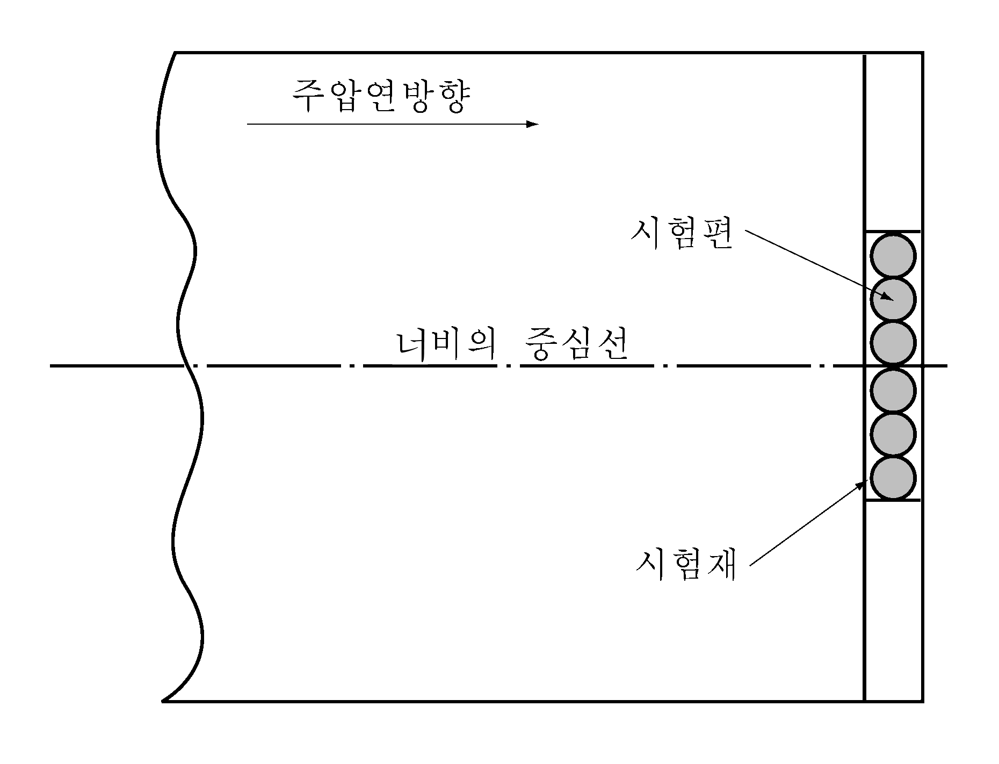
    **그림 2.1.17 시험편의 채취위치**
  - **(2)** **규칙 601.**의 **15**항 (2)호에 규정된 반조립형 크랭크축의 크랭크스로우에 대한 적용은 다음에 따른다. **【규칙 참조】**
    - **(가)** 시험편은 통상 암의 양단에서 길이방향으로 1조씩 채취한다.
    - **(나)** 승인된 제조방법을 변경하는 경우 또는 종래보다 대형 크랭크축을 제조할 경우에는 제조자는 다시 우리 선급이 지정하는 시험을 다시 받아야 한다.

#### 603. 체인용 단강품

- **1.** **적용**
  - **(1)** **규칙 603. 1**항 (2)호의 해양구조물용 체인용 단강품에 대해서는 이 **지침 부록 2-9**의 **3**항에 따른다. **【규칙 참조】**
  - **(2)** **규칙 603. 1**항 (4)호의 “우리 선급이 적절하다고 인정하는 바󰡓라 함은 **규칙 1편 1장 105.**에 따라 인정하는 규격을 말한다. **【규칙 참조】**

### 제 7 절 동 및 동합금

#### 702. 동합금 주물

- **1.** **적용 규칙 702.**의 **1**항 (1)호의 “우리 선급이 적절하다고 인정하는 경우󰡓라 함은 프로펠러 주물의 보수를 통해 선박의 정상적인 운항이 가능하다고 판단되는 경우 등을 포함한다. **【규칙 참조】**
- **2.** **제조법**
  **규칙 702.**의 **3**항 (3)호를 적용함에 있어 프로펠러 주물의 응력완화 열처리온도 및 유지시간에 대하여는 **부록 2-6**에 따른다. **【규칙 참조】**
- **3.** **기계적성질**
  - **(1)** **규칙 702.**의 **5**항의 “우리 선급이 적당하다고 인정하는 바󰡓라 함은 **규칙 1편 1장 105.**에 따라 인정하는 규격을 말한다. **【규칙 참조】**
  - **(2)** **규칙 702.**의 **5**항 **표 2.1.102** 비고 (1)의 설계와 관련하여 우리 선급이 요구하는 경우란 **선급 및 강선규칙 적용지침 제5편 3장 305. 2**. (가) (g)에 해당하는 경우를 말한다. **【규칙 참조】**
- **4.** **표면검사 및 치수검사**
  **규칙 702**의 **7**항 (2)호를 적용함에 있어 프로펠러 주물의 교정방법에 대하여는 **부록 2-6**에 따른다. **【규칙 참조】**
- **5.** **비파괴 검사**
  - **(1)** **규칙 702.**의 **9**항 (1)호의 프로펠러 주물의 액체침투 탐상검사는 **부록 2-6**에 따른다. **【규칙 참조】**
  - **(2)** **규칙 702.**의 **9**항 (2)호의 프로펠러 주물의 영역별 중요도에 따른 구분은 **부록 2-6**의 **그림 1** 및 **그림 2**에 따른다. **【규칙 참조】**
- **6.** **결함의 보수 규칙 702.**의 **10**항 (5)호를 적용함에 있어서 프로펠러 주물의 용접보수기준은 **부록 2-6**에 따른다.
  **【규칙 참조】**

### 제 8 절 알루미늄 합금재

#### 801. 알루미늄 합금재

- **1.** **기계적성질**
  - **(1)** **규칙 801.**의 **1**항 (2)호의 규정과 관련하여 **규칙 표 2.1.106** 및 **표 2.1.107**에 규정한 최대치수를 넘는 알루미늄 합금재에 대한 기계적 성질은 아래 **지침 표 2.1.21**과 같다. **【규칙 참조】**

    **표 2.1.21 알루미늄 합금재의 기계적 성질(1)**

    | 제 품 | 재료기호 | 열처리(2) | 두께 $t$ (mm) | 인장시험 |   |   |
    | --- | --- | --- | --- | --- | --- | --- |
    | 제 품 | 재료기호 | 열처리(2) | 두께 $t$ (mm) | 항복강도 ($\mathrm{N}/mm ^{2}$) | 인장강도 ($\mathrm{N}/mm ^{2}$) | 연신율($\%$) |
    | 제 품 | 재료기호 | 열처리(2) | 두께 $t$ (mm) | 항복강도 ($\mathrm{N}/mm ^{2}$) | 인장강도 ($\mathrm{N}/mm ^{2}$) | ($L=5.65 \sqrt {A}$) |
    | 압연재 | 5083 *P* | O | 50＜$t$≤80 | 115∼200 | 270∼345 | 14 이상 |
    | 압연재 | 5083 *P* | O | 80＜$t$≤100 | 110 이상 | 260 이상 | 12 이상 |
    | 압연재 | 5083 *P* | *H* 321 | 50＜$t$≤80 | 200∼295 | 285∼385 | 11 이상 |
    | 압출형재 | 5083 *S* | O | 50＜$t$≤130 | 110 이상 | 275∼355 | 10 이상(3) |
    | (비고) (1) 우리선급의 승인을 얻은 경우 이 표와 다른 규격값을 적용할 수 있다. (2) 열처리 표시기호는 다음과 같다. 이와 관련하여 **지침 표 2.1.24**를 참조한다. O: 어닐링, *H* 321 : 가공경화 후 안정화 처리 (3) 이 값은 가로방향 및 길이방향 인장시험편에 대하여 모두 적용한다. |   |   |   |   |   |   |
  - **(2)** **규칙 801.**의 **5**항 (2)호의 규정과 관련하여 중공 압출형재에 대하여는 압접부 용융상태를 확인하기 위하여 다음에 따라 확관시험을 하여야 한다. **【규칙 참조】**
    - **(가)** 중공 압출형재 5개 또는 그 단수마다 1개를 샘플링하고 제품의 양단에서 각 1개씩 총 2개의 확관시험편을 채취한다.
    - **(나)** 중공 압출형재의 길이가 6 m를 넘는 경우에는 매 제품마다 압접이 시작되는 부분에서 확관시험편 1개를 채취한다. 다만, 처음 3 ~ 5개의 제품에 대한 확관시험 결과가 양호한 경우에는 전 (가)와 같이 5개 또는 그 단수마다 1개로 시험수를 감소할 수 있다.
    - **(다)** 시험편의 크기 및 시험방법은 **규칙 2편 1장 401.**의 **5**항 (3)호를 준용한다.
    - **(라)** 시험편을 확관시켜도 융합부족으로 간주될 수 있는 벌어짐이 생겨서는 아니 된다.
- **2.** **열처리**
  **규칙 801.**의 **4**항 **표 2.1.105** 및 **표 2.1.106**의 비고 (2)에 규정된 열처리의 정의는 다음 **지침 표 2.1.22**에 따른다. **【규칙 참조】**

  **표 2.1.22 열처리의 정의**

  | 열처리 기호 | 정 의(1) | 뜻(1) |
  | --- | --- | --- |
  | *O* | 어닐링 | 가장 연질상태를 얻도록 어닐링 한 것 |
  | *H*111, *H*112 및 *H*116 | 가공경화 | 소정의 기계적성질을 얻기 위하여 추가 열처리를 하지 않고 가공경화(냉간가공)만 한 것 |
  | *H*321 | 가공경화 후 안정화 처리(2) | 가공경화 한 제품을 저온 가열하여 안정화처리 한 것. 그 결과 강도는 약간 저하하나 연신율은 증가한다. |
  | *T*5 | 고온가공에서 냉각 후 인공시효경화처리(3) | 압출형재와 같이 고온의 제조공정에서 냉각 후 적극적인 냉간가공을 하지 않고 인공시효 경화처리 한 것 |
  | *T*6 | 용체화처리(4) 후 인공시효경화처리(3) | 용체화처리 후 적극적인 냉간가공을 하지 않고 인공시효 경화처리 한 것 |
  | (비고) (1) *KS D*0049(철강제품 - 열처리용어) 및 *KS D*0004(알루미늄 및 알루미늄 합금의 질별 기호) 참조 (2) 안정화 처리라 함은 저온 가열하여 조직을 안정화시키는 열처리를 말한다. (3) 인공시효 경화처리라 함은 급냉, 냉간가공 등을 한 후에 실온 이상의 적당한 온도에서 가열하여 강도를 향상시키는 처리를 말한다. (4) 용체화처리라 함은 강의 합금성분을 고용체에 용해하는 온도 이상으로 가열하여 충분한 시간을 유지하고 급냉시켜 그 석출을 저지하여 강도를 향상시키는 처리를 말한다. |   |   |
- **3.** **부식저항시험 규칙 801.**의 **9**항 (2)호 (가) 및 (다)의 “우리 선급이 인정하는 방법󰡓이라 함은 **규칙 1편 1장 105.**에 따라 인정하는 방법을 말한다. **【규칙 참조】**
- **4.** **표면검사 및 치수허용차**
  - **(1)** **규칙 801.**의 **10**항 (2)호의 “우리 선급이 적절하다고 인정하는바󰡓라 함은 **규칙 1편 1장 105.**에 따라 인정하는 것을 말한다. **【규칙 참조】**
  - **(2)** **규칙 801.**의 **10**항 (3)호를 적용함에 있어서󰡒전 (2) 이외의 치수 허용차"에 대하여는 우리 선급이 인정하는 국제 또는 국가 규격을 적용할 수 있다. **【규칙 참조】**

#### 802. 알루미늄/강 이종접합 이음재 (2023)

- **1.** **품질 및 결함의 보수** 초음파 탐상검사방법은 원칙적으로 **KS D 0234** 또는 이와 동등한 국가/국제 표준 및 규격에 따른다. **【규칙 참조】**
- **2.** **규칙 802. 2**항 (4)호 및 **7**항의 “우리 선급이 적절하다고 인정하는 바󰡓라 함은 **규칙 1편 1장 105.**에 따라 인정하는 것을 말한다. **【규칙 참조】** 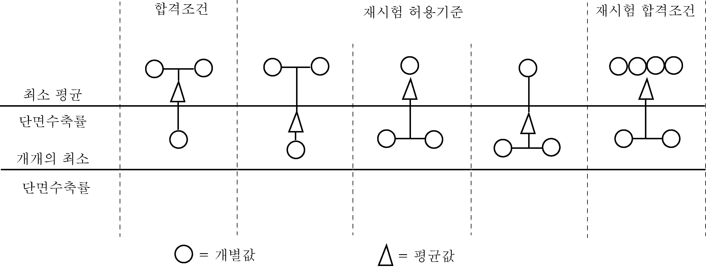
