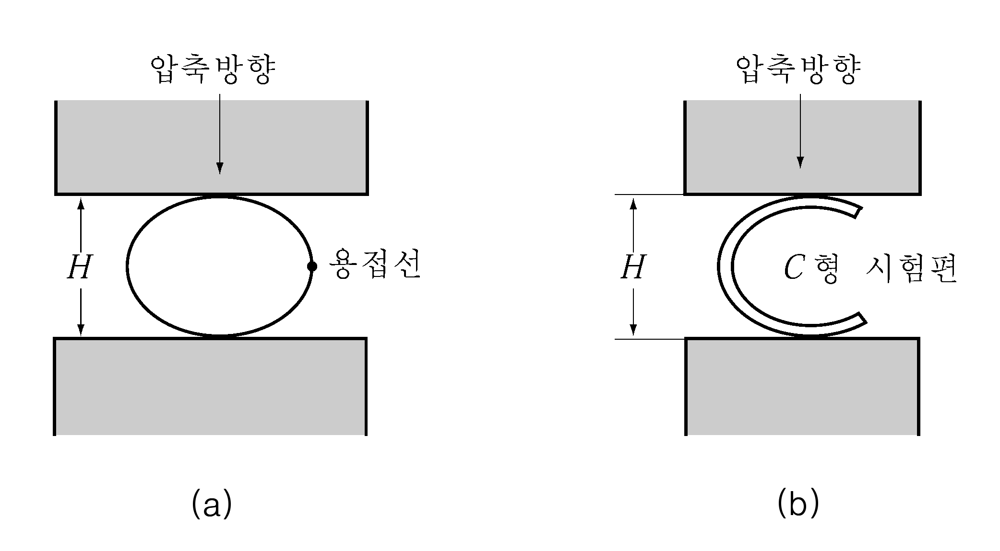
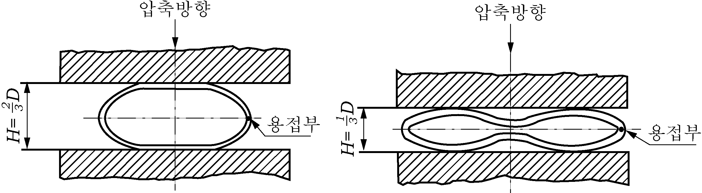
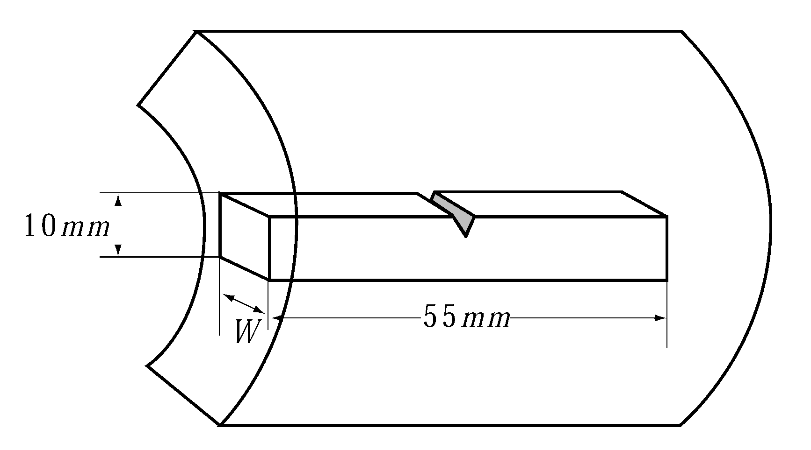
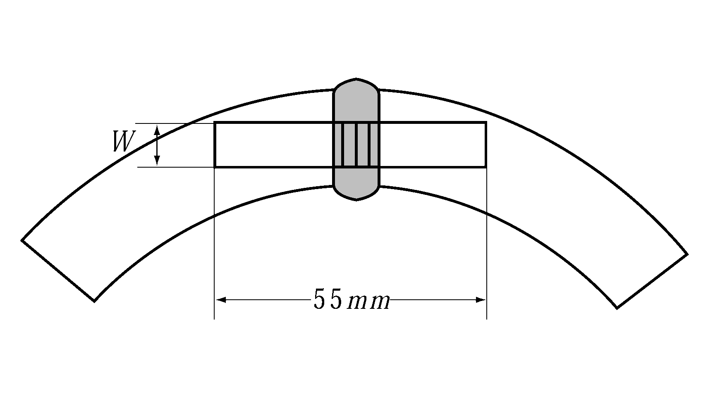
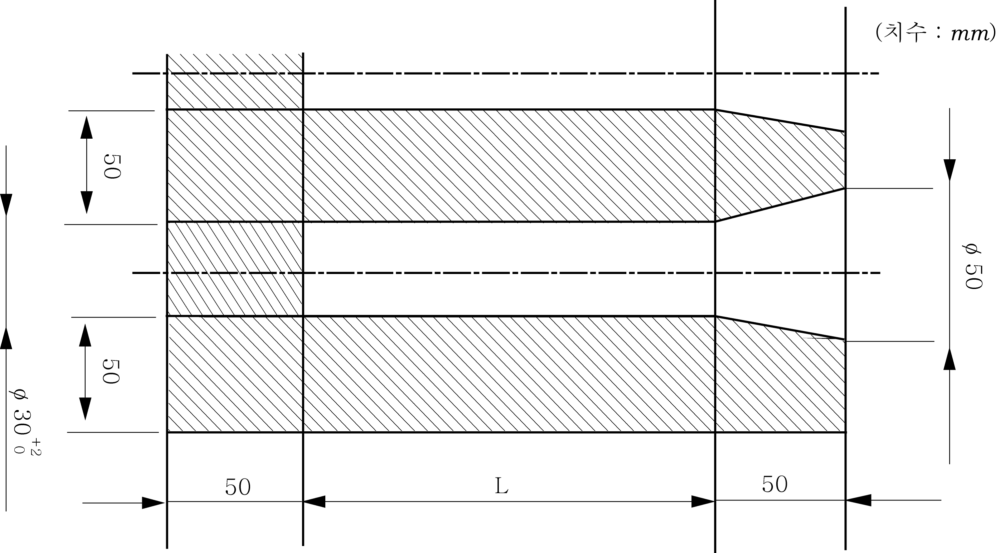
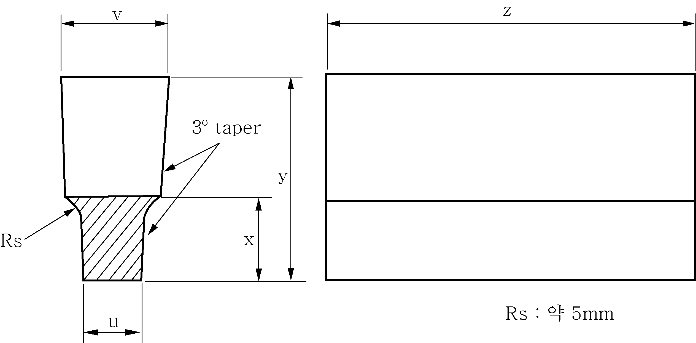
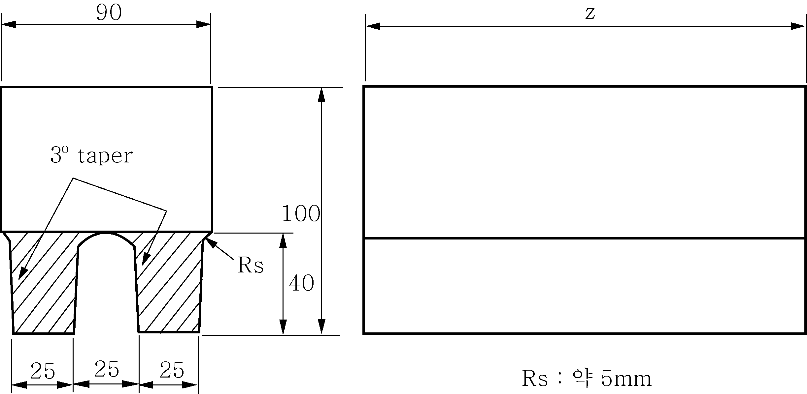
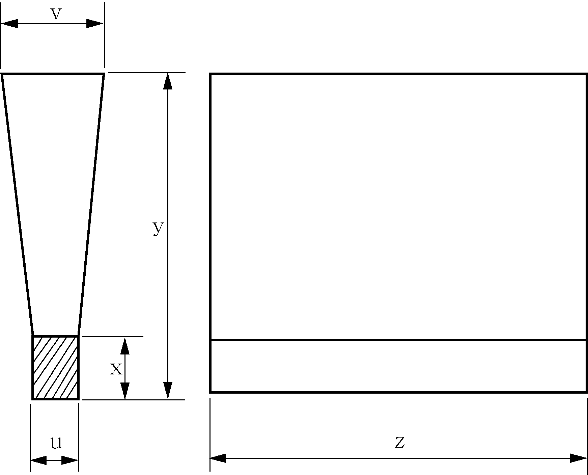

# 제2편 재료 및 용접

> 선급 및 강선규칙/적용지침 / RA-02-K / 2025 / KO / Guidance

## 제 2 장 용접

### 제 1 절 일반사항

#### 102. 승인사항

**규칙 102. 2**항의 “우리 선급이 적당하다고 인정하는 경우󰡓라 함은 **규칙 2편**에서 규정하지 아니하는 재료 및 용접의 적용이 필요한 경우 등을 포함한다. **【규칙 참조】**

#### 103. 특수용접

액화가스 산적운반선의 탱크 및 그 주위의 선체구조에 대한 용접시공시험은 다음에 따른다. **【규칙 참조】**

- **1.** **적용** 독립형 탱크를 용접할 때는 **규칙 2장 4절**에서 규정하는 용접절차 인정시험 이외에 다음 각 호의 규정에 따라 각 용접자세마다 용접시공시험을 하여야 한다.
  - **(1)** A형 독립형 탱크는 적어도 주요 구조부재의 맞대기 용접의 용접길이 50 m마다 1개의 시험재에 대하여 용접시공시험을 하는 것으로 한다. 단, 제조소의 실적 및 품질관리의 실태를 고려하여 시험재의 수를 감하든지 또는 용접시공시험을 생략할 수가 있다.
  - **(2)** B형 독립형 탱크는 적어도 주요 구조부재의 맞대기 용접의 용접길이 50 m마다 1개의 시험재에 대하여 용접시공시험을 하여야 한다. 단, 제조소의 실적 및 품질관리의 실태를 고려하여 시험재의 수를 용접길이 100 m마다 1개까지 감할 수 있다. 단, 적어도 하나의 탱크에 대하여 1개 이상의 시험재를 채취하여야 한다.
  - **(3)** C형 독립형 탱크는 적어도 주요 구조부재의 맞대기용접의 용접길이 30 m마다 1개의 시험재에 대하여 용접시공시험을 하는 것으로 한다. 단, 제조소의 실적 및 품질관리의 실태를 고려하여 시험재의 수를 용접길이 50 m마다 1개로 감할 수가 있다.
    비 고 : A, B 및 C형 독립형 탱크의 정의는 **규칙 7편 5장 401.**의 규정에 따른다.
- **2.** **시험절차**
  - **(1)** 용접시공시험은 동일한 용접법, 용접자세 및 용접조건의 이음에 대하여 전 항에 규정된 용접길이마다 행한다.
  - **(2)** 시험편은 원칙으로 본체의 용접이음과 동일선상에 있도록 부착하고 본체와 동시에 용접하는 것으로 한다.
- **3.** **시험 종류** 시험 종류는 **지침 표 2.2.1**과 같이 한다.

  **표 2.2.1 시험의 종류**

  | 재 료 | 시험의 종류 |
  | --- | --- |
  | 9$\%$ Ni강 | 인장시험, 굽힘시험 및 충격시험 |
  | 스테인리스강 | 인장시험 및 굽힘시험 |
  | 알루미늄합금재 | 인장시험 및 굽힘시험 |
  | 저온용강(9 % Ni강 제외) | 인장시험, 굽힘시험 및 충격시험 |
- **4.** **시험재** 시험재의 모양 치수는 **지침 그림 2.2.1**에 따른다. 단, A형 및 B형 독립형 탱크의 경우 인장시험은 할 필요가 없다.
- **5.** **시험편**
  - **(1)** 인장시험편의 모양 및 치수는 **규칙 표 2.2.1**의 *R* 2*A*호 시험편으로 한다.
  - **(2)** 굽힘시험편의 모양 및 치수는 **규칙 표 2.2.2**의 *RB* 1호 또는 *RB* 2호 시험편으로 한다. 또한 시험재의 두께가 19 mm를 넘는 것에 대하여는 앞면 및 뒷면 굽힘시험편 대신에 측면 굽힘시험편으로 한다.
  - **(3)** 충격시험편은 **규칙 표 2.1.3**의 샤르피 V노치 시험편으로 한다. 충격시험은 각 시험재마다 1조(3개)의 시험편을 채취하여 시험한다. 또한 시험편은 **규칙 그림 2.2.8**의 a의 위치와 b, c, d, e 중 용접절차 인정시험에서 최저치를 나타낸 위치로 부터 교대로 채취한다. 즉 어떤 시험재로부터 a의 위치에서 3개 1조의 시험편을 채취하고, 다음의 시험재로부터는 b로부터 e까지의 중에서 최저치를 나타낸 위치에서 3개 1조의 시험편을 채취하며, 순서적으로 이를 반복한다. 단, 스테인리스강 및 알루미늄합금의 경우는 충격시험편을 채취할 필요는 없다.
    
    **그림 2.2.1 용접시공시험의 시험재 (단위 mm, 두께 t )**
- **6.** **인장시험**
  - **(1)** 9 $\%$ Ni강의 인장강도는 630 $\mathrm{N}/mm ^{2}$ 이상으로 한다.
  - **(2)** 스테인리스강, 알루미늄합금재 및 저온용강(9 $\%$ Ni강은 제외)의 인장강도는 모재의 규격치 이상으로 한다.
- **7.** **굽힘시험**
  - **(1)** 시험편은 판두께의 2배(알루미늄합금재의 경우 $3 \frac{1}{3}$배)에 상당하는 안쪽반지름으로 굽힘 각도 180°까지굽힌다.
  - **(2)** 굽힘시험의 결과 굽혀진 바깥표면에 어떠한 방향으로도 길이 3 mm를 넘는 균열 또는 기타의 현저한 결함이 없어야 한다.
- **8.** **충격시험** 충격시험의 규격치는 **규칙 표 2.2.8**에 따른다.

### 제 3 절 용접시공 및 검사

#### 303. 용접용재료의 사용구분

- **1.** **규칙 303.**의 (4)호에 규정하는 수소균열에 대한 시험은 *KS B ISO* 17642-2(y형 용접 균열시험 방법) 또는 동등이상의 국제기준에 따른다. **【규칙 참조】**
- **2.** **규 칙 303.**의 **표 2.2.3** 비고 (6)에서 규정하는 *4Y46* 및 *5Y46*을 사용하기 위해서는, 용접용재료 제조자가 *EH47-H*에 사용 가능함을 보증해야 하며 조선소/제조자가 **규칙 2편 2장 4절**에 따라 용접절차 인정시험을 합격해야 한다. *(2021)* **【규칙 참조】**

#### 304. 용접준비

- **1.** **가용접**
  - **(1)** **규칙 304.**의 **2**항 (3)호의 적용은 다음 각 호에 따른다. **【규칙 참조】**

    **표 2.2.2 가용접의 용접비드 길이**

    | 강종 | 구분 | 용접비드 길이 | 비고 |
    | --- | --- | --- | --- |
    | 고장력강, 주강 | Ceq > 0.36% | ≥ 50 mm | TMCP 포함 |
    | 고장력강, 주강 | Ceq ≤ 0.36% | ≥ 30 mm | TMCP 포함 |
    | E급 연강 |   | ≥ 30 mm |   |
    - **(가)** 가용접의 용접비드 길이는 다음 **표 2.2.2**에 따른다.
    - **(나)** 가용접의 용접비드의 피치는 400 mm 이하이어야 한다.

#### 305. 용접순서 및 그 진행방향

- **1.** **규 칙 305.**의 **3**항에 규정한 󰡒특별한 경우󰡓라 함은 아래 조건을 만족하는 필릿용접의 경우를 말한다. **【규칙 참조】**
  - **(1)** **규칙 4절**에 규정된 용접절차 인정시험(WPQT)에 합격하여야 한다.
  - **(2)** 용접용 재료는 우리 선급의 승인을 받은 하진 용접용 재료이어야 한다.
  - **(3)** 수직하진용접이 제한되는 강재의 이음은 원칙적으로 **지침 표 2.2.3-1**에 따른다.

    **표 2.2.3-1 수직하진용접이 제한되는 강재의 이음부**

    | 강재의 구분 | 용접이음 |
    | --- | --- |
    | 선체용 압연강재 | E급 (*E*, *EH* 32 및 *EH* 36) 상호간의 이음 |
    | 저온용 강재 | 저온용강재 상호간의 이음, 저온용강재와 전 강종의 이음 |
    | 용접구조용 초고장력 강재 | 용접구조용 초고장력강재 상호간의 이음, 용접구조용 초고장력강재와 전 강종의 이음 |
    | 스테인리스 클래드 강재 | 클래드강재 상호간의 이음, 클래드 강재와 전 강종의 이음 |
    | 스테인리스 강재 | 스테인리스강재 상호간의 이음, 스테인리스강재와 전 강종의 이음 |
  - **(4)** 선체구조에 수직하진용접이 제한되는 부위는 원칙적으로 **지침 표 2.2.3-2**에 따른다.
- **2.** 전 **1**항의 (3)호 및 (4)호의 규정에도 불구하고 조선소 또는 제조자가 이와 다른 방안을 제시하는 경우, 우리 선급 검사원은 해당 조선소의 품질관리 상태 및 해당 용접이음의 중요도 등을 감안하여 적절하다고 인정하는 경우에는 그 방안을 인정할 수 있다.

  **표 2.2.3-2 수직하진용접이 제한되는 부위**

  | 구 분 | 위치 및 부재 |
  | --- | --- |
  | 1차 구조부재(primary strength)의 필릿용접 연결부 | - 격벽(BHD) 용접부(**지침 그림 2.2.2**의 (a) 참조) - 실체 늑판(solid floor)과 거더(girder) 연결부위 중 **지침 그림 2.2.2**의 (c)에 해당하는 부위 - 1차 구조부재와 선저외판(bottom shell), 선측외판(side shell), 상갑판(upper deck) 및 이중저 탱크 정부(double bottom tank top)의 연결부 |
  | 수밀, 유밀 및 기밀이 요구되는 부위 | - 수밀, 유밀 및 기밀이 요구되는 경계선 - 타이트 칼라 플레이트(tight collar plate)의 단부에서 최소 50 $\mathrm{mm}$에 해당되는 부위(**지침 그림 2.2.2**의 (d) 참조) |
  | 구조의 연속성이 요구되거나, 응력집중이 높다고 판단되는 부위 | - 헤비 브래킷(heavy bracket) 단부 (**지침 그림 2.2.2**의 (b) 참조) - 종강도 부재(**지침 그림 2.2.2**의 (e) 참조) |
  | 집중하중이 작용하는 부위 | - 크레인 포스트(crane post) 하부 - 크레인 지지대(crane pedestal) 하부 |
  | 특정부위 | - 주기관(main engine) 하부 : 주기관(main engine) 거더(girder)와 늑판(floor)간의 연결부 - 창구덮개(hatch cover) : 사이드 플레이트(side plate)와 엔드 플레이트(end plate) 연결부 - 창구코밍(hatch coaming) : 주기관(main plate)과 탑 플레이트(top plate) 간의 연결부, 메인 플레이트(main plate) 상호간의 연결부 - 샤프트 베드(shaft bed) - 러더 혼(rudder horn) : 주강과 연강의 연결부 - 타(rudder) : 타심재와 타골재간의 연결부, 주·단강과 연강의 연결부 - 브래킷 토우(bracket toe) 부분 |
  | (비고) 필요시 자분탐상검사 또는 액체침투탐상검사 등의 방법으로 균열 등 유해한 결함이 있는지 확인할 수 있으며, 그 정도가 심할 경우에는 개선 대책이 수립되기 전까지 그 시공을 전면 중단하여야 한다. |   |

  
  **그림 2.2.2 수직하진 용접이 제한되는 부위(그림의 xxxxx 표시부위)**

#### 306. 본용접

- **1.** **규 칙 306.**의 **2**항을 적용함에 있어서 선체용압연강재에 대한 저온에서의 예열기준은 **지침 표2.2.4**에 따른다.
  **【규칙 참조】**

  **표 2.2.4 선체용 압연강재에 대한 예열기준** ***(2024)***

  | 강재의 종류 | 예 열 기 준 |   |
  | --- | --- | --- |
  | 강재의 종류 | 예열이 필요한 모재의 온도 | 예열온도 |
  | 연강 (*A, B, D, E*) | -5℃ 미만 | 20 ℃ 이상(1) |
  | 고장력강 (*AH* 32, *DH* 32, *EH* 32, *AH* 36, *DH* 36, *EH* 36) | 0℃ 미만 | 20 ℃ 이상(1) |
  | (비고) (1) 승인된 용접절차시방서에 규정된 예열온도가 이보다 높게 규정되어 있는 경우를 제외하고 이 온도를 적용한다. |   |   |
- **2.** **규 칙 306.**의 **8**항에 규정한 󰡒적당한 라이너를 넣은 용접󰡓이란 **지침 그림 2.2.3**을 따른다. **【규칙 참조】**
  
  **그림 2.2.3 라이너를 사용한 필릿용접**
- **3.** **규 칙 306.**의 **9**항의 “우리 선급이 적절하다고 인정하는 바󰡓라 함은 **규칙 1편 1장 105.**에 따라 인정하는 규격을 말한다. **【규칙 참조】**

#### 309. 용접부의 품질

**규칙 309.**의 **3**항에 규정한 󰡒별도로 정하는 비파괴 검사󰡓는 **부록 2-7**에 따른다. **【규칙 참조】**

### 제 4 절 용접절차 인정시험

#### 403. 용접절차 인정시험

- **1.** **듀플렉스 스테인리스강의 용접절차 인정시험**
  **규칙 403.**의 **6**항을 적용함에 있어 듀플렉스 스테인리스강에 대한 용접절차 인정시험은 다음의 규정을 따른다.
  **【규칙 참조】**
  - **(1)** **일반**
    - **(가)** 이 규정 이외의 승인시험 항목, 시험방법 및 판정기준에 대하여는 **규칙 2편 2장 4절**의 스테인리스 압연강재 및 강관에 따른다.
    - **(나)** 승인 범위에 대하여는 **규칙 2편 2장 407.**에 따른다. 다만, 승인된 입열량의 상한 및 하한은 시험재의 용접에 사용된 것보다 각각 ±15%의 범위로 한다.
  - **(2)** **충격시험**
    충격시험에 대하여는 **규칙 2편 2장 4절**에 따른다. 시험편의 수 및 노치의 위치는 **규칙 그림 2.2.7**에 따른다. 시험온도 –20℃에서 요구되는 평균흡수에너지는 용접부 중심(WM)에서 27J 이상이어야 하며, 용융선 및 열영향부에서는 모재의 규격치를 따른다. *(2017)*
  - **(3)** **부식저항시험**
    (예 : 25Cr 듀플렉스 + 탄소강, 25Cr 듀플렉스 + 오스테나이계 스테인리스강 등)
    - **(가)** 25Cr 형식 이상으로 부식저항성을 가지는 듀플렉스 스테인리스강은 **ASTM G48**의 Method A에 따라 부식시험을 하여야 한다. 다만, 부식환경에 노출되지 않는 이종금속간 용접부에는 적용하지 않는다.
    - **(나)** 시험 온도는 40℃로 유지하며, 최소 24시간 동안 노출되어야 한다.
    - **(다)** 시험편의 크기는 시편 전체 두께로 하며, 용접 길이방향 25mm와 수직 방향 50mm로 결정된다. 시험시에는 시편 전체 두께에 걸친 용접 단면, 앞면 및 뒷면이 노출되어야 한다.
    - **(라)** 무게 측정 및 시험 전에 HNO_3 20% 와 HF 5%를 가지는 60℃의 용액에서 5분간 산세처리를 실시한다.
    - **(마)** **판정기준**
      - **(a)** 20배율의 현미경 조직 시험편에서 점식이 발견되지 않아야 한다.
      - **(b)** 무게 감소는 4.0 g/m^2를 넘지 않아야 한다.
  - **(4)** **마이크로조직 시험**
    - **(가)** 듀플렉스 스테인리스강의 용접시험편은 용접부, 열영향부, 모재를 포함하는 단면부에 대한 마이크로조직 시험을 해야 한다.
    - **(나)** 시험편은 에칭 후, 400~500배율의 마이크로조직 시험을 용접 루트부, 마지막 용접부의 비드면 및 열영향부의 각각 2곳인 총 6곳에서 해야 하며 연속적인 침전물이나 금속간 화합물이 없어야 한다. 또한 질화물과 탄화물은 전체 면적의 0.5%를 넘지 않아야 한다. *(2017) (2022)*
    - **(다)** 용접 루트부, 마지막 용접부의 비드면 및 열영향부의 각각 2곳인 총 6곳은 **ASTM E 562**에 따라 페라이트 함량이 30%에서 70%이내이어야 한다. *(2017)*
  - **(5)** **완전용입 T 용접이음** ***(2017)***

    **표 2.2.5 완전용입 T 용접이음시험의 종류**

    | 시험재의 종류 및 재료기호 |   | 시험의 종류 및 시험편의 수(개) |   |   |   |
    | --- | --- | --- | --- | --- | --- |
    | 시험재의 종류 및 재료기호 |   | 외관 검사 | 마이크로조직 시험 | 매크로조직 시험 | 비파괴검사(1) |
    | 듀플렉스 스테인리스 압연강재 | *RSTS*31803, *RSTS*32750 | 용접부 전장 | 1(6곳)(2) | 2 | 용접부 전장 |
    | (비고) (1) 방사선 투과검사 또는 초음파 탐상검사에 의한 내부결함 탐상과 자분탐상검사 또는 액체침투탐상검사에 의한 표면결함 탐상검사를 실시하여야 한다. (2) 단면의 양쪽 용접부가 모두 마이크로조직 시험이 될 수 있도록 부위를 선택한다. |   |   |   |   |   |

    |  |
    | --- |
    | (비 고) 1. 시험재의 길이는 다음에 따른다. (1) 수동 및 반자동 용접의 경우: 너비(*W*) : 3×*t*. 단 150 $\mathrm{mm}$이상 길이($L$) : 6×*t*. 단 350 $\mathrm{mm}$이상 (2) 자동용접의 경우: 너비(*W*) : 3×*t*. 단 150 $\mathrm{mm}$이상 길이($L$) : 1000 $\mathrm{mm}$이상 2. 시험재의 웨브 및 플랜지의 판두께 *t*1 및 *t*2는 실제공사에 사용되는 보통의 판두께의 것으로 한다. 3. 시험재에는 가용접을 하여도 좋다. 4. 수동용접 및 반자동 용접의 경우 시험재 길이의 중앙부에 용접의 멈춤 및 재시작 부위를 만들어야 하며, 다음 시험을 위하여 그 위치를 분명히 표시하여야 한다. 다층용접은 용접의 멈춤 및 재시작 부위가 길어서 매크로조직시험편을 2개 만들어 시험한다. |
    - **(가)** 이 규정은 수동용접, 반자동용접 또는 자동용접 등에 의한 각 용접자세별 듀플렉스 스테인리스강의 완전용입 T 용접이음 용접절차 인정시험에 적용한다.
    - **(나)** **시험의 종류 및 시험편의 수** 시험의 종류 및 시험편의 수는 **지침 표 2.2.5**에 따른다. 또한 우리 선급이 필요하다고 인정할 때에는 이들 이외의 시험을 요구할 수 있다.
    - **(다)** **시험재**
      - **(a)** 시험재는 실제 시공에 사용하는 재료와 동일하든지 또는 이와 동등한 것으로 한다.
      - **(b)** 시험재의 치수 및 모양은 **지침 그림 2.2.4**에 따른다.
      - **(c)** 용접은 실제 시공에서 적용하는 각각의 용접자세에 따라서 한다.
    - **(라)** **외관검사** 용접부의 표면은 균일하여야 하고 균열, 언더컷, 겹침 등 유해하다고 인정되는 결함이 있어서는 안 된다.
    - **(마)** **마이크로조직 시험** 마이크로조직 시험은 (4)호를 따른다.
    - **(바)** **매크로조직 시험**
      - **(a)** 시험편은 용접금속, 용융선 및 열영향부가 분명히 나타나도록 용접부의 횡단면을 부식시킨다. 또한 용접열영향을 받지 않은 모재부의 약 10 mm를 포함하여야 한다.
      - **(b)** 시험은 모재와 용접층간의 용융 형상을 드러내어야 하며, 균열, 용입불량, 융합(融合)불량 또는 기타 유해하다고 인정되는 결함이 있어서는 안 된다.
    - **(사)** **비파괴 검사**
      - **(a)** 시험편을 채취하기 전에 시험재 용접부의 전 길이에 대하여 비파괴검사를 하여야 한다. 비파괴검사는 어떠한 요구되는 후열처리, 자연 또는 인공시효 후에, 그리고 시험편을 절단하기 전에 실시하여야 한다.
      - **(b)** 비파괴검사 방법에 대하여는 우리 선급의 승인을 받아야 한다. 용접부 전 길이의 비파괴 검사 결과에 균열 또는 기타의 유해한 결함이 없어야 하며 판정기준은 **부록 2-7**에 따른다.

#### 404. 맞대기용접 이음시험

- **1.** **시험의 종류 규칙 404. 2**항의 “우리 선급이 필요하다고 인정할 때󰡓라 함은 **규칙 표 2.2.4**에 규정된 시험 종류로는 확인하고자 하는 물성에 대한 규명이 어려운 경우 등을 말한다. **【규칙 참조】**
- **2.** **인장시험**
  - **(1)** **규칙 404.**의 **5**항 **표 2.2.4** 비고 (1)의 “우리 선급이 필요하다고 인정하는 경우󰡓라 함은 **규칙 표 2.2.4**에 규정된 시험 종류로는 확인하고자 하는 물성에 대한 규명이 어려운 경우 등을 말한다. **【규칙 참조】**
- **3.** **충격시험 규칙 404. 6**항 **표 2.2.8** 비고 (1)에서처럼 모재의 두께가 50mm 초과인 경우에는 **지침 표 2.2.6**에 따른다. *(2019)*

  **표 2.2.6 맞대기용접 이음의 충격시험 규격치 (50mm < t ≤ 70mm)** ***(2019)***

  | 강재의 종류 | 시험온도 (℃) | 평균흡수에너지 (J) |   |   |
  | --- | --- | --- | --- | --- |
  | 강재의 종류 | 시험온도 (℃) | 수동 및 반자동 용접이음 |   | 자동용접 이음 |
  | 강재의 종류 | 시험온도 (℃) | 아래보기, 수평 | 수직상진, 수직하진 | 자동용접 이음 |
  | *A*${} ^{(1)}$ | 20 | 47 이상 | 41 이상 | 41 이상 |
  | *B*${} ^{(1)}$, *D* | 0 | 47 이상 | 41 이상 | 41 이상 |
  | *E* | -20 | 47 이상 | 41 이상 | 41 이상 |
  | *AH* 32, *AH* 36 | 20 | 47 이상 | 41 이상 | 41 이상 |
  | *DH* 32, *DH*36 | 0 | 47 이상 | 41 이상 | 41 이상 |
  | *EH* 32, *EH* 36 | -20 | 47 이상 | 41 이상 | 41 이상 |
  | *FH* 32, *FH* 36 | -40 | 47 이상 | 41 이상 | 41 이상 |
  | *AH* 40 | 20 | 47 이상 | 46 이상 | 46 이상 |
  | *DH* 40 | 0 | 47 이상 | 46 이상 | 46 이상 |
  | *EH* 40 | -20 | 47 이상 | 46 이상 | 46 이상 |
  | *FH* 40 | -40 | 47 이상 | 46 이상 | 46 이상 |
  | (비고) (1) 용융선 및 열영향부에서의 충격시험의 평균흡수에너지값은 27 J 이상으로 한다. |   |   |   |   |

#### 405. 필릿 용접 이음시험

- **1.** **시험의 종류 규칙 405. 2**항의 “우리 선급이 필요하다고 인정할 때󰡓라 함은 규칙에서 규정된 시험 종류로는 확인하고자 하는 물성 및 결함 유무에 대한 규명이 어려운 경우 등을 말한다. **【규칙 참조】**

#### 406. 재시험 및 인정시험 기록서

- **1.** **인정시험기록서 규칙 406.**의 **2**항 (1)호의 “우리 선급이 적절하다고 인정하는 바󰡓라 함은 **규칙 1편 1장 105.**에 따라 인정하는 것을 말한다. **【규칙 참조】**

#### 407. 승인된 용접절차 시방서의 용접 허용범위

- **1.** **규 칙 407. 2**항 (1)호 및 (8)호 (다)의 “우리 선급이 적절하다고 인정하는 바󰡓라 함은 **규칙 1편 1장 105.**에 따라 인정하는 것을 말한다. *(2019)* **【규칙 참조】**

### 제 5 절 용접사 기량자격제도 (2018)

#### 503. 기량자격시험

- **1.** **시험 및 검사**
  - **(1)** **규칙 503.**의 **3**항 **표 2.2.17** 비고 (6)의 “우리 선급이 필요하다고 인정하는 경우󰡓라 함은 **규칙 표 2.2.17**의 검사항목으로는 시험재의 건전성 확보 및 용접사기량자격 검증이 어렵다고 판단되는 경우 등을 말한다. **【규칙 참조】**
  - **(2)** **규칙 503.**의 **3**항 (3)호 (바)의 “우리 선급이 적절하다고 인정하는 바󰡓라 함은 **규칙 1편 1장 105.**에 따라 인정하는 것을 말한다. **【규칙 참조】**

#### 504. 기량자격의 유지 및 취소

- **1.** **자격의 갱신** ***(2019) (2022)*** **【규칙 참조】**
  - **(1)** **규칙 504.**의 **2**항 (1)호 (다)를 용접사 기량자격 갱신 방법으로 선택한 경우에 다음의 방법으로 대체할 수 있다.
    - **(가)** 조선소/제조자의 품질시스템은 **ISO 3834-2** 또는 동등 요구사항을 만족해야 하며, 해당 품질시스템에 대한 승인을 제3자로부터 유지하여야 한다. 이러한 사항은 우리 선급에 의해 확인되어야 한다.
    - **(나)** 우리 선급은 **규칙 504.**의 **2**항 (1)호 (다) (a) 및 (c)를 만족하는지 확인한다.
    - **(다)** 상기 (가) 및 (나)의 확인을 통해 용접사 기량자격은 3년을 더 연장할 수 있다.

### 제 6 절 용접용재료

#### 601. 일반사항

- **1.** **적용 규칙 601. 1**항 (3)호의 “우리 선급이 적절하다고 인정하는 바󰡓라 함은 **규칙 1편 1장 105.**에 따라 인정하는 것을 말한다. **【규칙 참조】**

#### 602. 연강, 고장력강 및 저온용강의 피복아크 용접봉

- **1.** **적용 규칙 602.**의 **1**항 (2)호의 “우리 선급이 적절하다고 인정하는 바󰡓라 함은 **규칙 1편 1장 105.**에 따라 인정하는 것을 말한다. **【규칙 참조】**
- **2.** **시험일반 규칙 602.**의 **3**항 (1)호에서 규정하는 고온균열시험에 대하여는 다음에 따른다. **【규칙 참조】**
  - **(1)** 시험재는 **지침 그림 2.2.5**과 같이 T이음으로 한다. 수직판의 하면은 곧게 다듬질하여 아래판의 표면에 밀착시킨다. 용접을 하기 전에 판 표면의 요철()은 모두 제거하여야 한다. 필릿용접의 준비를 위한 가용접은 판의 양단면에서 하여야 한다. 아래판은 용접에 의한 변형을 방지하기 위하여 3개의 휨 보강재로 보강한다.
    
    **그림 2.2.5 고온균열 시험재 (단위 : mm)**
  - **(2)** 시험재의 수는 용접봉의 지름(4 mm, 5 mm 및 6 mm)마다 각 1개씩 채취한다.
  - **(3)** 필릿용접은 아래보기 자세로서 양측에 각 1패스씩 용접한다. 용접전류는 사용하는 용접봉의 지름에 대하여 제조자가 지정하는 범위 내의 최대의 것으로 한다.
  - **(4)** 나중에 용접하는 측의 필릿용접은 처음의 필릿용접 종료 즉시 처음 용접을 종료한 단부로부터 한다. 용접은 모두 일정한 속도로 하고 위빙(weaving)을 하여서는 아니 된다.
  - **(5)** 각 필릿이음의 모든 길이(120 mm)를 용접할 때에는 **지침 표 2.2.7**에 정하는 길이만큼 용접봉을 용융하여야 한다.

    **표 2.2.7 고온균열시험시의 용접봉의 용융길이(단위 : mm)**

    | 용접봉의 지름 | 용접봉의 용융길이 |   |
    | --- | --- | --- |
    | 용접봉의 지름 | 처음에 하는 필릿용접 | 나중에 하는 필릿용접 |
    | 4 | 약 200 | 약 150 |
    | 5 | 약 150 | 약 100 |
    | 6 | 약 100 | 약 75 |
  - **(6)** 용접 후 슬래그(slag)를 제거하고 완전히 냉각된 후 확대경 또는 액체침투탐상법으로 균열의 유무를 조사한다.
  - **(7)** 처음에 용접된 필릿용접을 제거하고 **지침 그림 2.2.6**에 표시한 것과 같이 힘을 가하여 파단시킨 뒤 나중에 용접한 필릿용접부의 고온균열의 유무를 조사한다.
    
    **그림 2.2.6 고온균열시험**
  - **(8)** 고온균열시험에서는 크레이터(crater) 균열을 제외하고 필릿용접의 내부 및 표면에 균열이 있어서는 아니 된다.
- **3.** **필릿용접 시험 규칙 602.**의 **7**항 (3)호의 “우리 선급이 적절하다고 인정하는 바󰡓라 함은 **규칙 1편 1장 105.**에 따라 인정하는 것을 말한다. **【규칙 참조】**

#### 606. 연강, 고장력강 및 저온용강의 일면 자동용접용재료

- **1.** **적용 규칙 606.**의 **1**항 (2)호 및 (3)호의 “우리 선급이 적절하다고 인정하는 바󰡓라 함은 **규칙 1편 1장 105.**에 따라 인정하는 것을 말한다. **【규칙 참조】**

#### 607. 스테인리스강 용접용재료

- **1.** **듀플렉스 스테인리스강의 용접용재료**
  **규칙 607.**의 **1**항의 (2)호를 적용함에 있어 듀플렉스 스테인리스강 용접용재료(이하 용접용재료라 한다)에 대한 승인시험 및 정기검사는 다음의 규정을 따른다. **【규칙 참조】**
  - **(1)** **일반** 이 규정 이외의 승인시험 항목, 시험방법 및 판정기준에 대하여는 **규칙 2편 2장 607.**을 준용한다.
  - **(2)** **종류 및 기호**

    **표 2.2.8 종류 및 기호**

    | 피복아크 용접봉 | TIG 및 MIG 용접용재료 | 플럭스코어드 와이어 반자동 용접용재료 | 서브머지드 아크자동 용접용재료 |
    | --- | --- | --- | --- |
    | *RD* 31803 | *RY* 31803 | *RW* 31803 | *RU* 31803 |
    | *RD* 32750 | *RY* 32750 | *RW* 32750 | *RU* 32750 |
    - **(가)** 용접용재료의 종류 및 기호는 **지침 표 2.2.8**에 따른다.
    - **(나)** 전 (가) 이외의 종류 및 기호에 대해서는 **규칙 2편 2장 607.**의 **2**항을 준용한다.
  - **(3)** **시험일반**

    **표 2.2.9 시험재로 사용되는 강재의 종류**

    | 용접용재료의 종류 | 적용강종(1) |
    | --- | --- |
    | *RD* 31803, *RY* 31803, *RW* 31803, *RU* 31803 | *RSTS* 31803 |
    | *RD* 32750, *RY* 32750, *RW* 32750, *RU* 32750 | *RSTS* 32750 |
    | (비고) (1) 용착금속 시험재에는 이 표의 규정에 관계없이 연강 또는 고장력강을 사용할 수 있다. 이 경우 시험재에 대하여는 적절한 버터링을 한 것이어야 한다. |   |
    - **(가)** 시험에 관한 일반적인 사항에 대해서는 **규칙 2편 2장 607.**의 **3**항을 준용한다.
    - **(나)** 시험재로 사용되는 강판은 용접용재료의 종류에 따라 **지침 표 2.2.9**에 따른다.
  - **(4)** **용착금속시험**
    - **(가)** 제조자는 각 시험재에 대하여 용착금속의 화학성분을 분석하고 그 결과를 우리 선급에 제출하여야 한다. 또한 화학성분에는 주요 합금원소를 포함하여야 한다. 화학성분을 분석한 결과는 표준 또는 제조자에 의해 규정된 제한값을 넘어서는 안된다.
    - **(나)** 용착금속 인장시험의 규격치는 모재에서 규정한 최소 인장강도 이상이어야 한다.
    - **(다)** **용착금속 충격시험**
      - **(a)** 각 시험재로부터 **규칙 표 2.1.3**의 샤르피 V-노치 충격시험편 1조(3개)를 기계절단으로 채취한다. 또한 시험편의 길이방향을 용접선에 직각으로 하고 **규칙 그림 2.2.22**에 따라 시험재 두께의 1/2 위치와 시험편의 중심선이 일치하도록 한다.
      - **(b)** 시험편의 노치는 용접선의 중심과 일치시키고 노치의 길이방향을 시험재의 표면에 수직으로 한다.
      - **(c)** 시험온도 -20℃에서 흡수에너지는 27J 이상이어야 한다.
      - **(d)** 1조의 시험편 중에서 2개 이상이 규정의 평균흡수에너지값 미만이거나 어느 한 개라도 규정의 평균흡수에너지값의 70 $\%$ 미만인 경우는 불합격으로 한다.
  - **(5)** **맞대기용접 시험**
    - **(가)** 맞대기용접 인장시험의 규격치는 모재에서 규정한 최소 인장강도 이상이어야 한다.
    - **(나)** 맞대기용접 굽힘시험에 대해서는 **규칙 2편 2장 607.**의 5항을 준용한다.
    - **(다)** **맞대기용접 충격시험**
      - **(a)** 각 시험재로부터 채취하는 충격 시험편의 종류, 개수, 채취방법 등은 용접용재료의 종류에 따라서 **규칙 2편 2장 602.**의 **5**항 (4)호, **603.**의 **5**항 (4)호 또는 **604.**의 **5**항 (4)호의 규정을 준용한다.
      - **(b)** 시험온도 -20℃에서 흡수에너지는 27J 이상이어야 한다.
      - **(c)** 1조의 시험편 중에서 2개 이상이 규정의 평균흡수에너지값 미만이거나 어느 한 개라도 규정의 평균흡수에너지값의 70 $\%$ 미만인 경우는 불합격으로 한다.
  - **(6)** **부식저항시험**
    - **(가)** 부식저항시험은 맞대기용접 시험의 아래보기 자세에서 용접한 시편을 **ASTM G48**의 Method A에 따라 실시한다. 22Cr 듀플렉스 스테인리스강 용접용재료의 시험 온도는 20℃로 유지하며, 최소 24시간 동안 노출되어야 한다. 또한 25Cr 듀플렉스 스테인리스강 용접용재료의 시험 온도는 40℃로 유지하며, 최소 24시간 동안 노출되어야 한다. *(2020)*
    - **(나)** **판정기준**
      - **(a)** 20배율의 현미경 조직 시험편에서 점식이 발견되지 않아야 한다.
      - **(b)** 무게 감소는 4.0 g/m^2를 넘지 않아야 한다. *(2020)*
  - **(7)** **마이크로조직시험** 용접부는 **ASTM E 562**에 따라 페라이트 함량이 25%에서 70%이내이어야 한다.
  - **(8)** **정기검사** 정기검사에 대해서는 **규칙 2편 2장 607.**의 **6**항을 준용한다.
- **2.** **시험일반 규칙 607. 3**항 (1)호의 “우리 선급이 필요하다고 인정하는 경우󰡓라 함은 **규칙 표 2.2.51**에 규정된 시험 종류로는 확인하고자 하는 물성 및 건전성 확인에 대한 규명이 어려운 경우 등을 말한다. **【규칙 참조】** 
