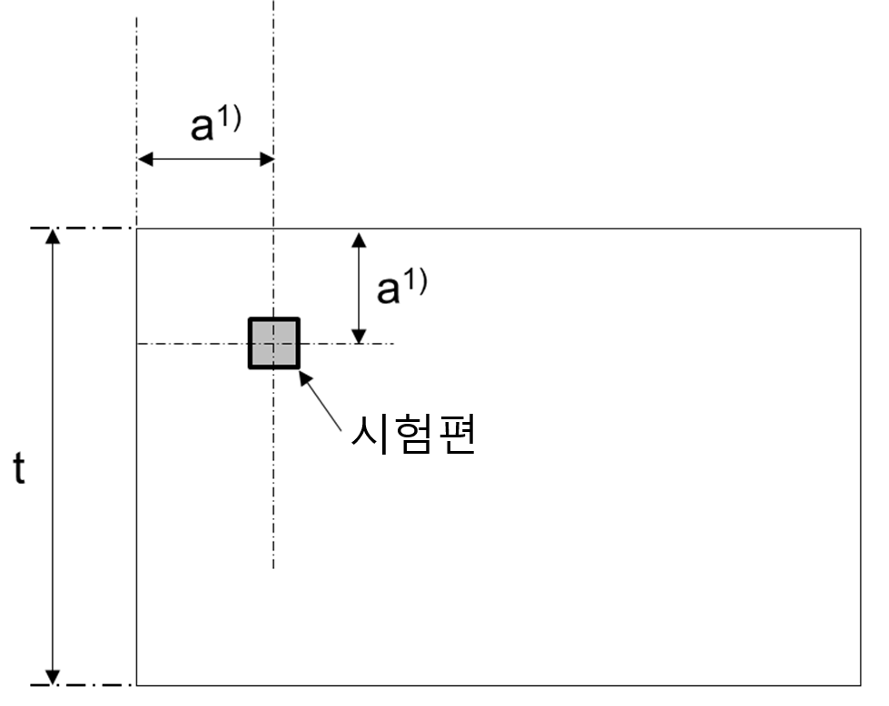

# 제2편 재료 및 용접

> 선급 및 강선규칙/적용지침 / RA-02-K / 2025 / KO / Guidance

## 부록 2-1 강재의 이음매 없는 단조동체 검사기준

### 1. 강재의 이음매 없는 단조동체

#### 1.1 적용

- **(1)** 이 규정은 보일러에 사용하는 강재의 이음매 없는 단조동체(이하 **단조동체**라 한다)에 적용한다.
- **(2)** 이 규정 이외의 사항에 대하여는 **규칙 2편 1장 1절** 및 **2절**에 따른다.

#### 1.2 종류

단조동체의 종류는 **표 1**에 따른다.

#### 1.3 기계적성질

단조동체는 다음과 같은 기계적 시험에 합격하여야 한다.

- **(1)** **인장시험**
  인장시험의 규격치는 **표 2**에 따른다.

  **표 2 인장시험**

  | 재료기호 | 항복강도($\mathrm{N}/mm ^{2}$) | 인장강도($\mathrm{N}/mm ^{2}$) | 연신율($\%$)(*L*=5*D*) | 단면수축률($\%$) |
  | --- | --- | --- | --- | --- |
  | *RSFB* 410 | 205 이상 | 410 이상 | 24 이상 | 38 이상 |
  | *RSFB* 520 | 255 이상 | 520 이상 | 22 이상 | 40 이상 |
- **(2)** **굽힘시험**
  시험편을 상온에서 **표 3**에서 정하는 안쪽 반지름으로 180°굽혀도 바깥쪽에 홈 또는 균열이 생겨서는 아니 된다.

  **표 3 굽힘 안쪽반지름**

  | 재료기호 | *RSFB* 410 | *RSFB* 520 |
  | --- | --- | --- |
  | 굽힘 안쪽 반지름 | 인장강도가 490 $\mathrm{N}/mm ^{2}$ 이하의 것: 6 mm | 인장강도가 560 $\mathrm{N}/mm ^{2}$ 이하인 것: 9.5 mm |
  | 굽힘 안쪽 반지름 | 인장강도가 490 $\mathrm{N}/mm ^{2}$를 넘는 것: 9.5 mm | 인장강도가 560 $\mathrm{N}/mm ^{2}$를 넘는 것: 16 mm |

#### 1.4 시험편의 채취

- **(1)** 동체의 각 단부에서 인장시험편 및 굽힘시험편 1조씩을 동체의 중심선과 직각으로 채취한다. 이때 동체의 중심선의 서로 반대 측에서 각각 채취한다.
- **(2)** 동체의 단부를 기계가공 후 재 단조하여 밀폐하는 경우에 한하여 시험재를 재 단조하기 전에 본체에서 채취하고 본체와 동시에 열처리를 하여 재료시험을 할 수 있다. 이 경우 재 단조 후 본체를 다시 열처리한다. 이 열처리는 시험재와 동시에 한 열처리가 어닐링일 경우에는 강재의 변태온도 이상에서 하고(다만, 당초의 어닐링 온도 이하의 온도에서 어닐링 한다) 당초의 열처리가 노멀라이징 후 템퍼링일 경우에는 당시의 열처리와 동일 열처리를 한다. 
