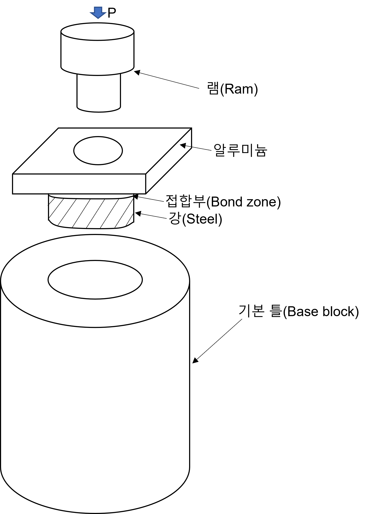
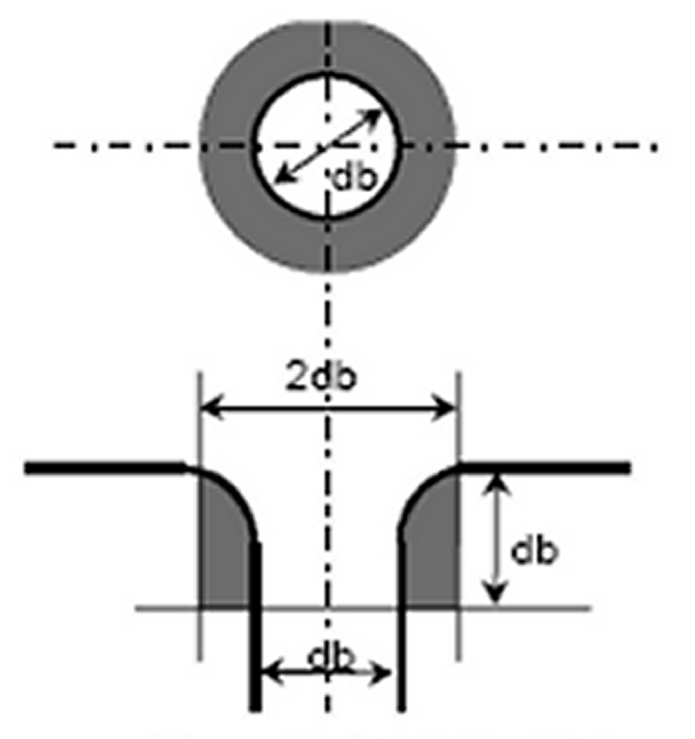

# 제2편 재료 및 용접

> 선급 및 강선규칙/적용지침 / RA-02-K / 2025 / KO / Guidance

## 부록 2-5 단강품 비파괴검사기준

### 1. 적용

#### (1) 이 기준은 규칙 2편 1장 601.의 8항 및 10항의 규정에 따른 선체 및 일반용 단강품과 기관용 단강품(이하 단강품이라 한다)의 자분탐상, 액체침투탐상 및 외관검사 방법에 의한 표면검사와 초음파탐상검사에 적용한다.

#### (2) 이 기준에서 규정하는 이외의 단강품(커플링, 기어, 보일러 및 압력용기의 부품 등)에 대하여는 그 재료, 종류, 형상 및 적용되는 응력조건 등을 감안하여 이 기준을 준용할 수 있다.

#### (3) 이 기준은 오스테나이트 스테인리스강 및 듀플렉스 스테인리스강 단강품의 검사에도 적용할 수 있다. (2022)

#### (4) 단강품은 최종 인도조건에서 검사되어야 하며, 중간에 검사를 수행한 경우 제조자는 검사원의 요청에 따라 그 시험성적서를 제출하여야 한다.

#### (5) 단강품이 반제품상태로 공급되는 경우, 제조자는 최종 가공부품의 품질수준에 대하여 고려하여야 한다.

#### (6) 비파괴검사를 수행하는 검사자의 자격 및 검사계획에 대하여는 이 지침 부록 2-2의 2항 및 4항 (2)호 (가)에 따른다.

#### (7) 향상된 초음파검사 방법이 적용되는 경우(예 : PAUT 또는 TOFD)는 해당 방법을 채택하고 적용하는 일반적인 접근 방식에 대해 부록 2-12를 참조한다. 합격/불합격 기준은 이 기준을 따른다. (2022)

### 2. 표면검사

#### (1) 일반사항

- **(가)** 이 기준에서 표면검사는 관련 지시(indication)를 탐상하고 이 기준의 합격/불합격 기준으로 관련 지시들을 평가하기 위한 목적으로 외관검사 및 자분탐상검사 또는 액체침투탐상검사로 실시되어야 한다. 외관검사에 종사하는 검사자는 충분한 지식과 경험을 가지고 있어야 하지만 이 기준에 명시된 자격을 요구하는 것은 아니다. *(2022)*
- **(나)** 자분탐상검사 및 액체침투탐상검사의 검사방법, 검사장비 및 검사조건은 우리 선급이 인정하는 국내 또는 국제표준에 적합하여야 한다.
- **(다)** 우리 선급은 지시(indication)의 존재 유무 및 문서화되지 않은 용접 보수의 존재 유무 등을 확인하기 위한 보충 검사 방법으로 기타 표면검사 방법(예: 와류탐상검사)을 요구할 수 있다. 이 기준은 이러한 목적에 대한 합격/불합격 기준을 포함하지 않으며 단지 정보용으로만 활용하기 위해 규정하고 있다. *(2022)*

#### (2) 제품

- **(가)** 제조자는 **규칙 2편 1장 601.**에서 규정하는 단강품의 접근 가능한 표면에 대하여는 100 % 외관검사를 하여야 하고 검사원이 이를 확인할 수 있어야 한다. 다량생산되는 단강품에 대한 검사의 범위는 우리 선급이 적절하다고 인정하는 바에 따른다. *(2022)*
- **(나)** **규칙 2편 1장 601.**에는 선급품 대상이 될 수 있는 모든 단강품들이 포함되어 있지 않다(예: 단조 선회 링). **규칙 2편 1장 601.**또는 이 기준에 특정 제품 또는 유형이 포함되지 않은 경우, 적절한 검사방법 및 결함의 합격기준을 결정하기 위해 적절한 국가/국제 표준 또는 규칙이 적용될 수 있다. *(2022)*
- **(다)** 오스테나이트 스테인리스강 및 듀플렉스 스테인리스강 단강품의 합격기준에 대한 세부사항은 이 기준의 표면 및 초음파탐상검사에 대한 규정에 포함되어 있지만, 다른 합격기준과 국가 또는 국제 표준을 우리 선급이 인정한다면 적용할 수 있다. *(2022)*
- **(라)** 그러한 표준이 합격 및 불합격 기준의 기초로 사용되거나 참조되는 경우, 품질 등급은 이 기준의 적절한 표에 명시된 허용 기준과의 합리적인 동등성을 제공해야 한다. 품질 등급은 일반적으로 이 기준과 합리적인 동등성을 제공하기 위해 가장 높거나 가장 엄격해야 한다. *(2022)*
- **(마)** 자분탐상검사 및/또는 액체침투탐상검사에 의한 표면검사는 일반적으로 다음의 단강품에 적용한다.
  - **(a)** 모든 크랭크축 *(2022)*
  - **(b)** 최소 지름이 100 mm 이상인 프로펠러축, 중간축, 스러스트축, 타두재
  - **(c)** **규칙 5편**의 엔진 형식 및 크기 요구사항에 따른 실린더헤드, 연접봉, 피스톤봉 및 크로스헤드 *(2022)*
  - **(d)** 실린더 커버볼트, 크랭크축의 커플링 볼트, 타이로드, 크랭크 핀 볼트, 메인 베어링 볼트 등 및 **규칙 5편**의 엔진 형식 및 크기 요구사항에 따른 다른 부품과 같은 동적 응력을 받는, 지름이 50 mm 이상인 볼트 *(2022)*
  - **(e)** 동적 응력을 받는 프로펠러 블레이드 고정 볼트 *(2022)*

#### (3) 표면검사 영역 그림 1 내지 그림 4에 나타내는 영역 I, II 및 III(해당되는 경우)에 대하여는 자분탐상검사 또는 허용되는 경우, 액체침투탐상검사를 실시하여야 한다. (2022)

#### (4) 표면조건 검사하고자 하는 단강품의 표면은 스케일, 먼지, 그리스 또는 페인트가 없어야 한다.

#### (5) 표면검사

- **(가)** **그림 1** 내지 **그림 4**에 지정된 경우로서, 다음에 해당하는 경우에는 자분탐상검사대신 액체침투탐상검사를 실시한다.
  - 오스테나이트 스테인리스강 및 듀플렉스 스테인리스강 *(2022)*
  - 외관검사 또는 자분탐상검사로 드러난 결함지시의 해석
  - 검사원의 지시
- **(나)** 주문서에 별도로 규정되어있지 아니하는 한, 자분탐상검사는 단강품의 최종가공 표면조건 및 최종 열처리 조건이 완료된 상태에서 실시하여야 한다. *(2022)*
- **(다)** 별도로 동의되지 않는 한 표면검사는 검사원의 입회하에 실시하여야 한다. 표면검사는 가능한 한 열박음 전에 실시하여야 한다.
- **(라)** 자분탐상검사에 있어서는 단강품 표면에서의 국부적인 과열 또는 연소에 의한 손실을 방지하기 위하여 자화용 고정 작업대의 조임장치와 단강품 간의 접촉상태에 유의해야 한다. 최종 기계가공 완료 부품에 대하여는 자화 프로드를 사용해서는 안된다.
- **(마)** 표면검사의 결과로서 결함지시를 검출한 경우에는 (6)호에 따라 합격 또는 불합격이 판정되어야 한다.

  ** (a) 일체형 크랭크축**

  |  (b) 반조립형 크랭크축 |   |   |
  | --- | --- | --- |
  | (비고) 1. 핀 또는 저널에 기름구멍을 가진 경우에는 기름구멍의 주변표면(그림참조)은 영역 I로 한다. 2. 그림에서 “θ”, “a" 및 ”b"는 θ = 60° a = 1.5 r b = 0.05 d (수축끼워맞춤의 주변표면) 여기서, r : 필릿 반경 d : 저널 지름 3. 영역표시 (그림 1 내지 4 동일) |   |  db : 기름구멍의 지름 |
  |  | : 영역 I : 영역 II |   |
  | **그림 1 크랭크축의 표면검사 영역** |   |   |

  |  (a) 프로펠러축 |  (b) 중간축 |
  | --- | --- |
  |   |  (c) 스러스트축 |
  | (비고) 프로펠러축, 중간축 및 스러스트축에 있어서 축심에 수직방향인 구멍(radial holes), 슬롯(slots) 및 키홈(key ways)과 같이 응력이 발생하는 모든 부위는 영역 I로 한다. |   |
  | **그림 2 축의 표면검사 영역** |   |

  |  (a) 연접봉 |  (b) 피스톤 로드 |  (c) 크로스 헤드 |
  | --- | --- | --- |
  |   |   |  (d) 볼트 |
  | **그림 3 엔진 부품의 표면검사 영역** |   |   |

  |  (a) A 형식 |
  | --- |
  |  (b) B 형식 |
  |  (c) C 형식 |
  | **그림 4 타두재의 표면검사 영역** |

#### (6) 판정기준 및 결함의 보수

- **(가)** **외관검사의 판정기준**
  - **(a)** 모든 단강품에는 균열, 유사균열 지시, 겹침(laps), 심(seams), 포개짐(folds) 또는 기타 유해한 결함이 없어야 한다. 표면 불연속에 대한 상세 평가를 위해 검사원의 요청이 있는 경우, 자분탐상검사에 추가하여 액체침투탐상검사 및 초음파탐상검사가 요구될 수 있다.
  - **(b)** 중공 프로펠러축의 구멍부는 기계가공에 의해 드러난 결함에 대하여 외관검사를 하여야 한다. *(2022)*
- **(나)** **자분탐상 및 액체침투탐상검사의 판정기준** ***(2022)***
  - **(a)** 결함지시와 관련한 정의는 다음에 따른다.
  - **(i)** 선형결함지시 : 가장 긴 길이가 가장 짧은 길이의 3배 이상인 결함지시 (예 I≥3w)
    - 결함지시들 사이의 거리가 2 mm 미만이고 결함지시들이 3개 이상 연속적으로 형성되는 비선형결함지시들. 연속된 결함지시는 하나의 결함지시로 간주되며 그 길이는 연속된 전체 길이와 같다.
    - 두 결함지시들 사이의 거리가 가장 긴 결함지시의 길이보다 작게 형성되는 선형결함지시들
    - **(ii)** 비선형결함지시 : 가장 긴 길이가 가장 짧은 길이의 3배 미만인 결함지시 (예 I<3w)
    - **(iii)** 연속결함지시 :
    - **(iv)** 열린결함지시 : 자분을 제거한 후에도 보이는 결함지시 또는 액체침투탐상검사를 이용하여 검출될 수 있는 결함지시
  - **(v)** 닫힌결함지시 : 자분을 제거한 후에는 보이지 않는 결함지시 또는 액체침투탐상검사를 이용하여 검출될 수 없는 결함지시
    - **(vi)** 관련지시 : 평가를 요하는 불연속의 상태 또는 모양에 기인하는 결함지시. 어떠한 치수든 1.5 mm를 넘는 경우에만 결함지시 범주와 관련 있는 것으로 간주한다.
  - **(b)** 결함지시의 평가 목적상, 표면은 225 $\mathrm{cm} ^{ 2}$의 기준 면적으로 분할되어야 한다. 이 기준면적은 평가될 지시와 관련하여 가장 불리한 지역에서 선택되어야 한다.
  - **(c)** 기준 면적에서 허용되는 결함지시의 수 및 크기는 크랭크축 단강품에 대하여는 **표 1**, 기타 단강품(오스테나이트 스테인리스강 및 듀플렉스 스테인리스강을 포함하는)에 대하여는 **표 2**에 따른다. 다만, 균열은 허용되지 않으며, 결함지시의 총 수가 과도한 경우에는 검사원은 비파괴검사의 결과에 관계없이 단강품을 불합격으로 할 수 있다.

    | 검사영역 | 결함지시의 최대수 | 결함지시의 모양 | 각 모양에 대한 최대수 | 최대 치수 (mm) |
    | --- | --- | --- | --- | --- |
    | I (아주 중요한 필릿부) | 0 | 선형 비선형 연속 | 0 0 0 | - - - |
    | II (중요한 필릿부) | 3 | 선형 비선형 연속 | 0 3 0 | - 3.0 - |
    | III (저널부 표면) | 3 | 선형 비선형 연속 | 0 3 0 | - 5.0 - |

    | 검사영역 | 결함지시의 최대수 | 결함지시의 모양 | 각 모양에 대한 최대수 | 최대 치수 (mm) |
    | --- | --- | --- | --- | --- |
    | I | 3 | 선형 비선형 연속 | 0(1) 3 0(1) | - 3.0 - |
    | II | 10 | 선형 비선형 연속 | 3(1) 7 3(1) | 3.0 5.0 3.0 |
    | (비고) (1) 선형 또는 연속결함은 주베어링 볼트, 연접봉 볼트, 크로스헤드 베어링 볼트, 실린더 커버볼트와 같이 변동하중을 직접적으로 받는 볼트에 대하여는 허용되지 않는다. |   |   |   |   |
- **(다)** **결함의 보수**
  - **(a)** 결함 및 불합격된 결함지시는 다음 및 (b) 내지 (f)의 규정에 따라 보수되어야 한다. 일반적으로 얕은 지시를 제거하기 위해 최대 1.5 mm 깊이까지 가벼운 그라인딩이 허용될 수 있다. *(2022)*
  - **(i)** 재료의 결함부는 그라인딩 또는 칩핑 및 그라인딩으로 제거될 수 있다. 모든 홈은 바닥의 반경이 홈 깊이의 약 3배이어야 하며, 표면에 완만하게 인근의 표면과 동일하게 마무리되어야 한다.
    - **(ii)** 갈아내기는 닫힌결함지시의 가장자리를 끝이 뾰쪽한 연마석으로 표면하 깊이가 최저 0.08 mm, 최대 0.25 mm 정도로 제한해서 편평하게 또는 완화시키고 또한 인근의 표면과 동일하게 마무리하는 것이다. 갈아낸 면은 홈으로 간주되어서는 안되며, 다만 베어링의 마모를 방지하기 위한 것이다.
    - **(iii)** 편석으로 평가되는 닫힌결함지시는 보수하지 않아도 좋다.
    - **(iv)** 결함의 완전한 제거는 가능한 한 자분탐상검사 또는 액체침투탐상으로 확인되어야 한다. *(2022)*
  - **(v)** 크랭크축 또는 비틈림 피로를 받는 회전 부품(예: 프로펠러축)에 대하여는 용접보수를 해서는 안된다. 기타 단강품에 대한 용접보수는 우리 선급의 사전 승인을 받아야 한다. *(2022)*
    - **(vi)** 마무리 가공된 나사산 부근에는 그라인딩이 허용되지 않는다. *(2022)*
  - **(b)** **크랭크축 단강품의 영역 I** 이 영역에서는 어떠한 결함지시나 보수도 허용되지 않는다.
  - **(c)** **크랭크축 단강품의 영역 II**
  - **(i)** 결함지시는 보수깊이가 1.5 mm를 넘지 않도록 그라인딩으로 제거하여야 한다.
    - **(ii)** 저널 베어링 표면에서 검출된 결함지시는 보수깊이가 3.0 mm를 넘지 않도록 그라인딩으로 제거하여야 한다. 총 그라인딩 면적은 당해 총 베어링 표면적의 1% 미만이어야 한다.
    - **(iii)** 편석으로 평가된 이외의 닫힌 결함지시는 갈아내어야 한다. 그러나 제거할 필요는 없다.
  - **(d)** **기타 단강품의 영역 I** 결함지시는 보수깊이가 1.5 mm를 넘지 않도록 그라인딩으로 제거하여야 한다. *(2022)*
  - **(e)** **기타 단강품의 영역 II** 결함지시는 보수깊이가 지름의 2% 또는 4.0 mm 중 작은 값을 넘지 않도록 그라인딩으로 제거하여야 한다.
  - **(f)** **모든 단강품의 영역 I 및 II 이외의 영역** 외관검사로 검출된 결함은 보수깊이가 지름의 5% 또는 10 mm 중 작은 값을 넘지 않도록 그라인딩으로 제거하여야 한다. 총 그라인딩 면적은 당해 총 베어링 표면적의 2% 미만이어야 한다.

#### (7) 보고서 (2022)

표면검사의 시험결과는 적어도 다음 항목이 기록되어야 한다.

### 3. 초음파탐상검사

#### (1) 일반사항 (2022)

- **(가)** 이 기준에서 초음파탐상검사는 수직 또는 경사각 접촉법으로 하여야 한다. 향상된 초음파탐상검사(예: PAUT 또는 TOFD) 방법은 **지침 부록 2-12**의 일반적인 요구사항을 만족해야 한다.
- **(나)** 초음파탐상검사의 검사방법, 장비 및 검사조건은 우리 선급이 인정하는 국내 또는 국제표준에 적합하여야 한다. 일반적으로 검사 감도 설정 및 검사 평가 방법은 DAC(거리진폭특성) 또는 DGS(거리감도크기 선도) 방법을 사용한다. 적용된 방법은 2 ~ 4 MHz의 수직 및/또는 경사각 탐촉자를 사용해야 한다. 가까운 표면용(최대 깊이 25 mm까지) 검사를 위해서는 2진동자 수직 탐촉자를 써야 하며, 추가하여 나머지 체적에 대해서는 수직 탐촉자(일반적으로 깊이 25 mm를 초과하는 영역을 위한 단일 진동자)를 사용해야 한다. 선택한 감도 방법에 따라 적절한 합격기준 표를 사용해야 한다.
- **(다)** 필릿부는 주로 검사 반경 영역 내 균열의 존재를 확인하기 위해 45°, 60° 또는 70°의 경사각 탐촉자를 사용하고, 이 영역 내에서 다른 지시를 확인하기 위해 수직 탐촉자로 추가적으로 탐상을 할 수 있다.
- **(라)** 제작된 단조품 및 용접 보수의 경우, 용접 검사는 적절한 표준에 따라 수행되어야 하며 이 기준에 포함된 합격 기준 표를 용접의 합격 기준으로 사용해서는 안 된다.
- **(마)** 수직 탐촉자에 대한 DAC 곡선의 구성은 검사 두께에 걸쳐 적절한 크기의 평저공(FBH)을 포함하는 대비시험편을 사용하여 수행해야 한다. 대비시험편은 검사 대상과 유사한 표면 상태 및 유사한 재료로 제조되어야 한다. 필요한 경우 전이 보상 및 DAC곡선 조정을 통해 감쇠 손실을 허용해야 한다. 적용된 전이 보상(데시벨(dB)로 측정)은 이 기준의 적절한 표에 따라 지시들이 평가되는 새로운 기준 감도가 되어야 한다.

#### (2) 제품 (2022)

- **(가)** 초음파탐상검사는 일반적으로 다음의 단강품에 적용된다.
  - **(a)** 모든 크랭크축
  - **(b)** 최소 지름이 200 mm 이상인 프로펠러축, 중간축, 스러스트축, 타두재
  - **(c)** **규칙 5편**의 엔진 형식 및 크기 요구사항에 따른 실린더헤드, 연접봉, 피스톤봉 및 크로스헤드
- **(나)** **규칙 2편 1장 601.**에는 선급품 대상이 될 수 있는 모든 단강품들이 포함되어 있지 않다(예: 단조 선회 링). **규칙 2편 1장 601.** 또는 이 기준에 특정 제품 또는 유형이 포함되지 않은 경우, 적절한 검사방법 및 결함의 합격기준을 결정하기 위해 적절한 국가/국제 표준 또는 규칙이 적용될 수 있다. *(2022)*
- **(다)** 그러한 표준이 합격 및 불합격 기준의 기초로 사용되거나 참조되는 경우, 품질 등급은 이 기준의 적절한 표에 명시된 허용 기준과 합리적인 동등성을 제공해야 한다. 품질 등급은 일반적으로 이 기준과 합리적인 동등성을 제공하기 위해 가장 높거나 가장 엄격하다. *(2022)*
- **(라)** **표 3 ~ 6**에 명시된 초음파탐상검사 합격 기준은 C, C-Mn 및 합금강 단조품을 위한 것이며 오스테나이트 스테인리스강 또는 듀플렉스 스테인리스강 단조품에는 적용되지 않는다. 스테인리스강 또는 듀플렉스 스테인리스강 단조품의 합격 기준에 대한 표준의 예는 아래에 명시되어 있으며 품질 등급은 우리 선급이 동의해야 한다. 우리 선급의 동의함에 따라 다른 국내 또는 국제 표준을 사용할 수 있다.
  - **(a)** **ASTM A745/A745M-20**
  - **(b)** **EN 10228-4:2016**

#### (3) 초음파탐상검사 영역

- **(가)** **그림 5** 내지 **그림 8**에 나타내는 영역 I 내지 III에 대하여는 초음파탐상검사를 실시하여야 한다. 검사원의 재량에 따라 검사영역의 등급을 올릴 수 있다.

  ** 탐상방향**

  |  (a) 일체형 크랭크축 |   |
  | --- | --- |
  |  (b) 반조립형 크랭크축 |   |
  | (비고) 1. 그림에서, “a" 및 ”b"는 a = 0.1 d 또는 25mm중 큰 값 b = 0.05 d 또는 25mm중 큰 값 (수축끼워맞춤의 주변) 여기서, d : 핀 또는 저널의 지름 2. 웨브사이의 반경 0.25 d 이내의 크랭크 핀 및/또는 저널의 중심부는 일반적으로 영역 II로 한다. 3. 영역표시 (그림 5 내지 8 동일) |   |
  |  | :영역 I :영역 II :영역 III |
  | **그림 5 크랭크축의 초음파 탐상검사 영역** |   |

  |  탐상방향 |  (b) 중간축 |
  | --- | --- |
  |  (a) 프로펠러축 |   |
  |   |  (c) 스러스트축 |
  | (비고) 1. 중공축의 경우, 영역 III에 대하여도 반경방향으로 360° 탐상을 하여야 한다. 2. 플랜지의 볼트구멍 주변은 영역 II로 간주한다. |   |
  | **그림 6 축의 초음파탐상검사 영역** |   |

  |  탐상방향 |  (b) 피스톤 로드 |
  | --- | --- |
  |  (a) 연접봉 |   |
  |   |  (c) 크로스 헤드 |
  | **그림 7 엔진부품의 초음파탐상검사 영역** |   |

  |  A 및 B 형식의 탐상방향 |
  | --- |
  |  (a) A 형식 |
  |  (b) B 형식 |
  |  (c) C 형식 C 형식의 탐상방향 |
  | **그림 8 타두재의 초음파탐상검사 영역** |

#### (4) 표면조건

- **(가)** 검사하고자 하는 단강품의 표면은 탐촉자와 단강품 사이에 적절한 접촉상태를 만들어, 탐촉자의 지나친 마모를 방지할 수 있어야 한다. 표면에는 스케일, 먼지, 그리스 또는 페인트가 없어야 한다.
- **(나)** 초음파탐상검사는 최종 열처리후 초음파탐상검사에 적합한 상태로 가공한 후, 그러나 오일구멍의 가공 전이나 표면경화처리 및 볼트 나사산의 기계가공 전에 실시하여야 한다. 기계가공을 하지 않는 단강품의 경우에는 불꽃스케일제거 또는 쇼트 블라스팅으로 산화 스케일을 제거한 후 검사를 하여야 한다. *(2022)*

#### (5) 판정기준

- **(가)** 초음파탐상검사 판정기준은 **표 3 ~ 표 6**에 따른다.

  | 종류 | 영역 | *DGS*(1)에 따른 허용 원형결함의 크기 | 결함지시의 허용 길이(2) | 두 결함지시 사이의 허용 거리(3) |
  | --- | --- | --- | --- | --- |
  | 크랭크축 | I II III | d ≤ 1.0 mm(4) d ≤ 2.0mm d ≤ 4.0mm | 해당없음(5) ≤ 10mm ≤ 15mm | 해당없음 ≥ 20mm ≥ 20mm |
  | (비고) (1) *DGS* : Distance Gain Size (2) 결함지시의 길이는 결함 에코의 높이가 판정기준선(*DGS*)의 50%를 넘는 탐촉자의 이동거리로 한다. (3) 평가대상이 되는 개별 결함이 2 이상 군집된 경우, 이웃하는 2 결함간의 최소 거리는 적어도 큰 결함의 길이이어야 한다. 이 요건은 깊이에 대한 거리로서 축방향의 거리에도 적용된다. 이 거리보다 근접하게 존재하는 단독 결함들은 하나의 결함으로 간주된다. (4) 영역 I 검사의 경우, 탐촉자 선택시에 탐촉자 빔 경로길이 및 빔 침투깊이 제한을 고려해야 하며 일반적으로 최소 탐촉자 주파수인 4 MHz로 수행해야 한다. (5) 영역 I 검사의 경우, 에코 높이가 1.0 mm 원형반사체보다 큰 지시는 허용되지 않는다. 에코 높이가 1.0 mm 반사체 이하인 지시들은 길이 측정이 불가능한 점 반사체로 간주된다면 허용된다. |   |   |   |   |

  | 종류 | 영역 | 3.0 mm 평저공(FBH)의 *DAC* 기준감도(1)(2)(3) | 결함지시의 허용 길이 | 두 결함지시 사이의 허용 거리(5) |
  | --- | --- | --- | --- | --- |
  | 크랭크축 | I II III | 3.0 mm DAC – 19 dB 3.0 mm DAC – 7 dB 3.0 mm DAC + 5 dB | 해당없음(4) ≤ 10.0 mm ≤ 15.0 mm | 해당없음 ≥ 20 mm ≥ 20 mm |
  | (비고) (1) 3mm 평저공(FBH)의 요구사항은 명확성과 일관성을 위해 DAC 대비시험편을 표준화하는 것이다. 평저공(FBH)/DAC 설정에 대한 dB값은 해당 영역에 해당하는 **표 3**에 명시된 원형 반사체와 동등하다. (2) 다른 크기의 평저공(FBH)이 DAC 방법에서 사용될 수 있다(그리고 명시된 평저공(FBH)/원형 반사체와 동등하기 위해 dB값이 조정된다). 다른 크기의 평저공(FBH)이 사용되는 경우, 초음파탐삼검사 절차는 적절한 계산 공식을 사용하여 동등성을 나타내야 한다. (3) 영역 I 검사의 경우, 탐촉자 선택시에 탐촉자 빔 경로길이 및 빔 침투깊이 제한을 고려해야 하며 일반적으로 최소 탐촉자 주파수인 4 MHz로 수행해야 한다. (4) 영역 I 검사의 경우, 에코 높이가 DAC 기준감도보다 큰 지시는 허용되지 않는다. 에코 높이가 DAC 기준감도보다 작은 지시들은 길이 측정이 불가능한 점 반사체로 간주된다면 허용된다. (5) 평가대상이 되는 개별 결함이 2 이상 군집된 경우, 이웃하는 2 결함간의 최소 거리는 적어도 큰 결함의 길이이어야 한다. 이 요건은 깊이에 대한 거리로서 축방향의 거리에도 적용된다. 이 거리보다 근접하게 존재하는 단독 결함들은 하나의 결함으로 간주된다. |   |   |   |   |

  | 종류 | 영역 | *DGS*(1)(2)에 따른 허용 원형결함의 크기 | 결함지시의 허용 길이(3) | 두 결함지시 사이의 허용 거리(4) |
  | --- | --- | --- | --- | --- |
  | 프로펠러축 중간축 추력축 타두재 | II | 바깥쪽: d≤2mm 안쪽 : d≤4mm | ≤10mm ≤15mm | ≥20mm ≥20mm |
  | 프로펠러축 중간축 추력축 타두재 | III | 바깥쪽: d≤3mm 안쪽 : d≤6mm | ≤10mm ≤15mm | ≥20mm ≥20mm |
  | 연접봉 피스톤봉 크로스헤드 | II | d≤2.0mm | ≤10mm | ≥20mm |
  | 연접봉 피스톤봉 크로스헤드 | III | d≤4.0mm | ≤10mm | ≥20mm |
  | (비고) (1) *DGS* : Distance Gain Size (2) 바깥쪽이란 중심에서 축반경의 1/3지점 바깥쪽 부분을 의미하며, 안쪽이란 중심에서 축반경의 1/3지점 이내를 의미한다. (3) 결함지시의 길이는 결함 에코의 높이가 판정기준선(*DGS*)의 50%를 넘는 탐촉자의 이동거리로 한다. (4) 평가대상이 되는 개별 결함이 2 이상 군집된 경우, 이웃하는 2 결함간의 최소 거리는 적어도 큰 결함의 길이이어야 한다. 이 요건은 깊이에 대한 거리로서 축방향의 거리에도 적용된다. 이 거리보다 근접하게 존재하는 단독 결함들은 하나의 결함으로 간주된다. 이 요건은 깊이에 대한 거리로서 축방향의 거리에도 적용된다. 이 거리보다 근접하게 존재하는 단독 결함들은 하나의 결함으로 간주된다. |   |   |   |   |

  | 종류 | 영역 | 3.0 mm 평저공(FBH)의 *DAC* 기준감도(1)(2) | 결함지시의 허용 길이(3) | 두 결함지시 사이의 허용 거리(3) |
  | --- | --- | --- | --- | --- |
  | 프로펠러축 중간축 추력축 타두재 | II | 바깥쪽: DAC – 7 dB 안쪽 : DAC + 5 dB | ≤ 10.0 mm ≤ 15.0 mm | ≥20mm ≥20mm |
  | 프로펠러축 중간축 추력축 타두재 | III | 바깥쪽: +0 DAC 안쪽 : DAC + 12 dB | ≤ 10.0 mm ≤ 15.0 mm | ≥20mm ≥20mm |
  | 연접봉 피스톤봉 크로스헤드 | II | DAC – 7 dB | ≤ 10.0 mm | ≥20mm |
  | 연접봉 피스톤봉 크로스헤드 | III | DAC + 5 dB | ≤ 10.0 mm | ≥20mm |
  | (비고) (1) 3mm 평저공(FBH)의 요구사항은 명확성과 일관성을 위해 DAC 대비시험편을 표준화하는 것이다. 평저공(FBH)/DAC 설정에 대한 dB값은 해당 영역에 해당하는 **표 3**에 명시된 원형 반사체와 동등하다. (2) 다른 크기의 평저공(FBH)이 DAC 방법에서 사용될 수 있다(그리고 명시된 평저공(FBH)/원형 반사체와 동등하기 위해 dB값이 조정된다). 다른 크기의 평저공(FBH)이 사용되는 경우, 초음파탐삼검사 절차는 적절한 계산 공식을 사용하여 동등성을 나타내야 한다. (3) 평가대상이 되는 개별 결함이 2 이상 군집된 경우, 이웃하는 2 결함간의 최소 거리는 적어도 큰 결함의 길이이어야 한다. 이 요건은 깊이에 대한 거리로서 축방향의 거리에도 적용된다. 이 거리보다 근접하게 존재하는 단독 결함들은 하나의 결함으로 간주된다. |   |   |   |   |

#### (6) 보고서 (2022)

초음파탐상검사의 시험결과는 적어도 다음 항목이 기록되어야 한다.
