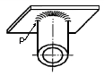

# 제2편 재료 및 용접

> 선급 및 강선규칙/적용지침 / RA-02-K / 2025 / KO / Guidance

## 부록 2-11 고망간강 (2020)

### 1. 적용

#### (1) 이 지침은 액화가스 산적운반선의 화물탱크 또는 저인화점연료선박의 연료탱크에 사용되는 고망간강판(이하 고망간강이라 한다)에 대하여 적용한다. IGC Code 및 IGF Code에 승인된 다음 화물 및 연료의 사용에 적합하다. (2023)

- **(가)** 부탄(모든 이성체)
- **(나)** 부탄-프로판 혼합물
- **(다)** 이산화탄소(고순도 및 재생품)
- **(라)** 에탄
- **(마)** 에틸렌
- **(바)** 메탄(LNG)
- **(사)** 펜탄(모든 이성체)
- **(아)** 프로판
- **(자)** 무수암모니아 *(2025)*

#### (2) (1)호 이외의 목적으로 사용되는 고망간강은 우리 선급의 승인을 받아 이 지침을 준용할 수 있다.

#### (3) 규칙 7편 5장의 1712. 2항 (2)호에서 규정하고 있는 용접후 응력제거 열처리는 암모니아가 적재되는 화물 탱크에 대해 면제된다. (2025)

#### (4) 이 지침에 규정하지 아니한 사항에 대하여는 규칙 2편 1장 301.에 따른다.

### 2. 정의

#### (1) 고망간강이라 함은 대기 및 사용 온도에서 주상(primary phase)을 오스테나이트 조직으로 유지하기 위해 망간을 다량 함유한 강재를 말한다.

#### (2) 제어 냉각(controlled cooling)이라 함은 냉각법의 한 방법으로, 설계된 냉각속도에 따라 높은 온도로부터 냉각시키는 방법이다.

### 3. 제조법

#### (1) 슬래브를 압연한 고망간강의 압연비는 3:1 보다 작아서는 안 된다. (2023)

#### (2) 고망간강의 재료기호, 두께, 탈산방법 및 화학성분은 표 1에 따른다.

**표 1 재료기호, 두께, 탈산방법 및 화학성분(%)** ***(2021) (2023)***

| 재료기호 | 두께 $t$ (mm) | 탈산 방법 | 화학성분($\%$) |   |   |   |   |   |   |   |   |
| --- | --- | --- | --- | --- | --- | --- | --- | --- | --- | --- | --- |
| 재료기호 | 두께 $t$ (mm) | 탈산 방법 | $C$ | $Si$(1) | $Mn$ | $P$ | $S$ | $Cu$ | $Cr$ | $N$ | $B$ |
| *HMA400* | 6≤$t$≤40 | 킬드 및 세립화 | 0.35 ∼ 0.55 | 0.10 ∼ 0.50 | 22.50 ∼ 25.50 | 0.030 이하 | 0.010 이하 | 0.30 ∼ 0.70 | 3.00 ∼ 4.00 | 0.050 이하 | 0.005 이하 |
| (비고) (1) 합금 및 세립화에 사용되는 기타 화학성분은 제조자가 적절히 사용할 수 있다. (2) 산에 용해되는 $Al$의 함유량이 0.025 % 이상이거나 $Al$의 전 함유량이 0.03 % 이상일 경우, $Si$의 함유량을 0.10 % 미만으로 할 수 있다. |   |   |   |   |   |   |   |   |   |   |   |

### 4. 열처리

#### (1) 고망간강은 열간압연 후, 필요 시 제어냉각(controlled cooling)을 할 수 있다.

#### (2) 최종 압연 후에 별도의 열처리는 실시하지 않는다.

### 5. 시험재의 채취

#### (1) 시험재는 1개의 강편, 빌릿 또는 강괴로부터 직접 압연되고 또한 동일한 열처리를 한 피스(piece)마다 1개의 시험재를 채취한다.

#### (2) 시험재의 채취위치는 규칙 2편 1장 301.의 6항 (4)호에 따른다.

### 6. 시험편의 채취

#### (1) 인장시험편은 다음에 따른다.

- **(가)** 인장시험편은 **규칙 2편 1장 301.**의 **7**항 (2)호에 따라 채취한다.
- **(나)** 시험편은 일반적으로 판 모양의 인장시험편을 적어도 한쪽면에 압연 스케일을 유지하는 방식으로 가공한다.
- **(다)** 봉모양 인장시험편을 채취하는 경우, 채취위치는 표면으로부터 두께의 대략 1/4에 위치하도록 한다.

#### (2) 충격시험편은 규칙 2편 1장 301.의 7항 (3)호에 따라 채취한다.

### 8. 용접용 재료

#### (1) 8항에서 특별히 규정되지 아니한 사항에 대하여는 규칙 2편 2장 607.의 규정을 준용한다.

#### (2) 용접용재료의 종류 및 기호는 표 3에 따른다.

**표 3 종류 및 기호** ***(2023)***

| TIG 용접용재료 | 플럭스코어드 와이어 용접용재료 | 서브머지드 아크용접용재료 |
| --- | --- | --- |
| *RY HMA* | *RW HMA* | *RU HMA* |

#### (3) 각 용접법의 시험에 합격한 자동용접용재료에는 그 기호의 뒤에 표 4의 표시기호를 부기한다.

**표 4 표시기호**

| 용 접 법 | 표 시 기 호 |
| --- | --- |
| 다층용접법 | *M* |
| 양면 일층용접법 | *T* |
| 다층 및 양면 일층 겸용용접법 | *TM* |

#### (4) 용착금속시험 (2021)

고망간강 용접용 재료의 용착금속시험의 기계적 성질은 다음 **표 5**에 따른다.

#### (5) 맞대기용접시험

고망간강 용접용 재료의 맞대기용접시험의 기계적 성질은 다음 **표 6**에 따른다.

#### (6) 필릿용접시험

**규칙 2편 2장 602. 7항**의 규정을 준용한다.

### 9. 용접사

#### (1) 고망간강을 용접하는 용접사는 규칙 2편 2장 5절에 따라 고망간강 시험편으로 용접사 기량자격 시험을 합격하여 기량자격을 보유해야 한다.

#### (2) 고망간강 용접에 종사하는 자는 고망간강으로 기량자격 시험을 합격한 용접사이어야 한다.

### 10. 용접절차인정시험

#### (1) 고망간강의 용접절차인정시험은 규칙 7편 5장 또는 저인화점연료선박 규칙에 따른다.

#### (2) 맞대기용접 이음시험의 종류 및 시험편의 수는 표 7에 따른다.

**표 7 맞대기용접 이음시험의 종류** ***(2023)***

| 시험재의 종류 및 재료기호 |   | 시험의 종류 및 시험편의 수(개)(1)(2) |   |   |   |   |   |   |
| --- | --- | --- | --- | --- | --- | --- | --- | --- |
| 시험재의 종류 및 재료기호 |   | 외관 검사 | 인장 시험 | 굽힘시험 | 충격 시험 | 매크로시험 | 경도 시험 (6) | 비파괴검사 (7) |
| 고망간강판 | *HMA400* | 용접부 전장 | 3(3) | 2(4) | (5) | 1 | 1 | 용접부 전장 |
| (비고) (1) 우리 선급이 필요하다고 인정하는 경우, 마이크로 조직시험 등 기타 다른 시험을 요구할 수 있다. (2) **규칙 2편 그림 2.2.6**의 RL9N490 시험재에 따른다. (3) 가로방향 2개와 세로방향 1개의 시험편을 채취한다.(**규칙 2편 그림 2.2.6** 참조) (4) **규칙 2편**의 **표2.2.7**에 따른다. (5) 시험재로부터 채취하는 시험편의 수 및 노치의 위치는 **규칙 7편 5장** 또는 **저인화점연료선박 규칙**에 따른다. (6) 참고로 한다. (7) 내부결함 탐상은 방사선 투과검사를 원칙으로 한다. 표면결함 탐상은 액체침투 탐상검사를 실시하여야 한다. |   |   |   |   |   |   |   |   |

#### (3) 필릿용접의 경도시험은 참고로 한다.

#### (4) 아래의 사항을 고려해서 용접절차인정시험을 진행한다.

- **(가)** FCAW의 초층 용접 시에는 전류를 낮추는 등 특별히 주의해야 한다. 또한 FCAW의 보호가스는 아르곤(Ar)과 CO_2를 80:20 비율로 적절히 혼합된 것이 추천된다.
- **(나)** 용접입열량을 최대 30 KJ/cm이하로 관리하여야 한다.

### 11. 고망간강의 용접시공

#### (1) 용접부 주변에 산소 유입을 줄일 수 있도록 노즐과 용접부 간의 간격을 최소화하는 것이 추천된다.

#### (2) 용접 진행 시에 유해 가스 발생에 대비해서 적절한 환기 장치를 구비해야 하며, 특히 밀폐 공간에서 용접 시에는 주의해야 한다.

#### (3) 홈 가공면에는 수분, 유지, 녹, 도료 또는 기타의 불순물이 없도록 관리해야하며, 홈 가공면은 평탄하고 균일해야 한다.

### 12. 표시

#### (1) 규정의 시험에 합격한 강재의 표시는 규칙 2편 1장 301. 11항에 따른다.

#### (2) 제어냉각(Controlled cooling)을 실시한 경우에는 재료기호의 뒤에 󰡒CC}󰡓를 부기한다.(예 : HMA400 CC})

*(2023)* 
