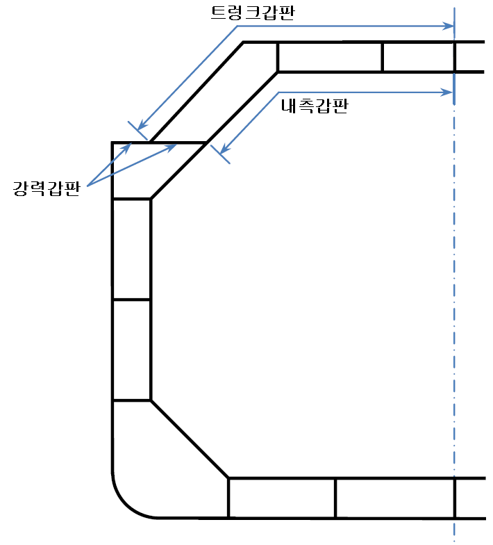

# 제3편 선체구조

> 선급 및 강선규칙/적용지침 / RA-03-K / 2025 / KO / Rules

## 제 1 장 총칙

### 제 1 절 정의

#### 101. 적용 【지침 참조】

이 규칙에 있어서 용어의 정의 및 기호는 별도로 정하는 것 이외에는 이 절의 규정에 따른다.

#### 102. 규칙길이 (2020) 【지침 참조】

규칙길이 ($L$) 라 함은 강도계산용 흘수($d_s$)선상에서 선수재의 전단으로부터 타주가 있는 선박은 타주의 후단까지, 타주가 없는 선박에서는 타두재의 중심까지의 거리 (m) 를 말한다. $L$ 은 강도계산용 흘수선상 최대길이의 96 % 미만이어서는 아니 되며 97 %를 넘을 필요는 없다.

#### 103. 건현용 길이 【지침 참조】

선박의 건현용 길이 ($L _{f}$) 라 함은 용골 상면으로부터 측정한 최소 형깊이의 85 % 위치의 흘수선상에서 선수재의 전단으로부터 선미외판의 후단까지 측정한 거리의 96 % 및 그 흘수선상에 있어서 선수재의 전단으로부터 타두재의 중심선까지 측정한 거리 중 큰 것 (m) 을 말한다. 다만, 구상선수(bulbous bow)와 같이 최소 형깊이의 85 % 위치에 있어서 그 흘수선보다 윗부분의 선수모양이 오목하게 들어간 선박에서는 들어간 곳의 최후단에서 내린 수선과 그 흘수선과의 교점을 선박의 건현용 길이의 전단으로 간주하여 상기의 규정을 적용한다. 타두재가 없는 선박의 경우, 건현용 길이는 용골 상면으로부터 측정한 최소 형깊이의 85 % 위치의 흘수선상에서 선수재의 전단으로부터 선미외판의 후단까지 측정한 거리의 96 %로 한다. 또한, 건현용 길이를 측정하기 위한 흘수선은 110.에 정의된 만재흘수선에 평행한 것으로 한다.

#### 104. 너비 (2020) 【지침 참조】

너비 ($B$) 라 함은 선박 중앙의 강도계산용 흘수($d_s$)에서 수평으로 계측한 형폭 (m) (늑골의 외면으로부터 외면까지의 수평거리)을 말한다.

#### 105. 건현용 너비

선박의 건현용 너비 ($B _{f}$) 라 함은 $L _{f}$ 의 중앙에 있어서 늑골의 외면으로부터 외면까지의 최대 수평거리 (m)를 말한다.

#### 106. 깊이(최소 형깊이) 【지침 참조】

선박의 깊이 ($D$) 라 함은 $L$ 의 중앙에서 용골의 상면으로부터 건현갑판의 보의 선측에 있어서의 상면까지의 수직거리 (m)를 말한다. 수밀격벽이 건현갑판 위의 갑판까지 연장되고 또한 그 격벽이 유효한 것으로서 등록되는 경우에는 그 격벽까지의 수직거리를 말한다.

#### 107. 강도 계산용 깊이 【지침 참조】

선박의 강도 계산용 깊이 ($D_s$)라 함은 용골 상면으로부터 선루갑판을 강력갑판으로 하는 선루가 있는 곳에서는 선루갑판, 선루가 없는 곳에서는 건현갑판의 보의 선측에 있어서의 상면까지의 수직거리를 $L$의 중앙에서 측정한 것 (m)을 말한다. 그 갑판이 $L$의 중앙에 도달하지 않을 때에는 $L$의 중앙에 있어서 강력갑판에 평행으로 그 갑판의 연장선을 가정하여 $L$의 중앙에서 측정한 거리로 한다.

#### 108. 중앙부

선박의 중앙부라 함은 중앙부 0.4 $L$ 사이를 말한다.

#### 109. 선수미부

선수미부라 함은 선수미 양단에서 각각 0.1 $L$ 이내의 부분을 말한다.

#### 110. 만재흘수선

만재흘수선이라 함은 만재흘수선의 표시를 필요로 하는 선박은 계획 하기만재흘수선에 대한 흘수선을 말하고, 만재흘수선의 표시를 하지 아니하는 선박은 계획 최대 흘수선에 대한 흘수선을 말한다.

#### 111. 만재흘수

만재흘수 ($d$)라 함은 만재흘수선의 표시를 필요로 하는 선박은 $L _{f}$ 의 중앙에서, 또 만재흘수선의 표시를 하지 아니하는 선박에서는 $L$ 의 중앙에서 각각 용골의 상면으로부터 만재흘수선까지 측정한 수직거리 (m)를 말한다.

#### 112. 만재배수량

만재배수량 ($\Delta$)이라 함은 하기만재흘수선에 대한 배수량 (외판 등 부가물을 포함한 것을 말한다)을 톤 (ton) 으로 표시한 것을 말한다.

#### 113. 방형계수 (2020)

방형계수 ($C _{b}$)라 함은 강도계산용 흘수 ($d_s$)선에 대한 형배수용적을 $L$×$B$×$d_s$ 로 나눈 계수를 말한다.

#### 114. 건현갑판

- **1.** 건현갑판이라 함은 일반적으로 최상층 전통갑판을 말한다. 다만, 최상층 전통갑판의 노출부에 상설폐쇄장치를 갖지 아니한 개구가 있는 경우에는 그 갑판 바로 아래의 전통갑판을 말한다.
- **2.** 연속되지 아니한 건현갑판(예: 계단식 건현갑판)을 가진 선박의 경우, 건현갑판은 다음에 따라 결정된다.
  - **(1)** 건현갑판상의 리세스가 선측까지 연장되어 있고 그 길이가 1 m를 넘을 경우에는, 노출갑판의 최하부선과 그 선으로부터 그 갑판의 상부에 평행하게 연장한 선을 건현갑판으로 한다.
  - **(2)** 건현갑판상의 리세스가 선측까지 연장되지 않거나 또는 그 길이가 1 m를 넘지 않는 경우에는, 그 갑판의 상부를 건현갑판으로 한다.
  - **(3)** 노출갑판 하부의 건현갑판으로 지정된 갑판에 있는 선측에서 선측까지 연장되지 아니하는 리세스는 노출갑판의 모든 개구가 풍우밀 폐쇄장치를 설치하는 것을 조건으로 무시할 수도 있다.
- **3.** 다층갑판을 가진 선박의 경우, **1**항 또는 **2**항에 정의된 건현갑판을 만족하는 갑판보다 하부의 갑판을 건현갑판으로 할 수 있다. 다만, 이 하층갑판은 적어도 기관구역과 선수미격벽과의 사이에 전후로 연속되고 횡방향으로도 연속되어 있는 상설의 전통갑판이어야 한다.
  - **(1)** 이 하층갑판이 계단형일 경우에는 그 갑판의 최하부선과 그 선으로부터 그 갑판의 상부 부분에 평행하게 연장한 선을 건현갑판으로 본다.
  - **(2)** 하층갑판을 건현갑판으로 할 경우, 화물구역내에서 최소한 그러한 갑판은 선측에서는 적절하게 형성된 스트링거로 이루어져 있어야 하며 상갑판까지 연장되는 각 수밀 격벽에서는 횡방향으로 적절하게 형성된 스트링거로 이루어져 있어야 한다.

#### 115. 격벽갑판

격벽갑판이라 함은 선수미 격벽을 제외한 횡수밀 격벽이 도달하고 유효한 구조로 된 최상층의 갑판을 말한다.

#### 116. 강력갑판

강력갑판이라 함은 선박의 길이의 어느 곳에서나 외판이 이르는 최상층의 갑판을 말한다. 다만, 저선수미루를 제외하고는 길이가 0.15$L$ 이하인 선루가 있는 곳에서는 선루갑판 바로 아래의 갑판을 그 곳의 강력갑판으로 간주한다. 설계상의 형편에 따라서 길이가 0.15$L$ 을 넘는 선루가 있는 곳에서도 선루갑판의 바로 아래의 갑판을 강력갑판으로 간주할 수 있다.

#### 117. 높인갑판

높인갑판(raised deck)이라 함은 저선루 모양의 갑판으로 그 하방에 갑판이 없는 것을 말한다.

#### 118. 선루

선루라 함은 건현갑판상에 설치되고 상부에 갑판을 갖는 구조물로서 선측으로부터 선측까지 이르거나 또는 선측외판으로부터 0.04 $B_f$를 넘지 않는 위치에 그 측판을 갖는 것을 말하며, 저선미루는 선루로 간주한다.

#### 119. 둘러싸인 선루

둘러싸인 선루라 함은 다음 각 호에 만족하는 것을 말한다.

#### 120. 속력

선박의 속력 ($V$)이라 함은 선저가 깨끗한 상태로 평온한 해상에서 만재흘수 상태로 연속최대 출력시에 얻을 수 있는 선박의 계획속력 (kt)을 말한다.

#### 121. 경하배수량 【지침 참조】

경하배수량 ($LW$)이라 함은 화물, 연료유, 윤활유, 탱크내의 평형수 및 청수, 저장물, 승무원 및 그들의 소지품을 제외한 선박의 배수량 *(ton)*을 말한다.

#### 122. 재화중량

재화중량 ($DW$)이라 함은 만재배수량과 경하배수량과의 차 (*ton*)를 말한다.

#### 123. 선수단 및 선미단

선수단이라 함은 **102.**에 의한 선박의 길이 $L$ 을 측정함에 있어 선수쪽의 시작점을 말하며, 선미단이라 함은 $L$ 의 선미쪽의 끝점을 말한다.

#### 124. 횡단면계수비

횡단면계수비 ($f _{D}$ 및 $f _{B}$)는 각각 다음 식에 따른다. 다만, $f_B$ 는 0.85 또는 $0.0015 L+0.5$ 중 작은 값 이상이어야 한다.

#### 125. 순두께(net thickness)

순두께라 함은 부식 추가 및 기타 추가를 포함하지 아니한 두께를 말한다.

#### 126. 강도계산용 흘수, _s1 (2020)

강도계산용 흘수 ($d_s$)는 선박의 부재치수에 대한 강도요건을 만족하며, 만재 적하상태를 대표한다. $d_s$는 지정된 건현에 상응하는 흘수보다 작아서는 아니 된다.

### 제 2 절 일반사항

#### 201. 적용범위 【지침 참조】

- **1.** 이 편의 규정은 별도로 규정한 경우를 제외하고는 항로를 제한하지 아니하는 조건으로 선급등록을 받은 $L$ 이 90 m 이상인 보통 모양의 선박으로서 일반적인 주요 치수비를 갖은 선박의 선체구조의 배치 및 치수에 적용한다.
- **2.** 항로를 제한하는 조건으로 선급의 등록을 받고자 하는 선박의 구조, 의장 및 치수는 그 조건에 따라서 적절히 참작할 수 있다.
- **3.** 만재흘수선의 표시를 하지 아니하는 선박은 규칙 중의 $L _{eqalign{f\#
  }}$ 를 $L$ 로, $B _{f}$ 를 $B$ 로 바꾸어 적용한다.
- **4.** $L$ 이 90 m 이상의 산적화물선 또는 $L$ 이 150 m 이상의 이중선측 유조선의 경우, 13편 산적화물선 및 유조선 공통구조규칙을 따른다. *(2022)*
- **5.** $L$ 이 90 m 이상의 컨테이너선의 경우, 14편 컨테이너선 구조규칙을 따른다. *(2022)*
- **6.** $L$ 이 150 m 이상이고 2021년 1월 1일 이후 건조계약되는 멤브레인 형식 액화천연가스 운반선의 경우, 15편 Structural Rules for Membrane Type Liquefied Natural Gas Carriers을 따른다. *(2022)*

#### 202. 적용범위 이외의 선박 【지침 참조】

#### 201.의 규정에 관계없이 _s1 이 특히 큰 선박이나 특별한 이유로 이 규칙에 따르기 곤란한 선박의 구조, 의장, 배치 및 치수는 우리 선급이 적절하다고 인정하는 바에 따른다.

#### 203. 특수한 모양 및 특별한 화물을 운반하는 선박 【지침 참조】

특수모양의 선박, 특수한 주요치수비의 선박 또는 특별한 화물을 운반하는 선박에 대하여는 필요하면 이 규칙의 원칙에 따라 개별적으로 소요의 구조, 의장, 배치 및 치수를 정하고 이것을 이 규칙에 대신하여 적용한다.

#### 204. 여객선

여객선의 구조, 의장, 배치 및 치수는 **201.** 내지 **203.**의 규정에 따르고 그 설계 요목에 관련하여 특별히 고려하여야 한다.

#### 205. 동등효력

이 규칙에 만족하지 않거나 적용할 수 없는 대체설계 및 신기술의 동등효력에 대해서는 **1편 1장 105.**를 따른다. *(2021)*

#### 206. 직접강도계산 【지침 참조】

- **1.** 우리 선급의 승인을 얻은 경우에는 직접강도 계산에 따라 각 부재의 치수를 정할 수 있다. 이 때 직접강도 계산에 의한 치수가 이 규칙에 의한 치수 이상인 경우에는 그 결과치로서 부재의 치수를 정하여야 한다.
- **2.** **1**항에 규정하는 직접강도 계산에 의할 경우에는 그 계산에 필요한 자료와 그 결과치를 우리 선급에 제출하여야 한다.
- **3.** 선체구조에 대한 직접강도 및 피로강도에 대한 평가는 각각 **부록 3-2 「직접강도평가에 관한 지침」** 및 **부록 3-3 「선체구조의 피로강도평가 지침」**에 따른다. *(2021)*

#### 207. 선박의 복원성

이 규칙은 선박이 어떠한 취역상태에 있어서도 적절한 복원성을 보유할 수 있는 조건하에 정한 것이며 선박의 제조자나 선장은 선박의 제조 및 사용상에 있어서 복원성능 확보를 위하여 특별한 주의와 조치를 취하여야 한다.

#### 208. 기름을 싣는 경우

**1 . 3 편**, **4편** 및 **7편** 중 연료유를 싣는 경우의 구조 및 설비에 관한 규정은 밀폐식 용기시험에 의한 인화점이 $60 {}^{\circ}\mathrm{C}$를 넘는 연료유를 적재하는 경우에 적용한다.

- **2.** 인화점이 $60 {}^{\circ}\mathrm{C}$이하인 연료유를 싣는 경우의 구조 및 설비는 **3편**, **4편** 및 **7편**의 규정을 따라야 한다.
- **3.** 디프탱크에 화물유를 싣는 경우의 구조 및 설비는 **7편 1장** 또는 **7편 10장**의 규정에 따른다.

### 제 3 절 도면 및 자료승인

#### 301. 승인용도면 및 자료

제조중 등록검사를 받는 선박에 있어서는 공사 단계별 다음의 도면 및 자료를 제출하여 우리 선급의 승인을 받아야 한다.

#### 302. 참고용 도면 및 자료

- **1.** 제조중 등록검사를 받는 선박에 있어서는 **301.**의 승인용 도면 및 자료 이외에 다음의 도면 및 자료를 참고용으로 제출하여야 한다.
  - **(1)** 일반배치도
  - **(2)** 사양서
  - **(3)** 선체중앙부의 단면계수 계산서 및 부재치수 강도계산서
  - **(4)** 특수화물을 적재하는 선박에서는 탑재화물의 배치 및 장치도
  - **(5)** 마스트, 데릭붐, 보트대빗 등 강도를 요구하는 장치의 계산서
  - **(6)** 초기 복원성 자료
  - **(7)** 기타 우리 선급이 필요하다고 인정하는 도면 및 서류
- **2.** 선박의 인도 전에는 배수량곡선도, 용적도, 시운전 및 각종 시험성적표 등을 제출하여야 한다.

#### 303. 만재흘수선의 지정을 받는 선박의 제출 도면 및 자료

만재흘수선의 지정을 받고자 할 경우에는 다음의 도면 및 자료를 제출하여야 한다. 다만, 제조중 등록검사를 위하여 이미 제출된 도면은 이중으로 제출할 필요는 없다.

### 제 4 절 재료

#### 401. 재료의 규격 【지침 참조】

선체구조 및 의장에 사용하는 재료는 특별히 규정하는 것을 제외하고는 **2편 1장**에 규정하는 재료를 사용하여야 한다.

#### 402. 규칙에 맞지 않는 재료

이 규칙에 만족하지 아니하는 기타 재료를 사용할 때에는 재질과 치수에 대하여 우리 선급의 승인을 받아야 한다.

#### 403. 고장력 강재 【지침 참조】

- **1.** 선체구조에 고장력 강재를 사용하고자 할 때에는 사용범위, 위치, 재질 및 치수를 명기한 도면을 제출하여 우리 선급의 승인을 받아야 한다.
- **2.** 선체구조에 고장력 강재를 사용하는 경우 강재에 따른 재료계수 $K$ (이하 이 편 및 **7편**에서는 $K$ 라 한다)는 **표 3.1.3**에 따른다.

  | 재료기호 | $K$ |
  | --- | --- |
  | *A*, *B*, *D* 및 *E* | 1.0 |
  | *AH* 32, *DH* 32 및 *EH* 32 | 0.78 |
  | *AH* 36, *DH* 36 및 *EH* 36 | 0.72 |
  | *AH* 40, *DH* 40 및 *EH* 40 | 0.68(1) |
  | (비고) (1) 지침 **부록 3-3 선체구조의 피로강도평가 지침**에 따라서 선체구조의 피로강도 평가가 수행된다면 재료계수 $K$는 0.66을 사용할 수 있다. (2018) |   |

#### 404. 제한항로의 선박 【지침 참조】

항로를 제한하는 것을 조건으로 선급의 등록을 받는 선박의 선체구조 및 의장에 사용하는 재료는 우리 선급이 적절하다고 인정하는 바에 따른다.

#### 405. 강재의 사용구분 【지침 참조】

- **1.** 선체구조부재에 사용하는 강재는 **표 3.1.4** 내지 **표 3.1.10**에 표시하는 사용구분에 따라 **2편 1장**에 규정하는 강재를 사용하여야 한다. 다만, *A* 대신에 *B*, *D* 또는 *E*를, *B*대신에 *D* 또는 *E*를, *D* 대신에 *E*를, 또한 *AH* 32 대신에 *DH* 32 또는 *EH* 32를, *DH* 32 대신에 *EH* 32를, *AH* 36 대신에 *DH* 36 또는 *EH* 36을, *DH* 36 대신에 *EH* 36을, *AH* 40 대신에 *DH* 40 또는 *EH* 40을, *DH* 40 대신에 *EH* 40을 사용할 수 있다.

  | 구조부재 구분 | 강재의 급별 |
  | --- | --- |
  | ○ 2차 (secondary): A1 종통격벽의 강판(1차 강도부재 제외) A2 강력갑판이 아닌 노출갑판(1차 강도부재 및 특급부재 제외) A3 선측외판 | - 중앙부 0.4 $L$ 이내 : I - 중앙부 0.4 $L$ 이외 : *A/AH* |
  | ○ 1차 (primary): B1 선저외판(평판용골 포함) B2 강력갑판(특급부재 제외) B3 강력갑판 상부의 연속 종강도 판부재(해치코밍 제외) B4 강력갑판에 접합되는 종통격벽판 B5 강력갑판에 접합되는 톱 사이드 탱크판 (해치사이드 거더) 및 경사판의 최상부판 | - 중앙부 0.4 $L$ 이내 : II - 중앙부 0.4 $L$ 이외 : *A/AH* |
  | ○ 특수(special): C1 강력갑판의 현측후판(1) C2 강력갑판의 스트링거판(1) C3 이중 선측구조를 구성하는 종통격벽에 접합되는 갑판의 강판은 제외한 종통격벽에 접합되는 갑판의 강판(1) | - 중앙부 0.4 $L$ 이내 : III - 중앙부 0.4 $L$ 이외 : II - 중앙부 0.6 $L$ 이외 : I |
  | C4 컨테이너선 화물창구의 선외측 모서리부의 강판 (유사한 화물창구 형상을 갖는 선박 포함) | - 중앙부 0.4 $L$ 이내 : III - 중앙부 0.4 $L$ 이외 : II - 중앙부 0.6 $L$ 이외 : I - 화물구역 : III급 이상 |
  | C5 화물창구 모서리부의 강판 (산적화물선, 광석운반선, 겸용선 및 이와 유사한 화물창구 형상을 갖는 선박) C5-1 멤브레인 타입 액화가스운반선의 액체 및 가스돔(liquid and gas dome)에 대한 개구 모서리부 트렁크갑판 및 내측갑판의 판부재 | - 중앙부 0.6 $L$ 이내 : III - 기타구역 : II |
  | C6 만곡부외판 (이중저를 가진 $L$ 이 150 m 미만인 선박)(1) | - 중앙부 0.6 $L$ 이내 : II - 중앙부 0.6 $L$ 이외 : I |
  | C7 만곡부외판(그 외 선박)(1) | - 중앙부 0.4 $L$ 이내 : III - 중앙부 0.4 $L$ 이외 : II - 중앙부 0.6 $L$ 이외 : I |
  | C8 길이가 0.15 $L$ 이상인 종방향 해치코밍 (코밍 정판 및 플랜지 포함) C9 종방향 해치코밍의 끝단 브래킷 및 갑판실 연결부분 | - 중앙부 0.4 $L$ 이내 : III - 중앙부 0.4 $L$ 이외 : II - 중앙부 0.6 $L$ 이외 : I - *D/DH* 이상 |
  | (비고) (1) 선박의 중앙부 0.4 $L$ 사이에 Ⅲ급의 강판 사용이 요구되는 경우, 1조의 강판(single strake)의 너비는 “$5L+800$(mm)”이상이어야 하며 1800 mm 를 넘을 필요는 없다. (2) 표 중의 기호는 다음의 재료기호를 말한다. *AH* : *AH* 32, *AH* 36 및 *AH* 40, *DH* : *DH* 32, *DH* 36 및 *DH* 40, *EH* : *EH* 32, *EH* 36 및 *EH* 40 |   |

  | 구조부재 구분 | 강재의 등급 |
  | --- | --- |
  | 종강도에 기여하는 강력갑판 강력갑판 상부의 연속 종강도 판부재 | 중앙부 0.4 $L$ 이내 : *B/AH*급 |
  | 선저와 강력갑판 사이에 내부 종통격벽이 없는 선박의 단일 선측 외판 강판(single side strake) | 화물구역 내 : *B/AH*급 |

  | 구조부재 구분 |   | 강재의 등급 |
  | --- | --- | --- |
  | 종강도에 기여하는 강력갑판 |   | 중앙부 0.4 $L$ 이내 : *B/AH*급 |
  | 강력갑판 상부의 연속 종강도 판부재 | 트렁크갑판 | 중앙부 0.4 $L$ 이내 : II급 |
  | 강력갑판 상부의 연속 종강도 판부재 | 내측갑판 트렁크갑판 및 내측갑판 사이의 종강도 판부재 | 중앙부 0.4 $L$ 이내 : *B/AH*급 |
  | ^(*) **표 3.1.6**은 **그림 3.1.1**의 갑판 배치를 가지는 멤브레인 타입의 액화가스운반선에 적용된다. **표 3.1.6**은 강력갑판 상 “이중갑판(double deck) 배치를 가지는 유사한 선형에 적용할 수 있다. |   |   |

  
  **그림 3.1.1 멤브레인 타입 천연가스운반선의 일반적인 갑판 배치**

  | 구조부재 구분 | 강재의 등급 |
  | --- | --- |
  | 강력갑판의 현측후판(1) | 중앙부 0.4 $L$ 이내 : *E/EH*급 |
  | 강력갑판의 스트링거판(1) | 중앙부 0.4 $L$ 이내 : *E/EH*급 |
  | 만곡부외판(1) | 중앙부 0.4 $L$ 이내 : *D/DH*급 |
  | (비고) (1) 선박의 중앙부 0.4$L$ 사이에 E/EH급의 강판 사용이 요구되는 경우, 1조의 강판(single strake)의 너비는 “$5L+800$(mm)”이상이어야 하며 1800 mm 를 넘을 필요는 없다. |   |

  | 구조부재 구분 | 강재의 등급 |
  | --- | --- |
  | 선측 늑골의 하부 브래킷(1), (2) | *D/DH*급 |
  | 빌지호퍼 경사판 또는 내저판과 외판과의 교차점의 상·하방 0.125 $l$ 위치의 두 점 사이를 전체 또는 일부 포함하는 선체외판(1) | *D/DH*급 |
  | (비고) (1) 여기서 ‘하부 브래킷’이란 빌지호퍼 경사판 또는 내저판과 외판과의 교차점의 상방 0.125 $l$ 위치까지의 선측 늑골의 하부의 웨브 및 하부 브래킷의 웨브를 의미한다. (2) 늑골의 스팬 $l$ 은 지지구조간의 거리로 정의한다. |   |

  | 구조부재 구분 | 강재의 등급 |
  | --- | --- |
  | 대빙구조 영역 안의 외판 | *B/AH*급 |

  | 급별 두께(mm) | I |   | II |   | III |   |
  | --- | --- | --- | --- | --- | --- | --- |
  | 급별 두께(mm) | *MS* | *HT* | *MS* | *HT* | *MS* | *HT* |
  | $t \leq 15$ $15 *A* *A* *AH* *AH* *A* *A* *AH* *AH* *A* *B* *AH* *AH* |   |   |   |   |   |   |
  | \(20 < t \leq 25$ \(25 *A* *A* *AH* *AH* *B* *D* *AH* *DH* *D* *D* *DH* *DH* |   |   |   |   |   |   |
  | \(30 \(35 *B* *B* *AH* *AH* *D* *D* *DH* *DH* *E* *E* *EH* *EH* |   |   |   |   |   |   |
  | \(40 *D* *DH* *E* *EH* *E* *EH* |   |   |   |   |   |   |
  | (비고) 표 중의 기호는 다음의 재료기호를 말한다. *AH* : *AH* 32, *AH* 36 및 *AH* 40, *MS* : 연강재 *DH* : *DH* 32, *DH* 36 및 *DH* 40, *HT* : 고장력 강재 *EH* : *EH* 32, *EH* 36 및 *EH* 40 |   |   |   |   |   |   |

  **2 . 표 3.1.4**에 규정되어 있지 않은 구조부재에 대해서는 일반적으로 *A*, *AH* 32, *AH* 36 및 *AH* 40을 사용할 수 있다. 둥근거널은 우리 선급이 적절하다고 인정하는 바에 따른다.
  강재등급은 건조 판두께 및 재료의 구분과 일치하여야 한다.
- **3.** 타 및 프로펠러 보스를 지지하는 선미재, 러더혼, 타 및 샤프트브래킷의 강판은 II급 이상의 재료를 사용하여야 한다. 다만, 반 스페이드 타(**규칙 4편1장 그림 4.1.1**의 D 및 E형 타)의 하부 지지대 부분 또는 스페이드 타(**규칙 4편1장 그림 4.1.1**의 C형 타)의 상부와 같이 응력집중이 발생하기 쉬운 타와 타판은 III급 이상의 강재를 사용하여야 한다.
- **4.** 선미재에 두께가 50 mm 초과 100 mm이하인 강재를 사용하는 경우, 강재는 E급 또는 EH급을 사용할 수 있다.
- **5.** **강재급별의 명시** 선체 각부에 사용하는 강재의 급은 선체구조 도면에 명시하여야 한다.

#### 406. 강재사용의 특별규정 【지침 참조】

장기간 저온해역을 취항하는 선박 또는 저온화물을 적재하는 선박의 경우 및 우리 선급이 필요하다고 인정하는 경우에는 **405.**의 규정에 관계없이 인성(toughness)이 높은 강재를 요구할 수 있다.

### 제 5 절 용접구조

#### 501. 일반사항 (2021)

- **1.** **배치** 구조부재의 배치는 용접작업이 곤란하게 되지 아니하도록 고려하여야 한다.
- **2.** 구조상세 **【지침 참조】**
  - **(1)** 구조상의 불연속이나 급격한 단면변화를 가능한 한 적게 하고 용접의 이음부는 응력이 집중되는 곳으로부터 적절히 피하여야 한다.
  - **(2)** 부재의 개구부에는 그 귀퉁이를 적절한 둥근 모양이 되도록 하여야 한다.
  - **(3)** 비교적 얇은 강판에 브래킷 등 강성이 풍부하고 단면적이 작은 부재를 용접할 때에는 적어도 그 부재의 끝은 강성이 풍부한 부재 위에 용접되도록 하여야 한다.
  - **(4)** 선체 중앙부의 현측후판(sheer strake)의 상단(upper end)은 평활(平滑)하게 시공하고 불워크 및 각종의 의장품을 직접 용접하여서는 아니된다.
- **3.** **T이음** T이음에 있어서의 필릿용접의 종류 및 치수는 **표 3.1.11**의 규정에 따르고 그 선체구조부위에 대한 적용은 **표 3.1.12**의 규정에 따른다.
- **4.** 슬롯용접 **【지침 참조】**
  - **(1)** 슬롯용접의 슬롯은 적합한 모양의 것으로 하고 슬롯 밑의 모든 주위의 용접이 충분히 용입되도록 하여야 한다.
  - **(2)** 슬롯용접의 각장은 F1, 슬롯의 길이 및 슬롯 끝단 간격은 우리 선급이 적절하다고 인정하는 바에 따른다.
- **5.**
  - **(1)** 높은 인장응력이 작용하는 구역 또는 취약하다고 인정되는 구역에는, 완전용입용접 또는 부분용입용접을 하여야 한다. 완전용입용접의 경우, 이면 용접 전 가우징 등으로 루트면을 제거하여야 한다. 부분용입용접의 경우, 루트면(f)은 3 mm와 t/3사이 값이어야 한다. 홈의 루트까지 용접비드가 관통되도록 만들어진 홈 개선각(α)는 보통 40 °에서 60°이다. 완전/부분용입용접의 용접비드는 홈의 루트를 덮어야 한다. 부분용입용접의 예는 **그림 3.1.2**에 따른다.
    
    **그림 3.1.2 부분용입용접**
  - **(2)** 부분용입용접의 경우 개선 반대쪽에서의 필릿용접의 각장은 F2로 한다.
  - **(3)** 완전/부분용입용접의 최소범위는 특별히 명시하지 않는 한 기준점(즉 구조부재의 교차점, 브래킷 토우부 끝단부 등)으로부터 300 mm이상이어야 한다.
  - **(4)** 완전용입용접이 요구되는 위치
    - **(가)** 굽힘식 호퍼너클구조에서 호퍼/내저판과 늑판의 용접
    - **(나)** 둥근 창구코밍의 모서리부와 갑판의 용접
    - **(다)** 크레인 페데스탈과 관련 브래킷 및 지지구조
    - **(라)** 외판과 러더혼 및 샤프트 브래킷의 용접
    - **(마)** 수직 파형격벽이 하부스툴없이 설치된 경우, 화물창 지역 내에서 하부 호퍼 경사판 및 내저판과 수직 파형격벽의 용접
    - **(바)** 하부스툴의 정판과 수직 파형격벽의 용접
    - **(사)** 강도계산용 흘수 하부에 있는 해수 흡입구, 러더 트렁크, 및 트랜섬을 포함하는 선체외부를 형성하는 두께 12mm 이하의 판과 인접한 판들의 용접
  - **(5)** 부분용입용접이 요구되는 위치

    | 필릿용접의 종류 모재의 두께 $t$ |  |   |   |   |   |   |
    | --- | --- | --- | --- | --- | --- | --- |
    | 필릿용접의 종류 모재의 두께 $t$ | 연속용접 |   | 단속용접 |   |   |   |
    | 필릿용접의 종류 모재의 두께 $t$ | 각장 $f$ |   | 각장 $f$ | 용접길이 $w$ | 피치 $P$ |   |
    | 필릿용접의 종류 모재의 두께 $t$ | F1 | F2 | 각장 $f$ | 용접길이 $w$ | F3 | F4 |
    | 5 이하 | 3 | 3 | 3 | 60 | 150 | 250 |
    | 6 | 4 | 3 | 4 | 75 | 200 | 350 |
    | 7 | 5 | 4 | 5 | 75 | 200 | 350 |
    | 8 | 5 | 4 | 5 | 75 | 200 | 350 |
    | 9 | 6 | 4 | 6 | 75 | 200 | 350 |
    | 10 | 6 | 4 | 6 | 75 | 200 | 350 |
    | 11 | 6 | 4 | 6 | 75 | 200 | 350 |
    | 12 | 7 | 5 | 7 | 75 | 200 | 350 |
    | 13 | 7 | 5 | 7 | 75 | 200 | 350 |
    | 14 | 7 | 5 | 7 | 75 | 200 | 350 |
    | 15 | 8 | 6 | 8 | 75 | 200 | 350 |
    | 16 | 8 | 6 | 8 | 75 | 200 | 350 |
    | 17 | 8 | 6 | 8 | 75 | 200 | 350 |
    | 18 | 9 | 7 | 9 | 75 | 200 | 350 |
    | 19 | 9 | 7 | 9 | 75 | 200 | 350 |
    | 20 | 9 | 7 | 9 | 75 | 200 | 350 |
    | 21 | 9 | 7 | 9 | 75 | 200 | 350 |
    | 22 | 10 | 7 | 10 | 75 | 200 | 350 |
    | 23 | 10 | 7 | 10 | 75 | 200 | 350 |
    | 24 | 10 | 7 | 10 | 75 | 200 | 350 |
    | 25 | 10 | 7 | 10 | 75 | 200 | 350 |
    | 26 이상 40 이하 | 11 | 8 | 11 | 75 | 200 | 350 |
    | (비고) 1. T이음의 필릿 각장 $f$ 는 보, 늑골, 휨보강재 또는 각종 거더판과 갑판, 내저판, 격벽판, 외판 또는 면재와의 용접에서는 웨브의 두께에 따라서 결정하고 기타의 부재에 대하여는 얇은 쪽의 모재의 두께 $t$ 에 따라서 정한다. 2. 겹이음의 각장은 F1으로 하고 얇은 쪽의 모재의 두께에 따라서 정한다. 3. 목 두께는 0.7$f$ 로 한다. 4. F2는 원칙으로 모재의 두께에 대한 최소 각장으로 한다. 5. 단속용접은 지그재그 단속용접으로 하고 그 끝부분의 $w$ 간은 양쪽을 용접한다. 6. 필릿용접의 각장의 부족허용차는 10 %로 한다. |   |   |   |   |   |   |

    | 난 | 구분 | 부재명칭 |   | 적용장소 |   | 종류 |
    | --- | --- | --- | --- | --- | --- | --- |
    | 1 | 타 | 타골재 |   | 타판 |   | F3 |
    | 2 | 타 | 타골재 |   | 타심재가 되는 수직타골재 |   | F1 |
    | 3 | 타 | 타골재 |   | 타골재(앞 난을 제외) |   | F2 |
    | 4 | 단 저 구 조 | 늑판 |   | 외판 | 선수선저 보강부, 선미화물창 및 디프탱크 | F2 |
    | 5 | 단 저 구 조 | 늑판 |   | 외판 | 앞 난 이외의 장소 | F4 |
    | 6 | 단 저 구 조 | 늑판 |   | 늑판의 면재 | 선수선저 보강부 및 주기실 | F2 |
    | 7 | 단 저 구 조 | 늑판 |   | 늑판의 면재 | 앞 난 이외의 장소 | F4 |
    | 8 | 단 저 구 조 | 늑판 |   | 중심선 내용골 관통판 및 내용골 정판 |   | F1 |
    | 9 | 단 저 구 조 | 중심선 내용골 | 관통판 및 단절판 | 평판용골 | 선수선저 보강부 | F2 |
    | 10 | 단 저 구 조 | 중심선 내용골 | 관통판 및 단절판 | 평판용골 | 앞 난 이외의 장소 | F3 |
    | 11 | 단 저 구 조 | 중심선 내용골 | 관통판 및 단절판 | 정판 |   | F3 |
    | 12 | 단 저 구 조 | 중심선 내용골 | 관통판 및 단절판 | 늑판 |   | F2 |
    | 13 | 단 저 구 조 | 측내용골 | 단절판 | 외판 | 선수선저 보강부 | F2 |
    | 14 | 단 저 구 조 | 측내용골 | 단절판 | 외판 | 앞 난 이외의 장소 | F4 |
    | 15 | 단 저 구 조 | 측내용골 | 단절판 | 정판 | 주기실 | F2 |
    | 16 | 단 저 구 조 | 측내용골 | 단절판 | 정판 | 앞 난 이외의 장소 | F4 |
    | 17 | 단 저 구 조 | 측내용골 | 단절판 | 늑판 |   | F3 |
    | 18 | 횡 늑 골 식 이 중 저 구 조 | 실체늑판 |   | 외판 | 선수선저 보강부 | F2 |
    | 19 | 횡 늑 골 식 이 중 저 구 조 | 실체늑판 |   | 외판 | 앞 난 이외의 장소 | F4 |
    | 20 | 횡 늑 골 식 이 중 저 구 조 | 실체늑판 |   | 내저판 | 주기대 및 드러스트 블록을 부착하는 장소 | F2 |
    | 21 | 횡 늑 골 식 이 중 저 구 조 | 실체늑판 |   | 내저판 | 선수선저 보강부 및 주기실(앞 난을 제외) | F2 |
    | 22 | 횡 늑 골 식 이 중 저 구 조 | 실체늑판 |   | 내저판 | 앞 2난 이외의 장소 | F4 |
    | 23 | 횡 늑 골 식 이 중 저 구 조 | 실체늑판 |   | 주기대를 부착하는 내저판 하부의 거더 |   | F1 |
    | 24 | 횡 늑 골 식 이 중 저 구 조 | 실체늑판 |   | 중심선 거더판 | 선수선저 보강부 및 주기실(앞 난을 제외) | F2 |
    | 25 | 횡 늑 골 식 이 중 저 구 조 | 실체늑판 |   | 중심선 거더판 | 앞 난 이외의 장소 | F3 |
    | 26 | 횡 늑 골 식 이 중 저 구 조 | 실체늑판 |   | 마진판(margin plate) |   | F2 |
    | 27 | 횡 늑 골 식 이 중 저 구 조 | 수, 유밀늑판 |   | 주위 |   | F1 |
    | 28 | 횡 늑 골 식 이 중 저 구 조 | 늑판의 휨보강재 |   | 수밀 또는 유밀늑판 |   | F3 |
    | 29 | 횡 늑 골 식 이 중 저 구 조 | 늑판의 휨보강재 |   | 앞 난 이외의 장소 |   | F4 |
    | 30 | 횡 늑 골 식 이 중 저 구 조 | 조립늑판 | 정늑재 | 외판 |   | F4 |
    | 31 | 횡 늑 골 식 이 중 저 구 조 | 조립늑판 | 부늑재 | 내저판 |   | F4 |
    | 32 | 횡 늑 골 식 이 중 저 구 조 | 조립늑판 | 브래킷 | 중심선거더 |   | F3 |
    | 33 | 횡 늑 골 식 이 중 저 구 조 | 조립늑판 | 브래킷 | 마진판(margin plate) |   | F2 |
    | 34 | 횡 늑 골 식 이 중 저 구 조 | 조립늑판 | 휨보강재 | 측거더 |   | F4 |
    | 35 | 횡 늑 골 식 이 중 저 구 조 | 중심선거더 |   | 평판용골 | 수밀 또는 유밀의 장소 | F1 |
    | 36 | 횡 늑 골 식 이 중 저 구 조 | 중심선거더 |   | 평판용골 | 앞 난 이외의 장소 | F3 |
    | 37 | 횡 늑 골 식 이 중 저 구 조 | 중심선거더 |   | 내저판 | 수밀 또는 유밀의 장소 | F1 |
    | 38 | 횡 늑 골 식 이 중 저 구 조 | 중심선거더 |   | 내저판 | 주기대 및 드러스트블록의 거더의 하부 | F2 |
    | 39 | 횡 늑 골 식 이 중 저 구 조 | 중심선거더 |   | 내저판 | 앞 2난 이외의 장소 | F3 |
    | 40 | 횡 늑 골 식 이 중 저 구 조 | 측거더 (단절판) |   | 외판 | 선수선저 보강부 | F2 |
    | 41 | 횡 늑 골 식 이 중 저 구 조 | 측거더 (단절판) |   | 외판 | 앞 난 이외의 장소 | F4 |
    | 42 | 횡 늑 골 식 이 중 저 구 조 | 측거더 (단절판) |   | 내저판 | 주기실 | F2 |
    | 43 | 횡 늑 골 식 이 중 저 구 조 | 측거더 (단절판) |   | 내저판 | 앞 난 이외의 장소 | F4 |
    | 44 | 횡 늑 골 식 이 중 저 구 조 | 측거더 (단절판) |   | 실체늑판 | 선수선저 보강부 및 주기실 | F2 |
    | 45 | 횡 늑 골 식 이 중 저 구 조 | 측거더 (단절판) |   | 실체늑판 | 앞 난 이외의 장소 | F4 |
    | 46 | 횡 늑 골 식 이 중 저 구 조 | 주기대거더 |   | 내저판 |   | F2 |
    | 47 | 횡 늑 골 식 이 중 저 구 조 | 주기대거더 |   | 외판 |   | F2 |
    | 48 | 횡 늑 골 식 이 중 저 구 조 | 마진판(margin plate) |   | 외판 또는 거싯판(gusset plate) |   | F1 |

    | 난 | 구분 | 부재명칭 | 적용장소 |   | 종류 |
    | --- | --- | --- | --- | --- | --- |
    | 49 |   | 선창늑골 브래킷 | 마진판(margin plate) |   | F1 |
    | 50 |   | 선창늑골 브래킷 | 거싯판(gusset plate) |   | F2 |
    | 51 |   | 외판 휨보강재 | 외판과의 고착은 종늑골의 규정을 따른다. |   |   |
    | 52 |   | 반거더 | 외판 또는 실체늑판과의 고착은 측거더의 규정에 따른다. |   |   |
    | 53 | 종 늑 골 식 이 중 저 구 조 | 종늑골 | 선수선저 보강부의 외판 |   | F2 |
    | 54 | 종 늑 골 식 이 중 저 구 조 | 종늑골 | 외판(앞 난을 제외) 또는 내저판 |   | F4 |
    | 55 | 종 늑 골 식 이 중 저 구 조 | 실체늑판 | 외판 및 내저판 | 단부 2늑골 간격사이 | F2 |
    | 56 | 종 늑 골 식 이 중 저 구 조 | 실체늑판 | 외판 및 내저판 | 앞 난 이외의 장소 | F3 |
    | 57 | 종 늑 골 식 이 중 저 구 조 | 실체늑판 | 중심선거더 |   | F2 |
    | 58 | 종 늑 골 식 이 중 저 구 조 | 중심선거더에 부착하는 브래킷 | 중심선거더, 외판 및 내저판 |   | F3 |
    | 59 | 종 늑 골 식 이 중 저 구 조 | 마진판에 부착하는 이중저내의 브래킷 | 마진판(margin plate) |   | F2 |
    | 60 | 종 늑 골 식 이 중 저 구 조 | 마진판에 부착하는 이중저내의 브래킷 | 외판 및 내저판 |   | F3 |
    | 61 | 종 늑 골 식 이 중 저 구 조 | 측거더의 휨보강재 | 측거더 |   | F4 |
    | 62 | 늑 골 | 늑골 | 외판 | 선미피크탱크, 선수단으로부터 0.125$L$ 사이 및 디프탱크 | F3 |
    | 63 | 늑 골 | 늑골 | 외판 | 앞 난 이외의 장소 | F4 |
    | 64 | 조립늑골 | 웨브 | 외판 또는 면재 | 선수단으로부터 0.125$L$ 사이 디프탱크 | F2 |
    | 65 | 조립늑골 | 웨브 | 외판 또는 면재 | 앞 난 이외의 장소 | F3 |
    | 66 | 갑 판 | 스트링거판 | 외판 | 강력갑판 | F1 |
    | 67 | 갑 판 | 스트링거판 | 외판 | 앞 난 이외의 갑판 | F2 |
    | 68 | 갑 판 | 보 | 갑판 | 탱크내 | F3 |
    | 69 | 갑 판 | 보 | 갑판 | 앞 난 이외의 장소 | F4 |
    | 70 | 조립보 | 웨브 | 갑판 또는 면재 | 탱크내 | F2 |
    | 71 | 조립보 | 웨브 | 갑판 또는 면재 | 앞 난 이외의 장소 | F3 |
    | 72 | 필 러 | 필러 | 필러의 상하단의 부재 |   | F1 |
    | 73 | 필 러 | 필러 | 특수모양의 필러의 구성부재 상호 |   | F3 |
    | 74 | 창 구 | 코밍 | 갑판(다음 난을 제외) |   | F2 |
    | 75 | 창 구 | 코밍 | 강력갑판에 있는 귀퉁이 부분의 장소 |   | F1 |
    | 76 | 창 구 | 창구보 | 구성부재 상호 |   | F3 |
    | 77 | 격 벽 | 격벽휨보강재 | 격벽판 | 갑판 거더와 격벽휨보강재를 연결하는 브래킷의 하단부로부터 상방 | F1 |
    | 78 | 격 벽 | 격벽휨보강재 | 격벽판 | 디프탱크의 격벽 | F3 |
    | 79 | 격 벽 | 격벽휨보강재 | 격벽판 | 앞 2난 이외의 격벽 | F4 |
    | 80 | 격 벽 | 격벽판 | 주위 | 수밀 또는 유밀격벽 | F1 |
    | 81 | 격 벽 | 격벽판 | 주위 | 앞 난 이외의 장소 | F3 |
    | 82 | 대 구 조 | 거더 또는 브래킷 | 대판 | 주기대, 드러스트블록대, 주 보일러 및 주 발전기대 | F1 |
    | 83 | 대 구 조 | 거더 또는 브래킷 | 내저판 또는 외판 | 주기대 및 드러스트블록 | F2 |
    | 84 | 대 구 조 | 거더 또는 브래킷 | 거더 | 주기대 및 드러스트블록대 | F1 |

    | 85 | 갑판종거더 및 격벽보강거더 특설보, 특설늑골, 선측스트링거 | 웨브 또는 거더 | 외판, 갑판 또는 격벽 | 탱크내, 선수단으로부터 0.125$L$ 사이의 특설늑골(web frame) 및 선측스트링거 |   | F2 |
    | --- | --- | --- | --- | --- | --- | --- |
    | 86 | 갑판종거더 및 격벽보강거더 특설보, 특설늑골, 선측스트링거 | 웨브 또는 거더 | 외판, 갑판 또는 격벽 | 앞 난 이외의 장소 |   | F3 |
    | 87 | 갑판종거더 및 격벽보강거더 특설보, 특설늑골, 선측스트링거 | 웨브 또는 거더 | 웨브 또는 거더의 양단과 외판, 갑판, 내저판 또는 격벽판 |   |   | F1 |
    | 88 | 갑판종거더 및 격벽보강거더 특설보, 특설늑골, 선측스트링거 | 웨브 또는 거더 | 웨브 또는 웨브의 면재 | 탱크내, 선수단으로부터 0.125$L$ 사이의 특설늑골(web frame) 및 선측스트링거 |   | F2 |
    | 89 | 갑판종거더 및 격벽보강거더 특설보, 특설늑골, 선측스트링거 | 웨브 또는 거더 | 웨브 또는 웨브의 면재 | 앞 난 이외의 장소 | 면재의 단면적이 65 cm^2 를 넘을 때 | F2 |
    | 90 | 갑판종거더 및 격벽보강거더 특설보, 특설늑골, 선측스트링거 | 웨브 또는 거더 | 웨브 또는 웨브의 면재 | 앞 난 이외의 장소 | 면재의 단면적이 65 cm^2 이하일 때 | F3 |
    | 91 | 갑판종거더 및 격벽보강거더 특설보, 특설늑골, 선측스트링거 | 웨브 또는 거더에 설치하는 트리핑 브래킷 | 주위 |   |   | F2 |
    | 92 | 갑판종거더 및 격벽보강거더 특설보, 특설늑골, 선측스트링거 | 웨브 또는 거더의 슬롯 | 늑골, 보 또는 휨보강재의 웨브 |   |   | F2 |
    | 93 | 부재 끝부분의 브래킷 |   | 부재와 그 브래킷의 고착(특별히 규정한 것은 제외) |   |   | F1 |
    | (비고) 1. 종강도에 산입하는 부재를 필릿용접으로 결합할 때에는 그 각장은 **표 3.1.11** 및 이 표의 규정에 따르는 이외에 그 이음의 목두께 면적의 총합계를 그 부재의 최소단면적 미만으로 하여서는 아니된다. 2. 보, 늑골 또는 휨보강재의 끝부분을 갑판, 외판, 내저판 또는 격벽판에 직접 용접할 때의 각장은 그 부재의 웨브 두께의 0.7배 이상으로 한다. 3. 보, 늑골, 휨보강재, 각종 거더와 갑판, 외판, 내저판 및 격벽판 등을 단속용접할 때에는 그림(A)와 같이 그 일부를 연속용접으로 하여야 한다. 다만, 그림(B) 또는 (C)와 같이 브래킷의 반대쪽에 고착부재가 있을 때에는 그 부재의 끝부분에 상당하는 부분 또는 그 부재의 브래킷 끝단에 상당하는 부분을 적절한 길이만큼 연속용접으로 하여야 한다. 이음의 전 길이에 걸쳐 F2 이상의 경연속용접으로 할 때에는 그림(D)와 같이 하여도 좋다. 4. 주기대 등 중요한 대구조에 있어서 정판 또는 내저판이 그 대판을 겸할 때에는 그 필릿의 종류에 대하여는 대구조에 대한 규정에 따른다. 5. 종늑골식 이중저구조에 있어서 규정하는 이외의 장소의 용접에 대하여는 횡늑골식 이중저구조에 대한 규정에 따른다.  |   |   |   |   |   |   |
    - **(가)** 내측 종격벽(내측선각)과 호퍼 경사판의 용접
    - **(나)** 강도계산용 흘수 하부에 있는 해수 흡입구, 러더 트렁크, 및 트랜섬을 포함하는 선체외부를 형성하는 두께 12mm 초과하는 판과 인접한 판들의 용접
    - **(다)** 하부스툴 정판과 파형격벽 하부스툴 측판의 용접
    - **(라)** 내저판과 파형격벽 하부스툴 측판의 용접
    - **(마)** 내저판과 파형격벽 하부스툴 지지늑판의 용접
    - **(바)** 파형격벽의 거싯판(gusset plate)과 쉐더판(shedder plate)의 용접
    - **(사)** 조립식 수직파형 격벽의 경우 파형의 하단으로부터 파형길이의 15%
    - **(아)** 내저판과 하부호퍼판의 용접

### 제 6 절 치수

#### 601. 일반

- **1.** 이 규칙에서 규정하는 중앙부 및 선수미부의 치수라 함은 각각 **108.**및 **109.**에 규정하는 선박의 중앙부 및 선수미부에 적용하는 모든 부재의 치수를 말한다.
- **2.** 선박의 중앙부와 선수미단 전후로부터 0.1 $L$ 곳까지의 사이에서는 중앙부의 치수를 선수미로 감에 따라 점차로 감소시킬 수 있다.

#### 602. 단면계수 【지침 참조】

부재에 대한 규정의 단면계수는 별도로 규정하는 경우를 제외하고 부재의 양측에 각각 0.1$l$ 의 유효폭을 가지는 강판을 포함한 값으로 한다. 다만, 0.1 $l$ 의 너비는 인접하는 부재까지의 거리의 1/2 을 넘어서는 아니 된다. 여기서 $l$ 은 해당 각 장에 규정하는 부재의 길이로 한다.

#### 603. 조립부재

평강, 형강 또는 플랜지한 강판을 용접하여 단면계수로써 규정하는 보(beam), 늑골 또는 휨보강재 등을 구성할 때에는 그 깊이 및 두께는 단면계수에 따라 적절한 것으로 하여야 한다.

#### 604. 브래킷

- **1.** 2차구조부재(보, 늑골, 종통재, 휨보강재 등)의 단부와 갑판, 외판, 격벽 등과의 고착부에는 특별히 규정하는 것을 제외하고는 다음 식에 의한 $t _{b}$ 이상의 두께를 갖는 브래킷을 설치하여야 한다. 다만, 구조 및 배치상 브래킷 고착으로 할 수 없는 경우에는 별도로 고려하여야 한다.
  $t_b = C _{ 1} \sqrt { Z}+ 4.5$(mm)
  $Z$ : 단면계수 (cm^3)로서 다음에 따른다.
  $C_{ 1}$ : 플랜지의 유무에 따른 계수로서 다음에 따른다.
  $C_{ 1}$ = 0.27 : 플랜지가 없을 때
  $C_{ 1}$ = 0.23 : 플랜지가 있을 때
- **2.** 플랜지가 설치되는 경우, 플랜지폭 $w_f$ 는 다음 식에 의한 것 이상이어야 한다. 특히 브래킷 암의 길이가 800 mm 이상인 경우는 트리핑 브래킷 등으로 보강하는 경우를 제외하고는 플랜지가 있는 브래킷 또는 동등한 보강이 되어야 한다.
  $w_f = \frac{Z}{33}+45$(mm)
  $Z$ : **1**항에 따른다.
- **3.** 브래킷 암의 길이는 **그림 3.1.3**와 같이 측정하여 다음 식에 의한 것 이상이어야 한다. 다만, 탱크측 및 호퍼측에 부착하는 브래킷의 암의 길이는 규정에 의한 것의 20 %를 증가시켜야 한다.
  $a+b ge 2.0 l$
  $a 및 b > 0.8 l$
  $l$ : 다음 식에 따른다. 다만, $l$ 은 해당 휨보강재 웨브 깊이의 2배 미만이어서는 아니 된다.
  $l = 180 \sqrt { \frac{Z}{14 + \sqrt { Z}} } - 90$
  *Z* : **1**항에 따른다.
  
  **그림 3.1.3 a 및 b 의 측정방법**

#### 605. _s1 의 수정

거더 웨브 두께 이상의 두께의 브래킷을 설치할 때에는 **9장**, **11장**, **12장**, **14장** 및 **15장**에 규정하는 $l$ 의 값은 다음 각 호에 따라 수정하여도 좋다.

#### 606. 판

서로 다른 두께의 판이 연결될 때, 판의 건조 두께의 차이는 하중전달 방향으로 두꺼운 판 두께의 50 % 를 초과하여서는 아니 된다. 이 요건은 또한 국부 삽입판(이중저 거더, 늑판 및 내저판의 삽입판)에 의한 보강에도 적용한다.

### 제 7 절 공작

#### 701. 공작 일반

- **1.** 모든 공작은 매끄럽게 잘 수행되어져야 하고 양질이 보장되어야 한다.
- **2.** 제조자는 제조기간 중 내업 및 외업을 막론하고 세밀하게 점검하여야 하며 필요한 사항을 기록하여야 한다.
- **3.** 모든 결함은 페인트, 시멘트 또는 기타 합성물로 도장되기 전에 검사원이 만족하도록 보수되어야 한다.
- **4.** 구조물 제작은 **IACS Rec.47** 또는 제작/건조 개시 전에 우리 선급의 인정을 받은 공인제작표준에 따라 이루어져야 한다.
- **5.** 선체건조감시 부기부호 **"SeaTrust (HCM)"**을 부여받기 위해서는, **부록 3-4 「선체건조감시 절차에 관한 지침」**에 따라야 한다. *(2021)*

#### 702. 개구(cut-out), 판의 단부

- **1.** 개구, 창구모서리 등의 자유변(절단면)은 적절히 가공처리 되어야 하며 노치가 없어야 한다. 일반적으로 절단면의 드래그 라인 등은 매끈하게 그라인딩 처리를 하여야 한다.
- **2.** 창구의 모서리는 기계 절단하여야 한다.
- **3.** 늑골 또는 보(beam)가 수밀의 갑판 또는 격벽을 관통하는 때에는 그 갑판 또는 격벽은 구조상 수밀로 하여야 한다.

#### 703. 용접공작

모든 용접은 **2편 2장**에 따라 승인된 용접용 재료를 사용하여 승인된 용접절차에 따라 우리 선급의 기량자격을 보유한 용접사에 의하여 시행되어야 한다. 자동용접기 및 장비를 조작하는 작업자는 충분히 훈련되고 우리 선급에 의해 자격이 증명된 사람이어야 한다.

#### 704. 가열

- **1.** 선상가열 또는 점가열에 의한 곡 가공 또는 곡직은 재료의 특성에 나쁜 영향을 끼치지 않도록 우리 선급이 인정하는 절차에 따라 수행되어야 한다. 표면에서의 가열온도는 해당 강재의 등급에 적용 가능한 최대 허용한계를 초과하지 않도록 조절되어야 한다.
- **2.** 연소된 강재를 사용하여서는 안 된다.

#### 705. 조립 및 정렬

- **1.** 개별 구조부재를 조립하거나 단면을 탑재하는 동안 지나치게 큰 힘을 가하는 것은 피해야 한다. 개별 구조부재에 발생된 주요변형은 다음 조립공정 이전에 수정되어야 한다. 용접완료 후, 곡직과 정렬은 재료의 특성에 심각한 영향을 주지 않는 방법으로 시행되어야 한다. 의심되는 경우, 우리 선급은 절차시험 또는 시공시험을 요구할 수 있다.
- **2.** 구조부재는 **IACS Rec.47 표 7**의 요건에 따라 정렬되거나, 우리 선급이 인정하는 공인제작표준의 요건에 따라 정렬되어야 한다.

#### 706. 지그

용접 및 작업을 위한 지그는 강도상 유해한 영향을 주지 않도록 작업완료 후 적절히 조치(예: 제거, 그라인딩 처리 등)하여야 한다.

### 제 8 절 방식(부식방지) 도장 (2018)

#### 801. 방식도장

- **1.** 선체외판의 일부를 형성하는 모든 해수 평형수 탱크에는 도료 제조자가 정하는 요건에 따라 유효한 방식도장을 하여야 한다.
- **2.** 모든 선박의 해수전용 평형수탱크와 산적화물선의 이중선측공간 및 유조선의 화물유 탱크에 사용되는 보호도장에 대하여는 우리 선급이 별도로 정하는 바에 따른다. **【지침 참조】**
- **3.** 단저구조의 선저 또는 기타 모든 선박의 선저만곡부 및 보일러실의 이중저 내의 선저에는 포틀랜드 시멘트(portland cement) 또는 이와 동등한 도료를 만곡부 상단까지 칠하여 외판과 늑골을 보호하여야 한다. 다만, 주로 유류를 적재하는 곳의 선저에는 예외로 한다. 
