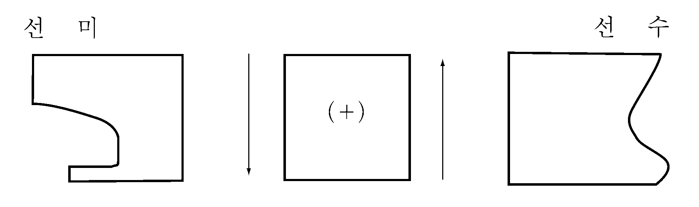
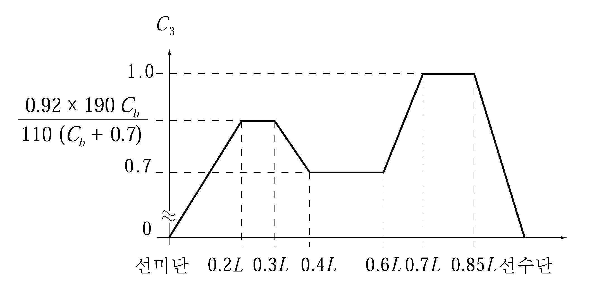
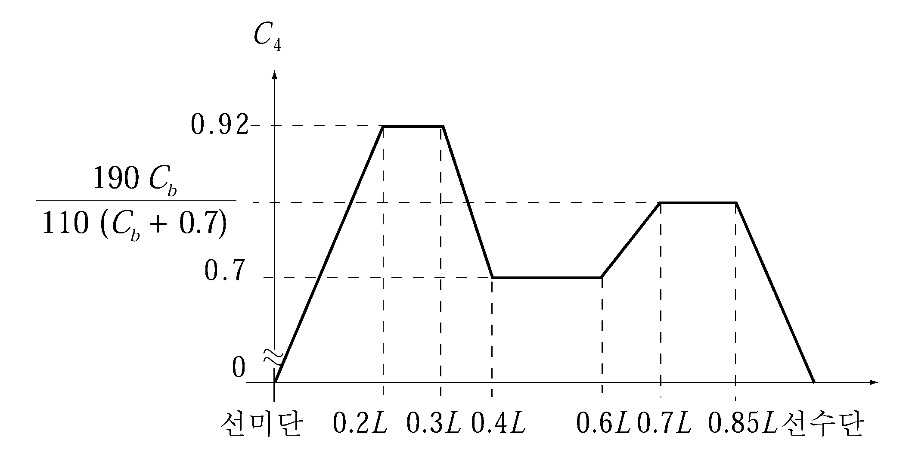

# 제3편 선체구조

> 선급 및 강선규칙/적용지침 / RA-03-K / 2025 / KO / Rules

## 제 3 장 종강도

### 제 1 절 일반사항

#### 101. 적용 【지침 참조】

- **1.** 이 장의 규정은 항로를 제한하지 아니하는 조건으로 선급등록을 받는 $L$ 이 90 m 이상인 보통모양의 선박으로서 일반적인 주요 치수비를 갖는 선박에 적용한다. 다만, 다음 사항 중 하나 이상에 해당하는 선박에 대하여는 우리 선급이 적절하다고 인정하는 바에 따라 특별히 고려되어야 한다.
  - **(1)** 치수비로서 $L/B \leq 5$ 또는 $B/D _{s} \geq 2.5$인 선박
  - **(2)** $L$ 이 500 m 이상인 선박
  - **(3)** 방형계수 $C_b$ 가 0.6 미만인 선박
  - **(4)** 갑판상에 넓은 개구를 갖는 선박
  - **(5)** 속력이 빠른 선박 또는 큰 플레어(flare)를 갖는 선박
  - **(6)** 고온 화물을 운반하는 선박
  - **(7)** 특수한 선형이나 구조를 갖는 선박
- **2.** **1**항의 규정에도 불구하고 **103.** 및 **104.**의 규정은 $L_f$ 가 65 m 이상인 선박에도 적용한다.
- **3.** 컨테이너선의 종강도는 **7편 4장 2절**의 규정을 적용한다.

#### 102. 강도의 연속성

종강도 부재는 강도의 연속성이 양호하도록 배치하여야 한다.

#### 103. 적하지침서 【지침 참조】

- **1.** $L_f$ 가 65 m 이상인 선박은 선박구조에 적합하지 않은 응력의 발생을 피하기 위하여 선장이 화물 및 평형수를 조정할 수 있도록 우리 선급이 승인한 적하지침서를 선박에 비치하여야 한다. 다만, 우리 선급이 필요성이 없다고 인정하는 선박에 대하여는 예외로 한다.
- **2.** **1** 항에 규정하는 적하지침서에는 적어도 다음 사항이 기재되어야 한다.
  - **(1)** 선박설계시 고려한 적하조건과 정수중 종굽힘모멘트 및 정수중 전단력의 허용값
  - **(2)** 표준적하상태에 대한 정수중 종굽힘모멘트 및 정수중 전단력의 계산서
  - **(3)** 표준적하상태 이외의 적하상태에 대한 정수중 전단력 및 종굽힘모멘트의 계산을 위한 자료 및 계산 예. 다만, **104.**의 적하지침기기를 비치한 선박은 생략할 수 있다.
  - **(4)** 우리 선급이 필요하다고 인정하는 경우 창구덮개, 갑판 및 이중저구조 등에 대한 허용 국부하중.

#### 104. 종강도 적하지침기기 【지침 참조】

**1 . 1 03.**에 규정하는 적하지침서에 추가하여 $L_f$ 가 100 m 이상인 다음의 선박에는 모든 화물 및 평형수 적하상태에 대하여 해당 선박에 발생하는 정수중 종굽힘모멘트, 정수중 전단력과 필요한 경우에는 비틀림모멘트 등을 신속하고 쉽게 계산할 수 있는 적하지침기기(종강도 적하지침기기) 및 그 사용설명서를 선내에 비치하여야 한다. 다만, 우리 선급이 필요성이 없다고 인정하는 선박은 예외로 한다.

- **2.** **1**항의 적하지침기기는 우리 선급의 승인을 받은 것이어야 하며, 본선 설치 후 승인된 시험성적서에 따라 우리 선급의 검사원 입회하에 시험을 받아야 한다.

### 제 2 절 굽힘강도

#### 201. 선박의 중앙부의 굽힘강도 【지침 참조】

**1** 선박의 길이방향으로 **203.**에 따라 계산한 선체횡단면의 단면계수는 고려하는 선체횡단면의 위치에서 설계적하상태에 대하여 계산을 하고 그 값은 **표 3.3.1**의 식에 의한 $Z _{1}$ 이상이어야 한다.

- **2.** **1** 항의 규정에 관계없이 선박의 중앙부에 있어서 선체횡단면의 단면계수는 **표 3.3.1**의 식에 의한 $Z _{\min}$ 이상이어야 한다.
- **3.** $L$ 의 중앙에 있어서 선체횡단면의 단면2차모멘트는 **표 3.3.1**의 식에 의한 $I _{\min}$ 이상이어야 하고 선박에 의한 단면2차모멘트의 계산방법은 **203.**에 따른다.
- **4.** **2**항 및 **3**항에 의한 모든 종통부재의 치수는 선박의 중앙부에 있어서 동일하게 유지하여야 한다. 다만, 선박의 종류, 선체형상 및 적하상태를 고려하여 $L$ 의 중앙에서 선박의 중앙부 양단으로 점차 감소시킬 수 있다.

#### 202. 선박중앙부 이외의 굽힘강도 【지침 참조】

- **1.** 선박중앙부 이외의 위치에 있어서 선체굽힘강도는 **5장 2절**의 규정에 적합하여야 한다.
- **2.** 그리고 최소한 다음의 위치에서 선체굽힘강도가 검토되어야 한다.
  - 기관실 전방 횡단면
  - 최전방 화물창 전방 횡단면
  - 선체 횡단면에 심각한 변화가 있는 모든 위치
  - 늑골 시스템에 변화가 있는 모든 위치
  특히 늑골시스템에 변화가 있거나 선체 횡단면에 현저한 변화가 발생하는 영역 내에서, 종강도에 기여하고 압축 및 전단응력을 받는 부재는 **4절**에 따라 좌굴강도가 검토되어야 한다.
- **3.** 선박의 전 길이에 걸쳐 구조 연속성이 유지되어야 한다. 구조배치에 현저한 변화가 발생하는 경우, 적절한 변환구조가 제공되어야 한다.
- **4.** 큰 갑판 개구를 가지는 선박의 경우, 0.25 $L$ 및 0.75 $L$ 위치 또는 근처 단면이 검토되어야 한다. 선루, 갑판실 또는 기관실 후방에 화물창을 가지는 선박의 경우, 최후방 창구의 후단 및 갑판실 또는 기관실 후단 부근의 단면에 대한 강도검토가 수행되어야 한다. *(2020)*

#### 203. 선체 횡단면계수의 계산 【지침 참조】

선체 횡단면계수의 계산은 다음 각 호의 규정에 따른다.

### 제 3 절 전단강도

#### 301. 유효 종격벽이 없는 선박의 선측외판의 두께 【지침 참조】

- **1.** 종격벽이 없는 선박의 선측외판의 두께 $t$ 는 고려하는 선체횡단면의 위치에서 계획시의 모든 적하상태 및 평형수 적재상태 등에 대하여 계산을 하고 그 값은 다음식에 의한 값 이상이어야 한다.
  $t= \frac{0.5|F _{s} +F _{w} (+)|}{\tau} \times \frac{Q}{I} \times 10 ^{2}$(mm)
  $t= \frac{0.5|F _{s} +F _{w} (-)|}{\tau} \times \frac{Q}{I} \times 10 ^{2}$(mm)
  $I$ : 고려하는 선체횡단면의 중립축에 대한 단면2차모멘트 (cm^4)로서, 그 계산방법은 **203.**의 규정을 준용한다.
  $Q$ : 고려하는 선체횡단면에 있어서 각각 중립축보다 상방에서는 고려하는 위치를 지나는 수평선보다 상방의 선체횡단면 부분의 중립축에 대한 단면1차모멘트 (cm^3), 중립축보다 하방에서는 고려하는 위치를 지나는 수평선보다 하방의 선체횡단면 부분의 중립축에 대한 단면1차모멘트 (cm^3)로서 그 계산방법은 **203.**의 규정을 준용한다.
  $\tau$ : 허용전단응력 (N/mm^2)으로서 $110/K$ .
  $F _{s}$ : 고려하는 선체횡단면에 있어서 정수중 전단력 (kN)으로서, 우리 선급이 적절하다고 인정하는 계산방법에 의하여 정한 값. 다만, $F_s$의 값은 하방의 하중을 양$(+)$으로 하고 선미단에서 선수방향으로 적분하여 구한 양$(+)$의 값을 양$(+)$으로 하며 **그림 3.3.4**에 표시하는 방향을 양$(+)$으로 한다.
  
  **그림 3.3.4 전단력의 양(+) 방향**
  $F _{w} (+)$ 및 $F_w (-)$ : 고려하는 선체횡단면에 있어서 파랑전단력 (kN)으로서 다음 식에 의한 값.
  $F _{w} (+)= +0.30C _{1} C _{3} LB (C _{b} +0.7)$(kN)
  $F _{w} (-)= -0.30C _{1} C _{4} LB (C _{b} +0.7)$(kN)
  $C _{1}$ 및 $C _{b}$ : **표 3.3.1**에 따른다.
  $C _{3}$ 및 $C _{4}$ : 고려하는 선체횡단면이 선박의 길이방향에 있어서 위치하는 장소에 따라 정해지는 계수로서 **그림 3.3.5** 및 **그림 3.3.6**에 따른다.
  
  **그림 3.3.5 계수** #eqnID-307**의 값**
  **그림 3.3.5 계수** #eqnID-308**의 값**
- **2.** 빌지호퍼탱크 또는 톱사이드탱크를 갖는 선박, 기타 전단력의 일부를 유효하게 분담한다고 인정되는 부재가 강력갑판하에 있는 선박에 대하여는 우리 선급이 적절하다고 인정하는 바에 따라 **1**항에서 정하는 선측외판의 두께보다 경감할 수 있다.

#### 302. 1열 내지 4열 종격벽을 갖는 선박의 선측외판 및 종격벽판의 두께 【지침 참조】

**그림 3.3.7**에 규정된 형태의 선박의 선측외판 및 종격벽판의 두께 $t$ 는 고려하는 선체횡단면의 위치에서 계획시의 모든 적하상태 및 평형수 적재상태 등에 대하여 계산을 하고 그 값은 다음 식에 의한 값 이상이어야 한다. 다만, 이중선측구조에 빌지호퍼탱크를 갖는 선박에 대하여는 우리 선급이 적절하다고 인정하는 바에 따른다.

#### 303. 개구의 보강

외판에 개구를 설치할 때에는 전단력에 대하여 충분히 고려하고 필요에 따라 보강하여야 한다.

### 제 4 절 좌굴강도

#### 401. 적용 【지침 참조】

이 절의 규정은 선체의 종굽힘에 의한 굽힘응력 또는 전단응력이 작용하는 평판패널과 종늑골의 좌굴강도에 대하여 적용한다.

#### 402. 작용응력

- **1.** 압축응력
  고려하는 부재에 작용하는 압축응력 $\sigma_act$(N/mm^2)은 다음 식에 따른다. 다만, $30/K$ 이상이어야 한다.
  $\sigma _{act} = \frac{(M _{s} +M _{w})}{I} y \times 10 ^{5}$(N/mm^2)
  $M_s$ : **표 3.3.1**에 따른다.
  $M_w$ : **표 3.3.1**의 $M_w (+)$ 또는 $M _{w}(-)$ 의 값으로서 선체횡단면 중립축 상부의 부재에 대하여는 $M_w (-)$ 값, 하부의 부재에 대하여는 $M_w (+)$ 로 한다.
  $y$ : 선체횡단면의 중립축으로부터 고려하는 지점까지의 수직거리 (m).
  $I$ : **301.**의 **1**항에 따른다.
- **2.** 전단응력
  고려하는 부재에 작용하는 전단응력 $\tau_act$ (N/mm^2)는 다음에 따른다.
  - **(1)** 유효 종격벽이 없는 경우
    $\tau_act = \frac{0.5 |F_s + F_w |}{t} \times \frac{Q}{I} \times 10^2$(N/mm^2)
    $F_s$ , $Q$ 및 $I$ : **301.**의 **1**항에 따른다.
    $F_w$ : **301.**의 **1**항에 의한 $F_w (+)$, $F_w (-)$의 절대값 중 큰 것.
    $t$ : 고려하는 판의 실제두께 (mm).
  - **(2)** 1열내지 4열 종격벽이 있는 경우
    $\tau _{act} = \frac{FQ}{tI} \times 10 ^{2}$(N/mm^2)
    $Q$ : **301.**의 **1**항에 따른다.
    $F$ : **302.**에 따른다.
    $t$ 및 $I$ : (1)호에 따른다.

#### 403. 탄성좌굴응력 【지침 참조】

- **1.** 평판패널의 좌굴응력
  - **(1)** 압축
    탄성압축 좌굴응력 $\sigma_E$(N/mm^2) 는 다음 식에 의한다.
    $\sigma_E = 0.9kE \left( { \frac{t_b}{1000b}} \right)^2$(N/mm^2)
    $k$ : 작용응력의 작용방향에 따라 다음 식에 의한다.
    $E$ : 재료의 탄성계수로서 강재의 경우 $2.06 \times 10^5$ (N/mm^2)으로 한다.
    $t _{b}$ : **표 3.3.3**에 의한 공제값을 제외한 판의 두께 (mm).
    $b$ : 패널의 짧은 변의 길이 (m).
    $a$ : 패널의 긴 변의 길이 (m).
    $C$ : 패널 긴 변의 휨보강재에 따른 계수로서 다음에 따른다.
    늑판 또는 거더로 보강된 패널 : 1.30
    휨보강재가 $L$ 또는 $T$ 형강인 경우 : 1.21
    휨보강재가 구평강인 경우 : 1.10
    보강재가 평강인 경우 : 1.05
    $\varphi$ : 작용 압축응력 $\sigma_act$ 가 패널의 변에 따라서 선형변화할 때의 최소값과 최대값의 비($0 \leq \varphi \leq 1$).

    | 구조부재 | 표준공제값 | 최대, 최소 공제값 |
    | --- | --- | --- |
    | - 산적건화물 적재구역 - 한쪽면이 평형수 또는 액체화물에 노출된 면으로서 수평면에 대하여 25° 이상 기울어진 경사면. | 0.05$t$ | $0.5 \sim 1$ mm |
    | - 한쪽면이 평형수 또는 액체화물에 노출된 면으로서 수평면에 대하여 25° 미만 기울어진 경사면. - 양면이 평형수 또는 액체화물에 노출된 면으로서 수평면에 대하여 25° 이상 기울어진 경사면. | 0.10$t$ | $2 \sim 3$mm |
    | - 양면이 평형수 또는 액체화물에 노출된 면으로서 수평면에 대하여 25° 미만 기울어진 경사면. | 0.15$t$ | $2 \sim 4$mm |
  - **(2)** 전단
    탄성전단 좌굴응력 $\tau_E$ (N/mm^2)는 다음 식에 의한다.
    $\tau_E = 0.9k_t E \left( { \frac{t_b}{1000b} \right)^2$(N/mm^2)
    $k_t$ : 패널의 종횡비에 따른 계수로서 다음 식에 따른다.
    $k_t = 5.34 + 4 \left( { \frac{b}{a}} \right)^2$
    $E$, $t_b$, $b$ 및 $a$ : (1)호에 따른다.
- **2.** 종늑골의 탄성좌굴
  종늑골의 탄성좌굴응력은 우리 선급이 적절하다고 인정하는 방법에 따라 계산하여야 한다.

#### 404. 임계좌굴응력

- **1.** 압축
  압축에 의한 임계좌굴응력 $\sigma_c$ 는 다음에 따른다.
  $\sigma_c = \sigma_E$ : $\sigma_E \leq 0.5 \sigma_y$ 일 때
  $\sigma_c = \sigma_y \left( { 1-\frac{\sigma_y}{4 \sigma_E} \right)$ : $\sigma_E \succ 0.5 \sigma_y$ 일 때
  $\sigma_y$ : 재료의 항복응력 (N/mm^2) *으*로서 다음에 따른다.
  235 : **2편 1장**에 규정된 연강의 경우
  315 : **2편 1장**에 규정된 고장력강(*AH* 32, *DH* 32, *EH* 32 및 *FH* 32)의 경우
  355 : **2편 1장**에 규정된 고장력강(*AH* 36, *DH* 36, *EH* 36 및 *FH* 36)의 경우
  390 : **2편 1장**에 규정된 고장력강(*AH* 40, *DH* 40, *EH* 40 및 *FH* 40)의 경우
  $\sigma_E$ : **403.**의 **1**항 (1)호에 의한 탄성좌굴응력 (N/mm^2).
- **2.** 전단
  전단에 의한 임계좌굴응력 $\tau _c$ 는 다음에 따른다.
  $\tau _c = \tau_E : \tau_E \leq 0.5 \tau_y$ : 일 때
  $\tau_c = \tau_y \left( { 1- \frac{\tau_y}{4\tau_E} \right) : \tau_E > 0.5\tau_y$ : 일 때
  $\tau_y$ : 재료의 전단응력 (N/mm^2)으로서 $\sigma_y /\sqrt { 3}$ 로 한다.
  $\tau_E$ : **403.**의 **1**항 (2)호에 의한 탄성좌굴응력(N/mm^2).
  $\sigma_y$ : **1**항에 따른다.

#### 405. 치수 결정 기준

- **1.** **404.**의 **1**항에 따라 계산된 패널 및 종늑골의 압축에 의한 임계좌굴응력 $\sigma_c$ 는 다음 식을 만족하여야 한다.
  $\sigma_c \geq \beta \sigma_act$
  $\beta$ : 안전계수로서 다음에 따른다.
  평판 및 보강재의 웨브인 경우 : $\beta$ = 1.0
  휨보강재인 경우 : $\beta$ = 1.1
  $\sigma_act$ : **402.**에 의한 작용응력.
- **2.** **404.**의 **2**항에 따라 계산된 패널의 전단에 의한 임계좌굴응력 $\tau_c$ 는 다음을 만족하여야 한다.
  $\tau_c \geq \tau_act$
  $\tau_act$ : **402.**에 의한 작용응력. 
