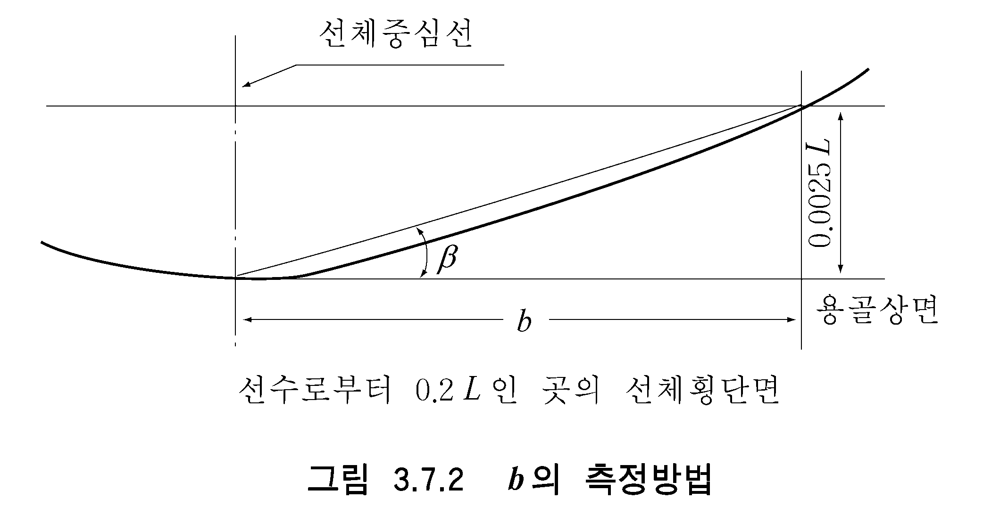

# 제3편 선체구조

> 선급 및 강선규칙/적용지침 / RA-03-K / 2025 / KO / Rules

## 제 7 장 이중저구조

### 제 1 절 일반사항

#### 101. 적용 【지침 참조】

- **1.** 국제항해에 종사하는 여객선 및 국제항해에 종사하는 총톤수 500톤 이상의 화물선(탱커는 제외)에는 선수격벽으로부터 선미격벽까지 수밀구조의 이중저를 설치하여야 한다. 이 이중저는 종식구조로 할 것을 권장한다. *(2018)*
- **2.** **이중저 설치가 필요한 경우,** 내저판은 선저를 만곡부까지 보호할 수 있도록 선측까지 도달하여야 한다. 그리고 용골선과 평행인 면보다 어느 부분에서도 낮지 아니하고 다음의 식에 의하여 계산된 것처럼 용골선으로부터 측정한 수직거리 $h$ 보다 낮지 않아야 한다. *(2018)*
  $h = B ' /20$
  $B '$ : 최대구획만재흘수선 또는 그 하부에서의 최대형폭을 말한다.
  그러나 어떤 경우에도 $h$ 의 값은 760 $\mathrm{mm}$보다 작아서는 아니 되지만 2,000 $\mathrm{mm}$보다 클 필요는 없다.
- **3.** 선박의 구조, 형상 및 용도 등으로 인하여 이중저 구조의 일부 또는 전부를 생략하고자 할 경우에는 우리 선급의 승인을 받아 이중저를 생략할 수 있다. *(2018)*
- **4.** **적절한 크기의 건 탱크를 포함하여 수밀탱크의 경우** 우리 선급의 승인을 받아 이중저를 생략할 수가 있다. *(2018)*
- **5.** 경사형선, 이중선측과 같은 특별한 구조 또는 종통격벽을 설치하는 경우 및 선체중앙부 이외의 이중저의 구조치수는 우리 선급이 적절하다고 인정하는 것에 의한다.
- **6.** 이중저탱크를 디프탱크로 하는 경우의 구조부재의 치수는 이 장의 규정에 따르는 외에 **15장**의 규정에도 만족하여야 한다. 다만, 내저판의 두께에 대하여는 **15장 208.**에서 규정하는 디프탱크 정판에 대한 두께에 1 mm 를 더할 필요는 없다.
- **7.** 이 장의 규정은 화물의 겉보기 비중량 $\gamma$ 가 0.9 이하일 때에 적용한다. 다만, $\gamma$ 가 0.9 를 넘는 경우, 만재상태에서 공창이 되는 화물창 및 빌지호퍼탱크를 갖는 선박의 이중저구조에 대해서는 **7편 3장**의 규정을 준용한다. $\gamma$ 는 다음 식에 의한 것으로 한다.
  $\gamma= \frac{W}{V}$(t/m^3)
  $W$ : 해당 선창에 대한 화물적재질량 (t).
  $V$ : 창구부분을 제외한 해당 화물창의 용적 (m^3).
- **8.** 특히 중량화물을 적재하는 경우 또는 이중저에 작용하는 단위면적당 하중 (kN/m^2)과 $d$ 의 비율이 5.40 미만이거나 하중을 분포하중으로 다룰 수 없는 경우에는 특별히 고려하여야 한다. 또한, 단위면적당 하중이 t/m^2 의 단위인 경우에는 그 값에 9.81을 곱한 것을 단위면적당의 하중 (kN/m^2) 으로 한다.
- **9.** 강재코일(steel coil)을 적재하는 선박의 선체구조는 **부록 3-5 「강재코일을 적재하는 선박의 선체구조」**에 따른다. *(2021)*

#### 102. 맨홀 및 경감구멍

- **1.** 이중저내의 모든 비수밀부재에는 특설 필러가 설치된 곳 또는 규정에 의하여 개구가 제한되는 곳을 제외하고는 맨홀 및 경감구멍을 뚫어 모든 부분의 통행 및 환기에 지장이 없도록 하여야 한다. 모든 구멍의 크기는 일반적으로 그 끝에 보강이 없는 한 그 부분을 이중저 깊이의 50 % 미만으로 하고 승인용 도면에 명시하여야 하며 맨홀의 가장자리는 매끈하게 시공하여야 한다.
- **2.** 내저판에 설치하는 맨홀의 배치에는 가능한 한 주수밀구획이 이중저를 통하여 서로 상통하지 않도록 주의하여야 한다.
- **3.** 내저판에 설치하는 맨홀 덮개는 강재로 하고 내저판에는 볼트 고정을 위한 링판을 설치하여야 하며 내저판상에 내장판이 없을 때에는 화물로 인하여 덮개에 손상이 가지 않도록 적절한 보호를 하여야 한다.

#### 103. 배수

- **1.** 이중저상에는 빌지를 없애기 위하여 적절한 크기의 빌지웰을 설치하여야 한다.
- **2.** 화물창 등의 배수장치와 연결된 이중저에 설치하는 작은 웰은 필요 이상 깊은 것이어서는 아니 된다. 다만, 축로후단에서는 외판까지 도달하는 웰의 설치가 허용된다. *(2018)*
- **3.** 기타의 웰(예: 주기관 밑의 윤활유를 위한 웰)에 대하여는 이 장에 규정하는 이중저와 동등정도의 보호조치가 되어 있다고 우리선급이 인정하는 경우에는 그 설치를 허용 할 수 있다. *(2018)*
- **4.** **2**항 및 **3**항에서 규정하는 웰은 축로후단의 것을 제외하고 용골선으로부터 웰 하부까지의 수직거리는 *h*/2 혹은 500 mm 중 큰 값보다 작아서는 아니된다. 다만 이를 만족하지 못하는 경우에는 **101. 3**항의 요건을 만족하여야 한다.

#### 104. 배수 및 공기구멍

이중저내의 수밀을 요하지 아니하는 부재에는 펌핑용량에 충분한 배수 및 공기구멍을 시공하여 흡입구 및 공기관으로의 유통이 잘 이루어지도록 하여야 한다.

#### 105. 코퍼댐

- **1.** 다음의 액체를 적재하는 탱크들이 서로 인접할 때에는 코퍼댐을 설치하여 분리시켜야 한다. 다만, 연료유 탱크와 윤활유 탱크 사이의 격벽을 완전용입 용접하는 경우에는 코퍼댐의 설치를 면제할 수 있다.
  - **(1)** 연료유
  - **(2)** 윤활유
  - **(3)** 식물성 기름
  - **(4)** 청수
- **2.** **1**항에 의한 코퍼댐에는 **5편 6장 201.**에 따른 공기관 장치를 설치하여야 하며 검사가 용이하도록 적절한 크기의 맨홀을 설치하여야 한다.

#### 106. 측심관의 바닥판

측심관 하부의 바닥판은 두께를 증가시키든가, 기타 승인을 받은 구조에 의하여 측심봉으로 인한 손상을 방지하도록 하여야 한다.

#### 107. 보일러 하부의 보강 【지침 참조】

보일러 하부에는 구조부재의 두께를 적절히 증가시켜야 하나 보일러가 내저판으로부터 멀리 떨어져 있거나 보일러 자체가 인근 구조에 과도한 열을 주지 않는 형식의 것일 경우에는 이를 적절히 참작할 수 있다.

#### 108. 강도의 연속성 및 보강

- **1.** 종식구조에서 횡식구조로 바꿔지는 곳 또는 이중저의 높이가 급격히 변하는 곳에서는 거더 또는 늑판을 설치하는 등 강도의 연속이 유지되도록 특히 주의하여야 한다.
- **2.** 특설필러의 하부 또는 격벽휨보강재의 브래킷의 외단하부는 부분 측거더 또는 늑판을 증설하여 적절히 보강하여야 한다.

#### 109. 최소두께

이중저의 모든 구조부재의 두께는 6 mm 이상이어야 한다.

#### 110. 내장판

- **1.** 이중저구조의 선박은 마진판(margin plate)으로부터 만곡부 상부까지 내장판을 깔아야 한다. 이 내장판은 오수로(limber)의 검사시에 쉽게 떼어낼 수 있도록 하여야 한다.
- **2.** 창구 바로 아래의 내저판에는 내장판을 깔아야 한다. 다만, **501.**의 **3**항 또는 **7편 3장 304.**의 **2**항에 적합한 경우에는 예외로 한다.
- **3.** 내저판의 상면에 깐 내장판의 하부에는 두께가 13 mm 이상인 받침나무를 설치하여야 한다. 탱크정판에 직접 내장판을 깔 경우에는 정판상에 가열한 시멘트 분말을 살포하여 양질의 타르를 칠하거나 또는 이와 동등 이상의 효력을 갖는 피복제를 칠한 뒤에 내장판을 깔아야 한다.
- **4.** 내장판의 두께는 63 mm 이상이어야 한다.

### 제 2 절 중심선거더 및 측거더

#### 201. 구조 및 배치 【지침 참조】

- **1.** 중심선거더는 가능한 한 선수미쪽으로 길게 연장시켜야 하며 중앙부 0.5 $L$ 사이에서는 연속구조로 하여야 한다.
- **2.** 연료유 또는 청수 적재에 사용되는 구획에서는 중심선거더를 수밀구조로 하여야 한다. 선수미의 협소한 탱크 또는 선체중심선에서 약 0.25 $B$ 이내의 위치에 다른 수밀 종거더를 설치하는 경우 또는 우리 선급이 필요하다고 인정하는 경우에는 이를 적절히 수정할 수 있다. *(2020)*
- **3.** 중앙부 0.5 $L$ 사이 및 그 후부에서는 중심선거더와 마진판(margin plate) 사이에 4.6 m 를 넘지 않도록 측거더를 설치하고 가능한 한 선수미쪽으로 길게 연장시켜야 한다.
- **4.** 선수선저 보강부 및 그 전후부에 있어서 측거더 및 반거더 배치는 **802.**의 규정에 따른다.
- **5.** 주기 및 추력베어링 지지대 하부는 측거더 또는 반거더를 증설하여 적절히 보강하여야 한다.

#### 202. 거더의 높이

중심선거더의 높이 $d_0$ 는 특별히 우리 선급의 승인을 얻은 경우를 제외하고 다음 식에 의한 것 이상이어야 한다.

#### 203. 거더의 두께 【지침 참조】

중심선거더 및 측거더의 두께 $t$ 는 다음 2개의 식 중 큰 것 이상이어야 한다.

#### 204. 브래킷 【지침 참조】

- **1.** 종식구조일 때에는 중심선거더에는 늑판 사이에 1.75 m 를 넘지 않는 간격으로 이에 인접하는 선저종늑골에 도달하는 브래킷을 설치하고 거더, 외판 및 선저종늑골에 고착시켜야 한다. 다만, 브래킷의 간격이 1.25 m 를 넘을 때에는 중심선거더는 휨보강재로 보강하여야 한다.
- **2.** 브래킷의 두께 $t$ 는 다음 식에 의한 것 이상이어야 한다. 다만, 그곳의 늑판의 두께를 넘을 필요는 없다.
  $t = 0.6 \sqrt { L} + 1.5$(mm)
- **3.** 휨보강재의 두께는 각각 부착되는 판의 두께와 같게 하고 깊이는 0.08 $d _{0}$ 이상의 평강 또는 이와 동등 이상의 것이어야 한다. 여기서 $d_0$ 는 중심선거더의 높이 (mm)를 말한다.

#### 205. 반거더의 두께

반거더의 두께는 **204.**의 **2**항에 의한 것 이상이어야 한다.

#### 206. 휨보강재

- **1.** 측거더에는 횡식구조의 경우는 각 조립늑판의 위치에, 종식구조의 경우는 적절한 간격으로 수직휨보강재를, 반거더에는 각 조립늑판의 위치에 스트럿을 설치하여야 한다.
- **2.** **1** 항의 수직휨보강재의 두께는 그것이 부착되는 판의 두께와 같게 하고, 깊이는 0.08 $d _{0}$ 이상의 평강 또는 이와 동등 이상의 것이어야 한다. 다만, $d_0$ 는 해당 수직휨보강재가 부착되는 곳의 측거더의 깊이 (m)를 말한다.
- **3.** **1**항의 스트럿의 면적은 **404.**의 규정을 준용하여 정한 것 이상이여야 한다.

### 제 3 절 실체늑판

#### 301. 배치

- **1.** 이중저에는 3.5 m 를 넘지 않는 간격으로 실체늑판을 설치하여야 한다.
- **2.** **1** 항의 규정에 관계없이 다음에 정하는 장소에는 반드시 실체늑판을 설치하여야 한다.
  - **(1)** 주기실내의 매 늑골의 위치. 다만, 종식구조인 경우에는 주기 거더보다 외측에서는 늑골 1개 건너마다의 위치.
  - **(2)** 추력베어링 지지대 및 보일러 지지대 하부에서는 매 늑골의 위치
  - **(3)** 횡격벽의 하부.
  - **(4)** 선수격벽으로부터 선수선저 보강부 후단까지는 **803.**에 규정하는 곳.
  - **(5)** 이중저의 높이가 변화하는 부분에는 매 늑골의 위치.
- **3.** 수밀늑판은 이중저의 구획이 가능한 한 선박의 구획과 일치하도록 배치하여야 한다.

#### 302. 두께 【지침 참조】

실체늑판의 두께 $t$ 는 다음 2개의 식 중 큰 것 이상이어야 한다.

#### 303. 휨보강재

실체늑판은 횡식구조에 있어서는 적절한 간격으로, 종식구조에 있어서는 각 종늑골의 위치마다 각각 휨보강재로 보강하여야 한다. 휨보강재의 두께는 그 곳의 실체늑판의 두께와 같게 하고 깊이는 0.08$d _{0}$ 이상의 평강 또는 이와 동등 이상의 것이어야 한다. 다만, $d_0$ 는 해당 수직 휨보강재가 부착되는 곳의 늑판의 깊이 (mm).

### 제 4 절 종늑골

#### 401. 구조

종늑골은 연속구조로 하든가 또는 그 단부에서 굽힘 및 인장에 대하여 충분히 견딜 수 있도록 브래킷으로 늑판에 고착시켜야 한다.

#### 402. 간격

종늑골의 간격 $S$ 는 다음 식에 의한 것을 표준으로 하여야 하며 1 m 이하로 할 것을 권장한다.

#### 403. 치수 【지침 참조】

- **1.** 선저종늑골의 단면계수 $Z_b$ 는 다음 식에 의한 것 이상이어야 한다.
  $Z_b = \frac{CKS l^2}{24-15.0 f_B K} (d+0.026L')$(cm^3)
  $C$ : 계수로서 **표 3.7.5**에 따른다.
  $L'$ : 선박의 길이. 다만, $L$ 이 230 m 를 넘을 때에는 230 m 로 한다.
  $l$ : 늑판사이의 거리 (m).
  $S$ : 종늑골의 간격 (m).

  | 항목 |   |   | $C$ |
  | --- | --- | --- | --- |
  | 늑판 사이의 중간에 **404**.에 규정하는 스트럿 | 없을 때 |   | 100 |
  | 늑판 사이의 중간에 **404**.에 규정하는 스트럿 | 있을 때 | 화물창이 디프탱크인 경우 | 62.5 |
  | 늑판 사이의 중간에 **404**.에 규정하는 스트럿 | 있을 때 | 상기 이외의 경우 | 50 |
  | (비고) 늑판에 설치하는 형강 및 스트럿의 너비가 특별히 클 때에는 적절히 경감할 수 있다. |   |   |   |
- **2.** 내저종늑골의 단면계수 $Z_i$ 는 다음 식에 의한 것 이상이어야 한다. 다만, 그 곳에 있어 선저종늑골의 규정 단면계수의 75 % 미만이어서는 아니 된다.
  $Z_i = \frac{C K S h l ^2}{24-11.4 f_B K}$(cm^3)
  $C$ : 계수로서 **표 3.7.6**에 따른다.
  $l$ 및 $S$ : **1** 항의 규정에 따른다.
  $h$ : 선체 중심선에 있어서의 내저판 상면으로부터 최하층갑판까지의 수직거리 (m). 다만, 최하층 갑판을 넘어 화물을 적재할 때에는 그 바로위의 갑판까지로 한다.

  | 항목 |   | $C$ |
  | --- | --- | --- |
  | 늑판 사이의 중간에 **404.**에 규정하는 스트럿 | 없을 때 | 90 |
  | 늑판 사이의 중간에 **404.**에 규정하는 스트럿 | 있을 때 | 54 |
  | (비고) 늑판에 설치하는 형강 및 스트럿의 너비가 특별히 클 때에는 적절히 경감할 수 있다. |   |   |

#### 404. 스트럿

- **1.** 스트럿은 평강 또는 구평강(球平鋼) 이외의 형강으로 하고 선저 및 내저종늑골의 웨브와 충분히 겹치도록 하여야 한다. **【지침 참조】**
- **2.** 스트럿의 단면적 $A$ 는 다음 식에 의한 것 이상이어야 한다.
  $A = 1.8 C K S b h$(cm^2)
  $S$ : 늑골간격 (m).
  $b$ : 스트럿으로 지지되는 부분의 너비 (m).
  $h$ : 다음 식에 의한 값 (m). 다만, 어떠한 경우에도 $d$ 미만이어서는 아니 된다.
  $h = \frac{d+0.026L' + h_i}{2}$
  $L'$ : **403.**의 **1**항에 따른다.
  $h_i$ : **403.**의 **2**항에 의한 $h$ 값의 0.9 배. 다만, 디프탱크의 곳에서는 내저판 상면으로부터 탱크 정판상과 넘침관 상단사이의 1/2 이 되는 곳까지의 거리와 내저판 상면으로부터 넘침관상 2.0 m 까지의 거리에 0.7 을 곱한 값 (m) 중 큰 것.
  $C$ : 계수로서 다음 식에 의한 값. 다만, 어떠한 경우에도 1.43 미만이어서는 아니 된다.
  $C= \frac{1}{1-0.5 \frac{l _{s}}{\sqrt {K} k}}$
  $l_s$ : 스트럿의 길이 (m).
  $k$ : 스트럿의 최소 회전반지름으로 다음 식에 의한 값 (cm).
  $k = \sqrt { \frac{I}{A}}$
  $I$ : 스트럿의 최소 단면2차모멘트 (cm^4).
  $A$ : 스트럿의 단면적 (cm^2).

### 제 5 절 내저판, 마진판(margin plate) 및 선저외판

#### 501. 내저판의 두께 【지침 참조】

- **1.** 내저판의 두께는 다음 2개의 식 중 큰 것 이상이어야 한다.
  $t _{1} = \frac{CKB ^{2} d}{d _{0}} +1.5$(mm)
  $t _{2} =C ' S \sqrt {hK} +1.5$(mm)
  $d _{0}$ : 중심선거더의 높이 (mm).
  $S$ : 종식구조일 때에는 내저종늑골의 간격 (m). 횡식구조일 때에는 화물창내 늑골의 간격 (m).
  $h$ : **403.**의 **2**항에 따른다.
  $C$ : 계수로서 **표 3.7.7**에 따른다.
  $C '$ : 계수로서 **표 3.7.8**에 따른다.
- **2.** 특별히 비중량이 작은 화물을 적재할 내저판의 두께는 적절히 참작할 수 있다.
- **3.** 내장판을 깔지 않는 창구 바로 아래의 내저판은 **1**항의 두께 $t_2$ 에 의한 것 또는 **101.**의 **6**항의 규정에 의한 것 중 큰 것에 2 mm 를 더한 것으로 한다. 다만, **4**항의 규정을 적용할 때에는 예외로 한다.
- **4.** 그랩(grab) 또는 기타의 기계적 장치에 의하여 하역하는 선박의 내저판은 **1**항 또는 **101.**의 **6**항에 의한 것 중 큰 것에 2.5 mm 를 더한 것 이상이어야 한다. 다만, 내장판을 설치할 때에는 예외로 한다.
- **5.** 주기실내의 내저판 두께는 **1**항 또는 **101.**의 **6**항에 규정하는 것 중 큰 것에 2 mm 를 더한 것 이상이어야 한다.

#### 502. 마진판(margin plate)의 두께

마진판(margin plate)의 두께는 **501.**에서 규정하는 두께 $t_2$ 에 1.5 mm 를 더한 것 이상이어야 한다. 다만, 그 곳의 내저판의 두께 미만이어서는 아니된다.

#### 503. 마진판(margin plate)의 배치

- **1.** 마진판(margin plate)은 만곡부까지의 선저를 보호할 수 있도록 적절한 높이로 하여야 하며 선수단에서 0.2 $L$ 이 되는 곳과의 사이에서는 마진판(margin plate)을 가능한 한 수평으로 선측까지 연장할 것을 권장한다.
- **2.** 마진판(margin plate)은 적당한 너비를 가지는 것으로 하고 외측 브래킷의 내단으로부터 안쪽으로 충분히 연장시켜야 한다.

#### 504. 브래킷

- **1.** 이중저구조가 종식구조인 경우에는 마진판(margin plate)에는 각 화물창늑골의 위치마다 마진판에 인접하는 선저 및 내저종늑골을 고착시켜야 한다.
- **2.** 브래킷의 두께는 **204.**의 **2**항에 의한 것 이상이어야 하고 그 자유변은 플랜지를 주거나 적절한 방법으로 보강하여야 한다.

#### 505. 선저외판의 두께 【지침 참조】

화물창의 이중저부에 대한 선저외판의 두께는 **4장 304.**의 식과 **501.**의 **1**항의 두께 $t_1$ 중 큰 것 이상이어야 한다. 다만, 두께 $t_1$ 을 계산함에 있어서 $\alpha$ 는 다음 식에 의한 값으로 한다.

### 제 6 절 늑골브래킷

#### 601. 두께 및 치수

- **1.** 화물창늑골과 마진판(margin plate)을 고착하는 브래킷의 두께는 **204.**의 **2**항에 의한 것에 1.5 mm를 더한 것 이상이어야 하고 그 자유변은 플랜지를 주어야 한다.
- **2.** 선박의 모양에 따라 특히 긴 브래킷을 필요로 할 때에는 브래킷의 두께를 증가시키든가 브래킷의 상면에 선박의 전후 방향으로 형강을 설치하는 등 이와 동등한 방법으로 보강하여야 한다.

#### 602. 거싯판(gusset plate)

늑골브래킷과 마진판(margin plate)과는 마진판과 같은 두께의 거싯판(gusset plate)으로 고착시켜야 한다. 다만, 구조상 필요가 없다고 인정되었을 때에는 거싯판(gusset plate)을 생략할 수 있다.

### 제 7 절 조립늑판

#### 701. 배치

횡식구조일 때에 실체늑판을 설치하지 않는 늑골의 위치에는 중심선거더 및 마진판에 설치하는 브래킷과 정늑재 및 부늑재로 구성되는 조립늑판을 설치하여야 한다.

#### 702. 정늑재

정늑재의 단면계수 $Z_b$ 는 다음 식에 의한 것 이상이어야 한다.

#### 703. 부늑재

부늑재의 단면계수 $Z_i$ 는 다음 식에 의한 것 이상이어야 한다.

#### 704. 브래킷

- **1.** 정늑재 및 부늑재는 **204.**의 **2**항에 의한 것 이상의 두께를 갖는 브래킷으로서 중심선거더 및 마진판(margin plate)에 고착시켜야 한다.
- **2.** 브래킷의 너비는 $B$ 의 5 % 이상으로 하고 정늑재 및 부늑재와 충분히 겹치도록 하여야 하며 그 자유변은 플랜지를 주어야 한다.

#### 705. 스트럿

스트럿은 평강 및 구평강 이외의 형강으로 하고 정늑재 및 부늑재와 충분히 겹치도록 하여야 하며 그 단면적은 **404.**의 규정에 따른다.

### 제 8 절 선수선저 보강부의 구조

#### 801. 적용 【지침 참조】

- **1.** 이 절의 규정은 평형수 적재상태의 선수흘수가 0.037 $L '$ 미만인 선박에 적용한다. 다만, $L'$ 는 **403.**의 **1**항에 따른다.
- **2.** 평형수 적재상태의 흘수가 특히 작고 속장비가 큰 선박의 선수선저보강부는 특별히 고려하여야 한다.
- **3.** 평형수 적재상태에서의 선수흘수가 0.037 $L '$ 이상인 선박은 **2절** 내지 **4절**의 규정에 따른다.

#### 802. 범위 【지침 참조】

- **1.** 선수선저 보강부라 함은 **표 3.7.11**에 정하는 위치보다 전방에 있어서 용골상면으로부터 0.05 $d _{F}$ ($d _{F}$ :평형수 적재상태시의 선수흘수) 높이까지의 선저외판 부분을 말한다.

  | $V/ \sqrt {L} (=a)$ | 선수단으로부터의 위치 |
  | --- | --- |
  | $a \leq 1.1$ | $0.15L$ |
  | $1.1 < a \leq 1.25$ $1.25 < a \leq 1.4$ | $0.175L$ $0.2L$ |
  | $1.4 < a \leq 1.5$ $1.5 < a \leq 1.6$ | $0.225L$ $0.25L$ |
  | $1.6 < a \leq 1.7$ $1.7 < a$ | $0.275L$ $0.3L$ |
- **2.** **1**항의 규정에도 불구하고 평형수 적재상태의 선수흘수가 작거나, $C_b$ 가 작은 선박에 대하여는 우리 선급이 적절하다고 인정하는 바에 따라 그 보강부의 범위를 선미 방향으로 연장하여야 한다.

#### 803. 구조

- **1.** 선수격벽과 선수선저 보강부의 후부 0.05 $L$ 인 곳과의 사이에는 측거더를 2.3 m 를 넘지 않는 간격으로 배치하도록 하고 횡식구조일 때에는 선수격벽과 선수선저 보강부의 후부 0.025 $L$ 인 곳과의 사이에서는 측거더 상호간에 반거더 또는 외판 종휨보강재를 설치하여야 한다.
- **2.** 선수격벽과 선수선저 보강부의 후단간에 있어서 횡식구조일 때에는 각 선창늑골의 위치에, 종식구조일 때에는 각 선창늑골 1개 건너마다 실체늑판을 설치하여야 한다.
- **3.** 늑판에는 반거더가 붙는 곳 또는 외판 종휨보강재가 설치되는 곳에서는 늑판에 수직휨보강재를 설치하여 보강하여야 한다. 다만, 외판 종휨보강재의 간격이 특히 작고 늑판이 적절히 보강되어 있을 때에는 늑판에 설치되는 휨보강재는 외판 종휨보강재 1개 건너마다 설치할 수 있다.
- **4.** 평형수 적재상태에서 선수흘수가 0.025 $L '$ 를 넘고 0.037 $L '$ 미만인 선박으로서 선수선저 보강부의 구조 배치가 각 항의 규정에 따르기가 곤란할 때에는 늑판 및 측거더를 적절히 보강하여야 한다.

#### 804. 부재치수

- **1.** 평형수 적재상태의 선수흘수가 0.025 $L '$ 이하인 선박은 선수선저 보강부의 외판 종휨보강재 또는 선저종늑골의 단면계수 *Z*는 다음 식에 의한 것 이상이어야 한다.
  $Z=0.53 K C P a l ^{2}$(cm^3)
  $l$ : 늑판의 간격 (m).
  $a$ : $0.774 l$ (m). 다만, 외판 종휨보강재 또는 선저종늑골의 간격이 0.774 $l$ 이하일 때에는 그 거리로 한다.
  $C$ : 계수로서 $\frac{L}{1.9L- 45d_F}$로 한다. 다만, $C$ 가 1.0 이상일 때에는 1.0 으로 한다.
  $P$ : 슬래밍(slamming) 충격압력으로 다음 식에 의한 값. 다만, 선박의 길이 $L$이 150 m 이상이고, $C _{b}$가 0.7 이상인 선박은 우리 선급이 별도로 정하는 바에 따른다.
  $P = 2.48 \times \frac{LC_1 C_2 C_3 C_4}{\beta}$(kPa)
  $C_1$ : 계수로서 $V/ \sqrt { L}$ 에 따라 **표 3.7.12**에서 정하는 것. 다만, $C_1$ 을 정함에 있어 $V/ \sqrt { L}$ 가 표의 중간에 있을 때에는 보간법에 의한다.
  $C_2$ : 계수로서 $V/ \sqrt { L}$ 에 따라 **표 3.7.13**에서 정하는 것.

  | $\frac{V}{\sqrt} { L}$ | 1.0이하 | 1.1 | 1.2 | 1.3 | 1.4 | 1.5이상 |
  | --- | --- | --- | --- | --- | --- | --- |
  | $C_1$ | 0.12 | 0.18 | 0.23 | 0.26 | 0.28 | 0.29 |

  | $\frac{V}{\sqrt} { L}$ | 0.9 미만 | 0.9이상 1.3미만 | 1.3이상 |
  | --- | --- | --- | --- |
  | $C_2$ | 0.333 |   | $1.5\frac{V}{\sqrt} { L} - 1.35$ |

  $C_3$ : 계수로서 다음 값에 따른다.
  $x$ 가 $x_1$ 이상인 경우 : 1.0
  $x$ 가 $x_1$ 미만인 경우 : $0.5+ {0.5x} over {x_1_$
  $x$ : 선수단으로부터 고려하는 횡단면 위치까지의 길이방향의 거리 (m)
  $x _{1}$ : 다음 값에 따른다.
  $C_b$ 가 0.7 미만인 경우 : $0.1L$(m)
  $C_b$ 가 0.7 이상 0.8 미만인 경우 : $(0.1 - 0.5(C_b -0.7 ))L$(m)
  $C_b$ 가 0.8 이상인 경우 : $0.05L$(m)
  $C_4$ : $1.9-0.9 \left( \frac{d_F}{0.02L}} \right)$로 한다. 다만, $C_4$ 가 1.0 미만일 때는 1.0 으로 한다.
  $d_F$ : 평형수 적재시의 선수흘수 (m)
  $\beta$ : 다음 식에 의한 값. 다만, $C_2 /\beta$ 가 11.43 이상일 때에는 $C_2 /\beta$ 의 값을 11.43 으로 한다.
  $\beta = \frac{0.0025L}{b}$
  $b$ : 선수단으로부터 0.2 $L$ 인 곳의 선체횡단면에서의 선체 중심선으로부터 용골 상면상 높이 0.0025 $L$ 에서의 수평선과 외판과의 교점까지의 거리 (m). (**그림 3.7.2** 참조)
  
  **그림 3.7.2** #eqnID-920**의 측정방법**
- **2.** 평형수 적재상태에서 선수흘수가 0.025 $L'$ 를 넘고 0.037 $L'$ 미만인 선박에 있어서 선수선저 보강부의 외판 종휨보강재 또는 선저종늑골의 단면계수는 **1** 항의 규정 및 **4절**의 규정에 의한 값을 보간법에 따라 정한다.
