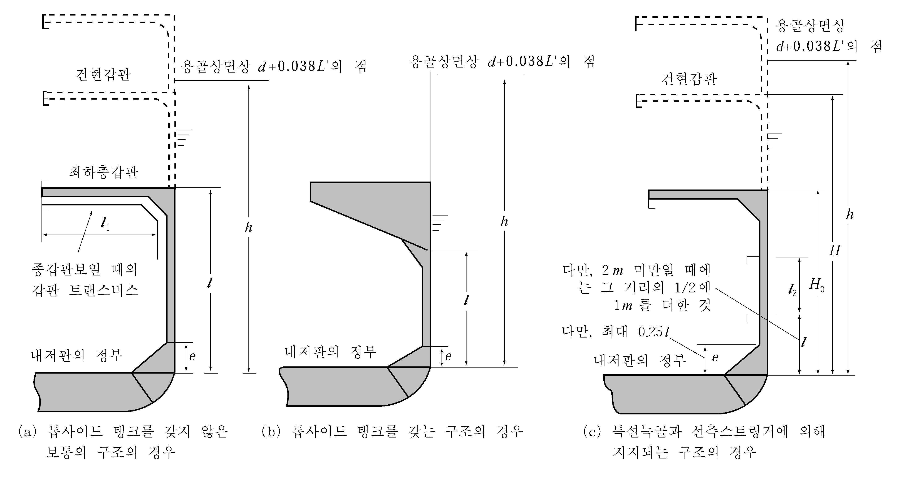

# 제3편 선체구조

> 선급 및 강선규칙/적용지침 / RA-03-K / 2025 / KO / Rules

## 제 8 장 늑골

### 제 1 절 일반사항

#### 101. 적용

이 장의 규정은 격벽에 의한 선체의 횡강도가 **14장**에 규정하는 것 이상의 효력을 갖는 선박에 적용한다. 격벽에 의한 횡강력이 충분하지 않은 경우에는 늑골의 치수를 증가시키든가 특설늑골(web frame)을 증설하는 등의 방법으로 선체의 횡강도를 적절히 증가시켜야 한다.

#### 102. 디프탱크 부분의 늑골

디프탱크를 구성하는 부분의 늑골은 디프탱크 격벽의 휨보강재에 요구되는 강도 이상이어야 한다.

#### 103. 탱크정부의 늑골

늑골은 탱크의 정부를 관통시켜서는 아니 된다. 다만, 유효한 수밀 또는 유밀구조로 하고, 특히 승인을 받은 경우에는 예외로 한다.

#### 104. 치수의 보강

늑골의 치수를 정함에 있어 그 웨브부분에 큰 구멍을 뚫을 경우에는 늑골의 단면계수가 감소되지 아니하도록 그 치수를 적절히 증가시켜야 한다.

#### 105. 특수한 곳의 늑골 【지침 참조】

- **1.** 보일러실에서는 늑골 및 선측스트링거의 치수를 적절히 증가시켜야 한다.
- **2.** 보스부분의 늑골의 구조 및 치수는 우리 선급이 적절하다고 인정하는 바에 따른다.

#### 106. 작은 각도에 의한 부착 【지침 참조】

늑골의 웨브와 외판과의 각도가 특히 작을 경우에는 늑골의 치수를 이 장의 규정에 의한 것보다 적절히 증가시켜야 하며 필요에 따라 트리핑을 방지하도록 적절한 조치를 하여야 한다.

#### 107. 늑골하단부의 구조

늑골하단부의 구조는 응력집중 등에 대하여 충분한 고려를 하여야 한다.

#### 108. 플레어가 특히 큰 곳에서의 늑골 【지침 참조】

큰 선수충격압력을 받는 선수플레어 위치에 설치되는 횡늑골, 선측종늑골 및 종식구조의 선측종늑골을 지지하는 특설늑골(web frame)은 그 끝단 연결부의 유효성에 주의하여 적절히 보강하여야 한다.

#### 109. 직접 강도계산

우리 선급의 승인을 얻은 경우에는 **1장 206.**에서 정하는 직접강도계산에 따라 늑골의 치수를 정할 수 있다.

### 제 2 절 늑골간격

#### 201. 횡늑골

- **1.** 횡늑골의 간격 $S$ 는 다음 식에 의한 것을 표준으로 한다.
  $S = 2L + 450$(mm)
- **2.** 선수미창 및 순양함형 선미의 횡늑골 간격은 610 mm 를 넘어서는 아니 된다.
- **3.** 선수단으로부터 0.2 $L$ 인 곳과 선수격벽과의 사이의 횡늑골 간격은 700 mm 와 **1**항에서 규정하는 표준간격 중에서 작은 것을 넘어서는 아니 된다.
- **4.** 구조 또는 치수에 대하여 적절한 고려가 되어 있는 경우에는 **2**항 및 **3**항의 규정을 적절히 참작할 수 있다.

#### 202. 종늑골

종늑골의 간격 $S$ 는 다음 식에 의한 것을 표준으로 한다.

#### 203. 최대 늑골간격

늑골간격은 1 m 를 넘지 아니하도록 하여야 한다.

#### 204. 표준늑골간격을 넘는 경우의 고려

늑골간격이 **201.** 및 **202.**에서 규정하는 표준간격보다 250 mm 를 넘는 경우에는 단저부재, 이중저부재 기타 관련 부재의 치수 및 구조에 대하여 특별히 고려하여야 한다.

### 제 3 절 선창내 횡늑골

#### 301. 적용

- **1.** 선창내 횡늑골이라 함은 선수격벽으로부터 선미격벽까지 사이의 기관실을 포함한 최하층 갑판하의 늑골을 말한다.
- **2.** 이 규정은 보통 구조의 모양을 갖는 선창내 횡늑골에 적용한다.
- **3.** 선측에 호퍼탱크, 윙탱크 등을 가지는 선박 또는 선측에 이중 선체구조를 가지는 등 특수한 구조를 가지는 선박의 선창내 횡늑골에 대하여는 우리 선급이 적절하다고 인정하는 바에 따른다.
- **4.** **7장 101.**의 **7**항에 규정하는 적하화물창내의 화물의 겉보기 비중량 $\gamma$ 가 0.9 를 넘을 때에는 화물창내 횡늑골의 치수에 대하여 특별히 고려하여야 한다.

#### 302. 횡늑골 치수 【지침 참조】

- **1.** 선창내 횡늑골의 단면계수 $Z$ 는 **표 3.8.1**의 식에 의한 것 이상이어야 한다.
- **2.** 중심선거더의 높이가 $B/16$ 보다 낮을 때에는 늑골의 치수를 적절히 증가시켜야 한다.
- **3.** 늑골상단의 갑판에 특별히 긴 화물창구 또는 횡방향으로 여러 개의 화물창구를 설치할 때에는 늑골의 치수 및 그 상단의 구조에 대하여 특별히 고려를 하여야 한다.

#### 303. 특설늑골(web frame) 및 선측스트링거에 의해 지지되는 횡늑골

- **1.** 선창내 횡늑골이 **9장**에 규정하는 특설늑골(web frame) 및 선측스트링거에 의해 지지되는 늑골의 단면계수 $Z$ 는 다음 식에 의한 것 이상이어야 한다.
  $Z = C_0 C KS h l^2$(cm^3)
  $S$ : 늑골간격 (m).
  $h$ : **302.**의 **1**항에 따른다.
  $l$ : 선측에 있어서 내저판 상면으로부터 최하층 선측스트링거까지의 수직거리 (m)로서 **301.**의 **1**항에 규정하는 $l$ 의 측정위치에서 측정한다. 다만, 이 거리가 2 m 미만일 때에는 그 거리의 1/2에 1 m 를 더한 것으로 한다.(**그림 3.8.1** 및 **3.8.2** (c) 참조)
  $C_0$ : 계수로서 **표 3.8.2**에 따른다.
  $C$ : 다음 식에 의한 값. 다만, 1.0 미만인 경우에는 1.0으로 한다.
  $C = \left\{ { \alpha_1 \left( { 3-\frac{l_2}{l}} \right) }-\alpha_2\frac{e}{l} \right\}C_4$
  $l_2$ : 최하층 선측스트링거로부터 수직상의 선측스트링거 또는 갑판까지의 수직거리 (m).(**그림 3.8.2** (c) 참조)
  $e$ : $l$의 하단으로부터 측정한 늑골하부 브래킷의 높이 (m)로서 0.25 $l$ 을 넘을 때에는 0.25 $l$ (m)로 한다.(**그림 3.8.2** (c) 참조)
  $\alpha_1$ 및 $\alpha_2$ : **표 3.8.3**에 의한 값.
  $C _4$ : 다음 식에 의한 값. 다만, 1.0 이상이어야 하고 2.2 를 넘을 필요는 없다.
  $C_4 = 2 \frac{H}{H_0} - 1.5$
  $H_0$ : 선측에 있어서 내저판 상면으로부터 최하층 갑판하면까지의 수직거리 (m).(**그림 3.8.2** (c) 참조)
  $H$ : 선측에 있어서 $H_0$ 의 하단으로부터 건현갑판 하면까지의 수직거리 (m).(**그림 3.8.2** (c) 참조)
- **2.** **1** 항의 규정에서 늑골의 스팬은 각각 그 인접 스팬과의 차이가 25 % 미만이 되게 하고 스트링거가 2개 이상 설치되었을 경우에는 최대 스팬과 최소 스팬의 차이는 50 % 미만이 되도록 하여야 한다. **【지침 참조】**
- **3.** 늑골 하부브래킷의 높이가 **1**항에 규정하는 $l$ 의 0.05배 미만일 때에는 늑골의 치수 및 하단의 구조에 대하여 특별히 고려하여야 한다.

#### 304. 고착

- **1.** 횡늑골과 늑골 하부브래킷은 늑골 깊이의 1.5배 이상 겹치도록 하고 견고하게 고착시켜야 한다.
- **2.** 늑골의 상단은 보 브래킷에 의하여 갑판 및 보에 유효하게 고착시켜야 하며 늑골정부의 갑판이 종식구조인 경우에는 보 브래킷을 인접 종갑판보까지 연장하여 고착시켜야 한다.

  | 위치 | 단면계수 (cm^3) |   |   |   |   |   |
  | --- | --- | --- | --- | --- | --- | --- |
  | (1) 선수단으로부터 0.15 $L$ 인 곳과 선미격벽 사이 | $Z=KC_0 C S h l^2$ |   |   |   |   |   |
  | (2) 선수단으로부터 0.15 $L$ 인 곳과 선수격벽 사이 | $Z=1.3KC _{0} C S h l ^{2}$ |   |   |   |   |   |
  | (3) 종식구조의 갑판 트랜스버스를 지지하는 곳 | $Z= 2.4K n \left\{ { 0.17+\frac{1}{9.81}\frac{h_1}{h} \left( { \frac{l_2}{l}} \right)^2 }-0.1\frac{l}{h} \right\}S h l ^2$ |   |   |   |   |   |
  | $S$ : 늑골간격 (m). $l$ : 선측에 있어서 내저판 상면으로부터 최하층 갑판까지의 수직거리 (m)로서, 선수단으로부터 0.25$L$ 보다 후방의 늑골은 $L$ 의 중앙에서, 선수단으로부터 0.25$L$ 과 0.15$L$ 사이의 늑골은 선수단으로부터 $L$ 인 곳에서, 선수단으로부터 0.15$L$ 과 선수격벽 사이의 늑골은 선수단으로부터 0.15$L$ 인 곳에서 각각 측정한다. 다만, 경사가 현저한 외판에 부착되는 늑골의 $l$ 은 늑골지점 사이의 거리로 한다. 또한 최하층 갑판이 불연속인 경우, 이중저의 높이가 변화하는 경우 등으로 늑골의 길이가 그 $l$ 의 측정점에 있어서의 것과 현저하게 다를 때에는 최하층 갑판 또는 이중저 상면 등을 상층의 갑판 또는 용골에 각각 평행하게 연장한 선을 최하층 갑판 또는 이중저 상면 등으로 보아 해당 측정점에 있어서 $l$ 을 측정하는 것으로 한다.(**그림 3.8.1** 및 **3.8.2** 참조) $h$ : 각각 $l$ 의 측정점에 있어서 $l$ 의 하단으로부터 용골상면상 $d+0.038L'$ 까지의 수직거리 (m).(**그림 3.8.2** 참조) $L'$ : 선박의 길이 (m). 다만, 230 m 를 넘을 필요는 없다. $C_0$ : 계수로서 다음 식에 의한 값. 다만, 0.85 미만이어서는 아니된다. $C_0 = 1.25-2\frac{e}{l}$ $e$ : $l$ 의 하단으로부터 측정한 늑골하부 브래킷의 높이 (m). $n$ : 갑판 트랜스버스의 간격과 늑골 간격과의 비율. $h_1$ : 늑골정부의 갑판 트랜스버스에 대한 **10장 2절**에 규정하는 갑판하중 (kN/m^2). $l_1$ : 갑판 트랜스버스의 전 길이 (m). $C$ : 계수로서 다음 식에 의한 값. $C=C_1+ C_2$ 화물창구조 ; $l$ ; $n$ 톱사이드 탱크가 없는 보통구조 ; $h_1$ ; $l_1$ 톱사이드 탱크가 있는 구조 ; $C$ ; $C=C_1+ C_2$ 화물창구조 $C_1$ $C_2$ 톱사이드 탱크가 없는 보통구조 $2.1-1.2\frac{l}{h}$ $0.022k \alpha \frac{d}{h}$ 톱사이드 탱크가 있는 구조 $3.4-2.4\frac{l}{h}$ $0.27\alpha{\frac{d}{h}}^ (*1)$ ^(*1) $B/l > 4.0$ 인 경우에는 $C_2$ 의 값을 적절히 증가시켜야 한다. $\alpha$ : 계수로서 다음 표에 정하는 값. 다만, $B/l_H$ 의 값이 표의 중간에 있을 때에는 보간법에 의한다. $l_H$ : 선창의 길이 (m). $0.27\alpha{\frac{d}{h}}^ (*1)$ ; 0.5이하 ; 0.6 ; 0.8 ; 1.0 ; 1.2 ; 1.4이상 $B/l > 4.0$ ; 2.3 ; 1.8 ; 1.0 ; 0.6 ; 0.34 ; 0.2 $B/l_H$ 0.5이하 0.6 0.8 1.0 1.2 1.4이상 $\alpha$ 2.3 1.8 1.0 0.6 0.34 0.2 $k$ : 갑판층수에 따라 정하는 계수로서 다음 표의 값. 갑판층수 ; $l_H$ ; $B/l_H$ 의 값 ^(*2) 1층 갑판선박 2층 갑판선박 3층 갑판선박 ; 13 21 50 ; 2.8 4.2 5.0 갑판층수 $k$ $B/l$ 의 값 ^(*2) 1층 갑판선박 2층 갑판선박 3층 갑판선박 13 21 50 2.8 4.2 5.0 ^(*2) 갑판의 층수에 따라 $B/l$ 의 값이 표의 값을 넘을 때에는 $k$ 의 값을 적절히 증가시켜야 한다. |   |   |   |   |   |   |
  | 화물창구조 | $l$ | $n$ |   |   |   |   |
  | 톱사이드 탱크가 없는 보통구조 | $h_1$ | $l_1$ |   |   |   |   |
  | 톱사이드 탱크가 있는 구조 | $C$ | $C=C_1+ C_2$ |   |   |   |   |
  | $0.27\alpha{\frac{d}{h}}^ (*1)$ | 0.5이하 | 0.6 | 0.8 | 1.0 | 1.2 | 1.4이상 |
  | $B/l > 4.0$ | 2.3 | 1.8 | 1.0 | 0.6 | 0.34 | 0.2 |
  | 갑판층수 | $l_H$ | $B/l_H$ 의 값 ^(*2) |   |   |   |   |
  | 1층 갑판선박 2층 갑판선박 3층 갑판선박 | 13 21 50 | 2.8 4.2 5.0 |   |   |   |   |
  | (비 고) 늑골의 깊이와 늑골정부의 갑판으로부터 늑골하부 브래킷의 선단까지 측정한 늑골길이와의 비율이 상기 (1)에 규정하는 늑골은 1/24, (2)에 규정하는 늑골은 1/22에 미달될 때에는 늑골의 치수를 적절히 증가시켜야 한다. |   |   |   |   |   |   |

  
  **그림 3.8.1 선창내 늑골에 대한** #eqnID-1012 **의 측정위치**
  
  **그림 3.8.2 선창내 늑골에 대한** #eqnID-1013**,** #eqnID-1014 **및** #eqnID-1015 **등의 측정방법**

  | 늑골의 위치 | $C_0$ |
  | --- | --- |
  | 선수단으로부터 0.15$L$ 과 선미격벽 사이 | 2.1 |
  | 선수단으로부터 0.15$L$ 과 선수격벽 사이 | 3.2 |

  | 선측 스트링거의 수 | $\alpha_1$ | $\alpha_2$ |
  | --- | --- | --- |
  | 1개 | 0.75 | 2.0 |
  | 2개 | 0.90 | 1.8 |
  | 3개 이상 | 1.25 | 1.3 |

### 제 4 절 선측 종늑골

#### 401. 치수

- **1.** 선박의 중앙부에서의 건현갑판하 만곡부 종늑골을 포함한 선측종늑골의 단면계수 $Z$ 는 다음 2개의 식 중 큰 것 이상이어야 한다.
  $Z_1 = 100C S h l^2$(cm^3)
  $Z _{2} =2.9K \sqrt {L'} S l ^{2}$(cm^3)
  $S$ : 종늑골의 간격 (m).
  $l$ : 특설늑골(web frame)의 간격 또는 횡격벽과 특설늑골(web frame) 사이의 거리 (m)로서 고착부분의 길이를 포함한다.
  $h$ : 해당 늑골로부터 용골 상면상 $d+ 0.038L'$ 까지의 거리 (m).
  $L'$ : 선박의 길이 (m). 다만, $L$ 이 230 m 를 넘을 때에는 230 m 로 한다.
  $C$ : 계수로서 다음 식에 의한 값.
  $C = \frac{K}{24-\alpha K}$
  $\alpha$ : 계수로서 다음에 의한 $\alpha _1$ 또는 $\alpha _2$ 값. 다만, $\beta$ 이상이어야 한다.
  $\alpha _1 = 15.0 f_D \left( { \frac{y-y_B}{Y '}} \right) y \geq y_B$ 일 때
  $\alpha _2 = 15.0 f_B \left( { \frac{y_B -y}{y_B}} \right) y < y_B$ 일 때
  $\beta$ : $L$ 에 따라 다음에 정하는 계수로서 $L$ 이 중간에 있을 때에는 보간법에 의한다.
  $L$ 이 230 m 이하일 때 : $\beta = 6/a$
  $L$ 이 400 m 이상일 때 : $\beta = 10.5/a$
  $a$ : 선박중앙부의 선체횡단면에 있어서 선측외판의 80 % 이상 범위에 대하여 고장력강을 사용하는 경우에는 $\sqrt { K}$ 로 하며, 기타의 경우에는 1.0 으로 한다.
  $y$ : 용골상면으로부터 해당 종늑골까지의 수직거리 (m).
  $y_B$ : 선박의 중앙부에 있어서 용골상면으로부터 선체횡단면의 중립축까지의 수직거리 (m).
  $Y '$ : **3장 203.**의 (5)호의 (가) 또는 (나)에 의한 값 중 큰 것.
- **2.** 선박의 중앙부의 전후에서는 종늑골의 단면계수를 점차적으로 감소시켜 선수미에서는 **1** 항의 규정에 의한 것에 85 %로 할 수 있다. 다만, 선수단으로부터 0.15 $L$ 과 선수격벽 사이에서는 **1** 항의 식에 의한 것 이상이어야 한다.
- **3.** 종늑골에 사용하는 평강은 그 깊이와 두께의 비율이 15를 넘지 아니하는 것이어야 한다.
- **4.** 선박의 중앙부의 현측후판에 붙이는 종늑골은 그 세장비(細長比)가 가능한 한 60을 넘지 아니하도록 하여야 한다.
- **5.** 선저만곡부의 종늑골의 단면계수는 선저종늑골의 단면계수보다 클 필요는 없다.

#### 402. 고착

- **1.** 종늑골은 횡격벽을 관통시키든가 또는 강도의 연속성을 충분히 유지할 수 있는 브래킷으로서 횡격벽에 견고하게 고착시켜야 한다.
- **2.** 종늑골과 특설늑골(web frame)과는 서로의 웨브가 고착되어야 한다.

### 제 5 절 갑판사이 늑골

#### 501. 일반

갑판사이 늑골의 치수는 선창내 격벽의 상부에도 유효한 갑판사이 격벽이 설치되어 있거나 또는 특설늑골(web frame)이 적절한 간격으로 선루의 정부까지 연장 설치되어 선체에 충분한 횡강도를 유지하도록 한 구조를 기준으로 하여 정한 것이다. 갑판사이 늑골은 화물창늑골과 관련시켜 고려하여야 하며 선저로부터 선체상부에 이르기까지 늑골의 강도에 연속성이 유지되도록 주의하여야 한다.

#### 502. 치수 【지침 참조】

갑판사이 늑골의 단면계수는 **표 3.8.4**의 식에 의한 것 이상이어야 한다.

#### 503. 특별고려 【지침 참조】

- **1.** 선수미부의 갑판사이 늑골은 갑판사이의 높이에만 의하지 아니하고 그 지점사이의 실제 길이에 따라서 강도 및 강성을 증가시키도록 고려하여야 한다.
- **2.** 건현이 특히 큰 선박에 대한 갑판사이 늑골의 치수는 적절히 참작할 수 있다.

#### 504. 선루늑골

- **1.** 선루늑골은 그 아래 늑골의 위치마다 설치하여야 한다.
- **2.** 선교루 및 중앙부 0.5 $L$ 사이에 있는 부분 선루단부의 4늑골 간격 사이에 있는 선루늑골의 단면계수는 **표 3.8.4**에 규정하는 (2)의 식에 있어서 $C$ 를 0.74로 하여 정한 것 이상이어야 한다.
- **3.** 격벽의 상부 및 선루구조에 충분한 횡강성을 주기 위하여 필요하다고 인정되는 곳에 특설늑골(web frame) 또는 부분격벽을 설치하여야 한다.

#### 505. 순양함형 선미늑골

순양함형 선미늑골의 단면계수는 **13장 302.**의 규정에 의한 것의 86 % 이상이어야 한다. 
