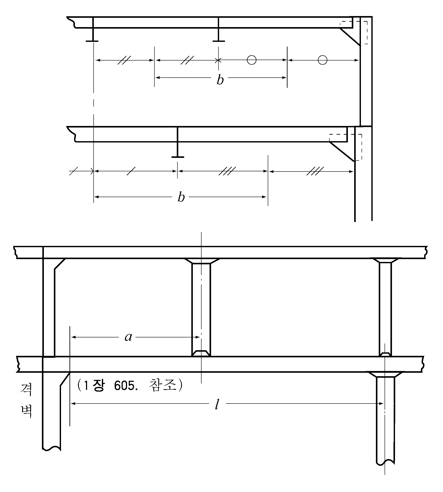

# 제3편 선체구조

> 선급 및 강선규칙/적용지침 / RA-03-K / 2025 / KO / Rules

## 제 11 장 갑판거더

### 제 1 절 일반사항

#### 101. 적용

종갑판보를 지지하는 갑판 트랜스버스 및 횡갑판보를 지지하는 갑판 종거더는 이 장의 규정에 따른다.

#### 102. 배치

격벽리쎄스 및 탱크정부의 위치에는 갑판 거더의 간격이 가능한 한 4.6 m를 넘지 아니하도록 배치하여야 한다.

#### 103. 구조 【지침 참조】

- **1.** 갑판 거더는 면재를 가지는 구조로 하여야 한다.
- **2.** 트리핑 브래킷은 약 3 m 간격으로 설치되어야 하며, 면재의 너비가 거더판의 한쪽 측으로 180 mm 를 넘는 경우에는 면재를 지지하는 구조로 하여야 한다.
- **3.** 거더를 구성하는 면재의 두께는 웨브의 두께 이상으로 하고 그 전 너비 $b$ 는 다음 식에 의한 것 이상이어야 한다.
  $b = 2.7 \sqrt { d_0 l}$(mm)
  $d_0$ : 웨브의 깊이 (mm).
  $l$ : 거더의 지지점 사이의 거리 (m)로서 **201.**의 규정에 따른다.
- **4.** 거더의 깊이는 슬롯 깊이의 2.5배 이상으로 하고 종거더는 격벽에서 격벽까지의 구간을 모두 동일하게 하여야 한다.
- **5.** 거더는 충분한 강성을 가진 것으로서 갑판에 과대한 처짐이나 갑판보에 과대한 부가응력이 미치지 아니하도록 주의하여야 한다.

#### 104. 단부의 고착 【지침 참조】

- **1.** 갑판 거더 단부의 고착은 **1장 604.**의 규정에 따른다.
- **2.** 갑판 거더를 고착하는 격벽휨보강재 또는 보강거더는 그 갑판 거더를 충분히 지지할 수 있어야 한다.
- **3.** 갑판 종거더는 연속구조로 하든가 또는 그 단부에서 유효하게 연속성이 유지될 수 있도록 하여야 한다.

### 제 2 절 갑판 종거더

#### 201. 단면계수

- **1.** 강력갑판의 갑판구 측선 밖의 중앙부에 설치하는 갑판 종거더의 단면계수 $Z$ 는 다음 식에 의한 것 이상이어야 한다.
  $Z = 1.29K l(bhl+kW)$(cm^3)
  $l$ : 거더의 지지점 사이의 거리 (m). 다만, 갑판 종거더를 유효한 브래킷으로 격벽에 고착시키는 경우에는 **1장 605.**의 규정에 따라 수정할 수 있다.(**그림 3.11.1** 참조)
  $b$ : 해당 거더로부터 좌우의 거더 또는 늑골의 내면에 이르는 각 구간의 중심사이 거리 (m). (**그림 3.11.1** 참조)
  $h$ : 갑판에 따라 **10장 2절**의 규정에 정하는 갑판하중 (kN/m^2).
  $W$ : 갑판 사이의 필러가 지지하는 갑판하중 (kN)으로 **12장 201.**의 규정에 따른다.
  $k$ : 다음 (가) 및 (나)에 따른다.
  $12\frac{a}{l} \left( { 1-\frac{a}{l}} \right)^2$
  
  **그림 3.11.1** #eqnID-1369**,** #eqnID-1370 **및** #eqnID-1371 **의 측정방법**
- **2.** 강력갑판의 갑판구측선 밖으로 선박의 중앙부 부분 전후에 설치하는 갑판 종거더의 단면계수 $Z$ 는 **1** 항에서 규정하는 식의 값을 점차 감소하여도 좋다. 다만, 다음 식에 의한 것 이상이어야 한다.
  $Z = 0.484 K l (b h l + kW)$(cm^3)
  $b$, $h$, $l$, $W$ 및 $k$ : **1** 항의 규정에 따른다.
- **3.** 각 항 이외의 위치에 설치하는 갑판 종거더의 단면계수는 **2**항의 식에 의한 것 이상이어야 한다.
- **4.** 분포하중으로 다룰 수 없는 화물을 적재하는 갑판의 경우, 필러에 의해 지지되는 갑판하중은 각각의 화물에 의한 하중 작용형태를 고려하여 결정하여야 한다. 화물하중이 특정 지점에 집중하중으로 작용하는 경우, 그 집중하중을 상부갑판사이의 필러가 지지하는 갑판하중($W$)으로 간주하여 **1**항 내지 **3**항의 규정을 적용할 수 있다.

#### 202. 단면 2차모멘트

거더의 단면2차모멘트 $I$ 는 다음 식에 의한 것을 표준으로 한다.

#### 203. 웨브 두께

- **1.** 강력갑판의 갑판구 측선밖의 중앙부에 설치하는 종거더의 웨브 두께 $t$ 는 다음 식에 의한 것 이상이어야 한다. 다만, **2**항에 의한 것 이상이어야 한다.
  $t=10 S _{1} \sqrt {f _{D} } +1.5$(mm)
  $S_1$ : 거더의 휨보강재 간격 또는 거더의 깊이 중 작은 것 (m).
- **2.** **1**항 이외 부분의 종거더 및 갑판 트랜스버스의 웨브 두께 $t$ 는 다음 식에 의한 것 이상이어야 한다.
  $t = 10 \frac{S_1}{\sqrt { K}} + 1.5$(mm)
  $S_1$ : **1**항에 따른다.
- **3.** 갑판 종거더 및 트랜스버스의 지지점으로부터 0.2 $l$ 사이의 웨브두께 $t$ 는 **1**항에 의한 것과 강재의 종류에 따라 다음 각 호에 의한 것 중 큰 것 이상이어야 한다.
  - **(1)** 연강을 사용하는 경우
    $t= \frac{4.43Kbh l}{d _{0}} +1.5$(mm)
    $d_0$ : 웨브의 깊이 (mm).
    $b$, $h$ 및 $l$ : **201.**의 **1**항에 따른다.
  - **(2)** 고장력강재를 사용하는 경우, 다만, (1)호에 의한 것 이상이어야 한다.
    $t=8.13 root {3} of {\frac{b h l S_1^2}{d_0}} +1.5$(mm)
    $S _{1}$ : **1**항에 따른다.
    $d_0$, $b$, $h$ 및 : (1)호에 따른다.
- **4.** 디프탱크내에 설치하는 거더웨브의 두께는 각 항의 식에 1 mm 를 더한 것 이상이어야 한다.

### 제 3 절 갑판 트랜스버스

#### 301. 단면계수

- **1.** 갑판 트랜스버스의 단면계수 $Z$ 는 다음 식에 의한 것 이상이어야 한다.
  $Z =0.484K l(b h l+kW)$(cm^3)
  $l$ : 필러의 중심사이 또는 필러의 중심으로부터 보 브래킷의 내단까지의 거리 (m).
  $b$ : 해당 트랜스버스로부터 전후의 트랜스버스 또는 격벽에 이르는 각 구간의 중심사이 거리 (m).
  $h$ : **201.**의 규정에 따른다.
  $W$ 및 $k$ : **201.**의 규정에 따른다.
- **2.** 분포하중으로 다룰 수 없는 화물을 적재하는 갑판의 경우, 필러에 의해 지지되는 갑판하중은 각각의 화물에 의한 하중 작용형태를 고려하여 결정하여야 한다. 화물하중이 특정 지점에 집중하중으로 작용하는 경우, 그 집중하중을 상부갑판사이의 필러가 지지하는 갑판하중($W$)으로 간주하여 **1**항의 규정을 적용할 수 있다.

#### 302. 단면2차모멘트

거더의 단면2차모멘트 $I$ 는 다음 식에 의한 것을 표준으로 한다.

#### 303. 웨브 두께

거더의 웨브의 두께는 **203.**의 규정을 준용한다.

### 제 4 절 탱크내의 갑판거더

#### 401. 단면계수

탱크내의 갑판거더의 단면계수는 **201.**, **301.**및 **15장 204.**의 **1**항에 적합하여야 한다.

#### 402. 단면2차모멘트

거더의 단면2차모멘트는 **15장 204.**의 **2**항을 준용한다.

#### 403. 웨브 두께

거더 웨브의 두께는 **203.**, **303.** 및 **15장 204.**의 **3**항에 적합하여야 한다.

### 제 5 절 창구측부의 갑판거더

#### 501. 갑판상 창구코밍이 높은 곳

노출갑판의 창구와 같이 코밍의 갑판상 높이가 높은 경우에는 우리 선급의 승인을 받아 코밍의 수평휨보강재 이하의 부분 또는 수평휨보강재를 거더의 단면계수에 산입할 수 있다.

#### 502. 창구 귀퉁이 부분의 강도의 연속

창구의 귀퉁이부에는 창구측 갑판 종거더 또는 그 연장부의 면재 및 창구단 보의 창구의 안팎 양쪽 부분의 면재를 유효하게 결합하고 강도의 연속성이 유지될 수 있는 구조로 하여야 한다.

### 제 6 절 창구단 횡거더

#### 601. 치수

창구단 횡거더는 **2절** 내지 **5절**의 규정을 준용한다.
