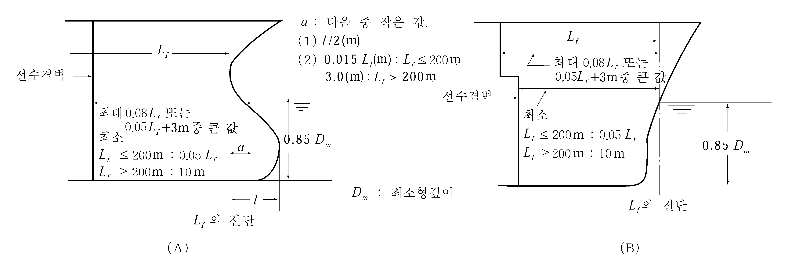

# 제3편 선체구조

> 선급 및 강선규칙/적용지침 / RA-03-K / 2025 / KO / Rules

## 제 14 장 수밀격벽

### 제 1 절 일반사항

#### 101. 적용

모든 선박에는 이 장에서 규정하는 강도를 갖는 수밀격벽을 설치하여야 한다. 특수선형의 선박에 있어서 수밀격벽의 배치가 이 장의 규정에 따르기 어려울 때에는 특별히 우리 선급의 승인을 받아야 한다.

#### 102. 부호

이 장에서 규정하는 구조로 된 수밀격벽은 부호 $WT$ 를 선명록에 부기하고 수밀격벽의 수를 그 앞에 기록한다.

### 제 2 절 수밀격벽의 배치

#### 201. 선수격벽 【지침 참조】

- **1.** 모든 선박은 구조상 특별한 이유에 의하여 우리 선급의 승인을 받은 경우를 제외하고, 근해구역을 항해구역으로 하는 총톤수 500톤 미만의 선박, 연해구역 이내를 항해구역으로 하는 선박 및 어선에 있어서는 건현용 길이 ($L_f$)의 전단으로부터 0.05 $L_f$ 와 0.13 $L_f$ 와의 사이에, 그 외의 선박에 있어서는 건현용 길이의 전단으로부터 0.05 $L_f$ 또는 10 m 중 작은 값과 0.08 $L_f$ 또는 0.05 $L_f$ + 3 m 중 큰 값 사이에 선수격벽을 설치하여야 한다. 다만, 구상선수와 같이 최소 형깊이의 85 %의 위치에 있어서 흘수선 아래의 선체의 일부가 건현용 길이의 전단보다 전방에 연장되어 있는 경우에는 위의 거리는 다음 각 호 중 작은 쪽에 해당하는 위치로부터 측정하여야 한다.(**그림 3.14.1** 참조)
  - **(1)** 해당연장부 ($l$)의 중심점.
  - **(2)** 건현용 길이의 전단에서 측정한 거리($a$)로서 $L_f$ 가 200 m 이하인 선박은 0.015$L _{f}$(m), $L_f$ 가 200 m 이상인 선박은 3 m 인 곳.
- **2.** 선수격벽에 계단부 또는 리쎄스를 설치하는 경우에는 **그림 3.14.1** (B)와 같이 측정할 수 있다.
- **3.** 선수문을 설치하는 선박의 선수격벽의 배치는 우리 선급이 적절하다고 인정하는 바에 따른다. 다만, 경사램프가 건현갑판 상방의 선수격벽의 일부를 형성할 경우에는 건현갑판 상방 2.3 m 를 넘는 램프의 부분은 **1**항에 규정하는 범위를 넘어서 전방에 연장하여도 된다. 이때 램프는 전 길이를 풍우밀로 하여야 한다.
  
  **그림 3.14.1 선수격벽의 위치측정방법**

#### 202. 선미격벽

- **1.** 모든 선박은 적절한 위치에 선미격벽을 설치하여야 한다.
- **2.** 선미관은 선미격벽 또는 기타 적절한 구조에 의하여 수밀구획 내에 설치하여야 한다.

#### 203. 기관실 격벽

- **1.** 기관실의 전후단에는 수밀격벽을 설치하여야 한다.
- **2.** 선미에 기관실이 배치된 선박의 경우에는 **1**항의 격벽 중 기관실 후단격벽을 **202.**의 선미격벽으로 간주할 수 있다.

#### 204. 화물창내 격벽

- **1.** 일반화물선에는 **201.**내지 **203.**에 규정하는 수밀격벽이외에 적절한 간격으로 화물창 내에 수밀격벽을 설치하여야 하고 **201.** 내지 **203.**에 규정하는 수밀격벽을 포함한 수밀격벽의 합계가 **표 3.14.1**에 의한 것 이상이어야 한다.
- **2.** 격벽의 배치는 우리 선급이 인정하는 경우에는 **1**항의 규정에 따르지 아니할 수 있다. **【지침 참조】**

  | 선박의 길이 (m) | 수밀격벽의 총수 |   |
  | --- | --- | --- |
  | 선박의 길이 (m) | 선미기관실 선박 | 선미기관실 이외의 선박 |
  | $90 \leq L < 102$ | 4 | 5 |
  | $102 \leq L < 123$ | 5 | 6 |
  | $123 \leq L < 143$ | 6 | 7 |
  | $143 \leq L < 165$ | 7 | 8 |
  | $165 \leq L < 186$ | 8 | 9 |
  | $186 \leq L$ | 개별적으로 우리 선급이 인정하는 수 |   |

#### 205. 격벽의 높이

#### 201.내지 204.에 규정하는 수밀격벽은 다음의 각 호에서 규정하는 것을 제외하고는 적어도 건현갑판까지 도달하게 하여야 한다.

#### 206. 구조

- **1.** **201.**내지 **204.**에 규정하는 수밀격벽이 강력갑판까지 도달하지 않을 경우에는 그 격벽의 바로위 또는 그 근방에 강력갑판까지 도달하는 특설늑골(web frame) 또는 부분격벽을 설치하여 선체의 횡강력 및 횡강성을 갖도록 하여야 한다.
- **2.** 화물창내 격벽의 간격이 30 m 를 넘을 때에는 적절한 방법에 의하여 선체의 횡강력 및 횡강성을 갖도록 하여야 한다.

#### 207. 체인로커 【지침 참조】

- **1.** 서퍼링 관(spurling pipes) 및 체인로커는 노출갑판에 이르기까지 수밀이어야 한다. 그러나 분리된 체인로커들 사이에 위치한 격벽이나, 체인로커들의 공통 경계를 이루는 격벽은 수밀일 필요는 없다.
- **2.** 접근설비가 설치된 경우, 견고한 덮개로 폐쇄되어야 하며 좁은 간격의 볼트로 고정이 되어야 한다.
- **3.** 서퍼링 관 또는 체인로커로의 접근설비가 노천갑판 하부에 설치되는 경우, 출입구 덮개와 고정설비는 우리 선급이 인정하는 표준(예:ISO 5894 등)에 따르거나 수밀 맨홀 덮개와 동등한 수준이어야 한다. 출입구 덮개에 대한 고정설비로서 나비형너트(butterfly nuts) 및/또는 경첩식볼트(hinged bolts)는 사용할 수 없다.
- **4.** 앵커체인이 지나가는 서퍼링 관에는 물의 유입을 최소화 할 수 있는 영구적으로 부착된 폐쇄장치를 설치하여야 한다.

### 제 3 절 수밀격벽의 구조

#### 301. 두께

- **1.** 격벽판의 두께 $t$ 는 다음 식에 의한 것 이상이어야 한다.
  $t = 3.2S \sqrt { hK} + 1.5$(mm)
  $S$ : 격벽휨보강재의 간격 (m).
  $h$ : 선체중심선에 있어서 각 격벽판의 아래 가장 자리로부터 건현갑판까지의 거리(m)와 손상복원성계산서 상 가장 깊은 평형상태 수선(the deepest equilibrium water line)까지의 거리($\mathrm{m}$) 중 큰 것. 다만, 3.4 m 미만으로 하여서는 아니 된다.
- **2.** **1**항의 규정에도 불구하고 수밀격벽판의 두께 $t$ 는 어떠한 경우에도 다음 식에 의한 것 이상이어야 한다.
  $t_\min = 5.9S + 1.5$(mm)
  $S$ : **1**항에 따른다.

#### 302. 두께의 증가

- **1.** 격벽의 최하부에 사용하는 판의 두께는 **301.**에서 규정하는 두께에 1 mm 를 더한 것 이상으로 하여야 한다.
- **2.** 격벽의 최하부에 사용하는 판의 높이는 이중저 구조에서는 내저판의 상면으로부터 610 mm 이상, 단저구조에서는 용골의 상면으로부터 915 mm 이상으로 하고 격벽의 한쪽만이 이중저 구조일 경우에는 위의 두가지 경우 중에서 큰 것으로 하여야 한다.
- **3.** 빌지웰(bilge well)이 접하는 격벽판의 두께는 **301.**에서 규정하는 두께에 2.5 mm 를 더한 것 이상으로 하여야 한다.
- **4.** 선미관 또는 추진축이 관통하는 부분의 격벽판은 **301.**의 규정에 관계없이 이중판으로 하든가 또는 그 두께를 증가시켜야 한다.

#### 303. 휨보강재 【지침 참조】

격벽휨보강재의 단면계수 *Z*는 다음 식에 의한 것 이상이어야 한다.

#### 304. 파형격벽 【지침 참조】

- **1.** 파형격벽의 두께 $t$ 는 다음에 의한 $t_1$ 또는 $t_2$ 중 큰 것 이상이어야 한다.
  $t_1 = 0.0034CS_1 \sqrt { hK} + 1.5$(mm), $t_2 = 0.0059CS_1 + 1.5$(mm)
  $h$ : **301.**의 규정에 따른다.
  $S_1$ : 면재부 및 웨브부에 대한 각각의 너비 (mm)로서 **그림 3.14.3**의 $a$ 또는 $b$.
  $C$ : 계수로서 다음에 의한 값.
  면재부 : $C = \frac{1.5}{\sqrt { 1+ \left( { \frac{t_w}{t_f}} \right)^2 }}$
  웨브부 : $C = 1.0$
  $t_f$ 및 $t_w$ : 면재부 및 웨브부의 두께 (mm).
- **2.** 파형격벽의 1/2피치에 대한 단면계수 $Z$ 는 다음 식에 의한 것 이상이어야 한다.
  $Z = 3.6CKS h l^2$($\mathrm{cm} ^{ 3}$)
  $S$ : 파형의 1/2피치 (m). (**그림 3.14.3** 참조)
  $h$ : **303.**의 규정에 따른다.
  $l$ : 지지점 사이의 거리 (m)로서, **그림 3.14.4**에 따른다.
  $C$ : 계수로서, 단부의 고착조건에 따라 **표 3.14.3**에 정하는 값.

  |  **그림 3.14.3** #eqnID-1647 **의 측정방법** **그림 3.14.3** $S$ **의 측정방법** |  **그림 3.14.4** #eqnID-1649 **의 측정방법** **그림 3.14.4** $l$ **의 측정방법** |
  | --- | --- |

  | 난 | 일단 타단 | 거더로 지지 | 상단을 갑판에 고착 | 상단을 스툴에 고착 |
  | --- | --- | --- | --- | --- |
  | (1) | 거더로 지지, 하단을 갑판 또는 이중저에 고착 | ${4} over {2 + \frac{Z_1}{Z_0} + \frac{Z_2}{Z_0}$ | ${4} over {2.2 + \frac{Z_2}{Z_0}$ | ${4} over {2.6 + \frac{Z_2}{Z_0}$ |
  | (2) | 하단을 스툴에 고착 | ${4.8 \left( 1+ \frac{l_H}{l} \right)^2} over {2+ \frac{Z_1}{Z_0} + \frac{d_H}{d_0}$ | ${4.8 \left( 1+ \frac{l_H}{l} \right)^2} over {2.2 + \frac{d_H}{d_0}$ | ${4.8 \left( 1+ \frac{l_H}{l} \right)^2} over {2.6 + \frac{d_H}{d_0}$ |
  | (2) | 하단을 스툴에 고착 | 다만, (1)란의 값 미만으로 하여서는 아니 된다. |   |   |
  | $Z_0$ : 해당 파형격벽의 중앙부 0.6 $l$ 사이의 1/2피치에 있어서의 최소단면계수 ($\mathrm{cm} ^{ 3}$). $Z_1$ 및 $Z_2$ : 단부의 1/2피치에 대한 단면계수 ($\mathrm{cm} ^{ 3}$)로서, 수직파형격벽인 경우에는 $Z_1$ 을 상단, $Z_2$ 를 하단의 단면계수로 한다. 다만, **5**항의 규정에 의하여 두께를 증가시킨 부분에 대하여는 단면계수 $Z_2$ 는 그 증가분을 뺀 두께에 대한 단면계수로 한다. $l_H$ : 이중저 상면상의 스툴의 높이 (m). $d_H$ : 이중저 상면에서의 스툴의 너비 (mm). $d_0$ : 파형의 깊이 (mm). |   |   |   |   |
- **3.** 파형격벽 단부의 고착을 특히 견고하게 한 경우에는 **2**항에 규정하는 $C$ 의 값을 적절히 감할 수 있다.
- **4.** 파형격벽의 모선방향단부 0.2 $l$의 판 두께는 다음 식에 의한 것 이상이어야 한다.
  웨브부 : $t_1 = 41.7 \frac{CKS h l}{d_0} + 1.5$(mm) 다만, 다음 식에 의한 것 미만이어서는 아니된다.
  $t _{\min} =0.174 root {3} of {\frac{C S h l b^2}{d_0}} +1.5}$(mm)
  면재부 : 다만, 수직파형격벽의 상단은 제외한다.
  $t_f = \frac{0.012 a}{\sqrt { K}} +1.5$(mm)
  $S$, $h$, $l$ 및 $d_0$ : **2**항에 따른다.
  $a$ 및 $b$ : 면재부 및 웨브부의 너비(mm).
  $C$ : 계수로서 **표 3.14.4**에 따른다. 다만, 수직 파형격벽으로서 단일 스팬의 경우에는 최상스팬에 대한 계수를 적용한다.

  | 위치 |   | 상단 | 하단 |
  | --- | --- | --- | --- |
  | 수직파형격벽 | 최상스팬 | 0.4 | 1.6 |
  | 수직파형격벽 | 하부스팬 | 0.9 | 1.1 |
  | 수평파형격벽의 양단 |   | 1.0 |   |
- **5.** 각 항의 두께에 대하여는 **302.**의 규정을 준용하여야 한다.
- **6.** 파형격벽의 1/2피치에 대한 실제의 단면계수 $Z_a$ 는 다음 식에 의하여 정한다.
  $Z_a= \frac{a t_f d_0}{2} + \frac{b t_w d_0}{6}$($\mathrm{cm} ^{ 3}$)
  $a$ 및 $b$ : 면재부 및 웨브부의 너비 (m).
  $t_f$ 및 $t_w$ : 면재부 및 웨브부의 두께 (mm).
  $d_0$ : 파형의 깊이 (mm).

#### 305. 선수격벽

선수격벽판의 두께 및 휨보강재의 단면계수는 **301.**, **303.** 및 **304.**의 식 중 $h$를 규정에 의한 것의 1.25배로 하여 정한 것 이상이여야 한다.

#### 306. 보강거더

- **1.** 격벽휨보강재를 지지하는 보강거더(이하 **거더**라고 한다)의 단면계수 $Z$ 는 다음 식에 의한 것 이상이어야 한다.
  $Z = 4.75KS h l^2$($\mathrm{cm} ^{ 3}$)
  $S$ : 거더가 지지하는 면적의 너비 (m).
  $h$ : 선체중심선에 있어서 수평거더일 때에는 *S* 의 중앙으로부터, 수직거더일 때에는 $l$ 의 중앙으로부터 각각 건현갑판까지의 거리(m)와 손상복원성계산서 상 가장 깊은 평형상태 수선(the deepest equilibrium water line)까지의 거리($\mathrm{m}$) 중 큰 것. 다만, 그 거리가 6.0 m 미만일 때에는 그 거리의 0.8배에 1.2를 더한 것.
  $l$ : 거더의 전 길이 (m)로서 **1장 605.**의 규정에 의하여 수정할 수 있다. 다만, 원호모양의 브래킷으로 할 때에는 **그림 3.14.5**에 표시하는 $b$를 브래킷의 암의 길이로 한다.
  
  **그림 3.14.5** #eqnID-1701 **의 측정방법**
- **2.** 거더의 단면2차모멘트 $I$ 는 다음 식에 의한 것 이상이어야 한다. 다만, 거더의 깊이는 슬롯 깊이의 2.5배 미만이어서는 아니 된다.
  $I = 10 h l^4$($\mathrm{cm} ^{4}$)
  $h$ 및 $l$ : **1** 항의 규정에 따른다.
- **3.** 거더의 웨브 두께 $t$ 는 다음 식에 의한 것 이상이어야 한다.
  $t = 0.01S_1 + 1.5$(mm)
  $S _{1}$ : 거더의 휨보강재의 간격 또는 거더 깊이 중 작은 것(mm).
- **4.** 거더의 끝부분 0.2 $l$ 사이의 거더의 웨브 두께는 다음 2개의 식 중 큰 것 이상이어야 한다.
  $t _{1} =41.7 \frac{CKS h l}{d _{0}} +1.5$(mm)
  $t _{2} =0.174 root {3} of {\frac{CS h lS _{1} ^{2}}{d _{0}}} +1.5$(mm)
  $S$, $h$ 및 $l$ : **1**항에 따른다.
  $d_0$ : 거더의 깊이 (mm).
  $S_1$ : **3**항에 따른다.
  $C$ : **304.**의 **4**항에 따른다.
- **5.** 트리핑 브래킷은 약 3 m 의 간격으로 설치하고 면재의 한쪽 너비가 180 mm 를 넘을 경우에는 면재를 지지하는 구조로 하여야 한다.
- **6.** 거더의 실제의 단면2차모멘트 및 단면계수의 산출에 사용하는 유효강판은 **1장 602.**의 규정에 따른다. 다만, 유효너비내에 휨보강재가 있을 때에는 이것을 유효강판으로 포함할 수 있다.

#### 307. 브래킷

휨보강재의 양단에 설치하는 유효한 브래킷의 치수는 **1장 604.**에 따라야 하며 이 규정의 보를 휨보강재로 간주한 것으로 한다.

#### 308. 격벽판, 갑판 등의 보강

휨보강재 및 보강거더의 끝부분을 고착하는 곳의 격벽판, 갑판 및 내저판 등은 필요에 따라 그 반대측에 유효한 지지재를 설치하여 보강하여야 한다.

#### 309. 격벽리쎄스의 구조

- **1.** 격벽이 리쎄스로 되어 있을 때에는 상방격벽의 하단 및 계단부의 각 늑골의 위치에 **10장 403.** 및 보의 간격을 격벽휨보강재의 간격으로 간주하여 **303.**의 규정에 따라 보를 설치하여야 한다. 다만, 상방격벽의 하단의 보는 격벽의 구조를 특히 견고하게 한 경우에는 생략하여도 좋다.
- **2.** 격벽 계단부의 갑판의 두께는 이와 같은 높이의 격벽판으로 보고 보의 간격을 격벽휨보강재의 간격으로 보았을 때의 **301.**의 식에 의한 두께에 1 mm 를 더한 것 이상이어야 한다. 다만, 그 부분의 갑판의 두께 미만이어서는 아니된다.
- **3.** 격벽의 계단부를 지지하는 필러의 치수는 계단부의 상면에 작용하는 수압을 고려하여 정하고 그 필러의 고착은 그 하면에 작용하는 수압에 견딜 수 있도록 하여야 한다.

#### 310. 수밀문을 설치할 때의 구조

격벽에 수밀문을 설치하기 위하여 격벽휨보강재를 절단하든가 또는 그 간격을 증가할 때에는 문에 적절한 틀을 붙이고 그 주위에는 충분한 보강을 하여 문을 설치하지 않았을 때의 격벽의 강도 및 강성을 갖도록 충분히 튼튼한 구조로 하여야 한다. 이 경우 개구 주위에 붙이는 틀은 격벽휨보강재로 간주하지 아니한다.

### 제 4 절 수밀문

#### 401. 일반 (2020)

- **1.** 건현갑판하의 선수격벽에는 출입구, 맨홀, 통풍덕트 등을 설치하여서는 아니 된다. 건현갑판상에 설치하는 개구는 필요 최소한으로 줄이고 이들 개구에는 충분한 비바람막이 폐쇄장치를 설치하여야 한다.
- **2.** 수밀문의 설계 및 시험 요건은 침수를 가정한 모든 단계에서의 평형수면 (equilibrium waterplane) 또는 중간수면 (intermediate waterplane) 및/또는 격벽갑판 또는 건현갑판과 관련한 위치에 따라 달라진다.
- **3.** 정의
  - **(1)** 수밀 : 설계수압 (design head)하에서 어느 방향으로든 침수를 방지하는 능력. 구조물에 대한 설계수압은 해당 구획 및 손상복원성 규정에 따라 격벽갑판, 건현갑판 또는 적용가능한 경우, 가장 불리한 평형/중간수면 중 가장 큰 값에 대한 상대적 위치에 따라 결정된다. 따라서 수밀문은 그 문이 위치하는 구획격벽의 수밀 건전성을 유지해야 한다.
  - **(2)** 평형수면 (equilibrium waterplane) : 가정된 손상으로 인한 침수를 고려하여, 선박에 작용하는 부력과 무게가 평형을 이루고 있을 때의 수면. 이 수면은 추가적인 침수가 더 이상 발생하지 않거나 교차침수(cross flooding)가 완료된 후의 최종 상태를 의미한다.
  - **(3)** 중간수면 (intermediate waterplane) : 가정된 침수 중간단계를 고려할 때, 선박에 작용하는 부력과 무게가 평형을 이루고 있을 때의 수면. 중간단계는 침수의 시작과 완료 사이 어느 중간의 선박의 순간적인 침수상태에 말한다.
  - **(4)** 슬라이딩 문 또는 롤러 문 (sliding door or rolling door) : 일반적으로 문의 면에 평행하게 수평 또는 수직 운동을 하는 문.
  - **(5)** 힌지 문 (hinged door) : 수직 또는 수평 모서리에 대해 선회 운동을 하는 문.

#### 402. 수밀문의 형식 【지침 참조】

- **1.** 수밀문은 슬라이딩식으로 하여야 한다. *(2019)*
- **2.** **1**항의 규정에도 불구하고, 선원이 출입할 정도의 작은 출입구의 경우에는 **404.**의 **3**항에 의해 원격폐쇄가 요구되는 경우를 제외하고는 힌지식 또는 롤러식으로 할 수 있다.
- **3.** **1**항의 규정에도 불구하고, 큰 화물창 구획에는 항해 중 반드시 폐쇄되는 것에 한하여 슬라이딩 식 이외의 수밀문을 설치할 수 있다.
- **4.** 낙하폐쇄식 또는 중량물의 낙하작용으로 폐쇄되는 형식의 문을 사용하여서는 아니 된다.
- **5.** 수밀문은 작동 모드, 위치 및 의장품 즉, 제어장치, 지시기 등에 관한 모든 요건에 따라 **표 3.14.5**와 같이 설치되어야 한다. *(2020)*

#### 403. 강도와 수밀성 등

- **1.** 수밀문은 격벽갑판까지의 수두에 의한 압력에 견딜 수 있는 충분한 강도와 수밀성을 갖는 것으로 하고 문틀은 격벽에 유효하게 고착시켜야 한다. 또한 우리 선급이 필요하다고 인정하는 경우에는 설치 전에 수밀문에 대한 수압시험을 요구할 수 있다. **【지침 참조】**
- **2.** 화물구역에 수밀문이 설치되는 경우, 그 문은 화물 등으로 인한 손상을 받지 않도록 적절한 방법으로 보호되어야 한다.

#### 404. 조작 및 항해 중 사용빈도 (2025) 【지침 참조】

- **1.** 수밀문은 그 사용 목적과 빈도에 따라 다음의 (1)호부터 (3)호까지로 분류된다.
  - **(1)** 통상 폐쇄 : 항해 중 통상 폐쇄되나 선장의 허가에 따라 사용될 수 있으며, 사용 후 즉시 폐쇄되어야 한다.
  - **(2)** 반드시 폐쇄 : 항해 중 폐쇄되어 있어야 한다. 항내에서 개방하는 시간과 출항 전에 폐쇄되는 시간은 선장의 허가에 따르며, 항해일지에 기록하여야 한다. 항해 중 접근하기 쉬운 문에는 허가없이 개방하는 것을 방지하기 위한 장치를 설치하여야 한다.
  - **(3)** 사용 : 항해 중 폐쇄 상태로 유지. 그러나 항해 중 승객이나 선원의 통행을 허용하는 경우 또는 문 바로 근처에서 작업할 때 문의 개방을 필요로 하는 경우 수밀문을 개방할 수 있다. (**SOLAS II-1/22.3**) 문은 사용 후 즉시 폐쇄하여야 한다.
- **2.** 항해 중 반드시 폐쇄되어야 하는 것을 제외한 모든 수밀문은 선박이 어느 현측으로 $30^o$ 경사했을 때도 수밀문의 양측에서 수동으로 (해당되는 경우, 동력으로) 조작이 가능하여야 한다.
- **3.** **표 3.14.5**에 표시된 경우, 문은 항해선교에서 동력에 의한 원격폐쇄가 가능하여야 한다.
- **4.** 모든 수밀문은 원격조작으로 개방되어서는 아니 된다. 또한 **402.**의 **3**항의 규정을 적용하는 수밀문은 원격조작 되어서는 아니 된다.

#### 405. 표시장치 (2020) 【지침 참조】

- **1.** **표 3 .14.5**에 나타낸 바와 같이, 항해 중에 반드시 폐쇄되는 것을 제외한 수밀문에는 표시장치 (position indicators)가 모든 원격제어 장소에 설치되어야 한다. 표시장치는 화물선의 내부 문의 양쪽에 설치하여, 문이 개방 또는 폐쇄되어 있는지를 (가능하다면, 모든 조임핸들/클리트가 적절하게 작동하는지) 볼 수 있어야 한다.
- **2.** 원격으로 폐쇄되는 수밀문의 경우에는 **1**항의 규정에 추가하여, 해당 수밀문의 위치에 그 수밀문이 원격조작 되고 있음을 나타내는 표시장치를 설치하여야 한다.
- **3.** 표시장치는 자체감시형 (self-monitoring type)이어야 하며, 표시장치가 설치된 위치에는 표시장치를 시험하기 위한 수단이 제공되어야 한다.
- **4.** 문이 닫힌 상태 (door closed)에 있는 경우, 조작방법을 설명하는 표시판 및 안내서가 문 근처에 배치되어야 한다.

#### 406. 경보장치 【지침 참조】

원격으로 폐쇄되는 수밀문에는 해당 수밀문의 위치에 그 수밀문이 원격 폐쇄되고 있음을 나타내는 가청 경보장치를 설치하여야 한다.

#### 407. 전원

- **1.** **4 04.**부터 **406.**에서 요구하는 원격 폐쇄장치, 표시장치 및 경보장치는 주전원이 손실된 경우에도 작동 가능하여야 한다. 요구되는 경보장치의 주전원이 손실된 경우, 여객선은 항해선교의 중앙제어콘솔에서, 화물선은 항해선교에서 가시가청경보로 알려야 한다. (2021)
- **2.** **1**항에서 언급한 전기설비가 건현갑판 하부에 설치된 경우, 이 전기설비는 침수에 대한 적절한 보호 등급을 가진 것이어야 한다. **【지침 참조】**
- **3.** **1**항에서 언급한 장치의 케이블은 **규칙 6편 1장 5절**의 규정에 적합 하여야 한다.

#### 408. 경고판 (2020)

- **1.** 항해 중에 통상적으로 폐쇄되지만 원격폐쇄수단이 제공되지 않는 수밀문에는 **“ 항해 중 개방금지 (to be kept closed at sea) ”**의 경고판을 문의 양측에 부착하여야 한다.
- **2.** 항해 중에 반드시 폐쇄되는 수밀문에는 **“ 항해 중 사용금지 (not to be opened at sea) ”**의 경고판을 문의 양측에 부착하여야 한다. *(2021)*

#### 409. 슬라이딩 문 【지침 참조】 (2019)

- **1.** 슬라이딩 문이 개폐봉으로 조작된다면, 개폐봉의 유도는 가능한 한 직접 되도록 배치하고 나사부에 쓰이는 너트는 청동재 또는 승인된 재료이어야 한다.
- **2.** 수직 슬라이딩식 수밀문틀의 바닥에는 오물이 끼어 문의 폐쇄를 방해할 우려가 있는 홈을 설치하여서는 아니 된다.

#### 410. 힌지 문 및 롤러 문

- **1.** 힌지 및 롤러 수밀문의 경우, 힌지 핀과 바퀴 축은 청동제 또는 승인된 재료이어야 한다.
- **2.** 항해 중에 반드시 폐쇄되는 문을 제외한 힌지 및 롤러 수밀문은 문의 양측에서 조작할 수 있는 급동식(quick acting type) 또는 단동식(single acting type)이어야 한다.

#### 411. 기타

수밀격벽에 밸브 또는 콕을 설치할 경우에는 **5편 6장 107.**의 **8**항의 규정을, 수밀격벽에 관이 관통하는 경우에는 **5편 6장 107.**의 **7**항의 규정을, 수밀격벽에 전선이 관통하는 경우에는 **6편 1장 508.**의 **1**항 내지 **3**항의 규정을 각각 적용하여야 한다.

#### 412. 시험 【지침 참조】 (2020)

- **1.** 평형 또는 중간수면에서 물에 잠기게 되는 문은 수압시험을 하여야 한다.
- **2.** 화물구역의 수밀구획 경계에서 사용되는 대형 문의 경우, 압력 시험 대신 구조해석을 인정할 수 있다. 이러한 문이 개스킷 씰을 사용하는 경우, 개스킷 재료의 압축이 구조해석에 의해 드러난 임의의 변형을 수용 할 수 있는지를 확인하기 위하여 원형압력시험 (prototype pressure test)이 수행되어야 한다. 
  **표 3.14.5 화물선의 내부 수밀격벽 및 외부 수밀경계의 문** ***(2025)***

  | 건현갑판 관련 위치 | 1. | 2. | 3. | 4. | 5. | 6. | 7. | 8. |
  | --- | --- | --- | --- | --- | --- | --- | --- | --- |
  | 건현갑판 관련 위치 | 규정 | 항해 중 사용 빈도 | 유형 | 원격폐쇄 | 원격표시 | 가시/가청 폐쇄 경보 | 경고 | 비고 |
  | (1) 하부 | SOLAS II-1/10, 13-1.2, 16.2, 22.1 및 22.3, MARPOL I/28.3, ICLL66+A.320 1988 Protocol to ICLL66, IBC and IGC | 사용 | POS | Yes | Yes | Yes(local) | No |   |
  | (1) 하부 | SOLAS II-1/10, 13-1.3, 16.2 및 24.4, MARPOL I/28.3, ICLL66+A.320 1988 Protocol to ICLL66, IBC and IGC | 통상 폐쇄 | S, H | No | Yes | No | Yes | 힌지가 있는 문의 경우, 단동식 (single action type)이어야 한다. ICLL66에서, 주 기관구역과 조타장치 구획을 분리하는 힌지가 있는 문은 그 문의 하부 문턱이 반드시 하기만재흘수선 상부에 있어야 한다. |
  | (1) 하부 | SOLAS II-1/10, 13-1.4, 13-1.5, 16.2, 22.2, 22.13, 24.3, 및 24.4, MARPOL I/28.3, ICLL66+A.320 1988 Protocol to ICLL66, IBC and IGC | 반드시 폐쇄 | S, H | No | No | No | Yes |   |

  | 건현갑판 관련 위치 | 1. | 2. | 3. | 4. | 5. | 6. | 7. | 8. |
  | --- | --- | --- | --- | --- | --- | --- | --- | --- |
  | 건현갑판 관련 위치 | 규정 | 항해 중 사용 빈도 | 유형 | 원격폐쇄 | 원격표시 | 가시/가청 폐쇄 경보 | 경고 | 비고 |
  | (2) 갑판 상 또는 상부 | SOLAS II-1/10, 13-1.2, 16.2, 22.1，and 22.3, MARPOL I/28.3, ICLL66+A.320 1988 Protocol to ICLL66, IBC and IGC | 사용 | POS | Yes | Yes | Yes(local) | No |   |
  | (2) 갑판 상 또는 상부 | SOLAS II-1/10, 13-1.3, 16.2 및 24.4, MARPOL I/28.3, ICLL66+A.320 1988 Protocol to ICLL66, IBC and IGC | 통상 폐쇄 | S, H | No | Yes | No | Yes | 힌지가 있는 문의 경우, 단동식 (single action type)이어야 한다. ICLL66에서, 주 기관구역과 조타장치 구획을 분리하는 힌지가 있는 문은 그 문의 하부 문턱이 반드시 하기만재흘수선 상부에 있어야 한다. MARPOL I/28.4.3에서, 선루 내의 수밀격벽에는 힌지식 수밀문이 허용될 수 있다. |
  | (2) 갑판 상 또는 상부 | SOLAS II-1/10, 13-1.4, 13-1.5, 16.2, 22.8, 24.3 and 24.4, MARPOL I/28.3, ICLL66+A.320 1988 Protocol to ICLL66, IBC and IGC | 반드시 폐쇄 | S, H | No | No | No | Yes |   |

  | 건현갑판 관련 위치 | 1. | 2. | 3. | 4. | 5. | 6. | 7. | 8. |
  | --- | --- | --- | --- | --- | --- | --- | --- | --- |
  | 건현갑판 관련 위치 | 규정 | 항해 중 사용 빈도 | 유형 | 원격폐쇄 | 원격표시 | 가시/가청 폐쇄 경보 | 경고 | 비고 |
  | (1) 하부 | SOLAS II-1/15.10, 15-1.2에서 15-1.4, 16.2, 22.7, 22.12, 22.13 및 24.1 | 반드시 폐쇄 | S, H | No | Yes | No | Yes |   |
  | (2) 갑판상 또는 상부 | SOLAS II-1/15-1.2 및 16.2 | 통상 폐쇄 | S, H | No | Yes | No | Yes | 힌지가 있는 경우, 통상 폐쇄되는 문은 단동식(single action type) 이어야 한다. |
  | (2) 갑판상 또는 상부 | SOLAS II-1/15-1.2에서 15-1.4, 16.2, 22.8 및 24.1 | 반드시 폐쇄 | S, H | No | Yes | No | Yes |   |

  수밀문의 유형
  - 동력으로 조작 가능한, 슬라이딩 또는 롤링 타입 POS
  - 동력으로 조작 가능한, 힌지 타입 POH
  - 슬라이딩 또는 롤링 타입 S
  - 힌지 타입 H
