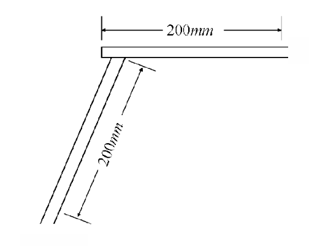

# 제3편 선체구조

> 선급 및 강선규칙/적용지침 / RA-03-K / 2025 / KO / Rules

## 제 15 장 디프탱크

### 제 1 절 일반사항

#### 101. 용어

디프탱크라 함은 물, 연료유 또는 기타의 액체를 적재하기 위하여 선체구조의 일부로서 구성된 탱크를 말한다. 기름을 적재하는 탱크로서 표시할 필요가 있는 것은 “디프기름탱크(deep oil tank)"라고 명시한다.

#### 102. 적용

- **1.** 모든 디프탱크의 구조는 이 장의 규정에 따른다. 다만, 수밀격벽을 겸하는 부분에 대하여는 **14장**의 규정에도 적합하여야 한다.
- **2.** 인화점이 60℃ 이하인 기름을 적재하는 탱크의 구조에 대하여는 이 장의 규정 이외에 **7편 1장** 및 **10장**의 규정을 적용한다.

#### 103. 제수격벽 【지침 참조】

- **1.** 디프탱크는 적당한 크기를 가져야 하며 탱크 내에는 항해상태 및 액체 적재 또는 배출시의 선박 안전성능상의 필요에 의하여 수밀 종격벽을 설치하여야 한다.
- **2.** 디프탱크의 너비가 선측에서 선측까지 이르는 경우에는 선박의 안전 성능상 필요에 따라 수밀격벽, 제수격벽 또는 깊은 제수판을 설치하여야 한다.
- **3.** 청수탱크, 연료유탱크 기타 항해시에 만재되지 않는 디프탱크에는 그 구조부재에 걸리는 동적인 힘을 최소한으로 줄이기 위해 필요한 정도의 제수격벽을 증설하든가 깊은 제수판을 적절히 설치하여야 한다.
- **4.** **3**항의 규정을 적용하기 힘들 경우에는 본 장에서 규정하는 여러 구조부재의 치수를 적절히 증가시켜야 한다.
- **5.** 종통수밀 구획격벽이 항해시 항상 만재상태 또는 공창상태에 있는 디프탱크내에 설치되어 양측으로부터 압력을 받는 것은 **14장**에서 규정하는 수밀격벽에 대한 치수로 하여도 좋다. 이 경우 디프탱크내에는 디프상태로 유지되어 있는가를 확인하기 위한 검사플러그 등을 설치하여야 한다.

#### 104. 최소두께 【지침 참조】

톱사이드탱크, 호퍼탱크 및 길이 또는 너비가 $0.1L + 5.0$(m) 를 넘는 현측탱크, 선창탱크 등의 거더, 스트럿, 단부 브래킷 및 격벽판은 그 두께를 선박의 길이에 따라 **표 3.15.1**에 정하는 것 이상이어야 한다.

#### 105. 큰 디프탱크의 격벽보강

큰 디프탱크의 격벽판, 격벽휨보강재, 보강거더 및 크로스타이의 치수는 **202.** 내지 **205.** 및 **207.**의 식들 중 $h$를 해당 규정에서 정하는 $h$ 와 다음 식에 의한 것 중 큰 값을 사용하여 정한 것 이상이어야 한다.

### 제 2 절 디프탱크 격벽

#### 201. 적용

디프탱크의 격벽 및 주위벽을 구성하는 갑판 등의 구조는 이 장에 규정하는 것 이외에는 **14장**의 규정에도 적합하여야 한다.

#### 202. 격벽판 (2020) 【지침 참조】

격벽판의 두께 $t$ 는 다음 식에 의한 것 이상이어야 한다.

#### 203. 격벽휨보강재 (2020) 【지침 참조】

- **1.** 격벽 휨보강재의 단면계수 $Z$ 는 다음 식의 $h$ 대신에 $h_1$, $h_2$ 또는 $h_3$ 를 사용하여 계산한 값 중 가장 큰 것 이상이어야 한다.
  $Z = 125C_1 C_2 C_3 S h l^2 \mathrm{cm^3 }$
  $h$ : 수두로서 **202.**에 의한 $h _{1}$, $h _{2}$ 또는 $h _{3}$ 중 가장 큰 것 ($\mathrm{m}$). 다만 $h$는 수직 휨보강재는 $l$ 의 중앙으로부터, 수평 휨보강재는 해당 휨보강재로부터 각각 측정한 값으로 한다. 해당 선박이, 평형수처리 시스템 고장시 대체방법으로, 넘침평형수 교환방법 (flow-through method)을 사용하고자 하는 경우, **202.**에 의한 $h_4$ 및 $h_5$ 를 추가로 고려하여야 한다.
  $C_2$ : 다음 식에 의한 값. 다만, $h_1$ 에 대한 $C_2$ 의 값은 **표 3.15.3**에 따른다.
  $C_2 = \frac{K}{18}$
  $C_3$ : 휨보강재 끝단의 고착조건에 따른 계수로서 **표 3.15.4** 따른다.
  $C_1$ : **202.**에 따른다.
  $S$ 및 $l$ : **14장 303.**에 따른다.
- **2.** 선박 중앙부 보다 전후에서 종늑골 방식의 종격벽 휨보강재 단면계수 $Z$ 를 구하는 경우에는 $h_1$ 에 대한 계수 $C_2$ 는 중앙부에서의 값을 점차 감소시켜 선수미부에서 $C_2$ 의 값을 $K$/18로 하여 단면계수 $Z$ 를 구할 수 있다.

  **표 3.15.3 계수** $C_2$

  | 격벽의 종류 및 늑골방식 | $C_2$ |
  | --- | --- |
  | 종늑골 방식의 종격벽 | $C_2 = \frac{K}{24 - \alpha K}$ , 최소값 $C_2 = \frac{K}{18}$ |
  | 횡늑골 방식의 종격벽 및 횡격벽 | $C_2 = \frac{K}{18}$ |
  | $\alpha$ : **202.**에 따른다. |   |

  **표 3 .15.4 계수** $C_3$

  | 일단 타단 | $A$ 형 고착 | $B$ 형 고착 | 거더지지 또는 러그고착 | 스닙 |
  | --- | --- | --- | --- | --- |
  | A형 고착 | 0.70 | 1.15 | 0.85 | 1.30 |
  | B형 고착 | 1.15 | 0.85 | 1.30 | 1.15 |
  | 거더지지 또는 러그고착 | 0.85 | 1.30 | 1.00 | 1.50 |
  | 스닙 | 1.30 | 1.15 | 1.50 | 1.50 |
  | (비고) 1. ‘$A$ 형 고착’이라 함은 이중저 또는 해당 휨보강재와 같은 정도 이상의 인접 면내 휨보강재와의 브래킷 고착 또는 이와 동등한 고착을 말한다. (**그림 3.14.2** (a) 참조) 2. ‘$B$ 형 고착’이라 함은 보, 늑골 등의 직교재와의 브래킷 고착 등을 말한다. (**그림 3.14.2** (b) 참조) |   |   |   |   |

#### 204. 보강거더 【지침 참조】

- **1.** 휨보강재를 지지하는 보강거더(이하 **거더**라고 한다)의 단면계수 $Z$ 는 다음 식에 의한 것 이상이어야 한다.
  $Z=7.13KS h l ^{2}$(cm^3)
  $S$ : 거더가 지지하는 면적의 너비 (m).
  $h$ : 수평거더일 때에는 $S$ 의 중앙으로부터, 수직거더일 때에는 $l$ 의 중앙으로부터 **203.**에서 규정하는 $h$ 의 상단까지의 수직거리 (m).
  $l$ : 거더의 전 길이 (m)로서 **14장 306.**의 규정에 따른다.
- **2.** 거더의 단면2차모멘트 $I$ 는 다음 식에 의한 것 이상이어야 한다. 다만, 거더의 깊이는 슬롯 깊이의 2.5배 미만이어서는 아니된다.
  $I=30K h l ^{4}$(cm^4)
  $h$ 및 $l$ : **1** 항의 규정에 따른다.
- **3.** 거더 웨브의 두께는 다음 3개의 식 중 큰 것 이상이어야 한다.
  $t _{1} =41.7 \frac{CKS h l}{d _{1}} +2.5$(mm), $t _{2} =0.174 root {3} of {\frac{C S h lS _{1} ^{2}}{d _{1}}} +2.5$(mm), $t_3 = 0.01S_1 + 2.5$(mm)
  $S$, $h$ 및 $l$ : **1**항에 따른다.
  $S _{1}$ : 거더의 휨보강재 간격 또는 거더의 깊이 중 작은 값 (mm).
  $d _{1}$ : 고려하는 곳의 거더의 깊이 (mm)로서 개구의 깊이를 뺀 값.
  $C$ : 계수로서 다음 식에 의한 값. 다만, 0.5 미만이어서는 아니된다.
  수평거더일 때 : $C = \left| {1-2\frac{x}{l} } \right|$
  수직거더일 때 : $C= \left| 1+ \frac{1}{5} \times \frac{1}{h} - \left( 2+ \frac{l}{h} \right) \frac{x}{l} + \frac{l}{h} \left( \frac{x}{l} \right) ^{2} \right|$
  $x$ : $l$ 의 끝으로부터 측정한 해당 단면까지의 거리 (m)로서 수직거더일 때에는 하단으로부터 측정한 것.
- **4.** 거더의 실제의 단면2차모멘트 및 단면계수의 계산은 **14장 306.**의 **6**항에 따른다.

#### 205. 크로스타이

- **1.** 디프탱크 격벽에 설치된 거더를 유효한 크로스타이로 결합할 경우에는 **204.**에서 규정하는 거더의 전 길이 ($l$)는 거더의 끝부분과 크로스타이 중심사이 또는 인접 크로스타이의 중심사이의 거리로 할 수 있다.
- **2.** 크로스타이의 단면적 $A$ 는 다음 식에 의한 것 이상이어야 한다.
  $A = 1.3 S b_s h$(cm^2)
  $S$ 및 $h$ : **204.**의 규정에 따른다.
  $b_s$ : 크로스타이가 지지하는 너비 (m).
- **3.** 크로스타이가 결합되는 부분은 거더와 브래킷으로 고착시켜야 한다.

#### 206. 브래킷

휨보강재의 양단에 설치하는 유효한 브래킷의 치수는 **14장 307.**의 규정에 따른다.

#### 207. 파형격벽 【지침 참조】

- **1.** 파형격벽의 두께 $t$ 는 다음 식에 의한 것 이상이어야 한다.
  $t = 0.0036CS_1 \sqrt { hK} + 2.5$(mm)
  $S_1$, $t_w$ 및 $t_f$ : **14장 304.**의 **1**항에 따른다.
  $h$ : **202.**의 규정에 따른다.
  $C$ : 계수로서 다음에 따른다.
  면재부 : $C = {1.4} OVER { \sqrt { 1+ \left( { \frac{t_w}{t_f}} \right)^2 }$ , 웨브부 : $C = 1.0$
- **2.** 파형격벽의 1/2피치에 대한 단면계수 $Z$ 는 다음 식에 의한 것 이상이어야 한다.
  $Z=7CKS h l^2$(cm^3)
  $S$ : **14장 304.**의 **2**항에 따른다.
  $l$ : 지지점 사이의 길이 (m)로서 **그림 3.15.1**에 따른다.
  $h$ : **203.**의 규정에 따른다.
  $C$ : 계수로서 단부의 고착조건에 따라, **표 3.15.5**에 정하는 값. 다만, 하단의 스툴의 이중저 내저판 위치에서의 선박길이 방향의 너비 $d_H$ 가 격벽의 스툴 깊이 $d_0$ 의 2.5배 미만일 때에는 $l$ 및 $C$ 값은 우리 선급이 적절하다고 인정하는 바에 따른다.
- **3.** 파형격벽의 모선방향의 단부 0.2 $l$ 사이의 두께 $t$ 는 다음 식에 의한 것 이상이어야 한다.
  웨브부 : $t = 41.7 \frac{CKS h l}{d_0} + 2.5$(mm) 다만, 다음 식에 의한 것 미만이어서는 아니된다.
  $t _{\min} =0.174 root {3} of {\frac{C S h l b^2}{d _{0}}} +2.5$(mm)
  면재부 : 다만, 수직파형격벽의 상단은 제외.
  $t_f = \frac{0.012 a}{\sqrt { K}} +2.5$(mm)
  $h$ : **203.**의 규정에 따른다.
  $C$ 및 $l$ : **2**항에 따른다.
  $S$, $d_0$, $a$ 및 $b$ : **14장 304.**의 **4**항에 따른다.

  | 난 | 상단 하단 | 거더로 지지 | 갑판에 고착 | 스툴에 고착 |
  | --- | --- | --- | --- | --- |
  | (1) | 거더로 지지, 갑판 또는 이중저에 고착 | 1.00 | 1.50 | 1.35 |
  | (2) | 스툴에 고착 | 1.50 | 1.20 | 1.00 |

   
  **그림 3.15.1** #eqnID-1927**의 측정방법**

#### 208. 정부 및 저부의 구조부재

디프탱크의 정부 및 저부의 구조부재의 치수는 이들을 그 위치에 있는 디프탱크 격벽으로 간주하여 이 장의 규정에 적합한 것이어야 한다. 다만, 그 곳의 강갑판 등의 규정에 의한 것 미만이어서는 아니된다. 또한, 디프탱크 정판의 두께는 **202.**의 식에 의한 두께에 1 mm 를 더한 것 이상이어야 한다. 다만, 탱크의 정판이 노천갑판(weather deck)이 아닌 내저판 등과 같은 정판에 대하여는 두께에 1 $\mathrm{mm}$를 더할 필요는 없다

#### 209. 치수의 경감 【지침 참조】

항해 중에 해수에 접하지 않는 격벽판 및 거더의 두께는 **202**. **204.** 및 **207.**의 규정에 의한 두께에서 다음의 값을 감할 수 있다.

### 제 3 절 디프탱크의 설비

#### 301. 물 및 공기구멍

디프탱크내의 모든 부재에는 적절한 물 및 공기구멍을 설치하여 물 또는 공기의 일부가 탱크내에 남아있지 않게 하여야 한다.

#### 302. 배수

디프탱크 정부에는 적절한 배수장치를 설치하여야 한다.

#### 303. 검사 플러그(inspection plug)

#### 103.의 5항의 규정에 의하여 디프탱크 정판에 설치하는 검사플러그는 언제나 접근할 수 있는 위치에 설치하여야 한다.

#### 304. 코퍼댐

- **1.** 코퍼댐이라 함은 양측의 구획이 공통 경계를 갖지 아니하도록 배치된 빈 공간을 말하며 수직 또는 수평으로 설치될 수 있다. 원칙적으로 코퍼댐은 적절히 통풍되고 배수설비가 제공되며, 적절한 검사, 유지보수 및 안전한 탈출을 위한 충분한 크기의 기밀구조이어야 한다.
- **2.** 코퍼댐은 액체탄화수소(연료유, 윤활유 포함)를 수용하는 구획과 청수(기관과 보일러를 구동하기 위한)를 수용하는 구획 및 소화용 액체 포말을 수용하는 탱크사이에 설치되어야 한다.
- **3.** 사람이 소비하는 물을 저장하는 탱크는 인체에 위험한 물질을 포함하는 다른 탱크와 코퍼댐으로 격리되어야 한다. 일반적으로, 청수 또는 평형수 탱크는 인체에 무해한 것으로 간주한다.
- **4.** 모서리가 접하는 경우, 이들 탱크는 인접한 것으로 고려하지 않는다.
- **5.** 다음과 같은 경우 그러한 탱크를 포함하는 공간의 특성 및 치수와 관련하여 실행 불가능하거나 불합리하다고 우리선급이 인정하는 경우 **2**항에 따른 코퍼댐은 면제할 수 있다.
  - **(1)** 인접하는 공통 경계의 판 두께가 **15장 2절**에 의한 두께에 추가하여 각각 청수탱크 또는 보일러 공급수 탱크의 경우 2.0 mm, 그 이외의 탱크의 경우 1.0 mm 를 증가시켜야 한다
  - **(2)** 공통 경계 판의 필렛 용접 각목의 합은 판 두께 이상이어야 한다.
  - **(3)** 탱크 강도시험 및 밀폐시험과 관련하여 1.0 m 증가된 설계압력으로 구조시험이 실시되어야 한다.
- **6.** **1**항에 의한 코퍼댐에는 **5편 6장 201.**에 따른 공기관 장치를 설치하여야 하며, 검사가 용이하도록 적절한 크기의 맨홀을 설치하여야 한다.
- **7.** 선원실 및 여객실은 연료유 탱크의 격벽 또는 정판에 인접하여 설치하여서는 아니된다. 이들의 구획 사이에는 통풍이 잘 되고 또한 사람이 통행할 수 있는 600 mm 이상의 간격을 갖는 코퍼댐을 설치하여야 한다. 다만, 기름탱크 정판에 개구가 없고 38 mm 이상의 불연성 피복재가 시공되어 있는 경우에는 정판의 코퍼댐은 생략할 수 있다.

### 제 4 절 파형격벽의 용접 (2016)

#### 401. 일반

- **1.** 파형격벽의 용접은 **표 3.15.6**에 따른다.
- **2.** 늑판, 거더 또는 다른 일차지지부재 및 보강재와 같이 스툴이나 파형격벽을 지지하는 부재의 경우, 필릿용접 각장은 적절히 증가되거나 개선 용접되어야 한다. 하부스툴의 측판과 내저판사이의 각이 상대적으로 작은 경우, 내저판의 지지부재의 필릿용접 각장은 각을 고려하여 적절히 증가시켜야 한다.
- **3.** 스툴이 설치된 경우, 스툴의 정판 및 저판과 스툴의 측판사이의 필릿용접 각장뿐만 아니라 스툴의 측판과 내저판사이의 필릿용접 각장은 적절히 증가되거나 개선 용접되어야 한다.
- **4.** 거싯판(gusset plate) 및 쉐더판(shedder plate)이 파형격벽의 하부에 설치되는 경우, 용접은 **규칙 7편 3장 1204. 2.** (1) (가) (a) (ii) 및 (b) (iv)에 따른다.

  | 파형격벽의 종류 |   | 적용 | 용접 |
  | --- | --- | --- | --- |
  | 수직 파형격벽 | 스툴이 없는 경우 | 상갑판 | 앙면연속필릿 용접으로 각장은 파형격벽 두께의 0.7배 이상이어야 한다. |
  | 수직 파형격벽 | 스툴이 없는 경우 | 내저판, 하부호퍼 경사판 | (1) L이 150m 이상인 선박 • 완전용입 용접 (2) L이 150m 미만인 선박 • 파형의 모서리 R의 끝단으로부터 200mm 이내 파형격벽의 웨브 및 플랜지는 완전용입 용접(**그림 3.15.2** 참조) • 나머지 부분에는 양면연속필릿 용접으로 각장은 파형격벽 두께의 0.7배 이상이어야 한다. |
  | 수직 파형격벽 | 스툴이 없는 경우 | 파형격벽 | 완전용입 용접 |
  | 수직 파형격벽 | 하부 스툴 | 정판 | (1) L이 150m 이상인 선박 • 완전용입 용접 (2) L이 150m 미만인 선박 • 파형의 모서리 R의 끝단으로부터 200mm 이내 파형격벽의 웨브 및 플랜지는 완전용입 용접(**그림 3.15.2** 참조) • 나머지 부분에는 양면연속필릿 용접으로 각장은 파형격벽 두께의 0.7배 이상이어야 한다. |
  | 수직 파형격벽 | 상부 스툴 | 저판 | 양면연속필릿 용접으로 각장은 파형격벽 두께의 0.7배 이상이어야 한다. |
  | 수평파형격벽 |   | 상갑판, 내저판, 파형격벽 | 양면연속필릿 용접으로 각장은 파형격벽 두께의 0.7배 이상이어야 한다. |

  |  |  |
  | --- | --- |
  | (a) 용접 형태 | (b) 굽힘 형태 |
