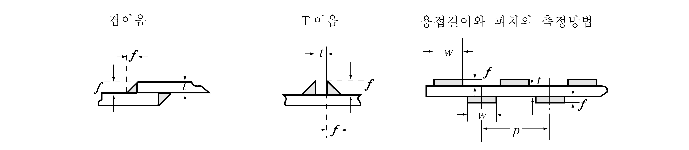
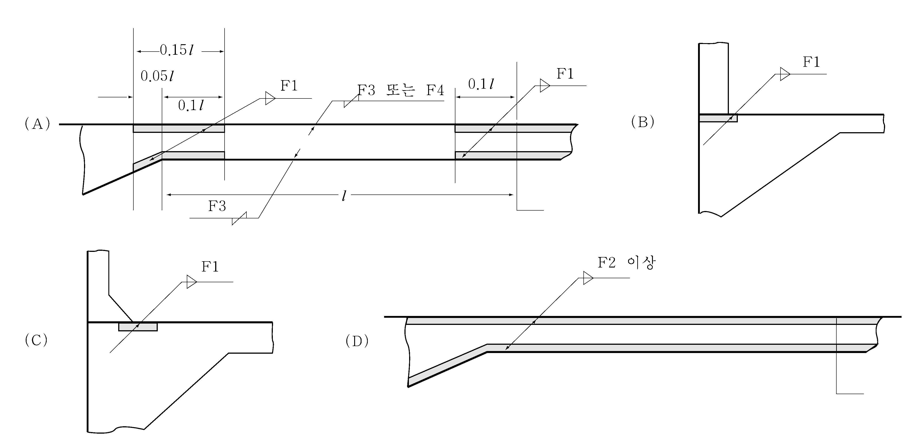
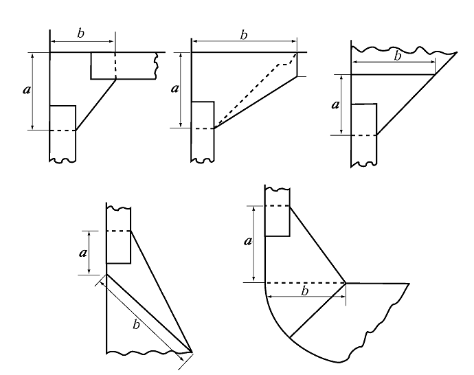
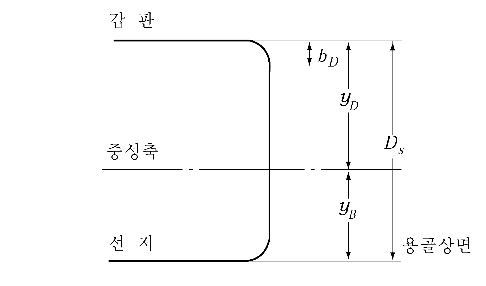
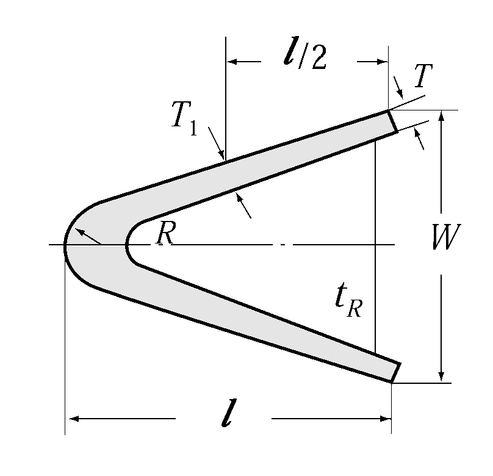
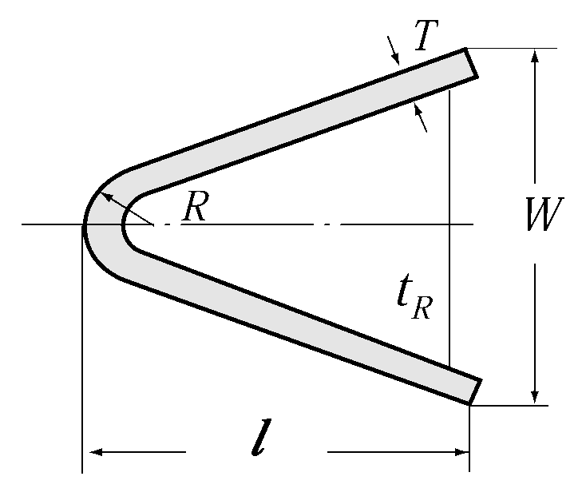
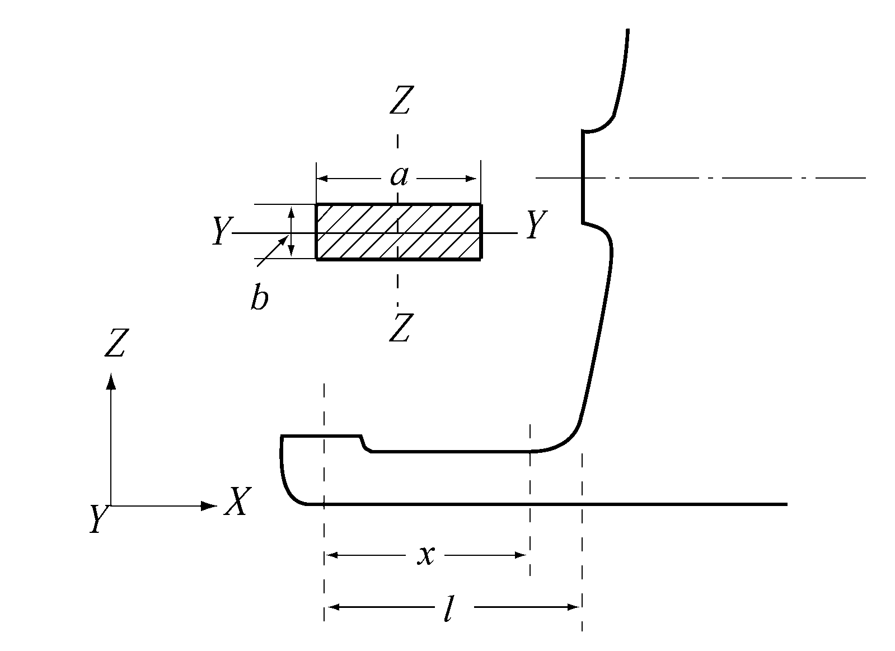
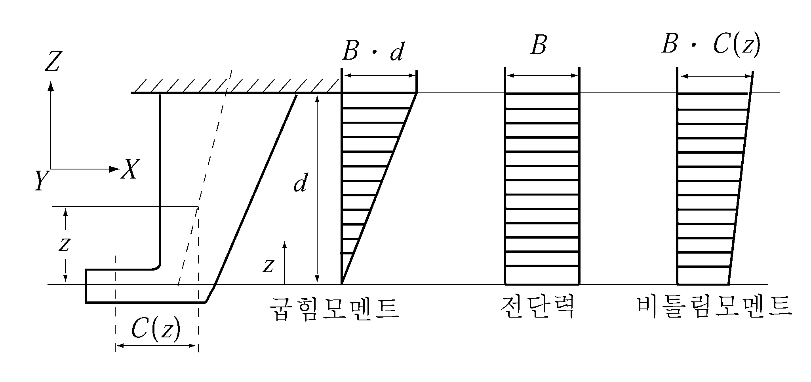

# 제3편 선체구조

> 선급 및 강선규칙/적용지침 / RA-03-K / 2025 / KO / Guidance

## 제 1 장 총칙

### 제 1 절 정의

#### 101. 적용 【규칙 참조】

$L$, $B$, $D$, $D _{s}$, $d$ 및 이들에 준하는 주요치수는 소수점 이하 3자리에서 올림한다. 다만, 건현계산에 사용하는 $D$ 및 $d$ 는 소수점 이하 4자리에서 올림한다.

#### 102. 길이 【규칙 참조】

- **1.** 선박의 길이를 측정하는 선미단은 타주가 선미재의 상부에서 힐부까지 달하지 않는 구조를 가진 경우에는 타주가 없는 것으로 여겨서 타두재의 중심의 위치로 한다. Simplex 타인 경우에는 타두재 중심의 위치를 선미단으로 한다.
- **2.** 강도계산용 흘수선상 최대 길이의 96%에 의해 $L$이 결정되는 경우, $L$의 후단은 선수재의 전단으로부터 기선과 평행하게 거리 $L$에 위치하는 지점으로 한다. *(2022)*
- **3.** 타주 및 타두재 모두 없는 선박(예를 들면 Voith-Schneider propeller를 장비한 선박)의 $L$ 은 강도계산용 흘수선상 최대길이의 96 %로 한다. 이때의 선미단의 위치는 **2**항과 같이 한다. *(2022)*
- **4.** 계획만재흘수선과 지정된 건현에 대응하는 흘수(지정흘수)와의 차이가 300 mm 이하인 경우에는 그 선박의 길이 및 흘수선상 선박의 전 길이는 계획만재흘수선에 대응하는 것으로 한다. 또한 그 차이가 300 mm 를 넘는 경우에는 지정흘수에 대응하는 것으로 한다.
- **5.** 강도계산용 흘수(scantling draft : $d _{s}$)와 계획만재흘수와의 차이가 300 mm 이하인 경우에는 선박의 길이 및 흘수선상의 선박의 전 길이는 계획만재흘수에 대응하는 것으로 한다. 또한 그 차이가 300 mm 를 넘는 경우에는 $d _{s}$ 에 대응하는 것으로 한다.

#### 103. 건현용 길이 【규칙 참조】

- **1.** 경사진 용골을 가진 선박의 경우, 길이를 측정하는 흘수선은 설계흘수선(designed waterline)과 평행해야 한다. (**그림 3.1.2-1** 참조) *(2022)*

#### 104. 너비 【규칙 참조】

경사선형을 가진 선박은 규칙의 각 규정에 사용하는 선박의 너비 $B$ 는 다음과 같이 한다.

#### 106. 깊이(최소 형깊이) 【규칙 참조】

- **1.** 둥근거널을 가진 선박의 깊이는 둥근거널의 $R$ 이 끝나는 곳에서 그 하면의 연장선과 선측외판의 내면과 만나는 점까지의 깊이로 한다. (**지침 그림 3.1.2** 참조)
- **2.** 다층갑판선으로 **규칙 114.**의 **3**항에서 정하는 건현갑판이란 어디까지나 규칙에 의한 깊이를 정하는 건현갑판이 되며 만재흘수선 지정을 위한 건현갑판은 상기의 갑판보다 상방의 전통갑판으로 할 수 있다.
- **3.** 경사진 용골을 가진 선박의 경우, 최소 형깊이 ($D_\min$)는 아래의 그림과 같이 건현갑판의 형현호선(moulded sheer line)과 접하도록 선박(스케그 포함)의 용골선과 평행한 선을 그려서 구한다. 최소 형깊이는 용골의 상단으로부터 접선 지점의 건현 갑판 보 상단까지의 수직 거리이다. (**그림 3.1.2-1** 참조) *(2022)*
  
  **그림 3.1.2-1**

#### 107. 강도 계산용의 깊이 【규칙 참조】

현호의 최하점이 $L$ 의 중앙에 있지 않은 선박의 강도계산용의 깊이 $D _{s}$ 는 중앙부 0.4$L$ 사이에 있어서 강력갑판까지의 최소깊이로 한다.

#### 121. 경하배수량 (2017) 【규칙 참조】

고정식 소화장치를 위해 본선에 비치되는 소화제(예를 들면 청수, 탄산가스, 분말소화약제, 포말 등)의 무게는 경하배수량 및 경하상태에 포함되어야 한다.

### 제 2 절 일반사항

#### 201. 적용범위 【규칙 참조】

항로를 제한하는 조건으로 등록을 받는 선박의 선체구조 및 의장에 관한 사항의 경감에 대하여는 다음에 정하는 바에 따른다.

- **1.** 구조부재 치수의 경감은 **지침 표 3.1.1**을 준용하며 기타의 부재에 대하여는 동표에 준하여 적절히 감할 수 있다. 다만, 상부에 화물을 적재하는 갑판보(beam), 목재화물을 적재하는 노출갑판의 보, 중량물을 적재하는 내저판 및 내저판에 부착하는 종늑골, 디프탱크 등의 부재는 감소하여서는 아니된다.

  **표 3.1.1 부재치수의 경감량 및 최소치수**

  | 항목 |   | 연해 | 평수 | 최소치수 |
  | --- | --- | --- | --- | --- |
  | 종강도 | 파랑하중($M _{w}$ & $F _{w}$) | 20 % | 30 % | ─ |
  | 종강도 | $Z _{\min}$ | 10 % | 15 % | ─ |
  | 외판(평판용골을 포함) |   | 5 % | 10 % | 6 mm, 단 선루는 제외 |
  | 갑판의 두께 |   | 1 mm | 1 mm | 5 mm |
  | 늑골의 단면계수(선저종늑골을 포함) |   | 10 % | 20 % | 30 cm^3 |
  | 갑판보의 단면계수 |   | 15 % | 15 % | ─ |
  | 갑판거더의 단면계수 |   | 15 % | 15 % | ─ |
  | 이중저부재의 판두께 |   | 1 mm | 1 mm | 5.5 mm |
  | 단저부재의 판두께 |   | 0.5 mm | 10 % 또는 1 mm 중 작은 값 | ─ |
  | 선루단 격벽의 판두께 및 벽휨보강재의 단면계수 |   | 10 % | 10 % | ─ |
  | (비고) 1. 국제항해에 종사하는 선박에 대하여는 선루단 격벽의 두께 및 격벽휨보강재의 단면계수를 경감하여서는 아니된다. 2. 표 중 $Z _{\min}$ & $M _{w}$ : **규칙 표 3.3.1** 참조, $F _{w}$ : **규칙 3장 301.**의 **1**항 참조. |   |   |   |   |
- **2.** 출입구 문턱의 높이는 제한된 항로에 따라서 **지침 표 3.1.2**를 준용한다. 다만, 국제항해에 종사하는 선박은 제외한다.

  **표 3.1.2. 창구코밍 및 각 출입구 등의 문지방 높이**

  | 종류 항해구역 위치 |   | 일반창구 | 작은창구(창구면적) |   | 승강구 | 선루단 출입구 | 통풍통 |
  | --- | --- | --- | --- | --- | --- | --- | --- |
  | 종류 항해구역 위치 |   | 일반창구 | 0.45~1.5 m^2 | 0.45 m^2 미만 | 승강구 | 선루단 출입구 | 통풍통 |
  | 연해 | I | 600 | 450 | 380 | 450 | 380 | 900 |
  | 연해 | II | 450 | 380 | 230 | 300 | 300 | 760 |
  | 평수 | I | 450 | 380 | 230 | 300 | 300 | 760 |
  | 평수 | II | 300 | 230 | 180 | 100 | 100 | 450 |
- **3.** 의장수 및 의장품에 대하여는 **규칙 4편 8장**에 따른다.

#### 202. 적용범위 이외의 선박 【규칙 참조】

**규칙 202.**에서 “우리 선급이 적절하다고 인정하는 바”라 함은 **규칙 206.**의 직접강도계산에 의한 방법에 따르거나 **규칙 1편 1장 105.**에 따라 인정하는 것을 말한다.

#### 203. 특수한 모양 및 특별한 화물을 운반하는 선박 【규칙 참조】

- **1.** **목재운반선**
  - **(1)** 목재만재흘수선을 표시하는 선박에 대하여는 목재만재흘수선과 **규칙 110.**에 의한 $d$ 와의 차이가 300 mm 이하일 때에는 **규칙 110.**의 $d$ 에 대응하는 $L$, $\Delta$ *및* $C _{b}$ 의 값으로 사용할 수 있으나 그 차이가 300 mm 을 넘는 경우에는 목재만재흘수선에 대응하는 값으로 한다.
  - **(2)** 목재만재흘수선은 표시하지 않지만 목재를 적재하도록 계획된 선박은 (3)호의 규정에 따른다.
  - **(3)** 목재운반선의 선체구조는 다음에 적합하게 보호하여야 한다. 다만, 포장된 목재만을 운반하는 목재운반선에 대하여는 (아)를 제외하고 기타의 규정은 적절히 참작할 수 있다.
    화물의 충격을 받는 부재의 용접은 연속용접 (적어도 F2)으로 한다. 다만, 내장판을 까는 경우의 창내 내저판의 구조부재의 용접은 그러하지 아니한다.
    창구측부의 갑판거더 및 창구단보에는 1.5 m 간격으로 트리핑브래킷을 설치하고 그 자유변을 보강한다.
    선박의 길이가 130 mm 이하인 선박의 선창내 격벽은 가능한 한 평판형 격벽구조로 할 것을 권장한다. 평판형 격벽의 휨보강재가 없는 쪽 및 파형격벽의 양쪽에는 각목재(250 mm×250 mm) 또는 형강을 적절한 간격으로 설치하여 충분히 보호하여야 하며, 휨보강재의 보호는 (바)에 준한다.
    창구코밍의 구조는 특히 견고한 것으로 한다.
    불워크는 창구측부에서 특히 견고하게 하기 위하여 불워크에 설치하는 방수구는 창구측부에는 반드시 작은 것으로 하고 다른 부분에 대하여는 충분한 방수구 면적을 확보할 것을 권장한다.
    창내늑골의 보호방법은 다음에 따른다. 다만, $L$ 이 130 m 를 넘는 선박에 대하여는 경감하여도 좋다.
    $b=128 \sqrt { d_0 l}$(mm)
    $d _{0}$ : 브래킷의 목 깊이(m)로서 **지침 그림 3.1.3**에 의한다.
    $l$ : 브래킷의 자유변의 길이(m)로서 **지침 그림 3.1.3**에 의한다.
    
    **그림 3.1.3 브래킷 암의 측정**
    창내에는 외측브래킷 상단에서 150 mm 상방보다 하부의 모든부재(외판 및 관장치 포함)는 타르(tar) 등의 쉽게 떨어지지 않는 좋은 페인트로 도장하는 것이 바람직하다.
    창구덮개는 던에이지(dunnage) 등으로 목재로부터 보호하여야 하며, 선박의 운동에 의한 동요를 방지할 수 있는 장치가 설치되어야 한다. 또한 목재의 하중에 의하여 창구덮개 가스킷이 과도하게 압축되지 않도록 적절한 설비를 갖추어야 한다.
    - **(가)** 용접구조(**규칙 1장 5절**)
    - **(나)** 갑판거더 및 창구단보(**규칙 11장**)
    - **(다)** 수밀격벽보호(**규칙 14장**)
    - **(라)** 창구, 기관실구 기타의 갑판구(**규칙 4편 2장**)
    - **(마)** 불워크(**규칙 4편 4장**)
    - **(바)** 창내늑골의 보호
      - **(a)** 창내늑골에는 다음 중 어느 한 방법에 의하여 보강을 하여야 한다.
      - **(i)** 약 2 m 의 간격으로 선측종통재 또는 트리핑 브래킷을 부착한다.
        - **(ii)** 약 1.5 m 의 간격으로 늑골의 면재에 형강을 종방향으로 부착한다.
        - **(iii)** 약 0.5 m 의 간격으로 늑골의 면재에 150×10 FB 정도의 평강을 종방향으로 부착한다.
      - **(b)** 외측브래킷 또는 산적화물선의 창내늑골 하부 브래킷의 자유변에는 형강 또는 평강(평강인 경우에는 적어도 2조)을 종방향으로 부착한다. 다만, 산적화물선형의 늑골이 다음에 적합한 경우에는 이를 생략할 수 있다.
      - **(i)** 브래킷의 두께 $t$ 는 **규칙 604.**에 의한다. 다만, 브래킷의 암 길이 $l _{b}$ 는 **지침 그림3.1.3**에 의한다.
        - **(ii)** 브래킷의 자유변의 너비 $b$ 는 다음 식에 의한다.
      - **(c)** 선수미부 등으로서 창구직하에 늑골이 있는 경우에는 적절히 보강을 한다.
      - **(d)** 깊은 늑골 등으로서 창내에 돌출하는 부분이 큰 부재는 그 치수 및 트리핑 브래킷의 배치에 충분히 주의한다.
    - **(사)** 페인트공사
    - **(아)** 화물의 충격을 받을 우려가 있는 공기관, 사다리, 비바람막이문, 기타 격벽붙이 기기류에는 충격에 의한 손상을 방지할 수 있는 대책을 강구하여야 한다.
    - **(자)** 창구덮개의 보호
- **2.** **특히 큰 건현을 가진 선박 및 만재흘수선에서 강력갑판까지의 높이가 특히 큰 선박**
  - **(1)** **󰡒특히 큰 건현을 가진 선박󰡓**이라 함은 어떤 선박의 실제하기건현 $f _{s}$ (지정된 만재흘수선에 대응하는 것)이 다음에 의한 방법에 따라 지정된 최소하기건현 $f$ 에 선루의 표준높이 $h _{s}$ (1966년 국제만재흘수선조약 제33조 참조)를 더한 것 이상인 선박을 말한다. 즉 여기에서 말하는 최소하기건현이란 어느 선박의 건현갑판에서 그 하방으로 상기선루 높이와 같은 거리를 취하고, 그 위치에 갑판이 있는 것으로 가정하여 그 가상갑판을 건현갑판(이하 **가상건현갑판**이라 한다.)으로 하는 전통선루선으로 간주하여 상기의 조약에 의해 계산한 건현을 말한다. (**지침 그림 3.1.4** 참조)
    
    **그림 3.1.4 특히 큰 건현을 가진 선박**
  - **(2)** 부재치수 등에 대하여는 규칙에 따르는 외에 다음에 정하는 바에 따른다. 다만, **1966년 국제만재흘수선조약**의 B 형 선박으로서 건현 표 A 와 표 B 의 차의 60 % 또는 100 % 감소하는 것은 적용하지 아니한다.
    늑판의 면재의 단면적은 **규칙 6장 403.**의 식에 있어서 $D$ 대신에 $D^{ '}$ 를 사용하여 계산 할 수 있다.
    가상건현 갑판보다 상부에 늑골을 지지하는 갑판이 있는 경우에는 그보다 상방의 늑골을 선루늑골로 계산할 수 있다.
    **규칙 10장 표 3.10.3**에 규정하는 $h$를 산정하는 경우에 가상건현갑판으로부터 노출갑판까지의 선측에서 측정한 수직거리, $H _{D}$에 따라 해당 노출갑판을 다음과 같이 취급한다. 또한 **규칙 10장** 이외의 규정에서 $h$ 를 인용하는 경우에도 이와 같이 취급한다.
    $h _{s} \leq H _{D} < 2h _{s}$ 일 경우 : 건현갑판 상부의 제1층의 선루갑판
    $2h _{s} \leq H _{D} < 3h_s$ 일 경우 : 건현갑판 상부의 제2층의 선루갑판
    $3h_s \leq H _{D}$ 일 경우 : 건현갑판 상부의 제3층의 선루갑판
    건현갑판(가상갑판을 건현갑판으로 하는 선박에서는 가상건현갑판)보다 상방의 선측외판의 두께는 **지침 4장 103.**을 적용한다.
    다음 사항에 대하여는 건현갑판상에 설치하는 것은 선루갑판상에 설치하는 것에 대한 규정까지, 선루갑판상에 설치하는 것은 상층의 갑판실에 대한 규정까지 경감할 수 있다.
    - **(가)** 단저구조
    - **(나)** 늑골(**규칙 8장**)
    - **(다)** 갑판하중(**규칙 10장**)
    - **(라)** 평판용골 및 외판(**규칙 4장**)
    - **(마)** 창구, 불워크 등(**규칙 4편 2장** 및 **4장**)
      - **(a)** 창구코밍의 높이 및 창구덮개의 높이 및 창구덮개의 치수
      - **(b)** 노출된 기관실구 주위벽에 설치하는 문지방 높이
      - **(c)** 내부에 개구가 있는 갑판실 또는 출입구실 개구의 문지방 높이
      - **(d)** 통풍통 코밍의 높이
      - **(e)** 공기관의 높이
      - **(f)** 현창의 등급

#### 206. 직접강도계산 【규칙 참조】

**1 . 규 칙 206.**에 따른 직접강도계산에 의하여 선체구조 각부재의 치수를 정하는 경우에는 **부록 3-2 「직접강도평가에 관한 지침」**에 따른다. 다만, 동 지침에 따르는 것이 곤란할 경우에는 그 해석방법, 하중 및 허용응력에 대하여 우리 선급이 적절하다고 인정하는 바에 따른다.

- **2.** 직접강도계산에 의하여 얻어진 결과를 근거로 하여, 각 구조부재의 좌굴강도를 검토하여야 하며, 검토방법 및 허용응력 등은 **부록 3-2 직접강도평가에 관한 지침」**에 따른다.
- **3.** 선체구조부재의 결합부 및 구조의 불연속부 등 응력집중부에 대한 피로강도 검토가 필요하다고 우리 선급이 인정하는 경우에는, 그 해석방법 및 하중 등에 대한 자료를 제출하여야 한다.

### 제 4 절 재료

#### 401. 재료의 규격 【규칙 참조】

- **1.** 선체구조부재로서 스테인리스 강재를 사용하는 경우 재료의 사용과 치수는 다음 사항을 따른다.
  - **(1)** 선체구조부재에 사용하는 스테인리스 강재는 **규칙 2편 1장 305.** 및 **309.**의 규정에 따른다.
  - **(2)** 본 조항은 방식조치의 유․무와 무관하게 적용된다.
  - **(3)** 스테인리스 강재가 종강도 부재로 사용되는 경우 **규칙** 및 **지침 3장 4절**에 의한 좌굴강도를 만족하여야 한다.
  - **(4)** 재료계수($K$*)*는 다음 식에 의한다. 다만, 0.63보다 작아서는 아니 되며 소수점 4자리에서 반올림한다. *(2018)*
    - $\sigma _{Y} \leq 355$ (N/mm^2)인 경우
    $K=f _{T} \left\{ 8.81( \sigma _{Y} /1000) ^{2} -7.56( \sigma _{Y} /1000)+2.29 \right\}$
    - $\sigma _{Y} >355$ (N/mm^2)인 경우
    $K=f _{T} f _{C} (235/ \sigma _{Y} )$
    $\sigma _{Y}$ : **규칙 2편 1장 305.** 및 **309.**에 명시된 스테인리스 강재 또는 스테인리스 클래드 강재의 항복응력 또는 규격에 규정하는 항복응력(내력)의 최소값(N/mm^2)
    $f _{C}$ : 다음 식에 의한 값
    $f _{C} =3.04( \sigma _{Y} /1000) ^{2} -1.09( \sigma _{Y} /1000)+1.09$
    $f _{T}$ : 온도 영향계수로 다음 식에 의한 값 다만, $T$가 100℃를 넘는 경우 우리선급이 적절하다고 인정하는 값으로 한다.
    $f _{T} =0.0025(T-60)+1.00$
    $T$ : 해당부재가 접하는 화물의 최고온도(℃). 다만 60℃ 미만인 경우 60℃로 한다.
  - **(5)** (4)의 규정에도 불구하고 응력집중이 예상되는 위치에 대하여 재료계수($K$*)의 최소값은* 0.78로 하여야 한다. 다만 **부록 3-3**의 **5**항 유한요소법으로 피로해석을 수행하는 경우 그러하지 아니한다. *(2018)*
  - **(6)** (5)의 응력집중 위치의 예는 다음과 같다. *(2018)*
    - 파형격벽 하단 코너부와 하부스툴 정판 결합부
    - 파형격벽 하단 코너부와 내저판 결합부
    - 내저판과 빌지호퍼 경사판의 결합부
    - 내저판과 하부스툴과의 결합부 등
    - 기타 우리선급이 필요하다고 인정하는 위치
  - **(7)** 관련규정에서 요구하는 부재의 치수에 대하여 해수와 전혀 접하지 않는 경우에만 다음의 값을 감할 수 있다. *(2018)*
    - 판두께 : 1.0 mm
    - 단면계수 : 5 %
    - 판두께 : 0.5 mm
    - **(가)** 스테인리스 강재의 경우
    - **(나)** 스테인리스 클래드 강재의 경우
- **2.** 별도로 규정한 경우를 제외하고, 설계온도가 90 ℃에서 300 ℃인 경우 강재의 최소 항복응력 $\sigma _{y} '$ 및 구조부재의 치수 결정을 위한 재료계수 $K$ 는 다음식에 따른다.
  - **(1)** 고온환경에서의 항복응력
    $\sigma _{y } ' = \sigma _{y} (1.04 - \frac{0.75}{1000} \theta )$
    $\sigma _{y}$ : **규칙 2편 1장 3절 표 2.1.7**에 명시된 상온에서의 최소 항복응력 (N/mm^2)
    $\theta$ : 강재의 사용온도(℃)
  - **(2)** 재료계수
    $K = \frac{235}{\sigma _{y } '}$

#### 403. 고장력 강재 【규칙 참조】

- **1.** 종강도 부재에 고장력강재를 사용하는 경우에는 다음에 따른다.
  - **(1)** 적용
    강력갑판 및 선저를 종식구조로 하는 선박으로서 **규칙 403.**에 따라 고장력강을 사용하는 선박의 중앙부에 있어서 선체 횡단면의 단면계수를 감소시키는 경우에 종강도 부재에 대하여는 다음에 따른다.
  - **(2)** 고장력강의 사용범위
    다음의 범위에는 고장력강을 사용하여야 한다.
    
    **그림 3.1.5 갑판과 선저에 고장력강을 사용하는 경우** 
    **그림 3.1.6 갑판에만 고장력강을 사용하는 경우**
    $b _{D} =y _{D} \left( 1- \frac{1}{f _{D}} \right)$(m)
    $y _{D}$ : 선체 횡단면의 중립축으로부터 강력갑판까지의 거리 (m)
    $b _{B} = y _{B} \left( 1- \frac{1}{f _{B}} \right)$(m)
    $y _{B}$ : 선체 횡단면의 중립축으로부터 용골 상면까지의 거리 (m)
    
    **그림 3.1.7 갑판** 
    **그림 3.1.8 창구코밍**
    - **(가)** 강력갑판 또는 선저로부터 다음에 정하는 점까지의 종강력부재(**지침 그림 3.1.5** 및 **그림 3.1.6** 참조)
      - **(a)** 강력갑판부
      - **(b)** 선저부
    - **(나)** 강력갑판상의 종강도 부재
    - **(다)** 창구측선내의 갑판 중 **지침 그림 3.1.7**에 표시한 범위
    - **(라)** 창구코밍과 그 수평 휨보강재 중 **지침 그림 3.1.8**에 표시한 범위
    - **(마)** 고장력강에 용접되는 Gutter bar와 빌지킬. 다만, 빌지킬이 리벳구조인 경우는 선체붙이 평강 이외는 고장력강으로 할 필요는 없다.
    - **(바)** 개구부를 보상하기 위하여 부착하는 이중판 등으로서 고장력강의 종강도 부재에 대응하는 것.
    - **(사)** 선박의 중앙부 0.5$L$ 사이는 고장력강으로 할 것을 권장한다. 선박의 중앙부 0.5$L$ 사이를 고장력강으로 하지 않을 경우는 선박의 중앙부 0.4$L$ 과 0.5$L$ 사이의 선체 횡단면계수의 연속성에 대하여 특별히 주의할 필요가 있다.
  - **(3)** 종강도 부재의 테이퍼
    - **(가)** 고장력강을 사용하는 종강도 부재의 테이퍼는 선박의 전 길이에 걸쳐서 고장력강으로 건조되는 경우를 가정하여 규칙의 테이퍼에 관한 규정에 따른다.
    - **(나)** 선박의 중앙부에 고장력강을 사용하는 경우 선박 중앙부의 전후에 있어서 연강의 부재치수는 **지침 그림 3.1.9**에 따른다.
    - **(다)** 고장력강과 연강의 접합부에서는 양쪽의 판두께가 현저한 차이가 생기지 않도록 하는 등 연속성에 대한 고려를 할 필요가 있다.
- **2.** 고장력강을 사용하는 경우에는 다음 각 호에 주의하여야 한다.
  - **(1)** 선체구조에 강도가 다른 강재를 혼용하여 배치할 경우 높은 강도의 강재에 인접하는 낮은 강도의 강재에 발생하는 응력에 대하여는 충분한 고려를 하여야 한다.
  - **(2)** 거더에 고장력강을 사용하고, 거더에 지지되는 휨보강재에 과대한 부가응력이 생기지 않도록 거더의 강성 혹은 휨보강재의 치수에 대하여 특별히 고려하여야 한다.
  - **(3)** 고장력강을 사용할 부재는 현저한 응력집중을 받지 않도록 구조상 특별한 고려를 하여야 한다.
  - **(4)** 선체구조의 광범위에 걸쳐 고장력강을 사용할 경우에는 세밀한 강도 검토를 하고 그 결과를 우리 선급에 제출하여야 한다.

    **표 3.1.3** $\beta$

    | 선종 강재 | 유조선 | 기타의 선박 |
    | --- | --- | --- |
    | *HT* 32 | 1.27 | 1.34 |
    | *HT* 36 | 1.38 | 1.45 |

    
    **그림 3.1.9 선수미부에서 연강의 부재치수**

#### 404. 제한항로의 선박 【규칙 참조】

**규칙 404**에서 “우리 선급이 적절하다고 인정하는 바”라 함은 **규칙 1편 1장 105.**에 따라 인정하는 것을 말한다.

#### 405. 강재의 사용구분 【규칙 참조】

- **1.** 둥근거널에 대한 강재의 사용구분은 현측후판으로 취급한다. 이때 강판 한 장의 너비는 $L$ 이 100 m 이하일 때에는 1,300 mm 이상, $L$ 이 250 m 이상일 때에는 2,600 mm 이상으로 하고 중간의 $L$ 은 보간법에 의한 값 이상으로 한다.
- **2.** 선체구조부재에 두께가 50 mm 초과 100 mm 이하의 강재를 사용하는 경우, **규칙 표 3.1.4** 및 **지침 표 3.1.4**에 표시하는 사용구분에 따라 **규칙 2편 1장**에 규정하는 강재를 사용하여야 한다.

  | 급별 두께(mm) | I |   | II |   | III |   |
  | --- | --- | --- | --- | --- | --- | --- |
  | 급별 두께(mm) | *MS* | *HT* | *MS* | *HT* | *MS* | *HT* |
  | \(50 *D* *DH* *E* *EH* *E* *EH* |   |   |   |   |   |   |
  | \(60 *E* *EH* *E* *EH* *E* *EH* |   |   |   |   |   |   |
  | (비고) 표 중의 기호는 다음의 재료기호를 말한다. *DH* : *DH* 32, *DH* 36 및 *DH 40*, *MS* : 연강재 *EH* : *EH* 32, *EH* 36 및 *EH 40*, *HT* : 고장력 강재 |   |   |   |   |   |   |

#### 406. 강재사용의 특별규정 【규칙 참조】 (2019)

- **1.** 저온해역을 취항하는 선박의 사용강재는 다음 각 호의 규정에 따른다.
  - **(1)** 기온 -10 °C 미만의 저온해역을 취항하는 선박, 예를들면 정기적으로 동절기에 북극해나 남극해를 운항하는 선박의 경우 노출부재의 재료는 다음 **2**항에 정의된 설계온도(design temperature) $t _{D}$ 에 따라 선택하여야 한다. 최소 평형수 수선(lowest ballast waterline : BWL) 상부에 위치하고 대기중에 노출된 강도부재의 재료(**지침 표 3.1.6**의 비고(5)에 해당되는 구조부재들을 포함) 및 **3**항에 해당하는 저온 화물에 접하는 화물탱크의 경계판의 재료는 구조부재의 종류에 따라서 **지침 표 3.1.6**에 표기된 등급이상의 강재를 사용하여야 한다. 또한, 대기중에 노출되지 않은 부재(**지침 표 3.1.6**의 비고(5)제외)와 최소 평형수 수선 하부에 위치한 부재는 **규칙 405.**에 따른다. *(2017)*

    **표 3.1.6 저온에 노출된 구조부재에 대한 강재의 사용구분** ***(2019)***

    | 구조부재명 | 강재의 급별 |   |
    | --- | --- | --- |
    | 구조부재명 | 중앙부 0.4$L$ 이내 | 중앙부 0.4$L$ 이외 |
    | о 2차 강도부재(secondary) : · 노출갑판 · 최소 평형수 수선 상부의 선측외판 · 최소 평형수 수선 상부의 횡격벽판(5) · 저온 화물에 접하는 화물탱크의 경계판(6) | I | I |
    | о 1차 강도부재(primary) : · 강력갑판(1) · 강력갑판 상부의 연속된 종통부재(종해치 코밍제외) · 최소 평형수 수선 상부의 종통격벽판(5) · 최소 평형수 수선 상부 톱사이드탱크의 격벽판(5) | II | I |
    | о 특수부재(special) : · 강력갑판의 현측후판(2) · 강력갑판의 스트링거판(2) · 종통격벽에 접합되는 갑판의 강판(3) · 연속된 종 해치코밍(4) | III | II |
    | (비 고) (1) 큰 창구 모서리부의 강판은 특별히 고려하여야 한다. 높은 국부응력이 발생되는 장소는 III급 또는 *E*, *EH* 32, *EH* 36 및 *EH* 40 이상의 강재를 사용하여야 한다. (2) $L$ 이 250 m를 넘는 선박의 중앙부 0.4$L$ 간은 *E*, *EH* 32, *EH* 36 및 *EH* 40 이상을 사용하여야 한다. (3) $B$ 가 70 m를 넘는 선박에 있어서 적어도 3조의 갑판의 강판은 III급 이상이어야 한다. (4) *D*, *DH* 32, *DH* 36 및 *DH* 40 이상을 사용하여야 한다. (5) 저온에 노출된 선체외판과 접하는 판에 적용한다. 적어도 한 판이 노출된 선체외판과 동일하게 고려되어야 하고 판 폭은 600mm 이상이어야 한다. (6) 액화가스운반선이 아닌 선박이 저온 화물에 접하는 화물탱크의 경계판(**3**항 참조) |   |   |
  - **(2)** 두께와 설계온도에 따른 선체구조부재의 사용강재는 **지침 표 3.1.7**에 따른다. 설계온도가 -55 °C 미만인 경우는 우리 선급이 적절하다고 인정하는 바에 따른다.
  - **(3)** Ⅲ급 또는 *E*, *EH* 32/*EH* 36/*EH* 40 및 *FH* 32/*FH* 36/*FH* 40의 강판이 사용되는 경우, 1조의 강판(single strakes)의 너비 *b* 는 다음 식에 의한 것 이상이어야 하며 1800 mm 를 넘을 필요는 없다.
    $b=5L+800$(mm)
  - **(4)** 선미재, 러더혼, 타 및 샤프트 브래킷의 강판은 **규칙 405.**의 **3**항에 규정된 등급 이상이어야 한다.
- **2.** 설계온도 $t _{D}$ 는 선박이 운항하는 구역에서의 최저 통계적 평균의 일일 평균온도(lowest mean daily average air temperature)를 의미한다. 다만, 계절에 따라 제한적으로 운항하는 선박의 경우에는 그 기간 중 가장 낮은 기온을 적용한다.(**지침 그림 3.1.10 참조**) *(2017)*
  · 평균(Mean) : 관찰기간동안의 통계적 평균(적어도 20년)
  · 평균(Average) : 하루 동안의 평균
  · 최저(Lowest) : 연간 최저값
  · MDHT : 일일 최고(최대) 온도의 통계적 평균
  · MDAT : 일일 산술평균 온도의 통계적 평균
  · MDLT : 일일 최저(최소) 온도의 통계적 평균
  다만, 계절에 따라 제한적으로 운항하는 선박의 경우에는 그 기간 중 가장 낮은 기온을 적용한다. POLAR Code에 따라서 극지선박증서를 발급하기 위하여 설계온도 $t _{D}$ 는 선박의 극지운항온도(PST)보다 13°C 이상이어서는 아니 된다. 극지역에서 관찰기간동안의 통계적 평균은 적어도 10년 주기로 결정되어야 한다.

  **표 3.1.7 두께 및 설계온도에 따른 사용강재** Ⅰ 급 강

  | 판두께 (mm) | -11/-15 °C |   |   | -16/-25 °C |   |   |   | -26/-35 °C |   |   |   | -36/-45 °C |   |   |   | -46/-55 °C |   |   |   |   |
  | --- | --- | --- | --- | --- | --- | --- | --- | --- | --- | --- | --- | --- | --- | --- | --- | --- | --- | --- | --- | --- |
  | 판두께 (mm) | *MS* | *HT* |   | *MS* |   | *HT* |   | *MS* |   | *HT* |   | *MS* |   | *HT* |   | *MS* |   |   | *HT* |   |
  | $t \leq 10$ | *A* | *AH* |   | *A* |   | *AH* |   | *B* |   | *AH* |   | *D* |   | *DH* |   | *D* |   |   | *DH* |   |
  | $10 *A* *AH* *B* *AH* *D* *DH* *D* *DH* *D* *DH* |   |   |   |   |   |   |   |   |   |   |   |   |   |   |   |   |   |   |   |   |
  | \(15 *A* *AH* *B* *AH* *D* *DH* *D* *DH* *E* *EH* |   |   |   |   |   |   |   |   |   |   |   |   |   |   |   |   |   |   |   |   |
  | \(20 *B* *AH* *D* *DH* *D* *DH* *D* *DH* *E* *EH* |   |   |   |   |   |   |   |   |   |   |   |   |   |   |   |   |   |   |   |   |
  | \(25 *B* *AH* *D* *DH* *D* *DH* *E* *EH* *E* *EH* |   |   |   |   |   |   |   |   |   |   |   |   |   |   |   |   |   |   |   |   |
  | \(30 *D* *DH* *D* *DH* *D* *DH* *E* *EH* *E* *EH* |   |   |   |   |   |   |   |   |   |   |   |   |   |   |   |   |   |   |   |   |
  | \(35 *D* *DH* *D* *DH* *E* *EH* *E* *EH* *-* *FH* |   |   |   |   |   |   |   |   |   |   |   |   |   |   |   |   |   |   |   |   |
  | \(45 *D* *DH* *E* *EH* *E* *EH* *-* *FH* *-* *FH* |   |   |   |   |   |   |   |   |   |   |   |   |   |   |   |   |   |   |   |   |
  | Ⅱ 급 강 |   |   |   |   |   |   |   |   |   |   |   |   |   |   |   |   |   |   |   |   |
  | 판두께 (mm) | -11/-15 °C |   |   |   | -16/-25 °C |   |   |   | -26/-35 °C |   |   |   | -36/-45 °C |   |   |   | -46/-55 °C |   |   |   |
  | 판두께 (mm) | *MS* |   | *HT* |   | *MS* |   | *HT* |   | *MS* |   | *HT* |   | *MS* |   | *HT* |   | *MS* |   |   | *HT* |
  | \(t \leq 10$ | *A* |   | *AH* |   | *B* |   | *AH* |   | *D* |   | *DH* |   | *D* |   | *DH* |   | *E* |   |   | *EH* |
  | $10 *B* *AH* *D* *DH* *D* *DH* *E* *EH* *E* *EH* |   |   |   |   |   |   |   |   |   |   |   |   |   |   |   |   |   |   |   |   |
  | \(20 *D* *DH* *D* *DH* *E* *EH* *E* *EH* *-* *FH* |   |   |   |   |   |   |   |   |   |   |   |   |   |   |   |   |   |   |   |   |
  | \(30 *D* *DH* *E* *EH* *E* *EH* *-* *FH* *-* *FH* |   |   |   |   |   |   |   |   |   |   |   |   |   |   |   |   |   |   |   |   |
  | \(40 *E* *EH* *E* *EH* *-* *FH* *-* *FH* *-* *-* |   |   |   |   |   |   |   |   |   |   |   |   |   |   |   |   |   |   |   |   |
  | \(45 *E* *EH* *E* *FH* *-* *FH* *-* *FH* *-* *-* |   |   |   |   |   |   |   |   |   |   |   |   |   |   |   |   |   |   |   |   |

  **Ⅲ 급 강**

  | 판두께 (mm) | -11/-15 °C |   | -16/-25 °C |   | -26/-35 °C |   | -36/-45 °C |   | -46/-55 °C |   |
  | --- | --- | --- | --- | --- | --- | --- | --- | --- | --- | --- |
  | 판두께 (mm) | *MS* | *HT* | *MS* | *HT* | *MS* | *HT* | *MS* | *HT* | *MS* | *HT* |
  | \(t \leq 10$ | *B* | *AH* | *D* | *DH* | *D* | *DH* | *E* | *EH* | *E* | *EH* |
  | \(10 *D* *DH* *D* *DH* *E* *EH* *E* *EH* *-* *FH* |   |   |   |   |   |   |   |   |   |   |
  | \(20 *D* *DH* *E* *EH* *E* *EH* *E* *FH* *-* *FH* |   |   |   |   |   |   |   |   |   |   |
  | \(25 *D* *DH* *E* *EH* *E* *EH* *-* *FH* *-* *FH* |   |   |   |   |   |   |   |   |   |   |
  | \(30 *E* *EH* *E* *EH* *-* *FH* *-* *FH* *-* *-* |   |   |   |   |   |   |   |   |   |   |
  | \(35 *E* *EH* *E* *FH* *-* *FH* *-* *FH* *-* *-* |   |   |   |   |   |   |   |   |   |   |
  | \(40 *E* *EH* *-* *FH* *-* *FH* *-* *-* *-* *-* |   |   |   |   |   |   |   |   |   |   |
  | (비고) 표 중의 기호는 다음의 재료기호를 말한다. *AH* : *AH* 32, *AH* 36 및 *AH* 40 *DH* : *DH* 32, *DH* 36 및 *DH* 40 *EH* : *EH* 32, *EH* 36 및 *EH* 40 *FH* : *FH* 32, *FH* 36 및 *FH* 40 *MS* : 연강재 *HT* : 고장력 강 |   |   |   |   |   |   |   |   |   |   |

  
  **그림 3.1.10 일반적으로 사용되는 온도의 정의**
- **3.** **액화가스운반선이 아닌 선박의 저온 화물**
  액화가스운반선이 아닌 선박이 -10°C 미만의 액체화물을 적재하는 경우(예: 동절기동안 육상 저온 저장탱크로부터의 적재), 화물탱크 경계판의 재료 등급은 아래를 근거로 **지침 표 3.1.7**에 따라서 정해야 한다.
  - 설계 최소 화물 온도, $t _{c}$(°C)
  - **지침 표 3.1.6**의 I 급강에 해당되는 강재의 등급
  설계 최소 화물 온도, $t _{c}$(°C)는 적하지침서에 명시되어야 한다.

### 제 5 절 용접구조

#### 501. 일반사항

- **1.** **구조상세 【규칙 참조】**
  창구를 갖는 선박으로서 다음 (1) 에서 (4)에 해당하는 경우에는 창구 귀퉁이부의 강력갑판 및 창구 측 코밍단부의 피로강도에 대한 상세한 검토를 하고, 급격한 단면변화를 피하거나 강력갑판 및 창구 측 코밍의 치수를 적절히 증가시켜야 한다.
  - **(1)** 선박의 중앙부에 있어서 창구의 폭이 0.7$B$ 를 초과하는 선박
  - **(2)** 강력갑판에 **규칙 403.**에 따른 고장력 강재를 사용한 선박
  - **(3)** 창구코밍의 높이가 특히 큰 선박
  - **(4)** 기타 강력갑판에 특수한 형상 또는 구조의 창구 등을 갖는 선박
- **2.** **슬롯용접 【규칙 참조】**
  **규칙 501.**의 **4**항 (2)호의 규정을 적용함에 있어서 슬롯의 길이 및 슬롯 끝단의 간격은 **규칙 13편 1부 12장 3절 4.2**에 따른다.

### 제 6 절 치수

#### 602. 단면계수 【규칙 참조】

- **1.** 본 편의 요건에 근거한 보강재의 구조치수는 지정된 동일치수의 보강재를 연속적으로 배치하는 그룹개념을 기초로 하여 결정할 수 있다. 그룹의 구조치수는 다음 (1)과 (2) 중 큰 것으로 한다. 단, 그룹의 개념은 **206. 3**에 주어진 피로요건에는 적용하지 않는다.
  - **(1)** 그룹 내 모든 보강재의 요구치수 평균
  - **(2)** 그룹 내 어느 하나 보강재의 최대요구치수의 90 %

### 제 8 절 방식(부식방지)도장 (2018)

#### 801. 방식도장 【규칙 참조】

- **1.** 모든 선박의 해수전용 평형수탱크와 산적화물선의 이중선측공간의 보호도장
  - **(1)** 총톤수 500톤 이상의 국제 항해에 종사하는 선박으로서 (가) 또는 (나)에 해당하는 선박에 있어, 모든 해수전용 평형수탱크와 길이 150 m 이상의 산적화물선의 이중선측공간은 **IMO Res. MSC. 215(82)** (개정사항 포함) 보호도장 성능기준 (PSPC : Performance Standard for Protective Coatings)에 따라야 한다. 다만, 1998년 7월 1일 이후부터 (가)의 적용일 전까지 용골 거치된 유조선과 산적화물선의 경우는 IMO Res. A 798(19)에 따른다.
    - **(가)** 2008년 7월 1일 이후 건조 계약되는 선박 (만약 계약일이 없다면, 2009년 1월 1일 이후 용골 거치되거나 또는 이와 유사한 건조 단계에 있는 선박) 또는,
    - **(나)** 2012년 7월 1일 이후 인도되는 선박
  - **(2)** 보호도장 시스템의 관리는 전체선박관리계획서(Overall Ship’s Maintenance Scheme)에 포함되어야 한다. 보호도장시스템의 유효성은 국제해사기구(IMO)가 개발한 지침(**MSC.1/Circ.1330** 참조)을 근거로 주관청 또는 주관청이 인정한 단체에 의하여 선박의 일생에 걸쳐 검증되어야 한다. *(2017)*
- **2.** 유조선의 화물유 탱크(이하 “COT")의 보호도장
  - **(1)** 적용대상 : 다음의 (가) 또는 (나)의 어느 하나에 해당하는 경우, 적재중량 5,000톤 이상의 유조선 COT에는 **IMO Res. MSC. 288(87)** (개정사항 포함) 보호도장 성능기준을 만족하여야 한다.
    - **(가)** 2013년 1월 1일 이후 건조 계약되는 선박 (만약 계약일이 없다면, 2013년 7월 1일 이후 용골 거치되거나 또는 이와 유사한 건조 단계에 있는 선박)
    - **(나)** 2016년 1월 1일 이후 인도되는 선박
  - **(2)** 미적용 대상 : 다음의 선박에는 이 요건을 적용하지 않는다.
    - **(가)** **MARPOL Res. 73/78** 부속서 I, 제1규칙에 규정된 겸용선 (단 화물창에 전적으로 원유를 적재하도록 설계된 겸용선은 제외)
    - **(나)** **MARPOL Res. 73/78** 부속서 II, 제1규칙에 규정된 케미컬 탱커 (기름운반을 허가한 케미컬 탱커 포함)
    - **(다)** 원유를 운반하지 않는 제품운반선(product carrier)
- **3.** **2**항의 원유운반선 화물유탱크의 보호도장에 대한 대체방법으로서 연강 및 고장력강 내식강이 사용될 수 있다. 내식강의 성능기준은 **IMO Res. MSC. 289(87)**의 요건을 만족하여야 한다.
- **4.** 부식을 발생시키지 않는 화물을 운반 및 양하역 하는 원유운반선에 대해 주관청은 **2**항의 요건을 면제할 수 있다.(**MSC.1/Circ.1421** “부식을 발생시키지 않는 화물을 운반 및 양하역 하는 원유운반선의 면제에 관한 지침“ 참조) 
