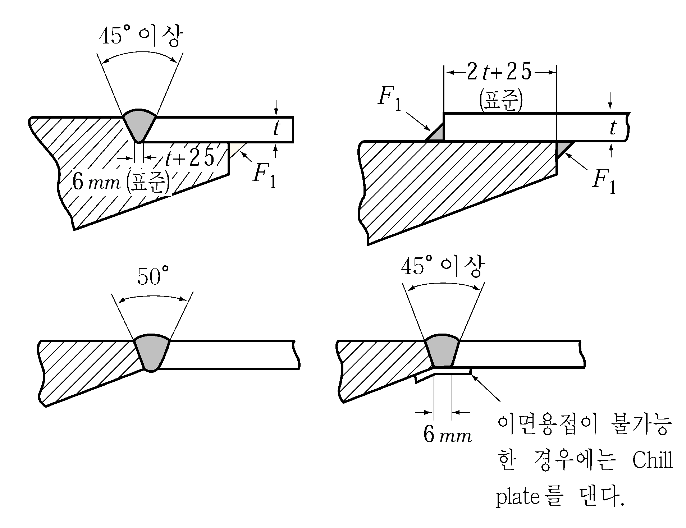
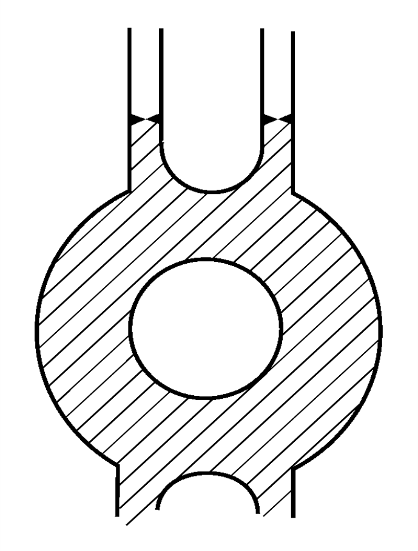
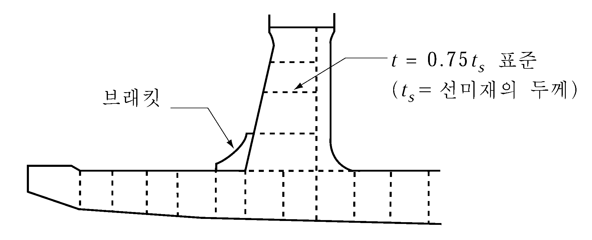
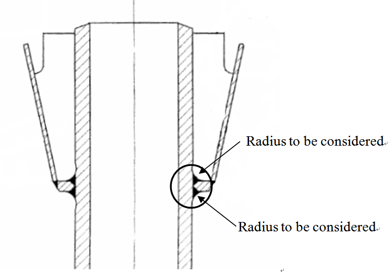

# 제3편 선체구조

> 선급 및 강선규칙/적용지침 / RA-03-K / 2025 / KO / Guidance

## 제 2 장 선수재 및 선미재

### 제 1 절 선수재

#### 101. 강판선수재 【규칙 참조】

- **1.** 강판선수재의 두께는 상갑판 부근에서는 선수부의 선측 외판의 두께로 하고 선수루 부근에서는 선수루 부근의 외판두께로 하여도 좋다.
- **2.** 강판선수재 선단의 곡률반경이 큰 부분에 중심선 휨보강재가 없는 경우 또는 선수재의 두께가 **규칙 101.** 의 **1**항에 의한 두께 이하인 경우에는 600 mm 이하의 간격으로 수평리브를 설치하여 강판선수재를 보강할 필요가 있다.

### 제 2 절 선미재

#### 202. 일반 【규칙 참조】

- **1.** **주강선미재의 용접이음**
  - **(1)** 주강선미재를 2개 또는 3개로 분리하여 제작하는 경우의 용접이음의 모양은 **그림 3.2.1**에 의한 것을 원칙으로 한다.
  - **(2)** 주강선미재와 외판과의 고착은 **그림 3.2.2**에 의한 방법에 따른다. 다만, 용접법 승인을 받은 경우에는 그에 따를 수 있다.

    |  **그림 3.2.1 주강선미재의 상호 용접 이음** **그림 3.2.1 주강선미재의 상호 용접 이음** |  **그림 3.2.2 주강선미재와 외판과의 고착** **그림 3.2.2 주강선미재와 외판과의 고착** |
    | --- | --- |

#### 203. 프로펠러포스트 【규칙 참조】

- **1.** **강판선미재의 프로펠러보스와 강판과의 접합**
  강판선미재의 프로펠러보스와 강판과의 접합은 **그림 3.2.3**과 같이 한다.
- **2.** **선미재의 프로펠러보스 길이**
  선미재의 프로펠러보스 길이는 안지름의 1.25배 이상으로 한다. 다만, 보스의 길이가 **규칙 5편 3장 206.**에 규정하는 베어링의 길이에 만족하지 않을 경우는 베어링의 길이와 같게 할 것을 권장한다.
- **3.** **강판선미재의 봉강(round bar)**
  강판선미재의 후단에 봉강을 사용하는 경우에 그 반지름은 **규칙 표 3.2.1**에 규정된 $R$ 의 70 % 이상을 표준으로 한다. 봉강과 주강과의 이음 및 봉강 상호 사이의 이음부에서는 봉강지름의 1/3 이상의 깊이로 개선하여 용접할 필요가 있다. 봉강에 설치하는 리브의 두께는 선미재 두께의 75 %를 표준으로 한다.(**그림 3.2.4** 참조)

  |  **그림 3.2.3 프로펠러 보스와 강의결합** |  **그림 3.2.4** **그림 3.2.4** |
  | --- | --- |

#### 205. 슈피스 【규칙 참조】

- **1.** **슈피스와 프로펠러포스트와의 접합**
  슈피스의 정판은 프로펠러포스트의 후단에서 전방으로 연장하고 프로펠러포스트 후단과의 고착부에는 선미재와 같은 두께의 브래킷을 설치하여 해당 부분의 강도 연속을 충분히 할 필요가 있다.(**그림 3.2.4** 참조)
- **2.** 슈피스에 아연판을 부착하는 경우에는 볼트로 직접고정 시켜서는 아니되며, 볼트를 용접하거나 또는 강판을 용접한 후 이들에 볼트로서 고착시킨다.
- **3.** Built-up 형식의 슈피스는 수밀구조로 하고 유효한 도료를 내면에 도장할 필요가 있다. 다만, 부득이하여 도장을 생략하는 경우에는 판두께를 1.5 mm 이상 증가시킨다.

#### 206. 힐피스 【규칙 참조】

- **1.** **힐피스 길이의 결정방법**
  - **(1)** 강판선미재의 경우 힐피스에 연결되는 평판용골의 두께를 5 mm 정도 증가시킨 경우에는 힐피스의 길이는 그곳의 늑골간격의 2배 이상으로 할 수 있다.
  - **(2)** 힐피스의 길이 $l$ 은 **그림 3.2.5**와 같이 한다.
  - **(3)** 힐피스에 설치하는 리브의 두께는 리브가 설치되는 곳의 두께의 75 %를 표준으로 한다. 
    
    **그림 3.2.5** #eqnID-122**의 측정방법**

#### 207. 러더혼 【규칙 참조】

- **1.** 러더혼과 선체 외판이 접합하는 부분을 곡면으로 연결하는 경우, 굽힘에 대한 러더혼 판의 유효성과 횡방향 웨브의 응력에 특별한 주의가 필요하다.
- **2.** 굽힘모멘트와 전단력은 직접계산법 또는 **지침 4편 1장 401.**의 **6**항 및 **7**항에 따라 결정한다.
- **3.** 러더혼 측면판의 두께는 다음 식에 의한 값 이상이어야 한다.
  $2.4 \sqrt {LK}$ (mm)
  $L$ : **규칙 3편 1장 102.**에 정의된 선박의 길이(m)
  $K$ : **규칙 3편 1장 403.**의 **2**항 또는 **규칙 4편 1장 103.**에 정의된 재료계수
- **4.** **선체구조와의 용접 결합**
  - **(1)** 하중을 적절히 전달하기 위해 러더혼 판은 선측외판 및 횡방향/종방향 거더에 결합하는 등의 방법에 의해 선미구조와 유효하게 연결되어야 한다.
    러더혼 내부에는 브래킷 또는 스트링거가 설치되어야 하고, 이들은 외판과 일직선상에 설치되어야 한다. (**그림 3.2.6** 참조)
    
    **그림 3.2.6 러더혼과 선미구조의 결합**
  - **(2)** 러더혼의 횡방향 웨브는 충분한 수만큼 인접한 갑판까지 선체에 연결되어야 하고 적당한 두께를 가져야 한다.
  - **(3)** 선체와의 충분한 결합을 위하여 러더혼의 횡방향 웨브와 일직선 상에 견고한 늑판을 설치하여야 한다.
  - **(4)** 러더혼은 선미탱크내의 중심선 격벽(제수격벽)과 연결되어야 한다.
  - **(5)** 횡방향 웨브와 선체 외판과의 연결부에는 스캘롭을 설치하여서는 안 된다.
  - **(6)** 러더혼 판과 선측외판은 완전용입용접으로 연결되어야 하며, 용접 곡률반경은 그라인딩 등을 이용하여 가능한 한 크게 하여야 한다.

#### 210. 러더트렁크

이 항의 요건은 트렁크의 형상이 선미재 아래로 연장되며, 타의 작동으로 인하여 트렁크가 응력을 받게 되도록 배치되는 트렁크에 적용된다. *(2021)*

- **1.** **재료, 용접 및 선체와의 결합**
  - **(1)** 러더트렁크에 사용하는 강재는 용접성이 좋고, 레이들 분석(ladle analysis)에서 탄소성분이 0.23 % 를 초과하지 않거나 탄소당량(C_EQ)이 0.41%를 초과하지 않아야 한다. *(2019)*
  - **(2)** 러더트렁크의 판 재료는 **규칙 3편 1장 4절**에 규정된 II 급 이상의 재료를 사용하여야 한다.
  - **(3)** 러더트렁크와 외판, 러더트렁크와 스케그 하부는 완전용입용접으로 연결되어야 한다. 외판 또는 스케그 하부로 연장되는 러더 트렁크의 경우, 용접 곡률반경 $r$ (**그림 3.2.7** 참조)은 가능한 한 커야 하며 다음에 따른다. *(2024)*
    $r = 0.1 d _{ l} /K$
    다만, 다음보다 커야한다.
    $\sigma \geq \frac{40}{K}$ ($\mathrm{N}/mm ^{2}$)인 경우, $r = 60$ (mm)
    $\sigma \prec \frac{40}{K}$ ($\mathrm{N}/mm ^{2}$)인 경우, $r = 30$ (mm)
    $d _{ l}$ : 타두재의 지름으로서 **규칙 4편 1장 502.**에 따른다.
    $\sigma$ : 러더트렁크의 굽힘응력 ($\mathrm{N}/mm ^{2}$)
    $K$ : 러더트렁크의 재료계수로 **207.**의 **3**항에 따른다.
    곡률반경은 그라인딩으로 얻을 수 있다. 디스크 그라인딩을 하는 경우, 그라인딩 자국(score marks)은 용접진행방향을 회피하여야 한다. 곡률반경은 템플릿을 사용하여 정확성을 확인하여야 하며, 적어도 4개의 측면형상에 대하여 확인하고 검사원에게 보고서가 제출되어야 한다.
  - **(4)** 러더트렁크에 강재 이외의 재료를 사용하는 경우에는 우리 선급이 적절하다고 인정하는 바에 따른다.
    
    **그림 3.2.7 용접 곡률반경**
- **2.** **강도**
  - **(1)** 굽힘 및 전단에 의한 등가응력은 0.35$R_eH$ 이하이어야 하고 용접된 러더트렁크의 굽힘응력은 다음에 따른다. *(2021)*
    $\sigma \leq \frac{80}{K}$ (N/mm^2)
    $\sigma _{}$ : **1**항 (4)호에 따른다.
    $K$ : 러더트렁크의 재료계수로 **207.**의 **3**항에 따른다. 다만 0.7 이상으로 한다.
    $R_eH$ : 사용된 재료의 지정된 최소항복응력(N/mm^2)
  - **(2)** 굽힘응력의 계산에서 고려되는 스팬은 하부타두재 베어링의 중간높이에서 트렁크가 외판 또는 스케그 하단에 고착되는 지점까지의 거리로 한다.

#### 211. 프로펠러 샤프트 브래킷 (2011)

- **1.** 일반
  - **(1)** 다음 요건은 프로펠러 테일 샤프트 보스를 지지하며, 두 개의 스트럿으로 이루어진 프로렐러 샤프트 브래킷에 적용된다. 스트럿은 솔리드 또는 용접된 형태의 유형일 수 있다.
  - **(2)** 스트럿 사이의 각도가 50도 보다 작아서는 아니된다.
- **2.** 배치
  - **(1)** 솔리드 스트럿은 외판을 통과하여 연속이여야 하며, 선박 내부구조에 의해 만족스럽게 지지되어야 한다.
  - **(2)** 용접된 형태의 스트럿은 외판에 용접될 수 있다. 스트러트가 용접된 외판은 보강되어야 하고, 스트럿과 일직선으로 내부 브래킷이 설치되어야 한다. 스트럿이 중심선이 있는 중앙 외판에 설치되는 경우, 스트럿은 외판을 통과하여 연속적이어야 한다. 스트럿은 선체와 만날 때 앞뒤 끝이 둥글게 하여야 한다.
  - **(3)** 프로펠러 샤프트 보스는 스트러트 연결부에 전방 및 후방에 둥근 브래킷이 있어야 한다.
- **3.** 스트럿
  - **(1)** 솔리드 또는 용접된 형태의 프로펠러 샤프트 브래킷 스트러트은 다음의 요건을 따라야 한다.
    $h \geq 0.4 d$
    $A \geq 0.4 d ^{2}$
    $W \geq 0.12 d ^{3}$
    $A$ = 스트럿 단면의 총 면적 (mm^2)
    $W$ = 총 단면계수 (mm^3). $W$ 는 **그림 3.2.8**의 중립축을 기준으로 계산된다.
    $h$ = 단면의 최대 두께 (mm)
    $d$ = 프로펠러 샤프트 지름 (mm)
    $d = \max \left( d _{act} , d _{req} root {3} of {\frac{T+160}{590}} \right)$
    $d _{act}$ = 프로펠러 샤프트 실제 지름 (mm)
    $d _{req}$ = **5편 3장 204.**에 의한 프로펠러축의 지름
    $T$ = 재료의 규격최소인장강도(N/mm^2)로서, 600 N/mm^2를 넘을 경우에는 600 N/mm^2로 한다.
    
    그림 3.2.8 프로펠러 샤프트 브래킷 상세
