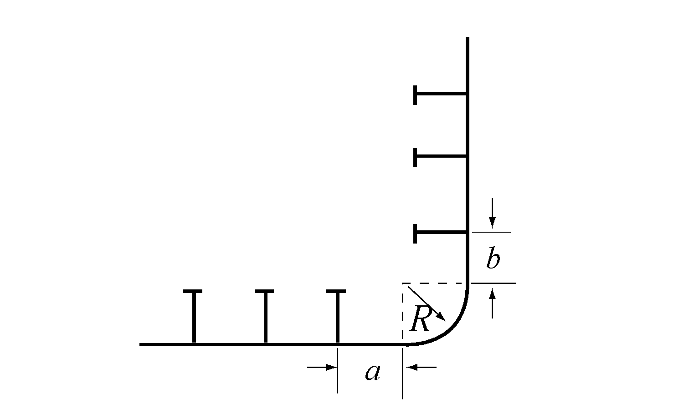
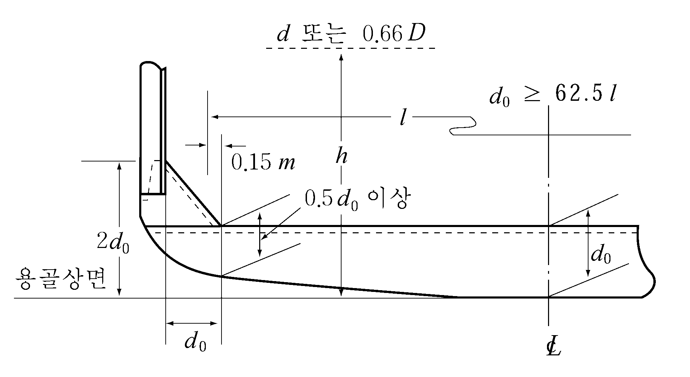

# 제3편 선체구조

> 선급 및 강선규칙/적용지침 / RA-03-K / 2025 / KO / Guidance

## 제 3 장 종강도

### 제 1 절 일반사항

#### 101. 적용 【규칙 참조】

- **1.** **특수한 주요치수비를 갖는 선박의 선체횡단면의 단면계수**
  $L/B \leq 5$ 또는 $B/D_s \geq 2.5$인 선박은 종강도 외에 선박의 강도 전체에 대하여 충분한 고려를 할 필요가 있다.
- **2.** **창구가 큰 선박에 대한 특별고려**
  선박의 중앙부에 있어서 창구의 폭이 0.7$B$ 를 넘는 경우에는 **7편 4장 2절**을 준용하여 굽힘 및 비틀림에 의한 부가적인 응력이나 창구변형에 대하여 특별한 고려를 하여야 한다.
- **3.** **속력이 빠르고 큰 플레어(flare)를 갖는 선박**
  다음에 정한 계수 $K_v$ 및 $K_f$ 에 의하여 다음 (1)호 및 (2)호에 따라 파랑종굽힘모멘트 $M_w$를 증가시킬 필요가 있다.
  $K _{v} = \frac{0.2V}{\sqrt {L}}$, $K_f = \frac{A_d -A_w}{Lh_B}$
  $A_d$ : 선수단으로부터 0.2$L$ 되는 위치보다 전방에 상갑판 및 선수루가 있는 경우에는 그 갑판의 수평면에 대한 투영면적 (m^2)
  $A_w$ : 만재흘수선에 있어서 선수단으로부터 0.2$L$ 되는 위치보다 전방에 있는 수선면의 면적 (m^2)
  $h_B$ : 선수단의 선측에 있어서 만재흘수선으로부터 상갑판 또는 선수루갑판까지의 수직거리 (m)
  - **(1)** $K_v$의 값이 0.28을 넘는 경우, **규칙 그림 3.3.2**의 선박의 길이방향에 따른 분포계수 $C_2$의 값은 **표 3.3.1**에 따른다. 다만, $K_v$의 값 및 선미단으로부터 고려하는 선체횡단면의 위치까지의 거리 $x$가 표의 중간에 있을 때에는 보간법에 의한다.
  - **(2)** ($K_v + K_f$)의 값이 0.4를 넘는 경우, **규칙 그림 3.3.2**의 선박의 길이방향에 따른 분포계수 $C_2$ 의 값은 $M_w$ (-) 상태에 한하여 **표 3.3.2**에 따른다. 다만, ($K_v + K_f$)의 값 및 선미단으로부터 고려하는 선체횡단면의 위치까지의 거리 $x$가 표의 중간에 있을 때에는 보간법에 의한다.

    **표 3.3.1 계수** $C_2$

    | $x$ $K_v$ | 0.65$L$ | 0.75$L$ | 1.0$L$ |
    | --- | --- | --- | --- |
    | 0.28 | 1.0 | 5/7 | 0.0 |
    | 0.32 이상 | 1.0 | 0.80 | 0.0 |

    **표 3.3.2 계수** $C_2$

    | $x$ $K_v + K_f$ | 0.65$L$ | 0.75$L$ | 1.0$L$ |
    | --- | --- | --- | --- |
    | 0.4 | 1.0 | 5/7 | 0.0 |
    | 0.5 이상 | 1.0 | 0.80 | 0.0 |

#### 103. 적하지침서 【규칙 참조】

**1. 규칙 103.**의 **1**항 󰡒우리 선급이 필요없다고 인정하는 선박󰡓이라 함은 어선(fishing vessel) 또는 $L_f$ 가 90 m 미만인 선박으로서 최대 재화중량이 만재배수량의 30 %를 초과하지 않는 선박으로 화물 및 평형수의 적재분포의 변화가능성이 적고 일정한 운항특성을 갖는 선박을 말한다. 다만, 수산업에 관한 시험, 조사, 지도, 단속 또는 교습에 종사하는 선박의 경우 해당 기국의 요건에 따른다. *(2017)*

- **2.** **규칙 103.**에 의하여 우리 선급이 승인한 적하지침서는 **부록 3-1**의 **「적하지침서의 작성 및 검사 지침」**에 따라 선장이 이해할 수 있는 언어로 작성하여야 한다. 만일 그 언어가 영어 이외의 경우에는 영어로 된 번역서를 첨부하여야 한다.
- **3.** 1998년 7월 1일 전 건조계약된 길이 ($L_f$) 150 m 이상이며, 하나 또는 그 이상의 화물창이 선측외판에 의해서만 화물의 경계를 갖는 산적화물선은 승인된 적하지침서에 추가하여 화물의 적재시작부터 만재상태까지의 균일적재, 격창적재 및 부분적재상태에 대하여 화물의 적하/양하에 대한 승인된 지침을 비치하여야 한다. (**부록 3-1, 표 4** 참조) 이 지침에는 다음 사항이 포함되어야 한다.
  - **(1)** 다음의 적하상태를 포함하는 것을 원칙으로 한다.
    - **(가)** 균일적하 만재상태
    - **(나)** 격창적하 만재상태
    - **(다)** 블록적하(block loading) 또는 이항양하(two port unloading)와 같은 부분적하상태
  - **(2)** 특정 항구에서 적용되는 실제의 적하/양하에 대한 지침 또는 특정 항구에 대한 대표적인 지침.
  - **(3)** 화물의 적재에서 만재까지 각 단계의 굽힘모멘트와 전단력.
  - **(4)** (1)의 적하상태에 대한 각 단계의 요약내용에는 다음 사항이 포함되어야 한다.
    - **(가)** 각 단계에서의 각 화물창의 적재량
    - **(나)** 각 단계에서의 각 평형수 탱크의 평형수 배출량
    - **(다)** 각 단계별 정수중 굽힘모멘트 및 전단력
    - **(라)** 각 단계별 트림 및 흘수
  - **(5)** 승인된 적하/양하에 대한 지침은 승인된 적하지침서에 합본하거나 별도의 부록으로 선내에 비치하여야 한다.
  - **(6)** 화물의 적하/양하에 대한 지침의 기재 양식은 **부록 3-1**의 **표 4**를 참고한다.
- **4.** 적하지침서의 비치에 대한 적용은 **표 3.3.3**에 따른다.

#### 104. 종강도 적하지침기기 【규칙 참조】

**1. 규칙 104.**의 **1**항 중󰡒우리 선급이 필요없다고 인정하는 선박󰡓이라 함은 어선(fishing vessel) 또는 화물 및 평형수의 적재분포의 변화가능성이 적고 일정한 운항특성을 갖는 선박으로서 적하지침서가 충분한 적하지침을 줄 수 있는 선박을 말한다. 다만, 수산업에 관한 시험, 조사, 지도, 단속 또는 교습에 종사하는 선박의 경우 해당 기국의 요건에 따른다. *(2017)*

- **2.** 1998년 7월 1일 전 건조계약된 길이 150 m 이상의 산적화물선, 광석운반선 및 겸용선은 1999년 1월 1일 또는 인도일중 늦은 시점까지 우리 선급의 요건을 만족하는 종강도 적하지침기기를 비치하여야 한다.
- **3.** 종강도 적하지침기기의 비치에 대한 적용은 **표 3.3.3**에 따른다.
- **4.** 1998년 7월 1일 이후 건조계약 되는 길이 150 m 이상의 산적화물선, 광석운반선 및 겸용선의 종강도 적하지침기기는 다음 사항을 확인할 수 있어야 한다.
  - **(1)** 각 화물창의 중앙부에서의 흘수에 대한 함수로서 허용 최대 및 최소 화물창 및 이중저의 적재중량.
  - **(2)** 2개의 인접한 화물창의 중앙부에서의 흘수에 대한 함수로서 허용 최대 및 최소 화물창 및 이중저의 적재중량. 다만, 이 경우의 흘수는 두 화물창의 중앙부에서의 평균흘수로 한다.
  - **(3)** **규칙 7편 3장 10절**에 따른 각 화물창의 침수시의 정수중 굽힘모멘트 및 전단력.
    **5. 규칙 104.**의 **2**항 중 “우리 선급의 승인”이라 함은 다음 각 호를 말한다.
  - **(1)** 종강도 적하지침기기 소프트웨어는 설계승인을 받도록 권장한다. 설계승인과 관계없이, 선박에 설치되는 종강도 적하지침기기의 소프트웨어는 대표적인 운항상태에 대한 계산결과(시험성적서)를 제출하여 승인받아야 하며, 본선에 설치되는 소프트웨어는 승인된 시험성적서에 따라 우리 선급의 승인을 받아야 한다.
  - **(2)** 하드웨어는 형식승인된 기기가 설치되는 경우에는 1대, 형식승인된 기기가 아닌 경우에는 2대를 설치하여야 한다.

    **표 3.3.3 적하지침서 및 종강도 적하지침기기 비치대상선박 (2018)**

    | 선박의 종류 적용구분 |   | 분류 1-1 |   | 분류 1-2 |   | 분류 1-3 |   | 분류 2 |   |
    | --- | --- | --- | --- | --- | --- | --- | --- | --- | --- |
    | 선박의 종류 적용구분 |   | 적하지침서 | 종강도 적하지침 기기 | 적하지침서 | 종강도 적하지침 기기 | 적하지침서 | 종강도 적하지침기기 | 적하지침서 | 종강도 적하지침기기 |
    | ① | 1992년 11월1일 이전 제조중(후) 검사신청 선박 | $L_f \geq 100$m | 비대상 | *L_f*≥100 m | 비대상^(다) | $L_f \geq 100$m | 비대상 | 비대상 | 비대상 |
    | ② | 1992년 11월1일 이후 제조중(후) 검사신청 선박 | $L_f \geq 100$m | 비대상 | *L_f*≥100 m | 비대상^(다) | $L_f \geq 65$m^(라) | 비대상 | 비대상 | 비대상 |
    | ③ | 1993년 5월1일 이후 제조중(후) 검사신청 선박 | $L_f \geq 100$m | $L_f \geq 100$ m | $L_f$≥100 m | $L_f \geq 120$m | $L_f \geq 65$m^(라) | $L_f \geq 65$m ^(라) | 비대상 | 비대상 |
    | ④ | 1998년 7월1일 이후 건조 계약되는 선박 | $L_f \geq 65$m | $L_f \geq 100$m | $L_f \geq 65$m | $L_f \geq 100$m^(가) | $L_f \geq 65$m | $L_f \geq 100$m | $L_f \geq 65$m ^(나) | 비대상 |
    | (비고) 1. 연해구역 이하를 항해구역으로 하는 모든 선박은 적하지침서 및 종강도 적하지침기기를 설치하지 않아도 된다. 2. 선박의 분류 (1) 분류 1-1 : 갑판에 큰 개구가 있고 수직 및 수평방향의 선체굽힘모멘트와 비틀림모멘트에 의한 조합응력을 고려할 필요가 있는 선박 (2) 분류 1-2 : 화물 및 평형수의 적재분포가 불균일한 선박 (3) 분류 1-3 : 케미컬 탱커 및 액화가스 산적운반선 (4) 분류 2 : 화물 및 평형수 적재분포의 변화가능성이 적고 일정한 적하상태를 갖는 선박으로서 다음과 같은 선박을 말한다. (가) 만재흘수선을 표시하지 않는 선박 (나) 화물을 적재하지 않는 선박 (다) 화차운송선 (라) 화물의 적재가 일정한 선박 3. 적용구분 “①②③④”는 제조중등록선인 경우 검사신청일, 제조후등록선은 건조일을 기준으로 적용한다. 4. ^(가) : 선박의 길이 ($L_f$)가 120 m 미만인 선박으로서 화물 및 평형수의 불균일한 적재분포가 설계에 반영된 선박은 분류 2 선박으로 분류되며 종강도 적하지침기기의 설치가 면제된다. 5. ^(나) : 선박의 길이 ($L_f$)가 90 m 미만인 분류 2 선박으로 재화중량(DWT)이 만재배수량의 30 % 이하인 선박은 적하지침서도 면제된다. 6. ^(다) : 길이 150 m 이상인 모든 산적화물선, 광석운반선 및 겸용선은 1999년 1월 1일까지 종강도 적하지침기기를 설치하여야 한다. 7. ^(라) : 길이($L_f$)가 100 m 미만인 선박으로서, 우리 선급이 필요성이 없다고 인정하는 선박에 대하여는 예외로 한다. 8. 종강도 적하지침기기 비치 비대상 선박에 종강도 적하지침기기가 비치된 경우에는 대상선박과 동일하게 취급한다. |   |   |   |   |   |   |   |   |   |

### 제 2 절 굽힘강도

#### 201. 선박의 중앙부의 굽힘강도 【규칙 참조】

- **1.** **정수중 종굽힘모멘트**
  정수중 종굽힘모멘트의 계산은 다음에 의한다.
  - **(1)** **규칙 표 3.3.1**에 정하는 정수중 종굽힘 모멘트 $M_s$ 를 계산하는 경우, 그 계산법에 필요한 자료를 제출하여 미리 우리 선급의 승인을 득할 필요가 있다.
  - **(2)** 제조중 등록검사를 받는 선박에 대하여는 실제의 적하계획에 있어서 정수중의 종강도 계산서 및 그 계산에 필요한 제반자료를 우리 선급에 제출할 필요가 있다.
  - **(3)** 등록검사에는 선박의 완성시에 각종의 적하상태에 대하여 정수중 종강도 계산을 하고 이들의 계산에 필요한 제반자료 및 계산결과를 **규칙 103.**의 적하지침서에 기재할 필요가 있다.

#### 202. 선박중앙부 이외의 굽힘강도 【규칙 참조】

다음의 (1)호 또는 (2)호에 해당되는 선박의 경우, **규칙 표 3.3.1**에 정하는 파랑 종굽힘 모멘트 $M_w$ 식의 계수 $C_2$는 **규칙 그림 3.3.2** 중의 점선의 값을 사용 동규칙을 준용한다.

#### 203. 선체 횡단면계수의 계산 【규칙 참조】

- **1.** **선체 횡단면계수의 계산단위**
  단면계수 $Z$(cm^3)의 유효숫자는 5자리수로 한다.
- **2.** **종강도 산입부재**
  종강도 산입부재의 산입률은 다음과 같다.
  - **(1)** 단절판을 그 필릿용접이 **규칙 1장 표 3.1.7**의 비고 1에 의한 경우에는 100 %를 산입한다.
  - **(2)** 이중판은 그 단면적을 신조선인 경우에는 100 %, 개조선인 경우에는 90 %를 산입.
  - **(3)** 선측 스트링거는 늑골의 슬롯 부분을 공제한다.
  - **(4)** 스캘럽은 다음의 조건을 만족하는 경우에는 단면적에서 공제할 필요는 없다. (**그림 3.3.1** 참조)
    
    **그림 3.3.1 스켈럽의** #eqnID-216 **및** #eqnID-217
    - **(가)** $d_s$가 $a_y$ 이하이고 7$t$ 이하, 다만 최대 75 mm
    - **(나)** $S$ 가 5$b$ 이상이고 10$d_s$ 이상.
  - **(5)** 종늑골 또는 종거더에 있는 경감구멍 및 배수구멍은 그 높이가 웨브깊이의 25 %를 초과하지 않을 경우에는 단면적에서 공제할 필요가 없다.
  - **(6)** 2열 또는 3열의 창구를 갖는 선박의 창구사이 종통갑판의 단면적 산입률은 **표 3.3.4**와 같이 한다.
  - **(7)** 갑판에 설치하는 작은 개구의 배치 등을 고려하여 종통부재를 연속시키지 않는 경우에도, 인접하는 부재로 단면적을 보충하면 연속하지 않는 부재를 종통부재에 산입하여도 좋다.
  - **(8)** 자동차 운반선의 차량갑판중 겹이음으로서 단속용접에 의하여 접합되어 있는 것은 산입하지 않는다.

    **표 3.3.4 단면적 산입률**

    | 화물창수 $l/L$ $\xi$ | 2 |   |   | 3 이상 |   |   |
    | --- | --- | --- | --- | --- | --- | --- |
    | 화물창수 $l/L$ $\xi$ | 0.10 | 0.20 | 0.30 | 0.10 | 0.15 | 0.20 |
    | 0.0 | 0.96 | 0.85 | 0.70 | 0.96 | 0.91 | 0.85 |
    | 0.5 | 0.65 | 0.57 | 0.48 | 0.89 | 0.80 | 0.69 |
    | 1.0 | 0.48 | 0.43 | 0.36 | 0.83 | 0.73 | 0.62 |
    | 2.0 | 0.32 | 0.29 | 0.25 | 0.73 | 0.63 | 0.53 |
    | 3.0 | 0.24 | 0.22 | 0.18 | 0.65 | 0.57 | 0.47 |
    | 4.0 | 0.19 | 0.17 | 0.14 | 0.59 | 0.51 | 0.43 |
    | 5.0 | 0.16 | 0.14 | 0.12 | 0.53 | 0.47 | 0.39 |
    | (비고) 1. $\xi$는 다음 식에 따른다. $\xi = \frac{ab ^{3}}{lI _{c}} \left\{ \frac{1+2 \mu}{6(2+ \mu )} \times 10 ^{4} +2.6 \frac{I _{c}}{a _{c} b ^{2}} \right\}$ $I_c$ : 창구단 코밍을 포함한 창구사이 갑판의 단면2차모멘트 (cm^4) $a_c$ : 창구사이 갑판의 유효전단면적 (cm^2) $a$ : 창구사이 종통갑판의 단면적 (한쪽 현) (cm^2) $l$ : 창구의 길이 (m) $\mu$ 및 $b$ : **그림 3.3.2**에 따른다. (m) 2. $\xi$ 또는 $l/L$이 표의 중간에 있을 때에는 보간법에 의한다. 3. $\xi$ 값이 5.0을 넘을 때에는 외삽법에 의한다. |   |   |   |   |   |   |

    
    **그림 3.3.2** #eqnID-237 **및** #eqnID-238
- **3.** **강력갑판에 있는 개구의 취급**
  강력갑판의 창구측선밖에 있는 개구의 취급은 다음에 따른다.
  - **(1)** 개구의 모양 및 크기가 **표 3.3.5**에 만족하지 않을 경우에는 링이나 두께를 증가하는 등의 보강을 한다. (**그림 3.3.3** 및 **3.3.4** 참조)
  - **(2)** 개구의 간격이 **그림 3.3.5**를 만족하지 않을 경우에는 (1)호에 따라 보강을 한다.

    **표 3.3.5 개 구**

    |   | 타원형 | 원형 |
    | --- | --- | --- |
    | 유조선 | $\frac{a}{b} \leq \frac{1}{2} , a \leq 0.06 B$ (최대 900 mm) | $a \leq 0.03B$ (최대 450 mm) |
    | 화물선 | $\frac{a}{b} \leq \frac{1}{2} , a \leq 0.03 B(B-b_H )$ (최대 450 mm) | $a \leq 0.015(B-b _{H} )$ (최대 200 mm) |

    
    **그림 3.3.3 타원형과 원형 개구가 동일단면상에 있는 경우** 
    **그림 3.3.4 링에 의한 보강**
    
    **그림 3.3.5 개구의 간격**

### 제 3 절 전단강도

#### 301. 유효 종격벽이 없는 선박의 선측외판의 두께 【규칙 참조】

- **1.** **빌지호퍼탱크 또는 톱사이드탱크를 갖는 선박**
  빌지호퍼탱크 또는 톱사이드탱크의 경사판이 선측외판에 결합되어 전단력의 일부를 유효하게 분담한다고 인정되는 경우에는 고려하는 선체횡단면에 있어서의 전단흐름을 직접계산하여 빌지호퍼탱크 또는 톱사이드탱크의 일부를 구성하는 선측외판의 두께를 정할 수 있다. 다만, 이와같이 직접계산으로 판두께를 정할때에는 (1)호에 표시하는 전단력을 선체횡단면에 작용시켜 빌지호퍼탱크 또는 톱사이드탱크의 일부를 구성하는 선측외판 및 경사판에 발생하는 전단응력을 구하며 이들의 값이 (2)호에서 정한 허용응력 이하가 되도록 할 필요가 있다.
  - **(1)** 선체횡단면에 작용하는 전단력 $F$ 는 다음 두 식에 의한 값중 큰 것으로 한다.
    $F= \left| F _{s} +F _{w} (+)- \Delta F _{c} \right|$(kN) , $F= \left| F _{s} +F _{w} (-)- \Delta F _{c} \right|$(kN)
    $F _{s}$, $F _{w}(+)$ 및 $F _{w}(-)$ : 각각 **규칙 301.1**에 규정하는 정수중 전단력 및 파랑전단력 (kN)
    $\Delta F _{c}$ : **2**항의 규정에 따른다.
  - **(2)** 빌지호퍼탱크 또는 톱사이드탱크 내의 선측외판 및 경사판의 허용응력
    90$/K$ (N/mm^2)
- **2.** **격창적하 등을 하는 경우의 정수중 전단력의 수정**
  횡격벽의 전후에서 적하창 (또는 평형수창)과 공창이 인접하는 경우, 고려하는 선체횡단면에 있어서의 정수중 전단력은 다음의 $F _{c}$ 로 하여도 좋다.
  $F _{c} =F _{s} - \Delta F _{c}$(kN)
  $F _{s}$ : **규칙 301.1**에 규정하는 정수중 전단력 (kN)
  $\Delta F _{c}$ : 고려하는 선체횡단면과 그 선체횡단면을 포함하는 화물창의 전후단과의 거리에 따라서 정해지는 값 (kN)으로서 다음과 같다.
  - **(1)** 화물창의 후단 : $-C(F _{SF} -F _{SA} -F _{T} )$
  - **(2)** 화물창의 전단 : $C(F _{SF} -F _{SA} -F _{T} )$
  - **(3)** 화물창내 : 고려하는 선체횡단면과 이를 포함하는 화물창의 전후단과의 거리에 따라서 상기의 (1)과 (2)의 값으로부터 보간법에 의하여 구한 값.
    $F_SF$, $F_SA$ : 각각 고려하는 적하상태에서 화물창의 전단 및 후단의 횡격벽위치에서의 정수중 전단력 ($F_S$)으로서 **규칙 301.**에 의한 계산법을 이용하여 계산된 값. (kN)
    $F_T$ : 톱사이드 탱크의 평형수 중량 (kN)으로서 고려하는 선체횡단면을 포함하는 화물창의 범위에 포함된 것.
    $C$ : **규칙 7편 3장 301.**의 **4**항에 의한 $k$ 및 $B/l_h$ 의 값에 따른 계수로서 **표 3.3.6**에 따른다. $k$ 의 값이 표의 중간일 때에는 보간법에 의한다.
- **3.** $Q /I$**의 약산식**
  **규칙 301.**에 규정하는 $Q$ 와 $I$ 의 비 $Q /I$ 는 $1/(90 D_s )$로 할 수 있다.

#### 302. 1열 내지 4열 종격벽을 갖는 선박의 선측외판 및 종격벽판의 두께 【규칙 참조】

이중선체 선박으로서 빌지호퍼탱크를 갖는 선박에 대하여는 **규칙 표 3.3.2** 중 $\alpha_2$ 및 $R$ 를 **표 3.3.7**에 의한 값으로 한다. 다만, 선측외판 및 빌지호퍼 경사판의 두께는 규칙에 의한 것의 1.2배 이상이어야 한다.

### 제 4 절 좌굴강도

#### 401. 적용 【규칙 참조】

선체중앙부에 있어, 횡식구조의 강력갑판과 선저외판 및 강력갑판이 횡식구조로 된 경우의 횡식구조 선측외판에는 다음의 식을 만족하는 정도의 간격으로 종방향의 칼링(100#eqnID-30910_s2 FB를 표준으로 한다)을 설치하여야 한다. 다만 우리 선급의 승인을 얻은 경우에는 다음의 규정을 따르지 않아도 된다.

#### 403. 탄성좌굴응력 【규칙 참조】

- **1.** 개구를 가진 판의 좌굴응력을 검사할 때는, **규칙 404.** 임계좌굴응력의 산정을 위해 $\sigma _{E}$ 또는 $\tau _{E}$ 대신 다음의 식으로부터 얻어진 탄성좌굴응력 $\sigma _{E} '$ 또는 $\tau _{E} '$를 사용한다.
  $\sigma _{E} ' = \gamma \sigma _{E}$ (N/mm^2)
  $\tau _{E} ' = \gamma \tau _{E}$ (N/mm^2)
  $\gamma$ : 개구로 인한 경감계수, 다음의 식으로 주어진다. 개구가 적절히 보강되어 있을 경우는 1.0으로 한다.
  $\gamma = \frac{1}{"{"1 + \phi / (2S)"} " ^{2}}$
  $\phi$ : 개구의 장축의 길이
  $S$ : 개구의 장축 방향의 패널의 변 길이
- **2.** 종늑골의 탄성좌굴응력의 계산은 다음에 따른다.
  - **(1)** 비틀림이 없는 기둥의 좌굴
    기둥좌굴모드에 대한 이상적인 탄성기둥 좌굴응력 $\sigma_E$ (N/mm^2)은 다음 식에 의한다.
    $\sigma_E = 0.001E \frac{I_a}{Al^2}$ (N/mm^2)
    $I_a$ 및 $A$ : 각각 종늑골의 이차 모멘트 (cm^4) 및 단면적 (cm^2) 으로서 판의 플랜지를 포함하며, 플랜지너비는 **규칙 1장 602.**의 규정에 따른다.
    $l$ : 종늑골의 길이 (m)
  - **(2)** 비틀림이 있는 기둥의 좌굴
    비틀림 좌굴모드에 대한 이상적인 탄성 비틀림 좌굴응력 $\sigma_E$(N/mm^2)은 다음 식에 의한다.
    $\sigma _{E} = \frac{\pi ^{2} EI _{w}}{10 ^{4} I _{p} l ^{2}} \left( m ^{2} + \frac{K}{m ^{2}} \right) +0.385E \frac{I _{t}}{I _{p}}$ (N/mm^2)
    $k$ : 계수로서 다음 식에 따른다.
    $k= \frac{C l^4}{\pi^4 EI_w} \times 10^6$
    $m$ : $k$ 값에 따른 좌굴모드의 반 파장수로서 **표 3.3.8**에 따른다.
    $I_t$ : 단면의 산․부난(st. venant) 이차 모멘트(cm^4)로서 **표 3.3.9**에 의한다. 다만, 평판의 플랜지는 고려하지 않는다.
    $I_p$ : 평판과의 연결점에 대한 단면 극 이차모멘트 (polar moment of inertia) (cm^4)로서 **표 3.3.9**에 의한다. 다만, 평판의 플랜지는 고려하지 않는다.
    $I_w$ : 평판과의 연결점에 대한 단면의 섹터 이차모멘트 (sectorial moment of inertia) (cm^6)로서 **표 3.3.9**에 의한다.
    $l$ : 휨보강재의 길이 (m)
    $S$ : 휨보강재의 간격 (m)
    $C$ : 평판 패널을 지지하는 휨보강재의 스프링 강성계수로서 다음 식에 따른다.
    $C= \frac{k _{p} E t _{p} ^{3}}{3S \left( 1+ \frac{1.33k _{p} h _{w} t _{p} ^{3}}{1000S t _{w} ^{3}} \right)} \times 10 ^{-3}$
    $k_p$ : 계수로서 다음 식에 따른다. 다만, 0보다 작아서는 아니되며, 플랜지 보강 형강류에 대해서는 $k_p$ 를 0.1 이하로 할 필요는 없다.
    $k_p = 1 - \frac{\sigma_act}{\sigma_E}$
    $\sigma_act$ : 종늑골에 작용하는 압축작용응력으로 **규칙 402.**의 **1**항에 의한 값으로 한다.
    $\sigma_E$ : 지지하는 평판의 탄성좌굴응력으로 **1**항 (1)호에 의한 값으로 한다.
    $t_p$ : **규칙 표 3.3.3**에 따른 공제값을 제외한 평판의 두께 (mm)

    **표 3.3.8 좌굴모드의 반파장수** $m$

    |   | 0 ＜ $k$ ≤ 4 | 4 ＜ $k$ ≤ 36 | 36 ＜ $k$ ≤ 144 | $(m-1)^2 m^2 < k \leq m^2 (m+1)^2$ |
    | --- | --- | --- | --- | --- |
    | $m$ | 1 | 2 | 3 | $m$ |

    **표 3.3.9** $I_t$**,** $I_p$ **및** $I_w$

    | 단면형상 |   | $I_t$ (cm^4) | $I_p$ (cm^4) | $I_w$ (cm^6) |
    | --- | --- | --- | --- | --- |
    | 평강 |   | $\frac{h_w t_w ^3}{3} \times 10^-4$ | $\frac{h_w^3 t_w}{3} \times 10^-4$ | $\frac{h _{w} ^{3} t _{w} ^{3}}{36} \times 10 ^{-6}$ |
    | 형강 | T 형강 | $\frac{1}{3} \left({h_w t_w^3 + b_f t_f^3 \left(1 - 0.63\frac{t_f}{b_f}\right)}\right)$ $\times 10 ^{-4}$ | $\left({\frac{h_w^3 t_w}{3} + h_w^2 b_f t_f}\right) \times 10^-4$ | $\frac{t _{f} b _{f} ^{3} h _{w} ^{2}}{12} \times 10 ^{-6}$ |
    | 형강 | L 형강 구평강 | $\frac{1}{3} \left({h_w t_w^3 + b_f t_f^3 \left(1 - 0.63\frac{t_f}{b_f}\right)}\right)$ $\times 10 ^{-4}$ | $\left({\frac{h_w^3 t_w}{3} + h_w^2 b_f t_f}\right) \times 10^-4$ | $\frac{b _{f} ^{3} h _{w} ^{2}}{12(b _{f} +h _{w} ) ^{2}} \left[ t _{f} (b _{f} ^{2} +2b _{f} h _{w} +4h _{w} ^{2} ) \right.$ $\left. +3t _{w} b _{f} h _{w} \right] \times 10 ^{-6}$ |
    | (비고) $h_w$ : 웨브의 높이 (mm) $t _{w}$ : **규칙 표 3.3.3**에 따른 공제값을 제외한 웨브의 두께 (mm) $b _{f}$ : 플랜지 너비 (mm) $t _{f}$ : **규칙 표 3.3.3**에 따른 공제값을 제외한 플랜지의 두께 (mm)로서 구평강의 경우에는 벌브(bulb)의 평균두께로한다. |   |   |   |   |
  - **(3)** 웨브와 플랜지의 좌굴
    $\sigma _{E} =3.8E \left( \frac{t _{w}}{h _{w}} \right) ^{2}$ (N/mm^2)
    - **(가)** 종늑골의 웨브에 대한 이상적인 탄성 좌굴응력은 다음 식에 따른다.
    - **(나)** 종늑골의 플랜지의 너비 $b_f$ 와 플랜지의 건조 두께 $t_f$ 의 비는 15 이하이어야 한다. 다만, $b_f$ 는 T형 단면에 대하여는 플랜지의 반너비, L형 단면에 대하여는 플랜지의 너비 (mm)로 한다. *(2018)* 
