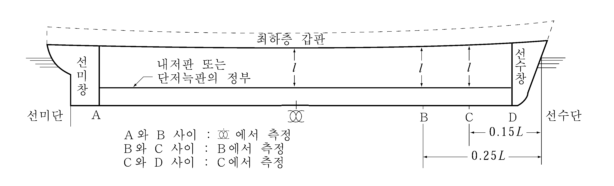
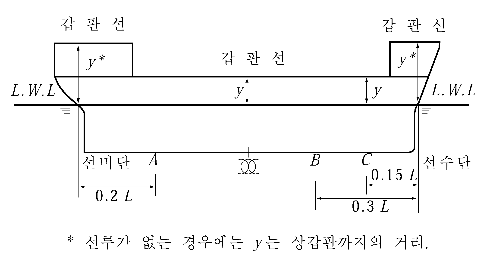
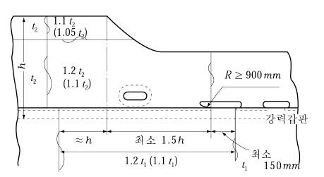

# 제3편 선체구조

> 선급 및 강선규칙/적용지침 / RA-03-K / 2025 / KO / Guidance

## 제 4 장 평판용골 및 외판

### 제 1 절 일반사항

#### 102. 접촉에 대한 고려 (2020) 【규칙 참조】

어선의 용도에 따라 어구의 접촉으로 인하여 외판이 손상될 기회가 많다고 인정되는 경우에는 외판의 두께를 특별히 고려하여야 한다. 그러나 방현재 등의 적절한 부가물로 외판이 보호되는 경우, **규칙** 및 **지침 102.**는 적용하지 않을 수 있다.

#### 103. 건현이 특히 큰 선박에 대한 고려 【규칙 참조】

만재흘수선에서 강력갑판까지의 높이가 특히 큰 선박의 경우 선루측부의 외판 및 **1장 203.**의 **2**항 (1)호에 규정하는 가상건현갑판으로부터 강력갑판까지의 선측외판(이하 **선루측부 외판**이라 한다)의 두께는 다음에 따른다. 다만 건현갑판보다 상방의 외판은 **규칙 301.**의 규정을 적용할 필요는 없다.

### 제 3 절 강력갑판하의 외판

#### 301. 최소두께 【규칙 참조】

멤브레인 형식 액화천연가스 운반선의 외판의 최소두께 $t$ 는 다음 식에 의한 것 이상이어야 한다.

#### 303. 현측후판 【규칙 참조】

- **1.** **현측후판에 대한 주의사항**
  - **(1)** 현측후판의 상단은 적절히 가공한다.
  - **(2)** 현측후판과 불워크와는 중앙부 0.6$L$ 사이에서 용접하여서는 아니 된다. 또한 현측외판의 상단에는 선수미부를 제외하고는 아이 플레이트 등의 의장품을 용접하여서는 아니 된다.
  - **(3)** 둥근 거널부의 굽힘 가공된 곳의 외면에 의장품, Gutter bar 단부 등을 용접할 경우에는 특별히 고려할 필요가 있다.
  - **(4)** 현측후판과 갑판 스트링거판의 T형 용접결합부는 최소한 중앙부 0.6$L$ 간은 **그림 3.4.1**을 표준으로 한다. 다만, 갑판 스트링거판의 두께가 13 mm 미만인 경우에는 F1 필릿용접으로 하여도 좋다.
    
    **그림 3.4.1 현측후판과 갑판스트링거판 결합부의 용접상세**

#### 305. 만곡부의 외판 【규칙 참조】

- **1.** 선박의 중앙부에 있어서 만곡부의 종늑골을 생략하는 경우 만곡부의 끝점과 그 끝점에서 가장 가까운 만곡부 외측의 종늑골과의 거리는 종늑골 간격의 1/2 이내로 한다.
- **2.** 선박의 중앙부에 있어서 만곡부외판의 두께를 규칙 **305.**의 **1**항의 식에 따라 정하는 경우에는 다음의 관계를 만족시킬 필요가 있다.
  $\frac{1000R}{t} \geq 2 \left({\frac{l}{R} }\right)^2$
  $R$ : 만곡부의 반지름 (m)
  $l$ : 실체늑판, 선저 트랜스버스 또는 만곡부 브래킷의 간격 (m)
  $t$ : 만곡부외판의 두께 (mm)
- **3.** 선박 중앙부에 있어서 만곡부 외판의 Bilge circle에서의 요철의 크기는 만곡부외판의 두께의 1/3 이 되도록 공작에 유의할 필요가 있다.
- **4.** 선박 중앙부에 있어서 빌지 킬은 다음에 따른다. *(2019)*
  - **(1)** 재료
    그라운드 바와 빌지 킬의 재료는 설치된 외판과 같은 항복 응력을 가진 것이어야 한다. 또한, 빌지 킬의 길이가 0.15L 이상일 경우에는 그라운드 바와 빌지 킬의 재료는 외판과 동일한 등급(grade)이어야 한다.
  - **(2)** 설계
    단일 웨브 빌지 킬의 설계는 그라운드 바가 손상되기 전에 웨브의 손상이 발생하도록 설계되어야 한다. 이것은 빌지 킬 웨브의 두께가 그라운드 바의 두께보다 두껍지 아니하도록 하는 것이다. **그림 3.4.2**와 다른 설계의 빌지 킬은 우리선급이 적절하다고 인정하는 바에 따른다.
  - **(3)** 그라운드 바
    빌지 킬은 외판에 직접 용접하여서는 아니 된다. 그라운드 바나 덧댐판은 **그림 3.4.2와 그림 3.4.3**에서와 같이 선측 외판에 설치되어야 한다. 일반적으로 그라운드 바는 연속되어야 한다.
    그라운드 바의 총 두께는 만곡부 외판의 총 두께 또는 14mm 중 작은 것 이상이어야 한다.
    
    **그림 3.4.2 빌지킬 구조**
  - **(4)** 끝단 상세
    빌지 킬과 그라운드 바의 끝단은 테이퍼 시키거나 둥글게 하여야 한다. 테이퍼는 최소 3:1의 비율로 점진적이어야 한다(**그림 3.4.3**의 (a), (b), (d) 및 (e) 참조). 둥근 끝단은 **그림 3.4.3**의 (c)에 따른다. ‘A’구역 내에서 빌지 킬 웨브의 개구는 허용되지 아니 한다(**그림 3.4.3**의 (b) 및 (e) 참조).
    빌지 킬 웨브의 끝단은 그라운드 바의 끝단으로부터 50 mm 미만이거나 100 mm를 초과하여서는 아니 된다(**그림 3.4.3**의 (a) 및 (d) 참조). 빌지 킬과 그라운드 바의 끝단부는 선체 내부의 횡방향 부재 또는 종방향 부재에 의하여 다음과 같이 지지되어야 한다.
    우리 선급이 인정하는 경우 동등한 끝단 상세는 인정될 수 있다.
    - **(가)** 횡방향 지지부재는 빌지 킬 웨브의 끝단과 그라운드 바의 끝단 간의 중간지점에 설치되어야 한다.(**그림 3.4.3**의 (a), (b) 및 (c) 참조)
    - **(나)** 종방향 보강재는 빌지 킬 웨브와 일렬로 설치되어야 하며 최소한 ‘A’구역 전후방의 가장 가까운 횡방향 부재까지 연장되어야한다.(**그림 3.4.3**의 (b) 및 (e) 참조)

### 제 4 절 외판에 대한 특별규정

#### 401. 플레어(flare)가 큰 곳 (2019) 【규칙 참조】

- **1.** 플레어가 큰 선박의 경우($K_v + K_f$가 0.4를 넘는 선박), 0.2 $L$ 선수부 만재흘수선 상부의 플레어가 특히 큰 부위의 외판 두께(t)는 다음 식에 의한 것 이상이어야 한다. *(2020)*
  $t = S \sqrt {\frac{\psi P}{\sigma _{y}} \times 10 ^{3} }$ (mm)
  $S$ : 늑골 간격과 외판을 따라서 측정한 거더 또는 종방향 외판 보강재의 간격 중 작은 값 (m)
  $\sigma _{y}$ : 재료의 항복응력 (N/mm^2)
  $\psi$ : 다음 식에 의한다.
  $\psi = \frac{3 \eta ^{2} - 2 \sqrt {1 + 3 \eta ^{2}} + 2}{12 \eta ^{2}}$
  $\eta$ : 늑골 간격과 외판을 따라서 측정한 거더 또는 종방향 외판 보강재의 간격 중 큰 값(m)을 $S$로 나눈 값
  $P$ : **8장 108.**에 명시된 슬래밍 충격압력 (kPa)
- **2.** $L$ 및 $C _{b}$ 가 각각 250 m 및 0.8 이상인 선박의 경우, **규칙 13편 1부 10장 1절 3.3**을 적용하여야 한다.

#### 402. 외판휨보강재가 늑골간격과 다른 경우 【규칙 참조】

외판의 휨보강재 간격이 늑골간격에 비하여 현저하게 다른 경우의 외판두께는 늑골간격 대신에 휨보강재 간격 ($S$)으로 계산할 수 있다. (**그림 3.4.4** 참조) *(2019)*

#### 404. 선수선저부 외판 【규칙 참조】

$L$ 이 150 m 이하, $C _b$ 가 0.7 이하인 선박으로서 $V/ root {L }$ 이 1.4 이상인 냉동운반선의 선수선저부 외판의 두께는 **7장 801.**의 **2**항 (2)호 (가)에 의한 슬래밍 압력을 이용하여 **규칙 404.**에 따라 구한 값 이상이어야 한다.

#### 405. 선미재 부근의 외판 【규칙 참조】

선미창의 횡늑골 간격이 610 mm 이상이거나, 선박의 길이가 200 m 이상인 경우 선미재 부근 또는 안경형 보스 주위의 외판의 두께 $t$ 는 선박의 길이 및 횡늑골간격에 따라 **표 3.4.1**의 값을 표준으로 한다.

### 제 6 절 선루단 부분의 보강

#### 601. 보강방법 【규 칙 참조】

- **1.** 선루외판은 선루단부를 넘어 충분히 연장하고 단부에는 충분한 둥금새 ($R \geq 900$ mm)를 준다.
- **2.** 상갑판의 현측후판의 맞대기 이음은 $R$ 이 끝나는 곳에서 150 mm 이상 떨어지게 한다.
- **3.** 외판두께의 증가는 중앙부 0.4$L$ 내에서는 각각 **그림 3.4.5** 및 **그림 3.4.6**과 같이 하고 선수미부 0.2$L$ 에서는 0, 중간의 위치에서는 보간법에 의하여 구한 비율로서 증가시킨다.
- **4.** Set-in 선루의 경우에는 외판의 두께를 증가시킬 필요는 없다.
  
  **그림 3.4.5 선루단부의 구조(신축이음이 있는 경우)** 
  **그림 3.4.6 선루단부의 구조(신축이음이 없는 경우)**

### 제 7 절 외판의 국부보강

#### 701. 개구 【규칙 참조】

- **1.** 300 mm 를 넘는 외판의 개구에는 이중판 또는 외판의 두께를 증가시키는 등의 보강을 한다.
- **2.** 선수미부에서의 개구의 보강은 적절히 참작할 수 있다.
- **3.** 개구의 귀퉁이부의 $R$ 의 크기는 최소 100 mm 정도로 한다.

#### 702. 시 체스트 (sea chest)의 두께 【규칙 참조】

해수흡입을 위한 개구부의 보강에 대하여는 **701.**에 따른다.

#### 703. 재화문 등의 위치 【규칙 참조】

개구부의 보강에 대하여는 **701.**에 따른다. 
