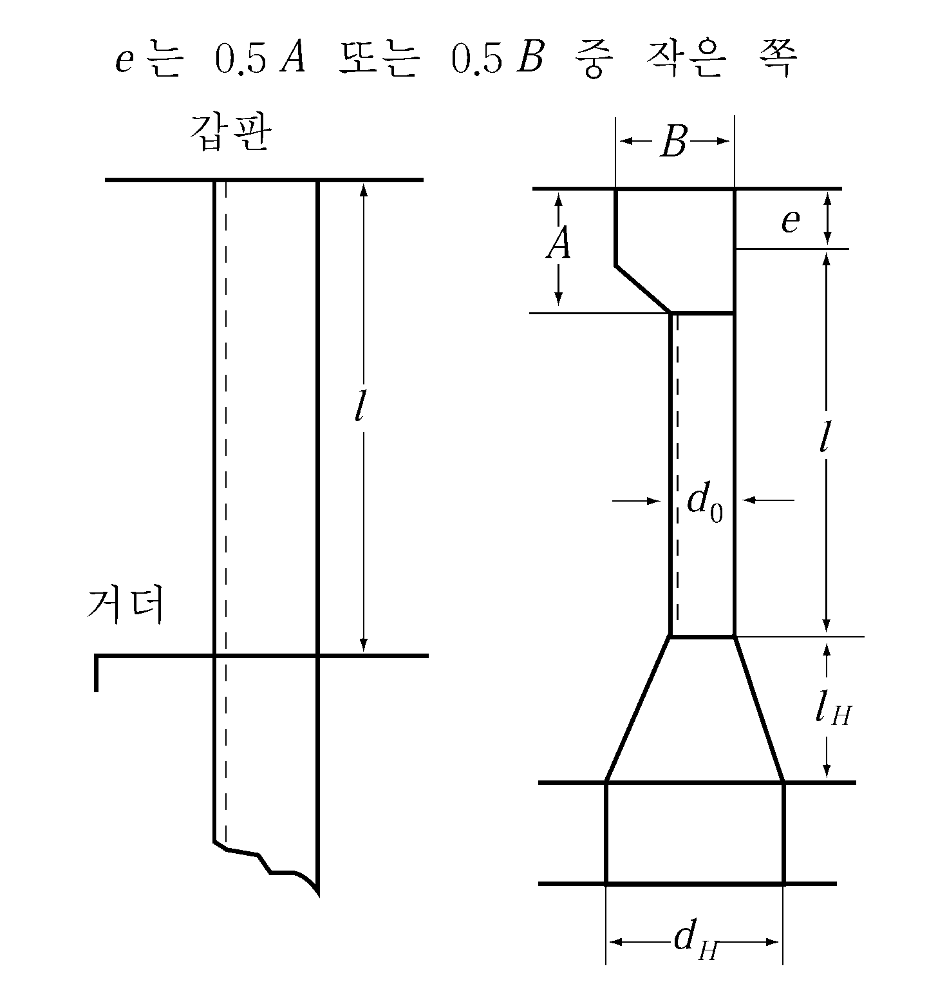

# 제3편 선체구조

> 선급 및 강선규칙/적용지침 / RA-03-K / 2025 / KO / Guidance

## 제 5 장 갑판

### 제 1 절 일반사항

#### 101. 강갑판 【규칙 참조】

강갑판을 깔지 않는 갑판

#### 102. 갑판의 수밀 【규칙 참조】

타두재가 만재흘수선상 1.5 m 보다 하방에 있는 갑판을 관통하는 부분에는 그 수밀성에 특히 주의할 필요가 있다.

#### 104. 갑판구의 보강 【규칙 참조】

창구등의 개구의 네 귀퉁이부에는 충분한 둥금새를 주고 필요에 따라 해당부분의 강갑판의 두께를 증가시키든가 이중판을 설치한다.

#### 105. 둥근 거널 【규칙 참조】

둥근 거널에 *D*급강 또는 *E*급강을 사용하는 경우의 곡률 반지름은 거널판 두께의 20배 이상으로 한다. 다만, 굽힘 가공선 현측후판의 너비를 **1장 405.**에 규정하는 강판 1장의 너비에 500 mm 를 더한 것 이상으로 하거나 굽힘 가공방법에 대하여 우리 선급의 승인을 받은 경우에는 15배까지 감할 수 있다.

### 제 2 절 강력갑판의 유효단면적

#### 202. 강력갑판의 유효단면적 【규칙 참조】

- **1.** 강력갑판의 선수미부의 테이퍼는 **그림 3.5.4**와 같이 규정의 단면적의 평균 값으로 테이퍼 시켜도 좋으나, 판두께를 급격히 저하시키지 않도록 하여야 한다.
  
  **그림 3.5.4**
- **2.** 둥근거널의 경우는 그 강판의 선측까지 수평으로 연장되어 있는 것으로 하여 단면적을 계산한다.

#### 204. 긴 선미루내 【규칙 참조】

선루를 강력갑판으로 하지 않는 긴 선미루내의 강력갑판의 유효단면적은 **그림 3.5.5**와 같이 한다.

#### 205. 선루갑판이 강력갑판인 경우 선루내 【규칙 참조】

선루갑판을 강력갑판으로 하는 경우, 선루내 갑판의 유효단면적은 **그림 3.5.6**과 같이 한다.

### 제 3 절 강갑판

#### 301. 강갑판의 두께 【규칙 참조】

강력갑판을 종식구조로 할 경우, 갑판구 측선 내는 **그림 3.5.7**과 같이 횡식구조로 하는 것이 바람직하다.

#### 307. 헬기 이착륙을 위한 갑판 【규칙 참조】

- **1.** 헬기 이착륙을 위한 갑판의 두께는 다음 식에 의한 값 이상이어야 한다.
  $t=4.6 \sqrt {K} \sqrt {\frac{2S-b}{2S+a} \times \frac{P}{9.81}} +1.5$ (mm)
  여기서,
  S : 갑판보의 간격 (m)
  a, b : 각각 보에 평행 및 직각방향으로 측정한 바퀴의 접지 길이(m)(**7편 7장 그림 7.7.2** 참조)로써, 특별히 정해진 경우를 제외하고는 0.3 m × 0.3 m로 한다.
  P : 헬리콥터가 발착하는 구역의 P(kN)는 최대이륙하중(maximum taking off weight)의 75 %의 하중이 두개의 각 접지 면적에 작용하는 것으로 하되, 비상상황이 요구되는 경우에는 최대이륙하중의 100 %가 고려되어야 한다.
  K : 재료계수
- **2.** 보강재의 치수는 단순지지보로 가정하고 허용응력은 235/K ($\mathrm{N}/mm ^{ 2}$), 하중은 **1**항의 P를 적용하여 계산한다. 단 보강재의 배치 등을 고려하여 연속보 조건을 적용할 수 있다. 
