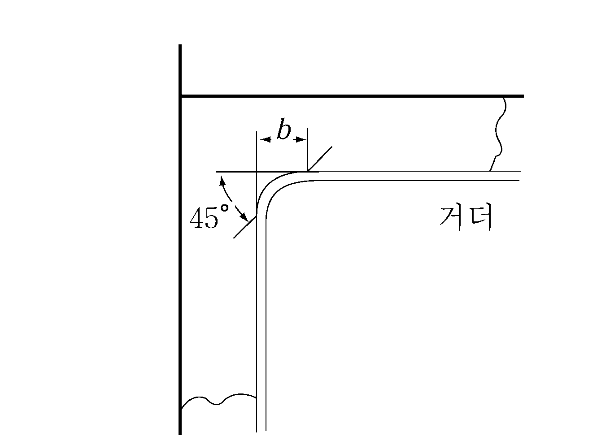
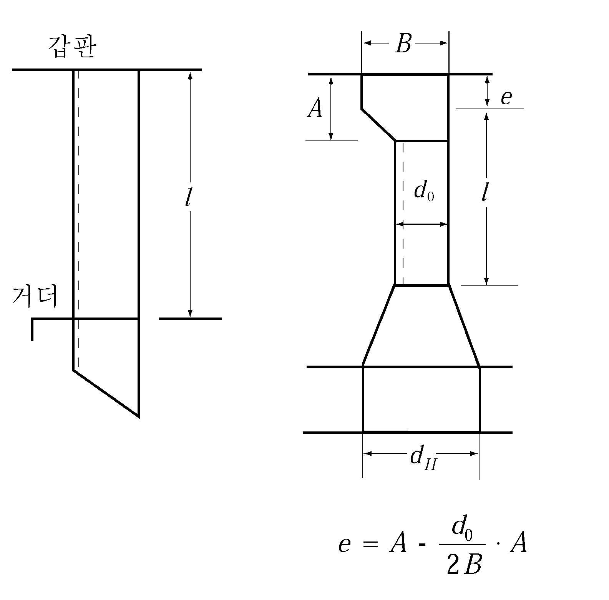
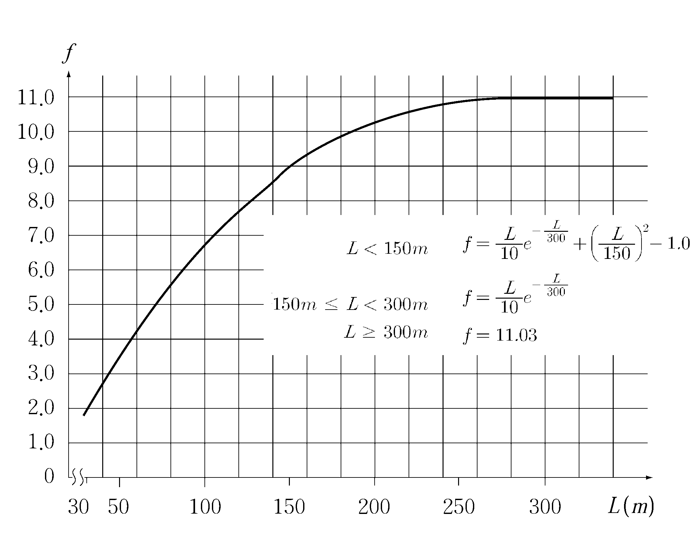

# 제3편 선체구조

> 선급 및 강선규칙/적용지침 / RA-03-K / 2025 / KO / Guidance

## 제 7 장 이중저구조

### 제 1 절 일반사항

#### 101. 적용 (2018) 【규칙 참조】

- **1.** 규칙 **101.**의 **3**항 또는 **4**항의 이중저 구조의 일부 또는 전부를 생략하고자 하는 경우에는 다음의 요건을 만족하여야 한다.
  - **(1)** 이중저를 생략하는 구획에 대하여 선저 어느 위치에서 (3)호에서 규정한 손상범위의 가정 선저손상시 해상인명안전협약(SOLAS) 제 2-1장 7-2규칙에 따라 계산된 $s _{i}$가 1 이상이어야 한다.
  - **(2)** 그러한 구역의 침수는 선박의 다른 부분의 비상전원 및 조명, 내부통신, 신호 또는 다른 비상장치의 작동을 불가능하게 하여서는 아니 된다.
  - **(3)** 가정손상 범위는 아래와 같다

    |   | 선박의 전부수선으로부터 0.3L에 대하여 | 선박의 기타 부위 |
    | --- | --- | --- |
    | 종방향범위 | 1/3 $L ^{2/3}$ 또는 14.5$\mathrm{m}$ 중 작은 것 | 1/3 $L ^{2/3}$ 또는 14.5$\mathrm{m}$ 중 작은 것 |
    | 횡방향범위 | $B/6$ 또는 10$\mathrm{m}$ 중 작은 것 | $B/6$ 또는 5$\mathrm{m}$ 중 작은 것 |
    | 수직방향범위 (기선으로부터 측정) | $B/20$ 또는 2$\mathrm{m}$ 중 작은 것 | $B/20$ 또는 2$\mathrm{m}$ 중 작은 것 |
  - **(4)** (3)호에 명시된 최대 손상보다 작은 범위의 손상의 결과가 더 심한 상태를 초래한다면 그러한 손상을 고려하여야 한다.
- **2.** 선박안전법을 적용받는 경우에는 강선구조기준의 관련 요건에 적합하여야 한다.
- **3.** 특수한 구조를 가진 선박은 다음에 따라 구조 치수를 결정한다.
  - **(1)** 이중 선측구조인 선박 (**그림 3.7.1** 참조)
    $B$ 대신에 0.5$(B+b)$를 사용한다.
  - **(2)** 경사선형인 선박
    $B$ 대신에 내저판의 연장선과 외판과의 교점사이의 거리를 사용한다.(**그림 3.1.1** 참조)
  - **(3)** 선수미부에서의 선박의 너비가 중앙부에 비하여 특히 작은 선박
    $B$ 대신에 선창 길이의 중앙에서 내저판과 선측 외판과의 교점간의 거리 $b$ 를 사용하여도 좋다.(**그림 3.7.2** 참조)
  - **(4)** (1) 내지 (3)에도 불구하고 직접강도계산에 의하여 구조치수를 결정할 수 있다.
    
    **그림 3.7.1** 
    **그림 3.7.2 선수미부의 나비가 작을 때** #eqnID-470**의 결정방법**
- **4.** 선창에 필러가 있는 경우에는 직접강도계산을 하여 중심선거더, 측거더, 실체늑판, 내저판 및 선저외판의 두께를 감할 수 있다.
- **5.** **규칙 101.**의 **7**항의 조항에 관하여, 이중저의 단위 면적당 화물하중($\mathrm{kN}/m^2$)과 d의 비가 5.40보다 작을 때 이중저구조는 **203.**의 **1**항, **302.**의 **1**항, **501.**의 **2**항 및 **505.**의 **1**항에 따라야 한다. 화물하중을 균일분포하중으로 다룰 수 없는 경우, 이중저구조의 치수는 개별화물에 대한 하중분포를 고려하여 결정하여야 한다. 이중저의 특정 지점에 집중하중이 가해지는 경우, 중심선 거더, 측거더, 늑판, 내저판 및 선저외판과 그 보강재의 치수는 직접계산과 같은 적절한 강도평가에 의하여 결정되어야 한다.

#### 107. 보일러 하부의 보강 【규칙 참조】

보일러 하부의 모든 부재에 대한 두께의 증가는 고온에 의한 부식 환경을 고려하여 다음 표와 같이 하는 것을 표준으로 한다. 다만, 유효한 방식 또는 방열조치가 되어있는 경우에는 두께를 증가시킬 필요가 없다. 여기서 유효한 방열조치라 함은 통상 상태에서 내저판 상면의 온도가 40 °C 이하가 되도록 하는 것을 말한다.

### 제 2 절 중심선거더 및 측거더

#### 201. 구조 및 배치 【규칙 참조】

- **1.** 선수미부등에서 이중저의 폭이 작고 측거더를 연장할 수 없는 경우에는 강도의 연속성에 주의하고 인접하는 측거더와 충분히 겹치도록 배치한다.
- **2.** 종격벽 하부에는 측거더 또는 반거더를 설치하여 이중저를 적절히 보강한다.

#### 203. 거더의 두께 【규칙 참조】

- **1.** 이중저에 작용하는 단위면적당의 하중 (kN/m^2)과 $d$ 의 비가 5.40 미만인 경우에는 **규칙 203.**의 (1)호의 식 중 $C_1$ 을 다음 식에 의한 값으로 한다.
  $C _1 ' = nab$
  $n$ : 계수로서 다음에 따른다.
  - **(1)** 동시에 적하되었거나 비어있는 인접된 화물창 : 다만, $B/l_H$ 가 1.4 이상일 때는 1.4로 하고, 0.4 미만일 때는 0.4로 한다.
    $n=\frac{1}{1.4} \left({3-\frac{B}{l_H}}\right)$
  - **(2)** 기타 화물창 : $n$ = 1.0
    $l_H$ : **규칙 203.**에 따른다.
    $a$ : 다음 식에 따른다.
    $a = 1.35 - \frac{h \gamma}{d}$
    $h$ : **규칙 403.**의 **2**항에 따른다.
    $\gamma$ : **규칙 101.**의 **7**항에 따른다.
    $b$ : 계수로서 종식구조인 경우 : 17
    횡식구조인 경우 : 20
- **2.** 이중 선측구조인 경우에는 **규칙 203.**의 (1)호의 식 중 $C_1$을 다음 식에 의한 값으로 한다.
  $C_1 '' = na (b - betab')$
  $n$ : 계수로서 **규칙 7편 3장 표 7.3.2**에 따른다.
  $a$ : **1**항의 규정에 따른다. 다만, 0.8 미만이어서는 아니 된다.
  $b$ : **1**항의 규정에 따른다.
  $b'$ : 계수로서 종식구조일 때는 4, 횡식구조일 때는 5
  $\beta$ : 계수로서 다음 식에 따른다. 다만, 길이가 특히 긴 화물창 및 선측이 횡식구조로서, 횡거더의 간격이 특히 큰 경우에는 별도로 고려한다.
  $\beta = {1} over {1+\frac{2t_0 d_0 ^2 H _s}{3t_s d_s^2 B_0}$
  $t_0$ : 내저판과 선저외판의 평균두께 (mm)
  $t_s$ : 종격벽과 선측외판의 평균두께 (mm*)*
  $d_0$, $d_s$, $B_0$ 및 $H_s$ : **지침 그림 3.7.5**에 표시한 거리 (m)
  
  **그림 3.7.5 이중 선측구조**

#### 204. 브래킷 【규칙 참조 】

**규칙 7장 204.**에 명시된 브래킷의 두께, 크기와 형태 등은 중심선거더의 높이와 그 좌굴강도를 고려하여 결정하여야 한다. (**그림 3.7.6** 참조)

### 제 3 절 실체늑판

#### 302. 두께 【규칙 참조】

- **1.** 이중저에 작용하는 단위면적당 하중 (kN/m^2) 과 $d$ 의 비가 5.40 미만인 경우에는 **규칙 302.**의 (1)호의 식 중 $C_2$ 를 다음 식에 의한 값으로 한다.
  $C _2 ' = ab$
  $a$ : **203.**의 **1**항에 따른다.
  $b$ : $B/l_H$ 의 값에 따라 **표 3.7.3**에 정하는 값.
  $l_H$ : **규칙 203.**에 따른다.
- **2.** 이중 선측구조의 실체늑판 두께는 다음에 따른다.
  - **(1)** **규칙 302.**의 (1)호의 식 중 $B '$ 및 $B ''$는 다음에 따른다.
    $B '$ : 선박의 중앙부에 있어서 내저판 상면에서의 종격벽 사이의 거리 (m).(**그림 3.7.5** 참조)
    $B ''$ : 해당늑판의 내저판 상면에서의 종격벽 사이의 거리 (m).
  - **(2)** **규칙 302.**의 (1)호의 $C_2$ 는 다음 식에 따른다.
    $C_2 = a (b + betab')$
    $a$ : **203.**의 **1**항의 규정에 따른다. 다만, 0.8 미만이어서는 아니된다.
    $b$ : $B/l_H$ 의 값에 따라 **표 3.7.3**에서 정하는 값.
    $b '$ : $B/l_H$ 의 값에 따라 **표 3.7.4**에서 정하는 값.
    $\beta$ : **203.**의 **2**항에 따른다.
    $l_H$ : **규칙 203.**의 규정에 따른다.

    **표 3.7.3 계수** $b$

    | $B/l_H$ |   | 이상 미만 0.4 | 0.4 0.6 | 0.6 0.8 | 0.8 1.0 | 1.0 1.2 | 1.2 |
    | --- | --- | --- | --- | --- | --- | --- | --- |
    | 종식구조 |   | 36 | 34 | 31 | 28 | 23 | 21 |
    | 횡식구조 | 실체늑판을 각 창내 늑골마다 설치할 때 | 36 | 34 | 31 | 28 | 23 | 21 |
    | 횡식구조 | 실체늑판을 2늑골간격 이상의 간격으로 설치할 때 | 25 | 24 | 21 | 20 | 16 | 15 |

    **표 3.7.4 계수** $b '$

    | $B/l_H$ |   | 이상 미만 0.4 | 0.4 0.6 | 0.6 0.8 | 0.8 1.0 | 1.0 1.2 | 1.2 |
    | --- | --- | --- | --- | --- | --- | --- | --- |
    | 종식구조 |   | 1 | 3 | 6 | 9 | 14 | 15 |
    | 횡식구조 | 실체늑판을 각 창내 늑골마다 설치할 때 | 1 | 3 | 6 | 9 | 14 | 15 |
    | 횡식구조 | 실체늑판을 2늑골간격 이상의 간격으로 설치할 때 | 1 | 2 | 4 | 6 | 9 | 11 |

### 제 4 절 종늑골

#### 403. 치수 【규칙 참조】

- **1.** 적하 화물창내의 화물의 겉보기 비중량 $\gamma$ 가 0.9를 넘을 때 **규칙 403.**의 **1**항의 식의 계수 $C$ 는 다음에 따른다.
  - **(1)** 늑판사이의 중간에 **규칙 404.**에 규정하는 스트럿을 설치하지 아니할 때 100
  - **(2)** 늑판의 중간에 **규칙 404.**에 규정하는 스트럿을 설치할 때
    디프탱크의 하부 62.5
    기타 30$\gamma$ + 20
    다만, 50.0 미만이어서는 아니 된다.
    $\gamma$ : **규칙 101.**의 **7**항에 따른다.
- **2.** 늑판에 설치하는 수직형강 및 스트럿의 너비가 특히 넓은 경우에는 **규칙 403.**의 **1**항 및 **2**항에 규정하는 계수 $C$ 에 각각 다음 식에 의한 값을 곱하여도 좋다.
  $\left({1-\frac{a}{l}}\right)^2 \left({1-\frac{b}{l}} \right)$
  $l$ : 늑판사이의 거리 (m).
  $a$ : 늑판에 설치한 수직형강너비 (m). 다만, 수직형강이 종늑골과 러그고착으로 되어 있지 않을 때에는 $a$ 는 0으로 한다.
  $b$ : 스트럿의 너비 (m)(**그림 3.7.7** 참조).

#### 404. 스트럿 【규칙 참조】

스트럿과 종늑골의 웨브를 겹칠 경우에 겹침길이는 스트럿의 플랜지폭의 1.5배를 표준으로 한다. 용접공사 관계로 인하여 겹침의 길이가 충분하지 않을 때에는 용접각장을 증가시킨다.(**그림 3.7.8** 참조)

### 제 5 절 내저판, 마진판(margin plate) 및 선저외판

#### 501. 내저판의 두께 【규칙 참조】

- **1.** 중심선거더판의 실제높이가 #eqnID-53316_s2 미만일 때에는 다음 식에 의한 이중저의 단면2차모멘트 $I$ 가 중심선거더판의 높이가 규정높이일 때에 계산한 이중저의 단면2차모멘트 값보다 작지 않도록 내저판 및 선저외판의 두께를 증가시켜야 한다.
  $I=1.23 \frac{t_1 t_2}{t_1 + t_2} d_0^2$
  $d_0$ : 중심선거더판의 실제높이 (m)
  $t_1$ : 선저외판의 실제두께 (mm)
  $t_2$ : 내저판의 실제두께 (mm)
- **2.** 이중저에 작용하는 단위면적당 하중과 $d$ 의 비가 5.40 미만의 경우에는 **규칙 501.**의 **1**항의 식 중 $C$ 를 다음 식에 의한 값으로 한다.
  $C ' = ab$
  $a$ : **203.**의 **1**항의 규정에 따른다.
  $b$ : $B/l_H$ 의 값에 따라 다음에 표시하는 $b_0$ 또는 $alphab_1$
  $B/l_H$ ＜ 0.8 일 때 : $b_0$
- **0.** 8 ≤ $B/l_H$ ＜ 1.2 일 때 : $b_0$와 $alphab_1$ 중 큰 것
- **1.** 2 ≤ $B/l_H$ 일 때 : $alphab_1$
  $l_H$ : **규칙 203.**의 규정에 따른다.
  $b_0$ 및 $b_1$ : $B/l_H$ 값에 따라 **표 3.7.5**에서 정한 값. 다만, 횡식구조일 때 $b_1$ 은 표에서 정하는 값에 1.1배를 한 것으로 한다.
  $\alpha$ : 다음 식에 따른다.
  $\alpha = \frac{13.8}{24 - 11.4 f_B K}$

  **표 3.7.5 계 수** $b_0$ **및** $b_1$

  | $B/l_H$ | 이상 | 0.4 | 0.6 | 0.8 | 1.0 | 1.2 | 1.4 | 1.6 |
  | --- | --- | --- | --- | --- | --- | --- | --- | --- |
  | $B/l_H$ | 미만 0.4 | 0.6 | 0.8 | 1.0 | 1.2 | 1.4 | 1.6 | - |
  | $b_0$ | 5.5 | 4.9 | 4.1 | 2.8 | 2.0 | - | - | - |
  | $b_1$ | - | - | - | 2.8 | 2.6 | 2.4 | 2.2 | 1.8 |
- **3.** 이중선측구조인 경우 **규칙 501.**의 **1**항의 $t_1$ 식 중 $C$ 는 다음 2개의 식 중 큰 것으로 한다.
  $C_1 = a(b_0 - betab'_0 )$
  $C_2 =a \alpha(b_1 - \beta b'_1 )$
  $a$ : **203.**의 **1**항의 규정에 따른다. 다만, 0.8 미만이어서는 아니된다.
  $b_0$, $b_1$ 및 $\alpha$ : **2**항의 규정에 따른다.
  $b_0 '$ 및 $b_1 '$ : $B/l_H$ 의 값에 따라 **표 3.7.6**에서 정하는 값. 다만, 횡식구조일 때 $b_1 '$는 표에서 정한 값에 1.1배 한 것으로 한다.
  $l_H$ : **규칙 203.**에 따른다.
  $\beta$ : **203.**의 **2**항의 규정에 따른다.

  **표 3.7.6 계 수** $b_0 '$ **및** $b_1 '$

  | $B/l_H$ | 이상 | 0.4 | 0.6 | 0.8 | 1.0 | 1.2 | 1.4 | 1.6 |
  | --- | --- | --- | --- | --- | --- | --- | --- | --- |
  | $B/l_H$ | 미만 0.4 | 0.6 | 0.8 | 1.0 | 1.2 | 1.4 | 1.6 | - |
  | $b_0 '$ | 3.1 | 2.5 | 1.8 | 1.0 | 0.5 | - | - | - |
  | $b_1 '$ | - | - | - | 1.1 | 1.1 | 0.8 | 0.7 | 0.4 |
- **4.** 지게차(포오크리프트)를 하역에 사용하는 경우 내저판의 두께는 **규칙 5장 305.**의 규정에도 만족하여야 한다.
- **5.** 일반적으로 중앙부 내저판의 맞대기연결은 내저판의 너클선에 배치하지 않아야 한다.

#### 505. 선저외판의 두께 【규칙 참조】

- **1.** 이중저에 작용하는 단위 면적당 하중과 $d$ 의 비가 5.40 미만인 경우 화물창 이중저의 선저외판의 두께는 **규칙 4장 304.**의 식에 의하여 계산된 것과 **규칙 7장 501.**의 **1**항에서 규정하는 첫번째 식에 있어서 **501.**의 **2**항에 규정하는 계수 $C '$를 사용하여 계산한 것 중 큰 것 이상이 되어야 한다. 다만, **규칙 501.**의 **1**항의 첫번째 식을 적용함에 있어 $\alpha$ 는 다음 식에 따른다.
  $\alpha = \frac{13.8}{24-15.0f_B K}$
- **2.** 이중 선측구조의 선저외판의 두께는 **규칙 4장 304.**의 식에 따라 계산한 것과 **규칙 501.**의 **1**항에서 규정하는 첫번째 식에 있어서 **501.**의 **3**항에 규정한 계수 $C$ 를 사용하여 계산한 것 중 큰 것 이상이어야 한다. 다만, **규칙 501.**의 **1**항의 첫번째 식을 적용함에 있어 $\alpha$ 는 다음 식에 따른다.
  $\alpha = \frac{13.8}{24 - 15.0 f_B K}$

### 제 8 절 선수선저 보강부의 구조

#### 801. 적용 【규칙 참조】

- **1.** 규칙 **1**항 중 평형수적재 상태라 함은 청정평형수 탱크(원유 세정후 평형수적재 적재하도록 계획된 화물유탱크 포함), 분리 평형수 탱크 및 평형수 화물창 등 평형수 탱크에 평형수를 적재 한 상태를 의미하며, 원유를 세정하지 않고 선박의 안전을 확보하기 위하여 화물유 탱크에 평형수를 적재하는 경우를 제외한다.
- **2.** $L$ 이 150 m 이하, $C_b$ 가 0.7 이하인 선박으로서 $V/\sqrt { L}$ 이 1.4 이상인 선박의 선수선저 보강부의 구조에 대하여는 다음에 따른다. 다만 컨테이너선 등 항상 어느 정도의 화물을 수송하는 선박은 **규칙 802.** 내지 **804.**의 규정을 적용할 수 있다.
  - **(1)** 구조
    선수선저 보강부의 구조는 **규칙 803.**의 규정에 따른다. 다만, **규칙 803.**의 **3**항에 의한 실체늑판의 휨보강재는 모든 외판 종휨보강재마다 설치하여야 한다. 선저종늑골 또는 외판 종휨보강재가 실체늑판을 관통하는 경우에는 슬롯은 칼라판(collar plates)으로 보강하여야 한다.
  - **(2)** 선저종늑골 및 외판 종휨보강재의 단면계수
    $Z = 0.53 P a l^2$(cm^3)
    $l$ : 실체늑판의 간격 (m)
    $a$ : 0.774 $l$ (m) 다만, 외판 종휨보강재 또는 선저 종늑골의 간격이 0.774 $l$ 이하일 때에는 그 거리로 한다.
    $P$ : 슬래밍 압력으로 다음 식에 의한 값.
    $P=\frac{2.48LC_1 C_2 C_3 C_4}{\beta}$(kPa)
    $C_1$ : **지침 표 3.7.7**에 의한 값으로서 $V/ \sqrt { L}$ 가 표의 중간에 있을 때에는 보간법에 의한다.

    **표 3.7.7 계수** $C_1$

    | $V/ \sqrt { L}$ | 1.4 | 1.5 | 1.6 | 1.7 | 1.8 |
    | --- | --- | --- | --- | --- | --- |
    | $C_1$ | 0.31 | 0.33 | 0.36 | 0.38 | 0.40 |

    $C_2$ : 다음 식에 의한 값
    $V/ \sqrt { L}$ 이 1.0 이하일 경우 : 0.4
    $V/ \sqrt { L}$ 이 1.0을 넘고 1.3 미만인 경우 : $C_2 = 0.667V/ \sqrt { L} - 0.267$
    $V/ \sqrt { L}$ 이 1.3 이상인 경우 : $C_2 =1.5V/ \sqrt { L} - 1.35$
    $\beta$ : 다음 식에 의한 값. 다만, $C_2 /\beta$ 가 11.43 이상일 때에는 $C_2 /\beta$ 의 값을 11.43으로 한다.
    $\beta=\frac{0.0025L}{b}$
    $b$ : 선수로부터 0.2$L$ 인 곳의 선체횡단면에서의 선체중심선으로부터 용골상면상 높이 0.0025$L$ 에서의 수평선과 외판과의 교점까지의 거리 (m).(**규칙 그림 3.7.2** 참조)
    $C_3$ : 다음 식에 의한 값
    $C_3 = 1.9-0.9 \left(\frac{d_f}{0.025L}\right)$
    $d_f$ : 평형수적재시 최소 선수 흘수 (m).
    $C_4$ : 계수로서 다음 값에 따른다.
    $x$ 가 $x_1$ 이상인 경우 : 1.0
    $x$ 가 $x_1$ 미만인 경우 : $0.5+\frac{0.5x}{x_1}$
    $x$ : 선수단으로부터 고려하는 횡단면 위치까지의 길이방향의 거리 (m).
    $x_1$ : 다음 값에 따른다.
    $C_b$ 가 0.7 미만인 경우 : 0.1$L$ (m)
    $C_b$ 가 0.7 이상 0.8 미만인 경우 : $(0.1 - 0.5(C_b -0.7)) L$(m)
    $C_b$ 가 0.8 이상인 경우 : 0.05$L$ (m)
    - **(가)** 평형수적재시 선수흘수가 0.025 $L$ 이하인 선박의 선저종늑골 및 외판 종휨보강재의 단면계수 $Z$ 는 다음 식에 의한 것 이상이어야 한다.
    - **(나)** 평형수적재시 선수흘수가 0.025$L$ 을 넘고 0.037$L$ 이하인 선박의 경우에는, 선저 종늑골 및 외판 종 휨보강재의 단면계수 $Z$ 는 **규칙 403.**의 **1**항에 의한 값과 (가)에 의한 보간법에 의하여 정한다. *(2021)*
  - **(3)** 실체늑판의 두께
    실체늑판의 두께는 다음 (가) 또는 (나)에 의한 것 중 큰 것 이상으로 하여야 한다.
    $t = \frac{PS bK}{196(b-d_1 )} + 1.5$(mm)
    $P$ : (2)호 (가)에 의한 슬래밍 압력 (kPa) 평형수적재 상태에서의 선수흘수가 0.025$L$ 를 넘고 0.037$L$ 이하인 선박에 대하여는 평형수적재시의 선수흘수를 적용하여 구한 값으로 한다.
    $S$ : 실체늑판의 간격 (m)
    $b$ : 해당패널의 너비 (m)
    $d_1$ : 해당패널의 모든 개구너비의 합 (m) 개구를 이중판으로 보강한 경우에는 이들의 단면적을 적절히 고려할 수 있다.
    $t=1.1 root {3} of {PS b ^{2}} +1.5$(mm)
    $P$ 및 $S$ : (가)에 따른다.
    $b$ : 선저 종늑골의 간격 (m)
    
    **그림 3.7.9 선수선저 보강부의 실체늑판**
    **3 . 규 칙 제8절**의 적용에 있어서, 선박의 길이 $L$이 150 m 이상이고, $C _{b}$가 0.7 이상인 선박은 다음에 따른다.
    - **(가)** 선저종늑골(선저종늑골 사이에 있는 외판 종휨보강재는 제외한다) 양쪽으로 선저종늑골 간격의 1/2에 해당하는 실체늑판 패널의 두께 $t$ 는 다음 식에 의한다.(**그림 3.7.9** 참조)
    - **(나)** 실체늑판의 두께 $t$ 는 다음 식에 의한다.
  - **(1)** **규칙 804.**의 **1**항에서 규정한 슬래밍 충격압력 $P$는 다음의 식에 의한다. 이 경우, 슬래밍 충격압력은 각 종방향 판보강재 또는 선저 종늑골의 스팬 중앙에서 계산한다.
    $P = 1.14 \frac{\nu ^{2}}{\beta}$ (kPa)
    $\beta$ : 다음에 따른다. 다만 $1/ \beta$는 11.43보다 크지 않아야 한다.
    $\beta = \frac{0.0025 L}{b}$
    $b$ : 횡단면을 고려할 때, 선체중심선으로부터 용골 상면상 높이 0.0025 $L$에서의 수평선과 외판과의 교점까지의 거리 (m) (**규칙 그림 3.7.2** 참조)
    $\nu$ : 고려하는 위치의 선저와 해수면 사이의 상대 속도 (m/s)로서 다음 식에 의한다.
    $\nu = & C _{0} \left\{ \frac{2 \pi}{T _{P}} ( \sqrt {C _{4}} + 0.45H _{W} \cos \phi + 0.18 \lambda \sin \phi ) +0.51C _{7} V \sin \phi \right\}$
    $C _{0}$ : 다음 식에 의한다.
    $C _{0} = 1-0.015 ( \frac{L - 150}{150} )$
    $C _{4}$ : 다음 식에 의한다. 다만 0보다 작지 않아야 한다.
    $C _{4} = (l+0.05L) ^{2} \phi _{0} ^{2} - (0.025L ' ) ^{2}$
    $l$ : 중앙단면에서 고려하는 위치까지의 종방향 거리 (m)
    $L'$ : 선박의 길이 (m). 다만, $L$ 이 230 m 를 넘을 때에는 230 m 로 한다.
    $\phi _{0}$ : 피치각도 (rad)로서 다음 식에 의한다.
    $\phi_0 = \frac{3.3 (C _{7} V +5) ^{0.2}}{L ^{1.2} \sqrt {C _{b}}} H _{W}$
    $H _{W}$ : 유의파고 (m)로서 다음 식에 의한다. 다만, $H _{W} \leq \max(0.055 L , 11.5)$
    $H _{W} = C _{5} C _{6}$
    $C _{5}$: 다음 식에 의한다.
    $L \leq 300$ : $C _{5} = 10.75 - ( \frac{300 - L}{100} ) ^{1.5}$
    $300< L \leq 350$ : $C _{5}$ = 10.75
    $350 < L$ : $C _{5} = 10.75 - ( \frac{L - 350}{150} ) ^{1.5}$
    $C _{6}$: 다음 식에 의한다.
    $C _{6} = \sqrt {\frac{L + \lambda -25}{L}}$
    $C _{7}$: 다음 식에 의한다. 다만, $0 \leq C _{7} \leq 1$
    $C _{7} = \frac{V / \sqrt {L} - 1.1}{0.4}$
    $\lambda$ : 파장으로서 다음 식에 의한다.
    $\lambda = 0.6 (1.5 + \frac{(0.0075 L + 0.025 L ' )}{2 d} )L$ (m)
    $T _{P}$ : 피치거동의 고유주기로서 다음 식에 의한다.
    $T _{P} = \sqrt {\frac{2 \pi \lambda}{g}}$ (sec)
    $\phi$ : 다음 식에 의한다. 다만, $\phi \leq 0.015 + \phi _{0}$
    $\phi = 0.015 + \tan ^{-1} ( \frac{0.025 L '}{l + 0.05 L} )$ (rad)
  - **(2)** 평형수적재 조건에서 평형수 탱크 내의 해수로 채워지는 부분에 대한 강도검토 시, 위 (1)호에서 명시한 슬래밍 충격압력 $P$는 다음의 식에 의한 $\Delta P$만큼 감해줄 수 있다. 이 경우, 그 평형수 탱크는 황천 조건에서 가득 채워지는 것으로 선박의 적하지침서에 명시하여야 한다.
    $\Delta P = 5 h$ (kPa)
    $h$ : 평형수 탱크의 깊이 (m)
- **4.** 선수선저보강부에 있어, **규칙 803.**에 명시되지 않은 구조 배치에 대하여는 다음의 (1)호 내지 (3)호를 적용하여야 한다.
  - **(1)** 종식구조의 실체늑판 및 횡식구조의 거더 두께는 **801.**의 **2**항 (3)호의 규정에 따라야 한다. 종식구조의 실체늑판의 두께의 경우, 슬래밍 충격압력 $P$는 다음의 (3)호에 명시된 $C _{9}$ 계수를 곱하여 수정할 수 있다.
  - **(2)** 실체늑판과 거더의 두께는 다음의 (가)와 (나)중 큰 값보다 작지 않아야 한다.
    $P$ : **규칙 804.**의 **1**항**, 지침 801.**의 **2**항 또는 **801.**의 **3**항에 규정된 슬래밍 충격압력. 다만, 평형수적재조건에서 선수흘수가 0.025 $L '$보다 크고 0.037 $L '$보다 작은 선박의 슬레밍 충격압력은 위의 값과 선수흘수가 0.037 $L '$일 때 다음의 식에서 얻어진 압력 값으로부터 선형보간법을 이용하여 얻어진다. 다만, 슬래밍 충격압력은 다음 식에 의한 값보다 작아서는 아니 된다.
    $P = 1.015 L$ (kPa)
    $C _{8}$ : 다음 식에 의한다. 다만, $0.1 \leq C _{8} \leq 1$
    $C _{8} = \frac{3}{A}$
    $A$ : 강도검토 시 고려하는 면적 (m^2)으로서 다음 식에 의한다.
    $A = S \times l$
    $S$ : 실체늑판 또는 거더의 간격 (m)
    $l$ : 실체늑판 또는 거더에 있어서의 지지 부재의 간격 (m)
    $d _{0}$ : 고려하는 위치에서의 늑판 또는 거더의 깊이 (m)
    $d _{1}$ : 고려하는 위치에서의 늑판 또는 거더에 있는 개구의 깊이 (m)
    - **(가)** $t _{1} = K \frac{C _{8} P S l}{226 (d _{0} - d _{1} )} +2.5$ (mm)
    - **(나)** **규칙 302.**의 (2)호의 규정에 따른 값 (여기서 $t _{1}$은 위의 (가)에서 주어지는 값). 거더에 적용하는 경우, **규칙 302.**의 (2)호의 ‘실체늑판’은 ‘거더’로 간주한다.
  - **(3)** 종방향 판보강재와 선저종늑골의 치수의 경우, 슬래밍 충격압력 $P$는 다음 식에 의한 $C _{9}$ 계수를 곱하여 수정할 수 있다. 다만, $0 \leq C _{9} \leq 1$
    $C _{9} = \frac{3}{l}$
    $l$ : **규칙 804.**의 **1**항에 따른다.

#### 802. 범위 【규칙 참조】

선박의 길이 $L$ 이 150 m 이하이고 $C_b$ 가 0.7 이하인 선박으로서 평형수적재 상태하의 선수 흘수가 0.025$L$ 이하인 선박의 선수선저 보강부는 다음에 따라 그 범위를 연장하여야 한다. *(2021)*
