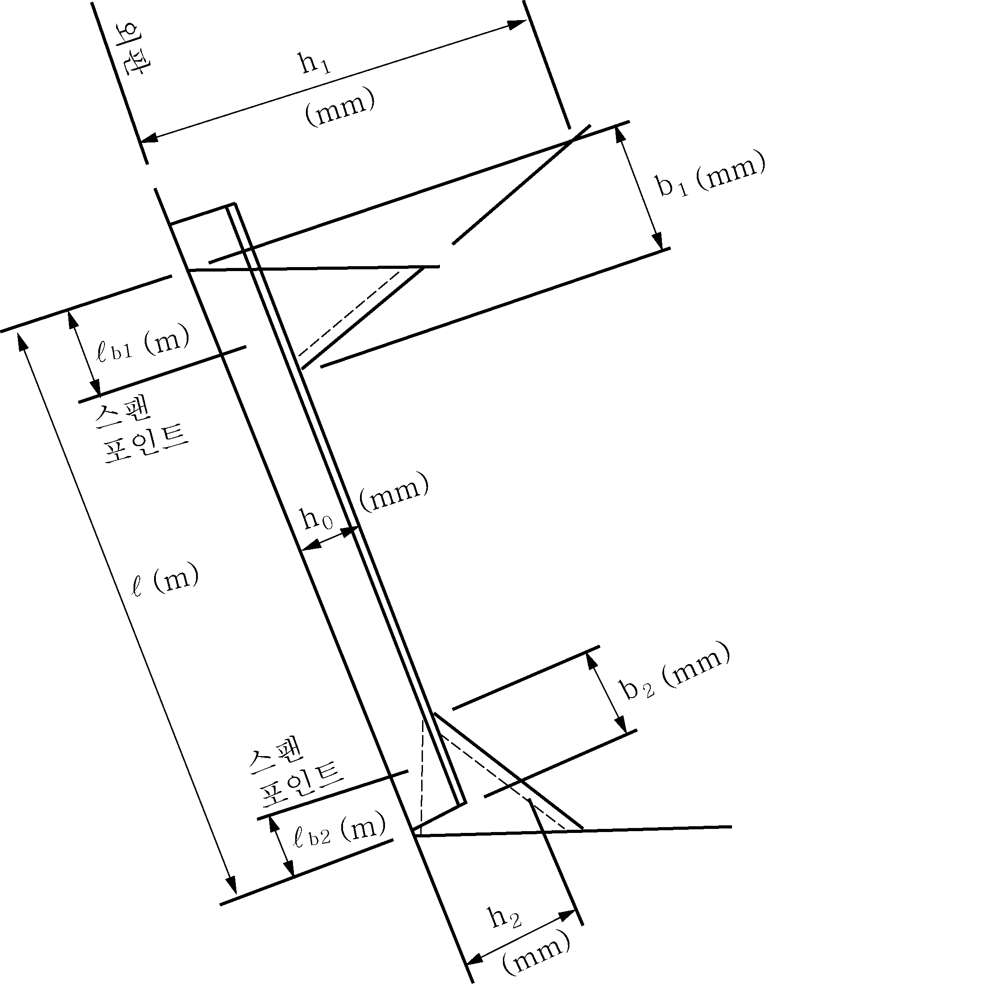
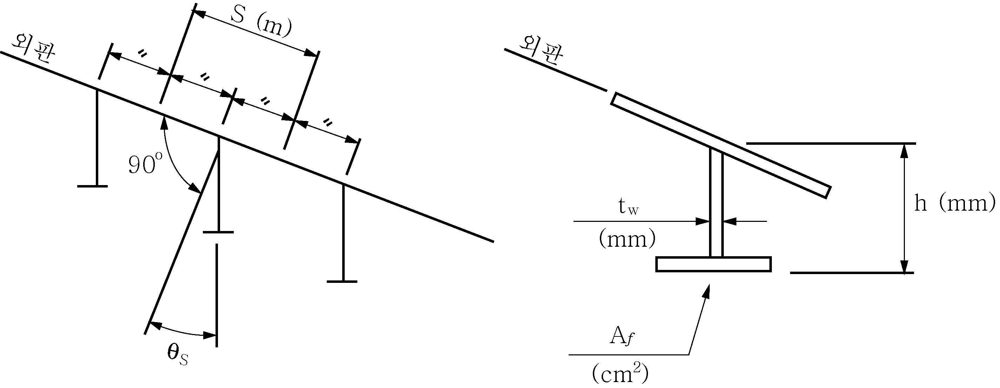
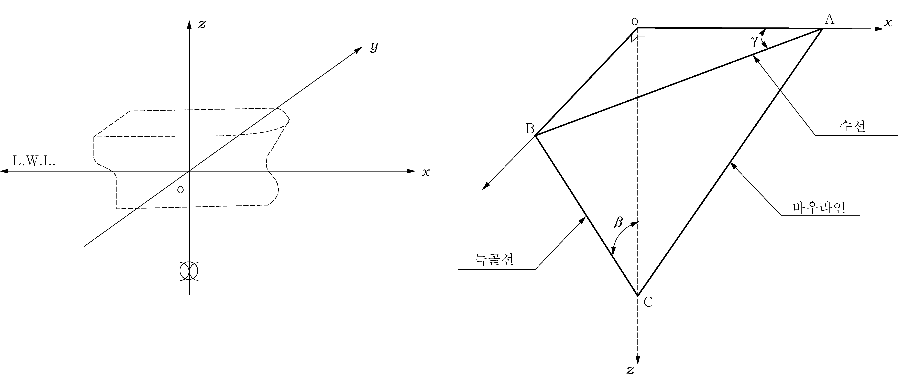

# 제3편 선체구조

> 선급 및 강선규칙/적용지침 / RA-03-K / 2025 / KO / Guidance

## 제 8 장 늑골

### 제 1 절 일반사항

#### 105. 특수한 곳의 늑골 【규칙 참조】

**규칙 105.**의 **2**항에서 “우리 선급이 적절하다고 인정하는 바”라 함은 **규칙 1편 1장 105.**에 따라 인정하는 것을 말한다.

#### 106. 작은 각도에 의한 부착 【규칙 참조】

**규칙 106.**의 규정을 적용함에 있어 늑골의 웨브와 외판과의 각도가 특히 작을 경우에는 **규칙 13편 1부 3장 6절 3.1.2** 및 **7절 1.4.4**의 규정을 적용할 수 있다.

#### 108. 플레어가 특히 큰 곳에서의 늑골 (2019) 【규칙 참조】

- **1.** 플레어가 큰 선박의 경우($K_v + K_f$가 0.4를 넘는 선박), 선수부 0.2 $L$의 만재흘수선 상부에서 큰 파랑 충격압력을 받는 선수플레어 위치에 설치되는 횡늑골 및 선측 종늑골의 소성단면계수 $Z _{p}$ 와 웨브판의 두께 $t _{w}$ 는 다음 식에 의한 값보다 작지 않아야 한다. *(2020)*
  요구웨브판 두께 : $t _{w} = \frac{648PS l _{s} ^{}}{h _{0} \sigma _{y} \cos \theta _{s}}$ (mm)
  요구소성단면계수 : $Z _{p} = \frac{PS l _{s} ^{2}}{16 \sigma _{y} \cos \theta _{s}} \times 10 ^{3}$ (cm^3)
  여기서,
  $S$ : 외판을 따라서 측정한 늑골 간격 (m)
  $l _{s}$ : 늑골의 지지점 사이의 거리 (m)로서 다음 식에 의한다.
  $l _{s} = l - l _{b1} - l _{b2}$
  $l$ : **그림 3.8.1** 참조
  $l _{b1}$및 $l _{b2}$ : 브래킷에 의한 수정간격 길이로서 다음 식에 의한다.
  $l _{b1} = b _{1} (1 - \frac{h _{0}}{h _{1}} ) \times 10 ^{-3}$
  $l _{b2} = b _{2} (1 - \frac{h _{0}}{h _{2}} ) \times 10 ^{-3}$
  $b _{1}$, $b _{2}$, $h _{0}$, $h _{1}$ 및 $h _{2}$ : **그림 3.8.1** 참조
  $\sigma _{y}$ : 재료의 항복응력 (N/m^2)
  $\theta _{s}$ : 외판에 대한 늑골의 경사 각도 (deg) (**그림 3.8.2** 참조)
  $P$ : 슬래밍 충격 압력 (kPa)으로서 다음 식에 의한다.
  $P = \frac{1}{2} \rho C _{e} K _{P} ( \frac{\nu _{n}}{\cos \beta _{0}} ) ^{2}$
  $\rho$ : 해수밀도, 1.025 (t/m^3)
  $\beta _{0}$ : 선체표면과 파면과의 상대충격각도 (deg)로서 다음 식에 의한다.
  $\beta _{0} = \phi - \phi _{b} ^{}$
  $\phi$ : 다음 식에 의한다.
  $\phi = \tan ^{-1} ( \frac{1}{\tan \beta _{k} \cos \gamma} )$ (deg)
  $\beta _{k}$: 다음 식에 의한다(deg).
  $\beta _{k} = \beta _{k1} - \sqrt {45- \beta }$ ($\beta \leq 45 ^{o}$인 경우)
  $\beta _{k} = \beta _{k1} + \sqrt {\beta -45}$ ($\beta >45 ^{o}$인 경우)
  $\beta$ : 고려하는 단면에서의 외판 각도 (deg) (**그림 3.8.3** 참조)
  $\beta _{k1}$: 다음 식에 의한다(deg).
  $\beta _{k1} = 45 "{"0.95 (0.8 -X/L) (1.2 - X/L) +1"}" - 0.02 (D _{z} - d) (D _{z} - d - 20)$
  $X$ : $L$의 후단으로부터 고려하는 단면까지의 종방향 거리 (m)
  $D _{z}$: $L$의 중심에서의 기선으로부터 고려하는 단면까지의 수직 거리 (m)
  $\gamma$ : 고려하는 단면에서의 외판 각도 (deg) (**그림 3.8.3** 참조)
  $\phi _{b}$ : 다음 식에 의한다.
  $\phi _{b} = ( \frac{\phi _{bF} -33}{0.15} )(X/L-0.8)+33$ ($0.8 \leq X/L<0.95$인 경우)
  $\phi _{b} = \phi _{bF}$ ($0.95 \leq X/L$인 경우)
  $\phi _{bF} =35$ ($L<200$인 경우)
  $\phi _{bF} =-L/25+43$ ($200 \leq L<400$인 경우)
  $\phi _{bF} =27$ ($400 \leq L$인 경우)
  $K _{P}$: 다음의 **표 3.8.1**에 의한 계수
  $C _{e}$: 다음 식에 의한 계수
  $C _{e} = \frac{\beta _{0}}{40} + 0.25$ ($\beta _{0} \leq 30 ^{o}$인 경우)
  $C _{e} = 1.0$ ($\beta _{0} >30 ^{o}$인 경우)
  $\nu _{n}$: 선체표면과 고려하는 포인트에서의 파면과의 최대상대속도 (m/s)로서 다음 식에 의한다.
  $\nu _{n} = \frac{\nu _{x} \tan \beta _{k} + \nu _{z} \tan \alpha \tan \beta _{k}}{\sqrt {\tan ^{2} \alpha +\tan ^{2} \beta _{k} +\tan ^{2} \alpha \tan ^{2} \beta _{k}}}$
  $\nu _{x}$: 고려하는 포인트에서의 선체 표면의 종방향 상대속도 (m/s)로서 다음 식에 의한다. 단, 0 보다 작아서는 아니 된다.
  $\nu _{x} = (1 - C _{1} ) \nu _{xo}$
  $C _{1}$: **표 3.8.2**의 식에 의한 계수
  $\nu _{x0}$: 수선에서의 종방향 상대속도 (m/s)로서 다음 식에 의한다.
  $\nu _{x0} = \nu _{s} + C _{2} \sqrt {Lg }$
  $\nu _{s}$ : 0.36$V$ (m/s)
  $V$ : 선박의 속도 (kt)
  $g$ : 중력가속도, 9.81 ($\mathrm{m}/s ^{2}$)
  $C _{2}$ : **표 3.8.2**의 식에 의한 계수
  $\nu _{z}$: 고려하는 포인트에서의 선체의 깊이 방향으로의 상대속도(m/s)로서 다음 식에 의한다. 단, 0 보다 작아서는 아니 된다.
  $\nu _{z} = (1 - C _{3} ) \nu _{zo}$
  $C _{3}$: **표 3.8.2**의 식에 의한 계수
  $\nu _{z0}$: 수선에서의 선체의 깊이 방향 상대속도 (m/s)로서 다음 식에 의한다.
  $\nu _{z0} = C _{4} \sqrt {Lg }$
  $C _{4}$ : **표 3.8.2**의 식에 의한 계수
  $\alpha$: 다음 식에 의한다.
  $\alpha = \tan ^{-1} ( \frac{\tan \beta _{k}}{\tan \gamma} )$
  $Z _{P}$: 늑골이 외판에 직각으로 붙는 경우의 늑골의 소성 단면계수 ($\mathrm{cm} ^{3}$)로서 다음 식에 의한다.
  $Z _{P} = 0.1 A _{f} h + \frac{1}{2000} h ^{2} t _{w}$
  $A _{f}$ : 늑골의 단면적 ($\mathrm{cm} ^{2}$)
  $h$ : 웨브의 깊이 (mm)
  $t _{w}$ : 웨브의 두께 (mm)

  | $\beta _{0}$ | $K _{p}$ |
  | --- | --- |
  | $\beta _{0} <3 ^{0}$ | 255.85 |
  | $3 ^{0} \leq \beta _{0} < 4 ^{0}$ | 758.60 $e ^{-0.3623 \beta _{0}}$ |
  | $4 ^{0} \leq \beta _{0} < 6 ^{0}$ | 453.91 $e ^{-0.2339 \beta _{0}}$ |
  | $6 ^{0} \leq \beta_0 < 10 ^{0}$ | 335.41 $e ^{-0.1835 \beta _{0}}$ |
  | $10 ^{0} \leq \beta_0 < 15 ^{0}$ | 173.61 $e ^{-0.1176 \beta _{0}}$ |
  | $15 ^{0} \leq \beta_0 < 18 ^{0}$ | 80.523 $e ^{-0.0664 \beta _{0}}$ |
  | $18 ^{0} \leq \beta _{0}$ | $1 + {\pi }^\frac{2}{4} \cot ^{2} \beta _{0}$ |

  | $C _{1}$ | $(4.40 \xi - 6.31) \zeta$ |
  | --- | --- |
  | $C _{2}$ | $0.095 \xi + 0.191 F _{n} - 0.127$ |
  | $C _{3}$ | $( \frac{11.8}{\xi -0.459} +4.96) \zeta ^{2}$ |
  | $C _{4}$ | $(-0.629F _{n} + 0.338) \xi +0.666F _{n} - 0.109$ |

  참고 :
  $\xi$ : $x/(L/2)$ 다만, $\xi$는 0.6보다 커야 한다.
  $x$ : 선체중앙으로부터 고려하는 위치까지의 종 방향 거리 (m)
  $\zeta$ : $z/(L/2)$ 다만, $\zeta$는 0.보다 커야 한다.
  $z$ : 만재흘수선으로부터 고려하는 위치까지의 높이 (m)
  $F _{n}$: $\nu _{s} / \sqrt {Lg}$
- **2.** 플레어가 큰 선박의 경우, 선수부 0.2 $L$의 만재흘수선 상부에서 큰 파랑충격압력을 받는 선수플레어 위치에 설치되는 선측종늑골 지지 특설늑골(web frame)의 치수는 **9장 104.**의 횡늑골 지지 선측스트링거에 대한 요건을 따라야 한다. *(2020)*
  
  **그림 3.8.1 수정된 늑골 간격**
  
  **그림 3.8.2**
  
  **그림 3.8.3 외판각도**

### 제 3 절 선창내 횡늑골

#### 302. 횡늑골 치수 【규칙 참조】

강재코일을 적재하는 선박의 경우에는 선체동요시 강재코일에 의한 하중을 받는다고 예상되는 선창내 횡늑골에 대하여는 **규칙 302.**의 규정에 따르는 이외에 다음 조건에 따라 탄성범위내에서 계산하여 검토할 것을 권장한다.

#### 303. 특설늑골(web frame) 또는 선측스트링거에 의해 지지되는 횡늑골 【규칙 참조】

선측스트링거의 배치가 **규칙 303.**의 **2**항의 규정에 적합하지 않은 경우에는, 다음에 의해 **규칙 303.**의 **1**항의 규정을 준용한다. 다만, 적당한 방법으로 검토하고 치수를 정한 경우에는 그러하지 아니한다.(**지침 그림 3.8.4** 참조)

### 제 5 절 갑판사이 늑골

#### 502. 치수 【규칙 참조】

갑판사이 늑골의 단부를 견고한 브래킷으로 고착하고 또한 브래킷 암길이가 #eqnID-8798_s2 이상인 경우에는 **지침 그림 3.8.5**에 따라 **규칙 502.**의 규정을 준용하여도 좋다.

#### 503. 특별고려 【규칙 참조】

- **1.** 자동차 전용운반선 등과 같이 다층 갑판선에 있어서는 건현이 선박의 길이에 따라 **지침 표 3.8.3**에 의한 값 미만인 경우에는 건현갑판 상부의 갑판사이 늑골은 다음을 표준으로 하여 보강한다.

  **표 3.8.3 건현의 표준치**

  | 선박의 길이 $L$(m) | $L$＜75 | 75≤$L$＜125 | 125≤$L$ |
  | --- | --- | --- | --- |
  | 건현의 표준치 (m) | 0.36 | 0.40 | 0.46 |
  - **(1)** 보강범위는 최소한 건현갑판상 제1층 갑판까지로 한다.
  - **(2)** 갑판사이 늑골의 단면계수는 해당늑골의 선박의 길이 방향 위치에 따라 다음에 의한다.
    - **(가)** 선수격벽보다 전방 : **규칙 13장 204.**의 **1**항의 규정을 준용한다.
    - **(나)** 선미격벽보다 후방 : **규칙 13장 302.**의 규정을 준용한다.
    - **(다)** 기타 : **규칙 502.**의 **표 3.8.4** 중 (2)의 규정을 준용한다. 다만, **규칙 표 3.8.4** 중 계수 $C$ 를 0.44는 0.57로, 0.57은 0.74로, 0.74는 0.89로 대체한다.
- **2.** 선수부의 플래어(flare)의 영향에 의하여 파랑충격이 크다고 예상되는 부분의 갑판사이 늑골에 대하여는 그 치수를 증가시키고 단부의 고착에 특히 주의한다. 
