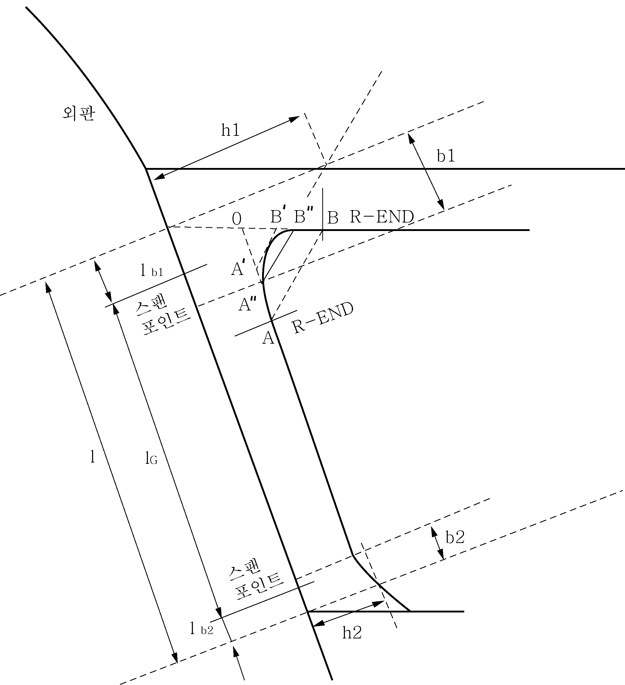
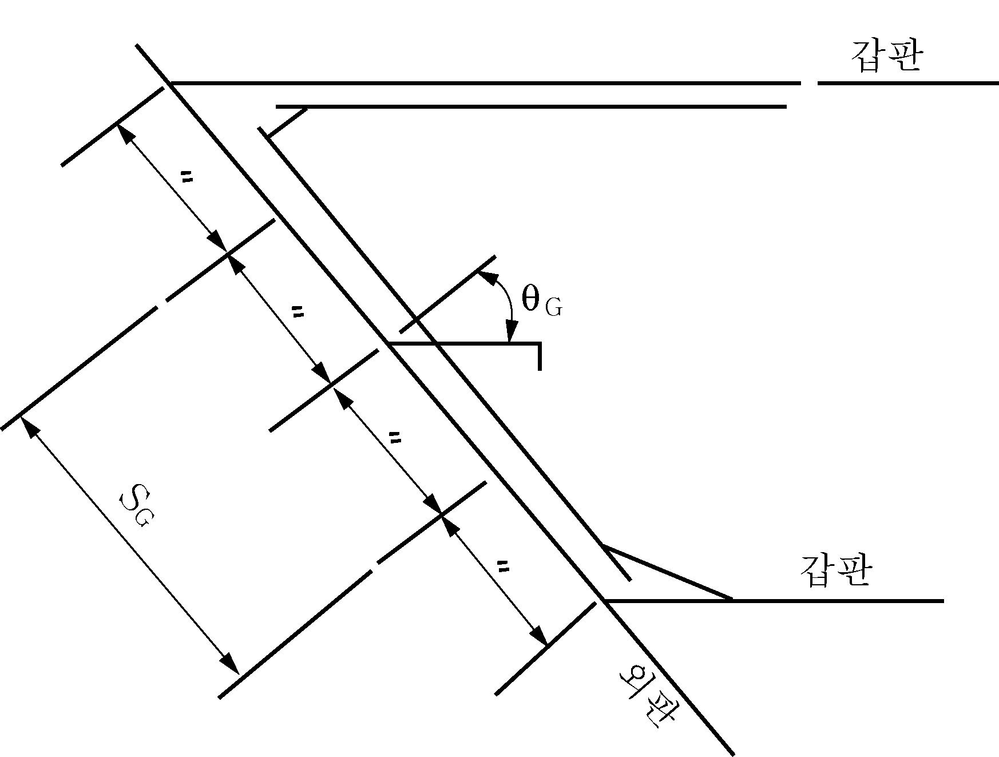
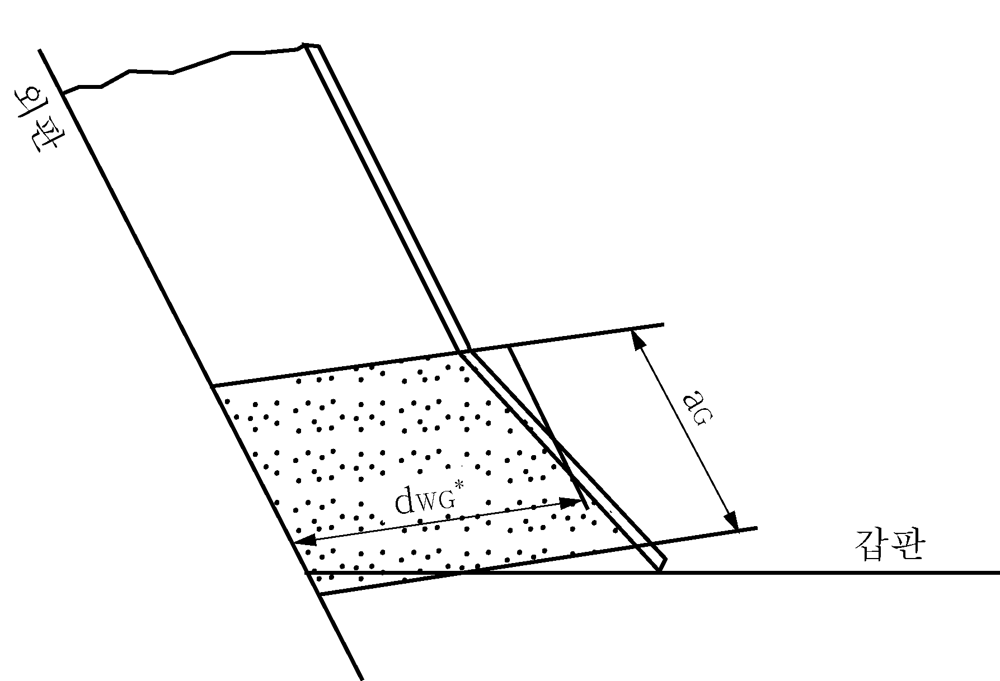

# 제3편 선체구조

> 선급 및 강선규칙/적용지침 / RA-03-K / 2025 / KO / Guidance

## 제 9 장 특설늑골 및 선측스트링거

### 제 1 절 일반사항

#### 104. 플레어가 특히 큰 곳에서의 특설늑골(web frame)과 선측스트링거 (2019) 【규칙 참조】

- **1.** 플레어가 큰 선박의 경우($K_v + K_f$가 0.4를 넘는 선박), 선수부 0.2 $L$의 만재흘수선 상부에서 큰 파랑 충격압력을 받는 선수플레어 위치에 설치되는 횡늑골 지지 선측스트링거와 이 선측스트링거를 지지하는 특설늑골(web frame)의 웨브 두께 $t _{wG}$와 단면계수 $Z _{G}$는 다음 식에 의한 값보다 작지 않아야 한다. *(2020)*
  웨브의 요구두께 : $t _{wG} = \frac{433 P S _{G} l _{G}}{d _{wG} \sigma _{y} \cos \theta _{G}}$ (mm)
  요구단면계수 : $Z _{G} = \frac{PS _{G} l _{G} ^{2}}{24 \sigma _{y} \cos \theta _{G}} \times 10 ^{3}$ (cm^3)
  여기서,
  $P$ : **8장 108.**에 규정된 슬래밍 충격압력 (kPa)
  $S _{G}$ : 거더 간격 (m)
  $l _{G}$ : 거더의 끝단부 형상을 고려한 지지점 사이의 거리 (m), 거더의 끝단부 형상이 **그림 3.8.1**에서와 같이 원호를 이루고 있는 경우, 이 거리는 다음과 같이 삼각형으로 가정하여 수정하여야 한다.
  - **(1)** R-END($A$)와 R-END($B$)를 연결한다.
  - **(2)** $AB$와 평행하게 원호에 대한 접선 $A ' B '$를 그린다.
  - **(3)** $AA '' = (2/3) AA '$가 되도록 $A ''$점을 잡고, $BB '' = (2/3) BB '$가 되도록 $B ''$점을 잡는다. 삼각형 $OA '' B ''$를 삼각형의 브래킷으로 고려한다.
    $l _{G} = l - l _{b1} - l _{b2}$
    $l$ : 외판을 따라서 측정된 거더의 길이 (m), **그림 3.8.1** 참조
    $l _{b1}$및 $l _{b2}$ : 브래킷에 의한 수정간격 길이 (m)로서 다음 식에 의한다.
    $l _{b1} = b _{1} (1 - \frac{d _{wG}}{h _{1}} ) \times 10 ^{-3}$
    $l _{b2} = b _{2} (1 - \frac{d _{wG}}{h _{2}} ) \times 10 ^{-3}$
    $b _{1}$, $b _{2}$, $h _{1}$ 및 $h _{2}$ : **그림 3.9.1** 참조
    $d _{wG}$ : 웨브의 깊이 (mm)
    $\sigma _{y}$ : 재료의 항복응력 (N/mm^2)
    $\theta _{G}$ : 거더와 외판의 수직축 간의 각도 (deg) (**그림 3.9.2** 참조)
    $Z _{G}$ : 거더의 단면계수 (cm^3)서 다음 식에 의한다.
    $Z _{G} = 0.1 A _{fG} d _{wG} + \frac{1}{3000} d _{wG} ^{2} t _{wG}$
    $A _{fG}$ = 플랜지의 단면적 (cm^3)
    $t _{wG}$ = 거더 웨브의 두께 (mm)
    
    **그림 3.9.1**
    **그림 3.9.2**
- **2.** **1** 항의 늑골을 지지하는 거더 웨브판의 좌굴강도는 다음에 따른다. 웨브판의 압축응력 $\sigma _{a}$는 다음 식에 의한 임계 값 $\sigma _{acr} ^{*}$를 넘지 않아야 한다.
  $\sigma _{acr} ^{*} = \sigma _{acr} ^{}$(N/mm^2) ($\sigma _{acr} \leq \frac{\sigma _{y}}{2}$ 인 경우)
  $\sigma _{acr} ^{*} = \sigma _{y} (1 - \frac{\sigma _{y}}{4 \sigma _{acr}} )$(N/mm^2) ($\sigma _{acr} > \frac{\sigma _{y}}{2}$ 인 경우)
  $\sigma _{y}$ : **1**항에 따른다.
  $\sigma _{acr}$: 웨브판의 참조 좌굴응력으로서 다음 식에 의한다.
  $\sigma _{acr} = 3.6 E ( \frac{t _{wG} ^{*}}{S} ) ^{2}$ (N/mm^2)
  $E$ : 탄성계수, $2.06 \times 10 ^{5}$ (N/mm^2)
  $t _{wG} ^{*}$: **1**항에 따른다.
  $\sigma _{a}$ : 웨브판에 대한 압축응력으로서 다음 식에 의한다.
  $\sigma _{a} = \frac{0.5 P S _{G}}{t _{wG} ^{} \cos \theta _{G}}$ (N/mm^2)
  $P$, $S _{G}$ 및 $\theta _{G}$ : **1**항에 따른다.
- **3.** **1** 항의 거더웨브 끝단부의 좌굴강도는 다음의 (1)호와 (2)호를 만족해야 한다.
  - **(1)** 거더웨브 끝단부에 대한 전단응력 $\tau$는 다음 식에 의한 임계 값 $\tau _{cr} ^{*}$를 넘지 않아야 한다.
    $\tau _{cr} ^{*} = \tau _{cr}$(N/mm^2) ($\tau _{cr} \leq \frac{\tau _{F}}{2}$ 인 경우)
    $\tau _{cr} ^{*} = \tau _{F} (1- \frac{\tau _{F}}{4 \tau _{cr}} )$(N/mm^2) ($\tau _{cr} > \frac{\tau _{F}}{2}$ 인 경우)
    $\tau _{F} = \frac{\sigma _{y}}{\sqrt {3}}$
    $\sigma _{y}$: 재료의 항복응력 (N/mm^2)
    $\tau _{cr}$: 거더의 웨브판 끝단부에 대한 전단 좌굴응력으로서 다음 식에 의한다.
    $\tau _{cr} = 0.9 k _{s} E ( \frac{t _{wG} ^{*}}{d _{wG} ^{*}} )$ (N/mm^2)
    $k _{s}$ : $a _{G} /d _{wG} ^{*}$에 대한 **표 3.9.1**의 계수. 중간 값은 선형보간법으로 구한다.
    $a _{G}$ : 웨브판 끝단부의 길이 (mm) (**그림 3.9.3** 참조)
    $E$ : 탄성계수, $2.06 \times 10 ^{5}$ (N/mm^2)
    $t _{wG} ^{*}$: 거더 끝단부 웨브의 두께 (mm)
    $d _{wG} ^{*}$: 거더 끝단부 웨브의 평균깊이 (mm)
    $\tau$ : 끝단부 웨브에 대한 전단응력으로서 다음 식에 의한다.
    $\tau = \frac{250 P S _{G} l}{d _{wG} ^{*} t _{wG} ^{*} \cos \theta _{G}}$ (N/mm^2)
    
    **그림 3.9.3**

    | $a _{G} /d _{wG} ^{*}$ | 0.3 이하 | 0.4 | 0.5 | 0.6 | 0.7 | 0.8 | 0.9 | 1.0 | 1.2 | 1.4 이상 |
    | --- | --- | --- | --- | --- | --- | --- | --- | --- | --- | --- |
    | $k _{s}$ | 64 | 38 | 25 | 19 | 15 | 12 | 10 | 9 | 8 | 7 |
  - **(2)** 끝단부 웨브에 대한 굽힘응력 $\sigma _{b}$는 다음 식에 의한 임계 값 $\sigma _{bcr} ^{*}$를 넘지 않아야 한다.
    $\sigma _{bcr} ^{*} = \sigma _{bcr}$ (N/mm^2) ($\sigma _{bcr} \leq \frac{\sigma _{y}}{2}$인 경우)
    $\sigma _{bcr} ^{*} = \sigma _{y} (1 - \frac{\sigma _{y}}{4 \sigma _{bcr}} )$ (N/mm^2) ($\sigma _{bcr} > \frac{\sigma _{y}}{2}$인 경우)
    $\sigma _{y}$ : 재료의 항복응력 (N/mm^2)
    $\sigma _{bcr}$: 웨브의 굽힘 좌굴응력 (N/mm^2)으로서 다음 식에 의한다.
    $\sigma _{bcr} = 0.9 k _{b} E ( \frac{t _{wG} ^{*}}{d _{wG} ^{*}} ) ^{2}$ (N/mm^2)
    $k _{b}$: $a _{G} /d _{wG} ^{*}$에 대한 **표 3.9.2**의 계수. 중간 값은 선형보간법으로 구한다.
    $\sigma _{b}$ : 웨브에 작용하는 굽힘응력으로서 다음 식에 의한다.
    $\sigma _{b} = \frac{P S _{G} l _{G} ^{2}}{24 Z _{G} ^{*} \cos \theta _{G}} \times 10 ^{3}$ (N/mm^2)
    $Z _{G} ^{*}$ : 끝단부 웨브의 단면계수 (cm^3)
    $Z _{G} ^{*} = 0.1 A _{fG} d _{wG} ^{*} + \frac{1}{3000} d _{wG} ^{*} ^{2} t _{wg} ^{*}$

    | $a _{G} /d _{wG} ^{*}$ | 0.5 이하 | 0.6 | 0.7 | 0.8 | 0.9 이상 |
    | --- | --- | --- | --- | --- | --- |
    | $k _{b}$ | 12 | 10 | 8.8 | 8.0 | 7.8 |
- **4.** $L$ 및 $C _{b}$ 가 각각 250 m 및 0.8 이상인 선박의 경우, **규칙 13편 1부 10장 1절 3.3**을 적용하여야 한다.

### 제 4 절 선측 트랜스버스 (2020)

#### 404. 웨브의 보강 및 고착 【규칙 참조】

- **1.** 규칙 **404. 1**의 적용에 있어, 선측트랜스버스와 그 주위의 구조 또는 치수가 충분히 보강된 경우, 규칙 **404. 1**의 규정을 적절히 참작할 수 있다.

### 제 5 절 외팔보 구조

#### 503. 고착 【규칙 참조】

- **1.** 외팔보와 이것을 지지하는 특설늑골(web frame)을 고착하는 브래킷에는 좌굴을 방지하기 위하여 **그림 3.9.4**과 같이 적당한 간격으로 휨보강재를 설치하여야 한다.
- **2.** 면재쪽으로부터 브래킷 목깊이의 1/2 범위내에 다음 식에 의한 간격 $S_1$을 표준으로 압축력 방향으로 형강류의 휨보강재를 설치하여야 한다.(**그림 3.9.4** 참조)
  $S _{1} =35(t-2.5)$(mm)
  $t$ : 브래킷의 두께 (mm) 
