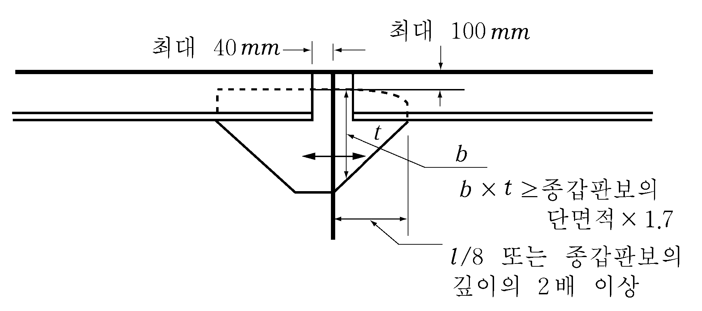
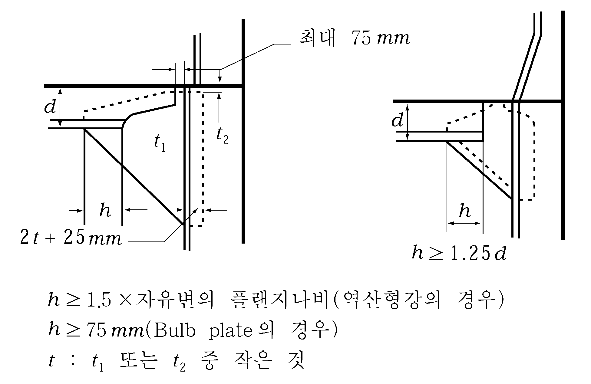

# 제3편 선체구조

> 선급 및 강선규칙/적용지침 / RA-03-K / 2025 / KO / Guidance

## 제 10 장 갑판보 (beams)

### 제 1 절 일반사항

#### 102. 보의 단부 고착 【규칙 참조】

- **1.** 종갑판보의 단부고착은 **그림 3.10.1**을 표준으로 한다.
- **2.** 횡갑판보의 브래킷 고착은 **그림 3.10.2**를 표준으로 한다.
  
  **그림 3.10.1** 
  **그림 3.10.2**

#### 106. 특히 긴 기관실구의 보강 【규칙 참조】

기관실구의 길이가 약 20 m 넘는 경우에는 개구의 중앙에 특설 횡갑판보를 설치하여야 한다.

### 제 2 절 갑판하중

#### 201. _s2 의 값 【규칙 참조】

- **1.** **규칙 3장 103.**에 규정한 적하지침서등에 갑판하중 $h$ 의 값을 선장이 용이하게 알 수 있도록 명기하여야 한다.
- **2.** **규 칙 201.**의 **2**항 (4)호에서 “우리 선급이 적절하다고 인정하는 바”라 함은 **1장 203.**의 **2**항 (2)호 (다)를 말한다.

### 제 3 절 종갑판보

#### 303. 단면계수 【 규칙 참조】

선박의 중앙부 전후에 있어서 강력갑판의 갑판구 측선밖에 설치되는 종갑판보의 단면계수에 대하여는 건조블록단위로 선박의 길이 방향으로 **규칙 303.**의 **1**항 및 **2**항의 규정을 이용 보간법으로 구하여도 좋다. 다만 건조블록의 길이가 15 m 를 초과할 때에는 적절히 분할한다.

### 제 4 절 횡갑판보

#### 402. 모양 【규칙 참조】

- **1.** 횡갑판보의 길이와 깊이의 비가 강력갑판에서 30 이상, 유효갑판 및 선루갑판에서 40 이상일 경우에는 그 비율에 따라 단면계수를 증가시켜야 한다.
- **2.** 선박의 길이가 200 m 이상인 산적화물선 및 광석운반선 등의 경우 강력갑판 갑판구 측선내에 설치하는 횡갑판보는 좌굴강도를 고려하여 종횡비가 60 이하가 되도록 할 것을 권장한다. 
