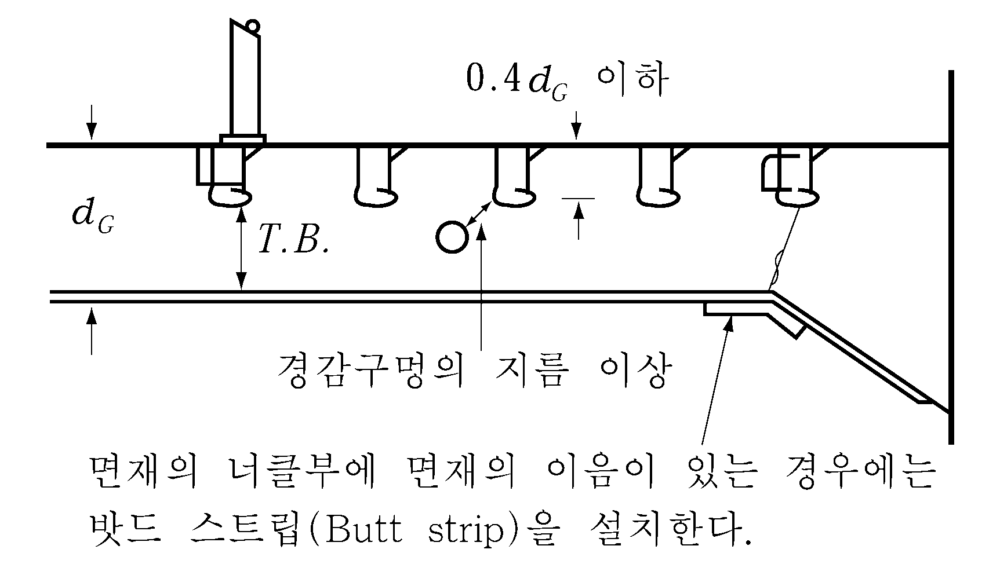
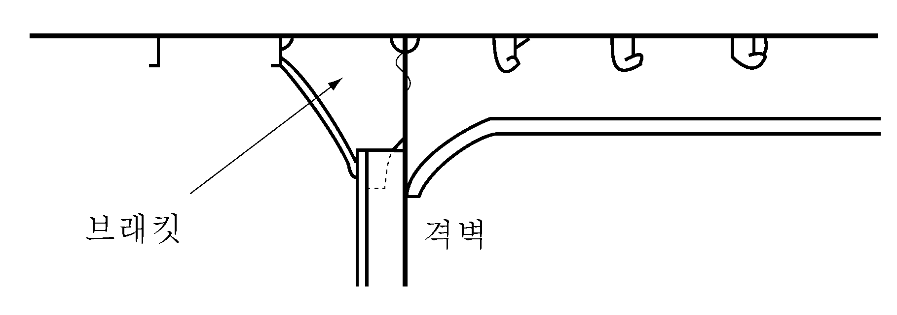
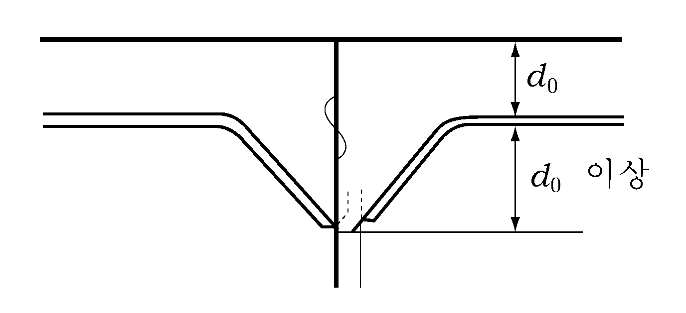
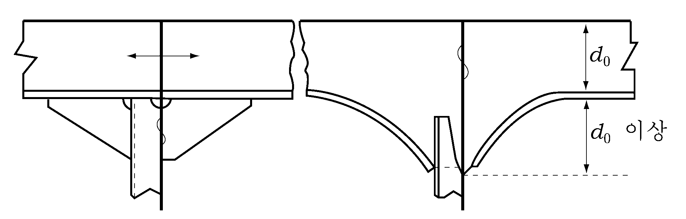
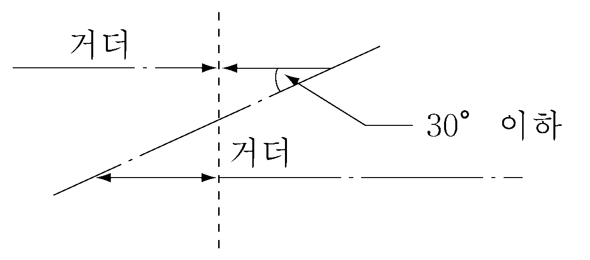

# 제3편 선체구조

> 선급 및 강선규칙/적용지침 / RA-03-K / 2025 / KO / Guidance

## 제 11 장 갑판거더

### 제 1 절 일반사항

#### 103. 구조 【규칙 참조】

- **1.** 필러 상부 및 하부 등 집중하중을 받는 곳에는 거더에 트리핑 브래킷을 설치하고 슬롯이 있는 곳은 칼라를 부착한다. 선루단 격벽의 하부에는 칼라만 부착하여도 좋으며 브래킷 내단부의 슬롯에도 칼라를 부착한다.
- **2.** 거더 웨브의 맞대기 이음에는 슬롯의 코너부를 피하고 면재의 맞대기 이음은 너클부를 피한다. 다만, 부득이한 경우 너클부에 이음이 올 때에는 **그림 3.11.1**과 같이 밧드 스트립(butt strip)을 설치한다. 슬롯의 깊이는 0.4$d_G$ 이하로 하고 그것을 넘을 경우에는 칼라를 부착한다. 다만, 0.5$d_G$ 를 넘어서는 아니되며 상부구조에 대하여는 적절히 참작하여도 좋다.
  
  **그림 3.11.1**
- **3.** 경감 구멍의 크기는 다음에 따른다. 한편 경감 구멍은 브래킷 선단이나 또는 필러 하부의 전단력이 크게 되는 부분에는 설치하지 않는다. 경감구멍과 슬롯과의 거리는 경감구멍의 지름 이상으로 한다.
  슬롯이 있는 경우 : $d \leq \frac{d_G}{4}$
  슬롯이 없는 경우 : $d \leq \frac{d_G}{3}$
  $d_G$ : 거더의 깊이
  $d$ : 경감구멍의 지름
- **4.** 롤온․롤오프선 등의 거더의 치수는 직접강도계산에 의하여 정하여도 좋다.
- **5.** 다음 식에 의한 값이 1.6 이상인 경우 거더 길이의 중앙부 부근에 있는 선측 또는 격벽측의 보에 대하여는 특별히 고려하여야 한다.
  $\frac{I _b l ^4}{I _g S b ^3}$
  $I_b$ 및 $I_g$ : 각각 보 및 거더의 실제 단면2차모멘트 (cm^4)
  $b$ 및 $l$ : 각각 보 및 거더의 스팬 (m)
  $S$ : 보의 간격 (m)

#### 104. 단부의 고착 【규칙 참조】

- **1.** 거더의 단부가 격벽판에서 끝날 경우에는 **그림 3.11.2**와 같이 반대측에 브래킷을 설치한다.
- **2.** **갑판 종거더의 연속성**
  - **(1)** 브래킷의 깊이는 웨브 깊이의 2배를 표준으로 하며 이보다 작을 경우에는 적절히 보강할 필요가 있다.(**그림 3.11.3** 참조)
    
    **그림 3.11.2** 
    **그림 3.11.3**
  - **(2)** 중앙 횡단면의 단면계수에 산입되는 거더는 **그림 3.11.4**와 같이 웨브 및 면재를 모두 격벽을 관통시키든지, 또는 이와 동등의 효력을 갖도록 고착시킨다.
  - **(3)** 갑판 종거더가 불연속으로 되는 경우에는 인접하는 거더와 충분히 겹치도록 한다.(**그림 3.11.5** 참조) 
    
    **그림 3.11.4** 
    **그림 3.11.5**
