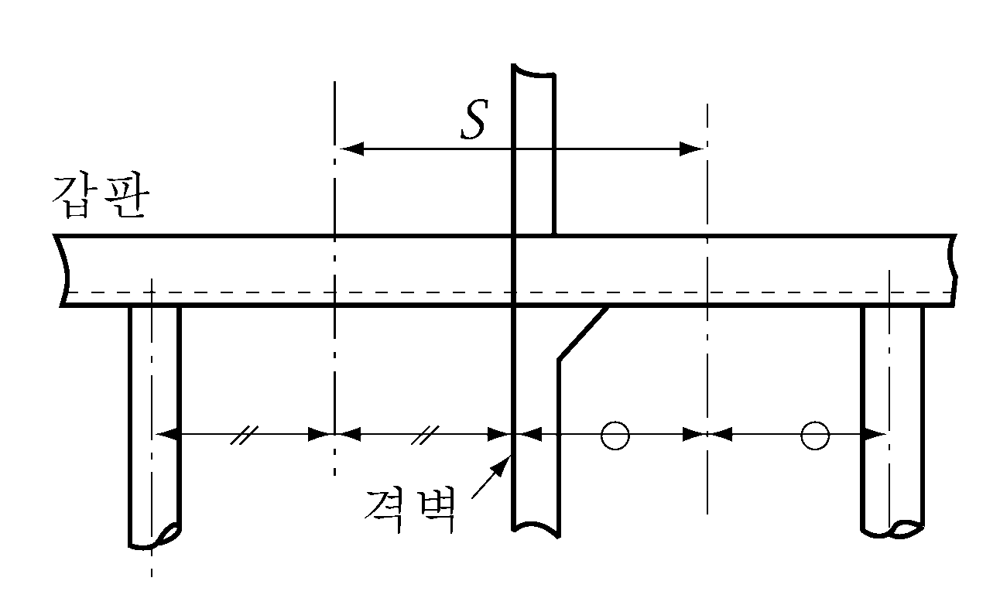
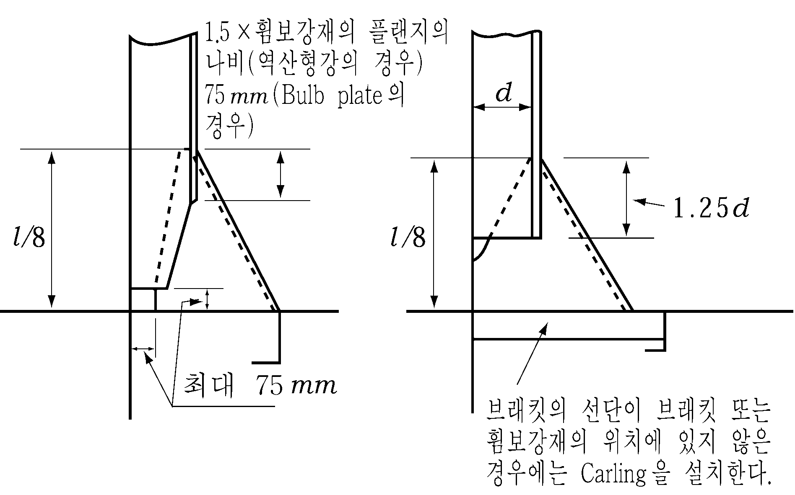
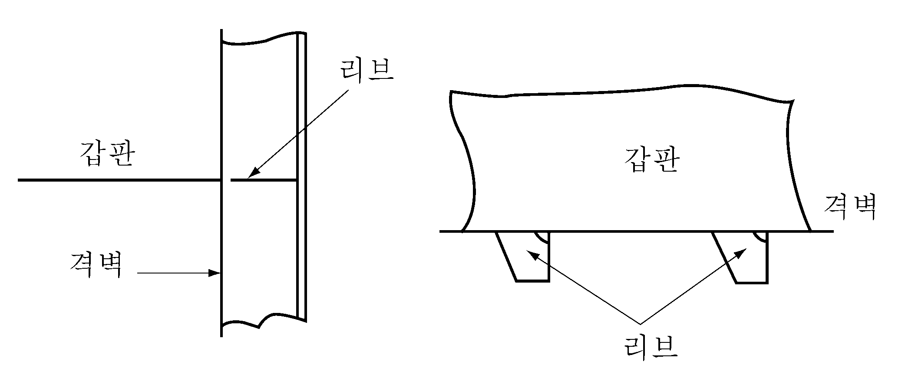
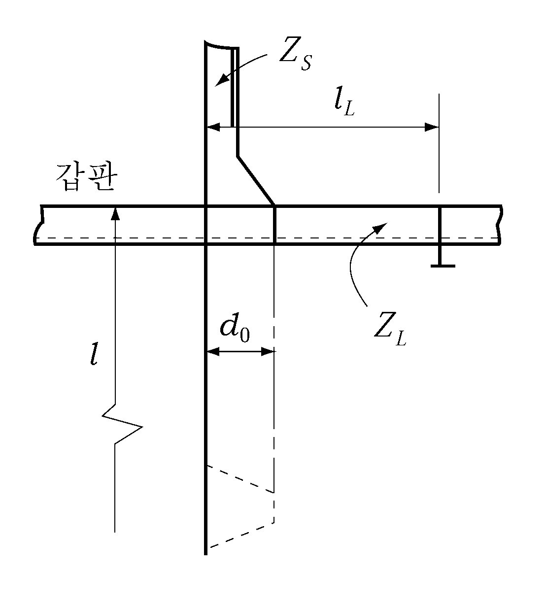
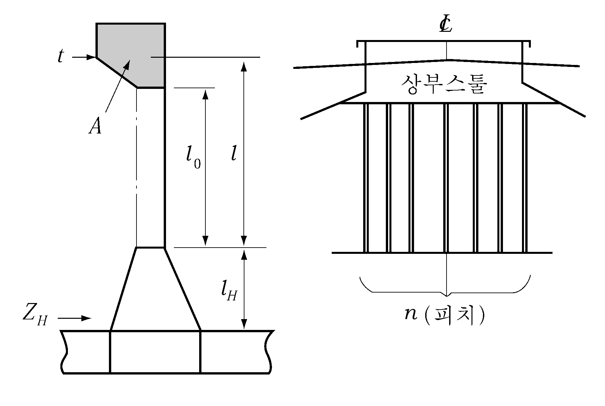
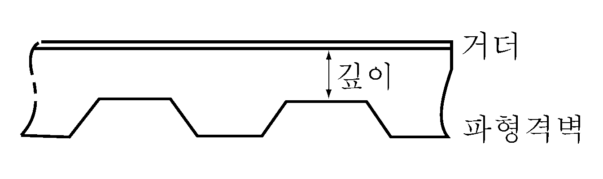
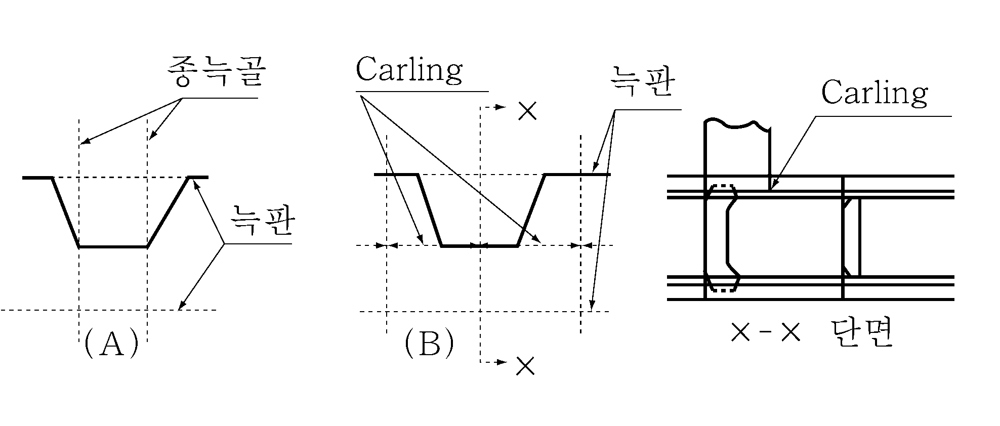
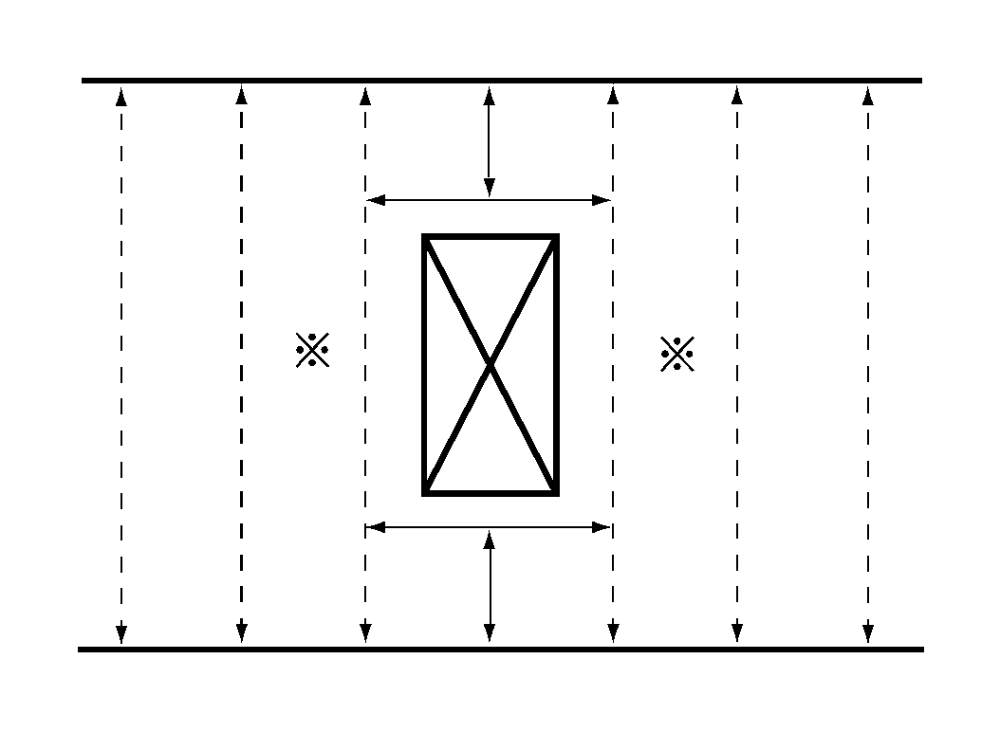

# 제3편 선체구조

> 선급 및 강선규칙/적용지침 / RA-03-K / 2025 / KO / Guidance

## 제 14 장 수밀격벽

### 제 2 절 수밀격벽의 배치

#### 201. 선수격벽 【규칙 참조】

- **1.** 선수문을 설치한 선박의 건현갑판 바로위의 갑판 이하의 선수격벽은 **규칙 201., 202.** 및 **205.**의 (2)호의 규정에 적합하여야 한다.
- **2.** 규칙중에서󰡒우리 선급의 승인을 받은 경우󰡓라 함은 하기만재흘수선에 대응하는 재화상태(트림은 무시)에 있어서 선수격벽보다 전방의 구획이 침수한 경우에 격벽갑판의 어느 부분에도 수몰하지 않음을 입증하는 계산서를 제출하여 우리 선급이 적합하다고 인정하는 경우를 말한다.

#### 204. 화물창내 격벽 【 규칙 참조】

- **1.** 격벽사이의 간격이 $0.7 \sqrt {L}$(m) 미만인 경우에는 이들의 격벽을 1개로 간주한다.
- **2.** **규칙 204.**의 **2**항 중 우리 선급이 인정하는 경우란 손상시 복원성 또는 구획기준에 관한 국제협약 또는 선적국의 관련법규를 따르는 선박과 다음의 **3**항을 따르는 기타의 선박을 말한다.
- **3.** **기타 선박의 생략기준**
  - **(1)** 수밀격벽의 배치는 하기만재흘수까지 적재한 상태에서 기관실을 제외한 어느 한 구획이 침수된 후에도 최종 수선이 격벽갑판의 선측에 있어서 상면을 넘지 아니하는 한, 규칙과 다른 배치로 할 수 있다. 이 경우 침수계산에 사용되는 침수율은 다음과 같이 한다. 다만, 특수한 화물을 적재할 경우에는 화물의 종류에 따라 적절한 값으로 한다.
    화물창 :
    공창인 경우 0.95
    일반화물을 적재한 경우 0.60
    목재를 적재한 경우 0.55
    광석을 적재한 경우 0.50
    자동차 또는 컨테이너를 적재한 경우 $0.95 - 0.35 \times \frac{V_C}{V_0}$
    여기서, $V_C$ 는 자동차 또는 컨테이너가 점유하는 용적, $V_0$ 는 구획의 형용적
    디프 탱크 :
    액체를 만재한 경우 0
    공창인 경우 0.95
- **4.** 선박의 길이가 186 m 이상인 선박의 화물창내 격벽의 수는 **3**항의 규정을 준용하여 정한 것 이상으로 한다.

#### 207. 체인로커 【규칙 참조】

**1 . 규 칙 207.**의 **1**항에서의󰡒분리된 체인로커들 사이에 위치한 격벽이나, 체인로커들의 공통 경계를 이루는 격벽󰡓은 **그림 3.14.1**을 참조한다.

### 제 3 절 수밀격벽의 구조

#### 303. 휨보강재 【규칙 참조】

- **1.** **갑판 종거더를 지지하는 격벽휨보강재의 치수**
  갑판 종거더를 지지하는 격벽휨보강재의 치수는 다음 식을 만족할 필요가 있다.
  $C \frac{Z_0}{Z} +\frac{W}{A} \leq C$
  $Z_0$ : 휨보강재의 규정의 단면계수 (cm^2)
  $Z$ : 실제의 단면계수 (cm^3)
  $A$ : 휨보강재의 단면적 (cm^2)(유효폭 포함).
  $W$ : 휨보강재에 걸리는 축하중으로 다음에 따른다.
  $W = S b h$(kN)
  $S$ : 격벽휨보강재가 지지하는 갑판 종거더의 중심 사이의 거리 (m)(**그림 3.14.2** 참조)
  $C$ : 17.7
  $b$ 및 $h$ : **규칙 11장 201.**의 규정에 따른다. 다만, 이층갑판 이상의 경우에는 상층 갑판에 대한 $W$ 는 고려할 필요가 없다.
  
  **그림 3.14.2** #eqnID-1015 **의 측정방법**
- **2.** 하역장치 하부의 갑판 종거더를 지지하는 격벽휨보강재의 치수
  데릭 또는 크레인 등 하역장치 하부에 있는 갑판 종거더를 지지하는 격벽휨보강재의 단면계수는 해당 휨보강재에 작용하는 축하중 $W$ 을 다음 식의 값으로 하여 **1**항의 규정을 준용한다. 또한, 해당 휨보강재가 갑판 종거더를 지지하지 않는 경우에는 다음 식의 제 **1**항을 0으로 하여 **1**항의 규정을 준용한다.
  $W = S b h + P$(kN)
  $S$, $b$, $h$ : **1**항에 따른다.
  $P$ : 해당 하역장치의 중량 (kN). 다만, 데릭장치의 경우에는 그 형식과 붐의 배치에 따라 **표 3.14.1**의 값으로 하여도 좋다.

  **표 3.14.1 데릭 장치의 자중**

  | 데릭의 형식 붐의 배치 | 독립형 | 문형 |
  | --- | --- | --- |
  | 선수미 한방향으로만 붐이 있는 경우 | 2.0$w$ | 2.3$w$ |
  | 선수미 양방으로 붐이 있는 경우 | 2.7$w$ | 3.0$w$ |
  | (비고) $w$ 는 해당 데릭장치 붐의 제한하중 (kN). 다만, 선수미 양방으로 붐이 있는 경우에는 제한하중의 평균치로 한다. |   |   |
- **3.** 휨보강재의 브래킷의 치수는 **그림 3.14.3**과 같이 한다.
- **4.** 갑판에 있어서 격벽으로 단절될 때에는 **그림 3.14.4**와 같이 그 갑판의 개소에서 휨보강재에 리브를 설치한다.
  
  **그림 3.14.3** 
  **그림 3.14.4 리브**

#### 304. 파형격벽 【규칙 참조】

- **1.** **파형격벽의 단면계수**
  - **(1)** 파형격벽의 단부고착이 특히 견고한 경우 1/2 피치에 대한 단면계수를 계산할 경우에는 **규칙 304.**의 **2**항의 식 중 계수 $C$ 를 **표 3.14.2**에 의한 값으로 할 수 있다. 여기서, 특히 견고한 경우라 함은 다음 중 어느 하나의 경우를 말한다.

    **표 3.14.2** $C$**의 값**

    | 난 | 일단 타단 | 거더로 지지 | 상단을 갑판에 고착 | 상단을 스툴에 고착 |
    | --- | --- | --- | --- | --- |
    | 1 | 거더로 지지 하단을 갑판 또는 이중저에 고착 | 규칙에 따름 | $\frac{4}{2+m_1 +\frac{Z_2}{Z_0}}$ | $\frac{4}{2+m_2 +\frac{Z_2}{Z_0}}$ |
    | 2 | 하단을 스툴에 고착 | ${4.8 \left(1+\frac{l_H}{l}\right)}^\frac{2}{2 + \frac{Z_1}{Z_0} + \frac{Z_H}{Z_0}}$ | ${4.8 \left(1+\frac{l_H}{l}\right)}^\frac{2}{2 + m_1 + \frac{Z_H}{Z_0}}$ | ${4.8 \left(1+\frac{l_H}{l}\right)}^\frac{2}{2 + m_2 + \frac{Z_H}{Z_0}}$ |
    | 2 | 하단을 스툴에 고착 | 다만, 1란의 값 미만으로 하여서는 아니 된다. |   |   |
    | (비고) $Z_0$, $Z_1$ , $Z_2$ , $l_H$ 및 $l$ : 규칙에 따른다. $m_1$ : 상단에 있어서 다음 식에 의하여 정한 값. $\frac{1}{Z_0} \left\{Z_S +\left(\frac{l_L + d_0}{l_L - d_0} +1.0 \right) Z_L}\right\}$ 다만, $Z_1 /Z_0$ 을 넘을 때에는 $Z_1 /Z_0$ 으로 한다. $Z_S$ : 상단의 연속 휨보강재의 단면계수 (cm^3)(**그림 3.14.5** 참조) $l_L$, $Z_L$ : 각각 상단에 결합되는 종통재의 스팬 (m) 및 단면계수 (cm^3)(**그림 3.14.5** 참조) $d_0$ : 규칙에 따른다. $m_2$ : 다음 2개의 식 중 작은 것. $\frac{1}{Z_0} \times \frac{1.050A t}{n}$ $3.6 \left({\frac{l}{l_0}}\right)^2 -3$ $A$ : 상부 스툴의 주위벽으로 둘러싸인 면적(**그림 3.14.6** 참조) $t$ : 상부 스툴의 주위벽의 평균두께 (mm)(**그림 3.14.6** 참조) $n$ : 상부 스툴에 지지되는 파형의 피치 수(**그림 3.14.6** 참조) $l_0$ : 상하 스툴의 내단사이의 거리 (m)(**그림 3.14.6** 참조) $Z_H$ : 하부 스툴 하단의 1/2 피치에 대한 단면계수 (m^3)(**그림 3.14.6** 참조) |   |   |   |   |
    - **(가)** 파형격벽의 상단을 갑판에 고착하는 경우로서 **표 3.14.2**의 $m_1$ 의 값이 0.2보다 큰 경우
    - **(나)** 파형격벽의 상단을 스툴에 고착하는 경우로서 **표 3.14.2**의 $m_2$ 의 값이 0.6보다 큰 경우
    - **(다)** 파형격벽의 하단을 스툴에 고착하는 경우로서 스툴부의 두께가 파형면재의 두께의 1/2 이상인 경우
- **2.** **파형격벽의 구조**
  - **(1)** 갑판 종거더의 단부에는 휨보강재를 설치한다.
  - **(2)** 브래킷 선단이 격벽판에 붙는 곳에는 Pad 또는 Carling을 붙인다.
  - **(3)** 파형의 각도는 45° 이상으로 한다.
  - **(4)** 파형격벽에 설치하는 거더는 Balanced girder로 한다. 다만, 거더의 강도를 평판격벽에 설치하는 거더와 동등 이상으로 할 경우에는 예외로 한다. 거더의 실제 단면계수의 계산에서는 거더의 깊이는 **그림 3.14.7**과 같이 하고, 파형격벽은 유효판으로 산입하여서는 아니된다.
  - **(5)** 파형격벽의 하부는 **그림 3.14.8**의 (A) 또는 (B)와 같은 구조로 한다. 또한, 상단의 구조는 하단의 구조에 따르는 것이 좋다.
    
    **그림 3.14.5** 
    **그림 3.14.6**
    
    **그림 3.14.7 거더의 깊이 측정방법** 
    **그림 3.14.8**

### 제 4 절 수밀문

#### 402. 수밀문의 형식 【규칙 참조】

- **1.** 수밀격벽에 설치하는 수밀문은 가능한 한 슬라이딩식으로 한다. 만일 힌지식으로 할 경우에는 쉽게 접근할 수 있는 장소에 설치하고 화물 등에 의한 손상을 받지 아니하도록 장치하여야 한다.
- **2.** 여객선의 경우, 수밀문 및 그 제어장치는 **표 3.14.3** 및 **SOLAS II-1** / **13.5.3, II-1** / **13.7.1.2.2**에 따른다. *(2020)*

#### 403. 강도와 수밀성 등 【규칙 참조】

**규칙 403.**의 **1**항의 “우리 선급이 필요하다고 인정하는 경우”란 다음의 (1)호 내지 (3)호에서 명시한 것 이외의 경우를 말한다.

#### 404. 조작 및 항해 중 사용빈도 (2020) 【규칙 참조】

- **1.** **규칙 404.**의 규정에 따라 원격조작이 요구되는 경우에 있어서 원격조작용 동력장치가 필요한 것에 대해서는, 원격제어장소에 동력장치 구동을 위한 수단을 설치하여야 한다. 이러한 원격제어장치의 작동과 관련하여 여객선의 경우 **SOLAS II-1/13**의 규정을 따른다. 파이프 터널로부터 주 펌프실로 접근하기 위한 상설통로가 있는 탱커의 경우, 수밀문은 주 펌프실 입구 외부에서 수동으로 폐쇄 할 수 있어야 한다.
- **2.** **규 칙 404.**의 **2**항의 적용에 있어, 여객선의 경우, 수동으로 조작 할 수 있는 각도는 15도이다.
- **3.** **표 3.14.3**에 표시된 경우, 여객선의 경우 선교에서 동력에 의한 원격폐쇄가 가능하여야 하며, **SOLAS II-1/13 7.1.4**에서 요구하는 바에 따라, 격벽갑판 상에 있는 위치에서 수동으로 폐쇄 할 수 있어야 한다.
- **4.** **규칙 404.**의 규정에 따라 원격조작이 요구되는 경우, 제어장치는 다음에 따른다.
  - **(1)** 항해선교의 제어장치에는 다음의 두 가지 모드로 전환할 수 있는 마스터스위치(master switch)가 있어야 한다. 이 스위치는 통상적으로 “국소제어” 모드에 있어야 하며, “문폐쇄” 모드는 비상시 또는 점검 목적으로만 사용하여야 한다. 또한, 마스터 스위치에 대한 신뢰성에 특별한 주의를 하여야 한다. 이 요건은 여객선에 적용되어야 한다.
    - **(가)** 국소제어 모드 : 어떠한 문에 있어서도 설치장소에서 개방하고, 사용 후는 자동 폐쇄장치를 사용하지 않고 설치장소에서 폐쇄하는 제어모드
    - **(나)** 문폐쇄 모드 : 어떠한 문에 있어서도 선박이 똑바른 상태에서 60초 내에 자동적으로 폐쇄하는 모드. 설치장소에서 개방할 수 있어야 하며 국소제어장치의 해제상태에서는 자동적으로 폐쇄되어야 한다.
  - **(2)** 항해선교에 있는 제어장치에는 각 문의 위치를 표시한 도표 및 각 수밀문의 개폐상태를 가시적으로 나타내는 표시장치를 설치하여야 한다. 이 표시장치는 수밀문이 개방되어 있을 때는 홍등, 완전히 폐쇄되어 있을 때는 녹등이 표시되는 것으로서, 원격폐쇄 작동 중에는 홍등의 점멸로 즉각적인 상태를 나타내어야한다. 표시장치의 회로는 수밀문의 동력제어 장치에 대해 독립적으로 운용되어야 한다. 이 요건은 여객선 및 화물선에 적용되어야 한다.
- **5.** **규칙 404.**의 규정에 따라 원격조작이 요구되는 경우, 해당 수밀문에는 원격제어 모드 중에 국소제어 조작하는 방법을 안내하는 표시판/지침서가 배치되어 있어야 한다.
- **6.** **규칙 404.**의 적용에 있어, 수밀문이 방화문에 근접하여 설치되는 경우, 두 문은 각각 독립적으로 두 문의 양쪽에서 조작 가능하여야 한다. 이때 원격조작이 요구되는 경우도 동일하다. 수밀문은 방화문 역할도 할 수는 있다. 그러나 화물선에 설치되거나 여객선의 격벽 갑판 아래에 설치된 경우 방화시험을 받을 필요는 없다. 여객선의 격벽 갑판 상방에 설치된 문의 경우에는 설치된 위치의 화재등급에 대하여 FTP 코드에 따라 시험되어야 한다. 자동 폐쇄 (self closing)를 보장할 수 없는 경우, 문의 개폐 상태를 선교에 알려주는 수단 및 '항해 중 개방금지'의 경고판이 대안으로 설치되어야 한다.
- **7.** **규칙 404.**의 “항해선교”란 항상 당직 사관이 근무하고 있는 장소를 의미하며, 통상적으로 항해선교 갑판실을 의미한다.
- **8.** **규칙 404.**의 **2**항의 적용에 있어, 경사한 선박의 조작 성능은 원형시험(prototype test) 등으로 검증된다. *(2022)*
- **9.** **규칙 404.**의 **2**항의 적용에 있어, 동력으로 조작 가능한 문은 동력뿐만 아니라 수동으로도 문의 개폐가 가능해야 한다. *(2022)*
- **10.** **규칙 404.**의 **1**항에서 요구하는 “개방을 방지하기 위한 장치”는 조작장치 또는 폐쇄장치 자체에 열쇠를 설치하는 등의 조치를 말한다. *(2021)*
- **11.** **여객선 수밀문의 범주(category)** ***(2025)***
  - **(1)** Category B
    **SOLAS II-1/22.3**에 따라, 항해 중 문 바로 근처에서 작업을 할 때 개방을 필요로 하는 수밀문. 문을 개방해야 하는 작업이 끝나면 즉시 폐쇄해야 한다.
  - **(2)** Category C
    **SOLAS II-1/22.3**에 따라, 항해 중 승객이나 선원의 통행을 위하여 개방 할 수 있는 수밀문. 통행이 완료되면 즉시 폐쇄해야 한다.
  - **(3)** Category D
    항해 시작 전에 폐쇄되어야 하며, 항해 중에는 폐쇄된 상태로 유지되어야 하는 수밀문.
    - **(가)** **SOLAS II-1/13.9**에 따라 허용되는 기관구역의 폭이 1.2m를 초과하는 수밀문. **SOLAS II-1/22.4**에 따라 선장이 긴급한 필요성이 있다고 판단하는 경우를 제외하고는 항해 중에는 폐쇄되어 있어야 한다.
    - **(나)** 또한 **SOLAS II-1/13.8.1**에 따라 갑판 구역 사이의 화물을 분리하거나 **SOLAS II-1/14.2**에 따라 화물 구역을 분리하는 수밀격벽에 설치되는 수밀문은 **SOLAS II-1/22.5**에 따라 항해 시작 전에 폐쇄되어야 하고, 항해 중에는 폐쇄상태를 유지해야 한다.

#### 405. 표시장치 【규칙 참조】

- **1.** 수밀확보를 위해 조임핸들(dogs) 또는 클리트(cleat)가 장착된 수밀문의 경우, 모든 조임핸들 또는 클리트가 적정한 위치에서 적절히 작동하는지를 보여주기 위하여 **규칙 405.**의 **1**항의 표시장치를 설치하여야 한다.
- **2.** **규칙 405.**의 **1**항의 적용에 있어, 모든 조임핸들 또는 클리트가 적정한 위치에서 적절히 작동하는지를 쉽게 확인할 수 있도록 설계된 문에 대하여는 표시장치를 설치할 필요는 없다.
- **3.** **규칙 405.**에서 요구하는 표시장치는 자체 진단형 (self monitoring type)이어야 하며, 해당 수밀문의 위치에서 시험기능을 갖추어야 한다.
- **4.** **규칙 405.**의 **2**항에서 요구하는 표시장치는 문이 원격폐쇄 작동중임을 (예, 홍등) 주의환기 할 수 있는 것이어야 한다.

#### 406. 경보장치 (2020) 【규칙 참조】

- **1.** **규칙 406.**의 가청 경보장치는 문이 움직이기 시작하면서부터 완전히 폐쇄될 때까지 폐쇄장치가 작동하는 것을 가청으로 경보하여야 한다. 또한 그 구역의 다른 경보와는 구별되는 가청경보가 제공되어야 한다. 여객선의 경우, 경보는 문이 움직이기 시작하기 전 최소 5초에서 10초 사이에 울리기 시작해서 문이 폐쇄될 때까지 계속해서 경보가 울려야 한다.
- **2.** 수동조작에 의한 원격 폐쇄의 경우, 문이 실제로 움직이는 동안에만 경보가 울리도록 요구된다. 승객 구역과 주변 소음이 높은 구역에서는, 가청경보장치에 더해 문 양쪽에 시각신호로 보완하여야 한다.
- **3.** 독립식 또는 중앙식 유압장치에 의하여 작동되는 슬라이딩 문을 포함한 모든 수밀문에는 저액위 경보 또는 저 가스압력 경보 또는 가능한 한 유압식축압기 (hydraulic accumulator)에 축적된 에너지 손실을 모니터링하기 위한 기타 수단이 제공되어야 한다. 이 경보는 가시 및 가청이어야 하며, 여객선의 경우 항해선교의 중앙제어콘솔에 화물선의 경우 항해선교에 있어야 한다. *(2021)*

#### 407. 전원 【규칙 참조】

**규칙 407.**의 **2**항의 “전기설비”는 문의 개폐를 위한 전기모터와 제어기, 개폐상태를 표시하는 표시장치, 가청 경보장치, 폐쇄상태를 확인하기 위한 리미트 스위치 (limit switch) 및 관련 케이블을 의미한다. 이들 전기설비에 대한 보호 등급은 (KS C) IEC 60529에 따른 IPX6 이상이어야 한다. 다만, 여객선의 경우에는 다음에 적합하여야 한다.

#### 409. 슬라이딩 문 【규칙 참조】

- **1.** 슬라이딩문의 좌우의 휨보강재(**그림 3.14.9**의 ※표시)의 단면계수는 **규칙 15장 203.**의 디프탱크 격벽 휨보강재에 대한 식에 의한 것 이상이어야 한다. 다만 $h$ 의 상단점은 선체 중심선에 있어서 격벽갑판까지로 한다.
  
  **그림 3.14.9**

#### 412. 시험 (2021) 【규칙 참조】

- **1.** 침수의 평형 또는 중간단계에서 물에 잠기지 않지만, 평형상태를 넘어 요구되는 양의 복원성 범위 내의 경사각도에서 간헐적으로 물에 잠기는 문(건현 또는 격벽 갑판 상부 수밀문)은 사수시험을 하여야 한다.
- **2.** 압력시험
  - **(1)** 압력시험에 사용되는 수두는 문이 설치된 위치에서, 최소한 문 개구부의 하단 모서리에서부터 격벽갑판 또는 건현갑판까지의 수두와, 해당되는 경우, 가장 불리한 손상수면까지 계측한 수두 중 가장 큰 값이어야 한다. 시험은 선박에 설치하기 전에 공장 또는 시험설비를 갖춘 안벽에서 수행 될 수 있다.
  - **(2)** 허용 가능한 누설 기준은 다음과 같다:
    - 가스켓이 있는 문 누설 없음
    - 금속 씰이 있는 문 분당 최대 1리터
  - **(3)** 컨베이어 터널에 위치한 길로틴 문 또는 개스킷 씰을 사용한 화물구역 내의 대형 문에 대한 시험의 경우, 다음의 식에 따라 누설량이 허용될 수 있다.
    누설률 (liter / min) = $\frac{(P + 4.572) \times h^3}{6},568$
    여기서,
    $P$ : 문 개구부의 둘레 ($\mathrm{m}$)
    $h$ : 시험 수두 ($\mathrm{m}$)
  - **(4)** 구조치수를 결정하기 위해 사용된 수두가 6.10 $\mathrm{m}$를 넘지 않는 문의 경우, 계산된 누설률은 0.375 liter/min보다 클 필요 없다.
  - **(5)** 통상적으로 개방되어 있고 항해 중 사용되거나 평형 또는 중간수면에서 물에 잠기게 되는 여객선의 문의 경우, 문의 중심선상의 문턱 상방 최소 1 $\mathrm{m}$ 높이의 수두에 해당하는 힘에 대하여 문이 완전히 폐쇄되는지 확인하기 위하여 문의 양쪽에서 원형시험을 수행하여야 한다.
- **3.** 모든 수밀문은 선박에 설치된 후 **적용지침 1편 부록 1-16**에 따라 사수시험을 받아야 한다. 침수에 대한 노출이 한 쪽에서만 예상되는 경우가 아니라면, 사수시험은 문의 양쪽 측면에서 수행되어야 한다. 기관, 전기장치 절연재 또는 의장품에 대해 발생 가능한 손상때문에 사수시험이 실행 불가능한 경우, 초음파 누설시험 또는 이와 동등한 시험으로 대체될 수 있다. 

  | 위치 | 1. | 2. | 3. | 4. | 5. | 6. | 7. | 8. |
  | --- | --- | --- | --- | --- | --- | --- | --- | --- |
  | 위치 | 규정 | 구분 | 유형 | 원격폐쇄 | 원격표시 | 가시/가청 폐쇄 경보 | 경고 | 비고 |
  | (1) 격벽갑판 하부 | SOLAS II-1/10，13.4, 13.5.1, 13.5.2, 13.6.1에서 13.6.8, 13.7.1, 13.7.3, 13.7.4, 16.2, 22.1 및 22.3 | B, C | POS | Yes | Yes | Yes (local) | No | 항해 중 개방될 수 있는 여객선의 수밀문에 관한 지침은 IMO MSC.1/Circ.1564를 참조한다. |
  | (1) 격벽갑판 하부 | SOLAS II-1/10 13.8.1, 13.8.2, 16.2, 22.2, 22.5 및 22.13 | D | S, H | No | No | No | Yes |   |
  | (1) 격벽갑판 하부 | SOLAS II-1/10, 13.9, 22.2 및 22.4 | D | POS | Yes | Yes | Yes(local) | No |   |
  | (1) 격벽갑판 하부 | SOLAS II-1/10 및 14.2 | D | S, H | No | Yes | No | Yes |   |

  | 위치 | 1. | 2. | 3. | 4. | 5. | 6. | 7. | 8. |
  | --- | --- | --- | --- | --- | --- | --- | --- | --- |
  | 위치 | 규정 | 구분 | 유형 | 원격폐쇄 | 원격표시 | 가시/가청 폐쇄 경보 | 경고 | 비고 |
  | (2) 격벽갑판 상 또는 상부와 최저 중간 수선 또는 최종 평형 수선 하부 | SOLAS II-1/10， 16.2, 17.2, 22.1, 및 22.3 | B, C | POS | Yes | Yes | Yes (local) | No | 항해 중 개방될 수 있는 여객선의 수밀문에 관한 지침은 IMO MSC.1/Circ.1564를 참조한다. Res.MSC.429(98)/Rev.2 17.2 참조 |
  | (3) 격벽갑판 상 또는 상부와 최저 중간 수선 또는 최종 평형 수선 상부. 요구되는 양의 복원성(positive stability) 범위 내에서 잠기는 수밀문 | SOLAS II-1/17.3 | N/A | POS, POH | Yes | Yes | Yes (local) | No | 계속 개방되어 있어야 하지만, 언제든 즉시 폐쇄할 준비가 되어 있어야 한다. Res.MSC.429(98)/Rev.2. 17.3 참조 |
  | (3) 격벽갑판 상 또는 상부와 최저 중간 수선 또는 최종 평형 수선 상부. 요구되는 양의 복원성(positive stability) 범위 내에서 잠기는 수밀문 | SOLAS II-1/17.3 | N/A | S, H | No | Yes | No | Yes | 통상 폐쇄. 힌지가 있는 문의 경우, 단동식(single action type)이어야 한다. Res.MSC.429(98)/Rev.2. 17.3 참조 |
  | (4) 로로여객선의 격벽갑판 상 또는 상부 | SOLAS II-1/17-1.1.1 to 17-1.1.3, 22.8, 23.3 to 23.9 | N/A | S, H | No | Yes | Yes (remote /local) | Yes | 반드시 폐쇄. SOLAS Reg. II-1/23.6 및 23.8에 따라 주관청은 일부 출입구를 개방하도록 허용할 수 있다. |

  | 격벽 및 건현갑판 관련 위치 | 1. | 2. | 3. | 4. | 5. | 6. | 7. | 8. |
  | --- | --- | --- | --- | --- | --- | --- | --- | --- |
  | 격벽 및 건현갑판 관련 위치 | 규정 | 항해 중 사용 빈도 | 유형 | 원격폐쇄 | 원격표시 | 가시/가청 폐쇄 경보 | 경고 | 비고 |
  | (1) 하부 | SOLAS II-1/15.10, 16.2, 22.7 및 22.13 | 반드시 폐쇄 | S, H | No | Yes | No | Yes |   |
  | (2) 갑판상 또는 상부 | SOLAS II-1/16.2, 17.6, 22.8에서 22.13 | 통상 폐쇄 / 반드시 폐쇄 | S, H | No | Yes | No | Yes | 힌지가 있는 경우, 통상 폐쇄되는 문은 단동식(single action type) 이어야 한다. |
  | (2) 갑판상 또는 상부 | SOLAS II-1/16.2, 17-1, 23.3, 23.5, 23.6 및 23.8 | 통상 폐쇄 / 반드시 폐쇄 | S, H | No | Yes | Yes (remote /local) | Yes |   |

  수밀문의 유형
  - 동력으로 조작 가능한, 슬라이딩 또는 롤링 타입 POS
  - 동력으로 조작 가능한, 힌지 타입 POH
  - 슬라이딩 또는 롤링 타입 S
  - 힌지 타입 H
