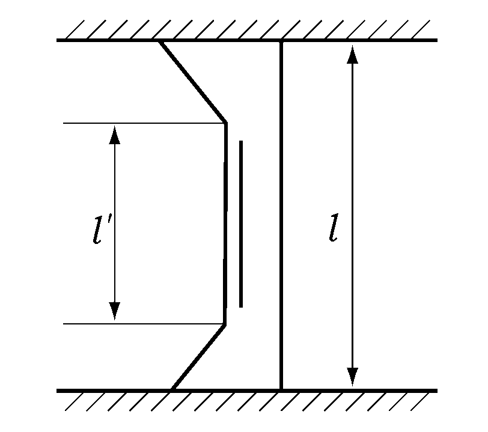
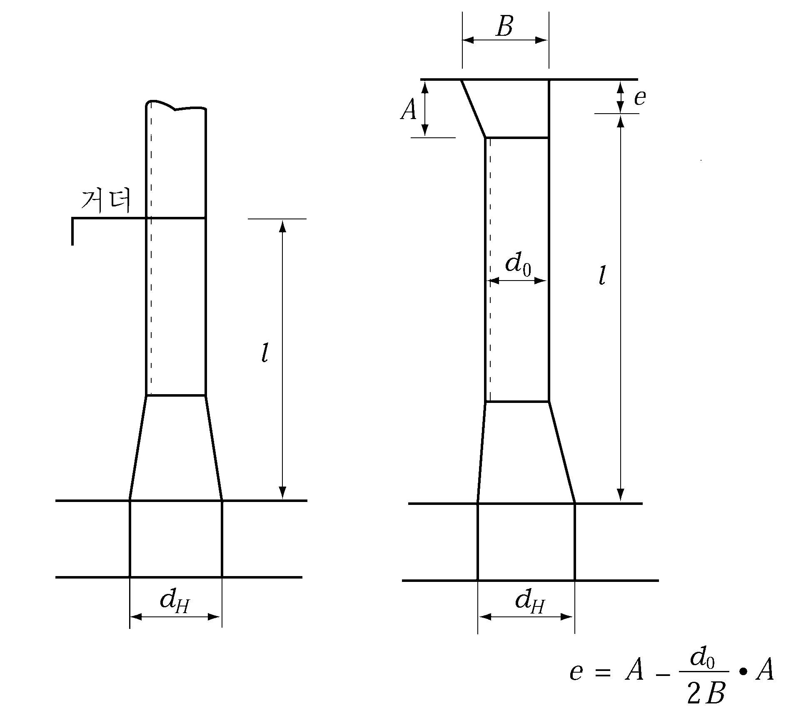

# 제3편 선체구조

> 선급 및 강선규칙/적용지침 / RA-03-K / 2025 / KO / Guidance

## 제 15 장 디프탱크

### 제 1 절 일반사항

#### 103. 제수격벽 【규칙 참조】

- **1.** 디프탱크의 길이는 다음에 정한 길이 이하로 한다. *(2020)*
  - **(1)** 종격벽이 설치되지 않은 경우 또는 선체중심선에만 종격벽을 설치하는 경우 :
- **0.** 15 $L_f$(m) 또는 10 m 중 큰 것.
  - **(2)** 2열 이상의 종격벽을 설치하는 경우 :
- **0.** 2 $L_f$(m). 다만, 산적화물선형의 선수미부에는 0.15 $L_f$(m) 또한 현측탱크의 너비가 $4L + 500$(mm)보다 좁은 경우에는 내측의 격벽을 종격벽으로 보지 아니한다.
- **2.** **제수격벽**
  - **(1)** 선수미창을 제외하고 선박의 전 너비에 걸쳐 있는 디프탱크에는 선체 중심선에 종격벽을 설치한다. 다만, 선박의 안전성능에 관한 자료에 의거 필요없다고 인정하는 경우에는 예외로 한다.
  - **(2)** 선박의 전 너비에 걸쳐 있는 청수탱크, 연료유탱크, 기타 항해시에 만재되지 않는 디프탱크에는 선체중심선 및 선측으로부터 대략 $B/4$ 의 곳에 제수판 또는 디프거더를 설치한다. 다만, 선박의 동요주기 및 탱크내의 액체의 고유주기에 관한 자료에 따라 필요 없다고 인정하는 경우에는 예외로 한다.

#### 104. 최소두께 【규칙 참조】

멤브레인 형식 액화천연가스 운반선의 디프탱크내의 늑판, 거더, 트랜스버스, 스트링거 및 단부브래킷의 최소두께 $t$ 는 다음 식에 의한 것 이상이어야 한다.

### 제 2 절 디프탱크 격벽

#### 202. 격벽판 【규칙 참조】

- **1.** **규칙 202.**에 규정하는 $h$를 산정하는 경우에, 선측 및 선저외판에 대하여는 모든 항해상태에 있어서의 최소흘수, $d_\min$(m)에 상당하는 수두를 공제할 수 있다. 공제수두는 용골 상면에서 $d_\min$, 최소흘수 위치에서 0으로 하며, 중간위치에서는 보간법에 의한다.
- **2.** 멤브레인 형식 액화천연가스 운반선의 화물창내 디프탱크 격벽판의 두께는 **규칙 202.**의 식 중 $\alpha$ 및 $h$를 다음의 값으로 하여 계산한다.
  $\alpha$ : $y$ 의 값에 따라 다음에 의한 $\alpha_1$ 또는 $\alpha_2$. 다만 $\alpha_3$ 이상이어야 한다.
  $\alpha _{1} =17.8 f _{D} \left( \frac{y-y _{B}}{Y '} \right) y \geq y _{B}$ 일 때
  $\alpha _{2} =17.8 f _{B} \left( \frac{y _{B} -y}{y _{B}} \right) y\(\alpha_3 = \beta \left( { \frac{B - 2b}{B}} \right)$
  $h$ : 수두(m)로서 **규칙 7편 5장 413. 2**항의 내압과 다음 식에 의한 $h _{s}$ 중에서 큰 값 *(2018)*
  $h _{s}$ : 슬로싱 압력 $P _{s}$를 10으로 나눈 값.
  $P _{s} =P _{static,100\%FL} + P _{slh} (kN/m ^{2} )$
  $P _{static ,100\%FL}$ : 액체화물의 높이가 탱크 최대 높이인 경우의 정압력 $(kN/m ^{2} )$
  $P _{static ,100\%FL} = \rho g h _{Tank} +P _{PV}$ $(kN/m ^{2} )$
  $P _{slh}$: $P _{slh-l}$ 또는 $P _{slh-t}$
  $P _{slh-l}$ : 종방향 액체운동에 의한 슬로싱 압력으로서 횡격벽에 적용한다.
  $P _{slh-l} = \rho gl _{Tank} f _{slh} \left[ 0.4- \left( 0.39- \frac{1.7l _{Tank}}{L} \right) \frac{L}{350} \right] (kN/m ^{2} )$
  $P _{slh-t}$ : 횡방향 액체운동에 의한 슬로싱 압력으로서 종격벽에 적용한다.
  $P _{slh-t} =7 \rho gf _{slh} \left( \frac{b _{Tank}}{B} -0.3 \right) GM ^{0.75} (kN/m ^{2} )$
  $\rho$ : 액화천연가스 설계 밀도 (ton/m^3).
  $GM$ : 적하지침서에 명시된 해당 적재조건에서의 메타센터 높이(m).
  $l _{Tank}$ : 탱크의 길이 (m).
  $b _{Tank}$ : 탱크의 폭 (m).
  $h _{Tank}$ : 탱크의 높이 (m).
  $h _{fill}$ : 탱크 저부로부터 측정한 액체화물의 높이 (m).
  $P _{PV}$ : 설계 증기압력(kN/m^2). 다만, 25 kN/m^2보다 작아서는 아니된다.
  $f _{slh}$ : 계수로써 다음과 같다.

  | $h _{fill}$ | $f _{slh}$ |
  | --- | --- |
  | 0.0$h _{Tank}$ | 0.0 |
  | 0.1$h _{Tank}$ | $f _{slh} =1.5 \left[ 1-2 \left( 0.3- \frac{h _{fill}}{h _{Tank} ^{2}} \right) ^{2} \right]$ |
  | 0.3$h _{Tank}$ | $f _{slh} =2.0 \left[ 1-2 \left( 0.3- \frac{h _{fill}}{h _{Tank} ^{2}} \right) ^{2} \right]$ |
  | 1.0$h _{Tank}$ | $f _{slh} =1.5 \left[ 1-2 \left( 0.3- \frac{h _{fill}}{h _{Tank} ^{2}} \right) ^{2} \right]$ |
  | $h _{fill}$이 중간값일 경우 $f _{slh}$값 은 보간법에 의한다. |   |
- **3.** 독립형탱크 형식 A를 갖는 가스 운반선의 화물탱크 격벽판의 두께는 규칙 **202.**의 식 중 $C_2$ 및 $h$ 를 다음의 값으로 계산한다.
  $C_2$ : 3.6
  $h$ : 수두 ($\mathrm{m}$)로서, **규칙 7편 5장 413.**의 **2**항의 내압(MPa)에 100을 곱한 값

#### 203. 격벽휨보강재 【규칙 참조】

- **1.** 󰡒견고한 브래킷 고착󰡓의 경우, 브래킷의 암의 길이가 $l/8$ 보다 클 경우에는 격벽휨보강재의 스팬은 $4 l'/3$ 로 하여 계산한다.(**그림 3.15.1** 참조)
- **2.** 디프탱크 정부에서 휨보강재가 갑판사이 격벽휨보강재와 서로 일치하지 않을 경우에는 반드시 브래킷 고착으로 할 필요가 있다.
- **3.** 갑판 종거더를 지지하는 격벽휨보강재의 치수는 **14장 303.**의 **1**항의 식 중 $C$ 를 9.81로 하여 정한 것으로 한다.
  **4 . 규 칙 203.**에 규정하는 $h$를 산정하는 경우에, 선측외판에 대하여는 모든 항해상태에 있어서의 최소흘수, $d_\min$(m)에 상당하는 수두를 공제할 수 있다. 공제수두는 용골 상면에서 $d_\min$, 최소흘수 위치에서 0으로 하며, 중간위치에서는 보간법에 의한다.
- **5.** 멤브레인 형식 액화천연가스 운반선의 화물창내 디프탱크 격벽 휨보강재의 단면계수 $Z$는 다음 식에 따른다.
  $Z=90C _{1} C _{2} C _{3} S h l ^{2} \mathrm{cm ^{3} }$
  $h$ : **202.**의 **2**항에 따른다.
  $C_1$, $S$ 및 $l$ : **규칙 7편 10장 105.**에 따른다.
  $C_2$ : 다음 식에 의한 값.
  $C_2 = \frac{K}{18}$
  다만, $h_1$ 에 대한 $C_2$ 의 값은 다음 식에 따른다.
  종늑골 방식의 종격벽인 경우 : $C_2 = \frac{K}{24 - \alpha K}$ , 최소값 $C_2 = \frac{K}{18}$
  횡늑골 방식의 종격벽 및 횡격벽인 경우 : $C_2 = \frac{K}{18}$
  $\alpha$ : $y$ 의 값에 따라 다음에 의한 $\alpha_1$ 또는 $\alpha_2$. 다만 $\alpha_3$ 이상이어야 한다.
  $\alpha _{1} =17.8 f _{D} \left( \frac{y-y _{B}}{Y '} \right) y \geq y _{B}$ 일 때
  $\alpha _{2} =17.8 f _{B} \left( \frac{y _{B} -y}{y _{B}} \right) y\(\alpha_3 = \beta \left( { \frac{B - 2b}{B}} \right)$
  $C_3$ : 휨보강재 끝단의 고착조건에 따른 계수로서 **규칙 7편 10장 표 7.10.6**에 따른다.
- **6.** 독립형탱크 형식 A를 갖는 가스 운반선의 화물탱크 격벽 휨보강재의 단면계수는 다음 식에 따른다. 다만, 화물이 강재에 대하여 부식을 일으키지 않음이 확인 되는 경우에는 상기 식에 의한 값에 0.85를 곱한 값으로 할 수 있다.
  $Z=100C _{1} C _{2} S h l ^{2} \mathrm{cm ^{3} }$
  $h$ : **규칙 7편 5장 413.**의 **2**항의 내압을 10으로 나눈 값
  $C _{1}$ : 다음에 따른다.
  $\left. C _{1} = \max \left( \frac{2.66}{R _{m}} , \frac{1.33}{R _{e}} \right) \times 9.81$
  $R _{m}$ : 상온에서 규격 최소 인장강도 (N/mm^2)
  $R _{e}$ : 상온에서 규격 최소 항복응력( (N/mm^2)
  $S$ 및 $l$ : **규칙 7편 10장 105.**에 따른다.
  $C_2$ : **규칙 7편 10장 표 7.10.6**에 따른다.
  
  **그림 3.15.1**

#### 204. 보강거더 【규칙 참조】

- **1.** 파형격벽에 설치되는 거더는 밸런스거더로 한다. 밸런스거더로 하는 것이 곤란한 경우에는 거더의 중립축을 가능한 한 격벽에 가깝게 되도록 설치한다.
  **2 . 규 칙 204.**에 규정하는 $h$를 산정하는 경우에, 선측외판에 대하여는 모든 항해상태에 있어서의 최소흘수 $d_\min$ ($\mathrm{m}$)에 상당하는 수두를 공제할 수 있다. 공제수두는 용골 상면에서 $d_\min$, 최소흘수 위치에서 0으로 하며, 중간위치에서는 보간법에 의한다.

#### 207. 파형격벽 【규칙 참조】

- **1.** **파형격벽을 지지하는 상부 및 하부의 구조** ***(2016)***
  - **(1)** 파형격벽에 스툴이 설치되지 않은 경우, 파형격벽을 지지하는 상부 및 하부 구조의 표준은 **표 3.15.1**에 따른다.
  - **(2)** 파형격벽에 스툴이 설치되는 경우, 상부 및 하부 스툴을 지지하는 구조의 표준은 다음의 (a) 및 (b)에 따른다.
  - **(3)** 상기 (1) 및 (2)의 경우, 트랜스버스 또는 거더의 웨브, 늑판에 보강재가 관통하여 슬롯 또는 스캘럽과 같은 개구가 제공된다면, 이들 개구는 없애거나 칼라판이 시공되어야 한다.

    | 파형격벽의 종류 |   | 위치 | 지지구조 |
    | --- | --- | --- | --- |
    | 수직 파형 격벽 | 횡방향 | 하부 | 늑판의 두께는 파형격벽의 하부 두께와 같아야 하고, 파형격벽의 양쪽 면재 하부에 설치하여야 한다. 또는, 늑판과 브래킷의 두께는 파형격벽의 하부 두께와 같아야 하고, 파형격벽의 한쪽 면재 하부에는 늑판을 설치하고 나머지는 파형 깊이의 0.5배 이상인 웨브 깊이를 갖는 브래킷을 설치하여야 한다. (**지침 그림 3.15.2**) 실행가능한, 호퍼 탱크 경사판 하부와 내저판 하부에는 파형격벽의 웨브와 일치하게 브래킷이 제공되어야 한다. |
    | 수직 파형 격벽 | 종방향 | 상부 | 갑판 상부의 종거더 또는 종보강재의 웨브 두께는 파형격벽 상부 두께의 80% 이상이어야 하고, 파형격벽의 양쪽 면재 상부에 설치하여야 한다. |
    | 수직 파형 격벽 | 종방향 | 하부 | 거더(중심선거더 및 측거더)의 두께는 파형격벽의 하부 두께와 같아야 하고, 파형격벽의 양쪽 면재 하부에 설치하여야 한다. 또는, 거더(중심선거더 및 측거더)의 두께는 파형격벽의 하부 두께와 같아야 하고, 파형격벽의 한쪽 면재 하부에는 거더를 설치하고 나머지는 파형 깊이의 0.5배 이상인 웨브 깊이를 갖는 종보강재 또는 동등한 보강재를 설치하여야 한다. 실행가능한, 내저판 하부에는 파형격벽의 웨브와 일치하게 브래킷이 제공되어야 한다. |
    | 수평 파형 격벽 | 횡방향 | 하부 | 늑판의 두께는 파형격벽의 하부 두께와 같아야 하고, 파형격벽의 웨브 하부에 설치하여야 한다. |
    | 수평 파형 격벽 | 종방향 | 상부 | 상부 갑판의 종거더의 웨브 두께는 파형격벽의 상부 두께의 80% 이상이어야 하고, 파형격벽의 웨브 상부에 설치하여야 한다. |
    | 수평 파형 격벽 | 종방향 | 하부 | 거더(중심선거더 및 측거더)의 두께는 파형격벽의 하부 두께와 같아야 하고, 파형격벽의 웨브 하부에 설치하여야 한다. |
- **2.** **파형격벽의 단면계수** ***(2016)***
  파형격벽의 하부 스툴의 이중저 내저판 위치에서 선박길이방향의 너비 $d_H$ 가 파형격벽의 웨브 깊이 $d_0$ 의 2.5배 미만일 때는 지지점 사이 길이 $l$ 의 측정방법을 **그림 3.15.3**과 같이 하고, 또한 파형격벽의 1/2피치당 단면계수와 하부 스툴의 이중저 내저판 위치에 있어서 단면계수는 **규칙 207.**의 **2**항의 식 중 $C$ 를 각각 **표 3.15.2**에 정한 값을 사용하여 정하는 값 이상으로 하여야 한다.
- **3.** **파형격벽의 구조** ***(2016)***
  파형격벽의 파형각, $\phi$는 55° 이상이어야 한다(**그림 3.15.4**).
- **4.** 파형격벽 평가 시 비중($\rho$)이 1.0이상인 액체화물을 운송하는 구역의 파형격벽의 치수는 수두에 비중을 곱한 값($h \times \rho$)으로 **규칙 207.1.** 내지 **3.**을 계산하여야 한다. ***(2016)***
  
  **그림 3.15.3 dH/d0<2.5 일 때 길이** #eqnID-1178 **의 측정방법**

  **표 3.15.2 계수** $C$

  | 상단의 지지조건 | 거더지지 | 갑판에 고착 | 스툴에 고착 |
  | --- | --- | --- | --- |
  | 파형격벽의 단면계수 | 1.00 | 0.85 | 0.78 |
  | 스툴 하단의 단면계수 | 1.00 | 1.50 | 1.35 |

  
  **그림 3.15.4 파형격벽의 파형각 정의**

#### 209. 치수의 경감 【규칙 참조】

- **1.** **규 칙 203., 204., 207.**의 **2**항 및 **지침 203.**의 **5**항에 따른 격벽 휨보강재, 보강거더 및 파형격벽의 요구 단면계수는 해당부재가 양면이 해수에 접하지 않는 경우에는 5 % 를 감할 수 있다.
- **2.** 멤브레인 형식 액화천연가스 운반선의 화물창내 내저판, 호퍼판, 내측 종격벽판, 챔퍼판(chamfer plate), 내측갑판 및 횡격벽판(화물격납설비로 보호되는 경우) 두께는 **규칙 209.**의 규정에도 불구하고 **202.**의 규정에 의한 두께에서 1.5 mm를 감할 수 있다. 또한, 횡격벽판이 코퍼댐 구조일 경우 추가로 0.5 mm를 감할 수 있다. *(2018)*
- **3.** 독립형탱크 형식 A를 갖는 가스 운반선의 화물탱크 격벽판 두께는 화물이 강재에 대하여 부식을 일으키지 않음이 확인 되는 경우 **202.**의 규정에 의한 두께에서 2.5 mm를 감할 수 있다. 
