# 제3편 선체구조

> 선급 및 강선규칙/적용지침 / RA-03-K / 2025 / KO / Guidance

## 부록 3-1 적하지침서의 작성 및 검사지침

### 1. 적하지침서의 구성

적하지침서는 다음 3부분으로 구성한다.

#### (1) 개요

선장에게 본선의 성능 및 상태를 이해시키고 적하에 따른 선체강도와의 관계를 종합적으로 파악케 하고 적하에 대한 지침을 위한 해설

#### (2) 표준적하상태

본선의 표준적하상태의 설명

#### (3) 표준적하상태와 다른 적하를 할 때의 종강도 계산법(5항 참조)

다만, **3장 표 3.3.3**의 분류2에 해당하는 선박은 제외

### 2. 개요에 개재하는 내용

#### (1) 주요치수 등 본선의 구조, 배치, 특징에 대한 일반적인 설명

#### (2) 적하상의 주의사항

표준적하상태에 대해서는 횡강도, 국부강도를 포함한 선체강도 전반의 해석결과 및 이를 토대로 운항상의 주의사항을 명기하고, 표준적하상태와 다른 적하상태에 대해서는 선체에 과대한 응력이 발생하지 않도록 주의해야 할 사항과 표준적하상태 또는 임의의 적하상태를 만들때의 평형수, 화물 등의 중량이동에 관한 주의사항을 명기하여야 하며 구체적인 내용은 선박에 따라 다르나 일반적으로 다음과 같은 점에 주의하여야 한다.

- **(가)** 선수선저 보강부의 강도에 대해서 요구되는 최소선수흘수
- **(나)** 화물창 적하높이에 대한 제한
- **(다)** 격창적하, 2항적하(二港積荷) 등의 여부
- **(라)** 탱크액면높이에 대한 제한
- **(마)** 국부강도 및 횡강도상 문제되는 적하(예를 들면 갑판상 또는 창구덮개상 적하높이의 제한)
- **(바)** 종강도상 문제되는 적하
- **(사)** 평형수 적재시, 입거시 등의 주의사항

#### (3) 정수중의 종굽힘 모멘트 및 전단력의 허용값과 허용응력

**4**항에서 계산되는 정수중의 종굽힘모멘트와 전단력의 허용값을 **5.2**에 명기하여야 한다. 또한 종굽힘 모멘트 및 전단력의 양(+), 음(-) 부호의 정의를 명시하여야 한다.

#### (4) 길이 _s2 m 이상의 산적화물선, 광석운반선 및 겸용선은 (1)호 내지 (3)호에 추가하여 다음 사항을 포함하여야 한다.

- **(가)** 산적화물선의 경우 화물창 침수시의 정수중 굽힘모멘트 및 전단력의 허용값 및 계산결과의 포락선 또는 포락표(envelop results).
- **(나)** 만재흘수시 빈 화물창 또는 이들의 조합. 만재흘수시 빈 화물창이 허용되지 않는 경우 적하지침서에 명기하여야 한다.
- **(다)** 각 화물창의 중앙부에서의 흘수에 대한 함수로서 해당 화물창의 최대허용 및 필요최소 적재중량(이중저의 평형수 중량고려)
- **(라)** 2개의 인접한 화물창의 중앙부에서의 흘수에 대한 함수로서 해당 인접화물창의 최대허용 및 필요최소 적재중량(이중저의 평형수 중량고려). 이 경우 흘수는 두 화물창의 중앙부에서의 평균흘수로 한다. 또한 (다)를 포함한 허용 적재중량에 대한 계산방법은 **지침 7편 부록 7-4**의 **「산적화물선에 대한 흘수의 함수로서 화물창의 최대허용 및 필요최소 적재중량 계산지침」**에 따른다.
- **(마)** 산적화물이 아닌 화물의 특성 및 탱크 정부의 허용하중.
- **(바)** 갑판 및 화물 창구덮개의 허용하중. 갑판 및 화물창구덮개에 화물을 적재하지 않도록 승인된 경우 이를 적하지침서에 명기하여야 한다.
- **(사)** 평형수 적재계획은 평형수 교체를 이룰수 있는 비율을 기본으로하여 터미널과 합의되어야 한다는 내용 및 최대 평형수 교체비율.

### 3. 표준 적하상태

#### (1) 일반적으로 입항 및 출항시에 연료유, 청수, 창고품을 포함한 다음의 적하상태가 정수중 종굽힘 모우먼트와 전단강도 계산시에 고려되어야 한다. 또한, 항해 중 중간단계에서 소모품의 양과 배치를 고려하여 더 심각한 정도라고 간주될 경우에는 이러한 중간상태에 대한 계산자료를 입항 및 출항상태에 추가하여 제출하여야 하며, 항해도중 평형수를 적재하거나 배출할 경우에는 적재 또는 배출하기 직전 및 직후의 중간과정의 상태에 대한 계산을 적하지침서에 포함하여야 한다.

- **(가)** 화물선, 롤온 ․ 롤오프선, 냉동화물선, 산적화물선, 광석운반선 등 *(2020)*
  - **(a)** 경하상태
  - **(b)** 평형수적재 상태(출항시, 입항시)
  - **(c)** 화물을 균일하게 적하한 상태(출항시, 입항시)
  - **(d)** 사양서에 지정되어 있는 모든 불균일한 적하상태(출항시, 입항시)
  - **(e)** 필요하면 단기항해 또는 평수구역의 항해에 대하여 특별히 승인된 적하상태
  - **(f)** 필요하면 화물의 적하 또는 양하 중에 순간적으로 악영향을 유발하는 적하상태
  - **(g)** 부상중에 있어서 입거준비상태
  - **(h)** 적용되는 경우, 항해중의 평형수 교체에 대한 대표적인 지침
  - **(i)** 선급부호 BC-A, BC-B 또는 BC-C를 가지는 산적화물선은 **규칙 7편 3장 2절**에 명시된 모든 하중조건 중 해당되는 사항
- **(나)** 유조선
  - **(a)** 경하상태
  - **(b)** 평형수적재 상태(출항시, 입항시)
  - **(c)** 화물을 균일하게 적하한 상태(출항시, 입항시)
  - **(d)** 사양서에 지정되어 있는 모든 불균일한 적하상태(출항시, 입항시)
  - **(e)** 항해중에 탱크내 청소 중 또는 작업시의 상태로서 평형수적재 상태와 큰 차이가 있는 것
  - **(f)** 필요하면 화물의 적재 및 하역시에 순간적으로 악영향을 유발하는 적하상태
  - **(g)** 부상중에 있어서 입거준비상태
  - **(h)** 적용되는 경우, 항해중의 평형수 교체에 대한 대표적인 지침.
- **(다)** 케미컬 탱커
  - **(a)** 상기 (나)의 유조선에 대한 각 적하상태
  - **(b)** Operation manual에 기재되어 있는 적하상태
  - **(c)** 승인된 화물적재 List에 포함되어 있는 화물로서 고밀도인 것, 가열을 요하는 것 및 격리할 필요가 있는 것에 대한 적하상태
  - **(d)** 적용되는 경우, 항해중의 평형수 교체에 대한 대표적인 지침.
- **(라)** 액화가스 산적운반선
  - **(a)** 경하상태
  - **(b)** 평형수적재 상태(출항시, 입항시)
  - **(c)** 화물을 균일하게 적하한 상태(출항시, 입항시)
  - **(d)** 일부 빈(空) 또는 반재(半載) 탱크가 있는 경우의 적하상태
  - **(e)** 비중량이 크게 다른 2종 이상의 화물이 혼재(混載)되어 있는 경우의 적하상태
  - **(f)** 증기압의 증가가 승인된 평수구역에서의 상태
  - **(g)** 필요하면 화물의 적재 및 하역시에 순간적으로 악영향을 유발하는 적하상태
  - **(h)** 부상중에 있어서 입거준비상태
  - **(i)** 적용되는 경우, 항해중의 평형수 교체에 대한 대표적인 지침.
- **(마)** 겸용선
  - **(a)** 상기 (가) 화물선 및 (나) 유조선에 대한 각 적하상태
  - **(b)** 적용되는 경우, 항해중의 평형수 교체에 대한 대표적인 지침.
- **(바)** 길이 #eqnID-1188150_s2 m 이상의 산적화물선, 광석운반선 및 겸용선은 (가) 및 (마)에 규정된 선종별 적하상태에 추가하여 다음의 적하상태를 포함하여야 한다. 다만, 다음 (d) 및 (e)의 적하상태는 선주와 조선소가 합의한 사양서에 따를 수 있다. 또한, 다음의 적하상태중 어느 일부 적하상태가 적하지침서에 포함되어 있지 않은 경우, 그로 인해 예상되는 영향을 주의사항으로서 동 지침서내에 기재하여야 한다.
  - **(a)** 적용되는 경우, 최대흘수에서 가벼운 화물 및 무거운 화물의 격창적하상태.
  - **(b)** 최대흘수에서 가벼운 화물 및 무거운 화물의 균일적하상태
  - **(c)** 평형수적재 상태. 다만, 해수평형수용 화물창을 갖는 선박이 톱사이드, 빌지호퍼 및 이중저탱크가 인접한 경우 평형수용 화물창은 톱사이드, 빌지호퍼 및 이중저탱크가 빈 상태에서 구조적으로 문제가 없어야 한다. 설계된 평형수적재 상태에서 선수창의 부분적재는 초과적재를 제한할 수 있는 효과적인 수단이 없는 한 허용되지 않는다.
  - **(d)** 제한된 양의 벙커를 싣고 최대흘수까지 적재한 상태의 단기항해 상태
  - **(e)** 다수의 항구에서 이루어지는 적하 및 양하상태.
  - **(f)** 적용되는 경우, 갑판화물 적하상태.
  - **(g)** 화물의 적재의 시작으로부터 만재상태까지의 균일적재, 격창적재 및 부분적재상태에 대한 화물의 적하/양하에 대한 지침을 포함하여야 한다. 이 지침 작성시 적하율(loading rate), 평형수 주입 및 배출률과 적용되는 구조적인 제한사항에 주의하여야 하며, 다음사항을 포함하여야 한다.
  - **(i)** 적용되는 경우, 다음의 적하상태를 포함하여야 한다.
    ① (a), (b), (d), (e) 및 (f)의 적재상태
    ② 블록적하(block loading)
    ① 각 단계에서의 각 화물창의 적재량
    ② 각 단계에서의 각 평형수 탱크의 평형수 배출량
    ③ 각 단계별 정수중 굽힘모멘트 및 전단력
    ④ 각 단계별 트림과 선수ㆍ미 및 평균 흘수
    ⑤ 제한조건이 있는 경우, 선박의 공기 흘수 (air-draft)
    - **(ii)** 특정항구에서 적용되는 실제의 적하/양하에 대한 지침 또는 특정항구에 대한 대표적인 지침.
    - **(iii)** 적하/양하 지침은 화물의 적재 시작부터 만재시까지 단계적으로 만들어져야 하며, 적하/양하 장치가 다른 화물창으로 위치를 변경할 때마다 단계를 나누어야 한다. 또한, 각 단계는 종강도 및 화물창의 국부강도를 고려하여야 한다.
    - **(iv)** (i)의 적하상태에 대한 각 단계의 요약내용에는 다음 사항이 포함되어야 한다.
  - **(v)** 적하/양하 지침의 기재양식은 **표 4**를 참고한다.
- **(사)** 평형수적재 상태의 부분적재 평형수 탱크
  - **(a)** 평형수적재 상태의 입항 및 출항 또는 그 중간 운항상태 동안의 선수미 탱크 및 기타 평형수 탱크의 부분적재는 다음 조건을 만족하는 경우를 제외하고는 설계조건으로 사용되어서는 아니 된다.
  - **(i)** 평형수 탱크의 공창 및 만재상태 사이의 모든 적재높이에서 설계응력 한계치를 만족하는 경우
    - **(ii)** **규칙 7편 3장 10절**이 적용되는 산적화물선은 평형수 탱크의 공창 및 만재상태 사이의 모든 적재높이에서 규칙에 적합한 경우
  - **(b)** 공창 및 만재상태 사이의 모든 적재높이에서의 적합성을 확인하기 위하여 출항, 입항 또는 그 중간 운항상태의 각 상태에 있어서 부분적재로 계획된 탱크는 다음과 같이 가정할 수 있다.
  - **(i)** 공창상태
    - **(ii)** 만재상태
    - **(iii)** 계획된 높이까지의 부분적재
  - **(c)** 여러 개의 탱크가 부분적재 되는 경우는 공창, 만재 및 계획된 높이까지의 부분적재의 모든 조합이 고려되어야 한다.
  - **(d)** 다만, 화물구역에 큰 윙평형수 탱크를 가지는 전형적인 광석운반선에 있어서 한 개 혹은 최대 두 개 탱크조합의 공창 혹은 만재 평형수적재 상태가 다음의 선박 트림조건을 초과하는 경우에 있어서는 이러한 탱크들의 최대, 최소 및 계획된 부분적재 높이 상태가 다음의 트림조건을 초과하지 않는 것을 확인하는 것으로 충분하다. 다른 윙평형수 탱크의 적재높이는 공창 및 만재상태 사이에서 고려되어야 한다. 상기의 트림조건은 다음과 같다.
  - **(i)** 선박길이의 3% 선미트림
    여기서,
    I : 프로펠러 중심선으로부터 수선까지의 거리
    D : 프로펠러의 지름 (**그림 1** 참조)
    상기에서 언급한 윙평형수 탱크의 최대 및 최소 적재높이는 적하지침서에 명기되어야 한다.
    평형수적재 상태에서 부분적재 평형수 탱크에 대한 지침은 **6**항의 요건에 따른다. *(2022)*
    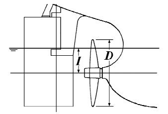
    **그림 1 프로펠러의 잠김**
    - **(ii)** 선박길이의 1.5% 선수트림
    - **(iii)** 프로펠러 잠김(I/D)을 25% 이상 유지하지 못하는 트림
- **(아)** 화물 적하상태에서의 부분적재 평형수 탱크
  화물 적하상태에서의 상기 (사)의 조건은 선수미 탱크에만 적용한다.
- **(자)** 순차적인(sequential) 평형수의 교체
  상기 (사) 및 (아)의 조건은 순차적인 방법을 사용한 평형수 교체상태에서는 적용하지 않는다. 그러나, 순차적 평형수 교체방법을 사용하도록 의도된 모든 선박은 각 평형수 교체(평형수 적재 또는 양하)단계에 대한 굽힘모멘트와 전단력의 계산결과를 선박의 적하지침서 또는 평형수 관리계획에 포함시켜야 한다.

#### (2) 표준적하상태의 표시방법

- **(가)** 선장이 표준적하상태에 있어서 선체강도와 적하상태와의 관계를 쉽게 파악하고 적하계획에 참고가 되도록 각 상태의 정수중 종굽힘모멘트 ($M_S$) 및 정수중 전단력 ($F_S$) 의 계산결과를 각각의 허용값과 함께 표시하여야 한다. 또한 $M_S$ 및 $F_S$ 는 양 (+), 음 (-)의 방향을 명시하여야 한다.
- **(나)** 상기 계산결과는 각 상태마다 구획(Tank 및 화물창) 배치도, 구획 적하표, Trim 및 복원성관계의 계산결과와 함께 가능한 한 1 Page 또는 한 번에 볼 수 있는 2 Page에 기술할 것. 이들의 기재에 대한 보기를 **5.3**에 표시한다. 또한, 표준적하상태에 대해서 사용상의 제한이 있는 경우에는 그 취지를 명기하여야 한다.

#### (3) 추가 선급부호, BLU

- **(가)** 3항 (1)호 (바)의 (g) 요건에 추가하여 다음의 요건을 만족하는 BC-A 또는 BC-B 산적화물선 및 광석운반선의 경우, 선급부호에 추가특기사항 BLU를 부여할 수 있다. 선박의 평균적하율은 16,000 ton/h으로 하며, 평균적하율이 이 값과 다를 경우, 적하지침서에 명기하여 우리 선급의 승인을 받아야 한다. 여기서 평균적하율이란 전체 화물 적재량을 화물 적재의 시작에서 끝까지의 경과시간으로 나눈 비를 말한다. 만약 적하지침서에 두개 이상의 적하장치(loader)를 동시에 사용하도록 명시하는 경우, 특별히 고려하여야 할 사항을 적하지침서에 포함시켜 우리 선급의 승인을 받아야 한다.
  다음의 조건에 따른 적하순서가 정의되어야 한다.- 균일적재 조건- 부분적재 조건 (해당되는 경우)- 격창적재 조건 (해당되는 경우)
  화물적하 시작에서부터 만재까지 적하순서의 각 단계는 평형수 배출작업과 단계적(stepwise), 시간순서적(time-wise synchronized)으로 적합하여야 한다. 각 단계는 적하장치가 새로운 화물창으로 이동하는 것으로 구분된다. “시간순서적으로 적합하여야 한다.”의 의미는 각 적하단계의 시간 내에 평형수배출이 완료되어야 함을 뜻한다.대표적인 적하순서는 해당 강도한계를 넘지 않도록 구성되어야 한다. 적하순서를 정함에 있어, 하나 또는 두 개 이상의 적하장치(loader)를 동시에 사용하도록 고려하는 경우, 각 단계에 대한 요약에는 최소한 다음의 내용이 포함되어야 한다.
  - 각 단계에서 각 화물창의 적재량
  - 각 단계에서 각 평형수탱크의 평형수 배출량
  - 각 단계별 최대 정수중 굽힘모멘트 및 전단력
  - 각 단계별 선박 트림 및 흘수
  - 제한조건이 있는 경우, 선박의 선수/선미 흘수, 트림 및 공기흘수(air-draught)
  - 단일 및 인접 화물창 적하에 대한 선박의 국부강도 기준
  선장이 평균적하율에 따라 승인된 적하순서와 다르게 운용할 필요가 있다고 판단하는 경우, 선장은
  **SOLAS Ch.VI, Pt.B, Reg. 7.3**에 따르며 새로운 적하계획을 항구로부터 동의 받아서 시행할 수 있다.
- **(나)** 부두에서 적하를 시작하기 전, 평형수를 배출할 수 있는 선박의 능력(즉, 배출시간)은, 평형수탱크의 배치와 관련 배관시스템을 포함하여, 규정된 평균적하율의 요구치를 만족하기 위한 요건에 적합하여야 한다. 평균적하율이 (가)에서 명시한 16,000 ton/h 보다 높은 경우에도, 평형수배출 작업으로 인하여 적하작업이 중단되어서는 아니 된다.
- **(다)** 선박은 별도의 스트리핑 장치를 갖추어야 한다. 평형수 배출과 스트리핑을 원활히 하기 위하여 가능한 한 전체 작업 시간동안 선미트림이 유지되어야 한다.
- **(라)** 선박은 각 화물창의 최대허용적하중량의 최소 100%를 한번에 적하할 수 있도록 설계되어야 한다.
- **(마)** 내저판의 강도는 CSR 산적화물선의 경우는 **규칙 11편 12장 1절**, 광석운반선의 경우는 **규칙 7편 2장 202**. 또는 산적화물선의 경우는 **규칙 7편 3장 304.**의 **3**항의 요건에 적합하여야 한다.
- **(바)** 평형수 및 연료유 탱크의 측심과 선박의 흘수를 원격으로 측정할 수 있는 장치를 갖추어야 하며, 원격 측정 장치는 선박의 적하지침기기에 온라인(on-line)으로 연결되어야 한다.
- **(사)** 단일 및 인접한 화물창 적하에 대한 국부강도를 확인할 수 있는 적하지침기기가 설치되어야 한다

### 4. 종강도상의 허용값

적하지침서에 기재되는 정수중 종굽힘모멘트 및 정수중 전단력의 허용값은 그 선박의 설계조건도 고려하여 정하여야 한다. 다만, 우리 선급이 필요하다고 인정하는 선체횡단면의 위치에서 다음에 규정하는 값을 넘어서는 아니된다.

#### (1) 정수중 종굽힘모멘트 (_s2) 의 허용값

**규칙 3장 104.**의 **1**항 (1)호 선박의 경우 고려하는 선체 횡단면의 위치에서의 정수중 종굽힘모멘트는 양 (+), 음 (-)의 부호 각각에 대하여 다음 (가) 및 (나)에 의한 값중 작은 값으로 한다. 다만, 이것은 **규칙 3장 4절**의 규정에도 만족하여야 한다.

- **(가)** 굽힘강도에 의한 값
  $M_S (+) = 175fZ \times 10^-3 - M_W (+)$(kN-m)
  $M_S (-) = 175fZ \times 10^-3 - M_W (-)$(kN-m)
  $f$ : **규칙 1장 124.**의 $f_B$ 또는 $f_D$ 의 값을 사용한 선박에 대하여는 그 값으로, 사용하지 아니한 선박에 대하여는 $1/K$ 로 한다.
  $Z$ : 선박의 고려하는 위치에 있어서 선저 및 강력갑판에 대한 선체횡단면의 단면계수 (cm^3)
  $M_W (+)$, $M_W (-)$ : **규칙 3장 표 1**에 따른다.
- **(나)** 비틀림 강도에 의한 값
  화물의 비대칭 적하에 의한 선체에 비틀림 모멘트가 발생하는 경우에는 **지침 7편 4장 205.**의 규정을 적용할 때 이용한 비틀림모멘트에 따른 워핑응력의 값을 다음식의 [ ]안의 값에서 감할 필요가 있다.
  $M_S (+) = \left[\frac{175}{K} - \sqrt { (0.75 \sigma_V (+))^2 + \sigma_H^2 +\sigma_W^2 }\right] Z_\frac{V}{1000}$(kN-m)
  $M_S (-)=- \left[ \frac{175}{K} - \sqrt {(0.75 \sigma _{V} (-)) ^{2} + \sigma _{H} ^{2} + \sigma _{W} ^{2}} \right] \frac{Z _{V}}{1000}$(kN-m)
  $\sigma_V (+)$, $\sigma_V (-)$ : 각각 다음 식에 의한 값으로 한다.
  $\sigma_V (+)=\frac{M_W (+)}{Z _{V}} \times 10^3$
  $\sigma_V (-)= \frac{M_W (-)}{Z _{V}} \times 10^3$
  $M_W (+)$, $M_W (-)$ : **규칙 3장 표 3.3.1**에 따른다.
  $\sigma_H$, $\sigma_w$, $Z_V$ : **지침 7편 4장 205.**에 따른다.

#### (2) 규칙 3장 104.의 1항 (2)호 및 (3)호의 선박과 (1)호 내지 (3)호 이외의 선박의 경우 고려하는 선체횡단면의 위치에서의 정수중 종굽힘 모멘트는 양 (+)과 음 (-)의 부호 각각에 대하여 (1)호의 (가)에 의한 값으로 한다. 다만 이것은 규칙 3장 4절의 규정에도 만족하여야 한다.

#### (3) 정수중 전단력 (_s2) 의 허용값

- **(가)** 정수중 전단력 ($F_S$) 의 허용값은 다음 식에 의한 값으로 한다.
  $F _{S } (+)= \frac{110}{K} \times \frac{t _{S} I}{0.5Q} \times 10 ^{-2} -F _{W } (+)$(kN)
  $F_S (-) = - \frac{110}{K} \times \frac{t_S I}{0.5Q} \times 10^-2 - F_W (-)$(kN)
  $t_S$ : 고려하는 위치에서의 선측외판의 두께, 단 종격벽을 갖는 선박의 경우는 종격벽판의 두께를 더한 값으로 한다 (mm).
  $I$, $Q$, $F_W (+)$ 및 $F_W (-)$ : **규칙 3장 301.**에 따른다.
- **(나)** 선측외판의 두께를 전단흐름을 직접계산하여 결정한 경우에는 (가) 또는 다음 식에 의한 값중 작은 값을 정수중 전단력의 허용값으로 한다.
  $F (+) = F \tau _\frac{P}{\tau} - F_W (+)$(kN)
  $F (-) = -F \tau _\frac{P}{\tau} - F_W (-)$(kN)
  $F$ : 직접강도 계산시 적용한 선체 횡단면에 작용하는 전단력 (kN) 으로 **지침 3장 301.**에 따른다.
  $F_W (+)$, $F_W (-)$ : **규칙 3장 301.**에 따른다.
  $\tau_P$ : **지침 3장 301.**의 **1**항 (2)호에 규정된 허용 전단응력 (N/mm^2)
  $\tau$ : 직접 계산에 의한 선체 횡단면에 작용하는 전단응력 (N/mm^2)으로 선측외판, 빌지호퍼탱크의 값 또는 톱사이드 탱크의 값 중 최대값을 말한다.
- **(다)** (가) 및 (나)에 의한 정수중 전단력의 허용값은 **규칙 3장 4절**의 규정에도 만족해야 한다.

#### (4) 항내에 있어서 정수중 굽힘모멘트 및 전단력의 허용값, 항내등 파랑의 영향을 받지 않는 수역에 있어서 정수중 종굽힘 모멘트 _s2 및 정수중 전단력의 허용값 _s2 은 (1)호 및 (2)호에 있어서 파랑 종굽힘 모멘트 _s2 및 파랑 전단력 _s2 을 각각 (1)호 및 (2)호에 규정하는 값의 1/2로 하여 정한 값으로 할 수 있다.

### 5. 적하지침서의 작성

#### 5.1 표준 적하상태와 다르게 적하하는 경우에 대한 종강도 계산법

- **(1)** 종강도 확인사항
  표준 적하상태와 다르게 적하를 할 경우의 종강도 계산 및 확인은 **그림 2**의 흐름도에 따라서 실시하며 각 출력점에 있어서 다음 사항에 대하여 고려하여야 한다.
  - **(가)** 정수중 종굽힘 모멘트 ($M_S$)
  - **(나)** 정수중 전단력 ($F_S$)
  - **(다)** 정수중 격창적하(alternate loading) 전단력 ($F_C$) ($F_S$)에 격창적하수정을 한 전단력). 다만, 이중저에 따른 하중의 분담을 고려하지 않고 설계되어 있는 선박은 격창적하 전단력의 확인은 생략할 수 있다.
    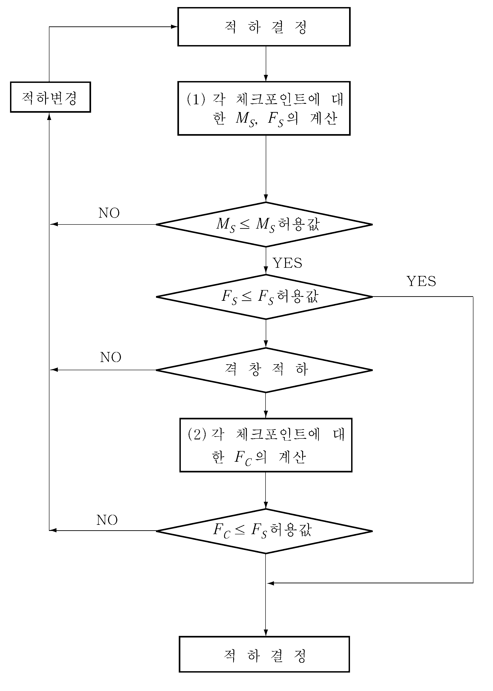
    **그림 2 종강도 확인순서 흐름도**
- **(2)** 종강도 확인을 위한 출력점
  - **(가)** 정수중 종굽힘 모멘트의 출력점은 적어도 6개소(중앙부 $0.5 L$ 포함)을 선박길이 방향으로 적절하게 배치할 것
  - **(나)** 정수중 전단력의 출력점은 화물적재구획의 전후단벽 및 이 사이의 횡격벽위치 및 이들에 준한 개소로 한다. 다만, 코퍼댐 등에서 횡격벽의 간격이 좁은 경우에는 한쪽의 출력점에 대한 확인을 생략할 수 있다. 다만, 전단력이 분명히 적다고 인정되는 개소에 대한 확인은 생략할 수 있다.
- **(3)** 계산상의 적하구분
  - **(가)** 양현에 대칭으로 배치되는 탱크의 적재량은 동일항목으로 합계할 수 있다.
  - **(나)** 한 화물창에 복수의 창구를 가지는 경우는 창구마다 구분하여 계산할 것. 다만, 적하의 종류에 따라 구분할 필요가 없는 경우에는 각 화물창마다 구분하여도 좋다.
- **(4)** 종강도 확인의 방법
  - **(가)** 허용된 적하의 확인을 쉽게하기 위하여 적하와 종강도의 관계 및 종강도 확인의 방법을 프로챠트등의 방법에 따라 설명할 것. 그 기제 예를 **5.4**에 표시한다.
  - **(나)** 선장이 적하상태를 정확히 판단할 수 있도록 (1)호의 계산값에 대응하는 다음의 허용값을 명확히 해 둘 것.
    - **(a)** 정수중 종굽힘 모멘트의 허용값($M_S$ 의 허용값)
    - **(b)** 정수중 전단력의 허용값($F_S$ 의 허용값)
  - **(다)** 설명에 사용하는 계산값 및 허용값의 용어 및 기호는 (1)호 및 (4)호의 (나)에 따를 것.
- **(5)** 계산법
  - **(가)** 정수중 종굽힘 모멘트 ($M_S$) 및 정수중 전단력 ($F_S$) 의 계산
    정수중 종굽힘 모멘트 및 정수중 전단력을 계산하는 경우는 각 적하상태에 있어서 직접 $M_S$, $F_S$ 를 계산하는 방식에 따른다.
  - **(나)** 정수중 격창적하 전단력 ($F_C$) 의 계산
    횡격벽의 전후에서 적하창과 빈창이 인접하는 경우의 $F_S$ 의 수정계산은 **5.6**에 따른다.
  - **(다)** 적하지침서에는 이들의 계산 예를 첨부한다.

#### 5.2 정수중 종굽힘 모멘트 및 정수중 전단력의 허용기재예

본선의 정수중 종굽힘모멘트 및 정수중 전단력의 허용값은 항해상태(at sea)와 항내상태(harbor)에 대하여 각각 다음과 같은 값이다.

#### 5.3 표준적하상태 기재예

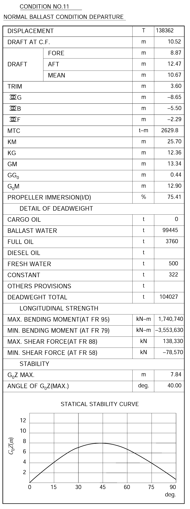

#### 5.4 정수중 종굽힘 모멘트 및 정수중 전단응력 계산순서 기재 예

적하의 조정과 판정방법

- **(1)** 각 화물창 또는 탱크의 적하량을 주어 **5.5**에 표시한 **표 3**을 사용하여 각 출력점의 $M_S$ 및 $F_S$ 를 계산한다.
- **(2)** 각 출력점 $M_S$ 의 값이 **그림 3**에 표시한 $M_S$ 의 허용값 이하에 있는지를 확인한다. 이하에 있으면 다음으로 진행하고 초과하는 경우는 적하를 변경하여야 한다.
- **(3)** 각 출력점의 (1)에서 얻은 $F_S$ 의 값이 **그림 3**에 표시하는 $F_S$ 의 허용치 이하에 있는지를 확인한다. 이하이면 그 적하를 적용할 수 있으며 초과하는 경우는 적하를 변경하여야 한다.
- **(4)** $F_S$ 허용치를 초과하는 출력점이 격창적하(격벽전후의 화물창이 적하창 및 빈창인 경우)의 위치에 있는지를 확인한다. 격창적하인 경우에는 다음으로 진행하고 격창적하가 아닌 경우에는 적하를 변경하여야 한다.
- **(5)** $F_S$ 의 허용값을 넘는 출력점에 대하여는 **표 5**에 따라 $F_C$ 를 계산한다.

#### 5.5 정수중 종굽힘 모멘트 및 정수중 전단력 계산법

- **(1)** 일반설명
  종강도 계산법에 따라 본선의 실제 적하상태에서의 선체 각점에 있어서 정수중 종굽힘모멘트 및 정수중 전단력이 얻어지며 종강도 계산방법 및 기호에 대한 설명은 다음과 같다.
  $\sum W$ : $L$ 의 전단 또는 후단으로부터 각 출력점까지의 재화중량에 대한 적분값(재화중량에 따른 전단력)$\times$(1000 ton)
  $SS$ : $L$ 의 전단 또는 후단으로부터 각 출력점까지의 부력 및 경하중량에 대한 적분값((부력경하중량)에 따른 전단력)$\times$(1000 ton)
  $\sum M _t$ : $L$ 의 전단 또는 후단으로부터 각 출력점까지의 재화중량에 대한 2회 적분값(재화중량에 따른 굽힘모멘트)$\times$(1000 ton-m)
  $SB$ : $L$ 의 전단 또는 후단으로부터 각 출력점까지의 부력 및 경하중량에 대한 2회 적분값(부력 및 경하중량에 따른 굽힘모멘트)$\times$(1000 ton-m)
  각 출력점의 정수중 전단력 ($F_S$) 및 정수중 종굽힘모멘트 ($M_S$) 는 다음과 같이 하여 구한다.
  $F_S = (SS - \sum ) \times 9800$(kN)
  $M_S = ( smallsumM-SB) \times 9800$(kN-m)
  여기서 $M_S$ 및 $F_S$ 의 부호는 각각 허용값의 부호와 같으며 다음 그림과 같다.
  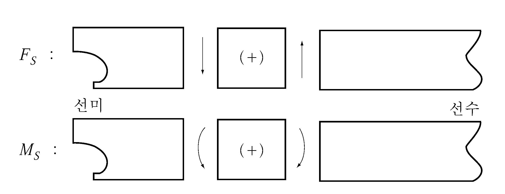
  이 종강도 계산법은 부력 및 경하중량에 따른 전단력 ($SS$) 및 굽힘모멘트 ($SB$) 를, 흘수선을 Base로 하여 미리 계산하고 흘수 1 m 마다의 수표(longitudinal strength data)로 한다. **표 4**에 그 1흘수분의 수표에 대한 예를 표시한다. 따라서, 선상에서는 재화중량에 따른 전단력 및 굽힘모멘트만을 계산함에 따라 쉽게 각 출력점의 정수중 전단력 ($F_S$) 및 정수중 종굽힘모멘트 ($M_S$) 를 계산할 수 있다.
- **(2)** 종강도 계산의 순서
  이 종강도 계산은 **표 3**란을 채워가면서 진행하는 것이 좋다. 다음에 그 순서를 표시한다.
  - **(가)** 선미흘수 ($DA$) 및 트림
    종강도 계산을 하려는 상태의 선미흘수 및 트림을 각각의 란에 기입한다. 이때 선수트림인 경우는 (-)로 한다.
  - **(나)** Base draft ($DB$) 및 흘수차 ($\Delta D$)
    선미흘수에 가장 가까운 선미흘수보다 작은 값의 흘수를 Longitudinal strength data에 기입하고 선미흘수와의 차이를 흘수차 ($\Delta D$)의 란에 기입한다.
  - **(다)** Weight 란
    이 란에는 각 구획 재화중량의 1/1000의 값을 기입한다.
  - **(라)** $W _i$ 란
    이 란은 종강도의 출력점에 하중으로서 가하는 각 구획의 재화중량을 표시한 것으로 재화중량에 Ratio(각 출력에 포함한 구획의 비율)을 곱한 값을 기입한다.
  - **(마)** $M _i$ 란
    이 란은 각 구획의 재화중량에 따라 Midship 회전모멘트를 표시한 것으로서 $W _i \times$$G$의 값을 기입한다.
  - **(바)** $smallsumW _i$ 및 $smallsumM _i$
    $L$ 의 전단 또는 후단에 따라 각 출력점까지에 포함되는 $W _i$ 및 $M _i$ 의 누적을 각각 기입한다.
  - **(사)** $SS$ 및 $SB$
    부력 및 경하중량에 따른 전단력 및 굽힘모멘트를 표시한 것으로서 다음과 같이 산정한다.
    Base value draft로 하여 사용한 흘수를 표시하는 Longitudinal strength data로부터 각 출력점의 Base value(①의 란) 및 각 수정계수 ($CD$ 및 $CT$)를 각각에 대응하는 개소에 옮겨 기입한다.
    Base draft와 실제상태와의 흘수차에 따라 수정을 한 것으로서 수정계수 ($CD$)에 흘수차 ($\Delta D$)를 곱하여 구한다.
    트림이 있는 경우에는 수정계수 ($CT$)에 트림량 ($m$)을 곱하여 구한다.
    - **(a)** Base value, 흘수차 및 트림에 따른 수정계수 ($CD$ 및 $CT$)
    - **(b)** 흘수차 ($\Delta D$)에 따른 수정(②의 란)
    - **(c)** 트림에 따른 수정(③란)
    - **(d)** 합계 Base value ①, 흘수차에 따른 수정량 ② 및 트림에 따른 수정량 ③을 가산하여 각각 $SS$, $SB$의 란에 기입한다.
  - **(아)** $smallsum W$ 및 $smallsum M$
    재화중량에 따른 전단력 및 굽힘모멘트를 표시한 것으로서 다음과 같이 산정한다.
    $smallsum W$ 은 각 출력점의 재화중량에 대한 누적 ($smallsumW _i$)으로서 이것을 이 란에 옮겨 기입한다.
    각 출력점의 재화중량에 따른 Midship 회전모멘트 ($smallsumM _i$)를 각 출력점에서의 굽힘모멘트에 환산한 값으로 다음 식으로 구해지는 것을 기입한다.
    $\sum W \times (수정 Lever)+ \sum M _{i}$
    - **(a)** $smallsum W$ 란
    - **(b)** $smallsum M$ 란
  - **(자)** 정수중 전단력
    각 출력점에 있어서 재화상태의 실제 정수중 전단력($F _{S}$)을 표시하며, 다음 식에 따라 계산한다.
    $F _{S} =(SS - Sigma W) \times 9800$(kN)
  - **(차)** 정수중 종굽힘모멘트 ($M _{S}$)
    각 출력점에 있어서 재화상태의 실제 정수중 종굽힘모멘트를 표시하며, 다음 식에 따라 계산한다.
    $M _{S} =( \sum M-SB) \times 9800$(kN-m)

    **#underline{○ CONDITION} #underline{AFT DRAFT (DA) : (m)} #underline{BASE DRAFT (DB) : (m)} #underline{DIFFERENCE(△D)=DA-DB : (m)} #underline{TRIM : (m)}**

    | $i$ | D.W.ITEM | WEIGHT 1/1,000 | RATIO | LOAD ($W _{i}$) | G | MOMENT |
    | --- | --- | --- | --- | --- | --- | --- |
    | 1 | FORE PEAK TANK |   | 1.000 |   | 140.08 |   |
    | FR. 99 |   | ∑ $W _{i}$ = ( ) #eqnID-13301 |   |   | ∑ $M _{i}$ = ( ) #eqnID-13321 |   |
    | 2 | No. 1C.O.T. (C) |   | 1.000 |   | 121.30 |   |
    | 3 | No. 1C.O.T. (P/S) |   | 1.000 |   | 120.20 |   |
    | FR. 94 |   | ∑ $W _{i}$ = ( ) #eqnID-13341~3 |   |   | ∑ $M _{i}$ = ( ) #eqnID-13361~3 |   |
    | 4 | No. 2C.O.T. (C) |   | 0.500 |   | 94.80 |   |
    | 5 | No. 2C.O.T. (P/S) |   | 1.000 |   | 94.63 |   |
    | FR. 88 |   | ∑ $W _{i}$ = ( ) #eqnID-13381~5 |   |   | ∑ $M _{i}$ = ( ) #eqnID-13401~5 |   |
    | 6 | No. 2C.O.T. (C) |   | 0.500 |   | 64.80 |   |
    | 7 | No. 3C.O.T. (P/S) |   | 1.000 |   | 64.80 |   |
    | FR. 82 |   | ∑ $W _{i}$ = ( ) #eqnID-13421~7 |   |   | ∑ $M _{i}$ = ( ) #eqnID-13441~7 |   |
    | 8 | No. 3W.B.T. (C) |   | 0.500 |   | 34.80 |   |
    | 9 | No. 4C.O.T. (P/S) |   | 1.000 |   | 34.80 |   |
    | FR. 76 |   | ∑ $W _{i}$ = ( ) #eqnID-13461~7 |   |   | ∑ $M _{i}$ = ( ) #eqnID-13481~9 |   |
    | 10 | No. 3W.B.T. (C) |   | 0.500 |   | 4.80 |   |
    | 11 | No. 5C.O.T. (P/S) |   | 1.000 |   | 4.80 |   |
    | FR. 70 |   | ∑ $W _{i}$ = ( ) #eqnID-13501~7 |   |   | ∑ $M _{i}$ = ( ) #eqnID-13521~11 |   |
    | 12 | No. 4C.O.T. (C) |   | 0.500 |   | -25.20 |   |
    | 13 | No. 6C.O.T. (P/S) |   | 1.000 |   | -25.19 |   |
    | FR. 64 |   | ∑ $W _{i}$ = ( ) #eqnID-13541~7 |   |   | ∑ $M _{i}$ = ( ) #eqnID-13561~13 |   |
    | 14 | No. 4C.O.T. (C) |   | 0.500 |   | -55.20 |   |
    | 15 | No. 7C.O.T. (P/S) |   | 1.000 |   | -55.07 |   |
    | FR. 58 |   | ∑ $W _{i}$ = ( ) #eqnID-13581~7 |   |   | ∑ $M _{i}$ = ( ) #eqnID-13601~15 |   |
    | 16 | No. 5C.O.T. (C) |   | 0.674 |   | -80.17 |   |
    | 17 | No. 8C.O.T. (P/S) |   | 1.000 |   | -79.93 |   |
    | FR. 54 |   | ∑ $W _{i}$ = ( ) #eqnID-13621~7 |   |   | ∑ $M _{i}$ = ( ) #eqnID-13641~17 |   |
    | 18 | No. 5C.O.T. (C) |   | 0.326 |   | -95.08 |   |
    | 19 | SLOP TANK (P/S) |   | 1.000 |   | -94.74 |   |
    | FR. 52 |   | ∑ $W _{i}$ = ( ) #eqnID-13661~7 |   |   | ∑ $M _{i}$ = ( ) #eqnID-13681~19 |   |

    | ITEM | SHEARING FORCE ($F _{S}$) |   |   |   | BENDING MOMENT ($M _{S}$) |   |   |   |
    | --- | --- | --- | --- | --- | --- | --- | --- | --- |
    | BASE VALUE |   |   | ① |   |   |   | ① |   |
    | DRAFT CORRECTION | CD ( ) ×　△　D |   | ② |   | CD ( ) ×　△　D |   | ② |   |
    | TRIM CORRECTION | CT ( ) × TRIM |   | ③ |   | CT ( ) × TRIM |   | ③ |   |
    | BUOYANCY & L.W. | ①+②+③ |   | SS |   | ①+②+③ |   | SB |   |
    | DEADWEIGHT | ∑$W i$ |   | ∑W |   | ∑W × (-132.8) + ∑$M i$ ( ) |   | ∑W |   |
    | CALCULATED VALUE | (SS-∑W) × 9,800 |   |   |   | (∑M - SB) × 9,800 |   |   |   |
    | ALLOWABLE VALUE | ALLOWABLE SHEARING FORCE | 110,000~-99,080 |   |   | ALLOWABLE BENDING MOMENT | 2,790,000~-2,183,600 |   |   |
    | BASE VALUE |   |   | ① |   |   |   | ① |   |
    | DRAFT CORRECTION | CD ( ) ×　△　D |   | ② |   | CD ( ) ×　△　D |   | ② |   |
    | TRIM CORRECTION | CT ( ) × TRIM |   | ③ |   | CT ( ) × TRIM |   | ③ |   |
    | BUOYANCY & L.W. | ①+②+③ |   | SS |   | ①+②+③ |   | SB |   |
    | DEADWEIGHT | ∑$W i$ |   | ∑W |   | ∑W × (-109.8) + ∑$M i$ ( ) |   | ∑W |   |
    | CALCULATED VALUE | (SS-∑W) × 9,800 |   |   |   | (∑M - SB) × 9,800 |   |   |   |
    | ALLOWABLE VALUE | ALLOWABLE SHEARING FORCE | 129,000~-113,370 |   |   | ALLOWABLE BENDING MOMENT | 4,340,000~-3,321,300 |   |   |
    | BASE VALUE |   |   | ① |   |   |   | ① |   |
    | DRAFT CORRECTION | CD ( ) ×　△　D |   | ② |   | CD ( ) ×　△　D |   | ② |   |
    | TRIM CORRECTION | CT ( ) × TRIM |   | ③ |   | CT ( ) × TRIM |   | ③ |   |
    | BUOYANCY & L.W. | ①+②+③ |   | SS |   | ①+②+③ |   | SB |   |
    | DEADWEIGHT | ∑$W i$ |   | ∑W |   | ∑W × (-79.8) + ∑$M i$ ( ) |   | ∑W |   |
    | CALCULATED VALUE | (SS-∑W) × 9,800 |   |   |   | (∑M - SB) × 9,800 |   |   |   |
    | ALLOWABLE VALUE | ALLOWABLE SHEARING FORCE | 128,000~-112,030 |   |   | ALLOWABLE BENDING MOMENT | 6,040,000~-4,449,800 |   |   |
    | BASE VALUE |   |   | ① |   |   |   | ① |   |
    | DRAFT CORRECTION | CD ( ) ×　△　D |   | ② |   | CD ( ) ×　△　D |   | ② |   |
    | TRIM CORRECTION | CT ( ) × TRIM |   | ③ |   | CT ( ) × TRIM |   | ③ |   |
    | BUOYANCY & L.W. | ①+②+③ |   | SS |   | ①+②+③ |   | SB |   |
    | DEADWEIGHT | ∑$W i$ |   | ∑W |   | ∑W × (-49.8) + ∑$M i$ ( ) |   | ∑W |   |
    | CALCULATED VALUE | (SS-∑W) × 9,800 |   |   |   | (∑M - SB) × 9,800 |   |   |   |
    | ALLOWABLE VALUE | ALLOWABLE SHEARING FORCE | 122,000~-112,720 |   |   | ALLOWABLE BENDING MOMENT | 6,590,000~-4,459,000 |   |   |
    | BASE VALUE |   |   | ① |   |   |   | ① |   |
    | DRAFT CORRECTION | CD ( ) ×　△　D |   | ② |   | CD ( ) ×　△　D |   | ② |   |
    | TRIM CORRECTION | CT ( ) × TRIM |   | ③ |   | CT ( ) × TRIM |   | ③ |   |
    | BUOYANCY & L.W. | ①+②+③ |   | SS |   | ①+②+③ |   | SB |   |
    | DEADWEIGHT | ∑$W i$ |   | ∑W |   | ∑W × (-19.8) + ∑$M i$ ( ) |   | ∑W |   |
    | CALCULATED VALUE | (SS-∑W) × 9,800 |   |   |   | (∑M - SB) × 9,800 |   |   |   |
    | ALLOWABLE VALUE | ALLOWABLE SHEARING FORCE | 113,000~-112,900 |   |   | ALLOWABLE BENDING MOMENT | 6,520,000~-4,159,000 |   |   |
    | BASE VALUE |   |   | ① |   |   |   | ① |   |
    | DRAFT CORRECTION | CD ( ) ×　△　D |   | ② |   | CD ( ) ×　△　D |   | ② |   |
    | TRIM CORRECTION | CT ( ) × TRIM |   | ③ |   | CT ( ) × TRIM |   | ③ |   |
    | BUOYANCY & L.W. | ①+②+③ |   | SS |   | ①+②+③ |   | SB |   |
    | DEADWEIGHT | ∑$W i$ |   | ∑W |   | ∑W × (-10.2) + ∑$M i$ ( ) |   | ∑W |   |
    | CALCULATED VALUE | (SS-∑W) × 9,800 |   |   |   | (∑M - SB) × 9,800 |   |   |   |
    | ALLOWABLE VALUE | ALLOWABLE SHEARING FORCE | 113,500~-113,690 |   |   | ALLOWABLE BENDING MOMENT | 6,520,000~-4,459,000 |   |   |
    | BASE VALUE |   |   | ① |   |   |   | ① |   |
    | DRAFT CORRECTION | CD ( ) ×　△　D |   | ② |   | CD ( ) ×　△　D |   | ② |   |
    | TRIM CORRECTION | CT ( ) × TRIM |   | ③ |   | CT ( ) × TRIM |   | ③ |   |
    | BUOYANCY & L.W. | ①+②+③ |   | SS |   | ①+②+③ |   | SB |   |
    | DEADWEIGHT | ∑$W i$ |   | ∑W |   | ∑W × (-40.2) + ∑$M i$ ( ) |   | ∑W |   |
    | CALCULATED VALUE | (SS-∑W) × 9,800 |   |   |   | (∑M - SB) × 9,800 |   |   |   |
    | ALLOWABLE VALUE | ALLOWABLE SHEARING FORCE | 102,000~-113,180 |   |   | ALLOWABLE BENDING MOMENT | 6,520,000~-4,159,000 |   |   |
    | BASE VALUE |   |   | ① |   |   |   | ① |   |
    | DRAFT CORRECTION | CD ( ) ×　△　D |   | ② |   | CD ( ) ×　△　D |   | ② |   |
    | TRIM CORRECTION | CT ( ) × TRIM |   | ③ |   | CT ( ) × TRIM |   | ③ |   |
    | BUOYANCY & L.W. | ①+②+③ |   | SS |   | ①+②+③ |   | SB |   |
    | DEADWEIGHT | ∑$W i$ |   | ∑W |   | ∑W × (-70.2) + ∑$M i$ ( ) |   | ∑W |   |
    | CALCULATED VALUE | (SS-∑W) × 9,800 |   |   |   | (∑M - SB) × 9,800 |   |   |   |
    | ALLOWABLE VALUE | ALLOWABLE SHEARING FORCE | 93,000~-112,030 |   |   | ALLOWABLE BENDING MOMENT | 6,030,000~-4,422,200 |   |   |
    | BASE VALUE |   |   | ① |   |   |   | ① |   |
    | DRAFT CORRECTION | CD ( ) ×　△　D |   | ② |   | CD ( ) ×　△　D |   | ② |   |
    | TRIM CORRECTION | CT ( ) × TRIM |   | ③ |   | CT ( ) × TRIM |   | ③ |   |
    | BUOYANCY & L.W. | ①+②+③ |   | SS |   | ①+②+③ |   | SB |   |
    | DEADWEIGHT | ∑$W i$ |   | ∑W |   | ∑W × (-90.2) + ∑$M i$ ( ) |   | ∑W |   |
    | CALCULATED VALUE | (SS-∑W) × 9,800 |   |   |   | (∑M - SB) × 9,800 |   |   |   |
    | ALLOWABLE VALUE | ALLOWABLE SHEARING FORCE | 100,400~-111,370 |   |   | ALLOWABLE BENDING MOMENT | 1,100,000~-3,358,000 |   |   |
    | BASE VALUE |   |   | ① |   |   |   | ① |   |
    | DRAFT CORRECTION | CD ( ) ×　△　D |   | ② |   | CD ( ) ×　△　D |   | ② |   |
    | TRIM CORRECTION | CT ( ) × TRIM |   | ③ |   | CT ( ) × TRIM |   | ③ |   |
    | BUOYANCY & L.W. | ①+②+③ |   | SS |   | ①+②+③ |   | SB |   |
    | DEADWEIGHT | ∑$W i$ |   | ∑W |   | ∑W × (-100.0) + ∑$M i$ ( ) |   | ∑W |   |
    | CALCULATED VALUE | (SS-∑W) × 9,800 |   |   |   | (∑M - SB) × 9,800 |   |   |   |
    | ALLOWABLE VALUE | ALLOWABLE SHEARING FORCE | 102,000~-112,370 |   |   | ALLOWABLE BENDING MOMENT | 3,830,000~-3,321,300 |   |   |

    **표 4 LONGITUDINAL STRENGTH DATA (FOR BUOYANCY & LIGHT SHIP WEIGHT)** ***** EACH VALUE SHOWS(ACTUAL VALUE/1,000) ***** **BASE DRAFT 12.000 METER**

    |   |   |   |   |   |   |   |   |
    | --- | --- | --- | --- | --- | --- | --- | --- |
    | SHEAR FORCE (UNIT MT) |   |   |   |   | BENDING MOMENT (UNIT MT-M) |   |   |
    | CALCULATION POSITION | BASE VALUE (S.F.) | DRAFT CORRECTION (CD) | TRIM CORRECTION (CT) |   | BASE VALUE (B.M.) | DRAFT CORRECTION (CD) | TRIM CORRECTION (CT) |
    | FRAME (99) FRAME (94) FRAME (88) FRAME (82) FRAME (76) FRAME (70) FRAME (64) FRAME (58) FRAME (54) FRAME (52) | 2.876 11.902 26.933 42.272 57.510 72.780 88.048 102.735 110.924 114.087 | 0.401 1.4031 2.932 4.471 6.009 7.548 9.087 10.638 11.599 12.026 | -0.398 -1.298 -2.545 -3.647 -4.594 -5.389 -6.029 -6.515 -6.740 -6.818 |   | 18.730 181.011 760.620 1798.719 3295.504 5249.910 7662.468 10528.060 12667.050 13770.015 | 2.903 23.039 87.944 198.979 356.179 559.546 809.082 1104.844 1327.222 1443.008 | -3.078 -22.151 -80.102 -173.183 -297.098 -447.489 -619.135 -807.690 -940.344 -1006.792 |

    **표 5 격창 적하 전단력 (**$F _{C}$**) 계산표의 예**

    |   |   |   | FR. 37 |   | FR. 70 |   |   | FR. 102 |   |   | FR. 125 |   | FR. 158 |   |   | FR. 181 |   |   | FR. 205 |   |
    | --- | --- | --- | --- | --- | --- | --- | --- | --- | --- | --- | --- | --- | --- | --- | --- | --- | --- | --- | --- | --- |
    | ① | 정수중 전단력 ($F _{S}$) (kN) |   |   |   |   |   |   |   |   |   |   |   |   |   |   |   |   |   |   |   |
    | 구 획 |   |   | N0. 6 Cargo Hold |   |   | No. 5 Cargo Hold |   |   | No. 4 Cargo Hold |   |   | No. 3 Cargo Hold |   |   | No. 2 Cargo Hold |   |   | No. 1 Cargo Hold |   |   |
    | ② | $F _{SF} -F _{SA}$(kN) |   |   |   |   |   |   |   |   |   |   |   |   |   |   |   |   |   |   |   |
    | Top Side Tank |   |   | No. 4 Top Side Tank |   |   |   |   |   | No. 3 Top Side Tank |   |   |   |   |   | No. 2 Top Side Tank |   |   | No. 1 Top Side Tank |   |   |
    | ③ | TST의 중량 (kN) |   |   |   |   |   |   |   |   |   |   |   |   |   |   |   |   |   |   |   |
    | ④ | 분담률 $C$ |   | 0.5 |   |   | 0.5 |   |   | 0.5 |   |   | 0.5 |   |   | 1.0 |   |   | 1.0 |   |   |
    | ⑤ | $F _{T}$ (③×④) |   |   |   |   |   |   |   |   |   |   |   |   |   |   |   |   |   |   |   |
    | ⑥ | 이중저에 작용하는 하중 ($F _{SF} -F _{SA} -F _{T}$) (②-⑤) |   |   |   |   |   |   |   |   |   |   |   |   |   |   |   |   |   |   |   |
    | ⑦ | 계수 $C$ |   | 0.305 |   |   | 0.264 |   |   | 0.264 |   |   | 0.250 |   |   | 0.264 |   |   | 0.302 |   |   |
    | ⑧ | 전단력 *수정량* $\Delta F_C$ (⑥×⑦) |   |   |   |   |   |   |   |   |   |   |   |   |   |   |   |   |   |   |   |
    | ⑨ | 격벽전단력 ($F_CA$ 및 $F_CF$) |   | $F_CA$ ①+⑧ | $F_CF$ ①-⑧ |   | $F_CA$ ①+⑧ | $F_CF$ ①-⑧ |   | $F_CA$ ①+⑧ | $F_CF$ ①-⑧ |   | $F_CA$ ①+⑧ |   | $F_CF$ ①-⑧ | $F_CA$ ①+⑧ |   | $F_CF$ ①-⑧ | $F_CA$ ①+⑧ |   | $F_CF$ ①-⑧ |
    | ⑨ | 격벽전단력 ($F_CA$ 및 $F_CF$) |   |   |   |   |   |   |   |   |   |   |   |   |   |   |   |   |   |   |   |
    | ⑩ 허용전단력 (kN) |   | + | 30,200 | 25,500 |   |   | 26,300 |   |   | 27,600 |   |   |   | 27,600 |   |   | 25,200 |   |   | 29,300 |
    | ⑩ 허용전단력 (kN) |   | - | -28,100 | -25,200 |   |   | -25,200 |   |   | -27,600 |   |   |   | -28,700 |   |   | -28,500 |   |   | -30,400 |

#### 5.6 격창적하전단력 계산법

횡격벽의 전후에 적하창과 공창이 인접하는 경우 **표 5**에 따라 전단력을 수정한다.

- **(1)** 계산법(**그림 4** 참조)
  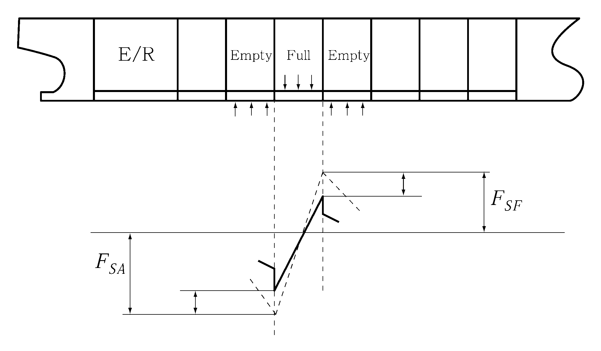
  **그림 4 격창적하시 정수중 전단력 수정**
  - **(가)** 정수중 전단력($F_S$)(①란)(kN)

#### 5.5에서 얻어진 정수중 전단력을 ①란에 옮겨 기입한다.

각 구획의 후단격벽 위치에서의 정수중 전단력($F_S$)를 $F_SA$, 전단격벽 위치에서의 정수중 전단력을 $F_SF$ 로 하여 $F_SF -F_SA$ 의 값을 ②란에 기입한다.

### 6. 평형수 탱크에 부분적재를 하는 화물선의 하중조건 (2022)

#### 6.1 일반

- **(1)** **6**항은 평형수적재 상태에서 부분적재 평형수 탱크에 대한 권고사항이다.
- **(2)** Case A 및 B는 부분적재된 1개의 평형수 탱크(또는 1쌍의 평형수 탱크)를 가진 화물선에 대하여 평형수적재 상태에 대하여 적용한다.
- **(3)** Case C는 평형수적재 상태로 항해중 부분적재된 큰 윙평형수 탱크 2쌍을 가진 전통의 광석운반선의 종강도를 검토하기 위해 필요한 적재조건을 보여준다.
- **(4)** 해당되는 경우, 부분적재 평형수 탱크를 포함하는 평형수 적재조건이 선박의 종강도에 대한 우려를 유발할 수 있는 **규칙 3장 1절**이 적용되는 다른 화물선에도 유사하게 고려되어야 한다.
- **(5)** 그림에서 별표(*)는 강도 검증(항해조건 아님)만을 위한 조건이다.

#### 6.2 Case A 및 B

- **(1)** Case A
  **그림 5**는 No.6 (P/S) 평형수 탱크에 부분 적재가 허용되고, 평형수 항해 중 언제든지 발생할 수 있는 화물선의 Case A를 보여준다. 중간단계 조건(들)은 그림에 표시된 대로 지정되어야 하지만 No.6 (P/S) 평형수 탱크의 적재/부분적재는 평형수 항해 중에 허용 가능한 트림 및 프로펠러 잠김을 유지하기 위해 어느 단계에서든 수행할 수 있다.
  No.6 (P/S) 평형수 탱크의 적재 수준과 관련하여 전체적인 항해 유연성을 얻기 위해, 강도 검증을 위한 적재조건 A2(출발시 완전적재)* 및 A8(도착시 공창)*을 추가해야 한다. 중간단계 조건 A3-A6과 관련된 추가 조건(완전적재 및 공창의 No.6 (P/S) 평형수 탱크)은 A2* 및 A8*이 가장 중요한 조건이므로 필요하지 않다.
- **(2)** Case B
  **그림 6**는 소모품을 지정된 %까지 사용한후, No.6 (P/S) 평형수 탱크를 주어진 수준 (f_6-int%)까지 부분적재를 하는 화물선의 Case B를 보여준다.(적재조건 B2 및 B3 참조). 이 소모품이 일정수준 %(그림에서 50 %로 표시)에 도달하기 전에 No.6 (P/S) 평형수 탱크는 비워 두어야 한다. 소모품을 주어진 수준(그림 2에서 20 %로 표시)까지 소모하면 평형수 탱크 No.6 (P/S)는 가득 차 있어야 한다. (조건 B5 및 B6 참조). 종강도 검토을 위해 두 개의 추가 중간 조건 (B4* 및 B7*)을 추가한다.
  Case B에 따라 선박을 분류하기 위해, **그림 2**에 표시된 소모 수준과 관련하여 평형수 탱크의 부분적재에 대한 명확한 운영 지침이 적하지침서에 제공되어야 한다. 그러한 운영 지침이 제공되지 않으면, Case A가 적용된다. Case A에는 소모품 제한이 없지만 Case B에는 소모품 제한이 있다.

  | 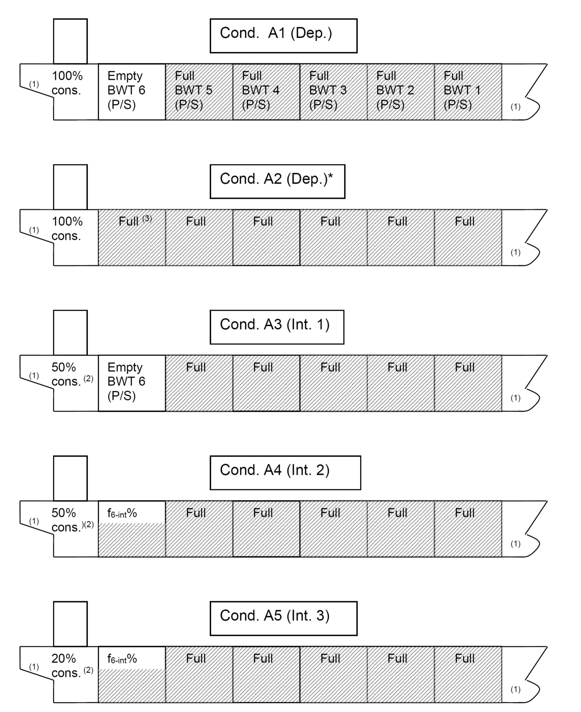 | 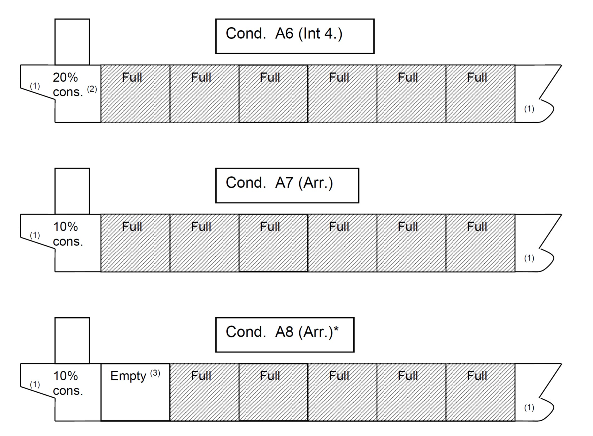 (비고) (1) 부분적재를 하는 선수탱크의 경우, 해당 탱크에 대해 의도된 수준에서 전체 또는 부분적으로 채워진 모든 조합을 조사한다. (2) 소모품 %를 포함하여 지정된 중간조건. (3) 큰 윙평형수 탱크를 가진 광석운반선의 경우, 3. (1) (사)에 주어진 트림 제한에 따라 최대/최소 적재수준으로 대체 할 수 있다. No.6 (P/S) 평형수 탱크에 부분적재를 하는 Case A는 항해 중 모든 단계에서 허용된다. 중간단계 조건이 지정되어 있지만, 평형수 항해 중에 허용 가능한 트림 및 프로펠러 잠김을 유지하기 위해 No.6 (P/S) 평형수 탱크의 다른 부분적재를 적용할 수 있다. 별표(*)는 강도 검증(항해조건 아님)만을 위한 조건이다. |
  | --- | --- |

  | 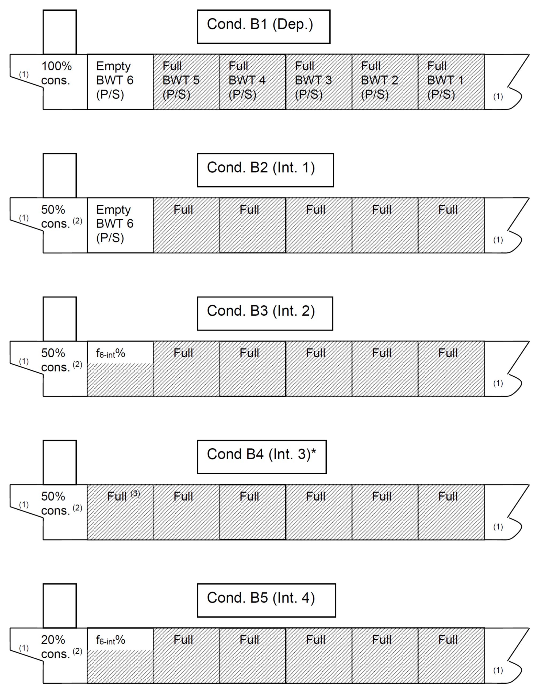 | 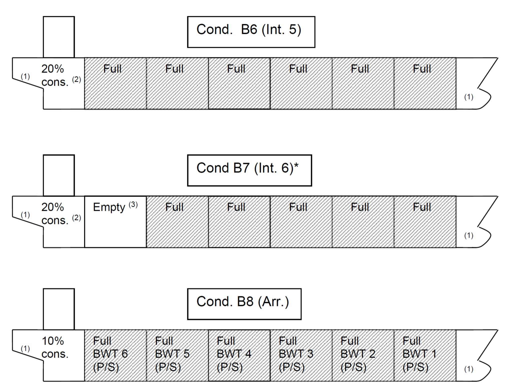 (비고) (1) 부분적재를 하는 선수탱크의 경우, 해당 탱크에 대해 의도된 수준에서 전체 또는 부분적으로 채워진 모든 조합을 조사한다. (2) 소모품 %를 포함하여 지정된 중간조건. (3) 큰 윙평형수 탱크를 가진 광석운반선의 경우, 3 (1) (사)에 주어진 트림 제한에 따라 최대/최소 적재수준으로 대체 할 수 있다. No.6 (P/S) 평형수 탱크에 부분적재를 하는 Case B는 중간단계 조건(이 그림에서는 소모품 50-20 % 사이)에서만 허용된다. 별표(*)는 강도 검증(항해조건 아님)만을 위한 조건이다. |
  | --- | --- |

#### 6.3 Case C

- **(1)** **그림 7(a)**은 항해중 No.1 (P/S) 평형수 탱크와 No.1 7 (P/S) 평형수 탱크 모두 부분 적재를 하는 전통적인 광석운반선의 항해 적하조건으로 출항 조건(C1), 중간단계 조건(C2-C2), 도착조건(C6)을 보여준다.

  | 적하조건 | 소모품 | No.1 (P/S) 평형수 탱크 적재수준 | No.7 (P/S) 평형수 탱크 적재수준 |
  | --- | --- | --- | --- |
  | C1 - 출항 | 100 % | f_1dep% | f_7dep% |
  | C2 – 중간단계 1 | 50 % ^(i) | f_1dep% | f_7dep% |
  | C3 – 중간단계 2 | 50 % ^(i) | f_1int% | f_7int% |
  | C4 – 중간단계 3 | 20 % ^(i) | f_1int% | f_7int% |
  | C5 – 중간단계 4 | 20 % ^(i) | f_1arr% | f_7arr% |
  | C6 – 도착 | 10 % | f_1arr% | f_7arr% |
  | (비고) 지정되어야 하는 소모품 %로서, 50% 및 20%로 나타내었다. |   |   |   |
- **(2)** **그림 7(b)**는 출항조건(C1)의 종강도 검증을 위해 추가되는 12개의 추가 적재조건(C1-1 ~ C1-12)을 보여준다.
- **(3)** **그림 7(c), (d), (e)** 및 **(f)**은 중간단계 조건(C2 ~ C5)의 종강도 검증을 위해 추가되어야 하는 32개의 추가 적재조건(C2-1 ~ C2-12, C3-1 ~ C3-4, C4-1 ~ C4-12 및 C5-1 ~ C5-4)을 보여준다.
- **(4)** **그림 7(g)**는 도착조건(C6)의 종강도 검증을 위해 추가되는 12가지 추가 적재조건(C6-1 ~ C6-12)을 보여준다.
- **(5)** 추가 적재조건의 경우 평형수 탱크의 최대 및 최소 적재 수준은 3. (1) (사)에 주어진 트림 및 프로펠러 잠김 제한에 따른다.
- **(6)** 다만, 화물구역에 큰 윙평형수 탱크를 가지는 전형적인 광석운반선에 있어서 한 개 혹은 최대 두 개 탱크조합의 공창 혹은 만재 평형수적재 상태가 다음의 선박 트림조건을 초과하는 경우에 있어서는 이러한 탱크들의 최대, 최소 및 계획된 부분적재 높이 상태가 다음의 트림조건을 초과하지 않는 것을 확인하는 것으로 충분하다. 다른 윙평형수 탱크의 적재높이는 공창 및 만재상태 사이에서 고려되어야 한다. 상기의 트림조건은 다음과 같다.
  여기서,
  *I* : 프로펠러 중심선으로부터 수선까지의 거리
  *D* : 프로펠러의 지름 (**그림 1** 참조)

  |  | (비고) (1) 소모품 %를 포함하여 지정된 중간조건 |
  | --- | --- |

  |  |  |
  | --- | --- |
  | (비고) (1) 소모품 %를 포함하여 지정된 중간조건. (2) 3. (1) (사)에 주어진 트림과 프로펠러 잠김에 따른 최대 및 최소 적재 높이 별표(*)는 강도 검증(항해조건 아님)만을 위한 조건이다. |   |

  |  | 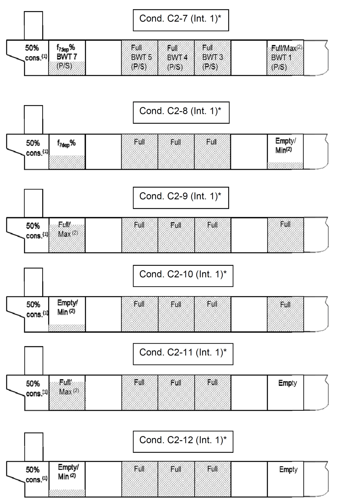 |
  | --- | --- |
  | (비고) (1) 소모품 %를 포함하여 지정된 중간조건. (2) 3. (1) (사)에 주어진 트림과 프로펠러 잠김에 따른 최대 및 최소 적재 높이 별표(*)는 강도 검증(항해조건 아님)만을 위한 조건이다. |   |

  |  | (비고) (1) 소모품 %를 포함하여 지정된 중간조건. (2) 3. (1) (사)에 주어진 트림과 프로펠러 잠김에 따른 최대 및 최소 적재 높이 별표(*)는 강도 검증(항해조건 아님)만을 위한 조건이다. |
  | --- | --- |

  | 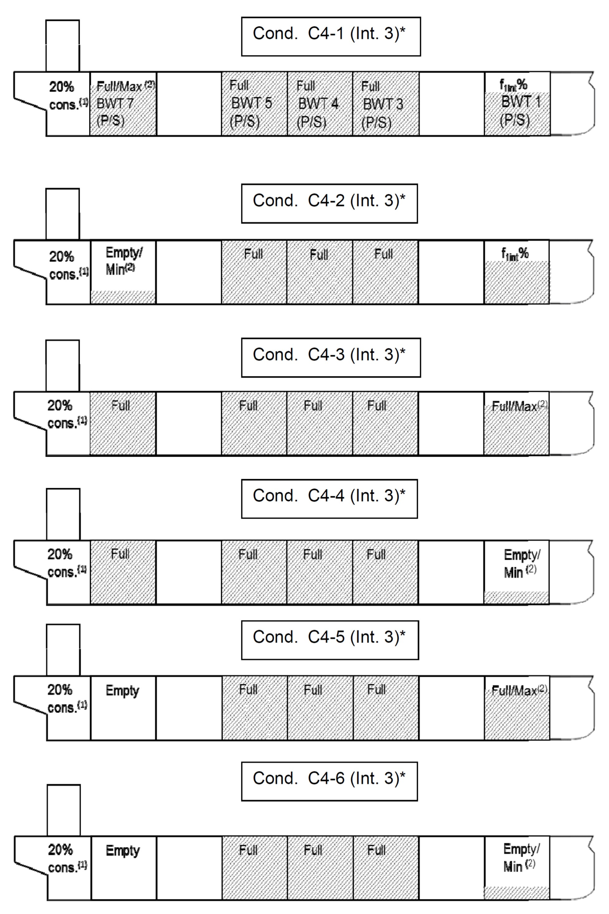 |  |
  | --- | --- |
  | (비고) (1) 소모품 %를 포함하여 지정된 중간조건. (2) 3. (1) (사)에 주어진 트림과 프로펠러 잠김에 따른 최대 및 최소 적재 높이 별표(*)는 강도 검증(항해조건 아님)만을 위한 조건이다. |   |

  | 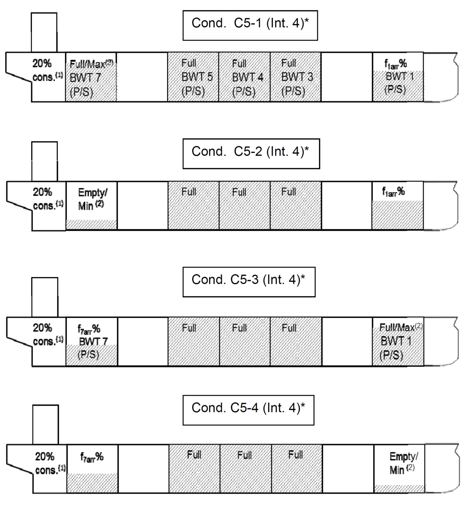 | (비고) (1) 소모품 %를 포함하여 지정된 중간조건. (2) 3. (1) (사)에 주어진 트림과 프로펠러 잠김에 따른 최대 및 최소 적재 높이 별표(*)는 강도 검증(항해조건 아님)만을 위한 조건이다. |
  | --- | --- |

  |  |  |
  | --- | --- |
  | (비고) (1) 소모품 %를 포함하여 지정된 중간조건. (2) 3. (1) (사)에 주어진 트림과 프로펠러 잠김에 따른 최대 및 최소 적재 높이 별표(*)는 강도 검증(항해조건 아님)만을 위한 조건이다. |   |
