# 제3편 선체구조

> 선급 및 강선규칙/적용지침 / RA-03-K / 2025 / KO / Guidance

## 부록 3-2 직접강도평가에 관한 지침

### I. 일반

#### 1. 적용

- **(1)** 이 지침은 선체 주요 부재에 대하여 구조모델링, 응력계산, 항복강도 평가 및 좌굴강도 평가과정에 대한 제반 규정을 다룬다.
- **(2)** 이 지침은 구조모델링의 범위에 따라 전선구조해석에 관한 지침과 화물창 구조해석에 관한 지침으로 구분되어진다.

#### 2. 선급부호

신청자(선주 또는 건조자)의 신청에 따라 다음 규정에 적합할 경우 선급부호 추가특기사항 **SeaTrust(DSA1)** 혹은 **SeaTrust(DSA2)**를 부여할 수 있다.

- **(1)** 2006년 4월 1일 이후에 건조 계약되는 **규칙 11편, 12편** 적용 대상선박은 해당 각 장의 규정을 따른다.
- **(2)** 산적화물선, 유조선, 컨테이너선, 자동차운반선, 액화천연가스 운반선(멤브레인 형식) 및 액화가스 운반선(독립형탱크 형식 A)은 **Ⅲ. 화물창 구조해석** 규정을 적용하여 선급부호 **SeaTrust(DSA1)**를 부여한다. 다만, 우리 선급이 필요하다고 인정하는 경우에는 **Ⅱ. 전선구조해석** 규정도 적용하여야 하며, 이 경우 선급부호 **SeaTrust(DSA2)**를 부여한다. 단, **SeaTrust(DSA2)** 부여시 **SeaTrust(DSA1)**이 수행되어야 한다. *(2017)*
- **(3)** (1), (2)에 규정되지 아니한 선박의 종류에 대하여 선급부호 **SeaTrust(DSA1)** 혹은 **SeaTrust(DSA2)**를 받고자 하는 경우에는 우리 선급과 협의하여 전선 또는 화물창 구조해석에 관한 지침의 관련 규정을 준용하여야 한다.

### II. 전선구조해석

#### 1. 일반

- **(1)** 적용
  - **(가)** 이 지침은 유체동역학적 해석 및 통계 해석을 통하여 구한 하중을 전선 구조모델에 전달하여 구조해석을 수행함으로써 선박의 구조안전성을 평가하기 위한 것으로 **규칙 3장**에서 규정하는 종강도 대상 선박 중 대양을 항해하는 선박에 대하여 적용한다.
  - **(나)** 이 지침을 사용하여 구조 안전성을 검증할 시에도 **규칙 3장**에서 규정하는 최소한의 부재 치수에 대한 조건을 만족해야 하며 이 지침에 따라 계산된 해석 결과를 구조부재의 치수 경감을 목적으로 사용해서는 안 된다.
  - **(다)** 선체운동 및 하중 해석은 우리 선급에서 인정한 선형 2D 스트립 이론이나 선형 3D 패널이론에 의한 프로그램을 사용하여 계산할 수 있다. 단 선박형상을 고려하여 비선형 효과의 영향이 중요하다고 판단될 경우 비선형 시간영역 해석 프로그램에 의한 계산을 수행하여야 한다.
  - **(라)** 구조해석 방법 및 프로그램은 굽힘 변형, 전단 변형, 축 변형 및 뒤틀림 변형의 영향을 고려할 수 있는 것이어야 한다.
- **(2)** 자료제출 *(2020)*
  전선구조해석에 대한 결과를 승인 받기 위해서는 아래의 목록이 포함된 보고서를 제출하여야 한다.
  - **(가)** 전선구조해석에 사용된 도면 목록 (날짜 및 개정 번호를 포함)
  - **(나)** 운동해석 및 구조해석에 사용된 소프트웨어의 정보 (소프트웨어의 이름, 버전 및 참고 자료)
  - **(다)** 도면과 대비하여 구조 모델링 과정에서 이상화된 부분에 관한 설명
  - **(라)** 강재 등급, 판 두께 및 보강재 치수를 포함하는 구조 모델링 정보 (그림 및 표)
  - **(마)** 구조 해석에 적용된 경계조건의 상세 정보 (그림 및 표)
  - **(바)** 운동해석 및 하중해석 결과 (전달함수, 설계파 산정결과 등)
  - **(사)** 설계파 조건에서의 구조 해석 결과 (그림 및 표)
    - **(a)** 구조 해석 모델의 변형 양상 및 정도
    - **(b)** 모든 부재의 응력 분포 및 허용응력 대비 비율
    - **(c)** 판 부재의 좌굴강도
  - **(아)** 허용응력 및 좌굴강도 평가를 만족하지 못한 경우, 설계 개정안 및 평가 결과
- **(3)** 전선구조해석의 절차는 **그림 1**과 같다.
  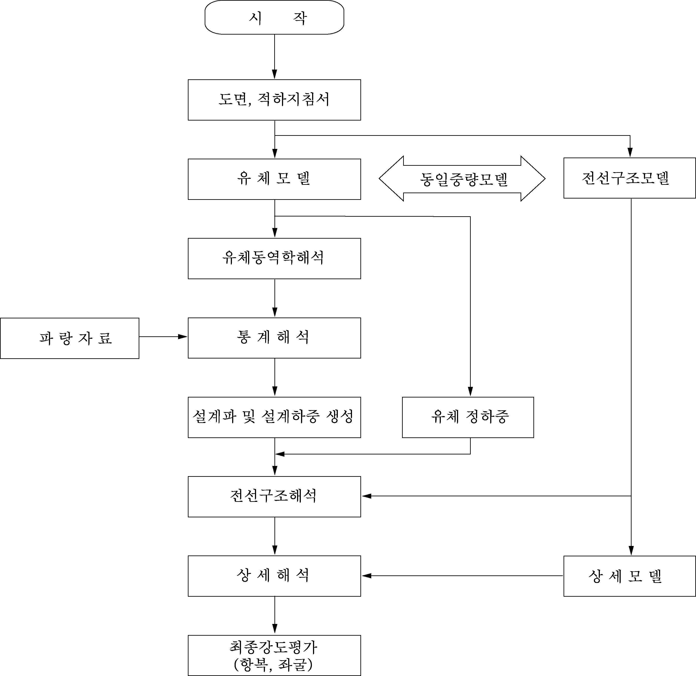
  **그림 1 전선구조해석 절차**

#### 2. 유체모델

- **(1)** 선체 운동 및 파랑하중 계산에 사용되는 유체 모델은 선박의 접수면에 대한 기하학적 형상 및 유체동역학적 특성을 잘 반영할 수 있어야 한다.
- **(2)** 2D 스트립 모델
  선박 길이 방향으로 최소 25~30개의 스트립을 사용하며 각 스트립의 한쪽 현을 최소 10개 이상의 좌표점으로 정의하여야 한다. 형상이 복잡한 부위(선수미부 및 빌지부)는 좌표점을 증가시켜 기하학적 형상을 잘 표현하고 형상이 변하지 않는 부위(중앙 횡단면)도 유체 동하중의 구배를 충분히 반영할 수 있도록 적절히 분할해야 한다.
- **(3)** 3D 패널 모델
  수치해석상의 오차를 줄이기 위하여 충분히 작은 크기의 패널로 모델링을 해야 한다. 선박 길이 방향으로 최소 30~40개의 단면을 사용하고 각 단면의 한쪽 현을 15~20개의 패널로 정의하여야 한다. 따라서 전체 선박형상을 정의하기 위하여 500~800개의 패널을 사용한다. 형상이 복잡한 부위(선수미부 및 빌지부)는 패널수를 증가시켜 기하학적 형상을 잘 표현하고 형상이 변하지 않는 부위(중앙 횡단면)도 유체 동하중의 구배를 충분히 반영할 수 있도록 적절히 분할해야 한다.
- **(4)** 유체모델과 구조모델은 가능한 한 동일한 기하학적 형상, 배수량 및 부력중심을 갖도록 해야 한다.

#### 3. 전선구조모델

- **(1)** 구조모델링 *(2020)*
  - **(가)** 유한요소 모델의 범위는 선박의 전폭과 전체 길이에 대하여 선루를 포함한 모든 선체 구조물이다. 유한요소 모델에는 모든 주요 구조 부재들이 표현되어야 한다. 여기에는 내측판 및 선체외판, 갑판, 이중저 늑판 및 거더, 횡 및 수직 특설 늑골, 스트링거, 횡 및 종격벽 구조, 기타 1차 지지부재 및 선체 거더강도에 기여하는 기타 구조부재가 포함된다.
  - **(나)** 유한요소 모델에는 4절점 또는 3절점 쉘 요소 및 2절점 보 요소를 사용한다.
  - **(다)** 모든 보강재는 축, 비틀림, 두 방향 전단 및 굽힘 강성을 갖고 있는 보 요소로 모델링하여야 한다. 1차 지지부재 및 브래킷의 면재는 봉 또는 보 요소를 사용하여 모델링하여야 한다.
  - **(라)** 쉘 요소의 종횡비는 일반적으로 3을 넘지 않아야 한다. 삼각형 쉘 요소의 사용은 최소화하여야 한다. 가능하면, 높은 응력이나 급격한 응력변화가 예상되는 부위의 요소 종횡비는 1에 가깝게 유지되어야 하고 삼각형 요소의 사용은 피하여야 한다.
  - **(마)** 모델링하는 경우 부식에 대한 추가를 포함한 부재치수를 사용한다.
  - **(바)** 일반적으로 전선구조해석 시 판요소는 늑골 간격으로 한다.
  - **(사)** 이중저거더, 늑판, 횡방향 특설늑골(transverse web frame), 수직방향 특설늑골(vertical web frame) 그리고 횡격벽의 수평스트링거의 깊이방향으로는 적어도 3개의 요소로 분할한다.
  - **(아)** 모델검토
    선체구조를 이상화한 유한요소모델의 적합함을 다음에 따르거나 또는 이와 동등한 방법으로 검증하여야 한다.
    - **(a)** 유한요소모델로부터 계산한 횡단면계수와 중앙횡단면도에 따라 계산한 횡단면계수의 오차가 ±1 ％ 범위내에 있어야 한다.
    - **(b)** 해석모델에 굽힘모멘트를 가하여 발생한 선체 길이방향 굽힘응력이 보이론에 따라서 계산된 값과 대체로 일치해야 한다. 보이론에 의한 선체 길이방향 굽힘응력은 $M/Z$ 으로 계산되고, 여기서 $M$ 은 정수중 굽힘모멘트와 파랑굽힘모멘트의 총합이고 $Z$ 는 고려하는 위치에서의 횡단면계수이다.
- **(2)** 경계조건 *(2021)*
  전선구조모델의 경계조건은 구속에 의한 응력이 발생되지 않도록 단순지지의 형태를 반영해야한다. **표 2**와 **그림 2**는 경계조건의 예를 보여주고 있다. 구속점은 가능한 한 응력 관심부에서 떨어져 있어야 하며 강구조 위에 위치해야 한다. 다만, 경계조건 인근 부위의 평가가 필요하거나, 경계조건에서 반력이 크게 발생하는 파랑하중조건의 경우 관성제거기법(Inertia relief method)을 사용하여 경계조건을 대신할 수 있다. 이 경우 하중 전달의 정확성을 확인하기 위하여 불평형력에 관한 자료를 우리선급에 제출하고 협의하여야 한다.

  | 위치 | 변위 |   |   |
  | --- | --- | --- | --- |
  | 위치 | $\delta x$ | $\delta y$ | $\delta z$ |
  | 점 A | 1 | 1 | 1 |
  | 점 B | 0 | 1 | 1 |
  | 점 C | 0 | 1 | 0 |
  | 비고 1 : 구속 0 : 자유 |   |   |   |

  
  **그림 2 경계조건**

#### 4. 중량모델

- **(1)** 구조물의 총중량은 구조모델의 용적에 밀도를 곱하여 구하며 구조모델에서 제외된 부분의 중량을 고려하기 위하여 적절히 밀도를 증가시킬 수 있다. 구조모델의 중량과 실제중량과의 차이는 선박 전체에 걸쳐 발생하므로 가능한 한 추가되는 중량이 고르게 분포될 수 있도록 조절해야 한다.
- **(2)** 화물중량은 적하지침서에 따라 길이 방향, 폭 방향 및 높이방향의 정확한 위치를 고려하여야 한다. 다만 액체화물인 경우는 중량 중심에 집중된 절점중량의 형태로 간주할 수 있다.
- **(3)** 유체 동역학적 해석에서 사용되는 중량모델과 구조해석에 사용되는 중량모델은 약간의 중량차이에 의해서도 큰 하중 변화를 초래하므로 가능한 한 크기, 중심 및 분포 형태가 동일하여야 한다.
- **(4)** 유체모델과 중량모델은 정적 평형상태를 유지해야 하며 계산된 정수중 굽힘모멘트의 분포는 가능한 한 적하지침서상의 그것과 일치하여야 하며 다음과 같은 범위 안에 있어야 한다.
  - 배수량 : 1%
  - LCG : 선박길이의 0.1%
  - 정수중 굽힘모멘트 : 3%

#### 5. 하중해석

- **(1)** 적하상태
  유체동역학 해석 시 사용하는 적하상태는 선박의 적하지침서를 기초로 가장 운항 비율이 높은 발라스트 및 만재상태를 선택하여야 하며 정수중 종 굽힘 모멘트가 최대 새깅 및 최대 호깅이 되는 조건을 반드시 포함하여야 한다. 그리고 우리선급이 화물 적재 분포가 선박 전체 거동에 영향을 줄 수 있다고 판단하는 경우 추가적인 적하상태를 고려하여야 한다. *(2020)*
- **(2)** 유체정하중
  유체정하중은 유체모델과 중량 또는 구조모델과 중량을 사용하여 계산할 수 있다. 부력과 중량은 정확히 평형을 이루어야 하며 특히 트림이 심한 선박에서는 기선과 수선면 간의 각도를 고려하여 $x$방향 불평형력이 발생하지 않도록 하여야 한다.
- **(3)** 유체동하중 *(2020)*
  - **(가)** 전진속도
    전진속도는 강도해석 시 5 노트, 피로해석 시 설계 속도의 2/3을 사용할 것을 권장한다.
  - **(나)** 파 입사각
    강도해석 시 파 입사각은 0°~360° 걸쳐 전 방향을 고려하여야 하며 최대 30° 간격으로 적용하여야 한다. 선체의 구조 및 적재 조건이 좌,우 대칭이고 우리선급이 인정하는 경우 0°~180° 까지 고려할 수 있으며, 이 경우 횡파 및 사파에 의한 구조보강은 좌우 대칭으로 이루어 져야 한다. 피로해석 시 파 입사각은 0°~360° 전 방향에 대하여 고려하여야 한다.
  - **(다)** 파장
    장파장은 선박 길이의 최소 4배 이상, 단파장은 유체모델을 구성하는 요소의 최소 5배 이상을 갖는 범위에서 최소 20개 이상의 파장을 고려하여야 한다. 파장의 범위 및 개수는 최대값을 포함하여 하중의 전달함수를 가장 효과적으로 표현할 수 있도록 선택하여야 한다.
  - **(라)** 선박 운동 및 파랑하중 해석
  - **(가)** , (나) 및 (다)의 조건에 대하여 우리 선급이 인정한 프로그램을 사용하여 선박운동 및 파랑하중 해석을 수행하고 6자유도 운동(2D strip일 경우 종운동 제외), 각 단면에 작용하는 전단력 및 모멘트, 특정 위치에서의 가속도 및 압력(2D strip일 경우 x방향 압력 제외)에 대한 전달함수를 계산한다.
  - **(마)** 단기해석
  - **(라)** 에서 계산된 전달함수와 불규칙해상상태를 정의하는 파랑 스펙트럼을 이용하여 단기해석을 수행한다. 파랑 스펙트럼은 다음 식으로 표현되는 "Bretschneider or 2 Parameter Pierson- Moskowitz Spectrum"을 사용할 것을 권장한다.
    $S _{\eta } ( \omega |H _{s} , T _{z} ) = \frac{H _{s}^{2}}{4 \pi} \left( \frac{2 \pi}{T _{z}} \right) ^{4} \omega ^{-5} \exp \left[ - \frac{1}{\pi} \left( \frac{2 \pi}{T _{z}} \right) ^{4} \omega ^{-4} \right]$
    여기서, $H_s$ : 유의 파고 (m)
    $\omega$ : 각 주파수 (rad/s)
    $T_z$ : 평균 제로 업 크로싱(zero up-crossing) 파랑 주기 (s)
    선박의 단기 응답 스펙트럼은 하중 전달함수 (load transfer function) $H \left( \omega | \theta \right)$를 사용하여 다음과 같이 계산한다.
    $S \left( \omega |H _{s} , T _{z} , \theta \right) = \left| H \left( \omega | \theta \right) \right| ^{2} S _{\eta } \left( \omega | H _{s} , T _{z} \right)$
    주어진 입사각에 대한 응답의 $n$ 차 스펙트럼 모멘트는 다음을 따른다.
    $m _{n} = \int _{\omega } ^{} {} \sum _{ \theta _{0} -90 {}^{\circ} } ^{\theta _{0} +90 {}^{\circ} } f _{s} ( \theta ) \left| \omega - \frac{\omega ^{2} V}{g} \cos \theta \right| ^{ n} S( \omega |H _{s} , T _{z} , \theta )$
    보통 $f _{s} ( \theta ) = kcos ^{2} ( \theta )$ 로 정의되는 퍼짐 함수(spreading function)를 사용한다. 다만, $k$ 는 다음의 값으로 한다.
    $\sum _{\theta_0 - 90 {}^{\circ} } ^{\theta_0 + 90 {}^{\circ}}f_s (\theta) = 1$
    여기서, $\theta_0$ : 주요 파 입사각
    $\theta$ : 주요 파 입사각 주위의 상대적 퍼짐(relative spreading)
  - **(바)** 장기해석

    **표 3 영국 해양기술(British Marine Technology)의 글로벌 파랑 통계에서 유도한 북대서양 해역에서의 100000 관찰에 대한 해상상태 확률**

    | $H _{S} /T _{Z}$* | 1.5 | 2.5 | 3.5 | 4.5 | 5.5 | 6.5 | 7.5 | 8.5 | 9.5 | 10.5 | 11.5 | 12.5 | 13.5 | 14.5 | 15.5 | 16.5 | 17.5 | 18.5 | SUM |
    | --- | --- | --- | --- | --- | --- | --- | --- | --- | --- | --- | --- | --- | --- | --- | --- | --- | --- | --- | --- |
    | 0.5 | 0.0 | 0.0 | 1.3 | 133.7 | 865.6 | 1186.0 | 634.2 | 186.3 | 36.9 | 5.6 | 0.7 | 0.1 | 0.0 | 0.0 | 0.0 | 0.0 | 0.0 | 0.0 | 3050 |
    | 1.5 | 0.0 | 0.0 | 0.0 | 29.3 | 986.0 | 4976.0 | 7738.0 | 5569.7 | 2375.7 | 703.5 | 160.7 | 30.5 | 5.1 | 0.8 | 0.1 | 0.0 | 0.0 | 0.0 | 22575 |
    | 2.5 | 0.0 | 0.0 | 0.0 | 2.2 | 197.5 | 2158.8 | 6230.0 | 7449.5 | 4860.4 | 2066.0 | 644.5 | 160.2 | 33.7 | 6.3 | 1.1 | 0.2 | 0.0 | 0.0 | 23810 |
    | 3.5 | 0.0 | 0.0 | 0.0 | 0.2 | 34.9 | 695.5 | 3226.5 | 5675.0 | 5099.1 | 2838.0 | 1114.1 | 337.7 | 84.3 | 18.2 | 3.5 | 0.6 | 0.1 | 0.0 | 19128 |
    | 4.5 | 0.0 | 0.0 | 0.0 | 0.0 | 6.0 | 196.1 | 1354.3 | 3288.5 | 3857.5 | 2685.5 | 1275.2 | 455.1 | 130.9 | 31.9 | 6.9 | 1.3 | 0.2 | 0.0 | 13289 |
    | 5.5 | 0.0 | 0.0 | 0.0 | 0.0 | 1.0 | 51.0 | 498.4 | 1602.9 | 2372.7 | 2008.3 | 1126.0 | 463.6 | 150.9 | 41.0 | 9.7 | 2.1 | 0.4 | 0.1 | 8328 |
    | 6.5 | 0.0 | 0.0 | 0.0 | 0.0 | 0.2 | 12.6 | 167.0 | 690.3 | 1257.9 | 1268.6 | 825.9 | 386.8 | 140.8 | 42.2 | 10.9 | 2.5 | 0.5 | 0.1 | 4806 |
    | 7.5 | 0.0 | 0.0 | 0.0 | 0.0 | 0.0 | 3.0 | 52.1 | 270.1 | 594.4 | 703.2 | 524.9 | 276.7 | 111.7 | 36.7 | 10.2 | 2.5 | 0.6 | 0.1 | 2586 |
    | 8.5 | 0.0 | 0.0 | 0.0 | 0.0 | 0.0 | 0.7 | 15.4 | 97.9 | 255.9 | 350.6 | 296.9 | 174.6 | 77.6 | 27.7 | 8.4 | 2.2 | 0.5 | 0.1 | 1309 |
    | 9.5 | 0.0 | 0.0 | 0.0 | 0.0 | 0.0 | 0.2 | 4.3 | 33.2 | 101.9 | 159.9 | 152.2 | 99.2 | 48.3 | 18.7 | 6.1 | 1.7 | 0.4 | 0.1 | 626 |
    | 10.5 | 0.0 | 0.0 | 0.0 | 0.0 | 0.0 | 0.0 | 1.2 | 10.7 | 37.9 | 67.5 | 71.7 | 51.5 | 27.3 | 11.4 | 4.0 | 1.2 | 0.3 | 0.1 | 285 |
    | 11.5 | 0.0 | 0.0 | 0.0 | 0.0 | 0.0 | 0.0 | 0.3 | 3.3 | 13.3 | 26.6 | 31.4 | 24.7 | 14.2 | 6.4 | 2.4 | 0.7 | 0.2 | 0.1 | 124 |
    | 12.5 | 0.0 | 0.0 | 0.0 | 0.0 | 0.0 | 0.0 | 0.1 | 1.0 | 4.4 | 9.9 | 12.8 | 11.0 | 6.8 | 3.3 | 1.3 | 0.4 | 0.1 | 0.0 | 51 |
    | 13.5 | 0.0 | 0.0 | 0.0 | 0.0 | 0.0 | 0.0 | 0.0 | 0.3 | 1.4 | 3.5 | 5.0 | 4.6 | 3.1 | 1.6 | 0.7 | 0.2 | 0.1 | 0.0 | 21 |
    | 14.5 | 0.0 | 0.0 | 0.0 | 0.0 | 0.0 | 0.0 | 0.0 | 0.1 | 0.4 | 1.2 | 1.8 | 1.8 | 1.3 | 0.7 | 0.3 | 0.1 | 0.0 | 0.0 | 8 |
    | 15.5 | 0.0 | 0.0 | 0.0 | 0.0 | 0.0 | 0.0 | 0.0 | 0.0 | 0.1 | 0.4 | 0.6 | 0.7 | 0.5 | 0.3 | 0.1 | 0.1 | 0.0 | 0.0 | 3 |
    | 16.5 | 0.0 | 0.0 | 0.0 | 0.0 | 0.0 | 0.0 | 0.0 | 0.0 | 0.0 | 0.1 | 0.2 | 0.2 | 0.2 | 0.1 | 0.1 | 0.0 | 0.0 | 0.0 | 1 |
    | SUM | 0 | 0 | 1 | 165 | 2091 | 9280 | 19922 | 24879 | 20870 | 12898 | 6245 | 2479 | 837 | 247 | 66 | 16 | 3 | 1 | 100000 |
    | * 유의파고($H _{S}$)와 평균 제로업 크로싱 주기($T _{Z}$) 값은 해당구간에서의 중간 값을 의미한다. |   |   |   |   |   |   |   |   |   |   |   |   |   |   |   |   |   |   |   |

    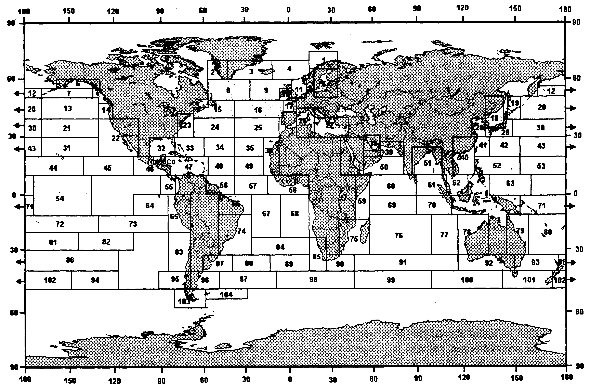
    **그림 3 북대서양 해역의 구역정의**
    - **(a)** (마)항에서 구한 단기해석 결과와 파랑자료를 사용하여 장기해석을 수행할 수 있다. 강도해석 시 사용하는 파랑자료는 **그림 3**의 8, 9, 15, 16에 해당하는 북대서양 해역에 대한 것으로 **표 3**의 분산표(IACS Rec. No. 34)로 나타내었다. 피로해석 시 사용하는 파랑자료는 대상선박의 항로를 고려한 파랑자료 또는 선급이 인정하는 바에 따른다.
    - **(b)** 전선구조해석을 위한 파랑하중은 북대서양 파랑자료 조건에서 계산된 10^-8 확률수준 값에 선박운항과 관련된 계수($f _{R} = 0.85$)를 곱하여 사용할 수 있다.

#### 6. 설계파 산정 (2020)

- **(1)** 목표하중은 **5**항 (3)호의 (바)를 이용하여 계산하며, 규칙이 정한 하중 값으로 대체할 수 있다. 횡파 (90° 또는 270°)에 대해서는 파도진행 방향 상관계수($f_{ \beta }=0.8$)을 추가적으로 적용할 수 있다.
- **(2)** 설계파는 선박으로 하여금 목표하중과 등가의 응답을 줄 수 있도록 작용하는 규칙파로서 입사파와 파장은 전달함수(transfer function)가 최대가 될 때의 값을 사용하고 진폭은 목표하중 값을 전달함수의 최대치로 나눔으로써 구할 수 있다. 만약 선정된 설계파의 경사도가 지나치게 높을 경우(파고/파장>1/7) 최대치일 때의 파장보다 약간 큰 파장을 선택하고 그에 대응하는 진폭을 적용하여 경사도를 완화시켜야 한다.
- **(3)** 설계파의 산정기준인 주요 하중 인자(dominant loads parameter)는 하중이 최대로 작용하거나 구조적으로 취약하여 구조안전성을 반드시 검증하여야 할 위치에 대하여 선정하여야 하며 최소한 다음을 반드시 포함하여야 한다. 단, 우리선급이 필요하다고 판단하는 경우, 추가적인 주요 하중 인자를 고려하여야 한다.
  - 선박 중앙 위치에 작용하는 파랑 종굽힘 모멘트(선수파 및 선미파 조건을 포함)
  - 선박 중앙 위치에 작용하는 파랑 수평굽힘 모멘트
  - 선박 $L/4$, $L/2$ 및 $3L/4$ 위치에 작용하는 비틀림 모멘트
  - 선수 수선 위치에서의 수직가속도
  - 횡요
  - 선박 중앙 흘수선 위치에 작용하는 파랑 동압력
  선박에 따라 대형개구부와 같이 구조적으로 취약하다고 인정되는 부분에 대하여도 주요하중인자를 선정하여야 한다.

#### 7. 하중 전달

- **(1)** 선정된 각각의 주요하중인자에 의해 설계파를 산정하고 각 설계파에 따른 가속도에 기인한 관성력 및 유체동압을 계산하여 구조모델에 합리적으로 분포시켜야 하며 이 과정에서 구조모델의 각 단면에 작용하는 하중과 유체동역학 해석에서 구한 값이 일치하는 지를 확인해야 한다.
- **(2)** 유체동압 분포
  유체동역학 해석에서 구한 유체 동압은 힘 또는 압력의 형태로 구조모델로 전달할 수 있으며 이 때 유체모델과 구조모델의 상이함에서 나오는 불평형력이 가능한 한 최소가 되도록 해야 한다.
- **(3)** 관성력 분포
  - **(가)** 구조물 중량
    유체동역학 해석에서 구한 속도를 이용하여 해당 구조부재의 위치에서의 가속도를 계산하고 부재의 중량을 곱하여 관성력을 계산한 후 해당 부재를 구성하는 노드에 분포시킨다.
  - **(나)** 고상화물
    컨테이너와 같은 고상화물은 해당 화물의 위치에서의 가속도를 고려하며 가속도의 각 방향에 따라 실제 하중이 전달되는 부위의 노드에 관성력을 분포시킨다.
  - **(다)** 액상화물
    화물에 작용하는 가속도는 화물창의 무게중심위치에서 계산된 값을 사용할 수 있으며 각 방향별 가속도에 의해 발생하는 내부 압력을 합산하여 내부압력의 형태로 구조모델에 가해준다. 이때 수두의 기준점은 수직가속도는 탱크 경계의 최상단, 수평 및 길이 방향 가속도는 자유표면의 중간 부위가 된다.
- **(4)** 불평형력
  구조모델과 유체모델의 차이, 구조해석과 유체동역학 해석 시에 사용된 중량모델의 차이 및 롤운동의 점성 감쇠력(viscous damping force) 등에 의해 일정량의 불평형력이 구조모델의 경계조건에 해당하는 변위의 구속점에서 발생하게 된다. 이때 불평형력의 크기, 원인, 해소방법 등에 대한 적절한 자료를 제출하여야 한다.

#### 8. 구조해석 및 허용응력

- **(1)** 구조해석
  - **(가)** 구조해석은 유한요소법을 사용하여 수행하여야 한다.
  - **(나)** 해석 시 사용되는 프로그램은 우리 선급에서 인정한 정도 높은 프로그램이어야 한다. 우리 선급이 해석에 사용된 프로그램과 관련된 정보 및 정확도를 입증할 수 있는 자료를 필요시 요청할 경우 이를 제출하여야 한다.
- **(2)** 평가대상 *(2020)*
  - **(가)** 구조 안전성 평가는 파랑 하중에 의해 야기되는 전선 거동에 영향을 받는 선체 구조 부재를 대상으로 한다. 선박 길이 방향에서 연속적으로 배치되지 않은 선루 및 갑판실 등은 평가대상에서 제외한다. 다만, 선체와 연결되어 전선 거동에 영향을 받는 부위는 평가대상에 포함한다.
  - **(나)** 선수미 구조에서 불평형력에 의해 국부적인 응력집중이 발생하는 경계조건 적용 부위는 평가대상에서 제외한다.
- **(3)** 허용응력
  구조해석의 의한 응력은 **표 4**에 허용응력에 의하여 항복 강도를 평가한다.

  | 요소 형태 | 허용 응력 |
  | --- | --- |
  | 쉘 요소 | $\sigma _{e} \mathrm{LEFT} ( N/mm ^{2} \right)$ |
  | 쉘 요소 | $0.9 \beta \sigma _{Y} /K$ ^3. |
  | (비고) 1. $\sigma _{Y}$ : 235 $\mathrm{N}/mm^2$ 2. 등가응력 $\sigma _{e}$는 다음에 따른다. $\sigma _{e} = \sqrt {\sigma _{x} ^{2} + \sigma _{y} ^{2} - \sigma _{x} \sigma _{y} +3 \tau ^{2} }$ $\sigma _{x}$ : 요소좌표계 $x$방향 응력 $\sigma _{y}$ : 요소좌표계 $y$방향 응력 $\tau$ : 요소좌표계 $x-y$ 평면내의 전단응력 3. $\beta$ : 요소분할 밀도 계수 종부재 간격의 경우 : 1.0 200 x 200 mm 요소분할 크기 이하의 경우 : 1.15 100 x 100 mm 요소분할 크기 이하의 경우 : 1.25 50 x 50 mm 요소분할 크기 이하의 경우 : 1.5 2t x 2t 요소분할 크기 이하의 경우 : 1.7 여기서, t는 요소의 두께 (mm) |   |

  | 재료기호 | $K$ |
  | --- | --- |
  | *A*, *B*, *D* 및 *E* | 1.0 |
  | *AH* 32, *DH* 32 및 *EH* 32 | 0.78 |
  | *AH* 36, *DH* 36 및 *EH* 36 | 0.72 |
  | *AH* 40, *DH* 40 및 *EH* 40 | 0.68(1) |
  | *AH* 47, *DH* 47 및 *EH* 47 | 0.62(2) |
  | (비고) (1) 지침 **부록 3-3 선체구조의 피로강도평가 지침**에 따라서 선체구조의 피로강도 평가가 수행된다면 재료계수 $K$는 0.66을 사용할 수 있다. (2) **지 침 7편 부록 7-8**에 따른 컨테이너선의 고강도 극후판 적용에 한함. |   |

#### 9. 국부 구조강도해석 (2020)

- **(1)** 적용
  아래 (가)부터 (다)까지에 해당하는 경우 우리선급의 판단에 따라 국부 구조강도해석이 요구될 수 있다.
  - **(가)** 구조해석 결과 계산된 응력이 허용 응력의 95%를 초과할 때 (요소 크기가 $200 \times 200 \mathrm{mm}$를 초과하는 경우)
  - **(나)** 응력집중이 예상되나 하중 및 경계조건 적용의 어려움으로 인해 **III. 화물창 구조해석**을 통해 평가할 수 없는 부위
  - **(다)** 요소의 밀도 때문에 모델이 도면상의 구조를 반영하기 어려운 경우
- **(2)** 모델링
  - **(가)** 국부 구조강도 해석 범위는 검토대상 구역으로부터 모든 방향으로 10개 이상의 요소이어야 한다.
  - **(나)** 국부 구조강도 해석 범위 내의 모든 판 및 보강재는 쉘요소로 표현되어야 한다.
  - **(다)** 요소의 종횡비는 가능한 1에 가깝게 유지되어야 하며 3 이하로 하여야 한다.
  - **(라)** 요소 모서리의 각도가 45도 미만이거나 도는 135도를 초과하는 비뚤어진 요소는 피하여야 한다.
- **(3)** 평가
  상세 요소분할 해석 결과는 **표 4**의 허용 응력 기준을 만족하여야 한다.

#### 10. 좌굴강도 (2020)

구조해석 결과에 대한 좌굴강도계산은 **IV. 좌굴강도계산**에 따른다.

### III. 화물창 구조해석

#### 1. 일반

- **(1)** 적용
  - **(가)** 화물창구조해석에 의하여 선체구조 각 부재의 치수를 정하는 경우, 그 범위 및 절차는 우리 선급과 협의하여 정할 수 있다.
  - **(나)** 화물창구조해석에 의하여 선체구조 각 부재의 치수를 정할 경우에도 **규칙 3장**의 종강도 규정을 만족하여야 한다.
  - **(다)** 화물창구조해석에 의하여 강판의 두께를 정할 경우에도 규칙에 규정하는 최소 판두께 미만으로 하여서는 아니된다.
  - **(라)** 해석방법 및 해석프로그램은 굽힘변형, 전단변형, 축변형 및 뒤틀림 변형의 영향을 고려할 수 있는 것이어야 한다.
  - **(마)** 해석방법 및 해석프로그램은 평면 또는 입체구조 모델의 거동을 합리적인 경계조건하에서 유효하게 표현할 수 있어야 한다.
  - **(바)** 화물창구조해석을 할 때에는 그 계산조건을 명시한 자료 및 계산결과를 정리한 자료를 우리 선급에 제출하여야 한다.
  - **(사)** 이 지침에 규정되어 있지 않은 선박의 종류에 대하여 화물창구조해석을 수행하는 경우에도 이 지침의 관련규정을 준용할 수 있다.
- **(2)** 화물창구조해석 과정
  화물창구조해석 과정은 **그림 4**와 같다.
- **(3)** 구조의 모델링
  - **(가)** 해석 대상인 구조의 모델은 직접강도계산에 의하여 치수를 정하려는 부재의 거동에 영향을 미친다고 판단되는 주위의 부재도 포함하는 것으로 한다.
  - **(나)** 판요소, 보요소, 및 트러스요소 등 적절한 요소를 택하여 구조의 거동을 충실하게 표현할 수 있는 구조로 모델화 하여야 한다.
  - **(다)** 모델링하는 경우 부식에 대한 추가를 포함한 부재치수를 사용한다.
  - **(라)** 각 구조부재의 모델에 대한 요소분할이 직접강도 계산에 의하여 치수를 정하기에 불충분할 때에는 그 부재에 대한 상세분할 해석을 하고 그 해석결과에 따라 검토를 하여야 한다.
  - **(마)** 산적화물선, 이중선체 유조선, 컨테이너선, 자동차운반선, 멤브레인 형식 액화천연가스 운반선 및 액화가스(LPG) 운반선(독립형탱크 형식 A)에 대한 구조모델에 대하여는 이 규정에 추가하여 **3**항부터 **8**항에 따라야 한다. *(2020)*
  - **(바)** 유한요소모델의 좌표계는 **표 6**과 같이 사용한다.
    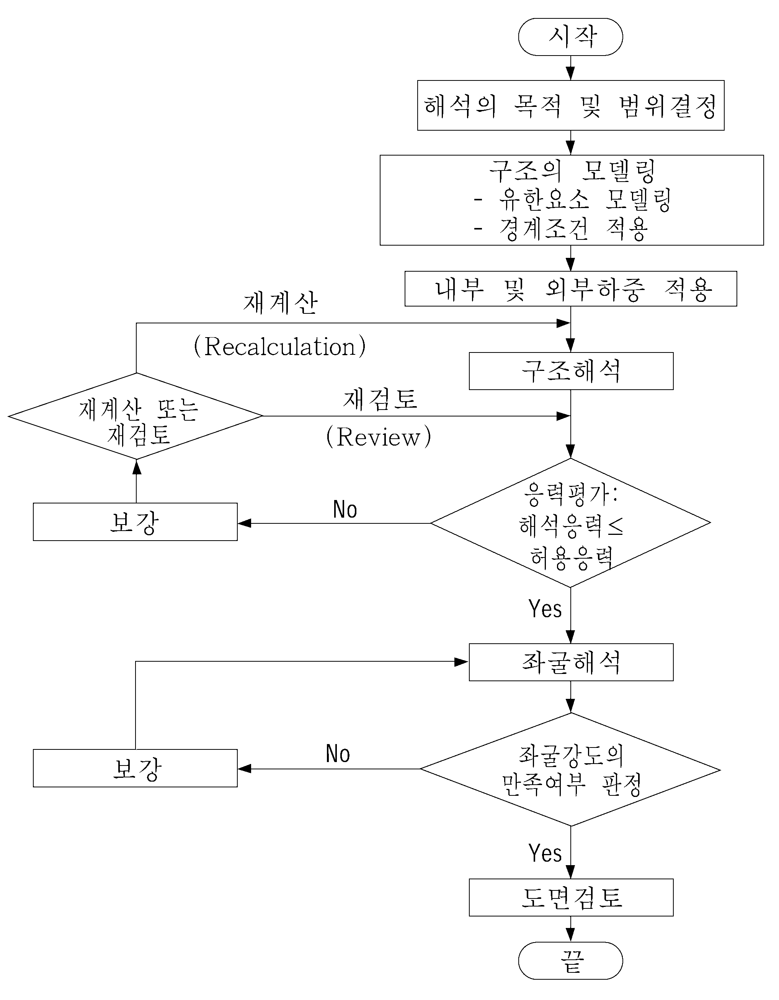
    **그림 4 화물창 구조해석 흐름도**

    | 좌표 | 방향 | 비고 |
    | --- | --- | --- |
    | $x$ | 길이방향 | 선미에서 선수 (+) |
    | $y$ | 폭방향 | 중심선면에서 좌현 (+) |
    | $z$ | 깊이방향 | 상향 (+) |
  - **(사)** 선측외판 및 종격벽판 등 큰 전단력을 받는 부재는 판요소로 모델링하는 것이 바람직하다.
  - **(아)** 요소분할을 할 때에는 모델내의 응력분포상태를 가상하여 적정 크기로 분할하여 과대한 종횡비가 되는 분할을 피하는 등 합리적으로 하여야 한다.
  - **(자)** 거더와 같이 깊이 방향에 응력변화가 있는 것에 대하여는 이것이 판별되도록 요소 분할을 하여야 한다.
  - **(차)** 해석모델에 포함되어 있는 출입용 개구 및 경감구멍은 원칙적으로 모두 반영하는 것으로 한다. 만약, 요소크기가 개구를 반영할 수 없는 경우에는 해석결과 발생한 전단응력을 모델면적과 개구가 고려된 실제면적과의 비만큼 증가시킨다. 단, 이중저 거더나 호퍼탱크의 너클부와 같이 전단응력이 크게 발생하는 부위에는 요소분할을 상세히 하여 반드시 개구 및 경감구멍을 반영토록 한다.
  - **(카)** 보요소의 유효폭은 부재 양측에 각각 부재길이의 0.1배의 폭을 포함하는 판을 모델링 한다. 단, 포함되는 판은 타부재에 의해 유효하게 보강되어 있거나 충분한 판두께를 갖고 있다고 우리 선급이 인정하는 것이어야 한다.
    다만, 부재길이의 0.1배의 폭은 인접한 부재까지 거리의 1/2을 넘어서는 아니 된다.
  - **(타)** 보요소의 유효단면적은 늑골 끝부분의 고착조건에 따라 **표 1**과 같이 고려되어 진다.
- **(4)** 모델검토
  선체구조를 이상화한 유한요소모델의 적합함을 다음에 따르거나 또는 이와 동등한 방법으로 검증하여야 한다.
  - **(가)** 유한요소모델로부터 계산한 횡단면계수와 중앙횡단면도에 따라 계산한 횡단면계수의 오차가 ±1 ％ 범위내에 있어야 한다.
  - **(나)** 해석모델에 굽힘모멘트를 가하여 발생한 선체 길이방향 굽힘응력이 보이론에 따라서 계산된 값과 대체로 일치해야 한다. 보이론에 의한 선체 길이방향 굽힘응력은 $M/Z$ 으로 계산되고, 여기서 $M$ 은 정수중 굽힘모멘트와 파랑굽힘모멘트의 총합이고 $Z$ 는 고려하는 위치에서의 횡단면계수이다.
- **(5)** 경계조건
  실제구조와 같은 거동을 표현할 수 있는 적합한 경계조건을 구조모델에 적용하여야 한다. 산적화물선, 이중선체 유조선, 컨테이너선, 자동차운반선, 멤브레인 형식 액화천연가스 운반선 및 액화가스(LPG) 운반선(독립형탱크 형식 A)에 대하여는 이 규정에 추가하여 **3**항부터 **8**항에 따라야 한다. *(2020)*
- **(6)** 하중 일반
  - **(가)** 구조모델의 경계부 전단 및 후단에 작용하는 선체종굽힘에 의한 하중은 원칙적으로 고려할 필요가 없다. 다만, 이것을 고려할 때에는 그 해석결과에 대한 허용응력은 우리 선급이 적절하다고 인정하는 바에 따른다.
  - **(나)** 원칙적으로 적재화물 및 평형수 등에 의한 하중, 정수압 및 파랑하중 등을 고려하여야 한다.
  - **(다)** (나)에 있어서 우리 선급이 필요하다고 인정할 경우에는 화물의 관성력에 의한 하중도 고려하여야 한다.
  - **(라)** 슬로싱과 같은 충격 동하중이 예상되는 화물창에 대하여는 별도로 검토하여 자료를 제출하여야 한다.
  - **(마)** 산적화물선, 이중선체 유조선, 컨테이너선, 자동차운반선 및 멤브레인 형식 액화천연가스 운반선에 대한 하중에 대하여는 이 규정에 추가하여 **3**항부터 **7**항에 따라야 한다.
- **(7)** 적재하중
  - **(가)** 액체화물 및 평형수 등에 의한 하중
    - **(a)** 탱크 수두의 상단은 탱크의 정판상 넘침관의 상단까지의 거리의 1/2의 위치로 하여야 한다.
    - **(b)** 큰 디프탱크의 수두는 (a)에 의하는 것 이외에 필요하다고 인정되는 경우 동적 영향에 의한 적절한 부가수압을 고려하여야 한다.
    - **(c)** 항내 등 파랑의 영향이 적은 수역에서만 적재되는 액체화물 및 평형수에 대하여는 실제로 적재되는 수두를 사용하여도 좋다.
    - **(d)** 특히 필요하다고 인정되는 경우를 제외하고 연료, 청수 등 소비되는 액체에 의한 하중을 고려할 필요가 없다.
    - **(e)** 화물의 밀도 및 수두를 승인용 자료에 명시하여야 한다.
  - **(나)** 입상화물(광석 및 곡물 등)에 의한 하중
    산적화물선에 대한 하중에 대하여는 **3**항에 따라야 한다.
- **(8)** 정수압
  - **(가)** 선저 및 선측에 작용하는 정수압으로서는 각 적재상태에서의 강도계산용 흘수에 있어서의 수두 (m)를 고려한다.
  - **(나)** 수압 시험상태에서의 하중
    - **(a)** 수압시험을 하는 탱크의 수두상단은 탱크의 정판상 2.4 m 의 위치로 한다.
    - **(b)** 수압 시험상태에 있어서의 선측 및 선저수압은 강도계산용 흘수의 1/3의 흘수에 상당하는 정수압으로 한다.
- **(9)** 파랑하중
  - **(가)** 파랑변동 하중
    $H _{0} =0.5 \times H _{W}$ (m)
    $H _{1} =0.9 \times H _{W}$ (m)
    $H _{2} =0.25 \times H _{W}$ (m)
    여기서,
    $H _{W} = 0.61L ^{1/2}$ -------------------- #eqnID-1491150_s2 m
    $= 1.41L^1/3$ --------------------- 150 m#eqnID-1493250_s2 m
    $= 2.23L^1/4$ --------------------- 250 m#eqnID-1495300_s2 m
    $= 9.28$ --------------------- 300 m$< L$
    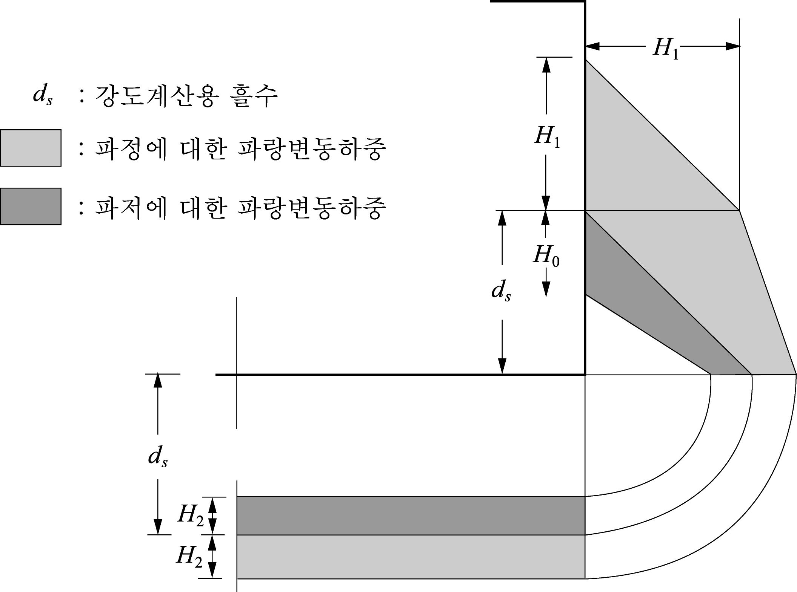
    **그림 5 파랑변동하중**
    - **(a)** 파도의 파정 또는 파저에 해당하는 파랑변동 하중으로서 다음 식에 나타난 정수중 흘수에서의 정수압으로부터의 변동분 $H _{0}$*,* $H _{1}$ 및 $H _{2}$ 에 상당하는 수두 (m)를 고려한다. (**그림 5** 참조)
    - **(b)** 항내 등 파랑의 영향이 적은 수역에서의 파랑변동하중은 (a)에 규정하는 $H _{0}$*,* $H _{1}$ 및 $H _{2}$ 의 값의 1/2로 하여도 좋다.
    - **(c)** 파랑변동하중은 선박의 길이 방향에 균일하게 분포하는 것으로 한다.
- **(10)** 허용응력
- **(3)** 호에 규정하는 구조모델에 대하여 (5)호에서 (9)호까지 규정된 경계조건과 하중이 작용한 경우 각 구조부재에 생기는 응력의 크기가 다음에 정하는 응력값 이하가 되도록 부재치수를 결정하여야 한다.
  - **(가)** 연강재를 사용할 경우의 허용응력
    산적화물선, 이중선체 유조선, 컨테이너선, 자동차운반선 및 멤브레인 형식 액화천연가스 운반선에 대하여는 **3**항부터 **7**항에 정하는 것으로 하며, 특별히 규정하지 않은 경우에는 우리 선급이 적절하다고 인정하는 바에 따른다.
  - **(나)** 고장력강을 사용할 경우의 허용응력
  - **(가)** 에 규정되어 있는 값을 **표 7**의 재료계수 $K$ 로 나눈 것으로 한다.

    | 재료기호 | $K$ |
    | --- | --- |
    | *A, B, D* 및 *E* | 1.0 |
    | *AH32, DH32* 및 *EH32* | 0.78 |
    | *AH36, DH36* 및 *EH36* | 0.72 |
    | *AH40, DH40* 및 *EH40* | 0.68 |

#### 3. 산적화물선의 화물창 구조해석

- **(1)** 일반
  - **(가)** 산적화물선의 화물창 내 부재의 치수를 화물창구조해석에 의하여 결정할 때는 화물창구조해석에 필요한 자료를 제출하여 미리 우리 선급의 승인을 받아야 하며, 화물창구조해석 절차는 다음 (2)호부터 (5)호에 따른다.
  - **(나)** 여기에서 특별히 언급하지 아니한 사항은 **1**항을 따른다.
- **(2)** 구조의 모델링
  - **(가)** 해석범위
    해석대상의 범위는 선체중앙부 평행부의 인접한 3개(1/2+1+1/2)의 화물창의 한쪽 현으로 하며 이때 각 화물창의 길이는 전체 또는 1/2 화물창으로 하며 화물창 사이의 수밀격벽과 디프탱크격벽을 포함해야 한다. 다만, 선체구조의 배치와 화물 및 평형수의 적재방법이 선체중앙면을 기준으로 비대칭일 경우에는 선박의 전폭을 해석범위로 한다. 해석범위의 기준이 되는 화물창의 길이 $l _{h}$ 는 횡격벽 하부스툴의 수평면에 대한 화물창에 면하지 않는 측의 경사각이 60° 미만인 경우는 횡격벽 하부스툴의 상단을 통하여 이 경사각이 60°를 이루는 선과 내저판과의 교점간의 거리 ($m$)를 기준으로 한다. (**그림 8** 참조)
    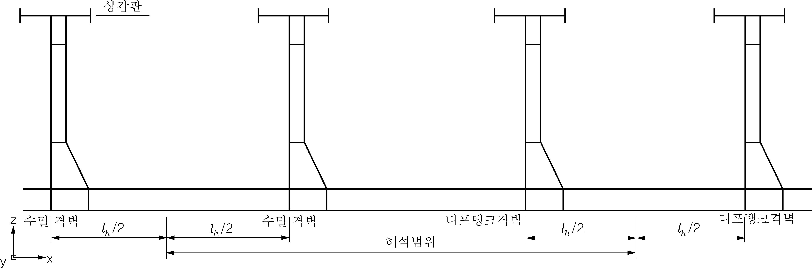
    **그림 8 화물창 모델의 해석범위**
  - **(나)** 구조의 모델링
    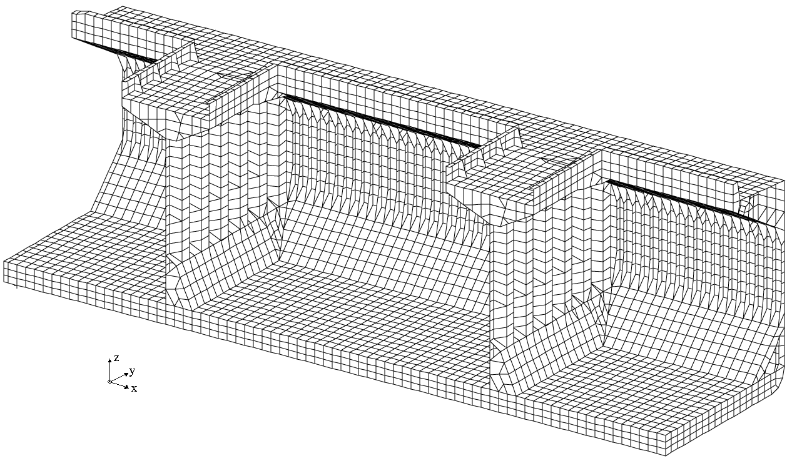
    **그림 9 화물창 모델의 예**
    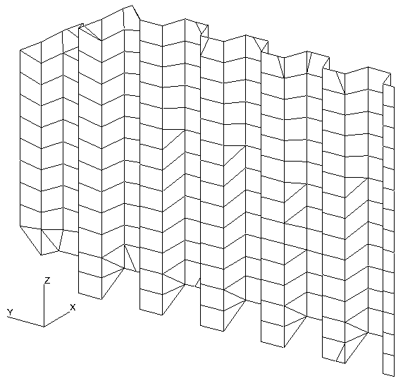
    **그림 10 파형격벽 모델의 예** 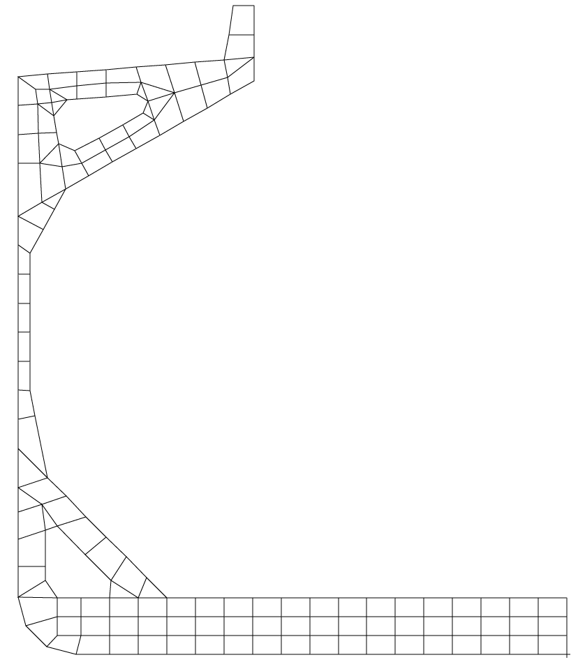
    **그림 11 Web frame 모델의 예**
    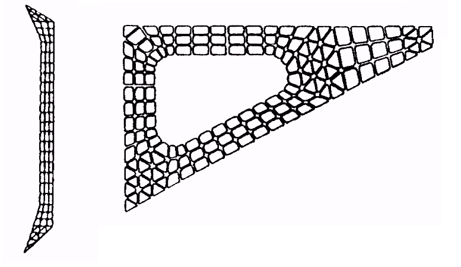
    **그림 12 상세분할 해석에 의한 모델의 예**
    - **(a)** 판구조로 모델링하는 경우에는 요소분할을 길이방향으로는 각 늑골간격으로, 폭방향으로는 종늑골의 간격으로 분할하며 이중저 거더 및 늑판은 깊이방향으로 3개 이상으로 분할함을 원칙으로 한다. 요소분할의 표준 예를 **그림 9**에서 **11**에 표시하였다.
    - **(b)** 상세분할 해석을 하는 경우에 선형요소를 이용한 요소분할의 예를 **그림 12**에 나타내었다. 이 경우 트랜스버스의 깊이 방향으로는 3개 이상의 요소로 분할함을 원칙으로 한다.
    - **(c)** 선측외판, 내저판, 상갑판 및 파형격벽판 등 큰 전단력을 받는 부재는 판요소로 모델링하는 것이 바람직하다. 파형격벽에 설치된 쉐더판(shedder plate)도 판요소로 모델에 포함되어야 한다.
    - **(d)** 거더와 같이 깊이 방향에 응력 변화가 있는 것에 대하여는 이것이 판별되도록 요소 분할을 하여야 한다.
- **(3)** 경계조건
  해석모델이 반폭일 경우에는 다음의 기준을 따른다. 다만 전폭의 모델일 경우에는 선체중심선면의 경계조건을 적용하지 않는 대신 모델양단의 선저외판과 선체중심선면의 교점에 폭방향의 변위를 구속한다. 경계조건의 예를 **표 14**와 **그림 13**에 표시하였다.
  - 모델의 양단면 (①) : 대칭조건
  - 선체 중심선면 (②) : 대칭조건
  - 상하 방향에 대한 불평형력을 횡격벽과 선측외판의 교점에 상쇄력으로 분포시킨다.(③)

  | 좌표 위치 | 변위 |   |   | 회전변위 |   |   |
  | --- | --- | --- | --- | --- | --- | --- |
  | 좌표 위치 | $U _{x}$ | $U _{y}$ | $U _{z}$ | $\theta _{x}$ | $\theta _{y}$ | $\theta _{z}$ |
  | ① 모델의 양단면 | 1 | 0 | 0 | 0 | 1 | 1 |
  | ② 선체 중심선면 | 0 | 1 | 0 | 1 | 0 | 1 |
  | ③ 횡격벽과 선측외판과의 교점 | 0 | 0 | 1 | 0 | 0 | 0 |
  | (비고) 1 : 구속, 0 : 자유 |   |   |   |   |   |   |

  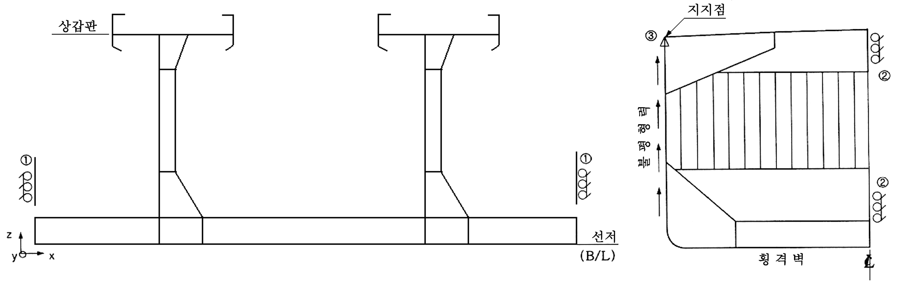
  **그림 13 경계조건**
- **(4)** 하중
  - **(가)** 일반
    원칙적으로 적재화물 및 평형수 등에 의한 하중, 정수압 및 파랑하중 등을 고려하여야 한다.
  - **(나)** 하중조건
    고려하는 하중조건은 만재시 및 평형수적재를 기준으로 한다. 격창적하, 2항구(two port) 적하 또는 비중량이 큰 화물의 적하 등과 같이 특수한 적재상태가 예상될 경우 그러한 적하상태도 계산에 포함한다. **표 16**은 각 하중조건의 예를 표시하였다.
  - **(다)** 내부하중
    - 화물의 적재형상은 화물창 중앙부에서는 종횡방향으로 수평하고 선측방향으로는 화물적하각(repose angle) $\phi /2$ 로 하향 경사진다고 가정한다.
    - 화물창 중앙부 수평부분의 폭 $b$ 는 화물창폭의 1/4로 가정한다.
    - 적재높이 $h _{CL}$ 은 적재되는 화물의 질량, 화물적하각, 밀도에 따라 결정한다. 길이 방향의 적하형상은 폭방향 형상으로 일정하다고 가정한다.
    - 화물의 밀도 및 적하각이 명시되지 않았을 때에는 밀도 3.0 (t/m3) 및 화물적하각 35°로 가정한다.
    $9.81 \gamma h k ^{2}$(N/mm^2)
    $\gamma$ : 화물의 밀도 (kg/m^3)
    $h$ : 고려하는 패널로부터 직상부 화물의 표면까지의 수직 높이 (m).
    $k$ : **표 15**에 따른다.
    $\beta$ : 빌지호퍼 탱크의 경사판과 내저판 사이의 각(**그림 15** 참조)

    | 경사각 $\beta$ (도) | $k$ |
    | --- | --- |
    | $\beta \leq 40 {}^{\circ}$ | $1.0$ |
    | $40 {}^{\circ} < \beta <80 {}^{\circ}$ | $1.4-0.01 \beta$ |
    | $\beta \geq 80 {}^{\circ}$ | $0.6$ |

    
    **그림 14 화물창의 적재형상** 
    **그림 15 경사각** #eqnID-1529
    평형수 겸용창에 있어서 각 위치에서의 수두는 다음 식에 의한 값과 식중의 $h$ 의 값 중 큰 값으로 한다.
    $0.85(h+ \Delta h)$(m)
    $h$ : 고려하는 위치에서 창구코밍까지의 높이 (m).
    $\Delta h$ : 다음 식에 의한다.
    $\Delta h= \frac{16}{L} (l _{1} -10)+0.25( \frac{2}{3} B-10)$
    $l _{1}$ : 탱크의 길이 (m)로서 10 m 이하일 때는 10 m 로 한다.
    $B$ : 선박의 너비 (m*)*로서 15 m 이하일 때는 15 m 로 한다.
    - **(a)** 광석 등 입상화물에 의한 하중
    - **(i)** 화물의 적재 높이 및 형상은 다음을 기준으로 한다.(**그림 14** 참조)
      - **(ii)** 화물창의 내벽에 작용하는 하중은 다음 식에 의한다. 다만, 화물하중은 선측외측에 작용하지 않는다.
    - **(b)** 액체화물 및 평형수 등에 의한 하중
  - **(라)** 외부하중
    **1**항 (8)호를 준용한다.
    **1**항 (9)호를 준용한다.

    | 번호 | 하중상태 | 흘수 | 적하경향 | 질량 |   |   |
    | --- | --- | --- | --- | --- | --- | --- |
    | 1 | 만재 적하 | $T$ | 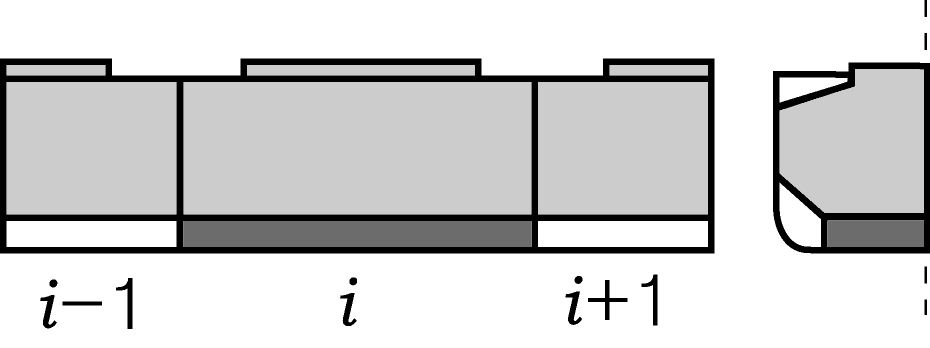 | Cargo Mass | $i-1$ | $M _{Full}$ |
    | 1 | 만재 적하 | $T$ |   | Cargo Mass | $i$ | $M _{Full}$ |
    | 1 | 만재 적하 | $T$ |   | Cargo Mass | $i+1$ | $M _{Full}$ |
    | 1 | 만재 적하 | $T$ |   | DB Mass | $i-1$ | empty |
    | 1 | 만재 적하 | $T$ |   | DB Mass | $i$ | $M _{DBFO}$ |
    | 1 | 만재 적하 | $T$ |   | DB Mass | $i+1$ | empty |
    | 2 | 슬랙 적하 1 | $T$ | 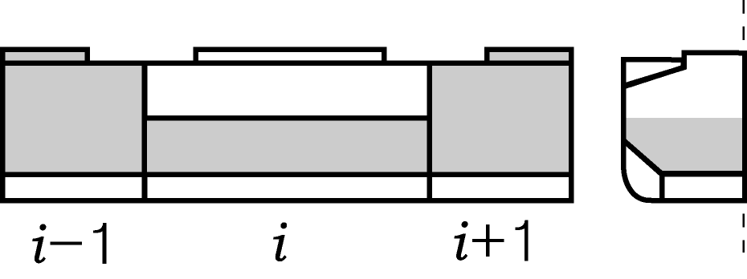 | Cargo Mass | $i-1$ | $M _{Full}$ |
    | 2 | 슬랙 적하 1 | $T$ |   | Cargo Mass | $i$ | $0.5M _{H}$ |
    | 2 | 슬랙 적하 1 | $T$ |   | Cargo Mass | $i+1$ | $M _{Full}$ |
    | 2 | 슬랙 적하 1 | $T$ |   | DB Mass | $i-1$ | empty |
    | 2 | 슬랙 적하 1 | $T$ |   | DB Mass | $i$ | empty |
    | 2 | 슬랙 적하 1 | $T$ |   | DB Mass | $i+1$ | empty |
    | 3 | 슬랙 적하 2 | $T$ |  | Cargo Mass | $i-1$ | $0.5M _{H}$ |
    | 3 | 슬랙 적하 2 | $T$ |   | Cargo Mass | $i$ | $M _{Full}$ |
    | 3 | 슬랙 적하 2 | $T$ |   | Cargo Mass | $i+1$ | $0.5M _{H}$ |
    | 3 | 슬랙 적하 2 | $T$ |   | DB Mass | $i-1$ | empty |
    | 3 | 슬랙 적하 2 | $T$ |   | DB Mass | $i$ | empty |
    | 3 | 슬랙 적하 2 | $T$ |   | DB Mass | $i+1$ | empty |
    | 4 | 통상 평형수적재 | $T _{BDmax}$ |  | Cargo Mass | $i-1$ | empty |
    | 4 | 통상 평형수적재 | $T _{BDmax}$ |   | Cargo Mass | $i$ | empty |
    | 4 | 통상 평형수적재 | $T _{BDmax}$ |   | Cargo Mass | $i+1$ | empty |
    | 4 | 통상 평형수적재 | $T _{BDmax}$ |   | DB Mass | $i-1$ | $M _{DBBW}$ |
    | 4 | 통상 평형수적재 | $T _{BDmax}$ |   | DB Mass | $i$ | empty |
    | 4 | 통상 평형수적재 | $T _{BDmax}$ |   | DB Mass | $i+1$ | $M _{DBBW}$ |
    | 5 | 다항 적하 1 | $0.67T$ |  | Cargo Mass | $i-1$ | empty |
    | 5 | 다항 적하 1 | $0.67T$ |   | Cargo Mass | $i$ | $M _{Full}$ |
    | 5 | 다항 적하 1 | $0.67T$ |   | Cargo Mass | $i+1$ | empty |
    | 5 | 다항 적하 1 | $0.67T$ |   | DB Mass | $i-1$ | empty |
    | 5 | 다항 적하 1 | $0.67T$ |   | DB Mass | $i$ | $M _{DBFO}$ |
    | 5 | 다항 적하 1 | $0.67T$ |   | DB Mass | $i+1$ | empty |
    | 6 | 다항 적하 2 | $0.83 T$ | 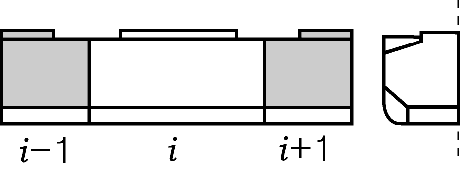 | Cargo Mass | $i-1$ | $M _{Full}$ |
    | 6 | 다항 적하 2 | $0.83 T$ |   | Cargo Mass | $i$ | empty |
    | 6 | 다항 적하 2 | $0.83 T$ |   | Cargo Mass | $i+1$ | $M _{Full}$ |
    | 6 | 다항 적하 2 | $0.83 T$ |   | DB Mass | $i-1$ | empty |
    | 6 | 다항 적하 2 | $0.83 T$ |   | DB Mass | $i$ | empty |
    | 6 | 다항 적하 2 | $0.83 T$ |   | DB Mass | $i+1$ | empty |
    | 7 | 다항 블록 적하 3a | $0.67T$ |  | Cargo Mass | $i-1$ | empty |
    | 7 | 다항 블록 적하 3a | $0.67T$ |   | Cargo Mass | $i$ | $M _{Full}$ |
    | 7 | 다항 블록 적하 3a | $0.67T$ |   | Cargo Mass | $i+1$ | $M _{Full}$ |
    | 7 | 다항 블록 적하 3a | $0.67T$ |   | DB Mass | $i-1$ | empty |
    | 7 | 다항 블록 적하 3a | $0.67T$ |   | DB Mass | $i$ | $M _{DBFO}$ |
    | 7 | 다항 블록 적하 3a | $0.67T$ |   | DB Mass | $i+1$ | $M _{DBFO}$ |
    | 8 | 다항 블록 적하 3b | $0.67T$ |  | Cargo Mass | $i-1$ | $M _{Full}$ |
    | 8 | 다항 블록 적하 3b | $0.67T$ |   | Cargo Mass | $i$ | $M _{Full}$ |
    | 8 | 다항 블록 적하 3b | $0.67T$ |   | Cargo Mass | $i+1$ | empty |
    | 8 | 다항 블록 적하 3b | $0.67T$ |   | DB Mass | $i-1$ | $M _{DBFO}$ |
    | 8 | 다항 블록 적하 3b | $0.67T$ |   | DB Mass | $i$ | $M _{DBFO}$ |
    | 8 | 다항 블록 적하 3b | $0.67T$ |   | DB Mass | $i+1$ | empty |

    | 번호 | 하중상태 | 흘수 | 적하경향 | 질량 |   |   |
    | --- | --- | --- | --- | --- | --- | --- |
    | 9 | 다항 블록 적하 3c | $0.67T$ |  | Cargo Mass | $i-1$ | empty |
    | 9 | 다항 블록 적하 3c | $0.67T$ |   | Cargo Mass | $i$ | $M _{BW}$ |
    | 9 | 다항 블록 적하 3c | $0.67T$ |   | Cargo Mass | $i+1$ | $M _{Full}$ |
    | 9 | 다항 블록 적하 3c | $0.67T$ |   | DB Mass | $i-1$ | empty |
    | 9 | 다항 블록 적하 3c | $0.67T$ |   | DB Mass | $i$ | $M _{DBFO}$ |
    | 9 | 다항 블록 적하 3c | $0.67T$ |   | DB Mass | $i+1$ | $M _{DBFO}$ |
    | 10 | 다항 블록 적하 3d | $0.67T$ |  | Cargo Mass | $i-1$ | $M _{Full}$ |
    | 10 | 다항 블록 적하 3d | $0.67T$ |   | Cargo Mass | $i$ | $M _{BW}$ |
    | 10 | 다항 블록 적하 3d | $0.67T$ |   | Cargo Mass | $i+1$ | empty |
    | 10 | 다항 블록 적하 3d | $0.67T$ |   | DB Mass | $i-1$ | $M _{DBFO}$ |
    | 10 | 다항 블록 적하 3d | $0.67T$ |   | DB Mass | $i$ | $M _{DBFO}$ |
    | 10 | 다항 블록 적하 3d | $0.67T$ |   | DB Mass | $i+1$ | empty |
    | 11 | 다항 블록 적하 4a | $0.75T$ | 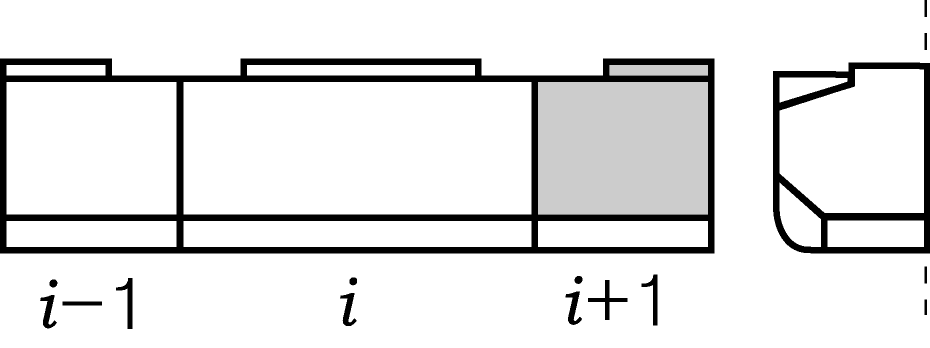 | Cargo Mass | $i-1$ | empty |
    | 11 | 다항 블록 적하 4a | $0.75T$ |   | Cargo Mass | $i$ | empty |
    | 11 | 다항 블록 적하 4a | $0.75T$ |   | Cargo Mass | $i+1$ | $M _{Full}$ |
    | 11 | 다항 블록 적하 4a | $0.75T$ |   | DB Mass | $i-1$ | empty |
    | 11 | 다항 블록 적하 4a | $0.75T$ |   | DB Mass | $i$ | empty |
    | 11 | 다항 블록 적하 4a | $0.75T$ |   | DB Mass | $i+1$ | empty |
    | 12 | 다항 블록 적하 4b | $0.75T$ |  | Cargo Mass | $i-1$ | $M _{Full}$ |
    | 12 | 다항 블록 적하 4b | $0.75T$ |   | Cargo Mass | $i$ | empty |
    | 12 | 다항 블록 적하 4b | $0.75T$ |   | Cargo Mass | $i+1$ | empty |
    | 12 | 다항 블록 적하 4b | $0.75T$ |   | DB Mass | $i-1$ | empty |
    | 12 | 다항 블록 적하 4b | $0.75T$ |   | DB Mass | $i$ | empty |
    | 12 | 다항 블록 적하 4b | $0.75T$ |   | DB Mass | $i+1$ | empty |
    | 13 | 격창 적하 1 | $T$ | 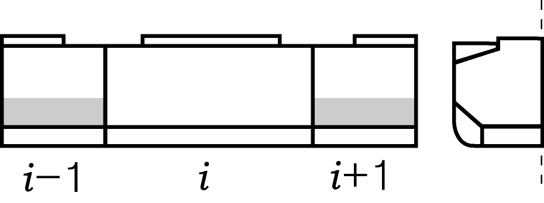 | Cargo Mass | $i-1$ | $M _{HD}$ |
    | 13 | 격창 적하 1 | $T$ |   | Cargo Mass | $i$ | empty |
    | 13 | 격창 적하 1 | $T$ |   | Cargo Mass | $i+1$ | $M _{HD}$ |
    | 13 | 격창 적하 1 | $T$ |   | DB Mass | $i-1$ | empty |
    | 13 | 격창 적하 1 | $T$ |   | DB Mass | $i$ | empty |
    | 13 | 격창 적하 1 | $T$ |   | DB Mass | $i+1$ | empty |
    | 14 | 격창 적하 2 | $T$ | 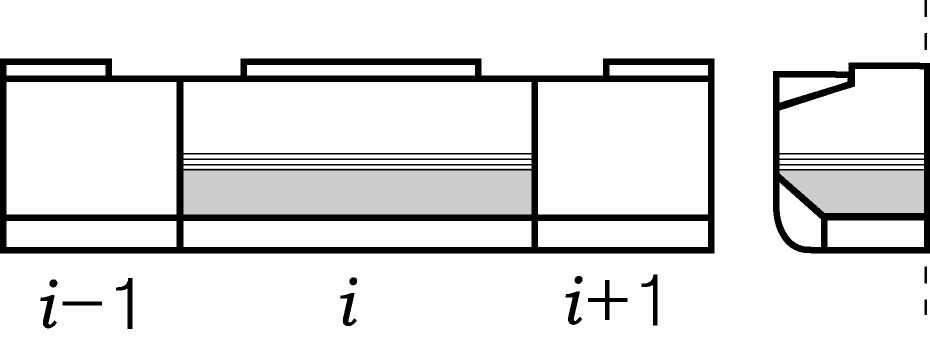 | Cargo Mass | $i-1$ | empty |
    | 14 | 격창 적하 2 | $T$ |   | Cargo Mass | $i$ | $M _{HD} +0.1M _{H}$ |
    | 14 | 격창 적하 2 | $T$ |   | Cargo Mass | $i+1$ | empty |
    | 14 | 격창 적하 2 | $T$ |   | DB Mass | $i-1$ | empty |
    | 14 | 격창 적하 2 | $T$ |   | DB Mass | $i$ | empty |
    | 14 | 격창 적하 2 | $T$ |   | DB Mass | $i+1$ | empty |
    | 15 | 격창 블록 적하 3a (설계 적하 상태에 따름) | $T$ |  | Cargo Mass | $i-1$ | empty |
    | 15 | 격창 블록 적하 3a (설계 적하 상태에 따름) | $T$ |   | Cargo Mass | $i$ | $M _{Blk} +0.1M _{H}$ |
    | 15 | 격창 블록 적하 3a (설계 적하 상태에 따름) | $T$ |   | Cargo Mass | $i+1$ | $M _{Blk} +0.1M _{H}$ |
    | 15 | 격창 블록 적하 3a (설계 적하 상태에 따름) | $T$ |   | DB Mass | $i-1$ | empty |
    | 15 | 격창 블록 적하 3a (설계 적하 상태에 따름) | $T$ |   | DB Mass | $i$ | empty |
    | 15 | 격창 블록 적하 3a (설계 적하 상태에 따름) | $T$ |   | DB Mass | $i+1$ | empty |
    | 16 | 격창 블록 적하 3b (설계 적하 상태에 따름) | $T$ | 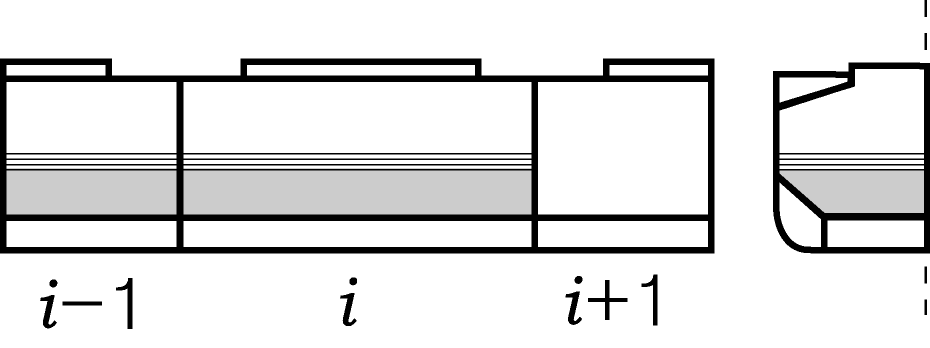 | Cargo Mass | $i-1$ | $M _{Blk} +0.1M _{H}$ |
    | 16 | 격창 블록 적하 3b (설계 적하 상태에 따름) | $T$ |   | Cargo Mass | $i$ | $M _{Blk} +0.1M _{H}$ |
    | 16 | 격창 블록 적하 3b (설계 적하 상태에 따름) | $T$ |   | Cargo Mass | $i+1$ | empty |
    | 16 | 격창 블록 적하 3b (설계 적하 상태에 따름) | $T$ |   | DB Mass | $i-1$ | empty |
    | 16 | 격창 블록 적하 3b (설계 적하 상태에 따름) | $T$ |   | DB Mass | $i$ | empty |
    | 16 | 격창 블록 적하 3b (설계 적하 상태에 따름) | $T$ |   | DB Mass | $i+1$ | empty |

    | 번호 | 하중상태 | 흘수 | 적하경향 | 질량 |   |   |
    | --- | --- | --- | --- | --- | --- | --- |
    | 17 | 황천 평형수적재 | $T _{BDmin}$ | 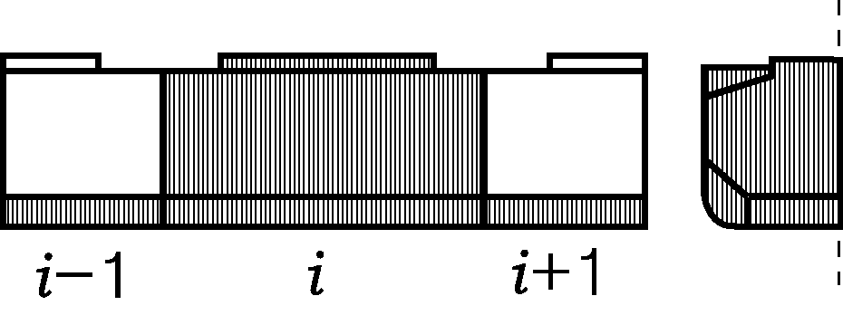 | Cargo Mass | $i-1$ | empty |
    | 17 | 황천 평형수적재 | $T _{BDmin}$ |   | Cargo Mass | $i$ | $M _{BW}$ |
    | 17 | 황천 평형수적재 | $T _{BDmin}$ |   | Cargo Mass | $i-1$ | empty |
    | 17 | 황천 평형수적재 | $T _{BDmin}$ |   | DB Mass | $i-1$ | $M _{DBBW}$ |
    | 17 | 황천 평형수적재 | $T _{BDmin}$ |   | DB Mass | $i$ | $M _{DBBW}$ |
    | 17 | 황천 평형수적재 | $T _{BDmin}$ |   | DB Mass | $i+1$ | $M _{DBBW}$ |
    | 18 | 항내 1a | $0.67T$ |  | Cargo Mass | $i-1$ | empty |
    | 18 | 항내 1a | $0.67T$ |   | Cargo Mass | $i$ | $M _{Full}$ |
    | 18 | 항내 1a | $0.67T$ |   | Cargo Mass | $i-1$ | empty |
    | 18 | 항내 1a | $0.67T$ |   | DB Mass | $i-1$ | empty |
    | 18 | 항내 1a | $0.67T$ |   | DB Mass | $i$ | empty |
    | 18 | 항내 1a | $0.67T$ |   | DB Mass | $i+1$ | empty |
    | 19 | 항내 1b | $0.67T$ | 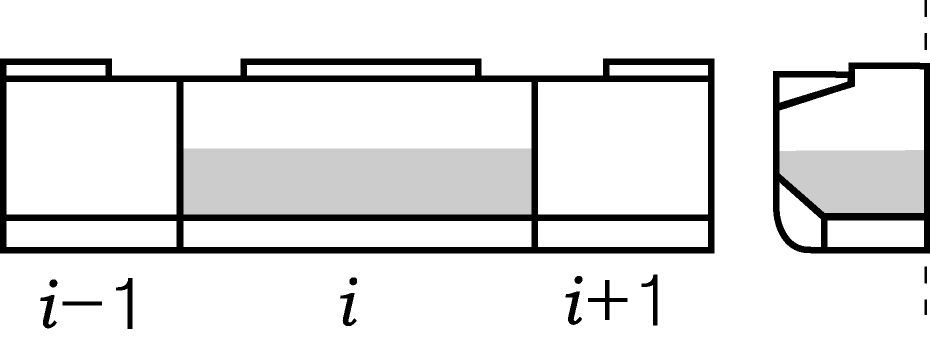 | Cargo Mass | $i-1$ | empty |
    | 19 | 항내 1b | $0.67T$ |   | Cargo Mass | $i$ | $M _{HD}$ |
    | 19 | 항내 1b | $0.67T$ |   | Cargo Mass | $i+1$ | empty |
    | 19 | 항내 1b | $0.67T$ |   | DB Mass | $i-1$ | empty |
    | 19 | 항내 1b | $0.67T$ |   | DB Mass | $i$ | empty |
    | 19 | 항내 1b | $0.67T$ |   | DB Mass | $i+1$ | empty |
    | 20 | 항내 블록 적하 2a | $0.67T$ |  | Cargo Mass | $i-1$ | empty |
    | 20 | 항내 블록 적하 2a | $0.67T$ |   | Cargo Mass | $i$ | $M _{Full}$ |
    | 20 | 항내 블록 적하 2a | $0.67T$ |   | Cargo Mass | $i+1$ | $M _{Full}$ |
    | 20 | 항내 블록 적하 2a | $0.67T$ |   | DB Mass | $i-1$ | empty |
    | 20 | 항내 블록 적하 2a | $0.67T$ |   | DB Mass | $i$ | $M _{DBFO}$ |
    | 20 | 항내 블록 적하 2a | $0.67T$ |   | DB Mass | $i+1$ | $M _{DBFO}$ |
    | 21 | 항내 블록 적하 2b | $0.67T$ | 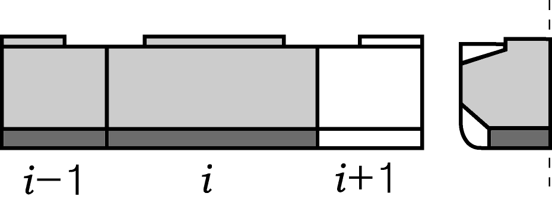 | Cargo Mass | $i-1$ | $M _{Full}$ |
    | 21 | 항내 블록 적하 2b | $0.67T$ |   | Cargo Mass | $i$ | $M _{Full}$ |
    | 21 | 항내 블록 적하 2b | $0.67T$ |   | Cargo Mass | $i+1$ | empty |
    | 21 | 항내 블록 적하 2b | $0.67T$ |   | DB Mass | $i-1$ | $M _{DBFO}$ |
    | 21 | 항내 블록 적하 2b | $0.67T$ |   | DB Mass | $i$ | $M _{DBFO}$ |
    | 21 | 항내 블록 적하 2b | $0.67T$ |   | DB Mass | $i+1$ | empty |
    | $T$ : 강도계산용 흘수, $T _{BDmin}$: 황천 평형수적재 흘수, $T _{BDmax}$: 최대 평형수적재 흘수 $M _{Full}$ : 창구 코밍 정부까지 채운 가상 밀도(균일질량/화물창용적, 최소 1.0 ton/m^3)를 갖는 화물에 대한 화물창내의 화물질량(ton). 어떠한 경우에도 $M _{H}$보다 작아서는 아니 된다. $M _{H}$ : 최대 흘수에서 균일적재상태에 해당하는 화물창 내의 실제 화물질량(ton) $M _{HD}$ : 최대 흘수에서 지정된 화물창이 공창인 설계하중조건에 따라 운송할 수 있는 최대 허용 화물 질량(ton) $M _{Blk}$ : 인접한 두개의 화물창에 높은 밀도의 화물을 적재하는 조건이 있는 경우 그에 해당하는 화물창 내의 화물질량 (ton) $M _{BW}$ : 평형수 창 내의 물의 질량 (ton) $M _{DBFO}$ : 이중저 평형수 탱크 내의 연료의 질량 (ton) $M _{DBBW}$ : 이중저 연료유 탱크 내의 물의 질량 (ton) $i$ : 조사하는 화물창의 번호 $i-1, i+1$ : 조사하는 화물창의 뒤, 앞의 화물창의 번호 |   |   |   |   |   |   |
    - **(a)** 정수압
    - **(b)** 파랑하중
- **(5)** 허용응력
  - **(가)** 요소의 종류별 허용응력
    각 부재의 허용응력 $\sigma$ 와 등가응력 $\sigma _{e}$ 는 **표 17**에 따른다. 다만, 상세분할해석을 한 경우 횡부재의 허용응력은 **표 18**에 따른다.

    **표 17 허용응력** (N/mm^2)

    | 해석 대상 부재 |   | $\sigma _{l}$ | $\sigma _{t}$*,* $\sigma _{v}$ | $\sigma _{e}$ |
    | --- | --- | --- | --- | --- |
    | 종강도부재 | 선저외판, 내저판, 빌지호퍼탱크 또는 톱사이드탱크의 경사판 | $110/K$ | $145/K$ | $145/K$ |
    | 종강도부재 | 거더 |   | ─ | $175/K$ |
    | 횡강도부재 | 스툴의 경사판, 횡격벽판 |   | $145/K$ | $175/K$ |
    | 횡강도부재 | 늑판 |   | ─ | $175/K$ |
    | (비고) 1. 등가응력 $\sigma _{e}$ 는 다음에 따른다. $\sigma _{e} = \sqrt {\sigma _{l} ^{2} - \sigma _{l} \sigma _{t} + \sigma _{t} ^{2} +3 \tau ^{2}}$ (종강도 부재) $\sigma _{e} = \sqrt {\sigma _{v} ^{2} - \sigma _{v} \sigma _{t} + \sigma _{t} ^{2} +3 \tau ^{2}}$ (횡강도 부재) $\sigma _{l}$ : 선박 길이방향의 직응력 $\sigma _{t}$ : 선박 너비방향의 직응력 $\sigma _{v}$ : 선박 깊이방향의 직응력 $\tau$ : 전단응력 2. 늑판 또는 거더에 개구가 있을 경우에는 응력을 평가할 때 이를 적절히 고려하여야 한다. 3. 응력판별 위치는 요소의 중심으로 한다. 4. $K$ : **표 7**에 규정된 재료계수 |   |   |   |   |

    **표 18 허용응력** (N/mm^2) (상세분할 해석을 한 경우)

    | 해석 대상 부재 |   | $\sigma _{a}$ | $\tau$ | $\sigma _{e}$ |
    | --- | --- | --- | --- | --- |
    | 횡늑골환 | 평행부 | ─ | ─ | $175/K$ |
    | 횡늑골환 | 모서리부 | $195/K$ | ─ | $195/K$ |
    | 선측늑골 | 평행부의 중앙부 | $175/K$ | ─ | $175/K$ |
    | 선측늑골 | 평행부의 상하단부 | $215/K$ | $70/K$ | $195/K$ |
    | (비고) 1. $\sigma _{a}$ : 면재의 면내 직응력 2. 등가 응력 $\sigma _{e}$ 는 다음에 따른다. $\sigma _{e} = \sqrt {\sigma _{x} ^{2} - \sigma _{x} \sigma _{y} + \sigma _{y} ^{2} +3 \tau ^{2}}$ (요소좌표계는 $x-y$ 직교 좌표계로 한다) $\sigma _{x}$ : 요소좌표계 $x$ 방향의 응력 $\sigma _{y}$ : 요소좌표계 $y$ 방향의 응력 $\tau$ : 요소좌표계 $x­y$ 평면내의 전단응력 3. 응력판별 위치는 요소의 중심으로 한다. 4. $K$ : **표 7**에 규정된 재료계수 |   |   |   |   |
  - **(나)** 선체횡단면계수에 여유가 있을 때의 허용응력
    선저외판 및 내저판의 선체 길이방향의 허용응력(N/mm^2) 은 다음 식에 의한다.
    $\frac{145}{K} -35f _{B}$
  - **(다)** 항내에서의 하역/적하 조건에 대한 허용응력
    항내에서의 하역/적하 조건에 대한 허용응력은 **표 17** 및 **표 18**에서 주어진 값의 110 %를 적용할 수 있다.
- **(6)** 좌굴 강도 계산
  구조해석 결과에 대한 좌굴강도계산은 **IV. 좌굴강도계산**에 따라야 하며, 좌굴 허용기준은 **IV. 좌굴강도계산의 1**항 (5)호에서 정적하중 기준을 적용한다. *(2020)*
- **(7)** 피로강도계산
