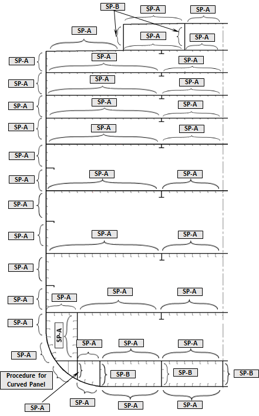
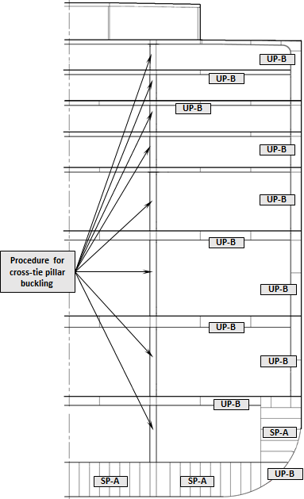
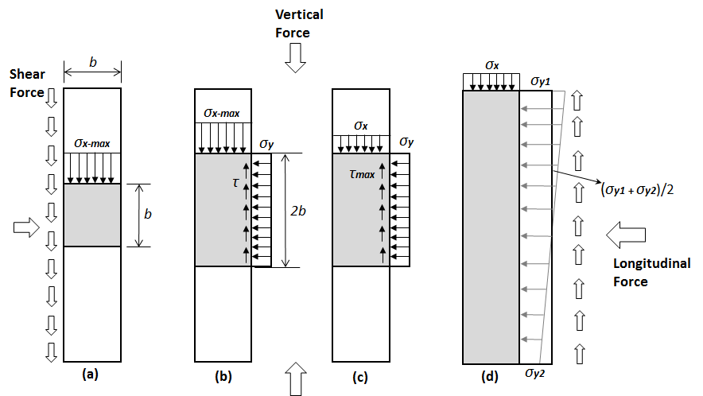

# 제3편 선체구조

> 선급 및 강선규칙/적용지침 / RA-03-K / 2025 / KO / Guidance

## 부록 3-3「선체구조의 피로강도평가 지침」을 적용할 수 있다.

### IV. 좌굴강도계산 (2020)

#### 1. 일반

- **(1)** 가정
  이 지침은 국부 지지부재, 1차 지지 부재 및 필러, 파형격벽, 브래킷과 같은 기타 구조의 좌굴강도에 대한 강도 기준을 포함한다. 각 구조부재의 경우, 좌굴강도 특성상 가장 불리한 또는 위험한 좌굴 모드로 취하여야 한다. 별도로 규정하지 아니한 경우, 구조부재의 치수 요건은 제공된 총 두께로부터 부식여유치 $t_{c}$를 감한 순 치수를 기반으로 한다. 압축 및 전단응력은 양(+)으로, 인장응력은 음(-)으로 한다.
- **(2)** 적용
  좌굴 검토는 다음에 따라 수행하여야 한다
  • 판, 보강된 패널 및 기타 구조의 유한요소해석의 좌굴 요건에 대하여는 **2**항
  • 유한요소 좌굴 요건의 좌굴 능력에 대하여는 **3**항을 따른다.
  보강재의 좌굴 검토는 좌굴 패널의 긴 변를 따라 설치된 보강재에 적용하여야 한다.
- **(3)** 정의
  “좌굴”은 일반적으로 면내압축 및/또는 전단 및 면외하중을 받고 있는 구조의 강도를 기술하는 포괄적인 용어이다. 좌굴강도 또는 능력은 하중 상태, 세장비 및 구조의 종류에 따라 하중의 내부 재분배를 고려할 수 있어야 한다.
  “좌굴능력”은 최종능력의 하한 추정 또는 큰 영구변형 없이 패널이 분담할 수 있는 최대하중을 제공한다. 좌굴능력평가에서는 판에 대한 양의 탄성 후-좌굴 효과(positive elastic post-buckling effect)를 사용하며 판과 보강재 사이와 같이 구조부재들 간의 하중 재분배를 설명한다. 세장한 구조의 경우, 이 방법을 이용하여 계산된 능력 값은 이상화된 탄성좌굴응력(최소 고유치)보다 일반적으로 더 크다. 세장하고 보강된 패널에서의 구조부재의 탄성좌굴을 허용하는 것은 높은 좌굴 사용 범위(higher buckling utilization levels)에서 큰 탄성변형과 면내강성의 감소가 발생함을 의미한다.
- **(4)** 평가방법
  좌굴평가는 서로 다른 경계조건 종류를 고려하여 2가지 방법 중 하나에 따라 수행되어야 한다.
  • 방법 A : 패널의 모든 단부는 주위 구조/인접 판 때문에 직선 형태(그러나 면내 방향으로는 자유롭게 이동)를 유지하여야 한다.
  • 방법 B : 패널의 단부는 단부에서의 낮은 면내강성 및/또는 주위 구조/인접 판이 없기 때문에 직선 형태를 유지하지 않아도 된다.
- **(5)** 좌굴 허용기준
  구조 부재의 좌굴강도는 다음 기준을 만족하여야 한다.
  $\eta _{act} \leq \eta _{all}$
  여기서,
  $\eta_{act}$ : **3**항에 따른 작용 응력에 기초한 좌굴사용계수.
  $\eta_{all}$ : **표 50**에 따른 허용 좌굴사용계수.

  | 구조부재 | 허용 좌굴사용계수 $\eta_{all}$ |
  | --- | --- |
  | 판 및 보강재 보강된 및 보강되지 않은 패널 단일 선측 산적화물선의 수직 보강된 선측 외판 개구에 주위의 웨브 판 | 정적+동적하중인 경우 1.00 정적하중만 작용하는 경우 0.80 |
  | 스트럿, 필러 및 크로스타이 | 정적+동적하중인 경우 0.75 정적하중인 경우 0.65 |
  | 액체 하중에 의한 면외 압력을 받는 하부스툴이 있는 수직 파형격벽 및 수평 파형격벽의 파형.(쉘 요소만을 고려) 하부스툴이 없는 파형 격벽의 하부 단부에 인접한 지지 구조. | 정적+동적하중인 경우 0.90 정적하중만 작용하는 경우 0.72 |
  | 액체 하중에 의한 면외 압력을 받는 하부스툴이 없는 수직 파형격벽의 파형.(쉘 요소만을 고려) | 정적+동적하중인 경우 0.81 정적하중만 작용하는 경우 0.65 |
  | 비고 1 : 횡 방향 파형격벽의 지지구조는 격벽 전후의 1/2 특설늑골(web frame) 간격 내 및 파형 깊이와 동등한 수직 범위 내 종 방향의 부재를 말한다. 비고 2 : 종 방향 파형격벽의 지지구조는 격벽의 양 측면으로부터 3개의 종보강재 간격 내 및 파형 깊이와 동등한 수직 범위 내 횡방향의 부재를 말한다. |   |

#### 2. 직접강도해석에 대한 좌굴요건

- **(1)** 일반
  압축응력, 전단응력 및 면외압력을 받는 직접강도해석의 좌굴 평가에 대해 적용한다. 유한요소 해석에서의 모든 구조요소는 개별적으로 평가되어야 한다. 좌굴검토는 다음의 구조요소에 대하여 수행하여야 한다.
  • 보강 및 보강되지 않은 패널(곡면 패널 포함)
  • 개구 주위의 웨브 판
  • 파형 격벽
  • 단일선측 산적화물선의 수직 보강된 선측외판
  • 스트럿, 필러 및 크로스타이.
- **(2)** 판 패널의 모델링 및 평가방법
  선체 구조의 패널은 보강 패널(SP) 또는 보강되지 않은 패널(UP)로 모델링되어야 한다. 1.(4)에 따른 방법 A와 방법 B는 **표 51**부터 **표 54** 및 **그림 61**부터 **그림 65**에 따라 사용되어야 한다. 패널을 따라 판 두께가 일정하지 않을 경우, 좌굴평가를 위해 사용되는 패널은 다음과 같이 가중 평균두께로 모델링되어야 한다. 패널 항복응력 $R _{eH _{-} P}$은 패널 내 요소의 규정 항복응력의 최소값을 취한다.
  $t _{avr} = \frac{\sum _{1} ^{n} A _{i} t _{i}}{\sum _{1} ^{n} A _{i}}$
  여기서,
  $A _{i}$ : $i$번째 판 요소의 면적
  $t _{i}$ : $i$번째 판 요소의 순 두께.
  $n$ : 좌굴 패널을 결정하는 유한 요소의 수

  | 구조 요소 | 평가 방법 | 통상적인 정의 |
  | --- | --- | --- |
  | 종방향으로 보강된 판: 외판, 갑판, 내측 종격벽판, 호퍼탱크 경사판, 종격벽판 | SP-A | 길이: 특설늑골 사이 폭: 1차 지지부재 사이 |
  | 종격벽 또는 호퍼탱크 경사판과 연결되는 이중저 종방향 거더 | SP-A | 길이: 특설늑골 사이 폭: 웨브 전체 깊이 |
  | 종격벽 또는 호퍼탱크 경사판과 연결되지 않는 이중저 종방향 거더의 웨브 | SP-B | 길이: 특설늑골 사이 폭: 웨브 전체 깊이 |
  | 호퍼탱크 경사판과 연결된 이중선측 구역 내 수평 거더의 웨브 | SP-A | 길이: 특설늑골 사이 폭: 웨브 전체 깊이 |
  | 호퍼탱크 경사판과 연결되지 않은 이중선측 구역 내 수평 거더의 웨브 | SP-B | 길이: 특설늑골 사이 폭: 웨브 전체 깊이 |
  | 단일 구조의 종거더 웨브(규칙적인 요소분할 구역) | SP-B | 국부 보강재/면재/1차 지지부재 사이의 판 |
  | 단일 구조의 종거더 웨브 (불규칙적인 요소분할 구역) | UP-B | 국부 보강재/면재/1차 지지부재 사이의 판 |

  | 구조 요소 | 평가 방법 | 통상적인 정의 |
  | --- | --- | --- |
  | 브래킷을 포함하는 횡 방향 갑판늑골의 웨브 (규칙적인 요소분할 구역) | SP-B | 국부 보강재/면재/1차 지지부재 사이의 판 |
  | 브래킷을 포함하는 횡 방향 갑판늑골의 웨브 (불규칙적인 요소분할 구역) | UP-B | 국부 보강재/면재/1차 지지부재 사이의 판 |
  | 이중선측 구역 내의 수직 웨브 | SP-B | 길이: 웨브 전체 깊이 폭: 1차 지지부재 사이 |
  | 불규칙적으로 보강된 패널 (즉 호퍼탱크 및 빌지부 부근의 웨브 패널) | UP-B | 국부 보강재/면재/1차 지지부재 사이의 판 |
  | 이중저 늑판 | SP-A | 길이: 웨브 전체 깊이 폭: 1차 지지부재 사이 |
  | 브래킷을 포함하는 수직 특설늑골 (규칙적인 요소분할 구역) | SP-B | 수직 웨브 보강재/면재/1차 지지부재 사이의 판 |
  | 브래킷을 포함하는 수직 특설늑골 (불규칙적인 요소분할 구역) | UP-B | 수직 웨브 보강재/면재/1차 지지부재 사이의 판 |
  | 크로스타이 웨브 판 (규칙적인 요소분할 구역) | SP-B | 수직 웨브 보강재/면재/1차 지지부재 사이의 판 |
  | 크로스타이 웨브 판 (불규칙적인 요소분할 구역) | UP-B | 수직 웨브 보강재/면재/1차 지지부재 사이의 판 |

  | 구조 요소 | 평가 방법 | 통상적인 정의 |
  | --- | --- | --- |
  | 칼링과 같은 일반 보강재에 수직한 이차 좌굴보강재가 포함된 규칙적으로 보강된 격벽 패널 | SP-A | 길이: 1차 지지부재 사이 폭: 1차 지지부재 사이 |
  | 불규칙적으로 보강된 격벽 패널 (즉 호퍼탱크 및 빌지부에 인접한 웨브 패널) | UP-A | 국부 보강재/면재 사이의 판 |
  | 브래킷을 포함하는 격벽 스트링거의 웨브 판 (규칙적인 요소분할 구역) | SP-B | 웨브 보강재/면재 사이의 판 |
  | 브래킷을 포함하는 격벽 스트링거의 웨브 판 (불규칙적인 요소분할 구역) | UP-B | 웨브 보강재/면재 사이의 판 |

  | 구조 요소 | 평가 방법 | 통상적인 정의 |
  | --- | --- | --- |
  | 보강재를 포함하는 상부/하부 스툴 | SP-A | 길이: 내부 웨브 다이아프램 사이 폭: 스툴 측판의 길이 |
  | 스툴 내부 다이아프램의 웨브 (규칙적인 요소분할 구역) | SP-B | 국부 보강재/면재/1차 지지부재 사이의 판 |
  | 스툴 내부 다이아프램의 웨브 (불규칙적인 요소분할 구역) | UP-B | 국부 보강재/면재/1차 지지부재 사이의 판 |
  | 크로스 갑판 | SP-A | 국부 보강재/1차 지지부재 사이의 판 |

  
  **그림 61 액화가스운반선(LPGC Type A)의 종방향 판**
  
  **그림 62 액화가스운반선(LPGC Type A)의 횡방향 특설늑골**
  
  **그림 63 액화가스운반선(LPGC Type A)의 횡겨벽**

  |  |  |
  | --- | --- |
  | **그림 64 자동차운반선(PCTC)의 종방향 판** | **그림 65 자동차운반선의 횡방향 특설늑골** |
- **(3)** 보강패널
  전체 좌굴 거동을 나타내기 위하여, 부착판을 가진 각 보강재는 보강패널로 모델링되어야 한다. 만일 보강패널 내에서 보강재 특성 및 보강재 간격이 변한다면, 계산은 패널의 모든 구성에 대하여 개별적으로(즉 보강재 사이의 각각의 보강재 및 판에 대하여) 수행되어야 한다. 고려하는 위치에서의 판 두께, 보강재 특성 및 보강재 간격은 전체 패널에 대하여 가정하여야 한다.
- **(4)** 보강되지 않은 패널
  - **(가)** 불규칙 패널
    특설늑골(web frame), 스트링거 및 브래킷의 경우, 패널의 형상(즉 웨브 보강재/면재에 의하여 구획되는 판)은 직사각형 모양을 갖지 않을 수도 있다. 이러한 경우, 불규칙한 형상에 대하여는 (나) 및 삼각형 형상에 대하여는 (다)에 따라 등가의 직사각형 패널을 정의하여야 하고 좌굴평가를 만족하여야 한다.
  - **(나)** 불규칙한 형상인 보강되지 않은 패널의 모델링은 **규칙 13편 1부 8장 4절 2.3.2**에 따른다.
  - **(다)** 삼각형 형상을 가진 보강되지 않은 패널의 모델링은 **규칙 13편 1부 8장 4절 2.3.3**에 따른다.
- **(5)** 참조응력
  응력분포는 직접강도해석으로부터 구하여야 하며, 좌굴 모델에 적용하여야 한다. 참조응력은 **그림 66**을 반영하여 **규칙 13편 1부 8장 부록 1**에 따라 구하여야 한다.
  
  **그림 66 좌굴 패널 예**
- **(6)** 면외압력
  직접 강도해석에 적용된 면외압력은 좌굴평가에도 적용하여야 한다. 면외압력이 많은 유한 판 요소에 의해 정의된 좌굴 패널에서 균일하지 않는 경우, 평균 면외압력($\mathrm{N}/mm ^{2}$)은 다음 식에 따른다.
  여기서,
  $A _{i}$ : $i$번째 판 요소의 면적
  $P _{i}$ : $i$번째 판 요소의 면외압력($\mathrm{N}/mm ^{2}$)
  $n$ : 좌굴 패널을 결정하는 유한 요소의 수
- **(7)** 패널의 좌굴 기준
  패널의 좌굴기준은 **규칙 13편 1부 8장 4절 2.**에 따른다.
- **(8)** 파형격벽
  파형격벽의 좌굴기준은 **규칙 13편 1부 8장 4절 3.**에 따른다.
- **(9)** 수직으로 보강된 선측외판
  수직으로 보강된 선측외판의 좌굴기준은 **그림 67**을 참조하여 **규칙 13편 1부 8장 4절 4.**에 따른다.
- **(10)** 스트럿, 필러 및 크로스타이
  스트럿, 필러 및 크로스타이의 좌굴강도 기준은 **규칙 13편 1부 8장 4절 5.**에 따른다.
  
  **그림 67 수직으로 보강된 선측외판**

#### 3. 좌굴능력

- **(1)** 평가
  패널, 보강재, 1차 지지부재, 스트럿, 필러, 크로스타이 및 파형격벽의 좌굴능력 결정에 대한 방법은 **규칙 13편 1부 8장 5절**에 따른다. 다만 선급이 인정하는 경우, **규칙 13편 1부 8장 5**절 또는 **규칙 11편 6장 3절**에서 보강재를 제외한 판의 좌굴능력만으로 좌굴강도를 평가할 수 있다.
- **(2)** 순치수 적용
  모든 좌굴능력 평가에서는 **표 55**와 같이 부식 여유치를 제외한 순 치수를 기초로 하여야 한다. 다만, 선종별 부식자료를 기반으로 결정된 부식추가가 별도로 있을 경우 이를 고려할 수 있다. 

  | 구획종류 | tc1 또는 tc2 |
  | --- | --- |
  | 평형수 탱크, 빌지탱크, 드레인 저장탱크, 체인로커(1) | 1.0 |
  | 대기에 노출 | 1.0 |
  | 해수에 노출 | 1.0 |
  | 연료유 탱크 및 윤활유 탱크 | 0.5 |
  | 청수탱크 | 0.5 |
  | 보이드 구역 및 건 구역(2)(3) | 0.0 |
  | 화물격납설비로 보호되는 구역 | 0.0 |
  | 거주구 구역 | 0.0 |
  | 기타 구역 | 0.5 |
  | (1) 체인로커 바닥의 상면으로부터 상방 3 m 이내의 판 표면에는 1.0 mm를 더한다. (2) 외판에 대한 부식 추가를 고려할 때, 파이프 터널은 평형수 탱크로 고려한다. (3) 보이드 구역 및 건 구역 바닥의 부식 추가는 0.5 mm로 한다. |   |
