# 제3편 선체구조

> 선급 및 강선규칙/적용지침 / RA-03-K / 2025 / KO / Guidance

## 부록 3-3 선체구조의 피로강도평가 지침

### 1. 일반사항 (2020)

#### (1) 이 부록은 선체구조의 피로강도를 평가하기 위한 지침으로서, 그림 1과 같이 간이 피로해석방법(simplified fatigue analysis method), 화물창 피로해석방법(fatigue analysis method by hold analysis) 및 전선 피로해석방법(fatigue analysis method by global analysis)을 적용한다.

#### (2) 규칙 13편 및 14편 적용 대상선박은 해당 각 장의 규정을 따르며, 그 외의 선박에 대하여는 종류, 크기 및 구조적 형상을 고려하여 우리 선급이 필요하다고 판단되는 경우 피로강도를 검토하여야 한다.

#### (3) 상기의 피로해석방법에 의하여 검토된 선박은 아래의 평가 해역 부호를 포함하여 (가)부터 (다)까지의 선급부호를 부여한다.

[NA] – 북대서양 해역

- **(가)** 간이 피로해석방법 : **SeaTrust(FSA1[NA(or WW)])**
- **(나)** 화물창 피로해석방법 : **SeaTrust(FSA2[NA(or WW)])**
- **(다)** 전선 피로해석방법 : **SeaTrust(FSA3[NA(or WW)])**
  단, **SeaTrust(FSA2)** 또는 **SeaTrust(FSA3)**를 부여시 **SeaTrust(FSA1)**이 수행되어야 한다.

#### (4) 신청자의 요청이 있을 경우 규칙 13편 및 14편 적용 대상선박은 25년, 그 외의 선박에 대하여는 20년을 초과하는 설계 피로 수명에 대하여 추가 검토할 수 있으며 상기 (3)호의 선급부호에 [XX years]를 추가한다. (예: SeaTrust(FSA1[WW, 30 years]))

#### (5) 특수 목적의 선박, 새로운 선형의 선박 및 보다 정밀한 피로강도의 평가가 요구되는 선박의 경우 전선 피로해석방법에 따라서 피로강도를 검토하여야 한다. 여기서 전선 피로해석에는 스펙트랄 피로해석방법(spectral fatigue analysis method) 또는 전달함수법(transfer function method)을 적용할 수 있다.

#### (6) 상기의 규정에도 불구하고 본 선급이 적절하다고 인정하는 경우에는 이 지침에 의하지 아니하고 다른 방법으로 피로강도를 검토할 수 있다.

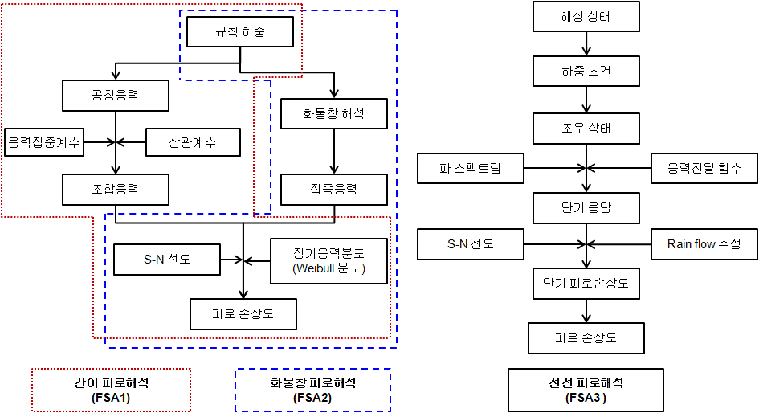
**그림 1 피로해석 방법**

### 2. 응력의 정의

피로해석에 사용하는 응력의 종류에는 공칭응력(nominal stress), 집중응력(hot spot stress) 및 노치응력(notch stress) 등이 있으며, 여기서는 집중응력방법(hot spot stress approach) 및 모서리 응력방법(edge stress)을 적용한다.

#### (1) 공칭응력

공칭응력은 구조의 기하학적 불연속 및 용접비드 형상 등에 의한 응력집중을 포함하지 않는 응력으로서 고려하는 위치의 단면형상으로부터 계산되는 응력을 말한다.

#### (2) 집중응력

- **(가)** 집중응력은 공칭응력과 부재의 구조적 불연속에 의한 응력의 증가를 포함하는 응력으로서 용접비드 형상 등 국부노치에 의한 응력집중 효과는 고려하지 않는다. 판구조에서 집중응력은 판두께 방향으로 선형 분포하며 막응력과 판굽힘응력으로 구분된다. 일반적으로 집중응력은 공칭응력 보다 크지만 구조의 불연속 지점으로 부터 충분히 떨어진 위치에서는 공칭응력과 동일하다.
- **(나)** 집중응력을 계산하기 위하여 공칭응력에 응력집중계수를 곱하여 구하거나 유한요소법을 사용하여 구조해석을 수행하며, 용접구조에서는 노치효과를 제거하기 위하여 용접토우에서 충분히 떨어진 위치의 응력을 이용하여 선형외삽법으로 집중응력을 구한다. 또한, 용접토우 근처의 응력분포는 사용된 유한요소의 크기와 종류에 따라 영향이 매우 크므로 일관성 있게 사용되어야 한다.

#### (3) 노치응력

용접구조에서 응력집중부(hot spot region)는 용접토우와 같이 피로균열이 발생되는 위치를 말하며, 이 지점에서의 총응력을 노치응력으로 정의한다.

#### (4) 모서리응력

판부재의 모서리 응력은 판의 공칭응력과 모서리부의 응력증가를 포함하는 응력으로 모서리 응력을 구하기 위해서는 유한요소법을 사용하여 구조해석을 수행하여야 한다.

### 3. 피로수명 평가

#### (1) 집중응력방법

선체구조와 같이 복잡한 구조물에서는 공칭응력을 계산하고 구조상세에 적합한 S-N 선도를 적용하는 것이 쉽지 않다. 따라서 이 지침에서는 유한요소법 또는 응력집중계수를 이용하여 구조의 기하학적 불연속에 의한 집중응력을 계산하고, S-N 선도는 이러한 기하학적 응력집중효과를 포함하지 않는 선도를 적용하는 집중응력방법을 사용한다. 그러나 용접비드 형상 등 국부노치에 의한 응력집중효과는 적용하는 S-N 선도에 포함되어 있다고 간주한다.

#### (2) 설계 S-N 선도

- **(가)** 선체구조의 피로강도를 평가하기 위하여 사용하는 S-N 선도는 **그림 2**에 따르며, 용접부에는 D 선도, 판부재의 모서리에는 C 선도를 적용하며, 판의 모서리를 연마(grinding) 한 경우에는 B 선도를 적용한다.
- **(나)** 용접부의 경우, 연마효과를 제외하고 계산된 피로수명이 L/1.47(L : 설계수명)보다 큰 경우에 한하여, 용접 토우의 연마효과를 고려하여 설계피로수명까지 피로수명 개선을 인정할 수 있다. (용접부라 함은 종방향 단부 연결부를 제외한 종방향 부착물 용접부, 횡방향 맞대기 용접부와 T 및 십자형 용접부를 말한다.) 단, 부식이 없는 조건에서 적용할 수 있고 연마 후 보호도장이 적용되고 설계수명 시간동안 유지되는 경우에만 고려할 수 있다.
  연마시공을 하는 경우, 연마 범위, 표면 조도상세, 최종 용접 형상 및 작업자의 연마기량 그리고 품질 허용기준을 포함하는 표면연마기준의 모든 상세내용을 해당 도면에 명시하여야 한다. 연마는 회전 숫돌(rotary burr)로 수행할 것을 권장하며, 토우 결함을 제거하도록 판 표면 내부까지 시행하고, 연마구역은 유효한 부식보호 대책을 가져야 한다.
  연마처리는 용접 토우에서, 모든 가시 언더컷(undercut)의 저면 아래 최소한 0.5 mm까지 판표면 안으로 침하관통 깊이를 갖는 매끄러운 오목면을 얻어야 한다. 얻어진 홈(groove) 깊이는 최소한으로 유지되어야 하며, 일반적으로 최대 1 mm 이내로 한다. 어떠한 경우에도 연마깊이는 2 mm와 판 총 두께의 7 % 중 작은 값을 초과하여서는 아니 된다. 연마는 고응력 구역 밖까지 충분히 연장하여야 한다.
- **(다)** 설계 S-N 선도는 공기중 S-N 선도의 평균값에서 2배의 표준편차를 감한 선도, 즉 97.6 %의 생존확률을 갖는 선도로 정의하며 Haibach 효과를 고려하여 $N=10 ^{7}$에서 기울기를 수정한다. (**그림 2** 참조) *(2020)*
  $\log N=\log K _{2} -m \log \Delta \sigma$
  $\log K _{2} =\log K _{1} -2\log \delta$
  $K _{1}$ : **표 1**에 주어진 평균 S-N 선도에 관련된 상수
  $K _{2}$ : **표 1**에 주어진 설계 S-N 선도에 관련된 상수
  $\delta$ : **표 1**에 주어진 $logN$ 의 표준편차
  $\Delta \sigma$: **표 1**에 주어진 설계 S-N 선도에 관련된 주기 $N=10 ^{7}$에서의 응력범위

  | 선도 | $K _{1}$ |   | $m$ | 표준편차, $\delta$ | $K _{2}$ | 설계응력범위 (N/mm^2) |   |
  | --- | --- | --- | --- | --- | --- | --- | --- |
  | 선도 | $K _{1}$ | $\log _{10} K _{1}$ | $m$ | $\log _{10} \delta$ | $K _{2}$ | $\Delta \sigma$, 10^7사이클 | 2×10^6 사이클 |
  | B | 2.343E15 | 15.3697 | 4.0 | 0.1821 | 1.013E15 | 100.2 | 149.9 |
  | C | 1.082E14 | 14.0342 | 3.5 | 0.2041 | 4.227E13 | 78.2 | 123.9 |
  | D | 3.988E12 | 12.6007 | 3.0 | 0.2095 | 1.519E12 | 53.4 | 91.3 |

  | 선도 | $K _{2}$ | $m$ | 2×10^6 사이클에서 설계응력범위, N/mm^2 |
  | --- | --- | --- | --- |
  | B | 5.05E14 | 4.0 | 126.1 |
  | C | 2.12E13 | 3.5 | 101.6 |
  | D | 7.60E11 | 3.0 | 72.4 |

  | 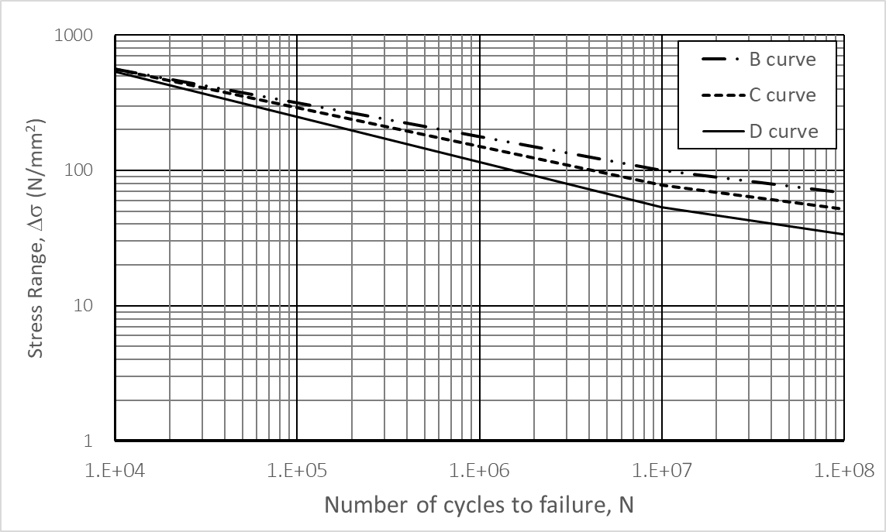 **(a) 공기 중 환경** **(a) 공기 중 환경** |
  | --- |
  |  **(b) 부식 환경** **(b) 부식 환경** |

#### (3) 부식효과 (2020)

**그림 2**에 나타낸 바와 같이 평형수 탱크에서와 같이 해수에 노출되는 부재가 부식에 대하여 보호되지 않은 경우에는 공기중의 S-N 선도에서 수명을 1/2로 감소하여 사용하며, 이 경우 선도는 $10 ^{7}$ 사이클에서 기울기를 수정하지 않는다.

#### (4) 평균응력효과(mean stress effect)

- **(가)** 대부분의 피로시험은 인장하중 상태에서 실시되므로 피로수명을 감소시키는 인장 평균응력의 영향이 S-N 선도에 포함되어 있다고 간주한다. 따라서 이러한 S-N 선도를 피로강도평가에 사용하는 경우에는 피로강도에 유리하게 작용하는 압축 평균응력의 영향을 고려할 수 있다.
- **(나)** 평균응력의 영향을 고려한 응력범위의 수정은 **규칙 12편 부록 C 1.4.5.11**에 의한다.

#### (5) 두께효과(thickness effect)

- **(가)** 구조상세의 피로성능은 부재두께에 영향을 받는다. 동일한 응력범위에 있어서, 부재의 두께가 증가함에 따라서 연결부의 피로한도는 감소한다. “척도효과”로도 불리는 이 영향은 인접한 판 두께 및 두께에 걸친 응력구배에 관련한 용접 토우의 기하학적 형상에 의하여 발생한다. 기본적인 설계 S-N 선도는 판 두께가 22 mm를 초과하지 않는 경우에 적용한다.
- **(나)** 판 두께의 영향을 고려한 응력범위의 수정은 **규칙 13편 1부 9장 3절 3.3**에 의한다.

#### (6) 재료 효과(Material effect) (2020)

용접을 하지 않은 모재 자유단의 경우 모재 강도를 반영하기 위하여 **규칙 13편 9장 3절**의 **3.1.3**에 따라 응력범위를 수정하여 피로강도평가를 수행할 수 있다.

#### (7) 피로수명 계산

피로손상도 $D$는 선형 누적손상법칙인 Miner-Palmgren rule을 적용하여 계산하며, 설계수명이 $L$(years)이라 하면, 피로수명은 $L/D$ (years)가 된다.

### 4. 간이 피로해석방법

응력집중계수에 의한 간이 피로해석방법은 종보강재 단부의 피로강도를 평가하기 위하여 사용한다. 적용하는 하중은 선체굽힘하중과 국부하중으로 선체굽힘하중은 수직파랑굽힘모멘트와 수평파랑굽힘모멘트를 고려하고, 국부하중은 파랑하중만 고려한다. 여기서 고려하는 하중은 초과 확률 $10 ^{{-4}}$ 에서 계산한 값이다.

#### (1) 피로설계 하중

- **(가)** 선체 파랑굽힘하중
  - **(a)** 수직 파랑굽힘하중
    수직 파랑굽힘모멘트는 다음 식에 따른다.
    $M _{w} (+)= 0.19fC _{1} C _{2} L ^{2} B C _{b}$(kN-m)
    $M _{w} (-)=-0.11fC _{1} C _{2} L ^{2} B(C _{b} +0.7)$(kN-m)
    $f$ : 확률 $10 ^{-8}$ 으로부터 $10 ^{{-4}}$ 으로의 변환계수로서 다음 식에 따른다.
    $f=0.5 ^{1/ \xi }$
    $\xi$ : Weibull 형상계수로 (4)의 (나)에 따른다.
    $C _{b}$ : 방형계수로서 0.6 미만인 경우에는 0.6으로 한다.
    $C _{1}$ : 파랑계수로서 **규칙 3장 201.**의 **표 3.3.1**에 따른다.
    $C _{2}$ : 선박의 길이 방향에 따른 분포계수로서 **규칙 3장 201.**의 **표 3.3.1**에 따른다.
  - **(b)** 수평 파랑굽힘하중
    수평 파랑굽힘모멘트는 다음 식에 따른다.
    $M _{H} =0.18fC _{1} C _{H} L ^{2} d(C _{b} +0.7)$(kN-m)
    $f$ : (a)에 따른다.
    $C _{1}$ 과 $C _{b}$ : (a)에 따른다.
    $C _{H}$ : **지침 7편 4장 205.**에 따른다.
- **(나)** 국부 파랑하중
  - **(a)** 국부 파랑압력
    선측에 작용하는 파랑압력은 다음 식에 따른다.
    (ⅰ) 흘수선 상부
    $p _{T} = p _{T} ^{f} K _{1} \left( 1 - \frac{h}{a _{w}} \right)$(kN/m^2)
    (ⅱ) 흘수선 하부
    $p _{T} = p _{T} ^{f} K _{1} \left( 1 - \frac{K _{2} h}{d} \right)$(kN/m^2)
    $p _{T} ^{f} =0.095L+34.0$(kN/m^2)
    $K _{1}$ : 계수로서 다음에 따른다. 다만, 중간값에 대하여는 보간법에 따른다.
    중앙부 0.4 $L$ 구간 : 1.0
    AP로 부터 후방 : 1.5
    FP로 부터 전방 : $\frac{5.5 (0.85 - C _{b} )}{1-C _{b} ^{2}} +2.0$
    $K _{2}$ : 계수로서 다음에 따른다. 다만, 중간값에 대하여는 보간법에 따른다.
    중앙부 0.4 $L$ 구간 : 0.5
    AP로 부터 후방 및 FP로 부터 전방 : 1.0
    $a _{w}$ : 다음 (b)에 따른다.
    $h$ : 흘수선으로 부터 고려하는 위치까지의 수직거리 (m).
    $C _{b}$ : 방형계수로서 $C _{b}$가 0.85를 넘을 경우에는 0.85로 한다.
  - **(b)** 국부 파랑압력범위(wave pressure range)
    국부 파랑압력범위 $P _{d}$ 는 다음과 같이 계산한다. (**그림 3** 참조)
    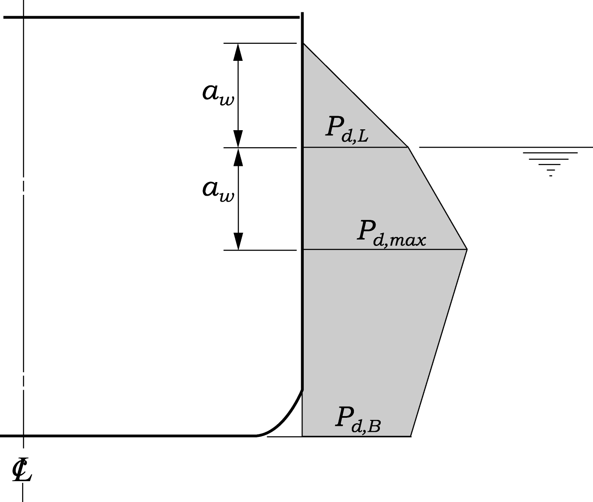
    **그림 3 국부 파랑압력범위** #eqnID-2377
    (ⅰ) 흘수선 상부의 부재
    $p _{d } = p _{T} ^{f} K _{1} \left( 1 - \frac{h}{a _{w}} \right)$(kN/m^2)
    (ⅱ) 흘수선으로 부터 $p_{d,\max}$ 사이의 부재
    $p _{d } = 10 h + p _{T} ^{f} K _{1} \left( 1 - \frac{K _{2} h}{d} \right)$(kN/m^2)
    (ⅲ) $p _{d,\max}$ 하부의 부재
    $p _{d } = 2 p _{T} ^{f} K _{1} \left( 1 - \frac{K _{2} h}{d} \right)$(kN/m^2)
    $a _{w}$ : 흘수선으로 부터 최대 압력범위($p _{d,\max}$)가 작용하는 위치까지의 거리 (m)로서 다음 식에 따른다.
    $a _{w } = \frac{1}{\frac{1}{2d} + \frac{10}{p _{T} ^{f}}}$
- **(다)** 선박의 운동에 의한 내부 압력하중
  - **(a)** 내부 압력 동하중
    액체화물 또는 평형수에 의해 선체 내부에 작용하는 동하중($p_i$)은 다음 식 중 큰 값으로 한다.
    $p _{i} = 2f \rho _{c} a _{v} h _{s }$(kN/m^2)
    $p _{i} = 2f \rho _{c} a _{t} |y _{s} |$(kN/m^2)
    $f$ : (가)의 (a)에 따른다.
    $\rho _{c}$ : 액체의 질량밀도로서, 해수의 경우 1.025로 한다.
    $h _{s}$ : 탱크내의 액체의 표면으로부터 고려하는 위치까지의 연직거리 (m)
    $y _{s}$ : 탱크내의 액체의 자유표면 중심으로부터 고려하는 위치까지의 수평거리 (m)
    $a _{v}$ 및 $a _{t}$ : 수직 및 수평방향 가속도로서 다음 (b)의 (ⅵ)에 의한다.
  - **(b)** 선박의 운동에 의한 가속도
    (ⅰ) 상하운동 가속도
    선체의 상하 운동에 의한 가속도는 다음 식에 의한 것으로 한다.
    $a _{z} = \frac{V ^{1.2}}{2 \sqrt {L}} + \frac{361}{L} + 0.49$(m/sec^2)
    $V$ : 설계 속도 (knots)
    (ⅱ) 수평운동 가속도
    선체의 수평 운동에 의한 가속도는 다음 식에 의한 것으로 한다.
    $a _{y} = \frac{178}{L} + 0.36$(m/sec^2)
    (ⅲ) 종동요에 의한 가속도
    선체의 임의의 위치에서 종동요에 의한 가속도는 다음 식에 의한 것으로 한다.
    $a _{\theta } = \theta \times \left( \frac{2 \pi}{T _{\theta }} \right) ^{2} \times l _{\theta }$(m/sec^2)
    $\theta$ : 선체 종동요의 진폭으로 다음 식에 의한 값
    $\theta = \frac{19.62}{L} +0.022$(rad)
    $T _{\theta }$ : 선체 종동요의 주기로 다음 식에 의한 값
    $T _{\theta } = 1.86 \sqrt {\frac{L}{g}}$ (sec)
    $l _{\theta }$ : 종동요의 회전중심으로부터 탱크/액체화물 중심까지의 거리(m)이며, 이 경우 종동요의 회전중심은 A.P로부터 0.45 $L$ 위치의 단면에서 용골 상면상 $(D/4+d/2)$ 또는 $D/2$ 중 작은 값의 높이에 위치하는 것으로 할 수 있다.
    (ⅳ) 횡동요에 의한 가속도
    선체의 임의의 위치에서 횡동요에 의한 가속도는 다음 식에 의한 것으로 한다.
    $a _{\phi } = \phi \times \left( \frac{2 \pi}{T _{\phi }} \right) ^{2} \times l _{\phi }$(m/sec^2)
    $\phi$ : 선체 횡동요의 진폭으로 다음 식에 의한 값
    $\phi = kC _{s} f _{0} \sqrt {0.131 - 0.005T _{\phi }}$(rad)
    $k$ = 1.0 : 빌지 킬이 없는 선박
    = 0.8 : 빌지 킬이 있는 선박(안티 롤링 탱크를 가진 선박 포함)
    $C _{s}$ = 0.82 : 산적화물선 및 유조선
    = 0.96 : 기타 선박
    $f _{0}$ : 다음 식에 의한 값으로 한다. 다만, $C _{b}$가 0.45 미만인 경우는 $C _{b}$를 0.45로, 0.7 이상인 경우에는 $C _{b}$를 0.7로 하며, $B/d$가 2.4 미만인 경우에는 $B/d$를 2.4로, 3.5 이상인 경우에는 $B/d$를 3.5로 한다.
    $f _{0} = 0.86+2.72C _{b} -(B/d) \times (0.11+0.34C _{b} )$
    $T _{\phi }$ : 선체 횡동요의 주기로 다음 식에 의한 값으로 한다. 다만, $T _{\phi }$가 6.0 미만인 경우에는 6.0으로 20.0이상인 경우에는 20.0으로 한다.
    $T _{\phi } = \frac{4C _{f} B}{\sqrt {GM _{T}}}$ (sec)
    $C _{f}$ : 다음 식에 의한 값으로 한다. 다만, $B/d$가 2.4 미만인 경우에는 $B/d$를 2.4로, 3.5 이상인 경우에는 $B/d$를 3.5로 한다.
    $C _{f} =0.373-0.023 \left( B/d \right) -0.043(L/100)$
    $GM _{T}$ : 자유수면 효과를 고려한 횡 메타센타 높이(m)로서 값이 주어지지 아니한 경우에는 다음 값을 사용 할 수 있다.
    $0.07B$ : 기타 선박
    $0.12B$ : 단일선체 유조선, 산적화물선 및 만재하중조건의 이중선체 유조선의 경우
    $0.25B$ : 평형수적재 조건의 산적화물선의 경우
    $0.33B$ : 평형수적재 조건의 이중선체유조선의 경우
    $l _{\phi }$ : 횡동요의 회전중심으로부터 탱크/액체화물 중심까지의 거리(m)이며, 이 경우 횡동요의 회전중심은 A.P로부터 0.45 $L$ 위치의 단면에서 용골 상면상 $\left( D/4 + d/2 \right)$ 또는 $D/2$ 중 작은 값의 높이에 위치하는 것으로 할 수 있다.
    (ⅴ) 선수 동요(yawing)에 의한 가속도
    선체의 임의의 위치에서 선수 동요에 의한 가속도는 다음 식에 의한 것으로 한다.
    $a _{\psi } = \left( \frac{6.95}{L} -0.017 \right) l _{\psi }$(m/sec^2)
    $l _{\psi }$ : 선수 동요의 회전중심으로부터 탱크/액체화물 중심까지의 거리(m)이며, 회전중심은 전 (c)에 따를 수 있다.
    (ⅵ) 조합 가속도
    ① 조합 수직가속도
    $a _{v} = \sqrt {a _{z} ^{2} +a _{\phi z} ^{2} +a _{\theta z} ^{2}}$(m/sec^2)
    $a _{z}$ : (i)에 따른다.
    $a _{\phi z}$ : 횡동요에 의한 수직가속도로서 다음 식에 의한 것으로 한다.
    $a _{\phi z} = \phi \left( \frac{2 \pi}{T _{\phi }} \right) ^{2} l _{\phi y}$(m/sec^2)
    $\phi$ 및 $T _{\phi }$ : (iv)에 따른다.
    $l _{\phi y}$ : 횡동요의 회전중심으로부터 탱크/액체화물 중심까지의 폭방향 수평거리(m)이며, 회전중심은 (iii)에 따를 수 있다
    $a _{\theta z}$ : 종동요에 의한 수직가속도로서 다음 식에 의한 것으로 한다.
    $a _{\theta z} = \theta \left( \frac{2 \pi}{T _{\theta }} \right) ^{2} l _{\theta x}$(m/sec^2)
    $\theta$ 및 $T _{\theta }$ : (iii)에 따른다
    $l _{\theta x}$ : 종동요의 회전중심으로부터 탱크/액체화물 중심까지의 길이방향 수평거리(m)이며, 회전중심은 (ⅲ)에 따를 수 있다.
    ② 조합 수평가속도
    $a _{t} = \sqrt {a _{y} ^{2} +a _{\phi y} ^{2} +a _{\psi y} ^{2}}$(m/sec^2)
    $a _{y}$ : (ⅱ)에 따른다.
    $a _{\phi y}$ : 횡동요에 의한 수평가속도로서 다음 식에 의한 것으로 한다.
    $a _{\phi y} = \phi \left( \frac{2 \pi}{T _{\phi }} \right) ^{2} l _{\phi z}$(m/sec^2)
    $\phi$ 및 $T _{\phi }$ : (ⅳ)에 따른다.
    $l _{\phi z}$ : 횡동요의 회전중심으로부터 탱크/액체화물 중심까지의 수직거리(m)이며, 회전중심은 (ⅲ)에 따를 수 있다.
    $a _{\psi y}$ : 선수동요에 의한 수평가속도로서 다음 식에 의한 것으로 한다.
    $a _{\psi y} = \left( \frac{6.95}{L} -0.017 \right) l _{\psi x}$(m/sec^2)
    $l _{\psi x}$ : 선수동요의 회전중심으로부터 탱크/액체화물 중심까지의 길이방향 수평거리(m)이며, 회전중심은 (ⅲ)에 따를 수 있다.

#### (2) 공칭응력 계산

- **(가)** 축하중에 의한 공칭응력
  - **(a)** 수직 파랑굽힘응력범위 (vertical wave bending stress range)는 고려하는 위치에서 다음 식에 따른다
    (ⅰ) 고려하는 위치가 중립축 상부에 있는 경우
    $\Delta \sigma _{nom,V } = \frac{M _{w} (+) - M _{w} (-)}{Z _{D}} \frac{z - z _{NA}}{D - z _{NA}} \times 10 ^{3}$(N/mm^2)
    (ⅱ) 고려하는 위치가 중립축 하부에 있는 경우
    $\Delta \sigma _{nom,V } = \frac{M _{w} (+) - M _{w} (-)}{Z _{B}} \frac{z _{NA } - z}{z _{NA}} \times 10 ^{3}$(N/mm^2)
    $Z _{D}$ : 중립축에 대한 강력갑판의 선체 횡단면계수 (cm^3)
    $Z _{B}$ : 중립축에 대한 선저의 선체 횡단면계수 (cm^3)
    $z$ : 선저로부터 고려하는 위치까지의 거리 (m)
    $z _{NA}$ : 선저로부터 중립축까지의 거리 (m)
  - **(b)** 수평 파랑굽힘응력범위(horizontal wave bending stress range)는 고려하는 위치에서 다음 식에 따른다.
    $\Delta \sigma _{nom,H } = \frac{2 M _{H}}{Z _{H}} \frac{y}{B/2} \times 10 ^{3}$ (N/mm^2)
    $Z _{H}$ : 선체 중심선에 대한 선측 외판의 선체 횡단면계수 (cm^3)
    y : 선체 중심선에서 고려하는 위치까지의 수평거리 (m)
  - **(c)** 선체 파랑굽힘응력범위
    선체 파랑굽힘응력범위 ($\Delta \sigma _{nom,g}$)는 다음의 값 중에서 큰 것으로 한다.
    $\Delta \sigma _{nom,g } = 0.5 \Delta \sigma _{nom,V } + \Delta \sigma _{nom,H}$(N/mm^2)
    $\Delta \sigma _{nom,g } = \Delta \sigma _{nom,V}$(N/mm^2)
- **(나)** 횡하중에 의한 공칭응력
  일반적으로 트랜스버스 고착부에서 종보강재 면재의 공칭응력은 보이론을 이용하여 균일분포 하중을 받는 양단 고정보로 이상화하여 계산할 수 있으며, 이 경우 판의 유효폭을 고려하여야 한다. 또한, 종보강재 단면의 비대칭형상에 의한 응력의 증가도 공칭응력에 포함되어야 하며, 횡하중에 의한 공칭응력 $\Delta \sigma _{nom,l}$ 은 다음 식에 따른다.
  $\Delta \sigma _{nom,l} = \sqrt {\Delta \sigma _{e} ^{2 } + \Delta \sigma _{i} ^{2 } + 2 \rho _{c} \Delta \sigma _{e} \Delta \sigma _{i}}$
  $\rho _c$ : 파랑하중과 내부하중의 상관 계수로서 (-)0.6으로 한다.
  $\Delta \sigma _{e}$ : 파랑하중에 의한 공칭응력으로 다음 식에 의한다.
  $\Delta \sigma _{e} = (1 + C _{t} ) \frac{p _{d} S l ^{2}}{12 Z _{f}} \times 10 ^{3}$ (N/mm^2)
  $\Delta \sigma _{i}$ : 액체화물 또는 평형수(ballast water)에 의한 공칭응력으로 다음 식에 의한다.
  $\Delta \sigma _{i} = (1 + C _{t} ) \frac{p _{i} S l ^{2}}{12 Z _{f}} \times 10 ^{3}$(N/mm^2)
  $p _{d}$ : 파랑압력범위 (kN/m^2)로 (1)호 (나) (b)에 따른다.
  $p _{i}$ : 액체화물 또는 평형수에 의한 하중 (kN/m^2)으로 (1)호 (다) (a)에 따른다.
  $S$ : 종보강재의 간격 (m)
  $l$ : 트랜스버스의 간격 (m)
  $Z _{f}$ : 종보강재 면재에서의 단면계수 (cm^3)
  $C _{t}$ : 종보강재 단면의 비대칭 형상에 의한 응력증가 계수로서 다음 식에 따른다.
  $C _{t} =1.68 (0.38 + A _{f} /A _{w} )(e ^{2 } + 0.28e)$
  $e = \frac{b}{b _{f}}$
  $A _{f}$ : 면재의 단면적 (cm^2)
  $A _{w}$ : 웨브의 단면적 (cm^2)
  $b$ : 종보강재 면재폭의 중심에서 웨브 중심까지의 거리 (cm) (**그림 4** 참조)
  $b _{f}$ : 종보강재 면재의 폭 (cm) (**그림 4** 참조)
  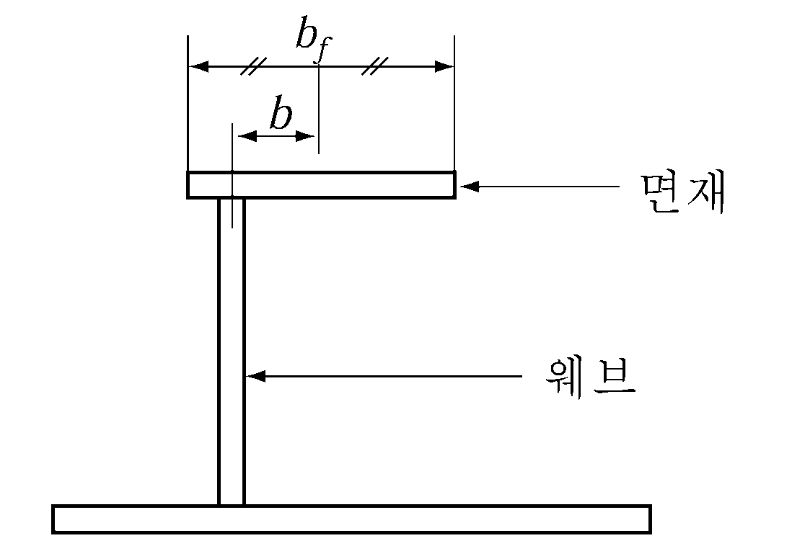
  **그림 4** #eqnID-2491 **및** #eqnID-2492
- **(다)** 상대변위에 의한 공칭응력
  - **(a)** 고려하는 종보강재가 횡격벽에 고착된 경우 국부응력의 계산에는 횡격벽과 인접하는 트랜스버스 사이의 상대변위가 고려되어야 한다. 상대변위에 의한 공칭응력 $\Delta \sigma _{nom,r }$은 부가적인 굽힘응력으로서 다음 식에 따른다.
    $\Delta \sigma _{nom,r } = \frac{6E I \delta}{Z _{f} l ^{2}} \times 10 ^{-5}$(N/mm^2)
    $\delta$ : 횡격벽과 트랜스버스 사이의 상대변위 (mm).
    $I$ : 종보강재의 단면 2차 모멘트 (cm^4).
    $E$ : 재료의 탄성계수로서 강재의 경우 2.06 x 10^5(N/mm^2)으로 한다.
    $Z _{f}$ : 종보강재의 단면계수 (cm^3).
    $l$ : 트랜스버스의 간격 (m).
    일반적으로 횡격벽과 트랜스버스 사이의 상대변위는 화물창 구조해석을 통하여 계산할 수 있지만, 상대변위가 계산되지 않은 경우에는 다음과 같이 횡하중에 의한 공칭응력의 50%를 상대변위에 의한 공칭응력으로 고려할 수 있다.
    $\Delta \sigma _{nom,r} = 0.5 \Delta \sigma _{nom,l}$
    그러나 횡격벽 전후의 종보강재가 완만한 브래킷 (soft toe bracket)으로 횡격벽에 결합된 경우에는 상대변위에 의한 공칭응력은 고려하지 않아도 좋다.
  - **(b)** 이중선측구조인 경우에는 **규칙 12편 부록 C 1.4.4.11**에 따라 상대변위에 의한 공칭응력을 계산할 수 있다.

#### (3) 응력집중계수(stress concentration factor)

- **(가)** 응력집중계수는 집중응력($\Delta \sigma _{hot}$)과 공칭응력($\Delta \sigma _{nom}$)의 비로 정의하며, 종보강재와 트랜스버스(또는 횡격벽) 보강재의 용접결합부에 대한 집중응력은 **표 2**의 응력집중계수 $K _{s,g}$ 및 $K _{s,l}$를 이용하여 다음과 같이 계산할 수 있다.
  $\Delta \sigma _{hot,g } = K _{s,g } \Delta \sigma _{nom,g}$
  $\Delta \sigma _{hot,l } = K _{s,l } \Delta \sigma _{nom,l}$
  $K _{s,g}$ : 축하중에 의한 응력집중계수
  $K _{s,l}$ : 횡하중에 의한 응력집중계수
  $\Delta \sigma _{nom,g}$ : (2)호 (가) (c)에 따른다.
  $\Delta \sigma _{nom,l}$ : (2)호 (나)에 따른다.
- **(나)** 종보강재 단부의 상대변위에 의한 응력집중계수는 횡하중에 의한 응력집중계수와 동일한 것으로 간주한다.

  | 번호 | 연결형식 (2)(3) | A점 |   | B점 |   |   |
  | --- | --- | --- | --- | --- | --- | --- |
  | 번호 | 연결형식 (2)(3) | $K _{s,g}$ | $K _{s,l}$ |   | $K _{s,g}$ | $K _{s,l}$ |
  | 1(1) |  | 1.28, $d \leq 150$인 경우 1.36, $150인 경우 1.45, \(d > 250$인 경우 | 1.40, $d \leq 150$인 경우 1.50, $150인 경우 1.60, \(d > 250$인 경우 |   | 1.28, $d \leq 150$인 경우 1.36, $150인 경우 1.45, \(d > 250$인 경우 | 1.60 |
  | 2(1) | 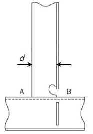 | 1.28, $d \leq 150$인 경우 1.36, $150인 경우 1.45, \(d > 250$인 경우 | 1.40, $d \leq 150$인 경우 1.50, $150인 경우 1.60, \(d > 250$인 경우 |   | 1.14, $d \leq 150$인 경우 1.24, $150인 경우 1.34, \(d > 250$인 경우 | 1.27 |
  | 3 | 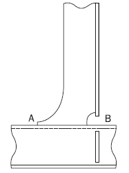 | 1.28 | 1.34 |   | 1.52 | 1.67 |
  | 4 |  | 1.28 | 1.34 |   | 1.34 | 1.34 |
  | 5 | 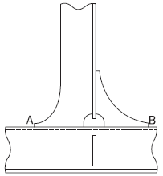 | 1.28 | 1.34 |   | 1.28 | 1.34 |

  | 번호 | 연결형식 (2)(3) | A점 |   | B점 |   |
  | --- | --- | --- | --- | --- | --- |
  | 번호 | 연결형식 (2)(3) | $K _{s,g}$ | $K _{s,l}$ | $K _{s,g}$ | $K _{s,l}$ |
  | 6 |  | 1.52 | 1.67 | 1.34 | 1.34 |
  | 7 | 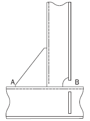 | 1.52 | 1.67 | 1.52 | 1.67 |
  | 8 |  | 1.52 | 1.67 | 1.52 | 1.67 |
  | 9 |  | 1.52 | 1.67 | 1.28 | 1.34 |
  | 10 |  | 1.52 | 1.67 | 1.52 | 1.67 |
  | 11 | 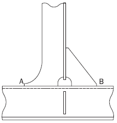 | 1.28 | 1.34 | 1.52 | 1.67 |
  | 12 |  | 1.52 | 1.67 | 1.28 | 1.34 |
  | 13 |  | 1.52 | 1.67 | 1.52 | 1.67 |

  | 번호 | 연결형식 (2)(3) | A점 |   | B점 |   |   |
  | --- | --- | --- | --- | --- | --- | --- |
  | 번호 | 연결형식 (2)(3) | $K _{s,g}$ | $K _{s,l}$ |   | $K _{s,g}$ | $K _{s,l}$ |
  | 14 |  | 1.52 | 1.67 | 1.34 |   | 1.34 |
  | 15 | 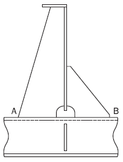 | 1.52 | 1.67 | 1.52 |   | 1.67 |
  | 16 |  | 1.52 | 1.67 | 1.28 |   | 1.34 |
  | 17 |  | 1.28 | 1.34 | 1.52 |   | 1.67 |
  | 18 |  | 1.28 | 1.34 | 1.34 |   | 1.34 |
  | 19 | 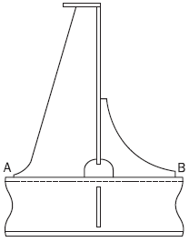 | 1.28 | 1.34 | 1.28 |   | 1.34 |
  | 20 | 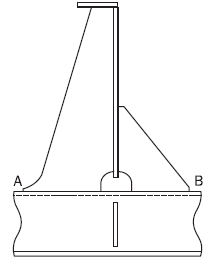 | 1.28 | 1.34 | 1.52 |   | 1.67 |
  | 21 |  | 1.28 | 1.34 | 1.52 |   | 1.67 |

  | 번호 | 연결형식 (2)(3) | A점 |   |   | B점 |   |   |
  | --- | --- | --- | --- | --- | --- | --- | --- |
  | 번호 | 연결형식 (2)(3) | $K _{s,g}$ |   | $K _{s,l}$ | $K _{s,g}$ |   | $K _{s,l}$ |
  | 22 |  | 1.28 |   | 1.34 | 1.34 |   | 1.34 |
  | 23 | 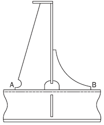 | 1.28 | 1.34 |   | 1.28 | 1.34 |   |
  | 24 | 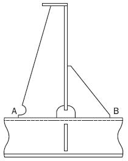 | 1.28 | 1.34 |   | 1.52 | 1.67 |   |
  | 25(1) | 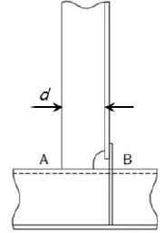 | 1.28, $d \leq 150$인 경우 1.36, $150인 경우 1.45, \(d > 250$인 경우 | 1.40, $d \leq 150$인 경우 1.50, $150인 경우 1.60, \(d > 250$인 경우 |   | 1.14, $d \leq 150$인 경우 1.24, $150인 경우 1.34, \(d > 250$인 경우 | 1.25, $d \leq 150$인 경우 1.36, $1501.47, \(d > 250$인 경우 |   |
  | 26 | 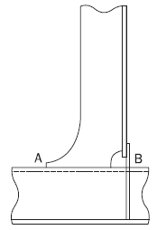 | 1.28 | 1.34 |   | 1.34 | 1.47 |   |
  | 27 | 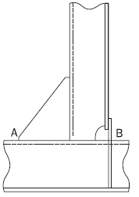 | 1.52 | 1.67 |   | 1.34 | 1.47 |   |
  | 28 | 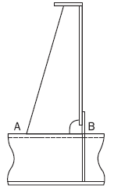 | 1.52 | 1.67 |   | 1.34 | 1.47 |   |
  | 29 |  | 1.28 | 1.34 |   | 1.34 | 1.47 |   |

  | 번호 | 연결형식 (2)(3) | A점 |   | B점 |   |   |
  | --- | --- | --- | --- | --- | --- | --- |
  | 번호 | 연결형식 (2)(3) | $K _{s,g}$ | $K _{s,l}$ |   | $K _{s,g}$ | $K _{s,l}$ |
  | 30 |  | 1.28 | 1.34 | 1.34 |   | 1.47 |
  | 31(4) |  | 1.13 | 1.20 | 1.13 |   | 1.20 |
  | 32 (4)(5)(6) |  | 1.13 | 1.14 | N/A |   | N/A |
  | (비고) (1) 부착물 길이, $d$ (mm)는 스캘럽의 공제 없이 종보강재 플랜지에 용접된 부착물의 길이로 정의한다. (2) 종보강재가 평강이고 웨브 보강재/브래킷이 평강 보강재에 용접된 경우, 표의 응력집중계수는 1.12를 곱하여야 한다. 이것은 웨브 보강재/브래킷의 두께가 평강 두께의 0.7배를 넘는 경우에 적용한다. 이 규정은 보강재 플랜지의 단부와 웨브 보강재/브래킷 사이의 간격이 8 mm 미만의 경우 비대칭 형강(구평강 또는 앵글같이 간격이 8 mm 미만인 형강)에 대해서도 적용한다 (3) 겹침 연결/부착물을 가진 설계, **13편 1부 9장 4절 [5.2.3]** 참조. (4) 웨브 보강재가 생략되거나 종보강재 플랜지에 연결되지 않은 경우의 상세는 번호 31 및 32를 참조한다. **13편 1부 9장 4절 [5.2.4]** 참조. (5) 칼라가 없거나 및/또는 웨브판이 플랜지에 용접되지 않은 번호 32의 연결 형식의 경우, 슬롯 모양에 상관없이 이 표의 응력집중계수가 사용되어야 한다. (6) 피로평가 지점 ‘A'는 보강재 웨브와 횡특설늑골(transverse web frame) 또는 러그판 사이에 위치한다. |   |   |   |   |   |   |

#### (4) 조합 응력범위(Combined stress range)

- **(가)** 피로수명을 계산하기 위하여 사용하는 조합응력은 집중응력으로서 (2)의 공칭응력에 (3)의 응력집중계수를 곱하여 계산할 수 있다. 초과 확률 $10 ^{-4}$에서 계산된 조합 응력범위는 파랑하중, 선체굽힘거동, 상대변위 등에 의한 응력범위의 조합으로서 다음 식에 따른다.
  $DELTA sigma _{0} `=~f _{E} TIMES max {cases{DELTA sigma _{hot,g} +0.6( DELTA sigma _{hot,l} + DELTA sigma _{hot,r} ).6 DELTA sigma _{hot,g} +` DELTA sigma _{hot,l} +` DELTA sigma _{hot,r}&}}$
  $f _{E}$ : 선박의 운항 항로에 따른 조정계수로 다음에 따른다.
  $f _{E} =1.0$ : 북대서양 해역에서 정기적으로 운항하는 경우
  $f _{E} =0.8$ : 상기 이외의 경우
- **(나)** 선체구조부재에 대한 응력범위의 장기분포는 Weibull 분포에 의하여 나타낼 수 있으며, Weibull 형상계수(Shape parameter)는 선종, 구조부재의 위치, 해상환경 등에 따라 다르다. 그러나 종보강재에 대한 Weibull 형상계수 $\xi$ 는 다음과 같이 선박 길이의 함수로 나타낼 수 있다.
  $\xi = 1.1 - 0.35 \frac{L - 100}{300}$
- **(다)** 선체굽힘 응력범위와 국부 응력범위가 조합된 응력범위의 장기분포는 국부 응력범위의 장기분포에 따른다고 가정한다.

#### (5) 피로손상계산 (2020)

- **(가)** 피로손상계산은 선형 누적손상법칙을 적용하며 누적 피로손상도 $D$ 는 다음과 같이 수치적분으로 계산할 수 있다.
  $D = \Sigma \frac{n _{i}}{N _{i}}$
  $n _{i}$ : 조합 응력범위의 장기분포에서 $i$ 번째 응력범위 블록의 사이클 수.
  $N _{i}$ : $i$ 번째 응력범위에서 파단까지의 응력 사이클 수.
  여기서 응력범위의 장기분포가 Weibull 분포에 따른다면 공기중에서의 누적 피로손상도 $D _{air }$는 다음 식에 따른다.
  $D _{air } = \frac{N _{t}}{K _{2}} \frac{\Delta \sigma _{0}^{m}}{(lnN _{0} ) ^{m/ \xi }} \cdot \mu _{7} \cdot \Gamma \left( 1 + \frac{m}{\xi} \right)$
  $K _{2}$ : 공기 중 환경에 대한 **표 1** (a)에서 주어진 설계 S-N 선도 상수
  $N _{0}$ : $10 ^{-4}$의 초과 참조 확률수준에 상응하는 사이클 횟수로 다음과 같다.
  $N _{0} =10000$
  $\xi$ : Weibull 형상계수
  $\Gamma$ : 완전 감마함수 (complete gamma function)로서 다음 식에 따른다.
  $\Gamma (z) = \int _{0} ^{\infty } {} t ^{z - 1} e ^{-t} dt$
  $\gamma$ : 불완전 감마함수(incomplete gamma function)로서 다음 식에 따른다.
  $\gamma (z,x) = \int _{0} ^{x} {} t ^{z - 1} e ^{-t} dt$
  $\mu _{7}$ : S-N 선도의 역경사($m$)의 변화를 고려하는 계수로 다음과 같다.
  $\mu _{7} =1- \frac{\left\{ \gamma \left( 1+ \frac{m}{\xi} ,t _{7} \right) -t _{7}^{- \frac{2}{\xi}} \cdot \gamma \left( 1+ \frac{m+2}{\xi} ,t _{7} \right) \right\}}{\Gamma \left( 1+ \frac{m}{\xi} \right)}$
  $t _{7}$ : 다음 식에 따른다.
  $t _{7} = \left( \frac{\Delta \sigma _{7}}{\Delta \sigma _{0}} \right) ^{\xi } \ln N _{0}$
  $\Delta \sigma _{7 }$ : $N=10 ^{7}$ 에서 공기중 S-N선도의 응력범위를 나타낸다.
  $N _{t}$ : 선박이 일생동안 받는 총 하중 사이클 수이며, 선박의 수명 $Y$(years)에 대한 총 하중 사이클 수는 총 운항일수의 85%를 고려하여 다음 식에 따른다.
  $N _{t} = \frac{2.68 \times 10 ^{7}}{4 \log L} \times Y$
- **(나)** 부식을 고려한 경우에 대한 피로손상 $D_cor$ 은 다음과 같이 계산한다.
  $D _{cor } = \frac{N _{t}}{K _{2}} \frac{\Delta \sigma _{0}^{m}}{(lnN _{0} ) ^{m / \xi }} \Gamma (1 + \frac{m}{\xi} )$
  $K _{2}$ : 부식 환경에 대한 **표 1** (b)에서 주어진 설계 S-N 선도 상수
  그러나 평형수 탱크 내부의 부재가 부식에 대하여 유효하게 보호되어 있는 경우에는 다음과 같이 누적 피로손상도 D를 계산한다.
  $D = 0.5 D _{air } + 0.5 D _{cor}$
- **(다)** 하중조건으로 만재상태와 평형수적재 상태를 고려하는 경우에는 국부 파랑압력범위 계산에서 해당흘수를 적용하고 각각에 대한 피로손상도 $D_Full$ 및 $D_Ballast$를 계산한다. 따라서 총 피로손상도는 다음 식과 같다.
  $D = p _{lF} D _{Full} + p _{lB} D _{Ballast}$
  $p _{lF}$ 및 $p _{lB}$ : 만재상태 및 평형수적재 상태에 대한 운항비율로서 특별히 주어지지 아니한 경우에는 각각 0.5로 한다. 다만, 우리 선급이 필요하다고 판단되는 경우 적하지침서에 따라 운항비율을 조정하여 피로강도 평가를 수행할 수 있다. 아래는 대표적인 선종에 대한 일반적인 운항비율을 나타내고 있다.- 액화가스 운반선(멤브레인 형식) : 만재 0.5 / 평형수적재 0.5- 광석운반선 : 만재 0.5 / 평형수 적재 0.5- 자동차 운반선 : 만재 0.7 / 평형수 적재 0.3
  광석운반선의 경우에 만재상태의 고비중과 저비중의 비율은 특별히 주어지지 아니한 경우에는 동일하다고 가정한다. 평형수적재 상태의 경우 황천 평형수(Heavy Ballast) 및 통상 평형수(Normal Ballast)는 각각 0.3 및 0.2로 한다. 황천 평형수 적재 조건이 없는 경우에는 피로강도평가에서 이를 제외하고 통상 평형수 적재 조건만 고려한다. *(2020)*

#### (6) 피로강도평가 대상부위

간이 피로해석에 의해서 피로강도를 평가하여야 할 대상부재는 화물구역 내에 위치한 모든 종보강재로서 검토부위는 **표 3**과 같다. 중앙부 화물창내의 중앙 횡단면 및 횡격벽의 전/후 첫 번째 횡단면에 대해서 피로강도를 평가하여야 한다. 다만, 우리 선급이 필요하다고 인정하는 경우에는 그 이외의 단면에도 피로강도 평가를 요구할 수 있다.

### 5. 화물창 피로해석방법

유한요소 응력해석에 의한 피로해석 절차는 매우 상세한 분할모델로부터 구조적 불연속을 고려하여 상세부의 용접 토우에서의 집중응력을 계산하는 방법이다. 집중응력은 일반적으로 구조를 나타내기 위하여 사용된 유한요소모델에 크게 좌우된다.

#### (1) 피로설계 하중

- **(가)** 선체굽힘하중
  - **(a)** 수직 정수중굽힘모멘트
    고려되는 각 적재 상태에서의 값을 사용하여야 한다.
  - **(b)** 수직 파랑굽힘모멘트
    **4**항 (1)호 (가) (a)에 따른다.
- **(나)** 국부 파랑하중
  선측에 작용하는 파랑 압력은 정수압과 변동 파랑압력으로 나눌 수 있으며, 모델에 적용할 때에는 다음의 식에 의한다.
  파정일 때 : $p _{e} =p _{es } + p _{ed}$ $( \mathrm{kN}/m ^{2} )$
  파저일 때 : $p _{e} =p _{es } - p _{ed}$ $( \mathrm{kN}/m ^{2} )$ 다만, $p _{e}$는 0보다 커야 한다.
  $p _{es} = \rho g h$
  $p _{ed} = p _{T}$
  $\rho$ : 해수의 비중량으로 1.025로 한다.
  $h, p _{T}$ : **4**항 (1)호 (나) 참조
- **(다)** 국부 내부하중
  해석 모델에 적용되는 내부 하중은 광석 등의 입상 화물에 의한 하중과 평형수 등의 액체에 의한 하중으로 나눌 수 있다. 화물창이나 평형수 탱크의 경계면에 작용하는 하중은 다음의 식과 같이 적용한다. 이 때, 선박의 운동에 의한 가속도는 **4**항 (1)호 (다) (b)에 따른다.
  $p _{i} = p _{is} + p _{id }$ 다만, $p _{i}$는 0보다 커야 한다.
  - **(a)** 평형수 및 유체 화물에 의한 하중
  - **(i)** 액체화물 또는 평형수에 의해 선체 내부에 작용하는 정하중($p _{is}$)은 다음 식에 따른다.
    $p _{is} = 9.81 \rho _{c} h _{"top"}$ $( \mathrm{kN}/m ^{2} )$
    $\rho _{c}$ _: 액체의 질량밀도(ton/m^3)로서, 해수의 경우 1.025로 한다.
    $h _{"top"}$ : 탱크 정판상으로부터 고려하는 위치까지의 높이 (m)
    $p _{id} = f \rho _{c} C _{v} a _{v} h _{s} ( \mathrm{kN}/m ^{2} )$
    $p _{id} = f \rho _{c} C _{t} a _{t} \left| y _{s} \right| ( \mathrm{kN}/m ^{2} )$
    $f, \rho _{c} , a _{v} , h _{s} , a _{t} , y _{s}$ : **4**항 (1)호 (다) (a)에 따른다.
    $C _{v} , C _{t}$ : **표 5** 및 **표 6** 참조
    - **(ii)** 액체화물 또는 평형수에 의해 선체 내부에 작용하는 동하중($p _{id}$)은 다음 식 중 큰 값으로 한다.
  - **(b)** 광석 등 입상 화물에 의한 하중
  - **(i)** 화물의 적재 높이 및 형상은 **4**항 (1)호 (다) (a) (ii)에 따른다.
    $p _{is} = 9.81 \gamma hk (kN/m ^{2} )$
    $\gamma$ : 화물의 밀도 (ton/m^3)
    $h$ : 고려하는 패널로부터 직상부 화물 표면까지의 수직 높이 (m)
    $k : \cos ^{2} \beta +(1-\sin \psi )\sin ^{2} \beta$
    $\beta$ : 수평면과 고려하는 패널 사이의 각도 (deg)
    $\psi$ : 산적화물(수분이 제거된)의 추정 안식각(deg) 보다 정확한 평가가 없는 경우, 다음의 값으로 할 수 있다.
    $\psi$ = 30°, 일반화물인 경우
    $\psi$ = 35°, 철광석인 경우
    $\psi$ = 25°, 시멘트인 경우
    $p _{id} = f \gamma C _{v} a _{v} hk ^{2} (kN/m ^{2} )$
    $f, C _{v} , a _{v}$ : (a) (ii)에 따른다.
    $\gamma , h, k$ : (ii)에 따른다.
    - **(ii)** 화물창 내벽에 작용하는 화물의 정하중($p _{is}$)은 다음식에 의한다.
    - **(iii)** 화물의 동하중($p _{id}$)은 다음식에 따른다.

#### (2) 집중응력 계산

- **(가)** 구조 모델링
  해석 모델은 화물창 구조해석 모델을 사용하며, 평가할 부분은 반드시 화물창 평가 범위 내에 위치하여야 한다. 구조 모델에 대한 요건은 **부록 3-2 III.1.(3)**에 따른다.
- **(나)** 경계조건
  해석모델에 부여하는 경계조건은 모델 범위에 따라서 **표 4**에 따른다.

  | 위치 |   | 변위 |   |   | 회전변위 |   |   |
  | --- | --- | --- | --- | --- | --- | --- | --- |
  | 위치 |   | $\mathrm{\delta} _{X}$ | $\mathrm{\delta} _{Y}$ | $\mathrm{\delta} _{Z}$ | $\mathrm{\theta} _{X}$ | $\mathrm{\theta} _{Y}$ | $\mathrm{\theta} _{Z}$ |
  | 후단 | 독립점 | 0 | 1 | 1 | 0 | 0 | 0 |
  | 후단 | 횡단면 | 0 | 강체 연결 | 강체 연결 | 강체 연결 | 0 | 0 |
  | 후단 | 중심선 및 내저판의 교점 | 1 | 0 | 0 | 0 | 0 | 0 |
  | 전단 | 독립점 | 0 | 1 | 1 | 1 | 0 | 0 |
  | 전단 | 횡단면 | 0 | 강체 연결 | 강체 연결 | 강체 연결 | 0 | 0 |
  | (비고) 1 : 구속 0 : 자유 |   |   |   |   |   |   |   |
- **(다)** 하중
  - **(a)** 적용하중
    고려하는 하중은 선체굽힘하중, 국부파랑하중 및 국부내부하중으로 (1)호에 따른다.
  - **(b)** 하중조건
    **표 5** 및 **표 6**과 같은 하중 조건에 대하여 구조해석을 수행하여야 한다.

    | 번호 | 하중상태 | 적하경향 | 외부하중 |   | 선체굽힘하중 |   | $\mathrm{C} _{t}$ or $\mathrm{C} _{v}$ |
    | --- | --- | --- | --- | --- | --- | --- | --- |
    | 번호 | 하중상태 | 적하경향 | 정수압 | 파랑변동하중 | 정수중^2) 굽힘모멘트 | 파랑^3) 굽힘모멘트 | $\mathrm{C} _{t}$ or $\mathrm{C} _{v}$ |
    | F-1 | 만재적하상태 |  | $d _{s}$^1) | 파저 | $\mathrm{M} _{s}$ | $\mathrm{M} _{w} (-)$ | 1 |
    | F-2 | 만재적하상태 |   | $d _{s}$^1) | 파고 | $\mathrm{M} _{s}$ | $\mathrm{M} _{w} (+)$ | -1 |
    | B-1 | 평형수적재상태 (Normal) |  | 평형수흘수^4) | 파저 | $\mathrm{M} _{s}$ | $\mathrm{M} _{w} (-)$ | 1 |
    | B-2 | 평형수적재상태 (Normal) |   | 평형수흘수^4) | 파고 | $\mathrm{M} _{s}$ | $\mathrm{M} _{w} (+)$ | -1 |
    | (비고) ^1) $d _{s}$ : 강도계산용 흘수 ^2) $\mathrm{M} _{s}$ : 정수중 종굽힘모멘트는 적하지침서에 명시된 값을 취한다. ^3) $\mathrm{M} _{w}$ : 파랑 굽힘모멘트는 **4**항 (1)호 (가) (a)에 따른다. ^4) 평형수흘수는 적하지침서에 명시된 값을 취한다. |   |   |   |   |   |   |   |

    | 번호 | 하중상태 | 입상화물 밀도 | 적하경향 | 외부하중 |   | 굽힘 모멘트 |   | $\mathrm{C} _{t}$ or $\mathrm{C} _{v}$ |
    | --- | --- | --- | --- | --- | --- | --- | --- | --- |
    | 번호 | 하중상태 | 입상화물 밀도 | 적하경향 | 정수압 | 파랑변동 하중 | 정수중^2) 굽힘모멘트 | 파랑^3) 굽힘모멘트 | $\mathrm{C} _{t}$ or $\mathrm{C} _{v}$ |
    | F1-1 | 만재 적하상태 | 고비중 | 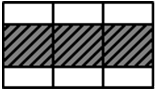 | $d _{s}$ | 파저 | $\mathrm{M} _{s}$ | $\mathrm{M} _{w} (-)$ | 1 |
    | F1-2 | 만재 적하상태 | 고비중 |   | $d _{s}$ | 파고 | $\mathrm{M} _{s}$ | $\mathrm{M} _{w} (+)$ | -1 |
    | F2-1 | 만재 적하상태 | 저비중 |  | $d _{s}$ | 파저 | $\mathrm{M} _{s}$ | $\mathrm{M} _{w} (-)$ | 1 |
    | F2-2 | 만재 적하상태 | 저비중 |   | $d _{s}$ | 파고 | $\mathrm{M} _{s}$ | $\mathrm{M} _{w} (+)$ | -1 |
    | B1-1 | 평형수 적재상태 (Normal) | - | 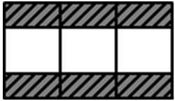 | 평형수흘수^4) | 파저 | $\mathrm{M} _{s}$ | $\mathrm{M} _{w} (-)$ | 1 |
    | B1-2 | 평형수 적재상태 (Normal) | - |   | 평형수흘수^4) | 파고 | $\mathrm{M} _{s}$ | $\mathrm{M} _{w} (+)$ | -1 |
    | B2-1 | 황천평형수 적재상태 (Heavy) | - |  | 평형수흘수^4) | 파저 | $\mathrm{M} _{s}$ | $\mathrm{M} _{w} (-)$ | 1 |
    | B2-2 | 황천평형수 적재상태 (Heavy) | - |   | 평형수흘수^4) | 파고 | $\mathrm{M} _{s}$ | $\mathrm{M} _{w} (+)$ | -1 |
    | (비고) ^1) $d _{s}$ : 강도계산용 흘수 ^2) $\mathrm{M} _{s}$ : 정수중 종굽힘모멘트는 적하지침서에 명시된 값을 취한다. ^3) $\mathrm{M} _{w}$ : 파랑 굽힘모멘트는 **4**항 (1)호 (가) (a)에 따른다. ^4) 평형수흘수는 적하지침서에 명시된 값을 취한다. |   |   |   |   |   |   |   |   |
- **(라)** 유한요소해석
  구조부재는 4절점 판 요소로 모델링하며 응력집중부에서는 판 두께 $t$ 정도의 사각형 요소$(t \times t )$를 사용한다. 용접비드는 유한요소 모델에 포함시키지 않으며 표면응력(surface stress) 분포를 구하기 위하여 강성이 거의 없는 가상의 보(fictitious beam)를 오프셋(offset)을 고려하여 부착하고 구조해석을 수행하여 응력을 평가하거나 판 요소로부터 응력을 평가한다. 이 경우 부식 추가를 포함한 치수(as-built scantling)를 사용하고 전단강성을 고려하여야 한다. 집중응력 계산은 (a) 또는 **규칙 13편 1부 9장 5절 [3]** 및 **[4]** 에 따른다.
  - **(a)** 집중응력 계산
    집중응력은 유한요소해석을 통하여 구한 표면응력 분포를 이용하여 계산한다. **그림 5**는 용접구조에서 연결부재 및 연결방법에 따라 집중응력을 구하는 방법을 나타낸다. 각각의 유한요소 모델에서 용접 각장을 고려하고 노치영향을 배제하기 위하여 용접 토우에서 $0.5 t$와 $1.5 t$ 떨어진 위치의 응력을 사용하여 다음 식과 같이 선형외삽법으로 집중응력을 계산한다.
    $\sigma _{hot} = \frac{3 \sigma (0.5t) - \sigma (1.5t)}{2}$
    $\sigma (X)$ : 용접 토우로 부터 $X$ 만큼 떨어진 지점의 응력으로 다음과 같이 Lagrange 보간법을 이용하여 계산한다.
    $\sigma (X) = c _{1} (X) \sigma _{1 } + c _{2} (X) \sigma _{2 } + c _{3} (X) \sigma _{3 } + c _{4} (X) \sigma _{4}$
    $c _{1} (X) = \frac{(X-X _{2} ) (X-X _{3} ) (X-X _{4} )}{(X _{1} -X _{2} )(X _{1} -X _{3} )(X _{1} -X _{4} )}$
    $c _{2} (X) = \frac{(X-X _{1} ) (X-X _{3} ) (X-X _{4} )}{(X _{2} -X _{1} )(X _{2} -X _{3} )(X _{2} -X _{4} )}$
    $c _{3} (X) = \frac{(X-X _{1} ) (X-X _{2} ) (X-X _{4} )}{(X _{3} -X _{1} )(X _{3} -X _{2} )(X _{3} -X _{4} )}$
    $c _{4} (X) = \frac{(X-X _{1} ) (X-X _{2} ) (X-X _{3} )}{(X _{4} -X _{1} )(X _{4} -X _{2} )(X _{4} -X _{3} )}$
    $\sigma _{1}$, $\sigma _{2}$, $\sigma _{3}$, $\sigma _{4}$ : 용접 토우로 부터 각각 $X _{1}$, $X _{2}$, $X _{3}$, $X _{4}$ 만큼 떨어진 지점의 보요소 응력.
  - **(b)** 모서리응력 계산
    판부재는 4절점 판요소로 모델링하며 모서리부는 판두께 $t$ 정도의 사각형요소($t \times t$)를 사용한다. 모서리응력은 모서리에 강성이 거의 없는 가상의 보를 부착하고 구조해석을 수행하여 구한 보응력을 사용한다.

#### (3) 피로손상계산

유한요소해석에 의한 피로손상계산은 **4**항 (5)에 따른다.

#### (4) 피로강도평가 대상 부재

유한요소해석에 의해서 피로강도를 평가하여야 할 대상부재는 **6**항 (6)에 따른다.

### 6. 스펙트랄 피로해석

#### (1) 일반

스펙트랄 피로해석을 위하여 이 지침에서는 단기 해석적방법(short-term closed-form method)을 적용한다. 파랑빈도자료(wave scatter diagram)의 각 해상상태에 대한 피로손상을 S-N 선도와 Miner-Palmgren 법칙을 적용하여 해석적으로 계산하고, 선박의 수명 동안 받는 총 피로손상은 주어진 해상상태의 발현확률을 고려하여 계산되는 피로손상의 총합으로 구한다.

#### (2) 파랑하중해석은 지침 부록 3-2 II. 전선구조해석의 5항에 따른다. (2020)

#### (3) 집중응력 계산은 5항 (2)호 (라)에 따른다.

#### (4) 단기 응답(short-term response)

- **(가)** 파도는 단기 해상상태에서 정상적(stationary)이라고 가정하므로 그것의 통계적 특성치는 파 스펙트럼(wave spectrum)으로 나타낼 수 있다. 서로 다른 해상상태에 대하여 파 스펙트럼은 다음의 "Bretschneider or 2 Parameter Pierson-Moskowitz Spectrum"에 따른다.
  $S _{\eta } ( \omega |H _{s} ,T _{z} ) = \frac{H _{s} ^{2}}{4 \pi} \left( \frac{2 \pi}{T _{z}} \right) ^{4} \omega ^{-5} \exp \left[ - \frac{1}{\pi} \left( \frac{2 \pi}{T _{z}} \right) ^{4} \omega ^{-4} \right]$
  $\omega$ : 파도의 주파수 ($rad / \sec$)
  $H _{s}$ : 유의 평균 파고
  $T _{z}$ : 파 주기
- **(나)** 선박의 단기 응답 스펙트럼은 응력 전달함수(stress transfer function) $H ( \omega | \theta )$를 사용하여 다음과 같이 계산한다.
  $S ( \omega | H _{s} ,T _{z} , \theta ) = \left| H ( \omega | \theta ) \right| ^{2} S _{\eta } ( \omega |H _{s} ,T _{z} )$
  $\theta$ : 파도의 입사각
  $H( \omega | \theta )$ : 각각의 주파수와 입사각에 대하여 단위 진폭을 갖는 규칙파에 대한 응력응답
- **(다)** 단기 응답 스펙트럼의 면적과 2차 모멘트는 다음 식과 같이 계산한다. *(2020)*
  $m _{0} = \int _{\omega } ^{} { \sum _{\theta _{0} -90 {}^{\circ} } ^{\theta _{0} +90 {}^{\circ} }} f _{s} ( \theta ) S( \omega |H _{s} , T _{z} , \theta )$
  $m _{2} = \int _{\omega } ^{} { \sum _{\theta _{0} -90 {}^{\circ} } ^{\theta _{0} +90 {}^{\circ} }} f _{s} ( \theta ) \left| \omega - \frac{\omega ^{2} V}{g} \cos \theta \right| ^{ 2} S( \omega |H _{s} , T _{z} , \theta )$
  $f _{s} ( \theta )=kcos ^{2} ( \theta )$로 정의되는 퍼짐 함수(spreading function)를 사용한다. 다만, $k$는 다음의 값으로 한다.
  $\sum _{\theta _{0} -90 {}^{\circ} } ^{\theta _{0} +90 {}^{\circ} } f _{s} ( \theta )=1$
  $\theta _{0}$ : 주요 파 입사각
  $\theta$ : 주요 파 입사각 주위의 상대적 퍼짐(relative spreading)

#### (5) 단기 피로손상도(short-term fatigue damage) (2020)

- **(가)** 파랑빈도자료의 유의파고 $H _{si}$ 와 파주기 $T _{zj}$ 에 해당하는 해상상태$(i,j)$ 에서 응력범위$s$ 의 분포를 확률밀도함수(probability density function) $g _{ij}$ 로 나타내면 구간 $s$ 와 $s+ds$ 사이의 응력 사이클 수는 다음 식에 따른다.
  $n _{ij} = T f _{ij } p _{ij } g _{ij } ds$
  $T$ : 선박의 설계수명
  $p _{ij}$ : $H _{si}$ 와 $T _{zj}$ 의 발현확률
  $f _{ij}$ : 응력응답의 영점통과(zero up-crossing) 주파수로서 다음 식에 따른다.
  $f _{ij} = \frac{1}{2 \pi} \sqrt {\frac{m _{2ij}}{m _{0ij}}}$
  $m _{0ij}$, $m _{2ij}$ : 단기 응답 스펙트럼의 면적과 2차 모멘트로서 (2)호 (다)에 따른다.
  $g _{ij}$ : 확률밀도함수로서 다음 (나)에 따른다.
- **(나)** 해상상태$(i,j)$ 에 대한 단기 피로손상도 $D _{ij}$ 는 S-N 선도를 적용하여 다음 식과 같이 계산한다.
  $D _{ij} = \frac{n _{T}}{K _{2}} r _{ij} p _{ij } \int _{0} ^{\infty } {} s ^{m} g _{ij} ds$
  $n _{T}$ : 선박의 수명 동안 받는 총 응력 사이클 수로서 다음 식에 따른다.
  $n _{T} = f T$
  $K _{2}$, $m$ : S-N 선도의 수명축 절편과 역 기울기로 공기 중 환경 조건에서는 **표 1** (a), 부식 환경 조건에서는 **표 1** (b)에 따른다.
  $p _{ij}$ : (가)에 따른다.
  $r _{ij}$ : 주파수와 평균주파수의 비로 다음 식과 같다.
  $r _{ij} = \frac{f _{ij}}{f}$
  $f$ : 평균 주파수로서 다음 식에 따른다.
  $f = \sum _{i} ^{} \sum _{j} ^{} p _{ij} f _{ij}$
  $g _{ij}$ : 단기 해상상태$(i,j)$ 에서 선체구조 응력범위 응답의 확률밀도함수로서 다음 식과 같이 표현된다.
  $g _{ij} = \frac{s}{4 m _{0ij}} \exp \left( - \frac{s ^{2}}{8 m _{0ij}} \right)$
  $m _{0ij}$, $m _{2ij}$ : (가)에 따른다.
  여기서, Haibach 효과를 고려하기 위하여 이중(Bi-linear) S-N 선도를 사용하면 단기 피로손상도는 다음 식과 같다.
  $D _{ij} = 2 ^{\frac{3m}{2}} \frac{n _{T}}{K _{2}} \Gamma \left( \frac{m}{2} +1 \right) \lambda _{ij} \mu _{ij} r _{ij} p _{ij} m _{0ij}^{\frac{m}{2}}$
  $\mu _{ij}$ : 다음 식과 같다.
  $\mu _{ij } = 1 - \frac{\gamma \left( \frac{m}{2} +1, t _{ij} \right) - \frac{1}{t _{ij}} \gamma \left( \frac{m+2}{2} +1, t _{ij} \right)}{\Gamma \left( \frac{m}{2} + 1 \right)}$
  $m, K _{2} , n _{T} ,r _{ij} ,p _{ij} ,m _{0ij}$ : (나)에 따른다.
  $t _{ij} = \frac{s _{7} ^{2}}{8 m _{0ij}}$
  $s _{7}$ : S-N 선도에서 $N = 10 ^{7}$에서의 응력범위
  $\Gamma$ 및 $\gamma$ : 완전 감마함수와 불완전 감마함수
  $\lambda _{ij}$ : Rain flow 수정계수로서 다음과 같이 계산한다.
  $\lambda _{ij} = a + (1-a) (1- \epsilon _{ij} ) ^{b}$
  $a = 0.926 - 0.033 m$
  $b = 1.587 m - 2.323$
  $\epsilon _{ij} = \sqrt {1 - \frac{m _{2ij} ^{2}}{m _{0ij} m _{4ij}}}$

#### (6) 장기 누적 피로손상도(long-term cumulative fatigue damage) (2020)

- **(가)** 모든 해상상태에 대한 발현확률과 입사각 및 하중조건을 고려하여 공기 중에서 장기 누적 피로손상도를 계산하면 다음과 같다.
  $D _{air} = 2 ^{\frac{3m}{2}} \frac{n _{T}}{K _{2}} \Gamma \left( \frac{m}{2} +1 \right) \sum _{i} ^{} \sum _{j} ^{} \sum _{k} ^{} \sum _{l} ^{} \lambda _{ijkl} \mu _{ijkl} r _{ijkl} p _{ijkl} m _{0ijkl}^{\frac{m}{2}}$
  $K _{2}$, $m$ : S-N 선도의 수명축 절편과 역 기울기로 **표 1** (a)에 따른다.
  $p _{ijkl}$ : 조합 확률로서 다음과 같다.
  $p _{ijkl} = p _{ij} p _{k} p _{l}$
  $p _{k}$, $p _{l}$ : 입사각과 하중조건에 대한 확률
- **(나)** 부식을 고려한 경우 장기 누적 피로손상도는 다음 식과 같이 계산한다.
  $D _{cor} = 2 ^{\frac{3m}{2}} \frac{n _{T}}{K _{2}} \Gamma \left( \frac{m}{2} +1 \right) \sum _{i} ^{} \sum _{j} ^{} \sum _{k} ^{} \sum _{l} ^{} \lambda _{ijkl} \gamma _{ijkl} p _{ijkl} m _{0ijkl}^{\frac{m}{2}}$
  $K _{2}$, $m$ : S-N 선도의 수명축 절편과 역 기울기로 **표 1** (b)에 따른다.
  그러나 평형수 탱크 내부의 부재가 부식에 대하여 유효하게 보호되어 있는 경우에는 다음과 같이 누적 피로손상도 D를 계산한다.
  $D = 0.5 D _{air} + 0.5 D _{cor}$

#### (7) 피로강도평가 대상부재

- **(가)** 일반
  - **(a)** 피로강도평가 대상부재는 대상선박의 구조양식 및 구조부재의 중요도 등을 고려하여 결정한다.
  - **(b)** 대상부재의 선정은 기하학적 불연속에 의한 응력집중 때문에 피로균열이 발생할 가능성이 있는 부재 또는 균열로 인하여 구획의 수밀성에 문제가 발생할 수 있는 부위를 중점적으로 선정하여야 한다.
- **(나)** 선종별 피로강도평가 대상부재
  - **(a)** 선종별로 피로강도를 검토 할 필요가 있는 대상부재는 다음과 같다.
    (ⅰ) 유조선 : **표 7**
    (ⅱ) 산적화물선 : **표 8**
    (ⅲ) 컨테이너선 : **표 9**
    - **(iv)** 광석운반선 : **표 10**
  - **(v)** 액화가스운반선(멤브레인 형식) **: 표 11**
    - **(vi)** 자동차 운반선 : **표 12** *(2020)*
  - **(b)** (가)에 나타낸 대상 부재에서 응력범위가 큰 부위를 선택하여 피로강도를 평가하여야 한다.
  - **(c)** (a), (b)에도 불구하고 우리 선급이 필요하다고 판단되는 위치에 대하여 추가로 피로강도평가를 요구할 수 있다.

    | 기호 | 대상부재 | 위치 |   |   |
    | --- | --- | --- | --- | --- |
    | a | 내저판, 경사판 | 이중저 늑판과 빌지호퍼 경사판의 연결부 | 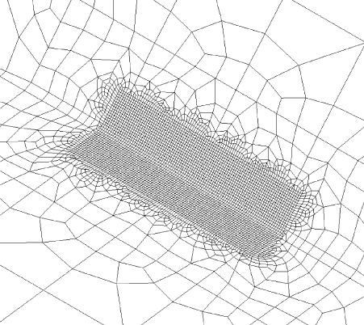 |  a b c c c d d |
    | b | 선측종 격벽판, 경사판 | 선측종격벽과 빌지호퍼 경사판의 연결부 |  |   |
    | c | 내저판, 종통격벽 | 이중저 늑판과 종통격벽의 횡거더의 연결부 | 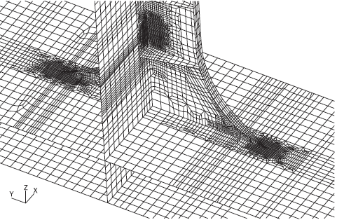 |   |
    | d | 선측종 격벽판, 종격벽판 | 갑판 횡거더와 선측종격벽의 연결부 |  |   |
    | d | 선측종 격벽판, 종격벽판 | 갑판 횡거더와 종통격벽의 연결부 |  |   |

    | 기호 | 대상부재 | 위치 |   |
    | --- | --- | --- | --- |
    | e | 선측종격벽판, 종통격 벽판 | 수평거더와 선측종격벽의 연결부 |  e e e e |
    | e | 선측종격벽판, 종통격 벽판 | 수평거더와 종통격벽의 연결부 |   |
    | f | 선측종격벽판, 종통격 벽판 | 제수격벽과 선측종격벽의 연결부 |  f f |
    | f | 선측종격벽판, 종통격 벽판 | 제수격벽과 종통격벽의 연결부 |   |
    | g | 선측종 격벽판 | 크로스 타이와 선측종격벽의 연결부 | 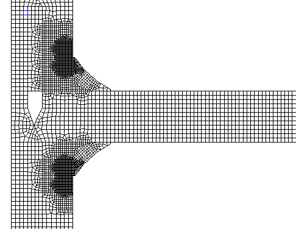 g g |

    | 번호 | 대상부재 | 위치 |   |   |
    | --- | --- | --- | --- | --- |
    | a | 내저판, 빌지호퍼 탱크의 경사판 | 빌지호퍼 탱크의 경사판과 늑판, 거더 및 내저판의 연결부 |  | 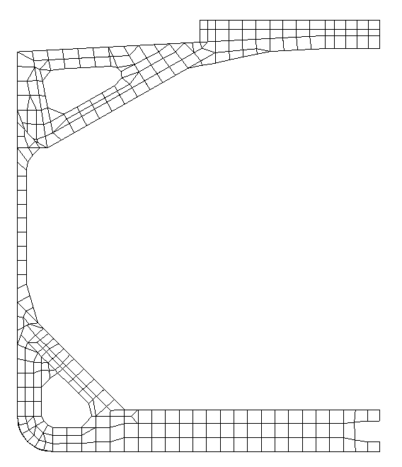 a b c d |
    | b | 빌지호퍼 탱크의 경사판 | 선창내 늑골 하단부와 빌지호퍼탱크 경사판의 연결부 |  |   |
    | c | 톱 사이드 탱크의 경사판 | 선창내 늑골 상단부와 톱 사이드 탱크 경사판의 연결부 | 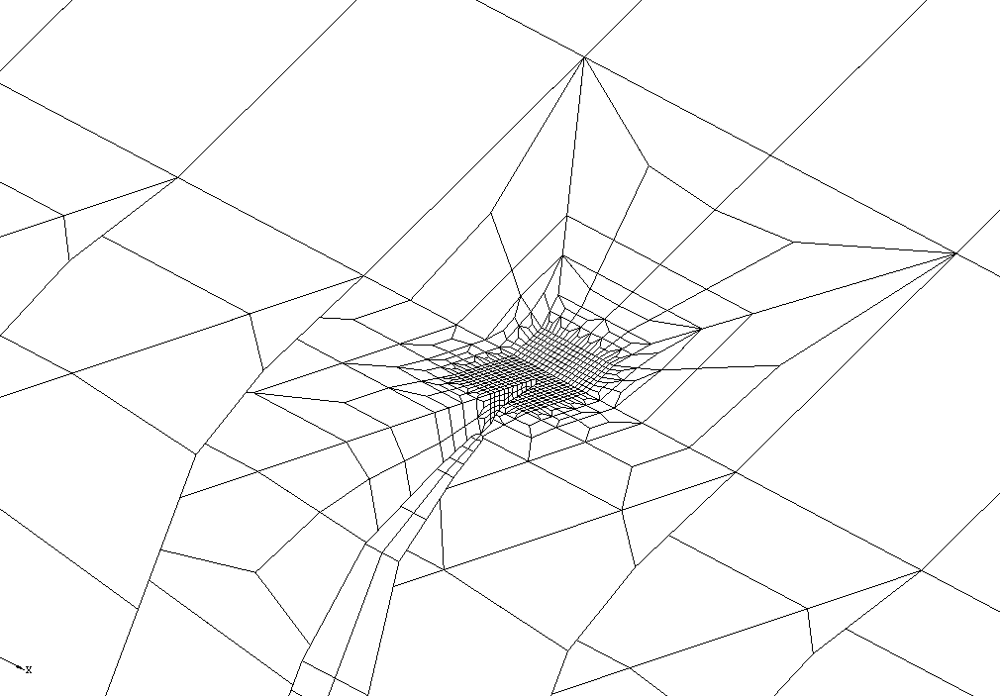 |   |
    | d | 톱 사이드 탱크의 경사판 | 해치코밍 단부와 톱 사이드 탱크 경사판의 연결부 | 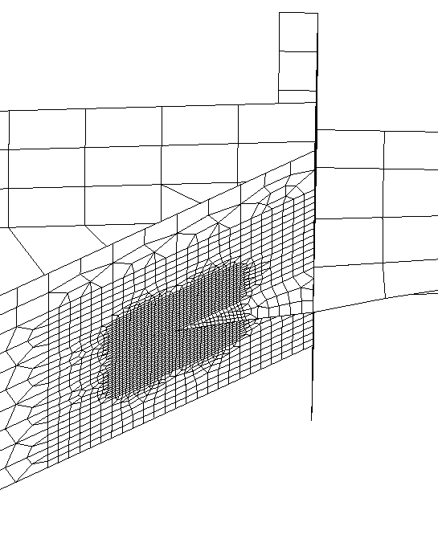 |   |
    | e | 횡격벽 | 하부스툴의 경사판과 횡격벽의 연결부 |  | h e f g |
    | f | 횡격벽 | 상부스툴의 경사판과 횡격벽 상부의 연결부 | 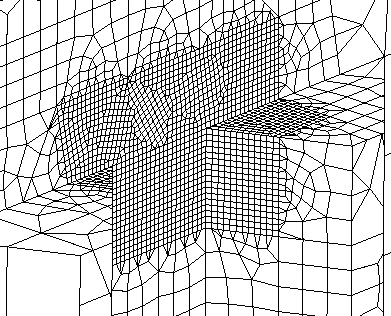 | h e f g |
    | g | 횡격벽 | 톱사이드 탱크의 경사판과 횡격벽 상부의 연결부 | 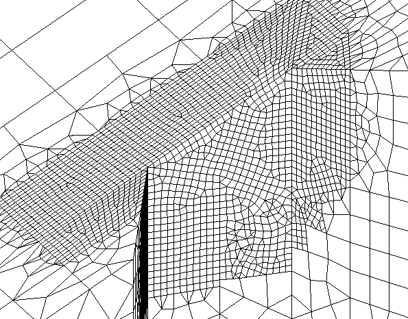 | h e f g |
    | h | 내저판, 하부스툴의 경사판 | 하부스툴의 경사판과 늑판, 거더 및 내저판의 연결부 | 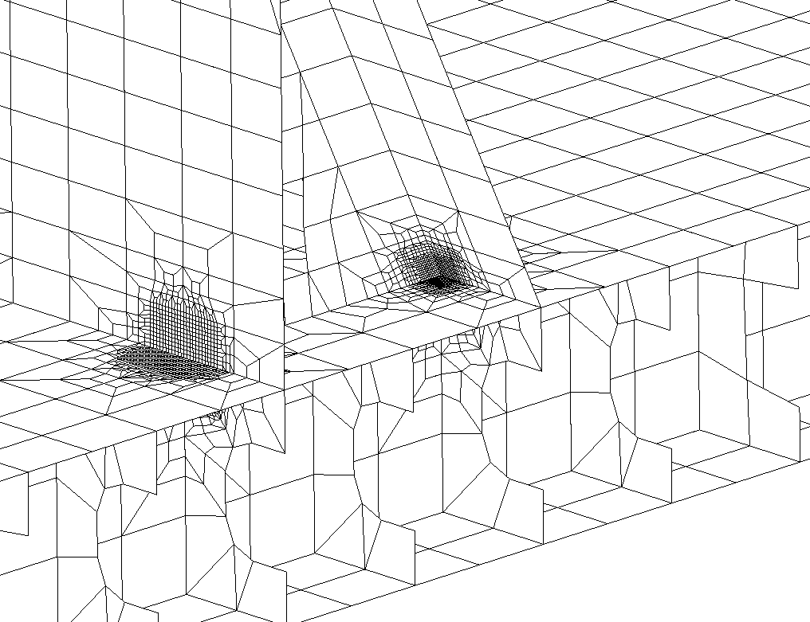 | h e f g |

    | 번호 | 대상부재 | 위치 |   |   |
    | --- | --- | --- | --- | --- |
    | a | 창구 | 선체 중앙부의 대표적인 창구 코밍 및 창구 코너 부 |  |  |
    | b | 창구 | 기관실 전단격벽 전방에 위치한 창구 코밍 및 창구 코너 부 |  |   |
    | b | 창구 | 기관실 전단격벽 전방에 위치한 창구 코밍 및 창구 코너 부 |  |   |
    | c | 창구 | 선수격벽 후방에 인접한 창구 코밍 및 창구 코너 부 |  |   |
    | d | 창구 | 선체 중앙부의 대표적인 창구 코밍 및 창구 코너 부 | 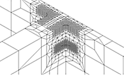 | 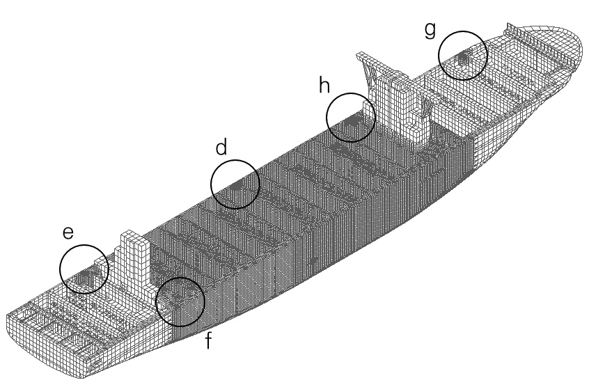 |
    | e | 창구 | 기관실 전단격벽 후방에 위치한 창구 코밍 및 창구 코너 부 |  |   |
    | e | 창구 | 기관실 전단격벽 후방에 위치한 창구 코밍 및 창구 코너 부 | 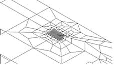 |   |
    | f | 창구 | 기관실 전단격벽 전방에 위치한 첫 번째 격벽의 창구 코밍 |  |   |
    | g | 창구 | 선수격벽 후방에 인접한 창구 코밍 및 창구 코너 부 | 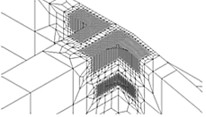 |   |
    | h | 창구 | 거주구 앞뒤 창구 코밍 및 창구 코너 부 |  |   |

    | 번호 | 대상부재 | 위치 |   |   |
    | --- | --- | --- | --- | --- |
    | a | 내저판, 경사판 | 이중저 늑판과 빌지호퍼 경사판의 연결부 |  |  a b |
    | b | 창구 | 종방향 창구 코밍 브라켓 끝단부 | 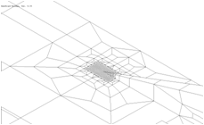 |   |
    | b | 창구 | 창구 코너부 | 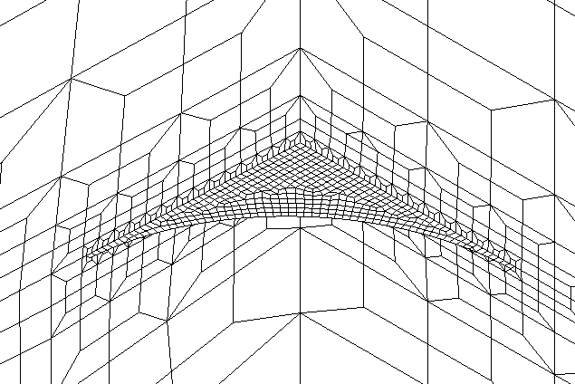 |   |
    | c | 내저판, 하부스툴의 경사판 | 하부스툴의 경사판과 늑판, 거더 및 내저판의 연결부 |  |  c d |
    | d | 횡격벽 | 하부스툴의 경사판과 횡격벽의 연결부 |  |   |

    | 기호 | 대상부재 | 위치 |   |   |
    | --- | --- | --- | --- | --- |
    | a | 내저판, 경사판 | 이중저 늑판과 빌지호퍼 경사판의 연결부 |  | 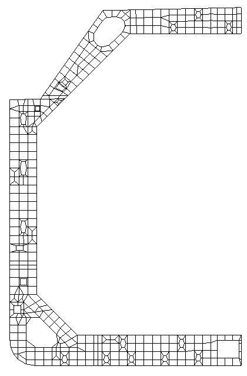 a c d b |
    | b | 선측종격벽판, 경사판 | 선측종격벽과 빌지호퍼 경사판의 연결부 |  |   |
    | c | 선측종격벽판, 내측 트렁크 경사판 | 선측종격벽과 내측 트렁크 경사판의 연결부 |  |   |
    | d | 내측 트렁크 경사관, 내측 트렁크 갑판 | 내측 트렁크 경사관과 내측트렁크 갑판의 연결부 |  |   |
    | e | 내저판, 횡격벽 | 횡격벽과 늑판, 거더 및 내저판의 연결부 |  | 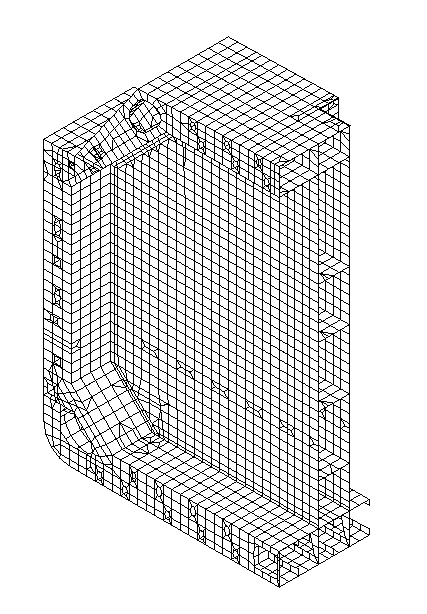 e f |
    | f | 스트링거 | 선측스트링거 및 횡격벽 스트링거의 연결부 | 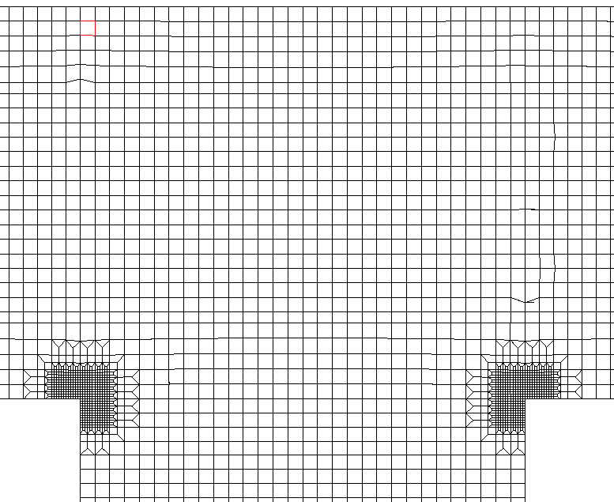 |   |

    | 기호 | 대상부재 | 위치 |   |   |
    | --- | --- | --- | --- | --- |
    | a | 기둥, 갑판 | 갑판과 기둥의 연결부 (상부) | 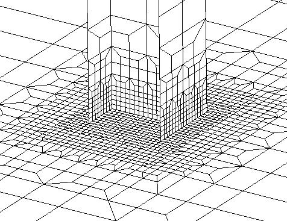 | 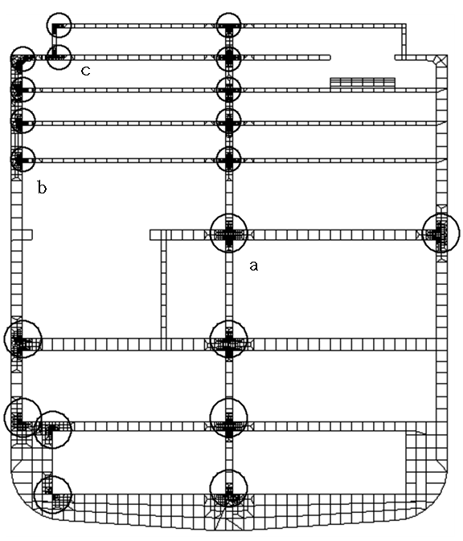 |
    | a | 기둥, 갑판 | 갑판과 기둥의 연결부 (하부) | 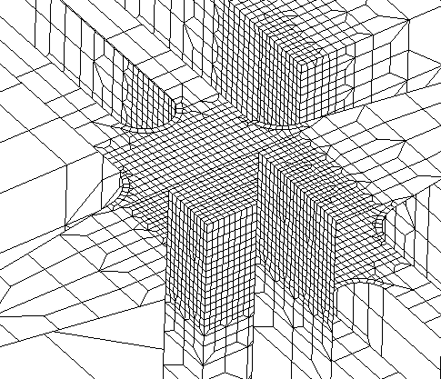 |   |
    | b | 선측 트랜스버스, 갑판 | 선측 트랜스버스와 갑판의 연결부 (상부) | 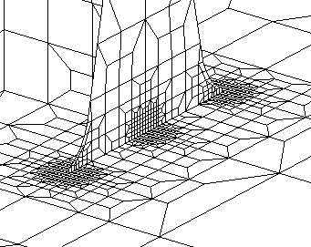 |   |
    | b | 선측 트랜스버스, 갑판 | 선측 트랜스버스와 갑판의 연결부 (하부) | 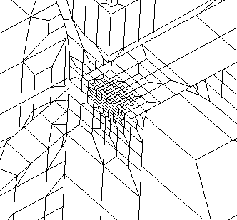 |   |
    | c | 브래킷, 갑판 | 선루와 갑판의 연결부 | 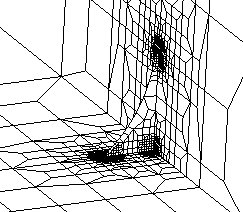 |   |
    | d | 개구부 | 엔진룸의 개구부 |  |  d |

### 7. 전달함수법

#### (1) 일반

스펙트랄 피로해석은 응력전달함수를 구하기 위하여 입사각과 주파수별로 많은 구조해석을 수행하여야 한다. 그러나 전달함수법에서는 선체에 작용하는 하중을 몇 개의 주요성분으로 구분하여 하중전달함수를 구하고 여기에 단위 하중성분에 대한 응력을 나타내는 응력영향계수를 곱하여 응력전달함수를 구함으로써 구조해석 수를 줄인다. 또한 전달함수법은 수선 근처에서 파랑압력범위의 비선형성을 고려할 수 있다.

#### (2) 응력전달함수

응력전달함수는 단위하중에 대한 응력영향계수에 하중전달함수를 곱하여 구하게 되며, 다음 식과 같이 각 성분별 응력전달함수의 선형조합으로 계산한다.

- **(가)** 선체거더 하중
  $A _{i}$ : 단위 선체거더 하중에 의한 응력을 나타낸다.
  $A _{1}$ : 단위 수직 굽힘모멘트에 의한 응력
  $A _{2}$ : 단위 수평 굽힘모멘트에 의한 응력
  $A _{3}$ : 단위 비틀림 모멘트에 의한 응력
  $F _{i} ( \omega , \theta )$ : 선체거더 하중에 대한 전달함수를 나타낸다.
  $F _{1} ( \omega , \theta )$ : 수직 굽힘모멘트에 대한 전달함수
  $F _{2} ( \omega , \theta )$ : 수평 굽힘모멘트에 대한 전달함수
  $F _{3} ( \omega , \theta )$ : 비틀림 모멘트에 대한 전달함수
- **(나)** 파랑 압력
  $P _{ij} ( \omega , \theta )$ : 선박의 $i$ 번째 스테이션에서 5차 파워(power) 함수의 계수 $P _{j}$에 대한 전달함수로서 다음 식으로부터 구한다.
  $P(b) \cong \sum _{j=1} ^{6} P _{j} bj ^{j-1}$
  
  $P(b)$ : 거스방향(Girth-wise) 좌표에 따른 파랑압력 분포
  $b$ : 거스방향(Girth-wise) 좌표로서 용골은 $b=0$이다.
  $P _{j}$ : 선체운동해석을 통해 구한 $i$ 번째 스테이션의 파랑압력분포로부터 회귀해석으로 구한 파워 함수의 계수
  $B _{ij}$ : 선박의 $i$ 번째 스테이션에서 $j$ 차 단위 압력분포에 의한 응력이며, $j$ 차 단위 압력분포는 다음에 따른다.
  $j=1$ : 균일 분포 압력(1)
  $j=2$ : 선형 분포 압력$(b)$
  $j=3$ : 2차 분포 압력$(b ^{2} )$
  $j=4$ : 3차 분포 압력$(b ^{3} )$
  $j=5$ : 4차 분포 압력$(b ^{4} )$
  $j=6$ : 5차 분포 압력$(b ^{5} )$
- **(다)** 화물 하중
  $C _{ij}$ : 선박의 $i$ 번째 스테이션에서 단위 관성력에 의한 응력을 나타낸다.
  $C _{i1}$ : $i$ 번째 스테이션에서 단위 수직 관성력에 의한 응력
  $C _{i2}$ : $i$ 번째 스테이션에서 단위 수평 관성력에 의한 응력
  $W _{ij} ( \omega , \theta )$ : 선박의 $i$ 번째 스테이션에서 화물중량의 관성력에 의한 전달함수
  $W _{i1} ( \omega , \theta )$ : $i$ 번째 스테이션에서 수직 관성력에 대한 전달함수
  $W _{i2} ( \omega , \theta )$ : $i$ 번째 스테이션에서 수평 관성력에 대한 전달함수
- **(라)** 수선근처에서 파랑압력범위의 비선형성을 고려하기 위하여 다음과 같이 경감계수 $\alpha$ 를 도입한다.
  수선상부 : $\alpha = 0.5 \left( 1- \frac{h}{a _{w}} \right)$
  수선 : $\alpha = 0.5$
  $a _{w}$ 하부 : $\alpha = 1.0$
  수선과 $a _{w}$ 사이는 보간법에 따라 계산하며 $h$ 및 $a _{w}$ 는 **4**항 (1) (나) (a)에 따른다.

#### (3) (2)호에서 구한 응력전달함수를 이용하여 6항 (3)호에 따라 선박의 단기응답 스펙트럼을 계산하고, 단기 피로손상도 및 장기 누적 피로손상도는 6항 (4)호 및 (5)호를 적용한다. 이 항에서 특별히 명시하지 않는 경우, 6항의 요건에 따라야 한다. #imgID-464_s2
