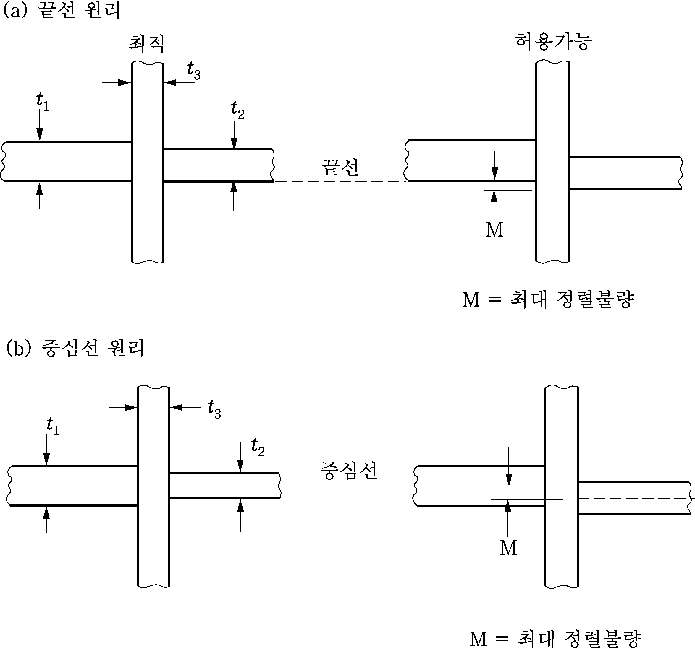
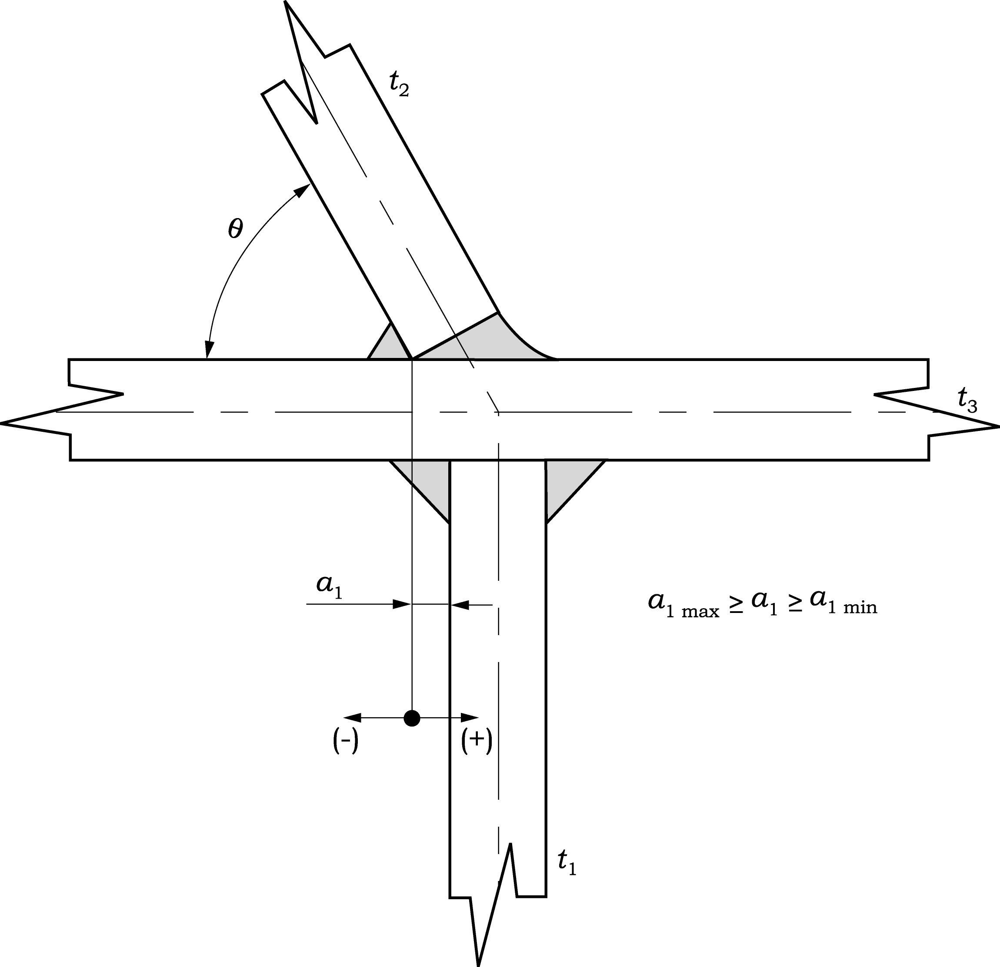
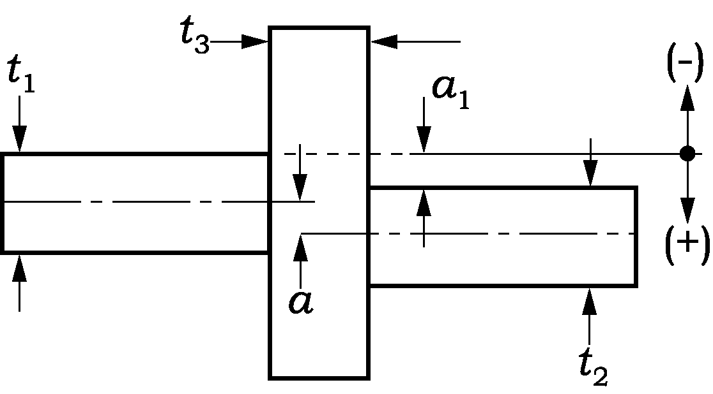
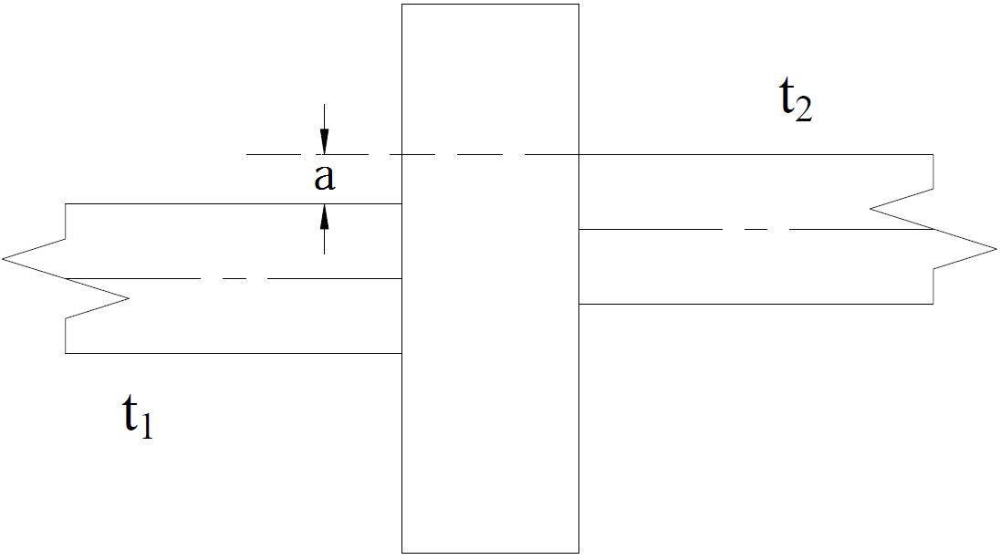
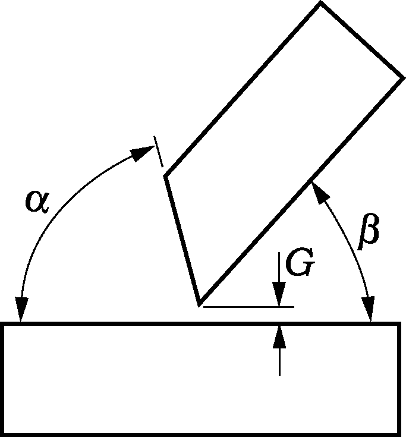
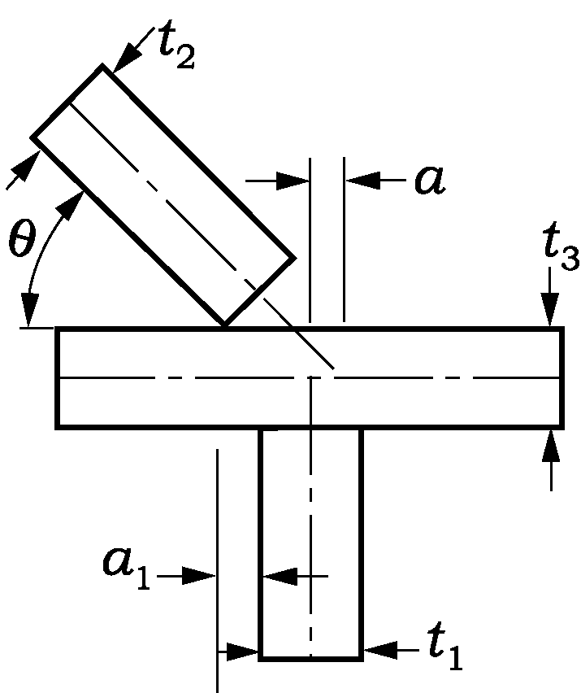
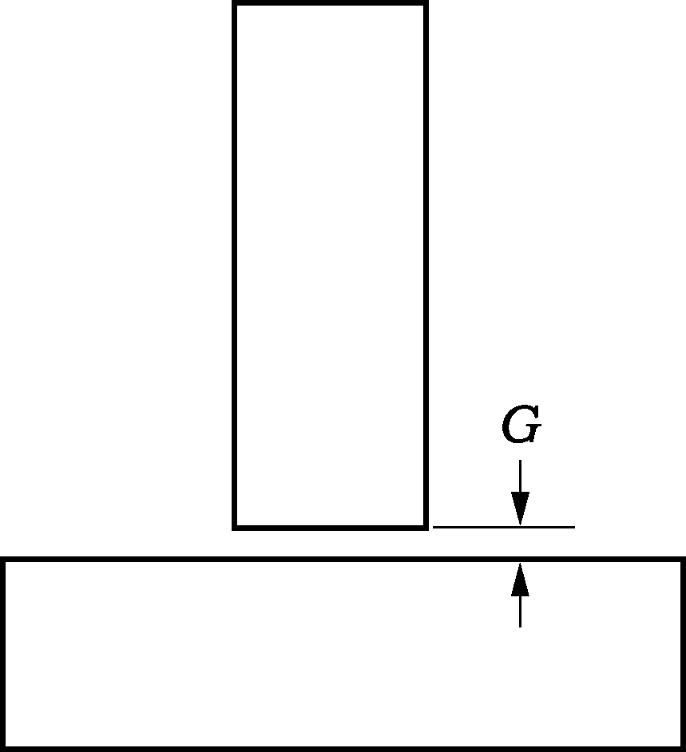
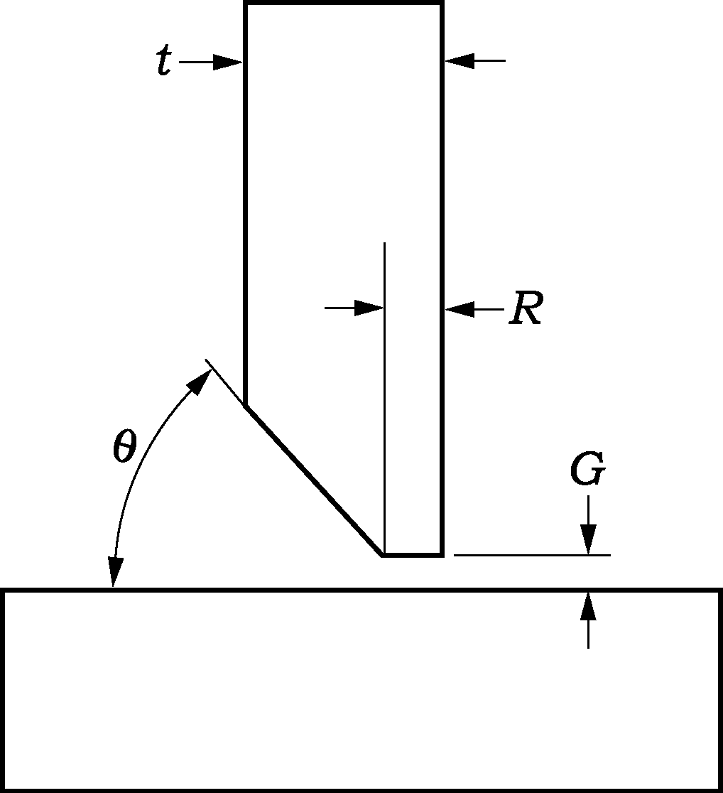
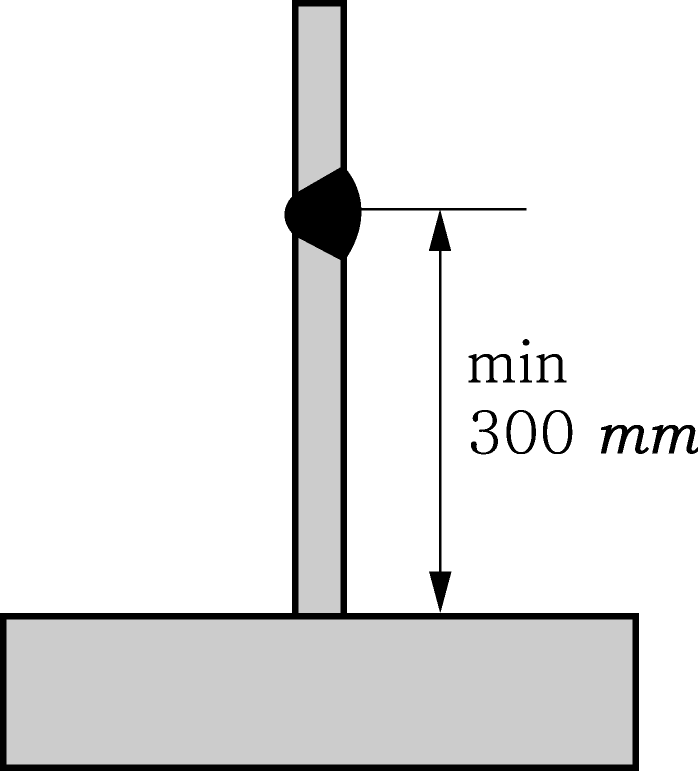

# 제3편 선체구조

> 선급 및 강선규칙/적용지침 / RA-03-K / 2025 / KO / Guidance

## 부록 3-4 선체건조감시 절차에 관한 지침

### 1. 일반사항

#### (1) 소개

- **(가)** 선박의 일반적인 품질은 우수한 구조설계, 개선된 시공절차 및 효과적인 생애감시체제에 의하여 향상된다. 구조적인 측면에서 구조부재 또는 연결부재의 거동은 상세설계 및 시공의 양측에 대한 적절한 품질관리에 따라 좌우된다. 상세설계, 시공방법 및 품질관리의 수준은 구조의 피로거동에 큰 영향을 미친다. 이것은 특히 구조적으로 취약한 부위에서 분명히 나타난다.
- **(나)** 정렬불량, 부적절한 모서리 가공, 과대한 간격, 용접절차 및 용접품질은 연결부위의 피로특성을 변화시킨다. 설계단계에서 피로거동에 영향을 주는 요소들에 대한 적절한 관리를 하고 취약한 부위에 대한 강화된 감시절차를 수행하는 것은 높은 수준의 작업 기량을 얻고 다음단계의 건조과정에서 불필요한 수정작업을 피하게 한다.
- **(다)** 선체건조감시절차에 “구조강도평가” 및 “피로강도평가”를 연결시킴으로써 선박의 생애에 걸쳐 원활한 품질관리를 할 수 있다.
- **(라)** 선체건조감시절차는 선체구조의 취약한 부위에 대한 설계, 건조 및 감시에 대한 기본요소로 구성된다. 선체건조감시절차의 적용은 구조적으로 취약한 부위에서 선체 건조 시 선주 및 선급의 만족을 향상시킬 뿐만 아니라 조선소의 품질관리 절차를 향상시킨다.

#### (2) 목적

- **(가)** 선체건조감시절차의 주목적은 구조적으로 취약한 선체구조부위가 허용품질기준 및 승인된 선체건조절차에 따라 건조됨을 확인 하는데 있다.
- **(나)** 선체건조감시절차는 정기검사와 동시에 건조되는 선박에 적용하는 규정에 추가하여 적용하며, 요구되는 구조적 거동을 확보하기 위하여 관련되는 선체구조의 취약한 부위에 대한 정렬, 조립, 모서리가공 및 작업기량의 강화된 품질관리를 적용하는 것을 기본으로 한다.
- **(다)** 부가적인 목적은 선체건조감시계획서를 사용하여 선박의 운항생애 동안 시행되는 모든 선급검사 시 취약부위에 주의를 기울일 수 있도록 하는 데 있다.

#### (3) 절차의 개요

- **(가)** 건조를 하기 전 개최하는 회의 시에 선체건조감시절차의 상세절차에 대하여 조선소 및 선주에게의 권고 및 설명을 포함하여야 한다.
- **(나)** 도면개발 및 승인의 단계에서 선체건조감시절차는 구조평가 및 피로평가의 결과를 근거로 하여 높은 응력 또는 피로손상을 받을 수 있는 선체구조의 지역 및 부위를 정한다. 취약지역은 구조해석 및 운항경험에 대한 자료에 따라 주위의 구조보다 높은 결함발생 가능성이 있는 선체구조의 지역을 말한다. 취약부위는 피로하기 쉽고 따라서 필요시 상세설계를 개선해야 하는 취약지역 내의 취약지점을 말한다. 피로평가에서 강화된 피로강도가 요구되는 종강도 구조부위에 대하여는 특별한 주의를 기울여야 한다.
- **(다)** 강도 및 피로거동의 만족도를 높이기 위하여, 선체건조감시기준에 따라 선체건조감시부호를 받고자 하는 각 선박에 대하여 선급과 조선소 사이에 상세한 건조허용치가 협의되어야 한다. 조선소는 요구되는 건조허용치와 취약부위선정 및 적용되어야 하는 품질관리와 품질보증에 대한 개요를 나타내는 선체건조감시계획서를 준비하여야 한다. 완성된 선체건조감시계획서는 선급으로부터 검토 및 승인되어야 한다.
- **(라)** 조선소의 품질담당자는 승인된 조선소절차 및 선급의 규정에 따라 선박의 건조 중에 발생하는 검사 및 결과의 기록에 대한 책임이 있다. 선급검사원은 정렬, 조립, 작업기량 및 건조허용치가 선체건조감시계획서에 명시된 협의 기준에 따르는지를 확인하기 위한 검사를 시행한다. 승인된 건조허용치를 초과하는 경우 선체건조감시계획서를 만족시키기 위한 수정작업을 하여야 한다.
- **(마)** 선체건조감시요건을 만족하게 완결한 경우, 선급은 선체건조감시 부기부호 **"SeaTrust (HCM)"**을 부여한다. 선박의 완성시점에 선급검사원은 승인된 선체건조감시계획서의 사본을 본부에 송부한다.
- **(바)** 선박의 선체건조감시계획서는 일생동안 본선에 비치되어 구조의 보전성 및 거동을 감시하고 정기적 검사에서 취약부위에 집중할 수 있도록 사용한다.
- **(사)** 선체건조감시절차는 **표 1** 및 **그림 1**에서와 같이 순차적으로 적용하여야 하는 세 가지 단계로 구분된다.

  | 건조감시 I 단계 | 도면승인 | 취약부위 선정을 위한 분석 |
  | --- | --- | --- |
  | 건조감시 II 단계 | 제조중검사 | 건조기준에 만족하도록 보증하는 검사 |
  | 건조감시 III 단계 | 선체건조감시절차의 평생적용 | 선체건조감시절차를 사용하여 구조보전성에 대한 감시 |

#### (4) 적용범위

- **(가)** 본 규정은 신청자의 신청에 따라 적용한다.
- **(나)** (가)의 규정에도 불구하고 **산적화물선 및 유조선 공통구조규칙**(규칙 13편)에 따라 건조되는 선박에는 이를 적용한다.
- **(다)** 이 절차는 구조평가 및 피로평가를 위한 절차의 적용에 따라 취약부위로 선정된 구조지역에 대하여 적용한다.
- **(라)** 이 절차는 정기검사와 동시에 건조되는 선박에 적용되는 선급규정과 함께 적용한다.
- **(마)** 선박의 구조에 대하여 필요시 시행되는 모든 일련의 수정 및 수리는 이 절차에 따라야 한다.

#### (5) 선급 부기부호

이 절차의 만족스런 적용완료 시점에서 선체 선급부호에 추가하여 선체건조감시 부기부호 **"SeaTrust (HCM)"**를 부여받을 자격이 주어진다.

### 2. 선체건조감시기준

#### (1) 선체건조감시기준

- **(가)** 선체건조감시기준은 선체건조감시부호에 따른 규정에 적합하기 위하여 취약부위에 대하여 만족되어야 하는 건조감시허용치를 정한다. 선체건조감시기준은 다음 사항에 적용한다.
  ․ 정렬
  ․ 조립
  ․ 수정조치
- **(나)** 취약부위를 선정하는 경우 구조평가 또는 피로평가에서 식별되고 조립장 또는 건조도크와 같이 환경관리가 어려운 곳에서 조립되는 단위연결부 및 취약연결부와 같은 취약부위에 대하여 특별한 고려를 하여야 한다.
- **(다)** 모든 경우에 있어서 이 기준에 표시되지 아니한 건조기준 및 허용공차는 최소한 승인된 조선소, 국내 또는 국제 조선건조기준과 동등하여야 한다.
- **(라)** 취약구조부재의 정렬, 조립 및 수정에 대한 품질기준은 **표 2** 내지 **표 5**에 따른다.

#### (2) 선체건조감시기준 개요

- **(가)** 선체건조감시기준은 조선소에서 채택하고 선급이 인정한 조선건조기준을 전체적으로 대체하는 것은 아니다. 이는 선박일생에 걸쳐 높은 수준의 구조거동을 향상시키기 위한 검사절차에 의하여 지원되는 부가기준이다.
- **(나)** 식별된 취약지역에 대한 구조상세의 제작은 다음에 따라서 시행되어야 한다.
  ․ 선급규칙
  ․ 승인된 선체건조감시계획서에 포함된 건조허용치
  ․ Inspection Standard for Shipbuilding Supervision (한국선급)
  ․ Shipbuilding & Repair Quality Standard (IACS)
  ․ 비파괴검사기준

#### (3) 구조부재정렬

- **(가)** 잘못된 조립 및 정렬의 수정을 위한 보수방안을 시종일관하게 적용하는 것은 건조절차에 문제가 존재하고 있음을 알려주는 것이다.
- **(나)** 탑재장에 들어가는 블록에 대한 용접불량은 탑재단계에 막대한 영향을 미칠 것이다. 만약 적절한 치수관리가 이행되지 않는다면 끝단부의 절단이 필요할 수도 있다. 이는 주위블록과의 정렬불량을 증가시키는 원인이 된다.
- **(다)** 용접연결구조의 취약한 형식은 이중선체유조선의 슬로핑호퍼판(sloping hopper plate), 내저판(inner bottom plating) 및 선측 종거더(outer longitudinal girder)의 연결부와 같은 각진 십자형연결이다. 이러한 부위에서, 훌륭한 정렬을 보장하기 위하여 적절한 치수관리는 필수불가결한 것이다.
- **(라)** 정확한 조립 및 정렬 맞추기 위한 보조수단으로 100마킹(100 mm offset lines)과 같은 적당한 방법을 적용하고 유지하여야 한다. 취약구조부재에 대하여는 판의 양측에 영구적인 방법으로 어떤 기준선을 표시하고 필요시 지그 또는 템플릿을 사용하여 실제의 정렬상태를 확인하여야 한다.
- **(마)** 일반적으로 다음 두 가지의 정렬방법이 사용된다. 중심선원리 및 끝선원리이다. 이들 원리는 **그림 2**에 대략적으로 설명되어 있다. 다만, 가혹한 조건에서의 운항이 예상되는 선박인 경우에는 좀더 정확한 정렬상태를 유지하기 위하여 특별히 고려하여야 한다. 정렬유지에 대한 고려에 추가하여, 이 절차에서 상세되어 있는 것보다 더 엄격한 허용공차를 적용하는 것이 선호될 수 있다. 정렬상태 유지에 대한 어려움을 해소하기 위하여 취약부위 부근의 구조부재의 두께가 정확함이 확인되어야 한다.
  
  **그림 2 권고할 만한 종강도부재의 정렬**
- **(바)** 기본설계기준에 추가하여, 일부 이음부는 적용경험에 의하여 높은 수준의 정렬을 요구할 수도 있다. 이러한 이음부는 선형 및 구조적 배치에 따라 달라지지만 일반적으로 다음의 이음부는 특별한 고려가 요구된다.
  - 산적운반선 및 유조선의 하부호퍼너클
  - 산적운반선에서 종거더 부근의 플로어에 연결된 하부스툴
  - 멤브레인형 가스운반선에 있는 하부코퍼댐격벽의 십자형이음부
  - 멤브레인형 가스운반선에 있는 상부호퍼너클
  - 멤브레인형 가스운반선에 있는 후부화물구역의 끝단부
  - 멤브레인형 가스운반선에 있는 전부화물구역의 끝단부
- **(사)** 구조부재의 정렬을 검증 시, 중심선에서 정렬을 직접 계측하기가 불가능하기 때문에 중심선에서의 정렬의 직접계측을 대신하여 끝선접근법을 사용한다는 것을 주목하여야 한다. 끝선접근법을 사용할 경우, 최대 중심선 허용치는 **그림 3**에 주어진 계산식을 사용한 끝선값으로 변환할 수 있다.
- **(아)** 이중저 또는 내저 종늑골과 같은 2차 보강재에 의해 2개 이상의 취약한 장소가 연결된 경우 정렬을 확실히 유지할 수 있도록 세심한 주의를 하여야 한다.

#### (4) 건조 시 고려사항

- **(가)** 소조립 단계에서, 취부 전에 후부표시(back marking)와 같은 방법을 사용하면 높은 정확도를 얻을 수 있다.
- **(나)** 블록 과 선행(pre-erection) 구조물은 일반적으로 크기가 작으므로 일반적으로 품질관리를 통하여 조립공장내에서 높은 정확도를 얻을 수 있다.
- **(다)** 취약한 연결부위가 보다 큰 탑재연결의 일부가 될 경우 구조물의 크기 및 다른 외부 요소로 인해 교차부의 정렬, 취부 및 용접품질의 관리가 더 어려워진다. 건조의 모든 단계 중에서 특히 외부에서 조립 및 탑재를 할 경우 필요에 따라 용접면의 전반 및 국부를 차폐 및 예열하여야 한다. 표면은 건조시켜야 하며 용접이음매가 급속히 냉각되지 않도록 하여야 한다.
  
  $a _{1\max} = \frac{1}{2} ( \frac{t _{2}}{\sin \theta} + \frac{t _{3}}{\tan \theta} - t _{1} )+M$ $M= \frac{t _{\min}}{3} ( \mathrm{\max} it 5 Rm mm)$
  $a _{1\min} = \frac{1}{2} ( \frac{t _{2}}{\sin \theta} + \frac{t _{3}}{\tan \theta} -t _{1} )-M$ $t _{\min} =\min [ t _{1,} t _{2,} t _{3} ]$
  $a _{1\max}$ = $t_2$ 부재의 왼쪽으로 위치할 수 있는 최대 끝선허용치
  $a _{1\min}$ = $t_2$ 부재의 오른쪽으로 위치할 수 있는 최대 끝선허용치
  $\theta$ = 수평면과 경사면의 각도
  $t_1$ = 거더 또는 횡부재의 두께, $t_2$ = 경사면의 두께, $t_3$ = 수평판의 두께
  **동등한 허용치의 비교표**

  | $t_1$ | $t_2$ | $t_3$ | $\theta$ | $a _{1\max}$ | $a _{1\min}$ | 중심선허용치 |
  | --- | --- | --- | --- | --- | --- | --- |
  | 12 12 14 14 | 22 26 22 26 | 20 20 20 20 | 60 60 45 45 | 16.5 18.8 23.2 26.0 | 8.5 10.8 13.9 16.7 | 4 4 4.7 4.7 |

  **그림 3 동등한 끝선 허용치**

#### (5) 품질관리 및 품질보증

- **(가)** 건조기준은 품질계획을 포함하여 검사절차의 일부로서 승인을 받아야 한다.
- **(나)** 취약부에 적용하는 건조기준 및 허용공차는 선급과 조선소가 서로 합의하여야 한다.
- **(다)** 어떠한 경우에도 적용하는 허용공차 및 기준은 IACS의 “Shipbuilding and Repair Quality Standard"에 규정된 것 이상이어야 한다.
- **(라)** 승인된 구조 및/또는 절차와 차이가 발생한 경우에는 이를 선급에 제출하여야 한다.

### 3. 1 단계 - 도면 개발 및 승인

#### (1) 목적

- **(가)** 이 단계의 첫째 목적은 이 문서의 **1**항 (3)호 (나)에 정의된 취약부위를 선정하는 것이다.
- **(나)** 두 번째 목적은 승인을 받기 위하여 선급에 제출할 선체건조감시절차를 만드는 것이다.

#### (2) 취약부위의 식별

- **(가)** 선급은 운항중인 선박에 대한 경험을 통하여 피로가 발생하기 쉬운 취약부위를 결정하는데 있어서 조선소에 도움이 되는 정보를 제공할 수 있다. 특히 강조되는 것은 높은 응력이 예상되어 정확한 정렬이 취약한 구역을 정하는 것이다.
- **(나)** 취약부위는 선체건조감시계획서의 적절한 구조도면에 포함되어 명확하게 정의 및 표시되어야 하고 승인을 위하여 제출되어야 한다.

#### (3) 선체건조감시계획서

- **(가)** 선체건조감시계획서는 선박에서 취약하다고 정의된 구조의 영역에 적용한 향상된 건조품질관리를 보증하기 위하여 사용되어진 품질기준 및 절차에 대하여 조선소에 의해서 만들어진 문서이다.
- **(나)** 선체건조감시계획서는 모든 신조업무에 대한 검사를 시작하기에 앞서 우리선급에 승인을 위하여 제출되어야 한다. 선체건조감시계획서는 건조공정에서의 현실성, 구조해석 및 피로해석이 반영되었는지를 확인하기 위하여 선급의 현장검사원과 도면승인검사원에 의해 검토되어야 한다. 또한 승인 후에는 현장검사원은 관련자가 선체건조감시계획서를 충분히 이해하고 적합하게 적용할 수 있도록 조치하여야 한다.
- **(다)** 선체건조감시계획서는 조선소에 의해 제공된 품질계획서에 추가하여 적용한다.
- **(라)** 선체건조감시계획서의 승인을 받는 대로 선급검사원과 함께 조선소는 사용된 조선소 표준에 추가하여 선체건조감시계획서에 포함된 모든 요구조건이 적합하다는 것을 확인하여야 한다.
- **(마)** 선체건조감시계획서는 다음의 자료를 포함하여야 한다.
  - 취약부위가 명확하게 표시된 적절한 구조도면
  - 취약부위의 적절한 구조 허용오차의 상세
  - 모든 취약부위의 허용공차가 표시된 요약표
  - 사용된 정렬확인방법
  - 블록건조, 선행탑재 및 선대조립 과정에서의 품질관리의 개요
  - 사용된 품질보증절차 개요
  - 검사결과의 기록 및 보고에 대한 방법
  - 수정조치방법의 상세기준
  - 비파괴검사 계획(별도로 제출하는 경우에는 선체건조감시계획서에 포함되지 않을 수 있다)
- **(바)** 승인된 선체건조감시계획서의 사본은 전자파일 또는 인쇄물 형태로 선박의 일생동안 본선에 비치 보관하여야 한다. 선체건조감시계획서는 선박 운항의 유효성에 대하여 설계 과정에서 취약하다고 정의된 구조물의 영역에 대한 검사를 위하여 사용되어야 한다.

### 4. 2단계 - 선체건조감시

#### (1) 조립 및 선행탑재

- **(가)** 선급검사원과 조선소의 품질관리자는 조선소의 품질관리 및 선체건조감시에 대한 검사절차에 합의하고 선주는 합의된 검사절차를 인지하여야 한다.
- **(나)** 전반적이거나 국부적인 용접구역에 대하여 필요할 경우 일반적으로 보호막과 예열을 하여야 한다. 표면은 건조시켜야 하고 용접부위의 급속한 냉각을 방지하여야 한다. 어떤 임의의 용접방법에 대하여도 용접절차는 선급의 승인을 받아야 한다. 이에 추가하여, 조선소는 고용된 모든 용접사가 선급의 승인된 자격을 갖추도록 하여야 한다.
- **(다)** 조립도와 사양서 및 조립과정의 각 단계에 대한 절차와 필요한 작업안내서는 적절한 검사가 유효하도록 만들어져야 한다. 조선소는 조립 과정의 적절한 단계에서 취약부위의 검사상태를 유지한다. 이것은 부재에 직접적인 표시를 포함할 수 있다. 사용된 표시방법은 입회한 선급검사원과 논의 및 합의를 하여야 한다.
- **(라)** 필요한 경우 취약부위에 대하여 용접에 앞서 조립검사를 선급검사원이 실시할 수 있다. 또한, 관련 구조부재에 대한 검사결과 및 기록은 선급검사원이 쉽게 참고할 수 있어야 한다.
- **(마)** 재료준비 단계에서부터 선행탑재의 조립에까지 작업자들의 기량에 대하여 선체건조감시계획서에 정의된 관련 표준에 따라 확인되어야 한다. 허용치를 초과하는 기량부족 및 부적합 사항에 대하여 생산의 다음 단계로 진행하기 전에 선급검사원이 만족하도록 수정하여야 한다.

#### (2) 탑재

- **(가)** 일반적으로 탑재용접의 절차는 건조 전에 선급검사원의 승인을 받아야 한다. 탑재의 각 단계에서 특히 주의할 것은 취부, 정렬 및 용접이 승인된 도면과 승인된 선체건조감시계획서의 허용치에 따르고 있다는 것을 확인하는 것이다.
- **(나)** 취약한 연결부가 또한 탑재 연결부가 될 경우 요구되는 구조물의 건조 허용치를 준수하는지 확인하기 위한 검사가 이루어져야 한다. 탑재과정에서는 적절한 조립과 정렬을 위하여 판을 떼어놓거나 자르는 것은 통상적이다. 이 과정에서 종종 주위 구조물의 강도에 해로운 손상을 주는 결과를 초래한다. 이와 같은 곳의 구조물에 재용접을 하는 경우 완전 용입 용접을 적용한다. 삽입판이 사용되는 경우 이 삽입판은 조립과 정렬이 충분히 적절할 때까지 계속되어야 한다.

#### (3) 용접검사

- **(가)** 조선소 담당자와 함께 비파괴검사기록을 정기적으로 용접작업의 품질이 만족스럽다는 것을 확인한다. 허용기준에서 벗어난 것이 있는지 조사되어야 하고 필요시 추가 검사를 실시할 수 있다.
- **(나)** 완료된 용접은 선급검사원에 의해 육안검사을 받아야 한다. 조선소는 육안검사를 위하여 모든 용접에 먼지, 용접 찌꺼기 및 도장을 제거하여야 한다. 검사는 모든 용접이 완전하고, 균열이 없고, 언더컷, 노치, 융해결핍, 용입불량, 슬래그 함유 및 기공에 대하여 검증되어야 한다. 모든 완료된 용접 표면은 오버랩과 언더컷이 없이 적당히 매끄럽게 되었다는 것의 보증을 위하여 검사되어야 한다. 필렛용접은 스캘럽, 브래킷, 보강재 등을 연속적으로 둥글게 하여 분화구형상과 응력이 집중되는 지점에 균열발생을 피하여야 한다.
- **(다)** 용접 사이즈는 전체길이에 걸쳐서 정확한 치수임이 확인되어야 한다. 용접부의 형상은 접합피로와 같은 영향을 줄 수 있다. 따라서, 승인된 치수의 요구조건은 적절한 게이지를 사용하여 검증이 이루어지고 선체건조감시기준을 만족하여야 한다.
- **(라)** 취약부위에 대하여는 육안검사에 추가하여 최소한 10 % 에 대하여 비파괴 검사를 실시하여야 하며, 검사원은 조선소의 품질상태에 따라 비파괴 검사를 추가로 요구할 수 있다. 용접부는 초음파, 자분탐상, 방사선, 와류, 염료침투법 또는 용접의 형상에 따른 적당한 방법과 같이 승인된 방법을 사용하여 시험을 하여야 한다.
- **(마)** 조립에 관계된 조선소 생산담당자는 용접 전에 비파괴 검사의 정확한 위치를 알아서는 안 된다. 마찬가지로 예정된 비파괴검사의 위치는 용접 전 판위에 표시하거나 지시되어져서는 안 된다.
- **(바)** 열입량 및 공정 자체 등에 따라 최종 용접의 품질은 변하게 된다. 비파괴검사절차를 규정할 때 비파괴검사가 해당 용접절차에 적합하게 선택된 것인지에 대하여 충분히 고려하여야 한다.
- **(사)** 결함이 있는 곳은 추가 비파괴검사를 실시하여 전 지역에 대하여 시행할 것인지를 판단하여야 한다. 허용치 이상의 용접결함은 승인된 절차에 따라 완전하게 제거하고 재용접을 하여야 한다.
- **(아)** 취약부위에서 수리 또는 재용접하기 전에 연결부의 취부상태 및 틈새의 규정준수여부에 대하여 선급검사원의 검사를 받아야 한다.
- **(자)** 수리 및 재용접을 시행하여야 하는 취약한 구역에 대하여 과도한 용접으로 인한 뒤틀림, 응력집중의 발생 여부를 검사원은 확인하여야 한다. 비파괴의 적절한 방법에 의한 재검사는 추후 결함이 발견되지 않을 때까지 수행하여야 한다.
- **(차)** 조립단계에서 피로강도의 개선을 위하여 절대적으로 필요한 경우만 수정작업을 검토할 수 있다. 이 경우 엄격한 품질관리 절차가 적용되어야 한다.

#### (4) 승인 사항의 변경

- **(가)** 취약부위에 접하는 특정 설계 또는 구조적 배치에 대한 변경 또는 개조는 선급의 승인을 받아야 한다.
- **(나)** 이 경우, 조선소는 모든 변경을 나타내는 적절한 도면을 선급에 다시 제출하여야 한다. 개정된 선체건조감시계획서의 제출과 함께 구조의 재평가를 할 수 있다.

### 5. 구조감시 적합성

#### (1) 적합

- **(가)** 검사원은 건조과정의 여러 단계에서 확인을 하여야 한다. 피로강도에 대하여 취약부위의 모든 인접 구조물은 검사절차에 따라서 검증되어야 한다.
- **(나)** 검사원은 선체건조감시계획서의 모든 사항에 대하여 적용되는 규칙 및 표준에 적합한지를 확인하여야 한다.
- **(다)** 모든 검사가 만족스럽게 완료되면 선급검사원은 구조물이 승인된 구조감시 허용치에 적합한지를 확인하고 적절한 선급부호 **"SeaTrust (HCM)"**을 부여한다.

#### (2) 부적합

- **(가)** 건조의 각종 단계에서 선급검사원은 모든 취약부위가 승인된 선체건조감시계획서에 적합하지 않는 것에 대하여 검사가 종결되는 즉시 조선소에 통보하여야 한다.
- **(나)** 조선소가 선체건조감시계획서에서 규정하지 않은 보수대책이나 수정조치를 이용하는 경우에는 사전에 선급과 조선소 사이에 충분한 논의를 하여 합의가 이루어야 한다. 제안서는 구조적인 배치, 재료치수, 용접절차의 변경사항과 적용되는 비파괴검사에 대한 상세내용이 포함되어야 한다.
- **(다)** 선급과 조선소의 충분한 토의를 거처 수정방안에 대한 합의가 이루어진 후 수정작업, 재작업 및 검사는 승인된 수정방안에 적합할 때까지 계속된다.

### 6. 3단계 - 평생적용

#### (1) 평생감시

- **(가)** 추후 정기적검사를 실시하는 선급검사원은 선체건조감시계획서에 의하여 특별히 고려하여야 할 취약부위와 검사하는 동안 검사확대가 요구되는 곳을 인지하여야 한다.
- **(나)** 취약부위의 부식, 국부손상, 균열의 흔적 및 국부도장 손상 같은 결함에 대하여 선급검사원의 특별한 주의가 요구된다.
- **(다)** 선체건조감시계획서에 정의된 취약부위에 시행되는 모든 수리는 이 절차서에 따라 시행하여야 한다.

#### (2) 구조적 변경

- **(가)** 선박이 취약한 구조적 변경을 하는 경우, 구조적 보전성을 위하여 취약부위는 선체건조감시계획서에 정의된 허용치를 준수하여 건조되어야 한다. 개정된 선체건조감시계획서는 이 절차에 따라 승인되고 설계과정에 조속히 반영하여야 한다.
- **(나)** 추가적으로 취약부위로 분류되는 부위도 정렬불량 및 용접결함이 존재하는지에 대한 자세한 검사가 이루어져야 한다.

  | 구조 상세 | 끝선 계측 | 중심선 계측 |
  | --- | --- | --- |
  |  | $a _{1\max} \geq a_1 \geq a_{1\min}$ 여기서, $a _{1\max} = \frac{1}{2} (t_1 - t_2 ) + M$ $a _{1\min} = \frac{1}{2} (t_1 - t_2 ) - M$ | $a \leq M$ |
  |  | 중앙선 허용치는 다음의 수식을 사용하여 끝선의 허용치와 동일하게 사용 할 수 있다. $a _{1\max} \geq a_1 \geq a_{1\min}$ 여기서, $a _{1\max} = \frac{1}{2} \left( \frac{t _{2}}{\sin \theta} + \frac{t _{3}}{\tan \theta} -t _{1} \right) +M$ $a _{1\min} = \frac{1}{2} left( t_\frac{2}{\sin \theta} + t_\frac{3}{\tan \theta} -t_1 right) - M$ | $a \leq M$ |
  | $M = t_\frac{\min}{3}$ (max. 5 mm) 여기서, $t_\min$ = min($t_1$, $t_2$, $t_3$) |   |   |

  | 구조 상세 | HCM 기준 | 비고 |
  | --- | --- | --- |
  |  | $a \leq \frac{t _{\min}}{3}$ “a는 얇은 판이 돌출된 경우에 적용” | $t_\min$ = min($t_1$, $t_2$, $t_3$) |
  |  | $a \leq \frac{t _{\min}}{3}$ “a는 얇은 판이 돌출된 경우에 적용” | $t_\min$ = min($t_1$, $t_2$, $t_3$) |
  | - 끝선 원리 정렬은 우리 선급이 필요하다고 인정하는 경우(극후 삽입판 등)에 적용할 수 있다. |   |   |

  | 구조 상세 | HCM 기준 | 비고 |
  | --- | --- | --- |
  |  | $G \leq 2$mm |   |
  |  | $\alpha$ = 45°- 60° $\beta$ = 70°- 90° $G \leq 2$mm |   |
  |  | $G \leq 2$mm $R \leq 3$mm $\theta$ = 50° |   |
  |  | $t > 19$mm $G \leq 3$mm $R \leq 3$mm $\theta$ = 50° |   |

  | 구조 상세 | 끝선 계측 | 중심선 계측 |
  | --- | --- | --- |
  |  | $a_{1\max} + 0.5M \geq a_1 \geq a_{1\max}$ 또는 $a_{1\min} > a_1 \geq a_{1\min} - 0.5M$ 용접 각장을 15 % 증가 $a_1 \geq a_{1\max} + 0.5M$ 또는 $a_1 \geq a_{1\min} - 0.5M$ 취외 및 최소 50$a$ 의 길이에 대하여 수정 여기서 $M = t_\frac{\min}{3}$ (최대 5 mm) $t_\min$ = 최소($t_1$, $t_2$, $t_3$) | $t_\min /3 < a \leq t_\min /2$ 용접 각장을 15 % 증가 $a > t_\min /2$ 취외 및 최소 50$a$ 의 길이에 대하여 수정 |
  |  | $a_{1\max} + 0.5M \geq a_1 \geq a_{1\max}$ 또는 $a_{1\min} > a_1 \geq a_{1\min} - 0.5M$ 용접 각장을 15 % 증가 $a_1 \geq a_{1\max} + 0.5M$ 또는 $a_1 \geq a_{1\min} - 0.5M$ 취외 및 최소 50$a$ 의 길이에 대하여 수정 여기서 $M = t_\frac{\min}{3}$ (최대 5 mm) $t_\min$ = 최소($t_1$, $t_2$, $t_3$) | $t_\min /3 < a \leq t_\min /2$ 용접 각장을 15 % 증가 $a > t_\min /2$ 취외 및 최소 50$a$ 의 길이에 대하여 수정 |

  | 구조 상세 | HCM 기준 | 비고 |
  | --- | --- | --- |
  |  | $t_\min /3 < a \leq t_\min /2$ 용접 각장을 15 % 증가 $a > t_\min /2$ 취외 및 최소 50$a$ 의 길이에 대하여 수정 | $t_\min$ = min($t_1$, $t_2$) |
  |  | $t_\min /3 < a \leq t_\min /2$ 용접 각장을 15 % 증가 $a > t_\min /2$ 취외 및 최소 50$a$ 의 길이에 대하여 수정 | $t_\min$ = min($t_1$, $t_2$) |

  **표 5 필렛 조립의 수정조치** ***(2020)***

  | 구조 상세 | 수리 기준 | 비고 |
  | --- | --- | --- |
  |   | 2 mm#eqnID-28875 mm : 규칙 각장에 대하여 각장을 ($G - 2$)만큼 증가 |   |
  |   | 5 mm#eqnID-288916 mm : 30°- 45°개선, 일면을 용접으로 적층(백스트립을 사용하는 경우 백스트립을 제거)하고 백가우징 및 후면용접을 한다. |   |
  |   |  |   |
  |   | #eqnID-289016 mm 또는 $G > 1.5t$ 삽입판은 최소폭 300 mm 를 사용 |   |
  |   |  |   |
