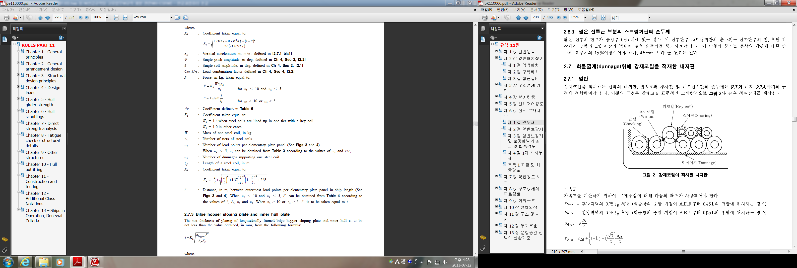

# 제3편 선체구조

> 선급 및 강선규칙/적용지침 / RA-03-K / 2025 / KO / Guidance

## 부록 3-5 강재코일을 적재하는 선박의 선체구조

### 1. 적용

#### (1) 이 부록의 규정은 강재코일을 적재하는 선박의 이중저(내저판, 내저판 종보강재) 및 빌지호퍼 탱크(경사판, 경사판 종보강재)에 대하여 적용한다.

#### (2) 이 부록의 요건에 추가하여 상기 선체구조부재는 관련 규정에도 적합하여야 한다.

#### (3) 이 부록의 계산방법은 강재코일의 축이 선박길이 방향과 평행하게 적재되고 그림 1과 같이 적재하는 경우를 표준으로 한다.

#### (4) 강재 코일이 2단 이상 적재되는 경우에는, 강재 코일의 최하단이 내저판 및 호퍼 경사판에 접촉하는 것으로 가정하며, 그 이외의 경우에는 우리 선급이 인정하는 바에 따른다.

#### (5) 빌지호퍼 탱크의 경우 이 부록에 의한 강재치수의 요건은 내저판으로부터 강재코일이 접촉하는 부분까지의 구조부재에 대하여 적용한다.

**그림 1 강재코일 적재의 예**

### 7. 늑판 사이의 강재코일의 배치

강재코일이 늑판의 위치를 고려하여 늑판사이에 적재되는 경우의 내저판, 내저판 종보강재, 빌지호퍼 경사판 및 경사판 종보강재의 치수는 다음의 하중배치를 고려하여 각각 해당 규정에 따른다. (**그림 3** 참조)

#### (1) 하중점의 수

패널 1개에 작용하는 하중점 개수 $n _{2}$는 1개의 코일을 지지하는 화물깔개의 수 $n _{3}$로 한다.

#### (2) 하중점간의 거리 _s2

패널 1개에 작용하는 가장 바깥쪽 하중점 간의 거리 $\ell _{lp}$는 강재코일의 한 단을 지지하는 가장 바깥쪽 화물깔개 사이의 거리로 한다.
