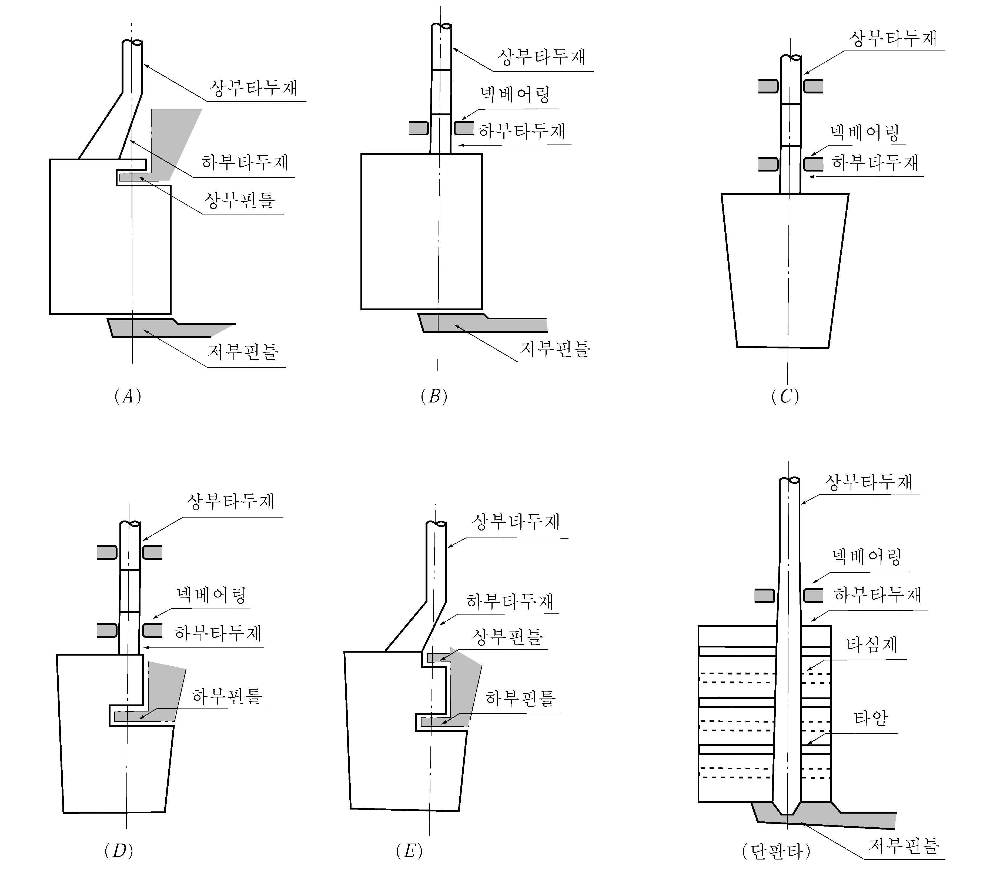
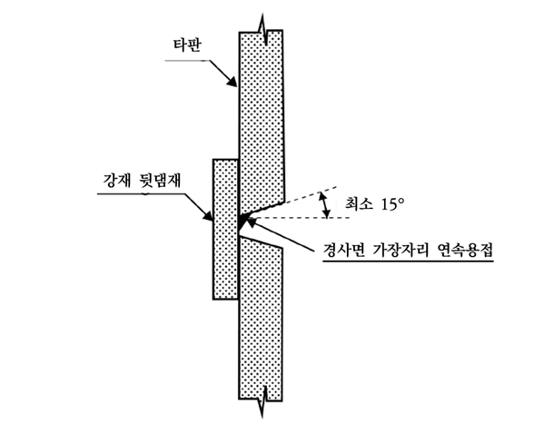
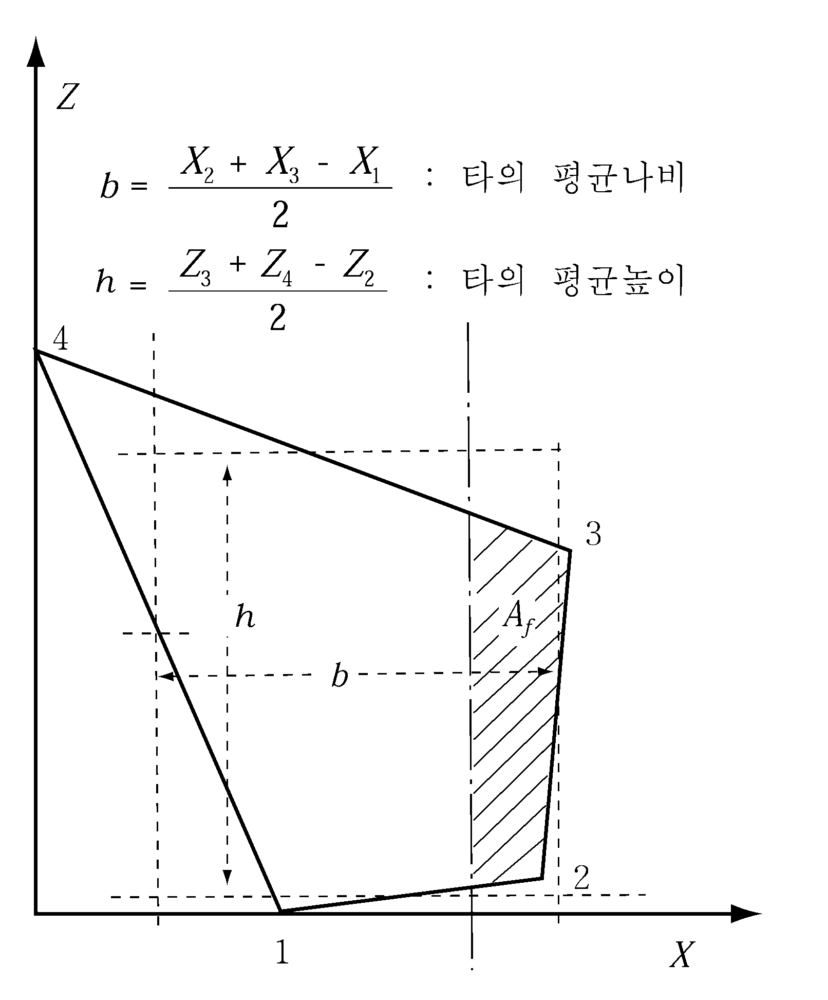
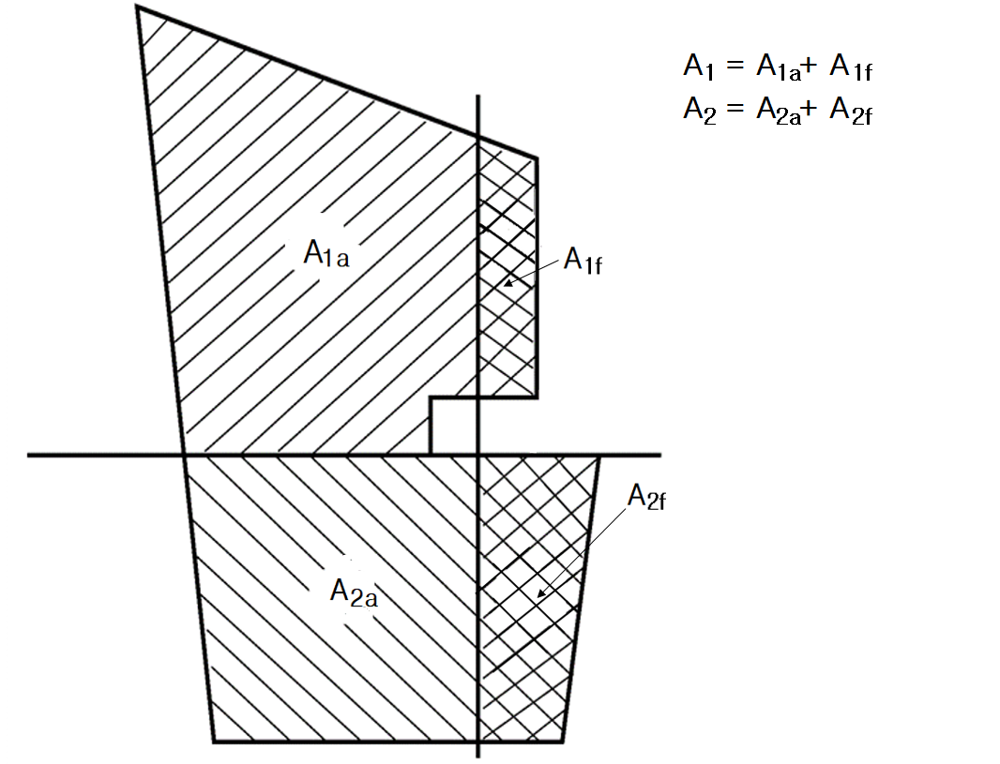
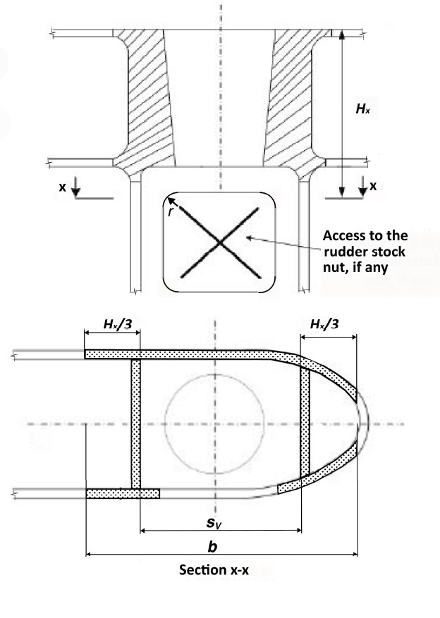
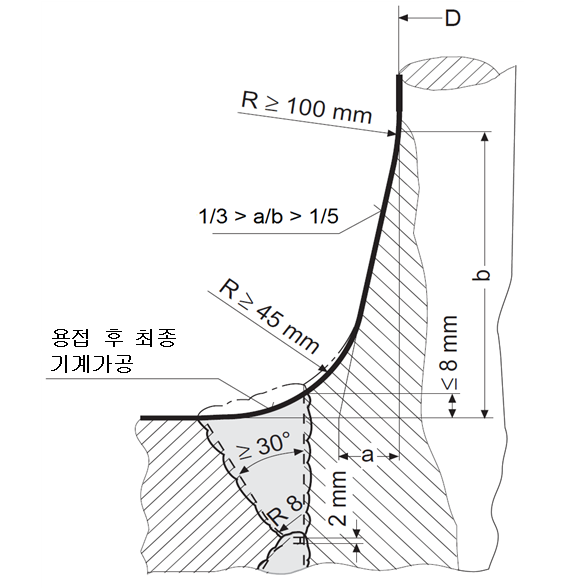
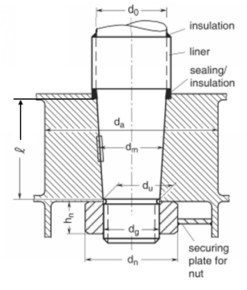
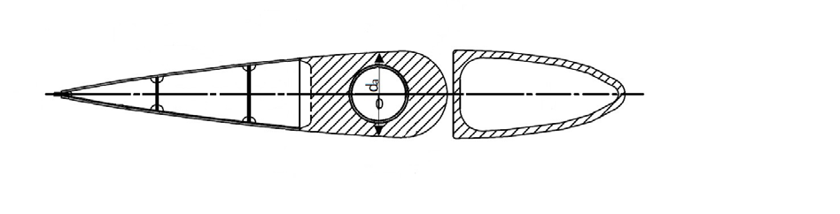
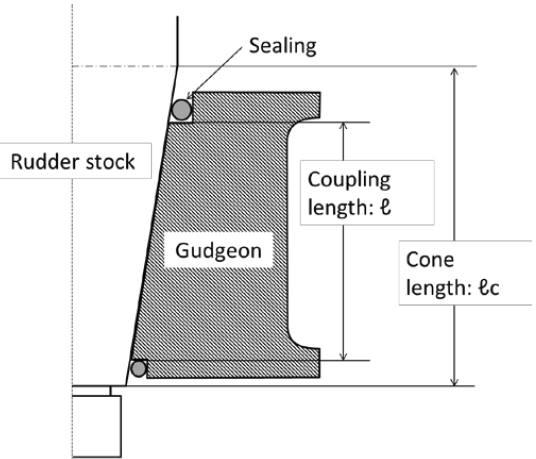

# 제4편 선체의장

> 선급 및 강선규칙/적용지침 / RA-04-K / 2025 / KO / Rules

## 제 1 장 타

### 제 1 절 일반사항

#### 101. 적용 【지침 참조】

- **1.** 이 장의 규정은 유선형 단면 및 보통의 모양을 갖는 타 및 타력을 증가시키기 위한 특수한 설비를 가지는 보강된 형상의 타로서 다음 각 호에 정하는 타 및 단판타에 대하여 규정하는 것으로 한다.
  - **(1)** 상부 및 저부에 핀틀을 갖는 타.(**그림 4.1.1** (*A)* 참조, 이하 $A$형 타라고 한다.)
  - **(2)** 저부에 핀틀, 넥(neck) 부분에 베어링을 갖는 타.(**그림 4.1.1** (*B)* 참조, 이하 $B$형 타라고 한다.)
  - **(3)** 넥베어링보다 하방에 베어링을 갖지 않는 타.(**그림 4.1.1** (*C)* 참조, 이하 $C$형 타라고 한다.)
  - **(4)** 하측이 고착된 1개의 하부핀틀과 넥베어링을 갖는 마리나(mariner) 형의 타.(**그림 4.1.1** (*D)* 참조, 이하 $D$형 타라고 한다.)
  - **(5)** 하측이 고착된 2개의 핀틀을 갖는 마리나형의 타.(**그림 4.1.1** (*E)* 참조, 이하 $E$형 타라고 한다.)
- **2.** 이 장의 규정은 강재로 제작된 타에 적용한다.
- **3.** 3개 이상의 핀틀을 갖는 타 또는 노즐타 등에 대하여는 우리 선급이 적절하다고 인정하는 지침에 따른다.
- **4.** 타각이 35°를 넘는 경우의 타에 대하여는 우리 선급이 적절하다고 인정하는 지침에 따른다.
  
  **그림 4.1.1 타의 종류**

#### 102. 설계

타두재 상부에는 러더캐리어를 사용하는 등, 베어링에 과대한 압력이 발생하지 않고 타 본체의 중량을 지지하는 효과적인 수단이 마련되어야 한다. 러더캐리어 부근의 선체구조는 적절한 보강을 하여야 한다.

#### 103. 재료 【지침 참조】

- **1.** 타두재, 핀틀, 커플링 볼트, 키(key) 및 타의 주강부분에 사용되는 압연강재, 단강품 및 탄소강 주강품은 **2편 1장**의 규정에 적합한 재료이어야 한다. 타두재, 핀틀, 커플링 볼트 및 키에 사용되는 재료의 최소항복응력은 200(N/mm^2) 이상이어야 한다. 이 장의 규정은 사용되는 단강품(압연봉강을 포함한다) 및 주강품의 최소항복응력이 235(N/mm^2)인 재료를 기준으로 하고 있으므로 최소항복응력이 235(N/mm^2)와 다른 재료를 사용하는 경우에는 **표 4.1.1**의 재료계수 $K$ 을 사용하여야 한다.

  **표 4.1.1 재료계수** $K$ **(단강품 및 주강품)**

  | $\sigma _{y}$(N/mm^2) | $K$ |
  | --- | --- |
  | $\sigma_y > 235$ | $K = left( \frac{235}{\sigma_y} right)^0.75$ |
  | $\sigma_y \leq 235$ | $K = left( \frac{235}{\sigma_y} right)^1.0$ |
  | (비고) $\sigma_y$ : 사용되는 재료의 최소항복응력(N/mm^2)으로서 0.7$\sigma_T$ 와 450(N/mm^2) 중 작은 값 이하이어야 한다. $\sigma_T$ : 사용되는 재료의 최소인장강도(N/mm^2). |   |
- **2.** 타의 용접부는 **2편 1장**의 규정에 적합한 선체구조용 압연강재로 제작되어야 하며, 이 경우의 재료계수 $K$ 는 **표 4.1.2**에 따른다.
- **3.** 타 및 러더혼의 판 재료의 등급은 **규칙 3편 1장 405.**에 적합하여야 한다.

  **표 4.1.2 재료계수** $K$ **(압연강재)**

  | 재료기호 | $K$ |
  | --- | --- |
  | *A, B, D* 및 *E* | 1.0 |
  | *AH* 32, *DH* 32 및 *EH* 32 | 0.78 |
  | *AH* 36, *DH* 36 및 *EH* 36 | 0.72 |
  | *AH* 40, *DH* 40 및 *EH* 40 | 0.68 |

#### 104. 치수의 증가

- **1.** 전적으로 예인작업에 종사하는 선박의 타에 있어서, 타두재의 지름은 이 장의 규정에 의한 것의 1.1배 이상으로 하여야 한다.
- **2.** 어선 등과 같이 전속력으로 항주 시 대각도로 조타하는 빈도가 높다고 고려되는 타에 있어서 타두재 및 핀틀의 지름과 타심재의 단면계수는 이 장의 규정에 의한 것의 1.1 배 이상으로 하여야 한다.
- **3.** 특히 조타시간이 짧다고 생각되는 선박의 타에 있어서, 타두재의 지름은 이 장의 규정에 의한 것보다 적절히 증가시켜야 한다.
- **4.** 빙해운항선박의 타에 대하여는 이 장의 규정 외에 **빙해운항선박지침**의 규정에 따른다.

#### 105. 슬리브 및 부시

타의 저부에서부터, 만재흘수선 상방 상당히 높은 위치까지에 있는 베어링에는 슬리브 및 부시를 부착하여야 한다.

#### 106. 용접

- **1.** 슬롯 용접은 가능한 한 제한되어야 하고 슬롯에 횡방향 면내 응력이 발생하는 부분 또는 $A$형, $D$형 및 $E$형 타의 컷 아웃(cut-out) 부위에서는 사용되어서는 아니된다.
- **2.** 슬롯 용접을 적용하는 경우, 슬롯의 폭은 타판 두께의 2배 이상, 길이는 75mm 이상이어야 하고 슬롯 끝단 간격은 125 mm 이하이어야 한다. 슬롯부는 필릿 용접되어야 하고 용접이 아닌 에폭시 퍼티 등과 같은 적절한 합성물로 채워져야 한다.
- **3.** 슬롯 용접을 대신하여 연속 슬롯 용접을 적용할 수 있으며, 연속 슬롯 용접의 루트 간격은 6∼10 mm이어야 한다. 개선 각도는 적어도 15˚이상이어야 한다.
- **4.** **4**. $A$형, $D$ 형 및 $E$ 형 타의 러더혼 리쎄스 부의 주강으로된 견고한 부분을 제외한 타판의 반경은 판두께의 5배보다 작아서는 아니되고 어떤 경우에도 100 mm 이상이어야 한다. 측면판의 용접은 반경 내 또는 끝에서는 피하여야 한다. 반경에 인접한 측면판의 모서리와 용접부는 부드럽게 그라인딩되어야 한다.
- **5.** **5**. 타 굽힘으로 인한 상당한 응력을 받는 타판의 용접과 판과 중량물(단강제, 주강제의 고체부 또는 매우 두꺼운 판)과의 용접은 완전용입용접으로 하여야 한다. $A$형, $D$형 및 $E$형 타의 컷 아웃 부위 및 $B$형 및 $C$형 타의 상부와 같이 고응력부는 주강 또는 용접된 리브가 배치되어야 한다. 양면 완전용입용접이 일반적으로 요구가 되지만, 뒷면의 용접이 불가능한 경우 세라믹 뒷댐재(backing bar) 또는 동등한 뒷댐재를 사용하여 용접하여야 한다. 이 경우 강재 뒷댐재가 사용될 수 있고 경사진 가장자리의 한쪽 면에서 연속 용접되어야 한다. (**그림 4.1.2** 참조) 경사각은 일면 용접일 경우 15° 이상이어야 한다. *(2024)*
  
  **그림 4.1.2 타판의 강재 뒷댐재를 사용한 완전용입용접** ***(2024)***

#### 107. 동등효력

- **1.** 이 장의 규정을 대체할 수 있는 방안이 이 규칙과 동등하다고 **1편 1장 105.**에 따라 우리 선급이 인정하는 경우 허용할 수 있다
- **2.** **2**. 대안 설계의 평가를 위한 직접 계산 방법은 개별적으로 모든 연관된 손상모드를 고려하여야 한다. 이 손상 모드에는 항복, 피로, 좌굴, 파손 등이 포함될 수 있다. 공동현상(cavitation)에 의한 손상 또한 고려되어야 한다.
- **3.** **3**. 대안 설계 방법을 입증하기 위하여 우리 선급이 필요하다고 인정하는 경우 시험실 시험이나 실물 시험(full scale tests)을 요구할 수 있다.

### 제 2 절 타력

#### 201. 타력 (2024)

타의 부재치수를 결정하기 위하여 사용되는 타력 $F _{R}$ 은 전진 및 후진의 각각의 상태에 대하여 다음 식에 따른다. 다만, 타가 특별히 큰 추진력을 발생시키는 프로펠러 후방에 배치된 경우에는 타력을 적절히 증가시켜야 한다.

### 제 3 절 타 토크

#### 301. B}형 및 C}형 타(rudder without cut-outs)의 타 토크 (2024)

*B*형 및 *C*형 타에 있어서, 타 토크 $T_R$ 은 전진 및 후진상태에 대하여 각각 다음 식에 따른다.

#### 302. A}형, D}형 및 E}형 타(Rudder with stepped contours)의 타 토크 (2024)

- **1.** $A$형, $D$형 및 $E$형 타의 타 토크 $T_R$ 은 전진 및 후진상태에 대하여 각각 다음 식에 따른다.
  $T _{R} =T _{R1} +T _{R2}$(N-m)
  $T_R1$*,* $T_R2$ : 각각의 $A_1$ 및 $A_2$ 면적에 작용하는 타 토크(N-m)로서 각각 다음 식에 따른다.
  $T _{R1} =F _{R1} \times r _{1}$(N-m)
  $T _{R2} =F _{R2} \times r _{2}$(N-m)
  $A_1$*,* $A_2$ : 두 부분으로 나누어진 타의 각각의 면적으로서, 각각 $A_1f$ 및 $A_2f$ 을 포함하며 $A = A_1 + A_2$ 가 되도록 분할한 면적(m^2)으로서 **그림 4.1.4**에 따른다.
  $F_R1$, $F_R2$ : $A_1$ 및 $A_2$ 면적에 작용하는 타력으로서 각각 다음 식에 따른다.
  $F _{R1} =F _{R} \frac{A _{1}}{A}$(N)
  $F _{R2} =F _{R} \frac{A _{2}}{A}$(N)
  $F_R$, $A$ : **201.**에 따른다.
  $r_1$*,* $r_2$ : $A_1$ 및 $A_2$ 면적에 작용하는 타력의 중심으로부터 타두재의 중심선까지의 각각의 수평거리(m)로서 다음 식에 따른다.
  $r _{1} =b _{1} ( \alpha -e _{1} )$(m)
  $r _{2} =b _{2} ( \alpha -e _{2} )$(m)
  $b_1$, $b_2$ : $A_1$ 및 $A_2$ 의 평균너비(m)로서 **그림 4.1.3**에 따른다.
  $\alpha$ : 계수로서 **표 4.1.6**에 따른다.
  $e_1$, $e_2$ : $A_1$ 및 $A_2$ 면적에 대한 각각의 평형계수로서 다음 식에 따른다.
  $e_1 = A_\frac{1f}{A_1} , e_2 = A_\frac{2f}{A_2}$
- **2.** 다만 전진상태에 있어서 $T_R$ 은 다음 식에 의한 $T_R _\min$ 이상이어야 한다.
  $T _{R} _{\min} =0.1 F _{R} \frac{A _{1} b _{1} +A _{2} b _{2}}{A}$(N-m)
  $F_R$, $A$ : **201.**에 따른다.
  $b_1$, $b_2$ : $A_1$ 및 $A_2$ 의 평균너비(m)로서 **그림 4.1.3**에 따른다.

  |  **그림 4.1.3 타의 좌표계** ***(2024)*** **그림 4.1.3 타의 좌표계** ***(2024)*** |  **그림 4.1.4 타면적의 분할** ***(2024)*** **그림 4.1.4 타면적의 분할** ***(2024)*** |
  | --- | --- |

  **표 4.1.6 계수** $\alpha$

  | 타 부분의 위치 | $\alpha$ |   |
  | --- | --- | --- |
  | 러더 혼과 같은 고정구조물 후방에 있지 않는 타의 부분 | 전진 상태 | 0.33 |
  | 러더 혼과 같은 고정구조물 후방에 있지 않는 타의 부분 | 후진 상태 | 0.66 |
  | 러더 혼과 같은 고정구조물 후방에 있는 타의 부분 | 전진 상태 | 0.25 |
  | 러더 혼과 같은 고정구조물 후방에 있는 타의 부분 | 후진 상태 | 0.55 |

### 제 4 절 타의 강도 계산

#### 401. 타의 강도계산

- **1.** 타의 강도는 **2절** 및 **3절**에서 주어진 타력 및 타 토크에 대하여 충분히 견딜 수 있어야 한다. 타의 각 부분의 부재치수를 결정할 때는 다음의 모멘트와 힘을 고려하여야 한다.
  타본체 : 굽힘모멘트 및 전단력
  타두재 : 굽힘모멘트 및 토크
  핀틀 베어링 및 타두재 베어링 : 지지반력
  러더혼 및 힐피스(heel pieces) : 굽힘모멘트, 전단력 및 토크
- **2.** 고려하는 굽힘모멘트, 전단력 및 지지반력은 우리 선급이 적절하다고 인정하는 직접강도계산 또는 근사식에 의하여 정한다. 슈피스(shoe pieces) 및 러더혼에 의해 지지되는 타의 경우, 이러한 구조물은 타본체의 탄성지지를 규정하기 위하여 계산식에 포함되어야 한다. 굽힘모멘트 및 전단력의 계산은 우리 선급이 별도로 정하는 지침에 따른다. **【지침 참조】**

### 제 5 절 타두재

#### 501. 상부타두재 【지침 참조】

타 토크의 전달을 위하여 요구되는 상부타두재의 지름 $d_u$ 는 비틀림 응력값이 $68 /K _{s}$(N/mm^2)을 넘지 않도록 결정되어야 하며, 다음 식에 의한 값 이상이어야 한다.

#### 502. 하부타두재 (2024)

하부타두재에 작용하는 토크 및 굽힘모멘트로 인한 하부타두재의 등가응력(equivalent stress) $\sigma_e$ 는 $118 /K _{s}$(N/mm^2) 이하이어야 하며, 이 경우 $\sigma_e$ 는 다음 식에 따른다.

### 제 6 절 타판, 타골재 및 타심재

#### 601. 타판 (2024)

타판의 두께 $t$ 는 다음 식에 의한 값 이상이어야 한다.

#### 602. 타골재

- **1.** 타 본체는 굽힘을 받는 거더로서 충분한 강도를 갖도록 수평타골재 및 수직타골재에 의하여 보강되어야 한다.
- **2.** 수평타골재의 간격 $S_f$ 는 다음 식에 의한 값을 표준으로 한다.
  $S _{f} =0.2 \left( \frac{L}{100} \right) +0.4$(m)
- **3.** 타심재로 되는 수직타골재로부터 인접한 수직타골재까지의 거리는 수평타골재 간격의 1.5 배를 표준으로 한다.
- **4.** 타골재의 두께는 **601.**에 따른 타판 두께의 0.7 배와 8 mm 중 큰 값 이상이어야 한다.

#### 603. 타심재 【 지침 참조】

- **1.** 타심재로 되는 수직타골재가 2 개인 경우에는 타두재 중심선의 전후에 타의 두께와 대략 같은 간격으로 배치하고, 1 개인 경우에는 타두재 중심선상에 설치하여야 한다.
- **2.** 타심재의 단면계수는 **1**항에서 규정하는 수직타골재 및 이에 붙는 타판을 포함하여 계산한다. 다만, 포함되는 타판의 유효폭에 대하여는 특별한 경우를 제외하고, 다음 각 호에 따른다.
  - **(1)** 타심재로 되는 수직타골재가 2 개인 경우의 유효폭은 타심재 길이의 0.2 배로 한다.
  - **(2)** 타심재로 되는 수직타골재가 1 개인 경우의 유효폭은 타심재 길이의 0.16 배로 한다.
- **3.** **4**항이 적용되는 부위를 제외한, 타심재 수평단면의 단면계수 및 웨브면적은 굽힘응력, 전단응력 및 등가응력이 각각 다음에 적합하여야 한다.
  $\sigma b \leq \frac{110}{K} \mathrm{N/mm 2 } it , \tau \leq \frac{50}{K} \mathrm{N/mm 2 } it , \#
   \#
  \sigma e = \sqrt {\sigma b 2 +3 \tau 2} \leq \frac{120}{K} \mathrm{N/mm 2 } it$
  $K$ : 타심재의 재료계수로서 **103.**에 따른다.
- **4.** $A$형, $D$형 및 $E$형 타의 경우처럼, 컷아웃(cut-out) 부근에서의 타심재의 수평단면의 단면계수와 웨브면적은 굽힘응력, 전단응력 및 등가응력이 각각 다음에 적합하여야 하고, 고장력강을 사용하는 경우에도 동일하게 적용한다.
  $\sigma b \leq 75 \mathrm{N/mm 2 } it , \tau \leq 50 \mathrm{N/mm 2 } it ,\#
   \#
  \sigma e = \sqrt {\sigma b 2 +3 \tau 2} \leq 100 \mathrm{N/mm 2 } it$
- **5.** 타심재의 상부는 그 구조가 불연속이 되지 않도록 하여야 한다.
- **6.** $A$형, $D$형 및 $E$형 타에 있어서, 타판에 있는 작업용 개구 등의 모서리에는 적절한 둥금새를 주어야 한다.

#### 604. 단판타의 타판, 타암 및 타심재

- **1.** 타판의 두께 $t$ 는 다음 식에 의한 값 이상이어야 한다.
  $t = 1.5 SV \sqrt{K_p _l} + 2.5$(mm)
  $S$ : 타암의 간격(m). 다만, 1 m 를 초과하지 않아야 한다.
  $V$ : 선박의 속력(Kt)으로서 **201.**의 규정에 따른다.
  $K_p _l$ : 타판의 재료계수로서 **103.**의 규정에 따른다.
- **2.** 타암에 대하여는 다음 각 호의 규정에 따른다.
  - **(1)** 타암의 두께는 타판의 두께 미만이어서는 안 된다.
  - **(2)** 타암의 단면계수는 다음 식에 의한 값 이상이어야 한다. 다만, 이 단면계수는 타판의 단부로 감에 따라 점차 감소시킬 수 있다.
    $Z = 0.5 S C_1^2 V^2 K_a$(cm^3)
    $C_1$ : 타심재의 중심선으로부터 타판의 후단까지의 수평거리(m).
    $K_a$ : 타암의 재료계수로서 **103.**의 규정에 따른다.
    $S$ 및 $V$ : 전항의 규정에 따른다.
- **3.** 타심재의 지름은 하부타두재의 지름 이상이어야 한다. 다만, 넥베어링 하방에 베어링을 갖지 않는 타에 대하여는 하방 1/3 의 부분에서는 점차 그 지름을 감소시켜 저부에서는 규정지름의 75 %로 할 수 있다.

#### 605. 고착

- **1.** 돌출부가 요구되지 않는 아래의 경우를 제외하고, 타두재 또는 핀틀을 수용하는 주강재 또는 단강재 거전은 돌출부가 있어야 한다.
  이러한 돌출부는 타골재의 두께가 다음 각 호의 값 이하이면 요구되지 않는다.
  - **(1)** $A$형, $D$형 및 $E$형 타의 하부 핀틀 거전에 용접되어 있는 타골재 및 $B$형 및 $C$형 타의 타두재 커플링 거전에 용접되어 있는 수직 타골재의 경우, 10 mm
  - **(2)** (1)호 이외의 경우, 20 mm
- **2.** 일반적으로 거전은 두 개의 수평 타골재 및 두 개의 수직 타심재를 사용하여 타 구조에 고착되어야 한다.
- **3.** **거전과 고착부의 단면계수**
  - **(1)** 거전에 고착되고 수직 타골재와 타판으로 이루어진 타 블레이드 구조의 단면 계수 $Z$ 는 다음 식에 의한 값 이상이어야 한다. 타 블레이드 단면의 실제 단면계수는 타의 대칭축에 대하여 계산되어야 한다.
    $Z=c _{s} d _{}^{ 3} ( \frac{h _{E} -h _{X}}{h _{E}} ) ^{2} \frac{K}{K _{s}} 10 ^{-4} (\mathrm{cm} ^{3} )$
    $c _{s}$ : 계수로서 다음과 같다.
    타판에 개구가 없거나 개구부가 완전용입용접된 판으로
    밀폐된 경우, $c _{s} = 1.0$
    고려하는 타의 단면 상에 개구가 있는 경우, $c _{s} =1.5$
    $d$ : 타두재의 지름 (mm)
    $h _{E}$ : 타 판의 하단으로부터 거전의 상단까지의 높이 (m)
    $h _{X}$ : 고려하는 단면으로부터 거전의 상단까지의 높이 (m)
    $K$ : 타 판의 재료계수로서 **103.**에 따른다.
    $K _{s}$ : 타두재의 재료계수로서 **103.**에 따른다.
  - **(2)** 단면 계수의 계산에 고려되는 타판의 폭 $b$은 다음 식에 의한 값 이하이어야 한다. *(2024)*
    $b = S + \frac{2h _{X}}{3} (\mathrm{m})$
    $S _{}$ : 타골재의 간격 (m) (**그림 4.1.5** 참조)
    $h _{X}$ : (1)호에 따른다.
  - **(3)** 타두재 고착용 너트의 점검을 위한 개구가 완전용입용접된 판으로 밀폐되지 않는 경우 개구는 단면계수 계산에서 제외시킨다.
    
    **그림 4.1.5 타 구조와 타두재 거전의 연결부** ***(2024)***
- **4.** 거전에 용접되는 수평 타골재 판의 두께는 수평 타골재 판 사이의 타 블레이드 판의 두께보다 작아서는 안되고 다음 식에 의한 값 중 큰 것 이상이어야 한다.
  $t _{H} =1.2t (\mathrm{mm})$
  $t _{H} =0.045 \frac{d _{s} ^{ 2}}{S _{H}} (\mathrm{mm})$
  $t$ : 타판의 두께로서 **601.**에 따른다.
  $d _{s}$ : 타두재 또는 핀틀의 직경(mm)
  $S _{H}$ : 인접하는 수평 타골재의 간격 (mm)
- **5.** 거전과 용접되는 타심재의 두께와 이 부분의 타판의 두께는 **표 4.1.7**에 의한 값 이상이어야 한다.

  | 타의 형식 | 수직 타심재의 두께(mm) |   | 타판의 두께(mm) |   |
  | --- | --- | --- | --- | --- |
  | 타의 형식 | 개구가 없는 타 | 개구가 있는 타 | 개구가 없는 타 | 개구부 |
  | $A$형 및 $B$형 타 | $1.2t$ | $1.6t$ | $1.2t$ | $1.4t$ |
  | $C$형, $D$형 및 $E$형 타 | $1.4t$ | $2.0t$ | $1.3t$ | $1.6t$ |
  | (비고) 1) $t$ : 타판의 두께로서 **601.**에 따른다. 2) 증가된 두께는 거전 하부로부터 그 다음 수평 타골재까지 연장되어야 한다. |   |   |   |   |

#### 606. 도장 및 배수장치

타의 내면에는 유효한 페인트를 칠하고 저부에는 배수장치를 만들어야 한다.

### 제 7 절 타두재와 타심재의 커플링

#### 701. 수평플랜지 커플링 【지침 참조】

- **1.** 커플링볼트는 리머볼트(reamer bolt)로 하고 그 수는 6개 이상으로 하여야 한다.
- **2.** 커플링의 요건은 **표 4.1.8**에 따른다.

  |  |
  | --- |
  | **그림 4.1.6 타두재와 커플링 플랜지 간의 용접고착** ***(2024)*** |

  **3.** 타두재와 커플링 플랜지 간의 용접은 **그림 4.1.6**에 따른다. *(2024)*

#### 702. 수직플랜지 커플링 【지침 참조】

- **1.** 커플링볼트는 리머볼트(reamer bolt)로 하고 그 수는 8개 이상으로 하여야 한다.
- **2.** 커플링의 요건은 **표 4.1.8**에 따른다.

  **표 4.1.8 커플링에 대한 최저요건**

  | 인자 | 요건 |   |
  | --- | --- | --- |
  | 인자 | 수평플랜지커플링 | 수직플랜지커플링 |
  | $d_b$ | $0.62 \sqrt{\frac{d^3 K_b}{n e_m K_s}$ | $\frac{0.81d _{v}}{\sqrt {n}} \times \sqrt {\frac{K _{b}}{K _{s}}}$ |
  | $M$ | - | 0.00043$d _{v} ^{3}$ |
  | $t_f$ | $d _b \sqrt{K_\frac{f}{K_b}}$ (단, 0.9$d _b$ 이상일 것)(1) | $d _b$ |
  | $w_f$ | 0.67$d _b$ | 0.67$d _b$ |
  | $n$ : 커플링 용 볼트 수. $d _b$ : 볼트의 지름(mm) $d$ : **501.** 및 **502.**에 의한 타두재의 지름 $d _u$ 및 $d _l$ 중 큰 값(mm). $d _{v}$ : 커플링 플랜지에 인접한 타두재의 지름 $M$ : 커플링 플랜지의 중심선에 대한 볼트의 단면 일차모멘트(cm^3). $e_m$ : 볼트배치의 중심(centre of bolt system)으로부터 각 볼트의 중심까지의 평균거리(mm). $K_s$ : 타두재의 재료계수로서 **103.**에 따른다. $K_b$ : 볼트의 재료계수로서 **103.**에 따른다. $K_f$ : 커플링 플랜지의 재료계수로서 **103.**에 따른다. $t_f$ : 커플링 플랜지의 두께(mm). $w_f$ : 커플링 플랜지의 볼트구멍의 외단으로부터 플랜지 끝단까지의 거리(mm). |   |   |
  | (비고) (1)커플링 볼트가 8개를 넘는 경우 플랜지 두께 $t_f$ 는 $n$을 8로 하여 계산된 $d _b$ 에 의한 두께 이상이어야 한다. |   |   |

#### 703. 콘(cone) 커플링 【지침 참조】

- **1.** 커플링의 결합 및 분리를 위한 유압장치(오일주입 및 유압너트 등)가 없는 콘 커플링은 다음 각 호의 규정에 적합하여야 한다.
  - **(1)** 커플링의 지름은 1 : 8∼1 : 12 의 테이퍼 $c$를 가져야 하며, 슬러징 너트(slugging nut)에 의해 고정되어야 한다. (**그림 4.1.7 및 그림 4.1.7b** 참조) *(2024)*
    $c = \frac{d _{0} -d _{u}}{l _{c}}$
    $d_0$ : 타두재의 실제 지름(mm). (**그림 4.1.7** 참조)
    $d _{u}$ : **그림 4.1.7**에 따른다. (mm)
    $lc$ : 콘의 길이(mm). (**그림 4.1.7b** 참조)
  - **(2)** 콘의 형상은 정확해야 하며, 커플링의 길이 $l$ 은 일반적으로 타의 상단에서의 타두재 실제지름 $d_0$ 의 1.5 배 이상이어야 한다.
    
    **그림 4.1.7 키를 가지는 콘커플링** ***(2024)***
  - **(3)** 타두재와 타의 커플링에는 키(key)가 설치되어야 하며, 키의 치수는 다음에 적합하여야 한다.
    $A _{k} = \frac{17.55M _{F}}{d _{k} R _{eH1}}$(cm^2)
    $M _{F}$ : 타두재의 설계비틀림모멘트(Nm)로서 다음 식에 의한 값.
    $M _{F} =0.02664 \frac{d _{u} ^{3}}{K _{s}}$
    $d _{u}$ : 상부타두재의 지름으로서 **501.**의 규정에 따른다. 타두재의 실제 지름 $d _{0}$이 계산된 지름 $d _{u}$보다 큰 경우, $d _{0}$을 사용한다. 다만 $1.145d _{u}$ 이상일 필요는 없다.
    $K _{s}$ : 타두재의 재료계수로서 **103.**에 따른다.
    $d_k$ : 키(key)의 길이방향의 중앙에서의 타두재 지름(mm).
    $R _{eH1}$ : 키의 재료의 최소항복응력(N/mm^2).
    
    **그림 4.1.7a 거전(gudgeon) 외경** ***(2024)***
    
    **그림 4.1.7b 콘 길이 및 커플링 길이** ***(2024)***
    $A _{c} = \frac{5M _{F}}{d _{k} R _{eH2}}$(cm^2)
    $R _{eH2}$ : 키, 타두재 또는 커플링 재료의 최소항복응력(N/mm^2)중 최소값으로 한다.
    - **(가)** 키의 전단 면적 $A_k$ 는 다음 식에 의한 값 이상이어야 한다.
    - **(나)** 키와 타두재 또는 콘 커플링 간의 둥근모서리(rounded edges)가 없는 키의 유효접촉면적(effective surface area) $A_c$ 는 다음 식에 의한 값 이상이어야 한다.
  - **(4)** (1)호에서 규정된 슬러징 너트의 치수는 다음에 따른다.(**그림 4.1.7** 참조) *(2024)*
    $d _g \geq 0.65 d_0$(mm)
    $h_n \geq 0.6 d_g$(mm)
    $d _{n} \geq 1.2 d _{u}$ 또는 $1.5 d _g$ 중 큰 값(mm).
    $d _g$ : 나사산의 실제외부지름.
    $h_n$ : 너트의 높이.
    $d _n$ : 너트의 외부 지름.
  - **(5)** 타두재를 고착하는 너트에는 유효한 고정장치(securing plate or flat bar 등)를 설치하여야 한다.
  - **(6)** 타두재의 커플링부에는 적절한 부식방지 장치를 하여야 한다.
  - **(7)** 콘 커플링부의 마찰만으로 설계비틀림모멘트의 50 %가 전달되는지 확인되어야 한다. 이 경우 **2**항 (5)호에 의한 압입력 및 압입길이를 고려한 비틀림 모멘트 $M _{t}$가 (3)호의 $M _{F}$의 1/2 이상인 경우 이 요건을 만족하는 것으로 한다.
  - **(8)** (7)호에도 불구하고, 키에 의해 전적으로 타토크가 전달되는 경우에는 키의 치수, 압입력 및 압입길이에 대하여 우리 선급이 인정하는 바에 따른다.
- **2.** 커플링의 결합 및 분리를 위한 유압장치(오일주입 및 유압너트 등)를 가지는 콘 커플링은 다음 각 호의 규정에 적합하여야 한다.
  - **(1)** 타두재의 지름이 200 mm를 초과하는 경우, 유압방식에 의한 압입이 권고된다. 이 경우에 콘은 1:12~ 1 : 20의 테이퍼를 가져야한다.
  - **(2)** 타두재를 고착하는 너트는 유효하게 고정되어야 한다. 다만 타본체에 취부되는 너트 스토퍼를 설치하여서는 안된다.
  - **(3)** 타두재의 커플링부에는 적절한 부식방지 장치를 하여야 한다.
  - **(4)** 너트에 대하여는 **1**항 (4)호에 따른다.
  - **(5)** 타두재와 타본체 사이의 커플링에 의하여 비틀림모멘트를 안전하게 전달하기 위한 압입력 및 압입길이는 (6)호부터 (8)호에 따른다.
    
    **그림 4.1.8 키를 가지지 않는 콘커플링** ***(2024)***
  - **(6)** 압입 압력은 다음 식에 의한 값 중 큰 것 이상이어야 한다. *(2024)*
    $P = \frac{2M _{F}}{d _{m} ^{2 _{}} \ell _{} \pi \mu _{0}} 10 ^{3} (\mathrm{N}/mm ^{2} )$ 또는 $P = \frac{6M _{c}}{\ell _{}^{2} d _{m}} 10 ^{3} (\mathrm{N}/mm ^{2} )$
    $M _{F}$ : 타두재의 설계비틀림모멘트(Nm)로서 **1**항 (3)호에 따른다.
    $d_{ m}$ : 콘의 평균지름 (mm) (**그림 4.1.7** 참조)
    $\ell$ : 커플링의 길이 (mm)
    $\mu _{ 0}$ : 마찰계수로서 0.15로 한다.
    $M _{c}$ : 스페이드 타의 콘커플링 상단 타두재의 굽힘모멘트 (Nm)
    트렁크가 타의 내부로 연장되어 있는 스페이드 타의 경우, 지침 401.4의 2가지 경우에 대해 커플링이 확인되어야 한다.
    압입 압력은 타두재 콘 내부의 허용 면압 $P _{perm}$을 초과하지 않아야 하며 설계자는 관련자료를 제출하여야 한다. 허용 면압 $P _{perm}$은 다음 식에 의한다.
    $P _{perm} = \frac{0.95R _{eH} (1- \alpha ^{2} )}{\sqrt {3+ \alpha ^{4}}} - P _{b} (\mathrm{N}/mm ^{2} )$
    $P _{b} = \frac{3.5 M _{c}}{d _{m} l ^{2}} 10 ^{3}$
    $R _{eH}$ : 거전(gudgeon) 재료의 최소항복응력 (N/mm^2)
    $\alpha$ : 다음 식에 따른다.
    $\alpha = \frac{d _{m}}{d _{a}}$
    $d _{a}$ : 거전의 외경 (mm) (**그림 4.1.7 및 그림 4.1.7a** 참조)
    거전의 외경(mm)은 $1.25 d _{0}$ 이상이어야 한다. ($d _{0}$는 **그림 4.1.7** 참조)
  - **(7)** 압입길이 $l$ 은 다음에 적합하여야 한다. *(2024)*
    $l _{1} \leq l \leq l _{2} (\mathrm{mm})$
    $l _{1} = \frac{Pd _{m}}{E( \frac{1- \alpha ^{2}}{2} )c} + \frac{0.8R _{tm}}{c} (\mathrm{mm})$
    $l _{2} = \frac{P _{perm} d _{m}}{E( \frac{1- \alpha ^{2}}{2} )c} + \frac{0.8R _{tm}}{c} (\mathrm{mm})$
    $P$ : (6)호에 의한 압입 압력
    $P _{perm}$ : (6)호에 의한 허용 면압
    $d_{ m}$ : 콘의 평균지름 (mm) (**그림 4.1.7** 참조)
    $R _{tm}$ : 평균거칠기 (mm)로서 0.01로 한다.
    $E$ : 재료의 탄성계수로서 강재의 경우 $2.06 \times 10 ^{5 } (\mathrm{N}/mm ^{2} )$으로 한다.
    $c$ : 타두재 지름에 대한 테이퍼로서 (1)호에 따른다.
    $\alpha$ : (6)호에 따른다.
  - **(8)** 콘의 압입력 $F$는 다음 식에 의한 값으로 한다.
    $F _{} =Pd _{m} \pi \ell ( \frac{c}{2} + \mu _{0}) (N)$
    $P$, $d _{m}$, $\ell$ : (6)호에 따른다.
    $c$ : 타두재 지름에 대한 테이퍼 길이(mm)로서 (1)호에 따른다.
    $\mu _{ 0}$ : 마찰계수로서 유압을 사용하는 경우는 0.02를 참고 값으로 한다. 다만 기계적 처리 및 세부 거칠기에 따라 변할 수 있다.

### 제 8 절 핀틀

#### 801. 핀틀의 지름

핀틀의 지름 $d _p$ 는 다음 식에 의한 값 이상이어야 한다.

#### 802. 핀틀의 구조 【지침 참조】

- **1.** 핀틀이 원추형상(conical shape)일 경우, 지름에 대한 다음 값을 넘지 않는 테이퍼를 가진 테이퍼 볼트로 된 구조로서 거전에 부착되어야 하며, 핀틀을 고착하는 너트에는 유효한 고정장치를 설치하여야 한다.
  - **(1)** 슬러징 너트에 의해 결합 및 고정되고 키(key)를 가지는 핀틀 ; 1 : 8 ～ 1 : 12.
  - **(2)** 유압장치(오일주입 및 유압너트 등)에 의해 결합 및 분리되는 핀틀 ; 1 : 12 ～ 1 : 20.
- **2.** 핀틀의 너트와 나사산(thread)의 최소치수는 **703.**의 **1**항 (4)호에 따른다.
- **3.** 거전에서의 핀틀 격납부의 길이는 핀틀의 지름 $d _{p}$ 이상이어야 하고 $d _{p}$는 슬리브의 외측에서 측정되어야 한다. 핀틀 격납부의 두께는 $0.25d _{p}$ 이상이어야 한다.
- **4.** 핀틀에는 적절한 부식방지장치를 하여야 한다.
- **5.** 건식 피팅(dry fitting)의 경우 핀틀에 요구되는 압입 압력은 다음 식 $P _{req1}$에 의해 결정된다. 오일 주입 피팅(oil injection fitting)의 경우 핀틀에 요구되는 압입 압력은 다음 식 $P _{req1}$ 과 $P _{req2}$ 중 최대 압력으로 결정된다. 압입길이는 핀틀에 대한 압입력 및 특성에 따라 **703.**의 **2**항 (7)호에서 규정된 식에 따른다. *(2024)*
  $P _{req1} = 0.4 \frac{B _{} d _{0}}{d _{m}^{2 _{}} \ell } (\mathrm{N}/mm ^{2} )$, $P _{req2} = \frac{6M _{bp}}{\ell ^{2} d _{m}} 10 ^{3} (\mathrm{N}/mm ^{2} )$
  $B _{}$ : 핀틀에 있어서의 지지반력(N), 예 : 세미 스페이드 타의 경우 지침 **그림 4.1.5**의 $B _{1}$
  $d _{0}$ : 핀틀의 직경 (mm) (**그림 4.1.9 참조)**
  $M _{bp}$ : 핀틀의 굽힘모멘트(Nm)로 다음에 따른다.
  $M _{bp} = B \ell _{a} (\mathrm{Nm})$
  $\ell _{a}$ : 핀틀 베어링의 중앙과 콘 커플링과 핀틀 사이의 접촉면 상단 사이 길이(mm) (**그림 4.1.9 참조)**
  $d _{m}$, $\ell$ : **703.**의 **2**항 (6)호에 의한 값
  
  **그림 4.1.9 핀틀 콘커플링** #eqnID-330 ***(2024)***

### 제 9 절 타두재 및 핀틀의 베어링

#### 901. 최소베어링면적 【지침 참조】

베어링면적(투영면적 = 베어링의 길이 × 슬리브의 외부지름), $A_b$ 는 다음 식에 의한 값 이상이어야 한다.

#### 902. 베어링의 길이

베어링 면의 길이에 대한 지름의 비율은 1.2 이하이어야 한다.

#### 903. 베어링의 틈새 간격 【지침 참조】

금속베어링의 틈새 간격은 지름으로 $d _b _s / 1000 + 1.0$ ($\mathrm{mm}$) 미만이어서는 안 된다.

#### 904. 슬리브 및 부시의 두께 (2024)

- **1.** 슬리브 및 부시의 두께 $t$ 는 다음 식에 의한 값 이상이어야 한다.
  $t = 0.01 sqrtB$($\mathrm{mm}$)
  $B$ : **801.**에 따른다.
  다만, $t$ 는 금속재료 또는 합성재료의 부시인 경우에는 8 $\mathrm{mm}$ 이상이어야 하며, 리그넘 바이트인 경우에는 22 $\mathrm{mm}$ 이상이어야 한다.
- **2.** 지름이 200mm 미만인 타두재 및 핀틀의 경우 부시 주변의 슬리브 부착을 선택할 수 있다.

### 제 10 절 부속 장치

#### 1001. 러더 캐리어 【지침 참조】

타의 중량 및 모양에 따라 적절한 러더 캐리어를 설치하고 그 지지부에는 윤활이 잘 되도록 고려하여야 한다.

#### 1002. 점핑스토퍼 【지침 참조】

타가 파도의 충격 등에 의하여 튀어 올라가는 것을 방지하는 장치를 만들어야 한다.

### 제 11 절 프로펠러 노즐

#### 1101. 적용

- **1.** 이 규정은 안지름 5 m 이하의 프로펠러 노즐에 적용하며, 5 m를 초과하는 것에 대하여는 우리 선급이 적절하다고 인정하는 바에 따른다. **【지침 참조】**
- **2.** 선체에 부착되는 노즐의 지지 부위에 세심한 주위가 필요하다.

#### 1102. 설계압력

- **1.** 프로펠러 노즐에 대한 설계압력은 다음 식에 의해 결정한다.
  $P _{d } = cP _{do}$ (kN/mm^2)
  $P _{do } = \epsilon \frac{N}{A _{p}}$ (kN/mm^2)
  $N$ : 최대 축출력(kW)
  $A _{p}$ : 프로펠러 면적(m^2)
  $A _{p } = \pi \frac{D ^{2}}{4}$
  $D$ : 프로펠러 지름(m)
  $\epsilon$ : 다음 식에 의한 상수
  $\epsilon = 0.21 - 2 \cdot 10 ^{-4} \frac{N}{A _{p}}$
  $\epsilon _{\min } = 0.1$
  $c$ = 1.0 (구역 2, 프로펠러 구역)
  = 0.5 (구역 1 & 3)
  = 0.35 (구역 4)

#### 1103. 판 두께

$t = t _{0} + t _{k}$ (mm)

#### 1104. 단면계수 (2024)

**그림 4.1.10**에서 보는 바와 같은 단면의 중립축에 대한 단면계수는 다음 식으로 표현된 값 이상이어야 한다.

#### 1105. 용접

안쪽 노즐판과 바깥쪽 노즐판은 가능하면 양면연속용접으로 내부 보강재에 용접되어야 하며, 바깥쪽 노즐판에 대하여 플러그 용접을 할 수 있다. 
