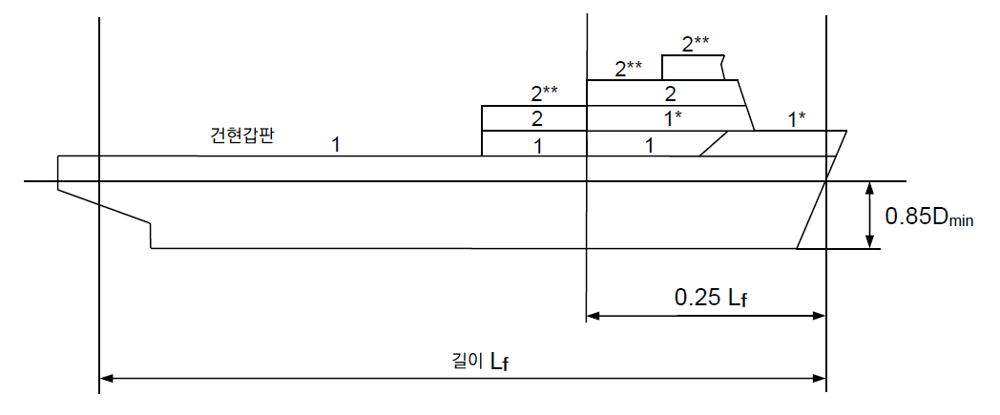
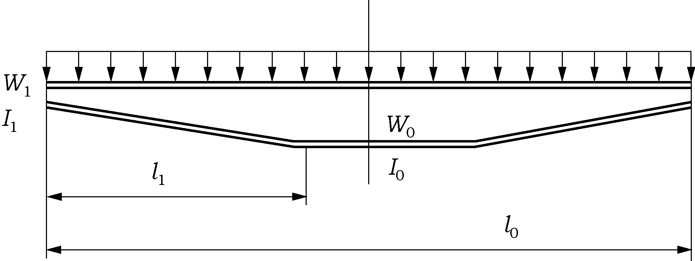
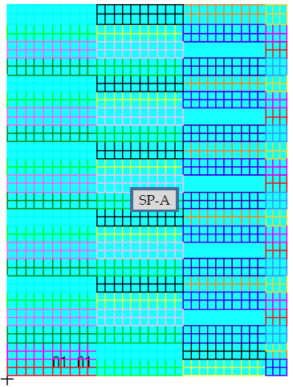
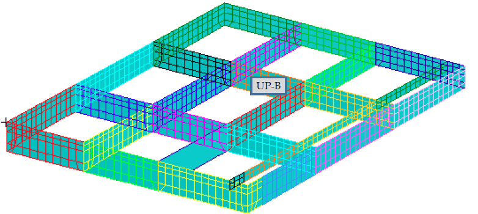
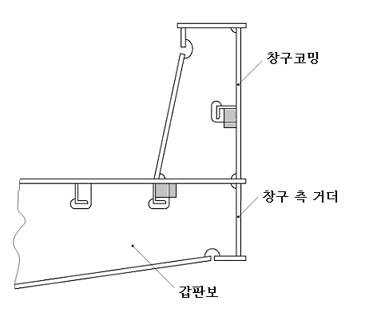
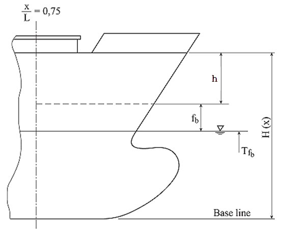
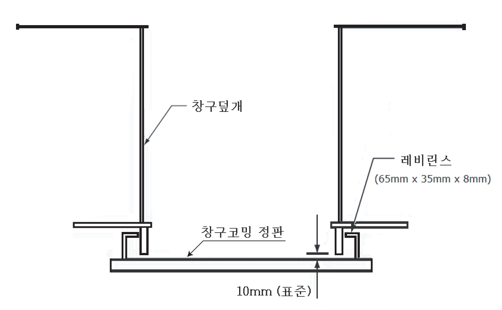
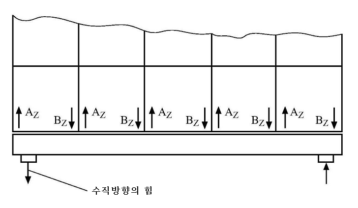

# 제4편 선체의장

> 선급 및 강선규칙/적용지침 / RA-04-K / 2025 / KO / Rules

## 제 2 장 창구 및 기타 갑판개구

### 제 1 절 일반사항

#### 101. 적용

- **1.** 이 장의 규정은 13편을 적용받는 산적화물선을 제외한 모든 선박의 노출갑판 상 **제1위치** 및 **제2위치**에 있는 창구덮개, 창구코밍에 적용한다. 선수갑판의 작은 창구에 대하여는 **9장**을 적용한다. *(2024)*
- **2.** **102.**에 정의하는 **제1위치** 및 **제2위치**의 창구는 주관청이 승인하는 경우를 제외하고 개스킷과 클램핑 장치에 의하여 강 또는 이와 동등한 재료의 창구덮개에 의하여 풍우밀을 확보하여야 한다. **【지침 참조】**
- **3.** 이 장에 명시된 일부 요구사항은 다음과 같이 분류된 선박 유형에 적용한다. *(2024)*
  **Type-1 선박** : 산적화물선, SUBC(Self-Unloading Bulk Carriers), 광석운반선 및 겸용선을 제외한 모든 선박
  **Type-2 선박** : 산적화물선, SUBC(Self-Unloading Bulk Carriers), 광석운반선 및 겸용선

#### 102. 노출갑판의 위치 【지 침 참조】

노출갑판의 위치는 다음과 같이 2가지로 분류하여 정의한다.

#### 103. 창구코밍의 높이

- **1.** 창구코밍의 갑판 상면상의 높이는 위치에 따라 다음의 높이 이상이어야 한다.
  **제1위치 :** 600 $\mathrm{mm}$
  **제2위치 :** 450 $\mathrm{mm}$
- **2.** 선루갑판보다 상부의 노출갑판의 창구의 창구덮개 및 코밍에 대하여는 우리선급이 적절하다고 인정하는 바에 따른다.
- **3.** 개스킷과 클램핑장치로 풍우밀을 유지하는 강재 창구덮개로 폐쇄되는 창구의 코밍 높이를 **1**항에 의한 것보다 낮추거나 또한 코밍을 생략할 수 있다. 이 경우 창구덮개의 치수, 개스킷, 클램핑장치 및 배수설비에 대하여는 우리선급이 인정하는 바에 따른다.

#### 104. 창구덮개 【지침 참조】

- **1.** 노출갑판 상의 창구덮개는 풍우밀이어야 한다. 폐위된 선루내의 창구덮개는 풍우밀이 아니어도 된다. 다만 평형수탱크, 연료유 탱크 및 기타의 탱크에 설치된 창구덮개는 수밀이어야 한다.
- **2.** **2**. 모래운반선 및 채취선의 창구덮개는 우리 선급이 적절하다고 인정하는 경우 창구덮개의 설치를 면제할 수 있다.
- **3.** **3**. 준설선의 감소된 건현 지정에 대한 지침(준설선 규칙 부록 1)을 적용받는 선박의 창구덮개는 준설선의 감소된 건현 지정에 대한 지침에 따라 창구덮개의 설치를 면제할 수 있다.

#### 105. 재료

창구덮개 및 코밍에 사용되는 강재는 **2편 1장**의 요건에 적합하여야 하며 창구덮개 정판, 저판 및 1차 지지부재는 **3편 1장 표 3.1.10**의 I급의 강재를 사용하여야 한다.

#### 106. 순 요구 치수

- **1.** 별도로 규정하는 경우를 제외하고 이장에서 규정하는 구조치수는 부식추가를 포함하지 않는 치수(이하 순치수라 한다)로 한다.
- **2.** 순치수는 **3**절 및 **4**절의 규정에 의하여 계산된 각 부재에 요구되는 최소치수이다.
- **3.** 요구 총치수는 순치수에 **표 4.2.1**에 따른 부식추가를 더한 값 이상이어야 한다.
- **4.** 유한요소법에 의한 강도평가를 하는 경우 모델링은 순치수로 하여야 한다. *(2024)*

#### 107. 부식추가

- **1.** 강재 창구덮개 및 코밍에 대한 부식추가는 **표 4.2.1**에 따른다. 다만 스테인리스 강재 및 알루미늄 합금재의 부식추가 $t _{c}$ 는 0 $mm$ 로 한다.
- **2.** **신환두께**
  이 장의 적용을 받는 강재 창구덮개 및 코밍은 건조시의 두께($t _{as-built}$) 및 다음의 산식에 의한 신환두께($t _{renewal}$)를 도면에 기재하여야 한다. 단, 건조 시의 두께를 특히 증가시킨 경우에는 우리 선급이 적절하다고 인정하는 값으로 할 수 있다.
  $t _{renewal} =t _{as-built} -t _{c} +0.5$($\mathrm{mm}$)
  $t _{c}$ : **표 4.2.1**에 따른 부식추가. 다만 $t _{c}$ 가 1.0 $\mathrm{mm}$인 경우에는 $t _{renewal} =t _{as-built} -t _{c}$($\mathrm{mm}$)로 한다.

  | 선박의 종류 | 구조물 | $t _{c}$ [$\mathrm{mm}$] |
  | --- | --- | --- |
  | 컨테이너선, 자동차운반선, 종이 운반선, 여객선 | 창구덮개 | 1.0 |
  | 컨테이너선, 자동차운반선, 종이 운반선, 여객선 | 창구코밍 | 1.5 |
  | Type-2 선박 | 단판 창구덮개 | 2.0 |
  | Type-2 선박 | 이중 창구덮개의 정판 및 바닥판 | 2.0 |
  | Type-2 선박 | 이중 창구덮개의 내부재 | 1.5 |
  | Type-2 선박 | 창구 코밍과 코밍 스테이 | 1.5 |
  | 상기 이외의 선박 | 단판 창구덮개 | 2.0 |
  | 상기 이외의 선박 | 이중 창구덮개의 정판 및 바닥판 | 1.5 |
  | 상기 이외의 선박 | 이중 창구덮개의 내부재 및 폐위된 박스거더 | 1.0 |
  | 상기 이외의 선박 | 스테이 및 보강재를 포함한 창구 코밍 | 1.5 |
- **3.** **강재 교체**
  - **(1)** 계측된 두께 $t _{g}$에 따른 처리 방법은 **표 4.2.2**에 따른다.

    | 처리방법 | $t _{c} \geq 1.5 mm$ 인 경우 | $t _{c} =1.0 mm$ 인 경우 |
    | --- | --- | --- |
    | 강재 교체 | $t _{g} \(t _{g} \leq t _{n et}$ |   |
    | 보호도장 시공 또는 연차검사 시 두께계측 | \(t _{n et it} +0.5 \(t _{n et it} |   |
  - **(2)** 보호도장을 시공하는 경우 도장은 도료 제조업자의 요건에 따라야 한다. 도장은 **1편 2장 101.**의 **20**항에 정의된 “양호(GOOD)" 상태를 유지하여야 한다. *(2024)*
  - **(3)** 이중 창구덮개의 내부재의 경우, 정판 또는 저판의 강재가 교체되거나 검사원이 필요하다고 인정하는 경우 두께계측이 요구된다. 이때, 계측된 두께가 $t _{n et}$ 미만인 경우, 내부재의 강재를 교체하여야 한다. **【지침 참조】**

### 제 2 절 설계하중

#### 201. 창구덮개 및 코밍의 설계하중

- **1.** 이 장을 적용하는 창구덮개 및 코밍의 설계하중은 **202**.에서 **206.**에 의한 값 이상이어야 한다.
- **2.** **용어의 정의**
  $x$ : 선박의 길이 $L$ 또는 $L _{f}$의 후단으로부터 고려하는 구조부재의 중심점까지의 거리 ($\mathrm{m}$)
  $h _{N}$ : 표준 선루높이로 다음에 의한 값. 다만 1.8 m 이상이어야 하며 2.3 m 보다 클 필요는 없다.
  $h _{N} =1.05 + 0.01L _{f}$ ($\mathrm{m}$)
  $D _{\min}$ : 건현갑판의 형 현호선에 접하는 선박(스케그 포함)의 용골선에 평행인 선을 그어 형성되는 최소 형깊이 ($\mathrm{m}$)

#### 202. 수직 파랑하중

- **1.** 창구덮개에 작용하는 수직 파랑하중 $P _{V}$ 은 **표 4.2.3**에 따른다.(**그림 4.2.1** 및 **그림 4.2.2** 참조) *(2024)*
- **2.** **2**. **204.** 및 **205**.에 의한 화물하중과 동시에 작용하지 않는 것으로 고려한다.
- **3.** 건현이 큰 선박의 경우, 흘수가 실제 건현갑판으로부터 표준선루 높이 $h_N$ 만큼 하방에 위치하는 가상건현갑판을 기준으로 계산한 최소 건현에 상응하는 흘수보다 작은 경우, 실제 건현갑판 상의 창구덮개의 설계하중은 **표 4.2.3**의 선루갑판의 값을 사용할 수 있다. (**그림 4.2.2** 참조)
- **4.** 평형수 또는 액체 화물의 운송을 위해 설계된 화물창의 창구덮개 경우 **3편 15장**의 내부 압력도 고려되어야 한다. *(2024)*

  | 위치 | $L _{f}$ (m) | 수직 파랑하중 $P _{V}$ [$\mathrm{kN}/m ^{2}$] |   |
  | --- | --- | --- | --- |
  | 위치 | $L _{f}$ (m) | 기타의 위치 | 선수부 0.25$L _{f}$ |
  | 1 | ≤ 100 (다만 24 m 이상) | $\frac{9.81}{76} \left( 1.5L _{f} +116 \right)$ | ․건현갑판 상 : $\frac{9.81}{76} \left[ \left( 4.28L _{f} +28 \right) \frac{x}{L _{f}} -1.71L _{f} +95 \right]$ |
  | 1 | ≤ 100 (다만 24 m 이상) | $\frac{9.81}{76} \left( 1.5L _{f} +116 \right)$ | ․건현갑판으로부터 표준선루높이 한층 이상의 상부에 위치한 노출된 선루갑판(*) : $\frac{9.81}{76} \left( 1.5L _{f} +116 \right)$ |
  | 1 | > 100 | $34.3$ $(9.81 \times 3.5)$ | ․건현이 B형인 선박의 건현갑판 상 $9.81 \left[ \left( 0.0296L _{1} +3.04 \right) \frac{x}{L _{f}} -0.0222L _{1} +1.22 \right]$ |
  | 1 | > 100 | $34.3$ $(9.81 \times 3.5)$ | ․건현이 B-60 또는 B-100형인 선박의 건현갑판 상 $9.81 \left[ \left( 0.1452L _{1} -8.52 \right) \frac{x}{L _{f}} -0.1089L _{1} +9.89 \right]$ $L _{1}$ : 건현용 길이 $L _{f}$, 다만 340 $\mathrm{m}$ 이상일 경우에는 340 m로 한다. |
  | 1 | > 100 | $34.3$ $(9.81 \times 3.5)$ | ․건현갑판으로부터 표준선루높이 한층 이상의 상부에 위치한 노출된 선루갑판(*) : $34.3$ $(9.81 \times 3.5)$ |
  | 2 | ≤ 100 (다만 24 m 이상) | $\frac{9.81}{76} \left( 1.1L _{f} +87.6 \right)$ |   |
  | 2 | > 100 | $25.5$ $(9.81 \times 2.6)$ |   |
  | 2 | > 100 | ․가장 낮은 **제2위치** 갑판으로부터 표준선루높이 한층 이상의 상부에 위치한 노출된 선루갑판(**) : $20.6$$(9.81 \times 2.1)$ |   |
  | (비고) (*), (**)는 **그림 4.2.1** 및 **그림 4.2.2**의 *, **를 의미한다. |   |   |   |

  |  |
  | --- |
  | * 건현갑판으로부터 표준선루높이 한층 이상의 상부에 위치한 노출된 선루갑판의 경감된 하중적용 ** $L _{f} > 100 \mathrm{m}$ 선박의 경우, 가장 낮은 **제2위치** 갑판으로부터 표준선루높이 한층 이상의 상부에 위치한 노출된 선루갑판의 경감된 하중 적용 |

#### 203. 수평 파랑 하중 (2024)

- **1.** **수평 파랑 하중**
  수평 파랑하중 $P _{H}$은 다음 식에 의한 값으로 한다. 다만 **표 4.2.4**에 의한 최소값 이상이어야 한다.
  $P _{H} =f _{n} f _{c} \left( f _{b} c _{L} C _{w} -z \right) (\mathrm{kN}/m ^{2} )$
  $C _{w}$ : 다음 식에 의한 값
  $L$ < 90 $\mathrm{m}$ 경우 : $\frac{L}{25} +4.1$
  90 $\mathrm{m}$ ≤ $L$ < 300 $\mathrm{m}$ 경우 : $10.75- \left( \frac{300-L}{100} \right) ^{1.5}$
  300 $\mathrm{m}$ ≤ $L$ < 350 $\mathrm{m}$ 경우 : $10.75$
  350 $\mathrm{m}$ ≤ $L$ ≤ 500 $\mathrm{m}$ 경우 : $10.75- \left( \frac{L-350}{150} \right) ^{1.5}$
  $c_{ L}$ : 계수로서 다음에 의한 값
  $L$ < 90 $\mathrm{m}$ 경우 : $\sqrt {\frac{L}{90}}$
  $L$ ≥ 90 $\mathrm{m}$ 경우 : $1.0$
  $f _{n}$ : 다음 식에 의한 값
  - 보호되지 않은 전단 코밍 및 전단 창구덮개 측판 : $20+L _{1 } /12$
  - **「국제만재흘수선협약 제28규칙」**에 따른 표정건현보다 표준선루높이 $h _{N}$의 1배 이상 상부의 건현갑판에 있는 보호되지 않은 전단 코밍 및 창구덮개 측판 : $10+L _{1} /12$
  - 창구 측코밍, 보호된 전단 코밍 및 창구덮개 측판 : $5+L _{1} /15$
  - 선체중앙보다 후방에 있는 후단 코밍 및 후단 창구덮개 측판 : $7+ \frac{L _{1}}{100} -8 \frac{x '}{L}$
  - 선체중앙보다 전방에 있는 후단 코밍 및 후단 창구덮개 측판 : $5+ \frac{L _{1}}{100} -4 \frac{x '}{L}$
  $L_{ 1}$ : 선박의 길이(m). 다만 300 m 보다 클 필요는 없다.
  $f _{b}$ : 다음 식에 의한 값
  $\frac{x'}{L} <0.45$의 경우 : $1.0+ \left( \frac{x ' /L-0.45}{C _{b1} +0.2} \right) ^{2}$
  $\frac{x '}{L} \geq 0.45$의 경우 : $1.0+1.5 \left( \frac{x ' /L-0.45}{C _{b1} +0.2} \right) ^{2}$
  $C _{B}$ : 방형비척계수. 다만 $C _{B}$ 가 0.6 이하인 경우에는 0.6으로, 0.8 이상인 경우에는 0.8로 한다. 다만 선체중앙보다 전방에 있는 후단 창구코밍 및 후단창구 측판의 $C _{B}$을 계산하는 경우에는 0.8 이상이어야 한다.
  $x'$ : 고려하는 창구코밍 또는 창구덮개 측판으로부터 후부수선까지의 거리(m). 창구덮개 측판의 경우 측판의 중앙으로부터 후부수선까지의 거리로 한다. 다만 창구덮개 측판의 길이가 0.15$L _{ }$을 넘는 경우에는 0.15$L _{}$을 넘지 않는 간격으로 분할하여 각 분할부분의 중앙으로부터 후부수선까지의 거리로 한다.
  $z$ : 하기 만재흘수선으로부터 고려하는 보강재 스팬의 중앙까지 또는 판의 중앙까지의 수직거리($\mathrm{m}$)
  $f _{c}$ : 다음 식에 의한 값. 다만 $b'/B'$ 는 0.25 이상이어야 한다.
  $f _{c} =0.3+0.7b ' /B '$
  $b'$ : 고려하는 위치에서의 코밍 간의 거리($\mathrm{m}$)
  $B'$ : 고려하는 위치에서의 노출갑판 상 선박의 너비($\mathrm{m}$)

  | $L$ (m) | $P _{H-\min}$ ($\mathrm{kN}/m ^{2}$) |   |
  | --- | --- | --- |
  | $L$ (m) | 보호되지 않은 전단 창구코밍 및 전단 창구덮개 측판 | 기타 |
  | ≤ 50 | 30 | 15 |
  | $50 \(25+ \frac{L}{10}$ $12.5+ \frac{L}{20}$ |   |   |
  | ≥ 250 | 50 | 25 |
- **2.** **Type-2 선박의 수평 파랑 하중**
  창구코밍에 작용하는 압력 $P _{coam}$은 다음 식에 의한 값으로 한다.
  - **(1)** 1번 창구덮개의 전방에 있는 횡방향 창구코밍
    $P _{coam}$ : **7편 3장 13절**에 따른 $l _{F}$ 가 적용된 선수루가 있는 경우, 220 $\mathrm{kN/m ^{2} }$: 기타, 290 $\mathrm{kN/m ^{2} }$
  - **(2)** 기타 다른 창구코밍
    $P _{coam}$ : 220 $\mathrm{kN/m ^{2} }$
    Note :
    수평 파랑하중($P _{H}$, $P _{coam}$)은 **505.**의 창구덮개의 수평이동방지장치 및 지지구조를 검토하는 경우를 제외하고 창구덮개의 직접강도해석 시 고려할 필요는 없다.

#### 204. 화물하중

창구덮개에 적재된 화물에 의한 하중은 다음 **1**항 및 **2**항에 따른다. 다만 부분 적재상태에 대하여도 고려하여야 한다.

- **1.** **분포하중** ***(2024)***
  선박의 상하동요 및 종동요에 의한 창구덮개에 작용하는 분포하중, $P _{L}$은 다음 식에 의한다.
  $P _{L} =P _{Cargo} \left( 1+a _{V} \right)$ ($\mathrm{kN}/m ^{2}$)
  $P _{Cargo}$ : 균일분포 정적 화물하중 ($\mathrm{kN}/m ^{2}$)
  $a _{V}$ : 수직 가속도로서 다음 식에 의한 값
  $a _{V} = F \cdot m$
  $F=0.11 \frac{v _{0}}{\sqrt {L}}$
  $m$ : 고려하는 지점의 위치에 따라 다음 식에 의한 값.
  0 ≤ $\frac{x}{L}$ ≤ 0.2 경우 : $m _{0} -5 \left( m _{0} -1 \right) \frac{x}{L}$
- **0.** 2 < $\frac{x}{L}$ ≤ 0.7 경우 : 1.0
- **0.** 7 < $\frac{x}{L}$ ≤ 1.0 경우 : $1+ \frac{m _{0} +1}{0.3} \left( \frac{x}{L} -0.7 \right)$
  $m _{0}$ : 다음 식에 의한 값
  $m _{0}$ = $1.5+F$
  $v _{0} _{}$ : 선박의 속도 (kt). 다만 $\sqrt {L}$ 이상이어야 한다.
- **2.** **집중 하중** ***(2024)***
  선박의 상하동요 및 종동요에 의한 창구덮개에 작용하는 집중하중(선박의 직립상태), $P$는 다음 식에 의한다.
  $P=P _{S} \left( 1+a _{V } \right)$ ($RMkN$)
  $P _{S}$ : 화물에 의한 정적 집중하중 ($RMkN$)
  $a _{V}$ : 수직 가속도로서 **1**항에 따른다.

#### 205. 컨테이너 하중 (2024)

창구덮개 상부에 컨테이너를 적재하는 경우 집중하중은 다음에 따른다.

- **1.** 선박의 상하동요 및 종동요(선박의 직립상태)로 인한 컨테이너의 스택의 각 모서리에서의 하중($kN$)은 다음 식에 의한다.
  $P=9.81 \times \frac{M}{4} (1+a _{V} )$ ($RMkN$)
  $a _{V}$ : 수직 가속도로서 **204.**의 **1**항에 따른다.
  $M$ : 컨테이너 스택의 최대 설계 질량 ($t$)
- **2.** 선박의 상하동요, 종동요 및 횡동요(선박의 횡경사상태)로 인한 컨테이너의 스택의 각 모서리에서의 하중(kN)은 다음 식에 의한다. (**그림 4.2.3** 참조)
  $A _{z} =9.81 \frac{M}{2} \left( 1+a _{V} \right) \left( 0.45-0.42 \frac{h _{m}}{b} \right)$ ($RMkN$)
  $B _{z} =9.81 \frac{M}{2} \left( 1+a _{V} \right) \left( 0.45+0.42 \frac{h _{m}}{b} \right)$ ($RMkN$)
  $B _{y} =2.4M$ ($RMkN$)
  $a _{V}$ : 수직 가속도로서 **204.**의 **1**항에 따른다.
  $M$ : 컨테이너 스택의 최대 설계 질량 ($t$)으로 다음 식에 의한 값
  $M= \sum _{} ^{} W _{i}$
  $h _{m}$ : 창구덮개로부터 컨테이너 스택의 무게중심까지의 높이 ($\mathrm{m}$)로서 다음 식에 의한 값
  $h _{m} = \sum _{} ^{} (z _{i} \times W _{i} )/M$
  $z _{i}$ : 창구덮개 상부로부터 $i$ 번째 컨테이너의 무게중심 까지의 높이(m)
  $W _{i}$ : $i$ 번째 컨테이너의 무게 (t)
  $b$ : 컨테이너 고박 장치(코너 캐스팅) 중심 사이의 간격 ($\mathrm{m}$)
  $A _{z} , B _{z}$ : 스택의 전후방 모서리에 작용하는 상하방향 하중 (kN)
  $B _{y}$ : 스택의 전후방 모서리에 작용하는 횡방향 하중(kN)
- **3.** 창구덮개 강도 평가에 적용된 $A _{z}$와 $B _{z}$은 창구덮개의 도면에 표기되어야 한다.
- **4.** 이 항에 따라 컨테이너 하중 $A _{z}$, $B _{z}$ 및 $B _{y}$은 컨테이너 고박장치 검토 시 컨테이너 스택의 하부 모서리의 허용하중으로 고려되어야 한다.
  
  **그림 4.2.3 컨테이너 하중**
- **5.** **부분 적재**
  - **(1)** **1**항에서 **5**항의 적하상태에 추가하여 실제로 발생할 수 있는 불균일 적재도 고려하여야 한다. (예: 지정된 컨테이너 스택이 비는 경우)
  - **(2)** 각 창구덮개에 대하여 **표 4.2.5**의 횡경사 방향을 고려하여야 한다.
  - **(3)** 창구덮개에 모든 스택이 위치하는 선박의 경우 창구덮개의 가장 바깥쪽 스택을 비우는 적재조건은 간단한 접근방식으로 평가할 수 있다.
  - **(4)** 컨테이너 스택이 창구덮개와 컨테이너 받침대(stanchion)에 의하여 지지되는 경우 스택의 하중은 무시한다.(**표 4.2.5** 참조)
  - **(5)** 추가로 창구덮개 수직 지지대의 최대하중을 고려하기 위하여 (4)호의 스택이 빈 적재조건에 대하여 검토하여야 한다.
  - **(6)** 우리 선급은 추가로 더 많은 또는 다른 스택을 비우는 부분적재에 대하여 검토를 요구할 수 있다.
- **6.** **창구덮개 상에 20 ft 컨테이너와 40 ft 컨테이너의 혼합 적재**
  창구덮개 상에 20 ft 컨테이너와 40 ft 컨테이너를 혼합 적재하는 경우 창구덮개 전후단에서의 컨테이너 하부 모서리 하중은 40 ft 컨테이너의 적재 시 설계하중보다 작아야 한다. 또한, 창구덮개의 중간부에서의 모서리 하중은 20 ft 컨테이너 적재 시 설계하중보다 작아야 한다.

  | 횡경사 방향 | 좌현 ( ) | 우현 ( ) |
  | --- | --- | --- |
  | 창구덮개에 모든 스택이 위치하는 경우로서 종방향 창구코밍에 의하여 창구덮개가 지지되는 경우 |   |   |
  | 최외곽의 스택이 창구덮개와 컨테이너 받침대에 의하여 지지되는 경우로서 종방향 창구코밍에 의하여 창구덮개가 지지되는 경우 |   |   |
  | 창구덮개가 종방향 창구코밍에 의하여 지지되지 않는 경우 (중앙부 창구덮개) |   |   |

#### 206. 선체의 탄성 변형으로 인한 하중

#### 202.에서 205.의 하중에 추가하여, 선체의 탄성변형으로 인한 하중이 횡방향으로 작용하는 경우, 발생하는 응력은 302.의 1항의 허용 값을 넘지 않도록 설계되어야한다.

### 제 3 절 창구덮개의 강도 기준

#### 301. 일반사항

- **1.** 창구덮개의 보강재 및 1차 지지부재는 실행 가능한 한 창구덮개의 전 폭과 전 길이에 걸쳐 연속되어야 한다. 연속이 불가능할 경우, 끝단이 스닙이어서는 안 되며, 하중을 충분히 전달할 수 있는 적절한 배치로 하여야 한다.
- **2.** 일반적으로 보강재와 평행한 1차 지지부재의 간격은 1차 지지부재 스팬의 1/3을 초과하여서는 안 된다. 유한요소해석으로 충분한 강도가 확인된 경우, 이 요건은 적용하지 않아도 된다. *(2024)*
- **3.** 1차 지지부재의 면외방향의 지지점 간의 길이가 3.0 m을 초과하는 경우, 1차 지지부재 면재의 폭은 웨브 깊이의 40 % 이상이어야 한다. 면재와 결합하는 트리핑 브래킷은 면외방향 지지점으로 간주할 수 있다. *(2024)*

#### 302. 허용응력 및 처짐

- **1.** **허용응력** ***(2024)***
  - **(1)** 모든 창구덮개 구조 부재는 다음 식을 만족하여야 한다.
    $\sigma _{vm} \leq \sigma _{a}$ 일반적인 쉘(shell) 요소
    $\sigma _{axial} \leq \sigma _{a}$ 일반적인 봉 또는 보 요소
    $\sigma _{a}$ : **표 4.2.6**의 허용응력
    $R _{eH} _{}$ : 재료의 최소 항복응력$( \mathrm{N}/mm ^{2} )$
    $\sigma _{vm}$ : 등가응력($\mathrm{N}/mm ^{2}$)으로 다음과 같다.
    $\sigma _{vm} = \sqrt {\sigma _{x}^{2} - \sigma _{x} \sigma _{y} + \sigma _{y}^{2} +3 \tau _{xy}^{2}}$
    $\sigma _{x}$ : $x$방향 수직응력($\mathrm{N}/mm ^{2}$)
    $\sigma _{y}$ : $y$방향 수직응력($\mathrm{N}/mm ^{2}$)
    $\tau _{xy}$ : 전단응력($\mathrm{N}/mm ^{2}$)
    $\sigma _{axial}$ : 봉 또는 보 요소의 축응력($\mathrm{N}/mm ^{2}$)
    첨자 $x$ 및 $y$는 구조 요소의 평면에서 2차원 좌표이다.
  - **(2)** 쉘(또는 판) 요소를 사용한 유한요소 해석의 경우, 개별 요소의 중심에서 응력을 계산한다. 특히 비대칭 거더 플랜지의 경우, 요소 중심에서의 응력 평가는 비보수적인 결과를 보여질 수 있다. 따라서 이러한 경우 충분히 상세한 메쉬를 적용하거나, 요소 모서리의 응력이 허용 응력을 초과하지 않아야 한다. 쉘 요소가 사용되는 경우 응력은 요소의 중간 평면에서 평가되어야 한다.
  - **(3)** 우리 선급이 만족할 수 있도록 응력집중에 대해서도 평가되어야 한다.

    | 부재위치 | 적용하중 | $\sigma_a$ ($\mathrm{N}/mm ^{2}$ **)** |
    | --- | --- | --- |
    | 창구덮개의 부재 | **202.**에 따른 외부압력 | $0.80R _{eH}$ |
    | 창구덮개의 부재 | **203.**에서 **206.**에 따른 기타의 하중 | $0.90R _{eH}$, 하중조합: S+D $0.72R _{eH}$, 하중조합: S |
- **2.** **처짐**
  - **(1)** **202.**의 수직 파랑하중에 의한 1차 지지부재의 수직방향의 처짐 $\delta$은 다음 식에 의한 값 이하이어야 한다.
    $\delta =0.0056l _{g}$ ($\mathrm{m}$)
    $l _{g}$ : 1차 지지부재의 지지점간 거리 중 가장 긴 것(m)
  - **(2)** 창구덮개 상에 여러 가지 크기의 컨테이너를 혼합하여 적재하는 경우(2개의 20 ft 컨테이너상부에 40 ft 컨테이너를 적재하는 경우) 창구덮개의 처짐에 특별히 주의하여야 한다. 또한, 창구덮개의 변형이 화물창내의 화물과의 접촉에 주의하여야 한다.

#### 303. 창구덮개 판의 순두께

- **1.** 창구덮개 정판의 순두께 $t$는 다음 식에 의한 값 이상이어야 한다. 다만 보강재 간격의 1 % 또는 6 mm 중 큰 값 이상이어야 한다. *(2024)*
  $t=0.0158F _{p} S \sqrt {\frac{P}{0.95R _{eH}}}$ ($\mathrm{mm}$)
  $F _{p}$ : 막응력 및 굽힘응력의 조합에 대한 계수로서 다음에 따른다.
  - 1차 지지부재의 부착판에 대하여 $\sigma / \sigma _{a} \geq 0.8$인 경우 : $1.9 \sigma / \sigma _{a}$
  - 상기 이외 : 1.5
  $S$ : 보강재 간격 ($\mathrm{mm}$)
  $P$ : **202.** 및 **204.**의 **1**항에 따른 수직 파랑하중 $P _{V}$ 및 분포하중 $P _{L}$ ($\mathrm{kN}/m ^{2}$)
  $\sigma$ : 창구덮개 정판의 법선응력($\mathrm{N}/mm ^{2}$)으로 **그림 4.2.4**에 따라 결정한다.
  $\sigma _{a}$ : **표 4.2.6**의 허용응력

  |  **그림 4.2.4 창구덮개 정판의 법선응력의 선택위치** |
  | --- |
- **2.** 압축을 받는 판의 경우, **307.**에 따른 좌굴강도를 만족하여야 한다.
- **3.** **이중 창구덮개의 저판 및 상자형 거더의 판**
  - **(1)** 이중 창구덮개 저판 및 상자형 거더 판의 두께는 **306.**에 따른 계산으로부터 구한 응력이 **302.**의 **1**항의 허용응력을 만족하는 것이어야 한다.
  - **(2)** 창구덮개의 하부 판이 강도부재로 고려되는 경우, 순 두께는 5 mm 이상이어야 한다.
  - **(3)** 창구덮개 상에 프로젝트 화물을 적재하는 경우, 창구덮개의 저 판의 순 두께는 다음 식에 의한 값 이상이어야 한다. 여기서 프로젝트 화물이라 함은 매우 크거나 광범위하게 창구덮개에 고박된 화물을 의미한다. 예를 들어 크레인, 풍력발전설비, 터빈 등을 말하며 창구덮개 상 균일분포하는 것으로 간주되는 목재(timber), 파이프, 강재코일 등은 프로젝트 화물로 간주하지 않는다. *(2024)*
    $t = 6.5s \times 10 ^{-3}$ ($\mathrm{mm}$)
    $s$ : 보강재 간격 ($\mathrm{mm}$)
  - **(4)** 저판이 강도부재로 고려되지 않는 경우, 저판의 두께는 우리 선급이 적절하다고 인정하는 바에 따른다. **【지침 참조】**
- **4.** **차륜하중이 작용하는 창구덮개의 판 【지침 참조】**
  차륜하중이 작용하는 창구덮개의 판은 우리 선급이 적절하다고 인정하는 바에 따른다.

#### 304. 보강재의 순 치수

- **1.** 창구덮개 보강재의 순 단면계수 $Z$, 웨브 순 단면적 $A _{shr}$는 다음에 의한 값 이상이어야 한다. 다만 실제 순 단면계수는 보강재 간격의 폭을 갖는 부착판을 포함한 값으로 한다. *(2024)*
  $Z= \frac{Psl ^{2}}{f _{bc} \sigma _{a}}$ ($\mathrm{cm} ^{3}$)
  $A _{shr} = \frac{8.7Psl}{\sigma _{a}} 10 ^{-3}$ ($\mathrm{cm} ^{2}$)
  $l$ : 보강재의 길이로써 1차 지지부재들 사이 간격 또는 1차 지지부재와 끝단지지부재 사이의 간격을 말함(m). 모든 보강재의 양 끝단에 브래킷이 설치된 경우, 보강재의 길이는 가장 짧은 브래킷 암 길이의 2/3만큼 경감할 수 있다. 다만, 그 경감길이는 보강재 길이의 10 %를 넘어서는 안된다.
  $s$ : 보강재 간격 (mm)
  $P$ : **202.** 및 **204.**의 **1**항에 따른 수직 파랑하중 $P _{V}$ 및 분포하중 $P _{L}$ ($\mathrm{kN}/m ^{2}$)
  $f _{bc}$ : 보강재의 경계계수로서 다음에 따른다.
  $f _{bc} =8$**,** 보강재가 양단에서 단순지지 되는 경우 또는 한쪽 끝단에서 단순지지되고 다른 한쪽 끝단에서는 구속된 경우
  $f _{bc} =12$, 보강재가 양단에서 구속된 경우
  $\sigma _{a}$ : **표 4.2.6**의 허용응력
- **2.** 이중 창구덮개 저판의 보강재는 면외하중이 작용하지 않으므로 **1**항의 요건을 적용하지 않는다. 또한 저판이 강도부재가 아니면 아래 **5**항, **6**항의 요건을 적용하지 않는다. 평형수 또는 액체 화물을 위해 설계된 화물창의 이중 창구덮개 저판의 보강재에 대하여는 3편 15장의 규정에 적합하여야 한다. *(2024)*
- **3.** 보강재(U-type/trapeze 보강재 제외) 웨브의 순 두께는 4.0 mm 이상이어야 한다.
- **4.** 보강재에 대한 최소단면계수 계산시 부착된 판의 폭은 보강재의 간격과 같다고 가정하여 계산한다. *(2024)*
- **5.** 1차 지지부재에 평행하고 **305.**의 **1**항에 따른 유효폭 내에 배치된 보강재는 1차 지지부재와 교차부에서 연속되어야 한다. 이 경우 1차 지지부재의 단면특성의 계산에 해당 보강재를 포함할 수 있다.
- **6.** **5**항을 적용하는 경우 1차 지지부재의 변형에 의한 응력과 면외하중에 의한 보강재의 조합응력은 **302.**의 **1**항에 따른 허용응력 이하이어야 한다.
- **7.** 압축을 받는 보강재의 경우, **307**.에 따른 면외좌굴(lateral buckling) 및 비틀림 좌굴강도를 만족하여야 한다. *(2024)*
- **8.** 차륜하중 또는 집중하중이 작용하는 창구덮개의 경우, 보강재 치수는 **302.**의 **1**항의 허용응력을 고려하여 직접계산으로 결정하거나, 우리 선급이 적절하다고 인정하는 바를 따라 결정하여야 한다.

#### 305. 1차지지부재의 순 치수

- **1.** **1차 지지부재**
  - **(1)** 1차 지지부재의 치수는 **306.**에 적합한 계산에 의한 응력이 **302.**의 **1**항의 허용응력을 만족하여야 한다.
  - **(2)** 1차 지지부재의 모든 요소들은 **307.**에 따른 좌굴강도를 만족하여야 하며, 2축 압축 상태인 부착판의 경우, **307.**의 **5**항 (2)호에 따른 유효폭만을 고려해야 한다.
  - **(3)** 1차 지지부재 웨브의 순 두께는 다음 식에 의한 값 이상이어야 한다. *(2024)*
    $t = 6.5s \times 10 ^{-3}$ ($\mathrm{mm}$) 최소 5.0mm 이상
    $s$ : 보강재 간격 ($\mathrm{mm}$)
- **2.** **창구덮개 측판**
  - **(1)** 창구덮개 측판의 치수는 **306.**에 따라서 계산되어야 하고 **302.**의 **1**항의 허용응력을 만족하여야 한다.
  - **(2)** 해수에 노출되는 측판의 순 두께는 다음 식의 값 중 큰 것 이상이어야 한다. 다만 최소 5 mm 이상이어야 한다. *(2024)*
    $t=0.0158s \sqrt {\frac{P _{A}}{0.95R _{eH} _{}}} (\mathrm{mm})$ 또는,
    $t=8.5s \times 10 ^{-3}$ ($\mathrm{mm}$)
    $P _{H}$ : **203.**에 따른 수평 파랑하중$\mathrm{kN/mm ^{2} }$
    $s$ : 보강재 간격 ($\mathrm{mm}$)
- **3.** **변화단면을 갖는 1차 지지부재 및 측판**
  변화단면을 갖는 1차 지지부재의 단면계수 $Z$ 및 단면 2차모멘트는 다음 식에 의한 값 중 큰 것 이상이어야 한다. 다만 단면에 급격한 변화가 있는 경우에 이 식을 적용하여서는 안 된다.
  - **(1)** 단면계수
    $Z=Z _{CS}$ (cm^3) 또는
    $Z= \left( 1+ \frac{3.2 \alpha - \psi -0.8}{7 \psi +0.4} \right) Z _{CS}$(cm^3)
  - **(2)** 단면 2차 모멘트 *(2024)*
    $I=I _{CS}$(cm^4) 또는
    $I= \left( 1+8 \alpha ^{3} \left( \frac{1- \phi}{0.2+3 \sqrt {\phi }} \right) \right) I _{CS}$(cm^4)
    $Z _{CS}$ : **1**항 (1)호 또는 **2**항 (1)호를 만족하는 1차 지지부재의 순 단면계수(cm^3)
    $I _{CS}$ : **1**항 (1)호 또는 **2**항 (1)호를 만족하는 1차 지지부재의 순 단면 2차모멘트(cm^4)
    $\alpha$ : 계수로서 다음 식에 의한 값
    $\alpha =l _{1} /l _{0}$
    $\psi$ : 계수로서 다음 식에 의한 값
    $\psi =Z _{1} /Z _{0}$
    $\phi$ : 다음 식에 의한 값
    $\phi =I _{1} /I _{0}$
    $l _{1}$ : 변화단면 부분의 길이(m)(**그림 4.2.5** 참조)
    $l _{0}$ : 지지점 사이의 거리(m)(**그림 4.2.5** 참조)
    $Z _{1}$ : 단부에서의 순 단면계수(cm^3)(**그림 4.2.5** 참조)
    $Z _{0}$ : 지지점 사이 거리의 중앙에서의 순 단면계수(cm^3)(**그림 4.2.5** 참조)
    $I _{1}$ : 단부에서의 단면 순 2차모멘트(cm^4)(**그림 4.2.5** 참조)
    $I _{0}$ : 지지점 사이 거리의 중앙에서의 단면 순 2차모멘트(cm^4)(**그림 4.2.5** 참조)
    
    **그림 4.2.5 단면이 변하는 1차 지지부재** ***(2024)***

#### 306. 강도 계산 (2024)

창구덮개의 응력 계산은 유한요소해석으로 수행할 수 있다. 응력계산 모델은 각각 **302.**과 307.에 따라 항복 및 좌굴 강도 평가에 사용되며, **106.**에 정의된 순 치수를 사용한다.

- **1.** **유한요소해석의 일반요건**
  - **(1)** 유한요소 해석을 통한 창구 덮개의 강도 평가를 위해 창구 덮개 형상은 가능한 실제와 유사하게 이상화되어야 한다.
  - **(2)** 어떠한 경우에도, 요소 폭은 보강재 간격보다 크지 않아야 한다. 요소의 종횡비는 3을 넘지 않아야 한다.
  - **(3)** 하중 전달 지점과 개구(cutouts) 주위는 최대한 반영되어야 한다.
  - **(4)** 1차지지부재 웨브 깊이 방향의 요소 크기는 웨브 깊이의 1/3을 넘지 않아야 한다.
  - **(5)** 면외압력 하중을 받는 판을 지지하는 보강재는 유한요소 모델에 포함되어야 한다. 보강재는 보요소 또는 쉘/판 요소로 모델링 될 수 있다.
  - **(6)** 좌굴 보강재는 응력계산 시 무시될 수 있다.
  - **(7)** **그림 4.2.6**의 U형 보강재가 시공된 창구덮개는 유한요소 해석 방법에 의해 평가되어야 한다. U형 보강재의 형상은 쉘/판 요소로 모델링 되어야 한다.
  - **(8)** U형 보강재의 웨브와 창구덮개 판 및 U형 보강재의 플랜지와 웨브의 교차점에는 절점이 위치하여야 한다.
    
    **그림 4.2.6 U형 보강재가 시공된 창구덮개의 예** ***(2024)***
  - **(9)** 적용 가능한 경우 다음의 경계 조건이 유한요소 모델에 적용되어야 한다.
    - **(가)** 코밍의 베어링 패드 주변의 경계 절점은 패드에 수직인 방향의 변위에 대해 고정되어야 한다.
    - **(나)** 리프팅 스토퍼는 스토퍼에 의해 결정된 방향의 변위에 대해 고정되어야 한다.
    - **(다)** 폴딩형 창구덮개의 경우 힌지로 연결된 유한요소 절점은 창구덮개 정판에 수직한 방향으로 동일한 선형 변위(translational displacement)를 가져야 한다.

#### 307. 창구덮개의 좌굴강도 (2024)

- **1.** **일반요건**
  모든 창구덮개는 좌굴강도를 검토하여야 한다. **307.**의 **2**항과 **3**항에 따라 좌굴 평가를 수행하여야 하며, **106.**에 정의된 순 치수를 사용한다.
- **2.** **세장비 요건**
  - **(1)** 보강재는 **13편 1부 8장 2절 [3.1.1]** 및 **[3.1.2]**에 주어진 세장비 요건 및 형상 요건에 적합하여야 한다.
  - **(2)** 1차 지지부재 웨브의 좌굴 보강재의 비율 $h _{w} /t _{w}$ 는 다음 식을 만족하여야 한다.
    $\frac{h _{w}}{t _{w}}$ ≤ $15 \sqrt {\frac{235}{R _{eH}}}$
  - **(3)** 세장비 요건은 화물창이 평형수 또는 액체 화물의 운송을 위해 설계되지 않는 한 이중 창구 덮개의 하단 경계에 적용할 필요는 없다.
- **3.** **좌굴강도 요건**
  - **(1)** 적용
    - **(가)** 좌굴강도 요건은 압축 및 전단 하중과 면외 하중을 받는 창구덮개 구조의 좌굴 평가에 적용된다.
    - **(나)** 좌굴 평가는 다음 구조요소에 대해 수행되어야 한다.
      - **(a)** 곡선형 패널 및 U형 보강재로 보강된 패널을 포함하는 보강 및 보강되지 않은 패널
      - **(b)** 개구부에 있는 1차 지지부재의 웨브 패널
    - **(다)** 좌굴평가에 대한 절차 및 세부 요구사항은 불규칙한 패널의 이상화(idealization), 참조 응력 및 좌굴 기준의 정의를 포함하여 **13편 1부 8장**에 따른다.
  - **(2)** 패널 타입 및 평가 방법

    | 구조 요소 | 평가 방법^[1,2] | 통상적인 패널 정의 |
    | --- | --- | --- |
    | 창구 덮개 정판/바닥판 구조(**그림 4.2.7** 참조) |   |   |
    | 창구덮개 정판/바닥판 | SP-A | 길이 : 횡거더 사이 폭 : 종거더 사이 |
    | 불규칙 보강 패널 | UP-B | 국부 보강재/1차 지지부재 사이의 판 |
    | 창구 덮개 1차 지지부재의 웨브(**그림 4.2.8** 참조) |   |   |
    | 거더 웨브(단일 창구 덮개) | UP-B | 국부 보강재/면재/1차 지지부재 사이의 판 |
    | 거더 웨브(이중 창구 덮개) | SP-B^[3] | 길이 : 1차 지지부재 사이 폭 : 웨브 전체 깊이 |
    | 개구를 가지는 웨브 패널 | 개구에 대한 절차 | 국부 보강재/면재/1차 지지부재 사이의 판 |
    | 불규칙 보강 패널 | UP-B | 국부 보강재/면재/1차 지지부재 사이의 판 |
    | 비고 1 : SP와 UP는 각각 보강 패널과 보강되지 않은 패널을 의미한다. 비고 2 : A와 B는 각각 방법 A와 방법 B를 의미한다. 비고 3 : 거더 웨브의 좌굴 보강재/브래킷이 불규칙적으로 시공된 경우, UP-B를 적용할 수 있다. |   |   |

    
    **그림 4.2.7 창구덮개 정판/바닥판 구조** ***(2024)***
    
    **그림 4.2.8 창구덮개 1차 지지부재의 웨브** ***(2024)***
    - **(가)** 창구덮개 구조의 판 패널은 보강(SP) 또는 보강되지 않은 패널(UP)로 모델링 되어야 한다.
    - **(나)** **13편 1부 8장 1절 [3]**에 따른 방법 A 및 B는 **표 4.2.7, 그림 4.2.7** 및 **그림 4.2.8**에 따라 사용되어야 한다.
    - **(다)** 개구를 갖는 웨브 패널인 경우, 좌굴평가는 개구에 대한 절차에 따라야 한다.
    - **(라)** U형 보강재를 가지는 창구덮개의 경우, **13편 2부 1장 5절 5.6.4**에도 따라야 한다.
  - **(3)** 면외 압력 및 응력 적용
    창구덮개의 좌굴평가는 **202.** 및 **203.**에 따른 면외 압력과 **306.**에 따른 유한요소해석에서 얻은 응력을 기반으로 한다.
  - **(4)** 안전 계수
    모든 창구덮개 구조부재에 대하여 **13편 1부 8장 제5절 2.2** 및 **2.3**에서 각각 정의된 판 및 보강재의 좌굴 능력 식에 안전계수 $S=1.0$이 적용되어야 한다.
  - **(5)** 좌굴 허용기준
    구조부재의 좌굴 강도는 다음의 기준을 만족하여야 한다.
    $\eta _{ act} \leq \eta _{all}$
    $\eta _{act}$ : **13편 1부 8장 제5절** 및 **13편 2부 1장 제5절 5.6.4**에 따른 작용 응력에 기초한 좌굴 사용계수
    $\eta _{all}$ : **표 4.2.8**에 따른 허용 좌굴 사용계수

    | 구조부재 | 적용하중 | 허용좌굴계수, $\eta _{all}$ |
    | --- | --- | --- |
    | 판 및 보강재 PSM의 웨브 | **2절 202.**에 따른 외부압력 | 0.80 |
    | 판 및 보강재 PSM의 웨브 | **2절 203.**에서 **206.**에 따른 기타의 하중 | 0.90, 하중조합: S+D 0.72, 하중조합: S |

### 제 4 절 창구코밍의 강도기준

#### 401. 일반사항

- **1.** 창구코밍의 보강재는 창구코밍의 폭 및 길이에 걸쳐 연속적이어야 한다.
- **2.** 코밍은 그 상단에서 창구덮개 폐쇄장치를 설치하기에 적합한 형상의 보강재에 의하여 보강되어야 한다.
  이에 추가하여 타폴린에 의하여 풍우밀을 유지하는 창구덮개가 창구코밍의 길이가 3 m 또는 높이 600 mm를 넘는 경우에는 창구코밍의 둘레에 걸쳐 상단으로부터 250 mm 하방에 형강 또는 구평강을 설치하여야 한다. 형강 또는 구평강의 수평 플랜지의 폭은 180 mm 이상이어야 한다.
- **3.** 타폴린에 의하여 풍우밀을 유지하는 창구덮개의 경우, 코밍은 3 m 이하의 간격으로 브래킷 또는 스테이로 보강되어야 하며, 코밍의 높이가 900 mm를 초과하는 경우에는 추가의 보강이 필요하다. 다만 보호된 횡방향 코밍에 대해서는 적절히 경감할 수 있다.
- **4.** 두개의 창구가 인접하는 경우, 강도의 연속성을 유지하기 위해 종방향 코밍을 연결하도록 갑판하부에 보강재를 설치하여야 한다. 창구길이가 늑골간격의 9배를 넘는 창구코밍의 경우 그 단부에서 늑골간격의 2배에 걸쳐 유사한 보강을 하여야 한다.
- **5.** 수밀 강재 창구덮개가 설치된 경우 풍우밀의 경우와 동등한 강도의 다른 배치를 할 수 있다.
- **6.** 디프탱크에 설치하는 창구 코밍의 구조 및 치수는 이장 규정에 추가하여 **3편 15장**의 규정에도 적합하여야 한다.

#### 402. 코밍의 순두께

노출갑판 창구코밍의 순두께는 다음 식에 의한 값 중 큰 것 이상이어야 한다. 추가로 종강도에 대한 고려도 하여야 한다.

- **1.** **Type-1 선박** ***(2024)***
  $t=0.0142s \sqrt {\frac{P _{H}}{0.95R _{eH}}}$ ($\mathrm{mm}$)
  $t _{\min} =6+ \frac{L _{1}}{100}$ ($\mathrm{mm}$)
  $P _{H}$ : **203. 1**항에 의한 수평 파랑하중
  $R _{eH }$ : 재료의 최소 항복응력$\mathrm{N/mm ^{2} }$
  $s$ : 보강재 간격($\mathrm{mm}$)
  $L _{1}$ : 선박의 길이(m). 다만 300$\mathrm{m}$ 이하로 한다.
- **2.** **Type-2 선박** ***(2024)***
  $t=0.016s \sqrt {\frac{P _{coam}}{0.95R _{eH}}}$ ($\mathrm{mm}$)
  $t _{\min} =9.5$ ($\mathrm{mm}$)
  $P _{coam}$ : **203. 2**항에 의한 수평 파랑하중
  $s$, $R _{eH }$ : **1**항에 따른다.

#### 403. 코밍 보강재의 순 치수 (2024)

- **1.** 양단고정인 창구코밍 보강재의 순 단면계수 $Z$ 및 전단면적 $A _{shr}$는 다음 식에 의한 값 이상이어야 한다.
  - **(1)** Type-1 선박
    $A _{shr} = \frac{P _{H} s l}{R _{eH}} 10 ^{-2}$ ($\mathrm{cm} ^{2}$)
    $f _{bc}$ : 계수로서 다음을 따른다.
    $f _{bc} =12$, 일반적인 경우
    $f _{bc} =8$, 코밍의 모서리에서 스닙된 보강재의 끝단 스팬인 경우
    $l$ : 보강재의 지지점 사이의 거리($\mathrm{m}$)로 코밍 스테이 간격으로 한다.
    $s$ : 보강재 간격($\mathrm{mm}$)
    $t=19.6 \sqrt {\frac{P _{H} s \left( l-0.0005s \right)}{1000R _{eH}}}$ ($\mathrm{mm}$)
    $l, s$ : (가)에 따른다.
    $P _{H}$, $R _{eH }$ : **402. 1**항에 따른다.
    - **(가)** $Z= \frac{P _{H} sl ^{2}}{f _{bc} R _{eH}}$ ($\mathrm{cm} ^{3}$)
    - **(나)** 창구 모서리부 보강재가 스닙된 경우 고정 지지대에서 보강재의 전단면적은 (1)항에 의한 값의 1.35배 이상이어야 하며, 스닙된 보강재 단부에서의 코밍의 총두께는 다음 식에 의한 값 이상이어야 한다.
  - **(2)** Type-2 선박
    $Z=1.21 \frac{P _{coam} sl ^{2}}{f _{bc} c _{p} R _{eH}}$ ($\mathrm{cm} ^{3}$)
    $f _{bc}$ : 계수로서 다음을 따른다.
    $f _{bc} =16$, 일반적인 경우
    $f _{bc} =12$, 코밍의 모서리에서 스닙된 보강재의 끝단 스팬인 경우
    $l$ : 보강재의 지지점 사이의 거리($\mathrm{m}$)
    $s$ : 보강재 간격($\mathrm{mm}$)
    $P _{H}$ : **203. 1**항에 의한 수평 파랑하중
    $P _{coam}$: **203. 2**항에 의한 수평 파랑하중
    $c _{p}$ : 일반 보강재의 탄성 단면계수에 대한 소성 단면계수의 비율로서 부착판 폭(mm)은 40$t$로 한다. $t$는 판의 순 두께이다. 다만, 정밀한 평가가 이루어지지 않은 경우에는 1.16로 할 수 있다.
- **2.** Type-1과 Type-2 선박의 종강도에 기여하는 창구코밍 보강재는 **표 4.2.1**의 부식추가를 공제한 순 두께 단면특성을 갖는 보강재에 대하여 **3편 3장 403.**의 **2**항에 따른 좌굴강도를 만족하여야 한다.

#### 404. 코밍 스테이

- **1.** **코밍 스테이 단면계수 및 웨브 두께** ***(2024)***
  - **(1)** 갑판과의 연결부에서 갑판과 연결된 플랜지를 가진 보 또는 스닙되고 브래킷이 설치된(그림 4.2.9의 (b) 및 (c) 참조) 코밍 스테이의 순 단면계수 $Z$ ($\mathrm{cm} ^{3}$ ) 및 강도 요구 웨브 두께 $t _{w}$ ($\mathrm{mm}$) 는 다음 식에 의한 값 이상이어야 한다.
    $Z = \frac{P s _{c} H _{c}^{2}}{1.9 R _{eH}}$ ($\mathrm{cm} ^{3}$)
    $t _{w} = \frac{2Ps _{c} H _{C}^{}}{hR _{eH}}$ ($\mathrm{mm} ^{}$)
    $H _{c}$ : 스테이 높이($\mathrm{m}$)
    $s _{c}$ : 스테이 간격($\mathrm{mm}$)
    $h$ : 갑판과의 연결부에서 스테이 깊이($\mathrm{mm}$)
    $P$ : 코밍에 적용되는 하중으로 다음을 따른다.
    $P _{H}$ : **203. 1**항에 의한 수평 파랑하중
    $P _{coam}$ : **203. 2**항에 의한 수평 파랑하중
  - **(2)** **그림 4.2.9**의 (a) 및 (b)와 다른 방식의 스테이의(예 : **그림 4.2.9**의 (c) 및 (d)) 경우 유한요소해석에 의하여 응력을 계산하여야 하며, 이 응력은 302.의 1항의 허용응력 이하이어야 한다.
  - **(3)** 코밍 스테이의 단면계수를 계산할 때, 코밍 스테이 면재의 면적은 면재가 갑판에 완전 용입으로 용접되고 적절한 갑판하 구조가 이를 통하여 전달된 응력을 지지하도록 설치된 경우에 한하여 고려되어야 한다.
  - **(4)** 스테이 웨브와 갑판의 연결은 양면 연속 필렛 용접이 적용되어야 하며, 용접 목두께는 $0.44 t _{w}$ 보다 작아서는 아니 된다.
  - **(5)** Type-2 선박의 경우 스테이 웨브의 끝단은 갑판에 스테이 폭의 15% 이상 거리에 걸쳐 양면 개선 부분 용입 용접되어야 한다.

    |  (a) (a) |  (b) (b) |
    | --- | --- |
    |  (c) (c) |  (d) (d) |
- **2.** **마찰하중 하의 코밍 스테이**
  창구덮개 지지대에서 마찰력을 전달하는 코밍 스테이의 경우, 피로강도에 대하여 충분히 고려하여야 한다. (**507.**의 **2**항 참조)

#### 405. 창구코밍의 추가요건

- **1.** **종강도**
  - **(1)** 종강도에 기여하는 창구코밍은 **3편 3장** 종강도 요건에 적합하여야 한다.
  - **(2)** 코밍 상단에 용접되는 구조부재 또는 코밍 상단의 컷 아웃의 경우, 피로강도에 대하여 검증되어야 한다.
  - **(3)** 길이가 $0.1L$ 을 넘는 종방향 창구코밍의 양단에는 테이퍼 된 브래킷 또는 동등한 효력을 갖는 부재를 설치하여야 한다. 브래킷 끝단과 갑판과의 용접은 완전용입 용접되어야 하며 그 범위는 300 $\mathrm{mm}$ 이상이어야 한다.
- **2.** **국부상세**
  - **(1)** 창구코밍 및 갑판하부 구조물은 창구덮개로부터 창구코밍을 통하여 갑판하 구조물에 하중을 전달할 수 있는 구조이어야 한다.
  - **(2)** 창구덮개로부터의 종, 횡 및 수직 방향의 하중에 견딜 수 있도록 코밍 및 지지구조를 적절히 보강하여야 한다.
  - **(3)** 스테이에 의해 전달되는 하중으로 인해 갑판하 구조물에 발생하는 수직응력 $\sigma$, 전단응력 $\tau$는 다음 조건을 만족하여야 한다. *(2024)*
    $\sigma \leq 0.95 R _{eH}$
    $\tau \leq 0.5 R _{eH}$
  - **(4)** 특별히 언급되지 않는 한, 용접 및 재료는 **2편** 및 **3편 1장 4절**과 **5절**에 따른다.
- **3.** **스테이**
  창구덮개 상에 목재, 석탄 또는 코크스 등과 같은 화물을 싣는 선박에는 1.5 $\mathrm{m}$을 넘지 않는 간격으로 스테이가 설치되어야 한다.
- **4.** **코밍의 연장** ***(2024)***
  코밍은 갑판보의 하단까지 연장되어야 한다. 또는 창구 측 거더를 갑판 보의 하단까지 연장시켜 설치하여야 한다. 연장된 코밍 및 창구 측 거더는 플랜지구조로 하든가 또는, 면재 또는 반환봉을 설치하여 보강하여야한다. (**그림 4.2.10** 참조)
- **5.** **작은 창구의 코밍**
  작은 창구 코밍의 총두께는 다음에 따른다. 다만 작은 창구라 함은 개구 면적이 1.5 m^2 이하인 창구를 말한다.
  #eqnID-745_s1m : $4 + 0.05L$(mm)
  #eqnID-747_s1m : $9.0$ (mm)
  높이가 0.8 $\mathrm{m}$을 초과하거나 창구의 폭 또는 길이가 1.20 m를 초과하는 코밍의 경우, 코밍의 형태가 적절한 강성을 갖는 경우를 제외하고, 적절히 보강되어야 한다.
  
  **그림 4.2.10 코밍의 연장** ***(2024)***

### 제 5 절 창구덮개의 상세 - 폐쇄장치, 이동방지장치, 지지대

#### 501. 풍우밀의 확보

- **1.** 창구가 비바람에 노출되어 있는 경우 충분한 수량과 품질의 개스킷과 클램핑장치로 풍우밀을 확보하여야 한다.
- **2.** 주관청이 인정하는 경우 타폴린을 이용하여 풍우밀을 확보할 수 있다.

#### 502. 일반사항

- **1.** 창구덮개는 창구코밍 및 창구덮개 패널 간에 적절한 간격으로 배치된 적절한 장치(볼트, 쐐기, 또는 유사한 장치)를 이용하여 고정되어야 한다. 클램핑장치 및 이동방지장치(stopper)는 쉽게 제거할 수 없도록 적절한 방법으로 설치되어야 한다.
- **2.** 추가하여, 모든 창구덮개, 특히 상부에 화물이 적재되는 덮개는 선체운동에 의한 수평방향 이동에 대하여 효과적으로 고정되어야 한다.
- **3.** 선수미부에서는, 수직 가속도가 중력가속도를 초과하는 경우가 있으므로 **504.**에 따른 클램핑장치의 치수를 결정할 때에는 가속도에 의한 상방향 힘을 고려하여야 한다.
- **4.** 창구코밍 및 지지구조는 창구덮개로부터의 하중을 지지할 수 있도록 충분한 강성을 가져야 한다.
- **5.** 특별한 밀봉장치(sealing device)를 갖춘 창구덮개, 단열창구덮개, 편평한 창구덮개 및 낮은 높이의 코밍을 갖는 창구덮개(**103.** 참조)는 우리 선급이 인정하는 바에 따른다. **【지침 참조】**
- **6.** 창구덮개 상부에 컨테이너가 적재되는 경우, 클램핑장치의 치수는 컨테이너에 의하여 발생할 수 있는 상방향 하중을 고려하여 결정하여야 한다.

#### 503. 개스킷

- **1.** 창구덮개의 자중 및 그 상부 화물중량은 선체운동에 의한 관성력을 포함하여 강구조에 의하여 선체구조에 전달되어야 한다. 전달하중은 창구덮개의 측판 및 단부 판과 선체구조의 연속된 강과 강 구조의 접촉에 의하여만 또는 지지패드에 의하여 전달될 수 있다.
- **2.** 창구덮개의 풍우밀은 연속하는 탄성재료의 개스킷을 압축하여 확보하여야 한다. 창구덮개 패널사이에도 동일한 밀봉장치(sealing device)를 설치하여야 한다.
- **3.** 압축봉으로 평강 또는 형강이 설치된 경우, 이들과 개스킷의 접촉면은 충분히 둥글게 가공되어야 하며 압축봉은 내식성 재료이어야 한다.
- **4.** 개스킷과 클램핑장치는 창구덮개와 선체구조 또는 창구덮개 패널사이의 상대이동이 발생하여도 충분히 풍우밀을 유지하는 것이어야 한다. 필요한 경우 상대이동을 제한하는 적절한 장치를 설치하여야 한다.
- **5.** 개스킷의 재질은 충분한 압축성이 있고 화물의 종류에 적합하여야 하며, 선박의 일생동안의 환경조건에 적합한 것이어야 한다.
- **6.** 개스킷의 재질과 형상은 창구덮개의 종류, 클램핑장치의 배치 및 창구덮개와 선체구조 사이의 상대이동 등을 고려하여 결정하여야 한다.
- **7.** 개스킷은 창구덮개에 적절히 고정되어야 한다.
- **8.** 개스킷과 접촉하는 창구덮개 및 코밍의 강재부분은 날카로운 형상이 없는 것이어야 한다.
- **9.** 선체구조와 창구덮개 사이에 접지를 위하여 금속성 접촉이 요구된다.
- **10.** 개스킷의 규격 또는 등급은 도면에 표시되어야 한다. *(2024)*
- **11.** 개스킷의 면제
  다음의 요건을 만족하는 컨테이너선은 개스킷의 설치를 면제하고 클램핑 장치의 설치를 적절히 경감할 수 있다.
  - **(1)** 창구코밍의 높이는 600 mm 이상이어야 한다.
  - **(2)** 해당 창구덮개가 설치된 갑판의 깊이 $H(x)$는 다음 식을 만족하여야 한다.(**그림 4.2.11** 참조) *(2024)*
    $H(x) \geq T _{fb} +f _{b} +h$ (m)
    $T _{fb}$ : 하기만재흘수선(m)
    $f _{b}$ : 창구덮개가 설치된 갑판으로부터 $h' _{N}$하방의 위치에 가상건현갑판을 가정하여 계산된 **「국제만재흘수선협약 제28규칙」**에 따른 최소 건현 (m)
    $h$ : 해당 창구덮개가 설치된 갑판의 위치에 따라 다음에 의한 값(m).
    - 선수부 $0.25L _{f}$ 이내 : 6.9 m
    - 상기 이외 : 4.6 m
  - **(3)** 창구덮개 패널사이 및 레비린스 등의 비풍우밀 간격은 비손상 및 손상복원성 계산 시 비보호 개구로 고려하여야 한다. 이들 간격은 화물창 내로의 해수 유입량과 빌지관 장치의 능력을 고려하고 고정식 가스소화장치의 유효성이 저하되지 않도록 최소로 하여야 한다. 어떠한 경우에도 50 mm 이하이어야 한다.
  - **(4)** 간격으로 해수 유입을 최소화하기 위하여 레비린스(labyrinths), 커터바(gutter bar) 또는 동등장치를 창구덮개의 각 패널 및 코밍에 설치하여야 한다. 레비린스 및 거터바 등의 창구코밍 정판으로부터 높이는 각각 65 mm 이상, 창구덮개와 창구코밍 정판의 간격은 10 mm 이하로 하여야 한다. (**그림 4.2.12** 참조) *(2024)*
  - **(5)** 창구덮개가 여러 개의 패널로 구성된 경우에는 패널간의 간격은 50 mm이하이어야 한다.
  - **(6)** 비풍우밀 창구덮개가 설치되는 각 화물창에는 빌지 경보장치를 설치하여야 한다.
  - **(7)** 위험물을 운송하는 경우에는 MSC/Circ.1087의 관련요건에 따른다.

    |  **그림 4.2.11** #eqnID-757**의 정의** ***(2024)*** **그림 4.2.11** $H(x)$**의 정의** ***(2024)*** |  **그림 4.2.12 레비린스의 예** ***(2024)*** **그림 4.2.12 레비린스의 예** ***(2024)*** |
    | --- | --- |

#### 504. 클램핑장치

- **1.** **배치**
  - **(1)** 클램핑장치 및 이동방지장치(stopper)는 창구덮개와 코밍 사이의 개스킷 및 인접한 창구덮개 사이의 개스킷이 충분히 압축되도록 배치하여야 한다.
  - **(2)** 클램핑장치 및 이동방지장치의 배치 및 간격은 창구덮개의 크기 및 형식과 클램핑장치 사이의 창구덮개와 코밍의 강성을 고려하여 풍우밀을 확보할 수 있도록 결정하여야 한다.
  - **(3)** 여러 개의 패널로 구성된 창구덮개의 패널 연결부에서는, 하중을 받는 패널과 받지 않는 패널간의 과대한 상대변형이 생기는 방지하기 위하여 수직 가이드를 설치하여야 한다.
  - **(4)** 이동방지장치의 위치는 창구덮개와 선체의 손상을 방지하기 위하여 창구덮개와 선체구조 사이의 상대 운동에 적합하도록 선정하여야 한다. 이동방지장치의 갯수는 가능하면 적어야 한다.
- **2.** **간격**
  클램핑장치의 간격은 일반적으로 6$\mathrm{m}$이하이어야 한다.
- **3.** **제작**
  - **(1)** 해수가 갑판에 도달할 가능성이 거의 없는 경우 클램핑장치의 치수는 경감할 수 있다.
  - **(2)** 클램핑장치는 신뢰성이 있는 것이어야 하며 창구코밍, 갑판 또는 창구덮개에 견고하게 부착되어야 한다.
  - **(3)** 1개의 창구덮개에 설치되는 각 클램핑장치는 거의 동일한 강성을 갖는 것이어야 한다.
  - **(4)** 클램핑장치로 로드 클리이트(rod cleat)를 사용하는 경우 탄력성을 갖는 와셔 또는 완충재(cushion)를 삽입하여야 한다.
  - **(5)** 유압식 클램핑장치는 유압계통에 이상이 있는 경우에도 기계적으로 체결상태를 유지할 수 있는 것이어야 한다.
- **4.** **클램핑장치의 단면적** ***(2024)***
  - **(1)** 클램핑장치에 사용되는 볼트 또는 로드의 총 단면적 $A$은 다음 식에 의한 값 이상이어야 한다. 다만 창구면적이 5 $\mathrm{m} ^{2}$를 넘는 경우에는 볼트 또는 로드의 총 직경은 19 mm 이상이어야 한다.
    $A=0.28 q S _{SD} k _{l}$ ($\mathrm{cm} ^{2}$)
    $q$ : 개스킷에 작용하는 선 압력(N/mm). 다만 5 $\mathrm{N}/mm$ 미만일 경우에는 5 $\mathrm{N}/mm$로 한다.
    $S _{SD}$ : 고박장치의 간격(m), 다만 2m 미만인 경우에는 2m로 한다.
    $k _{l}$ : 다음 식에 의한 값
    $k _{l} = \left( 235/R _{eH} \right) ^{e}$
    $R _{eH}$ : 재료의 최소 항복응력($\mathrm{N}/mm ^{2}$), 다만 $R _{eH} \geq 0.7R _{m}$인 경우에는 $0.7R _{m}$로 한다.
    $R _{m}$ : 재료의 인장강도($\mathrm{N}/mm ^{2}$)
    $e$ : 다음과 같다.
    $R _{eH}$ > 235 $\mathrm{N}/mm ^{2}$의 경우 : 0.75
    $R _{eH}$ ≤ 235 $\mathrm{N}/mm ^{2}$의 경우 : 1.00
  - **(2)** 창구덮개 모서리의 강성은 고박장치 사이의 적절한 밀봉압력을 유지하기에 충분하여야 한다. 모서리 거더의 관성 모멘트($\mathrm{cm} ^{4}$)는 다음 식에 의한 값 이상이어야 한다. **【지침 참조】**
    $I = 6 q S _{SD}^{ 4}$
    $q$, $S _{SD}$ : (1)호에 따른다.
  - **(3)** 굽힘응력 및 전단응력에 대하여 충분한 강도를 갖도록 특별히 설계된 클램핑장치는 **506**.의 들림방지장치로 고려할 수 있다. 이 경우 하중은 다음 식에 의한다.
    $P=q \times S _{SD} (\mathrm{kN})$
    $q$, $S _{SD}$ : (1)호에 따른다.

#### 505. 이동방지장치(stopper)

- **1.** 이동방지장치는 다음 식에 의한 수평방향의 힘 $F _{h}$을 고려하여야 한다. 다만 종․횡방향의 가속도가 동시에 작용하는 것으로는 고려하지 않는다. *(2024)*
  $F _{h} =ma$
  $m$ : 창구덮개 및 창구덮개 상부에 적재되는 화물의 질량의 합
  $a$ : 가속도로서 다음 식에 의한 값
  종방향의 경우 : $a _{x} =0.2g$
  횡방향의 경우 : $a _{y} =0.5g$
- **2.** 이동방지장치 및 하부구조의 치수를 결정하는 경우의 설계하중은 **203.** 및 **1**항의 규정에 의한 값 중 큰 것으로 한다. 다만 이동방지장치 및 하부구조의 허용응력은 **302.**의 **1**항의 기준을 만족하여야 한다.
- **3.** 이동방지장치의 배치는 **504.**의 **1**항에도 적합하여야 하며, **507.**의 요건도 고려하여야 한다.
- **4.** 특히 Type-2 선박의 경우 다음 추가 요구사항에 적합하여야 한다. *(2024)*
  - **(1)** 창구덮개는 175$\mathrm{kN}/m ^{2}$의 압력으로부터 발생하는 횡방향 힘에 대하여 잘 견딜 수 있도록 스토퍼를 설치하여야 한다.
  - **(2)** 제1번 창구덮개 이외의 창구덮개는 175$\mathrm{kN}/m ^{2}$의 압력으로부터 발생하는 선수방향 단부에 작용하는 종방향 힘에 견딜 수 있도록 스토퍼를 설치하여야 한다.
  - **(3)** 제1번 창구덮개는 230$\mathrm{kN}/m ^{2}$의 압력으로부터 발생하는 선수방향 단부에 작용하는 종방향 힘에 견딜 수 있도록 스토퍼를 설치하여야 한다. 다만, **7편 제3장 13절**에 따른 $l _{F}$ 가 적용된 선수루가 있는 경우는 압력을 175$\mathrm{kN}/m ^{2}$로 감소하여 적용할 수 있다.
  - **(4)** 스토퍼와 스토퍼의 지지구조물에서의 등가응력 및 스토퍼 용접부의 목부분에서 계산된 등가응력은 0.8$R _{eH}$를 초과해서는 안된다.

#### 506. 들림방지 장치(Anti lifting devices) (2024)

- **1.** 창구덮개의 상부에 화물을 적재하는 경우에는 **205.**에 따라 창구덮개에 발생하는 수직방향의 힘에 대하여 창구덮개의 들림방지를 위하여 잠금장치를 설치하여야 한다. (**그림 4.2.13** 참조)
- **2.** **1**항의 하중에 대한 들림방지 장치의 등가응력 $\sigma _{vm}$가 다음 식에 의한 값 이하이어야 한다.
  $\sigma _{vm} =150/k _{l}$ ($\mathrm{N}/mm ^{2}$)
  $k _{l}$ : **504.**의 **4**항 (1)호에 따른다.
  
  **그림 4.2.13 창구덮개의 수직방향 힘** ***(2024)***
- **3.** 횡방향으로 설치된 가이드의 유효높이 $h _{E}$ 가 다음 식에 의한 값 이상인 경우에는 들림방지 장치를 생략할 수 있다. 다만 어느 경우도 창구덮개 측판의 높이에 150mm를 더한 값 이상이어야 한다.(**그림 4.2.14** 참조)
  $h _{E} = 1.75 \sqrt {(2se+d ^{2} )} -0.75d$
  $e$ : 횡방향 창구덮개 가이드의 내단으로부터 창구덮개 측판까지의 최대 거리(mm)
  $s$ : 횡방향 창구덮개 가이드의 간격(mm). 다만 10mm 이상 40mm 이하로 한다.
  $d$ : 창구덮개 지지부로부터 가이드 스토퍼의 상단까지의 거리(mm)
  
  **그림 4.2.14 창구덮개 횡방향 가이드 높이** ***(2024)***

#### 507. 창구덮개 지지대

창구덮개 지지부재는 다음 규정에 따른다.

- **1.** **2절**의 설계하중 및 **505.**의 **1**항의 하중에 의하여 창구덮개에 작용하는 공칭 표면 압력이 다음 식에 의한 값 이하가 되도록 지지대가 설치되어야 한다. *(2024)*
  - 일반적인 경우 : $p _{n \max} =d p _{n}$ ($\mathrm{N}/mm ^{2}$)
  - 상대변위가 없는 금속 접촉구조의 경우 : $p _{n \max} =3 p _{n}$ ($\mathrm{N}/mm ^{2}$)
  $d$ : 적재상태에 따라 다음 식에 의한 값. 다만 3.0을 넘는 경우에는 3.0으로 한다.
  $d = 3.75-0.015L$
  일반적인 경우 : 1.0 이상
  부분적재상태의 경우 : 2.0 이상
  $p _{n}$ : **표 4.2.9**에 따른다.
- **2.** 지지표면에서 상대변위가 큰 경우에는 마모가 작고 마찰에 강한 재료를 사용하여야 한다.
- **3.** 창구덮개 지지대의 도면을 제출하여야 한다. 도면에는 재료 제조자가 제시한 허용 최대압력에 대한 자료가 포함되어야 한다.
- **4.** 지지대의 하부구조물은 압력분포가 균일하게 작용하도록 설계하여야 한다.

  | 지지대 재료 | $p _{n}$($\mathrm{N}/mm ^{2}$) |   |
  | --- | --- | --- |
  | 지지대 재료 | 수직 하중 | 수평 하중(스토퍼 상) |
  | 선체구조용 압연강 | 25 | 40 |
  | 경화 강재 | 35 | 50 |
  | 저마찰 소재 | 50 | - |
- **5.** 이동방지장치의 배치와 무관하게 지지대는 다음 식에 의한 수평방향 힘 $P _{h}$를 종방향 및 횡방향으로 전달할 수 있어야 한다. *(2024)*
  $P _{h} = \mu \frac{P _{V}}{\sqrt {d}}$
  $P _{V}$ : 해당 지지대에 작용하는 수직 지지하중
  $\mu$ : 마찰계수로 일반적으로 0.5로 한다. 다만 비금속 또는 낮은 마찰재료를 사용하는 경우의 마찰계수는 우리선급이 인정하는 값으로 할 수 있다. 다만 어떠한 경우에도 0.35 이상이어야 한다.
  $d$ : **1**항에 따른다.
- **6.** 지지대, 인접하는 구조부재 및 하부 지지구조의 응력은 **302.**의 **1**항의 기준을 만족하여야 한다.
- **7.** 수평방향의 힘 $P _{h}$가 작용하는 지지대의 인접하는 구조부조 및 하부구조에 대하여는 피로강도에 대하여 충분히 고려하여야 한다.

#### 508. 창구덮개의 컨테이너 받침대

컨테이너 받침대의 하부구조는 **2절**에 따라 화물 및 컨테이너 하중에 대하여 **302.**의 **1**항의 허용응력을 만족하도록 설계되어야한다.

#### 509. 배수설비

- **1.** 개스킷의 선내 측에는 거터바(gutter bar)를 설치하거나 또는 창구코밍을 상부까지 연장하여 배수로를 형성하여야 한다. 배수로에는 적절한 위치에 배수구를 설치하여야 한다.
- **2.** 창구코밍의 배수구는 응력집중부로부터 충분히 떨어진 위치에 설치하여야 한다.(창구모서리, 크레인 포스트로의 천이구역 등)
- **3.** 배수로의 끝부분에 배수구를 설치하고 역지밸브가 설치하거나 또는 동등한 방법으로 외부로부터 해수의 침입을 방지하는 구조로 하여야 한다. 이를 위하여 배수구에 소화호스를 연결해서는 안 된다.
- **4.** 여러 개의 창구덮개 패널로 구성된 창구덮개의 경우, 패널 상호간의 연결부에는 개스킷의 상부와 하부에 배수로 및 배수구를 설치하여야 한다.
- **5.** **5**. 창구덮개와 선체구조사이가 연속하는 금속 접촉구조인 경우에는 금속접촉구조와 개스킷의 사이에 배수설비를 설치하여야 한다.

### 제 6 절 이동식 창구덮개에 의해 폐쇄되고 타폴린과 배튼으로 비바람을 막는 창구

#### 601. 적용

이 절의 요건은 **「국제만재흘수선 협약」부속서 B 규칙14**에 따라 주관청의 승인을 받아 노출갑판 상의 창구에 동 협약 **규칙15**의 창구덮개를 설치하는 경우 이들 창구덮개에 대하여 적용한다.

#### 602. 창구덮개

- **1.** 창구덮개의 지지면의 폭은 최소 65 mm 이상이어야 하고, 덮개가 밀착되도록 필요에 따라 경사시켜야 한다.
- **2.** 이 절의 요건에 따른 **604.**의 강재 이동식 보 및 **605.**의 강재 폰툰 덮개는 다음의 설계하중과 허용응력을 고려하여 설계하여야 하며 (3)호의 요건도 만족하여야 한다.
  - **(1)** 설계하중 $P$는 **표 4.2.10**에 따른다. *(2024)*

    | $L _{f}$ | 제1위치 | 제2위치 |
    | --- | --- | --- |
    | $L _{f} =24.0 \mathrm{m}$ | 19.6 kN/m^2 | 14.7 kN/m^2 |
    | $L _{f} \geq 100.0 \mathrm{m}$ | 34.3 kN/m^2 | 25.5 kN/m^2 |
    | $L _{f}$가 중간 값 일 경우 선형 보간법에 의하여 설계하중을 구한다. |   |   |
  - **(2)** 허용응력 $\sigma _{a}$은 다음 식에 따른다. *(2024)*
    $\sigma _{a} =0.68R _{eH}$ (N/mm^2)
    $R _{eH}$ : 사용 재료의 최소 항복응력((N/mm^2)
  - **(3)** 이동식 보와 폰툰창구덮개의 처짐 $\delta$은 다음 식에 의한 값 이하이어야 한다.
    $\delta =0.0044l _{g}$ (m)
    $l _{g}$ : 1차 지지부재의 지지점 간 거리 중 가장 긴 것(m)

#### 603. 목재 창구덮개

- **1.** 목재 창구덮개의 두께는 최소 60 mm 이상이어야 하며 스팬은 1.5 m 이하이어야 한다.
- **2.** **2**. 구조상 불필요한 경우를 제외하고 창구덮개에는 창구덮개의 중량, 크기에 따라 적절한 손잡이(hand grip) 설치하여야 한다.
- **3.** 창구덮개에는 설치될 위치를 명확히 나타내는 표시(갑판, 창구 및 창구 내에서의 위치)를 하여야 한다.
- **4.** 창구덮개용 목재는 양질의 것으로서 결이 고르고 유해한 마디, 송진 및 갈라진 곳이 없는 것이어야 한다.
- **5.** 목재의 양단은 띠 강판으로 보호되어야 한다.

#### 604. 이동식 보

- **1.** 창구덮개를 지지하기 위한 이동식 보의 케리어 및 소켓은 지지면의 폭이 75 mm 이상의 견고한 구조로써, 이동식 보의 유효한 설치 및 유지를 위한 장치를 구비하여야 한다.
- **2.** 케리어 및 소켓을 부착한 장소의 창구코밍은 보강재 등 적당한 방법에 의해 보강되어야 하며, 그 보강재는 갑판까지 도달하여야 한다.
- **3.** 슬라이딩 식의 이동식 보에는 창구를 폐쇄하였을 때 이동식 보를 정해진 위치에 고정시키기 위한 장치를 설치하여야 한다.
- **4.** 이동식 보의 깊이 및 면재의 폭은 창구보의 구조 안정성을 고려하여 적절한 것으로 하여야 한다. 이동식 보의 양단에서의 깊이는 중앙에서의 깊이의 1/2.5와 150 mm 중 큰 값 이상으로 하여야 한다.
- **5.** **5**. 이동식 보의 캐리어 또는 소켓은 견고한 구조이어야 하고 보를 유효하게 고정시키는 장치를 갖추어야 한다. 회전식 보를 사용하는 경우에 캐리어 또는 소켓 장치는 창구를 폐쇄할 때에 그 보가 적당한 위치에 고정될 수 있도록 하는 것이어야 한다.
- **6.** 이동식 보의 상부 면재는 이동식 보의 양단에 도달하는 것 이어야 한다. 이동식 보의 웨브는 양단 180 mm 이상의 구간에서 적어도 중앙에서의 웨브 두께의 2배로 하든지 또는 이중판으로 보강하여야 한다.
- **7.** 이동식 보는 그 위에 올라가지 않고 적양하가 가능한 적절한 장치를 설치하여야 한다.
- **8.** 이동식 보에는 설치될 위치를 명확히 나타내는 표시(갑판, 창구 및 창구 내에서의 위치)를 하여야 한다.

#### 605. 강재 폰툰 덮개

- **1.** 강재 폰툰 덮개의 양단에서의 깊이는 중앙에서의 깊이의 1/3과 150 mm 중 큰 값 이상이어야 한다.
- **2.** 강재 폰툰 덮개의 양단에 있어서 지지부의 너비는 75 mm 이상이어야 한다.
- **3.** 강재 폰툰 덮개에는 설치될 위치를 명확히 나타내는 표시(갑판, 창구 및 창구 내에서의 위치)를 하여야 한다.

#### 606. 이동식 창구덮개에 의해 폐쇄되는 창구의 타폴린 및 고박장치

- **1.** **타폴린**
  건현갑판 및 선루갑판의 노출갑판상에 설치되는 창구에는 **8장 7절**에 적합한 타폴린을 적어도 2겹, 기타의 노출갑판상의 창구는 적어도 1겹을 비치하여야 한다.
- **2.** **쐐기(wedge)**
  쐐기는 단단한 목재이어야 하고 길이 200 mm, 너비 50 mm 이하이어야 한다. 1:6의 테이퍼를 초과하지 않고 전단부 두께는 13 mm 이상이어야 한다.
- **3.** **배튼**
  배튼은 타폴린을 유효하게 고박하여야 하며, 그 폭 및 두께는 각각 65 mm 및 9 mm 이상이어야 한다.
- **4.** **클리트**
  클리트는 쐐기의 테이퍼에 적합하도록 설치되어야 한다. 클리트의 폭은 65 mm 이상으로서, 중심 사이의 거리가 600 mm를 초과하지 않는 간격으로 배치되어야 한다. 선측 창구코밍에서의 클리트는 각 창구의 모서리에서 150 mm 이내의 위치에 설치되어야 한다.
- **5.** **창구덮개의 고정**
  - **(1)** 노출된 건현갑판 및 선루갑판 상의 모든 창구에는 타폴린을 배튼으로 고정 시킨 후 창구덮개의 각각 유효하고 독립적으로 고정시키기 위하여 강봉 또는 이와 동등한 장비를 비치하여야 하며, 길이 1.5 m 이상의 창구덮개는 적어도 2개 이상의 이러한 고박장치에 의하여 고정되어야 한다.
  - **(2)** 기타의 노출 갑판 상의 창구에는 창구덮개의 고박을 위한 고리붙이(ring bolt) 또는 적절한 장구가 비치되어야 한다.

### 제 7 절 기타의 개구

#### 701. 기관실 개구의 보호

- **1.** **1**. 기관실 개구는 강재 위벽으로 폐위되어야 한다.
- **2.** **2**. 기관실의 모든 출입구는 가능한 한 보호된 장소에 설치하여야 하며 기관실 내외부에서 폐쇄 및 잠금이 가능한 강재 출입문을 설치하여야 한다. 건현갑판 노출부의 위벽에 설치된 출입문은 **3편 16장 301.**에 적합하여야 한다.
- **3.** **3**. 기관실 위벽에 설치된 출입문의 문지방 높이는 설치된 갑판으로부터 각각 **제1위치**에서는 600 mm, **제2위치**에서는 380 mm 이상이어야 한다,
- **4.** 건현이 감소된 선박에 있어서, 노출된 건현갑판 또는 저 선미루 갑판 상의 기관실 위벽의 출입구는 위벽과 동등한 강도를 갖는 공간 또는 통로로 유도되어야 하며 이들 공간과 기관실은 제2의 풍우밀문에 의하여 격리되어야 하며 문지방 높이는 230 mm 이상이어야 한다.

#### 702. 승강구 및 기타의 개구 【지침 참조】

- **1.** **맨홀 또는 평 갑판구**
  **제1위치, 제2위치** 또는 폐위된 선루이외의 선루 내의 맨홀과 평 갑판구(flush opening)는 수밀의 강재덮개로 폐쇄되어야 한다. 좁은 간격으로 배치된 볼트로 고정되지 아니하는 한 덮개는 상설적으로 설치하여야 한다.
- **2.** **승강구**
  - **(1)** 창구, 기관구역 개구, 맨홀 및 평 갑판구이외의 건현갑판 상 개구는 폐위선루 또는 동등한 강도와 풍우밀성을 갖는 갑판실 또는 승강구실에 의하여 보호되어야 한다.
  - **(2)** 노출된 선루갑판 또는 건현갑판상의 갑판실 상에 있는 개구로서 건현갑판하의 장소 또는 폐위 선루내의 장소로 통하는 개구는 유효한 갑판실 또는 승강구실에 의하여 보호되어야 한다.
  - **(3)** (1)호 및 (2)호의 갑판실 또는 승강구실의 출입구는 **3편 16장 301.**에 적합한 문을 설치하여야 한다.
  - **(4)** (1)호에서 (3)호의 승강구실의 출입문 문지방 높이는 **제1위치**에서 600 mm 이상, **제2위치**에서 380 mm 이상이어야 한다.
  - **(5)** 건현갑판 하로 통하는 개구를 보호하는 건현갑판 상의 갑판실 또는 선루의 경우, 건현갑판 상 출입구의 문지방 높이는 600 mm 이상이어야 한다. 다만 건현갑판으로부터 출입에 대한 대체수단으로 상부갑판에서 접근 할 수 있는 경우에는 선교루, 선미루 또는 갑판실의 출입문 문지방 높이는 380 mm이상이어야 한다.
  - **(6)** 선루 및 갑판실의 출입구에 설치된 문이 **3편 16장 301.**에 적합하지 않는 경우에 내부의 갑판개구는 노출된 것으로 간주하여야 한다.
  - **(7)** 표준선루높이 보다 낮은 저선미루 또는 선루 상부의 갑판실로서 표준선루높이보다 높거나 같은 높이의 갑판실 상부에 설치된 개구는 적절한 폐쇄장치를 설치하여야 한다. 다만 규칙에서 정의된 유효한 갑판실 또는 승강구실에 의해 보호될 필요는 없다. 표준선루높이보다 낮은 갑판실 상부의 갑판실 상부에 설치된 개구도 동일하게 보호할 수 있다. 
