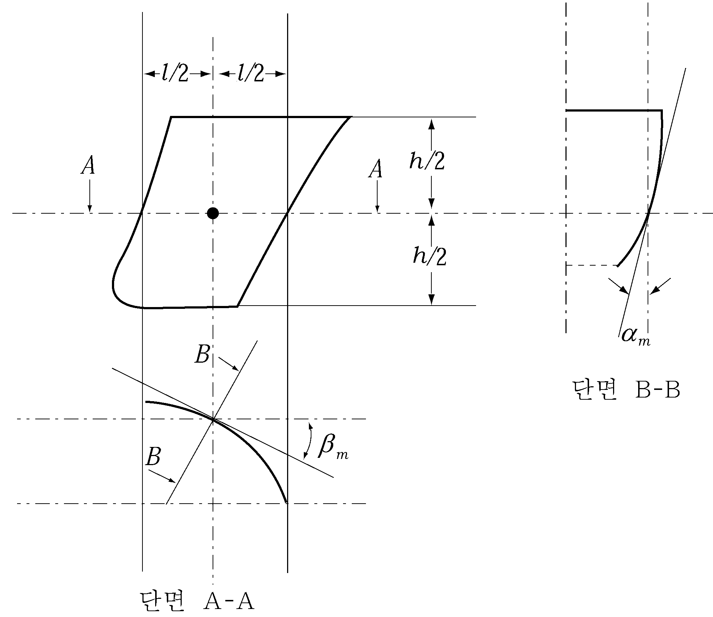

# 제4편 선체의장

> 선급 및 강선규칙/적용지침 / RA-04-K / 2025 / KO / Rules

## 제 3 장 선수문, 현문 및 선미문

### 제 1 절 선수문 및 내측문

#### 101. 일반

- **1.** **적용**
  - **(1)** 이 절의 규정은 둘러싸인 전통선루 또는 둘러싸인 긴 전부선루 또는 최소 선수높이와 동등한 높이를 얻기 위하여 설치된 둘러싸이지 않은 긴 선루로 통하는 선수문 및 내측문의 배치, 강도 및 잠금장치에 대하여 적용한다.
  - **(2)** 이 절의 규정은 국제항해에 종사하는 모든 로로여객선과 로로화물선에 적용하며, 이 장에서 별도로 규정하고 있지 않는 한 국내 항해에만 종사하는 모든 로로여객선과 로로화물선에도 적용하여야 한다. 다만, 기국 주관청이 별도로 규정하고 있는 경우에는 해당 기국의 요건에 따른다.
  - **(3)** 이 절의 규정은 고속선의 안전에 관한 IMO Code에서 정의한 고속경구조선 및 경구조선에는 적용하지 않는다.
  - **(4)** 1996년 6월 30일 이전에 건조된 모든 현존 로로여객선의 선수문 및 내측문은 우리 선급이 적절하다고 인정하는 지침에 따른다. **【지침 참조】**
- **2.** **선수문의 종류**
  이 절의 적용을 받는 선수문의 종류는 일반적으로 다음의 2종류로 구분한다. 다만, 다음 (1)호 및 (2)호와 다른 종류의 선수문의 경우에는 이 절의 적용과 관련하여 우리 선급이 특별히 인정하는 바에 따른다.
  - **(1)** 바이저형 선수문(visor door) : 종방향으로 배치된 리프팅 암에 의하여 선수문의 거더와 연결되고 선수문의 정부에 위치한 두 개 이상의 힌지를 통하여 수평축의 상방 및 바깥방향으로의 회전에 의하여 열려지는 선수문.
  - **(2)** 측면개방형 선수문(side-opening door) : 선수문의 외단에 위치한 두 개 이상의 힌지를 통하여 수직축의 바깥방향으로의 회전에 의하여 열려지거나 또는 회전축장치가 배치된 연결암의 수평방향 이동에 의하여 열려지는 선수문으로서 통상적으로 한 쌍의 문으로 구성된다.
- **3.** **배치**
  선수문 및 내측문의 배치에 대하여는 다음 각 호의 규정에 적합하여야 한다.
  - **(1)** 선수문은 건현갑판의 상방에 설치하여야 한다. 다만, 램프 또는 다른 기계적 장치의 설치로 인해 생기는 건현 갑판상의 수밀 리쎄스가 최고 만재흘수선 상방에 있고 선수격벽의 전부에 위치할 경우에는 수밀 리쎄스의 상방에 선수문을 설치할 수 있다.
  - **(2)** 선수격벽의 일부로 되는 내측문(inner door)을 설치하여야 한다. 다만, 이 내측문은 선수격벽의 직상에 올 필요는 없다. 또한 차량램프(vehicle ramp)가 선수격벽의 일부를 형성하고 그 위치가 **3편 14장 201.**의 선수격벽 위치에 관한 규정에 적합한 경우에는 내측문으로 간주할 수 있다. 상기를 만족하지 못하는 경우에는 별도의 풍우밀 내측문을 설치하여야 한다.
  - **(3)** 선수문 및 내측문은 선수문의 손상이나 이탈시 내측문 또는 선수격벽에 구조적 손상을 일으키지 않도록 배치하여야 한다. 만일 배치가 불가능한 경우에는 추가의 풍우밀 내측문을 **3편 14장 201.**의 규정의 범위 내에 설치하여야 한다.
  - **(4)** 선수문은 내측문을 유효하게 보호하고 운항상태에서 밀폐성을 확보할 수 있어야 한다. 또한, 선수격벽의 연장부를 형성하는 내측문은 화물구역의 전 높이에까지 풍우밀을 유지할 수 있어야 하며, 내측문의 후면에는 고정의 시일장치를 설치하여야 한다.
  - **(5)** 이 절의 내측문에 대한 규정은 차량이 격납위치에 유효하게 고정되어 있다는 것을 전제로 하는 것이다.
- **4.** **용어의 정의**
  이 절에서 사용하는 용어에 대한 정의는 다음 각 호에 따른다.
  - **(1)** 잠금장치
    잠금장치라 함은 선체에 배치된 회전축 또는 힌지에 대하여 문의 회전을 방지하여 문을 폐쇄한 상태로 유지하는 장치를 말한다.
  - **(2)** 지지장치
    지지장치라 함은 문에 작용하는 외부하중 또는 내부하중을 문으로부터 잠금장치로, 또한 잠금장치로부터 선체구조로 전달하는 장치를 말하며 문으로부터 선체구조로 하중을 전달하는 것 중 잠금장치가 아닌 힌지, 스토퍼 등을 포함한다.
  - **(3)** 고정장치
    고정장치라 함은 문을 폐쇄한 상태에서 잠금장치를 고정하는 장치를 말한다.
  - **(4)** 로로여객선
    로로여객선이란 로로구역 또는 특수분류구역을 가지는 여객선을 말한다.
  - **(5)** 로로구역
    로로구역이란 통상 여하한 방법으로도 구획됨이 없이 선박의 상당한 길이 또는 전장에 걸쳐 확장되어 있고 여기에서 자주용 연료탱크가 있는 차량 또는 화물[철도 또는 자동차, 차량(도로 또는 철도 탱크를 포함한다), 트레일러, 컨테이너, 팔레트, 탈부착가능 탱크, 유사한 보관장치 또는 다른 용기로 포장 또는 산적되는 화물]이 통상 수평방향으로 적양하될 수 있는 장소를 말한다.
  - **(6)** 특수분류구역
    특수분류구역이란 자주용 연료탱크를 가진 자동차를 운송하기 위한 격벽갑판의 상방 또는 하방의 폐쇄된 장소로서 이러한 자동차 및 여객이 출입할 수 있는 구역을 말하며, 총 내부높이가 10 $\mathrm{m}$를 넘지 않는 경우 한 개 이상의 갑판을 설치할 수 있다.

#### 102. 강도평가기준

- **1.** **1차 강도부재, 잠금 및 지지장치**
  선수문 및 내측문의 1차 강도부재와 잠금 및 지지장치의 강도는 다음 **표 4.3.1**의 허용응력을 사용하여 **103.**의 설계하중을 만족하도록 결정하여야 한다.

  **표 4.3.1 1차 강도부재와 잠금 및 지지장치에 대한 허용응력**

  | 구분 | 허용응력(N/mm^2) |
  | --- | --- |
  | 전단응력($\tau$) | $\tau = 80/K$ |
  | 굽힘응력($\sigma$) | $\sigma = 120/K$ |
  | 등가응력 $left( \sigma_e = \sqrt{\sigma^2 + 3 \tau^2} right)$ | $\sigma_e = 150/K$ |
  | $K$ : 사용된 재료의 재료계수로서 **표 4.3.2**에 따른다. |   |
- **2.** 선수문 및 내측문의 1차 강도부재는 충분한 좌굴강도를 가져야 한다.
- **3.** **잠금 및 지지장치의 강재 베어링 응력**
  잠금 및 지지장치의 강재 베어링의 경우 설계하중을 베어링 투영면적으로 나눈 베어링 공칭압력은 0.8 $\sigma_y$ 를 초과하여서는 안 된다.
  $\sigma_y$ : 베어링 재료의 항복응력
- **4.** **나사볼트의 인장응력**
  잠금 및 지지장치에 나사볼트를 사용하는 경우에는 나사볼트가 지지하중을 전달하여서는 아니 되며, 나사볼트의 최대인장응력은 125/$K$ (N/mm^2) 를 초과하여서는 안 된다.
  $K$ : 사용된 재료의 재료계수로서 **표 4.3.2**에 따른다.

#### 103. 설계하중

- **1.** **선수문**
  - **(1)** 외부압력
    선수문의 1차 강도부재, 잠금 및 지지장치의 강도계산시 고려하는 설계외부압력 $P_e$ 는 다음 식에 따른다.
    $P _{e} =2.75 \lambda C _{H} (0.22+0.15\tan \alpha ) (0.4V \sin \beta +0.6 \sqrt {L} ) ^{2}$(kN/m^2)
    $V$ : 선박의 속력(하기만재흘수상태에서 연속최대출력으로 전진항해 중 얻어지는 계획속력)(kt)
    $L$ : **3편 1장 102.**에 따른 선박의 길이(m). 다만, 200 m 보다 클 필요는 없다.
    $\lambda$ : 항해구역에 따른 계수
    근해구역이상을 항해하는 선박인 경우 $\lambda=1.0$
    연해구역을 항해하는 선박인 경우 $\lambda=0.8$
    평수구역을 항해하는 선박인 경우 $\lambda=0.5$
    $C_H$ : 선박의 길이에 따른 계수로서 **표 4.3.3**에 따른다.
    $\alpha$ : 고려하는 점에서의 플레어각(flare angle)으로서 외판의 접선과 수직선이 이루는 각을 말하며, 외판의 수평접선에 수직한 수직면으로부터 측정한다. (**그림 4.3.1** 참조)
    $\beta$ : 고려하는 점에서의 입수각(entry angle)으로서 수평면에서의 외판의 접선과 중심선에 평행한 종방향선이 이루는 각도를 말한다. (**그림 4.3.1** 참조)

    **표 4.3.2 재료계수** $K$

    | 재료기호 | $K$ |
    | --- | --- |
    | *A, B, D* 및 *E* | 1.0 |
    | *AH* 32, *DH* 32 및 *EH* 32 | 0.78 |
    | *AH* 36, *DH* 36 및 *EH* 36 | 0.72 |

    **표 4.3.3 계수** $C_H$

    | $L$ | $C_H$ |
    | --- | --- |
    | $L < 80 \mathrm{m}$ | $L/80$ |
    | $L \geq 80 \mathrm{m}$ | 1.0 |

    
    **그림 4.3.1 입수각 및 플레어각**
  - **(2)** 외부하중
    선수문의 잠금 및 지지장치의 강도계산시 고려하여야 할 설계외부하중은 다음 식에 의한 값 이상이어야 한다.
    $F_x = P_e _m A_x$
    $F_y = P_e _m A_y$
    $F _{z} =P _{e} _{m} A _{z}$
    $F_x$ : 종방향으로 작용하는 설계외부하중(kN)
    $F_y$ : 수평방향으로 작용하는 설계외부하중(kN)
    $F_z$ : 수직방향으로 작용하는 설계외부하중(kN)
    $A_x$ : 선수문의 하단에서 상갑판 불워크의 정부까지 또는 선수문의 하단에서 불워크가 선수문의 일부일 경우 불워크를 포함한 선수문의 정부까지 중 작은 값까지의 선수문의 정면투영면적(m^2)(**그림 4.3.2** 참조). 다만, 불워크의 플레어 각이 인접한 외판의 플레어 각보다 최소 15도보다 작은 경우 선수문의 하단으로부터의 높이는 상갑판까지 높이 또는 선수문의 정부까지 높이 중에서 작은 값까지 측정하며, 문의 하부로부터 상갑판 또는 문의 상부까지의 높이를 결정할 때 불워크는 제외한다.
    $A_y$ : 선수문의 하단에서 상갑판 불워크의 정부까지 또는 선수문의 하단에서 불워크가 선수문의 일부일 경우 불워크를 포함한 선수문의 정부까지 중 작은 값까지의 선수문의 측면투영면적(m^2)(**그림 4.3.2** 참조). 다만, 불워크의 플레어 각이 인접한 외판의 플레어 각보다 최소 15도보다 작은 경우 선수문의 하단으로부터의 높이는 상갑판까지 높이 또는 선수문의 정부까지 높이 중에서 작은 값까지 측정한다.
    $A_z$ : 선수문의 하단에서 상갑판 불워크의 전까지 또는 선수문의 하단에서 불워크가 선수문의 일부일 경우 불워크를 포함한 선수문의 정부까지 중 작은 값까지의 선수문의 평면투영면적(m^2)(**그림 4.3.2** 참조). 다만, 불워크의 플레어 각이 인접한 외판의 플레어 각보다 최소 15도보다 작은 경우 선수문의 하단으로부터의 높이는 상갑판까지 높이 또는 선수문의 정부까지 높이 중에서 작은 값까지 측정한다.
    $h$ : 선수문의 하단에서 상갑판까지 또는 선수문의 하단에서 선수문의 정부까지 중 작은 값까지의 선수문의 높이(m)
    $l$ : 선수문의 하단으로부터 높이 $h/2$ 에서의 선수문의 전후방향 길이(m)
    $P_em$: $\alpha$ 및 $\beta$ 대신에 $\alpha_m$ 및 $\beta_m$ 에서의 선수문에 작용하는 외부압력(kN/m^2)
    $\alpha_m$ : 선수재로부터 선수문의 후방으로 $l/2$ 까지의 점과 선수문의 하단으로부터 $h/2$ 까지의 점과의 교차점에서 측정한 플레어 각 (**그림 4.3.3** 참조)
    $\beta_m$ : 선수재로부터 선수문의 후방으로 $l/2$ 까지의 점과 선수문의 하단으로부터 $h/2$ 까지의 점과의 교차점에서 측정한 입수각(**그림 4.3.3** 참조)
    불워크를 포함하는 특수한 형태 또는 형상(예를 들면, 둥근 선수형상 및 큰 선수각을 갖는 형상)으로 선수문을 설치하는 경우에는 하중을 구하기 위하여 사용되는 면적 및 각도는 별도로 고려할 수 있다.
    
    **그림 4.3.2 상부 힌지식 선수문 (bow visor)**
    **그림 4.3.3** *am* **및** *bm*
  - **(3)** 바이저형 선수문의 폐쇄모멘트 $M_y$ 는 다음 식에 따른다.
    $M _{y} =F _{x} a+10W c-F _{z} b$(kN-m)
    $F_x$ 및 $F_z$ : 상기 (2)호에 따른다.
    $W$ : 선수문의 무게(kN)
    $a$ : 선수문의 회전중심(pivot)으로부터 선수문의 측면투영면적의 도심까지의 수직거리(m)
    $b$ : 선수문의 회전중심으로부터 선수문의 수평투영면적의 도심까지의 수평거리(m)
    $c$ : 선수문의 회전중심으로부터 선수문의 무게중심까지의 수평거리(m)
  - **(4)** 바이저형 선수문에 있어서 선수문 및 선체구조에 붙는 리프팅 암과 암의 연결부는 최소한 1.5 kN/m^2 의 풍압하에서 바이저의 권상 및 하강 작동시 작용하는 정적 및 동적하중에 견딜 수 있어야 하며, 이에 대한 계산서는 우리 선급에 제출되어야 한다.
- **2.** **내측문**
  - **(1)** 외부압력
    내측문의 1차 강도부재, 잠금 및 지지장치, 주위구조의 강도계산시 고려하는 설계외부압력 $P _{e}$는 다음 두 식에 의한 값 중 큰 값으로 한다.
    $P _{e1} =0.45 L {\mathrm{kN/m ^{2} }}, 정수압 P _{e2} =10 h {\mathrm{kN/m ^{2} }}$
    $h$ : 하중 작용점으로부터 화물구역의 정부까지의 거리(m)
    $L$ : **3편 1장 102.**에 따른 선박의 길이(m). 다만, 200 m 보다 클 필요는 없다.
  - **(2)** 내부압력
    내측문의 잠금장치의 강도계산시 고려하는 설계내부압력 $P_i$ 는 25 kN/m^2 이상이어야 한다.

#### 104. 선수문의 강도

- **1.** **일반**
  - **(1)** 선수문의 강도는 주위구조와 동등 이상의 강도를 가져야 한다.
  - **(2)** 선수문에는 적절한 일반 보강재를 설치하고 또한 폐쇄시 선수문의 수평 및 수직방향으로의 이동을 방지할 수 있는 장치가 있어야 한다. 바이저형 선수문에 있어서 선수문 및 선체구조에 붙는 리프팅 암의 연결부는 선수문의 개폐조작에 있어서도 충분한 강도를 가져야 한다.
- **2.** **1차 강도부재(primary structure)**
  1차 강도부재는 일반적으로 **103.**의 **1**항 (1)호에 의한 설계외부압력 및 **표 4.3.1**에 의한 허용응력과 관련하여 직접강도계산에 의하여 정하여야 하며, 보통은 단순보 이론식을 이용하여 굽힘응력을 결정할 수 있다. 1차 강도부재는 끝단부 연결부가 단순지지인 것으로 간주한다.
- **3.** **일반 보강재(secondary stiffeners)**
  일반 보강재는 선수문의 주 강성을 유지하는 1차 강도부재에 의하여 지지되어야 하며, 일반 보강재의 단면계수는 일반 보강재를 늑골로 보아 계산되는 그 위치에 있는 늑골의 단면계수 이상이어야 한다. 이때 휨 보강재와 늑골의 단부고착조건이 각각 다를 경우에는 이를 고려하여야 한다. 또한, 일반 보강재의 웨브의 단면적 $A$ 는 다음 식에 의한 값 이상이어야 한다.
  $A = \frac{Q K}{10}$(cm^2)
  $Q$ : 균일하게 분포된 외부압력 $P_e$ 을 사용하여 계산된 일반 보강재에 작용하는 전단력(kN)
  $P_e$ : **103.**의 **1**항 (1)호에 따른다.
  $K$ : 사용된 재료의 재료계수로서 **표 4.3.2**에 따른다.
- **4.** **판**
  선수문의 판 두께는 일반 보강재의 간격을 늑골간격으로 간주하여 계산되는 그 위치에서의 선측외판두께 이상이어야 한다. 또한, 어떠한 경우에도 규정에 의한 선수단 외판두께 미만이어서는 안 된다.

#### 105. 내측문의 강도

- **1.** **일반**
  - **(1)** 1차 강도부재는 일반적으로 **103.**의 **2**항 (1)호에 의한 외부압력 및 **표 4.3.1**에 의한 허용응력에 따른 직접강도계산에 따라 정하여야 한다. 보통은 단순보이론식을 적용할 수 있다.
  - **(2)** 내측문이 차량램프로 사용될 경우에 내측문의 강도는 차량갑판에 대하여 요구되는 갑판의 강도 이상이어야 한다.

#### 106. 선수문의 잠금 및 지지장치

- **1.** **일반**
  - **(1)** 선수문에는 주위구조의 강도와 강성과 동등한 잠금 및 지지장치를 설치하여야 한다.
  - **(2)** 선수문을 지지하는 선체구조는 잠금 및 지지장치의 설계하중 및 응력에도 만족하여야 한다.
  - **(3)** 패킹이 설치된 경우 패킹은 상대적으로 유연한 것이어야 하며 지지하중은 강구조에 의해서만 전달되어야 한다.
  - **(4)** 선수문의 잠금장치와 지지장치 사이의 설계최대틈새는 원칙적으로 3 mm를 초과하여서는 안 된다.
  - **(5)** 선수문에는 개방시에도 기계적으로 고정할 수 있는 장치가 있어야 한다.
  - **(6)** 선수문의 잠금 및 지지장치에 작용하는 지지반력의 계산시에는 각각의 방향으로 유효한 강성을 가지는 실제적인 잠금 및 지지장치만을 포함시켜 계산하여야 한다.
  - **(7)** 패킹재에 국부압축하중을 주는 클리트와 같이 작거나 유연한 장치는 강도계산시 포함시키지 않는다.
  - **(8)** 잠금 및 지지장치의 수는 일반적으로 **2**항 (6)호 및 (7)호의 규정을 고려하여 가능하면 최소로 하여야 한다.
  - **(9)** 바이저형 선수문의 회전축장치는 외부하중을 받는 상태에서 자발적으로 닫히는 구조로 배치하여야 한다 (즉, **103.**의 **1**항 (3)호에서 정의하는 폐쇄모멘트 $M_y >0$). 또한, 폐쇄모멘트 $M_y$ 는 다음 식에 의한 $M_yo$ 보다 작아서는 안 된다.
    $M_yo = 10 W c + 0.1 \sqrt{a^2 + b^2} \times \sqrt {F_x^2 +F_z^2}$(kN-m)
    $W$, $a$, $b$, $c$, $F_x$ 및 $F_z$ : **103.**에 따른다.
- **2.** **강도**
  - **(1)** 선수문의 잠금 및 지지장치는 **표 4.3.1**에 의한 허용응력의 범위 내에서 반력에 견딜 수 있도록 적절히 설계하여야 한다.
  - **(2)** 바이저형 선수문의 경우, 유효한 잠금장치 및 지지장치에 작용하는 반력은 선수문을 강체로 간주하여 선수문의 자중이 아래 유형의 각각의 하중과 동시에 작용하는 조합하중으로 한다.
    여기서, $F_x$, $F_y$ 및 $F_z$ 는 **103.**의 **1**항 (2)호에 의한 설계하중으로 투영면적의 도심에 작용한다.
    - **(가)** 유형 1 : $F_x$ 및 $F_z$
    - **(나)** 유형 2 : $0.7 F_x$ 및 $0.7 F_z$ 가 $0.7 F_y$ 와 동시에 작용하며, $0.7 F_y$ 는 각 현에 작용시켜야 한다.
  - **(3)** 측면 개방형 선수문의 경우, 유효한 잠금장치 및 지지장치에 작용하는 반력은 선수문을 강체로 간주하여 선수문의 자중과 아래 유형의 각각의 하중이 동시에 작용하는 조합 하중으로 한다.
    여기서, $F_x$, $F_y$ 및 $F_z$는 **103.**의 **1**항 (2)호에 의한 설계외부하중으로 투영면적의 도심에 작용한다.
    - **(가)** 유형 1 : $F_x$, $F_y$ 및 $F_z$
    - **(나)** 유형 2 : $0.7 F_x$ 및 $0.7 F_z$ 가 양쪽의 문에 $0.7 F_y$ 와 동시에 작용하며, $0.7 F_y$ 는 각각의 문에 작용시켜야 한다.
  - **(4)** 전 (2)호 (가) 및 전 (3)호 (가)에 의한 반력은 면적 $A _{x}$ 의 도심을 통과하는 횡축에 대한 모멘트를 0으로 하여야 한다. 바이저형 선수문에서는 이 모멘트를 생성시키는 핀 또는 쐐기의 지지에 의한 종방향 반력이 선수방향으로 작용하지 않도록 하여야 한다.
  - **(5)** 잠금 및 지지장치에 작용하는 반력의 분포는 원칙적으로 지지부재의 실제위치, 지지강성, 선체구조의 유연성을 고려한 직접강도계산에 따라야 한다.
  - **(6)** 잠금 및 지지장치는 어느 한 개의 잠금장치 또는 지지장치의 고장시에도 다른 장치에 작용하는 반력이 **표 4.3.1**에서 주어진 허용응력보다 20 %이상을 초과하지 않도록 설계하여야 한다.
  - **(7)** 바이저형 선수문의 경우, **표 4.3.1**에 의한 허용응력을 초과하지 않는 범위 내에서 문의 개방을 방지하는데 필요한 최대한의 반력을 줄 수 있는 2 개의 잠금장치를 문의 하단에 설치하여야 한다. 이 반력과 균형을 이루는 개방모멘트 $M_0$ 는 다음 식에 의한 값 이상이어야 한다.
    $M_0 = 10 W d + 5A_x a$(kN-m)
    $A_x$ : **103.**의 **1**항 (2)호에 따른다.
    $a$ : **103.**의 **1**항 (3)호에 따른다.
    $d$ : 선수문의 힌지축으로부터 선수문의 무게중심까지의 수직거리(m)
    $W$ : **103.**의 **1**항 (3)호에 따른다.
  - **(8)** 힌지를 제외한 바이저형 선수문의 잠금 및 지지장치는 **표 4.3.1**에 의한 허용응력의 범위 내에서 설계수직하중 ($F_z - 10$ W)에 견디어야 한다.
  - **(9)** 잠금 및 지지장치를 통하여 문으로부터 용접연결구조를 포함한 선체구조로의 설계하중의 전달 경로에 있는 모든 하중전달부재는 잠금 및 지지장치에 대하여 요구되는 강도기준을 만족하여야 한다. 이들 부재는 핀, 지지브래킷 및 이면 브래킷을 포함한다.
  - **(10)** 측면개방형의 선수문에 비대칭 압력이 작용하는 경우 한쪽 문이 다른 쪽 문의 방향으로 이동하지 않도록 2개의 문의 폐쇄부위의 1차 강도부재 단부에 추력베어링을 설치하여야 한다. (**그림 4.3.4** 참조) 추력베어링의 각 부분은 잠금장치에 의하여 다른 한 부분에 견고하게 유지되어야 한다.
    
    **그림 4.3.4 추력베어링의 일례**

#### 107. 잠금 및 고정장치

잠금장치에는 기계적인 고정장치(자동고정식 또는 별도의 장치)를 설치하거나 잠금장치를 중력식으로 하여야 하며, 그 장치는 다음 각 항의 규정에 적합하여야 한다.

- **1.** **작동**
  잠금장치는 쉽게 접근할 수 있어야 하며 간단하게 조작할 수 있는 구조이어야 한다. 또한 잠금 및 고정장치와 선수문의 개폐장치는 적절한 순서에 따라서만 연동되는 것이어야 한다.
  - **(1)** 유압식 잠금장치
    유압식 잠금장치가 설치된 경우 그 장치는 폐쇄상태에서 기계적으로 잠글 수 있어야 하며 작동유의 손실이 발생한 경우에도 고정상태를 유지할 수 있어야 한다. 폐쇄된 상태에서의 잠금 및 고정장치의 유압계통은 다른 유압계통과 독립된 것이어야 한다.
  - **(2)** 차량갑판으로 통하는 선수문 및 내측문에 대하여는 건현갑판상의 위치로부터 원격조작을 할 수 있는 다음의 장치를 설치하여야 한다.
    - **(가)** 문의 개폐
    - **(나)** 모든 문의 잠금 및 고정장치
  - **(3)** 원격제어
    모든 문과 잠금 및 고정장치의 개폐여부를 원격제어장소에 표시하여야 한다. 원격제어반은 허가된 인원만이 접근할 수 있도록 하여야 하며, 모든 원격제어반에는 선박이 출항전 모든 잠금장치를 페쇄․고정할 것을 지시하는 주의판과 경고등을 설치하여야 한다.
- **2.** **지시장치 및 감시장치**
  - **(1)** 선수문 및 내측문이 폐쇄되었으며 그 잠금장치 및 고정장치가 적절히 위치하고 있음을 나타내기 위하여 선교 및 작동반에는 별도의 지시등 및 가청경보를 설치하여야 한다. 지시반은 램프시험기능을 가져야 하며 지시등은 수동으로 끌 수 없도록 하여야 한다.
  - **(2)** 지시장치는 페일세이프원리에 따라 설계되어야 하며 문이 완전히 폐쇄되지 않거나 완전히 잠겨지지 않은 상태에서는 가시경보를, 고정장치가 열리거나 잠금장치가 고정되지 않은 상태에서는 가청경보를 발하여야 한다. 문의 작동 및 폐쇄용 지시장치의 동력원은 문의 작동 및 폐쇄용 장치의 동력원과 독립된 것이어야 하며, 비상전원 또는 기타 안전한 동력원 (예 : 무정전 급전장치(UPS))와 같은 기타의 안전한 급전장치로부터 백업용 급전장치를 갖추고 있어야 한다. 지시장치용 감지기는 물, 결빙 및 기계적 손상으로부터 보호되어야 한다.
  - **(3)** 선교의 지시반에는 “항내정박중/항해중”의 모드선택기능을 갖추고 있어야 하며 선수문 또는 내측문이 폐쇄되지 않은 상태 또는 고정장치 중의 어느 하나가 올바른 위치에 있지 않은 상태로 항내를 떠날 때 선교에서 들을 수 있는 가청경보를 발할 수 있어야 한다.
  - **(4)** 내측문을 통한 누수를 선교 및 기관제어실에 표시하기 위하여 경보장치 및 TV 감시장치를 갖춘 누수탐지장치를 설치하여야 한다.
  - **(5)** 선수문 및 내측문 사이에는 선교 및 기관제어실에 모니터를 갖춘 TV 감시장치를 설치하여야 한다. 이 장치는 문의 위치 및 충분한 수량의 고정장치를 감시하여야 한다. 감시 하에 있는 대상물의 조명 및 대비색에 대하여 특별히 고려하여야 한다.
  - **(6)** 선수문 및 램프 사이 또는 램프가 설치되지 않은 경우에는 선수문과 내측문 사이의 장소에 배수장치를 설치하여야 한다. 배수장치는 이들 장소의 수위가 0.5 m 또는 고수위경보 중 작은 값을 초과하는 경우에 선교에 가청경보를 발하는 기능을 갖추고 있어야 한다.
  - **(7)** 앞의 (2)호 내지 (6)호의 지시장치는 다음의 경우, 페일세이프원리에 따라 설계된 것으로 간주한다.
    - 정전경보
    - 접지고장경보
    - 램프시험기능
    - 문의 폐쇄 여부 및 문의 잠금 여부를 나타내는 별도의 표시
    - **(가)** 지시반에 다음을 갖추고 있을 때
    - **(나)** 문이 폐쇄되었을 때 리미트 스위치가 전기적으로 닫히는 경우 (여러 개의 리미트 스위치가 설치되어 있는 경우에는 이들을 직렬로 연결할 수 있다)
    - **(다)** 잠금장치가 제 위치에 놓여있을 때 리미트 스위치가 전기적으로 닫히는 경우 (여러 개의 리미트 스위치가 설치되어 있는 경우에는 이들을 직렬로 연결할 수 있다)
    - **(라)** 문의 폐쇄 여부 및 문의 잠금 여부를 나타내는 두 개의 전기회로를 (하나의 다심케이블 내에) 가지는 경우
    - **(마)** 리미트 스위치가 전위(轉位)되어 있는 경우에는 문이 폐쇄되지 않았음/잠기지 않았음/고정장치가 제 위치에 놓여있지 않음을 나타내는 적절한 표시가 있을 때
  - **(8)** 국제항해에 종사하는 로로여객선의 경우, 선박이 항해하는 동안 가혹한 기상상태에서의 선박의 모든 운동 또는 허락되지 않은 여객의 출입을 탐지할 수 있도록 특수분류구역 및 로로구역은 TV 감시장치와 같은 유효한 수단에 의하여 연속적으로 순찰 또는 감시되어야 한다.

#### 108. 작동 및 정비 지침서

- **1.** 선수문 및 내측문의 작동 및 정비지침서는 다음 각 호의 사항을 포함하여야 하며, 우리 선급의 승인을 받은 후 본선에 비치되어야 한다.
  - **(1)** 주요 요목 및 설계도면
    - **(가)** 특별안전 주의사항
    - **(나)** 선박의 상세
    - **(다)** 장비 및 설계하중(램프에 대한)
    - **(라)** 장비의 주요도면(문 및 램프)
    - **(마)** 장비에 대한 제조자가 권장하는 시험
    - **(바)** 장비의 상세
      - **(a)** 선수문
      - **(b)** 내측 선수문
      - **(c)** 선수 램프
      - **(d)** 선측문
      - **(e)** 선미문
      - **(f)** 중앙 전력팩
      - **(g)** 선교 패널
      - **(h)** 엔진제어실 패널
  - **(2)** 운항조건
    - **(가)** 적양하에 대한 선박의 제한적인 횡경사 및 트림
    - **(나)** 문 작동에 대한 선박의 제한적인 횡경사 및 트림
    - **(다)** 문과 램프의 작동 지침
    - **(라)** 문과 램프의 비상작동 지침
  - **(3)** 정비
    - **(가)** 정비 일정 및 범위
    - **(나)** 고장 판단 및 허용 한계
    - **(다)** 제조자의 정비절차
  - **(4)** 고정 잠금 지지장치에 대한 검사를 포함한 검사, 수리 및 새로 교체기록
    상기 언급된 항목들은 작동 및 정비 지침서에 포함되고 정비편에는 검사, 문제해결 및 허용/거절 요건 등에 관한 필요정보를 포함하여야 한다.
- **2.** 선수문 및 내측문의 폐쇄, 잠금에 관한 작동 절차서를 선내에 비치하여야 하며, 적절한 장소에 게시하여야 한다.

### 제 2 절 현문 및 선미문

#### 201. 일반

- **1.** **적용**
  - **(1)** 이 절의 규정은 건현갑판의 하부 및 둘러싸인 선루내의 현문(선수 격벽의 후방에 위치하는 부분) 및 선미문의 배치, 강도 및 잠금 장치에 대하여 적용한다.
  - **(2)** 1997년 6월 30일 이전에 건조된 모든 현존 로로여객선의 현문 및 선미문은 우리 선급이 적절하다고 인정하는 지침에 따른다. **【지침 참조】**
- **2.** **배치**
  - **(1)** 여객선의 선미문은 건현갑판상에 위치하여야 한다. 현문 및 로로화물선의 선미문은 건현갑판상부 또는 아래에 배치할 수 있다.
  - **(2)** 현문 및 선미문은 해당위치 및 주위의 구조와 동등한 강도 및 밀폐성을 가져야 한다.
  - **(3)** 현문 및 선미문의 하단은 원칙적으로 최고 만재흘수선의 상단으로부터 위로 230 mm인 점을 최하점으로 하여 선측에서 건현갑판에 평행하게 그은 선보다 아래에 있어서는 안 된다.
  - **(4)** 부득이 전 (3)호의 규정보다 낮은 위치에 문을 설치할 경우에는 다음의 조건을 만족하여야 한다.
    - **(가)** 수밀격벽과 동등한 강도 및 수밀성을 갖는 구획을 설치하고 내측문을 설치하여야 한다.
    - **(나)** 현문 또는 선미문과 내측문 사이와의 구획에는 해수누설 탐지장치를 설치하여야 하며 빌지 배수를 위하여 쉽게 접근하여 조작할 수 있는 장소에 나사조임식 체크 밸브붙이 배수장치를 설치하여야 한다.
  - **(5)** 문은 원칙적으로 바깥쪽으로 열리는 구조이어야 한다.
- **3.** **용어의 정의**
  이 절에서 사용되는 용어에 대한 정의는 **101.**의 **4**항에 따른다.

#### 202. 강도평가기준

- **1.** **1차 강도부재, 잠금 및 지지장치**
  현문 및 선미문의 1차 강도부재와 잠금 및 지지장치의 강도는 **표 4.3.1**의 허용 응력을 사용하여 **203.**의 설계하중을 만족하도록 결정하여야 한다.
- **2.** 현문 및 선미문의 1차 강도부재는 충분한 좌굴강도를 가져야 한다.
- **3.** **잠금 및 지지장치의 강재 베어링 응력**
  잠금 및 지지장치의 강재 베어링의 경우 설계하중을 베어링 투영면적으로 나눈 베어링 공칭압력은 $0.8 \sigma_y$를 초과하여서는 안 된다.
  $\sigma_y$ : 베어링 재료의 항복응력
- **4.** **나사볼트의 인장응력**
  잠금 및 지지장치에 나사볼트를 사용하는 경우에는 나사볼트가 지지하중을 전달하여서는 아니 되며, 나사볼트의 최대인장응력은 $125 /K$(N/mm^2)를 초과하여서는 안 된다.
  $K$ : 사용된 재료의 재료계수로서 **표 4.3.2**에 따른다.

#### 203. 설계하중

현문 및 선미문의 1차 강도부재, 잠금 및 지지장치의 강도계산시 고려하는 설계하중은 다음 각 항에 따른다.

- **1.** 선내측으로 열리는 문의 잠금장치 또는 지지장치에 작용하는 설계하중 :
  외부하중 : $F_e = A P_e + F_p$(kN)
  내부하중 : $F_i = F_0 + 10 W$(kN)
- **2.** 선외측으로 열리는 문의 잠금장치 또는 지지장치에 작용하는 설계하중 :
  외부하중 : $F_e = AP_e$(kN)
  내부하중 : $F_i = F_0 + 10 W + F_p$(kN)
- **3.** **1차 강도부재**에 작용하는 설계하중은 다음 2 개의 식에 의한 값 중 큰 값 이상이어야 한다.
  외부하중 : $F _{e} =AP _{e}$(kN)
  내부하중 : $F _{i} =F _{0} +10W$(kN)
  $A$ : 문으로 폐쇄되는 개구의 면적(m^2)
  $W$ : 문의 무게(ton)
  $F_p$ : 패킹이 설치된 경우의 전체 패킹반력으로서, 단위길이당 패킹반력은 5 N/mm 미만이어서는 안 된다.
  $F_0$ : $F_c$와 5$A$ (kN) 중 큰 값
  $F_c$ : 고박되지 않은 화물 등으로 인한 우발적 하중으로서, 면적 $A$ 에 균일분포하중으로 작용하며 원칙적으로 300 kN 이상이어야 한다. 다만, 벙커문(bunker-door)및 파일럿문(pilot door)과 같이 특별히 작은 문에 대하여는 $F_c$ 의 값을 적절히 경감할 수 있다. 또한, 내측램프(inner rampway)등의 부가적 구조물이 설치되어 고박되지 않은 화물 등으로 인한 우발적 하중으로부터 선수문을 보호할 수 있는 경우에는 $F_c$ 값을 0으로 할 수 있다.
  $P_e$ : 문개구의 무게중심으로부터 결정된 외부설계압력(kN/m^2)으로서 다음 식 이상이어야 한다.
  $Z_G < T$ 인 경우 $10(T - Z_G ) + 25$
  $Z_G \geq T$ 인 경우 25
  다만, 선수문이 설치된 선박의 선미문인 경우 $P_e$ 는 다음 식에 의한 값 이상이어야 한다.
  $P _{e} =0.6 \lambda C _{H} (0.8+0.6 \sqrt {L} ) ^{2}$(kN/m^2)
  $C_H$ : 선박의 길이에 따른 계수로서 **표 4.3.3**에 따른다.
  $L$ : **3편 1장 102.**에 따른 선박의 길이(m). 다만, 200 m 보다 클 필요는 없다.
  $Z_G$ : 기선에서 문의 면적의 중심높이
  $\lambda$ : 항해구역에 따른 계수
  근해구역 이상을 항해하는 선박인 경우 $\lambda$ = 1
  연해구역을 항해하는 선박인 경우 $\lambda$ = 0.8
  평수구역을 항해하는 선박인 경우 $\lambda$ = 0.5
  $T$ : 만재흘수 (m)

#### 204. 현문 및 선미문의 강도

- **1.** **일반**
  - **(1)** 원칙적으로 현문 및 선미문의 강도는 주위구조와 동등 이상의 강도를 가져야 한다.
  - **(2)** 현측외판의 문의 개구는 모서리를 둥글게 하여야 하며 개구의 상하 및 좌우는 스트링거 및 특설늑골 등을 설치하여 보강하여야 한다.
  - **(3)** 현문 및 선미문에는 적절한 일반 보강재를 설치하고 또한 폐쇄상태에서 문의 이동을 방지하는 장치를 설치하여야 한다. 리프팅 암 및 힌지와 문 및 선체구조와의 연결은 견고하게 고착시켜야 한다.
  - **(4)** 현문 및 선미문이 차량램프로 사용될 경우에는 힌지의 설계시 힌지에 균일하지 않은 하중이 작용하지 않도록 선박의 트림을 고려하여야 한다.
- **2.** **문의 두께**
  - **(1)** 현문 및 선미문의 두께는 일반 보강재의 간격을 늑골간격으로 보아 계산되는 그 위치의 선측외판의 두께 이상이어야 한다. 또한, 어떠한 경우에도 그 위치에 있는 외판의 최소두께 미만이어서는 안 된다.
  - **(2)** 현문 및 선미문이 차량램프로 사용될 경우에는 문의 두께는 차량갑판에서 요구되는 갑판의 두께 이상이어야 한다.
- **3.** **일반 보강재**
  - **(1)** 현문 및 선미문의 수평방향 또는 수직방향 일반 보강재의 단면계수는 일반 보강재를 늑골로 보아 계산되는 그 위치에 있는 늑골의 단면계수 이상이어야 한다. 이때 일반 보강재와 늑골의 단부 고착조건이 다를 경우에는 이를 고려하여야 한다.
  - **(2)** 차량램프로 사용되는 현문 및 선미문의 일반 보강재의 단면계수는 차량갑판에서 요구되는 보의 단면계수 이상이어야 한다.
  - **(3)** 현문 및 선미문의 일반 보강재는 필요에 따라 거더 또는 스트링거로 지지하여야 한다.
- **4.** **1차 강도부재**
  - **(1)** 1차 강도부재는 **203.**의 **3**항에 의한 설계하중 및 **표 4.3.1**에 의한 허용응력에 따른 직접강도계산에 따라 정하여야 하며, 보통은 단순보 이론식을 이용하여 굽힘응력을 결정할 수 있다. 1차 강도부재는 끝단부 연결부가 단순지지인 것으로 간주한다.
  - **(2)** 거더 또는 스트링거의 웨브는 현측외판에 수직한 방향으로 적절히 보강하여야 한다.
  - **(3)** 거더는 문의 주변지지부에 충분한 강성을 갖도록 설치하여야 한다.
  - **(4)** 일반 보강재 및 거더의 단부는 회전에 대하여 충분한 강성을 가져야 하며 다음 식에 의한 값 이상의 단면 2차모멘트$( I )$를 가져야 한다.
    $I=8P _{I} d ^{4}$(cm^4)
    $d$ : 잠금장치의 사이의 간격(m)
    $P_I$ : 문의 주위가장자리에 연한 단위길이당의 패킹반력으로서 5 N/mm 미만이어서는 안 된다.
  - **(5)** 잠금장치사이에 있는 주 거더를 지지하는 주변거더에 대하여는, 부가적 하중에 따라 단면2차모멘트를 증가시켜야 한다.

#### 205. 잠금 및 지지장치

- **1.** **일반**
  - **(1)** 현문 및 선미문의 잠금 및 지지장치는 인접구조와 비교하여 동등 이상의 강도와 강성을 유지하여야 한다.
  - **(2)** 현문 및 선미문에는 개방시에도 기계적으로 고정할 수 있는 장치가 있어야 한다.
  - **(3)** 현문 및 선미문을 지지하는 선체구조는 잠금 및 지지장치의 설계하중 및 응력에도 만족하여야 한다.
  - **(4)** 패킹이 설치된 경우 패킹은 상대적으로 유연한 것이어야 하며, 지지하중은 강구조에 의해서만 전달되어야 한다.
  - **(5)** 현문 및 선미문의 잠금장치와 지지장치와의 설계최대 틈새간격은 원칙적으로 3 mm 를 초과하여서는 안 된다.
  - **(6)** 현문 및 선미문의 잠금 및 지지장치에 작용하는 지지반력의 계산시에는 각각의 방향으로 유효한 강성을 가지는 실제적인 잠금 및 지지장치만을 포함시켜 계산하여야 한다.
  - **(7)** 패킹재에 국부압축하중을 주는 클리트와 같이 작거나 유연한 장치는 강도계산시 포함시키지 않는다.
  - **(8)** 잠금 및 지지장치의 수는 일반적으로 **2**항 (3)호의 규정을 고려하여 가능하면 최소로 하여야 한다.
- **2.** **강도**
  - **(1)** 잠금 및 지지장치는 **표 4.3.1**에 의한 허용응력의 범위 내에서 반력에 견딜 수 있도록 적절히 설계하여야 한다.
  - **(2)** 잠금 및 지지장치에 작용하는 하중의 배분은 원칙적으로 지지부재의 실제위치, 지지강성, 구조의 유연성을 고려한 직접강도계산에 따라야 한다.
  - **(3)** 잠금 및 지지장치는 어느 한 개의 잠금장치 또는 지지장치의 고장시에도 다른 장치에 작용하는 응력이 **표 4.3.1**에서 주어진 허용응력보다 20 % 이상을 초과하지 않도록 설계하여야 한다.
  - **(4)** 잠금 및 지지장치를 통하여 문으로부터 용접연결구조를 포함한 선체구조로의 설계하중의 전달경로에 있는 모든 하중전달부재는 잠금 및 지지장치에 대하여 요구되는 강도기준을 만족하여야 한다. 이들 부재는 핀, 지지브래킷 및 이면 브래킷을 포함한다.

#### 206. 잠금 및 고정장치

잠금장치에는 기계적인 고정장치(자동 고정식 또는 별도의 장치)를 설치하거나 잠금장치를 중력식으로 하여야 하며, 그 장치는 다음 각 항의 규정에 적합하여야 한다.

- **1.** **작동**
  잠금장치는 쉽게 접근할 수 있어야 하며, 간단하게 조작할 수 있는 구조이어야 한다. 또한 개폐장치, 잠금 및 고정장치는 적절한 순서에 따라서만 연동되는 것이어야 한다.
  - **(1)** 개구의 면적이 6 m^2 이상이고, 문의 어느 부분이 건현갑판 하부에 설치되는 현문 및 선미문에 대하여는 건현갑판상의 위치로부터 다음의 원격조작을 할 수 있는 장치가 설치되어야 한다.
    - **(가)** 문의 개폐
    - **(나)** 모든 문의 잠금 및 고정장치
  - **(2)** 원격제어
    원격제어장치가 요구되는 문의 경우에는 그 문과 관련된 잠금 및 고정장치의 개폐여부를 원격제어장소에 표시하여야 한다. 원격제어반은 허가된 인원만이 접근할 수 있도록 하여야 하며, 모든 원격제어반에는 선박이 출항전 모든 잠금장치를 폐쇄․고정할 것을 지시하는 주의판과 경고등을 설치하여야 한다.
  - **(3)** 유압식 잠금장치
    유압식 잠금장치가 설치된 경우 그 장치는 폐쇄상태 하에서 기계적으로 고정할 수 있어야 하며 작동유의 손실이 발생한 경우에도 고정상태를 유지할 수 있어야 한다. 폐쇄된 상태하에서의 잠금 및 고정장치의 유압계통은 다른 유압계통과 독립된 것이어야 한다.
- **2.** **지시 및 감시장치**
  이 규정은 로로화물구역 또는 특수분류구역의 경계의 일부가 되는 문에 적용한다. 다만, 화물선의 경우, 개구의 면적이 6 m^2 이하이고, 문의 모든 부분이 최상위의 흘수선보다 상부에 있는 문에는 적용하지 않는다.
  - **(1)** 지시장치
    지시장치는 다음 각 호에 적합한 페일세이프형(fail-safe type)으로 설계된 것이어야 한다.
    선교 및 제어반에는 문이 폐쇄되고 문의 잠금 및 고정장치가 적절히 고정되었음을 알리는 각각 독립된 지시등 및 가청경보 등을 설치하여야 한다.
    또한, 선교의 지시반은󰡒항내 정박중/항해중󰡓의 모드 선택기능을 가져야 하며, 항해중 현문 및 선미문이 완전히 폐쇄되지 아니한 상태이거나 어느 한 개의 잠금장치라도 제 위치에 고정되어 있지 아니할 경우에는 가청경보를 발할 수 있어야 한다.
    지시등은 수동으로 끌 수 없도록 하여야 하며, 지시반은 램프시험기능을 가져야 한다.
    지시계통에 공급되는 전원은 문의 개폐를 위하여 공급되는 전원과 분리된 것이어야 하며 예비전원장치가 마련되어야 한다.
    감지기는 기계적인 손상, 침수 또는 착빙으로부터 보호되어야 한다.
    - **(가)** 위치 및 형식
    - **(나)** 지시등
    - **(다)** 전원공급
    - **(라)** 감지기의 보호
  - **(2)** 누수에 대한 보호
    - **(가)** 여객선의 경우, 현문 및 선미문을 통한 누수의 탐지를 위하여 선교 및 기관 제어실에는 가청경보 및 TV 감시장치를 조합한 누수탐지장치를 설치하여야 한다.
    - **(나)** 화물선의 경우, 현문 및 선미문을 통한 누수의 탐지를 위하여 선교에 가청경보를 한 누수탐지장치를 설치하여야 한다.

#### 207. 작동 및 정비 지침서

- **1.** 현문 및 선미문의 작동 및 정비지침서는 다음 각 호의 사항을 포함하여야 하며, 우리 선급의 승인을 받은 후 본선에 비치되어야 한다.
  - **(1)** 주요 요목 및 설계도면
    - **(가)** 특별안전 주의사항
    - **(나)** 선박의 상세
    - **(다)** 장비 및 설계하중(램프에 대한)
    - **(라)** 장비의 주요도면(문 및 램프)
    - **(마)** 장비에 대한 제조자가 권장하는 시험
    - **(바)** 장비의 상세
      - **(a)** 선수문
      - **(b)** 내측 선수문
      - **(c)** 선수 램프
      - **(d)** 선측문
      - **(e)** 선미문
      - **(f)** 중앙 전력팩
      - **(g)** 선교 패널
      - **(h)** 엔진제어실 패널
  - **(2)** 운항조건
    - **(가)** 적양하에 대한 선박의 제한적인 횡경사 및 트림
    - **(나)** 문 작동에 대한 선박의 제한적인 횡경사 및 트림
    - **(다)** 문과 램프의 작동 지침
    - **(라)** 문과 램프의 비상작동 지침
  - **(3)** 정비
    - **(가)** 정비 일정 및 범위
    - **(나)** 고장 판단 및 허용 한계
    - **(다)** 제조자의 정비절차
  - **(4)** 고정 잠금 지지장치에 대한 검사를 포함한 검사, 수리 및 새로 교체기록
    상기 언급된 항목들은 작동 및 정비 지침서에 포함되고 정비편에는 검사, 문제해결 및 허용/거절 요건 등에 관한 필요정보를 포함하여야 한다.
- **2.** 현문 및 선미문의 폐쇄, 잠금에 관한 작동 절차서를 선내에 비치하여야 하며, 적절한 장소에 게시하여야 한다. 
