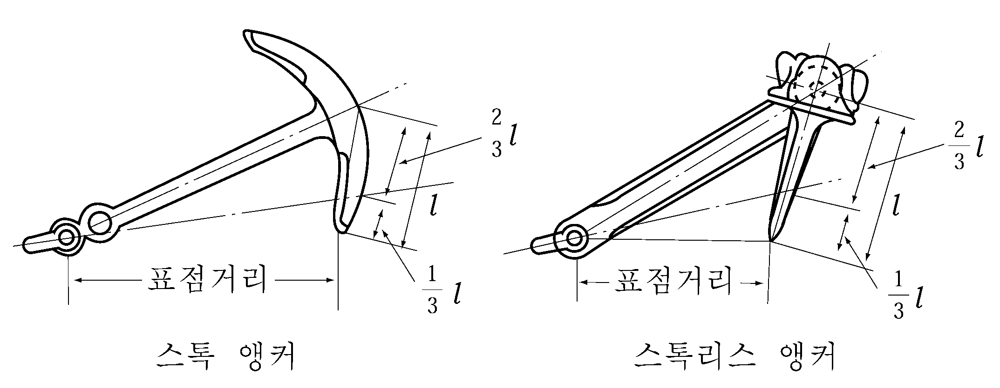
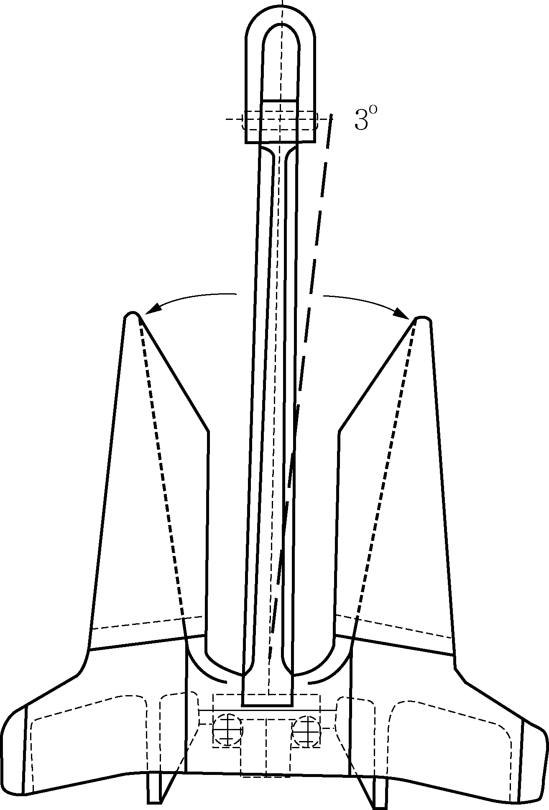
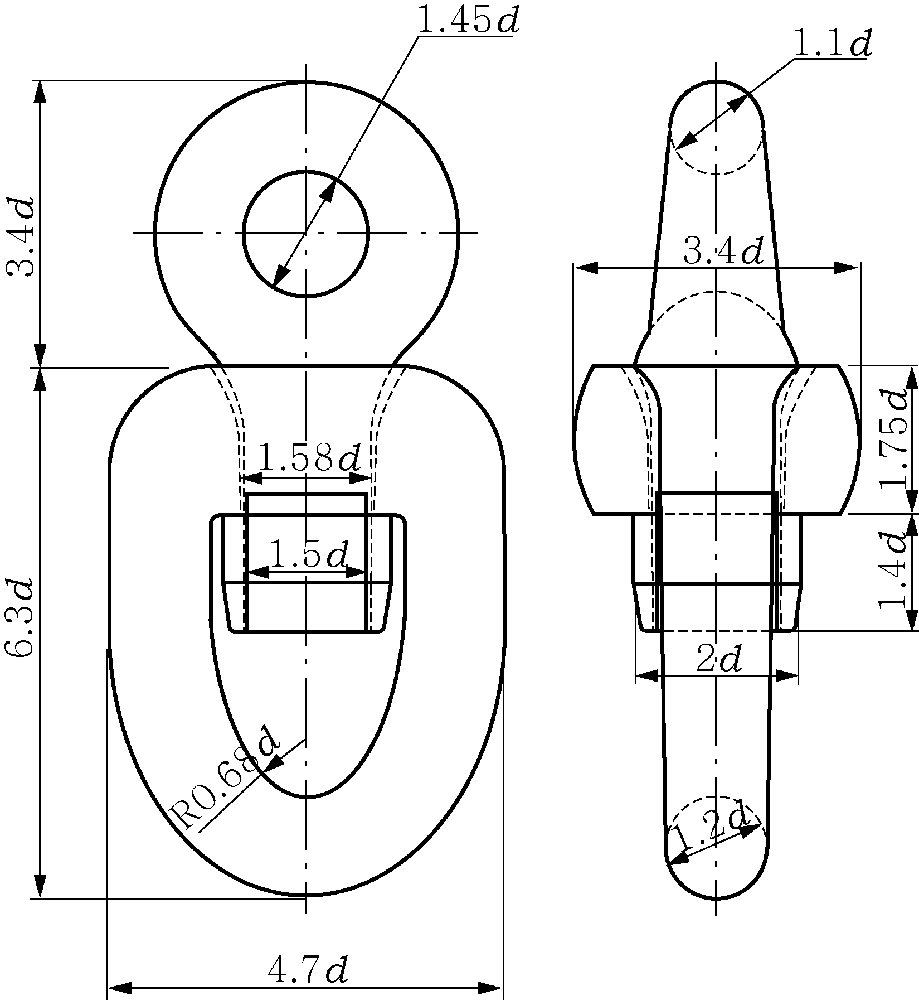
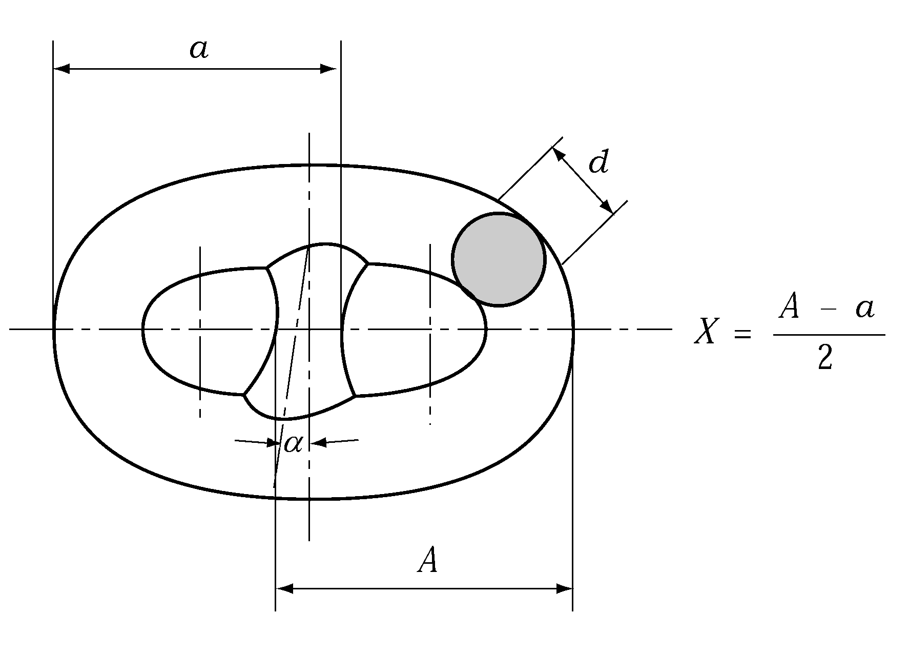
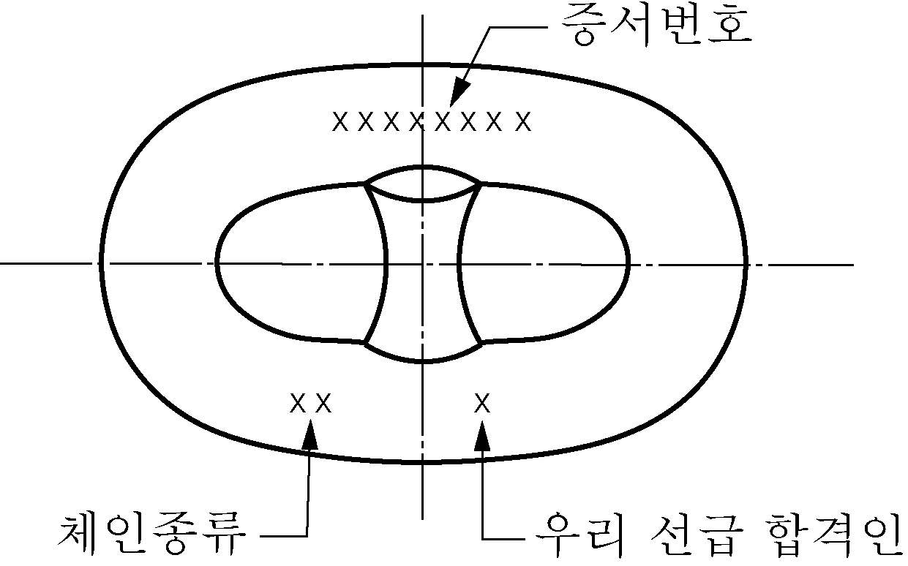
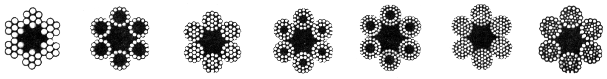
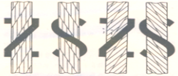

# 제4편 선체의장

> 선급 및 강선규칙/적용지침 / RA-04-K / 2025 / KO / Rules

## 제 8 장 의장수 및 의장품

### 제 1 절 일반사항

#### 101. 적용 및 일반 【지침 참조】

- **1.** 선박에는 2절에 규정하는 의장수에 따라 표 4.8.1에 정하는 것 이상의 앵커, 앵커체인 및 로프를 비치하여야 한다.
- **2.** **1 절**에서부터 **6절**까지의 묘박설비는 항로를 제한하지 않는 선박에 적용되며, **1절 101. 5.** (1) 나, **101. 5.** (6), **3절, 4절**은 항로제한이 있는 선박에 적용된다. 항로를 제한하지 않는 선박은 선급 부기부호상 선박 운영 환경에 대한 제한이 없는 국제항해에 종사하는 선박이다. *(2024)*
- **3.** 우리 선급에 등록한 선박에 사용하는 앵커, 앵커체인, 와이어로프 등(이하 의장품이라 한다)의 시험 및 검사를 필요로 하는 것은 이 장의 규정에 따른다.
- **4.** 이 장에서 규정하는 규격과 다른 의장품은 설계 및 용도에 관련하여 특별히 승인된 경우에 한하여 사용할 수 있다. 이 경우에는 해당 의장품의 제조법 등에 대한 상세한 자료를 제출하여 우리 선급의 승인을 받아야 한다.
- **5.** 선박에는 다음의 적절한 묘박설비를 설치하여야 한다.
  - **(1)** 일반사항
    - **(가)** 선박에는 적절한 묘박설비를 설치하여야 한다.
    - **(나)** **표 4.8.1**에 정하는 선수앵커는 앵커체인에 연결하여 항시 사용할 수 있도록 비치하여야 한다. 앵커 및 체인은 **3절** 및 **4절**의 요건에 따른다.
  - **(2)** 체인로커
    - **(가)** 체인로커는 체인케이블을 적절히 적재하고 체인이 완전히 적재되었을 때 체인을 스퍼링관을 통하여 용이하고 곧바로 배출할 수 있도록 충분한 용적을 가진 적절한 형태의 것이어야 한다. 양현의 체인로커는 분리되어 배치되어야 한다.
    - **(나)** 체인로커의 경계부 및 출입구는 수밀이어야하고 적절한 배수설비가 제공되어야 한다.
    - **(다)** 체인로커로 체인케이블을 인도하는 스퍼링관은 적절한 크기의 것이어야 하고 마모방지판이 제공되어야 한다.
    - **(라)** 앵커 체인의 내단 고정
      - **(a)** 앵커체인의 내단은 선체구조에 취부된 고정장치에 의하여 고박되어야하며, 이 고정장치는 앵커체인케이블 파단강도의 15%에서 30%의 하중을 견딜 수 있어야 한다.
      - **(b)** 이 고정장치는 비상시 체인로커 바깥쪽에서 접근 할 수 있는 위치에서 체인케이블을 고정장치부터 분리하여 해상에 투하시킬 수 있는 기능을 가지고 있어야 한다.
  - **(3)** 체인스토퍼
    - **(가)** 체인스토퍼는 체인이 배출될 때 고정할 수 있어야 한다.
    - **(나)** 체인스토퍼의 고정장치는 영구변형을 일으키지 아니하고, **411.**의 **표 4.8.8**에서 요구하는 체인의 절단하중의 80%의 하중에 견딜 수 있어야 한다.
  - **(4)** 양묘기(windlass)
    충분한 출력과 체인케이블의 크기에 적합한 양묘기가 설치되어야 한다. 다만 선주가 규칙요건을 크게 초과하는 설비를 요구하는 경우, 양묘기의 증가된 출력을 명시하는 것은 선주의 책임이다.
  - **(5)** 호저파이프
    - **(가)** 호저파이프는 체인케이블이 체인스토퍼로부터 선측으로 쉽게 배출될 수 있고 충분한 간격을 보장할 수 있도록 적절한 크기와 형상을 가지는 것이어야 한다. 또한 호저파이프는 충분한 강도를 가져야 한다.
    - **(나)** 호저파이프의 위치 및 기울기는 체인케이블을 쉽게 배출하고 접이식 앵커 격납에 있어서의 선체 손상을 피할 수 있는 효과적인 격납이 될 수 있도록 배치되어야 한다. 이를 위하여 체인케이블의 크기에 대하여 충분한 레이업(lay-up) 및 반경을 가진 적절한 형태의 마모방지판이 갑판 및 외판에 설치되어야 하고 호저파이프 주위의 외판은 필요한 경우 보강되어야 한다.
    - **(다)** 호저파이프가 설치되지 아니하는 경우, 대체장치가 특별히 고려되어야 한다.
    - **(라)** 호저파이프는 두꺼운 판, 덧댐판 또는 삽입판에 연속용접으로 확실히 부착되어야 한다.
    - **(마)** 호저파이프 및 앵커포켓은 체인케이블이 손상되는 것을 방지 하고, 케이블링크가 높은 굽힘응력을 받을 가능성을 최소화하기 위하여 완전원형플랜지 또는 고무로 된 바를 설치되어야 한다. 선박이 묘박 중일 때 체인케이블을 내리거나 올리는 동안 지지되는 부분인 호저파이프의 상단 및 하단의 곡률부위에서 최소한 세 개의 체인링크가 동시에 견딜 수 있도록 충분한 곡률반경을 가져야 한다.
    - **(바)** 구상선수를 가지는 선박에 있어 앵커의 운용 시 외판과 앵커 간에 충분한 간격이 보장될 수 없는 경우, 외판두께를 증가시킴으로써 구상선수의 국부보강을 하여야 한다.
  - **(6)** 양묘기(windlass) 및 체인스토퍼의 선체지지구조
    양묘기 및 체인스토퍼의 선체지지구조는 운전 및 파랑하중을 견디기에 충분하여야 한다.
    설계하중은 다음의 값 이상이어야 한다.
    - 체인스토퍼의 경우: 앵커체인절단하중의 80%
    - 체인스토퍼가 설치되지 않았거나 체인스토퍼가 양묘기에 부착된 경우의 양묘기: 앵커체인절단하중의 80%
    - 체인스토퍼가 설치되었으나 체인스토퍼가 양묘기에 부착되지 않은 경우의 양묘기: 앵커체인절단하중의 45%
    설계하중은 앵커체인의 방향으로 적용하여야 한다.
    파랑하중은 **9장 3절**에 따른다.
    양묘기 및 체인스토퍼의 선체지지구조에 대한 허용응력(주어진 부식 추가 tc를 빼어 얻어진 순두께에 기초)은 다음의 허용값 이하이어야 한다.
    - 법선응력(Normal stress) : 1.0 R_eH
    - 전단응력(Shear stress) : 0.6 R_eH
    법선응력은 굽힘응력과 축응력의 합이며, 이 때 전단응력은 법선응력에 직각 방향으로 작용하는 경우를 말한다. 응력집중계수는 고려하지 않는다.
    - 폰 미세스 응력(von Mises stress stress) : 1.0 R_eH
    유한요소해석을 통한 강도 평가의 경우, 요소은 가능한 실제와 유사하게 모델링될 수 있도록 충분히 작아야 한다. 요소의 종횡비는 3 미만이어야 한다. 거더는 쉘(shell) 또는 평면응력요소(plane stress elements)를 사용하여 모델링하여야 한다. 대칭형 거더 플랜지(symmetric girder flange)는 보 또는 트러스 요소로 모델링 할 수 있다. 거더 웨브(girder web) 요소의 높이는 웨브 높이의 1/3 미만이어야 한다. 거더 웨브의 작은 개구부 주변의 웨브 두께는 웨브 높이에 걸친 평균 두께로 감소시켜야 한다. 큰 개구부는 모델링하여야 한다. 보강재(stiffener)는 쉘, 평면응력 또는 보 요소를 사용하여 모델링 할 수 있다. 보강재 요소의 크기는 적절한 굽힘 응력을 얻을 수 있도록 작아야 한다. 쉘 또는 평면응력요소를 사용하여 평강(flat bar)을 모델링할 경우, 더미 로드 요소(dummy rod element)는 평강의 자유단에서 모델링하고, 더미 요소의 응력을 평가해야 한다. 응력은 개별 요소의 중심에서 읽어야 한다. 쉘 요소의 경우 응력은 요소의 중간 평면에서 평가하여야 한다.
    R_eH은 재료의 최소항복응력이다.
    부식추가($t _{c}$)는 다음의 값 이상이어야 한다.
    - 선체지지구조의 경우, 주변 구조물(예: 갑판 구조물, 불워크 구조물)에 대한 우리선급 규칙에 따른다.
    - 인정된 산업규격에 따른 의장설비의 일부가 아닌 갑판상 페데스탈 및 지지대의 경우: 2.0 mm
    - 인정된 산업규격을 선택하지 않은 선체의장설비인 경우: 2.0 mm.

    **표 4.8.1 선수앵커, 앵커체인 및 로프**

    | 의장기호 | 의장수 |   | 선수앵커 |   | 선수앵커용 체인 (스터드 체인) |   |   |   | 예인삭(tow line) |   |   | 계류삭(mooring line) |   |   |   |
    | --- | --- | --- | --- | --- | --- | --- | --- | --- | --- | --- | --- | --- | --- | --- | --- |
    | 의장기호 | 의장수 |   | 수 | 질량 (스톡리스 앵커의 단량)(kg) | 총 길이^1) (m) | 지름 |   |   | 개당길이(m) | 최소설계 파단하중 |   | 수 | 개당길이(m) | 최소설계 파단하중 |   |
    | 의장기호 | 초과 | 이하 | 수 | 질량 (스톡리스 앵커의 단량)(kg) | 총 길이^1) (m) | 제1종 (mm) | 제2종 (mm) | 제3종 (mm) | 개당길이(m) | SI단위 (kN) | 공학단위 (kg) | 수 | 개당길이(m) | SI단위 (kN) | 공학단위 (kg) |
    | A1 A2 A3 A4 A5 | - 70 90 110 130 | 70 90 110 130 150 | 2 2 2 2 2 | 180 240 300 360 420 | 220 220 247.5 247.5 275 | 14 16 17.5 19 20.5 | 12.5 14 16 17.5 17.5 |   | 180 180 180 180 180 | 98 98 98 98 98 | 10000 10000 10000 10000 10000 | 3 3 3 3 3 | 80 100 110 110 120 | 37 40 42 48 53 | 3750 4100 4300 4900 5400 |
    | B1 B2 B3 B4 B5 | 150 175 205 240 280 | 175 205 240 280 320 | 2 2 2 2 2 | 480 570 660 780 900 | 275 302.5 302.5 330 357.5 | 22 24 26 28 30 | 19 20.5 22 24 26 | 20.5 22 24 | 180 180 180 180 180 | 98 112 129 150 174 | 10000 11400 13200 15300 17700 | 3 3 4 4 4 | 120 120 120 120 140 | 59 64 69 75 80 | 6000 6500 7000 7650 8150 |
    | C1 C2 C3 C4 C5 | 320 360 400 450 500 | 360 400 450 500 550 | 2 2 2 2 2 | 1020 1140 1290 1440 1590 | 357.5 385 385 412.5 412.5 | 32 34 36 38 40 | 28 30 32 34 34 | 24 26 28 30 30 | 180 180 180 180 190 | 207 224 250 277 306 | 21100 22800 25500 28200 31200 | 4 4 4 4 4 | 140 140 140 140 160 | 85 96 107 117 134 | 8650 9800 10900 11900 13700 |
    | D1 D2 D3 D4 D5 | 550 600 660 720 780 | 600 660 720 780 840 | 2 2 2 2 2 | 1740 1920 2100 2280 2460 | 440 440 440 467.5 467.5 | 42 44 46 48 50 | 36 38 40 42 44 | 32 34 36 36 38 | 190 190 190 190 190 | 338 371 406 441 480 | 34500 37800 41400 45000 48900 | 4 4 4 4 4 | 160 160 160 170 170 | 143 160 171 187 202 | 14600 16300 17400 19100 20600 |
    | E1 E2 E3 E4 E5 | 840 910 980 1060 1140 | 910 980 1060 1140 1220 | 2 2 2 2 2 | 2640 2850 3060 3300 3540 | 467.5 495 495 495 522.5 | 52 54 56 58 60 | 46 48 50 50 52 | 40 42 44 46 46 | 190 190 200 200 200 | 518 559 603 647 691 | 52800 57000 61500 66000 70500 | 4 4 4 4 4 | 170 170 180 180 180 | 218 235 250 272 293 | 22200 24000 25500 27700 29900 |
    | F1 F2 F3 F4 F5 | 1220 1300 1390 1480 1570 | 1300 1390 1480 1570 1670 | 2 2 2 2 2 | 3780 4050 4320 4590 4890 | 522.5 522.5 550 550 550 | 62 64 66 68 70 | 54 56 58 60 62 | 48 50 50 52 54 | 200 200 200 220 220 | 738 786 836 888 941 | 75300 80100 85200 90600 96000 | 4 4 4 5 5 | 180 180 180 190 190 | 309 336 352 352 362 | 31500 34300 35900 35900 36900 |
    | G1 G2 G3 G4 G5 | 1670 1790 1930 2080 2230 | 1790 1930 2080 2230 2380 | 2 2 2 2 2 | 5250 5610 6000 6450 6900 | 577.5 577.5 577.5 605 605 | 73 76 78 81 84 | 64 66 68 70 73 | 56 58 60 62 64 | 220 220 220 240 240 | 1024 1109 1168 1259 1356 | 104400 113100 119100 128400 138300 | 5 5 5^3) | 190 190 190^3) | 384 411 437^3) | 39200 41900 44600^3) |

    **표 4.8.1 선수앵커, 앵커체인 및 로프 (계속)**

    | 의장기호 | 의장수 |   | 선수앵커 |   | 선수앵커용 체인 (스터드 체인) |   |   |   | 예인삭(tow line) |   |   | 계류삭(mooring line) |   |   |   |
    | --- | --- | --- | --- | --- | --- | --- | --- | --- | --- | --- | --- | --- | --- | --- | --- |
    | 의장기호 | 의장수 |   | 수 | 질량(스톡리스 앵커의 단량)(kg) | 총 길이 (m) | 지름 |   |   | 개당 길이 (m) | 최소설계 파단하중 |   | 수 | 개당 길이 (m) | 최소설계 파단하중 |   |
    | 의장기호 | 초과 | 이하 | 수 | 질량(스톡리스 앵커의 단량)(kg) | 총 길이 (m) | 제1종 (mm) | 제2종 (mm) | 제3종 (mm) | 개당 길이 (m) | SI단위 (kN) | 공학단위 (kg) | 수 | 개당 길이 (m) | SI단위 (kN) | 공학단위 (kg) |
    | H1 H2 H3 H4 H5 | 2380 2530 2700 2870 3040 | 2530 2700 2870 3040 3210 | 2 2 2 2 2 | 7350 7800 8300 8700 9300 | 605 632.5 632.5 632.5 660 | 87 90 92 95 97 | 76 78 81 84 84 | 66 68 70 73 76 | 240 260 260 260 280 | 1453 1471 1471 1471 1471 | 148200 150000 150000 150000 150000 |   |   |   |   |
    | J1 J2 J3 J4 J5 | 3210 3400 3600 3800 4000 | 3400 3600 3800 4000 4200 | 2 2 2 2 2 | 9900 10500 11100 11700 12300 | 660 660 687.5 687.5 687.5 | 100 102 105 107 111 | 87 90 92 95 97 | 78 78 81 84 87 | 280 280 300 | 1471 1471 1471 | 150000 150000 150000 |   |   |   |   |
    | K1 K2 K3 K4 K5 | 4200 4400 4600 4800 5000 | 4400 4600 4800 5000 5200 | 2 2 2 2 2 | 12900 13500 14100 14700 15400 | 715 715 715 742.5 742.5 | 114 117 120 122 124 | 100 102 105 107 111 | 87 90 92 95 97 |   |   |   |   |   |   |   |
    | L1 L2 L3 L4 L5 | 5200 5500 5800 6100 6500 | 5500 5800 6100 6500 6900 | 2 2 2 2 2 | 16100 16900 17800 18800 20000 | 742.5 742.5 742.5 742.5 770 | 127 130 132 | 111 114 117 120 124 | 97 100 102 107 111 |   |   |   |   |   |   |   |
    | M1 M2 M3 M4 M5 | 6900 7400 7900 8400 8900 | 7400 7900 8400 8900 9400 | 2 2 2 2 2 | 21500 23000 24500 26000 27500 | 770 770 770 770 770 |   | 127 132 137 142 147 | 114 117 122 127 132 |   |   |   |   |   |   |   |
    | N1 N2 N3 N4 N5 | 9400 10000 10700 11500 12400 | 10000 10700 11500 12400 13400 | 2 2 2 2 2 | 29000 31000 33000 35500 38500 | 770 770 770 770 770 |   | 152 | 132 137 142 147 152 |   |   |   |   |   |   |   |
    | O1 O2 | 13400 14600 | 14600 16000 | 2 2 | 42000 46000 | 770 770 |   |   | 157 162 |   |   |   |   |   |   |   |
    | (비고) 1. 앵커체인의 길이는 연결용 섀클을 포함하여도 좋다. 2. 예인삭 및 계류삭의 경우, 길이(개수) 및 최소설계파단하중은 참고자료로서 권장사항이며, 공칭용량조건(nominal capacity condition)에 규정된 갑판화물의 측면투영면적도 의장수 계산에 포함하여야 한다.(세부사항은 IACS Rec.10 Anchoring, Mooring and Towing Equipment 2.1 및 2.2 참조) 3. 계류삭의 경우, 의장수가 2000 이하인 선박에 대하여는 이 표의 값을 적용하고, 의장수가 2000을 초과하는 선박에 대하여는 우리 선급이 별도로 정하는 지침에 따른다. 4. 길이가 90m 미만인 선박은 **부록 4-4**의 대체방법을 사용할 수 있다. *(2024)* |   |   |   |   |   |   |   |   |   |   |   |   |   |   |   |
    - **(가)** 설계하중
    - **(나)** 파랑하중
    - **(다)** 허용응력
      - **(a)** 보 이론 또는 격자 해석을 통한 강도 평가:
      - **(b)** 유한요소해석을 통한 강도 평가:
    - **(라)** 부식추가
      - **(b)** 산적화물선 및 유조선 공통구조규칙이 적용되는 선박: 총 부식추가는 산적화물선 및 유조선 공통구조규칙에 명시된 바에 따른다.
      - **(c)** 기타 선박:

#### 102. 재료

- **1.** 이 장에서 규정하는 의장품에 사용하는 재료는 각 절 또는 **2편 1장**의 규정에 적합한 것이어야 한다.
- **2.** 의장품에 사용하는 재료에 대한 시험편 및 시험방법은 각 절 또는 **2편 1장**의 규정에 따른다.

#### 103. 제조법

이 장에 규정하는 의장품의 제조법에 대하여는 각 절의 규정에 따른다.

#### 104. 시험 및 검사

- **1.** 이 장에 규정하는 의장품은 이 장의 규정에 따라 우리 선급 검사원의 입회하에 시험 및 검사를 하고 이에 합격하여야 한다.
- **2.** 이 장에서 규정하는 규격과 다른 의장품의 시험 및 검사는 우리 선급에 의하여 승인된 시험규격에 따라 하여야 한다.
- **3.** 우리 선급이 적절하다고 인정하는 증명서를 가진 의장품에 대하여는 판단에 따라 해당 의장품의 시험 및 검사를 생략할 수 있다. **【지침 참조】**

#### 105. 시험 및 검사의 시행

- **1.** 제조자는 검사원이 승인을 받은 제조법을 준수하고 있다는 것을 확인하고자 하는 경우 또는 공장 내의 필요하다고 생각되는 곳에 출입하고자 하는 경우 그에 따른 편의를 검사원에게 제공하여야 한다.
- **2.** 의장품의 시험 및 검사는 제조공장에서 출하 전에 시행되어야 한다.

#### 106. 합격품의 표시

이 장에 규정하는 의장품에 대한 합격품의 표시는 각 절의 규정에 따른다.

### 제 2 절 의장수

#### 201. 의장수 【지침 참조】

의장수 $E$ 라 함은 다음 식에 의한 것을 말한다.

- **1.** h 계산 시 현호와 트림은 고려하지 않는다. 즉, h는 건현 중앙부에 B/4 보다 큰 폭을 갖는 각 층의 선루 및 갑판실의 중심선 높이를 더한 합이다.
- **2.** 너비가 B/4보다 큰 선루 및 갑판실이 너비가 B/4 이하인 선루 및 갑판실 위에 있으면 넓은 선루 및 갑판실은 포함되지만 좁은 선루 및 갑판실은 무시한다.
- **3.** 높이가 1.5 m 이상인 스크린(screen) 및 불워크는 h 및 A 의 계산 시 선루 또는 갑판실의 일부로 간주한다. 컨테이너와 같은 갑판상의 화물 높이와 창구코밍의 높이는 h 및 A의 계산에 포함하지 아니 한다. A 를 결정함에 있어, 불워크의 높이가 1.5 m 이상인 경우, 아래 그림에서 A2로 표시되는 면적이 A에 포함되어야 한다.
  
- **4.** 의장수 계산용 길이(equipment length)는 하계만재흘수선상(흘수선의 전방 끝에서 측정) 최대길이의 96 % 미만이어서는 아니 되며 97 %를 넘을 필요는 없다.
- **5.** 선박에 다수의 연돌이 설치될 경우, 위의 변수들은 다음을 따른다.
  $h _{F}$ : 연돌의 유효 높이(m), 상갑판 또는 국부적인 불연속부가 있는 상갑판의 경우 가상 갑판선(notional deck line)으로부터 가장 높은 연돌의 상단까지 측정한 연돌의 높이. 최상층 연돌의 상단은 각 연돌 너비의 합이 B/4인 지점에서 설정하여야 한다.
  $A _{FS}$ : 각 연돌의 전면투영면적 합(m²), 상갑판 또는 국부적인 불연속부가 있는 상갑판의 경우 가상 갑판선(notional deck line)과 유효 높이($h _{F}$) 사이의 계산값. 각 연돌 너비의 합이 연돌의 높이를 따라 B/4보다 작거나 같으면 $A _{FS}$는 0으로 간주한다.
  $A$ : 측면투영면적(m²), 의장 계산용 길이(equipment length) L의 범위 내에 있고 너비가 B/4를 넘는 하기만재흘수선 상부의 선체, 선루, 갑판실 및 연돌의 측면투영면적. $A _{FS}$가 0보다 클 경우, 연돌 측면투영면적 합은 측면투영면적 A에 고려되어야 한다. 전체 측면투영면적에 횡 방향 연돌의 차폐 효과를 고려할 수 있다. 즉, 둘 이상의 연돌 측면투영면적이 전체 또는 일부분이 겹치는 경우, 중첩된 면적은 한 번만 계산한다.

#### 202. 앵커의 질량

- **1.** **표 4.8.1**에 정하는 수와 같은 수의 선수앵커(bower anchor)의 합계질량이 동표에 정하는 질량 및 수를 곱한 것보다 적지 않을 때에는 개개의 앵커 질량은 **표 4.8.1**에 정하는 것에 ±7 %의 범위 내에서 증감할 수 있다. 다만, 특히 우리 선급의 승인을 얻은 경우에는 7 %의 범위를 넘는 질량을 증가한 앵커를 사용할 수 있다.
- **2.** 스톡앵커를 사용할 경우에는 **표 4.8.1**에 정하는 질량 대신에 스톡을 제외한 질량을 표의 값의 0.8 배로 한다.
- **3.** 고파지력의 앵커를 사용하는 경우에는 **표 4.8.1**에 정하는 질량 대신에 그 질량을 표에 정하는 값의 0.75 배로 할 수 있다.
- **4.** 초고파지력 앵커를 사용하는 경우에는 **표 4.8.1**에 정하는 질량 대신에 그 질량을 표에 정하는 값의 0.5 배로 할 수 있다. 단, 초고파지력 앵커의 질량은 1500 kg 을 초과할 수 없다.

#### 203. 앵커체인

- **1.** 선수앵커용 체인은 **4절**에서 규정하는 제1종, 제2종 또는 제3종의 스터드(stud)붙이 체인이어야 한다. 다만, 고파지력의 앵커를 사용할 경우에는 **4절**에서 규정하는 제1종 체인용 원강(RSBC 31)제의 제1종 체인을 사용하여서는 안 된다.
- **2.** 선미앵커(stream anchor)용 체인 및 와이어로프는 각각 **4절** 및 **5절**에서 규정하는 절단하중이 **표 4.8.1**에 정하는 절단하중 이상이어야 한다.
- **3.** 크레인 부선과 같은 특수한 선박의 경우, 와이어로프 사용에 대하여는 우리 선급이 별도로 정하는 지침에 따른다. **【지침 참조】**
- **4.** 선수앵커용 체인의 총길이는 선수앵커 2개에 대략 동등하게 나누어져야 한다.
- **5.** 다음의 경우 와이어로프가 앵커체인 대신 사용될 수 있다. *(2024)*
  - **(1)** 길이가 90m 미만인 선박에 비상시 앵커를 사용하는 경우. (정상 작업시 제외) 또는,
  - **(2)** 최소 4개 지점의 앵커링을 위해 케이블이나 파이프 부설과 같은 위치 지정에 사용되는 앵커링 설비를 가지는 경우.
- **6.** 와이어로프의 사용은 다음과 같은 조건에 따른다. *(2024)*
  - **(1)** 와이어로프의 길이는 **표 4.8.1**의 선수앵커용 체인 총길이의 1.5배와 같아야 하고, 강도는 **표 4.8.8**의 제1종 체인의 강도와 같아야 한다.
  - **(2)** 앵커의 무게는 **표 4.8.1**에 따른 앵커체인에 해당되는 앵커에 비해 25% 증가되어야 한다.
  - **(3)** 12.5 m 또는 앵커격납위치와 윈치 사이의 거리 중 짧은 쪽 길이의 앵커체인을 와이어로프와 앵커사이에 끼워 넣어야 한다.
  - **(4)** 와이어와 접촉하는 모든 표면은 와이어로프 직경(스템 포함) 10배 이상의 반경으로 둥글어야 한다.
  - **(5)** 스틸 와이어는 제조업체의 권장사항에 따라 용도에 맞게 선택되어야 하며 유지 보수 및 점검을 위한 지침이 제공되어야 한다.

#### 204. 예인삭 및 계류삭

- **1.** 예인삭(tow line) 및 계류삭(mooring line)에 사용하는 와이어로프 및 섬유로프는 각각 **5절** 및 **6절**에 규정하는 절단하중이 **표 4.8.1**에서 정하는 절단하중 이상이어야 한다.
- **2.** **201.**에서 규정하는 $A$ 의 값과 의장수와의 비율이 0.9 를 넘는 선박의 계류삭의 수는 **표 4.8.1**에 정하는 수에 다음 표에 정하는 수를 더한 것으로 하여야 한다. 다만, 의장수가 2000 이하의 경우에만 적용한다.

  | $\frac{A}{E}$ | 계류삭의 수 |
  | --- | --- |
  | $0.9 < \frac{A}{E} \leq 1.1$ | 1 |
  | $1.1 < \frac{A}{E} \leq 1.2$ | 2 |
  | $\frac{A}{E} > 1.2$ | 3 |

  **3 . 표 4.8.1**에 정하는 수와 같은 수의 계류삭의 합계 길이가 동표에 정하는 길이와 수를 곱한 것보다 감소하지 않는 경우에는 개개의 계류삭의 길이는 동표에 정한 것으로부터 7 %의 범위 내에서 감하여도 좋다.
- **4.** 계류삭으로서 사용되는 와이어로프 중 윈치 등에 의하여 조작되고 드럼에 감기는 것에 대하여는 우리 선급의 승인을 받아 섬유로프 심 대신에 와이어로프 심의 것을 사용하여도 좋다.

#### 205. 탱커 비상예인장치

- **1.** 재화중량톤수 20,000 톤 이상의 국제항해를 하는 모든 탱커의 선수 및 선미 양쪽에 비상예인장치를 설치하여야 한다.
- **2.** 2002년 7월 1일 이후에 건조된 탱커는 다음에 따른다.
  - **(1)** 피예인 선박에 주전원이 공급되지 않는 경우에도 항상 신속하게 전개될 수 있어야 하며, 예인하는 선박에 쉽게 연결될 수 있어야 한다. 하나 이상의 비상예인 장치는 신속한 전개를 위하여 미리 장착되어 준비되어 있어야 한다.
  - **(2)** 선수미 양쪽의 비상예인장치는 선박의 크기 및 재화중량톤수, 그리고 기상악화 상태에서 예상되는 힘을 고려하여 충분한 강도를 가져야 한다. 비상예인장치의 설계 및 건조 그리고 형식시험은 **제조법 및 형식승인 등에 대한 지침 제3장 7-1절**의 규정에 따른다.
- **3.** 2002년 7월 1일 이전에 건조된 탱커에 대한 비상예인장치의 설계 및 건조 그리고 형식시험은 **제조법 및 형식승인 등에 대한 지침 제3장 7-1절**의 규정에 따른다.

### 제 3 절 앵커

#### 301. 적용

이 장의 규정에 따라 장비하는 앵커는 이 절의 규정에 적합한 것 또는 이와 동등 이상의 효력의 것이어야 한다.

#### 302. 종류

앵커의 종류는 다음의 3종류로 한다.

#### 303. 재료

- **1.** 주강재 앵커플루크, 생크, 스위블 및 앵커샤클(anchor shackle)은 **규칙 2편 1장 501.**에 따라 제조 및 시험되어야 하며, 용접구조용 주강품에 대한 요건에 적합하여야 한다. 주강은 알루미늄 첨가에 의한 입자미세화 처리를 하여야 하며, **309.**의 **1**항에서 정하는 시험방안 B가 선택된 경우, 샤르피 V 노치 충격시험을 하여야 한다.
- **2.** 단강재 앵커 핀, 생크, 스위블 및 앵커 링은 **규칙 2편 1장 601.**에 따라 제조 및 시험되어야 하며 생크, 스위블 및 앵커 링은 **규칙 2편 1장 601.**의 선체 및 일반용 탄소강 단강품에 대한 요건에 적합하여야 한다.
- **3.** 강재 조립 앵커용 압연 빌렛, 강판 및 봉강은 **규칙 2편 1장 301.**에 따라 제조 및 시험되어야 한다.
- **4.** 핀, 스위블 및 앵커 링에 사용되는 압연봉강은 **규칙 2편 1장 301.** 및 **601.**에 따라 제조 및 시험되어야 한다.
- **5.** 주강재 초고파지력의 앵커에 대하여는 다음과 같이 충격시험을 실시하여야 한다.
  - **(1)** **2편 1장**에 규정한 V 노치 충격시험편 1조(3 개)를 채취한다.
  - **(2)** 충격시험은 0°C 에서 실시하며 평균흡수에너지는 27 J 이상이어야 한다. 다만, 시험편중 2 개 이상이 평균흡수에너지가 27 J 에 미치지 못하거나 1 개 시험편의 평균흡수에너지가 19 J 이하이면 그 시험은 불합격으로 한다.
  - **(3)** 초고파지력 앵커의 앵커링은 **8장 표 4.8.10**의 제3종 체인의 충격시험 규정에 적합하여야 한다.
- **6.** 모든 초고파지력 앵커는 다음의 재료 요건에 적합하여야 한다.

  | 강재 용접 앵커 | **규칙 2편 1장 301.** - 선체 구조용 압연강재(연강 및 고장력강) |
  | --- | --- |
  | 강재 용접 앵커 | **규칙 2편 2장 6절** - 선체 구조용 압연강재(연강 및 고장력강)에 대한 용접용재료의 승인 |
  | 주강재 앵커 | **규칙 2편 1장 501.** - 선체 및 기관용 주강품 |
  | 앵커섀클 | **규칙 2편 1장 601.** - 선체 및 기관용 단강품 |
  | 앵커섀클 | **규칙 2편 1장 501.** - 선체 및 기관용 주강품 |
  - **(1)** 초고파지력 용접 앵커 모재의 강재 등급은 **규칙 3편 1장 405.**의 Ⅱ급에 대한 재료 등급요건을 고려해 선택하여야 한다.
  - **(2)** 용접용재료는 **규칙 2편 2장 6절**에 따라 모재의 강재 등급에 대한 인성을 만족하여야 한다.
  - **(3)** 초고파지력 앵커의 앵커섀클의 인성은 **4절**에 따라 제3종 체인의 인성을 만족하여야 한다.

#### 304. 구조 및 치수

- **1.** 앵커의 구조 및 모양은 우리 선급이 인정하는 기준(JIS 등)에 적합한 것 또는 이와 동등한 규격에 적합한 것을 원칙으로 하며, 특수한 모양의 구조 및 치수에 대하여는 제조 전에 미리 우리 선급의 승인을 받아야 한다.
- **2.** 고파지력의 앵커 및 초고파지력 앵커는 전 **1**항에 따르는 이외에 우리 선급에서 지정하는 파지력으로서 시험을 하고 이에 합격하여야 한다. **【지침 참조】**
- **3.** 조립앵커의 용접 제작은 우리 선급의 승인을 받은 절차에 따라야 하며, 용접은 우리 선급의 기량자격을 인정받은 용접사가 승인을 받은 용접용 재료를 사용하여 승인된 용접절차시방서에 따라 실시하여야 한다.
- **4.** 앵커의 조립 및 맞춤은 설계 상세에 따라야 한다. 앵커 핀, 앵커링 핀 또는 스위블 너트를 용접으로 고착하는 경우에는 사전에 용접방법에 관하여 우리 선급의 승인을 받아야 한다.

#### 305. 열처리

- **1.** 앵커에 사용되는 주강품 및 단강품은 **2편 1장**에 따라 적절히 열처리 된 것을 사용하여야 한다.
- **2.** 압연강재의 용접구조형 앵커에 대해서는 필요 시 용접두께에 따른 응력제거를 하여야 하며, 응력제거는 승인된 용접절차에 따라 시행되어야 한다. 이때 열처리 온도는 모재의 템퍼링온도를 초과하여서는 안 된다.

#### 306. 품질 및 결함보수

- **1.** 앵커에는 크랙, 노치, 불순물 등 성능에 영향을 미치는 결함이 있어서는 안 된다.
- **2.** 주강재 및 단강재 앵커의 결함보수에 대해서는 **2편 1장 501.** 및 **601.**에 따르고, 용접조립 앵커의 보수는 검사원의 승인을 받아 우리 선급의 기량자격을 인정받은 용접사가 승인된 용접절차에 따라 수행하여야 한다.

#### 307. 형상 및 치수

- **1.** 앵커암의 길이는 다음에 따른다.
  - **(1)** 앵커암의 길이란 앵커생크와 앵커암을 헤드핀으로 연결한 앵커에서는 그 헤드핀의 중심으로부터 기타의 앵커에서는 크라운으로부터 각각 앵커플루크(fluke)의 선단에 이르는 거리($l$)를 말한다.(**그림 4.8.3** 참조)
  - **(2)** 크라운부가 오목형으로 된 앵커에서는 앵커암의 정점에 접하는 평면과 앵커생크의 중심선과의 교점을 크라운으로 간주 한다.
    
    **그림 4.8.3**
- **2.** 앵커 각부의 조립 등의 상세는 특별히 우리 선급의 승인을 받은 경우를 제외하고는 다음 각 호에 따른다.
  - **(1)** 앵커생크와 앵커링과의 연결부의 간격은 질량에 따라 **표 4.8.2**에 따른다.
  - **(2)** 앵커링 핀은 앵커링 아이(eye)에 테이퍼를 가지는 형식으로 밀어넣기식(push fit)으로 취부 되어야 하며, 핀과 구멍의 직경차의 허용치는 앵커링 핀의 직경에 따라 **표 4.8.3**에 따른다.
  - **(3)** 헤드핀은 이동을 방지하기 위해 충분한 길이를 유지하여야 하며, 헤드핀과 챔버(chamber) 길이의 차는 챔버길이의 1 % 이내이어야 한다.
  - **(4)** 앵커생크의 기울기는 3도를 초과하여서는 안 된다. (**그림 4.8.4** 참조)
- **3.** 앵커 치수의 측정 등은 제조자의 책임 하에 실시하여, 검사 시 관련기록을 제출하여야 한다.

  | 앵커의 질량(t) | 초과 이하 | - 3 | 3 5 | 5 7 | 7 - |
  | --- | --- | --- | --- | --- | --- |
  | 연결부의 간격(mm) | 이하 | 3 | 4 | 6 | 12 |

  | 앵커링 핀의 직경(mm) | 57 이하 | 57 초과 |
  | --- | --- | --- |
  | 직경의 차(mm) | 0.5 이하 | 1.0 이하 |

  
  **그림 4.8.4 앵커생크의 경사 허용범위**

#### 308. 질량

- **1.** 스톡앵커의 스톡질량은 스톡을 제외한 앵커 질량의 1/4 이상이어야 한다.
- **2.** 스톡리스 앵커의 앵커생크를 제외한 질량은 앵커의 질량의 3/5 이상이어야 한다.
- **3.** 스위블이 일체형이 아닌 경우에는 앵커의 질량에서 제외한다.
- **4.** 앵커 질량의 측정은 내력시험을 행하기 전에 제조자의 책임 하에 실시하여 검사 시 관련기록을 제출하여야 한다.
- **5.** 스톡앵커에서는 스톡을 제외한 질량과 스톡의 질량을 각각 측정하고, 스톡리스앵커에서는 앵커의 전 질량과 앵커생크의 질량을 측정한다.

#### 309. 앵커의 시험 및 검사

- **1.** **시험방안**
  - **(1)** 앵커의 시험 및 검사는 다음의 시험방안 A 또는 B중 어느 하나를 선택하여 실시하여야 한다.

    | 시험방안 A | 시험방안 B |
    | --- | --- |
    | 낙하시험 해머링시험 내력시험 외관검사 일반 비파괴검사 - | 낙하시험 - 내력시험 외관검사 일반 비파괴검사 정밀 비파괴검사 |
  - **(2)** 재료의 종류별로 적용 가능한 시험방안은 다음에 따른다.

    | 제품시험 | 제품 |   |   |
    | --- | --- | --- | --- |
    | 제품시험 | 주강재 부품 | 단강재 부품 | 용접구조형 부품 |
    | 시험방안 A | O | X | X |
    | 시험방안 B(1) | O(2) | O | O |
    | 비고 (1) 시험방안 B에서 낙하시험은 주강재 앵커에 한하여 추가한다. (2) 충격시험은 0°C 에서 실시하며 평균흡수에너지는 27 J 이상이어야 한다. |   |   |   |
- **2.** **낙하시험 및 해머링 시험**
  앵커에 사용되는 주강품은 시험방안 A의 경우, 내력시험을 하기 전에 다음의 각 호에 대한 시험을 하고 이에 합격하여야 한다.
  - **(1)** 낙하시험
    - **(가)** 앵커에 사용되는 주강재 부품은 4 m 의 높이에서 경질의 지반위에 설치한 강반(steel slab) 상에 각각 낙하시켜도 균열, 기타의 결함이 생겨서는 안 된다.
    - **(나)** 앵커생크와 앵커암을 일체로 주조한 스톡앵커에서는 우선 앵커생크 및 앵커암을 수평으로 매어달아 규정의 높이에서 낙하시키고, 다음에 크라운을 하향수직으로 매어 달아 규정의 높이에서 크라운이 강반에 접촉하는 것을 방지하기 위하여 강반 상에 이동하지 않도록 나란히 놓은 2 개의 강침(鋼枕) 상에 각 앵커암의 중앙부가 충격받도록 낙하시킨다.
    - **(다)** 낙하시험에 있어서 강반이 파손될 경우에는 이것을 바꾸고 다시 시험을 하여야 한다.
  - **(2)** 해머링 시험
    전 호의 시험에 합격한 주강품은 이것을 매어달고 질량이 3 kg 이상의 해머로 때려도 균열, 기타의 결점이 생기지 아니하여야 한다.
  - **(3)** 시험에 불합격한 주강품의 보수는 인정하지 아니 한다.
- **3.** **내력시험**
  - **(1)** 앵커는 그 구조에 따라 앵커암마다 또는 동시에 2 개의 앵커암마다, 또 표리(表裏) 전환되는 앵커암에서는 그 각 위치에 대하여 앵커의 질량(스톡앵커에서는 스톡을 제외한 질량)에 따라 **표 4.8.4**에 의한 내력시험 하중을 플루크의 선단에서 앵커암의 길이의 1/3 의 곳에 가하여 균열, 변형, 기타의 이상이 생기지 않는 것이어야 한다. 다만, 각 시험마다 최초의 내력시험 하중의 1/10 을 가하였을 때의 표점거리와 전하중에 도달한 후 다시 1/10 의 하중으로 되돌아 왔을 때의 표점거리의 차이가 표점거리의 1 %를 넘지 않아야 한다.(**그림 4.8.3** 참조)
    두 개 이상의 부품으로 구성된 앵커의 경우, 내력시험 완료 후 앵커헤드가 회전이 요구되는 전체 범위까지 회전 가능한지를 검사하여야 한다.
  - **(2)** 고파지력 앵커의 경우에는 그 앵커의 질량의 4/3 배의 질량을 갖는 보통 앵커에 대한 내력시험 하중을 고파지력 앵커의 내력시험 하중으로 한다.
  - **(3)** 초고파지력의 앵커의 경우에는, 그 앵커의 2 배 질량을 갖는 보통 앵커에 적용하는 내력시험 하중을 초고파지력 앵커의 내력시험 하중으로 한다.

    **표 4.8.4 앵커의 내력시험 하중**

    | 앵커의 질량 (kg) | 내력시험하중 (kN) | 앵커의 질량 (kg) | 내력시험하중 (kN) | 앵커의 질량 (kg) | 내력시험하중 (kN) | 앵커의 질량 (kg) | 내력시험하중 (kN) |
    | --- | --- | --- | --- | --- | --- | --- | --- |
    | 25 30 35 40 45 | 12.6 14.5 16.9 19.1 21.2 | 1000 1050 1100 1150 1200 | 199 208 216 224 231 | 4500 4600 4700 4800 4900 | 622 631 638 645 653 | 10000 10500 11000 11500 12000 | 1010 1040 1070 1090 1110 |
    | 50 55 60 65 70 | 23.2 25.2 27.1 28.9 30.7 | 1250 1300 1350 1400 1450 | 239 247 255 262 270 | 5000 5100 5200 5300 5400 | 661 669 677 685 691 | 12500 13000 13500 14000 14500 | 1130 1160 1180 1210 1230 |
    | 75 80 90 100 120 | 32.4 33.9 36.3 39.1 44.3 | 1500 1600 1700 1800 1900 | 278 292 307 321 335 | 5500 5600 5700 5800 5900 | 699 706 713 721 728 | 15000 15500 16000 16500 17000 | 1260 1270 1300 1330 1360 |
    | 140 160 180 200 225 | 49.0 53.3 57.4 61.3 65.8 | 2000 2100 2200 2300 2400 | 349 362 376 388 401 | 6000 6100 6200 6300 6400 | 735 740 747 754 760 | 17500 18000 18500 19000 19500 | 1390 1410 1440 1470 1490 |
    | 250 275 300 325 350 | 70.4 74.9 79.5 84.1 88.8 | 2500 2600 2700 2800 2900 | 414 427 438 450 462 | 6500 6600 6700 6800 6900 | 767 773 779 786 794 | 20000 21000 22000 23000 24000 | 1520 1570 1620 1670 1720 |
    | 375 400 425 450 475 | 93.4 97.9 103 107 112 | 3000 3100 3200 3300 3400 | 474 484 495 506 517 | 7000 7200 7400 7600 7800 | 804 818 832 845 861 | 25000 26000 27000 28000 29000 | 1770 1800 1850 1900 1940 |
    | 500 550 600 650 700 | 116 124 132 140 149 | 3500 3600 3700 3800 3900 | 528 537 547 557 567 | 8000 8200 8400 8600 8800 | 877 892 908 922 936 | 30000 31000 32000 34000 36000 | 1990 2030 2070 2160 2250 |
    | 750 800 850 900 950 | 158 166 175 182 191 | 4000 4100 4200 4300 4400 | 577 586 595 604 613 | 9000 9200 9400 9600 9800 | 949 961 975 987 998 | 38000 40000 42000 44000 46000 48000 | 2330 2410 2490 2570 2650 2730 |
    | (비고) 앵커의 질량이 표의 중간에 있을 경우에는 보간법에 의하여 내력시험 하중을 구한다. |   |   |   |   |   |   |   |
- **4.** **외관검사**
  내력시험 완료 후, 모든 접근 가능한 앵커 표면에 대하여 외관검사를 실시하여야 한다.
- **5.** **일반 비파괴검사**
  - **(1)** 일반 앵커 및 고파지력 앵커에 대하여는 내력시험 완료 후 다음에 따라 일반 비파괴검사를 실시하여야 한다.

    | 위치 | 비파괴검사 방법 |
    | --- | --- |
    | 주강품의 피더헤드(feeder head) 제거부 | PT 또는 MT |
    | 주강품의 라이저(riser) 제거부 | PT 또는 MT |
    | 용접보수부 | PT 또는 MT |
    | 단조제 부품 | 요구되지 않음 |
    | 조립용접부 | PT 또는 MT |
  - **(2)** 초고파지력 앵커에 대하여는 내력시험 완료 후 다음에 따라 일반 비파괴검사를 실시하여야 한다.

    | 위치 | 비파괴검사 방법 |
    | --- | --- |
    | 주강품의 피더헤드 제거부 | PT 또는 MT 중 하나 및 UT |
    | 주강품의 라이저 제거부 | PT 또는 MT 중 하나 및 UT |
    | 주조품의 모든 표면 | PT 또는 MT |
    | 용접보수부 | PT 또는 MT 중 하나 및 UT |
    | 단조제 부품 | 요구되지 않음 |
    | 조립용접부 | PT 또는 MT |

    고하중 또는 의심 지역에 대하여 우리 선급은 비파괴 검사(예: 초음파탐상검사 또는 방사선투과검사)를 요구할 수 있다.
  - **(3)** 비파괴검사방법 및 판정기준에 대하여는 **지침 2편 부록 2-2**(주강품 비파괴검사기준) 및 **부록 2-7**(선체용접이음부 비파괴검사기준)을 준용한다.
  - **(4)** 비파괴 검사 결과 결함이 있을 경우에는 **306.**의 **2**항에 따라 보수하여야 한다.
- **6.** **정밀 비파괴검사**
  - **(1)** 시험방안 B의 경우, 모든 앵커에 대하여는 내력시험 완료 후 다음에 따라 정밀 비파괴검사를 실시하여야 한다.

    | 위치 | 비파괴검사 방법 |
    | --- | --- |
    | 주강품의 피더헤드 제거부 | PT 또는 MT 중 하나 및 UT |
    | 주강품의 라이저 제거부 | PT 또는 MT 중 하나 및 UT |
    | 주강품의 모든 표면 | PT 또는 MT |
    | 주강품의 임의의 부분 | UT |
    | 용접보수부 | PT 또는 MT |
    | 단조제 부품 | 요구되지 않음 |
    | 조립용접부 | PT 또는 MT |
  - **(2)** 비파괴검사방법 및 판정기준에 대하여는 **지침 2편 부록 2-2**(주강품 비파괴검사기준) 및 **부록 2-7**(선체용접이음부 비파괴검사기준)을 준용한다.
  - **(3)** 비파괴 검사 결과 결함이 있을 경우에는 **306.**의 **2**항에 따라 보수하여야 한다.

#### 310. 재시험

충격시험 결과가 규격에 합격하지 아니한 경우, 재시험은 **규칙 2편 1장 109.**에 따른다.

#### 311. 표시

- **1.** 시험 및 검사에 합격한 앵커에는 생크의 중앙부에 질량(스톡앵커에서는 스톡을 제외한 질량)을 각인하고 이것과 같은 측에서 앵커암의 플루크의 선단에서 앵커암의 길이의 약 2/3 의 장소에 우리 선급의 합격인 및 시험번호를 각인한다. 또한, 앵커생크와 앵커암을 별개로 제조하였을 경우에는 앵커생크 헤드핀의 부근에도 합격인 및 시험번호를 각인하고 또 스톡앵커 스톡에는 그의 질량과 합격인 및 시험번호를 각인 한다.
- **2.** 고파지력 앵커에 대하여는 **1**항에 의한 것 이외에 합격인의 앞에 알파벳 H자를 각인한다.
- **3.** 초고파지력 앵커에 대하여는 **1**항에 의한 것 이외에 합격인의 앞에 알파벳 SH자를 각인한다.

#### 312. 도장

앵커는 시험 및 검사를 완료하기 전에 도장을 하여서는 안 된다.

### 제 4 절 체인

#### 401. 적용 【지침 참조】

- **1.** 이 장의 규정은 선박에 사용하는 스터드 붙이 앵커체인 및 이들에 연결되는 섀클 및 스위블 등 부품(이하 **체인용 부품**이라고 한다)의 재료, 설계, 제조법 및 시험 등에 대하여 적용한다. 별도로 우리 선급의 승인을 받아 스터드 없는 짧은 링크의 체인을 사용하고자 하는 경우, 국가 또는 국제적으로 공인된 기준에 적합한 것이어야 한다. 또한 비상예인장치용 마모방지체인에 대하여는 우리 선급이 별도로 정하는 지침에 따른다.
- **2.** 해양구조물용 체인 및 비상예인장치용 체인은 우리 선급이 별도로 정하는 지침에 따른다.

#### 402. 종류

체인의 종류는 다음의 3종류로 한다.

#### 403. 재료

- **1.** 체인 및 체인용 부품에 사용하는 재료는 체인의 종류 및 제조법에 따라 **표 4.8.5**에 따른다.
- **2.** 스터드로 사용되는 재료는 압연, 주조 또는 단조로 제조된 저탄소강의 것이거나 체인으로 사용된 것과 동일한 것이어야 한다. 회주철 또는 구상흑연주철과 같은 기타 재료를 사용하여서는 안 된다.

#### 404. 설계

- **1.** 체인 및 체인용 부품은 ISO 1704와 같이 우리 선급이 인정하는 기준에 따라 설계되어야 한다.
- **2.** 체인의 각 연에 있어서 체인링크의 총수는 홀수로 하여야 한다. 다만, 스위블을 포함할 경우에는 예외로 한다.
- **3.** **1**항의 규정과 다른 치수로 설계하고 체인용 부품을 용접구조로 제조하는 경우에는 설계, 제조법 및 열처리의 상세에 대하여 우리 선급의 승인을 별도로 받아야 한다.

  **표 4.8.5 체인용 링크 및 부품의 재료**

  | 재료 제조법 체인의 종류 | 체인링크${} ^{(1)}$ |   |   | 체인용 부품${} ^{(2)}$ |   |
  | --- | --- | --- | --- | --- | --- |
  | 재료 제조법 체인의 종류 | 플래시 맞대기 용접 | 주조 | 단조 | 주조 | 단조 |
  | 제1종 체인 | 제1종 체인용 봉강 (*RSBC* 31) | - |   | 제2종 체인용 주강품 (*RSCC* 50) | 제2종 체인용 단강품 (*RSFC* 50) |
  | 제2종 체인 | 제2종 체인용 봉강 (*RSBC* 50) | 제2종 체인용 주강품 (*RSCC* 50) | 제2종 체인용 단강품 (*RSFC* 50) | 제2종 체인용 주강품 (*RSCC* 50) | 제2종 체인용 단강품 (*RSFC* 50) |
  | 제3종 체인 | 제3종 체인용 봉강 (*RSBC* 70) | 제3종 체인용 주강품 (*RSCC* 70) | 제3종 체인용 단강품 (*RSFC* 70) | 제3종 체인용 주강품 (*RSCC* 70) | 제3종 체인용 단강품 (*RSFC* 70) |
  | (비고) (1) 제1종 체인용 링크에는 제 2종 체인용 봉강 재료를 사용할 수 있다. (2) 제2종 체인용에는 제3종 체인용 주강품 또는 단강품을 사용할 수 있다. |   |   |   |   |   |

#### 405. 제조법

- **1.** 체인은 플래시(flash) 맞대기용접, 주조제 또는 단조제로 하고 그 제조법에 대하여는 미리 우리 선급의 승인을 받아야 한다.
- **2.** 호칭지름이 26 mm 를 넘지 않고, 1종 및 2종 체인으로만 사용되는 스터드 없는 체인에 대하여는 맞대기 압접(pressure welding)에 의한 제조를 승인할 수 있다.
- **3.** 스터드는 미리 우리 선급의 승인을 받은 절차에 따라 압착 또는 용접에 의해 고착되어야 한다. 끼워넣는 방식의 스터드는 링크의 중앙의 위치에 링크와 직각으로 충분히 압착하여야 하며 용접에 의해 고착되는 스터드는 **408.**에 적합해야 한다.
- **4.** 섀클, 스위블 및 스위블-섀클과 같은 체인용 부품은 제2종 이상의 주조 또는 단조제로 하고 이들 체인용 부품의 용접에 대하여도 그 제조법과 같이 미리 우리 선급의 승인을 받아야 한다.

#### 406. 열처리

- **1.** 체인 및 체인용 부품은 재료의 종류에 따라 **표 4.8.6**에 규정된 열처리의 요건을 따라야 한다. 다만, 충분히 예열한 후에 플래시 맞대기 용접된 제2종 체인에 대하여는 열처리를 생략하여도 좋다.
- **2.** 열처리는 내력시험, 절단시험 및 기계적 시험을 실시하기 전에 하여야 한다.

  | 종류 | 체인 | 체인용 부품 |
  | --- | --- | --- |
  | 제1종 | 용접한 그대로 또는 노멀라이징 | - |
  | 제2종 | 용접한 그대로 또는 노멀라이징${} ^{(1)}$ | 노멀라이징 |
  | 제3종 | 노멀라이징, 노멀라이징 후 템퍼링 또는 담금질후 템퍼링 | 노멀라이징, 노멀라이징 후 템퍼링 또는 담금질 후 템퍼링 |
  | (비고) (1) 주조 또는 단조에 의해서 제조된 제2종 체인 케이블은 노멀라이징 열처리를 하여야 한다. |   |   |

#### 407. 품질 및 결함의 보수

- **1.** 체인 및 체인용 부품의 표면은 청결하여야 하며, 균열, 노치, 불순물 등의 사용상 유해하다고 인정되는 결함이 없어야 한다. 압축작업(upsetting) 또는 낙하 단조에 의해 발생하는 플래시(flash)는 적절하게 제거되어야 한다.
- **2.** **1**항 이외의 미세한 표면결함은 그라인더를 사용하여 부분적으로 제거할 수 있다. 이 경우 주위와 완만하게 되도록 보수하여야 하며 그 깊이는 원칙적으로 체인호칭지름의 5 % 이내로 한다.
- **3.** 선수앵커용 스터드링크 체인의 마모 허용치
  체인의 길이가 마모되어 링크의 평균 지름(가장 마모된 부분에서)이 요구되는 호칭 지름보다 12 % 이상 감소된 경우에는 링크를 교체하여야 한다. 평균 지름은 링크의 한 단면에서 발견된 최소 지름과 동일한 단면에서 수직 방향으로 측정된 지름의 합계 값의 절반이다.

#### 408. 스터드의 용접

스터드는 다음에 적합하게 하여 미리 우리 선급의 승인을 받은 절차에 따라 용접하여야 한다. 또한 필요한 경우 우리 선급은 **규칙 2편 2장 4절**에 의한 용접절차 인정시험을 요구할 수 있다.

- **1.** 스터드용 재료는 용접성이 좋은 강재이어야 한다.
- **2.** 스터드는 체인링크 용접부의 반대쪽에서만 용접되어야 한다. 또한, 스터드의 끝부분은 체인링크의 안쪽에 간극 없이 고정되어야 한다.
- **3.** 용접은 자격 있는 용접사가 적절한 용접용 재료를 사용하여 가능하면 하향자세로 하여야 한다.
- **4.** 모든 용접은 체인의 최종 열처리 전에 실시하여야 한다.
- **5.** 모든 용접부에는 체인의 사용상 유해한 결함이 없어야 한다. 필요한 경우 언더컷, 크레이터(end craters) 및 유사한 결함은 그라인더로 제거하여야 한다.

#### 409. 모양 및 치수

- **1.** 각종 링크 및 체인용 부품의 모양 및 치수는 ISO 1704와 같은 공인된 국제기준 또는 우리 선급이 특별히 승인한 설계를 적용하여야 하며 원칙적으로 **그림 4.8.5** 및 **그림 4.8.6**에 따른다. **【지침 참조】**
- **2.** 체인의 호칭지름은 보통링크의 지름으로 표시한다.
- **3.** 체인의 1연(連)의 길이란 체인의 한 끝단에서의 링크의 내측 외단으로부터 다른 끝단에서의 링크의 내측 외단까지의 거리를 말하며 앵커체인에 있어서는 27.5 m 를 표준으로 한다.
- **4.** 각종 체인링크 및 체인용 부품의 모양은 균일하고 그 만곡부는 각각의 체인링크가 서로 접합하여 원활히 움직일 수 있는 것이어야 한다.
  
  #tblID-54#eqnID-1100 = 보통링크의 호칭지름#eqnID-1101 = 6 #eqnID-1102#eqnID-1103 = 4 #eqnID-1104#eqnID-1105 ≈ 3.6 #eqnID-1106**(a) 보통링크**#eqnID-1107 = 보통링크의 호칭지름#eqnID-1108 = 확대링크의 지름 ≈ 1.1#eqnID-1109#eqnID-1110 = 6 #eqnID-1111#eqnID-1112 = 4 #eqnID-1113#eqnID-1114≈ 3.6 #eqnID-1115**(b) 확대링크**#eqnID-1116 = 보통링크의 호칭지름#eqnID-1117 = 단말링크의 지름 ≈ 1.2 #eqnID-1118#eqnID-1119 = #eqnID-1120 + 2#eqnID-1121 ≈ 6.75 #eqnID-1122#eqnID-1123 = 4.35 #eqnID-1124#eqnID-1125 ≈ 4 #eqnID-1126**(c) 단말링크****그림 4.8.5 체인링크의 모양 및 치수**

  | $d$ = 보통링크의 호칭지름 |
  | --- |
  | **(d) 스위블** |

  ![#tblID-56#eqnID-1178 = 보통링크의 호칭지름#eqnID-1179 = 단말섀클의 지름 ≈ 1.4 #eqnID-1180#eqnID-1181 ≈ 8.7 #eqnID-1182#eqnID-1183 = #eqnID-1184 ≈ 4.6 #eqnID-1185#eqnID-1186 = 5.2 #eqnID-1187#eqnID-1188 ≈ 0.9 #eqnID-1189#eqnID-1190 ≈ 1.8 #eqnID-1191#eqnID-1192 ≈ 3.1 #eqnID-1193#eqnID-1194 ≈ 0.2 #eqnID-1195#eqnID-1196 ≈ 0.1 #eqnID-1197#eqnID-1198 = 테이퍼핀의 호칭지름#eqnID-1199 = 테이퍼핀의 호칭길이#eqnID-1200 ≈ 1.4 #eqnID-1201(a) 앵커 섀클#eqnID-1202 = 보통링크의 호칭지름#eqnID-1203 = 연결섀클의 지름≈ 1.3 #eqnID-1204#eqnID-1205 ≈ 7.1 #eqnID-1206#eqnID-1207 = #eqnID-1208 ≈ 3.4 #eqnID-1209#eqnID-1210 = 4 #eqnID-1211#eqnID-1212 ≈ 0.8 #eqnID-1213#eqnID-1214 ≈ 1.6 #eqnID-1215#eqnID-1216 ≈ 2.8 #eqnID-1217#eqnID-1218 ≈ 0.2 #eqnID-1219#eqnID-1220 ≈ 0.1 #eqnID-1221#eqnID-1222 = 테이퍼핀의 호칭지름#eqnID-1223 = 테이퍼핀의 호칭길이#eqnID-1224 ≈ 0.6 #eqnID-1225#eqnID-1226 ≈ 0.5 #eqnID-1227(b) 연결용 섀클](images/image54.png)
  #tblID-56#eqnID-1178 = 보통링크의 호칭지름#eqnID-1179 = 단말섀클의 지름 ≈ 1.4 #eqnID-1180#eqnID-1181 ≈ 8.7 #eqnID-1182#eqnID-1183 = #eqnID-1184 ≈ 4.6 #eqnID-1185#eqnID-1186 = 5.2 #eqnID-1187#eqnID-1188 ≈ 0.9 #eqnID-1189#eqnID-1190 ≈ 1.8 #eqnID-1191#eqnID-1192 ≈ 3.1 #eqnID-1193#eqnID-1194 ≈ 0.2 #eqnID-1195#eqnID-1196 ≈ 0.1 #eqnID-1197#eqnID-1198 = 테이퍼핀의 호칭지름#eqnID-1199 = 테이퍼핀의 호칭길이#eqnID-1200 ≈ 1.4 #eqnID-1201**(a) 앵커 섀클**#eqnID-1202 = 보통링크의 호칭지름#eqnID-1203 = 연결섀클의 지름≈ 1.3 #eqnID-1204#eqnID-1205 ≈ 7.1 #eqnID-1206#eqnID-1207 = #eqnID-1208 ≈ 3.4 #eqnID-1209#eqnID-1210 = 4 #eqnID-1211#eqnID-1212 ≈ 0.8 #eqnID-1213#eqnID-1214 ≈ 1.6 #eqnID-1215#eqnID-1216 ≈ 2.8 #eqnID-1217#eqnID-1218 ≈ 0.2 #eqnID-1219#eqnID-1220 ≈ 0.1 #eqnID-1221#eqnID-1222 = 테이퍼핀의 호칭지름#eqnID-1223 = 테이퍼핀의 호칭길이#eqnID-1224 ≈ 0.6 #eqnID-1225#eqnID-1226 ≈ 0.5 #eqnID-1227**(b) 연결용 섀클**
  
  #tblID-57#eqnID-1246 = 보통링크의 호칭지름#eqnID-1247 = 돌기없는 연결섀클의지름=#eqnID-1248#eqnID-1249 = 6 #eqnID-1250#eqnID-1251 = 4 #eqnID-1252#eqnID-1253 ≈ 4.2 #eqnID-1254#eqnID-1255 = 테이퍼핀의 호칭지름#eqnID-1256 ≈ 3.4 #eqnID-1257 = 테이퍼핀의 길이#eqnID-1258 ≈ 1.52 #eqnID-1259#eqnID-1260 ≈ 0.67 #eqnID-1261#eqnID-1262 ≈ 1.83 #eqnID-1263**(c) 켄터 섀클**
  **그림 4.8.6 섀클 및 스위블의 모양 및 치수**

#### 410. 치수 허용차

체인 및 체인용 부품의 치수 허용차는 다음 **1**항 및 **2**항에 따르고 내력시험을 한 후에 계측한다.

- **1.** **체인**
  - **(1)** 각종 체인링크에 대하여는 **그림 4.8.7**에서와 같이 만곡부의 동일한 위치에서 체인링크 평면에서의 지름 $d _{p}$ 및 수직면에서의 지름 $d$을 각각 측정하며, 마이너스(-) 허용차는 그 체인링크의 호칭지름에 따라서 **표 4.8.7**와 같고, 플러스(+) 허용차는 그 체인링크의 호칭지름의 5 %로 한다. 다만, 만곡부(crown)의 단면적은 마이너스(-) 허용차가 허용되지 않는다.
    
    **그림 4.8.7 스터드 설치 위치**

    **표 4.8.7 지름의 마이너스(-)의 허용차**

    | 호칭지름(mm) | 초과 |   | 40 | 84 | 122 |
    | --- | --- | --- | --- | --- | --- |
    | 호칭지름(mm) | 이하 | 40 | 84 | 122 |   |
    | 허용차(mm) |   | 1 | 2 | 3 | 4 |
  - **(2)** 만곡부 이외에서 측정한 모든 체인링크 지름의 허용차는 +5 % 및 -0 %로 한다. 또한 용접 비드(bead)를 편평하게 다듬질한 플래시 맞대기 용접부(flash-butt weld)의 플러스 허용차는 승인된 제조자의 사양을 적용할 수 있다.
  - **(3)** 보통 링크 5개를 연결한 길이의 허용차는 +2.5 % 및 -0 %로 한다. 또한 길이는 내력시험을 완료한 후 인장하중이 걸린 상태에서 측정하며, 체인의 한 끝단에서의 링크의 내측 외단으로부터 다른 끝단에서의 링크의 내측 외단까지의 거리를 기준으로 한다.
  - **(4)** 전 (1)호부터 (3)호 이외의 허용차는 ±2.5 %로 한다.
  - **(5)** 스터드를 설치하는 위치의 허용차는 다음을 표준으로 한다. 다만, 1연의 체인의 양단에 있는 링크는 제외한다.
    여기서, $X$, $\alpha$ 는 **그림 4.8.7**에 따른다.
    - **(가)** 중심에서의 어긋난 거리 $X$ : 호칭지름($d$)의 10 %
    - **(나)** 직각으로부터의 오차각도 $\alpha$ : 4°
- **2.** **체인용 부품**
  체인용 부품의 지름의 허용차는 +5 % 및 -0 %로 하고 지름이외의 허용차는 ±2.5 %로 한다.

#### 411. 질량

체인의 질량은 그 종류에 따라 **표 4.8.8**에 정하는 것을 표준으로 하고 내력시험을 한 후에 측정하는 것으로 한다.

#### 412. 체인의 시험 및 검사

- **1.** **일반사항**
  - **(1)** 완성된 체인은 검사원의 입회하에 내력 및 절단시험을 실시하여도 균열 또는 기타의 결함이 생기거나 절단되지 않아야 한다.
  - **(2)** 플래시 맞대기용접부에 대하여는 특별히 주의하여 육안검사를 하여야 한다. 이를 위하여 체인 표면의 도장 및 방식제를 미리 제거하여야 한다.
- **2.** **절단시험 【지침 참조】**
  - **(1)** 체인의 절단시험은 매 4연마다 3 개 이상의 체인링크로 구성되는 시험용 체인을 1조 채취하여 실시한다. 다만, 1연의 길이가 짧고 2연의 길이의 합이 27.5 m 미만일 때에는 이 2연을 1연으로 간주한다.
  - **(2)** 채취된 시험용 체인은 그 종류에 따라 **표 4.8.8**에 정하는 절단하중을 30초 이상 가하였을 때 이것에 견딜 수 있어야 한다.
  - **(3)** 시험기의 용량이 부족하여 **표 4.8.8**에 정하는 하중에 도달하지 않을 경우에는 우리 선급의 승인을 받은 시험방법에 따라 행할 수 있다.
  - **(4)** 시험용 체인은 체인과 동시에 동일한 방법으로 제조, 열처리 및 용접되어야 한다. 시험용 체인은 검사원의 입회하에서만 체인으로부터 분리할 수 있다.
- **3.** **내력시험**
  체인의 내력시험은 절단시험에 합격한 체인에 대하여 각 연마다 행하고 **표 4.8.8**에 정하는 내력시험 하중을 가하여도 균열, 절단 등 기타의 이상이 생겨서는 안 된다. 또한, 열처리를 하는 체인에 대하여는 열처리 후에 시험을 한다.
- **4.** **재시험**
  - **(1)** 절단시험
    - **(가)** 절단시험에 불합격인 경우에는 시험용 체인을 채취한 1연의 체인에서 다시 1조의 시험용 체인을 채취하여 재시험을 하고 이에 합격하면 다른 3연을 포함시켜 합격으로 한다. 재시험에도 불합격한 경우에는 시험편을 채취한 1연의 체인을 불합격으로 하고, 나머지 3연의 각 연에 대해서는 전 2항에 따라 절단시험을 실시하고 이들 시험결과 1 개라도 불합격이 나오는 경우에는 나머지 3연에 대하여도 전부 불합격으로 한다.
    - **(나)** 전 (가)의 재시험을 하기 위하여 없어진 체인링크를 보충하는 경우에는 보충하는 체인링크와 동일한 방법으로 제조된 연속된 체인에 대하여 2항의 절단시험을 하여 이에 합격하여야 한다.
  - **(2)** 내력시험
    내력시험에 불합격한 경우에는 이상이 생긴 체인링크를 제조공정이 같은 체인링크와 바꾸고 1회에 한하여 재시험을 할 수 있다. 다만, 체인링크의 총수의 5 % 이상에 이상이 생긴 경우에는 재시험을 할 수 없다. 또한 불합격 원인을 조사하여야 한다.
- **5.** **제2종 및 제3종 체인의 기계적 시험**
  - **(1)** 제2종 체인 및 제3종 체인은 기계적시험을 실시하고 이것에 합격하여야 한다.
  - **(2)** 시험편은 매 4연마다 **표 4.8.9**의 규정에 따라 채취한다. 로트의 크기가 4연이하인 단조 또는 주조 체인의 경우 채취빈도는 용강 및 열처리 로트에 따른다.
  - **(3)** 체인에는 시험편의 채취를 위한 시험용 링크를 추가하여 구성하여야 하며, 이 시험링크는 절단시험용 체인을 구성하는 것이어서는 안 된다. 또한 시험용 링크는 체인과 같이 제조하고 열처리를 하여야 한다. 시험용 링크의 기계적시험은 검사원의 입회하에 실시하고 기계적 성질은 **표 4.8.10**의 규정에 적합한 것이어야 한다.
  - **(4)** 시험방법 및 시험편의 형상에 대하여는 **규칙 2편 1장 2절**의 규정에 따른다.
  - **(5)** 링크의 기계적 시험의 결과가 불합격인 경우에는 **규칙 2편 1장 306.**의 **9**항의 규정에 따라 재시험한다.

#### 413. 체인용 부품의 시험

- **1.** **내력시험**
  체인용 부품의 내력시험은 이것에 연결되는 체인의 종류와 지름에 따라 **표 4.8.8**에 정하는 내력시험하중을 가하여도 균열, 절단, 기타의 이상이 생겨서는 안 된다. 이 시험은 체인과 연결하여 체인의 내력시험과 동시에 행하든가 또는 그것에 연결되는 체인과 동일한 지름의 다른 체인을 연결하여 행할 수 있다.
- **2.** **절단시험**
  - **(1)** 부품형상, 종류, 치수 및 열처리가 같은 분리가능 링크, 섀클, 스위블, 스위블 섀클, 확대링크 및 단말링크에 대하여 25개를, 켄터 섀클에 대하여는 50개를 1로트로 하고, 로트마다 임의의 1개에 대해서 연결되는 체인의 종류에 따라 **표 4.8.8**에 주어진 절단하중을 가한 경우 이것에 견디어야 한다. 확대링크 및 단말링크가 체인과 같이 제조되고 열처리된 경우에는 절단시험을 할 필요가 없다.
  - **(2)** 전 (1)호의 시험에 불합격한 경우에는 동일 로트로부터 2 개를 채취하여 재시험을 할 수 있다. 이들의 시험결과 1개라도 불합격한 경우에 이 로트는 전부 불합격으로 한다.
  - **(3)** 절단시험을 한 체인용 부품은 실제 선박에 사용하여서는 안 된다. 다만, 전 (1)호의 시험에 합격하고 다음 (가)호 또는 (나)호에 의해 제조된 경우 사용할 수 있다.
    - **(가)** 시험에 사용된 체인이 규정된 것보다 높은 강도를 가지는 재료인 경우(예: 제2종 체인용 부품에 제3종 체인용 재료가 사용된 경우)
    - **(나)** 시험에 사용된 체인과 동일 재질로서 치수를 증가시켜 요구되는 절단강도의 1.4배 이상을 가지도록 설계된 경우.
  - **(4)** 다음 (가)호부터 (다)호에 의한 체인용 부품 등에 있어서 우리 선급이 적절하다고 인정하는 경우 절단시험을 생략할 수 있다. **【지침 참조】**
    - **(가)** 제조법승인시험에서 절단시험을 실시한 경우
    - **(나)** 각 로트에 대해서 인장시험 및 충격시험을 실시한 경우
    - **(다)** 출하 전에 비파괴 검사가 실시되는 경우
- **3.** **기계적 성질 및 시험**
  - **(1)** 별도로 규정하지 않은 경우, 적당하게 열처리된 단강품 또는 주강품은 **표 4.8.10**의 기계적 성질을 만족하여야 한다. 동일 용강 및 동일 열처리를 하고 유사한 치수를 가진 단강 또는 주조품을 1개 로트로 한다.
  - **(2)** 기계적 시험은 사용하고자 하는 재료 종류, 등급에 따라 검사원의 입회하에 실시하여야 한다. 각 로트에서 1개의 인장시험편 및 1조의 충격시험편을 **표 4.8.9**에 따라 채취한다.
  - **(3)** 시험방법 및 시험편의 형상에 대하여는 **규칙 2편 1장 2절**의 규정에 따른다.
  - **(4)** 링크의 기계적 시험의 결과가 불합격인 경우에는 **규칙 2편 1장 306.**의 **9**항의 규정에 따라 재시험한다.

    | 종류 | 제조법 | 열처리 | 시험편의 수 |   |   |
    | --- | --- | --- | --- | --- | --- |
    | 종류 | 제조법 | 열처리 | 모재의 인장시험 | 충격시험 |   |
    | 종류 | 제조법 | 열처리 | 모재의 인장시험 | 모재 | 용접부 |
    | 제2종 체인 | 플래시 맞대기 (flash-butt) 용접 | 용접그대로 | 1 | 3 | 3 |
    | 제2종 체인 | 플래시 맞대기 (flash-butt) 용접 | 노멀라이징 | - | - | - |
    | 제2종 체인 | 단조 또는 주조 | 노멀라이징 | 1 | 3${} ^{(1)}$ | - |
    | 제3종 체인 | 플래시 맞대기 (flash-butt) 용접 | 노멀라이징, 노멀라이징 후 템퍼링, 담금질 후 템퍼링 | 1 | 3 | 3 |
    | 제3종 체인 | 단조 또는 주조 | 노멀라이징, 노멀라이징 후 템퍼링, 담금질 후 템퍼링 | 1 | 3 | - |
    | (비고) (1) 체인의 경우 충격시험은 요구하지 않는다. |   |   |   |   |   |

    **표 4.8.10 기계적 성질**

    | 체인의 종류 | 인장시험 |   |   |   | 충격시험${} ^{(1)(2)(3)}$ |   |   |
    | --- | --- | --- | --- | --- | --- | --- | --- |
    | 체인의 종류 | 항복강도 (N/mm^2) | 인장강도 (N/mm^2) | 연신율 ($L=5d$) (%) | 단면수축률 (%) | 시험온도 (°C) | 최소평균흡수에너지(J) |   |
    | 체인의 종류 | 항복강도 (N/mm^2) | 인장강도 (N/mm^2) | 연신율 ($L=5d$) (%) | 단면수축률 (%) | 시험온도 (°C) | 용접부 이외 | 용접부 |
    | 제2종 체인 | 295이상 | 490～690 | 22이상 | - | 0 | 27 | 27 |
    | 제3종 체인 | 410이상 | 690이상 | 17이상 | 40이상 | 0 | 60 | 50 |
    | (비고) (1) 1조의 시험편 중에서 2 개 이상의 시험편의 흡수 에너지 값이 규정의 최소평균흡수 에너지 값 미만인 경우와 1 개의 시험편의 값이 규정의 최소흡수 에너지 값의 70 % 미만의 경우는 불합격으로 한다. (2) 제3종 체인의 경우 우리 선급의 승인을 받아 -20℃에서 충격시험을 실시할 수 있다. 이 경우 최소 평균 흡수에너지는 용접부는 27 J이상, 용접부 이외는 35 J 이상이어야 한다. (3) 열처리된 제2종 체인에 있어서는 충격시험을 생략할 수 있다. |   |   |   |   |   |   |   |

#### 414. 표시 및 증서

- **1.** **표시**
  시험 및 검사에 합격한 체인 및 체인용 부품에는 우리 선급의 합격인과 체인의 종류, 증서번호를 각인한다. 체인에 대하여는 **그림 4.8.8**과 같이 각 연의 양 끝 부분 링크에 표시하여야 한다.
  
  **그림 4.8.8 체인의 표시**
- **2.** **증서**
  이 규정을 만족하는 체인 및 체인용 부품에는 다음의 항목을 포함하고 선급의 인정을 받아야 한다.
  - 제조자 명 - 종 류
  - 용강번호(체인용 부품의 경우) - 화학성분(총 Al 함량 포함)
  - 호칭지름 및 중량 - 내력/절단하중
  - 열처리 - 체인 또는 체인부품에 적용하는 표시방법
  - 길이(체인의 경우) - 기계적 성질(해당하는 경우)

#### 415. 도장

체인 및 체인용 부품은 시험 및 검사를 한 후에 도장을 하여야 한다.

### 제 5 절 와이어로프

#### 501. 적용

**1 . 2 절**의 규정에 의한 토우라인 및 무어링로프, 조타로프, 선미앵커용 와이어로프, 마스트의 리깅 등에 사용하는 와이어로프(이하 **와이어로프**라고 한다)는 이 절의 규정에 적합한 것 또는 이와 동등 이상의 효력을 가진 것이어야 한다.

- **2.** 이 절에 규정하는 와이어로프는 와이어로프의 심이 섬유이고 인장강도가 1470 $\mathrm{N}/mm ^{ 2}$ [150 $\mathrm{kgf}/mm ^{ 2}$] 인 소선을 기준으로 정한 것으로서 와이어로프의 심 또는 소선의 인장강도가 이것과 다른 것을 사용하는 경우에는 제조법에 대하여 미리 우리 선급의 승인을 받아야 한다.

#### 502. 종류

- **1.** 와이어로프는 **표 4.8.11**에 정하는 것과 같이 구성 및 꼬는 방법에 따라 구분한다.
- **2.** 일반적으로 소선의 수가 많을수록 유연성이 좋아 동적인 로프에 사용되고 소선의 수가 적을수록 신율이 작고 내마모성이 좋아 정적인 로프에 사용된다.
  

  **표 4.8.11 와이어로프의 호칭, 구성기호 및 단면**

  | 호칭 | 7개선 6꼬임 | 12개선 6꼬임 | 19개선 6꼬임 | 24개선 6꼬임 | 30개선 6꼬임 | 37개선 6꼬임 | 워링톤실형 36개선 6꼬임 |
  | --- | --- | --- | --- | --- | --- | --- | --- |
  | 구성기호 | 6 × 7 | 6 × 12 | 6 × 19 | 6 × 24 | 6 × 30 | 6 × 37 | 6 × WS(36) |
  | 단면 |   |   |   |   |   |   |   |
  | 꼬는방법 |  보통Z꼬임(O/Z) 보통S꼬임(O/S) 랭Z꼬임(L/Z) 랭S꼬임(L/S) |   |   |   |   |   |   |

#### 503. 제조법

- **1.** 와이어로프의 스트랜드(strand)를 구성하는 소선에는 용도에 따라 한국공업규격 KS D 3559(경강선재) 또는 이와 동등 이상의 선재 또는 이들의 열처리재로 한다.
- **2.** 소선은 와이어로프의 전 길이를 통하여 이음이 있어서는 안 된다. 다만, 제작상 부득이한 경우에는 용접, 납접 또는 꼬아서 이을 수 있다. 이 접속은 스트랜드 길이 10 m 당 1 개소를 넘어서는 아니 되고 접속점이 서로 가까이 되지 않게 하여야 한다.
- **3.** 소선은 냉간가공(Drawing) 후 아연 도금을 하거나 또는 아연 도금을 한 후 냉간가공을 한다.
- **4.** 와이어로프 및 스트랜드의 섬유 심재는 적절한 그리스류(이하 그리스라 한다.)가 포함된 양질의 합성 또는 천연 섬유류를 사용한다. 이 그리스는 유해한 산 또는 현저한 알칼리를 포함하지 않는 것이어야 한다.
- **5.** 와이어로프의 꼬임은 왼꼬임, 그 스트랜드는 오른꼬임으로 한다.(이하 보통 **Z꼬임**이라 한다)
- **6.** 와이어로프의 지름, 꼬임의 정도 등은 전 길이를 통하여 균등하게 제조되어야 한다.
- **7.** 와이어로프는 특별한 지정이 없는 경우 원칙적으로 그리스를 도포한다.

#### 504. 소선 및 와이어로프의 지름

- **1.** 와이어로프의 스트랜드를 구성하는 각 소선지름의 측정결과는 **표 4.8.12**에 정하는 범위 내에 있는 것으로 한다.

  **표 4.8.12 소선지름의 허용범위**

  | 소선의 공칭지름 (mm) | 최대인 것과 최소인 것의 차 (mm) |
  | --- | --- |
  | 0.20 이상 1.00 이하 | 0.06 |
  | 1.00 이상 2.24 이하 | 0.09 |
  | 2.24 이상 3.75 이하 | 0.12 |
  | 3.75 이상 4.50 이하 | 0.14 |
- **2.** 와이어로프의 지름이란 **그림 4.8.9**과 같이 외접원의 지름을 말하며 로프의 끝으로부터 1.5 m 이내를 제외한 임의의 점 2개소 이상을 측정하고 그 평균치를 취한다. 이 경우 로프 지름의 허용차는 지름 10 mm 미만은 공칭 지름에 대하여 +10 % ~ 0 %로 하고, 지름 10 mm 이상은 +7 % ~ 0 %로 한다.
  
  **그림 4.8.9 로프 지름 측정방법**

#### 505. 질량

와이어로프의 질량은 그 종류 및 지름에 따라 **표 4.8.13**에 정하는 것을 참고로 한다.

#### 506. 로프시험

- **1.** 와이어로프의 절단시험은 1조마다 실시한다.
- **2.** 동일 선재를 사용하고 동일 기계에 의하여 연속 제작된 와이어로프를 몇 개의 조로 분할할 경우에는 그 중에서 검사원이 임의로 선택한 1조에 대하여 절단시험을 하고 이에 합격된 경우에는 기타의 것에 대하여 시험을 생략할 수 있다.
- **3.** 로프시험에 있어서는 다음 각 호의 시험을 한다.
  - **(1)** 치수 및 외관 시험
    - **(가)** 로프 지름은 **504.**에 적합해야 한다.
    - **(나)** 전체 길이를 통해서 찌그러짐, 흠집 등의 사용상 해로운 결함이 없어야 한다.
  - **(2)** 파단하중 시험

    | 로프 지름 | 물림 간격 |
    | --- | --- |
    | 6 mm 이하 | 300 mm 이상 |
    | 6 mm 초과 20 mm 이하 | 600 mm 이상 |
    | 20 mm를 초과하는 것 | 로프 지름의 30배 이상 |
    - **(가)** 시험편의 양단을 풀어서 적절한 합금으로 원추형에 고정시킨 것 또는 기타 적절한 방법으로 고정시킨 것을 시험기에 걸어서 서서히 인장하여 파단한다.
    - **(나)** 시험편의 수는 와이어로프 1조에 대하여 1 개로 한다.
    - **(다)** 시험편이 물리는 간격은 아래와 같이 적용하고 다만, 그 길이가 2 m를 넘는 경우는 물림 간격을 2 m로 해도 좋다.
    - **(라)** 파단하였을 때의 하중은 와이어로프의 구성 및 지름에 따라 **표 4.8.13**에 정하는 파단시험하중 미만이어서는 안 된다.
    - **(마)** 규정의 파단시험하중에 미달 상태로 시험편의 물린 부분에서 파단되었을 때에는 다시 시험편 1개를 채취하여 재시험을 할 수 있다.

#### 507. 소선시험

- **1.** **소선시험은 1**조마다 실시한다.
- **2.** **동일 선재를** 사용하고 동일 기계에 의하여 연속 제작한 와이어로프를 몇 개의 조로 분할할 경우에는 그 중에서 검사원이 임의로 선택한 1조에 대하여 소선시험을 하고 이에 합격된 경우 기타의 것에 대하여는 시험을 생략할 수 있다.
- **3.** **소선시험은 와**이어로프의 일단에서 적절한 길이를 취하여 **4**항에 규정하는 각 시험에 대하여 1 개의 스트랜드를 취하고 이것의 소선을 풀어서 **표 4.8.14**에 정하는 수의 시험편을 취한다.(스트랜드의 심선은 제외) 또한 시험편의 굴곡을 수정할 필요가 있을 경우에는 가열하여서는 아니 되며 또한 시험편을 상하지 않도록 적절한 방법으로 한다.
- **4.** **각 소선시험에**서 그 일부의 시험성적이 규정에 적합하지 않는 경우 그 수가 **표 4.8.15**에 나타낸 합부의 판정 기준수 이내라면 합격으로 한다. (아연부착량 시험은 제외)
- **5.** 소선시험에 있어서는 다음 각 호의 시험을 한다.
  - **(1)** 치수 및 외관 시험
    - **(가)** 소선 지름은 **504.**에 적합해야 한다.
    - **(나)** 전체 길이를 통해서 단면은 원형이고, 표면은 매끄럽고, 흠집 등의 사용상 해로운 결함이 없어야 한다.
  - **(2)** 파단 시험
    - **(가)** 시험편이 물리는 간격은 소선의 지름이 1.0 mm 미만인 것은 약 100 mm, 지름 1.0 mm 이상인 것은 약 200 mm로 한다.
    - **(나)** 시험편의 양 끝을 시험기에 걸어서 서서히 인장하여 절단하고, 그때의 동종 선지름인 각 시험편의 파단하중과 그 평균값의 차이가 ±8 % 이내이어야 한다.
    - **(다)** 규정의 파단하중에 미달 상태로 시험편의 물린 부분에서 파단되었을 때에는 다시 시험편을 채취하여 재시험을 할 수 있다.
  - **(3)** 비틀림 시험
    - **(가)** 비틀림 시험에 있어서는 시험편의 양단을 그 지름의 100 배 간격으로 견고히 잡아서 그 한쪽을 **표 4.8.16**에 정하는 비틀림 속도로 회전하여 파단되었을 때 그 비틀림 횟수가 **표 4.8.16**에 정하는 최소 비틀림 횟수의 이상이어야 한다.
    - **(나)** 규정의 최소 비틀림 횟수에 미달상태로 시험편의 물린 부분에서 파단되었을 때에는 다시 시험편을 채취하여 재시험을 할 수 있다.
  - **(4)** 권해 시험(감고 푸는 시험)
    - **(가)** 시험편을 이것과 동일한 지름을 갖는 선의 주위에 8회 밀착시켜서 감은 후 다시 풀었을 때 절손된 시험편의 수를 측정한다.

#### 508. 검사

와이어로프는 1조마다 외관 및 치수를 검사하고 절단시험 및 소선시험의 성적에 따라 합격 또는 불합격을 결정한다.

#### 509. 표시

시험 및 검사에 합격한 와이어로프는 납으로 봉합하고 우리 선급의 합격인, 호별 및 시험번호를 각인한다.

### 제 6 절 섬유로프

#### 601. 적용

- **1.** **2절**의 규정에 의하여 장비하는 예인삭(tow line) 및 계류삭(mooring line)에 사용하는 마닐라로프 및 합성섬유로프(이하 **섬유로프**라고 한다)는 이 절의 규정에 적합한 것이어야 한다.
- **2.** 이 절에 규정하지 아니하는 원사 및 섬유로프에 대하여는 **101.**의 **4**항에 따른다.

#### 602. 섬유로프의 종류

섬유로프의 종류는 **표 4.8.17**과 같이 분류한다. 다만, **표 4.8.17**에 포함되지 않는 경우 해당 산업규격에 따른다.

#### 603. 제조법

합성섬유로프는 우리 선급이 승인한 제조자 및 승인된 방법으로 제조하여야 한다.

#### 604. 재료

- **1.** 마닐라 로프에 사용하는 재료는 유사 섬유를 포함하지 아니하는 순량한 마닐라삼으로 한다.
- **2.** 합성섬유로프에 사용하는 원사는 다른 원사를 포함하지 아니하는 순량한 것으로 하고, 재생한 것이어서는 안 된다.

#### 605. 섬유로프의 구성

- **1.** 마닐라 로프는 3연을, 합성섬유로프는 3연 또는 8연을 표준으로 한다.
- **2.** 3연의 섬유로프는 왼꼬임으로 하고 각각의 스트랜드는 오른꼬임을 표준으로 한다. 8연의 섬유로프는 왼꼬임 스트랜드 4 개 오른꼬임 스트랜드 4 개로 하고, 각각 2 개씩 취하여 상호간에 조합한 것을 표준으로 한다.
- **3.** **섬유로프**를 구성하는 얀(yarn)의 수는 동일하게 하고, 얀의 굵기 및 꼬임방향은 전 길이를 통하여 균등하여야 한다.
- **4.** **섬유로프**의 스트랜드의 리드(lead)는 3연의 로프는 지름의 3.2 배 이하로, 8연의 로프는 지름의 3.5 배 이하이어야 한다.
- **5.** 나일론 로프는 꼬임을 안정되게 하고, 형이 흐트러짐을 방지하기 위하여 고주파 열처리 등의 적절한 열처리를 하여야 한다. 비닐론 로프 및 폴리프로필렌 로프는 필요에 따라 적절한 열처리를 할 수 있다.
- **6.** 합성섬유로프는 우리 선급의 승인을 받아 염색 및 수지가공을 할 수 있다.
- **7.** 마닐라 로프는 제조시에 필요량 이상의 기름을 함입시켜서는 아니 되며 사용유는 양질의 것이어야 한다.

#### 606. 지름

섬유로프의 지름이란 **607.** 에서 요구하는 절단시험 하중의 5 %의 하중을 가했을 때의 섬유로프의 외접원의 지름을 말하며 그 공차는 ±3 %로 한다.

#### 607. 절단시험 【지침 참조】

섬유로프의 절단시험은 다음 각 호의 규정에 따른다. 다만, 산업규격에서 요구하는 절단시험이 이 항의 규정과 다를 경우 해당 산업규격에 따를 수 있다. 산업규격이란 국제규격(ISO 등) 또는 선박이 건조되는 국가의 인정된 국내규격(KS, DIN, JMSA 등)을 의미한다.

#### 608. 검사

섬유로프는 1조마다 외관 및 치수를 검사하며 이상이 없는가를 확인하여 절단시험의 성적에 따라 합격 또는 불합격을 결정한다.

#### 609. 표시

시험 및 검사에 합격한 섬유로프에는 연제봉함을 하고 우리 선급의 합격인 및 시험번호를 각인한다. 또한, 적절한 방법으로 로프의 지름, 질량, 품질, 길이, 제조번호 및 제조자명을 표시하여야 한다.

### 제 7 절 창구 타폴린

#### 701. 적용

- **1.** **2장**의 규정에 의하여 장비하는 창구 타폴린(tarpaulin)은 이 절의 규정에 적합한 것 또는 이와 동등 이상인 것이어야 한다.
- **2.** 합성섬유제품의 창구 타폴린의 시험 및 검사에 대하여는 우리 선급이 적절하다고 인정하는 바에 따른다. **【지침 참조】**

#### 702. 종별

창구 타폴린은 다음 2종으로 한다.

#### 703. 재료

타폴린용 천은 양질의 아마사 또는 면사로서 제조한 것이어야 한다.

#### 704. 봉합방법

타폴린용 천을 봉합(縫合)하기 위하여 겹치는 방법, 봉사(縫絲) 및 봉합방법은 검사원이 적절하다고 인정하는 것이어야 한다.

#### 705. 질량

타폴린용 천의 방수가공 전에 있어서의 질량은 1 m^2 에 대하여 갑종 타폴린은 650 g 이상, 을종 타폴린은 490 g 이상이어야 한다. 다만, 타르(tar) 이외의 방수제를 사용하는 경우에는 방수제의 성질에 따라 상기의 한도를 85 %까지 경감할 수 있다.

#### 706. 인장시험

타폴린용 천의 방수가공 전의 인장강도는 너비가 30 mm, 길이 200 mm 의 시험편에 대하여 시험한 결과 경사 및 위사가 모두 갑종 타폴린에서는 80 kg 이상, 을종 타폴린에서는 60 kg 이상이어야 한다. 다만, 타르 이외의 방수제를 사용하는 경우에는 방수제의 성질에 따라 상기의 한도를 85 %까지 경감할 수 있다.

#### 707. 방수가공

- **1.** 타폴린의 방수제는 적절한 타르 유지 또는 화학제품이어야 한다.
- **2.** 방수가공을 실시한 타폴린은 검사원이 적절하다고 인정하는 방수도 시험에 합격하여야 한다.
- **3.** 타폴린에 바른 방수제는 우리 선급이 적절하다고 인정하는 온도에서 접었을 때 방수제의 면이 달라붙거나 갈라지는 일이 있어서는 안 된다.

#### 708. 표시

시험 및 검사에 합격한 창구 타폴린에는 우리 선급의 합격인, 제조자명, 종별 및 시험번호를 표시한다.

### 제 8 절 현창

#### 801. 적용

**4장**의 규정에 의하여 장비하는 현창은 이 절에서 규정하는 것 또는 이와 동등 이상인 것이어야 한다.

#### 802. 종별

현창은 다음의 3종으로 분류하고, 유리틀의 형식에 따라 고정식과 힌지식으로 나눈다. 또한, 창틀의 고정방법에 따라 볼트식 및 용접식으로 나눈다.

#### 803. 구조 및 치수

현창 주요부의 구조 및 치수는 다음 각 호에 따르며, 호칭지름 및 종별에 따라 **표 4.8.19** 내지 **표 4.8.21**에 정하는 것으로 하고 현창 개구부의 면적은 0.16 m^2 이하이어야 한다.

#### 804. 재료

- **1.** **현창의 주요부품**
  현창의 주요부품(창틀, 유리틀, 고정 링, 속덮개)은 현창의 종류에 따라 **표 4.8.22**에 정하는 재료를 사용하여야 하며, 이들 재료는 다음의 성질을 갖는 것이어야 한다.
  - **(1)** 내식성
  - **(2)** **표 4.8.23**에 주어진 기계적 성질
    각 용탕마다 1개의 인장시험편을 채취하며, 동일 용탕으로 제조되는 주조품의 수가 50개를 초과하는 경우에는 50개 또는 그 단수마다 추가로 인장시험편을 채취한다.
- **2.** **폐쇄 장치**
  폐쇄장치의 스윙볼트, 핀 및 너트와 유리틀의 힌지핀은 다음에 정하는 성질을 갖는 것 이어야 한다. 알루미늄 합금재 현창의 경우, 폐쇄장치의 스윙볼트 및 유리틀의 힌지핀은 내식성 강재, 스테인리스 강재 또는 현창 볼트 및 핀에 부식을 발생시키지 않는 합금강재로 제조하여야 한다.
  - **(1)** 내식성
  - **(2)** **표 4.8.24**에 주어진 기계적 성질
    각 용탕마다 1개의 인장시험편을 채취하며, 동일 용탕으로 제조되는 주조품의 수가 50개를 초과하는 경우에는 50개 또는 그 단수마다 추가로 인장시험편을 채취한다.
- **3.** **유리**
  현창의 유리는 ISO21005에 적합한 강화유리 또는 이와 동등 이상의 규격에 적합하여야 한다. 또한, 내화성용 유리는 ISO5797에 적합한 유리 또는 이와 동등 이상의 규격에 적합하여야 한다.
- **4.** 강재 또는 철재를 사용하였을 때에는 아연도금을 하여야 한다.

  | 현창의 종별 | 고정방법 | 재료 |   |   |
  | --- | --- | --- | --- | --- |
  | 현창의 종별 | 고정방법 | 창틀 | 유리틀 및/또는 고정링 | 속덮개 |
  | A | 볼트식 | 동합금(1) |   | 철 또는 강(2) |
  | A | 용접식 | 연강 | 동합금 | 철 또는 강(2) |
  | A | 용접식 | 연강 |   |   |
  | B | 볼트식 | 동합금(1) |   | 철 또는 강(2) |
  | B | 볼트식 | 알루미늄 합금(3) |   |   |
  | B | 용접식 | 연강 | 동합금 | 철 또는 강(2) |
  | B | 용접식 | 연강 |   |   |
  | B | 용접식 | 알루미늄 합금 |   |   |
  | B | 용접식 | 알루미늄 합금(4) | 알루미늄 합금(3) |   |
  | C | 볼트식 | 동합금(1) |   | - |
  | C | 볼트식 | 알루미늄합금(3) |   | - |
  | C | 볼트식 | 연강 | 동합금 | - |
  | C | 볼트식 | 연강 |   | - |
  | C | 볼트식 | 알루미늄 합금 |   | - |
  | C | 용접식 | 알루미늄 합금(4) | 알루미늄 합금(3) | - |
  | (비고) (1) 황동(주물 혹은 주조재) 또는 청동을 사용할 수 있다. (2) 철(구상흑연주철) 또는 강(연강 혹은 주강)을 사용할 수 있다. (3) 주강 또는 전신재(wrought)를 사용할 수 있다. (4) 판재 또는 압출형재를 사용할 수 있다. |   |   |   |   |

  | 현창의 종별 | 최소 인장강도(N/mm^2) | 최소 연신율(%) |
  | --- | --- | --- |
  | A | 300 | 15 |
  | B | 180 | 10 |
  | C | 140 | 3 |

  | 현창의 종별 | 스윙볼트 및 핀, 힌지핀 |   | 너트 |   |
  | --- | --- | --- | --- | --- |
  | 현창의 종별 | 최소인장강도(N/mm^2) | 최소 연신율(%) | 최소인장강도(N/mm^2) | 최소 연신율(%) |
  | A | 350 | 20 | 250 | 14 |
  | B | 350 | 15 | 250 | 14 |
  | C | 250 | 14 | 180 | 8 |

#### 805. 시험

- **1.** **수밀 시험**
  현창은 유리를 부착하고 속덮개를 개방한 상태 및 유리를 부착하지 않고 속덮개를 닫은 상태에 대하여 **표 4.8.25**에 주어진 수압으로 수밀시험을 행한다. 이 시험은 배치(batch)시험(출하배치의 10 %, 적어도 2개 이상의 현창)의 방법으로 실시하여야 한다.
- **2.** **기계적 강도시험**
  - **(1)** 유리를 부착하지 않고 속덮개를 닫은 상태에서 각 설계형식마다 **표 4.8.26**에 주어진 시험압력으로 펀치(punch)시험법에 따라 기계적 강도시험을 하여야 한다. 이 시험에는 ISO614를 지침으로서 사용한다.
  - **(2)** 펀치는 속덮개의 해수에 직접 접하는 측면에 위치하여야 한다. 속덮개의 구조상 필요한 경우, 직경 100 mm, 두께 10 mm 판을 펀치와 속덮개 사이에 둘 수 있다.
  - **(3)** **표 4.8.26**의 압력으로 시험을 한 뒤의 영구변형은 현창의 표준 크기의 1 %를 초과하지 않아야 한다.
- **3.** **내화 시험**
  내화용의 현창은 ISO5797에 따라 내화성 형식승인을 받아야 한다.

  | 현창의 종별 | 시험 압력(kPa) |   |
  | --- | --- | --- |
  | 현창의 종별 | 유리붙이, 속덮개 개방 | 유리 없이 속덮개 폐쇄 |
  | A | 150 | 100 |
  | B | 75 | 50 |
  | C | 35 | - |

  | 현창의 종별 | 시험 압력(kPa) |
  | --- | --- |
  | A | 240 |
  | B | 120 |

#### 806. 시험의 생략

우리 선급이 인정하는 증서 등을 소지하고 있는 경우에는 **804.**의 인장시험 및 **805.**의 **3**항에 규정하는 내화시험을 생략할 수가 있다.

#### 807. 표시

시험 및 검사에 합격한 현창에는 창틀의 적절한 위치에 우리 선급의 합격인, 종별 및 시험번호를 각인한다.

### 제 9 절 각창

#### 901. 적용

**4장**의 규정에 의하여 장비하는 각창은 이 절에서 규정하는 것 또는 이와 동등 이상인 것이어야 한다.

#### 902. 종별

각창은 다음의 2종으로 분류하고, 유리틀의 형식에 따라 고정식과 힌지식으로 나눈다. 또한 창틀의 고정방법에 따라 볼트식 및 용접식으로 나눈다.

#### 903. 구조 및 치수

각창 주요부의 구조 및 치수는 다음의 각 호에 따르며, 호칭치수 및 종별에 따라 **표 4.8.27**과 **표 4.8.28**에 정하는 것으로 한다.

#### 904. 재료

- **1.** **창틀, 유리틀 및 유리 누르개**
  각창의 주요부품(창틀, 유리틀 및 유리 누르개)은 **표 4.8.29** 에서 정하는 재료를 사용하여야 하며, 이들 재료는 다음에 정하는 성질을 갖는 것이어야 한다.
  - **(1)** 내식성
  - **(2)** **표 4.8.30**에 주어진 기계적 성질(각 용탕마다 1 개의 인장시험편을 채취한다. 다만, 1개의 용탕으로 제조되는 주조품의 수가 50 개를 초과하는 경우 50 개 또는 그 단수마다 추가로 인장시험편을 채취한다)
- **2.** **폐쇄장치 및 힌지 핀**
  폐쇄장치의 볼트, 핀 및 너트와 유리틀의 힌지핀은 다음에 정하는 성질을 갖는 것이어야 한다.
  알루미늄 합금재 각창의 경우, 폐쇄장치의 볼트(나사조임식 볼트 또는 스윙볼트) 및 유리틀의 힌지핀은 내식성 강재, 스텐인리스 강재 또는 각창 볼트 및 핀에 부식을 발생시키지 않는 합금강재로 제조하여야 한다.
  - **(1)** 내식성
  - **(2)** 다른 부품의 내식성에 영향을 미치지 않을 것
  - **(3)** **표 4.8.31**에 주어진 최소 기계적 성질(각 용탕마다 1 개의 인장시험편을 채취한다. 다만, 1 개의 용탕으로 제조되는 주조품의 수가 50 개를 초과하는 경우에는 50 개 또는 그 단수마다 추가로 인장시험편을 채취한다. 알루미늄 합금재의 압출형재의 경우, 동일 용탕 및 열처리에 속하고, 동일 치수인 것을 1로트로 하고, 각 로트마다 1 개의 인장시험편을 채취한다. 다만, 1 로트에서 제조되는 압출형재의 수가 50 개를 초과하는 경우 50 개 또는 그 단수마다 추가로 인장시험편을 채취한다.)

    **표 4.8.29 재료**

    | 형식 | 고정방법 | 재료 |   |   |
    | --- | --- | --- | --- | --- |
    | 형식 | 고정방법 | 창틀 | 유리틀 | 유리 누르개 |
    | 힌지식 | 볼트식 | 황동(1) |   |   |
    | 힌지식 | 볼트식 | 알루미늄 합금(1) |   |   |
    | 힌지식 | 용접식 | 연강 | 황동(1) |   |
    | 힌지식 | 용접식 | 연강 |   | 황동(1) |
    | 힌지식 | 용접식 | 연강 |   |   |
    | 힌지식 | 용접식 | 연강 | 알루미늄 합금(1) |   |
    | 힌지식 | 용접식 | 알루미늄 합금(전신재(wrought) 또는 압출형재) | 알루미늄 합금(1) |   |
    | 고정식 | 볼트식 | 황동(1) | - | 황동(1) |
    | 고정식 | 볼트식 | 알루미늄 합금(1) | - | 알루미늄 합금(1) |
    | 고정식 | 용접식 | 연강 | - | 황동(1) |
    | 고정식 | 용접식 | 연강 | - | 연강 |
    | 고정식 | 용접식 | 연강 | - | 알루미늄 합금(1) |
    | 고정식 | 용접식 | 알루미늄 합금(전신재(wrought) 또는 압출형재) | - | 알루미늄 합금(1) |
    | (비고) (1) 주강 또는 전신재(wrought)를 사용할 수 있다. |   |   |   |   |

    **표 4.8.30 주요부품의 인장강도 및 연신율**

    | 각창 | 최소 인장강도 (N/mm^2) | 최소 연신율 (%) |
    | --- | --- | --- |
    | E 형 | 180 | 10 |
    | F 형 | 140 | 3 |

    **표 4.8.31 폐쇄장치의 인장강도 및 연신율**

    | 각창 | 스윙볼트 및 핀, 힌지 핀 |   | 너트 |   |
    | --- | --- | --- | --- | --- |
    | 각창 | 최소 인장강도 (N/mm^2) | 최소 연신율 (%) | 최소 인장강도 (N/mm^2) | 최소 연신율 (%) |
    | E 형 | 350 | 15 | 250 | 14 |
    | F 형 | 250 | 14 | 180 | 8 |
- **3.** **유리**
  각창의 유리는 ISO21005에 적합한 강화유리 또는 이와 동등 이상의 규격에 적합하여야 한다. 또한, 내화용 유리 및 전열유리에 대해서는 각각 ISO5797, ISO3434에 적합한 유리 또는 이와 동등 이상의 규격에 적합하여야 한다.
- **4.** 강재 또는 철재를 사용 하였을 때에는 아연도금을 하여야 한다.

#### 905. 시험

- **1.** **수밀 시험**
  각창은 25 kPa 이상의 수압으로 수밀시험을 하여야 한다. 이 시험은 배치(batch)시험(출하 배치의 10%, 적어도 1개 이상의 각창)의 방법으로 시행하여야 한다.
- **2.** **기계적 강도 시험**
  각창은 설계형식마다 **표 4.8.32**에 주어진 시험압력과 동등한 하중을 가하는 적절한 방법으로 기계적 강도시험을 하여야 한다.

  | 각창의 종별 | 시험 압력(kPa) |
  | --- | --- |
  | E | 75 |
  | F | 35 |
- **3.** **내화 시험**
  내화용 각창은 ISO5797을 근거로 내화성 형식승인을 받아야 한다.
- **4.** **전열유리 각창의 시험**
  열선 등이 들어있는 전열유리 각창은 ISO3434의 6절을 근거로 전기적 시험을 시행하여야 한다.

#### 906. 시험의 생략 【지침 참조】

우리 선급이 적절하다고 인정하는 증서 등을 소지하고 있는 경우는 **904.**의 인장시험 및 **905.**의 **3**항에 규정하는 내화시험을 생략할 수가 있다.

#### 907. 표시

시험 및 검사에 합격한 각창에는 각창의 적절한 위치에 우리 선급의 합격인, 종별 및 시험번호를 각인한다. 
