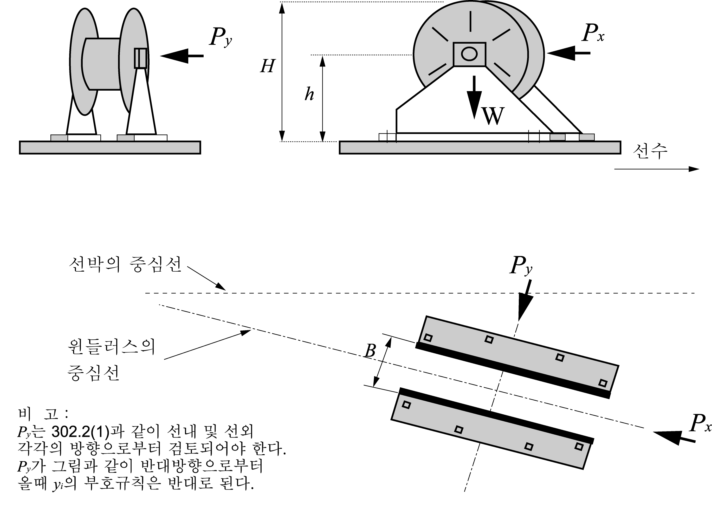
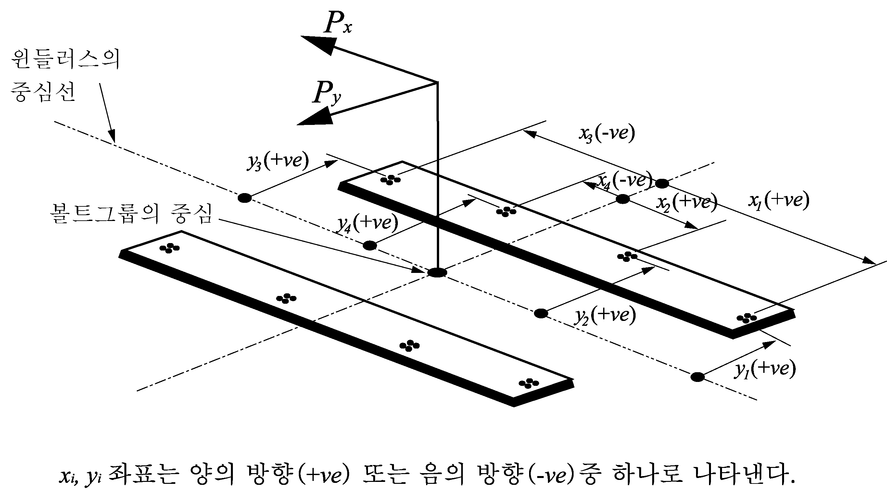

# 제4편 선체의장

> 선급 및 강선규칙/적용지침 / RA-04-K / 2025 / KO / Rules

## 제 9 장 선수갑판 작은 창구, 설비 및 의장품의 강도 및 잠금장치

### 제 1 절 적용 및 시행

#### 101. 적용

- **1.** **2004년 1월 1일** 이후 건조 계약된 길이 80 m 이상인 모든 종류의 선박으로써 선수부 0.25 $L$ 내의 노출갑판 상의 작은 창구, 설비 및 의장품이 설치된 노출갑판의 높이가 하기만재흘수선으로부터 0.1 $L$ 또는 22 m 중, 작은 값 미만인 경우에 대하여 적용한다.
- **2.** **2**. **2004년 1월 1일** 전에 건조 계약된 선박으로서 선수격벽의 전방 구역과 그 후방으로 연장된 구역으로 통하는 노출갑판상의 작은 창구, 공기관, 통풍관 및 잠금장치에 대하여 적용하며, 해당되는 선박은 다음과 같다 : 길이 100 m 이상의 산적화물선, 광석운반선, 겸용선(ESP 적용선) 및 일반건화물선(컨테이너선, 차량운반선, 로로선 및 우드칩운반선은 제외).
- **3.** **3**. 이 장의 규정은 **UI LL64(4**항과 **5**항 제외)에 따르는 컨테이너선의 화물구역 접근용 작은 창구에는 적용되지 않는다. 이러한 창구덮개는 실제 풍우밀 여부와 관계없이 비풍우밀(non-weathertight)로 간주된다. 다만, 강도검토는 **UI LL64 6**항을 대신하여 **202.**를 따를 수 있다. *(2024)*

#### 102. 시행

이 장의 시행과 관련한 상세 규정은 **1편 2장 18절 1801.**에 따른다.

### 제 2 절 선수부 노출갑판상 작은 창구의 강도 및 잠금장치

#### 201. 일반사항

- **1.** 선수부 노출갑판상의 작은 창구의 강도 및 잠금장치는 이 규정에 적합하여야 한다.
- **2.** 이 규정에서 작은 창구라 함은 갑판하부 구역에 출입하기 위하여 설계된 창구로서 풍우밀 또는 수밀인 것을 말한다. 이들 개구는 일반적으로 2.5 m^2 이하를 말한다.
- **3.** 비상 탈출용으로 설계된 창구는 이 규정의 **203.**의 **1**항 (1), (2) 및 **204.**의 **3**항과 **205.**을 제외하고 이 규정에 적합하여야 한다. **【지침 참조】**

#### 202. 강도 요건

- **1.** **1**. 사각형 작은 강재창구덮개에 대한 판의 두께, 보강재 배치 및 구조부재치수는 **표 4.9.1** 및 **그림 4.9.1**에 따른다. 보강재는 **204.**의 **1**항의 규정에 의한 금속간 접촉점에 맞추어 배치하여야 한다.(**그림 4.9.1** 참조)
  일차 보강재는 연속성이 있어야 하며 모든 보강재는 내부 끝단 보강재에 용접하여야 한다.(**그림 4.9.2** 참조)
- **2.** 창구 코밍의 상단은 수평 보강재에 의하여 적절히 보강되어야 하며, 통상 코밍의 상단으로부터 170 mm 에서 190 mm 이하인 위치에 보강재를 설치한다.
- **3.** 원형 또는 유사한 형상의 작은 창구덮개에 대한 두께 및 보강은 우리 선급이 적절하다고 인정하는 바에 따른다. **【지침 참조】**
- **4.** 강재 이외의 재료로 만들어진 작은 창구덮개에 대한 구조치수는 강재와 동등한 강도를 갖도록 하여야 한다.

#### 203. 1차 잠금장치

- **1.** 이 규정의 적용을 받는 선수노출갑판 상에 위치한 작은 창구는 창구덮개가 아래 방법 중 하나에 의하여 적절하게 잠금이 되어야 하고 풍우밀이 되도록 하는 1차 잠금장치가 부착하여야 한다.
  - **(1)** 포크(클램프) 위에서 조여 주는 나비너트
  - **(2)** 순간작동클리트
  - **(3)** 중앙식 잠금장치
- **2.** 쐐기(wedge)를 갖는 조임 핸들(dog, 돌려서 조여주는 핸들)은 인정되지 아니한다.

#### 204. 1차 잠금장치의 요건

- **1.** 창구덮개에는 탄성재료의 개스킷이 설치되어야 한다. 이것은 설계된 압축력에서 금속간 접촉이 허용되어야 하며, 잠금장치가 느슨해지거나 벗겨지는 원인이 되는 그린파랑하중에 의한 개스킷의 과도한 압축을 방지하여야 한다. 금속간 접촉은 각각의 잠금장치에 가깝게 설치하여야 하며,(**그림 4.9.1** 참조) 지지력(bearing force)을 견디기에 충분하여야 한다.
- **2.** 1차 잠금장치는 도구를 사용하지 않고 한 사람에 의해 설계압축압력을 얻을 수 있도록 설계 및 제작되어야 한다.
- **3.** 너비너트를 사용한 1차 잠금장치에 있어서 포크(클램프)는 견고하게 설계되어야 한다. 클램프는 끝부분을 올려서 클램프를 상방으로 구부리거나 혹은 유사한 방법으로 사용 중에 너비너트 이탈 위험성을 최소화하도록 설계되어야 한다. 보강하지 아니한 강재 포크의 판 두께는 16 mm 이상이어야 한다. (**그림 4.9.2** 참조)
- **4.** 최전방 화물창구 앞쪽의 노출갑판에 위치한 작은 창구덮개의 힌지는, 그린(green)파랑의 주방향으로 설치함으로써 덮개가 닫히도록 하여야 하며, 이는 힌지가 보통 앞쪽 끝단에 위치하여야 함을 뜻한다.
- **5.** 주화물창구와 주화물창구 사이, 예를 들어 1번과 2번 창구사이에 위치한 작은 창구의 힌지는 횡파 또는 선수 사파(bow quartering)상태에서 그린파랑으로부터 보호될 수 있도록 앞 끝 또는 바깥쪽에 두어야 한다.

#### 205. 2차 잠금장치

선수갑판의 작은 창구는 슬라이딩볼트, 이완부착품의 고리 또는 걸쇠(hasp)와 같은 독립된 2차 잠금장치를 설치하여야 한다. 이 장치는 1차 잠금장치가 느슨해지거나 또는 이탈되는 경우에도 창구덮개를 제자리에 고정할 수 있어야 한다. 이들은 창구덮개 힌지와 반대 방향으로 설치하여야 한다.

### 제 3 절 선수갑판의 설비 및 의장품에 대한 강도 요건

#### 301. 일반사항

- **1.** 이 규정은 아래의 항목들에 대하여 그린파랑하중을 견디기 위한 강도요건이다.
  - 공기관, 통풍통 및 폐쇄장치, 윈들러스의 고박
- **2.** 윈들러스에 대한 요건은 **5편 8장**의 요건에 추가되는 요건이다.
- **3.** **3**. 무어링윈치가 앵커윈들러스와 일체형이라면 윈들러스의 일부분으로 고려되어야 한다.

#### 302. 적용 하중

- **1.** 공기관, 통풍통 및 폐쇄장치
  - **(1)** 공기관, 통풍통 및 폐쇄장치에 작용하는 압력(p)은 다음 식에 의한다.
    $p=0.5 \rho V ^{2} C _{d} C _{s} C _{p}$(kN/m^2)
    $\rho$ = 해수의 밀도(1.025 t/m^3 )
    $V$ = 선수부 갑판에 넘치는 물의 속도
    = 13.5m/sec, *d* ≤0.5*d_1*의 경우
    = $13.5 \sqrt {2(1- \frac{d}{d _{1}} )}$ (m/sec), 0.5*d _1 ＜d＜d _1*의 경우
    *d* = 하기만재수선에서 노출갑판까지의 거리
    *d_1* = 0.1L 또는 22m 중에서 작은 값
    $C_d$ = 형상계수
- **0.** 5 : 파이프
- **1.** 3 : 일반적인 공기관 또는 통풍통헤드
- **0.** 8 : 수직방향으로 축을 갖는 공기관 또는 원통형 통풍통헤드
  $C_s$ = 슬래밍 계수로서 3.2
  $C_p$ = 보호계수
- **0.** 7 : 물결막이 또는 선수루 바로 뒤에 위치한 파이프 및 통풍통헤드
- **1.** 0 : 불워크 바로 뒤 및 기타 장소
  - **(2)** 파이프 및 폐쇄장치의 수평방향으로 작용하는 힘은 각각에 대한 최대투영면적을 사용하여 (1)에 따라 계산한다.
- **2.** **윈들러스**
  - **(1)** 다음과 같은 압력을 적용한다.(**그림 4.9.3** 참조)
    - 윈들러스 축에 수직이고 선수수선으로부터 떨어진 경우 투영면적에 대하여 : 200 (kN/m^2)
    - 윈들러스 축에 평행이고 안쪽 및 바깥쪽에 각각 작용하는 경우 투영면적에 $f$ 를 곱한 것에 대하여 : 150 (kN/m^2).
    $f = 1 + B/H$, 최대 2.5
    $B$ = 윈들러스 축에 평행하게 측정한 윈들러스의 폭
    $H$ = 윈들러스의 전체 높이
  - **(2)** 윈들러스를 갑판에 고박하기 위한 볼트, 쵸크 및 스토퍼에 작용하는 하중이 계산되어야 한다. 윈들러스는 각각 1개 이상의 볼트가 포함된 $N$ 개의 볼트 그룹에 의해 지지된다.(**그림 4.9.4** 참조)
  - **(3)** 볼트그룹 $i$ 에 대한 축력 $R_i$ 는 다음과 같이 계산할 수 있다.(인장의 경우를 양(+)으로 한다.)
    $R_x _i = \frac{P_x h x_i A_i}{I_x} , R_y _i = \frac{P_y h y_i A_i}{I_y} , R_i = R_x _i + R_y _i - R_si$
    $P_x$ = 윈들러스 축과 수직방향으로 작용하는 힘(kN)
    $P_y$ = 윈들러스 축에 평행한 방향으로 작용하는 힘(kN). 볼트그룹 $i$ 의 안쪽 또는 바깥쪽의 힘 중 큰 것으로 한다.
    $h$ = 윈들러스 받침대로부터 윈들러스 축까지의 높이(cm)
    $x_i$, $y_i$ = 전체 $N$ 개의 볼트그룹 중앙으로부터 볼트그룹 $i$ 의 $x$*,* $y$ 좌표(cm). 적용되는 힘의 반대 방향을 양(+)으로 한다.
    $A_i$ = 볼트그룹 $i$ 에 있어서의 모든 볼트의 단면적.($\mathrm{cm}^2$)
    $I_x = smallsum A_i x_i^2$ ($N$ 개의 볼트그룹에 대하여)
    $I_y = smallsum A_i y_i^2$ ($N$ 개의 볼트그룹에 대하여)
    $R_si$ = 윈들러스 무게에 의한 볼트그룹 $i$ 에서의 정적 반력
  - **(4)** 볼트그룹 $i$ 에 작용하는 전단력 $F_x _i$, $F_y _i$ 와 합성력 $F_i$ 는 다음과 같이 계산한다.
    $F_{x i} = \frac{P_x - \alpha g M}{N} , F_{y i} = \frac{P_y - \alpha g M}{N} , F_i = \sqrt{F_{x i}^2 + F_{y i}^2$
    $\alpha$ = 마찰계수, 0.5
    $M$ = 윈들러스 질량(ton)
    $g$ = 중력가속도, 9.81 (m/s^2)
    $N$ = 볼트그룹의 수
  - **(5)** 상기 (3) 및 (4)은 지지구조물의 설계 시에도 고려하여야 한다.

#### 303. 강도 요건

- **1.** **공기관, 통풍통 및 폐쇄장치**
  - **(1)** 다음은 **규칙 제5편 6장 2절**의 요건에 대한 추가규정이다. 다만, 이 규정에 적용받는 모든 현존선의 공기관의 폐쇄장치는 **제5편 6장 2절**에 맞도록 향상시킬 필요는 없다.
  - **(2)** 공기관 및 통풍통에 대한 굽힘모멘트 및 응력은 관통부, 용접 또는 플랜지 이음부 및 지지브래킷의 단부와 같은 중요한 위치에서 계산하여야 한다. 순두께를 고려한 단면에서의 굽힙응력은 0.8 $\sigma_y$ 이하이어야 한다. 부식방지와 상관없이 부식추가 2.0 mm 을 적용하여야 한다.
    $\sigma_y$ : 강재의 항복응력(또는 0.2 % 내력)
  - **(3)** 헤드에 의해 폐쇄되는 높이 760 mm 의 표준 공기관에 대한 헤드의 투영면적에 따른 관두께 및 브래킷 높이는 **표 4.9.2**에 의한다. 브래킷이 필요한 경우 3개 이상의 방사형 브래킷을 설치하여야 한다. 브래킷은 두께 8 mm 이상, 최소 길이 100 mm로 하여야 하며 높이는 **표 4.9.2**에 의한다. 다만, 헤드 보강을 위한 접합플랜지를 넘을 필요는 없다. 또한 갑판상의 브래킷 단부는 적절히 보강되어야 한다.
  - **(4)** 다른 형태의 경우에는 **302**.의 하중을 적용하고 상기 (2)의 요건에 적합한 지지방법을 결정하여야 한다. 브래킷을 설치하는 경우 높이에 따른 적절한 두께와 길이를 가져야 한다. 파이프 두께는 **제5편 6장 102.**에서 규정하는 값 이하이어서는 안 된다.
  - **(5)** 헤드에 의해 폐쇄되는 높이 900 mm 의 표준 통풍통에 대한 헤드의 투영면적에 따른 관(pipe) 두께 및 브래킷 높이는 **표 4.9.3**에 의한다. 브래킷에 대한 요건은 상기 (3)에 따른다.
  - **(6)** 높이가 900 mm 를 넘는 통풍통에 대한 브래킷 또는 유사 보강은 관련도면을 제출하여 우리 선급의 승인을 받아야 한다. 파이프 두께는 **제5편 6장 102.**에서 규정하는 값 이상이어야 한다.
  - **(7)** 공기관 또는 통풍통의 모든 구성품 및 결합부는 **302.**의 **1**항의 하중을 견딜 수 있어야 한다.
  - **(8)** 회전식 버섯형 통풍통 헤드는 선수 0.25$L$ 전방에 설치하여서는 안 된다.
- **2.** **윈들러스 받침대**
  - **(1)** 각 볼트그룹 $i$ 의 개별 볼트에 걸리는 축인장 응력을 구해야 한다. 수평력 $F_{x i}$ 및 $F_{y i}$ 는 전단 쵸크에 의하여 통상 지탱되어야 한다. 취부된 볼트가 한방향 또는 양방향에서 전단력을 지지하도록 설계된 경우에는 개개의 볼트에 대한 미제스 등가응력을 계산하고 내력을 가지고 검토하여야 한다. 접착을 위하여 수지를 사용할 경우, 계산 시에 이를 반영할 수 있다. 볼트 강도에 대한 안전율은 2 이상이어야 한다.
  - **(2)** 윈들러스를 지지하는 지지대, 선체구조 및 **302.**의 **2**항의 고박 볼트는 관련 규정에 적합하여야 한다.
- **3.** **체인스토퍼**
  - **(1)** 체인스토퍼는 일반적으로 선박이 묘박하고 있을 때 체인에 의한 윈들러스에 작용하는 인장력을 감소시키기 위하여 윈들러스와 호스파이프 사이에 설치한다. 체인스토퍼는 체인 절단하중의 80 %에 해당하는 하중에 대하여 영구변형을 일으키지 않고 견디어야 한다.
  - **(2)** 체인스토퍼는 국가규격, 공인된 국제규격 또는 이와 동등하다고 인정하는 규격을 적용할 수 있다. 

    | 호칭 관 지름(mm) | 최소 두께(mm) | 헤드의 최대투영면적(cm^2) | 브래킷의 높이(1)(mm) |
    | --- | --- | --- | --- |
    | 40A(3) | 6.0 | - | 520 |
    | 50A(3) | 6.0 | - | 520 |
    | 65A | 6.0 | - | 480 |
    | 80A | 6.3 | - | 460 |
    | 100A | 7.0 | - | 380 |
    | 125A | 7.8 | - | 300 |
    | 150A | 8.5 | - | 300 |
    | 175A | 8.5 | - | 300 |
    | 200A | 8.5(2) | 1900 | 300(2) |
    | 250A | 8.5(2) | 2500 | 300(2) |
    | 300A | 8.5(2) | 3200 | 300(2) |
    | 350A | 8.5(2) | 3800 | 300(2) |
    | 400A | 8.5(2) | 4500 | 300(2) |
    | (비고) (1) 브래킷은 헤드에 대한 연결 플랜지를 넘어서까지 연장할 필요는 없다.(**303. 1**항 (3) 참조) (2) 취부된 공기관의 두께가 10.5 mm 이하이거나 표에 의한 투영헤드면적이 초과되는 경우, 브래킷이 요구된다. (3) “신선”에는 사용할 수 없다. (**규칙 5편 6장** 참조) 기타 공기관의 높이에 대하여는 **303.**의 **1**항의 관련요건을 적용하여야 한다. |   |   |   |

    | 호칭 관 지름(mm) | 최소 두께(mm) | 헤드의 최대 투영면적(cm^2) | 브래킷의 높이(mm) |
    | --- | --- | --- | --- |
    | 80A | 6.3 | - | 460 |
    | 100A | 7.0 | - | 380 |
    | 150A | 8.5 | - | 300 |
    | 200A | 8.5 | 550 | - |
    | 250A | 8.5 | 880 | - |
    | 300A | 8.5 | 1200 | - |
    | 350A | 8.5 | 2000 | - |
    | 400A | 8.5 | 2700 | - |
    | 450A | 8.5 | 3300 | - |
    | 500A | 8.5 | 4000 | - |

    기타 통풍통의 높이에 대하여는 **303.**의 **1**항의 관련요건을 적용하여야 한다.
    
    **그림 4.9.3 힘 및 두께의 방향**
    
    **그림 4.9.4 부호 규칙**
