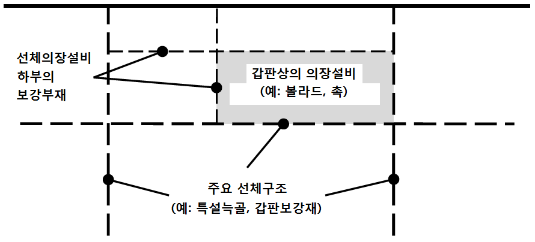
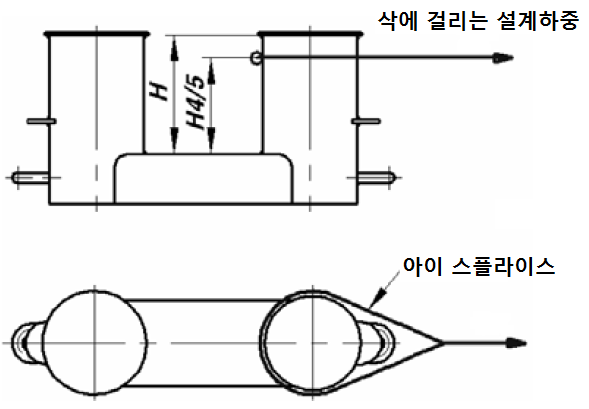
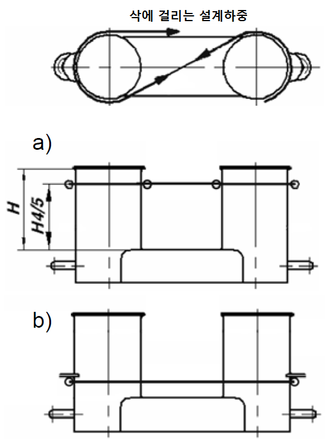

# 제4편 선체의장

> 선급 및 강선규칙/적용지침 / RA-04-K / 2025 / KO / Rules

## 제 10 장 예인 및 계류관련 선체의장설비 및 선체지지구조

### 제 1 절 적용범위 및 정의

#### 101. 적용범위

- **1.** 전통적인 선박(고속선, 특수목적선 및 모든 유형의 해양구조물을 제외한 500 GT 이상의 배수량형 신조선)에는 선박의 정상 운항과 관련된 모든 예인 및 계류 작업을 안전하게 수행할 수 있도록 충분한 안전사용하중의 장치, 의장품 및 선체의장설비가 제공되어야 한다.
- **2.** 이 장의 요건은 통상적인 예인 및 계류 작업에 사용되는 선체의장설비 및 선체지지구조의 설계 및 시공에 적용한다. 통상적인 예인은 선박의 정상 운항과 관련된 항내 및 보호된 수역에서의 조종에 필요한 예인작업을 의미한다.
- **3.** SOLAS II-1, 제3-4.1 규칙의 적용대상이 아니지만 다른 선박 또는 예인선에 의한 예인(예 : SOLAS II-1, 제3-4.2에 명시된 비상사태에 대비하여 선박을 돕는 것)을 위한 장비를 갖추고자 하는 선박의 경우, 이 장에서 "기타 예인"으로 지정된 요건이 선체의장설비 및 선체지지구조의 설계 및 시공에 적용되어야 한다.
- **4.** 이 장의 요건은 다음과 같이 정의된 특수예인작업에 사용되는 선체의장설비 및 선체지지구조의 설계 및 시공에는 적용하지 않는다.
  - **(1)** 에스코트 예인 : 특정 하구에서 요구(특히 화물을 산적한 유조선 또는 LNG 운반선)되는 예인 작업. 에스코트 예인의 주된 목적은 추진 또는 조타장치의 고장시 선박을 제어하는 것이다. 이것은 현지의 에스코트 요건 및 지침(예: Oil Companies International Marine Forum(OCIMF)에서 제공하는 지침)을 참고하여야 한다.
  - **(2)** 운하통과예인: 파나마 운하와 같은 운하를 통과하는 선박의 예인 작업. 이는 현지의 운하통과 요건을 참고하여야 한다.
  - **(3)** 탱커비상예인: 비상시 탱커를 돕는 예인 작업. 비상예인장치의 경우, SOLAS II-1, 제3-4.1 규칙의 적용을 받는 선박은 유효한 해당 규정 및 Res. MSC.35 (63)을 준수하여야 한다.
- **5.** 계류 및 예인에 관한 권장사항은 IACS Rec. 10 Anchoring, Mooring and Towing Equipment를 참조할 수 있다.
- **6.** 선체지지구조의 최소 순치수는 **201.**의 **5**항 및 **202.**의 **5**항에 주어진 요건에 적합하여야 한다. 순두께 $t _{n et}$은 상기 최소 순치수를 얻는데 필요한 부재의 두께이다. 요구되는 총두께는 **204.**에 주어진 부식 추가 $t _{c}$를 $t _{n et}$에 더함으로써 얻어진다. 선체의장설비는 **201.**의 **4**항 및 **202.**의 **4**항에 주어진 요건에 적합하여야 한다. 선체의장설비가 인정된 산업규격에서 선택된 것이 아닐 경우, **204.** 및 **205.**에 각각 주어진 부식추가 $t _{c}$ 및 쇠모한도 $t _{w}$가 고려되어야 한다.
- **7.** 2009년 1월 1일 이후 인도되는 유조선 등의 선박에 설치되는 일점계류용 계류장치에 대하여는 우리 선급이 별도로 정하는 지침에 따른다. **【지침 참조】**

#### 102. 정의

- **1.** **1**. 전통적인 선박이라 함은 고속선, 특수목적선 및 모든 유형의 해양구조물을 제외한 500 GT 이상의 배수량형 신조선을 의미한다. MSC.266 (84)에 의거, '특수목적선'은 기계적으로 자체 추진되는 선박으로서 그 기능상 12명을 초과하는 특수 인원(special personnel)이 탑승하는 선박을 의미한다.
- **2.** 선체의장설비는 다음의 설비를 의미한다: 선박의 통상적인 계류에 사용되는 볼라드 및 비트, 페어리더, 스탠드 롤러, 촉(chock) 및 선박의 통상적인 또는 기타의 예인에 사용되는 유사한 의장설비. 캡스턴, 윈치 등과 같은 다른 의장설비는 이 장의 규정을 적용하지 않는다. 선체의장설비를 선체지지구조에 연결하는 용접 또는 볼트 또는 이와 동등한 장치는 선체의장설비의 일부이며, 산업규격에서 선택한 경우 해당 산업규격을 따라야 한다.
- **3.** 선체지지구조라 함은 선체의장설비가 위치하거나 선체의장설비에 영향을 미치는 힘을 직접적으로 받는 선체 구조의 일부분을 의미한다. 상기에서 언급된 통상적인 또는 기타의 예인 그리고 계류작업에 사용되는 캡스턴, 윈치 등의 선체지지구조는 이 장의 규정을 만족하여야 한다.
- **4.** 산업규격이란 국제규격(ISO 등) 또는 선박이 건조되는 국가의 인정된 국내규격(KS, DIN, JMSA 등)을 의미한다.
- **5.** 공칭용량조건(nominal capacity condition)은 최대 갑판 화물이 가능한 각각의 위치에서 선박 배치에 포함되는 이론적인 조건을 의미한다. 컨테이너선의 경우 규격 용량 조건은 가능한 최대 컨테이너 수가 해당 위치의 선박 배치에 포함되는 이론적인 조건을 의미한다.
- **6.** 최소설계파단하중($MBL _{SD}$: Ship Design Minimum Breaking Load)은 예인 및 계류 요건을 충족하기 위한 선체의장장비 및 선체 지지구조의 설계에 적용되는 새로운 건식 계류삭 또는 예인삭의 최소 파단 하중을 의미한다.
- **7.** 라인설계파단력($LDBF$ : Line Design Break Force)은 건조한(dry) 상태에서 새롭게 엮은(spliced) 계류삭이 파단되는 최소 힘을 나타내며, 모든 합성섬유로프 재료에 해당되는 값이다. 이 값은 제조업체의 각 계류삭 증명서와 데이터 시트에 명시되어 있으며, 최소설계파단하중($MBL _{SD}$)의 100% ~ 105% 이어야 한다. *(2024)*

### 제 2 절 예인 및 계류

#### 201. 예인

- **1.** **강도**
  선수, 선측 및 선미에서의 통상적인 예인작업에 사용되는 선체의장설비 및 선체지지구조는 이 절의 규정을 만족하여야 한다.
  선박에 기타 예인작업에 사용하기 위한 목적으로 선체의장설비를 설치한 경우, 이러한 선체의장설비 및 이들의 선체지지구조는 이 절의 규정을 만족하여야 한다.
  예인 및 계류 모두 사용하는 장비의 경우, 계류는 **202.**를 따른다.
- **2.** **배치**
  예인을 위한 선체의장설비는 예인하중의 효율적인 분배를 위하여 갑판구조의 일부인 보강재 및/또는 거더 상부에 위치하여야 한다. 불워크에 위치하는 초크(chock) 등에 대하여는 계획된 사용에 강도가 적절하다는 가정하에 상기 외의 배치를 인정할 수 있다.
- **3.** **하중에 대한 고려**
  선체의장설비를 위한 선체지지구조에 작용하는 최소설계하중은 다음에 따른다.
  - **(1)** 통상적인 예인작업
    예인 및 계류배치도에 명시된 계획 최대 예인력(정적 볼라드 풀(static bollard pull))의 1.25 배
  - **(2)** 기타 예인작업
    **8장 표 4.8.1**에 따른 예인삭(tow line)의 최소설계파단하중
  - **(3)** 통상적인 예인작업 및 기타 예인작업 모두에 사용하기 위한 목적의 선체의장설비의 경우, (1)호 및 (2)호에 따른 설계하중 중에서 큰 값
    비고
    1) 공칭용량조건(nominal capacity condition)에 규정된 갑판화물의 측면투영면적은 예인삭을 결정할 때 그리고 선체의장설비 및 선체지지구조에 작용하는 하중을 결정할 때 고려하여야 한다.
    2) 선체의장설비 및 선체지지구조에 작용하는 하중에 대하여 IACS Rec. 10에 따라 증가된 합성 로프의 설계파단력(line design break force)은 고려할 필요가 없다.

#### 201.의 6항에 따라 결정된 하중보다 더 큰 안전예인하중(TOW)을 요구할 경우, 설계 하중은 201.의 3항 및 201.의 6항에 주어진 적절한 안전예인하중/설계하중 관계에 따라 증가되어야 한다.

설계하중은 예인 및 계류배치도상의 배치를 고려하여 발생할 수 있는 모든 방향으로 선체의장설비에 하중을 적용하여야 한다. 예인삭이 선체의장설비에서 감기는 경우, 선체의장설비에 적용되는 전체 설계하중은 예인삭에 작용하는 설계하중의 합력을 적용하여야 한다(**그림 4.10.1** 참조). 그러나 어떤 경우에도 선체의장설비에 적용되는 설계 하중이 예인삭 설계하중의 두 배 이상일 필요는 없다.

- **4.** **선체의장설비**
  선체의장설비는 우리 선급이 인정하는 산업규격을 선택할 수 있으며, 적어도 다음과 같은 하중에 기초하여야 한다.
  - **(1)** 통상적인 예인작업
    예인 및 계류배치도에 명시된 계획 최대 예인력(정적 볼라드 풀:static bollard pull)
  - **(2)** 기타 예인작업
    **8장 표 4.8.1**에 따른 예인삭의 최소설계파단하중(**201.**의 **3**항 비고 참조)
  - **(3)** 통상적인 예인작업 및 기타 예인작업 모두에 사용하기 위한 목적의 선체의장설비의 경우, (1)호 및 (2)호에 따른 설계하중 중에서 큰 값
    산업규격이 예인삭 부착 방법(예: 8자형 또는 아이 스플라이스(eye splice) 부착)을 구별하는 경우, 예인용 비트(더블 볼라드)는 아이 스플라이스가 부착된 예인삭을 선택할 수 있다.
    선체의장설비가 인정된 산업규격에서 선택되지 않은 경우, 선체의장설비의 강도 및 선체의장설비의 선박 부착에 따른 강도는 **201.**의 **3**항 및 **201.**의 **5**항에 따른다. 예인용 비트는 아이 스플라이스가 부착된 예인삭으로 인한 하중을 견딜 수 있어야 한다. 강도 평가를 위하여, 순치수를 사용하여 보 이론 또는 유한요소해석을 적절히 적용하여야 한다. 부식추가는 **204.**에 정의된 바에 따른다. **205.**에 정의된 쇠모한도가 포함되어야 한다. 우리 선급이 적절하다고 인정하는 경우, 하중시험은 계산에 의한 강도 평가의 대안으로 인정될 수 있다.
- **5.** **선체지지구조**
  선체지지구조에 적용되는 설계하중은 **201.**의 **3**항에 따른다.
  - **(1)** 선체의장설비의 하부에 있는 보강부재는 선체의장설비에 작용하는 예인력의 방향(수평 및 수직) 변화에 효과적으로 배치되어야 한다(배치의 예는 **그림 4.10.2** 참조). 선체의장설비 및 선체지지구조의 적절한 정렬이 확보되어야 한다.
    
    **그림 4.10.2 보강부재의 배치 예**
  - **(2)** 선체의장설비에 작용하는 예인력의 작용점은 예인삭의 부착점 또는 예인삭의 방향이 변경되는 곳으로 설정하여야 한다. 볼라드 및 비트의 경우, 예인삭의 부착점은 기준면(base) 위 관(tube) 높이의 4/5 이상이어야 한다.(**그림 4.10.3** 참조)
    
    **그림 4.10.3 예인력의 작용점**
  - **(3)** **201.**의 **3**항에 규정된 설계하중 조건하에서 허용응력은 다음과 같다.
    법선응력 : 1.0 R_eH
    전단응력 : 0.6 R_eH
    법선응력은 굽힘응력과 축응력의 합이며, 이 때 전단응력은 법선응력에 직각방향으로 작용하는 경우를 말한다. 응력집중계수는 고려하지 않는다.
    폰 미세스 응력(von Mises stress): 1.0 R_eH
    유한요소해석을 통한 강도 평가의 경우, 요소은 가능한 실제와 유사하게 모델링될 수 있도록 충분히 작아야 한다. 요소의 종횡비는 3 미만이어야 한다. 거더는 쉘(shell) 또는 평면응력요소(plane stress elements)를 사용하여 모델링하여야 한다. 대칭형 거더 플랜지(symmetric girder flange)는 보 또는 트러스 요소로 모델링 할 수 있다. 거더 웨브(girder web) 요소의 높이는 웨브 높이의 1/3 미만이어야 한다. 거더 웨브의 작은 개구부 주변의 웨브 두께는 웨브 높이에 걸친 평균 두께로 감소시켜야 한다. 큰 개구부는 모델링하여야 한다. 보강재(stiffener)는 쉘, 평면응력 또는 보 요소를 사용하여 모델링 할 수 있다. 보강재 요소의 크기는 적절한 굽힘 응력을 얻을 수 있도록 작아야 한다. 쉘(shell) 또는 평면응력요소(plane stress elements)를 사용하여 평강(flat bar)을 모델링할 경우, 더미 로드 요소(dummy rod element)는 평강의 자유단에서 모델링하고, 더미 요소의 응력을 평가해야 한다. 응력은 개별 요소의 중심에서 읽어야 한다. 쉘 요소의 경우 응력은 요소의 중간 평면에서 평가하여야 한다.
    R_eH 은 재료의 최소항복응력이다.
    - **(가)** 보 이론 또는 격자 해석을 통한 강도 평가:
    - **(나)** 유한요소해석을 통한 강도 평가:
- **6.** **안전예인하중(TOW)**
  - **(1)** 안전예인하중(TOW)은 예인 목적으로 사용되는 선체의장설비의 안전 하중 한계치이다.
  - **(2)** 통상적인 예인작업에 사용되는 안전예인하중은 **201.**의 **3**항 (1)호에 따른 설계하중의 80 %를 초과하여서는 아니된다.
  - **(3)** 기타 예인작업에 사용되는 안전예인하중은 **201.**의 **3**항 (2)호에 따른 설계하중의 80 %를 초과하여서는 아니된다.
  - **(4)** 통상적인 예인작업 및 기타 예인작업 모두에 사용되는 의장설비의 경우 (2)호 및 (3)호에 따른 안전예인하중 중 큰 값을 사용하여야 한다.
  - **(5)** 각 선체의장설비의 안전예인하중(ton)은 예인용 갑판 의장설비에 표시(용접 비드 또는 이와 동등한 것에 의해)되어야한다. 예인 및 계류 모두에 사용하기 위한 목적의 의장설비의 경우, **202.**의 **6**항에 따른 안전사용하중(ton)을 안전예인하중에 추가하여 표시하여야 한다.
  - **(6)** 안전예인하중에 대한 위의 요건은 1개의 예인삭을 사용하는 경우에 적용한다. 별도로 부착 방법을 선택하지 않는 한, 예인용 비트(더블 볼라드)에 대해 안전예인하중은 아이 스플라이스가 부착된 예인삭의 하중 한계치이다.
  - **(7)** **203.**에서 언급된 예인 및 계류배치도에 예인삭의 사용 방법을 정의하여야 한다.

#### 202. 계류

- **1.** **강도**
  계류작업에 사용되는 선체의장설비 및 이들의 선체지지구조의 강도(윈치와 캡스턴의 선체지지구조의 강도 포함)는 이 절의 요건을 만족하여야 한다.
- **2.** **배치**
  계류를 위한 선체의장설비, 윈치 및 캡스턴은 계류하중의 효율적인 분배를 위하여 갑판구조의 일부인 보강재 및/또는 거더 상부에 위치하여야 한다. 불워크에 위치하는 초크(chock) 등에 대하여는 계획된 사용에 강도가 적절하다는 가정하에 상기 외의 배치를 인정할 수 있다.
- **3.** **하중에 대한 고려**
  - **(1)** 선체의장설비를 위한 선체지지구조에 작용하는 최소설계하중은 **8장 표 4.8.1** 따른 계류삭의 최소설계파단하중의 1.15배로 설정하여야 한다.
  - **(2)** 윈치를 위한 선체지지구조에 작용하는 최소설계하중은 계획된 최대 제동하중의 1.25배로 설정하여야 하며, 이 최대 제동하중은 **8장 표 4.8.1**에 따른 계류삭의 최소설계파단하중의 80 % 이상으로 가정되어야 한다(비고 참조). 캡스턴의 선체지지구조의 경우, 최대 견인력의 1.25배를 설계하중으로 설정하여야 한다.
  - **(3)** **202.**의 **6**항에 따라 결정된 하중보다 더 큰 안전사용하중(SWL)이 신청자에 의해 요구되는 경우, 설계하중은 **202.**의 **3**항 및 **202.**의 **6**항에 주어진 적절한 안전사용하중/설계하중 관계에 따라 증가되어야 한다.
  - **(4)** 설계하중은 예인 및 계류배치도상의 배치를 고려하여 발생할 수 있는 모든 방향으로 선체의장설비에 하중을 적용하여야 한다. 계류삭이 선체의장설비에서 감기는 경우, 선체의장설비에 적용되는 전체 설계하중은 계류삭에 작용하는 설계하중의 합력을 적용하여야 한다(**201.**의 **3**항의 **그림 4.10.1** 참조). 그러나 어떤 경우에도 선체의장설비에 적용되는 설계 하중이 계류삭 설계하중의 두 배 이상일 필요는 없다.
    비고
    1) IACS Rec. 10에 별도의 규정이 없는 경우, 공칭용량조건(nominal capacity condition)에 규정된 갑판화물의 측면투영면적은 계류삭을 결정할 때 그리고 선체의장설비 및 선체지지구조에 작용하는 하중을 결정할 때 고려하여야 한다.
    2) 선체의장설비 및 선체지지구조에 작용하는 하중에 대하여 IACS Rec. 10에 따라 증가된 합성 로프의 설계파단력은 고려할 필요가 없다.
- **4.** **선체의장설비**
  - **(1)** 선체의장설비는 우리 선급이 인정하는 산업규격을 선택할 수 있으며, 적어도 **8장 표 4.8.1**에 따른 계류삭의 최소설계파단하중에 기초하여야 한다.(**202.**의 **3**항 비고 참조)
  - **(2)** 산업규격이 계류삭 부착 방법 (예: 8자형 또는 아이 스플라이스 부착)을 구별하는 경우, 계류용 비트(더블 볼라드)는 8자형으로 부착되는 계류삭을 선택하여야 한다.
  - **(3)** 선체의장설비가 인정된 산업규격에서 선택되지 않은 경우, 선체의장설비의 강도 및 선체의장설비의 선박 부착에 따른 강도는 **202.**의 **3**항 및 **202.**의 **5**항에 따른다. 계류용 비트(더블 볼라드)는 8자형으로 부착되는 계류삭으로 인한 하중을 견딜 수 있어야 한다(비고 참조). 강도 평가를 위하여, 순치수를 사용하여 보 이론 또는 유한요소해석을 적절히 적용하여야 한다. 부식추가는 **204.**에 정의된 바에 따른다. **205.**에 정의된 쇠모한도가 포함되어야 한다. 우리 선급이 적절하다고 인정하는 경우, 하중시험은 계산에 의한 강도 평가의 대안으로 인정될 수 있다.
    비고
    통상적인 방법(8자형)으로 계류용 비트에 부착되는 계류삭을 사용하면, 계류용 비트의 2개의 기둥 중 어느 하나에 계류삭에 작용하는 힘의 두 배의 힘이 가해질 수 있다. 이 효과를 무시하면, 산업규격 및 피팅 크기에 따라 과부하가 발생할 수도 있다.
- **5.** **선체지지구조**
  선체지지구조에 적용되는 설계하중은 **202.**의 **3**항에 따른다.
  - **(1)** 선체의장설비, 윈치 및 캡스턴 하부 보강 부재의 배치는 선체의장설비에 작용하는 계류력의 방향(수평 및 수직) 변화를 고려하여야 한다(배치의 예는 **201.**의 **5**항의 **그림 4.10.2**를 참조). 의장설비 및 선체지지구조의 적절한 정렬이 보장되어야 한다.
  - **(2)** 선체의장설비에 작용하는 계류력의 작용점은 계류삭의 부착점 또는 계류삭의 방향이 변경되는 곳으로 설정하여야 한다. 볼라드 및 비트의 경우, 계류삭의 부착점은 기준면(base) 위 관(tube) 높이의 4/5 이상이어야 한다(**그림 4.10.4** 의 a)를 참조). 계류삭을 가능한 한 낮게 유지하기 위해 핀(fin)이 볼라드 기둥에 설치되는 경우, 계류삭의 부착점은 핀의 위치로 설정할 수 있다(**그림 4.10.4**의 b) 참조).
    
    **그림 4.10.4 계류력의 작용점**
  - **(3)** **202.**의 **3**항에 규정된 설계하중 조건하에서 허용 응력은 다음과 같다.
    법선응력 : 사용재료 항복응력의 1.0 R_eH
    전단응력 : 사용재료 항복응력의 0.6 R_eH
    법선응력은 굽힘응력과 축응력의 합이며, 응력집중계수는 고려하지 않는다.
    폰 미세스 응력(von Mises stress): 1.0 R_eH
    유한요소해석을 통한 강도 평가의 경우, 요소은 가능한 실제와 유사하게 모델링될 수 있도록 충분히 작아야 한다. 요소의 종횡비는 3 미만이어야 한다. 거더는 쉘(shell) 또는 평면응력요소(plane stress elements)를 사용하여 모델링하여야 한다. 대칭형 거더 플랜지(symmetric girder flange)는 보 또는 트러스 요소로 모델링 할 수 있다. 거더 웨브(girder web) 요소의 높이는 웨브 높이의 1/3 미만이어야 한다. 거더 웨브의 작은 개구부 주변의 웨브 두께는 웨브 높이에 걸친 평균 두께로 감소시켜야 한다. 큰 개구부는 모델링하여야 한다.
    보강재(stiffener)는 쉘, 평면응력 또는 보 요소를 사용하여 모델링 할 수 있다. 보강재 요소의 크기는 적절한 굽힘 응력을 얻을 수 있도록 작아야 한다. 쉘(shell) 또는 평면응력요소(plane stress elements)를 사용하여 평강(flat bar)을 모델링할 경우, 더미 로드 요소(dummy rod element)는 평강의 자유단에서 모델링하고, 더미 요소의 응력을 평가해야 한다. 응력은 개별 요소의 중심에서 읽어야 한다. 쉘 요소의 경우 응력은 요소의 중간 평면에서 평가하여야 한다.
    R_eH 은 재료의 최소항복응력이다.
    - **(가)** 보 이론 또는 격자 해석을 통한 강도 평가:
    - **(나)** 유한요소해석을 통한 강도 평가:
- **6.** **안전사용하중(SWL)**
  - **(1)** 안전사용하중(SWL)은 계류 목적으로 사용되는 선체의장설비의 안전 하중 한계치이다.
  - **(2)** **202.**의 **3**항 (3)호에 따라 신청자가 더 큰 안전사용하중을 요구하지 않는 한, 안전사용하중은 **8장 표 4.8.1**에 따른 계류삭의 최소설계파단하중를 초과하여서는 아니된다(**202.**의 **3**항의 비고 참조).
  - **(3)** 각 선체의장설비의 안전사용하중(ton)은 계류용 갑판 의장설비에 표시(용접 비드 또는 이와 동등한 것에 의해)되어야 한다. 계류 및 예인 모두에 사용하기 위한 목적의 의장설비의 경우, **201.**의 **6**항에 따른 안전예인하중(ton)을 안전사용하중에 추가하여 표시하여야 한다.
  - **(4)** 안전사용하중에 대한 위의 요건은 1개의 계류삭을 사용하는 경우에 적용한다.
  - **(5)** **203.**에서 언급된 예인 및 계류배치도에 계류삭의 사용 방법을 정의하여야 한다.

#### 203. 예인 및 계류 배치도

- **1.** 각 선체의장설비의 계획된 용도에 대한 안전사용하중(SWL) 및 안전예인하중(TOW)은 선장의 지침으로 사용될 수 있도록 본선의 예인 및 계류 배치도에 명시하여야 한다. 안전예인하중은 예인 목적을 위한 하중 제한치이고 안전사용하중은 계류 목적을 위한 하중 제한치임을 명시하여야 한다. 별도로 부착 방법을 선택하지 않는 한, 예인용 비트의 경우, 안전예인하중은 아이 스플라이스가 부착된 예인삭의 하중 제한치임을 명시하여야 한다.
- **2.** 도면에 제공되어야 할 선체의장설비에 대한 상세는 다음을 포함하여야 한다. *(2024)*
  - **(1)** 선박내의 위치
  - **(2)** 선체의장설비의 형식
  - **(3)** 안전사용하중(SWL)/안전예인하중(TOW)
  - **(4)** 목적(계류/항내 예인/기타 예인)
  - **(5)** 라인 제한각(limiting fleet angle i.e. angle of change in direction of a line at the fitting)을 포함한 예인삭 또는 계류삭의 하중적용의 방법.
  - **(4)** 호 및 (5)호에 대한 (3)호는 우리 선급의 승인을 받아야 한다.
    도면에 제공되어야 할 상세에는 다음도 포함되어야 한다.
  - **(1)** 계류삭의 수(N) 및 배치
  - **(2)** 개별 계류삭의 최소설계파단하중(MBL_SD)
  - **(3)** EN > 2000인 선박에 대한 계류삭의 권장 최소설계파단하중에 대하여 IACS Rec. 10 Anchoring, Mooring and Towing Equipment에서 명시한 허용 환경조건:
    - **(가)** 모든 방향으로부터의 30초 평균풍속. (IACS Rec. 10에 따라 $v _{w}$ 또는 $v _{w} ^{ *}$ )
    - **(나)** 선수 또는 선미에 작용하는 최대조류속도 (± 10°).
  - **(4)** 2024년 1월 1일 이후 건조 계약되는 총톤수 3,000톤 미만인 국제항해 선박의 경우, 다음이 추가로 도면에 포함되어야 하며, 본선에 제공되어야 한다.
    - **(가)** 최대 제동하중(maximum brake holding load)
    - **(나)** 계류삭의 기술사양서(계류삭과 접촉하는 각 선체의장설비의 제조업체 권장 최소 직경($D$) 및 계류삭의 라인설계파단력($LDBF$) 포함)
    - **(다)** $LDBF$와 굽힘반경($D/d$ 비율)^(1)과 관련된 계류삭의 특성(계류삭의 직경이 작을수록 마모율이 높을 수 있다는 경고 포함(MSC.1/Circ.1620 5.6 참고)
  - **(5)** 2024년 1월 1일 이후 건조 계약되는 총톤수 3,000톤 이상인 국제항해 선박의 경우, (4)항에 추가하여 다음이 도면에 포함되어야 하며, 본선에 제공되어야 한다.
    비고
    ^(1) 선체의장설비의 직경$D$ 를 선체의장설비 주위 또는 내부를 통과하는 계류삭의 직경$d$로 나눈 값을 의미한다. (MSC.1/Circ.1620 2.1 참고)
    - **(가)** MSC.1/Circ.1619가 고려되었음을 확인하는 문서를 예인 및 계류 배치도에 대한 보충 문서로 설계자가 참고용으로 제공해야 한다. MSC.1/Circ.1619와 비교하여 편차(deviations)가 있는 경우, 불가피하였음을 문서에 명시적으로 기술해야 한다.
    - **(나)** 편차가 있는 경우, 예인 및 계류 배치도에 대한 보충 문서에 편차가 기록되어야 하며(MSC.1/Circ.1619 6.1 참고), 편차에 대한 타당한 사유와 적절한 안전 조치도 포함되어야 한다.(MSC.1/Circ.1619 6.2 참고) 보충 문서에 대한 참조가 예인 및 계류 배치도에 포함되어야 한다. (MSC.1/Ci rc. 1619 6.3 참고)
    - **(다)** 편차가 필요하지 않고 보충 문서도 필요하지 않는 경우, 예인 및 계류 배치도에 이를 명확하게 언급하여야 한다.
    - **(라)** 계류 최대 제동하중은 최소설계파단하중($MBL _{SD}$)의 100% 미만이어야 한다. (MSC.1/Circ. 1619 5.2.3.3 및 5.2.4 참고) 윈치에는 브레이크 렌더링 하중(brake rendering load)을 안정적으로 설정할 수 있는 제동장치가 장착되어야 한다.
- **3.** 도선사(pilot)에게 항내 및 기타 예인작업에 대한 적절한 정보를 제공하기 위해서 작성되는 도선사 카드(pilot card)에 **2**항의 정보가 포함되어야 한다.

#### 204. 부식추가

부식추가($t _{c}$)는 다음의 값 이상이어야 한다.

- **1.** 산적화물선 및 유조선 공통구조규칙이 적용되는 선박: 총 부식추가는 산적화물선 및 유조선 공통구조규칙에 명시된 바에 따른다.
- **2.** 기타 선박:
  - **(1)** 선체지지구조의 경우, 주변 구조물(예: 갑판 구조물, 불워크 구조물)에 대한 우리선급 규칙에 따른다.
  - **(2)** 인정된 산업규격에 따른 의장설비의 일부가 아닌 갑판상 페데스탈 및 지지대의 경우: 2.0 mm
  - **(3)** 인정된 산업규격을 선택하지 않은 선체의장설비인 경우: 2.0 mm.

#### 205. 쇠모한도

#### 204.에 명시된 부식추가에 추가하여 인정된 산업규격을 선택하지 않은 선체의장설비에 대한 쇠모한도(_s1)는 1.0 mm 이상이어야 하며, 이는 정기적으로 삭(line)과 접촉하는 표면에 추가되어야 한다.

#### 206. 제조후 검사 【지침 참조】

갑판 의장설비, 이들의 페데스탈 또는 지지대(있는 경우)의 상태 및 의장설비 부근의 선체구조는 우리 선급의 해당 규칙에 따라 검사되어야 한다.
