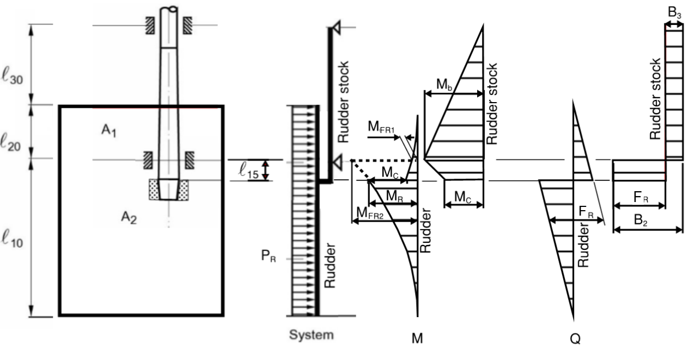
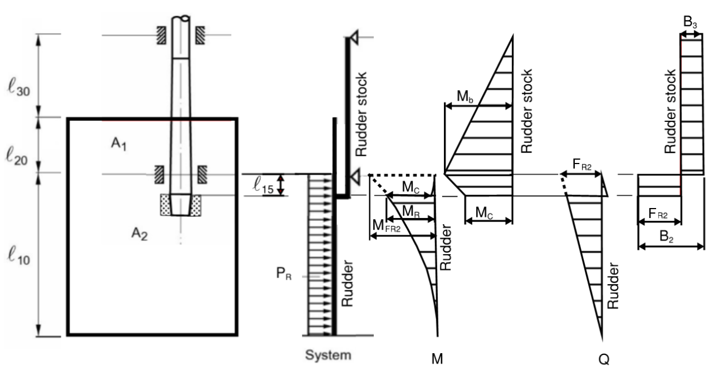
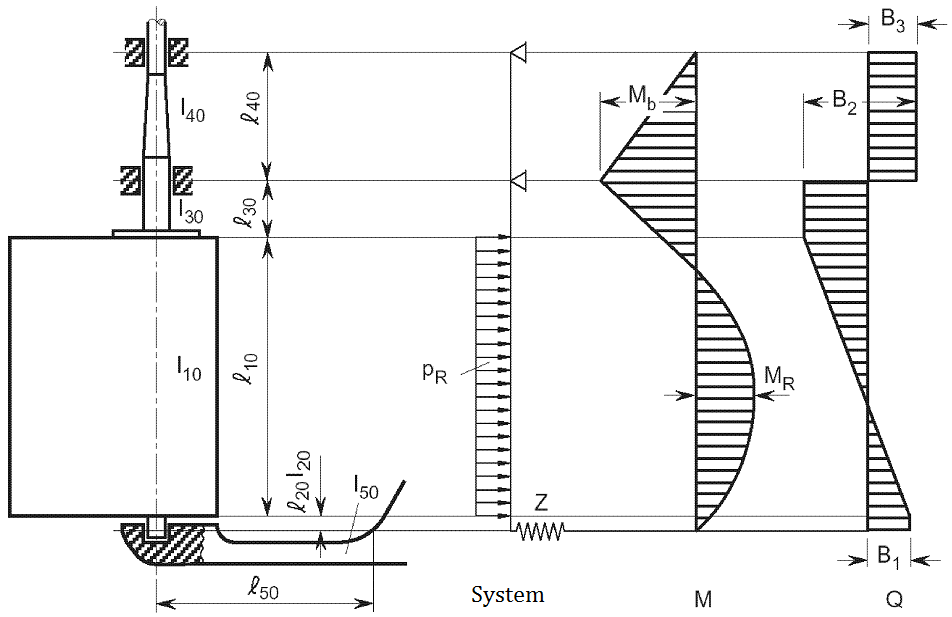
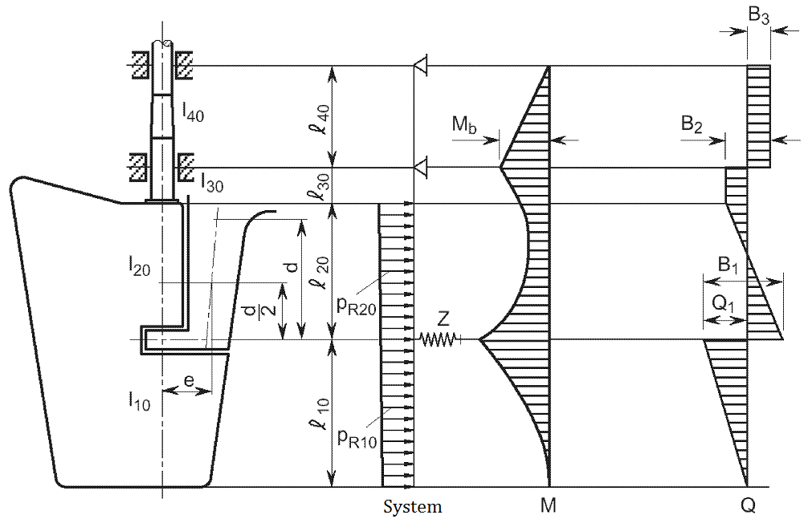
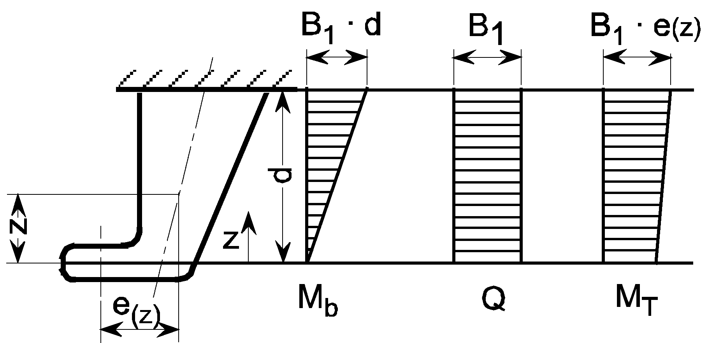
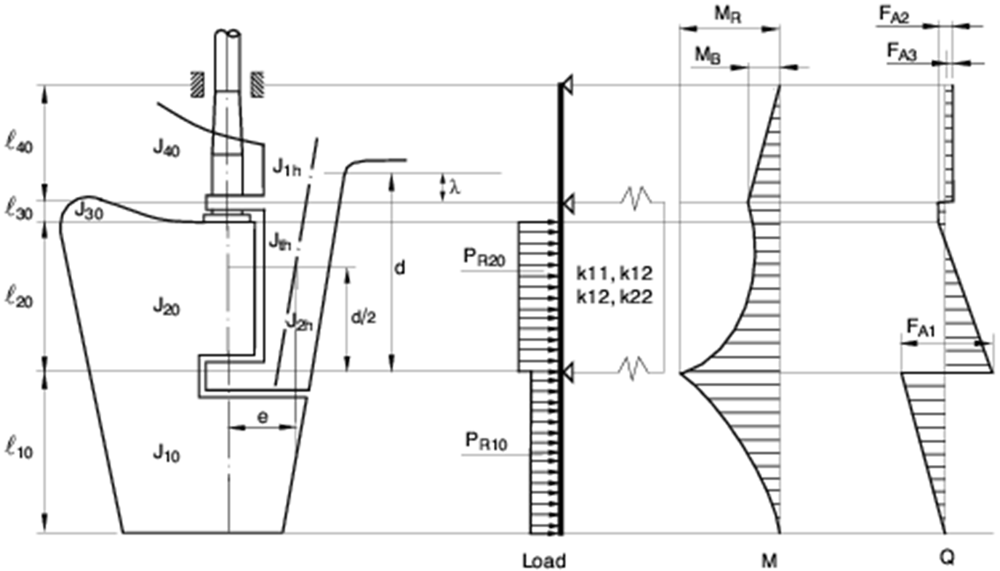

# 제4편 선체의장

> 선급 및 강선규칙/적용지침 / RA-04-K / 2025 / KO / Guidance

## 제 1 장 타

### 제 1 절 일반사항

#### 101. 적용 【규칙 참조】

- **1.** **3개 이상의 핀틀을 갖는 타**
  3개 이상의 핀틀을 갖는 타의 각 부재 치수는 **규칙 4편 1장**의 규정을 준용하여 결정되어야 한다. 다만, 각 부재에 작용하는 외력은 **4절**의 규정을 준용하여 직접계산법에 의하여 결정되어야 한다.
- **2.** **노즐타**
  노즐 타(nozzle rudder)는 다음 (1) 및 (2)호에 따른다. 다만, 실험 또는 상세이론계산에 의한 타력 및 타 토크가 구하여진 경우에는 그 결과에 따를 수 있다. 노즐타 및 다른 기타의 타에 대하여는 실험 또는 상세이론계산에 의하여 타력 및 타 토크를 구하고 **규칙 4편 1장**을 준용하여 각 부재치수를 결정하여야 한다. 이 경우의 실험결과 또는 상세이론계산 결과는 우리 선급에 제출되어야 한다.
  - **(1)** 타 각부의 부재치수결정에 있어서 **규칙 4편 1장**의 규정을 준용한다. 다만, 이 규칙의 적용 시 **2절**의 계수 $K_2$ 값은 전진상태의 경우 1.9, 후진상태의 경우 1.5 로 하고, **3절**의 $\alpha$ 값은 우리 선급이 적절하다고 인정하는 바에 따른다.
  - **(2)** 노즐타의 면적
    규칙의 적용시 타의 전면적 및 타두재의 중심선보다 앞쪽에 위치한 타의 면적은 다음에 따라 계산되어야 한다.
    타의 전면적 ($A$) : $2h(b _{1} +b _{2} )+ \Sigma h' (a _{1} + a _{2} )$(m^2)
    타두재의 중심선보다 앞쪽에 위치한 타의 면적 $A_f$ : $2h b _{2}$(m^2)
    $a _{1} , a _{2, } b _{1,} b _{2,} h 및 h '$ : **지침 그림 4.1.1**에 따른다.
- **3.** **타각이 35° 을 초과하도록 계획된 타**
  타 각부의 부재치수는 실험이나 상세이론계산에 의해 얻어진 타력 및 타 토크를 근거로 하여 **규칙 4편 1장**의 규정에 따라 결정되어야 한다. 실험이나 이론계산의 결과는 우리 선급에 제출되어야 한다.
- **4.** 단판타에 있어서는 전진 및 후진상태 각각에 대하여 계수 $K_2$ 는 1.0으로 한다.
  
- **5.** "C"형 타의 경우, 타의 풀림을 방지하기 위한 안전장치(예 : Locking Ring, Nut Stopper, Nut Lock 등)를 설치하여야 한다.

#### 103. 재료 【규칙 참조】

- **1.** 타두재의 지름이 작을 경우에는 타두재를 주강재로 하여서는 안 된다.
- **2.** 압연봉강(*RSFB* 45)은 단조강(*RSF* 45)과 동일하게 취급할 수 있다.
- **3.** 에지 바(edge bar)는 **규칙 2편 1장**의 규정에 적합한 선체구조용 압연강재 또는 이와 동등한 재료를 사용하여야 한다.

### 제 4 절 타의 강도계산

#### 401. 타의 강도계산 【규칙 참조】

- **1.** **일반**
  타 및 타두재에 작용하는 굽힘모멘트, 전단력 및 지지반력은 **3**항에서 **7**항의 타의 형식에 따라 계산할 수 있다.
- **2.** **계산되어야 할 모멘트 및 힘** ***(2024)***
  타 본체에 작용하는 굽힘모멘트 $M_R$ 및 전단력 $Q_1$, 베어링에 작용하는 굽힘모멘트 $M_b$, 타두재와 타심재의 커플링부에 작용하는 굽힘모멘트 $M_s$, 콘커플링 상단에 작용하는 타두재의 굽힘모멘트 $M _{c}$, 지지반력 $B_1$, $B_2$, $B_3$ 가 계산되어, **규칙 4편 1장**의 규정에 따라 응력해석이 행해져야 한다.
- **3.** $C$ **형 타(스페이드 타)**
  - **(1)** 일반적 자료
    스페이드 타 형식에 대한 자료는 아래와 같다.(**지침 그림 4.1.2** 참조)
    $\ell _{10} \sim \ell _{30}$ : 각 부분의 길이(m).
    $I _{10} \sim I _{30}$ : 각 부분의 단면 2차모멘트(cm^4).
    타 본체에 작용하는 하중
    $P _{R} = \frac{F _{R}}{1000 \ell _{10}}$(kN/m)
    $F_R$ : **규칙 4편 1장 2절**에 따른다.
  - **(2)** 모멘트 및 힘은 다음 식에 따른다. *(2024)*
    $M _{b} =F _{R} [ \ell _{20} + \frac{\ell _{10} (2x _{1} +x _{2} )}{3(x _{1} +x _{2} )} ]$ (N-m)
    $B_2 = F_R + B_3$(N)
    $B _{3} = \frac{M _{b}}{l _{30}}$(N)
    **그림 4.1.2**와 같이 콘커플링 상단의 최대 모멘트 $M _{c}$는 타와 타두재 사이의 연결부에 적용된다.
    
    **그림 4.1.2** #eqnID-26 **형 타(스페이드 타)** ***(2024)***
- **4.** **트렁크가 있는 스페이드 타** ***(2024)***
  - **(1)** 일반적 자료
    트렁크가 있는 스페이드 타 형식에 대한 자료는 아래와 같다.(**지침 그림 4.1.3(가), 그림 4.1.3(나)** 참조)
    $\ell _{10} \sim \ell _{30}$ : 각 부분의 길이(m).
    $I _{10} \sim I _{30}$ : 각 부분의 단면 2차모멘트(cm^4).
    타 본체에 작용하는 하중
    $P _{R} = \frac{F _{R}}{1000 ( \ell _{10} + \ell _{20} )}$(kN/m)
    $F_R$ : **규칙 4편 1장 2절**에 따른다.
  - **(2)** 트렁크가 타의 내부로 연장되어 있는 스페이드 타의 경우, 다음 2가지 경우에 대해 강도가 확인되어야 한다.
    위에서 정의한 두가지 경우에 대한 모멘트 및 힘은 각각 **그림 4.1.3(가), 그림 4.1.3(나)에 따른다.**
    
    **그림 4.1.3(가)** ***(2024)*****타두재 굽힘모멘트** #eqnID-31**가 포함된 최대 타력** #eqnID-32 **및 최대 타토크** #eqnID-33
    
    **그림 4.1.3(나)** ***(2024)*****타두재 굽힘모멘트** #eqnID-34 **와 함께 타판의** #eqnID-35 **부분에 작용하는 타 토크** #eqnID-36**에 해당되는 타력** #eqnID-37
    $M _{FR1} = F _{R 1} (CG _{ 1Z} - \ell _{10} )$ (N-m) 또는
    $M _{FR2} = F _{R 2} ( \ell _{10} -CG _{ 2Z} )$ (N-m)
    $F _{R1}$ : 타판의 $A _{1}$ 부분에 작용하는 타력
    $F _{R2}$ : 타판의 $A _{2}$ 부분에 작용하는 타력
    $CG _{ 1Z}$ : 타판의 하단에서 타판 $A _{1}$ 부분의 무게중심까지의 수직거리
    $CG _{ 2Z}$ : 타판의 하단에서 타판 $A _{2}$ 부분의 무게중심까지의 수직거리
    $F _{R} = F _{R 1} + F _{R 2}$ (N)
    $B _{2} = F _{R} +B _{3}$ (N)
    $B _{3} = (M _{FR2} -M _{FR1} )/( \ell _{20} + \ell _{30} )$ (N)
    - **(가)** 전체 타 면적에 작용하는 압력
    - **(나)** 넥베어링 중앙 하부의 러더 부분에 작용하는 압력
- **5.** $B$ **형 타(슈피스에 의해 지지되는 타)**
  - **(1)** 일반적 자료
    슈피스에 의해 지지되는 타 형식에 대한 자료는 아래와 같다.(**지침 그림 4.1.4** 참조)
    $\ell _{10} \sim \ell _{50}$ : 각 부분의 길이(m).
    $I_10 \sim I_50$ : 각 부분의 단면2차모멘트(cm^4).
    슈피스에 의해 지지되는 타에 있어서, $\ell _{20}$ 은 타 본체의 하단으로부터 슈피스의 중심위치까지의 수직거리이며, $I_20$ 은 슈피스 내의 핀틀의 단면2차모멘트를 말한다.
    $I_50$ : $z$ 축에 관한 슈피스의 단면2차모멘트(cm^4).
    $l_50$ : 슈피스의 유효길이(m).
    타 본체에 작용하는 하중
    $P _{R} = \frac{F _{R}}{1000 \ell _{10}}$(kN/m)
    $F_R$ : **규칙 4편 1장 2절**에 따른다.
    
    **그림 4.1.4** #eqnID-61 **형 타(슈피스에 의해 지지되는 타)**
    $Z$ : 슈피스의 지지점에서의 스프링 상수로서 다음 식에 따른다.
    $Z= \frac{6.18 I _{ 50}}{\ell _{50} ^{3}}$(kN/m)
  - **(2)** 모멘트 및 힘은 **지침 그림 4.1.4**에 따라 근사 계산법으로 구한다.
- **6.** $D$ **형 타(1점 탄성지지되는 세미스페이드 타)**
  - **(1)** 일반적 자료
    1점 탄성지지되는 세미스페이드 타 형식에 대한 자료는 아래와 같다.(**지침 그림 4.1.5** 참조)
    $\ell _{10} \sim \ell _{50}$ : 각 부재의 길이(m).
    $I_10 \sim I_50$ : 각 부분의 단면2차모멘트(cm^4).
    $Z$ : 러더혼의 지지점에서의 스프링 상수로서 다음 식에 따른다.
    $Z= \frac{1}{f _{b} +f _{t}}$(kN/m)
    $f _{b}$ : 단위 하중 1 kN이 지지점의 중심에 작용하는 경우의 러더혼의 단위변위량(m)으로 다음 식에 따른다.
    $f _{b} = \frac{1.3 d ^{ 3}}{6.18 I _{n}}$ (m/kN)
    $I _{n}$ : *x*축에 대한 러더혼의 단면 2차모멘트($\mathrm{cm} ^{4}$)
    $f _{t}$ : 비틀림으로 인한 단위변위량으로 다음 식에 따른다.
    $f _{t} = \frac{d e ^{2} \sum _{} ^{} u _{i} /t _{i}}{3.14 \cdot 10 ^{8} F _{T} ^{ 2}}$ (m/kN)
    $F _{T}$ : 러더혼의 평균 단면적($\mathrm{m}^{ 2}$)
    $u _{i}$ : 러더혼의 평균 단면적에 포함되는 각 판의 너비(mm)
    $t _{i}$ : 각 $u _{i}$ 내의 판 두께(mm)
    $d$ : **지침 그림 4.1.5**에 규정된 러더혼의 높이(m). 러더혼 상단의 곡률이 변하는 점에서 러더혼 하부핀틀 중심까지의 거리로 한다.
    $e$ : **지침 그림 4.1.6**에 따른다.
    타 본체에 작용하는 하중
    $P _{R10} = \frac{F _{R2}}{1000 \ell _{10}}$(kN/m)
    $P _{R20} = \frac{F _{R1}}{1000 \ell _{20}}$(kN/m)
    $F_R1$ 및 $F_R2$ : **규칙 4편 1장 2절**에 따른다.
  - **(2)** 모멘트 및 힘은 다음 식에 따른다.
    $M_R = \frac{F_R2 l_10}{2}$(N-m)
    $M_b = \frac{F_R l_10^2}{10 (l_20 + l_30 )}$(N-m)
    $M_s = \frac{2 M_R l_10 l_30}{(l_20 + l_30 ) ^2}$(N-m)
    $B_1 = \frac{F_R h_c}{l_20 + l_30}$(N)
    $B_2 = F_R - B_1, 최소 B_2 = F_R /4$(N)
    $B_3 = \frac{M_b}{l_40}$(N)
    $Q_1 = F_R2$(N)
  - **(3)** 러더혼에 작용하는 굽힘모멘트 및 전단력은 다음에 따른다. (**지침 그림 4.1.6** 참조)
    $M _{b}$ : 굽힘모멘트로서 다음 식에 따른다.
    $M _{b } = B _{1} z$ (N-m)
    $M _{bmax} = B _{1} d$ (N-m)
    $Q$ : 전단력으로서 다음 식에 의한 $B _{1}$ 값으로 한다.
    $B _{1} = \frac{F _{R} b}{( \ell _{20} + \ell _{30} )}$ (N)
    $M _{T(z)}$: 비틀림모멘트로서 다음 식에 따른다.
    $M _{T(z)} =B _{1} e _{(z)}$ (N-m)
    
    **그림 4.1.5** #eqnID-101 **형 타(1점 탄성지지되는 세미스페이드 타)**
    
    **그림 4.1.6 러더혼**
- **7.** $E$ **형 타(2점(2-conjugate) 탄성지지되는 세미스페이드 타)**
  - **(1)** 일반적 자료
    2점에서 탄성지지되는 세미스페이드 타 형식에 대한 자료는 아래와 같다.(**지침 그림 4.1.7** 및 **4.1.8** 참조)
    $K _{11,} K _{12,} K _{22}$ : 2점에서 탄성지지되는 러더 혼에 대하여 계산된 러더혼의 추종계수.
    2점 탄성지지는 다음 식에 의해 수평변위 $y _{i}$ 의 관점에서 정의된다.
    하부 러더혼 베어링 : $y _{1} =-K _{12} B _{2} -K _{22} B _{1}$
    상부 러더혼 베어링 : $y _{2} =-K _{11} B _{2} -K _{12} B _{1}$
    $y _{1,} y _{2}$ : 상부/하부 러더혼 베어링에서의 각각의 수평변위(m)
    $B _{1} , B _{2}$ : 상부/하부 러더혼 베어링에서의 각각의 수평지지반력(kN)
    $K _{11,} K _{12,} K _{22}$ : (m/kN), 각각 다음 식에 따른다.
    $K _{11} =1.3 \frac{\lambda ^{3}}{3EJ _{1h}} + \frac{e ^{2} \lambda}{GJ _{th}}$
    $K _{12} =1.3 \left[ \frac{\lambda ^{3}}{3EJ _{1h}} + \frac{\lambda ^{2} (d- \lambda )}{2EJ _{1h}} \right] + \frac{e ^{2} \lambda}{GJ _{th}}$
    $K _{22} =1.3 \left[ \frac{\lambda ^{3}}{3EJ _{1h}} + \frac{\lambda ^{2} (d- \lambda )}{EJ _{1h}} + \frac{\lambda (d- \lambda ) ^{2}}{EJ _{1h}} + \frac{(d- \lambda ) ^{3}}{3EJ _{2h}} _{} \right] + \frac{e ^{2} d}{GJ _{th}}$
    $d$ : **지침 그림 4.1.7**에 규정된 러더혼의 높이(m)로서, 러더혼 상단의 곡률이 변하는 점에서 러더혼 하부핀틀 중심까지의 거리로 한다.
    $\lambda$ : **지침 그림 4.1.7**에 규정된 길이(m)로서, 러더혼 상단의 곡률이 변하는 점에서 러더혼 상부 핀틀의 중심까지의 거리로 한다. 이 값이 0 인 경우, 이 단면을 안쪽이 빈 단면으로 가정하면 상기 식은 1점 탄성지지의 러더혼에 관한 스프링 상수 $Z$ 값에 수렴한다.
    $e$ : **지침 그림 4.1.7**에 규정된 러더혼 비틀림 레버의 길이(m). $z = d/2$ 지점에서 구한다
    $J _{1h}$ : 러더혼 상부베어링보다 위쪽 부분에 있어서, *x* 축에 대한 러더혼의 관성모멘트($\mathrm{m} ^{4}$). 길이 $\lambda$ 사이의 평균값으로 한다.(**지침 그림 4.1.7** 참조)
    $J _{2h}$ : 러더혼 상부 및 하부 베어링 사이 부분에 있어서, *x* 축에 대한 러더혼의 관성모멘트($\mathrm{m} ^{4}$). 길이 $d$ 에서 $\lambda$ 사이의 평균값으로 한다.(**지침 그림 4.1.7** 참조)
    $J _{th}$ : 러더혼의 비틀림 강성계수($\mathrm{m} ^{4}$)로서, 얇은 벽으로 밀폐된 임의의 단면에 대하여 다음 식에 따른다.
    $J _{th} = \frac{4F _{T} ^{ 2}}{\sum _{i} ^{} \frac{u _{i}}{t _{i}}}$
    $F _{T}$ : 러더혼 외벽부의 평균 단면적(m^2)
    $u _{i}$ : 러더혼 외벽부의 평균 단면적을 형성하는 각 판의 길이(mm)
    $t _{i}$ : 러더혼 외벽부의 평균 단면적을 형성하는 각 판의 두께(mm)
    $J _{th}$ 값은 평균값으로서 러더혼의 전 높이에서 이 값으로 한다.
    타 본체에 작용하는 하중
    $P _{R10} = \frac{F _{R2}}{1000 \ell _{10}}$(kN/m)
    $P _{R20} = \frac{F _{R1}}{1000 \ell _{20}}$(kN/m)
    $F_R1$ 및 $F_R2$ : **규칙 4편 1장 2절**에 따른다.
  - **(2)** 모멘트 및 힘은 **지침 그림 4.1.7**에 따라 근사 계산법으로 구한다.
  - **(3)** 러더혼의 굽힘모멘트
    러더혼의 일반적인 단면에 작용하는 굽힘모멘트는 다음과 같다.
    러더혼의 상부 지지점과 하부 지지점 사이 :
    $M _{H} = F _{A1} z$ (N-m)
    러더혼의 상부 지지점 상방 :
    $M _{H} = F _{A1} z+F _{A2} (z-d _{lu} )$ (N-m)
    $F_{ A1}$ : **지침 그림 4.1.7**에 따른 러더혼 하부 지지점에서의 지지반력(N)으로 $B_{ 1}$ 과 동일한 값으로 한다.
    $F _{A2}$ : **지침 그림 4.1.7**에 따른 러더혼 상부 지지점에서의 지지반력(N)으로 $B _{2}$과 동일한 값으로 한다.
    $z$ : **지침 그림 4.1.8**에 규정된 길이(m)로 $d$ (m) 미만이어야 한다.
    $d _{lu}$ : **지침 그림 4.1.7**에 따른 러더혼 하부와 상부 베어링 사이의 거리(m)로 다음 식에 따른다.
    $d _{lu} = d- \lambda$
  - **(4)** 러더혼의 전단력
    러더혼의 일반적인 단면에 작용하는 전단력 $Q_{ H}$ 는 다음과 같다.
    러더혼 상부 베어링과 하부 베어링 사이 :
    $Q _{H} =F _{ A1}$ (N)
    러더혼 상부베어링의 상방 :
    $Q _{H} =F _{A1} +F _{A2}$ (N)
    $F_{ A1}$, $F _{A2}$ : 지지반력(N)
    러더혼의 일반적인 단면에 작용하는 토크 $M _{T}$ 는 다음과 같다.
    러더혼 상부 베어링과 하부 베어링 사이 :
    $M _{T} =F _{A1} e _{(z)}$ (N-m)
    러더혼 상부베어링의 상방 :
    $M _{T} =F _{A1} e _{(z)} +F _{A2} e _{(z)}$ (N-m)
    $F_{ A1}$, $F _{A2}$ : 지지반력(N)
    $e(z)$ : **지침 그림 4.1.8**에 규정된 비틀림 레버 길이(m)
  - **(5)** 러더혼의 전단응력 계산
    러더혼의 일반적인 단면에 작용하는 전단응력 $\tau _{S}$ 는 다음 식에 의한다.
    러더혼 상부 베어링과 하부 베어링 사이 :
    $\tau _{S} = \frac{F _{A1}}{A _{H}}$ (N/mm^2)
    러더혼 상부베어링의 상방 :
    $\tau _{S} = \frac{F _{A1} +F _{A2}}{A _{H}}$ (N/mm^2)
    $F_{ A1}$, $F _{A2}$ : 지지반력(N)
    $A _{H}$ : $y$축 방향에서의 러더혼의 유효전단면적(mm^2)
    할로우(hollow)형 러더혼에 대한 비틀림 응력 $\tau _{T}$ 는 다음 식에 의한다. 다만, 솔리드(solid)형 러더혼에 대해서는 우리 선급이 적절하다고 인정하는 바에 따른다.
    $\tau _{T} = \frac{M _{T} 10 ^{-3}}{2F _{T} t _{H}}$ (N/mm^2)
    $M _{T}$ : 토크(N-m)
    $F _{T} ^{{} _{{} _{}}}$ : 러더혼 외벽부의 평균 단면적(m^2)
    $t _{H}$ : 러더혼의 판두께(mm)로서, 임의의 러더혼 단면에 대하여 비틀림 응력 $\tau _{T}$ 의 최대값은 $t _{H}$ 가 최소가 되는 위치에서 구한다.
  - **(6)** 러더혼의 굽힘응력 계산
    **지침 그림 4.1.8**에 규정된 높이 $d$ 내의 러더혼의 일반적인 단면에 작용하는 굽힘응력 $\sigma _{B}$ 는 다음 식에 의한다.
    $\sigma _{B} = \frac{M _{H}}{Z _{x}}$ (N/mm^2)
    $M _{H}$ : 고려하는 단면에서의 굽힘모멘트(N-m)
    $Z _{x}$ : $x$축에 대한 단면계수(cm^3)
    
    **그림 4.1.7** #eqnID-177 **형 타(2점(2-conjugate) 탄성지지되는 세미스페이드 타)**
    
    **그림 4.1.8 러더혼**

### 제 5 절 타두재

#### 501. 상부타두재 【규칙 참조】

- **1.** **틸러와의 연결부에서의 상부타두재의 테이퍼**
  틸러와 연결되는 상부타두재가 테이퍼를 가지는 경우에는, 그 테이퍼는 지름으로 1/12.5 을 초과하여서는 안 된다.
- **2.** **키홈**
  - **(1)** 타두재의 지름을 계산할 시 키홈의 깊이는 무시할 수 있다.
  - **(2)** 키홈의 모든 모서리에는 적절한 둥금새를 주어야 한다.
- **3.** $B$ 형, $C$ 형 및 $D$ 형 타의 타두재 각부의 형상은 **지침 그림 4.1.9**에 따라 제조되어야 한다.
  
  **그림 4.1.9 B형, C형 및 D형 타의 타두재의 형상**

#### 503. 변형

최소항복응력이 235(N/mm^2)을 초과하는 재료의 사용으로 인하여 타두재의 지름이 크게 감소할 경우, 타두재의 변형에 대한 평가를 요구할 수 있다. 베어링 부위에 과도한 압력이 발생하는 것을 방지하기 위하여 큰 변형이 타두재에 발생하는 것을 피하여야 한다.

### 제 6 절 타판, 타골재 및 타심재

#### 603. 타심재 【규칙 참조】

- **1.** $D$ 형 및 $E$ 형 타에 있어서, 타심재의 단면계수 계산에 산입되는 타판의 유효폭 $B_e$ 는 **지침 그림 4.1.10**에 따른다. 다만, 타를 들어올리기 위해 제거되는 덮개판은 단면계수 계산에 산입되지 아니한다. 이 항의 요건은 $A$ 형 타에도 준용한다.
- **2.** 재료계수 $K_m$ 은 고려하는 단면에 사용된 재료의 $K_m$ 이어야 한다.
  
  **그림 4.1.10 타판의 유효폭** #eqnID-187

#### 605. 고착

타의 후단에는 원칙적으로 에지 바(Edge bar)가 부착되어야 한다. 다만, 타의 크기, 형상 및 용접성 등을 고려하여 에지 바 또는 뒷댐판(chill plate) 등을 생략할 수 있다.(**지침 그림 4.1.11** 참조)

### 제 7 절 타두재와 타심재의 커플링

#### 701. 수평플랜지 커플링 【규칙 참조】

- **1.** $A$ **형 및** $E$ **형 타의 커플링 볼트 지름**
  **규칙 4편 1장 701.**의 적용시, $A$ 형 및 $E$ 형 타에 있어서 커플링 볼트의 지름 $d _b$ 는 하부타두재가 원형이라 가정하여 **규칙 4편 1장 502.**의 규정에 적합하게 결정되어야 한다.
- **2.** **커플링 볼트의 너트 고정장치**
  커플링 볼트의 너트는 고정장치를 가져야 한다. 이 고정장치는 스플릿 핀(split pin)으로 할 수 있다.

#### 702. 수직플랜지 커플링 【규칙 참조】

- **1.** $A$ **형 및** $E$ **형 타의 커플링 볼트 지름**
  **규칙 4편 1장 701.**의 적용시, $A$ 형 및 $E$ 형 타에 있어서 커플링 볼트의 지름 $d _b$ 는 하부타두재가 원형이라 가정하여 **규칙 4편 1장 502.**의 규정에 적합하게 결정되어야 한다.
- **2.** **커플링 볼트의 너트 고정장치**
  커플링 볼트의 너트는 고정장치를 가져야 한다. 이 고정장치는 스플릿 핀으로 할 수 있다.

#### 703. 콘 커플링 【규칙 참조】

- **1.** **일반**
  - **(1)** 하부타두재는 슬러징 너트 또는 유압장치에 의하여 타 본체와 견고하게 결합되어야 하며, 선박건조자는 이러한 결합에 관한 자료를 우리 선급에 제출하여야 한다.
  - **(2)** 하부타두재의 부식에 충분히 주의하여야 한다.
- **2.** 타두재와 타 본체의 커플링부에 키를 가지며 슬러징 너트로써 고정되는 커플링으로서, **규칙 703.**의 **1**항 (8)호에 따른 키에 의해 전적으로 타 토크가 전달되는 경우 다음에 적합하여야 한다.(즉 커플링의 결합 및 분리를 위한 유압장치가 없는 콘 커플링)
  - **(1)** 키의 전단 면적 $A_k$ 는 다음 식에 의한 값 이상이어야 한다.
    $A_k = \frac{30 T_R K_k}{d_k}$(mm^2)
    $d_k$ : 키(key)의 길이방향의 중앙에서의 타두재 지름(mm).
    $K_k$ : **규칙 4편 1장 103.**에 따른 키의 재료계수.
    $T_R$ : **규칙 4편 1장 3절**에 따른 타 토크(N-m).
  - **(2)** 키와 타두재 및 키와 타 본체 간의 편면접촉면적(abutting surface area) $A_c$ 는 각각 다음 식에 의한 값 이상이어야 한다.
    $A_c = \frac{10 T_R K_\min}{d_k}$(mm^2)
    $K_\min$ : **규칙 4편 1장 103.**에 따른 키, 타두재 또는 타 본체의 재료계수로서, 접촉하는 키와 타 본체 및 키와 타두재의 재료계수를 비교하여, 각각의 경우에 대하여 작은 값으로 한다.
    $d_k$ 및 $T_R$ : (1)호에 따른다.

### 제 8 절 핀틀

#### 802. 핀틀의 구조 【규칙 참조】

- **1.** **핀틀 너트의 고정장치(풀림방지 장치)**
  핀틀 너트의 고정장치로서 스플릿 핀을 사용하는 것은 좋지 않다. **지침 그림 4.1.13**과 같이 잠금용 링(locking ring) 또는 이와 동등한 수단(nut stopper, nut lock 등)이 설치되어야 한다.
  
  **그림 4.1.13 핀틀 너트의 고정장치 및 핀틀의 부식방지장치**
- **2.** **핀틀의 부식방지**
  핀틀의 부식방지를 위하여, 핀틀의 상하 테이퍼 단부에는 **지침 그림 4.1.13**과 같이 Red lead, Grease packing, Bituminous enamel, 또는 Rubber(Neoprene) 등이 설치되어야 한다.
- **3.** **일체로 된 핀틀과 타골재(combination of pintle and rudder frame in monoblock)**
  $L$ 이 80 m 를 넘는 선박에서는 핀틀과 타골재를 일체로 하는 것은 바람직하지 않다.

### 제 9 절 타두재 및 핀틀의 베어링

#### 901. 최소 베어링 면적 【 규칙 참조】

금속제 Bush가 사용될 경우, Sleeve는 Bush와 다른 재질을 사용하여야 한다.(예 : Sleeve ; $BC 3$, Bush ; $BC 2$)

#### 903. 베어링 틈새간격 【규칙 참조】

사용된 Bush가 비금속제인 경우, 베어링 틈새간격은 지름으로 1.5 ~ 2.0 mm 를 표준으로 한다.

### 제 10 절 부속장치

#### 1001. 러더 캐리어 【규칙 참조】

- **1.** **러더 캐리어 및 중간 베어링의 재료** ***(2024)***
  러더 캐리어 및 중간 베어링의 재료가 금속일 경우 주철제로 하여서는 안 된다.
- **2.** **러더 캐리어의 지지 베어링**
  - **(1)** 베어링부에는 청동(bronze) 또는 이와 동등한 재료의 지지 베어링(bearing disc)을 설치하여야 한다.
  - **(2)** 계산상의 베어링 면압은 0.98 MPa(0.1 kg/mm2)이하를 표준으로 한다. 타의 중량을 계산할 시, 타본체의 부력은 무시한다.
  - **(3)** 베어링부는 윤활유 적하식(dripping oil), 그리스 자동주입식(automatic grease feeding) 또는 이와 유사한 방식에 의하여 윤활이 잘 되도록 하여야 한다.
  - **(4)** 베어링부(표면)는 항시 윤활유 Level 아래에 있는 구조로 되어야 한다.(**지침 그림 4.1.14** 참조)
    
    **그림 4.1.14 러더 캐리어**
- **3.** **러더 캐리어부의 수밀성**
  - **(1)** 러더 트렁크가 해수에 노출되어 있는 경우에는, 타기실로의 해수침입과 침입된 해수로 인하여 러더 캐리어로부터 윤활유가 씻겨 나가는 것을 방지하기 위하여 최고만재흘수선 상방에 시일(seal) 또는 스터핑 박스를 설치하여야 한다. 만일 러더 트렁크의 상면이 강도계산용 흘수선(트림 제외)보다 아래에 위치할 경우에는, 일정한 거리에 위치한 2조의 수밀 시일(watertight seals) 또는 스터핑 박스가 설치되어야 한다. *(2024)*
  - **(2)** 스터핑 박스 내의 패킹 글랜드는 스터핑 박스 위치에서의 타두재로부터 적당한 간격을 가질 것을 권장한다. 그 간격은 넥부분이나 중간베어링 부분에 설치된 스터핑 박스에 대하여는 4 mm, 상부타두재 베어링부분에 설치된 스터핑 박스에 대하여는 2 mm 를 표준으로 한다.
- **4.** **러더 캐리어의 결합**
  두 부분으로 분할되는 러더 캐리어의 결합에는 좌우의 각 부분에 적어도 2개 이상의 볼트가 사용되어야 한다.
- **5.** **러더 캐리어의 설치**
  - **(1)** $L$ 이 80 m 를 넘는 선박에 있어서, 러더 캐리어는 갑판상 Bed 위에 직접 설치할 것을 권장한다.
  - **(2)** 갑판에 Bed를 끼워넣는 방식(spigot type seat)은 좋지 않다.
  - **(3)** 러더 캐리어가 설치되는 부분의 선체구조는 적절히 보강되어야 한다.
- **6.** **러더 캐리어 및 중간 베어링의 부착볼트**
  - **(1)** 러더 캐리어 및 중간베어링의 부착볼트는 적어도 그 반수를 리머볼트로 하는 것을 표준으로 한다. 다만, 러더 캐리어의 이동을 방지하기 위하여 갑판 상에 스토퍼가 설치된 경우에 있어서는 그 부착볼트가 리머 볼트일 필요는 없다. 이 경우, 스토퍼로 초크가 사용될 경우에는 모든 초크가 같은 방향으로 배치되어서는 안 된다.(**지침 그림 4.1.15** 참조)
    
    **그림 4.1.15 Chock를 사용한 러더 캐리어와 갑판과의 부착**
  - **(2)** $A = 0.1 d_u^2$(mm^2)
    $d_u$ : 규정에 의한 상부타두재의 지름(mm).
    - **(가)** 전동 유압식 조타기가 설치된 선박에 있어서, 러더 캐리어(또는 틸러 바로 아래의 베어링)와 갑판과의 부착볼트의 총 단면적 $A$ 는 다음 식에 의한 것 이상이어야 한다.
    - **(나)** 2개의 틸러 암을 가지며 각 암에 각각의 타조작기가 연결되어 2조의 타조작기가 동시에 작동하는 형식의 조타기가 설치된 경우 또는 타두재에 수평방향의 힘이 작용하지 않는 형식의 조타기가 설치된 경우에 있어서는, 러더 캐리어와 갑판과의 부착볼트의 총 단면적을 전 (가)의 규정에 의한 것의 0.6배로 할 수 있다.
    - **(다)** 러더 캐리어와 갑판과의 부착볼트의 전부를 리머볼트로 하는 경우, 볼트의 총 단면적은 전 (가) 및 (나)에 의한 것의 0.8배로 할 수 있다.

#### 1002. 점핑스토퍼 【규칙 참조】 (2024)

점핑스토퍼와 러더 캐리어와의 간격은 2 mm 을 표준으로 간주하며, 제조자가 제시한 권장값을 인정할 수 있다.

### 제 11 절 프로펠러 노즐

#### 1101. 적용 【규칙 참조】

**규칙 1101.**의 **1**항에서 “우리 선급이 적절하다고 인정하는 바”라 함은 **규칙 1편 1장 105.**에 따라 인정하는 것을 말한다. 
