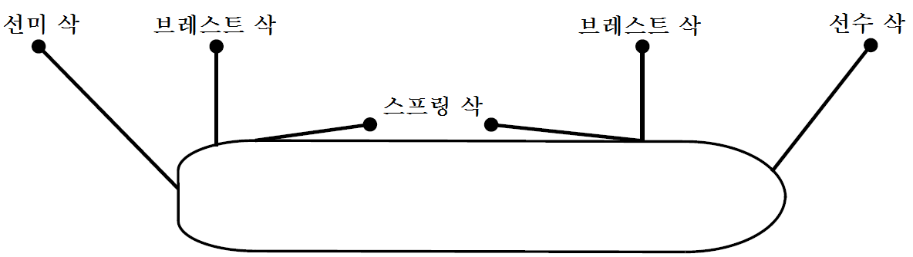
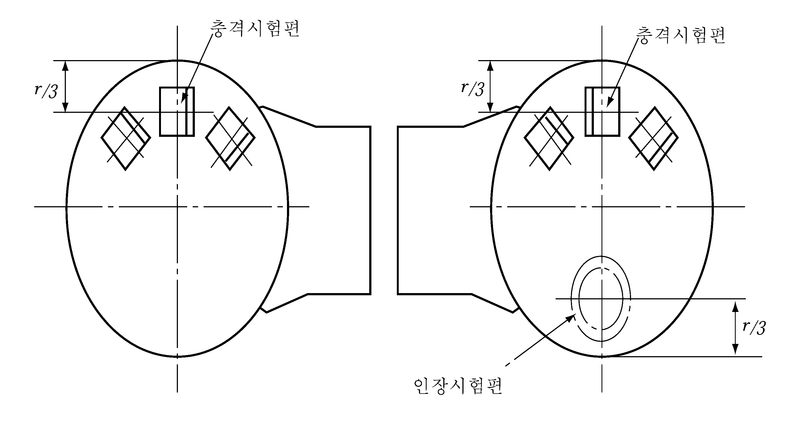

# 제4편 선체의장

> 선급 및 강선규칙/적용지침 / RA-04-K / 2025 / KO / Guidance

## 제 8 장 의장수 및 의장품

### 제 1 절 일반사항

#### 101. 적용 및 일반 【규칙 참조】

- **1.** 묘박설비는 다음을 제외한 총톤수 100톤을 초과하는 자항선에 요구된다. *(2024)*
  - **(1)** 내수운항선(inland navigation vessels)
  - **(2)** 군함
  - **(3)** 비상업적 목적으로 운영되는 관공선
  - **(4)** 고속경구조선
  - **(5)** 요트
- **2.** 강도계산용 흘수($d_s$)를 정하여 계획된 선박 및 건현지정을 위한 실제의 흘수($d_f$)가 계획흘수($d$) 보다 크게 된 선박의 경우에는 의장수 및 의장품의 취급은 다음과 같이한다.
  - **(1)** $d_s$ 를 정하여 계획된 선박에는 $d_s$ 에 대응한 치수에 따라 의장수 및 의장품을 결정한다. 이 경우 #eqnID-323_s2mm 의 경우에는 $d_s$ 에 대응하는 선박의 길이($L_s$)를 사용한다.
  - **(2)** $d_f > d$ 의 경우($d_s$ 를 정한 선박에는 $d_f > d_s$)에는 $d_f$ 에 대응한 치수에 의하여 의장수 및 의장품을 결정한다. 이 경우 #eqnID-330_s2mm 의 경우에는 $d_f$ 에 대응하는 선박의 길이를 사용하여 의장수를 계산한다.
- **3.** **강도상 갑판실로 간주되지 않는 선루 등의 취급** 강도상 갑판실로 간주되지 않는 선루라도 측벽판이 선측까지 도달하고 또한, 갑판을 가지면 선루로 취급한다. 다만, 갑판실의 단부 등이 대단히 짧은 선루부분은 갑판실로 취급할 수 있다.
- **4.** **묘박설비의 설계**
  - **(1)** 이 장의 묘박설비는 항내 또는 보호수역 내에서 선박이 정박, 물때 등을 기다리는 경우에 선박을 임시 계류하는 것을 목적으로 한다. 심해 및 비보호수역에서의 묘박설비에 관한 권장사항은 **부록 4-3**을 참조할 수 있다.
  - **(2)** **규칙 201**.에 명시된 묘박설비에 대한 의장수 계산은 최대조류속도 2.5 m/s, 최대풍속 25 m/s 및 배출된 체인의 길이와 수심의 비율이 최소한 6:1 이라는 조건을 기반으로 한다. 길이가 135 m 이상인 선박의 경우, 최대조류속도 1.54 m/s, 최대풍속 11 m/s, 최대 유의파고 2 m를 대체조건으로 적용할 수 있다.
  - **(3)** 정상적인 상황에서 선박은 한 개의 선수앵커와 앵커체인만을 사용한다고 가정한다.
  - **(4)** 정상적인 작업을 위해 계획된 묘박 외에도 묘박설비는 운항성 손실, 예정되지 않은 수리 및 기타 예기치 않은 상황과 같은 비상 상황에도 선박 안전을 위해 사용할 준비가 되어 있어야 한다. *(2024)*

#### 104. 시험 및 검사 【규칙 참조】

**규칙 104.**의 **3**항에서 “우리 선급이 적절하다고 인정하는 증명서”라 함은 국제선급연합회(IACS)의 QSCS (Quality System Certification Scheme)에 적합함이 검증된 선급 및 해당 기국의 주관청에서 발행한 증서 또는 MED증서를 말한다.

### 제 2 절 의장수

#### 201. 의장수 【규칙 참조】

- **1.** **예인선의 의장수** ***(2024)***
  - **(1)** 의장수는 다음 식에 따른다.
    $E = \Delta ^{\frac{2}{3}} +2.0( aB + \sum _{} ^{} h _{i} b _{i} )+ \frac{A}{10}$
    $\Delta , a, h _{i} , A$ : **규칙 201.**에 따른다.
    $b _{i}$ : 너비가 $B/4$ 를 넘는 선루 또는 갑판실 각 층의 최대너비(m).
  - **(2)** 길이 45m 미만의 전용 예인선이 앵커와 앵커체인을 쉽게 설치할 수 있는 경우 선상에서 한 개의 앵커를 사용할 수 있다. 단, 앵커가 유실되는 경우 예인선은 교체용 앵커가 본선에 설치될 때까지 항구에 남아있어야 한다.
- **2.** **유효숫자의 처리방법**
  - **(1)** 길이, 높이, 너비 등의 치수의 단위는 m 이하 셋째자리에서 반올림하여 둘째자리까지 취한다.
  - **(2)** $\Delta$ 의 값은 정수만으로 한다.
  - **(3)** 식의 각 항($\Delta ^{\frac{2}{3}} , 2.0(hB+S _{fun} ), \frac{A}{10}$)은 소수점 이하 첫째자리에서 반올림하여 정수만으로 한다.
- **3.** $\Delta$ **및** $a$ **의 결정방법**
  - **(1)** $\Delta$ 및 $a$ 의 값은 계획하기만재흘수선에 대한 값으로 한다. 다만, 강도계산용 흘수($d_s$)를 정하여 계획된 선박은 $d_s$ 에 대한 값으로 한다.
  - **(2)** 완성시에 주요치수($L$, $B$ 및 $D$)의 값이 변경된 경우(예를 들면, #eqnID-347_s2mm 인 상태로 $L$ 이 변경되었을 경우)에는 의장수를 재조사할 필요가 있다.
  - **(3)** 흘수가 변경된 경우의 취급은 **101.**의 **2**항에 따른다.
- **4.** **구조물의 너비 측정방법**
  - **(1)** 구조물은 갑판에 의하여 상하로 분리된 구조물로 취급한다. 한 층에서 연속하는 선루 또는 갑판실 등은 그 너비 및 높이가 연속으로 변화하든지 불연속으로 변화하든지에 관계없이 한 개의 구조물로 취급하여 그 너비는 **그림 4.8.1**과 같이 최대너비를 취한다.
  - **(2)** 한 층에서 분리되어 있는 독립된 갑판실 각각에 대하여는 전 호에 의하여 너비를 구하여 산입여부를 결정한다.(**그림 4.8.2** 참조)
- **5.** $A$**(측면투영면적)의 산정방법**
  - **(1)** $A$(측면투영면적)은 다음 식에 따른다.
    $A=aL+ \sum h _{j} l$(m^2)
    $a$ : 규칙 201.에 따른다.
    $\sum h _{j} l$: 최상층 전통갑판보다 상방에 있는 너비가 #eqnID-3544_s2 를 넘고 높이가 1.5m 이상인 선루, 갑판실, 트렁크, 또는 연돌 높이 $h _{j}$(m)와 길이 $l$(m)를 곱한 것의 합. 다만, $L$ 의 범위 밖에 있는 것은 산입할 필요가 없다.
  - **(2)** $A$(측면투영면적)를 결정할 때 캠버의 면적은 무시할 수 있다.
  - **(3)** 구조물은 갑판에 의하여 상하로 분리된 구조물로 취급한다. 한 층에서 연속하는 선루 또는 갑판실 등은 그 너비 및 높이가 연속으로 변화하든지 불연속으로 변화하든지에 관계없이 한 개의 구조물로 취급하여 그 길이는 최대길이를 취한다. 다만 높이가 1.5m 이하인 경우 그 구조물은 무시할 수 있다.
  - **(4)** 구조물의 높이($h _{j}$)는 너비가 $B/4$ 를 넘는 구조물 중심선에서의 각 층의 갑판간 높이로 한다.
  - **(5)** 다음에 열거하는 것은 $A$(측면투영면적)의 산입대상에서 제외할 수 있다.

    |  **그림 4.8.1** **그림 4.8.1** |  **그림 4.8.4** **그림 4.8.4** |
    | --- | --- |
    |   |  **그림 4.8.5** **그림 4.8.5** |
    |  **그림 4.8.2** **그림 4.8.2** |   |
    |  **그림 4.8.3** **그림 4.8.3** |   |
    - **(가)** $L$ 의 전후단의 바깥쪽
    - **(나)** 선루 또는 갑판실과 연속되어 있는 데릭붐, 통풍통 등
    - **(다)** 갑판 적재화물
- **6.** **의 장수가 2000을 초과하는 선박의 계 류삭**
  의장수가 2000을 초과하는 선박의 계류삭의 최소권장강도 및 수는 각각 (1)호 및 (2)호에 따른다. 계류삭의 길이는 (3)호에 따른다.
  의장수가 2000을 초과하는 선박의 계류삭의 강도 그리고 선수, 선미 및 브레스트 삭의 수는 측면투영면적 A1을 기준으로 한다. 측면투영면적 A1은 **규칙 201.**에 따라 측면투영면적 A와 유사한 방법으로 계산하되, 다음의 조건을 고려하여야 한다.
  - 측면투영면적 A1의 계산 시에 평형수흘수(ballast draft)를 고려하여야 한다. 여객선과 로로선 같이 흘수 변동이 작은 선박의 경우 하기만재흘수를 고려하여 측면투영면적 A1을 계산할 수 있다.
  - 선박이 제티 유형의 부두에 정기적으로 계류되는 경우가 아닌 경우, 부두에 의한 바람차단(wind shielding)은 측면투영면적 A1의 계산 시 고려하여야 한다. 수선 위 3 m 높이의 부두 표면을 가정하여, 즉, 고려하는 적재상태에 대한 수선 위 3 m 높이의 측면투영면적의 하부는 측면투영면적 A1의 계산시에 포함하지 않을 수 있다.
  - 공칭용량조건(nominal capacity condition)에서의 갑판 화물은 측면투영면적 A1을 결정할 때 포함되어야 하며, 갑판상에 화물이 있는 경우 하기만재흘수를 고려할 수 있다. 평형수흘수상태가 갑판상에 화물이 있는 만재흘수상태보다 더 큰 측면투영면적 A1을 만들어 내는 경우, 갑판화물을 고려할 필요가 없다. 두 개의 측면투영면적 중 큰 쪽이 측면투영면적 A1으로 선택되어야 한다.
  다음에 주어진 계류삭은 최대조류속도 1.0 m/s와 다음의 최대풍속 V_w (m/s)을 기준으로 계산한다 :
  $V _{W} = 25.0 - 0.002 (A _{1} - 2000)$: $rm 2000 m ^{2 } < A _{1} \leq 4000 m ^{2}$인 여객선, 페리 및 자동차 운반선의 경우
  $= 21.0$ : $\mathrm{A} _{1} > 4000 m ^{2}$ 인 여객선, 페리 및 자동차 운반선의 경우
  $= 25.0$ : 기타 선박
  풍속은 지상 10 m 높이에서 모든 방향에서 30초의 평균 속도로 나타낸다. 조류속도는 평균 흘수의 1/2의 깊이에서 선수 또는 선미 (± 10°)에 작용하는 최대조류속도로 한다. 또한, 선박이 교차조류(cross current)를 차단(shielding)하는 솔리드 부두(solid pier)에 계류되어 있는 것으로 간주한다.
  보다 높은 풍속 또는 조류, 교차 조류, 추가의 파랑하중 또는 솔리드가 아닌 부두의 차단(shielding) 감소의 이유로 하중이 추가되는 경우 이를 고려하여야 한다. 또한, 부적절한 계류배치는 단일 계류삭의 하중을 상당히 증가시킬 수 있다는 점을 주의하여야 한다.
  비고
  계류삭의 목적과 관련하여 다음과 같이 정의한다.
  브레스트 삭(Breast line) : 선박에 수직으로 배치된 계류삭으로, 정박시설 바깥쪽 방향으로 선박을 구속한다.
  스프링 삭(Spring line) : 선박과 거의 평행하게 배치된 계류삭으로, 선수미 방향으로 선박을 구속한다.
  선수/선미 삭(Head/Stern line) : 종 방향과 횡 방향 사이에 위치하는 계류삭으로, 정박시설 밖의 방향 및 선수미 방향으로 선박을 구속한다. 정박시설 바깥쪽 방향 및 선수미 방향의 구속 정도는 이들 방향에 대한 계류삭의 각도에 따라 달라진다.
  
  - **(1)** 최소설계파단하중
    의장수가 2000을 초과하는 선박의 계류삭의 최소설계파단하중($MBL _{SD}$)은 다음에 따른다.
    $MBL _{SD} = 0.1 \cdot A _{1} +350$ (kN)
    A1 : 측면투영면적, 이 항의 요건에 따른다.
    최소설계파단하중은 1275 kN (130 t)으로 제한될 수 있다. 다만, 이 경우에 계류장치는 이 항에 규정된 환경 조건에 대하여 불충분하다고 간주하여야 한다. 이러한 선박의 경우, 허용 풍속($V _{ W} ^{ *}$)은 다음과 같이 추정할 수 있다.
    $V _{ W}^{ *} = V _{W} \cdot \sqrt {\frac{MBL _{SD}^{*}}{MBL _{SD}}}$ (m/s)
    $V _{W}$ 는 이 항에서 정의한 풍속, $MBL _{SD }^{*}$은 공급 계획된 계류삭의 절단하중, $MBL _{SD}$ 은 상기 계산식에 따른 권장 절단하중이다. 다만, 최소설계파단하중은 허용 풍속 21 m/s에 상응하는 값 이상이어야 한다.
    $MBL _{SD}^{*} \geq \left( \frac{21}{V _{W}} \right) ^{2} \cdot MBL _{SD}$
    계류삭이 $V _{W}$ 보다 더 큰 허용 풍속($V _{ W} ^{ *}$) 에 사용하도록 계획된 경우, 최소설계파단하중은 다음에 따른다.
    $MBL _{SD}^{*} \geq \left( \frac{V _{W}^{ * ^{ }}}{V _{W}} \right) ^{2} \cdot MBL _{SD}$
  - **(2)** 계류삭의 수
    선수, 선미 및 브레스트 삭(이 항의 비고 참조)의 합계는 다음에 따른다.
    $n = 8.3 \cdot 10 ^{{} _{-4}} \cdot A _{1} +6$
    유조선, 케미컬탱커, 산적화물선 및 광석운반선의 경우, 선수, 선미 및 브레스트 삭의 합계는 다음에 따른다.
    $n = 8.3 \cdot 10 ^{{} _{-4}} \cdot A _{1} +4$
    선수, 선미 및 브레스트 삭의 합계는 가장 가까운 정수로 반올림되어야 한다.
    선수, 선미 및 브레스트 삭의 수는 삭의 강도 조정과 함께 증가 또는 감소될 수도 있다. 조정된 강도($MBL _{SD}^{ **}$)는 다음에 따른다.
    $MBL _{SD }^{ **} = 1.2 \cdot MBL _{SD} \cdot n/n ^{**} \leq MBL _{SD}$ , 삭의 수가 증가한 경우
    $MBL _{SD }^{ **} = MBL _{SD} \cdot n/n ^{**}$ , 삭의 수가 감소한 경우
    $MBL _{SD}$ 는 (1)호의 $MBL _{SD}$ 또는 $MBL _{SD}^{ *}$ 이며, n**은 선수, 선미 및 브레스트 삭의 증가 또는 감소된 합계이다. n은 해당 선박의 종류에 따라 위의 수식에 의해 계산된 반올림하지 않은 값이다.
    반대로, 선수, 선미 및 브레스트 삭의 최소설계파단하중은 삭의 수 조정과 함께 증가 또는 감소될 수도 있다.
    스프링 삭(이 항의 비고 참조)의 합계는 다음에 따른다.
    의장수(EN) < 5000인 경우: 2개
    의장수(EN) ≥ 5000인 경우: 4개
    스프링 삭의 최소설계파단하중은 선수, 선미 및 브레스트 삭의 최소설계파단하중과 동일하여야 한다. 선수, 선미 및 브레스트 삭의 수가 삭의 최소설계파단하중 조정과 함께 증가된 경우, 스프링 삭의 수는 다음에 따르되, 가장 가까운 짝수로 올림되어야 한다.
    $n _{s}^{*} = MBL _{SD} /MBL _{SD}^{** _{ }} \cdot n _{s}$
    $MBL _{SD}$ 는 (1)호의 $MBL _{SD}$ 또는 $MBL _{SD}^{ *}$ 이며, $n _{s}$는 위에서 주어진 스프링 삭의 수, $n _{s} ^{*}$ 는 증가된 스프링 삭의 수이다.
  - **(3)** 계류삭의 길이
    의장수가 2000을 초과하는 선박의 계류삭의 길이는 200 m로 선택할 수 있다.
    개별 계류삭의 길이는 위에 규정된 길이의 7 %까지 감소될 수도 있지만, 계류삭의 전체 길이는 모든 삭이 동일한 길이였을 때의 결과보다 작아서는 안 된다.
- **7.** **예인삭**
  예인삭은 **규칙 표 4.8.1**에 따르며, 선박의 자체 예인삭으로 예인선이나 다른 선박에 의해 예인되는 것으로 한다. **규칙 표 4.8.1**의 예인삭을 선택하는 경우, 의장수는 **6**항에 따라야 한다.

#### 203. 앵커체인 【규칙 참조】

- **1.** 크레인 부선과 같은 특수한 선박의 경우, 그 특성을 고려하여 우리 선급이 인정하는 경우 앵커체인 대신에 와이어로프를 사용할 수 있다. 다만, 와이어로프를 사용할 경우에 아래의 요건에 적합하여야 한다.
  - **(1)** 와이어로프의 절단시험하중은 요구되는 앵커체인의 절단시험하중 이상인 것이어야 한다.
  - **(2)** 와이어로프의 길이는 요구되는 앵커체인 길이의 1.5배 이상인 것이어야 한다.
  - **(3)** 앵커의 질량은 요구되는 앵커질량의 1.25배 이상인 것이어야 한다.
  - **(4)** 앵커와 와이어로프의 연결부는 체인으로 연결되어야 하며, 체인의 길이는 다음 중 작은 값 이상인 것이어야 한다.
    - **(가)** 12.5 m
    - **(나)** 앵커의 격납위치와 윈치 사이의 거리
- **2.** 그 외 계류 효력이 규칙 요구치와 동등하다고 우리 선급이 특별히 인정하는 경우에 한하여 규정에 적합한 것으로 볼 수 있다.

### 제 3 절 앵커

#### 304. 구조 및 치수 【규칙 참조】

규칙 중󰡒우리 선급에서 지정하는 파지력󰡓이란 **제조법 및 형식승인 등에 관한 지침 3장 6절**의 형식승인 시험에 의한 파지력시험 결과, 고파지력 앵커의 경우 동일질량의 스톡리스 앵커 파지력의 2배 이상, 초고파지력 앵커의 경우 동일질량의 스톡리스 앵커 파지력의 4배 이상인 파지력을 말한다.

### 제 4 절 체인

#### 401. 적용 【규칙 참조】

**1 . 규 칙 4편 8장 401.**의 **2**항에서 말하는 비상예인장치용 마모방지체인은 다음에 따른다.

- **2.** **규칙 4편 8장 401.**의 **2**항에서 말하는 해양구조물용 체인은 다음에 따른다.
  - **(1)** 일반 요건
    - 이동식 해양구조물, 부유식 생산구조물, 해양로딩시스템(offshore loading system), 제조중인 중력식 구조물
    - **(가)** 범위
      - **(a)** 이 항의 요건은 다음 해양구조물의 계류에 사용되는 해양구조물용 체인 및 체인부품(이하 체인 및 체인부품이라 한다)의 재료, 설계, 제작 및 시험에 적용한다.
      - **(b)** 계류장치는 스터드 붙이 보통링크, 스터드가 없는 보통링크, 연결용 보통링크(스플라이스(splice) 링크), 확대링크, 단말링크, 분리가능 연결용 링크(섀클), 단말섀클, 해저연결부(subsea connector), 스위블 및 스위블섀클을 포함한다.
      - **(c)** 스터드가 없는 링크 체인은 일반적으로 한 번만 배치되며, 미리 결정된 설계수명을 갖는 장기 영구계류시스템에 사용한다.
      - **(d)** 일점계류장치용 마모방지 체인의 요건은 **3**항에 따른다.
    - **(나)** 체인 종류
      - **(a)** 체인은 사용되는 강재의 공칭 인장강도에 따라 제*R* 3종 체인, 제*R* 3S종 체인, 제*R* 4종 체인, 제*R* 4S종 체인 및 제*R* 5종 체인의 5종류로 구분한다.
      - **(b)** 제*R* 4S종 체인 및 제*R* 5종 체인에 대한 제조자의 사양은 설계 조건 및 우리 선급의 승인에 따라 변경될 수 있다.
      - **(c)** 체인은 각 등급별로 개별적으로 승인받아야 한다. 상위 등급 체인의 승인이 하위 등급 체인의 승인을 대신할 수 없다. 상위 등급 체인과 하위 등급 체인이 같은 화학성분 및 열처리를 사용한 같은 제조법에 따라 생산된 것이 우리 선급에 의해 인정되는 경우, 하위 등급 체인의 품질이 상위 등급 체인의 품질로 고려될 수 있다. 승인 시에 적용된 변수들은 제품 생산 시에 변경할 수 없다.
  - **(2)** 재료

    **표 4.8.2 해양체인용 재료**

    | 해양체인의 종류 | 재료 | 재료기호 |
    | --- | --- | --- |
    | 제*R* 3종 체인 | 제*R* 3종 체인용 봉강 | *RSBCR* 3 |
    | 제*R* 3S종 체인 | 제*R* 3S종 체인용 봉강 | *RSBCR* 3S |
    | 제*R* 4종 체인 | 제*R* 4종 체인용 봉강 | *RSBCR* 4 |
    | 제*R* 4S종 체인 | 제*R* 4S종 체인용 봉강 | *RSBCR* 4S |
    | 제*R* 5종 체인 | 제*R* 5종 체인용 봉강 | *RSBCR* 5 |

    **표 4.8.3 해양체인용 부품의 재료**

    | 연결되는 해양체인의 종류 | 제조방법 |   |   |   |
    | --- | --- | --- | --- | --- |
    | 연결되는 해양체인의 종류 | 주조 | 재료기호 | 단조 | 재료기호 |
    | 제*R* 3종 체인 | 제*R* 3종 체인용 주조품 | *RSCCR* 3 | 제*R* 3종 체인용 단강품 | *RSFCR* 3 |
    | 제*R* 3S종 체인 | 제*R* 3S종 체인용 주조품 | *RSCCR* 3S | 제*R* 3S종 체인용 단강품 | *RSFCR* 3S |
    | 제*R* 4종 체인 | 제*R* 4종 체인용 주조품 | *RSCCR* 4 | 제*R* 4종 체인용 단강품 | *RSFCR* 4 |
    | 제*R* 4S종 체인 | 제*R* 4S종 체인용 주조품 | *RSCCR* 4S | 제*R* 4S종 체인용 단강품 | *RSFCR* 4S |
    | 제*R* 5종 체인 | 제*R* 5종 체인용 주조품 | *RSCCR* 5 | 제*R* 5종 체인용 단강품 | *RSFCR* 5 |
    - **(가)** 체인 재료는 그 종류에 따라 **지침 표 4.8.2**에 따른다.
    - **(나)** 체인부품의 재료는 연결되는 체인의 종류에 따라 **지침 표 4.8.3**에 따른다.
  - **(3)** 설계 및 제조
    검사원이 요청할 경우 체인용 봉강의 가열, 플래시용접 및 열처리의 기록을 제시할 수 있어야 한다.
    ① 정반(platen)의 움직임
    ② 시간 함수로서의 용접전류
    ③ 유압
    (ⅳ) 결정립의 결정은 최종 제품에 대하여 이루어져야 한다. 제*R* 3종, 제*R* 3S종, 제*R* 4종, 제*R* 4S종 및 제*R* 5종 체인에 대한 오스테나이트 결정입도는 **ASTM E112**에 따라 6 이상이거나 **ISO 643**에 따른 이와 동등한 결정입도이어야 한다. 원형 단면의 측정은 모재(표면, 반지름의 1/3 지점 및 중심), 열영향부 및 용접부에서 실시한다.
    
    **그림 4.8.11 체인 링크의 예**

    **표 4.8.4 기계적 성질**

    | 해양체인의 종류 | 인장시험 |   |   |   | 충격시험(1) |   |   |
    | --- | --- | --- | --- | --- | --- | --- | --- |
    | 해양체인의 종류 | 항복강도(2) (N/mm^2) | 인장강도(2) (N/mm^2) | 연신율 ($L=5d$) (%) | 단면 수축율 (%) | 시험온도 (°C) | 최소평균흡수에너지(J ) |   |
    | 해양체인의 종류 | 항복강도(2) (N/mm^2) | 인장강도(2) (N/mm^2) | 연신율 ($L=5d$) (%) | 단면 수축율 (%) | 시험온도 (°C) | 용접부 이외 | 전기 용접부 |
    | 제*R* 3종 | 410 이상 | 690 이상 | 17 이상 | 50 이상 | -20(3) | 40 이상(3) | 30 이상(3) |
    | 제*R* 3*S*종 | 490 이상 | 770 이상 | 15 이상 | 50 이상 | -20(3) | 45 이상(3) | 33 이상(3) |
    | 제*R* 4종 | 580 이상 | 860 이상 | 12 이상 | 50 이상 | -20 | 50 이상 | 36 이상 |
    | 제*R* 4*S*종 | 700 이상 | 960 이상 | 12 이상 | 50 이상 | -20 | 56 이상 | 40 이상 |
    | 제*R* 5종 | 760 이상 | 1000 이상 | 12 이상 | 50 이상 | -20 | 58 이상 | 42 이상 |
    | (비 고) (1) 1조(3개)의 시험편 가운데 2개 이상의 시험편의 흡수에너지 값이 규정의 최소 평균흡수에너지 값에 미치지 못하는 경우 또는 어느 쪽이든 1개의 시험편의 흡수에너지 값이 규정의 최소 흡수평균에너지 값의 70 % 미만인 경우는 불합격으로 한다. (2) 항복비는 0.92 이하로 한다. (3) 제$R 3$종 및 제 $R 3S$ 종 체인은 우리 선급이 인정하는 경우 충격시험은 0°C에서 시행할 수 있으며 이 경우 최소평균흡수에너지 값은 다음 값 이상이어야 한다. 용접부 이외 ; 전기용접부 제*R* 3종 체인 ; 60 J ; 50 J 제*R* 3종 체인 ; 65 J ; 53 J 용접부 이외 전기용접부 제*R* 3종 체인 60 J 50 J 제*R* 3종 체인 65 J 53 J |   |   |   |   |   |   |   |
    |   | 용접부 이외 | 전기용접부 |   |   |   |   |   |
    | 제*R* 3종 체인 | 60 J | 50 J |   |   |   |   |   |
    | 제*R* 3종 체인 | 65 J | 53 J |   |   |   |   |   |

    ① 만곡부(crown)에서 계측한 호칭지름의 음의 허용차

    |   |   |   |   |   |   |   |   |
    | --- | --- | --- | --- | --- | --- | --- | --- |
    | 호칭지름(mm) | 초과 |   | 40 | 84 | 122 | 152 | 184 |
    | 호칭지름(mm) | 이하 | 40 | 84 | 122 | 152 | 184 | 222 |
    | 음의 허용차(mm) |   | -1 | -2 | -3 | -4 | -6 | -7.5 |

    비고 1:
    만곡부의 단면적은 음의 허용차가 허용되지 않는다. 지름이 20 mm이상인 경우, 양의 허용차는 호칭지름의 5 %까지 될 수 있다. 지름이 20 mm미만인 경우, 양의 허용차는 우리 선급의 승인을 받아야 한다.
    비고 2:
    만곡부의 단면적은 음의 허용차 및 양의 허용차를 갖는 지름의 평균을 사용하여 계산되어야 하며, 계측은 약 90도 간격을 두고 적어도 2개 지점에서 측정하여야 한다.
    ② 만곡부 이외의 지점에서 측정된 지름
    지름의 음의 허용차는 허용되지 않는다. 양의 허용차는 우리 선급이 승인한 제조자 사양에 따라야 하는 맞대기 용접부을 제외하고는 호칭지름의 5 %까지 허용될 수 있다. 지름이 20 mm미만인 경우, 양의 허용차는 우리 선급의 승인을 받아야 한다.
    ③ 5개 링크의 길이에 대한 제조 허용차는 + 2.5 %이며, 음의 허용차는 허용되지 않는다.
    ④ 다른 모든 치수는 ± 2.5 %의 제조 허용차를 적용받으며, 모든 부품은 항상 서로 적절하게 고정되어야 한다.
    ⑤ 스터드 붙이 링크 및 스터드 없는 보통링크의 허용차는 **지침 그림 4.8.12**에 따라 측정한다.
    ⑥ 스터드 붙이 링크 체인의 경우, 스터드는 링크의 중심에 위치하여야 하며 링크의 측면에 직각으로 위치하여야 한다.
    스터드가 꼭 맞게 끼워지고 그 끝이 링크 안쪽에 놓여지면 **지침 그림 4.8.12**의 허용차가 허용될 수 있다.

    **표 4.8.5 5개 링크의 내력 및 절단시험하중, 중량 및 길이에 대한 식**

    | 시험하중 (kN) | 제*R* 3종 스터드 붙이 링크 | 제*R* 3S종 스터드 붙이 링크 | 제*R* 4종 스터드 붙이 링크 | 제*R* 4S종 스터드 붙이 링크 | 제*R* 5종 스터드 붙이 링크 |
    | --- | --- | --- | --- | --- | --- |
    | 내력 | 0.0148$d ^{ 2}$(44-0.08$d$) | 0.0180$d ^{2}$(44-0.08$d$) | 0.0216$d ^{ 2}$(44-0.08$d$) | 0.0240$d ^{2}$(44-0.08$d$) | 0.0251$d ^{2}$(44-0.08$d$) |
    | 절단 | 0.0223$d ^{2}$(44-0.08$d$) | 0.0249$d ^{2}$(44-0.08$d$) | 0.0274$d ^{2}$(44-0.08$d$) | 0.0304$d ^{2}$(44-0.08$d$) | 0.0320$d ^{2}$(44-0.08$d$) |
    | 시험하중 (kN) | 제*R* 3종 스터드 없는 체인 | 제*R* 3S종 스터드 없는 체인 | 제*R* 4종 스터드 없는 체인 | 제*R* 4S종 스터드 없는 체인 | 제*R* 5종 스터드 없는 체인 |
    | 내력 | 0.0148$d ^{2}$(44-0.08$d$) | 0.0174$d ^{2}$(44-0.08$d$) | 0.0192$d ^{ 2}$(44-0.08$d$) | 0.0213$d ^{2}$(44-0.08$d$) | 0.0223$d ^{ 2}$(44-0.08$d$) |
    | 절단 | 0.0223$d ^{ 2}$(44-0.08$d$) | 0.0249$d ^{ 2}$(44-0.08$d$) | 0.0274$d ^{ 2}$(44-0.08$d$) | 0.0304$d ^{ 2}$(44-0.08$d$) | 0.0320$d ^{ 2}$(44-0.08$d$) |
    | 체인 질량 (kg/m) | 스터드 붙이 링크 = 0.0219$d ^{ 2}$ |   |   |   |   |
    | 체인 질량 (kg/m) | 스터드 없는 체인 해당 설계의 질량계산서는 제출되어야 한다. |   |   |   |   |
    | 피치 길이 | 5개 링크 계측 |   |   |   |   |
    | 최소 | 22$d$ |   |   |   |   |
    | 최대 | 22.55$d$ |   |   |   |   |

    **스터드 붙이 링크 - 내부 링크 반지름과 외부 링크 반지름은 균일하여야 한다.  기호(1) ; 종류 ; 링크호칭치수 ; 음의 허용차 ; 양의 허용차 $a$ ; 링크길이 ; 6$d$ ; 0.15$d$ ; 0.15$d$ $b$ ; 링크길이의 절반 ; $a$*/2 ; 0.l$d$ ; 0.1$d$ $c$ ; 링크폭 ; 3.6$d$ ; 0.09$d$ ; 0.09$d$ $e$ ; 스터드 각도 오차 ; 0도 ; 4도 ; 4도 $R$ ; 내측반경 ; 0.65$d$ ; 0 ; ----- 비고: (1) 치수기호는 상기 그림에 따른다. $d$ = 체인의 호칭지름 $a$* = 실제 링크길이 기호(1) 종류 링크호칭치수 음의 허용차 양의 허용차 $a$ 링크길이 6$d$ 0.15$d$ 0.15$d$ $b$ 링크길이의 절반 $a$*/2 0.l$d$ 0.1$d$ $c$ 링크폭 3.6$d$ 0.09$d$ 0.09$d$ $e$ 스터드 각도 오차 0도 4도 4도 $R$ 내측반경 0.65$d$ 0 ----- 비고: (1) 치수기호는 상기 그림에 따른다. $d$ = 체인의 호칭지름 $a$* = 실제 링크길이**

    | 기호(1) | 종류 | 링크호칭치수 | 음의 허용차 | 양의 허용차 |
    | --- | --- | --- | --- | --- |
    | $a$ | 링크길이 | 6$d$ | 0.15$d$ | 0.15$d$ |
    | $b$ | 링크길이의 절반 | $a$*/2 | 0.l$d$ | 0.1$d$ |
    | $c$ | 링크폭 | 3.6$d$ | 0.09$d$ | 0.09$d$ |
    | $e$ | 스터드 각도 오차 | 0도 | 4도 | 4도 |
    | $R$ | 내측반경 | 0.65$d$ | 0 | ----- |
    | 비고: (1) 치수기호는 상기 그림에 따른다. $d$ = 체인의 호칭지름 $a$* = 실제 링크길이 |   |   |   |   |

    **스터드 없는 링크 - 내부 링크 반지름과 외부 링크 반지름은 균일하여야 한다.  기호(1) ; 종류 ; 링크호칭치수 ; 음의 허용차 ; 양의 허용차 $a$ ; 링크길이 ; 6$d$ ; 0.15$d$ ; 0.15$d$ $b$ ; 링크폭 ; 3.35$d$ ; 0.09$d$ ; 0.09$d$ $R$ ; 내측반경 ; 0.60$d$ ; 0 ; ----- 비고: (1) 치수기호는 상기 그림에 따른다. $d$ = 체인의 호칭지름 (2) 다른 치수비는 별도로 승인받아야 한다. 기호(1) 종류 링크호칭치수 음의 허용차 양의 허용차 $a$ 링크길이 6$d$ 0.15$d$ 0.15$d$ $b$ 링크폭 3.35$d$ 0.09$d$ 0.09$d$ $R$ 내측반경 0.60$d$ 0 ----- 비고: (1) 치수기호는 상기 그림에 따른다. $d$ = 체인의 호칭지름 (2) 다른 치수비는 별도로 승인받아야 한다.**

    | 기호(1) | 종류 | 링크호칭치수 | 음의 허용차 | 양의 허용차 |
    | --- | --- | --- | --- | --- |
    | $a$ | 링크길이 | 6$d$ | 0.15$d$ | 0.15$d$ |
    | $b$ | 링크폭 | 3.35$d$ | 0.09$d$ | 0.09$d$ |
    | $R$ | 내측반경 | 0.60$d$ | 0 | ----- |
    | 비고: (1) 치수기호는 상기 그림에 따른다. $d$ = 체인의 호칭지름 (2) 다른 치수비는 별도로 승인받아야 한다. |   |   |   |   |

    (ⅳ) 별도로 승인된 경우를 제외하고 스터드 양단의 용접은 허용되지 않는다.
    (ⅴ) 용접은 우리 선급의 인정을 받은 용접사가 승인된 용접절차시방서 및 승인된 저수소계 용접용재료를 사용하여야 한다.
    (ⅵ) 필릿용접의 크기는 최소한 API Specification 2F에 따라야 한다.
    (ⅶ) 용접부는 품질이 양호해야 하며, 균열이나 융합부족, 큰 기공 및 1 mm를 넘는 언더컷이 없어야 한다.
    (ⅷ) 모든 스터드 용접부는 외관검사를 하여야 한다. 내력시험 후 체인의 각 연의 스터드 용접부의 10 % 이상에 대하여 침투탐상 또는 자분탐상시험을 하여야 한다. 균열 또는 융합부족이 발견된 경우, 해당 연의 모든 스터드 용접부에 대해 시험을 하여야 한다.
    (ⅳ) 각 연결용 보통링크는 다음 중 하나의 위치에 표시하여야 한다.
    ① 스터드 붙이 링크 체인용 스터드 또는
    ② 스터드 없는 체인의 플래시 맞대기 용접부 반대쪽의 바깥 쪽 직선 길이부
    이 표시는 (4)호 (사)에 규정하는 사항 및 링크에 대한 고유번호를 표시하여야 한다.
    연결용 보통링크에 연결되는 링크의 경우에도 ① 또는 ②의 위치에 표시하여야 한다.
    - **(가)** 설계
      - **(a)** 체인 제조사에 의해 작성되었거나 공급된 체인 및 체인부품의 상세한 설계를 제공하는 도면(설계 계산 포함)을 승인을 위하여 제출하여야 한다. 일반적인 설계는 ISO 1704에 따른다. 스터드가 없는 체인의 형상과 비율은 이 항의 요건을 만족하여야 한다. 기타에서의 스터드가 없는 비율은 특별히 승인되어야 한다. 새로운 또는 표준이 아닌 체인, 섀클 또는 의장품(fitting)의 설계에는 피로 해석, 피로 또는 부식피로시험(가능한 경우)이 요구될 수 있다.
      - **(b)** 스터드 붙이 링크 체인의 경우, 스터드의 상세설계를 나타내는 도면을 참고용으로 제출하여야 한다. 스터드는 스터드의 위치를 고정시키기에 충분히 깊은 체인 링크에 압인되어야 한다. 그러나 압인의 모양과 깊이의 복합 효과는 체인링크에 유해한 노치효과 또는 응력집중을 유발해서는 안 된다.
      - **(c)** 켄터섀클의 기계가공부 코너의 필릿반경은 호칭지름의 3 %이상이어야 한다.
    - **(나)** 앵커체인 제조법
      - **(a)** 일반
      - **(i)** 체인은 우리 선급의 승인을 받은 제조공장에서 제조하여야 한다. 이 목적을 위하여 승인 시험을 수행하여야 하며, 그 범위에는 내력시험 및 파단시험, 계측 및 파괴역학시험을 포함하는 기계적 시험을 포함하여야 한다.
        - **(ii)** 체인은 플래시(flash) 맞대기 용접으로 연속으로 연결하여 제조되어야 하며, 연속로에서 열처리 되어야 한다; 배치(batch)식 열처리는 특별한 상황(마모방지 체인과 같이 짧은 연의 열처리)을 제외하고는 허용되지 않는다. (**3**항 참조)
        - **(iii)** 최종 구매자는 결함이 있는 링크를 대체하기 위해 연결용 링크를 사용하는 것의 허용되는 수와 유형에 대하여 서면 승인을 하여야 한다. 연결용 보통 링크의 사용은 체인길이 100 m 당 3개의 링크로 제한된다.
      - **(b)** 앵커체인 제조법 기록
      - **(c)** 봉강의 가열
      - **(i)** 링크용 봉강은 전기저항 가열, 유도 가열 또는 화로에서 가열하여야 한다.
        - **(ii)** 체인용 봉강을 전기저항 가열 또는 유도 가열하는 경우, 가열 단계는 광학 열 센서로 제어되어야 한다. 제어기는 매 8시간마다 한번 이상 점검하고 기록되어야 한다.
        - **(iii)** 화로 가열의 경우, 가열은 제어되어야 하며 온도는 봉강에 근접한 열전대를 사용하여 연속적으로 기록되어야 한다. 제어기는 매 8시간마다 한번 이상 점검하고 기록되어야 한다.
      - **(d)** 앵커체인의 플래시용접
      - **(i)** 각 링크를 용접하는 동안 다음의 용접변수들은 제어되어야 한다.
        - **(ii)** 용접변수들은 매 4시간마다 한번 이상 점검하고 기록되어야 한다.
      - **(e)** 앵커체인의 열처리
      - **(i)** 체인은 설정한도 내에서 온도와 시간의 조합으로 상부 변태 온도 이상에서 오스테나이트화 되어야 한다.
        - **(ii)** 적용 가능한 경우, 체인은 설정한도 내에서 온도와 시간의 조합으로 템퍼링되어야 한다. 템퍼링 이후 냉각은 템퍼 취성을 피할 수 있도록 적절하여야 한다.
        - **(iii)** 온도 및 유지시간 또는 온도 및 체인 속도는 제어되어야 하고 연속적으로 기록되어야 한다.
      - **(f)** 기계적 성질
      - **(i)** 체인 및 체인부품의 기계적 특성은 **지침 표 4.8.4**에 따른다. 시험편의 위치는 **지침 2편 부록 2-9**의 **그림 1** 및 **지침 그림 4.8.11**에 따른다.
      - **(g)** 내력 및 절단시험하중
      - **(i)** 체인 및 체인부품은 **지침 표 4.8.5**에 주어진 내력 및 절단시험하중을 견딜 수 있어야 한다.
      - **(h)** 무결함
      - **(i)** 모든 체인은 제작방법에 부합하게 마무리를 하고 결함이 없어야 한다. 각 링크는 승인된 절차를 사용하여 (4)호 (마)에 따라 검사하여야 한다.
      - **(i)** 치수 및 치수 허용차
      - **(i)** 링크 및 부품의 모양 및 치수는 ISO 1704 또는 특별히 승인된 설계를 따라야 한다.
        - **(ii)** 링크의 치수 허용차는 다음과 같다.
      - **(j)** 스터드 붙이 링크 체인 - 스터드 용접
      - **(i)** 제*R* 3종과 제*R* 3S종 체인에는 용접된 스터드가 허용될 수도 있다. 별도로 승인된 경우를 제외하고 제*R* 4종 체인, 제*R* 4S종 체인 및 제*R* 5종 체인의 스터드를 용접으로 결합하여서는 안 된다.
        - **(ii)** 스터드가 링크에 용접되는 경우, 체인이 열처리되기 전에 완료되어야 한다.
        - **(iii)** 스터드 끝단은 링크 내부에 잘 맞아야 하며, 용접은 플래시 맞대기 용접과 반대쪽의 스터드 끝단에 국한되어야 한다. 별도로 승인된 경우를 제외하고 스터드 끝단의 전체 둘레는 용접되어야 한다.
      - **(k)** 연결용 보통링크(스플라이스 링크)
      - **(i)** 시험링크 또는 결함링크를 대체하기 위한 연결용 보통링크는 승인된 절차에 따라 제조되어야 하며, 체인 전체에 걸쳐 재열처리를 필요로 하지 않는 방법으로 하여야 한다. 체인의 각 종류별로 별도의 승인이 요구되며, 시험은 승인 신청된 가장 큰 치수의 체인으로 한다.
        - **(ii)** 연결용 보통링크의 제조 및 열처리는 연결되는 보통링크의 성질에 영향을 주지 않도록 온도를 250°C 이하로 보통링크와 연결하여야 한다.
        - **(iii)** 각 연결용 보통링크는 **지침 표 4.8.5** 및 (4)호 (마)에 명시된 내력시험 및 비파괴시험을 하여야 한다. 두 번째 링크는 연결용 보통링크와 동일하게 제조하여야 하며, (4)호 (라) 및 (마)에 따라 시험 및 검사하여야 한다.
  - **(4)** 체인의 시험과 검사
    인장시험편은 플래시 용접부의 반대쪽에서 채취하여야 한다.
    3개의 충격시험편은 플래시 용접부가 노치의 중심이 되는 위치에서, 3개의 충격시험편은 용접부가 아닌 위치에서, 3개의 충격시험편은 만곡부에서 채취되어야 한다.

    **표 4.8.6 절단시험편의 채취를 위한 길이**

    | 체인의 호칭지름 $d$(mm) | 체인의 길이(m) |
    | --- | --- |
    | $d \leq 48$ | 91 |
    | $48 < d \leq 60$ | 110 |
    | $60 < d \leq 73$ | 131 |
    | $73 < d \leq 85$ | 152 |
    | $85 < d \leq 98$ | 175 |
    | $98 < d \leq 111$ | 198 |
    | $111 < d \leq 124$ | 222 |
    | $124 < d \leq 137$ | 250 |
    | $137 < d \leq 149$ | 274 |
    | $149 < d \leq 162$ | 297 |
    | $162 < d \leq 175$ | 322 |
    | \(175 346 |   |
    | \(186 370 |   |
    | \(198 395 |   |
    | \(210 420 |   |

    링크는 다음의 결함이 없어야 한다:
    - 가로방향으로 1.6 mm를 초과하는 관련 선형표시
    - 길이방향으로 3.2 mm를 초과하는 관련 선형표시
    - 4.8 mm를 초과하는 관련 비선형표시.
    - 양단링크
    - 100 m를 초과하지 않는 간격으로 그 양단링크
    - 연결용 보통링크
    - 연결용 섀클의 양옆에 있는 링크 또는 연결용 보통링크
    표시는 체인의 예상 수명동안 영구적이고 또한 분명하여야 한다.
    - 체인 종류(스터드 붙이의 경우 KR-*R* 3, KR-*R* 3S, KR-*R* 4, KR-*R* 4S, KR-*R* 5 및 스터드리스의 경우 KR-*R* 3-SL, KR-*R* 3S-SL, KR-*R* 4-SL, KR-*R* 4S-SL, KR-*R* 5-SL)
    - 증서 번호
    - 우리 선급의 합격인
    - **(가)** 일반
      - **(a)** 이 규정은 스터드 붙이 보통링크, 스터드 없는 보통링크, 단말링크, 확대단말링크, 연결용 보통링크(스플라이스 링크)와 같은 앵커체인 등에 적용한다.
      - **(b)** 모든 체인에 대하여 최종 열처리 후 검사원의 입회하에 내력시험, 표본 절단시험 및 표본 기계적 시험을 실시하여야 한다. 다만, 제조자가 내력시험을 기록하는 절차를 보유하고 있고, 검사원이 기록시스템의 적합성을 인정하는 경우, 모든 내력시험에 입회할 필요는 없다. 검사원은 시험기가 보정되고 만족스런 조건으로 유지되고 있음을 확인해야 한다. 검사 전에 체인에는 스케일이나 도료 및 기타 피복물이 없어야 하며, 적용되는 비파괴검사 표준에 따라 적당한 표면상태를 가져야 한다. 이 요건을 충족시키기 위하여 체인에는 샌드 또는 쇼트블라스팅 처리를 하여야 한다.
    - **(나)** 내력 및 절단시험
      - **(a)** 체인의 전체 길이에 걸쳐 **지침 표 4.8.5**에 명시된 내력하중에 파단없이 견딜 수 있어야 하며, 플래시 용접부에 균열이 없어야 한다. 체인을 당길 때 작용하는 하중은 내력하중을 10 %이상 초과하여서는 안 된다. 소성변형(plastic straining)을 이용하여 스터드를 결합시키는 방법이 채용되는 경우 적용하중은 승인시험에서 인정된 하중 이상으로 하여서는 안 된다.
      - **(b)** 해당 체인으로부터 또는 해당 체인과 동일한 시간에 동일한 공정으로 제조된 체인으로부터 최소 3개 링크로 구성된 절단시험편을 채취하여야 한다. 절단시험을 하는 시험편의 수는 **지침 표 4.8.6**에 따라 체인의 길이(표본 간격)에 기초하여 결정된다. 각 시험편은 명시된 내력하중에 파단없이 견딜 수 있어야 하며, 플래시 용접부에 균열이 없어야 한다. 시험편에 규정된 절단시험하중을 30초 동안 가하여 이 하중에 견딜 수 있어야 합격으로 한다.
      - **(c)** 체인 직경이 100 mm를 넘는 경우, 위의 절단시험에 대한 대체절단시험(하나의 링크 시험편을 사용하는 것)이 고려될 수 있다. 우리 선급이 승인한 대체시험은 매 용강마다 실시하며, 시험편의 수는 **표 4.8.6**에 따른다. 대체시험의 하중이 3개 링크 시험의 하중과 동등함을 입증하여야한다
      - **(d)** 시험기의 하중 용량이 충분하지 않은 경우, 시험 및 교정 절차를 우리 선급이 인정한 경우, 충분한 용량 (예: 2대의 하중 시험기를 병렬로)을 갖춘 대체 시험기를 사용해야 한다.
    - **(다)** 치수 및 치수 허용차
      - **(a)** 내력시험을 한 후, (3)호 (나) (i)에 따라 최소한 전 링크수의 5 %이상에 대하여 그 치수를 계측하여야 한다.
      - **(b)** 모든 체인은 한 번에 링크 5개를 연결한 길이로 계측하여야 한다. 최초의 5개 링크의 길이를 측정하며, 다음에 그 전의 5개 링크 가운데 최소 2개의 링크를 포함하는 5개 링크를 계측한다. 체인 전체 길이에 걸쳐 이 계측방법을 따라야 한다. 계측은 최소 내력시험하중의 5～10 %의 하중이 가하지는 동안 실시한다. 5개 링크 측정의 허용차는 **지침 표 4.8.5**에 따르며, 5개 링크 측정 허용차를 벗어나는 경우에는 구매자와 우리 선급의 승인을 받아야 한다. 단말부분을 포함하는 5개 링크는 이 방법에서 제외될 수 있다.
      - **(c)** 체인의 치수 계측결과를 기록하고 유지하여야 한다.
    - **(라)** 기계적 시험
      - **(a)** 열처리 된 체인으로부터 채취한 시험재 링크에 대하여 기계적 시험을 실시하여야 한다. 하나의 시험 단위는 1개의 인장시험편과 9개의 충격시험편으로 구성하여야 한다.
      - **(b)** 시험편의 수는 **지침 표 4.8.3**에 따라 체인의 길이(표본 간격)에 기초하여 결정된다. 기계적 성질은 **지침 표 4.8.4**에 따른다.
      - **(c)** 요구되는 인성이 일관되게 달성되었다는 것이 통계적 방법에 의해 입증되고 우리 선급이 적절하다고 인정하는 경우, 만곡부에서의 충격시험편의 수를 줄일 수 있다.
      - **(d)** 체인은 경도시험을 실시하여야 하며, 시험빈도와 위치는 우리 선급의 승인을 받아야 한다. 기록된 값은 참고용이며 체인 제조 과정에서 열처리 공정이 안정적인지 확인하기 위한 추가 점검자료로 사용된다.
    - **(마)** 내력시험 후의 비파괴검사
      - **(a)** 모든 링크의 전 표면에 대하여 외관검사를 하여야 한다. 버르(burr), 요철 및 거친 가장자리는 윤곽선을 따라 그라인딩되어야 한다. 링크는 특히 플래시용접 중 조임쇠(clamping die)에 의해 죄어지는 부분 주위에는 가공결함, 표면균열, 눌린 자국이나 절단된 흠이 없어야 한다. 스터드는 단단히 고착되어야 한다. 체인은 표면 확인이 용이하도록 배치하여야 한다. 표면 영역에 접근이 용이하도록 체인이 수직 위치에 매달려 있는 것을 권고하지만, 연결링크(interlink) 영역을 검사하기 위한 접근은 수평 위치의 체인에서만 가능할 수도 있다.
      - **(b)** 비파괴검사는 인정된 표준에 따라 수행하여야 하며 합격/불합격기준과 함께 시험절차는 검토를 위해 우리 선급에 제출되어야 한다. 제조자는 비파괴검사 절차를 문서화하여 보유하고 있어야한다. 비파괴 검사자는 ISO 9712, ACCP 또는 동등 이상의 국제기준에서 정하는 자격을 보유해야 한다. SNT-TC-1A에 따른 자격도 인정할 수 있지만, 비파괴 검사자의 고용주는 해당 비파괴검사 방법에 맞는 ASNT Level Ⅲ , ISO 9712 level Ⅲ 또는 ACCP Professional Level Ⅲ의 자격보유자 및 서면화된 절차서를 보유하고 있어야 한다. 비파괴 검사자는 최소 NDT level Ⅱ이상의 자격 보유자이어야 한다.
      - **(c)** 조임쇠에 의해 죄어지는 부분을 포함하여 플래시 용접부에 자분탐상시험을 하여야 한다. 절차는 승인을 위해 우리 선급에 제출되어야 하며, 우리 선급이 승인한 절차 및 장비가 사용되어야 한다. 시험편의 모든 링크가 검사되어야 한다. 또한 링크의 10 %는 접근 가능한 모든 표면에서 시험을 하여야 한다. 링크 표면 및 플래시 용접부에서의 표면은 균열, 융합부족 및 큰 기공이 없어야 한다. 시험은 습식연속형광자화법(wet continuous fluorescent magnetization technique)을 사용하는 ASTM E709 또는 다른 공인된 표준(예: ISO 9934)에 따라 수행하여야 한다. 비형광법(Non fluorescent techniques)은 표준검사절차가 비실용적인 특수한 경우에 허용 될 수 있다.
      - **(d)** 플래시 용접 용융부는 초음파탐상시험을 하여야 한다. 절차는 승인을 위해 우리 선급에 제출되어야 하며, 우리 선급이 승인한 절차 및 장비가 사용되어야 한다. 체인의 형상에 대한 현장 대비시험편은 승인을 받아야 한다. 시험편의 모든 링크가 검사되어야 한다. 플래시용접부에는 대비시험편의 결함과 같거나 더 큰 초음파 저면반사를 초래하는 결함이 없어야 한다. 플래시 맞대기용접부는 ASTM E587 또는 단일탐촉자(45 ° ∼ 70 °범위의 굴절각을 갖는 사각탐촉자)를 사용하는 다른 공인된 표준에 따라 초음파탐상시험을 하여야 한다. 단일탐촉자법은 중앙부의 검사 시에 제한이 있으며 플랫 스팟(flat spots)과 같은 플래시 용접 결함은 열악한 반사율을 가질 수 있다. 필요한 경우, 결함의 검출 가능성은 탠덤법(tandem technique), 회절파시간측정법(TOFD) 또는 위상배열 초음파검사를 사용하여 수행할 필요가 있다.
      - **(e)** 스터드 용접부(사용된 경우)는 외관검사를 하여야 한다. 필릿 토우부는 1.0 mm를 초과하는 언더컷 없이 링크로 부드럽게 연결되어야 한다. 또한, 시험편 길이에 걸쳐 분포된 스터드 용접부의 최소 10 %는 ASTM E1417에 따른 침투탐상시험을 실시하거나 ASTM E1444 또는 동등한 기준에 따라 자분탐상시험을 하여야 한다. 균열, 융합 부족 또는 큰 기공은 허용되지 않는다. 결함이 발견되면, 시험편의 모든 스터드 용접부까지 시험을 확장해야 한다.
    - **(바)** 재시험, 불합격 및 보수기준
      - **(a)** 5개 링크의 길이가 짧은 경우, 적용 하중이 승인된 것보다 크지 않고 체인의 임의의 길이만 늘어나는 것이 필요한 것에 대하여, 지정된 내력시험하중 이상으로 하중을 가하여 체인을 늘릴 수 있다. 길이가 규정된 허용차를 초과하는 경우, 초과되는 길이의 체인링크를 절단하고 (b)가 적용되어야 한다.
      - **(b)** 단일 링크에 결함이 발견되거나 다른 적용 요건을 만족하지 못하는 경우, 결함 링크를 잘라내고 연결용 보통링크가 그 자리에 삽입될 수 있다. 연결용 보통링크의 개별 열처리 및 검사 절차는 우리 선급의 승인을 받아야 한다. 기타 보수방법은 우리 선급 및 최종 구매자의 서면 승인을 받아야 한다. 체인의 용접보수는 허용되지 않는다.
      - **(c)** 외관검사나 자분탐상시험에서 플래시 용접부에 균열, 절단된 흠(cut) 또는 결함이 발견된 경우, 링크 지름의 5 %를 초과하지 않는 깊이로 그라인더 등에 의해 주위와 완만하게 되도록 보수한다. 최종 치수는 우리 선급이 인정하는 기준을 따라야 한다.
      - **(d)** 플래시 용접부의 내부결함(인정된 대비시험편과 관련하여 초음파탐상시험 중 발견된 결함)의 경우, (b)가 적용되어야 한다.
      - **(e)** 링크의 지름, 길이, 너비 및 스터드의 배치가 요구되는 치수를 만족하지 못하는 경우, 40개 이상의 링크에 대하여 그 치수를 계측해야 한다(영향을 받은 링크의 양측에서 20개). 특히 2개 이상의 시험용 링크에서 단일 특정 치수가 요구되는 치수허용차를 만족하지 못하는 경우에는 모든 링크에 대하여 검사를 하여야 하고, (b)가 적용되어야 한다.
      - **(f)** 절단시험이 불합격된 경우, 시험에 불합격한 원인을 확인하기 위해 검사원에게 적시에 알려 철저한 검사를 실시하여야 한다. 시험편을 채취한 동일한 연에서 2개의 추가 절단시험편으로 절단시험을 실시하여야 한다. 추가 시험의 만족스러운 결과와 불합격 원인 조사의 결과에 따라 합격되는 연을 결정한다. 추가 시험에서 하나 또는 둘 모두가 불합격되면 시험편을 채취한 1연의 체인은 불합격으로 되고, (b)가 적용되어야 한다.
      - **(g)** 링크가 내력시험에 불합격된 경우, 내력시험에 불합격한 원인을 확인하기 위해 검사원에게 적시에 알려 철저한 검사를 실시하여야 한다. 내력하중이 가해진 연에서 2개 이상의 링크가 불합격인 경우, 내력하중이 가해진 연의 그 부분은 불합격으로 한다. 상기의 불합격조사는 특히 불합격의 원인이 될 것으로 여겨지는 요소 또는 조건이 다른 연에서 존재하는 것과 관련하여 수행하여야 한다.
      - **(h)** 상기의 불합격 조사에 추가하여, 하나의 불합격 링크의 양측에서 하나의 절단시험편을 채취하여 절단시험을 하여야 한다. 다수의 체인이 동시에 생산되는 경우, 선행 플래시 맞대기용접 링크 및 후속 플래시 맞대기용접 링크가 대체되는 연 또는 다른 연의 끝단에 있는 것을 인정한다. 이 경우 우리 선급은 선행 및 후속 용접 링크를 포함하는 연들로부터 2회의 추가 절단시험을 요구할 수 있다. 두 번의 절단시험 결과와 불합격조사의 결과가 만족스러운 경우 합격되는 연을 결정한다. 절단시험에서 하나 또는 둘 다 불합격하면 내력시험한 연의 체인은 불합격으로 한다. 결함 링크의 교체는 (b)에 따른다. 불합격 조사에서 플래시 맞대기용접부에서 결함이 발견되거나 더 낮은 강도의 플래시 용접부(접착용접부(glue-weld)와 같은)가 발견되면 다른 링크가 영향을 받는지 확인하기 위해 위상배열 초음파검사와 같은 추가 비파괴검사를 수행하여야 한다. 용접 전에 봉강 끝단의 상태 평가와 함께 플래시 맞대기 용접기의 완전한 평가를 수행하여야 한다.
      - **(i)** 인장시험에 대한 재시험 요건은 **규칙 2편 1장 109.**에 따른다. 추가시험에서 하나 또는 둘 모두가 규정된 요건을 만족하지 못하면 시험편을 채취한 1연의 체인은 불합격으로 되고, (b)가 적용되어야 한다.
      - **(j)** 샤르피 충격시험에 대한 재시험 요건은 **규칙 2편 1장 109.**에 따른다. 규정된 요건을 만족하지 못하면 시험편을 채취한 1연의 체인은 불합격으로 되고, (b)가 적용되어야 한다.
    - **(사)** 표시
      - **(a)** 체인은 다음의 위치에 표시를 하여야 한다.
      - **(b)** 표시된 모든 링크는 증서에 명시되어야 하며, 표시는 체인의 앞과 뒤쪽 단부를 인지할 수 있어야 한다. 위에서 요구되는 표시에 추가하여, 연속되는 연에서 각 개별 연에 사용되는 처음 및 마지막 보통링크는 추적 가능하고 적절히 표시되어야 한다.
      - **(c)** 체인의 스터드에 다음을 표시하여야 한다.
      - **(d)** 증서번호는 약어 또는 이와 동등한 것으로 교환될 수 있다. 이럴 경우, 이는 증서에 기록되어야 한다.
      - **(e)** 체인 증서는 연결 보통링크의 번호와 위치에 관한 정보를 포함해야 한다. 증서번호와 교체 링크번호는 약어 또는 이와 동등한 것으로 교환될 수 있다. 이럴 경우, 이는 증서에 기술되어야 한다.
    - **(아)** 문서
      - **(a)** 소책자 형태의 최종 체인검사 및 시험보고서는 각각의 연속된 연마다 체인 제조자가 제공하여야 한다. 이 책자에는 모든 치수점검, 시험 및 검사보고서, 비파괴 검사보고서, 공정기록, 사진뿐만 아니라 부적합, 시정조치 및 수리작업이 포함되어야 한다.
      - **(b)** 체인의 연속된 단일 연마다 개별 증서를 발행하여야 한다.
      - **(c)** 모든 첨부 문서, 부록 및 보고서는 원래의 증서 번호를 참조하여야 한다.
      - **(d)** 제조자는 최소한 10년 동안 생산된 모든 문서를 안전하고 검색 가능한 방식으로 보관해야 할 책임이 있다.
  - **(5)** 체인부품의 시험 및 검사
    ① 대체 시험은 서면 절차 및 제조절차명세서에 기술되어야 한다.
    ② 절단하중으로 유한요소해석을 실시하며, 체인부품이 체인의 파단하중 이상에서 안전 여유를 가지고 있음을 검증하여야 한다.
    ③ 우리 선급에 의해 승인된 절차에 따른 변형시효시험(Strain Age Testing)은 승인 시와 동일한 변수로 생산된 재료등급에 대해 수행하여야 한다.
    ④ 일괄 처리 열처리가 불가능하거나 고유한 설계를 갖는 대형 체인부품인 경우, 초기 승인 및 제품생산 중에 내력 및 절단시험을 하는 경우에는 스트레인 게이지를 적용하여야 한다. 제품의 스트레인 게이지 측정결과는 승인 시의 결과와 비교되어야 한다.
    (ⅳ) 고응력 위치에서 절단시험 중에 변형이 허용한계 내에 유지되는지를 스트레인 게이지를 사용하여 감시하여야 한다.
    이러한 허용차는 기계가공 된 표면에는 적용하지 않는다.
    아래 (e)에 명시된 경우를 제외하고는 별도의 대표적인 시험재(coupon)를 사용할 수 없다.
    단조 섀클본체와 단조 켄트섀클은 섀클의 만곡부에서 1조(3개)의 충격시험편과 1개의 인장시험편을 채취하여야 한다. 직경이 작아 형상적으로 만곡부에서 인장시험편을 채취하는 것이 불가능한 경우, 섀클에 대한 인장시험편은 섀클의 직선 부분에서 취할 수 있다. 인장 특성 및 충격값은 외부 반경에 샤르피 시험편이 있는 **지침 2편 부록 2-9**의 **그림 1**에 명시된 위치에서 **지침 표 4.8.4**의 요건을 만족하여야 한다.
    비원형 단면의 경우, 표면에서 1/4t(두께)가 적절하다고 간주된다.
    압연 판재는 제작된 규격에 따라 시험되어야 한다.
    
    **그림 4.8.13 버퍼 및 시험재 위치**
    단조품의 자분탐상시험 (MT) :
    - 습식연속자화법(wet continuous magnetization technique)을 사용하는 EN 10228-1, ASTM A275 또는 ISO 4986, IACS Rec 69 같은 동등한 표준
    단조품의 초음파탐상시험 (UT) :
    - EN 10228-3, ASTM A388, ISO 13588
    주조품의 자분탐상시험 (MT) :
    - 습식연속자화법(wet continuous magnetization technique)을 사용하는 ASTM E709
    주조품의 초음파탐상시험 (UT) :
    - ASTM A609, ISO 13588
    모든 표면은 자분탐상시험(MT)을 하여야 한다. 시험은 형광법(fluorescent technique)을 사용하여 참조된 표준에 따라 수행하여야 한다. 표면에는 최소한 다음의 결함이 없어야 한다.
    - 가로방향으로 1.6 mm를 초과하는 관련 선형표시
    - 길이방향으로 3.2 mm를 초과하는 관련 선형표시
    - 4.8 mm를 초과하는 관련 비선형표시.
    우리 선급이 요구하는 경우, 주조 또는 단조 체인부품의 100 %에 대하여 초음파탐상시험을 시행하여야 한다. 설계를 위해 설정된 초음파탐상시험의 합격/불합격 기준이 충족되어야 한다.
    - 체인 종류(스터드 붙이의 경우KR-*R* 3, KR-*R* 3S, KR-*R* 4, KR-*R* 4S, KR-*R* 5 및 스터드리스의 경우 KR-*R* 3-SL, KR-*R* 3S-SL, KR-*R* 4-SL, KR-*R* 4S-SL, KR-*R* 5-SL)
    - **(가)** 일반사항
      - **(a)** 이 호는 분리가능 연결용 링크(섀클), 분리가능 연결용 판(삼중판), 단말섀클, 스위블 및 스위블섀클 그리고 해저연결부(subsea connector)와 같은 계류 장비부품 등에 적용한다.
      - **(b)** 모든 체인부품은 최종 열처리 후 검사원의 입회하에 내력시험, 절단시험 및 기계적 시험을 하여야 한다. 다만, 제조자가 내력시험을 기록하는 절차를 보유하고 있고, 검사원이 기록시스템의 적합성을 인정하는 경우, 모든 내력시험에 입회할 필요는 없다. 검사원은 시험기가 보정되고 만족스런 조건으로 유지되고 있음을 확인해야 한다. 시험 및 검사전에 체인부품에는 스케일이나 도료 및 기타 피복물이 없어야 한다.
      - **(c)** 체인부품 제조를 위해 체인부품 생산, 주조, 단조, 열처리(열처리로의 구성요소 배치 및 간격 포함), 담금질, 기계적 시험, 내력하중, 절단하중 및 비파괴검사의 모든 중요한 측면을 상세히 설명한 제조절차명세서(MPS)를 우리 선급에 제출하여야 한다.
    - **(나)** 내력 및 절단시험
      - **(a)** 모든 체인부품은 해당 스터드 붙이 링크체인에 지정된 내력하중을 받아야 한다.
      - **(b)** 체인부품은 해당 체인의 등급 및 크기에 대해 규정된 파단하중으로 시험되어야 한다. 모든 배치 또는 체인부품 25개마다 중(둘 중 적은 쪽)에서 최소한 하나의 체인부품을 시험하여야 한다.
      - **(i)** 개별적으로 생산되고 개별적으로 열처리 된 체인부품 또는 작은 배치(5개 미만)에서 생산되는 체인부품의 경우, 대체 시험을 특별히 고려하여야 한다. 대체 시험은 우리 선급의 승인을 받아야 하며 다음과 같은 추가 조건이 적용될 수 있다.
      - **(c)** 하나의 배치는 동일한 열처리 조건 및 동일한 용강에서 비롯된 체인부품으로 정의된다. **지침 2편 부록 2-9**의 **3**항 및 **4**항을 참조한다.
      - **(d)** 절단시험에 사용된 체인부품은 파괴되어야 하며, (e)에 주어진 예외를 제외하고는 의장품의 일부로 사용되지 않아야 한다.
      - **(e)** 체인부품의 치수가 증가되었거나 또는 높은 강도 특성을 가지는 재료가 대신 사용된 경우, 다음에 따라 우리 선급이 적절하다고 인정하는 경우에는 이를 의장품에 사용할 수 있다
      - **(i)** 체인부품이 해당 체인에 요구되는 절단하중으로 시험에 합격한 경우
        - **(ii)** 체인부품이 해당 체인에 요구되는 절단강도의 1.4배 이상을 가지도록 설계된 것이 절차시험에 의해 검증되는 경우
        - **(iii)** 동일 변수로 생산된 재료 등급에서 변형시효특성시험이 수행된 경우
    - **(다)** 치수 및 치수허용차
      - **(a)** 체인부품(동일한 유형, 크기 및 공칭강도)은 내력시험을 한 후 25개 중 최소 1개 이상의 치수를 검사하여야 한다. 제조자는 구매자의 요건을 만족함을 나타내는 기록을 제공하여야 한다.
      - **(b)** 다음의 허용차가 체인부품에 적용된다.
      - **(i)** 호칭지름: + 5 %, - 0 %
        - **(ii)** 기타 치수: ± 2.5 %
    - **(라)** 기계적 시험
      - **(a)** 체인부품은 **지침 2편 부록 2-9**의 **3**항 및 **4**항에 규정된 대로 기계적 시험을 받아야 한다. 기계적 시험편은 대표적인 생산 체인부품과 함께 열처리 된 내력하중이 가해진 전체 크기의 체인부품에서 채취해야 한다. 모든 배치 또는 체인부품 25개마다 중(둘 중 적은 쪽)에서 최소한 하나의 체인부품을 시험하여야 한다. 체인부품은 경도시험을 실시하여야 하며, 시험빈도와 위치는 우리 선급의 승인을 받아야 한다. 기록된 값은 참고용이며 체인부품 제조 과정에서 열처리 공정이 안정적인지 확인하기 위한 추가 점검자료로 사용된다.
      - **(b)** 단조 섀클의 시험 위치.
      - **(c)** 주조 섀클과 주조 켄트섀클의 기계적 시험편은 체인부품의 직선 부분에서 채취하여야 한다. 인장 특성 및 충격값은 **지침 2편 부록 2-9**의 **그림 1**에 명시된 위치에서 **지침 표 4.8.4**의 요건을 만족하여야 한다.
      - **(d)** 복잡한 형상을 갖는 다른 체인부품의 기계적 시험편의 채취 위치는 우리 선급의 승인을 받아야 한다.
      - **(e)** 개별적으로 생산된(열처리 된) 체인부품 또는 작은 배치(5개 미만)에서 생산되는 체인부품의 경우, 대체 시험을 우리 선급에 제안 할 수 있다. 대체 시험을 위한 각 제안은 제조자에 의해 서면 절차로 상세화되고 우리 선급에 제출되어야 하며, 다음과 같은 추가 조건이 적용될 수 있다.
      - **(i)** 별도로 단조 또는 주조시험재(coupon)를 사용하는 경우, 이들은 대표적인 체인부품과 유사한 횡단면 및 단면감소율을 가져야 하며(단조시험재의 경우), 실제 단조 또는 주조와 같이 동일한 로에서 열처리하고 동시에 동일한 탱크에서 급냉시켜야 한다. 열전대는 시험재(coupon) 및 체인부품에 부착되어야 한다.
        - **(ii)** 별도의 단조 또는 주조시험재(coupon)가 승인된 경우, 시험재(coupon) 특성이 체인부품 특성을 대표한다는 것이 절차 시험에 의해 검증되어야 한다.
      - **(f)** 하나의 배치는 동일한 열처리 조건 및 동일한 용강에서 비롯된 체인부품으로 정의된다. **지침 2편 부록 2-9**의 **3**항 및 **4**항을 참조한다.
      - **(g)** 핀(pin)의 기계적 시험편은 최종 핀과 동일한 지름의 희생 핀(sacrificial pin)의 중간 길이에서 **지침 2편 부록 2-9**의 **그림 1**에 따라 채취되어야 한다. 타원형 핀의 경우, 지름은 더 작은 치수를 선택하여야 한다. 기계적 시험편은 시험재 연장부와 열처리된 버퍼(buffer)연장부를 통합한 최종 핀과 동일한 직경의 연장된 핀으로부터 취해질 수 있으며 중간 길이 시험값과 동등한 값이 설정된다. 버퍼(buffer)의 길이는 열처리주기가 끝난 후에 제거되는 1개 핀의 지름치수와 적어도 같아야 하며, 그런 다음에 시험재(coupon)를 핀에서 제거 할 수 있다. 버퍼와 시험재는 **지침 그림 4.8.13**에서와 같이 핀의 같은 끝단에서 나온다.
    - **(마)** 내력시험 후의 비파괴검사
      - **(a)** 모든 체인부품은 근접 육안검사를 하여야 한다. 기계 가공된 표면과 고응력부에 특별한 주의를 기울여야 한다. 검사에 앞서, 체인부품은 적용된 비파괴검사 시험표준에 따라 표면을 적절히 준비하여야 한다. 기계 가공되지 않은 모든 표면은 정밀 검사가 가능하도록 샌드 또는 쇼트블라스팅 처리를 하여야 한다. 해당되는 경우, 체인부품은 내부 표면검사를 위해 분해되어야 한다. 모든 체인부품은 자분탐상 또는 액체침투탐상시험을 하여야 한다. 우리 선급은 체인부품의 초음파탐상시험을 요구할 수 있다. 설계를 위해 설정된 초음파탐상시험의 합격/불합격 기준이 충족되어야 한다.
      - **(b)** 비파괴검사는 아래 표시된 것과 같이 인정된 표준 또는 이와 동등한 기준에 따라 수행하여야 한다. 합격/불합격 기준과 함께 시험절차는 검토를 위해 우리 선급에 제출되어야 한다. 제조자는 비파괴검사 절차를 문서화하여 보유하고 있어야 한다. 비파괴 검사자는 ISO 9712, ACCP 또는 동등 이상의 국제기준에서 정하는 자격을 보유해야 한다. SNT-TC-1A에 따른 자격도 인정할 수 있지만, 비파괴 검사자의 고용주는 해당 비파괴검사 방법에 맞는 ASNT Level Ⅲ , ISO 9712 level Ⅲ 또는 ACCP Professional Level Ⅲ의 자격보유자 및 서면화된 절차서를 보유하고 있어야 한다. 비파괴 검사자는 최소 NDT level Ⅱ이상의 자격 보유자이어야 한다.
      - **(c)** 제조자는 비파괴검사가 만족스러운 결과로 수행되었다는 기록을 제출하여야 하며, 이 기록은 검사기법과 운영자의 자격에 대한 간략한 참조를 포함하여야 한다.
      - **(d)** 체인부품의 용접 수리는 허용되지 않는다.
    - **(바)** 시험 불합격
      - **(a)** 시험에 불합격한 경우, 불합격의 원인이 확인되지 않는 한, 전체 배치를 불합격해야 하며, 불합격의 원인이 되는 조건이 나머지 체인부품에 없다는 것이 검사원에게 증명되어야 한다.
    - **(사)** 표시
      - **(a)** 각 체인부품은 다음과 같이 표시하여야 한다.
      - **(b)** 증서 번호는 약어 또는 이와 동등한 것으로 교환될 수 있다. 이럴 경우, 이는 증서에 기록하여야 한다.
    - **(아)** 문서
      - **(a)** 소책자 형태의 최종 체인검사 및 시험보고서는 각 주문마다 제조자가 제공하여야 한다. 이 책자에는 모든 치수 점검, 시험 및 검사보고서, 비파괴 검사보고서, 공정기록, 로에 배치된 구성 요소의 예제 사진뿐만 아니라 부적합, 시정조치 및 수리작업을 포함하여야 한다.
      - **(b)** 각 형식의 체인부품은 개별 증서를 발행하여야 한다.
      - **(c)** 모든 첨부 문서, 부록 및 보고서는 원래의 증서 번호를 참조하여야 한다.
      - **(d)** 제조자는 최소한 10년 동안 생산된 모든 문서를 안전하고 검색 가능한 방식으로 보관해야 할 책임이 있다.
- **3.** **규칙 4편 8장 401.**의 **2**항에서 말하는 일점계류장치용 마모방지 체인은 다음에 따른다.
  - **(1)** 적용
    이 항의 규정은 유조선 및 FPSO를 일점계류장치에 잡아매거나 유사한 용도로 사용하기 위하여 호저에 연결되는 지름 76 mm의 짧은 연(약 8 m)의 체인에 적용한다.
  - **(2)** 제조법승인
    마모방지 체인은 **제조법 및 형식승인 등에 관한 지침 2장 1023.**에 따라 우리 선급의 승인을 받은 공장에서 제조하여야 한다.
  - **(3)** 재료
    마모방지체인의 제조에 사용되는 재료는 **지침 2편 부록 2-9**의 요건에 적합해야 한다.
  - **(4)** 마모방지체인의 설계, 제조, 시험 및 인증
    비고 1 : 6개월 이내의 유사한 지름의 계류용 체인에 대하여 만족스럽게 시험한 서면 증거는 우리 선급의 승인을 받아 절단시험 대신에 사용할 수 있다.
    비고 2 : 이 항의 요건은 **지침 표 4.8.5**의 체인 종류 및 지름에 대해 지정된 내력 및 파단하중 요건을 준수해야 하는 84 mm 및 96 mm와 같은 다른 지름의 마모방지 체인에도 적용 할 수 있다.
    - **(가)** 마모방지체인은 배치식 열처리가 허용되는 것을 제외하고는 **2**항 (3)호, (4)호 및 (5)호의 요건에 따라 설계, 제조, 시험 및 인증되어야 한다.
    - **(나)** 끝단 연결부의 배치는 승인된 형식의 것이어야 한다.
    - **(다)** 보통링크는 제*R* 3종 또는 제*R* 4종의 스터드 붙이 링크 형식이어야 한다.
    - **(라)** 마모방지체인은 4,884 kN (제*R* 3종) 및 6,001 kN (제*R* 4종)의 절단하중을 견딜 수 있어야 한다. (비고 1 참조)
    - **(마)** 체인의 연은 **2**항 (4)호 (나)에 따라 내력시험을 하여야 한다. 시험하중은 제*R* 3종의 경우 3,242 kN, 제*R* 4종은 4,731 kN으로 한다.

#### 409. 모양 및 치수

**1 . 규 칙 4편 8장 409.**의 **1**항의 규정에 있어서 표준과 다른 치수로 체인 등을 제조하고자 하는 경우 치수표 등은 승인을 얻어야 한다. 다만, KS 또는 ISO 와 같은 경우는 제외한다. **【규칙 참조】**

- **2.** **규칙 4편 8장 203 .**의 **1**항에 규정하는 선수앵커용 체인에 있어서는 체인 1연의 길이에 섀클 등의 체인용 부품의 길이를 포함할 수 있다.

#### 412. 체인의 절단시험 【규칙 참조】

- **1.** **규칙 4편 8장 412.**의 **2**항에 규정하는 시험기의 용량부족으로 체인의 절단시험을 생략하고자 하는 경우에는 다음 (1)호부터 (3)호에 따른다.
  - **(1)** 체인은 다음 요건을 만족하는 것으로 한다.
    - **(가)** 제2종 또는 제3종 체인의 경우
    - **(나)** **규칙 표 4.8.7**에 규정하는 절단하중이 6,000 kN 을 넘는 것.
    - **(다)** 열처리된 것
    - **(라)** 제조법 승인시험시에 해당 체인의 호칭지름 이상인 것에 대하여 절단시험이 실시되어 있는 것.
    - **(마)** **규칙 4편 8장 413.**에 규정하는 체인 링크의 기계시험에 합격한 것
  - **(2)** 대체 시험방법은 다음 시험을 포함하는 것으로, 시험의 실시에 대해서는 미리 구체적인 시험방안을 우리 선급에 제출하여 승인을 얻어야 한다. 또한, 용접에 의해 제조된 체인에 있어서는 용접부의 강도를 확인할 수 있는 시험이어야 한다.
    - **(가)** 비파괴 검사
    - **(나)** 매크로 시험
    - **(다)** 굽힘시험
    - **(라)** 인장시험
    - **(마)** 제3종 체인에 대하여는 참고로 충격시험을 요구할 수 있다.
  - **(3)** (2)호의 시험을 실시하고 체인의 절단시험을 생략한 경우에는 증명서에 「대체 절단시험 적용」이라는 문구를 기재한다.

#### 413. 체인용 부품의 시험 【규칙 참조】

**규칙 413.**의 **2**항 (4)호에서 “우리 선급이 적절하다고 인정하는 경우”라 함은 **규칙 413.**의 **2**항 (4)호의 (가)부터 (다)에 의한 검사 및 시험의 결과가 아래와 같이 만족스러운 경우를 말한다.

### 제 5 절 와이어로프

#### 506. 로프시험

**1 . 규 칙 4편 8장 506.**에서 규정된 **표 4.8.13**의 와이어로프의 파단하중에 포함되지 않은 값은 다음의 식에 따른다.

### 제 6 절 섬유로프

#### 607. 절단시험 【규칙 참조】

| 산업규격 | 섬유로프 |
| --- | --- |
| KS K ISO1140 | 폴리아마이드 섬유로프 - 3, 4, 8 및 12가닥 로프 |
| KS K ISO1141 | 폴리에스터 섬유로프 - 3, 4, 8 및 12가닥 로프 |
| KS K ISO 1346 | 폴리프로필렌 스플리트필름, 모노필라멘트와 멀티필라멘트(PP2), 폴리프로필렌 고탄성 멀티필라멘트(PP3) - 3, 4, 8, 12가닥 로프 |
| KS K ISO10556 | 폴리에스터/폴리올레핀 이중 섬유 로프 - 3, 4, 8 및 12가닥 로프 |
| KS K ISO10572 | 혼합 폴리올레핀 섬유 로프 - 3, 4, 8 및 12가닥 로프 |
| ISO 1969 | 폴리에틸렌 섬유로프 - 3, 4가닥 로프 |

### 제 7 절 창구 타폴린

#### 701. 적용 【규칙 참조】

합성섬유 제품 창구 타폴린의 시험 및 검사에 대하여는 **선박 및 선박용 물건의 형식승인 시험기준 및 검정기준**의 관련규정에 따른다.

### 제 9 절 각창

#### 906. 시험의 생략 【규칙 참조】

**규칙 906.**에서 “우리 선급이 적절하다고 인정하는 증서 등”이란 국제선급연합회(IACS)의 QSCS(Quality System Certification Scheme)에 적합함이 검증된 선급 및 해당 주관청에서 발행한 증서 또는 MED증서를 말한다. 
