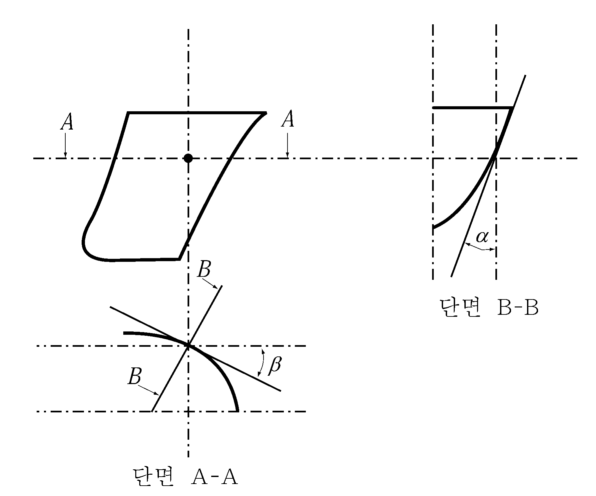
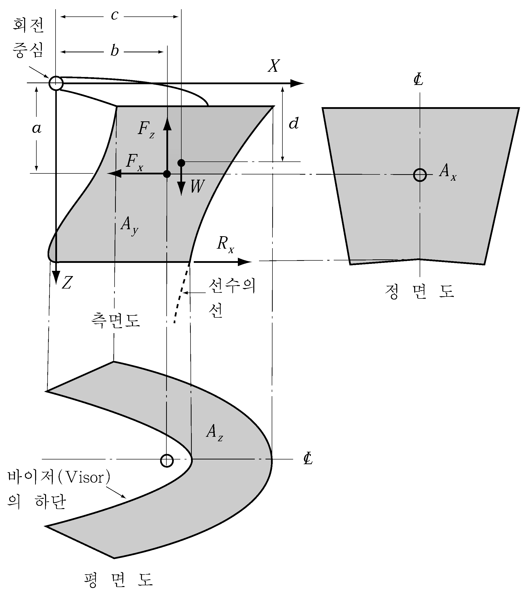

# 제4편 선체의장

> 선급 및 강선규칙/적용지침 / RA-04-K / 2025 / KO / Guidance

## 제 10 장 예인 및 계류관련 선체의장설비 및 선체지지구조

### 제 1 절 적용범위 및 정의

#### 101. 적용범위 【규칙 참조】

**규칙 4편 10장 101.**의 **7**항을 적용함에 있어서의 상세는 다음에 따른다.

- **1.** **일반사항**
  - **(1)** 적용
    이 지침은, 선박소유자, 제조자 또는 조선소(이하 “신청자”라 한다)의 신청이 있는 경우, 2009년 1월 1일 이후 인도되는 유조선 등의 선박(이하 “선박”이라 한다)에 설치되는, Oil Companies International Marine Forum (이하 “OCIMF”라 한다)의 기준에 적합한, 일점계류용 계류장치에 대하여 적용한다.
  - **(2)** 일점계류용 계류장치의 배치

    | DWT ≤ 150,000 | 150,000 < DWT |
    | --- | --- |
    |  |  |
    - **(가)** 일점계류용 계류장치는 **그림 4.10.1**과 같이 체인스토퍼, 페어리더, 페데스털롤러 및 윈치/캡스턴으로 구성된다. 다만, 윈치/캡스턴의 배치에 따라 페데스털롤러가 없을 수도 있다.
    - **(나)** 계류를 위하여 본선에는 일점 계류 구조물 또는 일점부이계류 터미널의 호저 와이어의 단부에 연결된 지름 76 mm의 표준 마모방지 체인을 끌어올리기 위한 장치를 갖추어야 한다.
    - **(다)** 마모방지체인을 일점계류용 계류장치의 구성품으로서 본선에 비치하고자 하는 경우, 마모방지체인은 **지침 4편 8장 401.**의 **3**항의 요건에 적합한 것이어야 한다.
- **2.** **설계 및 재료요건**
  - **(1)** 선수체인스토퍼

    | 재화중량(DWT) (ton) | 체인스토퍼 |   |
    | --- | --- | --- |
    | 재화중량(DWT) (ton) | 개수 | 안전사용하중(SWL) (ton) |
    | DWT ≤ 100,000 | 1 | 200 |
    | 100,000 < DWT ≤ 150,000 | 1 | 250 |
    | 150,000 < DWT | 2 | 350 |

    $\sigma _{VM} \leq \sigma _{y}$
    $\sigma _{VM}$ : 하중에 의해 계류장치의 구성품(볼트 등)에 발생하는 응력
    $\sigma _{y}$ : 사용된 재료의 허용응력($RM N/mm ^{2}$), (= $R _{eH}$)
    $R _{eH}$ : 규정된 재료의 최소항복강도($RM N/mm ^{2}$)
    - **(가)** 체인스토퍼는 스트롱포인트로서 마모방지 체인을 고정할 수 있어야 한다. 본선에 설치되는 체인스토퍼의 개수와 안전사용하중(SWL)은 **표 4.10.1**에 따른다.
    - **(나)** 체인스토퍼는 고정장치가 잠김 상태(closed position)일 때에는 마모방지 체인의 지름 76 mm의 보통 스터드링크를 고정시킬 수 있어야 하고, 풀림 상태(open position)일 때에는 마모방지 체인 및 이와 연결된 부속장치들을 자유로이 통과시킬 수 있어야 한다.
    - **(다)** 체인스토퍼는 힌지드 바(hinged bar) 형식, 폴(pawl) 형식 또는 이와 동등한 형식이어야 한다.
    - **(라)** 체인스토퍼의 고정장치가 잠김 상태인 경우에는 마모방지 체인이 풀려져 풀림 상태로 되는 것을 방지하는 구조이어야 한다. 또한 고정장치가 풀림 상태인 경우에는 작동하기 쉽고 안전해야 하며 적절히 고박되어야 한다.
    - **(마)** 체인스토퍼는 페어리더로부터 선체 안쪽으로 2.7 m 부터 3.7 m 사이에 위치하여야 하고, 페어리더와 페데스털롤러는 일렬 정렬이 될 수 있도록 위치하여야 한다.
    - **(바)** 체인스토퍼의 지지구조는 갑판의 현호나 캠버를 고려하여 수평을 맞추어야 하며, 체인스토퍼 바닥판의 전단부는 마모방지 체인이 체인스토퍼로 쉽게 들어갈 수 있도록 해야 한다.
    - **(사)** 체인스토퍼가 갑판상에 용접된 거치대에 볼트로 체결되는 경우, 볼트는 다음의 강도기준을 만족해야 한다. 다만, 규정된 안전사용하중의 2배에 해당하는 수평방향의 힘에 견딜 수 있는 유효한 스러스트 쵸크(thrust chocks)를 설치하여야 한다.
    - **(아)** 볼트의 강재등급은 **KS B ISO898-1**에서 정의하는 8.8 등급보다 작아서는 안 된다.(**KS B ISO898-1**에서 정의하는 10.9 등급을 추천한다.) 또한 볼트는 적절한 기준에 따라 예비압축(pre-stressed)을 받아야 하고 조임은 적절히 점검되어야 한다.
    - **(자)** 체인스토퍼는 **규칙 2편 1장**의 요건에 적합한 압연강재, 주강품 또는 단강품으로 제작되어야 한다. 다만, 체인스토퍼의 주요 구성부분이 다음의 요건을 만족할 경우 구상흑연주철을 사용할 수 있다.
      - **(a)** 구성부분이 조립용접부가 아닌 경우
      - **(b)** 연신율이 12% 이상인 페라이트조직의 구상흑연주철인 경우
      - **(c)** 0.2% 내력으로 항복응력이 측정되고 검사된 경우
      - **(d)** 구성부분의 내부조직에 대해 비파괴검사를 실시한 경우
    - **(차)** 폴(pawl) 또는 힌지드 바(hinged bar)와 같은 체인스토퍼의 고정장치에 사용되는 재료는 제R3종 체인케이블과 유사한 기계적 성질을 가져야 한다.
  - **(2)** 페어리더
    - **(가)** 각각의 체인스토퍼에 대해 하나의 페어리더가 설치되어야 한다.
    - **(나)** 재화중량이 150,000톤(DWT)을 넘는 선박에 대해서는 두 개의 페어리더가 설치되어야 하고 가능한 페어리더 사이의 간격은 페어리더 중심선에서 2 m이상 떨어져야 하며 3 m를 넘어서는 안 된다. 재화중량 150,000톤(DWT) 이하의 선박에 대해서는 하나의 페어리더를 선체 중심선에 설치한다.
    - **(다)** 페어리더는 통상 파나마쵸크와 같은 밀폐식(closed type)이어야 하며 입구는 마모방지 체인이나 픽업 로프 및 이와 관련된 장치들이 쉽게 통과될 수 있도록 충분히 커야한다. 페어리더 입구의 안쪽 치수는 적어도 너비 600 mm, 높이 450 mm이상이어야 한다.
    - **(라)** 페어리더의 모양은 타원형 또는 원형이어야 한다. 페어리더의 입구는 마모방지 체인이 선내로 들어올시 입구 하부와 마찰되는 것을 방지하는 구조이어야 한다. 페어리더의 굽힘 비(페어리더의 베어링 표면의 지름 대 마모방지 체인의 지름의 비)는 7:1보다 작아서는 안 된다.
    - **(마)** 페어리더는 가능한 갑판에 근접해 위치하여야 하며, 어떠한 경우에도 마모방지 체인이 체인스토퍼와 페어리더사이에서 당겨졌을 때 대체로 갑판에 평행하여야 한다.
    - **(바)** 페어리더는 **규칙 2편 1장**의 요건에 적합한 압연강재, 주강품 또는 단강품으로 제작되어야 한다.
  - **(3)** 페데스탈롤러
    - **(가)** 페데스탈롤러는 마모방지 체인을 페어리더와 체인스토퍼의 일직선상으로 연속해서 끌어당길 수 있는 위치에 설치되어야 한다. 페데스털롤러의 위치는 선수 체인스토퍼로부터 후방으로 3 m 보다 작아서는 안 된다.
    - **(나)** 페데스탈롤러는 적어도 다음의 값보다 큰 수평방향의 힘에 견디어야 한다. 수평방향의 힘에 기인한 응력의 기준은 이 지침 **2**항 (1)호 (사)에 따른다.
      - **(a)** 22.5 ton
      - **(b)** 픽업로프에서 22.5 ton의 힘으로 잡아당겼을 때의 합성력
    - **(다)** 페데스탈롤러의 지름은 픽업로프 지름의 7배 이상이어야 한다. 픽업 로프의 지름을 모를 경우, 롤러의 지름은 적어도 400 mm 이상이어야 한다.
  - **(4)** 윈치 또는 캡스턴
    - **(가)** 계류장치에 사용되는 윈치/캡스턴은 적어도 15 ton 이상의 하중을 갑판으로 끌어올릴 수 있어야 한다. 이를 위하여 윈치/캡스턴의 연속 정격 견인력은 15 ton 이상, 제동력은 22.5 ton 이상이어야 한다.
    - **(나)** 윈치의 저장드럼이 픽업로프를 적재하는 용도로 사용될 경우 지름 80 mm, 길이 150 m의 로프를 수용할 수 있는 충분한 크기이어야 한다.
- **3.** **형식시험**
  일점계류용 계류장치의 형식시험은 **제조법 및 형식승인 등에 대한 지침 3장 7-2절**의 규정에 따른다.
- **4.** **승인증서 등**
  - **(1)** 승인증서의 발급, 유효기간 및 갱신 등에 대하여는 **제조법 및 형식승인 등에 관한 지침 3장 1절**의 요건에 따른다.
  - **(2)** 일점계류용 계류장치에 사용되는 구성품들은, 이 규정의 요건을 만족하고 또한 **제조법 및 형식승인 등에 관한 지침 3장 7-1절**에 따라 우리 선급의 형식승인을 받은 선수 비상예인장치의 구성품인 경우에는, 선수 비상예인장치의 구성품으로 겸용할 수 있다.
- **5.** **일점계류용 계류장치의 구성품에 대한 기자재검사**
  우리 선급의 형식승인을 받은 일점계류용 계류장치의 구성품에 대하여 제조자로부터 기자재검사 신청이 있는 경우에는 다음 각 호에 따라 검사를 하고 기자재증서를 발급한다.
  - **(1)** 일점계류용 계류장치에 사용되는 체인스토퍼는 다음의 요건에 적합하여야 한다.
    - **(가)** 재료는 **규칙 2편 1장**에 적합하여야 하며, 치수는 승인된 도면에 따른다.
    - **(나)** 체인스토퍼의 성능은 **2**항 (1)호의 요건에 적합하여야 한다.
    - **(다)** 전면에 걸쳐 초음파탐상검사를 하여야 한다. 다만, 초음파탐상검사를 실시하기 곤란한 형상인 경우에는 자분탐상검사 등의 적절한 비파괴검사를 하여야 한다.
    - **(라)** 우리 선급의 검사에 합격한 체인스토퍼에는 안전사용하중 및 식별번호를 영구적인 방법으로 표시하여야 한다.
  - **(2)** 일점계류용 계류장치에 사용되는 페어리더는 다음의 요건에 적합하여야 한다.
    - **(가)** 재료는 **규칙 2편 1장**에 적합하여야 하며, 치수는 승인된 도면에 따른다.
    - **(나)** 페어리더의 성능은 **2**항 (2)호의 요건에 적합하여야 한다.
    - **(다)** 전면에 걸쳐 초음파탐상검사를 하여야 한다. 다만, 초음파탐상검사를 실시하기 곤란한 형상인 경우에는 자분탐상검사 등의 적절한 비파괴검사를 하여야 한다.
  - **(3)** 일점계류용 계류장치에 사용되는 페데스탈롤러 및 윈치/캡스턴은 **2**항 (3), (4)호의 요건에 적합하여야 하며, 제조자가 발행한 검사증서/성적서에 의해 확인되어야 한다.
- **6.** **일점계류용 계류장치의 본선 설치검사**
  조선소 또는 선박소유자로부터 우리 선급의 형식승인을 받은 일점계류용 계류장치의 본선 설치검사 신청이 있는 경우에는 다음에 따라 도면승인 및 검사를 하고 선체지지구조를 포함하여 적합증서를 발급한다.
  - **(1)** 신청서류
    신청자는 일점계류용 계류장치를 본선에 설치하기 전에 다음의 자료 각 3부를 우리 선급에 제출하여 승인을 받아야 한다.
    - **(가)** 승인용 자료
      - **(a)** 선수부 갑판상의 일반배치도 및 일점계류용 계류장치 배치도
      - **(b)** 선수부의 체인스토퍼, 페어리더, 페데스탈롤러의 재료사양 및 관련 계산서를 포함한 구조도면
      - **(c)** 체인스토퍼, 페어리더, 페데스탈롤러 및 윈치/캡스턴에 작용하는 하중을 지지하는 선체국부 구조도면 및 계산서
    - **(나)** 참고용 자료
      - **(a)** 윈치/캡스턴의 사양(연속 정격 견인력(continuous duty pull) 및 제동력을 포함)
      - **(b)** 하기만재흘수선에서의 재화중량(DWT)
      - **(c)** 기자재증서 및 형식시험성적서
  - **(2)** 설계 및 재료 요건
    설계 및 재료 요건에 대하여는 **2**항에 따른다.
  - **(3)** 선체 지지구조의 요건
    
    **그림 4.10.2 체인스토퍼 및 페어리더의 배치**
    - **(가)** 체인스토퍼 및 페어리더의 배치는 **그림 4.10.1** 및 **그림 4.10.2**에 따른다.
    - **(나)** 페어리더가 위치한 불워크판과 스테이는 적절히 보강되어야 한다.
    - **(다)** 체인스토퍼에 인접한 갑판구조는 갑판 거치대와 갑판 연결부를 포함하여 요구되는 안전사용하중의 2배에 해당하는 수평방향의 힘에 견딜 수 있도록 적절히 보강되어야 하며, **2**항 (1)호 (사)의 기준에 만족(순두께에 기초)하여야 한다.
    - **(라)** 스트롱포인트 및 페어리더 근처의 갑판의 최소총두께는 국부 구조강도계산으로 결정하여야 하며, 최소한 15 mm 이상이어야 한다.
    - **(마)** 체인스토퍼가 갑판에 볼트로 체결된 경우의 보강은 **2**항 (1)호 (사) 및 (아)에 따른다.
    - **(바)** 페데스탈롤러 및 윈치/캡스턴에 인접한 갑판구조 및 갑판연결부는 각각 **2**항 (3)호 (나)에서 정의한 수평방향의 힘 및 **2**항 (4)호 (가)에서 정의한 제동력에 견딜 수 있도록 보강되어야 하며 **2**항 (1)호 (사)의 강도기준을 만족하여야 한다.
  - **(4)** 본선 설치검사
    - **(가)** 우리 선급의 승인을 받은 배치도에 따라 구성품을 설치 후 지지구조를 포함하여 검사하고, **표 4.10.1**의 안전사용하중에 해당하는 내력시험하중으로 1분 이상 유지하여도 각 구성품(지지구조를 포함)은 영구변형이 없어야 한다. 다만, 다음의 경우에는 본선 설치후의 하중시험을 생략할 수 있다.
      - **(a)** 우리 선급의 형식승인을 받은 일점계류용 계류장치에 대하여 **5**항에 따라 기자재검사를 받은 경우
      - **(b)** 우리 선급의 형식승인을 받지 아니한 일점계류용 계류장치에 대하여 안전율을 2배로 한 강도계산서를 제출하고 우리 선급의 승인을 받은 경우로서 **5**항에 따라 안전사용하중에 해당하는 내력시험하중으로 기자재검사를 받은 경우
    - **(나)** 선체 지지구조에 대하여는 **6**항 (3)호의 요건에 적합하여야 한다.
    - **(다)** 선체구조로서 체인스토퍼의 주요 용접부는 100% 비파괴검사를 하여야 한다.
    - **(라)** 일점계류용 계류장치의 사용설명서 및 승인도면의 본선 비치상태를 확인하여야 한다.

### 제 2 절 예인 및 계류

#### 206. 제조후 검사 【규칙 참조】

선체의장설비, 페데스탈(pedestal) 및 선체의장설비 부근의 선체구조의 상태는 **규칙 1편 2장 202.**의 관련 규정에 따른다. 
