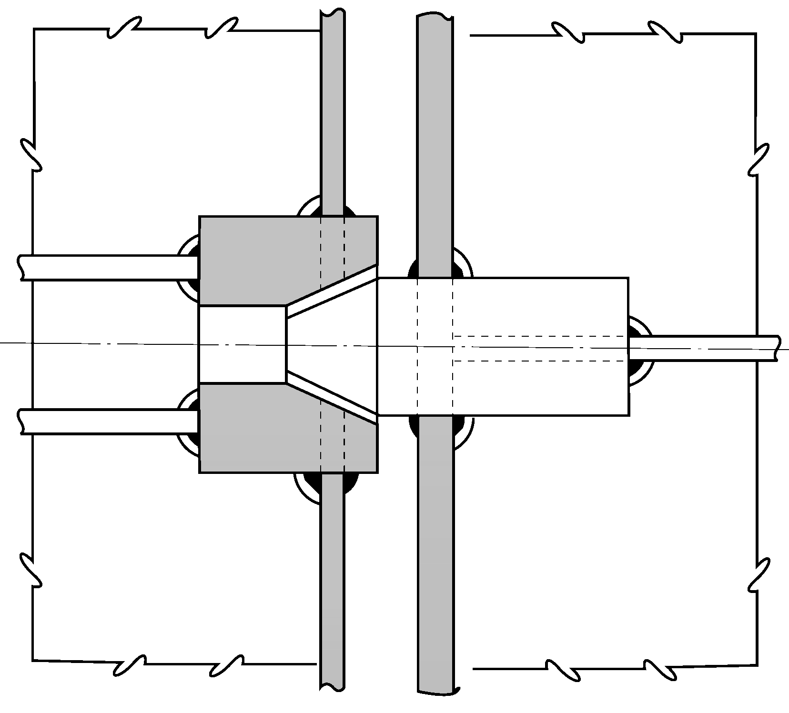
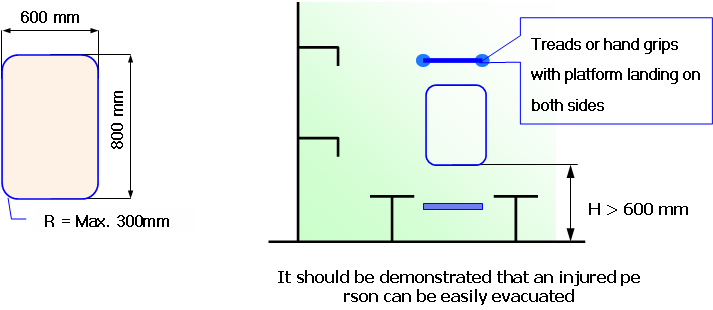

# 제4편 선체의장

> 선급 및 강선규칙/적용지침 / RA-04-K / 2025 / KO / Guidance

## 제 11 장 유조선 및 산적화물선 화물지역 내의 구역 및 전방으로의 접근

### 제 1 절 일반

#### 101. 적용 【규칙 참조】

- **1.** **규칙 101.**의 **1**항을 적용함에 있어서의 상세는 다음에 따른다.
  - **(1)** Res. MSC.151/8(78) 내용을 2005년 1월 1일 이후 건조되는(용골거치) 선박에 Res. MSC.133/4(76)을 대신하여 미리 적용 가능하다.
  - **(2)** 유조선
    이 규칙은 MARPOL 73/78의 부속서1에서 유류로 정의된 기름의 산적 운송을 위한 일체형 탱크 구조 유조선에 적용되며, 독립형 화물탱크들은 제외될 수 있다. 또한, SOLAS **Ⅱ-1, 제3-6 규칙**은 일반적으로 주관청이 별도로 정하지 않는 한 FPSO 또는 FSO에 적용하지 않는다.

#### 102. 화물 및 기타 구역으로의 접근설비 【규칙 참조】

- **1.** **규칙 102.**의 **1**항을 적용함에 있어서의 상세는 다음에 따른다.
  연료유 탱크 및 화물창 전부의 보이드 스페이스와 같이 정밀검사가 요구되지 않는 각 구역에는 선체구조의 일반적인 현상을 파악하기 위한 현상검사에 필요한 접근설비가 제공되어야 한다.
- **2.** **규칙 102.**의 **2**항을 적용함에 있어서의 상세는 다음에 따른다.
  - **(1)** 몇 가지 가능한 대체 접근설비는 **규칙 202.**의 **9**항에 기술되어 있다.
    화물유 탱크와 평형수탱크의 갑판 트랜스버스와 갑판 종늑골 등과 같은 갑판 상부 부재에 대한 현상검사, 정밀검사 및 두께계측을 위한 영구접근설비가 가지는 필요한 장비를 갖춘 무인 로봇 팔, ROV(remotely operated vehicle) 및 조종수단(dirigibles)과 같은 대체수단은 주관청으로부터 동등한 것으로 인정받는 것을 조건으로 다음 사항이 가능해야 한다.
    - 가스가 제거된 잔유물이 있는 구역에서 안전하게 작동
    - 갑판 개구로부터 해당 장소로의 직접적인 접근
    **3 . 규 칙 102.**의 **3**항을 적용함에 있어서의 상세는 다음에 따른다.
  - **(1)** 검사
    휴대식 장비 및 부착물을 포함한 접근설비의 배치는 선원 또는 자격 있는 검사자에 의해 매년 검사받아야 하며, 검사는 선체구조 접근지침서(Ships Structure Access Manual) 2편에 기록되어야 한다. 또한. 상설접근설비(permanent means of access : PMA)를 활용한 구역의 검사를 수행하기 이전에, PMA의 상태를 확인하기 위한 조사가 각 구역 별로 기록되어야 한다. *(2025)*
  - **(2)** 절차
    - **(가)** 접근설비를 사용하는 위임 받은 사람은 검사자(inspector)의 자격으로 접근설비를 사용하기 전에 손상여부에 대해 점검하여야 한다. 접근설비를 사용하는 동안, 검사자는 사용하는 단면에 대한 정밀한 검사를 통하여 단면의 상태를 확인해야 하며, 설비상의 악화상태(deterioration)에 주목하여야 한다. 손상이나 악화상태가 발견되면, 도장의 감소 및 쇠모를 포함한 악화가 접근설비의 지속적인 사용에 대한 안전에 영향을 미칠지 여부에 대해 평가해야 한다. 안전한 사용에 영향을 미칠 것으로 생각되는 악화상태는 심각한 손상(substantial damage)으로 간주되어야 하고 이의 영향을 받는 부분이 유효한 수리 전에 사용되지 않도록 적절한 조치가 취해져야 한다. 심각한 손상은 선체구조 접근지침서 2편에 기록되어야 한다. *(2025)*
    - **(나)** 접근설비를 포함한 구역에 대한 협약 검사는 해당 구역의 접근설비의 지속적인 유효성에 대한 검증을 포함해야 한다. 접근설비에 대한 검사는 수행하는 검사의 범위와 범주를 넘지 말아야한다. 만일 접근설비에서 결함이 발견되면, 검사 범위는 적절하다고 생각되는 범위까지 확장되어야 한다.
    - **(다)** 모든 검사 기록은 선박안전관리체제(Ships Safety Management System)에 상술된 요건에 따라 작성되어야 한다. 접근설비를 사용하는 사람이 이 기록을 쉽게 이용할 수 있어야 하고 접근설비 매뉴얼(means of access manual)에 한 부를 첨부하여야 한다. 검사한 접근설비 부분에 대한 최신 기록은 최소한 검사일, 검사자 이름 및 직함, 확인 서명, 검사된 접근설비 부위, 지속적인 사용 상태에 대한 확인 또는 발견된 악화상태 또는 심각한 손상에 대한 상세 및 수리내용 등을 포함하여야 한다. 발행된 증명서 서류철은 검증을 위하여 유지되어야 한다. 발행된 증명서 서류철은 검증을 위하여 유지되어야 한다. 상설접근설비에 대한 점검 기록은 검사 전에 검사원에게 제공되어야 한다. *(2025)*

#### 103. 화물창, 화물탱크, 평형수탱크 및 기타 구역으로의 안전한 접근 【규칙 참조】

**1 . 규 칙 103.**의 **1**항을 적용함에 있어서의 상세는 다음에 따른다.

#### 104. 선체구조 접근지침서 【규칙 참조】

- **1.** **규칙 104.**의 **1**항을 적용함에 있어서 접근지침서는 SOLAS 제II-1장 제3-6규칙의 3항에 열거된 구역을 명기하여야 하며, 최소한 영역본이 제공되어야 한다.
  선체구조접근지침서는 적어도 다음의 두 부분을 포함하여야 한다.
  1편 : SOLAS 3-6규칙의 4.1.1에서 4.1.7까지 요구되는 도면, 지침 및 재고 목록
  1편은 주관청이나 주관청이 인정한 기구에 의해 승인되어야 한다.
  2편 : 검사, 유지 및 건조 후 추가 및 교체로 인한 휴대 장비의 재고 변화의 기록을 위한 양식. 2편은 건조 시에 양식에 대해서만 승인받아야 한다.
  선체구조접근지침서는 다음 사항을 명기하여야 한다.
  - **(1)** 접근지침서는 선원, 검사원, 항만국 검사관의 사용을 위하여 규칙에서 규정한 범위를 명확하게 포함하여야 한다.
  - **(2)** 지침서의 승인 재승인 절차, 즉, 규칙 및 기술규정의 범위 내의 영구적, 휴대식, 이동식 또는 대체 접근설비의 변경시 주관청 또는 주관청이 인정한 기구에 의해 검토 및 승인을 받아야 한다.
  - **(3)** 협약 검사를 받는 구역에서 접근설비에 대한 지속적인 유효성의 확인은 SC 검사의 일부가 되어야 한다.
  - **(4)** 정기적 검사 및 관리의 일환으로 선원 및 회사의 자격 있는 검사자에 의한 접근설비의 검사
  - **(5)** 접근설비의 사용에 있어 불안전함이 발견되었을 때 취해야 할 조치 사항
  - **(6)** 휴대식 장비를 사용할 경우, 접근설비에 대해 구역의 어느 장소부터 어떻게 검사 가능한지를 나타내는 도면
- **2.** **규칙 104.**의 **2**항을 적용함에 있어서의 상세는 다음에 따른다.
  - **(1)** 취약구조지역은 구조 강도 및 피로에 대한 진보된 계산법에 의해 식별되어야 하며, 가능하면 유사선박 또는 동형선의 운항 기록 및 설계 발전으로부터 피드백 되어야 한다.
  - **(2)** 취약구조지역에 대해서는 다음의 인쇄물을 참고하여야 한다.
    - 유조선 : Guidance Manual for Tanker Structures by TSCF
    - 산적화물선 : Bulk Carriers Guidelines for Surveys,
    Assessment and Repair of Hull Structure by IACS
    - 유조선과 산적화물선 : ESP Code

#### 105. 일반 기술사양 【규칙 참조】

- **1.** **규칙 105.**의 **1**항을 적용함에 있어서의 상세는 다음에 따른다.
  최소개구치수 600 mm × 600 mm의 최대 코너 반경은 100 mm이다. MSC 문서 MSC/Circ.686에서 개구의 크기는 호흡장구를 착용한 사람의 통행에 적당한 크기를 유지해야 한다고 규정한다. 주어진 설계에 대한 구조해석의 결과에서 개구 주위 응력이 감소되어야 할 경우, 증가된 코너 반경을 가진 규정 크기 이상의 개구에 대해서는 응력 감소를 위한 적절한 조치로 인정한다. 즉 최대 코너 반경이 100 mm인 600 mm × 600 mm인 개구부에 대해 코너 반경이 300 mm인 600 mm × 800 mm의 개구는 동등한 것으로 인정가능하다.
- **2.** **규칙 105.**의 **2**항을 적용함에 있어서의 상세는 다음에 따른다.
  - **(1)** 최소개구치수 600 mm × 800 mm의 최대 코너 반경은 300 mm이다. 이중저 탱크 내의 거더나 늑판 부위와 같이 구조 강도상 커다란 개구 설치가 바람직하지 못한 경우, 높이 600 mm × 폭 800 mm인 개구를 인정할 수 있다.
  - **(2)** 부상자를 들것으로 신속히 이송할 수 있다는 조건하에, 코너 반경 300 mm인 600 mm × 800 mm 수직개구 대신에 총 높이가 850 mm 이상인 개구에서 하부가 600 mm 미만일지라도 개구의 상부의 폭이 600 mm 이상인 850 mm × 620 mm 인 수직개구를 인정할 수 있다.
    
  - **(3)** 바닥으로부터 개구까지의 높이가 600 mm를 넘는 경우 발판 및 손잡이가 제공되어야 한다. 이런 배치는 부상자를 쉽게 이송할 수 있음이 증명되어야 한다.

### 제 2 절 접근설비에 대한 기술조항

#### 201. 용어 정의 【규칙 참조】

**1 . 규 칙 201.**의 **1**항을 적용함에 있어서의 상세는 다음에 따른다.

#### 202. 기술 조항 【규칙 참조】

**1 . 규 칙 202.**의 **1**항을 적용함에 있어서 구역(space)의 영구 접근설비는 검사용 영구 접근설비으로 인정될 수 있다.

- **7.** **규칙 202.**의 **9**항 (6)호를 적용함에 있어서 만약 사다리의 상부가 전/후 및 측면 움직임을 막을 수 있다면 사다리의 상부를 고정하기 위한 후크와 같은 기계적 장치는 적당한 고정 장치로 간주된다. (7)호의 “우리 선급이 인정하는 기타의 설비”라 함은 **규칙 1편 1장 105.**에 따라 승인되거나 (1)호부터 (6)호의 수단과 동등하다고 인정되는 설비를 말한다.
- **8.** **규칙 202.**의 **10**항 및 **11**항을 적용함에 있어서의 상세는 **지침 105.**의 **1**항 및 **2**항을 참조한다.
  
  
- **9.** **규칙 202.**의 **13**항을 적용함에 있어서의 상세는 다음에 따른다.
  - **(1)** 갑판으로부터 화물창 바닥까지의 수직 거리가 6 m 이하일 경우, 화물창 출입을 위하여 수직사다리, 경사사다리 또는 혼합된 사다리가 사용될 수 있다.
    
  - **(2)** 인접한 수직사다리는 다음의 규정을 만족하여야 한다.

    **연결 플랫폼을 관통하여 수직사다리가 설치된 경우** 

    | 치수 A ; 2개의 수직사다리 프레임간의 수평 간격 ; $\geq 200 \mathrm{mm}$ B ; 랜딩 플랫폼이나 중간 플랫폼 상방의 사다리 프레임 높이 ; $\geq 1500 * \mathrm{mm}$ C ; 사다리와 플랫폼간의 수평 간격 ; $rm 100 mm \leq C <300 mm$ *: 휴식용 플랫폼의 핸드레일의 높이는 최소한 1000 mm 여야 한다. 치수 A 2개의 수직사다리 프레임간의 수평 간격 $\geq 200 \mathrm{mm}$ B 랜딩 플랫폼이나 중간 플랫폼 상방의 사다리 프레임 높이 $\geq 1500 * \mathrm{mm}$ C 사다리와 플랫폼간의 수평 간격 $rm 100 mm \leq C <300 mm$ *: 휴식용 플랫폼의 핸드레일의 높이는 최소한 1000 mm 여야 한다. |   |   |
    | --- | --- | --- |
    | 치수 |   |   |
    | A | 2개의 수직사다리 프레임간의 수평 간격 | $\geq 200 \mathrm{mm}$ |
    | B | 랜딩 플랫폼이나 중간 플랫폼 상방의 사다리 프레임 높이 | $\geq 1500 * \mathrm{mm}$ |
    | C | 사다리와 플랫폼간의 수평 간격 | $rm 100 mm \leq C <300 mm$ |
    | *: 휴식용 플랫폼의 핸드레일의 높이는 최소한 1000 mm 여야 한다. |   |   |

    **연결 플랫폼의 측면에 수직사다리가 설치된 경우** 

    | 치수 A ; 2개의 수직사다리 프레임간의 수평 간격 ; $RM \geq 200 mm$ B ; 랜딩 플랫폼이나 중간 플랫폼 상방의 사다리 프레임 높이 ; $\mathrm{\geq } 1500 * mm$ C ; 사다리와 플랫폼간의 수평 간격 ; $rm 100 mm \leq C <300 mm$ *: 휴식용 플랫폼의 핸드레일의 높이는 최소한 1000 mm 여야 한다. 치수 A 2개의 수직사다리 프레임간의 수평 간격 $RM \geq 200 mm$ B 랜딩 플랫폼이나 중간 플랫폼 상방의 사다리 프레임 높이 $\mathrm{\geq } 1500 * mm$ C 사다리와 플랫폼간의 수평 간격 $rm 100 mm \leq C <300 mm$ *: 휴식용 플랫폼의 핸드레일의 높이는 최소한 1000 mm 여야 한다. |   |   |
    | --- | --- | --- |
    | 치수 |   |   |
    | A | 2개의 수직사다리 프레임간의 수평 간격 | $RM \geq 200 mm$ |
    | B | 랜딩 플랫폼이나 중간 플랫폼 상방의 사다리 프레임 높이 | $\mathrm{\geq } 1500 * mm$ |
    | C | 사다리와 플랫폼간의 수평 간격 | $rm 100 mm \leq C <300 mm$ |
    | *: 휴식용 플랫폼의 핸드레일의 높이는 최소한 1000 mm 여야 한다. |   |   |
    - **(가)** 상부 수직사다리와 하부 수직사다리는 최소한 횡방향으로 200 mm 떨어져 설치하여야 하며, 간격은 각 사다리 프레임 두께의 중간에서 측정한다.
    - **(나)** 사다리간의 안전한 이동을 위하여 하부사다리의 상부 끝단과 상부사다리의 하부 끝단이 1500 mm 겹치도록 설치하여야 한다.
    - **(다)** 접근용사다리는 접근용 개구 위에서 직접 또는 부분적으로 끊어져서는 안 된다.
- **10.** **규칙 202.**의 **14**항을 적용함에 있어서 “갑판”이란 풍우밀 갑판을 말하며 상세는 다음에 따른다.
  

#### 203. 방식(부식방지)조치 【규칙 참조】

**규칙 203.**을 적용함에 있어서의 상세는 다음에 따른다.

- **1.** 모든 선박의 해수전용 평형수탱크와 산적화물선의 이중선측공간에 설치되는 접근설비
  - **(1)** 접근설비가 구조강도요소의 한 부분으로서 선체구조와 일체로 간주되는 경우에는 IMO Res. MSC 215(82) 보호도장 성능기준(PSPC : Performance Standard for Protective Coatings)에 따라 방식조치를 하여야 한다.
  - **(2)** 접근설비가 구조강도요소의 한 부분으로 간주되지 않는 경우에는 다음에 따라 방식조치를 하여야 한다.
    - **(가)** 사다리, 레일, 발판 등 접근설비의 소재는 용융아연도금(hot dip galvanizing) 처리된 것이어야 한다. 용융아연도금 및 보수방법은 KS D ISO 1461(철강 구조물 상의 용융 아연과 아연-철 합금 도금 및 시험방법)에 따른다.
    - **(나)** 아연도금 처리된 접근설비의 소재에 대하여는 KS M ISO 12944-5(도료와 바니시-방식 도료시스템에 의한 강철 구조물의 부식방지-제5부:방식 도료 시스템) 또는 도료 제조자의 추천에 따라 보호도장을 시공한다.
    - **(다)** 아연도금처리를 하지 않고 보호도장만을 시공하는 경우에는 가능한 범위까지 IMO Res. MSC 215(82) 보호도장 성능기준을 적용하여야 하며, 최소한 시공기준, 도장시스템(에폭시계 시스템) 및 총 건도막두께(320μm)에 대한 요건을 만족하여야 한다.
- **2.** 보이드 구역(void space)에 설치되는 접근설비
  - **(1)** 접근설비가 구조강도요소의 한 부분으로서 선체구조와 일체로 간주되는 경우에는 IMO Res. MSC 244(83), “보이드 구역에 대한 보호도장 성능기준”에 따라 방식조치를 하여야 한다.
  - **(2)** 접근설비가 구조강도요소의 한 부분으로 간주되지 않는 경우에는 다음에 따라 방식조치를 하여야 한다.
    - **(가)** 접근설비의 소재는 용융아연도금(hot dip galvanizing) 처리된 것이어야 하며 또한 도료 제조자의 추천에 따라 보호도장을 시공하여야 한다.
    - **(나)** 아연도금처리를 하지 않고 보호도장만을 시공하는 경우에는 가능한 범위까지 IMO Res. MSC 244(83) “보이드 구역에 대한 보호도장 성능기준“을 적용하여야 하며, 최소한 도장시스템(에폭시계 시스템) 및 총 건도막두께(200μm)에 대한 요건을 만족하여야 한다. 
